# BswM × ComM × CanSM × NM 四模块交互详解

---

## 一、通俗理解 — 一个"出租车调度系统"的类比

### 1.1 生活类比

想象一个**出租车调度中心**，管理着一座城市的出租车运营：

| 调度中心角色 | AUTOSAR 模块 |
|-------------|-------------|
| **总调度台 (BswM)** | 负责全局策略，决定"什么时候该做什么" |
| **区域调度员 (ComM)** | 负责"通信需求"的汇总与仲裁——谁需要用车 |
| **车队队长 (CanSM)** | 管理 CAN 总线这个"车队"的启停、休眠与唤醒 |
| **GPS 跟踪系统 (NM)** | 监控每辆车的"在线状态"并进行同步协调 |

**一个典型的运营场景：**

```
1. 早晨 6:00 → 总调度台(BswM)决定："开始运营"
2. → 通知区域调度员(ComM)："启动通信"
3. → 区域调度员(ComM)确认有运营需求
4. → 通知车队队长(CanSM)："启动车队！"
5. → 车队队长(CanSM)唤醒所有车辆，启动 CAN 总线
6. → GPS 系统(NM)开始监控每辆车的在线状态
7. → 所有车辆就绪，城市开始正常运营

深夜 23:00 → 反向流程：停止运营 → 车辆回库 → 总线休眠
```

**紧急事件场景：**

```
运营中发生紧急事件(如故障/诊断)：
1. GPS(NM)监测到异常 → 区域调度员(ComM)收到通知
2. → 总调度台(BswM)仲裁："暂停部分运营！"
3. → 通知车队队长(CanSM)调整为静默模式
4. → 部分车辆保持静默(只收不发)，等待进一步指令
```

### 1.2 一句话概括

> **BswM 是决策大脑，ComM 是通信需求汇总器，CanSM 是 CAN 总线的直接操控者，NM 是网络状态的巡检员**。四个模块构成了 AUTOSAR 通信栈的"决策-调度-执行-监控"完整闭环。

---

## 二、四模块概述与职责边界

### 2.1 模块职责全景

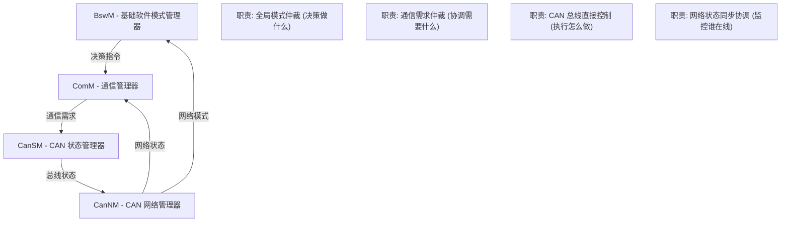
```mermaid
graph TB
    %% ===== 决策层 =====
    BSWM["BswM - 基础软件模式管理器"]
    BSWM_DESC["职责: 全局模式仲裁 (决策做什么)"]

    %% ===== 调度层 =====
    COMM["ComM - 通信管理器"]
    COMM_DESC["职责: 通信需求仲裁 (协调需要什么)"]

    %% ===== 执行层 =====
    CANSM["CanSM - CAN 状态管理器"]
    CANSM_DESC["职责: CAN 总线直接控制 (执行怎么做)"]

    %% ===== 监控层 =====
    NM["CanNM - CAN 网络管理器"]
    NM_DESC["职责: 网络状态同步协调 (监控谁在线)"]

    %% ===== 连接关系 =====
    BSWM -->|决策指令| COMM
    COMM -->|通信需求| CANSM
    CANSM -->|总线状态| NM
    NM -->|网络状态| COMM
    NM -->|网络模式| BSWM
```

### 2.2 各模块职责边界

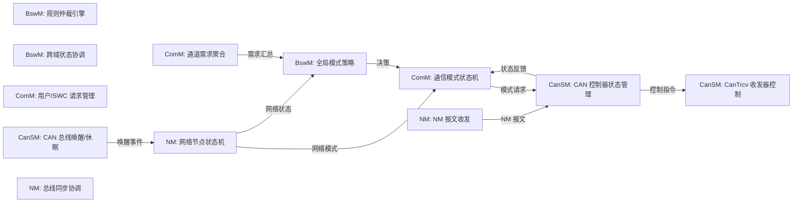
```mermaid
graph LR
    %% --- BswM 模块 ---
    B1["BswM: 全局模式策略"]
    B2["BswM: 规则仲裁引擎"]
    B3["BswM: 跨域状态协调"]

    %% --- ComM 模块 ---
    C1["ComM: 通信模式状态机"]
    C2["ComM: 通道需求聚合"]
    C3["ComM: 用户/SWC 请求管理"]

    %% --- CanSM 模块 ---
    S1["CanSM: CAN 控制器状态管理"]
    S2["CanSM: CanTrcv 收发器控制"]
    S3["CanSM: CAN 总线唤醒/休眠"]

    %% --- NM 模块 ---
    N1["NM: 网络节点状态机"]
    N2["NM: NM 报文收发"]
    N3["NM: 总线同步协调"]

    %% --- 连接关系 ---
    B1 -->|决策| C1
    C2 -->|需求汇总| B1
    C1 -->|模式请求| S1
    S1 -->|控制指令| S2
    S1 -->|状态反馈| C1
    S3 -->|唤醒事件| N1
    N2 -->|NM 报文| S1
    N1 -->|网络模式| C1
    N1 -->|网络状态| B1
```

### 2.3 各模块的关键状态机

#### BswM 关键状态（简化）

```
BSWM_INIT → BSWM_RUNNING → BSWM_SHUTDOWN
                 ↕
           (持续仲裁循环)
```

#### ComM 关键状态

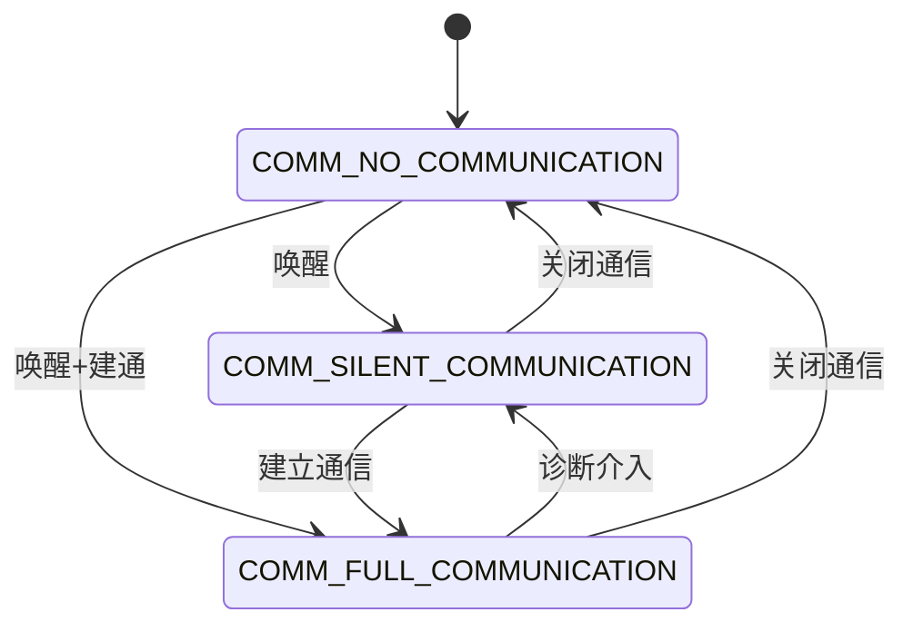
```mermaid
stateDiagram-v2
    [*] --> COMM_NO_COMMUNICATION
    COMM_NO_COMMUNICATION --> COMM_SILENT_COMMUNICATION: 唤醒
    COMM_NO_COMMUNICATION --> COMM_FULL_COMMUNICATION: 唤醒+建通
    COMM_SILENT_COMMUNICATION --> COMM_FULL_COMMUNICATION: 建立通信
    COMM_FULL_COMMUNICATION --> COMM_SILENT_COMMUNICATION: 诊断介入
    COMM_FULL_COMMUNICATION --> COMM_NO_COMMUNICATION: 关闭通信
    COMM_SILENT_COMMUNICATION --> COMM_NO_COMMUNICATION: 关闭通信
```

#### CanSM 关键状态

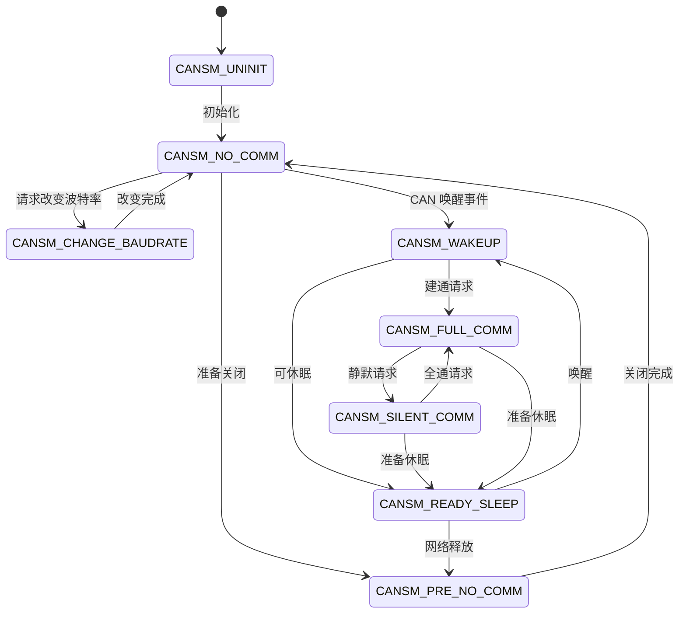
```mermaid
stateDiagram-v2
    [*] --> CANSM_UNINIT
    CANSM_UNINIT --> CANSM_NO_COMM: 初始化

    CANSM_NO_COMM --> CANSM_PRE_NO_COMM: 准备关闭
    CANSM_PRE_NO_COMM --> CANSM_NO_COMM: 关闭完成

    CANSM_NO_COMM --> CANSM_CHANGE_BAUDRATE: 请求改变波特率
    CANSM_CHANGE_BAUDRATE --> CANSM_NO_COMM: 改变完成

    CANSM_NO_COMM --> CANSM_WAKEUP: CAN 唤醒事件
    CANSM_WAKEUP --> CANSM_READY_SLEEP: 可休眠
    CANSM_WAKEUP --> CANSM_FULL_COMM: 建通请求

    CANSM_FULL_COMM --> CANSM_SILENT_COMM: 静默请求
    CANSM_SILENT_COMM --> CANSM_FULL_COMM: 全通请求
    CANSM_SILENT_COMM --> CANSM_READY_SLEEP: 准备休眠
    CANSM_FULL_COMM --> CANSM_READY_SLEEP: 准备休眠

    CANSM_READY_SLEEP --> CANSM_PRE_NO_COMM: 网络释放
    CANSM_READY_SLEEP --> CANSM_WAKEUP: 唤醒
```

#### NM 关键状态

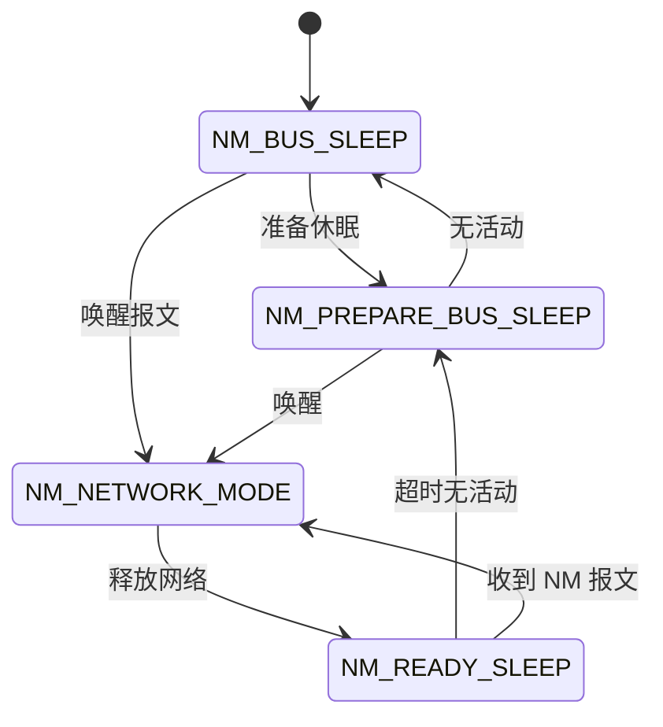
```mermaid
stateDiagram-v2
    [*] --> NM_BUS_SLEEP

    NM_BUS_SLEEP --> NM_PREPARE_BUS_SLEEP: 准备休眠
    NM_PREPARE_BUS_SLEEP --> NM_BUS_SLEEP: 无活动

    NM_BUS_SLEEP --> NM_NETWORK_MODE: 唤醒报文
    NM_PREPARE_BUS_SLEEP --> NM_NETWORK_MODE: 唤醒

    NM_NETWORK_MODE --> NM_READY_SLEEP: 释放网络
    NM_READY_SLEEP --> NM_PREPARE_BUS_SLEEP: 超时无活动
    NM_READY_SLEEP --> NM_NETWORK_MODE: 收到 NM 报文
```

---

## 三、模块间的接口关系

### 3.1 接口依赖全景图

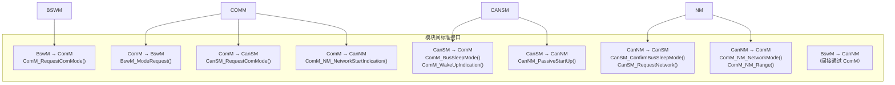
```mermaid
graph TB
    subgraph "模块间标准接口"
        BSWM2COMM["BswM → ComM<br/>ComM_RequestComMode()"]
        COMM2BSWM["ComM → BswM<br/>BswM_ModeRequest()"]

        COMM2CANSM["ComM → CanSM<br/>CanSM_RequestComMode()"]
        CANSM2COMM["CanSM → ComM<br/>ComM_BusSleepMode()<br/>ComM_WakeUpIndication()"]

        CANSM2NM["CanSM → CanNM<br/>CanNM_PassiveStartUp()"]
        NM2CANSM["CanNM → CanSM<br/>CanSM_ConfirmBusSleepMode()<br/>CanSM_RequestNetwork()"]

        COMM2NM["ComM → CanNM<br/>ComM_NM_NetworkStartIndication()"]
        NM2COMM["CanNM → ComM<br/>ComM_NM_NetworkMode()<br/>ComM_NM_Range()"]

        BSWM2NM["BswM → CanNM<br/>（间接通过 ComM）"]
    end

    BSWM --> BSWM2COMM
    COMM --> COMM2BSWM
    COMM --> COMM2CANSM
    COMM --> COMM2NM
    CANSM --> CANSM2COMM
    CANSM --> CANSM2NM
    NM --> NM2CANSM
    NM --> NM2COMM
```

### 3.2 接口函数详细说明

#### BswM ↔ ComM 接口

| 函数 | 方向 | 说明 |
|------|------|------|
| `ComM_RequestComMode(Channel, Mode)` | BswM → ComM | BswM 仲裁后，请求 ComM 设置通信模式 |
| `BswM_ModeRequest(ChannelId, Mode)` | ComM → BswM | ComM 向 BswM 报告通信状态变化（如总线睡眠） |
| `ComM_GetCurrentComMode(Channel)` | BswM → ComM | BswM 查询当前通信模式 |
| `ComM_GetMaxComMode(Channel)` | BswM → ComM | BswM 查询当前最大允许通信模式 |

#### ComM ↔ CanSM 接口

| 函数 | 方向 | 说明 |
|------|------|------|
| `CanSM_RequestComMode(Controller, Mode)` | ComM → CanSM | ComM 请求 CanSM 设置指定控制器的模式 |
| `CanSM_GetCurrentComMode(Controller)` | ComM → CanSM | ComM 查询当前 CAN 控制器模式 |
| `ComM_BusSleepMode(Controller)` | CanSM → ComM | CanSM 通知 ComM 总线已进入休眠模式 |
| `ComM_WakeUpIndication(Controller, Src)` | CanSM → ComM | CanSM 通知 ComM 总线唤醒事件 |
| `ComM_PreRunModeIndication(Controller)` | CanSM → ComM | CanSM 通知 ComM 总线准备运行 |

#### CanSM ↔ CanNM 接口

| 函数 | 方向 | 说明 |
|------|------|------|
| `CanNM_PassiveStartUp(Controller)` | CanSM → CanNM | CanSM 通知 CanNM 网络启动（被动唤醒） |
| `CanSM_ConfirmBusSleepMode(Controller)` | CanNM → CanSM | CanNM 确认总线可以进入休眠 |
| `CanSM_RequestNetwork(Controller)` | CanNM → CanSM | CanNM 请求恢复网络通信（检测到 NM 报文） |
| `CanNM_NetworkStartIndication(Controller)` | CanNM → CanSM | 网络启动指示（可选） |

#### ComM ↔ CanNM 接口

| 函数 | 方向 | 说明 |
|------|------|------|
| `ComM_NM_NetworkStartIndication(Channel)` | ComM → CanNM | ComM 通知 CanNM 网络可以启动 |
| `CanNM_NetworkMode(Channel, Mode)` | CanNM → ComM | CanNM 通知 ComM 当前的网络模式 |
| `CanNM_NetworkRange(Channel, Range)` | CanNM → ComM | CanNM 通知 ComM 网络范围(本地/全局) |

### 3.3 接口调用的权限层级

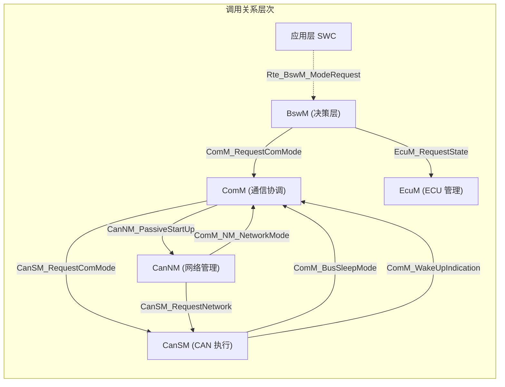
```mermaid
graph BT
    subgraph "调用关系层次"
        L3["应用层 SWC"]
        L2["BswM (决策层)"]
        L1_1["ComM (通信协调)"]
        L1_2["EcuM (ECU 管理)"]
        L0_1["CanSM (CAN 执行)"]
        L0_2["CanNM (网络管理)"]
    end

    L3 -.->|Rte_BswM_ModeRequest| L2
    L2 -->|ComM_RequestComMode| L1_1
    L2 -->|EcuM_RequestState| L1_2
    L1_1 -->|CanSM_RequestComMode| L0_1
    L1_1 -->|CanNM_PassiveStartUp| L0_2
    L0_2 -->|CanSM_RequestNetwork| L0_1
    L0_2 -->|ComM_NM_NetworkMode| L1_1
    L0_1 -->|ComM_BusSleepMode| L1_1
    L0_1 -->|ComM_WakeUpIndication| L1_1
```

---

## 四、核心交互场景 — 从休眠到全通信的完整旅程

### 4.1 场景一：ECU 上电 → 全通信建立（冷启动）

这是最经典的用户场景：ECU 上电后，CAN 通信从无到有的完整流程。

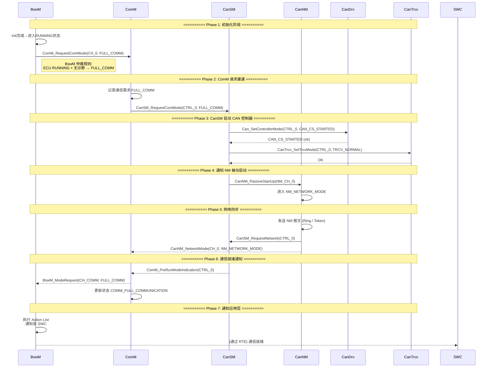
```mermaid
sequenceDiagram
    participant BswM as BswM
    participant ComM as ComM
    participant CanSM as CanSM
    participant CanNM as CanNM
    participant CanDrv as CanDrv
    participant CanTrcv as CanTrcv

    Note over BswM,CanTrcv: ========== Phase 1: 初始化阶段 ==========
    BswM->>BswM: Init完成→进入RUNNING状态
    BswM->>ComM: ComM_RequestComMode(CH_0, FULL_COMM)
    Note right of BswM: BswM 仲裁规则:<br/>ECU RUNNING + 无诊断 → FULL_COMM

    Note over BswM,CanTrcv: ========== Phase 2: ComM 请求建通 ==========
    ComM->>ComM: 记录通信需求:FULL_COMM
    ComM->>CanSM: CanSM_RequestComMode(CTRL_0, FULL_COMM)

    Note over BswM,CanTrcv: ========== Phase 3: CanSM 启动 CAN 控制器 ==========
    CanSM->>CanDrv: Can_SetControllerMode(CTRL_0, CAN_CS_STARTED)
    CanDrv-->>CanSM: CAN_CS_STARTED (ok)
    CanSM->>CanTrcv: CanTrcv_SetTrcvMode(CTRL_0, TRCV_NORMAL)
    CanTrcv-->>CanSM: OK

    Note over BswM,CanTrcv: ========== Phase 4: 通知 NM 被动启动 ==========
    CanSM->>CanNM: CanNM_PassiveStartUp(NM_CH_0)
    CanNM->>CanNM: 进入 NM_NETWORK_MODE

    Note over BswM,CanTrcv: ========== Phase 5: 网络同步 ==========
    CanNM->>CanNM: 发送 NM 报文 (Ring / Token)
    CanNM->>CanSM: CanSM_RequestNetwork(CTRL_0)
    CanNM-->>ComM: CanNM_NetworkMode(CH_0, NM_NETWORK_MODE)

    Note over BswM,CanTrcv: ========== Phase 6: 通信就绪通知 ==========
    CanSM-->>ComM: ComM_PreRunModeIndication(CTRL_0)
    ComM-->>BswM: BswM_ModeRequest(CH_COMM, FULL_COMM)
    ComM->>ComM: 更新状态 COMM_FULL_COMMUNICATION

    Note over BswM,CanTrcv: ========== Phase 7: 通知应用层 ==========
    BswM->>BswM: 执行 Action List<br/>通知各 SWC
    BswM-->>SWC: (通过 RTE) 通信就绪
```

### 4.2 场景二：CAN 总线唤醒（被动唤醒）

ECU 已经初始化但总线处于休眠状态，收到 CAN 报文唤醒。

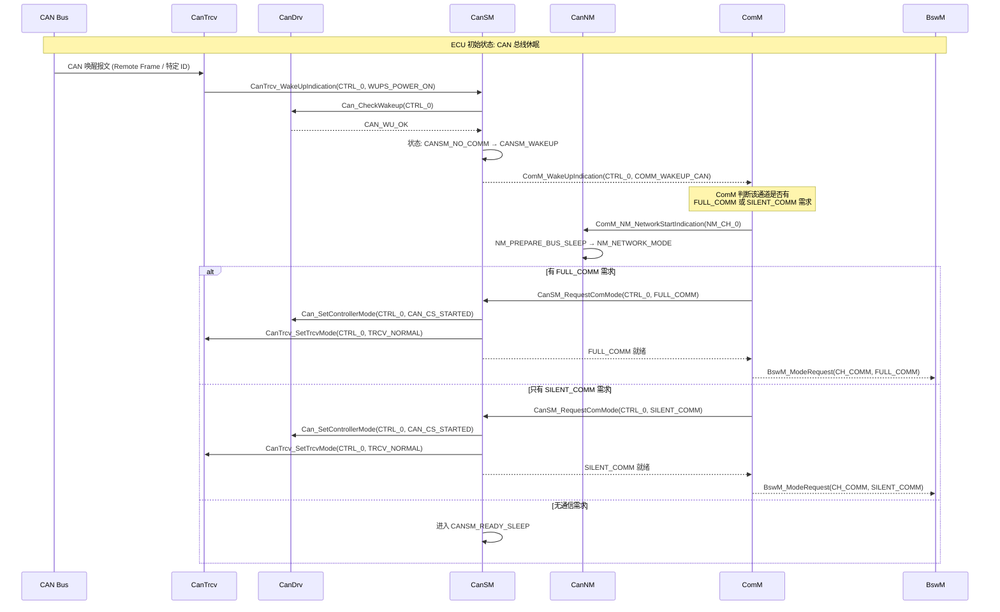
```mermaid
sequenceDiagram
    participant Bus as CAN Bus
    participant CanTrcv as CanTrcv
    participant CanDrv as CanDrv
    participant CanSM as CanSM
    participant CanNM as CanNM
    participant ComM as ComM
    participant BswM as BswM

    Note over Bus,BswM: ECU 初始状态: CAN 总线休眠

    Bus->>CanTrcv: CAN 唤醒报文 (Remote Frame / 特定 ID)
    CanTrcv->>CanSM: CanTrcv_WakeUpIndication(CTRL_0, WUPS_POWER_ON)
    CanSM->>CanDrv: Can_CheckWakeup(CTRL_0)

    CanDrv-->>CanSM: CAN_WU_OK
    CanSM->>CanSM: 状态: CANSM_NO_COMM → CANSM_WAKEUP

    CanSM-->>ComM: ComM_WakeUpIndication(CTRL_0, COMM_WAKEUP_CAN)

    Note over ComM: ComM 判断该通道是否有<br/>FULL_COMM 或 SILENT_COMM 需求

    ComM->>CanNM: ComM_NM_NetworkStartIndication(NM_CH_0)
    CanNM->>CanNM: NM_PREPARE_BUS_SLEEP → NM_NETWORK_MODE

    alt 有 FULL_COMM 需求
        ComM->>CanSM: CanSM_RequestComMode(CTRL_0, FULL_COMM)
        CanSM->>CanDrv: Can_SetControllerMode(CTRL_0, CAN_CS_STARTED)
        CanSM->>CanTrcv: CanTrcv_SetTrcvMode(CTRL_0, TRCV_NORMAL)
        CanSM-->>ComM: FULL_COMM 就绪
        ComM-->>BswM: BswM_ModeRequest(CH_COMM, FULL_COMM)
    else 只有 SILENT_COMM 需求
        ComM->>CanSM: CanSM_RequestComMode(CTRL_0, SILENT_COMM)
        CanSM->>CanDrv: Can_SetControllerMode(CTRL_0, CAN_CS_STARTED)
        CanSM->>CanTrcv: CanTrcv_SetTrcvMode(CTRL_0, TRCV_NORMAL)
        CanSM-->>ComM: SILENT_COMM 就绪
        ComM-->>BswM: BswM_ModeRequest(CH_COMM, SILENT_COMM)
    else 无通信需求
        CanSM->>CanSM: 进入 CANSM_READY_SLEEP
    end
```

### 4.3 场景三：网络管理同步 — NM 协调多个节点

在有 NM 的系统中，多个 ECU 通过 NM 报文协调睡眠：

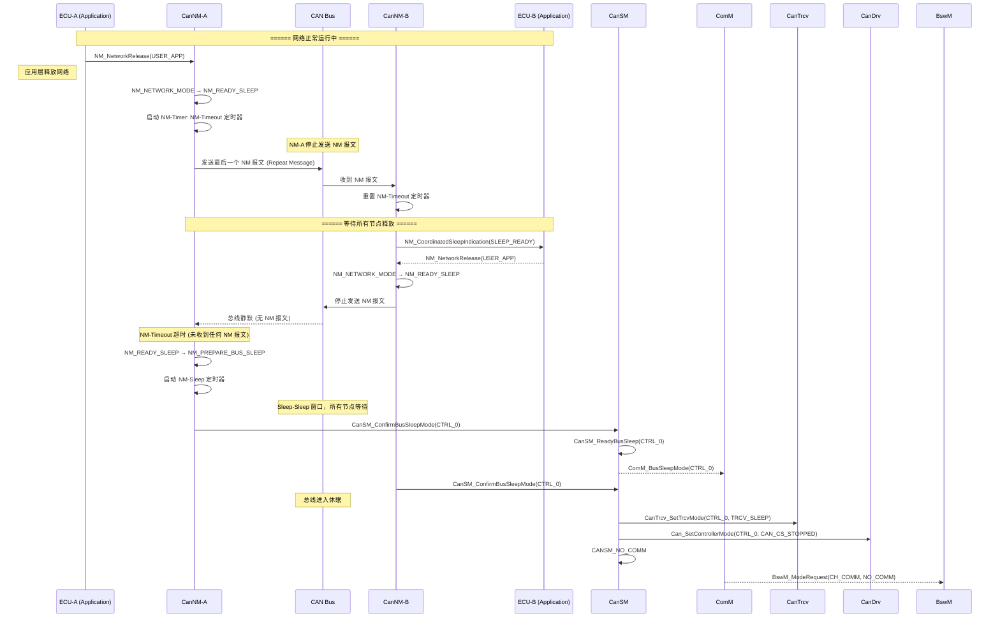
```mermaid
sequenceDiagram
    participant ECU1 as ECU-A (Application)
    participant NM1 as CanNM-A
    participant Bus as CAN Bus
    participant NM2 as CanNM-B
    participant ECU2 as ECU-B (Application)

    Note over ECU1,ECU2: ====== 网络正常运行中 ======

    ECU1->>NM1: NM_NetworkRelease(USER_APP)
    Note left of ECU1: 应用层释放网络

    NM1->>NM1: NM_NETWORK_MODE → NM_READY_SLEEP
    NM1->>NM1: 启动 NM-Timer: NM-Timeout 定时器

    Note over Bus: NM-A 停止发送 NM 报文

    NM1->>Bus: 发送最后一个 NM 报文 (Repeat Message)
    Bus->>NM2: 收到 NM 报文
    NM2->>NM2: 重置 NM-Timeout 定时器

    Note over NM1,ECU2: ====== 等待所有节点释放 ======

    NM2->>ECU2: NM_CoordinatedSleepIndication(SLEEP_READY)
    ECU2-->>NM2: NM_NetworkRelease(USER_APP)
    NM2->>NM2: NM_NETWORK_MODE → NM_READY_SLEEP

    NM2->>Bus: 停止发送 NM 报文
    Bus-->>NM1: 总线静默 (无 NM 报文)

    Note over NM1: NM-Timeout 超时 (未收到任何 NM 报文)

    NM1->>NM1: NM_READY_SLEEP → NM_PREPARE_BUS_SLEEP
    NM1->>NM1: 启动 NM-Sleep 定时器

    Note over Bus: Sleep-Sleep 窗口，所有节点等待

    NM1->>CanSM: CanSM_ConfirmBusSleepMode(CTRL_0)
    CanSM->>CanSM: CanSM_ReadyBusSleep(CTRL_0)
    CanSM-->>ComM: ComM_BusSleepMode(CTRL_0)

    NM2->>CanSM: CanSM_ConfirmBusSleepMode(CTRL_0)

    Note over Bus: 总线进入休眠

    CanSM->>CanTrcv: CanTrcv_SetTrcvMode(CTRL_0, TRCV_SLEEP)
    CanSM->>CanDrv: Can_SetControllerMode(CTRL_0, CAN_CS_STOPPED)
    CanSM->>CanSM: CANSM_NO_COMM

    ComM-->>BswM: BswM_ModeRequest(CH_COMM, NO_COMM)
```

### 4.4 场景四：诊断激活时的通信模式切换

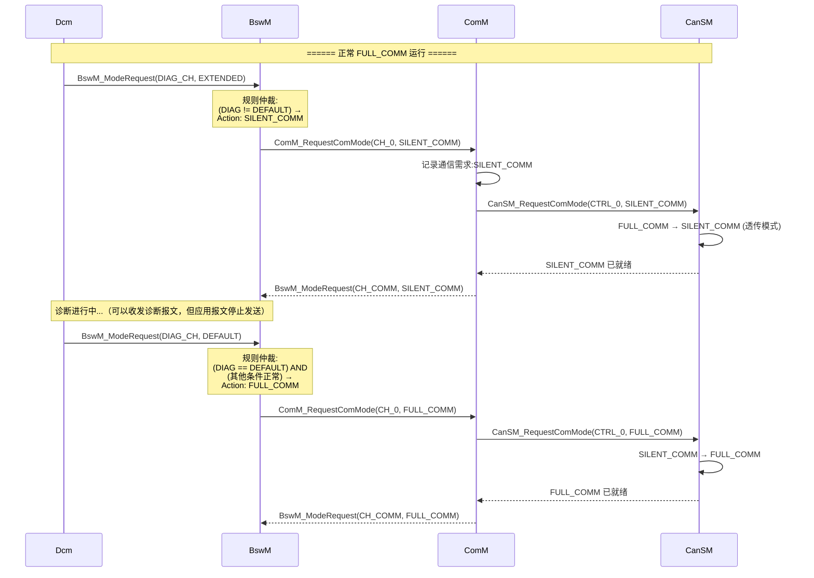
```mermaid
sequenceDiagram
    participant Dcm as Dcm
    participant BswM as BswM
    participant ComM as ComM
    participant CanSM as CanSM

    Note over Dcm,CanSM: ====== 正常 FULL_COMM 运行 ======

    Dcm->>BswM: BswM_ModeRequest(DIAG_CH, EXTENDED)
    Note over BswM: 规则仲裁:<br/>(DIAG != DEFAULT) →<br/>Action: SILENT_COMM

    BswM->>ComM: ComM_RequestComMode(CH_0, SILENT_COMM)
    ComM->>ComM: 记录通信需求:SILENT_COMM
    ComM->>CanSM: CanSM_RequestComMode(CTRL_0, SILENT_COMM)

    CanSM->>CanSM: FULL_COMM → SILENT_COMM (透传模式)
    CanSM-->>ComM: SILENT_COMM 已就绪
    ComM-->>BswM: BswM_ModeRequest(CH_COMM, SILENT_COMM)

    Note over Dcm,BswM: 诊断进行中...（可以收发诊断报文，但应用报文停止发送）

    Dcm->>BswM: BswM_ModeRequest(DIAG_CH, DEFAULT)
    Note over BswM: 规则仲裁:<br/>(DIAG == DEFAULT) AND<br/>(其他条件正常) →<br/>Action: FULL_COMM

    BswM->>ComM: ComM_RequestComMode(CH_0, FULL_COMM)
    ComM->>CanSM: CanSM_RequestComMode(CTRL_0, FULL_COMM)
    CanSM->>CanSM: SILENT_COMM → FULL_COMM
    CanSM-->>ComM: FULL_COMM 已就绪
    ComM-->>BswM: BswM_ModeRequest(CH_COMM, FULL_COMM)
```

### 4.5 场景五：全生命周期闭环（启动→运行→休眠→唤醒→休眠...）

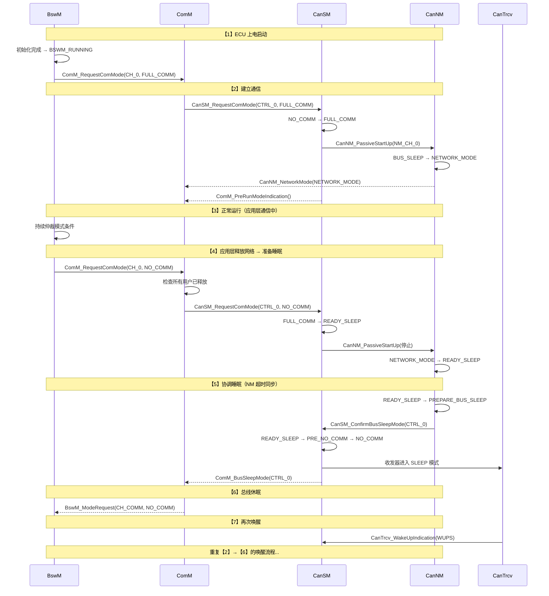
```mermaid
sequenceDiagram
    participant BswM as BswM
    participant ComM as ComM
    participant CanSM as CanSM
    participant CanNM as CanNM

    Note over BswM,CanNM: 【1】ECU 上电启动
    BswM->>BswM: 初始化完成 → BSWM_RUNNING
    BswM->>ComM: ComM_RequestComMode(CH_0, FULL_COMM)

    Note over BswM,CanNM: 【2】建立通信
    ComM->>CanSM: CanSM_RequestComMode(CTRL_0, FULL_COMM)
    CanSM->>CanSM: NO_COMM → FULL_COMM
    CanSM->>CanNM: CanNM_PassiveStartUp(NM_CH_0)
    CanNM->>CanNM: BUS_SLEEP → NETWORK_MODE
    CanNM-->>ComM: CanNM_NetworkMode(NETWORK_MODE)
    CanSM-->>ComM: ComM_PreRunModeIndication()

    Note over BswM,CanNM: 【3】正常运行（应用层通信中）

    BswM->>BswM: 持续仲裁模式条件
    Note over BswM,CanNM: 【4】应用层释放网络 → 准备睡眠
    BswM->>ComM: ComM_RequestComMode(CH_0, NO_COMM)

    ComM->>ComM: 检查所有用户已释放
    ComM->>CanSM: CanSM_RequestComMode(CTRL_0, NO_COMM)

    CanSM->>CanSM: FULL_COMM → READY_SLEEP
    CanSM->>CanNM: CanNM_PassiveStartUp(停止)
    CanNM->>CanNM: NETWORK_MODE → READY_SLEEP

    Note over BswM,CanNM: 【5】协调睡眠（NM 超时同步）
    CanNM->>CanNM: READY_SLEEP → PREPARE_BUS_SLEEP
    CanNM->>CanSM: CanSM_ConfirmBusSleepMode(CTRL_0)
    CanSM->>CanSM: READY_SLEEP → PRE_NO_COMM → NO_COMM
    CanSM->>CanTrcv: 收发器进入 SLEEP 模式
    CanSM-->>ComM: ComM_BusSleepMode(CTRL_0)

    Note over BswM,CanNM: 【6】总线休眠
    ComM-->>BswM: BswM_ModeRequest(CH_COMM, NO_COMM)

    Note over BswM,CanNM: 【7】再次唤醒
    CanTrcv->>CanSM: CanTrcv_WakeUpIndication(WUPS)
    Note over BswM,CanNM: 重复【2】→【6】的唤醒流程...
```

---

## 五、BswM 视角的规则配置与交互实现

### 5.1 典型规则表配置

以支持上述场景的 BswM 规则配置为例：

```c
/* ============================================================
 * 文件名: BswM_Cfg_Example.c
 * 描述: 支持 BswM-ComM-CanSM-NM 交互的规则配置示例
 * ============================================================ */

#include "BswM_Cfg.h"
#include "ComM_Types.h"
#include "CanSM_Types.h"

/* ===== 模式通道定义 ===== */

/* 通信模式通道 */
const BswM_ChannelConfigType BswM_Channels[] = {
    {
        .channelId    = BSWM_CHANNEL_COMM,       /* 通信模式通道 */
        .defaultMode  = (uint8_t)COMM_NO_COMM,    /* 默认无通信 */
        .currentMode  = (uint8_t)COMM_NO_COMM,
        .pendingMode  = (uint8_t)COMM_NO_COMM,
        .isCommitted  = TRUE,
    },
    {
        .channelId    = BSWM_CHANNEL_ECU_STATE,   /* ECU 状态通道 */
        .defaultMode  = (uint8_t)ECUM_STATE_RUN,
        .currentMode  = (uint8_t)ECUM_STATE_RUN,
        .pendingMode  = (uint8_t)ECUM_STATE_RUN,
        .isCommitted  = TRUE,
    },
    {
        .channelId    = BSWM_CHANNEL_DIAG,         /* 诊断状态通道 */
        .defaultMode  = (uint8_t)DIAG_DEFAULT,
        .currentMode  = (uint8_t)DIAG_DEFAULT,
        .pendingMode  = (uint8_t)DIAG_DEFAULT,
        .isCommitted  = TRUE,
    },
    {
        .channelId    = BSWM_CHANNEL_NM_STATE,     /* 网络管理状态通道 */
        .defaultMode  = (uint8_t)NM_MODE_BUS_SLEEP,
        .currentMode  = (uint8_t)NM_MODE_BUS_SLEEP,
        .pendingMode  = (uint8_t)NM_MODE_BUS_SLEEP,
        .isCommitted  = TRUE,
    }
};

/* ===== 条件定义 ===== */

/* 条件1: ECU 处于 RUNNING 状态 */
static const BswM_ConditionTypeDef Cond_EcuRunning = {
    .type           = BSWM_COND_MODE_EQUAL,
    .channelId      = BSWM_CHANNEL_ECU_STATE,
    .expectedValue  = (uint8_t)ECUM_STATE_RUN
};

/* 条件2: 诊断会话为 DEFAULT（未激活诊断） */
static const BswM_ConditionTypeDef Cond_DiagDefault = {
    .type           = BSWM_COND_MODE_EQUAL,
    .channelId      = BSWM_CHANNEL_DIAG,
    .expectedValue  = (uint8_t)DIAG_DEFAULT
};

/* 条件3: 诊断非 DEFAULT（诊断激活） */
static const BswM_ConditionTypeDef Cond_DiagActive = {
    .type           = BSWM_COND_MODE_NOT_EQUAL,
    .channelId      = BSWM_CHANNEL_DIAG,
    .expectedValue  = (uint8_t)DIAG_DEFAULT
};

/* 条件4: NM 未处于 Network Mode（总线可休眠） */
static const BswM_ConditionTypeDef Cond_NmNotNetwork = {
    .type           = BSWM_COND_MODE_NOT_EQUAL,
    .channelId      = BSWM_CHANNEL_NM_STATE,
    .expectedValue  = (uint8_t)NM_MODE_NETWORK
};

/* 条件5: ECU 处于 POST_RUN 或 SLEEP 状态 */
static const BswM_ConditionTypeDef Cond_EcuPostRunOrSleep;
/* 此处用 AND/OR 条件组合实现 */
static const BswM_ConditionTypeDef Cond_EcuPostRun = {
    .type           = BSWM_COND_MODE_EQUAL,
    .channelId      = BSWM_CHANNEL_ECU_STATE,
    .expectedValue  = (uint8_t)ECUM_STATE_POST_RUN
};
static const BswM_ConditionTypeDef Cond_EcuSleep = {
    .type           = BSWM_COND_MODE_EQUAL,
    .channelId      = BSWM_CHANNEL_ECU_STATE,
    .expectedValue  = (uint8_t)ECUM_STATE_SLEEP
};

/* OR 条件: (ECU == POST_RUN) OR (ECU == SLEEP) */
static const BswM_ConditionTypeDef* Cond_EcuNotRunning_Items[] = {
    &Cond_EcuPostRun,
    &Cond_EcuSleep
};
static const BswM_ConditionTypeDef Cond_EcuNotRunning = {
    .type           = BSWM_COND_LOGIC_OR,
    .subConditions  = (const void*)Cond_EcuNotRunning_Items,
    .subCount       = 2
};

/* ===== 组合条件定义 ===== */

/* 组合条件 A: (ECU == RUNNING) AND (DIAG == DEFAULT)
 *  → 正常全通信模式
 */
static const BswM_ConditionTypeDef* Cond_NormalComm_Items[] = {
    &Cond_EcuRunning,
    &Cond_DiagDefault
};
static const BswM_ConditionTypeDef Cond_NormalComm = {
    .type           = BSWM_COND_LOGIC_AND,
    .subConditions  = (const void*)Cond_NormalComm_Items,
    .subCount       = 2
};

/* 组合条件 B: (ECU == RUNNING) AND (DIAG != DEFAULT)
 *  → 诊断激活 → SILENT_COMM
 */
static const BswM_ConditionTypeDef* Cond_DiagMode_Items[] = {
    &Cond_EcuRunning,
    &Cond_DiagActive
};
static const BswM_ConditionTypeDef Cond_DiagMode = {
    .type           = BSWM_COND_LOGIC_AND,
    .subConditions  = (const void*)Cond_DiagMode_Items,
    .subCount       = 2
};

/* 组合条件 C: (ECU == POST_RUN/SLEEP) AND (NM != NETWORK)
 *  → 可休眠（所有条件满足 → NO_COMM）
 */
static const BswM_ConditionTypeDef* Cond_Sleep_Items[] = {
    &Cond_EcuNotRunning,
    &Cond_NmNotNetwork
};
static const BswM_ConditionTypeDef Cond_SleepReady = {
    .type           = BSWM_COND_LOGIC_AND,
    .subConditions  = (const void*)Cond_Sleep_Items,
    .subCount       = 2
};

/* ===== 动作列表定义 ===== */

/* Action List A: 请求 FULL_COMM */
static const BswM_ActionTypeDef Actions_FullComm[] = {
    {
        .actionType = BSWM_ACTION_SET_COMM_MODE,
        .params.modeRequest = {
            .channelId   = BSWM_CHANNEL_COMM,
            .targetMode  = (uint8_t)COMM_FULL_COMMUNICATION
        }
    },
    {
        .actionType = BSWM_ACTION_CALLOUT,
        .params.callout.calloutFunc = BswM_OnEnterFullComm
    }
};
static const BswM_ActionListTypeDef ActionList_FullComm = {
    .actions      = Actions_FullComm,
    .actionCount  = 2,
    .executionTimeout = 100  /* 100ms 超时 */
};

/* Action List B: 请求 SILENT_COMM */
static const BswM_ActionTypeDef Actions_SilentComm[] = {
    {
        .actionType = BSWM_ACTION_SET_COMM_MODE,
        .params.modeRequest = {
            .channelId   = BSWM_CHANNEL_COMM,
            .targetMode  = (uint8_t)COMM_SILENT_COMMUNICATION
        }
    },
    {
        .actionType = BSWM_ACTION_CALLOUT,
        .params.callout.calloutFunc = BswM_OnEnterSilentComm
    }
};
static const BswM_ActionListTypeDef ActionList_SilentComm = {
    .actions      = Actions_SilentComm,
    .actionCount  = 2,
    .executionTimeout = 100
};

/* Action List C: 请求 NO_COMM（准备休眠） */
static const BswM_ActionTypeDef Actions_NoComm[] = {
    {
        .actionType = BSWM_ACTION_SET_COMM_MODE,
        .params.modeRequest = {
            .channelId   = BSWM_CHANNEL_COMM,
            .targetMode  = (uint8_t)COMM_NO_COMMUNICATION
        }
    },
    {
        .actionType = BSWM_ACTION_CALLOUT,
        .params.callout.calloutFunc = BswM_OnEnterNoComm
    }
};
static const BswM_ActionListTypeDef ActionList_NoComm = {
    .actions      = Actions_NoComm,
    .actionCount  = 2,
    .executionTimeout = 200
};

/* ===== 规则表定义（按优先级排序） ===== */

const BswM_RuleTypeDef BswM_Rules[] = {
    /*
     * 规则 1: 诊断激活 → SILENT_COMM
     * 优先级最高，诊断时抢占所有通信
     */
    {
        .ruleId          = 1,
        .conditionRoot   = &Cond_DiagMode,
        .priority        = 0,          /* 最高优先级 */
        .isPreemptive    = TRUE,       /* 抢占式 */
        .actionList      = &ActionList_SilentComm,
        .deferMs         = 0           /* 立即执行 */
    },

    /*
     * 规则 2: ECU RUNNING + 非诊断 → FULL_COMM
     * 正常通信模式
     */
    {
        .ruleId          = 2,
        .conditionRoot   = &Cond_NormalComm,
        .priority        = 10,         /* 正常优先级 */
        .isPreemptive    = TRUE,
        .actionList      = &ActionList_FullComm,
        .deferMs         = 0
    },

    /*
     * 规则 3: ECU 非 RUNNING + NM 非网络 → NO_COMM
     * 准备休眠
     */
    {
        .ruleId          = 3,
        .conditionRoot   = &Cond_SleepReady,
        .priority        = 20,         /* 低优先级 */
        .isPreemptive    = FALSE,
        .actionList      = &ActionList_NoComm,
        .deferMs         = 50          /* 延迟 50ms 执行 */
    }
};

/* ===== 整体配置 ===== */

const BswM_ConfigType BswM_Config = {
    .channels     = BswM_Channels,
    .numChannels  = sizeof(BswM_Channels) / sizeof(BswM_Channels[0]),
    .rules        = BswM_Rules,
    .numRules     = sizeof(BswM_Rules) / sizeof(BswM_Rules[0]),
    .mainPeriodMs = 10    /* 10ms 主循环 */
};

/* ===== Callout 函数实现 ===== */

/**
 * 进入全通信模式的回调
 * - 可以在这里通知应用层通信已建立
 * - 启动应用报文发送
 */
void BswM_OnEnterFullComm(void)
{
    /* 通过 RTE 设置模式指示给 SWC */
    Rte_Switch_CommModeStatus_Chan0(RTE_MODE_COMM_FULL);

    /* 唤醒应用层任务 */
    SchM_ActivateTask(APPLICATION_TASK);
}

/**
 * 进入静默通信模式的回调
 * - 通知应用层停止发送，但可以接收
 * - 停止非诊断报文
 */
void BswM_OnEnterSilentComm(void)
{
    Rte_Switch_CommModeStatus_Chan0(RTE_MODE_COMM_SILENT);

    /* 通知 PDU Router 过滤非诊断报文 */
    PduR_BswM_ComModeChange(SILENT_COMM);
}

/**
 * 进入无通信模式的回调
 * - 彻底关闭通信
 * - 准备 ECU 休眠
 */
void BswM_OnEnterNoComm(void)
{
    Rte_Switch_CommModeStatus_Chan0(RTE_MODE_COMM_NONE);

    /* 停止所有应用任务 */
    SchM_StopScheduleTable(APPLICATION_SCHEDULE_TABLE);
}
```

---

## 六、ComM 的通信需求聚合机制

### 6.1 ComM 的用户管理与需求聚合

ComM 可以接收来自多个"用户"的通信请求，然后取**最大共同需求**：

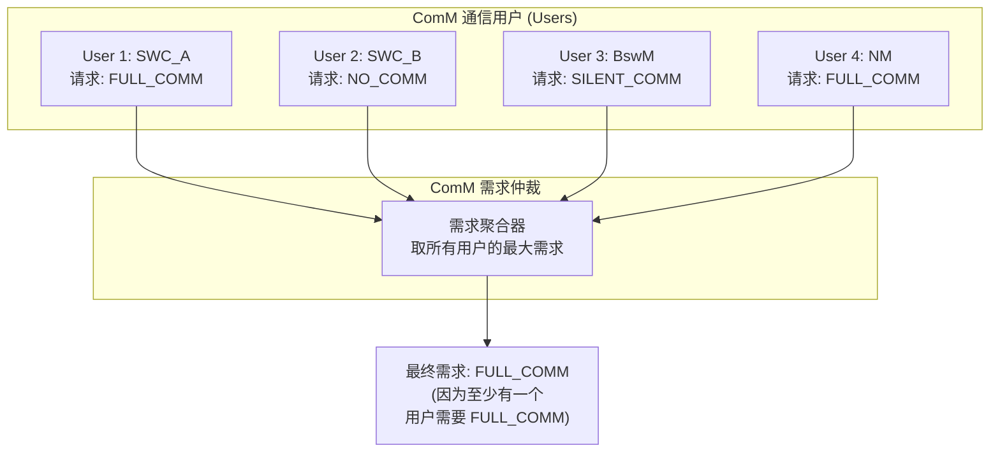
```mermaid
graph TB
    subgraph "ComM 通信用户 (Users)"
        U1["User 1: SWC_A<br/>请求: FULL_COMM"]
        U2["User 2: SWC_B<br/>请求: NO_COMM"]
        U3["User 3: BswM<br/>请求: SILENT_COMM"]
        U4["User 4: NM<br/>请求: FULL_COMM"]
    end

    subgraph "ComM 需求仲裁"
        ARB["需求聚合器<br/>取所有用户的最大需求"]
    end

    U1 --> ARB
    U2 --> ARB
    U3 --> ARB
    U4 --> ARB

    ARB --> OUT["最终需求: FULL_COMM<br/>(因为至少有一个<br/>用户需要 FULL_COMM)"]
```

**策略规则：**

| 用户 1 | 用户 2 | 用户 3 | 聚合结果 |
|--------|--------|--------|---------|
| FULL | FULL | FULL | **FULL** |
| FULL | SILENT | NO_COMM | **FULL** |
| NO_COMM | NO_COMM | NO_COMM | **NO_COMM** |
| SILENT | NO_COMM | SILENT | **SILENT** |
| FULL | SILENT | SILENT | **FULL** |

> **重要**：ComM 的角色是**需求汇总**，而**不是模式决策**。真正的"决策者"是 BswM——它决定"系统当前应该处于什么模式"，然后通过 `ComM_RequestComMode` 将决策结果告诉 ComM。ComM 拿着这个决策，结合所有用户需求计算出最终需求，然后交给 CanSM 执行。

### 6.2 ComM 内部状态机

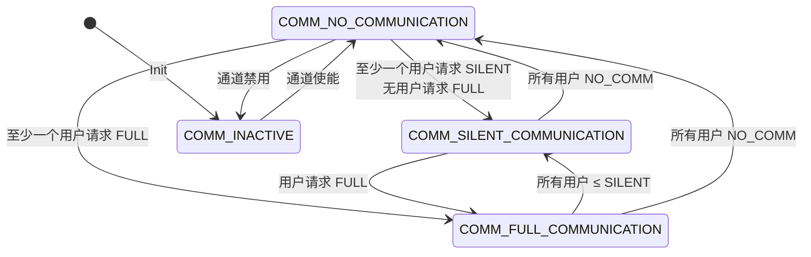
```mermaid
stateDiagram-v2
    state "COMM_NO_COMMUNICATION" as NO_COMM
    state "COMM_SILENT_COMMUNICATION" as SILENT
    state "COMM_FULL_COMMUNICATION" as FULL
    state "COMM_INACTIVE" as INACTIVE

    [*] --> INACTIVE: Init
    INACTIVE --> NO_COMM: 通道使能

    NO_COMM --> SILENT: 至少一个用户请求 SILENT<br/>无用户请求 FULL
    NO_COMM --> FULL: 至少一个用户请求 FULL

    SILENT --> FULL: 用户请求 FULL
    SILENT --> NO_COMM: 所有用户 NO_COMM

    FULL --> SILENT: 所有用户 ≤ SILENT
    FULL --> NO_COMM: 所有用户 NO_COMM

    NO_COMM --> INACTIVE: 通道禁用
```

---

## 七、CanSM 的执行层状态管理

### 7.1 CanSM 完整状态机与触发条件

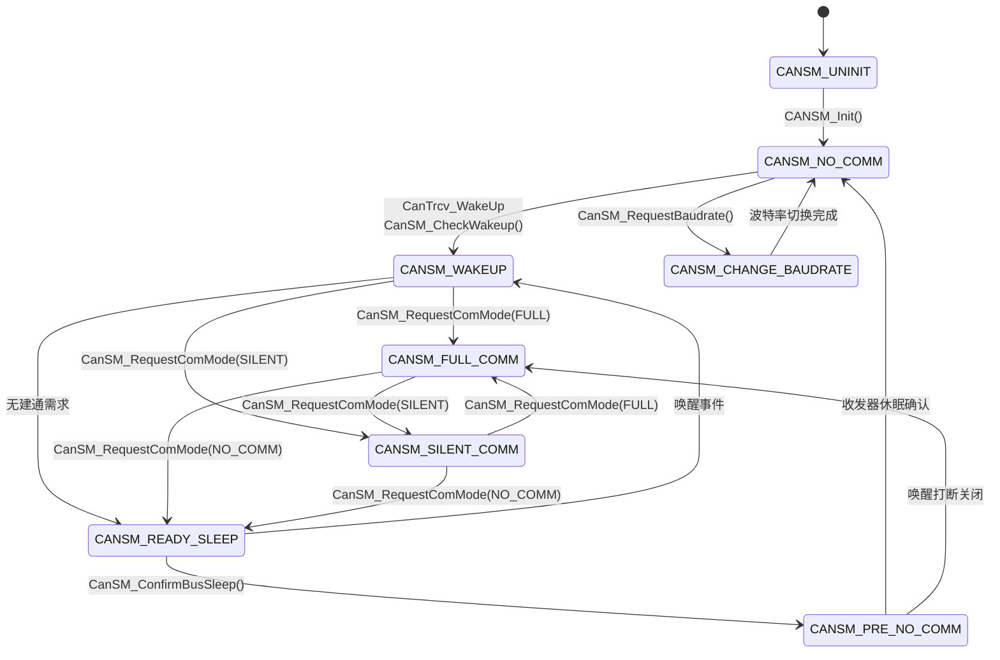
```mermaid
stateDiagram-v2
    [*] --> CANSM_UNINIT

    CANSM_UNINIT --> CANSM_NO_COMM: CANSM_Init()

    CANSM_NO_COMM --> CANSM_WAKEUP: CanTrcv_WakeUp<br/>CanSM_CheckWakeup()
    CANSM_NO_COMM --> CANSM_CHANGE_BAUDRATE: CanSM_RequestBaudrate()

    CANSM_WAKEUP --> CANSM_FULL_COMM: CanSM_RequestComMode(FULL)
    CANSM_WAKEUP --> CANSM_SILENT_COMM: CanSM_RequestComMode(SILENT)
    CANSM_WAKEUP --> CANSM_READY_SLEEP: 无建通需求

    CANSM_FULL_COMM --> CANSM_SILENT_COMM: CanSM_RequestComMode(SILENT)
    CANSM_FULL_COMM --> CANSM_READY_SLEEP: CanSM_RequestComMode(NO_COMM)

    CANSM_SILENT_COMM --> CANSM_FULL_COMM: CanSM_RequestComMode(FULL)
    CANSM_SILENT_COMM --> CANSM_READY_SLEEP: CanSM_RequestComMode(NO_COMM)

    CANSM_READY_SLEEP --> CANSM_PRE_NO_COMM: CanSM_ConfirmBusSleep()
    CANSM_READY_SLEEP --> CANSM_WAKEUP: 唤醒事件

    CANSM_PRE_NO_COMM --> CANSM_NO_COMM: 收发器休眠确认
    CANSM_PRE_NO_COMM --> CANSM_FULL_COMM: 唤醒打断关闭

    CANSM_CHANGE_BAUDRATE --> CANSM_NO_COMM: 波特率切换完成
```

### 7.2 CanSM 各状态下的硬件控制

| CanSM 状态 | CAN 控制器 | CAN 收发器 | NM 状态 | 说明 |
|-----------|-----------|-----------|---------|------|
| `CANSM_NO_COMM` | STOPPED | SLEEP | BUS_SLEEP | 最低功耗 |
| `CANSM_WAKEUP` | STARTED | STANDY → NORMAL | 唤醒中 | 刚被唤醒，等待决策 |
| `CANSM_FULL_COMM` | STARTED | NORMAL | NETWORK_MODE | 正常运行 |
| `CANSM_SILENT_COMM` | STARTED | NORMAL | NETWORK_MODE | 只收不发 |
| `CANSM_READY_SLEEP` | STARTED | NORMAL | READY_SLEEP | 准备休眠 |
| `CANSM_PRE_NO_COMM` | STOPPED | SLEEP | PREPARE_BUS_SLEEP | 关闭中 |
| `CANSM_CHANGE_BAUDRATE` | 切换中 | NORMAL | — | 波特率变更 |

---

## 八、NM 的网络同步协议

### 8.1 NM 报文交互原理

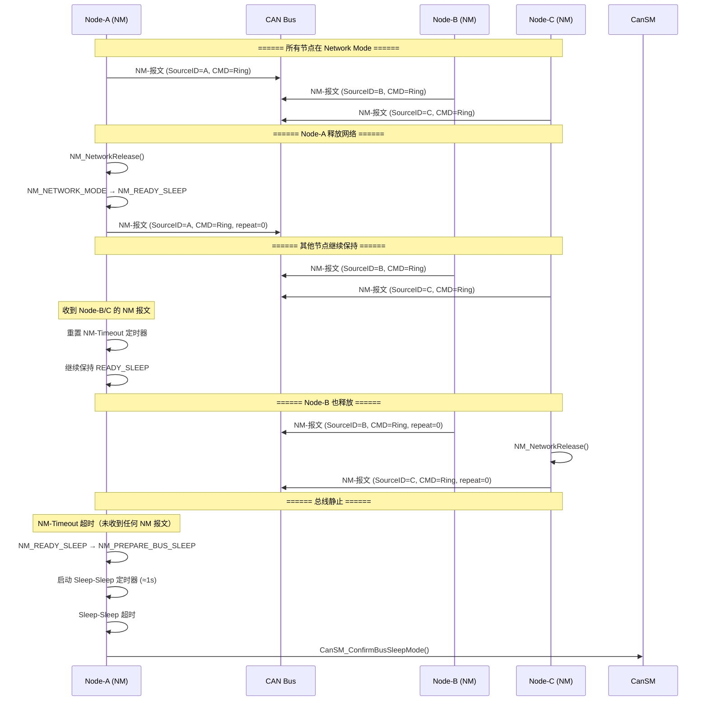
```mermaid
sequenceDiagram
    participant NodeA as Node-A (NM)
    participant Bus as CAN Bus
    participant NodeB as Node-B (NM)
    participant NodeC as Node-C (NM)

    Note over NodeA,NodeC: ====== 所有节点在 Network Mode ======

    NodeA->>Bus: NM-报文 (SourceID=A, CMD=Ring)
    NodeB->>Bus: NM-报文 (SourceID=B, CMD=Ring)
    NodeC->>Bus: NM-报文 (SourceID=C, CMD=Ring)

    Note over NodeA,NodeC: ====== Node-A 释放网络 ======
    NodeA->>NodeA: NM_NetworkRelease()
    NodeA->>NodeA: NM_NETWORK_MODE → NM_READY_SLEEP
    NodeA->>Bus: NM-报文 (SourceID=A, CMD=Ring, repeat=0)

    Note over NodeA,NodeC: ====== 其他节点继续保持 ======
    NodeB->>Bus: NM-报文 (SourceID=B, CMD=Ring)
    NodeC->>Bus: NM-报文 (SourceID=C, CMD=Ring)

    Note over NodeA: 收到 Node-B/C 的 NM 报文
    NodeA->>NodeA: 重置 NM-Timeout 定时器
    NodeA->>NodeA: 继续保持 READY_SLEEP

    Note over NodeA,NodeC: ====== Node-B 也释放 ======
    NodeB->>Bus: NM-报文 (SourceID=B, CMD=Ring, repeat=0)

    NodeC->>NodeC: NM_NetworkRelease()
    NodeC->>Bus: NM-报文 (SourceID=C, CMD=Ring, repeat=0)

    Note over NodeA,NodeC: ====== 总线静止 ======
    Note over NodeA: NM-Timeout 超时（未收到任何 NM 报文）
    NodeA->>NodeA: NM_READY_SLEEP → NM_PREPARE_BUS_SLEEP
    NodeA->>NodeA: 启动 Sleep-Sleep 定时器 (≈1s)

    NodeA->>NodeA: Sleep-Sleep 超时
    NodeA->>CanSM: CanSM_ConfirmBusSleepMode()
```

### 8.2 NM 状态机与 CanSM 的耦合

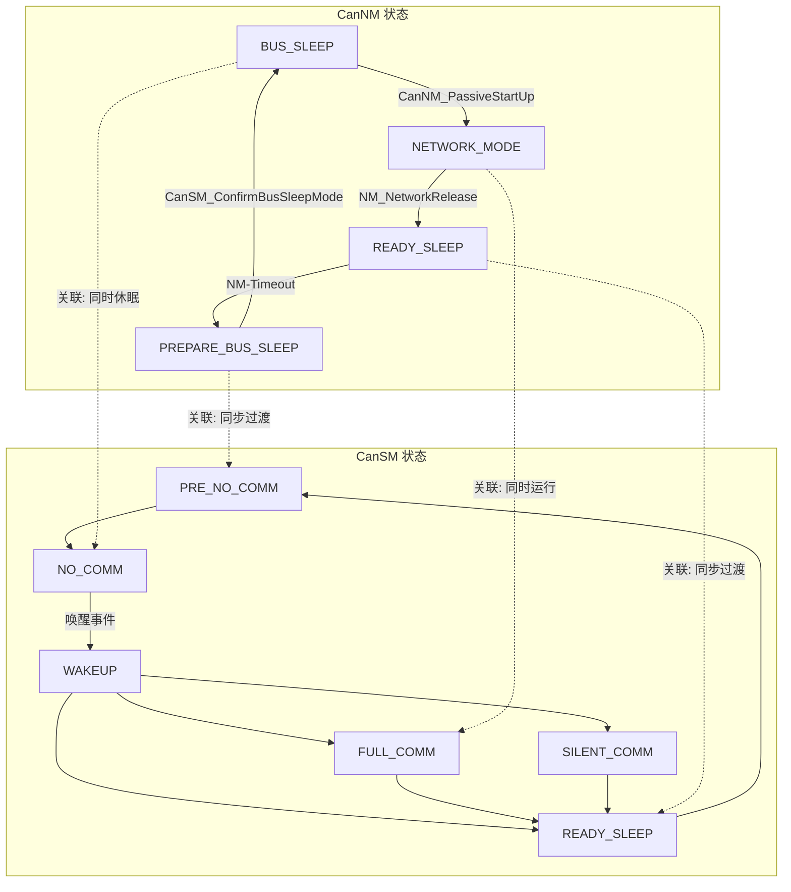
```mermaid
graph TD
    subgraph "CanNM 状态"
        N_BS["BUS_SLEEP"]
        N_PBS["PREPARE_BUS_SLEEP"]
        N_NM["NETWORK_MODE"]
        N_RS["READY_SLEEP"]
    end

    subgraph "CanSM 状态"
        S_NC["NO_COMM"]
        S_PNC["PRE_NO_COMM"]
        S_WU["WAKEUP"]
        N_FC["FULL_COMM"]
        N_SC["SILENT_COMM"]
        S_RS["READY_SLEEP"]
    end

    N_BS -->|CanNM_PassiveStartUp| N_NM
    N_NM -->|NM_NetworkRelease| N_RS
    N_RS -->|NM-Timeout| N_PBS
    N_PBS -->|CanSM_ConfirmBusSleepMode| N_BS

    S_NC -->|唤醒事件| S_WU
    S_WU --> N_FC
    S_WU --> N_SC
    S_WU --> S_RS
    N_FC --> S_RS
    N_SC --> S_RS
    S_RS --> S_PNC
    S_PNC --> S_NC

    N_BS -.->|关联: 同时休眠| S_NC
    N_NM -.->|关联: 同时运行| N_FC
    N_RS -.->|关联: 同步过渡| S_RS
    N_PBS -.->|关联: 同步过渡| S_PNC
```

---

## 九、完整交互流程代码驱动

### 9.1 从应用层请求到 CAN 总线控制的完整调用链

```c
/**
 * 文件名: BswM_ComM_CanSM_NM_Integration.c
 * 描述: 四模块交互的完整调用链演示
 *
 * 场景：应用层 SWC 请求 FULL_COMM → 链路到底层硬件
 */

/* ============================================
 * 步骤 1: 应用层 SWC 通过 RTE 请求模式
 * ============================================ */
void ApplTask_RequestFullComm(void)
{
    Std_ReturnType ret;

    /*
     * SWC 调用 RTE 接口 → RTE 转发到 BswM
     * Rte_Call_BswM_ModeRequest() 内部调用:
     */
    ret = Rte_Call_BswM_ModeRequest(
        RTE_BSWM_COMM_CHANNEL,        /* 通信通道 */
        (uint8_t)COMM_FULL_COMMUNICATION  /* 请求全通信 */
    );

    if (ret != E_OK) {
        /* 请求发送失败（如 BswM 未就绪） */
        SchM_EnterHook(ERROR_HOOK);
    }
}

/* ============================================
 * 步骤 2: RTE → BswM 接口层
 * ============================================ */

/*
 * Rte_Call_BswM_ModeRequest 内部实现
 * (由 RTE 生成器自动生成)
 */
Std_ReturnType Rte_Call_BswM_ModeRequest(
    Rte_BSWModeChannel channel,
    uint8_t mode)
{
    /* RTE 校验 — 确保数据一致性 */
    if (!Rte_IsBswMReady()) {
        return RTE_E_MODE_SWITCH_FAILED;
    }

    /* 直接调用 BswM 模块 API */
    return BswM_ModeRequest((uint8_t)channel, mode);
}

/* ============================================
 * 步骤 3: BswM 仲裁引擎
 * ============================================ */

/*
 * BswM_ModeRequest 已经更新了通道的 pending mode,
 * 接下来在 BswM_MainFunction 中触发仲裁.
 *
 * 假设仲裁结果为: ComM_RequestComMode(CH_0, FULL_COMM)
 */

/* ============================================
 * 步骤 4: ComM 需求聚合
 * ============================================ */

/*
 * ComM_RequestComMode 实现（简化）
 */
Std_ReturnType ComM_RequestComMode(
    ComM_UserHandleType   user,
    ComM_ModeType         requestedMode)
{
    ComM_ChannelConfigType* channel;
    ComM_ModeType           aggregatedMode;

    /* 1. 更新该用户的通信需求 */
    channel = ComM_GetUserChannel(user);
    channel->userRequest[user] = requestedMode;

    /* 2. 聚合所有用户的需求 — 取最大值 */
    aggregatedMode = COMM_NO_COMMUNICATION;
    for (uint8_t i = 0; i < channel->numUsers; i++) {
        if (channel->userRequest[i] > aggregatedMode) {
            aggregatedMode = channel->userRequest[i];
        }
    }

    /* 3. 如果聚合后的需求与当前模式不同 */
    if (aggregatedMode != channel->currentMode) {
        channel->currentMode = aggregatedMode;

        /* 4. 调用 CanSM 执行 */
        Std_ReturnType ret = CanSM_RequestComMode(
            channel->controllerId,
            aggregatedMode
        );

        if (ret == E_OK) {
            /* 5. 通知 BswM 通信模式已生效 */
            BswM_ModeRequest(
                BSWM_CHANNEL_COMM,
                (uint8_t)aggregatedMode
            );
        }
    }

    return E_OK;
}

/* ============================================
 * 步骤 5: CanSM 执行 CAN 控制器模式切换
 * ============================================ */

/*
 * CanSM_RequestComMode 实现（简化）
 */
Std_ReturnType CanSM_RequestComMode(
    uint8_t           controllerId,
    CanSM_ModeType    requestedMode)
{
    CanSM_ControllerType* ctrl = &CanSM_Controllers[controllerId];

    /* 状态机合法性校验 */
    if (!CanSM_IsValidTransition(ctrl->currentState, requestedMode)) {
        CanSM_Det_ReportError(CANSM_E_INVALID_TRANSITION);
        return E_NOT_OK;
    }

    switch (requestedMode) {
        case CANSM_FULL_COMM_MODE:
            /* 1. 启动 CAN 控制器 */
            Can_SetControllerMode(ctrl->hwUnit,
                                  CAN_CS_STARTED);

            /* 2. 唤醒收发器 */
            CanTrcv_SetTrcvMode(ctrl->trcvIdx,
                                CAN_TRCVR_NORMAL);

            /* 3. 状态迁移 */
            ctrl->currentState = CANSM_FULL_COMM;

            /* 4. 通知 NM 网络已启动 */
            CanNM_PassiveStartUp(ctrl->nmChannel);

            /* 5. 通知 ComM */
            ComM_PreRunModeIndication(controllerId);
            break;

        case CANSM_SILENT_COMM_MODE:
            /* 控制器运行，但 PDU 发送被 PDUR 过滤 */
            Can_SetControllerMode(ctrl->hwUnit,
                                  CAN_CS_STARTED);
            CanTrcv_SetTrcvMode(ctrl->trcvIdx,
                                CAN_TRCVR_NORMAL);
            ctrl->currentState = CANSM_SILENT_COMM;

            /* 通知 PDUR 过滤发送通道 */
            PduR_CanSM_ComModeChange(controllerId,
                                     PDU_R_SILENT_COMM);
            break;

        case CANSM_NO_COMM_MODE:
            /* 1. 先通过 NM 协调睡眠 */
            CanSM_ReadyBusSleep(controllerId);

            /* 2. NM 确认 → CanSM_ConfirmBusSleepMode */
            /* （NM 完成协调后异步回调） */
            break;
    }

    return E_OK;
}

/* ============================================
 * 步骤 6: NM 网络协调
 * ============================================ */

/*
 * CanNM_PassiveStartUp — 被动网络启动
 */
void CanNM_PassiveStartUp(NetworkHandleType nmChannel)
{
    CanNM_ChannelType* ch = &CanNM_Channels[nmChannel];

    if (ch->state == NM_STATE_BUS_SLEEP) {
        /* 从休眠切换到网络模式 */
        ch->state = NM_STATE_NETWORK_MODE;

        /* 启动 NM 报文发送 (Ring / Token) */
        CanNM_TxMainFunction();

        /* 启动 NM-Timeout 定时器 */
        SchM_StartTimer(ch->timeoutTimer,
                        ch->timeoutMs);
    }
}

/*
 * CanNM_TxMainFunction — 发送 NM 报文
 * (周期性调用)
 */
void CanNM_TxMainFunction(void)
{
    for (uint8_t i = 0; i < CanNM_NumChannels; i++) {
        CanNM_ChannelType* ch = &CanNM_Channels[i];

        if (ch->state != NM_STATE_NETWORK_MODE) {
            continue;
        }

        /* 构造 NM 报文 */
        CanNm_PduType nmPdu;
        nmPdu.id      = ch->nmMessageId;
        nmPdu.length  = 8;
        nmPdu.sdu[0]  = ch->sourceNodeId;   /* 源节点 ID */
        nmPdu.sdu[1]  = ch->userData;        /* 用户数据 */
        nmPdu.sdu[2]  = ch->repeatMsg;       /* Repeat 标志 */

        /* 通过 CanIf 发送 */
        CanIf_Transmit(ch->canIfTxPduId, &nmPdu);
    }
}

/*
 * CanNM_RxIndication — 收到 NM 报文
 * (CanIf 的回调)
 */
void CanNM_RxIndication(
    PduIdType       pduId,
    const PduInfoType* pduInfo)
{
    CanNM_ChannelType* ch = CanNM_FindChannelByPdu(pduId);

    if (ch == NULL) {
        return;
    }

    /* 重置 NM-Timeout 定时器（收到 NM 报文说明网络仍活跃） */
    SchM_ResetTimer(ch->timeoutTimer);

    /* 如果处于 READY_SLEEP, 继续保持 */
    /* 如果处于 PREPARE_BUS_SLEEP, 回到 NETWORK_MODE */
    if (ch->state == NM_STATE_PREPARE_BUS_SLEEP) {
        ch->state = NM_STATE_NETWORK_MODE;
        CanNM_NetworkMode(ch->handle, NM_STATE_NETWORK_MODE);
    }
}

/* ============================================
 * 步骤 7: 总线睡眠确认回调链
 * ============================================ */

/*
 * CanNM 决定让总线睡眠 → 回调 CanSM
 */
void CanSM_ConfirmBusSleepMode(uint8_t controllerId)
{
    CanSM_ControllerType* ctrl = &CanSM_Controllers[controllerId];

    if (ctrl->currentState == CANSM_READY_SLEEP) {
        ctrl->currentState = CANSM_PRE_NO_COMM;

        /* 停止 CAN 控制器 */
        Can_SetControllerMode(ctrl->hwUnit,
                              CAN_CS_STOPPED);

        /* 收发器进入 SLEEP */
        CanTrcv_SetTrcvMode(ctrl->trcvIdx,
                            CAN_TRCVR_SLEEP);

        ctrl->currentState = CANSM_NO_COMM;

        /* 通知 ComM */
        ComM_BusSleepMode(controllerId);
    }
}

/*
 * ComM 收到总线休眠通知 → 通知 BswM
 */
void ComM_BusSleepMode(uint8_t controllerId)
{
    /* 更新 ComM 通道状态 */
    ComM_Channels[controllerId].currentMode =
        COMM_NO_COMMUNICATION;

    /* 通知 BswM 通信模式已变为 NO_COMM */
    BswM_ModeRequest(
        BSWM_CHANNEL_COMM,
        (uint8_t)COMM_NO_COMMUNICATION
    );
}
```

### 9.2 通知机制的完整回调链

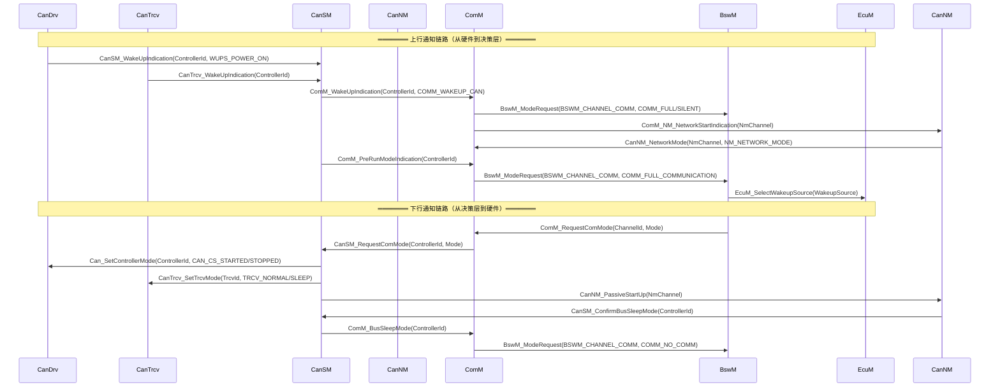
```mermaid
sequenceDiagram
    participant CanDrv as CanDrv
    participant CanTrcv as CanTrcv
    participant CanSM as CanSM
    participant NM as CanNM
    participant ComM as ComM
    participant BswM as BswM
    participant EcuM as EcuM

    Note over CanDrv,EcuM: ═══════ 上行通知链路（从硬件到决策层）═══════

    CanDrv->>CanSM: CanSM_WakeUpIndication(ControllerId, WUPS_POWER_ON)
    CanTrcv->>CanSM: CanTrcv_WakeUpIndication(ControllerId)

    CanSM->>ComM: ComM_WakeUpIndication(ControllerId, COMM_WAKEUP_CAN)

    ComM->>BswM: BswM_ModeRequest(BSWM_CHANNEL_COMM, COMM_FULL/SILENT)
    ComM->>CanNM: ComM_NM_NetworkStartIndication(NmChannel)

    CanNM->>ComM: CanNM_NetworkMode(NmChannel, NM_NETWORK_MODE)
    CanSM->>ComM: ComM_PreRunModeIndication(ControllerId)

    ComM->>BswM: BswM_ModeRequest(BSWM_CHANNEL_COMM, COMM_FULL_COMMUNICATION)

    BswM->>EcuM: EcuM_SelectWakeupSource(WakeupSource)

    Note over CanDrv,EcuM: ═══════ 下行通知链路（从决策层到硬件）═══════

    BswM->>ComM: ComM_RequestComMode(ChannelId, Mode)
    ComM->>CanSM: CanSM_RequestComMode(ControllerId, Mode)
    CanSM->>CanDrv: Can_SetControllerMode(ControllerId, CAN_CS_STARTED/STOPPED)
    CanSM->>CanTrcv: CanTrcv_SetTrcvMode(TrcvId, TRCV_NORMAL/SLEEP)
    CanSM->>CanNM: CanNM_PassiveStartUp(NmChannel)

    CanNM->>CanSM: CanSM_ConfirmBusSleepMode(ControllerId)
    CanSM->>ComM: ComM_BusSleepMode(ControllerId)
    ComM->>BswM: BswM_ModeRequest(BSWM_CHANNEL_COMM, COMM_NO_COMM)
```

---

## 十、设计模式与架构思想分析

### 10.1 四模块协作中的设计模式

| 设计模式 | 体现 | 说明 |
|---------|------|------|
| **分层模式 (Layered)** | BswM→ComM→CanSM→CAN 硬件 | 自上而下的抽象层次 |
| **中介者 (Mediator)** | BswM 在多个 Manager 之间仲裁 | 避免模块间直接依赖 |
| **策略模式 (Strategy)** | BswM 规则表实现不同策略 | 可配置的策略集合 |
| **观察者 (Observer)** | CanSM→ComM→BswM 的回调链 | 状态变化逐级通知 |
| **状态模式 (State)** | 各模块都有自己的状态机 | 状态驱动行为 |
| **职责链 (Chain of Resp.)** | 请求逐级传递：BswM→ComM→CanSM | 各层处理自己的职责 |
| **门面模式 (Facade)** | ComM 对上层屏蔽 CanSM/NM 细节 | 简化上层接口 |

### 10.2 四模块协作的"分治"哲学

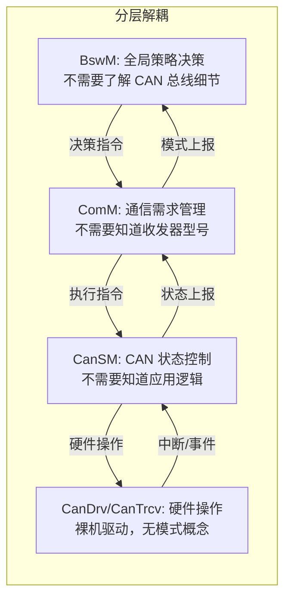
```mermaid
graph LR
    subgraph "分层解耦"
        L4["BswM: 全局策略决策<br/>不需要了解 CAN 总线细节"]
        L3["ComM: 通信需求管理<br/>不需要知道收发器型号"]
        L2["CanSM: CAN 状态控制<br/>不需要知道应用逻辑"]
        L1["CanDrv/CanTrcv: 硬件操作<br/>裸机驱动，无模式概念"]
    end

    L4 -->|决策指令| L3
    L3 -->|执行指令| L2
    L2 -->|硬件操作| L1
    L1 -->|中断/事件| L2
    L2 -->|状态上报| L3
    L3 -->|模式上报| L4
```

**核心设计思想**：

1. **每层只关心自己的粒度**：BswM 关心"要不要通信"，ComM 关心"要什么模式的通信"，CanSM 关心"怎么操作 CAN 控制器"
2. **每层都是状态机驱动**：清晰的有限状态机让行为可预测、可测试
3. **上行靠回调/通知，下行靠请求/指令**：上行传递"发生了什么"，下行传递"去做什么"
4. **NM 是"粘合剂"**：在多个 ECU 之间协调，确保网络同步睡眠/唤醒

### 10.3 状态一致性保证机制

各模块的状态必须保持一致，不然后果严重（如 CanSM 认为总线已休眠，但 ComM 认为还在全通信）。

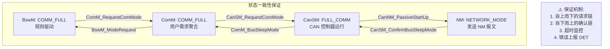
```mermaid
graph TD
    subgraph "状态一致性保证"
        S1["BswM: COMM_FULL<br/>规则驱动"]
        S2["ComM: COMM_FULL<br/>用户需求聚合"]
        S3["CanSM: FULL_COMM<br/>CAN 控制器运行"]
        S4["NM: NETWORK_MODE<br/>发送 NM 报文"]
    end

    S1 -->|ComM_RequestComMode| S2
    S2 -->|CanSM_RequestComMode| S3
    S3 -->|CanNM_PassiveStartUp| S4

    S4 -->|CanSM_ConfirmBusSleepMode| S3
    S3 -->|ComM_BusSleepMode| S2
    S2 -->|BswM_ModeRequest| S1

    Note_R["⚠️ 保证机制:<br/>1. 自上而下的请求链<br/>2. 自下而上的确认链<br/>3. 超时监控<br/>4. 错误上报 DET"]
```

---

## 十一、常见问题与调试指南

### 11.1 典型问题排查表

| 症状 | 可能原因 | 排查方法 |
|------|---------|---------|
| CAN 总线无法建通 | BswM 规则未匹配到 FULL_COMM | 检查 BswM 仲裁日志，确认输入条件 |
| 总线唤醒后立即休眠 | ComM 无用户请求 FULL_COMM | 检查所有 ComM 用户的状态请求 |
| NM 无法协调睡眠 | 有其他节点仍在发送 NM 报文 | 使用 CAN 工具监控总线上的 NM 报文 |
| 诊断模式无法切换到 SILENT | BswM 规则优先级配置错误 | 检查规则优先级和抢占标志 |
| ECU 无法正常休眠 | ComM 通道上有用户保持 FULL_COMM | 检查所有 ComM_User 的释放情况 |
| CanSM 状态卡在某个状态 | 硬件故障或返回错误 | 检查 CanDrv 和 CanTrcv 的错误返回值 |
| 偶发性的通信中断 | 仲裁周期过长或规则冲突 | 检查 BswM_MainFunction 的周期和规则数 |

### 11.2 调试追踪建议

```c
/**
 * 调试工具：BswM 状态追踪
 */
void BswM_TraceState(void)
{
    #ifdef BSWM_DEBUG_ENABLE
    uint8_t commMode, ecuState, diagMode, nmState;

    BswM_GetCurrentMode(BSWM_CHANNEL_COMM, &commMode);
    BswM_GetCurrentMode(BSWM_CHANNEL_ECU_STATE, &ecuState);
    BswM_GetCurrentMode(BSWM_CHANNEL_DIAG, &diagMode);
    BswM_GetCurrentMode(BSWM_CHANNEL_NM_STATE, &nmState);

    BswM_Printf("[BswM] Comm=%d, EcuState=%d, Diag=%d, NM=%d\n",
                commMode, ecuState, diagMode, nmState);

    /* 同时追踪 ComM 和 CanSM 的状态 */
    ComM_ModeType comM_Mode;
    ComM_GetCurrentComMode(CHANNEL_0, &comM_Mode);
    CanSM_ModeType canSM_Mode;
    CanSM_GetCurrentComMode(CAN_CONTROLLER_0, &canSM_Mode);

    BswM_Printf("[ComM] Mode=%d | [CanSM] Mode=%d\n",
                comM_Mode, canSM_Mode);
    #endif
}
```

### 11.3 状态一致性检查断言

```c
/**
 * 运行时断言：检查 BswM 与 CanSM 状态是否一致
 */
void BswM_AssertConsistency(void)
{
    uint8_t       bswmCommMode;
    CanSM_ModeType cansmMode;

    BswM_GetCurrentMode(BSWM_CHANNEL_COMM, &bswmCommMode);
    CanSM_GetCurrentComMode(CAN_CONTROLLER_0, &cansmMode);

    /*
     * 一致性映射规则：
     *   BswM COMM_FULL  ↔  CanSM FULL_COMM
     *   BswM COMM_SILENT ↔  CanSM SILENT_COMM
     *   BswM COMM_NO_COMM ↔  CanSM NO_COMM
     */
    boolean consistent = FALSE;

    switch (bswmCommMode) {
        case COMM_FULL_COMMUNICATION:
            consistent = (cansmMode == CANSM_FULL_COMM);
            break;
        case COMM_SILENT_COMMUNICATION:
            consistent = (cansmMode == CANSM_SILENT_COMM);
            break;
        case COMM_NO_COMMUNICATION:
            consistent = (cansmMode == CANSM_NO_COMM);
            break;
        default:
            break;
    }

    if (!consistent) {
        /* 状态不一致 — 触发 DET 错误 */
        Det_ReportError(BSWM_MODULE_ID,
                        BSWM_INSTANCE_ID,
                        BSWM_E_STATE_MISMATCH);

        /* 开发阶段可触发断点 */
        #ifdef DEBUG
            __breakpoint();
        #endif
    }
}
```

---

## 十二、总结

### 12.1 四模块协作的"一句话"总结

| 模块 | 一句话总结 |
|------|-----------|
| **BswM** | **大脑** — 根据全局状态仲裁，决定"要什么模式" |
| **ComM** | **调度台** — 汇总通信需求，传达"需要什么服务" |
| **CanSM** | **执行官** — 直接操作 CAN 硬件，实现"去干什么" |
| **NM** | **协调员** — 在多 ECU 间同步，确保"大家一起干" |

### 12.2 核心调用链（要记住的黄金路径）

```
【下行】BswM → ComM → CanSM → (CanDrv + CanTrcv)
【上行】CanDrv/CanTrcv → CanSM → ComM → BswM
【网络】CanNM ↔ ComM ↔ BswM   (NM 参与协调)
【闭环】下行请求 → 上行确认 → 状态一致性
```

### 12.3 设计哲学

```mermaid
mindmap
  root((四模块协作哲学))
    分层
      每层独立职责
      接口标准化
      可替换性
    状态驱动
      有限状态机
      状态迁移可预测
      错误状态可恢复
    配置化
      BswM 规则可配置
      ComM 用户可配置
      NM 参数可配置
    回调链
      上行靠回调通知
      下行靠请求指令
      异步解耦
```

> **记住**：这四个模块的交互构成了 AUTOSAR CAN 通信栈的"神经系统"——BswM 是大脑，ComM 是神经中枢，CanSM 是运动神经末梢，NM 是自主神经系统的协调反射。理解它们之间的交互逻辑，就等于理解了 AUTOSAR 通信管理的灵魂。
