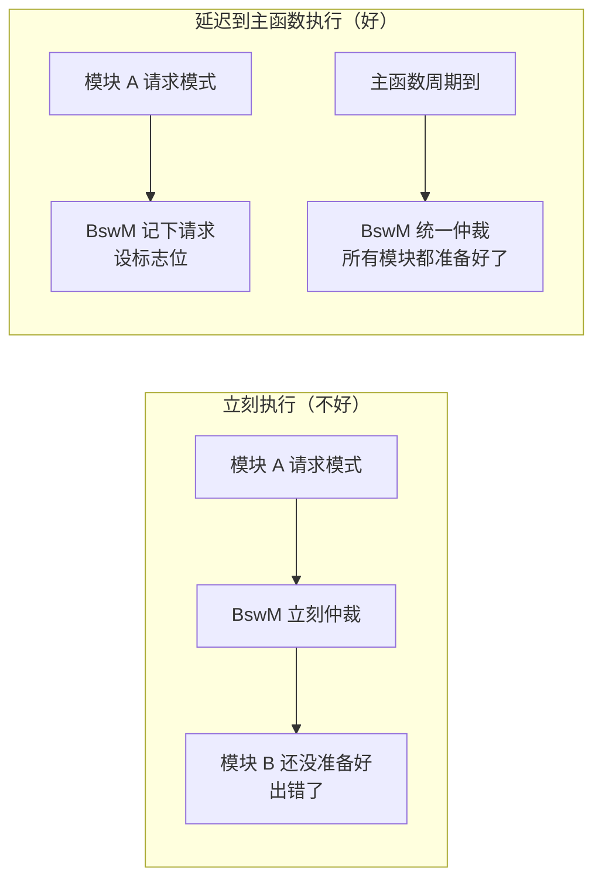
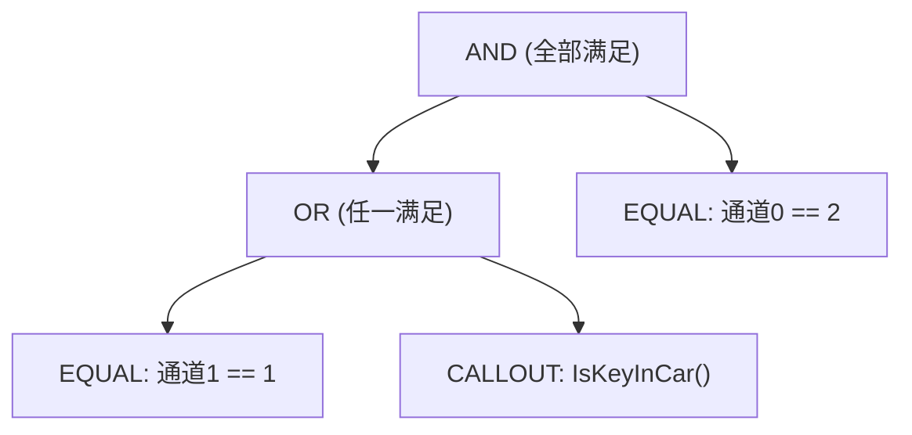
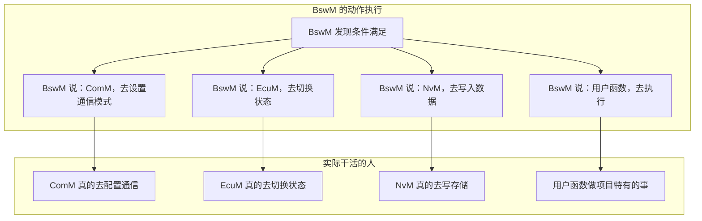
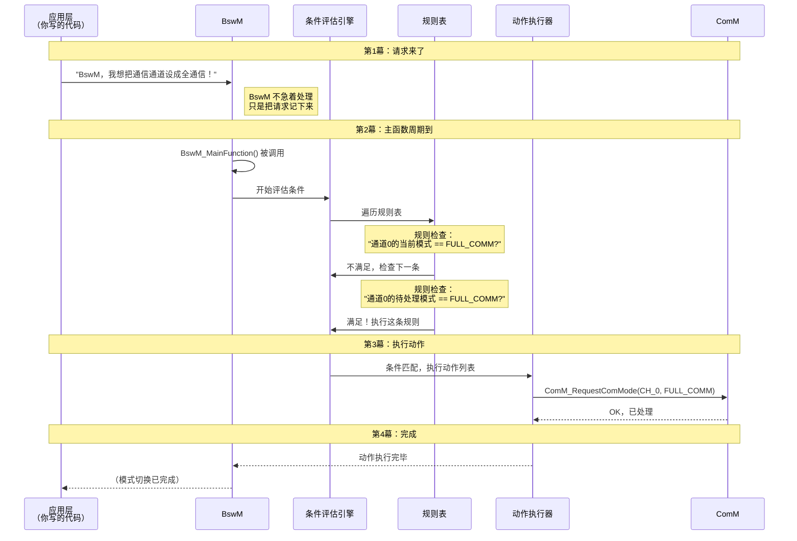

# BswM 代码通俗解读 — 像讲故事一样看懂 AUTOSAR 代码

---

## 零、这篇文章是写给谁的？

如果你符合以下**任何一条**，这篇文章就是为你准备的：

- 🔰 **刚接触 AUTOSAR**，被 BswM 的代码结构吓到了
- 🤔 **看得懂 C 语言**，但看不懂"为什么代码要这么写"
- 💡 **想知道"枚举""结构体""回调函数"这些概念在 BswM 里到底是什么意思**
- 🧩 **想把 BswM 的代码和实际功能对应起来**

> 这篇文章不讲复杂的规范条文，只讲**代码背后的设计逻辑**。每个专业名词出现时，我都会先用大白话说清楚它是什么。

---

## 一、先聊点轻松的 — BswM 到底在干什么？

### 一个你肯定能懂的例子：智能家居中控

想象你家里有一套**智能家居系统**，连接着：

- 🚪 **门锁传感器** — 有人开门会通知中控
- 🌡️ **空调** — 可以制冷或制热
- 💡 **灯光** — 可以开关和调亮度
- 📹 **摄像头** — 可以录制或待机

现在，你希望它们协同工作：

| 场景 | 你想要的行为 |
|------|------------|
| **晚上回家开门** | 开灯 → 关空调(省电) → 摄像头待机 |
| **白天在家** | 关灯 → 开空调 → 摄像头待机 |
| **出门** | 关灯 → 关空调 → 摄像头录像 |
| **火灾报警** | 无条件开灯 → 关空调 → 全功率录像 |

你作为屋主，不可能每次场景变化都**亲自**跑去操作每个设备。所以你需要一个**中控系统**来替你决策。

**BswM 就是这个"中控系统"**——只不过它管理的不是家居设备，而是汽车 ECU 里的各种软件模块。

### 用代码的思维翻译一下

| 家居场景的术语 | 代码世界的术语 |
|-------------|-------------|
| "你希望的行为" | **规则 (Rule)** |
| "回家/出门/火灾" | **条件 (Condition)** |
| "开灯/关空调" | **动作 (Action)** |
| "中控系统" | **BswM 模块** |
| 各种传感器 | **模式请求 (Mode Request)** |

---

## 二、BswM 代码的第一个秘密 — 它是"配置驱动"的

### 2.1 什么是"配置驱动"？

**大白话**：BswM 的核心代码（判断逻辑、执行流程）是**写死**在模块里的，但**规则内容**（什么条件触发什么动作）是通过**配置文件**告诉它的。

> 就像一台自动售货机：投币→选货→出货 的流程是固定的（核心代码），但里面卖什么饮料（规则配置）是可以换的。

**好处**：
- 你不需要修改 BswM 的源代码就能改变它的行为
- 汽车厂家的工程师只要改配置文件，不用懂 BswM 内部怎么实现的
- 同一个 BswM 代码可以用在不同车型上，只要配置不同就行

### 2.2 配置驱动在代码中长什么样

```c
// 核心代码（写死不动）：
void BswM_MainFunction(void) {
    EvaluateRules();   // ← 遍历所有规则，逐条评估
    ExecuteActions();  // ← 执行匹配的规则对应的动作
}

// 配置文件（可以随便改）：
// 规则 1: 如果 ECU 运行中 → 请求全通信
// 规则 2: 如果 ECU 休眠中 → 请求关闭通信
```

---

## 三、庖丁解牛 — 逐行读懂 BswM 的数据结构

这一节我们打开 `BswM_Cfg.h` 头文件，一行一行地看。每个"专业名词"我都会先用大白话解释。

### 3.1 第一组概念：枚举 — "从一堆选项里选一个"

```c
// 专业名词解释：什么是"枚举(enum)"？
// 大白话：枚举就是"把一堆相关的名字和数字对应起来"。
//         比如 0=无通信, 1=静默通信, 2=全通信
//         这样代码里写 COMM_FULL_COMMUNICATION 比写 2 好懂多了

/* 通信模式枚举 */
typedef enum {
    BSWM_COMM_NO_COMM = 0,      /* 无通信 — 什么报文都不发不收 */
    BSWM_COMM_SILENT_COMM,      /* 静默通信 — 能收报文，但不发 */
    BSWM_COMM_FULL_COMM         /* 全通信 — 正常收发 */
} BswM_CommModeType;
```

**为什么代码要这么写？**

如果没有枚举，你的代码里就会到处是魔法数字：
```c
// 没有枚举的写法（糟糕）：
if (mode == 0) { /* 无通信 */ }   // 0 是什么意思？要猜
if (mode == 2) { /* 全通信 */ }   // 2 又是什么意思？

// 有枚举的写法（清晰）：
if (mode == BSWM_COMM_NO_COMM)  { /* 无通信 */ }
if (mode == BSWM_COMM_FULL_COMM) { /* 全通信 */ }
```

> 💡 **设计思路**：枚举把"数字"翻译成了"人话"，让代码自解释(self-documenting)。

### 3.2 第二组概念：结构体 — "把相关的东西打包在一起"

```c
// 专业名词解释：什么是"结构体(struct)"？
// 大白话：结构体就像是一个"收纳盒"，把彼此相关的数据装在一起。
//         比如描述一个"人"：姓名、年龄、身高 → 装在一个盒子里

/* 单个条件结构体 — 描述"一个判断条件" */
typedef struct {
    BswM_ConditionType  type;          /* 条件的"种类"（是比大小？还是定时器？） */
    uint8_t             channelId;     /* 在哪个通道上判断（通信通道？诊断通道？） */
    uint8_t             expectedValue; /* 期望的模式值（比如：期望是 FULL_COMM） */
    uint32_t            timeoutMs;     /* 如果是定时器条件，超时时间是多少(毫秒) */
    boolean             (*callout)(void); /* 如果是用户自定义条件，调用哪个函数 */
    const void*         subConditions; /* 如果是组合条件(AND/OR)，子条件放这里 */
    uint8_t             subCount;      /* 子条件有多少个 */
} BswM_ConditionTypeDef;
```

**逐字段讲解：**

| 字段 | 中文 | 通俗解释 |
|------|------|---------|
| `type` | 条件类型 | 好比"判断方式的种类"——是检查"模式 == 期望值"？还是"定时器到期了没"？ |
| `channelId` | 通道ID | 好比"你要查哪个房间的温度"——这里是"你要查哪个模式通道的状态" |
| `expectedValue` | 期望值 | "我希望这个通道的值是多少"——比如我希望通信通道的值是 FULL_COMM |
| `timeoutMs` | 超时时间 | 只有条件类型是"定时器"时才用到——"等多久才算超时" |
| `callout` | 回调函数 | 函数指针——"调用一个你自己写的判断函数"（下面会详细讲） |
| `subConditions` | 子条件 | "当条件需要组合时用"——比如同时满足 A 和 B |

### 3.3 函数指针 — "存一个函数的地址，以后用它"

```c
// 专业名词解释：什么是"函数指针"？
// 大白话：变量存的是"数据"的地址，函数指针存的是"函数"的地址。
//         好比你把一个朋友的电话号码存下来，以后需要时打给他。

boolean (*callout)(void);
//         ↑        ↑
//      返回值类型  参数列表
//       这个指针指向一个"返回值是 boolean，参数是 void"的函数
```

**为什么 BswM 需要函数指针？**

因为 BswM 是"通用"的——它不知道你的具体项目里有什么特殊判断逻辑。通过函数指针，你可以"插"入自己的判断函数：

```c
// 场景：你的项目需要一个特殊判断——"车钥匙在车里吗？"
boolean IsKeyInCar(void) {
    // 读取钥匙检测传感器的值
    return ReadHardwarePin(KEY_SENSOR_PIN);
}

// 然后把这个函数"注册"到条件里：
BswM_ConditionTypeDef condition = {
    .type    = BSWM_COND_CALLOUT_RESULT,
    .callout = IsKeyInCar,   // ← 函数指针：指向你写的 IsKeyInCar
};
// 以后 BswM 评估这个条件时，就会自动调用 IsKeyInCar() 函数
```

> 💡 **设计思路**：函数指针实现了"框架代码不动，具体行为可扩展"——这就是设计模式中的**策略模式 (Strategy Pattern)**。

### 3.4 联合体 — "同一块内存，不同的时候存不同的东西"

```c
// 专业名词解释：什么是"联合体(union)"？
// 大白话：同一块内存，有时当"整数"用，有时当"结构体"用。
//         好比一个抽屉，早上放餐具，晚上放文具——不会同时放两样

typedef struct {
    BswM_ActionType actionType;  // 动作类型
    union {
        struct {              // 类型 1: 如果是"设置模式"动作
            uint8_t channelId;
            uint8_t targetMode;
        } modeRequest;

        struct {              // 类型 2: 如果是"调用回调"动作
            void (*calloutFunc)(void);
        } callout;

        struct {              // 类型 3: 如果是"切换调度表"动作
            uint8_t scheduleTableId;
        } schedule;
    } params;                 // ← 联合体：以上三个结构体共用一块内存
} BswM_ActionTypeDef;
```

**为什么需要联合体？**

因为一个"动作"只能是一种类型（要么设置模式、要么调用函数、要么切换调度表），不会同时是多种。用联合体**节省内存**——三个结构体如果各自占用，加起来可能 20 字节；用联合体，只需要最大的那个结构体的大小（可能 8 字节）。

> 💡 **设计思路**：联合体 + 枚举的组合是一种"手动多态"——C 语言没有面向对象的继承和多态，就用这种方式实现"同一接口，不同行为"。

---

## 四、庖丁解牛 — 读懂 BswM 的核心逻辑代码

### 4.1 初始化 — "开机时先把桌子摆好"

```c
void BswM_Init(const BswM_ConfigType* configPtr)
{
    // 白话：在 ECU 启动时，把 BswM 的"桌子"摆好
    //       1. 保存配置（记住规则是什么）
    //       2. 把所有通道设成默认状态（就像所有开关先复位）
    //       3. 把定时器清零

    uint8_t i;

    // ★ 安全检查：如果传进来的配置是空的，就报错
    if (configPtr == NULL_PTR) {
        BswM_Det_ReportError(BSWM_E_PARAM_POINTER, 0);
        return;
    }

    BswM_ConfigPtr = configPtr;  // 保存配置指针（记住规则）

    // ★ 遍历每个通道，设置为默认模式
    for (i = 0; i < configPtr->numChannels; i++) {
        BswM_ChannelConfigType* ch = &configPtr->channels[i];
        ch->currentMode  = ch->defaultMode;   // 当前模式 ← 默认值
        ch->pendingMode  = ch->defaultMode;   // 待处理模式 ← 默认值
        ch->isCommitted  = TRUE;              // 标记：已生效
        ch->refCount     = 0;                 // 引用计数清零
    }

    BswM_State = BSWM_STATE_RUNNING;  // 模块进入"运行中"状态
}
```

**设计逻辑总结**：

```
初始化 = 做三件事：
  ① 记住规则表（存指针）
  ② 把所有开关拨到默认位置（设默认值）
  ③ 状态灯从"未就绪"变成"运行中"
```

### 4.2 模式请求接口 — "有人敲门说：我要换模式！"

```c
Std_ReturnType BswM_ModeRequest(uint8_t channelId, uint8_t mode)
{
    // 白话：当别的模块对 BswM 说"我想把 X 通道切换成 Y 模式"时
    //       BswM 不会立刻执行，而是：
    //       1. 把请求记在"待处理"区
    //       2. 举手说"我有事要仲裁"
    //       等下次主函数运行时，再慢慢判断

    // ★ 安全检查：通道号是否合法？
    if (channelId >= BswM_ConfigPtr->numChannels) {
        return E_NOT_OK;  // "抱歉，没有这个通道"
    }

    // ★ 安全检查：BswM 初始化好了吗？
    if (BswM_State < BSWM_STATE_RUNNING) {
        return E_NOT_OK;  // "抱歉，我还没准备好"
    }

    // ★ 更新"待处理模式"
    BswM_ConfigPtr->channels[channelId].pendingMode = mode;

    // ★ 举起"需要仲裁"的旗帜
    BswM_ArbitrationPending = TRUE;

    return E_OK;  // "好的，我记下了，稍后会处理"
}
```

**为什么 BswM 不立刻执行，而要等主函数？**

这是嵌入式系统的一个**重要原则**：



> **原因**：BswM 的仲裁可能涉及到多个模块的状态变化，如果在中断上下文或任意时刻执行，可能会造成"条件还没准备全"的问题。统一在 `BswM_MainFunction()` 中处理，**保证了确定性**。

### 4.3 条件评估 — "一条一条地检查，条件是否满足"

```c
static boolean BswM_EvaluateCondition(
    const BswM_ConditionTypeDef* condition)
{
    // 白话：给定一个条件，判断它是否满足
    //       这就像一个"如果...就..."的前半部分
    //
    //       支持的条件类型：
    //       - 等于判断: X 通道的值是不是等于 Y？
    //       - 不等于判断: X 通道的值是不是不等于 Y？
    //       - 定时器: 定时器到期了吗？
    //       - 用户函数: 你写的函数返回 TRUE 了吗？
    //       - AND: 所有子条件都满足吗？
    //       - OR: 有任何一个子条件满足吗？

    boolean result = FALSE;

    // ★ 空条件 = 无条件的满足
    if (condition == NULL_PTR) {
        return TRUE;
    }

    switch (condition->type) {

        case BSWM_COND_MODE_EQUAL:
            // "当前值 == 期望值？"
            if (condition->channelId < BswM_ConfigPtr->numChannels) {
                result = (BswM_ConfigPtr->channels[condition->channelId].currentMode
                          == condition->expectedValue);
            }
            break;

        case BSWM_COND_MODE_NOT_EQUAL:
            // "当前值 != 期望值？"
            if (condition->channelId < BswM_ConfigPtr->numChannels) {
                result = (BswM_ConfigPtr->channels[condition->channelId].currentMode
                          != condition->expectedValue);
            }
            break;

        case BSWM_COND_TIMER_EXPIRED:
            // "定时器到期了吗？"（如果 timeoutMs == 0 表示到期了）
            result = (condition->timeoutMs == 0);
            break;

        case BSWM_COND_CALLOUT_RESULT:
            // "用户自己写的判断函数说了什么？"
            if (condition->callout != NULL_PTR) {
                result = condition->callout();
            }
            break;

        case BSWM_COND_LOGIC_AND:
        {
            // "所有子条件都满足吗？"（短路判断：遇到一个不满足就停）
            uint8_t i;
            result = TRUE;
            for (i = 0; i < condition->subCount; i++) {
                if (!BswM_EvaluateCondition(
                        &((BswM_ConditionTypeDef*)condition->subConditions)[i])) {
                    result = FALSE;
                    break;  // ★ 短路：有一个不满足，后面的不用看了
                }
            }
            break;
        }

        case BSWM_COND_LOGIC_OR:
        {
            // "有任何一个子条件满足吗？"（短路判断：遇到一个满足就停）
            uint8_t i;
            result = FALSE;
            for (i = 0; i < condition->subCount; i++) {
                if (BswM_EvaluateCondition(
                        &((BswM_ConditionTypeDef*)condition->subConditions)[i])) {
                    result = TRUE;
                    break;  // ★ 短路：有一个满足，后面的不用看了
                }
            }
            break;
        }
    }

    return result;
}
```

**⚡ 关键技术点：递归调用**

你有没有注意到 `BSWM_COND_LOGIC_AND` 和 `BSWM_COND_LOGIC_OR` 里，再次调用了 `BswM_EvaluateCondition()` 自己？

```c
// 在 AND 的处理代码内部：
for (i = 0; i < condition->subCount; i++) {
    if (!BswM_EvaluateCondition(   // ← 函数调用了自己！
            &((BswM_ConditionTypeDef*)condition->subConditions)[i])) {
```

这就是**递归 (Recursion)**——函数调用自身。

**为什么要用递归？** 因为条件可以是"套娃"结构：



对于这种**嵌套**结构，用递归是最自然的方式——每个条件节点都调用 `BswM_EvaluateCondition()`，不管它是什么类型、有多少层嵌套。

> 💡 **设计思路**：条件树 (Condition Tree) 模式 — 把复杂的判断条件组织成一棵树，递归遍历评估。这种模式在编译器的语法解析、决策系统中非常常见。

### 4.4 规则仲裁 — "规则引擎怎么工作的"

```c
static boolean BswM_EvaluateRules(void)
{
    // 白话：把规则表从头到尾过一遍
    //       规则按优先级排列（值越小优先级越高）
    //       找到第一个条件满足的规则，执行它的动作
    
    uint16_t i;
    boolean anyRuleTriggered = FALSE;

    for (i = 0; i < BswM_ConfigPtr->numRules; i++) {
        const BswM_RuleTypeDef* rule = &BswM_ConfigPtr->rules[i];

        // ★ 评估这个规则的条件是否满足
        boolean conditionMet = BswM_EvaluateCondition(rule->conditionRoot);

        if (conditionMet) {
            // 条件满足 → 执行动作列表
            BswM_ExecuteActionList(rule->actionList);
            anyRuleTriggered = TRUE;

            // ★ 如果规则是"抢占式"的，后面的规则就不看了
            if (rule->isPreemptive) {
                break;
            }
        }
    }

    return anyRuleTriggered;
}
```

**⚡ 关键技术点：抢占 (Preemption)**

这个 `isPreemptive` 标志是什么意思？用生活场景解释：

```
普通模式（非抢占）：
  规则1（优先级0）："诊断激活 → 静默通信" ✅ 条件满足 → 执行
  规则2（优先级10）："ECU运行 → 全通信"     ✅ 条件满足 → 也执行
  结果：先静默，再全通信 → 全通信覆盖了静默 ← 可能不是你想要的结果

抢占模式（isPreemptive = TRUE）：
  规则1（优先级0）："诊断激活 → 静默通信" ✅ 条件满足 → 执行 → 停！
  规则2（优先级10）："ECU运行 → 全通信"     ← 不执行了，因为规则1抢占了
  结果：静默通信 ← 诊断模式下这才是正确的行为
```

> 💡 **设计思路**：抢占机制确保了**高优先级的规则能"锁定"结果**，不会被低优先级的规则覆盖。这在汽车电子中非常重要——安全相关的决策必须优先。

### 4.5 动作执行 — "条件满足后，做什么？"

```c
static void BswM_ExecuteSingleAction(const BswM_ActionTypeDef* action)
{
    // 白话：执行一个动作
    //       根据动作的类型，调用不同的函数
    //       相当于"条件满足后的执行部分"

    if (action == NULL_PTR) {
        return;
    }

    switch (action->actionType) {

        case BSWM_ACTION_SET_COMM_MODE:
        {
            // "去设置通信模式！" → 调用 ComM 的接口
            ComM_RequestComMode(
                action->params.modeRequest.channelId,
                action->params.modeRequest.targetMode
            );
            break;
        }

        case BSWM_ACTION_SET_ECU_STATE:
        {
            // "去请求 ECU 状态切换！" → 调用 EcuM 的接口
            EcuM_RequestState(action->params.modeRequest.targetMode);
            break;
        }

        case BSWM_ACTION_NVM_WRITE:
        {
            // "去写 NVRAM！" → 调用 NvM 的接口
            NvM_WriteBlock(NVM_BSWM_BLOCK_ID, NULL_PTR);
            break;
        }

        case BSWM_ACTION_CALLOUT:
        {
            // "调用用户写的函数！" → 执行用户注册的回调
            if (action->params.callout.calloutFunc != NULL_PTR) {
                action->params.callout.calloutFunc();
            }
            break;
        }

        case BSWM_ACTION_SCHEDULE_SWITCH:
        {
            // "切换操作系统的调度表！" → 调用 SchM 的接口
            SchM_SwitchScheduleTable(action->params.schedule.scheduleTableId);
            break;
        }
    }
}
```

**⚡ 关键技术点：间接调用 (Indirection)**

你有没有注意到，BswM 的"执行动作"实际上**不自己做任何事情**——它只是**调用其他模块的函数**：



> 💡 **设计思路**：这就是**中介者模式 (Mediator Pattern)**——BswM 就像一个总机接线员：它不自己发电报，但知道应该把电话转给谁。这样做的好处是，各个模块之间不用互相知道对方的存在，降低了耦合度。

---

## 五、把整个流程串起来 — 一条请求的"生命旅程"

### 5.1 完整调用链的故事版

让我们跟着一个模式请求，看它从诞生到执行完毕的完整旅程：



### 5.2 同一段流程的代码版本

```c
// ===== 第1幕：应用层发起请求 =====
// 某个应用组件（或 BSW 模块）调用：
BswM_ModeRequest(BSWM_CHANNEL_COMM, COMM_FULL_COMMUNICATION);
// → BswM 把请求记在 pendingMode 中，设 BswM_ArbitrationPending = TRUE
// → 函数立即返回


// ===== 第2幕：操作系统周期性调用 BswM_MainFunction =====
void BswM_MainFunction(void)
{
    if (BswM_State != BSWM_STATE_RUNNING) return;

    if (BswM_ArbitrationPending && !BswM_ArbitrationBusy) {
        BswM_ArbitrationBusy = TRUE;
        BswM_ArbitrationPending = FALSE;

        // → 进入 BswM_EvaluateRules()
        //   → 遍历规则表
        //   → 对每条规则调用 BswM_EvaluateCondition()
        //     → 递归评估条件树
        //   → 找到匹配的规则
        //   → 调用 BswM_ExecuteActionList()
        BswM_EvaluateRules();

        BswM_ArbitrationBusy = FALSE;
    }
}


// ===== 第3幕：动作执行 =====
// BswM_EvaluateRules() → 找到匹配规则后，调用：
// BswM_ExecuteActionList(rule->actionList)
//   → 遍历 actionList 中的每个动作
//   → 对每个动作调用 BswM_ExecuteSingleAction(action)
//     → 根据 actionType 调用不同的接口函数


// ===== 第4幕：效果反馈 =====
// ComM 设置完成 → 通过回调通知 BswM
// BswM 更新通道的 currentMode
```

---

## 六、BswM 代码中的"设计套路"总结

### 6.1 代码中的模式一览

| 你可能会觉得"这代码为什么这样写" | 背后的设计模式 | 通俗解释 |
|------|------|---------|
| 条件用结构体树形组织，递归评估 | **Composite（组合模式）** | 就像文件系统：文件夹套文件夹，不管在哪一层，都用同一个函数处理 |
| 动作执行时不直接做事，而是调用别的模块 | **Mediator（中介者模式）** | 就像前台接线员——自己不干活，但知道该找谁干 |
| 规则表按优先级排序，逐个检查 | **Chain of Responsibility（职责链）** | 就像逐级审批——第一个能处理的人处理了，后面的就不看了 |
| 条件类型可以扩展（用户回调） | **Strategy（策略模式）** | 就像手机 App 可以装插件——核心框架不变，功能可插拔 |
| 每个通道有自己的状态 | **State（状态模式）** | 就像红绿灯——在不同状态下，对同一件事的反应不同 |

### 6.2 为什么 BswM 的代码"绕来绕去"？

第一次接触 BswM 代码的人经常会说：

> "为什么不直接写 `if (condition) { do_something(); }`，非要搞这么多结构体、回调、递归？"

**答案：因为 BswM 不知道你的条件是什么。**

```c
// 如果 BswM 只服务一个项目，可以这样写：
if (isEngineRunning && isKeyInCar && !isDiagnosticActive) {
    startFullCommunication();
    enableAllMessages();
}

// 但 BswM 要服务所有项目（不同车型、不同厂家）：
// → 条件是什么？不知道，你配在规则表里
// → 要做什么？不知道，你配在动作列表里
// → 所以只能用"配置驱动"的方式
```

**BswM 代码的设计目标不是"简单"，而是"通用"和"可配置"。**

### 6.3 一个帮你理解代码的"翻译表"

| 代码里写的 | 其实就是 | 类比 |
|-----------|---------|------|
| `typedef enum {...} XxxType;` | "定义一组选项" | 下拉菜单的选项列表 |
| `typedef struct {...} XxxType;` | "把相关的数据打包" | 一张表单上的多个字段 |
| `->`（箭头运算符） | "访问结构体里的成员" | 打开文件夹，拿里面的文件 |
| `switch-case` | "根据不同情况做不同事" | 多路岔路口，每条路通向不同的地方 |
| `function pointer` | "存一个待调用的函数" | 写一张便条："如果有情况，打这个电话" |
| `recursion` | "函数自己调自己" | 俄罗斯套娃：打开一个，里面还有同样的一个 |
| `for` 循环遍历规则表 | "一条一条检查规则" | 拿着清单，逐项打勾 |
| `break;`（在 for 里） | "找到了，后面的不看了" | 在名单上找到了你要找的人，后面的名字不用看了 |
| `E_OK` / `E_NOT_OK` | "成功" / "失败" | 绿色对号 / 红色叉号 |
| `NULL_PTR` | "空指针，啥也没有" | 一个信封上写了地址，但里面是空的 |

---

## 七、一句话总结 BswM 的代码哲学

> **BswM 的代码不是用来直接"干活"的，而是用来"管理"的。**
>
> 它像一个公司的总经理：不自己写代码、不自己焊电路、不自己发 CAN 报文。它只是**告诉别人该干什么**。
>
> 所以它的代码里充满了：
> - **配置表**（公司的规章制度）
> - **条件判断**（什么情况下该怎么做）
> - **调用其他模块**（通知各部门执行）
> - **回调函数**（特殊情况让具体负责人决定）


---

## 附录：BswM 代码中常见的英文术语对照表

| 英文术语 | 中文翻译 | 大白话解释 |
|---------|---------|-----------|
| **Arbitration** | 仲裁 | 多个请求同时到达，决定听谁的 |
| **Rule** | 规则 | 如果 XX 条件满足，就做 YY 事情 |
| **Condition** | 条件 | 一个判断表达式，结果是真或假 |
| **Action** | 动作 | 条件满足后要执行的操作 |
| **Trigger** | 触发 | 某个事件发生后，启动一个流程 |
| **Channel** | 通道 | 一个独立的管理维度（如"通信"是一个通道） |
| **Mode** | 模式 | 一种运行状态（如"全通信""静默""关闭"） |
| **Callback / Callout** | 回调函数 | 你写一个函数，BswM 在需要时调用它 |
| **Polling** | 轮询 | 周期性检查（每隔 X 毫秒看一次） |
| **Event** | 事件 | 突然发生的事情（不需要等轮询） |
| **Preemption** | 抢占 | 高优先级打断低优先级 |
| **Defer** | 延迟 | 不立即执行，等一会儿再执行 |
| **Pending** | 待处理 | 已经收到但还没处理完的请求 |
| **Pointer** | 指针 | C 语言中"存放地址的变量" |
| **Reference** | 引用 | 某个东西的"位置信息"（不直接是值本身） |
