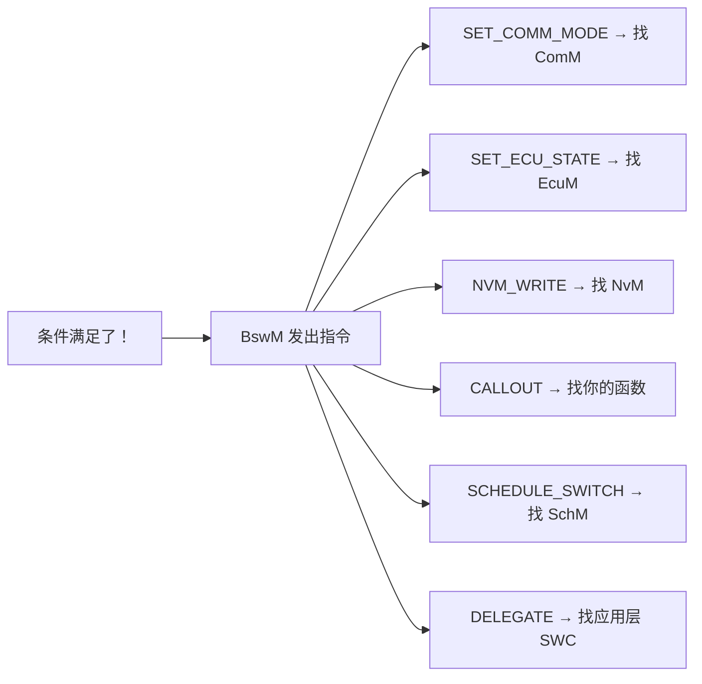
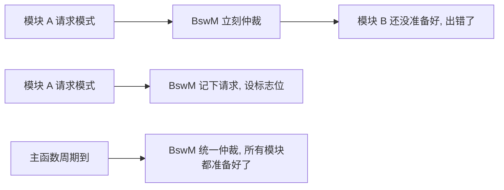
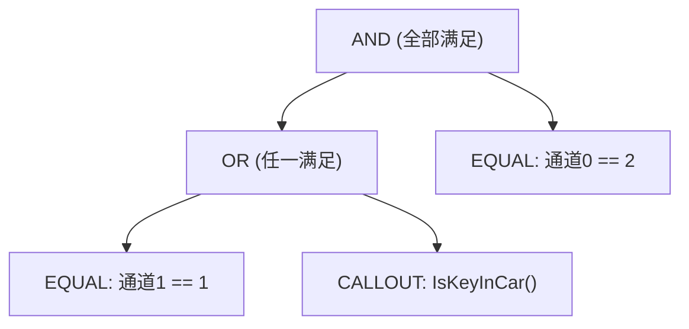
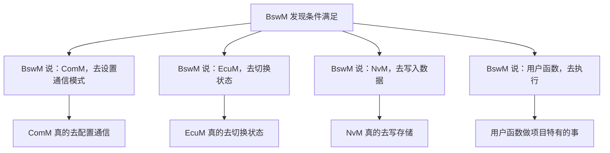
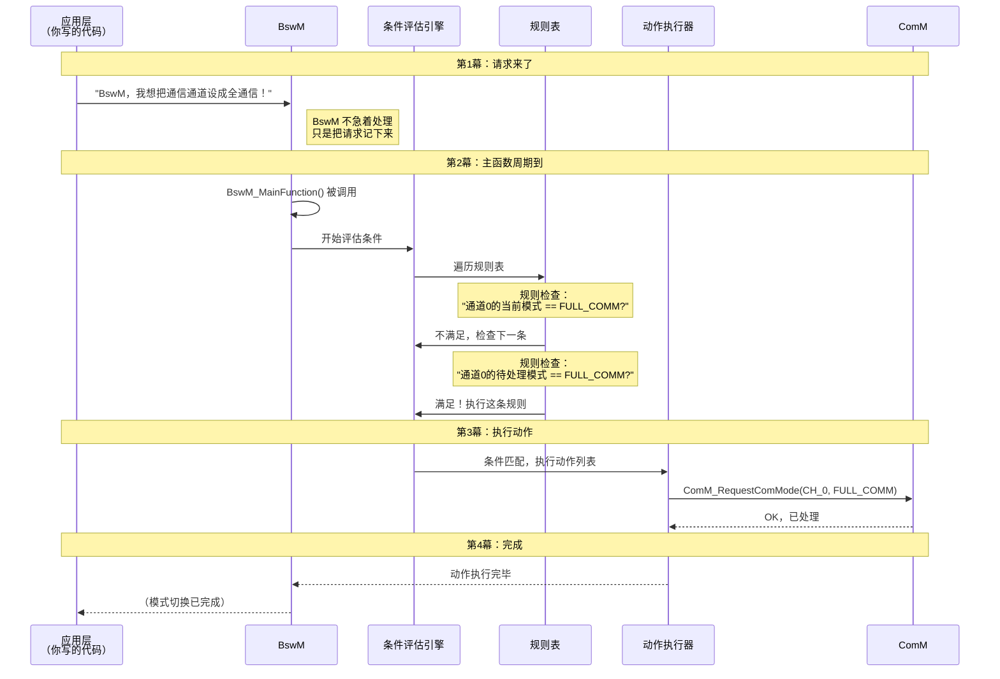
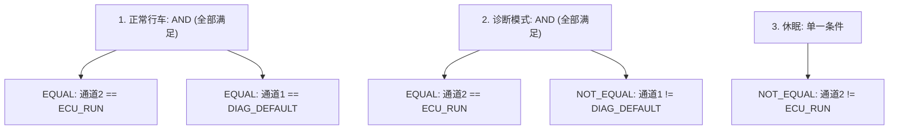
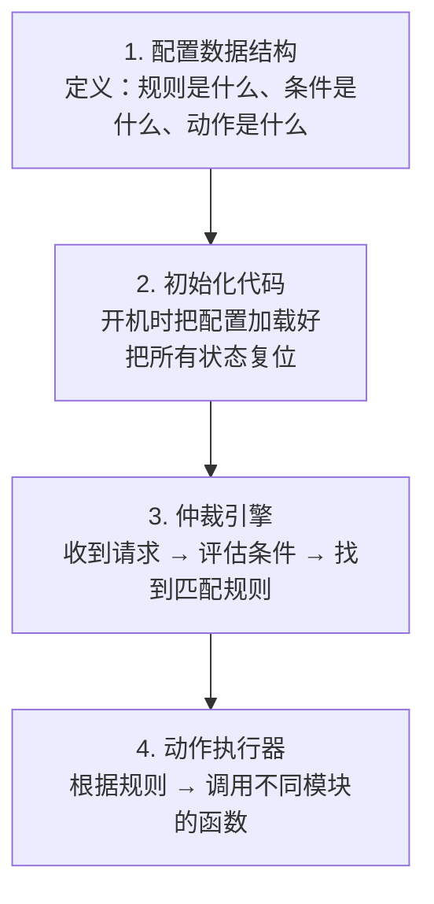

# BswM 代码通俗解读 — 像讲故事一样看懂 AUTOSAR 代码

---

## 零、这篇文章是写给谁的？

如果你符合以下**任何一条**，这篇文章就是为你准备的：

- 🔰 **刚接触 AUTOSAR**，被 BswM 的代码结构吓到了
- 🤔 **看得懂 C 语言**，但看不懂"为什么代码要这么写"
- 💡 **想知道"枚举""结构体""回调函数"这些概念在 BswM 里到底是什么意思**
- 🧩 **想把 BswM 的代码和实际功能对应起来**

> 这篇文章不讲复杂的规范条文，只讲**代码背后的设计逻辑**。每个专业名词出现时，我都会先用大白话说清楚它是什么。

---

## 一、先聊点轻松的 — BswM 到底在干什么？

### 一个你肯定能懂的例子：智能家居中控

想象你家里有一套**智能家居系统**，连接着：

- 🚪 **门锁传感器** — 有人开门会通知中控
- 🌡️ **空调** — 可以制冷或制热
- 💡 **灯光** — 可以开关和调亮度
- 📹 **摄像头** — 可以录制或待机

现在，你希望它们协同工作：

| 场景 | 你想要的行为 |
|------|------------|
| **晚上回家开门** | 开灯 → 关空调(省电) → 摄像头待机 |
| **白天在家** | 关灯 → 开空调 → 摄像头待机 |
| **出门** | 关灯 → 关空调 → 摄像头录像 |
| **火灾报警** | 无条件开灯 → 关空调 → 全功率录像 |

你作为屋主，不可能每次场景变化都**亲自**跑去操作每个设备。所以你需要一个**中控系统**来替你决策。

**BswM 就是这个"中控系统"**——只不过它管理的不是家居设备，而是汽车 ECU 里的各种软件模块。

### 用代码的思维翻译一下

| 家居场景的术语 | 代码世界的术语 |
|-------------|-------------|
| "你希望的行为" | **规则 (Rule)** |
| "回家/出门/火灾" | **条件 (Condition)** |
| "开灯/关空调" | **动作 (Action)** |
| "中控系统" | **BswM 模块** |
| 各种传感器 | **模式请求 (Mode Request)** |

---

## 二、BswM 代码的第一个秘密 — 它是"配置驱动"的

### 2.1 什么是"配置驱动"？

**大白话**：BswM 的核心代码（判断逻辑、执行流程）是**写死**在模块里的，但**规则内容**（什么条件触发什么动作）是通过**配置文件**告诉它的。

> 就像一台自动售货机：投币→选货→出货 的流程是固定的（核心代码），但里面卖什么饮料（规则配置）是可以换的。

**好处**：
- 你不需要修改 BswM 的源代码就能改变它的行为
- 汽车厂家的工程师只要改配置文件，不用懂 BswM 内部怎么实现的
- 同一个 BswM 代码可以用在不同车型上，只要配置不同就行

### 2.2 配置驱动在代码中长什么样

```c
// 核心代码（写死不动）：
void BswM_MainFunction(void) {
    EvaluateRules();   // ← 遍历所有规则，逐条评估
    ExecuteActions();  // ← 执行匹配的规则对应的动作
}

// 配置文件（可以随便改）：
// 规则 1: 如果 ECU 运行中 → 请求全通信
// 规则 2: 如果 ECU 休眠中 → 请求关闭通信
```

---

## 三、庖丁解牛 — 逐行读懂 BswM 的数据结构

这一节我们打开 `BswM_Cfg.h` 头文件，一行一行地看。每个"专业名词"我都会先用大白话解释。

### 3.1 第一组概念：枚举 — "从一堆选项里选一个"

```c
// 专业名词解释：什么是"枚举(enum)"？
// 大白话：枚举就是"把一堆相关的名字和数字对应起来"。
//         比如 0=无通信, 1=静默通信, 2=全通信
//         这样代码里写 COMM_FULL_COMMUNICATION 比写 2 好懂多了

/* 通信模式枚举 */
typedef enum {
    BSWM_COMM_NO_COMM = 0,      /* 无通信 — 什么报文都不发不收 */
    BSWM_COMM_SILENT_COMM,      /* 静默通信 — 能收报文，但不发 */
    BSWM_COMM_FULL_COMM         /* 全通信 — 正常收发 */
} BswM_CommModeType;
```

**为什么代码要这么写？**

如果没有枚举，你的代码里就会到处是魔法数字：
```c
// 没有枚举的写法（糟糕）：
if (mode == 0) { /* 无通信 */ }   // 0 是什么意思？要猜
if (mode == 2) { /* 全通信 */ }   // 2 又是什么意思？

// 有枚举的写法（清晰）：
if (mode == BSWM_COMM_NO_COMM)  { /* 无通信 */ }
if (mode == BSWM_COMM_FULL_COMM) { /* 全通信 */ }
```

> 💡 **设计思路**：枚举把"数字"翻译成了"人话"，让代码自解释(self-documenting)。

#### 3.1.1 条件类型枚举 — "有哪些判断方式？"

```c
// 大白话：BswM 支持哪些"判断方式"？
//         就像遥控器上有不同的按键：
//         - "等于": 判断 A 是否等于 B
//         - "不等于": 判断 A 是否不等于 B
//         - "定时器": 等一段时间到了没有
//         - "用户函数": 让你自己写判断逻辑
//         - "AND": 多个条件同时满足
//         - "OR": 多个条件满足其一就行

typedef enum {
    BSWM_COND_MODE_EQUAL,          /* 等于 — 通道的值 == 期望值？ */
    BSWM_COND_MODE_NOT_EQUAL,      /* 不等于 — 通道的值 != 期望值？ */
    BSWM_COND_TIMER_EXPIRED,       /* 定时器 — 预设时间到了吗？ */
    BSWM_COND_CALLOUT_RESULT,      /* 用户函数 — 你写的函数返回 true？ */
    BSWM_COND_LOGIC_AND,           /* 逻辑与 — 所有子条件都满足？ */
    BSWM_COND_LOGIC_OR             /* 逻辑或 — 任一子条件满足？ */
} BswM_ConditionType;
```

**这段代码在讲什么？**

这 6 种类型就是 BswM 能理解的**所有判断方式**。你可以把它们想象成 6 种不同的"量尺"：

| 条件类型 | 通俗理解 | 使用场景 |
|---------|---------|---------|
| `MODE_EQUAL` | "现在是不是 X 状态？" | 检查通信模式是不是 FULL_COMM |
| `MODE_NOT_EQUAL` | "现在是不是不是 X 状态？" | 检查诊断模式是不是**不是** DEFAULT |
| `TIMER_EXPIRED` | "等了多久了？到了没？" | 延迟执行，比如等 NVRAM 写完 |
| `CALLOUT_RESULT` | "打个电话问问别人" | 调用你自定义的判断函数 |
| `AND` | "所有条件都满足吗？" | (ECU运行中) **且** (不是诊断模式) |
| `OR` | "有任何一个满足吗？" | (ECU在休眠) **或** (ECU在关闭) |

#### 3.1.2 动作类型枚举 — "可以做哪些事？"

```c
// 大白话：BswM 条件满足后，可以"命令"其他模块做什么
//         就像总经理的指令类型：
//         - "去通知通信部": 设置通信模式
//         - "去通知行政部": 切换 ECU 状态
//         - "去存档": 写入 NVRAM
//         - "去叫老王": 调用你写的函数

typedef enum {
    BSWM_ACTION_SET_COMM_MODE,       /* 设置通信模式 — 告诉 ComM 切换 */
    BSWM_ACTION_SET_ECU_STATE,       /* 设置 ECU 状态 — 告诉 EcuM 切换 */
    BSWM_ACTION_NVM_WRITE,           /* NVRAM 写入 — 告诉 NvM 保存数据 */
    BSWM_ACTION_CALLOUT,             /* 用户回调 — 调用你注册的函数 */
    BSWM_ACTION_SCHEDULE_SWITCH,     /* 切换调度表 — 调整任务的执行节奏 */
    BSWM_ACTION_DELEGATE,            /* 委托给 SWC — 让应用层自己决定 */
    BSWM_ACTION_SET_MODE_INDICATOR   /* 设置模式指示 — 通知其他模块模式变了 */
} BswM_ActionType;
```

**这段代码在讲什么？**

条件满足后 BswM 可以发出 7 种不同的"指令"。每个指令对应一个**具体的执行者**：



### 3.2 第二组概念：结构体 — "把相关的东西打包在一起"

```c
// 专业名词解释：什么是"结构体(struct)"？
// 大白话：结构体就像是一个"收纳盒"，把彼此相关的数据装在一起。
//         比如描述一个"人"：姓名、年龄、身高 → 装在一个盒子里

/* 单个条件结构体 — 描述"一个判断条件" */
typedef struct {
    BswM_ConditionType  type;          /* 条件的"种类"（是比大小？还是定时器？） */
    uint8_t             channelId;     /* 在哪个通道上判断（通信通道？诊断通道？） */
    uint8_t             expectedValue; /* 期望的模式值（比如：期望是 FULL_COMM） */
    uint32_t            timeoutMs;     /* 如果是定时器条件，超时时间是多少(毫秒) */
    boolean             (*callout)(void); /* 如果是用户自定义条件，调用哪个函数 */
    const void*         subConditions; /* 如果是组合条件(AND/OR)，子条件放这里 */
    uint8_t             subCount;      /* 子条件有多少个 */
} BswM_ConditionTypeDef;
```

**逐字段讲解：**

| 字段 | 中文 | 通俗解释 |
|------|------|---------|
| `type` | 条件类型 | 好比"判断方式的种类"——是检查"模式 == 期望值"？还是"定时器到期了没"？ |
| `channelId` | 通道ID | 好比"你要查哪个房间的温度"——这里是"你要查哪个模式通道的状态" |
| `expectedValue` | 期望值 | "我希望这个通道的值是多少"——比如我希望通信通道的值是 FULL_COMM |
| `timeoutMs` | 超时时间 | 只有条件类型是"定时器"时才用到——"等多久才算超时" |
| `callout` | 回调函数 | 函数指针——"调用一个你自己写的判断函数"（下面会详细讲） |
| `subConditions` | 子条件 | "当条件需要组合时用"——比如同时满足 A 和 B |

### 3.3 函数指针 — "存一个函数的地址，以后用它"

```c
// 专业名词解释：什么是"函数指针"？
// 大白话：变量存的是"数据"的地址，函数指针存的是"函数"的地址。
//         好比你把一个朋友的电话号码存下来，以后需要时打给他。

boolean (*callout)(void);
//         ↑        ↑
//      返回值类型  参数列表
//       这个指针指向一个"返回值是 boolean，参数是 void"的函数
```

**为什么 BswM 需要函数指针？**

因为 BswM 是"通用"的——它不知道你的具体项目里有什么特殊判断逻辑。通过函数指针，你可以"插"入自己的判断函数：

```c
// 场景：你的项目需要一个特殊判断——"车钥匙在车里吗？"
boolean IsKeyInCar(void) {
    // 读取钥匙检测传感器的值
    return ReadHardwarePin(KEY_SENSOR_PIN);
}

// 然后把这个函数"注册"到条件里：
BswM_ConditionTypeDef condition = {
    .type    = BSWM_COND_CALLOUT_RESULT,
    .callout = IsKeyInCar,   // ← 函数指针：指向你写的 IsKeyInCar
};
// 以后 BswM 评估这个条件时，就会自动调用 IsKeyInCar() 函数
```

> 💡 **设计思路**：函数指针实现了"框架代码不动，具体行为可扩展"——这就是设计模式中的**策略模式 (Strategy Pattern)**。

### 3.4 联合体 — "同一块内存，不同的时候存不同的东西"

```c
// 专业名词解释：什么是"联合体(union)"？
// 大白话：同一块内存，有时当"整数"用，有时当"结构体"用。
//         好比一个抽屉，早上放餐具，晚上放文具——不会同时放两样

typedef struct {
    BswM_ActionType actionType;  // 动作类型
    union {
        struct {              // 类型 1: 如果是"设置模式"动作
            uint8_t channelId;
            uint8_t targetMode;
        } modeRequest;

        struct {              // 类型 2: 如果是"调用回调"动作
            void (*calloutFunc)(void);
        } callout;

        struct {              // 类型 3: 如果是"切换调度表"动作
            uint8_t scheduleTableId;
        } schedule;
    } params;                 // ← 联合体：以上三个结构体共用一块内存
} BswM_ActionTypeDef;

// 逐字段讲解：
// actionType = 动作类型。决定"我要做什么"——设置模式？调用函数？切换调度表？
// params     = 动作参数。"做什么的具体内容"——设置成什么模式？调用哪个函数？

// 以"设置通信模式"为例：
//   actionType = BSWM_ACTION_SET_COMM_MODE  ← "我要设置通信模式"
//   params.modeRequest.channelId = 0          ← "在 0 号通道上设"
//   params.modeRequest.targetMode = 2         ← "设成 FULL_COMM(全通信)"

// 以"调用用户回调"为例：
//   actionType = BSWM_ACTION_CALLOUT          ← "我要调用用户函数"
//   params.callout.calloutFunc = MyFunction    ← "调用 MyFunction 这个函数"
```

**为什么需要联合体？**

因为一个"动作"只能是一种类型（要么设置模式、要么调用函数、要么切换调度表），不会同时是多种。用联合体**节省内存**——三个结构体如果各自占用，加起来可能 20 字节；用联合体，只需要最大的那个结构体的大小（可能 8 字节）。

> 💡 **设计思路**：联合体 + 枚举的组合是一种"手动多态"——C 语言没有面向对象的继承和多态，就用这种方式实现"同一接口，不同行为"。

### 3.5 再补两个结构体 — 通道配置和整体配置

下面这两个结构体在 `BswM_Init()` 中用到过，现在来看看它们长什么样。

```c
// ===== 通道配置结构体 =====
// 大白话：每个"模式通道"都有自己的"仪表盘"，
//         上面显示着当前状态、待处理状态、引用计数等

typedef struct {
    uint8_t     channelId;      /* 通道编号 (0, 1, 2...) — 谁是第几号通道 */
    uint8_t     defaultMode;    /* 默认模式 — 开机时的初始状态 */
    uint8_t     currentMode;    /* 当前模式 — 现在正处于什么模式 */
    uint8_t     pendingMode;    /* 待处理模式 — 别人请求切换到的模式 */
    boolean     isCommitted;    /* 是否已生效 — true=当前模式已经稳定生效 */
    uint8_t     refCount;       /* 引用计数 — 有多少个模块引用了这个通道 */
} BswM_ChannelConfigType;

// 逐字段讲解：
// channelId    = 通道编号。就像每个员工有工号一样，每个通道有个 ID。
// defaultMode  = 默认状态。就像电脑开机时的"桌面"——每次上电都回到这个状态。
// currentMode  = 当前状态。就像"现在在哪个房间"——实时位置。
// pendingMode  = 待处理状态。就像"有人叫你换房间，但你还没动身"——目的地。
// isCommitted  = 是否已生效。"已经安顿好了吗？"——true = 安顿好了。
// refCount     = 引用计数。"有多少人在用这个通道？"——没人用时可以安全切换。


// ===== BswM 整体配置结构体 =====
// 大白话：这是 BswM 的"总配置文件"，
//         告诉 BswM：
//         - 有哪些通道要管？
//         - 有哪些规则要遵守？
//         - 多长时间检查一次？

typedef struct {
    const BswM_ChannelConfigType*  channels;      /* 所有通道的配置数组 */
    uint8_t                         numChannels;  /* 通道的总数量 */
    const BswM_RuleTypeDef*         rules;         /* 所有规则的定义数组 */
    uint16_t                        numRules;     /* 规则的总数量 */
    uint32_t                        mainPeriodMs; /* 主函数的调用周期(毫秒) */
} BswM_ConfigType;

// 逐字段讲解：
// channels   = 通道列表。像一本"部门花名册"——记录着每个通道的信息。
// numChannels = 有几个通道。就是花名册上有几个人。
// rules       = 规则列表。像一本"规章制度手册"。
// numRules    = 有几条规则。手册上有几条制度。
// mainPeriodMs = 多长时间检查一次。像"每 10 分钟巡逻一次"。
```

**为什么这些结构体要放在配置里？**

因为不同的项目、不同的车型，需要的通道数和规则数**完全不同**：

```
项目 A（普通乘用车）：
  - 通道数: 3 (通信、ECU状态、诊断)
  - 规则数: 5

项目 B（高端 SUV）：
  - 通道数: 8 (通信×2、ECU状态、诊断、LIN、FR、ETH、安全)
  - 规则数: 35

同一个 BswM 代码，通过不同的配置就能适应这两个项目。
这就是"配置驱动设计"的力量。
```

---

## 四、庖丁解牛 — 读懂 BswM 的核心逻辑代码

### 4.1 初始化 — "开机时先把桌子摆好"

```c
void BswM_Init(const BswM_ConfigType* configPtr)
{
    // 白话：在 ECU 启动时，把 BswM 的"桌子"摆好
    //       1. 保存配置（记住规则是什么）
    //       2. 把所有通道设成默认状态（就像所有开关先复位）
    //       3. 把定时器清零

    uint8_t i;

    // ★ 安全检查：如果传进来的配置是空的，就报错
    if (configPtr == NULL_PTR) {
        BswM_Det_ReportError(BSWM_E_PARAM_POINTER, 0);
        return;
    }

    BswM_ConfigPtr = configPtr;  // 保存配置指针（记住规则）

    // ★ 遍历每个通道，设置为默认模式
    for (i = 0; i < configPtr->numChannels; i++) {
        BswM_ChannelConfigType* ch = &configPtr->channels[i];
        ch->currentMode  = ch->defaultMode;   // 当前模式 ← 默认值
        ch->pendingMode  = ch->defaultMode;   // 待处理模式 ← 默认值
        ch->isCommitted  = TRUE;              // 标记：已生效
        ch->refCount     = 0;                 // 引用计数清零
    }

    BswM_State = BSWM_STATE_RUNNING;  // 模块进入"运行中"状态
}
```

**设计逻辑总结**：

```
初始化 = 做三件事：
  ① 记住规则表（存指针）
  ② 把所有开关拨到默认位置（设默认值）
  ③ 状态灯从"未就绪"变成"运行中"
```

### 4.2 模式请求接口 — "有人敲门说：我要换模式！"

```c
Std_ReturnType BswM_ModeRequest(uint8_t channelId, uint8_t mode)
{
    // 白话：当别的模块对 BswM 说"我想把 X 通道切换成 Y 模式"时
    //       BswM 不会立刻执行，而是：
    //       1. 把请求记在"待处理"区
    //       2. 举手说"我有事要仲裁"
    //       等下次主函数运行时，再慢慢判断

    // ★ 安全检查：通道号是否合法？
    if (channelId >= BswM_ConfigPtr->numChannels) {
        return E_NOT_OK;  // "抱歉，没有这个通道"
    }

    // ★ 安全检查：BswM 初始化好了吗？
    if (BswM_State < BSWM_STATE_RUNNING) {
        return E_NOT_OK;  // "抱歉，我还没准备好"
    }

    // ★ 更新"待处理模式"
    BswM_ConfigPtr->channels[channelId].pendingMode = mode;

    // ★ 举起"需要仲裁"的旗帜
    BswM_ArbitrationPending = TRUE;

    return E_OK;  // "好的，我记下了，稍后会处理"
}
```

**为什么 BswM 不立刻执行，而要等主函数？**

这是嵌入式系统的一个**重要原则**：



> **原因**：BswM 的仲裁可能涉及到多个模块的状态变化，如果在中断上下文或任意时刻执行，可能会造成"条件还没准备全"的问题。统一在 `BswM_MainFunction()` 中处理，**保证了确定性**。

### 4.3 条件评估 — "一条一条地检查，条件是否满足"

```c
static boolean BswM_EvaluateCondition(
    const BswM_ConditionTypeDef* condition)
{
    // 白话：给定一个条件，判断它是否满足
    //       这就像一个"如果...就..."的前半部分
    //
    //       支持的条件类型：
    //       - 等于判断: X 通道的值是不是等于 Y？
    //       - 不等于判断: X 通道的值是不是不等于 Y？
    //       - 定时器: 定时器到期了吗？
    //       - 用户函数: 你写的函数返回 TRUE 了吗？
    //       - AND: 所有子条件都满足吗？
    //       - OR: 有任何一个子条件满足吗？

    boolean result = FALSE;

    // ★ 空条件 = 无条件的满足
    if (condition == NULL_PTR) {
        return TRUE;
    }

    switch (condition->type) {

        case BSWM_COND_MODE_EQUAL:
            // "当前值 == 期望值？"
            if (condition->channelId < BswM_ConfigPtr->numChannels) {
                result = (BswM_ConfigPtr->channels[condition->channelId].currentMode
                          == condition->expectedValue);
            }
            break;

        case BSWM_COND_MODE_NOT_EQUAL:
            // "当前值 != 期望值？"
            if (condition->channelId < BswM_ConfigPtr->numChannels) {
                result = (BswM_ConfigPtr->channels[condition->channelId].currentMode
                          != condition->expectedValue);
            }
            break;

        case BSWM_COND_TIMER_EXPIRED:
            // "定时器到期了吗？"（如果 timeoutMs == 0 表示到期了）
            result = (condition->timeoutMs == 0);
            break;

        case BSWM_COND_CALLOUT_RESULT:
            // "用户自己写的判断函数说了什么？"
            if (condition->callout != NULL_PTR) {
                result = condition->callout();
            }
            break;

        case BSWM_COND_LOGIC_AND:
        {
            // "所有子条件都满足吗？"（短路判断：遇到一个不满足就停）
            uint8_t i;
            result = TRUE;
            for (i = 0; i < condition->subCount; i++) {
                if (!BswM_EvaluateCondition(
                        &((BswM_ConditionTypeDef*)condition->subConditions)[i])) {
                    result = FALSE;
                    break;  // ★ 短路：有一个不满足，后面的不用看了
                }
            }
            break;
        }

        case BSWM_COND_LOGIC_OR:
        {
            // "有任何一个子条件满足吗？"（短路判断：遇到一个满足就停）
            uint8_t i;
            result = FALSE;
            for (i = 0; i < condition->subCount; i++) {
                if (BswM_EvaluateCondition(
                        &((BswM_ConditionTypeDef*)condition->subConditions)[i])) {
                    result = TRUE;
                    break;  // ★ 短路：有一个满足，后面的不用看了
                }
            }
            break;
        }
    }

    return result;
}
```

**⚡ 关键技术点：递归调用**

你有没有注意到 `BSWM_COND_LOGIC_AND` 和 `BSWM_COND_LOGIC_OR` 里，再次调用了 `BswM_EvaluateCondition()` 自己？

```c
// 在 AND 的处理代码内部：
for (i = 0; i < condition->subCount; i++) {
    if (!BswM_EvaluateCondition(   // ← 函数调用了自己！
            &((BswM_ConditionTypeDef*)condition->subConditions)[i])) {
```

这就是**递归 (Recursion)**——函数调用自身。

**为什么要用递归？** 因为条件可以是"套娃"结构：



对于这种**嵌套**结构，用递归是最自然的方式——每个条件节点都调用 `BswM_EvaluateCondition()`，不管它是什么类型、有多少层嵌套。

> 💡 **设计思路**：条件树 (Condition Tree) 模式 — 把复杂的判断条件组织成一棵树，递归遍历评估。这种模式在编译器的语法解析、决策系统中非常常见。

### 4.4 规则仲裁 — "规则引擎怎么工作的"

```c
static boolean BswM_EvaluateRules(void)
{
    // 白话：把规则表从头到尾过一遍
    //       规则按优先级排列（值越小优先级越高）
    //       找到第一个条件满足的规则，执行它的动作
    
    uint16_t i;
    boolean anyRuleTriggered = FALSE;

    for (i = 0; i < BswM_ConfigPtr->numRules; i++) {
        const BswM_RuleTypeDef* rule = &BswM_ConfigPtr->rules[i];

        // ★ 评估这个规则的条件是否满足
        boolean conditionMet = BswM_EvaluateCondition(rule->conditionRoot);

        if (conditionMet) {
            // 条件满足 → 执行动作列表
            BswM_ExecuteActionList(rule->actionList);
            anyRuleTriggered = TRUE;

            // ★ 如果规则是"抢占式"的，后面的规则就不看了
            if (rule->isPreemptive) {
                break;
            }
        }
    }

    return anyRuleTriggered;
}
```

**⚡ 关键技术点：抢占 (Preemption)**

这个 `isPreemptive` 标志是什么意思？用生活场景解释：

```
普通模式（非抢占）：
  规则1（优先级0）："诊断激活 → 静默通信" ✅ 条件满足 → 执行
  规则2（优先级10）："ECU运行 → 全通信"     ✅ 条件满足 → 也执行
  结果：先静默，再全通信 → 全通信覆盖了静默 ← 可能不是你想要的结果

抢占模式（isPreemptive = TRUE）：
  规则1（优先级0）："诊断激活 → 静默通信" ✅ 条件满足 → 执行 → 停！
  规则2（优先级10）："ECU运行 → 全通信"     ← 不执行了，因为规则1抢占了
  结果：静默通信 ← 诊断模式下这才是正确的行为
```

> 💡 **设计思路**：抢占机制确保了**高优先级的规则能"锁定"结果**，不会被低优先级的规则覆盖。这在汽车电子中非常重要——安全相关的决策必须优先。

### 4.5 动作执行 — "条件满足后，做什么？"

```c
static void BswM_ExecuteSingleAction(const BswM_ActionTypeDef* action)
{
    // 白话：执行一个动作
    //       根据动作的类型，调用不同的函数
    //       相当于"条件满足后的执行部分"

    if (action == NULL_PTR) {
        return;
    }

    switch (action->actionType) {

        case BSWM_ACTION_SET_COMM_MODE:
        {
            // "去设置通信模式！" → 调用 ComM 的接口
            ComM_RequestComMode(
                action->params.modeRequest.channelId,
                action->params.modeRequest.targetMode
            );
            break;
        }

        case BSWM_ACTION_SET_ECU_STATE:
        {
            // "去请求 ECU 状态切换！" → 调用 EcuM 的接口
            EcuM_RequestState(action->params.modeRequest.targetMode);
            break;
        }

        case BSWM_ACTION_NVM_WRITE:
        {
            // "去写 NVRAM！" → 调用 NvM 的接口
            NvM_WriteBlock(NVM_BSWM_BLOCK_ID, NULL_PTR);
            break;
        }

        case BSWM_ACTION_CALLOUT:
        {
            // "调用用户写的函数！" → 执行用户注册的回调
            if (action->params.callout.calloutFunc != NULL_PTR) {
                action->params.callout.calloutFunc();
            }
            break;
        }

        case BSWM_ACTION_SCHEDULE_SWITCH:
        {
            // "切换操作系统的调度表！" → 调用 SchM 的接口
            SchM_SwitchScheduleTable(action->params.schedule.scheduleTableId);
            break;
        }
    }
}
```

```c
// ===== 补充：动作列表执行函数 =====
// 大白话：一个动作列表就是"一组按顺序要做的动作"。
//         这个函数就是"按顺序做这组动作"。
//         比如你列了一张购物清单：[牛奶, 鸡蛋, 面包]
//         这个函数就负责：去拿牛奶 → 去拿鸡蛋 → 去拿面包

static void BswM_ExecuteActionList(const BswM_ActionListTypeDef* actionList)
{
    uint8_t i;

    // ★ 安全检查：动作列表是空的吗？
    if (actionList == NULL_PTR) {
        return;  // "清单是空的，啥也不用干"
    }

    // ★ 遍历动作列表，逐个执行
    for (i = 0; i < actionList->actionCount; i++) {
        // 对清单上的每个动作，调用"单动作执行器"
        BswM_ExecuteSingleAction(&actionList->actions[i]);
        // ← 这里调用了刚才讲解的 BswM_ExecuteSingleAction()
    }
}

/*
 * 调用链条回顾：
 *
 * BswM_EvaluateRules()            ← 规则引擎：遍历规则表
 *   └→ BswM_ExecuteActionList()   ← 找到匹配规则后，执行它的动作列表
 *       └→ BswM_ExecuteSingleAction()  ← 逐个执行列表中的每个动作
 */
```

**⚡ 关键技术点：间接调用 (Indirection)**

你有没有注意到，BswM 的"执行动作"实际上**不自己做任何事情**——它只是**调用其他模块的函数**：



> 💡 **设计思路**：这就是**中介者模式 (Mediator Pattern)**——BswM 就像一个总机接线员：它不自己发电报，但知道应该把电话转给谁。这样做的好处是，各个模块之间不用互相知道对方的存在，降低了耦合度。

---

## 五、把整个流程串起来 — 一条请求的"生命旅程"

### 5.1 完整调用链的故事版

让我们跟着一个模式请求，看它从诞生到执行完毕的完整旅程：



### 5.2 同一段流程的代码版本

```c
// ===== 第1幕：应用层发起请求 =====
// 某个应用组件（或 BSW 模块）调用：
BswM_ModeRequest(BSWM_CHANNEL_COMM, COMM_FULL_COMMUNICATION);
// → BswM 把请求记在 pendingMode 中，设 BswM_ArbitrationPending = TRUE
// → 函数立即返回


// ===== 第2幕：操作系统周期性调用 BswM_MainFunction =====
void BswM_MainFunction(void)
{
    if (BswM_State != BSWM_STATE_RUNNING) return;

    if (BswM_ArbitrationPending && !BswM_ArbitrationBusy) {
        BswM_ArbitrationBusy = TRUE;
        BswM_ArbitrationPending = FALSE;

        // → 进入 BswM_EvaluateRules()
        //   → 遍历规则表
        //   → 对每条规则调用 BswM_EvaluateCondition()
        //     → 递归评估条件树
        //   → 找到匹配的规则
        //   → 调用 BswM_ExecuteActionList()
        BswM_EvaluateRules();

        BswM_ArbitrationBusy = FALSE;
    }
}


// ===== 第3幕：动作执行 =====
// BswM_EvaluateRules() → 找到匹配规则后，调用：
// BswM_ExecuteActionList(rule->actionList)
//   → 遍历 actionList 中的每个动作
//   → 对每个动作调用 BswM_ExecuteSingleAction(action)
//     → 根据 actionType 调用不同的接口函数


// ===== 第4幕：效果反馈 =====
// ComM 设置完成 → 通过回调通知 BswM
// BswM 更新通道的 currentMode
```

---

## 六、完整实战案例 — 从零配置一个 BswM 项目

这一章我们把前面学到的所有代码片段**拼在一起**，完成一个真实的 BswM 配置案例。

### 6.1 场景设定

我们要配置一个 BswM，让它实现以下行为：

```
场景 1: 正常行车
  条件: ECU 正在运行 + 没有诊断
  动作: → 请求 CAN 全通信 + 通知应用层

场景 2: 诊断模式
  条件: ECU 正在运行 + 诊断激活
  动作: → 请求 CAN 静默通信 + 通知应用层

场景 3: 休眠准备
  条件: ECU 不在运行中
  动作: → 请求关闭通信
```

### 6.2 第一步：定义枚举值

```c
// 文件: BswM_MyProject_Enum.h
// 大白话：先定义好我们要用到的所有"选项"

// 通信模式选项
typedef enum {
    MY_COMM_NO_COMM    = 0,    /* 无通信 */
    MY_COMM_SILENT     = 1,    /* 静默通信 */
    MY_COMM_FULL       = 2     /* 全通信 */
} My_CommModeType;

// 诊断模式选项
typedef enum {
    MY_DIAG_DEFAULT    = 0,    /* 正常模式 */
    MY_DIAG_EXTENDED   = 1,    /* 扩展诊断 */
    MY_DIAG_PROGRAMMING = 2    /* 编程模式 */
} My_DiagModeType;

// ECU 状态选项（简化版）
typedef enum {
    MY_ECU_STARTUP     = 0,    /* 启动中 */
    MY_ECU_RUN         = 1,    /* 运行中 */
    MY_ECU_SLEEP       = 2     /* 休眠中 */
} My_EcuStateType;
```

### 6.3 第二步：定义通道和条件

```c
// 文件: BswM_MyProject_Cfg.c（一部分）
// 大白话：定义 BswM 要管理的通道，以及各种判断条件

#include "BswM_Cfg.h"

// ===== 1. 定义模式通道 =====
// 我需要 3 个通道：通信、诊断、ECU 状态
//   通道 0 = 通信通道 (默认: 无通信)
//   通道 1 = 诊断通道 (默认: 正常)
//   通道 2 = ECU 状态通道 (默认: 运行中)

const BswM_ChannelConfigType My_Channels[] = {
    {
        .channelId    = 0,                     /* 通信通道 */
        .defaultMode  = (uint8_t)MY_COMM_NO_COMM,  /* 开机默认无通信 */
        .currentMode  = (uint8_t)MY_COMM_NO_COMM,
        .pendingMode  = (uint8_t)MY_COMM_NO_COMM,
        .isCommitted  = TRUE,
        .refCount     = 0,
    },
    {
        .channelId    = 1,                     /* 诊断通道 */
        .defaultMode  = (uint8_t)MY_DIAG_DEFAULT,   /* 开机默认正常 */
        .currentMode  = (uint8_t)MY_DIAG_DEFAULT,
        .pendingMode  = (uint8_t)MY_DIAG_DEFAULT,
        .isCommitted  = TRUE,
        .refCount     = 0,
    },
    {
        .channelId    = 2,                     /* ECU 状态通道 */
        .defaultMode  = (uint8_t)MY_ECU_RUN,        /* 开机默认运行中 */
        .currentMode  = (uint8_t)MY_ECU_RUN,
        .pendingMode  = (uint8_t)MY_ECU_RUN,
        .isCommitted  = TRUE,
        .refCount     = 0,
    }
};

// ===== 2. 定义条件 =====
// 把我们的场景条件"翻译"成 BswM 能理解的条件结构体

// 条件 A: "ECU 正在运行中" → 通道2的值 == MY_ECU_RUN
static const BswM_ConditionTypeDef Cond_EcuRunning = {
    .type           = BSWM_COND_MODE_EQUAL,
    .channelId      = 2,                      /* ECU 状态通道 */
    .expectedValue  = (uint8_t)MY_ECU_RUN
};

// 条件 B: "诊断未激活" → 通道1的值 == MY_DIAG_DEFAULT
static const BswM_ConditionTypeDef Cond_DiagInactive = {
    .type           = BSWM_COND_MODE_EQUAL,
    .channelId      = 1,                      /* 诊断通道 */
    .expectedValue  = (uint8_t)MY_DIAG_DEFAULT
};

// 条件 C: "诊断已激活" → 通道1的值 != MY_DIAG_DEFAULT
static const BswM_ConditionTypeDef Cond_DiagActive = {
    .type           = BSWM_COND_MODE_NOT_EQUAL,
    .channelId      = 1,
    .expectedValue  = (uint8_t)MY_DIAG_DEFAULT
};

// 条件 D: "ECU 不在运行中" → 通道2的值 != MY_ECU_RUN
static const BswM_ConditionTypeDef Cond_EcuNotRunning = {
    .type           = BSWM_COND_MODE_NOT_EQUAL,
    .channelId      = 2,
    .expectedValue  = (uint8_t)MY_ECU_RUN
};
```

### 6.4 第三步：组合条件（AND 逻辑）

```c
// 大白话：BswM 支持"多个条件同时满足"的判断。
//         需要把多个条件打包成一个"组合条件"。
//         就像做蛋糕需要"鸡蛋 AND 面粉 AND 糖"——缺一不可。

// 场景1 的条件组合: (ECU运行中) AND (诊断未激活)
// → 正常行车，全通信
static const BswM_ConditionTypeDef* Cond_Normal_Items[] = {
    &Cond_EcuRunning,      /* 条件1: ECU 在运行 */
    &Cond_DiagInactive     /* 条件2: 没有诊断 */
};
static const BswM_ConditionTypeDef Cond_Normal = {
    .type           = BSWM_COND_LOGIC_AND,    /* 类型 = AND（都要满足） */
    .subConditions  = (const void*)Cond_Normal_Items,  /* 子条件列表 */
    .subCount       = 2                       /* 2 个子条件 */
};

// 场景2 的条件组合: (ECU运行中) AND (诊断激活)
// → 诊断模式，静默通信
static const BswM_ConditionTypeDef* Cond_Diag_Items[] = {
    &Cond_EcuRunning,      /* 条件1: ECU 在运行 */
    &Cond_DiagActive       /* 条件2: 诊断激活 */
};
static const BswM_ConditionTypeDef Cond_DiagMode = {
    .type           = BSWM_COND_LOGIC_AND,
    .subConditions  = (const void*)Cond_Diag_Items,
    .subCount       = 2
};
```

**条件树的图示**：



### 6.5 第四步：定义动作和动作列表

```c
// 大白话：条件满足后，要执行什么操作。
//         每个场景对应一个"动作列表"——一组按顺序执行的动作。

// ===== 用户回调函数（我们自己写的） =====
// 这些函数将在条件满足时被 BswM 调用

void My_NormalMode_Notify(void) {
    /* 场景1: 进入正常行车模式 */
    /* 通知应用层：通信已建立，可以发报文了 */
    SetAppCanMsgTxEnable(TRUE);     /* 允许发送应用报文 */
    Log_Info("[BswM] 进入全通信模式");
}

void My_DiagMode_Notify(void) {
    /* 场景2: 进入诊断模式 */
    SetAppCanMsgTxEnable(FALSE);    /* 停止发送应用报文 */
    Log_Info("[BswM] 进入静默通信模式（诊断）");
}

void My_SleepMode_Notify(void) {
    /* 场景3: 进入休眠准备 */
    PrepareForSystemSleep();        /* 准备系统休眠 */
    Log_Info("[BswM] 进入休眠模式");
}

// ===== 动作列表 =====

// 场景1 的动作列表: [设置通信模式为 FULL] + [调用用户通知函数]
static const BswM_ActionTypeDef Actions_Normal[] = {
    {
        .actionType = BSWM_ACTION_SET_COMM_MODE,
        .params.modeRequest = {
            .channelId   = 0,                  /* 通信通道 0 */
            .targetMode  = (uint8_t)MY_COMM_FULL  /* 设为全通信 */
        }
    },
    {
        .actionType = BSWM_ACTION_CALLOUT,
        .params.callout.calloutFunc = My_NormalMode_Notify
    }
};
static const BswM_ActionListTypeDef ActionList_Normal = {
    .actions      = Actions_Normal,
    .actionCount  = 2,           /* 2 个动作：先设模式，再通知应用层 */
    .executionTimeout = 100      /* 最多等 100ms */
};

// 场景2 的动作列表: [设置通信模式为 SILENT] + [调用用户通知函数]
static const BswM_ActionTypeDef Actions_Diag[] = {
    {
        .actionType = BSWM_ACTION_SET_COMM_MODE,
        .params.modeRequest = {
            .channelId   = 0,
            .targetMode  = (uint8_t)MY_COMM_SILENT   /* 设为静默 */
        }
    },
    {
        .actionType = BSWM_ACTION_CALLOUT,
        .params.callout.calloutFunc = My_DiagMode_Notify
    }
};
static const BswM_ActionListTypeDef ActionList_Diag = {
    .actions      = Actions_Diag,
    .actionCount  = 2,
    .executionTimeout = 100
};

// 场景3 的动作列表: [设置通信模式为 NO_COMM] + [调用用户通知函数]
static const BswM_ActionTypeDef Actions_Sleep[] = {
    {
        .actionType = BSWM_ACTION_SET_COMM_MODE,
        .params.modeRequest = {
            .channelId   = 0,
            .targetMode  = (uint8_t)MY_COMM_NO_COMM   /* 关闭通信 */
        }
    },
    {
        .actionType = BSWM_ACTION_CALLOUT,
        .params.callout.calloutFunc = My_SleepMode_Notify
    }
};
static const BswM_ActionListTypeDef ActionList_Sleep = {
    .actions      = Actions_Sleep,
    .actionCount  = 2,
    .executionTimeout = 200
};
```

### 6.6 第五步：组装规则表

```c
// 大白话：把条件和动作"绑定"在一起，形成完整的规则。
//         "如果 XX 条件满足，就执行 YY 动作列表"

/*
 * 规则表配置逻辑：
 *
 * 规则 1（最高优先级）:
 *   条件: (ECU运行中) AND (诊断激活)   → 诊断场景优先
 *   动作: → SILENT_COMM
 *   抢占: 是（诊断优先于正常通信）
 *
 * 规则 2（正常优先级）:
 *   条件: (ECU运行中) AND (诊断未激活) → 正常行车
 *   动作: → FULL_COMM
 *   抢占: 是
 *
 * 规则 3（最低优先级）:
 *   条件: (ECU不在运行中)              → 休眠
 *   动作: → NO_COMM
 *   抢占: 否
 */

const BswM_RuleTypeDef My_Rules[] = {

    /* 规则 1: 诊断模式 → SILENT（优先级 0，最高） */
    {
        .ruleId          = 1,
        .conditionRoot   = &Cond_DiagMode,      /* (ECU运行) AND (诊断激活) */
        .priority        = 0,                    /* 最高优先级 */
        .isPreemptive    = TRUE,                 /* 抢占式 */
        .actionList      = &ActionList_Diag,     /* 执行静默通信动作 */
        .deferMs         = 0                     /* 立即执行 */
    },

    /* 规则 2: 正常行车 → FULL_COMM（优先级 10） */
    {
        .ruleId          = 2,
        .conditionRoot   = &Cond_Normal,         /* (ECU运行) AND (非诊断) */
        .priority        = 10,                   /* 正常优先级 */
        .isPreemptive    = TRUE,
        .actionList      = &ActionList_Normal,
        .deferMs         = 0
    },

    /* 规则 3: 休眠 → NO_COMM（优先级 20） */
    {
        .ruleId          = 3,
        .conditionRoot   = &Cond_EcuNotRunning,  /* ECU不在运行 */
        .priority        = 20,                   /* 低优先级 */
        .isPreemptive    = FALSE,
        .actionList      = &ActionList_Sleep,
        .deferMs         = 50                    /* 延迟 50ms 执行 */
    }
};
```

### 6.7 第六步：组装总配置

```c
// 大白话：把所有零件拼在一起，形成 BswM 的完整配置

const BswM_ConfigType My_BswM_Config = {
    .channels     = My_Channels,                 /* 3 个通道 */
    .numChannels  = 3,                           /* 通道数量 */
    .rules        = My_Rules,                    /* 3 条规则 */
    .numRules     = 3,                           /* 规则数量 */
    .mainPeriodMs = 10                           /* 每 10ms 检查一次 */
};

// ===== 最终：在系统初始化时调用 =====
// 这个调用通常放在 EcuM 的初始化序列中：
//
// void EcuM_Init(void) {
//     ...
//     BswM_Init(&My_BswM_Config);   ← 把配好的"总文件"交给 BswM
//     ...
// }
```

### 6.8 完整的执行过程推演

假设现在 ECU 正在运行，突然诊断模块激活：

```c
// ===== 诊断模块发起请求 =====
// 诊断模块（Dcm）检测到诊断会话激活，通知 BswM
BswM_ModeRequest(1, MY_DIAG_EXTENDED);
//     ↑          ↑
//  "诊断通道"   "设置为扩展诊断模式"
//
// BswM 做了什么：
//   1. 把通道1的 pendingMode 设为 MY_DIAG_EXTENDED
//   2. 设 BswM_ArbitrationPending = TRUE
//   3. 立即返回（不着急，等主函数）


// ===== BswM_MainFunction 周期到 =====
// BswM_MainFunction() 被调度执行
//
// 它调用 BswM_EvaluateRules()，开始遍历规则表：
//
//   规则 1: 条件 = (ECU运行中) AND (诊断激活)
//     → ECU运行中? 通道2的currentMode == MY_ECU_RUN? 是 ✅
//     → 诊断激活?   通道1的currentMode == ... 等等
//       当前通道1的currentMode 还是 MY_DIAG_DEFAULT（还没更新呢！）
//       → 不满足 ❌
//
//   规则 2: 条件 = (ECU运行中) AND (诊断未激活)
//     → ECU运行中? 是 ✅
//     → 诊断未激活? 通道1的currentMode == MY_DIAG_DEFAULT? 是 ✅
//     → 条件满足！✅
//     → 执行 ActionList_Normal: SetCommMode(FULL) + My_NormalMode_Notify()
//     → 等等，现在本来就是 FULL_COMM 模式，没变化，正常
//
// 看起来什么都没发生？不对！


// ===== 关键一步：ComM 的反馈 =====
// 实际上，诊断模块会通过 ComM 通知 BswM：
// ComM 说："诊断模块激活了，通信需求变了"
//
// BswM 再次被触发仲裁...
// 这次，BswM 检查的是 pendingMode 不是 currentMode
//
// 或者更准确地说：
// 在 AUTOSAR 标准实现中，Dcm 激活诊断会话时，
// 会先通知 ComM → ComM 再通知 BswM
// BswM 的规则检查通道1的 currentMode 时，
// ComM 已经通过某种机制把通道1更新了


// ===== 更真实的情况（简化版） =====
// 真实 AUTOSAR 中，Dcm 激活诊断时：
//
// 步骤 1: Dcm_SetDiagnosticSession(EXTENDED)
// 步骤 2: Dcm → ComM → BswM_ModeRequest(DIAG_CH, EXTENDED)
// 步骤 3: BswM 仲裁 → 发现规则 1 匹配 → SILENT_COMM
// 步骤 4: BswM → ComM_RequestComMode(CH_0, SILENT_COMM)
// 步骤 5: ComM → CanSM_RequestComMode(CTRL_0, SILENT)
// 步骤 6: CAN 控制器进入静默模式
// 步骤 7: ComM 回调 BswM 确认
// 步骤 8: BswM 更新通道0的 currentMode = SILENT
```

### 6.9 这本配置手册告诉了我们什么？

把这个完整的配置从头看到尾，你应该已经发现了：

```text
BswM 的配置过程 = 填 6 张表：

表 1: 通道配置表 — "要管几个通道？每个通道默认什么状态？"
表 2: 条件定义表 — "有哪些判断条件？怎么判断？"
表 3: 条件组合表 — "多个条件怎么组合？AND 还是 OR？"
表 4: 动作定义表 — "条件满足后要做什么？"
表 5: 动作列表表 — "多个动作的顺序是什么？"
表 6: 规则表      — "条件和动作怎么配对？优先级如何？"
```

填完这 6 张表，BswM 的配置就完成了。**不需要写任何新的 if-else 逻辑**——BswM 的核心代码已经替你写好了判断和执行框架。

---

## 七、BswM 代码中的"设计套路"总结

### 6.1 代码中的模式一览

| 你可能会觉得"这代码为什么这样写" | 背后的设计模式 | 通俗解释 |
|------|------|---------|
| 条件用结构体树形组织，递归评估 | **Composite（组合模式）** | 就像文件系统：文件夹套文件夹，不管在哪一层，都用同一个函数处理 |
| 动作执行时不直接做事，而是调用别的模块 | **Mediator（中介者模式）** | 就像前台接线员——自己不干活，但知道该找谁干 |
| 规则表按优先级排序，逐个检查 | **Chain of Responsibility（职责链）** | 就像逐级审批——第一个能处理的人处理了，后面的就不看了 |
| 条件类型可以扩展（用户回调） | **Strategy（策略模式）** | 就像手机 App 可以装插件——核心框架不变，功能可插拔 |
| 每个通道有自己的状态 | **State（状态模式）** | 就像红绿灯——在不同状态下，对同一件事的反应不同 |

### 6.2 为什么 BswM 的代码"绕来绕去"？

第一次接触 BswM 代码的人经常会说：

> "为什么不直接写 `if (condition) { do_something(); }`，非要搞这么多结构体、回调、递归？"

**答案：因为 BswM 不知道你的条件是什么。**

```c
// 如果 BswM 只服务一个项目，可以这样写：
if (isEngineRunning && isKeyInCar && !isDiagnosticActive) {
    startFullCommunication();
    enableAllMessages();
}

// 但 BswM 要服务所有项目（不同车型、不同厂家）：
// → 条件是什么？不知道，你配在规则表里
// → 要做什么？不知道，你配在动作列表里
// → 所以只能用"配置驱动"的方式
```

**BswM 代码的设计目标不是"简单"，而是"通用"和"可配置"。**

### 6.3 一个帮你理解代码的"翻译表"

| 代码里写的 | 其实就是 | 类比 |
|-----------|---------|------|
| `typedef enum {...} XxxType;` | "定义一组选项" | 下拉菜单的选项列表 |
| `typedef struct {...} XxxType;` | "把相关的数据打包" | 一张表单上的多个字段 |
| `->`（箭头运算符） | "访问结构体里的成员" | 打开文件夹，拿里面的文件 |
| `switch-case` | "根据不同情况做不同事" | 多路岔路口，每条路通向不同的地方 |
| `function pointer` | "存一个待调用的函数" | 写一张便条："如果有情况，打这个电话" |
| `recursion` | "函数自己调自己" | 俄罗斯套娃：打开一个，里面还有同样的一个 |
| `for` 循环遍历规则表 | "一条一条检查规则" | 拿着清单，逐项打勾 |
| `break;`（在 for 里） | "找到了，后面的不看了" | 在名单上找到了你要找的人，后面的名字不用看了 |
| `E_OK` / `E_NOT_OK` | "成功" / "失败" | 绿色对号 / 红色叉号 |
| `NULL_PTR` | "空指针，啥也没有" | 一个信封上写了地址，但里面是空的 |

---

## 八、一句话总结 BswM 的代码哲学

> **BswM 的代码不是用来直接"干活"的，而是用来"管理"的。**
>
> 它像一个公司的总经理：不自己写代码、不自己焊电路、不自己发 CAN 报文。它只是**告诉别人该干什么**。
>
> 所以它的代码里充满了：
> - **配置表**（公司的规章制度）
> - **条件判断**（什么情况下该怎么做）
> - **调用其他模块**（通知各部门执行）
> - **回调函数**（特殊情况让具体负责人决定）



---

## 附录：BswM 代码中常见的英文术语对照表

| 英文术语 | 中文翻译 | 大白话解释 |
|---------|---------|-----------|
| **Arbitration** | 仲裁 | 多个请求同时到达，决定听谁的 |
| **Rule** | 规则 | 如果 XX 条件满足，就做 YY 事情 |
| **Condition** | 条件 | 一个判断表达式，结果是真或假 |
| **Action** | 动作 | 条件满足后要执行的操作 |
| **Trigger** | 触发 | 某个事件发生后，启动一个流程 |
| **Channel** | 通道 | 一个独立的管理维度（如"通信"是一个通道） |
| **Mode** | 模式 | 一种运行状态（如"全通信""静默""关闭"） |
| **Callback / Callout** | 回调函数 | 你写一个函数，BswM 在需要时调用它 |
| **Polling** | 轮询 | 周期性检查（每隔 X 毫秒看一次） |
| **Event** | 事件 | 突然发生的事情（不需要等轮询） |
| **Preemption** | 抢占 | 高优先级打断低优先级 |
| **Defer** | 延迟 | 不立即执行，等一会儿再执行 |
| **Pending** | 待处理 | 已经收到但还没处理完的请求 |
| **Pointer** | 指针 | C 语言中"存放地址的变量" |
| **Reference** | 引用 | 某个东西的"位置信息"（不直接是值本身） |
