# BswM (Basic Software Mode Manager) 模块详解

---

## 一、通俗理解 — BswM 是什么？

### 1.1 一个生活类比：大楼的中央空调管理系统

想象一栋智能写字楼，里面有很多房间：

- **各个房间的空调** 可以独立开关、调节温度
- **楼宇管理员** 负责整体的能源策略：
  - 白天工作时间 → 所有房间开启空调
  - 下班时间 → 关闭公共区域，保留核心机房
  - 夜间 → 关闭绝大部分，仅保留监控和应急系统
  - 火灾报警 → 无条件关闭所有空调，开启排烟

在这个类比中：

| 楼宇系统 | AUTOSAR 对应物 |
|---------|---------------|
| 房间空调 | ECUM（ECU 状态管理） |
| 各楼层风机 | COMM（通信栈管理） |
| 火警传感器 | 硬件/软件错误通知 |
| **楼宇管理员** | **BswM** |
| 管理策略 / 规则表 | **BswM 规则配置** |

**BswM 就是 AUTOSAR 体系中的"楼宇管理员"**——它不直接干活（不管理底层硬件、不收发报文），但它决定其他 Manager 模块**什么时候该干什么**。

### 1.2 一句话定义

> **BswM (Basic Software Mode Manager)** 是 AUTOSAR BSW 层的"模式仲裁与调度中心"。它根据各种模式请求（来自应用层 SWC、ECUM、COMM、NVRAM 管理器等），按照预定义的规则进行仲裁，输出最终的"模式指令"，驱动其他 BSW 模块完成状态切换。

---

## 二、BswM 在 AUTOSAR 架构中的位置

### 2.1 架构层级图

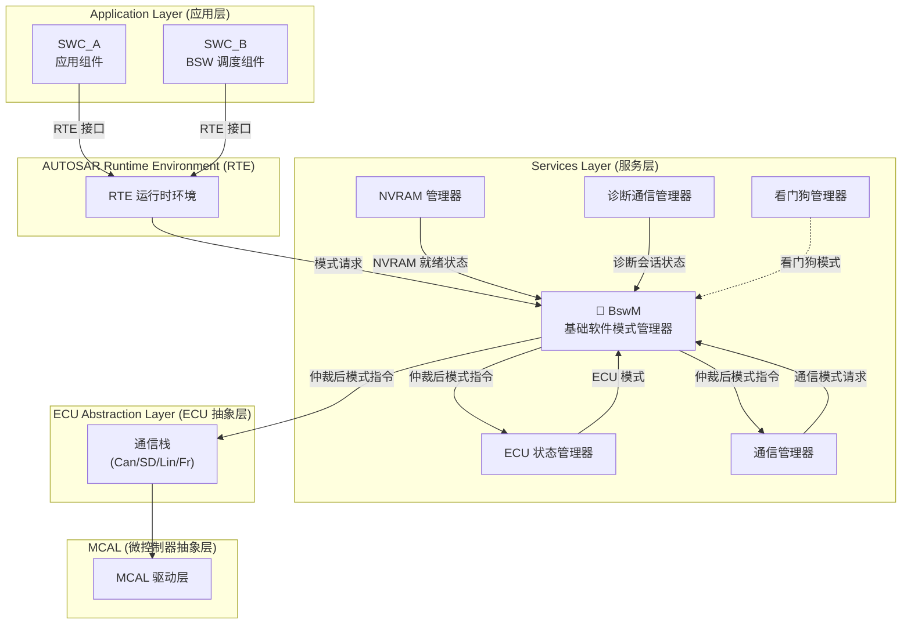

### 2.2 BswM 的"不做什么"与"做什么"

| BswM 不直接做的事 | BswM 做的事 |
|-----------------|------------|
| 不控制 GPIO 引脚 | 仲裁来自各方的模式请求 |
| 不发送 CAN 报文 | 维护跨模块的状态一致性 |
| 不管理 ECU 电源/唤醒 | 将仲裁结果分发给执行者 |
| 不执行 NVRAM 写入 | 支持用户自定义规则 |

> 💡 **核心思想**：BswM 是**决策者 (Decision Maker)**，不是**执行者 (Executor)**。

---

## 三、BswM 的核心概念

### 3.1 三大核心要素

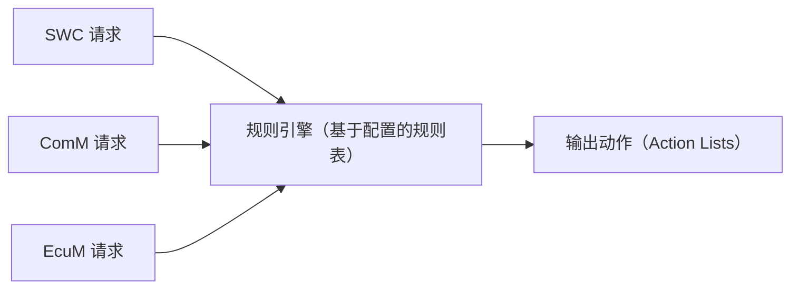

#### 3.1.1 Mode Requests (模式请求)

谁可以向 BswM 发起请求：

| 请求源 | 请求内容 | 说明 |
|--------|---------|------|
| **SWC (应用组件)** | `BswM_ModeRequestPort` | 通过 RTE 调用 BswM 接口，请求特定模式 |
| **EcuM** | ECU 状态 | RUNNING, POST_RUN, SLEEP, SHUTDOWN |
| **ComM** | 通信模式 | FULL_COMM, SILENT_COMM, NO_COMM |
| **Dcm** | 诊断会话 | DEFAULT, EXTENDED, PROGRAMMING |
| **NvM** | NVRAM 状态 | 就绪/未就绪 |

#### 3.1.2 Mode Arbitration (模式仲裁)

BswM 的核心机制——**规则表 (Rule Table)**：

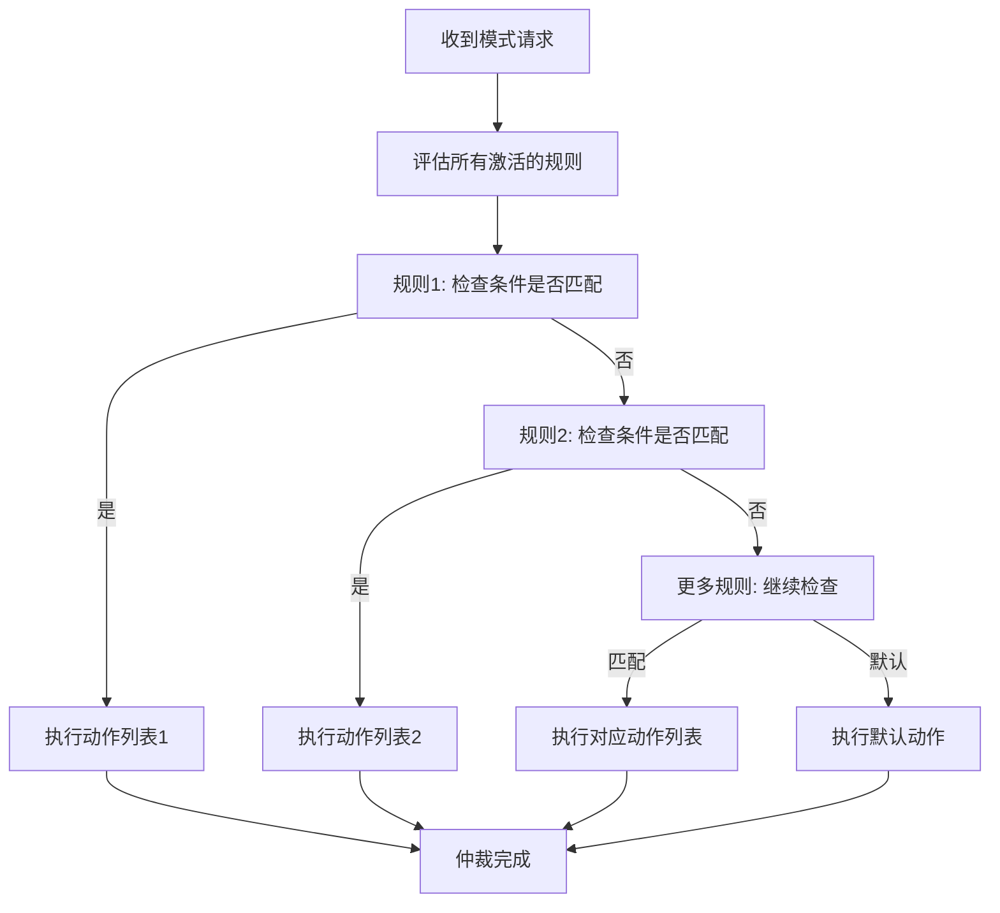

#### 3.1.3 Mode Control / Action Lists (模式控制/动作列表)

仲裁后的输出是一系列**动作 (Action)**，每个动作可以：

- 调用 EcuM 接口 → 请求 ECU 模式切换
- 调用 ComM 接口 → 设置通信模式
- 调用 NvM 接口 → 触发 NVRAM 操作
- 调用 SchM 接口 → 修改调度表
- 调用自定义函数接口 → 用户扩展

### 3.2 BswM 的逻辑组成

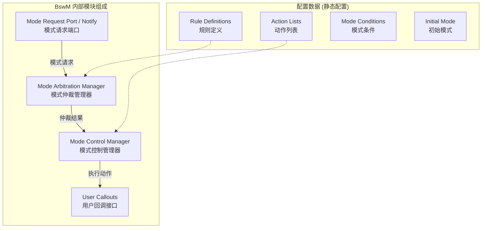

---

## 四、BswM 的工作流程

### 4.1 完整处理流程（时序图）

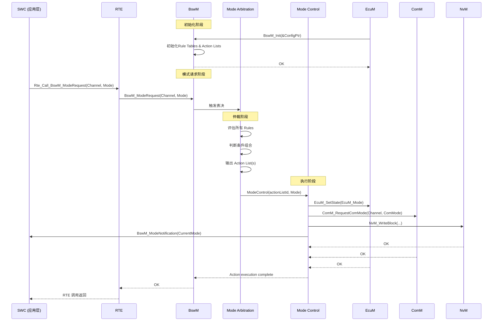

### 4.2 状态流转图

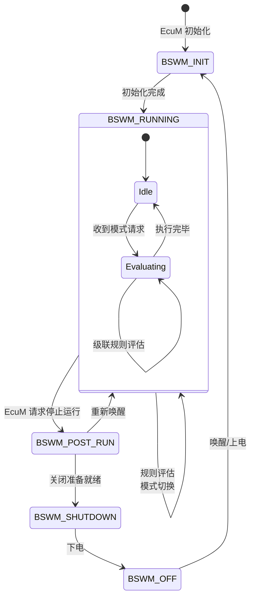

---

## 五、设计机制与设计模式分析

### 5.1 设计模式

| 设计模式 | BswM 中的应用 | 说明 |
|---------|-------------|------|
| **Mediator (中介者)** | BswM 作为多个 Manager 之间的中介 | 各模块不直接通信，都通过 BswM 协调 |
| **Strategy (策略)** | 规则表 = 策略集合，不同条件组合触发不同策略 | 规则可配置，运行时按策略执行 |
| **Observer (观察者)** | BswM 接收模式请求通知 | 各模块/组件状态变化通知给 BswM |
| **State (状态)** | 每个 Mode Channel 是一个状态机 | 模式切换本质是状态转移 |
| **Composite (组合)** | Action List 可以包含子动作 | 复杂动作由多个原子动作组合而成 |
| **Chain of Responsibility (职责链)** | 规则按优先级链式评估 | 规则按配置顺序逐一评估 |

### 5.2 关键设计机制

#### 机制 1：规则仲裁 — "多输入单输出"的决策模型

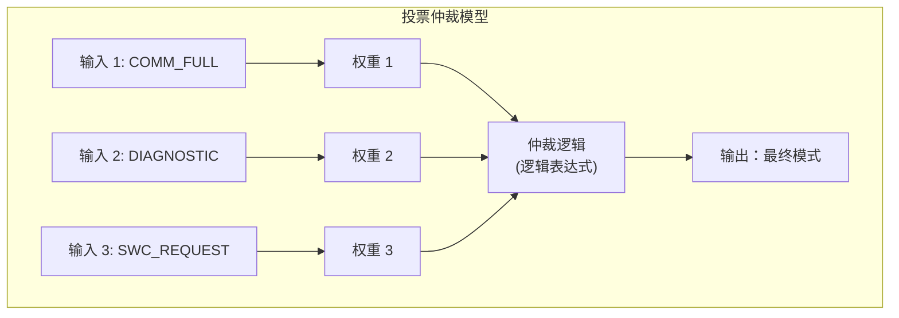

**核心特性**：
- 规则是**逻辑表达式**的组合（AND/OR/NOT）
- 支持**优先级**和**抢占**
- 支持**延迟执行**（满足条件后等待指定时间再执行）
- 支持**重复仲裁**（持续监控条件变化）

#### 机制 2：Action List 执行模型

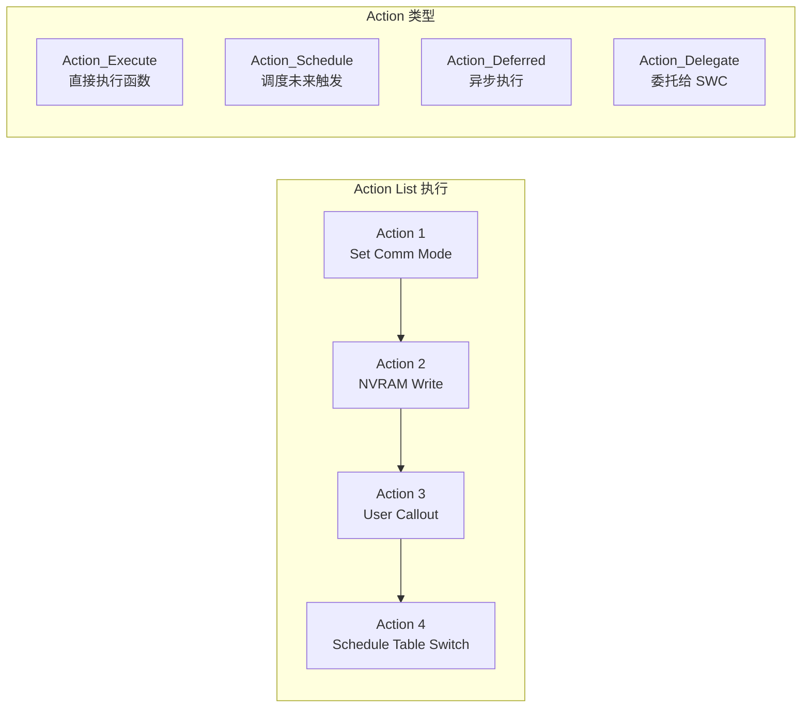

#### 机制 3：模式通道 (Mode Channel) 隔离

每个 Mode Channel 独立管理一个模式维度：

| Mode Channel | 枚举值 | 管理内容 |
|-------------|--------|---------|
| COMM_CHANNEL | FULL / SILENT / NO_COMM | 通信模式 |
| ECU_STATE_CHANNEL | RUN / POST_RUN / SLEEP | ECU 状态 |
| DIAG_CHANNEL | DEFAULT / EXTENDED / PROG | 诊断模式 |

不同 Channel 之间**解耦独立**，但规则可以**跨 Channel 引用条件**。

---

## 六、深入原理

### 6.1 BswM 模块内部状态机

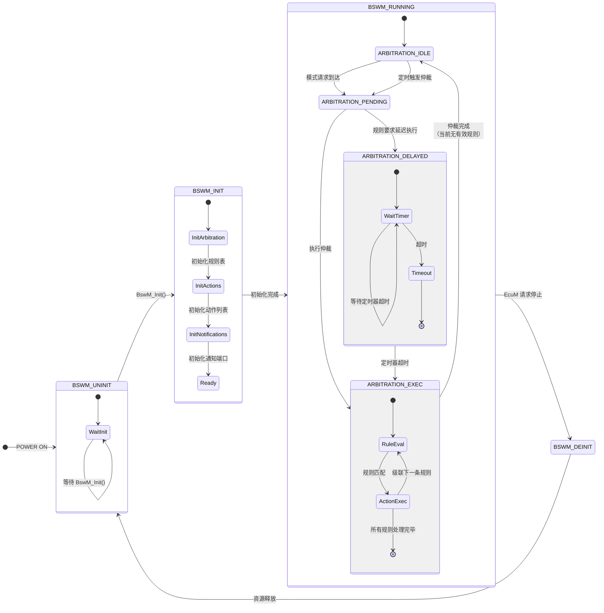

### 6.2 规则仲裁的数学模型

BswM 的规则仲裁可以抽象为一个**布尔逻辑系统**：

```
Rule_N = (Condition_1 ∧ Condition_2 ∧ ...) ∨ (Condition_x ∧ ...)

其中每个 Condition：
  - (Mode_Channel == Expected_Value) 
  - (Mode_Channel != Expected_Value)
  - (定时器条件)
  - (用户自定义条件)
```

示例规则：

```
Rule_A: (ComM_Mode == FULL_COMM)  ∧  (Diagnostic == DISABLED)  →  Action_SetNORMAL
Rule_B: (ComM_Mode == SILENT_COMM) ∨  (Diagnostic == ENABLED)  →  Action_SetSILENT
Rule_C: (Default)                                              →  Action_SetNOCOMM
```

### 6.3 BswM 与 EcuM 的接口关系

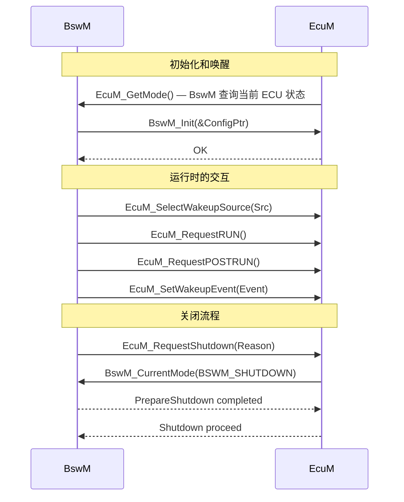

### 6.4 调度模型

BswM 的触发方式有两种：

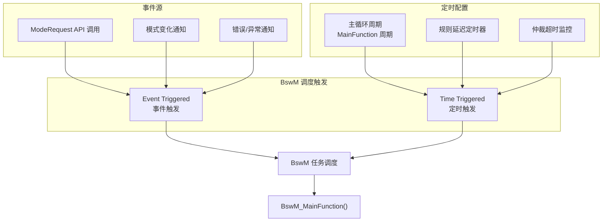

---

## 七、完整代码示例

### 7.1 BswM 配置数据结构定义

```c
/**
 * 文件名: BswM_Cfg.h
 * 描述: BswM 模块配置头文件
 * 平台: AUTOSAR 4.x
 */

#ifndef BSWM_CFG_H
#define BSWM_CFG_H

/* ========== 模式通道定义 ========== */

/* 模式通道 ID */
#define BSWM_CHANNEL_COMM        0U    /* 通信模式通道 */
#define BSWM_CHANNEL_ECU_STATE   1U    /* ECU 状态通道 */
#define BSWM_CHANNEL_DIAG        2U    /* 诊断模式通道 */
#define BSWM_CHANNEL_LIN        3U    /* LIN 总线模式通道 */
#define BSWM_NUMBER_OF_CHANNELS 4U    /* 通道总数 */

/* 通信模式枚举 */
typedef enum {
    BSWM_COMM_NO_COMM = 0,      /* 无通信 */
    BSWM_COMM_SILENT_COMM,      /* 静默通信（收不发） */
    BSWM_COMM_FULL_COMM         /* 全通信 */
} BswM_CommModeType;

/* ECU 状态枚举 */
typedef enum {
    BSWM_ECU_STATE_STARTUP = 0,
    BSWM_ECU_STATE_RUN,
    BSWM_ECU_STATE_POST_RUN,
    BSWM_ECU_STATE_SLEEP,
    BSWM_ECU_STATE_SHUTDOWN
} BswM_EcuStateType;

/* ========== 条件定义 ========== */

/* 条件类型枚举 */
typedef enum {
    BSWM_COND_MODE_EQUAL,           /* 模式 == 期望值 */
    BSWM_COND_MODE_NOT_EQUAL,       /* 模式 != 期望值 */
    BSWM_COND_TIMER_EXPIRED,        /* 定时器超时 */
    BSWM_COND_CALLOUT_RESULT,       /* 用户函数返回值 */
    BSWM_COND_LOGIC_AND,            /* 逻辑 AND */
    BSWM_COND_LOGIC_OR              /* 逻辑 OR */
} BswM_ConditionType;

/* 单个条件结构体 */
typedef struct {
    BswM_ConditionType  type;
    uint8_t             channelId;      /* 关联的模式通道 */
    uint8_t             expectedValue;  /* 期望的模式值（mode == expected） */
    uint32_t            timeoutMs;      /* 仅用于 COND_TIMER_EXPIRED */
    boolean             (*callout)(void); /* 仅用于 COND_CALLOUT_RESULT */
    const void*         subConditions;  /* 仅用于 AND/OR */
    uint8_t             subCount;       /* 子条件数量 */
} BswM_ConditionTypeDef;

/* ========== 动作定义 ========== */

/* 动作类型 */
typedef enum {
    BSWM_ACTION_SET_COMM_MODE,       /* 设置通信模式 */
    BSWM_ACTION_SET_ECU_STATE,       /* 设置 ECU 状态 */
    BSWM_ACTION_NVM_WRITE,           /* NVRAM 写入 */
    BSWM_ACTION_CALLOUT,             /* 用户回调函数 */
    BSWM_ACTION_SCHEDULE_SWITCH,     /* 切换 OS 调度表 */
    BSWM_ACTION_DELEGATE,            /* 委托给指定 SWC */
    BSWM_ACTION_SET_MODE_INDICATOR   /* 设置模式指示 */
} BswM_ActionType;

/* 单个动作结构体 */
typedef struct {
    BswM_ActionType actionType;
    union {
        struct {
            uint8_t channelId;
            uint8_t targetMode;
        } modeRequest;

        struct {
            void (*calloutFunc)(void);
        } callout;

        struct {
            uint8_t scheduleTableId;
        } schedule;
    } params;
} BswM_ActionTypeDef;

/* 动作列表 — 一组顺序执行的原子动作 */
typedef struct {
    const BswM_ActionTypeDef*  actions;
    uint8_t                     actionCount;
    uint32_t                    executionTimeout;   /* 执行超时(ms), 0=不超时 */
} BswM_ActionListTypeDef;

/* ========== 规则定义 ========== */

/* 单条规则 */
typedef struct {
    uint16_t                    ruleId;
    const BswM_ConditionTypeDef* conditionRoot;     /* 条件树根节点 */
    uint8_t                     priority;           /* 0=最高, 255=最低 */
    boolean                     isPreemptive;       /* 是否抢占 */
    const BswM_ActionListTypeDef*  actionList;
    uint32_t                    deferMs;            /* 延迟执行(ms) */
} BswM_RuleTypeDef;

/* ========== 通道配置 ========== */

/* 单条通道配置 */
typedef struct {
    uint8_t             channelId;
    uint8_t             defaultMode;            /* 初始默认模式 */
    uint8_t             currentMode;            /* 当前模式 */
    uint8_t             pendingMode;            /* 待处理模式 */
    boolean             isCommitted;            /* 是否已提交 */
    uint8_t             refCount;               /* 请求引用计数 */
} BswM_ChannelConfigType;

/* ========== BswM 整体配置 ========== */

typedef struct {
    const BswM_ChannelConfigType*  channels;
    uint8_t                         numChannels;
    const BswM_RuleTypeDef*         rules;
    uint16_t                        numRules;
    uint32_t                        mainPeriodMs;   /* MainFunction 周期 */
} BswM_ConfigType;

#endif /* BSWM_CFG_H */
```

### 7.2 BswM 核心实现

```c
/**
 * 文件名: BswM.c
 * 描述: BswM 核心实现
 * 平台: AUTOSAR 4.x
 */

#include "BswM.h"
#include "BswM_Cfg.h"
#include "SchM.h"
#include "ComM.h"
#include "EcuM.h"
#include "NvM.h"

/* ========== 模块私有数据 ========== */

/* BswM 模块状态 */
typedef enum {
    BSWM_STATE_UNINIT = 0,
    BSWM_STATE_INIT,
    BSWM_STATE_RUNNING
} BswM_InternalStateType;

static const BswM_ConfigType*   BswM_ConfigPtr;         /* 配置指针 */
static BswM_InternalStateType   BswM_State;             /* 模块状态 */
static uint32_t                 BswM_DeferTimers[10];   /* 延迟定时器 */
static boolean                  BswM_ArbitrationPending;/* 待处理仲裁标志 */
static boolean                  BswM_ArbitrationBusy;   /* 仲裁正在执行 */

/* 错误码 */
static uint8_t BswM_LastError = 0;

/* ========== 静态内部函数声明 ========== */
static boolean BswM_EvaluateCondition(
    const BswM_ConditionTypeDef* condition);
static boolean BswM_EvaluateRules(void);
static void    BswM_ExecuteActionList(
    const BswM_ActionListTypeDef* actionList);
static void    BswM_ExecuteSingleAction(
    const BswM_ActionTypeDef* action);

/* ========== 公共接口实现 ========== */

/**
 * BswM_Init — 模块初始化
 *
 * 1. 保存配置指针
 * 2. 为每个通道设置默认模式
 * 3. 初始化内部状态
 * 4. 注册通知端口
 */
void BswM_Init(const BswM_ConfigType* configPtr)
{
    uint8_t i;

    /* 参数检查 */
    if (configPtr == NULL_PTR) {
        BswM_Det_ReportError(BSWM_E_PARAM_POINTER, 0);
        return;
    }

    /* 保存配置 */
    BswM_ConfigPtr = configPtr;

    /* 初始化每个通道的默认模式 */
    for (i = 0; i < configPtr->numChannels; i++) {
        BswM_ChannelConfigType* ch =
            (BswM_ChannelConfigType*)&configPtr->channels[i];
        ch->currentMode  = ch->defaultMode;
        ch->pendingMode  = ch->defaultMode;
        ch->isCommitted  = TRUE;
        ch->refCount     = 0;
    }

    /* 初始化定时器 */
    for (i = 0; i < 10; i++) {
        BswM_DeferTimers[i] = 0;
    }

    /* 状态切换 */
    BswM_State = BSWM_STATE_INIT;
    BswM_ArbitrationPending = FALSE;
    BswM_ArbitrationBusy = FALSE;
    BswM_LastError = 0;

    /* 通知 SchM BswM 已初始化 */
    SchM_SwitchBswMState(BSWM_STATE_INIT);

    BswM_State = BSWM_STATE_RUNNING;
}

/**
 * BswM_Deinit — 模块去初始化
 *
 * 清理所有资源，释放配置指针
 */
void BswM_Deinit(void)
{
    uint8_t i;

    if (BswM_State == BSWM_STATE_UNINIT) {
        return;  /* 已处于未初始化状态 */
    }

    /* 等待正在进行中的仲裁完成 */
    while (BswM_ArbitrationBusy) {
        /* spin-wait — 实际项目中使用事件机制 */
    }

    /* 清理通道状态 */
    for (i = 0; i < BswM_ConfigPtr->numChannels; i++) {
        BswM_ChannelConfigType* ch =
            (BswM_ChannelConfigType*)&BswM_ConfigPtr->channels[i];
        ch->currentMode = 0;
        ch->pendingMode = 0;
        ch->isCommitted = FALSE;
    }

    BswM_ConfigPtr = NULL_PTR;
    BswM_State = BSWM_STATE_UNINIT;

    SchM_SwitchBswMState(BSWM_STATE_UNINIT);
}

/**
 * BswM_ModeRequest — 模式请求入口
 *
 * 任意模块通过此接口向 BswM 请求模式变更。
 * BswM 收到请求后标记仲裁标志，在主函数中统一评估。
 *
 * @param channelId  模式通道 ID
 * @param mode       请求的模式值
 * @return Std_ReturnType  E_OK / E_NOT_OK
 */
Std_ReturnType BswM_ModeRequest(uint8_t channelId, uint8_t mode)
{
    BswM_ChannelConfigType* channel;

    /* 参数验证 */
    if (channelId >= BswM_ConfigPtr->numChannels) {
        BswM_Det_ReportError(BSWM_E_PARAM_CHANNEL, 0);
        return E_NOT_OK;
    }

    if (BswM_State < BSWM_STATE_RUNNING) {
        return E_NOT_OK;
    }

    channel = (BswM_ChannelConfigType*)&BswM_ConfigPtr->channels[channelId];

    /* 更新待处理模式 */
    channel->pendingMode = mode;
    channel->refCount++;

    /* 标记需要仲裁 */
    BswM_ArbitrationPending = TRUE;

    return E_OK;
}

/**
 * BswM_GetCurrentMode — 获取通道当前模式
 *
 * @param channelId  模式通道 ID
 * @param modePtr    输出：当前模式值
 * @return Std_ReturnType
 */
Std_ReturnType BswM_GetCurrentMode(uint8_t channelId, uint8_t* modePtr)
{
    if (channelId >= BswM_ConfigPtr->numChannels || modePtr == NULL_PTR) {
        return E_NOT_OK;
    }

    *modePtr = BswM_ConfigPtr->channels[channelId].currentMode;
    return E_OK;
}

/**
 * BswM_GetPendingMode — 获取通道待处理模式
 *
 * @param channelId  模式通道 ID
 * @param modePtr    输出：待处理模式值
 * @return Std_ReturnType
 */
Std_ReturnType BswM_GetPendingMode(uint8_t channelId, uint8_t* modePtr)
{
    if (channelId >= BswM_ConfigPtr->numChannels || modePtr == NULL_PTR) {
        return E_NOT_OK;
    }

    *modePtr = BswM_ConfigPtr->channels[channelId].pendingMode;
    return E_OK;
}

/* ========== 主函数 — 周期调度 ========== */

/**
 * BswM_MainFunction — BswM 主函数
 *
 * 由操作系统周期性调度（通常 5ms - 50ms 周期）。
 * 功能：
 * 1. 处理延迟执行的定时器
 * 2. 仲裁模式请求
 * 3. 执行匹配的 Action List
 */
void BswM_MainFunction(void)
{
    uint8_t i;

    if (BswM_State != BSWM_STATE_RUNNING) {
        return;
    }

    /* 1. 更新延迟定时器 */
    for (i = 0; i < 10; i++) {
        if (BswM_DeferTimers[i] > 0) {
            BswM_DeferTimers[i] -= BswM_ConfigPtr->mainPeriodMs;
            if (BswM_DeferTimers[i] == 0) {
                /* 定时器到期，触发仲裁 */
                BswM_ArbitrationPending = TRUE;
            }
        }
    }

    /* 2. 如果有待处理的仲裁需求，执行仲裁 */
    if (BswM_ArbitrationPending && !BswM_ArbitrationBusy) {
        BswM_ArbitrationBusy = TRUE;
        BswM_ArbitrationPending = FALSE;

        /* 执行规则评估 */
        (void)BswM_EvaluateRules();

        BswM_ArbitrationBusy = FALSE;
    }
}

/* ========== 条件评估引擎 ========== */

/**
 * BswM_EvaluateCondition — 递归评估条件树
 *
 * 支持多级条件组合：
 *   AND: 所有子条件都为真 -> 真
 *   OR:  任一子条件为真  -> 真
 *   EQUAL: mode == expected
 *   NOT_EQUAL: mode != expected
 *   TIMER: 定时器到期
 *   CALLOUT: 用户函数返回真
 *
 * @param condition  条件节点指针
 * @return TRUE = 条件满足, FALSE = 条件不满足
 */
static boolean BswM_EvaluateCondition(const BswM_ConditionTypeDef* condition)
{
    boolean result = FALSE;

    if (condition == NULL_PTR) {
        return TRUE; /* 空条件 = 总是满足 */
    }

    switch (condition->type) {

        case BSWM_COND_MODE_EQUAL:
            /* 检查某通道的当前模式是否等于期望值 */
            if (condition->channelId < BswM_ConfigPtr->numChannels) {
                result = (BswM_ConfigPtr->channels[condition->channelId].currentMode
                          == condition->expectedValue);
            }
            break;

        case BSWM_COND_MODE_NOT_EQUAL:
            if (condition->channelId < BswM_ConfigPtr->numChannels) {
                result = (BswM_ConfigPtr->channels[condition->channelId].currentMode
                          != condition->expectedValue);
            }
            break;

        case BSWM_COND_TIMER_EXPIRED:
            /* 延迟定时器到期检查 */
            result = (condition->timeoutMs == 0);
            break;

        case BSWM_COND_CALLOUT_RESULT:
            /* 用户自定义回调函数 */
            if (condition->callout != NULL_PTR) {
                result = condition->callout();
            }
            break;

        case BSWM_COND_LOGIC_AND:
        {
            /* 所有子条件都为真 -> 真 */
            uint8_t i;
            result = TRUE;
            for (i = 0; i < condition->subCount; i++) {
                if (!BswM_EvaluateCondition(
                        &((BswM_ConditionTypeDef*)condition->subConditions)[i])) {
                    result = FALSE;
                    break;  /* 短路评估 */
                }
            }
            break;
        }

        case BSWM_COND_LOGIC_OR:
        {
            /* 任一子条件为真 -> 真 */
            uint8_t i;
            result = FALSE;
            for (i = 0; i < condition->subCount; i++) {
                if (BswM_EvaluateCondition(
                        &((BswM_ConditionTypeDef*)condition->subConditions)[i])) {
                    result = TRUE;
                    break;  /* 短路评估 */
                }
            }
            break;
        }

        default:
            /* 未识别的条件类型，报错 */
            BswM_Det_ReportError(BSWM_E_PARAM_CONFIG, 0);
            result = FALSE;
            break;
    }

    return result;
}

/**
 * BswM_EvaluateRules — 规则引擎主函数
 *
 * 评估所有规则，优先级高的规则优先匹配。
 * 按优先级排序遍历规则表：
 *   1. 评估规则的条件树
 *   2. 条件满足 -> 执行对应的 Action List
 *   3. 如果规则设置了"抢占"，跳过剩余规则
 *
 * @return TRUE = 有规则被触发, FALSE = 无规则匹配
 */
static boolean BswM_EvaluateRules(void)
{
    uint16_t i;
    boolean anyRuleTriggered = FALSE;

    if (BswM_ConfigPtr == NULL_PTR || BswM_ConfigPtr->rules == NULL_PTR) {
        return FALSE;
    }

    /*
     * 遍历所有规则（配置应已按优先级排序）
     * 规则排序：优先级值越小，优先级越高
     */
    for (i = 0; i < BswM_ConfigPtr->numRules; i++) {
        const BswM_RuleTypeDef* rule = &BswM_ConfigPtr->rules[i];

        /* 评估当前规则的条件 */
        boolean conditionMet = BswM_EvaluateCondition(rule->conditionRoot);

        if (conditionMet) {
            /* 规则匹配！执行动作列表 */
            BswM_ExecuteActionList(rule->actionList);
            anyRuleTriggered = TRUE;

            /*
             * 如果规则是抢占式的，则跳过
             * 剩余优先级更低的规则
             */
            if (rule->isPreemptive) {
                break;
            }
        }
    }

    return anyRuleTriggered;
}

/* ========== 动作执行引擎 ========== */

/**
 * BswM_ExecuteActionList — 执行动作列表
 *
 * @param actionList  要执行的动作列表
 */
static void BswM_ExecuteActionList(const BswM_ActionListTypeDef* actionList)
{
    uint8_t i;

    if (actionList == NULL_PTR) {
        return;
    }

    /* 顺序执行列表中的每个动作 */
    for (i = 0; i < actionList->actionCount; i++) {
        BswM_ExecuteSingleAction(&actionList->actions[i]);
    }
}

/**
 * BswM_ExecuteSingleAction — 执行单个原子动作
 *
 * 根据动作类型分发到不同的处理函数。
 *
 * 支持的 Action 类型：
 * - SET_COMM_MODE:  通过 ComM 设置通信模式
 * - SET_ECU_STATE:  通过 EcuM 请求 ECU 状态
 * - NVM_WRITE:      触发 NVRAM 写入
 * - CALLOUT:        调用用户注册的回调函数
 * - SCHEDULE_SWITCH: 切换 OS 调度表
 * - DELEGATE:       通过 RTE 委托给应用层 SWC
 */
static void BswM_ExecuteSingleAction(const BswM_ActionTypeDef* action)
{
    if (action == NULL_PTR) {
        return;
    }

    switch (action->actionType) {

        case BSWM_ACTION_SET_COMM_MODE:
        {
            /* 通过 ComM 设置通道通信模式 */
            Std_ReturnType ret;
            ret = ComM_RequestComMode(
                action->params.modeRequest.channelId,
                action->params.modeRequest.targetMode
            );
            if (ret != E_OK) {
                /* 通信模式设置失败 */
                BswM_Det_ReportError(BSWM_E_COM_REQUEST, 
                                     action->params.modeRequest.channelId);
            }
            break;
        }

        case BSWM_ACTION_SET_ECU_STATE:
        {
            /* 请求 EcuM 切换 ECU 状态 */
            EcuM_RequestState(action->params.modeRequest.targetMode);
            break;
        }

        case BSWM_ACTION_NVM_WRITE:
        {
            /* 触发 NVRAM 写入操作 */
            NvM_WriteBlock(NVM_BSWM_BLOCK_ID, NULL_PTR);
            break;
        }

        case BSWM_ACTION_CALLOUT:
        {
            /* 调用用户提供的回调函数 */
            if (action->params.callout.calloutFunc != NULL_PTR) {
                action->params.callout.calloutFunc();
            }
            break;
        }

        case BSWM_ACTION_SCHEDULE_SWITCH:
        {
            /* 切换 OS 调度表（OSEK OS 概念） */
            SchM_SwitchScheduleTable(
                action->params.schedule.scheduleTableId
            );
            break;
        }

        case BSWM_ACTION_DELEGATE:
        {
            /*
             * 通过 RTE 委托给应用层 SWC
             * 实际项目中通过 RTE 事件触发
             */
            SchM_SetBswMEvent(action->params.modeRequest.channelId);
            break;
        }

        default:
            BswM_Det_ReportError(BSWM_E_PARAM_CONFIG, 
                                 (uint8_t)action->actionType);
            break;
    }
}

/* ========== 错误处理/日志 ========== */

/**
 * BswM_Det_ReportError — 报告运行时错误
 *
 * 向 DET (Default Error Tracer) 模块报告错误
 */
void BswM_Det_ReportError(uint8_t errorId, uint8_t instanceId)
{
    BswM_LastError = errorId;

    /* 调用 DET 模块报告错误 */
    Det_ReportError(BSWM_MODULE_ID, 0, errorId);

    /* 开发阶段可添加断点 */
    #ifdef BSWM_DEV_MODE
        BswM_ErrorHook(errorId, instanceId);
    #endif
}
```

### 7.3 实际应用场景代码示例

#### 场景 1：CAN 通信唤醒后自动进入全通信模式

```c
/* ========== 场景 1: CAN 唤醒 → 全通信 ========== */

/*
 * 规则配置（伪配置语法）：
 *
 * Rule_CANWakeUp:
 *   Condition: (ECU_State == RUNNING) AND (WakeupSource == CAN)
 *   ActionList:
 *     [0] BSWM_ACTION_SET_COMM_MODE(CAN_CHANNEL_0, FULL_COMM)
 *     [1] BSWM_ACTION_SET_COMM_MODE(CAN_CHANNEL_1, FULL_COMM)
 *     [2] BSWM_ACTION_CALLOUT(OnCanCommunicationResumed)
 *   Priority: 10
 *   Preemptive: TRUE
 */

/* 用户回调：CAN 通信恢复后通知应用层 */
static void OnCanCommunicationResumed(void)
{
    /* 通知应用层 CAN 通信已恢复 */
    /* 通过 RTE 写 SWC 的 Data Element */
    uint8_t canStatus = 1;  /* 1 = 通信已恢复 */
    Rte_Write_CanCommStatus_CanActive(&canStatus);

    /* 可在此触发应用层的数据重传逻辑 */
    SchM_SetBswMEvent(BSWM_EVENT_CAN_RECOVERED);
}
```

#### 场景 2：诊断会话激活时切换通信模式

```c
/* ========== 场景 2: 诊断激活 → SILENT_COMM ========== */

/*
 * 规则配置：
 *
 * Rule_DiagActivate:
 *   Condition: (DiagSession != DEFAULT)
 *   ActionList:
 *     [0] BSWM_ACTION_SET_COMM_MODE(CAN_CHANNEL_0, SILENT_COMM)
 *     [1] BSWM_ACTION_SET_COMM_MODE(CAN_CHANNEL_1, SILENT_COMM)
 *     [2] BSWM_ACTION_CALLOUT(EnterDiagnosticMode)
 *   Priority: 5 (高优先级，可抢占普通规则)
 *   Preemptive: TRUE
 *
 * Rule_DiagDeactivate:
 *   Condition: (DiagSession == DEFAULT)
 *   ActionList:
 *     [0] BSWM_ACTION_SET_COMM_MODE(CAN_CHANNEL_0, FULL_COMM)
 *     [1] BSWM_ACTION_SET_COMM_MODE(CAN_CHANNEL_1, FULL_COMM)
 *     [2] BSWM_ACTION_CALLOUT(ExitDiagnosticMode)
 *   Priority: 5
 *   Preemptive: TRUE
 */

static void EnterDiagnosticMode(void)
{
    /* 诊断模式进入通知 */
    /* 应用层可能需要调整数据处理逻辑 */
}

static void ExitDiagnosticMode(void)
{
    /* 诊断模式退出通知 */
    /* 恢复正常的数据流处理 */
}
```

#### 场景 3：ECU 休眠流程中的 BswM 仲裁

```c
/* ========== 场景 3: ECU 休眠流程 ========== */

/*
 * 规则组合实现三阶段休眠：
 *
 * Phase 1 — 准备休眠:
 *   Rule_PrepSleep:
 *     Condition: (ECU_State == POST_RUN) AND (AllNvmWrites_Done == TRUE)
 *     ActionList:
 *       [0] BSWM_ACTION_SET_COMM_MODE(CAN_CHANNEL_0, NO_COMM)
 *       [1] BSWM_ACTION_SET_COMM_MODE(CAN_CHANNEL_1, NO_COMM)
 *       [2] BSWM_ACTION_NVM_WRITE()    /* 保存最后状态 */
 *       [3] BSWM_ACTION_SET_ECU_STATE(SLEEP)
 *     Priority: 1
 *     DeferMs: 100  /* 延迟 100ms 执行，等待 NVM 写入 */
 *
 * Phase 2 — 执行休眠:
 *   Rule_GoSleep:
 *     Condition: (ECU_State == SLEEP) AND (AllComm_Off == TRUE)
 *     ActionList:
 *       [0] BSWM_ACTION_CALLOUT(EcuM_PrepareShutdown)
 *       [1] BSWM_ACTION_CALLOUT(SchM_StopAllScheduleTables)
 *     Priority: 0
 *     Preemptive: TRUE
 */
```

---

## 八、BswM 配置与开发流程

### 8.1 开发配置流程

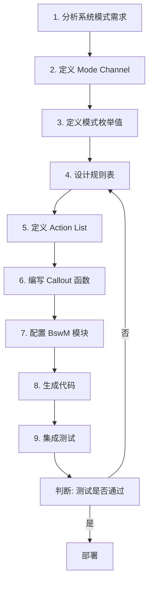

### 8.2 BswM 配置项汇总

| 配置项 | 说明 | 配置方式 |
|-------|------|---------|
| **BswMNumberOfChannels** | 模式通道数量 | 数值 |
| **BswMChannelDef** | 通道定义（ID, 名称, 默认模式） | 结构体数组 |
| **BswMRuleDef** | 规则定义（条件, 优先级, 动作列表） | 规则表 |
| **BswMActionListDef** | 动作列表定义 | 动作数组 |
| **BswMDeferTime** | 规则延迟执行时间 | 时间值 |
| **BswMMainFunctionPeriod** | 主函数调用周期 | 时间值 |
| **BswMUserCallouts** | 用户回调函数注册 | 函数指针数组 |

---

## 九、BswM 与其他模块的高级交互

### 9.1 交互全景图

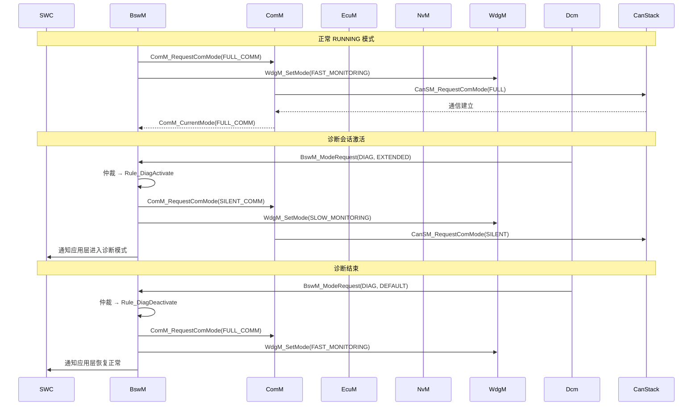

### 9.2 关键接口函数速查表

| 函数名 | 服务 | 调用者 → 被调用者 |
|--------|------|-----------------|
| `BswM_Init()` | 模块初始化 | EcuM → BswM |
| `BswM_ModeRequest()` | 请求模式变更 | 任意模块 → BswM |
| `BswM_GetCurrentMode()` | 查询当前模式 | 任意模块 → BswM |
| `BswM_GetPendingMode()` | 查询待处理模式 | 任意模块 → BswM |
| `BswM_MainFunction()` | 主函数（周期调度） | OS → BswM |
| `ComM_RequestComMode()` | 请求通信模式 | BswM → ComM |
| `ComM_GetCurrentComMode()` | 查询通信模式 | BswM → ComM |
| `EcuM_RequestState()` | 请求 ECU 状态 | BswM → EcuM |
| `EcuM_SelectWakeupSource()` | 选择唤醒源 | BswM → EcuM |
| `NvM_WriteBlock()` | 触发 NVRAM 写入 | BswM → NvM |
| `WdgM_SetMode()` | 设置看门狗模式 | BswM → WdgM |

---

## 十、BswM 模块的设计哲学总结

### 10.1 核心设计思想

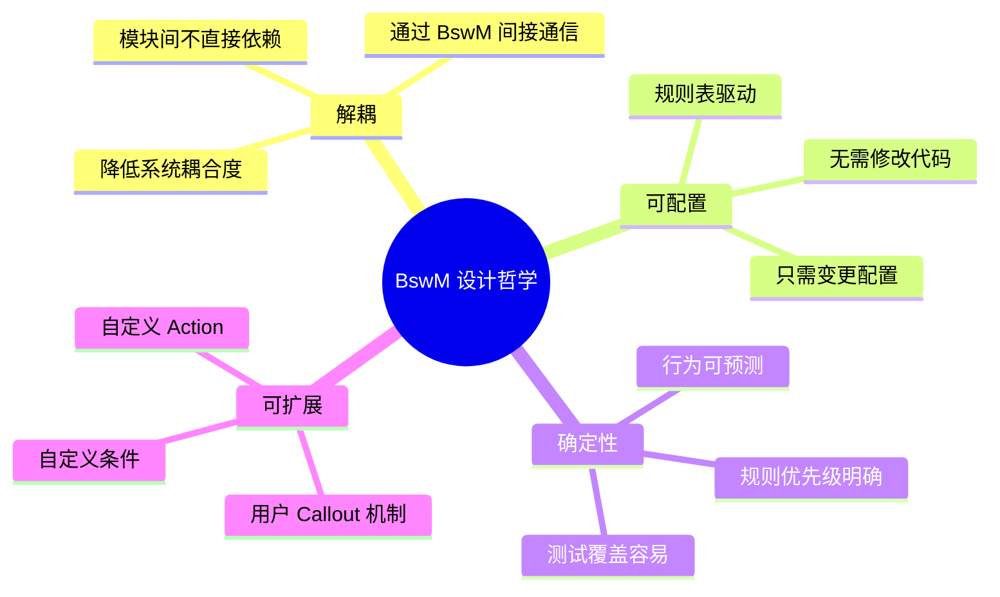

### 10.2 关键设计原则

1. **单一职责**：BswM 只负责"仲裁"不负责"执行"
2. **开闭原则**：通过配置新增规则，不需修改 BswM 核心代码
3. **依赖倒置**：高层模块（BswM）不依赖低层模块（ComM/EcuM），都依赖抽象接口
4. **组合优于继承**：Action 通过组合方式构建复杂行为

### 10.3 常见陷阱与最佳实践

| 陷阱 | 问题 | 最佳实践 |
|------|------|---------|
| 规则过多 | 仲裁耗时增加，影响实时性 | 规则总数控制在 100 条以内 |
| 规则冲突 | 多条规则同时满足，系统行为不确定 | 明确定义优先级，确保互斥规则使用抢占 |
| 规则环 | 规则 A 触发 → 触发规则 B → 又触发 A | 引入状态锁，避免递归触发 |
| 延迟堆积 | 多条规则设置了延迟，同时到期 | 合理分布延迟时间，避免"同频共振" |
| 回调阻塞 | Callout 函数执行时间过长 | Callout 函数必须快速返回，耗时操作应委托给其他任务 |

---

## 十一、总结

**BswM (Basic Software Mode Manager)** 是 AUTOSAR 架构中一个至关重要的"粘合剂"模块。虽然它不直接操作硬件，但正是通过它，AUTOSAR 体系中各种 Manager 模块（EcuM、ComM、NvM、WdgM 等）才能协同工作，形成一套完整的、可配置的、确定性的模式管理系统。

理解 BswM 的关键在于记住：
- **它是决策者，不是执行者** — 只负责"做什么"，不负责"怎么做"
- **它是配置驱动的** — 修改行为无需改代码，只需变更配置表
- **它是中心化的** — 所有模式相关的决策集中在这里，避免了模块间的网状依赖

> 如果把 AUTOSAR 软件架构比作一个交响乐团，EcuM 是指挥的节拍器，ComM 是各个乐器组的首席，而 **BswM 就是总谱**——它规定了在什么样的"乐章"（模式）下，哪些乐器（模块）应该演奏什么样的"旋律"（行为）。没有总谱，所有天才的乐手也只能杂乱无章地各自演奏。
