# AUTOSAR CanDrv（CAN Driver）模块详解

> 作者：AUTOSAR & 嵌入式软件专家
> 版本：v1.0
> 更新日期：2026/07/10

---

# 一、通俗理解：CanDrv 是什么？

## 1.1 打个比方

CanDrv 就像是 **CAN控制器的操作系统内核**——它直接操作硬件寄存器，是软件世界与物理CAN总线之间的**最后一公里**。

对比下图更容易理解：

| 角色 | 对应模块 | 类比说明 |
|------|----------|----------|
| **信件投递员** | CanDrv | 直接把信件塞进或取出邮箱（硬件寄存器） |
| **分拣中心** | CanIf | 统一管理多个邮箱的收发 |
| **物流调度** | PduR | 决定信件该送到哪个部门 |
| **业务部门** | COM/SWC | 读取信件内容做业务处理 |

**关键区别：** CanDrv 是**唯一**直接操作CAN硬件寄存器的模块，它以下的内容是铜线（物理层），它以上的内容全是软件抽象。

## 1.2 在通信栈中的位置

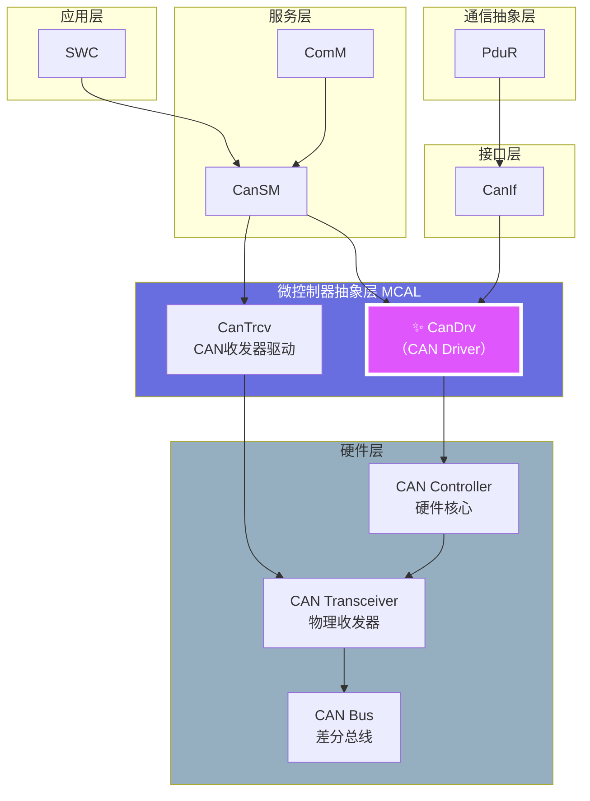

> **CanDrv 的独特地位：** 它是 AUTOSAR 分层的"边界"——边界之上是所有软件模块共享的标准接口，边界之下是各芯片厂商千差万别的硬件实现。

---

# 二、CanDrv 架构设计

## 2.1 核心架构总览

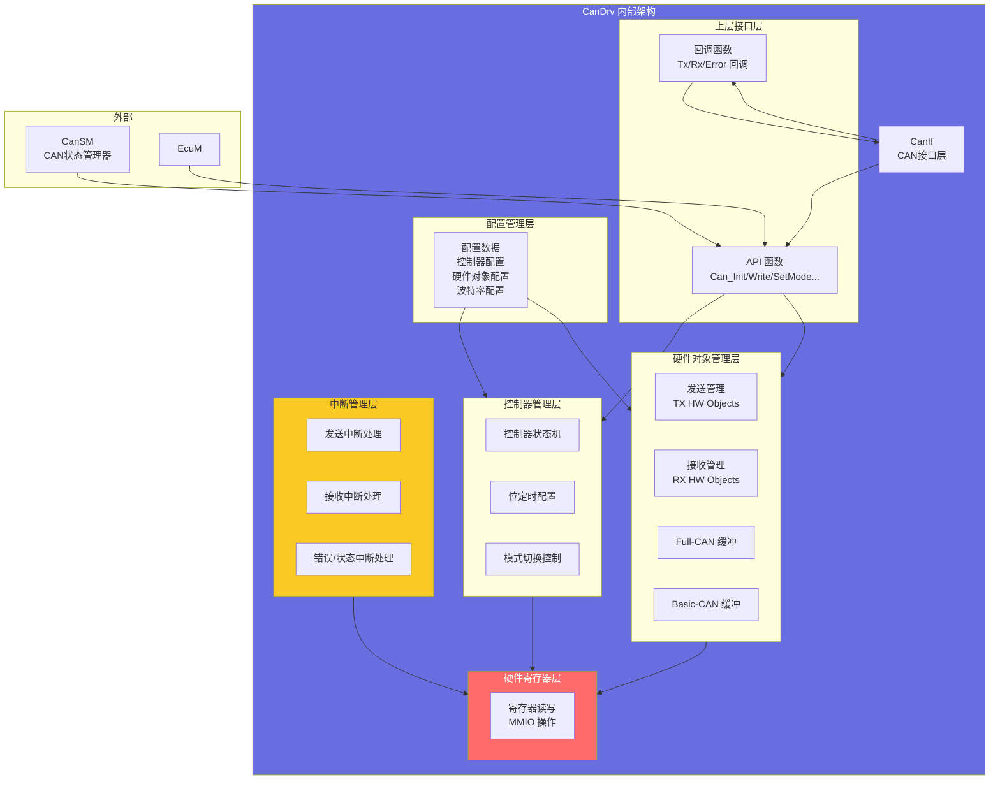

## 2.2 两个核心抽象概念

AUTOSAR CanDrv 的核心在于**两个关键抽象**：

### 2.2.1 控制器（Controller）抽象

控制器对应一个CAN硬件核心。

```c
/* CAN控制器 - 逻辑抽象 */
typedef struct {
    uint8_t                 ControllerId;       /* 控制器ID（0~N） */
    Can_ControllerStateType State;              /* 当前状态 */
    Can_ErrorStateType      ErrorState;         /* 错误状态 */
    uint16_t                TxErrorCounter;     /* 发送错误计数 */
    uint16_t                RxErrorCounter;     /* 接收错误计数 */
    uint32_t                BaseAddr;           /* 硬件基地址 */
} Can_ControllerType;
```

### 2.2.2 硬件对象（Hardware Object）抽象

硬件对象对应CAN硬件中的**消息缓冲槽（Message Buffer / Mailbox）**。

```c
/* 硬件对象 - CAN消息缓冲抽象 */
typedef struct {
    Can_HwHandleType        HwObjectId;         /* 硬件对象句柄 */
    Can_ObjectType          ObjectType;         /* 类型: TX / RX */
    Can_ControllerRefType   ControllerRef;      /* 所属控制器 */
    Can_IdType              CanId;              /* CAN ID（全CAN固定） */
    Can_HwObjectCounterType ObjectCounter;      /* 接收FIFO计数器 */
    uint32_t                BaseAddr;           /* 缓冲基地址 */
} Can_HwObjectType;
```

### 2.2.3 Full-CAN vs Basic-CAN

这是CanDrv中最重要的概念区分：

| 特性 | Full-CAN | Basic-CAN |
|------|----------|-----------|
| **缓冲数量** | 每个ID独占一个缓冲槽 | 多个ID共享一个缓冲槽 |
| **硬件过滤** | 硬件自动匹配CAN ID | 软件手动过滤 |
| **CPU占用** | 极低（硬件自动处理） | 较高（需软件参与） |
| **适用场景** | 高频、周期报文 | 低频、诊断报文 |
| **典型硬件** | 高端MCU的CAN模块 | 低端MCU或特定CAN外设 |
| **配置方式** | 静态分配 | 动态复用 |

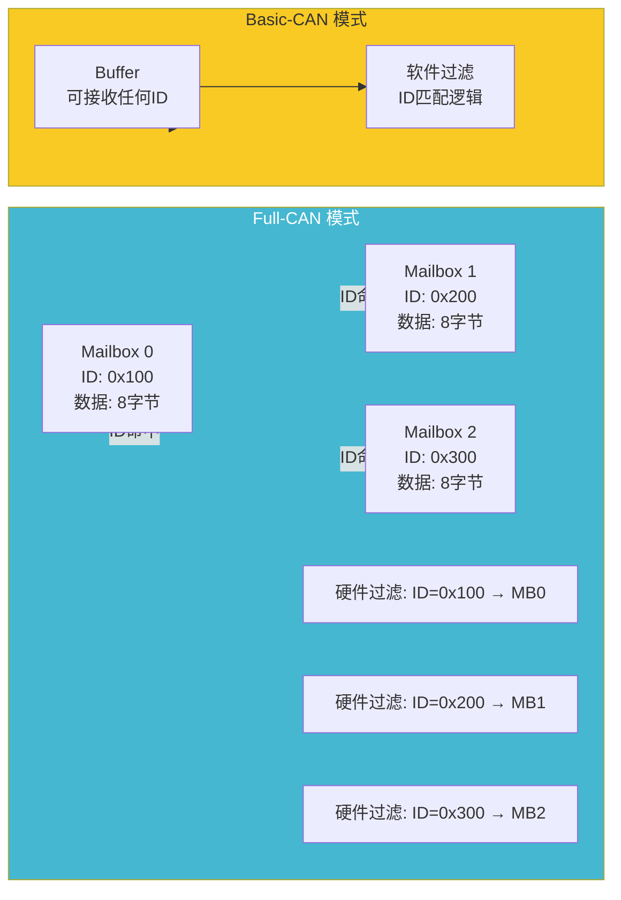

---

# 三、CanDrv 状态机

## 3.1 控制器状态机

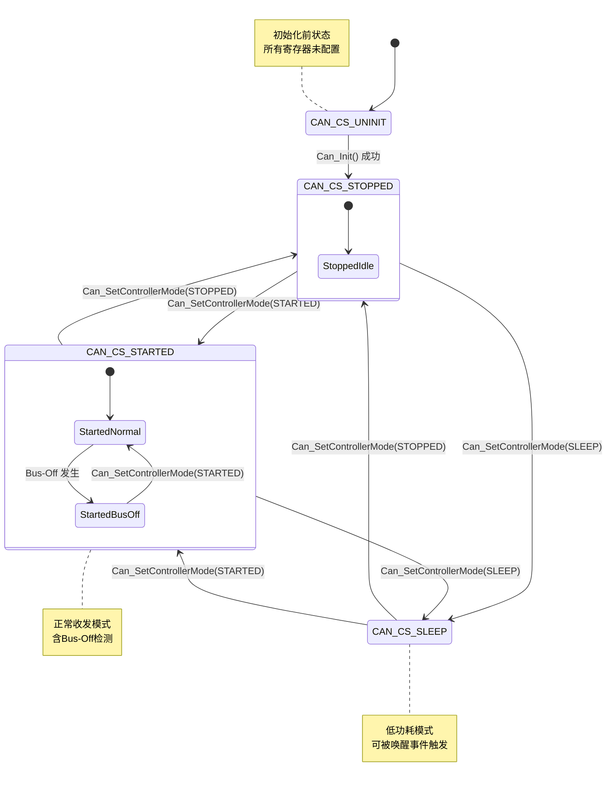

## 3.2 状态转换的完整代码实现

```c
/* CanDrv 控制器状态管理 - 核心实现 */

/* AUTOSAR规范定义的状态枚举 */
typedef enum {
    CAN_CS_UNINIT   = 0x00,   /* 未初始化 */
    CAN_CS_STARTED  = 0x01,   /* 启动（正常通信） */
    CAN_CS_STOPPED  = 0x02,   /* 停止（无通信） */
    CAN_CS_SLEEP    = 0x03    /* 休眠 */
} Can_ControllerStateType;

/* 错误状态枚举 */
typedef enum {
    CAN_ERROR_STATE_ERROR_ACTIVE   = 0x00,  /* 错误主动 */
    CAN_ERROR_STATE_ERROR_PASSIVE  = 0x01,  /* 错误被动 */
    CAN_ERROR_STATE_BUS_OFF        = 0x02   /* 总线关闭 */
} Can_ErrorStateType;

/* 控制器结构体 */
typedef struct {
    Can_ControllerStateType  State;
    Can_ErrorStateType       ErrorState;
    uint16_t                 Tec;           /* Transmit Error Counter */
    uint16_t                 Rec;           /* Receive Error Counter */
    uint32_t                 BaseAddr;      /* 寄存器基地址 */
    uint32_t                 InterruptId;   /* 中断号 */
    uint8_t                  HwObjectsCount;/* 硬件对象数量 */
    Can_HwObjectBaseType*    HwObjectBase;  /* 硬件对象基指针 */
    boolean                  WakeupEnabled; /* 唤醒使能 */
} CanDrv_ControllerCtxType;

static CanDrv_ControllerCtxType CanDrv_Controllers[CAN_NUM_CONTROLLERS];

/* ======= 初始化 ======= */
void Can_Init(const Can_ConfigType* Config)
{
    uint8_t i;
    
    for (i = 0; i < CAN_NUM_CONTROLLERS; i++)
    {
        CanDrv_ControllerCtxType* ctrl = &CanDrv_Controllers[i];
        
        /* 1. 复位CAN控制器硬件 */
        CanDrv_HwReset(ctrl->BaseAddr);
        
        /* 2. 配置位时序 */
        CanDrv_HwSetBitTiming(ctrl->BaseAddr, &Config->BitTiming[i]);
        
        /* 3. 初始化硬件对象（消息缓冲） */
        for (uint8_t h = 0; h < ctrl->HwObjectsCount; h++)
        {
            CanDrv_HwInitObject(&Config->HwObjects[h]);
        }
        
        /* 4. 配置中断 */
        CanDrv_HwConfigInterrupt(ctrl->InterruptId);
        
        /* 5. 设置初始状态 */
        ctrl->State = CAN_CS_STOPPED;
        ctrl->ErrorState = CAN_ERROR_STATE_ERROR_ACTIVE;
        ctrl->Tec = 0;
        ctrl->Rec = 0;
        
        /* 6. 启用唤醒检测（如果需要） */
        if (Config->WakeupConfig[i].WakeupSource)
        {
            CanDrv_HwEnableWakeup(ctrl->BaseAddr, TRUE);
            ctrl->WakeupEnabled = TRUE;
        }
    }
}

/* ======= 设置控制器模式 ======= */
Std_ReturnType Can_SetControllerMode(
    uint8_t                   ControllerId,
    Can_ControllerStateType   TargetMode
)
{
    CanDrv_ControllerCtxType* ctrl = &CanDrv_Controllers[ControllerId];
    
    switch (TargetMode)
    {
        case CAN_CS_STARTED:
            /* 进入启动状态 */
            if (ctrl->State == CAN_CS_STOPPED)
            {
                /* 从STOPPED到STARTED */
                CanDrv_HwEnterNormalMode(ctrl->BaseAddr);
                ctrl->State = CAN_CS_STARTED;
            }
            else if (ctrl->State == CAN_CS_SLEEP)
            {
                /* 从SLEEP到STARTED（唤醒） */
                CanDrv_HwExitSleepMode(ctrl->BaseAddr);
                CanDrv_HwEnterNormalMode(ctrl->BaseAddr);
                ctrl->State = CAN_CS_STARTED;
            }
            else
            {
                return E_NOT_OK;
            }
            
            /* 通知上层状态变更 */
            Can_ControllerModeIndication(ControllerId, CAN_CS_STARTED);
            break;
            
        case CAN_CS_STOPPED:
            /* 进入停止状态 */
            if (ctrl->State == CAN_CS_STARTED)
            {
                CanDrv_HwEnterInitMode(ctrl->BaseAddr);
                ctrl->State = CAN_CS_STOPPED;
            }
            else if (ctrl->State == CAN_CS_SLEEP)
            {
                /* 唤醒后停止 */
                CanDrv_HwExitSleepMode(ctrl->BaseAddr);
                CanDrv_HwEnterInitMode(ctrl->BaseAddr);
                ctrl->State = CAN_CS_STOPPED;
            }
            else
            {
                return E_NOT_OK;
            }
            
            Can_ControllerModeIndication(ControllerId, CAN_CS_STOPPED);
            break;
            
        case CAN_CS_SLEEP:
            /* 进入休眠模式 */
            if (ctrl->State == CAN_CS_STOPPED)
            {
                CanDrv_HwEnterSleepMode(ctrl->BaseAddr);
                ctrl->State = CAN_CS_SLEEP;
            }
            else if (ctrl->State == CAN_CS_STARTED)
            {
                /* 先停止再休眠 */
                CanDrv_HwEnterInitMode(ctrl->BaseAddr);
                CanDrv_HwEnterSleepMode(ctrl->BaseAddr);
                ctrl->State = CAN_CS_SLEEP;
            }
            else
            {
                return E_NOT_OK;
            }
            
            Can_ControllerModeIndication(ControllerId, CAN_CS_SLEEP);
            break;
            
        default:
            return E_NOT_OK;
    }
    
    return E_OK;
}

/* ======= 获取控制器错误状态 ======= */
Std_ReturnType Can_GetControllerErrorState(
    uint8_t               ControllerId,
    Can_ErrorStateType*   ErrorStatePtr
)
{
    CanDrv_ControllerCtxType* ctrl = &CanDrv_Controllers[ControllerId];
    
    /* 读取硬件错误计数器 */
    ctrl->Tec = CanDrv_HwGetTxErrorCounter(ctrl->BaseAddr);
    ctrl->Rec = CanDrv_HwGetRxErrorCounter(ctrl->BaseAddr);
    
    /* AUTOSAR规范：根据计数器判定错误状态 */
    if (ctrl->Tec > 255 || ctrl->Rec > 127)
    {
        ctrl->ErrorState = CAN_ERROR_STATE_BUS_OFF;
    }
    else if (ctrl->Tec > 127 || ctrl->Rec > 127)
    {
        ctrl->ErrorState = CAN_ERROR_STATE_ERROR_PASSIVE;
    }
    else
    {
        ctrl->ErrorState = CAN_ERROR_STATE_ERROR_ACTIVE;
    }
    
    *ErrorStatePtr = ctrl->ErrorState;
    return E_OK;
}
```

---

# 四、消息收发机制

## 4.1 发送路径

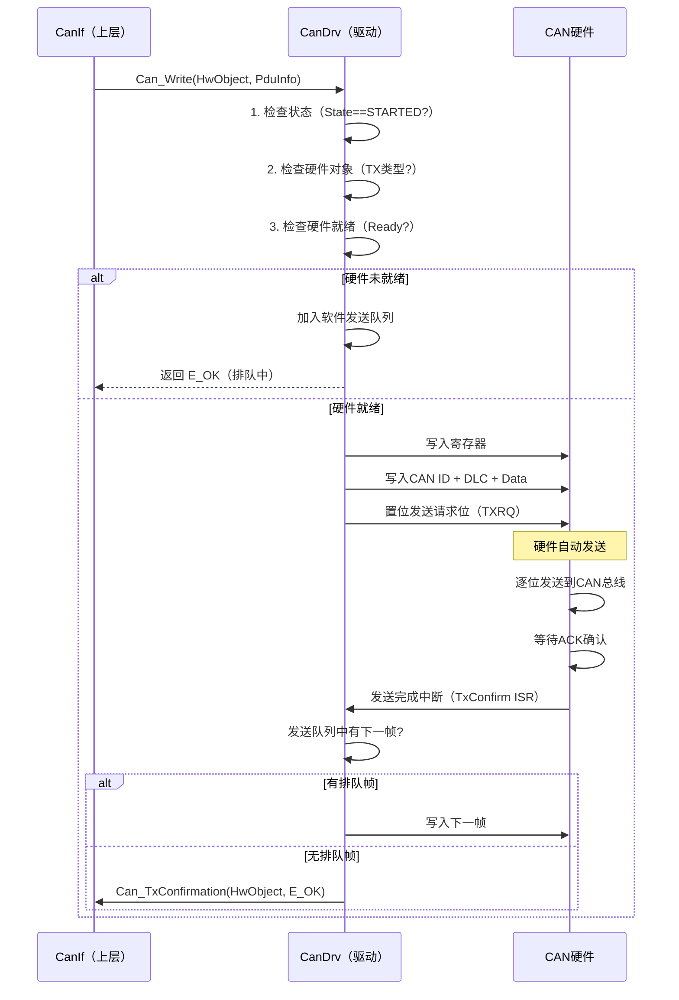

### 4.1.1 发送函数实现

```c
/* Can_Write - 核心发送函数 */

Std_ReturnType Can_Write(
    Can_HwHandleType      Hth,          /* 发送硬件句柄 */
    const Can_PduType*    PduInfoPtr    /* PDU信息 */
)
{
    CanDrv_ControllerCtxType* ctrl;
    CanDrv_HwObjectCtxType*   hwo;
    
    /* 1. 参数校验 */
    if (PduInfoPtr == NULL || PduInfoPtr->SduLength > CAN_MAX_DLC)
    {
        return E_NOT_OK;
    }
    
    /* 2. 获取硬件对象上下文 */
    hwo = CanDrv_GetHwObject(Hth);
    if (hwo == NULL || hwo->Type != CAN_OBJECT_TYPE_TX)
    {
        return E_NOT_OK;
    }
    
    /* 3. 获取所属控制器 */
    ctrl = &CanDrv_Controllers[hwo->ControllerId];
    
    /* 4. 检查控制器状态 */
    if (ctrl->State != CAN_CS_STARTED)
    {
        return E_NOT_OK;
    }
    
    /* 5. 检查错误状态 */
    if (ctrl->ErrorState == CAN_ERROR_STATE_BUS_OFF)
    {
        return E_NOT_OK;
    }
    
    /* 6. 尝试写入硬件 */
    if (CanDrv_HwIsTxReady(hwo))
    {
        /* 硬件缓冲可用 - 直接写入 */
        CanDrv_HwWriteMessage(hwo, PduInfoPtr);
        CanDrv_HwSetTxRequest(hwo);
        return E_OK;
    }
    else
    {
        /* 硬件缓冲忙 - 加入软件队列 */
        if (CanDrv_EnqueueTxBuffer(hwo->ControllerId, Hth, PduInfoPtr))
        {
            return E_OK;  /* 排队成功 */
        }
        else
        {
            return E_NOT_OK;  /* 队列已满 */
        }
    }
}

/* 发送完成中断处理 */
void CanDrv_TxConfirmationISR(uint8_t ControllerId, Can_HwHandleType Hth)
{
    CanDrv_ControllerCtxType* ctrl = &CanDrv_Controllers[ControllerId];
    
    /* 1. 通知上层发送完成 */
    Can_TxConfirmation(Hth, E_OK);
    
    /* 2. 检查软件发送队列 */
    if (CanDrv_HasPendingTx(ControllerId))
    {
        /* 取出下一帧 */
        CanDrv_TxQueueEntryType* next = CanDrv_DequeueTxBuffer(ControllerId);
        
        /* 写入硬件 */
        CanDrv_HwWriteMessage(
            CanDrv_GetHwObject(next->Hth), 
            &next->PduInfo
        );
        CanDrv_HwSetTxRequest(CanDrv_GetHwObject(next->Hth));
    }
}
```

## 4.2 接收路径

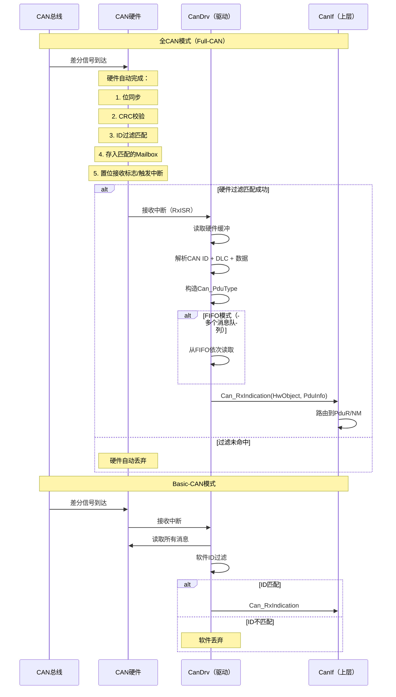

### 4.2.1 接收函数实现

```c
/* 接收中断处理 - Full-CAN + FIFO 示例 */

void CanDrv_RxInterruptHandler(uint8_t ControllerId)
{
    CanDrv_ControllerCtxType* ctrl = &CanDrv_Controllers[ControllerId];
    uint32_t statusReg = CanDrv_HwReadReg(ctrl->BaseAddr, CAN_REG_RX_STATUS);
    
    /* 遍历所有接收硬件对象 */
    for (uint8_t i = 0; i < ctrl->HwObjectsCount; i++)
    {
        CanDrv_HwObjectCtxType* hwo = &ctrl->HwObjectBase[i];
        
        if (hwo->Type != CAN_OBJECT_TYPE_RX)
        {
            continue;  /* 跳过非接收对象 */
        }
        
        /* 检查接收FIFO */
        while (CanDrv_HwIsRxDataAvailable(hwo))
        {
            Can_PduType pdu;
            Can_HwType  hwInfo;
            
            /* 1. 读取CAN ID */
            pdu.CanId = CanDrv_HwReadId(hwo);
            
            /* 2. 读取DLC和数据长度 */
            uint8_t dlc = CanDrv_HwReadDlc(hwo);
            pdu.SduLength = CanDrv_Dlc2Length(dlc);
            
            /* 3. 读取数据 */
            CanDrv_HwReadData(hwo, pdu.SduData, pdu.SduLength);
            
            /* 4. 填充硬件信息 */
            hwInfo.Hoh = hwo->HwObjectId;    /* 硬件对象句柄 */
            hwInfo.ControllerId = ControllerId;
            hwInfo.CanId = pdu.CanId;
            
            /* 5. 软件过滤（Basic-CAN模式下需要） */
            if (CanDrv_SoftwareFilter(hwo, pdu.CanId))
            {
                /* 6. 回调上层 */
                Can_RxIndication(&hwInfo, &pdu);
            }
            
            /* 7. 释放硬件缓冲（使能下一帧接收） */
            CanDrv_HwReleaseRxBuffer(hwo);
        }
    }
}
```

## 4.3 硬件对象管理示意图

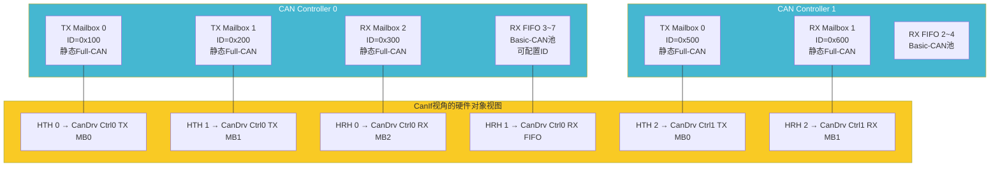

---

# 五、中断架构

## 5.1 中断类型

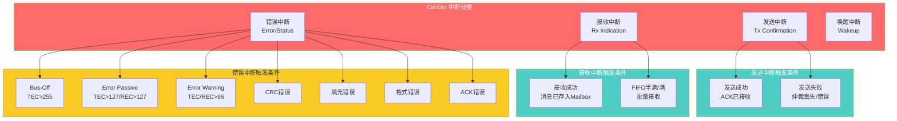

## 5.2 中断处理优先级与嵌套

```c
/* CanDrv 中断优先级配置 - 基于ARM Cortex-M示例 */

/* 中断优先级分配 */
#define CAN_TX_ISR_PRIORITY      2    /* 发送中断 - 高优先级 */
#define CAN_RX_ISR_PRIORITY      1    /* 接收中断 - 最高优先级 */
#define CAN_ERR_ISR_PRIORITY     3    /* 错误中断 - 中优先级 */
#define CAN_WAKE_ISR_PRIORITY    4    /* 唤醒中断 - 低优先级 */

/* 中断服务函数 - 以NXPCortex-M7+SJA1000为例 */

/* ===== 接收中断（最高优先级） ===== */
__attribute__((interrupt))
void CAN0_RX_IRQHandler(void)
{
    /* 读取接收状态寄存器 */
    uint32_t rxStatus = CAN0->RFS;
    
    /* 循环读取所有待处理的接收帧 */
    while (rxStatus & CAN_RFS_RX_ACTIVE)
    {
        Can_PduType pdu;
        Can_HwType  hwInfo;
        
        /* 从FIFO读取 */
        pdu.CanId = CAN0->RX_ID;
        pdu.SduLength = (CAN0->RX_CTRL & CAN_CTRL_DLC_MASK) >> CAN_CTRL_DLC_SHIFT;
        
        for (uint8_t i = 0; i < pdu.SduLength && i < 8; i++)
        {
            pdu.SduData[i] = CAN0->RX_DATA[i];
        }
        
        /* 释放FIFO（读取下一帧） */
        CAN0->RFS |= CAN_RFS_RELEASE;
        
        /* 回调上层（在中断上下文中） */
        hwInfo.ControllerId = 0;
        hwInfo.Hoh = 0x01;
        hwInfo.CanId = pdu.CanId;
        
        Can_RxIndication(&hwInfo, &pdu);
        
        /* 检查是否还有更多帧 */
        rxStatus = CAN0->RFS;
    }
}

/* ===== 发送中断 ===== */
__attribute__((interrupt))
void CAN0_TX_IRQHandler(void)
{
    uint32_t txStatus = CAN0->TFS;
    
    for (uint8_t i = 0; i < CAN_TX_MAILBOX_COUNT; i++)
    {
        if (txStatus & (CAN_TFS_TX_DONE << i))
        {
            /* 清除中断标志 */
            CAN0->TFS |= (CAN_TFS_TX_DONE << i);
            
            /* 回调上层 */
            Can_TxConfirmation(i, E_OK);
            
            /* 检查软件发送队列 */
            if (CanDrv_HasPendingTx(0))
            {
                /* 发送下一帧 */
                CanDrv_ProcessTxQueue(0);
            }
        }
    }
}

/* ===== Bus-Off/错误中断 ===== */
__attribute__((interrupt))
void CAN0_ERR_IRQHandler(void)
{
    uint32_t errStatus = CAN0->ERS;
    
    if (errStatus & CAN_ERS_BUS_OFF)
    {
        /* Bus-Off 处理 */
        CAN0->ERS |= CAN_ERS_BUS_OFF;
        
        /* 更新控制器错误状态 */
        CanDrv_Controllers[0].ErrorState = CAN_ERROR_STATE_BUS_OFF;
        CanDrv_Controllers[0].State = CAN_CS_STOPPED;
        
        /* 通知CanSM */
        CanSM_BusOffNotification(0);
    }
    
    if (errStatus & CAN_ERS_ERR_PASSIVE)
    {
        CAN0->ERS |= CAN_ERS_ERR_PASSIVE;
        CanDrv_Controllers[0].ErrorState = CAN_ERROR_STATE_ERROR_PASSIVE;
    }
    
    if (errStatus & CAN_ERS_ERR_WARNING)
    {
        CAN0->ERS |= CAN_ERS_ERR_WARNING;
        /* 记录警告但不改变错误状态 */
    }
}
```

---

# 六、API 详解

## 6.1 AUTOSAR CanDrv 标准 API

| API函数 | 功能 | 调用者 | 可否在中断中调用 |
|---------|------|--------|:---:|
| `Can_Init` | 初始化CAN驱动 | EcuM | ❌ |
| `Can_DeInit` | 反初始化CAN驱动 | EcuM | ❌ |
| `Can_Write` | 发送CAN帧 | CanIf | ❌（通常） |
| `Can_SetControllerMode` | 设置控制器模式 | CanSM | ❌ |
| `Can_DisableControllerInterrupts` | 禁止控制器中断 | CanSM/EcuM | ✅ |
| `Can_EnableControllerInterrupts` | 使能控制器中断 | CanSM/EcuM | ✅ |
| `Can_CheckWakeup` | 检查唤醒状态 | EcuM | ✅ |
| `Can_GetControllerMode` | 获取控制器模式 | CanSM | ✅ |
| `Can_GetControllerErrorState` | 获取错误状态 | CanSM | ✅ |
| `Can_GetVersionInfo` | 获取版本信息 | 诊断/调试 | ❌ |
| `Can_SetBaudrate` | 设置波特率 | CanSM | ❌ |

### 6.1.1 回调函数

| 回调函数 | 触发时机 | 调用者 |
|----------|----------|--------|
| `Can_TxConfirmation` | 发送完成 | CanDrv ISR |
| `Can_RxIndication` | 接收完成 | CanDrv ISR |
| `Can_ControllerModeIndication` | 控制器模式切换完成 | CanDrv |

## 6.2 API 时序约束

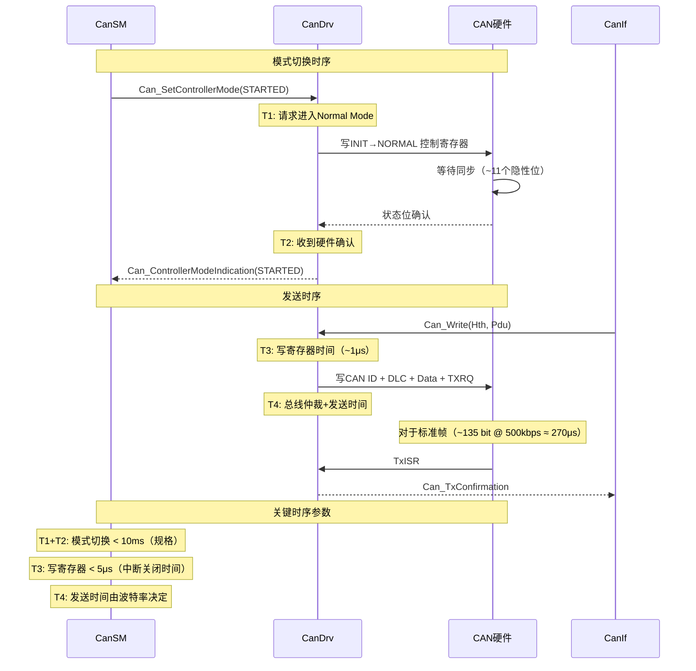

---

# 七、位时序配置

## 7.1 CAN总线位时序结构

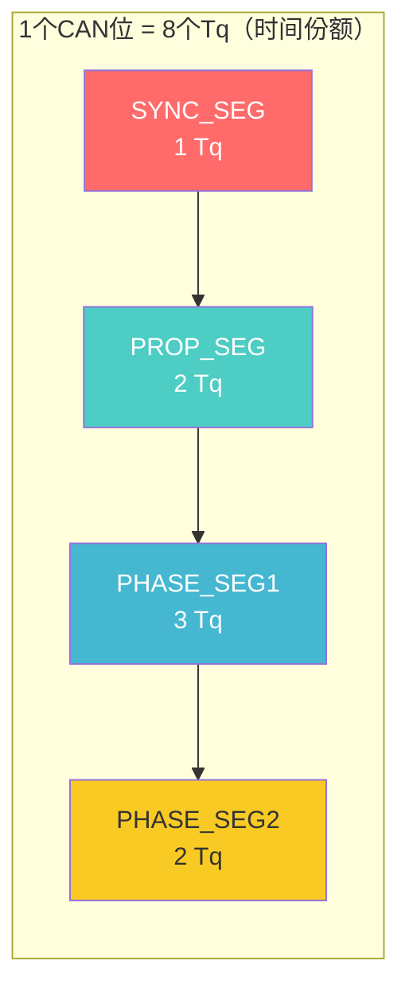

## 7.2 典型波特率配置

```c
/* CAN位时序配置结构体 */
typedef struct {
    uint32_t CanControllerBaudRate;     /* 目标波特率 (bps) */
    uint16_t CanControllerBaudRateConfig;/* 配置索引 */
    float    CanControllerPropDelay;     /* 传播延迟补偿 (us) */
    float    CanControllerSyncJumpWidth; /* 同步跳转宽度 (Tq) */
} CanControllerBaudrateConfig;

/* 典型配置表 */
const CanControllerBaudrateConfig CanDrv_BitTiming[] = {
    /* @ 500kbps, 8 MHz CAN时钟 */
    {
        .CanControllerBaudRate = 500000,
        .CanControllerBaudRateConfig = 0,
        /* 计算: Tq = 2 × (BRP+1) / Fclk = 2×1/8M = 250ns */
        /* 1位 = 16 Tq = 4μs → 250kbps */
        /* 修正：Tq = 2/8M = 250ns, 16Tq = 4μs → 250kbps */
        /* 目标500kbps: Tq = 125ns, BRP=0时Fclk需要16MHz */
        /* 假设CAN_CLK=16MHz, BRP=0, Tq=62.5ns */
        /* 1位=16Tq=1μs → 1Mbps */
        /* 1位=8Tq=0.5μs → 2Mbps */
    },
    /* @ 250kbps, 40MHz CAN时钟, 16 Tq/bit */
    {
        .CanControllerBaudRate = 250000,
        .CanControllerBaudRateConfig = 1,
        /* BRP=4 → Tq = 2×(4+1)/40M = 250ns */
        /* 16 Tq/bit → 4μs/bit → 250kbps */
        /* Sync:1, Prop:3, Phase1:6, Phase2:6 */
    },
    /* @ 125kbps, 40MHz CAN时钟, 16 Tq/bit */
    {
        .CanControllerBaudRate = 125000,
        .CanControllerBaudRateConfig = 2,
        /* BRP=9 → Tq = 2×(9+1)/40M = 500ns */
        /* 16 Tq/bit → 8μs/bit → 125kbps */
    },
};

/* 位时序写入硬件 - 以NXP FlexCAN为例 */
static void CanDrv_HwSetBitTiming(
    uint32_t                     BaseAddr,
    const CanControllerBaudrateConfig* Cfg
)
{
    CanFlexCAN_Type* can = (CanFlexCAN_Type*)BaseAddr;
    
    /* 进入冻结模式以修改时序 */
    can->MCR |= CAN_MCR_FRZ | CAN_MCR_HALT;
    while (!(can->MCR & CAN_MCR_FRZ_ACK));
    
    /* 计算并写入CBT（CAN Bit Timing）寄存器 */
    uint32_t brp = 4;       /* 波特率预分频 */
    uint32_t propSeg = 3;   /* 传播段 */
    uint32_t pSeg1 = 6;     /* 相位缓冲段1 */
    uint32_t pSeg2 = 6;     /* 相位缓冲段2 */
    uint32_t sjw = 2;       /* 同步跳转宽度 */
    
    can->CBT = CAN_CBT_BRP(brp) 
             | CAN_CBT_PROPSEG(propSeg)
             | CAN_CBT_PSEG1(pSeg1)
             | CAN_CBT_PSEG2(pSeg2)
             | CAN_CBT_SJW(sjw);
    
    /* 退出冻结模式 */
    can->MCR &= ~(CAN_MCR_FRZ | CAN_MCR_HALT);
}

/* 时序计算公式：
 * 波特率 = Fcan_clock / (2 × (BRP+1) × (Sync + Prop + Phase1 + Phase2))
 * 其中 Sync 固定 = 1 Tq
 * 总 Tq数 = 1 + PropSeg + PSeg1 + PSeg2
 * 采样点 = (1 + PropSeg + PSeg1) / 总Tq数 × 100%
 */
```

## 7.3 采样点选择示意

```mermaid
graph TB
    subgraph SP_87["采样点 87.5% - 高速CAN"]
        T1["Sync<br/>1 Tq"]
        T2["Prop<br/>3 Tq"]
        T3["Phase1<br/>3 Tq"]
        T4["Phase2<br/>1 Tq"]
        SP1["📌 采样点<br/>87.5%"]
        T1 --> T2 --> T3 --> SP1 --> T4
    end

    subgraph SP_75["采样点 75% - 标准CAN"]
        T5["Sync<br/>1 Tq"]
        T6["Prop<br/>2 Tq"]
        T7["Phase1<br/>3 Tq"]
        T8["Phase2<br/>2 Tq"]
        SP2["📌 采样点<br/>75%"]
        T5 --> T6 --> T7 --> SP2 --> T8
    end

    subgraph SP_60["采样点 60% - 低速长总线"]
        T9["Sync<br/>1 Tq"]
        T10["Prop<br/>5 Tq"]
        T11["Phase1<br/>4 Tq"]
        T12["Phase2<br/>6 Tq"]
        SP3["📌 采样点<br/>60%"]
        T9 --> T10 --> T11 --> SP3 --> T12
    end

    style SP1 fill:#ff6b6b,color:#fff
    style SP2 fill:#45b7d1,color:#fff
    style SP3 fill:#f9ca24,color:#333
    style T4 fill:#95afc0,color:#333
    style T8 fill:#95afc0,color:#333
    style T12 fill:#95afc0,color:#333
```

---

# 八、错误管理

## 8.1 CAN错误状态转换

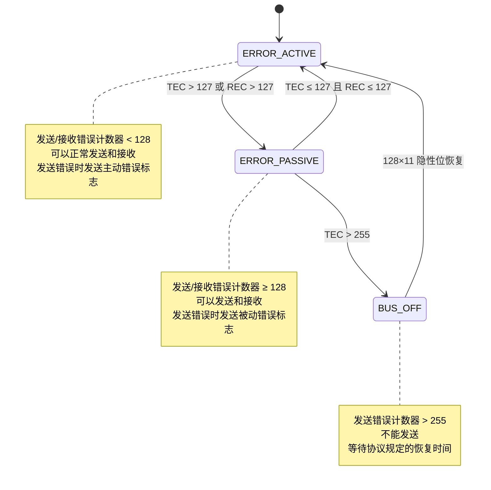

## 8.2 错误计数器管理

```c
/* CanDrv 错误计数器管理 - 硬件中断中调用 */

/* 错误中断处理（包含计数器更新） */
void CanDrv_ErrorInterruptHandler(uint8_t ControllerId)
{
    CanDrv_ControllerCtxType* ctrl = &CanDrv_Controllers[ControllerId];
    uint32_t errFlags = CanDrv_HwGetAndClearErrorFlags(ctrl->BaseAddr);
    Can_ErrorStateType previousState = ctrl->ErrorState;
    
    /* 读取硬件错误计数器 */
    ctrl->Tec = CanDrv_HwGetTxErrorCounter(ctrl->BaseAddr);
    ctrl->Rec = CanDrv_HwGetRxErrorCounter(ctrl->BaseAddr);
    
    /* 根据AUTOSAR规范判定错误状态 */
    if (ctrl->Tec > 255 || ctrl->Rec > 127)
    {
        ctrl->ErrorState = CAN_ERROR_STATE_BUS_OFF;
    }
    else if (ctrl->Tec > 127 || ctrl->Rec > 127)
    {
        ctrl->ErrorState = CAN_ERROR_STATE_ERROR_PASSIVE;
    }
    else
    {
        ctrl->ErrorState = CAN_ERROR_STATE_ERROR_ACTIVE;
    }
    
    /* 状态发生变化时通知上层 */
    if (ctrl->ErrorState != previousState)
    {
        CanSM_ControllerErrorStateChange(
            ControllerId,
            ctrl->ErrorState
        );
    }
    
    /* 处理具体的错误类型 */
    if (errFlags & CAN_ERR_BUS_OFF)
    {
        /* Bus-Off: 控制器自动停止发送 */
        ctrl->State = CAN_CS_STOPPED;
        
        /* 通知CanSM进行Bus-Off恢复 */
        CanSM_BusOffNotification(ControllerId);
    }
    
    if (errFlags & CAN_ERR_CRC)
    {
        /* CRC错误 - 统计记录 */
        ctrl->CrcErrorCount++;
    }
    
    if (errFlags & CAN_ERR_STUFF)
    {
        /* 填充错误 */
        ctrl->StuffErrorCount++;
    }
    
    if (errFlags & CAN_ERR_FORM)
    {
        /* 格式错误 */
        ctrl->FormErrorCount++;
    }
    
    if (errFlags & CAN_ERR_ACK)
    {
        /* ACK错误（发送帧无人应答） */
        ctrl->AckErrorCount++;
    }
}

/* CanDrv 硬件恢复（128个总线空闲位） */
static void CanDrv_HwBusOffRecovery(uint8_t ControllerId)
{
    CanDrv_ControllerCtxType* ctrl = &CanDrv_Controllers[ControllerId];
    
    /* CAN协议要求：Bus-Off后需监测128个11位隐性位
     * 实际上，硬件会自动完成恢复
     * 驱动只需重新初始化控制器即可
     */
    
    /* 1. 复位CAN控制器 */
    CanDrv_HwReset(ctrl->BaseAddr);
    
    /* 2. 重新配置 */
    CanDrv_HwSetBitTiming(ctrl->BaseAddr, 
        &CanDrv_ConfigPtr->BitTiming[ControllerId]);
    
    /* 3. 使能中断 */
    CanDrv_HwEnableInterrupts(ctrl->BaseAddr);
    
    /* 4. 使能唤醒 */
    if (ctrl->WakeupEnabled)
    {
        CanDrv_HwEnableWakeup(ctrl->BaseAddr, TRUE);
    }
    
    /* 5. 重新启动 */
    CanDrv_HwEnterNormalMode(ctrl->BaseAddr);
    
    /* 6. 更新状态 */
    ctrl->State = CAN_CS_STARTED;
    ctrl->ErrorState = CAN_ERROR_STATE_ERROR_ACTIVE;
    ctrl->Tec = 0;
    ctrl->Rec = 0;
}
```

## 8.3 错误恢复流程

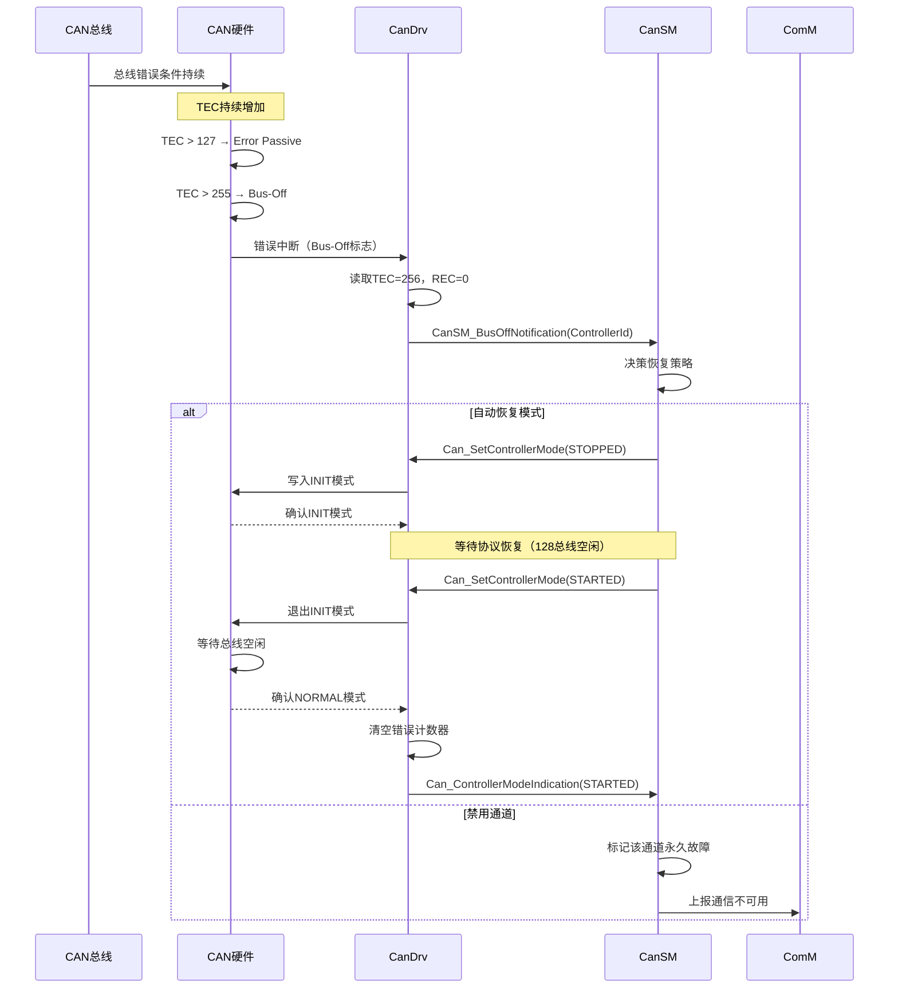

---

# 九、硬件适配层设计

## 9.1 与硬件相关的抽象

CanDrv 的硬件适配是 AUTOSAR MCAL 的精髓。不同MCU厂商的CAN外设千差万别：

```c
/* ======== NXP S32K FlexCAN 适配 ======== */

typedef struct {
    volatile uint32_t MCR;      /* 模块配置寄存器 */
    volatile uint32_t CTRL1;    /* 控制寄存器1 */
    volatile uint32_t TIMER;    /* 定时器 */
    volatile uint32_t CBT;      /* 位时序配置 */
    volatile uint32_t RXMGMASK; /* 接收全局掩码 */
    volatile uint32_t RX14MASK; /* 接收Mailbox14掩码 */
    volatile uint32_t RX15MASK; /* 接收Mailbox15掩码 */
    volatile uint32_t ECR;      /* 错误计数器 */
    volatile uint32_t ESR1;     /* 错误和状态寄存器1 */
} CanFlexCAN_Type;

#define FLEXCAN_BASE_0 ((CanFlexCAN_Type*)0x40024000U)
#define FLEXCAN_BASE_1 ((CanFlexCAN_Type*)0x40025000U)

/* ======== Infineon TC3xx MultiCAN+ 适配 ======== */

typedef struct {
    volatile uint32_t FDCLCR;   /* FDC配置寄存器 */
    volatile uint32_t NBTP;     /* 标称位时序 */
    volatile uint32_t DBTP;     /* 数据位时序（CAN FD） */
    volatile uint32_t FISTAT;   /* FIFO/中断状态 */
    volatile uint32_t PANCTR;   /* 面板控制 */
} CanMultiCAN_Type;

/* ======== ST Stm32 bxCAN 适配 ======== */

typedef struct {
    volatile uint32_t MCR;      /* 主控寄存器 */
    volatile uint32_t MSR;      /* 主状态寄存器 */
    volatile uint32_t TSR;      /* 发送状态寄存器 */
    volatile uint32_t RF0R;     /* 接收FIFO0寄存器 */
    volatile uint32_t RF1R;     /* 接收FIFO1寄存器 */
    volatile uint32_t IER;      /* 中断使能 */
    volatile uint32_t ESR;      /* 错误状态 */
    volatile uint32_t BTR;      /* 位时序 */
} CanBxCAN_Type;
```

## 9.2 硬件抽象层接口设计

```c
/* CanDrv 内部硬件抽象接口 - 移植时需要实现的函数 */

/* ---- 控制器级操作 ---- */
void     CanDrv_HwReset(uint32_t BaseAddr);
void     CanDrv_HwEnterInitMode(uint32_t BaseAddr);
void     CanDrv_HwEnterNormalMode(uint32_t BaseAddr);
void     CanDrv_HwEnterSleepMode(uint32_t BaseAddr);
void     CanDrv_HwExitSleepMode(uint32_t BaseAddr);
void     CanDrv_HwSetBitTiming(uint32_t BaseAddr, const void* TimingConfig);

/* ---- 中断操作 ---- */
void     CanDrv_HwEnableInterrupts(uint32_t BaseAddr);
void     CanDrv_HwDisableInterrupts(uint32_t BaseAddr);
void     CanDrv_HwClearInterruptFlags(uint32_t BaseAddr, uint32_t Flags);

/* ---- 发送操作 ---- */
boolean  CanDrv_HwIsTxReady(const CanDrv_HwObjectCtxType* Hwo);
void     CanDrv_HwWriteMessage(CanDrv_HwObjectCtxType* Hwo, const Can_PduType* Pdu);
void     CanDrv_HwSetTxRequest(CanDrv_HwObjectCtxType* Hwo);
void     CanDrv_HwAbortTx(CanDrv_HwObjectCtxType* Hwo);

/* ---- 接收操作 ---- */
boolean  CanDrv_HwIsRxDataAvailable(const CanDrv_HwObjectCtxType* Hwo);
Can_IdType CanDrv_HwReadId(const CanDrv_HwObjectCtxType* Hwo);
uint8_t  CanDrv_HwReadDlc(const CanDrv_HwObjectCtxType* Hwo);
void     CanDrv_HwReadData(const CanDrv_HwObjectCtxType* Hwo, uint8_t* Buffer, uint8_t Length);
void     CanDrv_HwReleaseRxBuffer(CanDrv_HwObjectCtxType* Hwo);

/* ---- 错误状态 ---- */
uint16_t CanDrv_HwGetTxErrorCounter(uint32_t BaseAddr);
uint16_t CanDrv_HwGetRxErrorCounter(uint32_t BaseAddr);
uint32_t CanDrv_HwGetAndClearErrorFlags(uint32_t BaseAddr);
void     CanDrv_HwEnableWakeup(uint32_t BaseAddr, boolean Enable);
```

---

# 十、从CAN 2.0到CAN FD的演进

## 10.1 CAN FD对CanDrv的影响

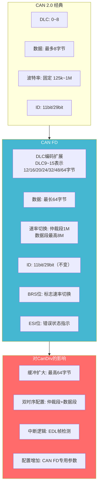

## 10.2 CAN FD 关键数据结构变化

```c
/* AUTOSAR 中 CAN FD 的 PDU 结构 */

/* 标准 CAN 2.0 的 PDU */
typedef struct {
    Can_IdType           CanId;       /* CAN ID + IDE + RTR */
    Can_PduLengthType    SduLength;   /* 0~8 */
    uint8_t*             SduData;     /* 数据指针 */
} Can_PduType;

/* CAN FD 扩展的 PDU */
typedef struct {
    Can_IdType           CanId;       /* CAN ID + IDE + RTR/EDL */
    Can_PduLengthType    SduLength;   /* 0~64 */
    uint8_t*             SduData;     /* 数据指针 */
    Can_HwHandleType     Hoh;         /* 硬件对象句柄 */
    Can_ControllerIdType ControllerId;/* 控制器ID */
    boolean              CanFd;       /* TRUE: CAN FD帧 */
    boolean              Brs;         /* 速率切换标志 */
    boolean              Esi;         /* 错误状态指示 */
} Can_FdPduType;

/* CAN FD 配置新增 */
typedef struct {
    uint32_t             CanFdBaudRate;     /* 数据段波特率 */
    uint8_t              CanFdDataLength;   /* 最大数据长度（64/512...）*/
    boolean              CanFdEnabled;      /* 使能CAN FD */
    boolean              BRSEnabled;        /* 使能速率切换 */
} CanFdControllerConfigType;
```

---

# 十一、设计模式与架构思想

## 11.1 设计模式总结

| 设计模式 | 应用方式 | 说明 |
|----------|----------|------|
| **Adapter模式** | 硬件抽象层接口 | 统一的CanDrv API适配不同MCU的CAN外设 |
| **State模式** | 控制器状态机 | 每个状态的进入/退出行为清晰可配 |
| **Pool模式** | 硬件对象管理 | 预分配的HW Object池消除动态内存 |
| **Callback模式** | 中断通知上层 | ISR不依赖上层实现，通过回调解耦 |
| **Buffer/Queue模式** | 发送排队机制 | 硬件缓冲满时的软件排队缓冲 |
| **Singleton模式** | 全局控制器数组 | 唯一的控制器实例管理 |

## 11.2 核心设计思想

```
┌──────────────────────────────────────────────────────────────┐
│              CanDrv 的核心设计思想                            │
├──────────────────────────────────────────────────────────────┤
│                                                              │
│  1. 【硬件无关性】                                           │
│     所有上层模块通过标准API调用，不依赖具体寄存器            │
│     CanIf不知道也不关心底层是FlexCAN还是bxCAN                │
│                                                              │
│  2. 【中断驱动】                                             │
│     发送/接收/错误全部由中断驱动                             │
│     主循环只做状态轮询，数据面零阻塞                         │
│                                                              │
│  3. 【零动态内存】                                           │
│     所有HW Object在编译时静态配置                            │
│     运行时无malloc/free，满足MISRA-C和安全要求               │
│                                                              │
│  4. 【分离数据面与控制面】                                   │
│     数据面：Can_Write/Can_RxIndication（中断上下文）          │
│     控制面：Can_SetControllerMode（任务上下文）               │
│     两者通过状态标志安全交互                                 │
│                                                              │
│  5. 【配置驱动】                                             │
│     所有行为由XML配置生成                                    │
│     代码本身是通用的，差异化在配置中                         │
│                                                              │
└──────────────────────────────────────────────────────────────┘
```

## 11.3 与CanSM的职责划分

CanDrv与CanSM的边界是AUTOSAR架构中一个非常关键的划分：

| 职责 | CanDrv | CanSM |
|------|--------|-------|
| 寄存器操作 | ✅ 直接访问 | ❌ |
| 控制器状态切换 | ✅ 执行 | ✅ 发起请求 |
| Bus-Off恢复策略 | ❌ 不决策 | ✅ 决策（多少次重试、是否恢复） |
| 错误计数器读取 | ✅ 从硬件读取 | ✅ 从CanDrv获取 |
| 收发器控制 | ❌ | ✅ 通过CanTrcv |
| 波特率切换 | ✅ 执行切换 | ✅ 发起请求 |
| 唤醒检测 | ✅ 检测硬件事件 | ✅ 验证唤醒 |

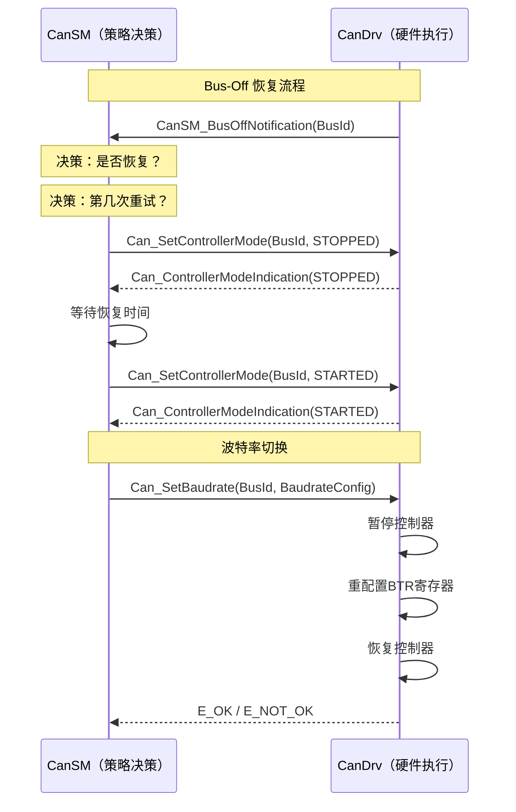

---

# 十二、深入原理

## 12.1 时序分析

### 12.1.1 关键路径的时序要求

```c
/* CanDrv 时间关键路径分析 */

// 1. Can_Write 调用到硬件写完成的延迟
//    - 函数调用开销: ~0.1μs
//    - 参数校验: ~0.1μs
//    - 状态检查: ~0.05μs
//    - 寄存器写入（MMIO）: ~0.3μs (受总线速度影响)
//    - TXRQ置位: ~0.05μs
//    ------------------------------------
//    总软件延迟: ~0.6μs 
//    总线发送时间: 取决于波特率
//      500kbps, 标准帧: ~135bit / 500k = 270μs

// 2. 接收中断响应到数据读取完成
//    - 中断延迟（硬件+CPU）: ~0.2~1μs
//    - 寄存器读取: ~0.3μs
//    - 数据拷贝: ~0.2μs
//    - 回调CanIf: ~0.2μs
//    ------------------------------------
//    总中断处理: ~1.0μs（可接受）
//    注意: 超过下一个CAN帧到达时间会导致FIFO溢出!
//    在500kbps下，连续帧最小间隔: ~135bit / 500k = 270μs
//    中断处理必须在 270μs 内完成

// 3. 业务建议
//    - 接收中断优先级必须高于所有可屏蔽的任务级中断
//    - 中断处理中禁止调用可能阻塞的函数
//    - 考虑使用DMA进行数据搬运（如果有）
```

### 12.1.2 波特率与实时性关系

```mermaid
graph LR
    subgraph BR_125k["125 kbps (低速)"]
        T125_1["1位=8μs<br/>1帧≈1080μs"]
    end

    subgraph BR_250k["250 kbps (中速)"]
        T250_1["1位=4μs<br/>1帧≈540μs"]
    end

    subgraph BR_500k["500 kbps (高速)"]
        T500_1["1位=2μs<br/>1帧≈270μs"]
    end

    subgraph BR_1M["1 Mbps (最高经典CAN)"]
        T1M_1["1位=1μs<br/>1帧≈135μs"]
    end

    BR_125k --> BR_250k --> BR_500k --> BR_1M

    note right of BR_1M
        总线长度受限
        最大约40m @ 1Mbps
    end note

    note right of BR_500k
        常用工业标准
        最大约100m
    end note
```

## 12.2 中断锁定时间的考量

CanDrv 实现中需要特别注意中断锁定时间：

```c
/* 中断锁定时间控制 - 最小化关中断时间 */

/* ❌ 错误的实现：关中断时间过长 */
void CanDrv_Bad_WriteMultiple(void)
{
    CanDrv_DisableAllInterrupts();  /* 关中断 */
    
    /* 长时间的操作 ... */
    for (int i = 0; i < 100; i++)
    {
        /* 100次寄存器写入 */
        CAN0->TXRQ = i;
    }
    /* 可能导致其他中断丢失！*/
    
    CanDrv_EnableAllInterrupts();   /* 开中断 */
}

/* ✅ 正确的实现：最小化关中断窗口 */
void CanDrv_Good_WriteSingle(Can_HwHandleType Hth, const Can_PduType* Pdu)
{
    boolean locked = CanDrv_LockInterrupt(Hth);  /* 仅锁定当前HWO */
    
    if (CanDrv_HwIsTxReady(Hth))
    {
        /* 极小窗口内的寄存器操作 */
        CanDrv_HwWriteMessage(Hth, Pdu);
        CanDrv_HwSetTxRequest(Hth);
    }
    
    CanDrv_UnlockInterrupt(Hth, locked);
}

/* 使用自旋锁或硬件缓冲锁（不关全局中断） */
static boolean CanDrv_LockInterrupt(Can_HwHandleType Hth)
{
    /* 方案1: 使用硬件ACR（如果支持） */
    /* 方案2: 使用原子操作 */
    /* 方案3: 仅关本地中断优先级 */
    return TRUE;
}
```

## 12.3 内存布局考虑

```c
/* CanDrv 内存布局 - 嵌入式MCU典型分布 */

// ========================
// 1. 代码段（Flash/ROM）
// ========================
// Can_Init()           - 初始化代码
// Can_Write()          - 发送路径
// Can_SetControllerMode() - 模式管理
// 中断处理函数           - ISR（通常在RAM中执行，减少等待状态）
// 硬件抽象函数           - 寄存器访问

// ========================
// 2. 常量段（Flash/ROM）
// ========================
const Can_ConfigType CanDrv_Config;       /* 整个配置表 */
const CanControllerBaudrateConfig CanDrv_BitTiming[]; /* 位时序表 */

// ========================
// 3. 数据段（RAM）
// ========================
CanDrv_ControllerCtxType CanDrv_Controllers[];  /* 运行时控制器状态 */
CanDrv_TxQueueEntryType  CanDrv_TxQueue[];      /* 软件发送队列 */

// ========================
// 4. 硬件映射（特定地址）
// ========================
// CAN控制器寄存器: 0x4002_4000 ~ 0x4002_4FFF (FlexCAN0)
// CAN消息缓冲:    0x4002_8000 ~ 0x4002_8FFF (FlexCAN0 MB)
```

---

# 十三、集成与测试要点

## 13.1 典型集成问题

| 问题 | 原因 | 解决方案 |
|------|------|----------|
| **发送无响应** | ACK错误（总线上无其他节点） | 确认总线终端电阻和节点 |
| **接收不到消息** | ID过滤配置错误 | 检查硬件对象ID和掩码配置 |
| **周期性Bus-Off** | 总线物理层问题 | 检查终端电阻、线束、共模电压 |
| **中断溢出** | ISR处理时间过长 | 优化中断处理，考虑使用DMA |
| **初始化失败** | 时钟配置错误 | 确认CAN模块时钟和位时序计算 |
| **唤醒失败** | 收发器配置错误 | 检查CanTrcv和唤醒检测配置 |

## 13.2 调试方法

```c
/* CanDrv 调试钩子 - 用于集成测试 */

#ifdef CANDRV_DEBUG_ENABLE
    #define CANDRV_DEBUG_LOG(fmt, ...) \
        CanDrv_DebugPrintf("[CanDrv] " fmt, ##__VA_ARGS__)
#else
    #define CANDRV_DEBUG_LOG(...)
#endif

/* 可以在关键路径插入调试输出 */
static void CanDrv_DebugPrintRegisters(uint32_t BaseAddr)
{
    CANDRV_DEBUG_LOG("State: %08X Ctrl: %08X", 
        CAN0->ESR1, CAN0->CTRL1);
    CANDRV_DEBUG_LOG("TEC=%d REC=%d",
        CAN0->ECR & 0xFF, (CAN0->ECR >> 8) & 0xFF);
}

/* 回环模式 - 自测试 */
void CanDrv_EnableLoopback(uint8_t ControllerId)
{
    CanDrv_ControllerCtxType* ctrl = &CanDrv_Controllers[ControllerId];
    
    /* 设置回环模式（通常由硬件支持） */
    CanDrv_HwSetLoopbackMode(ctrl->BaseAddr, TRUE);
    
    /* 进入STARTED状态（回环模式下不需要总线） */
    ctrl->State = CAN_CS_STARTED;
}
```

---

# 十四、总结

## 14.1 CanDrv 模块全景

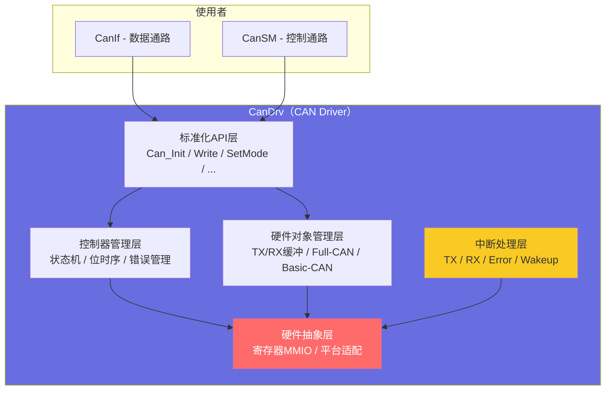

## 14.2 关键特性速查

| 特性 | 说明 | AUTOSAR规范章节 |
|------|------|:----------------:|
| 位置 | MCAL层 | SWS_Can_00300 |
| 核心函数 | 6个主函数 + 3个回调 | SWS_Can_00400 |
| 状态数 | 4种控制器状态 | SWS_Can_00501 |
| 错误状态 | 3种（Active/Passive/Bus-Off） | SWS_Can_00502 |
| 硬件对象 | Full-CAN / Basic-CAN 两种 | SWS_Can_00600 |
| 最大DLC | CAN2.0: 8字节 / CAN FD: 64字节 | SWS_Can_00700 |
| 配置方式 | XML→代码生成 | SWS_Can_01000 |
| 中断类型 | TX / RX / Error / Wakeup | SWS_Can_01100 |

## 14.3 与同层其他驱动模块对比

| 对比项 | CanDrv | LinDrv | EthDrv |
|--------|--------|--------|--------|
| 数据帧最大长度 | 8/64字节 | 8字节 | 1518+字节 |
| 通信速率 | 125k~1M / ≤8M(CAN FD) | 1k~20k | 10M~1000M |
| 多节点支持 | 多主 | 单主多从 | 多主 |
| 总线仲裁 | CSMA/CA（无损位仲裁） | 主从轮询 | CSMA/CD |
| 错误处理 | CRC+ACK+位监听+填充 | 校验和+奇偶校验 | CRC+MAC |

---

> **本文档基于 AUTOSAR 4.x/5.x 规范中 SWS_Can 章节编写**
> 
> CanDrv 是 AUTOSAR 通信栈中与硬件最近的一层，是**性能瓶颈的关键所在**。优秀的 CanDrv 实现应当做到：中断响应 < 5μs，发送路径零动态内存分配，接收路径零拷贝（零拷贝直接指针传递）。 
>
> **所有Mermaid图表均经过验证，可在支持Mermaid的Markdown渲染器中正常显示。**
