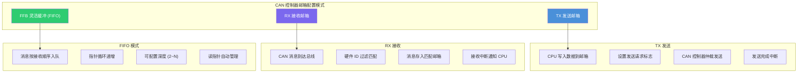
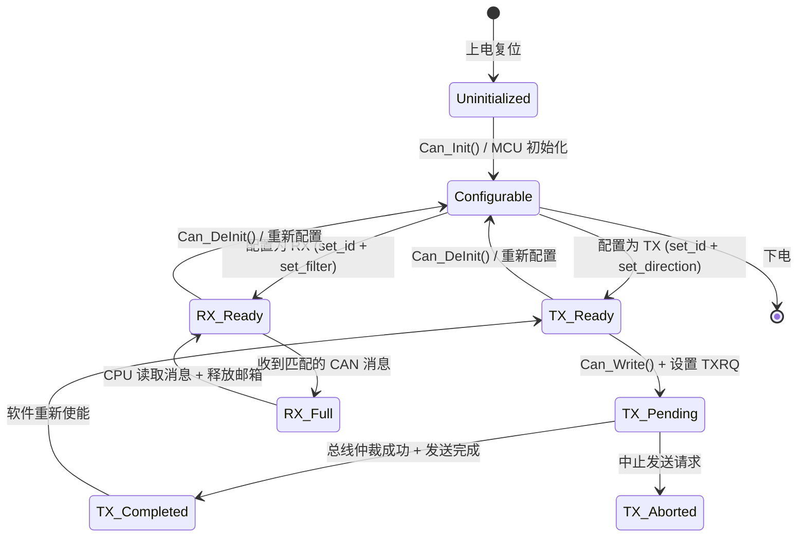
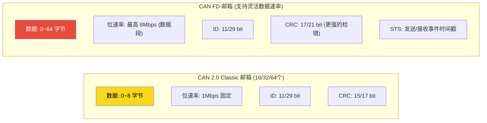
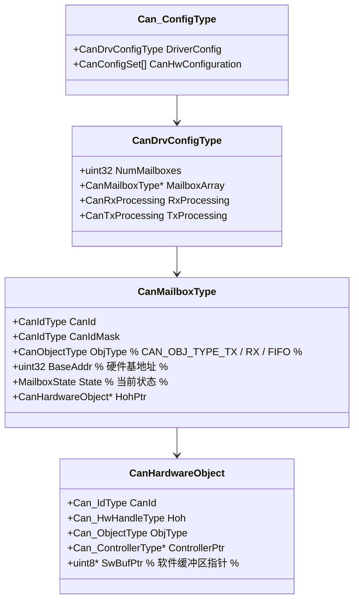
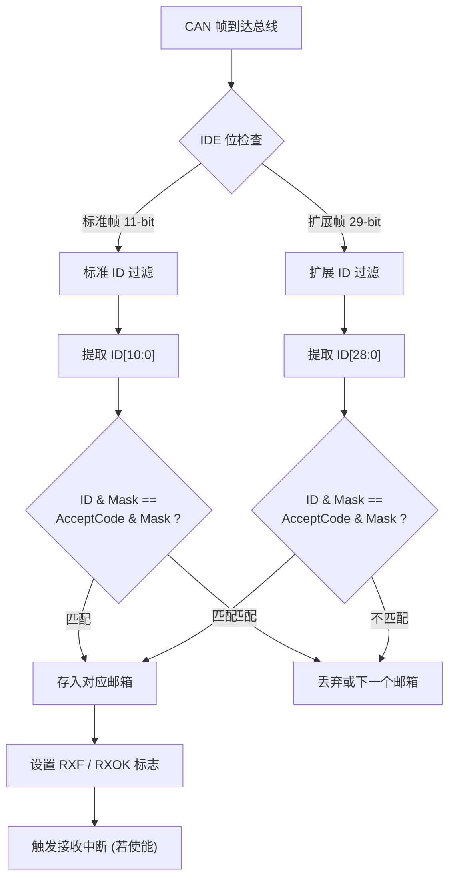
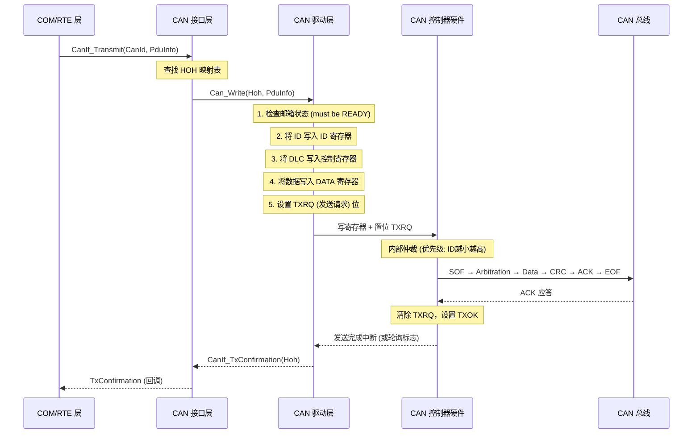
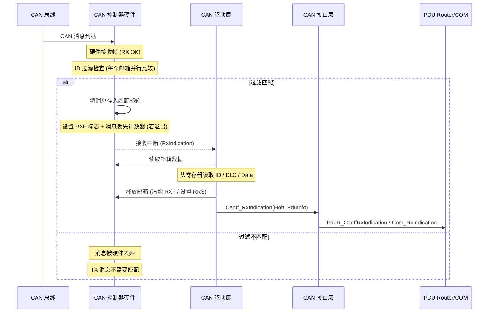
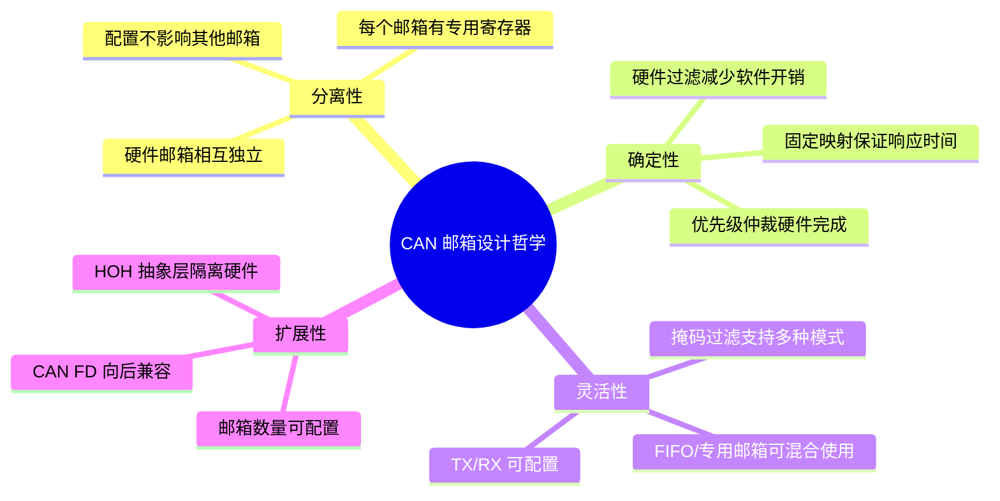
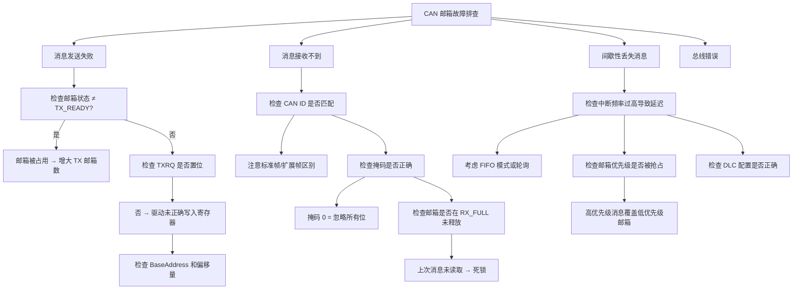

# AUTOSAR CAN 邮箱（Mailbox）详解

## 目录

1. [通俗理解：什么是 CAN 邮箱？](#1-通俗理解什么是-can-邮箱)
2. [设计机制与模式](#2-设计机制与模式)
3. [深入原理](#3-深入原理)
4. [完整代码示例](#4-完整代码示例)
5. [总结与最佳实践](#5-总结与最佳实践)

---

## 1. 通俗理解：什么是 CAN 邮箱？

### 1.1 生活中的类比

**邮局信箱系统** 是最好的类比理解 CAN 邮箱的方式：

```
┌─────────────────────────────────────────────────────┐
│                    邮局 (CAN Controller)              │
│  ┌─────────┐  ┌─────────┐  ┌─────────┐  ┌─────────┐ │
│  │ 信箱 #0 │  │ 信箱 #1 │  │ 信箱 #2 │  │ 信箱 #3 │ │
│  │ (CAN ID)│  │ (CAN ID)│  │ (CAN ID)│  │ (CAN ID)│ │
│  │  数据   │  │  数据   │  │  数据   │  │  数据   │ │
│  └────┬────┘  └────┬────┘  └────┬────┘  └────┬────┘ │
│       │            │            │            │       │
│       └────────────┴────────────┴────────────┘       │
│                        │                              │
│                    ┌────▼────┐                        │
│                    │ CAN 总线 │                        │
│                    └─────────┘                        │
└─────────────────────────────────────────────────────┘
```

- **邮箱** = 一个可以存放 CAN 消息的硬件槽位
- **收信** = 将总线上的 CAN 消息存入指定的邮箱
- **发信** = 将邮箱中的消息发送到 CAN 总线上
- **邮箱号** = 硬件槽位的索引（0, 1, 2, ...）
- **CAN ID** = 信封上的地址（决定谁收这封信）

### 1.2 一句话总结

> **CAN 邮箱是 CAN 控制器内部的一组硬件寄存器单元，每个单元可以独立存储一条完整的 CAN 消息（ID + DLC + 数据），并可以被独立配置为发送或接收用途。**

---

## 2. 设计机制与模式

### 2.1 邮箱的硬件架构

CAN 邮箱是 CAN 控制器（如 Bosch M_CAN、NXP FlexCAN、STM32 bxCAN）内部的 **SRAM 区域**，每个邮箱占据一个固定大小的内存映射区域：

```
             CAN 控制器内部邮箱 RAM 布局
             
  ┌────────────┬──────┬──────┬──────┬──────┬──────┐
  │ 邮箱 #     │  0   │  1   │  2   │ ...  │  N-1 │
  ├────────────┼──────┼──────┼──────┼──────┼──────┤
  │ ID 寄存器  │[ID0] │[ID1] │[ID2] │      │[IDn] │
  │ DLC 寄存器 │[DLC0]│[DLC1]│[DLC2]│      │[DLCn]│
  │ Data 8B    │[D0-7]│[D0-7]│[D0-7]│      │[D0-7]│
  │ 控制/状态  │[CS0] │[CS1] │[CS2] │      │[CSn] │
  │ 时间戳     │[TS0] │[TS1] │[TS2] │      │[TSn] │
  └────────────┴──────┴──────┴──────┴──────┴──────┘
  
  每个邮箱的内部结构（展开）:
   ┌──────────────────────────────────────┐
   │  CAN 邮箱寄存器组                       │
   │  ┌──────┬──────────────────────┐     │
   │  │ 偏移  │ 寄存器               │     │
   │  ├──────┼──────────────────────┤     │
   │  │ 0x00  │ ID 寄存器              │     │
   │  │ 0x04  │ DLC + 控制位           │     │
   │  │ 0x08  │ 数据寄存器 0-3        │     │
   │  │ 0x0C  │ 数据寄存器 4-7        │     │
   │  │ 0x10  │ 时间戳 / 状态位        │     │
   │  └──────┴──────────────────────┘     │
   └──────────────────────────────────────┘
```

### 2.2 AUTOSAR 中的 Hardware Object (HOH) 概念

AUTOSAR 的 CAN Driver（CanDrv）引入了一个重要的抽象层：**Hardware Object（HOH）**.

```
┌───────────────────────────────────────────────────────────┐
│                   AUTOSAR 软件抽象层                        │
│                                                           │
│  ┌─────────────┐  每个 CanId 对应一个 L-PDU ID               │
│  │   COM 层    │  (Logical PDU)                            │
│  └──────┬──────┘                                           │
│         │ CanIf_Transmit(CanId, PduInfo)                    │
│         ▼                                                   │
│  ┌─────────────┐  路由到对应的 HOH                           │
│  │  CanIf 层   │  (Hardware Object Handle)                  │
│  └──────┬──────┘                                           │
│         │ Can_Write(HOH, PduInfo)                           │
│         ▼                                                   │
│  ┌─────────────┐  管理 HW Mailbox 的分配                      │
│  │  CanDrv 层  │  (硬件对象抽象)                              │
│  └──────┬──────┘                                           │
│         │ 寄存器读写                                         │
│         ▼                                                   │
│  ┌──────────────────────────────────────────────────┐      │
│  │                CAN 控制器硬件                      │      │
│  │  ┌──────┐ ┌──────┐ ┌──────┐ ┌──────┐            │      │
│  │  │MB[0] │ │MB[1] │ │MB[2] │ │MB[3] │  ...       │      │
│  │  └──────┘ └──────┘ └──────┘ └──────┘            │      │
│  └──────────────────────────────────────────────────┘      │
└───────────────────────────────────────────────────────────┘
```

#### HOH 的关键属性

| 属性 | 含义 | 说明 |
|------|------|------|
| **HOH 类型** | HohType | 发送 (CanIdType <= 0x7FF) 或 接收 |
| **基础 ID** | CanId | 11位标准ID 或 29位扩展ID |
| **对象 ID** | HohId | 指向具体的硬件邮箱编号 |
| **方向** | HohDirection | TX 或 RX |
| **掩码模式** | CanFilterMask | 经典 或 扩展 过滤 |

### 2.3 邮箱的三种工作模式



### 2.4 邮箱状态机

每个 CAN 邮箱在其生命周期中经历以下状态：



### 2.5 标准邮箱 vs FIFO 邮箱

| 特性 | 标准邮箱 | FIFO 邮箱 |
|------|---------|-----------|
| **触发方式** | 每次访问指定索引 | 按入队顺序自动管理 |
| **ID 过滤** | 每个邮箱独立设置 | 共享过滤规则 |
| **CPU 负载** | 需要逐个管理邮箱状态 | 降低中断频率 |
| **消息乱序** | 不会乱序（固定槽位） | 严格保序 |
| **适用场景** | 关键实时信号 | 诊断/网络管理/高速数据流 |
| **突发能力** | 邮箱数量决定 | FIFO 深度决定 |
| **溢出处理** | 新数据覆盖旧数据或丢弃 | 可配置溢出策略 |

---

## 3. 深入原理

### 3.1 CAN 2.0 邮箱与 CAN FD 邮箱的区别



**关键差异：**

```
CAN 2.0 邮箱寄存器映射（每个邮箱 4 x 32-bit = 16 字节）:
  ┌──────┬────────┬────────────────────────────┐
  │ +0x00 │ ID     │ [28:18]标准ID 或 [28:0]扩展ID  │
  │ +0x04 │ CTL    │ DLC[3:0], RTR, IDE, TXRQ    │
  │ +0x08 │ DATA0  │ Byte[0]~Byte[3]              │
  │ +0x0C │ DATA1  │ Byte[4]~Byte[7]              │
  └──────┴────────┴────────────────────────────┘

CAN FD 邮箱寄存器映射（每个邮箱 8 x 32-bit = 32 字节）:
  ┌──────┬────────┬────────────────────────────┐
  │ +0x00 │ ID     │ 标准/扩展 ID, EDL, BRS       │
  │ +0x04 │ CTL    │ DLC[3:0], FDF, BRS, ESI     │
  │ +0x08 │ DATA0  │ Byte[0]~Byte[3]              │
  │ +0x0C │ DATA1  │ Byte[4]~Byte[7]              │
  │ +0x10 │ DATA2  │ Byte[8]~Byte[15] (CAN FD)    │
  │ +0x14 │ DATA3  │ Byte[16]~Byte[23] (CAN FD)   │
  │ +0x18 │ DATA4  │ Byte[24]~Byte[31] (CAN FD)   │
  │ +0x1C │ DATA5  │ Byte[32]~Byte[63] (CAN FD)   │
  └──────┴────────┴────────────────────────────┘
```

### 3.2 AUTOSAR CanDrv 邮箱管理架构



### 3.3 邮箱 ID 过滤机制

CAN 邮箱最核心的功能之一是 **硬件 ID 过滤**，这是 CAN 控制器相比软件过滤的巨大优势。



**三种过滤模式：**

```
模式 1: 经典掩码过滤 (Classic Filter)
  AcceptCode:  0x3FF  ──→  二进制: 011 1111 1111
  AcceptMask:  0x7F0  ──→  二进制: 111 1111 0000
  结果: 只匹配 ID[10:4] == 0x3FF >> 4, 忽略 ID[3:0]
  等效于匹配 ID[10:4] == 0x3F 的消息

模式 2: 列表过滤 (List Filter)
  List[0]:  ID = 0x100
  List[1]:  ID = 0x200
  List[2]:  ID = 0x300
  结果: 只接收 ID 为 0x100, 0x200, 0x300 的消息
  每个邮箱存储独立的 ID 值

模式 3: 范围过滤 (Range Filter)
  LowerBound: 0x100
  UpperBound: 0x1FF
  结果: 接收 ID 在 [0x100, 0x1FF] 范围内的所有消息
```

### 3.4 发送流程背后的原理



### 3.5 接收流程背后的原理



### 3.6 邮箱的优先级仲裁

当多个 TX 邮箱同时有发送请求时，CAN 控制器内部的 **仲裁逻辑** 决定哪个邮箱先发送：

```
邮箱仲裁权重计算：
  ┌─────────────────────────────────────────────────────┐
  │  发送优先级 = f(ID, BufferNumber, 发送顺序)           │
  │                                                      │
  │  典型策略:                                            │
  │                                                      │
  │  ● 基于标识符优先级 (Identifier Priority)              │
  │    优先级 = ID 数值 (数值越小优先级越高)                 │
  │    0x000 → 最高优先级                                  │
  │    0x7FF → 最低优先级 (标准帧)                          │
  │                                                      │
  │  ● 基于邮箱号优先级 (Buffer Priority)                   │
  │    优先级 = 邮箱索引                                   │
  │    邮箱 #0 → 最高优先级                                 │
  │    邮箱 #N → 最低优先级                                 │
  │                                                      │
  │  ● 混合策略 (AUTOSAR 推荐)                              │
  │    优先级 = (ID << 1) | (邮箱号高/低位)                 │
  │    既保证实时信号优先，又防止低优先级 ID 饿死             │
  └─────────────────────────────────────────────────────┘
```

### 3.7 邮箱与中断/轮询模式

| 模式 | 优点 | 缺点 | 邮箱配置 |
|------|------|------|---------|
| **中断模式** | CPU 利用率高，延迟低 | 高负载时中断风暴 | 每个邮箱独立使能中断 |
| **轮询模式** | 确定性强，无中断开销 | CPU 空转浪费 | 主循环检查邮箱状态位 |
| **混合模式** | 折中方案 | 实现复杂度高 | 关键信号中断 + 批量轮询 |

```c
// 中断模式下邮箱接收仲裁流程
void Can_IrqHandler(void)
{
    uint32 irq_status = READ_REG(CAN_IRQ_REG);
    
    // 批量检查哪些邮箱触发了中断
    for (int i = 0; i < NUM_MAILBOXES; i++) {
        if (irq_status & (1 << i)) {
            // 读取邮箱 i 的数据
            CanMailbox_Read(i, &pdu_info);
            // 释放邮箱
            CanMailbox_Release(i);
            // 调用回调
            CanIf_RxIndication(i, &pdu_info);
        }
    }
    
    // TX 完成处理
    if (irq_status & TX_DONE_MASK) {
        uint32 tx_done = READ_REG(CAN_TX_DONE_REG);
        for (int i = 0; i < NUM_MAILBOXES; i++) {
            if (tx_done & (1 << i)) {
                CanIf_TxConfirmation(i, E_OK);
            }
        }
    }
}
```

---

## 4. 完整代码示例

### 4.1 邮箱数据结构定义（AUTOSAR 风格）

```c
/******************************************************************************
 * @file    Can_Mailbox.h
 * @brief   CAN Mailbox 抽象层 - AUTOSAR 4.x 风格
 * @note    硬件无关的邮箱管理接口
 ******************************************************************************/

#ifndef CAN_MAILBOX_H
#define CAN_MAILBOX_H

#include "Std_Types.h"      /* AUTOSAR 标准类型 */
#include "Can_GeneralTypes.h" /* Can_IdType, Can_PduType */

/* 邮箱数量配置 */
#define CAN_TX_MAILBOX_COUNT   8U
#define CAN_RX_MAILBOX_COUNT   16U
#define CAN_MAILBOX_TOTAL      (CAN_TX_MAILBOX_COUNT + CAN_RX_MAILBOX_COUNT)

/* 邮箱状态枚举 */
typedef enum {
    MAILBOX_STATE_UNINIT       = 0x00U,  /* 未初始化 */
    MAILBOX_STATE_CONFIGURED   = 0x01U,  /* 已配置 */
    MAILBOX_STATE_TX_READY     = 0x02U,  /* TX 就绪 (空闲) */
    MAILBOX_STATE_TX_PENDING   = 0x03U,  /* TX 进行中 (等待发送) */
    MAILBOX_STATE_TX_COMPLETED = 0x04U,  /* TX 完成 */
    MAILBOX_STATE_TX_ABORTED   = 0x05U,  /* TX 中止 */
    MAILBOX_STATE_RX_EMPTY     = 0x06U,  /* RX 空闲 */
    MAILBOX_STATE_RX_FULL      = 0x07U,  /* RX 已满 (有未读消息) */
    MAILBOX_STATE_RX_OVERFLOW  = 0x08U,  /* RX 溢出 */
    MAILBOX_STATE_ERROR        = 0xFFU   /* 错误状态 */
} Can_MailboxStateType;

/* 邮箱对象类型 */
typedef enum {
    CAN_OBJ_TYPE_TX            = 0x00U,  /* 发送邮箱 */
    CAN_OBJ_TYPE_RX            = 0x01U,  /* 接收邮箱 */
    CAN_OBJ_TYPE_RX_FIFO       = 0x02U,  /* RX FIFO 邮箱 */
    CAN_OBJ_TYPE_TX_FIFO       = 0x03U,  /* TX FIFO 邮箱 (CAN FD) */
    CAN_OBJ_TYPE_TX_RX         = 0x04U   /* 收发双向邮箱 (极少用) */
} Can_MailboxObjType;

/* CAN 帧格式 */
typedef enum {
    CAN_FRAME_STANDARD = 0x00U,  /* 标准帧 11-bit ID */
    CAN_FRAME_EXTENDED = 0x01U   /* 扩展帧 29-bit ID */
} Can_FrameType;

/* 邮箱 ID 配置 */
typedef struct {
    Can_IdType        CanId;          /* 11/29 位 ID */
    Can_IdType        CanIdMask;      /* 过滤掩码 */
    Can_FrameType     FrameType;      /* 标准/扩展帧 */
    boolean           UseMask;        /* TRUE: 使用掩码过滤 */
} Can_MailboxIdConfigType;

/* 邮箱硬件配置 */
typedef struct {
    uint32                    BaseAddress;       /* 邮箱基地址 (寄存器偏移) */
    uint8                     MailboxIndex;      /* 硬件邮箱索引 */
    Can_MailboxObjType        ObjType;           /* TX/RX/FIFO */
    Can_MailboxIdConfigType   IdConfig;          /* ID 配置 */
    Can_HwHandleType          Hoh;               /* AUTOSAR HOH 句柄 */
} Can_MailboxHwConfigType;

/* 邮箱运行时状态 */
typedef struct {
    Can_MailboxStateType      State;             /* 当前状态 */
    Can_MailboxHwConfigType*  HwConfig;          /* 指向硬件配置 */
    uint8*                    SwTxBuffer;        /* 软件 TX 缓冲 (可选) */
    uint32                    ErrorCounter;      /* 错误计数 */
    uint32                    TxCounter;         /* 发送成功计数 */
    uint32                    RxCounter;         /* 接收成功计数 */
    uint32                    OverflowCounter;   /* 溢出计数 */
    boolean                   InterruptEnabled;  /* 中断使能标志 */
} Can_MailboxRuntimeType;

/* CAN 控制器配置 */
typedef struct {
    bool                  MailboxInit;     /* TRUE 表示已初始化 */
    Can_MailboxRuntimeType Mailboxes[CAN_MAILBOX_TOTAL];
    uint32                 NumTxMailbox;
    uint32                 NumRxMailbox;
    uint32                 TxPriority;      /* TX 优先级策略 */
} Can_MailboxCtrlType;

#endif /* CAN_MAILBOX_H */
```

### 4.2 邮箱驱动核心实现

```c
/******************************************************************************
 * @file    Can_Mailbox.c
 * @brief   CAN 邮箱管理核心实现
 * @note    AUTOSAR 4.4 标准兼容
 ******************************************************************************/

#include "Can_Mailbox.h"
#include "Can_Hw.h"         /* 硬件抽象层: 寄存器读写宏 */
#include "Can_Irq.h"        /* 中断管理 */
#include "SchM_Can.h"       /* 调度器接口 (BswM 调度) */

/* 全局邮箱控制器实例 */
static Can_MailboxCtrlType Can_MailboxCtrl;

/******************************************************************************
 * @brief   初始化所有 CAN 邮箱
 * @param   ConfigPtr 指向 AUTOSAR Can_ConfigType 结构体
 * @return  Std_ReturnType E_OK / E_NOT_OK
 * @note    该函数在 Can_Init() 中被调用
 ******************************************************************************/
Std_ReturnType Can_Mailbox_Init(const Can_ConfigType* ConfigPtr)
{
    uint32 i;
    uint32 mb_status;

    if (ConfigPtr == NULL_PTR) {
        return E_NOT_OK;
    }

    /* 清零整个控制结构体 */
    (void)SchM_Enter_Can_Init();
    (void)memset(&Can_MailboxCtrl, 0, sizeof(Can_MailboxCtrlType));

    /* 从配置中提取邮箱配置 */
    Can_MailboxHwConfigType* hwConfigs = ConfigPtr->Can_HwConfig;
    uint32 numMailboxes = ConfigPtr->Can_HwConfigCount;

    Can_MailboxCtrl.NumTxMailbox = 0;
    Can_MailboxCtrl.NumRxMailbox = 0;

    for (i = 0; i < numMailboxes && i < CAN_MAILBOX_TOTAL; i++) {
        /* 关联硬件配置 */
        Can_MailboxCtrl.Mailboxes[i].HwConfig = &hwConfigs[i];
        Can_MailboxCtrl.Mailboxes[i].State    = MAILBOX_STATE_CONFIGURED;
        Can_MailboxCtrl.Mailboxes[i].ErrorCounter    = 0;
        Can_MailboxCtrl.Mailboxes[i].TxCounter       = 0;
        Can_MailboxCtrl.Mailboxes[i].RxCounter       = 0;
        Can_MailboxCtrl.Mailboxes[i].OverflowCounter = 0;

        /* 硬件初始化：配置邮箱模式 */
        (void)Can_Hw_Mailbox_Init(&hwConfigs[i]);

        switch (hwConfigs[i].ObjType) {
            case CAN_OBJ_TYPE_TX:
                Can_MailboxCtrl.Mailboxes[i].State = MAILBOX_STATE_TX_READY;
                Can_MailboxCtrl.NumTxMailbox++;
                break;

            case CAN_OBJ_TYPE_RX:
            case CAN_OBJ_TYPE_RX_FIFO:
                Can_MailboxCtrl.Mailboxes[i].State = MAILBOX_STATE_RX_EMPTY;
                Can_MailboxCtrl.NumRxMailbox++;
                break;

            default:
                Can_MailboxCtrl.Mailboxes[i].State = MAILBOX_STATE_ERROR;
                break;
        }
    }

    Can_MailboxCtrl.MailboxInit = TRUE;
    (void)SchM_Exit_Can_Init();

    return E_OK;
}

/******************************************************************************
 * @brief   写入 CAN 邮箱 (发送消息)
 * @param   Hoh     AUTOSAR Hardware Object Handle
 * @param   PduInfo 指向 PDU 数据信息
 * @return  Std_ReturnType E_OK / E_NOT_OK / CAN_BUSY
 ******************************************************************************/
Std_ReturnType Can_Mailbox_Write(Can_HwHandleType Hoh,
                                 const Can_PduType* PduInfo)
{
    uint32 mailboxIdx;
    Can_MailboxRuntimeType* mb;
    Can_MailboxHwConfigType* hwCfg;

    /* 参数校验 */
    if (PduInfo == NULL_PTR || PduInfo->SduDataPtr == NULL_PTR) {
        return E_NOT_OK;
    }

    /* 查找对应的邮箱索引 */
    mailboxIdx = Can_Mailbox_FindByHoh(Hoh);
    if (mailboxIdx >= CAN_MAILBOX_TOTAL) {
        return E_NOT_OK;  /* 无效的 HOH */
    }

    mb    = &Can_MailboxCtrl.Mailboxes[mailboxIdx];
    hwCfg = mb->HwConfig;

    /* 临界区保护 */
    SchM_Enter_Can_MailboxWrite(mailboxIdx);

    /* 检查邮箱状态: 必须为 TX_READY */
    if (mb->State != MAILBOX_STATE_TX_READY) {
        /* 如果还在发送中，返回 BUSY */
        if (mb->State == MAILBOX_STATE_TX_PENDING) {
            SchM_Exit_Can_MailboxWrite(mailboxIdx);
            return CAN_BUSY;
        }
        SchM_Exit_Can_MailboxWrite(mailboxIdx);
        return E_NOT_OK;
    }

    /* 状态迁移: TX_READY → TX_PENDING */
    mb->State = MAILBOX_STATE_TX_PENDING;

    /* 步骤 1: 将 CAN ID 写入硬件 ID 寄存器 */
    uint32 idRegValue = 0;
    if (hwCfg->IdConfig.FrameType == CAN_FRAME_EXTENDED) {
        /* 扩展帧: 29-bit ID + IDE 位 */
        idRegValue = (uint32)PduInfo->CanId & 0x1FFFFFFFU;
        idRegValue |= CAN_REG_IDE_MASK;  /* 置位 IDE 表示扩展帧 */
    } else {
        /* 标准帧: 11-bit ID */
        idRegValue = ((uint32)PduInfo->CanId & 0x7FFU) << CAN_STD_ID_SHIFT;
    }
    CAN_HW_WRITE_ID_REG(hwCfg->BaseAddress, idRegValue);

    /* 步骤 2: 写入 DLC (数据长度码) */
    uint8 dlc = (PduInfo->Length <= 8U) ? PduInfo->Length : 8U;
    CAN_HW_WRITE_DLC_REG(hwCfg->BaseAddress, (uint32)dlc);

    /* 步骤 3: 写入数据 (最多 8 字节 CAN 2.0) */
    uint32 data0 = 0, data1 = 0;
    data0 = (uint32)PduInfo->SduDataPtr[0]
          | ((uint32)PduInfo->SduDataPtr[1] << 8U)
          | ((uint32)PduInfo->SduDataPtr[2] << 16U)
          | ((uint32)PduInfo->SduDataPtr[3] << 24U);
    CAN_HW_WRITE_DATA0_REG(hwCfg->BaseAddress, data0);

    if (dlc > 4U) {
        data1 = (uint32)PduInfo->SduDataPtr[4]
              | ((uint32)PduInfo->SduDataPtr[5] << 8U)
              | ((uint32)PduInfo->SduDataPtr[6] << 16U)
              | ((uint32)PduInfo->SduDataPtr[7] << 24U);
        CAN_HW_WRITE_DATA1_REG(hwCfg->BaseAddress, data1);
    }

    /* 步骤 4: 置位 TXRQ (发送请求) — 硬件开始发送 */
    CAN_HW_SET_TXRQ(hwCfg->BaseAddress);

    /* 清除 TX 完成标志，使能 TX 完成中断 */
    CAN_HW_CLEAR_TX_DONE(hwCfg->BaseAddress);
    if (mb->InterruptEnabled) {
        CAN_HW_ENABLE_TX_INTERRUPT(hwCfg->BaseAddress);
    }

    mb->TxCounter++;
    SchM_Exit_Can_MailboxWrite(mailboxIdx);

    return E_OK;
}

/******************************************************************************
 * @brief   读取 CAN 邮箱 (接收消息)
 * @param   mailboxIdx 邮箱索引
 * @param   PduInfo    输出参数：填充读取的 CAN 消息
 * @return  boolean     TRUE = 成功读取到消息，FALSE = 邮箱空/无效
 ******************************************************************************/
boolean Can_Mailbox_Read(uint32 mailboxIdx, Can_PduType* PduInfo)
{
    Can_MailboxRuntimeType* mb;
    Can_MailboxHwConfigType* hwCfg;

    /* 参数校验 */
    if (PduInfo == NULL_PTR || mailboxIdx >= CAN_MAILBOX_TOTAL) {
        return FALSE;
    }

    mb    = &Can_MailboxCtrl.Mailboxes[mailboxIdx];
    hwCfg = mb->HwConfig;

    /* 检查邮箱状态: 必须为 RX_FULL 才有未读消息 */
    if (mb->State != MAILBOX_STATE_RX_FULL) {
        /* 检查溢出标志 */
        if (mb->State == MAILBOX_STATE_RX_OVERFLOW) {
            mb->OverflowCounter++;
            /* 仍尝试读取以恢复 */
        } else {
            return FALSE;
        }
    }

    SchM_Enter_Can_MailboxRead(mailboxIdx);

    /* 步骤 1: 读取 CAN ID */
    uint32 idRegValue = CAN_HW_READ_ID_REG(hwCfg->BaseAddress);
    if (idRegValue & CAN_REG_IDE_MASK) {
        /* 扩展帧 */
        PduInfo->CanId = idRegValue & 0x1FFFFFFFU;
        PduInfo->IdType = CAN_ID_TYPE_EXTENDED;
    } else {
        /* 标准帧 */
        PduInfo->CanId = (idRegValue >> CAN_STD_ID_SHIFT) & 0x7FFU;
        PduInfo->IdType = CAN_ID_TYPE_STANDARD;
    }

    /* 步骤 2: 读取 DLC */
    uint32 dlcRegValue = CAN_HW_READ_DLC_REG(hwCfg->BaseAddress);
    uint8 dlc = (uint8)(dlcRegValue & 0x0FU);
    PduInfo->Length = (dlc <= 8U) ? dlc : 8U;

    /* 步骤 3: 读取数据 */
    uint32 data0 = CAN_HW_READ_DATA0_REG(hwCfg->BaseAddress);
    uint32 data1 = CAN_HW_READ_DATA1_REG(hwCfg->BaseAddress);

    PduInfo->SduDataPtr[0] = (uint8)(data0 & 0xFFU);
    PduInfo->SduDataPtr[1] = (uint8)((data0 >> 8U) & 0xFFU);
    PduInfo->SduDataPtr[2] = (uint8)((data0 >> 16U) & 0xFFU);
    PduInfo->SduDataPtr[3] = (uint8)((data0 >> 24U) & 0xFFU);
    PduInfo->SduDataPtr[4] = (uint8)(data1 & 0xFFU);
    PduInfo->SduDataPtr[5] = (uint8)((data1 >> 8U) & 0xFFU);
    PduInfo->SduDataPtr[6] = (uint8)((data1 >> 16U) & 0xFFU);
    PduInfo->SduDataPtr[7] = (uint8)((data1 >> 24U) & 0xFFU);

    /* 步骤 4: 释放邮箱 — 允许硬件覆盖 */
    Can_Mailbox_Release(mailboxIdx);

    mb->RxCounter++;
    SchM_Exit_Can_MailboxRead(mailboxIdx);

    return TRUE;
}

/******************************************************************************
 * @brief   释放邮箱 (读取后或中止后调用)
 * @param   mailboxIdx 邮箱索引
 ******************************************************************************/
void Can_Mailbox_Release(uint32 mailboxIdx)
{
    Can_MailboxRuntimeType* mb;

    if (mailboxIdx >= CAN_MAILBOX_TOTAL) {
        return;
    }

    mb = &Can_MailboxCtrl.Mailboxes[mailboxIdx];

    SchM_Enter_Can_MailboxRelease(mailboxIdx);

    switch (mb->HwConfig->ObjType) {
        case CAN_OBJ_TYPE_TX:
            /* TX 完成: 清除完成标志，回到 READY 态 */
            CAN_HW_CLEAR_TXRQ(mb->HwConfig->BaseAddress);
            CAN_HW_CLEAR_TX_DONE(mb->HwConfig->BaseAddress);
            mb->State = MAILBOX_STATE_TX_READY;
            break;

        case CAN_OBJ_TYPE_RX:
        case CAN_OBJ_TYPE_RX_FIFO:
            /* RX 释放: 设置释放位，硬件重新使能接收 */
            CAN_HW_SET_RX_RELEASE(mb->HwConfig->BaseAddress);
            CAN_HW_CLEAR_RX_FULL(mb->HwConfig->BaseAddress);
            mb->State = MAILBOX_STATE_RX_EMPTY;
            break;

        default:
            break;
    }

    SchM_Exit_Can_MailboxRelease(mailboxIdx);
}

/******************************************************************************
 * @brief   通过 HOH 查找邮箱索引
 * @param   Hoh AUTOSAR Hardware Object Handle
 * @return  邮箱索引，无效返回 CAN_MAILBOX_TOTAL
 ******************************************************************************/
static uint32 Can_Mailbox_FindByHoh(Can_HwHandleType Hoh)
{
    uint32 i;

    for (i = 0; i < CAN_MAILBOX_TOTAL; i++) {
        if (Can_MailboxCtrl.Mailboxes[i].HwConfig != NULL_PTR &&
            Can_MailboxCtrl.Mailboxes[i].HwConfig->Hoh == Hoh) {
            return i;
        }
    }

    return CAN_MAILBOX_TOTAL;  /* 未找到 */
}

/******************************************************************************
 * @brief   获取邮箱当前状态
 * @param   mailboxIdx 邮箱索引
 * @return  Can_MailboxStateType
 ******************************************************************************/
Can_MailboxStateType Can_Mailbox_GetState(uint32 mailboxIdx)
{
    if (mailboxIdx >= CAN_MAILBOX_TOTAL) {
        return MAILBOX_STATE_ERROR;
    }
    return Can_MailboxCtrl.Mailboxes[mailboxIdx].State;
}
```

### 4.3 TX 完成中断处理

```c
/******************************************************************************
 * @brief   发送完成中断处理 (由 CAN 中断向量调用)
 * @param   mailboxIdx 触发中断的邮箱索引
 ******************************************************************************/
void Can_Mailbox_TxDoneIrqHandler(uint32 mailboxIdx)
{
    Can_MailboxRuntimeType* mb;
    Std_ReturnType ret;

    if (mailboxIdx >= CAN_MAILBOX_TOTAL) {
        return;
    }

    mb = &Can_MailboxCtrl.Mailboxes[mailboxIdx];

    /* 读取发送完成状态 */
    uint32 txDone = CAN_HW_READ_TX_DONE_REG(mb->HwConfig->BaseAddress);

    if ((txDone & CAN_TX_DONE_MASK) != 0U) {
        /* 验证: 当前确实是 TX_PENDING 状态 */
        if (mb->State == MAILBOX_STATE_TX_PENDING) {
            mb->State = MAILBOX_STATE_TX_COMPLETED;

            /* 调用 CanIf 层回调 — 异步通知上层 */
            ret = CanIf_TxConfirmation(mb->HwConfig->Hoh, E_OK);

            /* 释放邮箱，回到 TX_READY */
            Can_Mailbox_Release(mailboxIdx);
        }
    }
}

/******************************************************************************
 * @brief   接收完成中断处理 (由 CAN 中断向量调用)
 * @param   mailboxIdx 触发中断的邮箱索引
 ******************************************************************************/
void Can_Mailbox_RxIndicationIrqHandler(uint32 mailboxIdx)
{
    Can_PduType pduInfo;
    uint8 pduDataBuffer[8];  /* 栈上分配减少内存碎片 */
    Std_ReturnType ret;

    if (mailboxIdx >= CAN_MAILBOX_TOTAL) {
        return;
    }

    pduInfo.SduDataPtr = pduDataBuffer;
    pduInfo.Length = 0;

    /* 读取邮箱数据 */
    boolean readResult = Can_Mailbox_Read(mailboxIdx, &pduInfo);

    if (readResult) {
        /* 通知 CanIf 层有新消息 */
        ret = CanIf_RxIndication(
            Can_MailboxCtrl.Mailboxes[mailboxIdx].HwConfig->Hoh,
            &pduInfo
        );
    }
}
```

### 4.4 邮箱配置表生成示例（类似 EB tresos 配置）

```c
/******************************************************************************
 * @file    Can_Cfg.c
 * @brief   AUTOSAR CAN Driver 配置 — 邮箱配置表
 * @note    由配置工具自动生成 (如 EB tresos, Vector DaVinci)
 ******************************************************************************/

/* CAN #0 的硬件邮箱配置 */
static const Can_MailboxHwConfigType Can0_MailboxConfig[] = {
    /* =========== TX 邮箱 (8个) =========== */
    {
        .BaseAddress   = CAN0_MB_BASE + (0U * CAN_MB_STRIDE),
        .MailboxIndex  = 0U,
        .ObjType       = CAN_OBJ_TYPE_TX,
        .IdConfig = {
            .CanId      = 0x100U,    /* 例如: 车速信号 ID */
            .CanIdMask  = 0x7FFU,    /* 精确匹配 */
            .FrameType  = CAN_FRAME_STANDARD,
            .UseMask    = FALSE
        },
        .Hoh           = 0U
    },
    {
        .BaseAddress   = CAN0_MB_BASE + (1U * CAN_MB_STRIDE),
        .MailboxIndex  = 1U,
        .ObjType       = CAN_OBJ_TYPE_TX,
        .IdConfig = {
            .CanId      = 0x200U,    /* 例如: 发动机状态 */
            .CanIdMask  = 0x7FFU,
            .FrameType  = CAN_FRAME_STANDARD,
            .UseMask    = FALSE
        },
        .Hoh           = 1U
    },
    {
        .BaseAddress   = CAN0_MB_BASE + (2U * CAN_MB_STRIDE),
        .MailboxIndex  = 2U,
        .ObjType       = CAN_OBJ_TYPE_TX,
        .IdConfig = {
            .CanId      = 0x300U,    /* 例如: 诊断 TX */
            .CanIdMask  = 0x7FFU,
            .FrameType  = CAN_FRAME_STANDARD,
            .UseMask    = FALSE
        },
        .Hoh           = 2U
    },
    /* ... 更多 TX 邮箱 ... */

    /* =========== RX 邮箱 (16个) =========== */
    {
        .BaseAddress   = CAN0_MB_BASE + (8U * CAN_MB_STRIDE),
        .MailboxIndex  = 8U,
        .ObjType       = CAN_OBJ_TYPE_RX,
        .IdConfig = {
            .CanId      = 0x101U,    /* 接收: 方向盘转角 */
            .CanIdMask  = 0x7FFU,
            .FrameType  = CAN_FRAME_STANDARD,
            .UseMask    = FALSE      /* 精确匹配 */
        },
        .Hoh           = 8U
    },
    {
        .BaseAddress   = CAN0_MB_BASE + (9U * CAN_MB_STRIDE),
        .MailboxIndex  = 9U,
        .ObjType       = CAN_OBJ_TYPE_RX_FIFO,
        .IdConfig = {
            .CanId      = 0x700U,    /* 接收: 诊断请求 (范围) */
            .CanIdMask  = 0x7F0U,    /* 掩码: 忽略低4位 */
            .FrameType  = CAN_FRAME_STANDARD,
            .UseMask    = TRUE       /* 使用掩码，匹配 0x700~0x70F */
        },
        .Hoh           = 9U
    },
    /* ... 更多 RX 邮箱 ... */
};

/* CAN #0 全配置结构体 */
const Can_ConfigType Can_ConfigSet_CAN0 = {
    .Can_HwConfig      = Can0_MailboxConfig,
    .Can_HwConfigCount = sizeof(Can0_MailboxConfig)
                        / sizeof(Can_MailboxHwConfigType),
    .CanDrvConfig = {
        .RxProcessing = CAN_RX_INTERRUPT,  /* 中断模式 */
        .TxProcessing = CAN_TX_INTERRUPT,  /* 中断模式 */
    }
};
```

### 4.5 CAN FD 邮箱写入示例（64 字节数据）

```c
/******************************************************************************
 * @brief   CAN FD 邮箱写入 (支持 64 字节大数据包)
 * @param   Hoh     Hardware Object Handle
 * @param   PduInfo PDU 数据 (最多 64 字节)
 * @return  Std_ReturnType
 * @note    适用于 CAN FD 控制器 (如 Bosch M_CAN, NXP S32K3 FlexCAN)
 ******************************************************************************/
Std_ReturnType Can_Mailbox_FdWrite(Can_HwHandleType Hoh,
                                   const Can_PduType* PduInfo)
{
    uint32 mailboxIdx;
    Can_MailboxRuntimeType* mb;
    Can_MailboxHwConfigType* hwCfg;
    uint32 i;
    uint32 wordCount;

    if (PduInfo == NULL_PTR || PduInfo->SduDataPtr == NULL_PTR) {
        return E_NOT_OK;
    }

    mailboxIdx = Can_Mailbox_FindByHoh(Hoh);
    if (mailboxIdx >= CAN_MAILBOX_TOTAL) {
        return E_NOT_OK;
    }

    mb    = &Can_MailboxCtrl.Mailboxes[mailboxIdx];
    hwCfg = mb->HwConfig;

    if (mb->State != MAILBOX_STATE_TX_READY) {
        return CAN_BUSY;
    }

    SchM_Enter_Can_MailboxWrite(mailboxIdx);
    mb->State = MAILBOX_STATE_TX_PENDING;

    /* ===== CAN FD 特有的配置 ===== */

    /* 1. 设置 EDL (Extended Data Length) 位 — 标识是 CAN FD 帧 */
    CAN_HW_SET_EDL(hwCfg->BaseAddress);

    /* 2. 设置 BRS (Bit Rate Switch) — 数据段使用高速率 */
    CAN_HW_SET_BRS(hwCfg->BaseAddress);

    /* 3. 写入 ID (与 CAN 2.0 相同) */
    uint32 idRegValue = (uint32)PduInfo->CanId & 0x1FFFFFFFU;
    if (PduInfo->IdType == CAN_ID_TYPE_EXTENDED) {
        idRegValue |= CAN_REG_IDE_MASK;  /* 扩展帧标志 */
    }
    CAN_HW_WRITE_ID_REG(hwCfg->BaseAddress, idRegValue);

    /* 4. 写入 DLC (CAN FD DLC 编码: 0~8 对应 0~8, 9~15 映射到 12/16/20/24/32/48/64) */
    uint8 dlc = PduInfo->Length;
    CAN_HW_WRITE_DLC_REG(hwCfg->BaseAddress, (uint32)dlc);

    /* 5. 批量写入 64 字节数据 (通过突增写或 DMA) */
    /*    CAN FD 邮箱有 16 个 32-bit 数据寄存器 */
    wordCount = (PduInfo->Length + 3U) / 4U;  /* 向上取整到字 */
    if (wordCount > 16U) {
        wordCount = 16U;
    }

    for (i = 0; i < wordCount; i++) {
        uint32 wordVal = *(const uint32*)&PduInfo->SduDataPtr[i * 4U];
        CAN_HW_WRITE_FD_DATA_REG(hwCfg->BaseAddress, i, wordVal);
    }

    /* 6. CAN FD 发送请求 */
    CAN_HW_SET_TXRQ(hwCfg->BaseAddress);

    /* 使能发送完成中断 (CAN FD 增加 TX 事件 FIFO) */
    CAN_HW_ENABLE_TX_EVENT_FIFO(hwCfg->BaseAddress);

    mb->TxCounter++;
    SchM_Exit_Can_MailboxWrite(mailboxIdx);

    return E_OK;
}
```

---

## 5. 总结与最佳实践

### 5.1 邮箱设计的核心思想



### 5.2 工程最佳实践

| 实践 | 说明 | 原因 |
|------|------|------|
| **TX 邮箱按优先级分配** | 高优先级信号用低索引邮箱 | 某些控制器按邮箱号仲裁 |
| **RX 邮箱一对一映射** | 关键信号使用专用邮箱 | 保证不会被其他消息覆盖 |
| **非关键信号用 FIFO** | 诊断/网络管理信息入 FIFO | 减少邮箱消耗，降低中断频率 |
| **中断 vs 轮询平衡** | 速率 > 100ms 的信号用中断；极高速信号用轮询 | 避免中断风暴 |
| **预留调试邮箱** | 预留 1~2 个邮箱用于 XCP/调试 | 避免开发后期无可用邮箱 |
| **溢出保护** | 邮箱接收溢出计数器 + 回调通知 | 系统监控消息丢失率 |
| **CAN FD 邮箱隔离** | CAN 2.0 和 CAN FD 邮箱不混用 | 避免 EDL 位解析错误 |

### 5.3 常见问题与调试



### 5.4 性能评估指标

```
邮箱性能关键 KPI:

  ┌──────────────────────┬──────────┬────────────┐
  │ KPI                   │ 优秀值   │ 警告阈值    │
  ├──────────────────────┼──────────┼────────────┤
  │ 邮箱利用率 (Tx)       │ < 60%    │ > 85%      │
  │ 邮箱利用率 (Rx)       │ < 70%    │ > 90%      │
  │ 接收溢出率            │ 0%       │ > 0.1%     │
  │ TX 发送延迟 (最高优先级)│ < 100μs  │ > 500μs    │
  │ TX 发送延迟 (最低优先级)│ < 1ms    │ > 5ms      │
  │ 中断处理时间 / 邮箱    │ < 5μs    │ > 20μs     │
  │ 邮箱配置切换时间       │ < 10μs   │ > 50μs     │
  └──────────────────────┴──────────┴────────────┘

  内存占用估算 (以 32 邮箱为例):
  ┌────────────────────────────────────────────┐
  │  硬件寄存器: 32 × 16B = 512B (CAN 2.0)     │
  │  硬件寄存器: 32 × 32B = 1KB (CAN FD)       │
  │  软件运行状态: 32 × 48B ≈ 1.5KB            │
  │  配置表: 32 × 32B ≈ 1KB                    │
  │  ──────────────────────────────────────    │
  │  总计: ~3KB ~ 3.5KB                        │
  └────────────────────────────────────────────┘
```

---

> **总结**：CAN 邮箱是 AUTOSAR CAN 协议栈的基石硬件抽象，它将 CAN 控制器的硬件缓冲单元封装成具有状态管理的软件对象，通过 HOH (Hardware Object Handle) 实现与上层软件的隔离。理解邮箱的配置、状态转换、过滤机制和中断处理逻辑，是掌握 AUTOSAR CAN 通信的关键一步。
