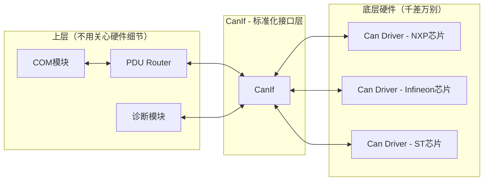
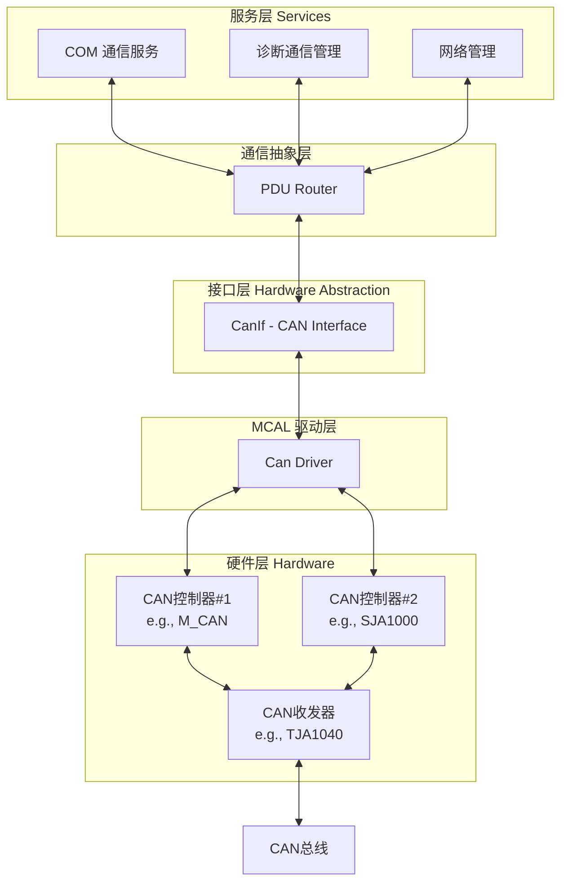
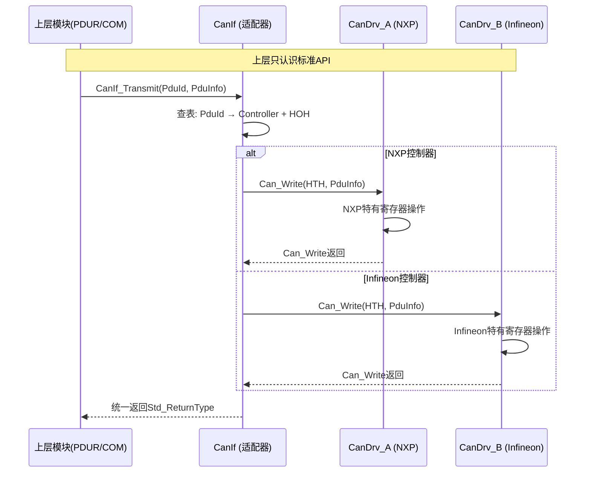
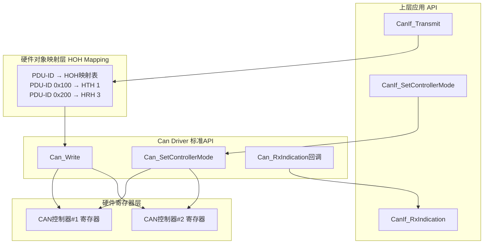
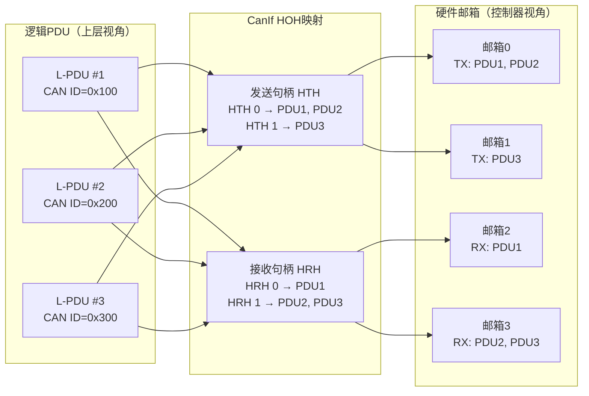
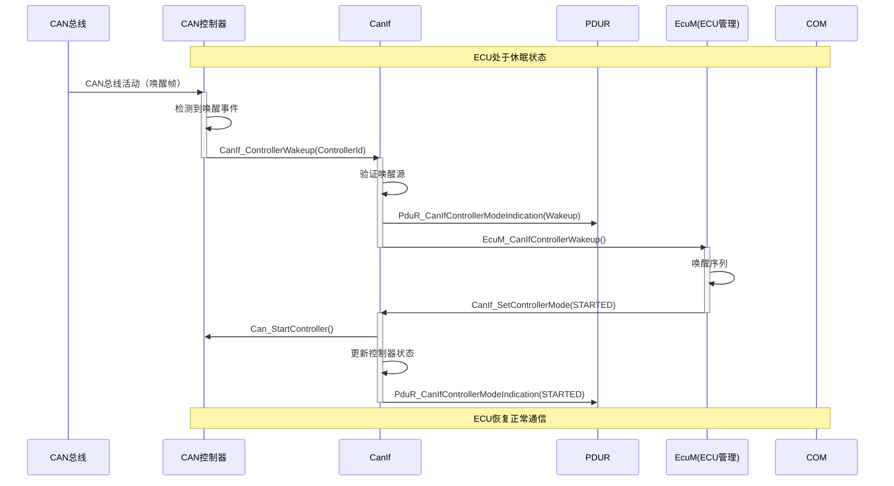
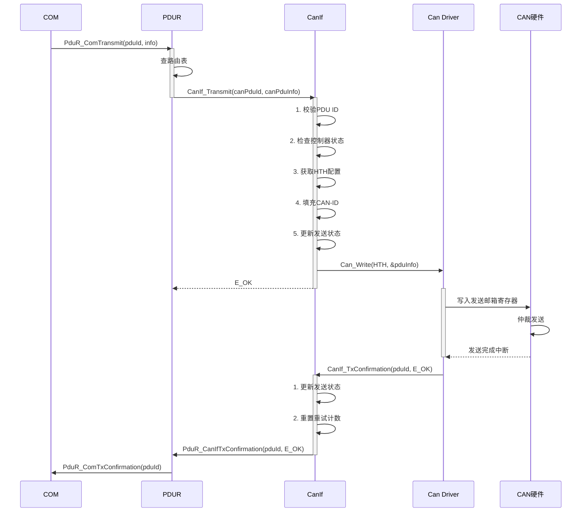
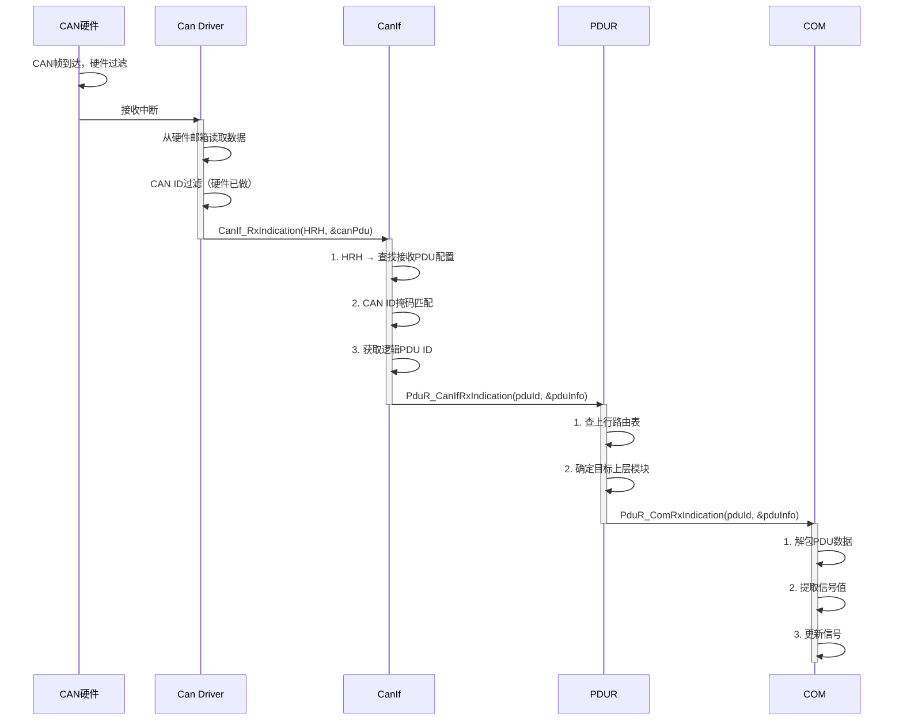
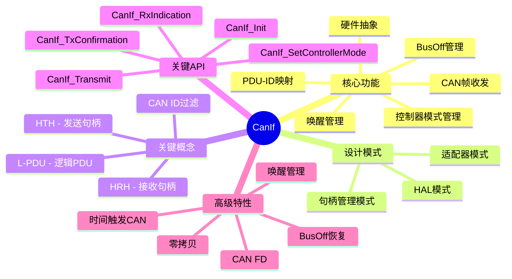

# CanIf (CAN Interface) 模块详解

---

# 第一部分：通俗易懂的理解

## CanIf 是什么？

**CanIf（CAN Interface）是 AUTOSAR 通信栈中 CAN 总线的"硬件抽象层"。**

想象你要开车，但车的型号不同（手动挡 vs 自动挡），你希望无论开什么车，操作方式都一样——踩油门就走、踩刹车就停。**CanIf 就是这层"标准化操作"**：它让上层模块（COM、PDUR）无论底层是哪个厂商的 CAN 控制器，都能用同一套 API 来收发 CAN 消息。



## 生活中的类比

| 概念 | 类比 |
|------|------|
| **CanIf** | 快递公司的"标准化包裹处理流程" |
| **CAN控制器** | 不同城市的快递分拣中心 |
| **CAN硬件对象（HOH）** | 分拣中心的传送带出口 |
| **L-PDU** | 包裹 |
| **CAN ID** | 包裹上的地址标签 |
| **发送确认** | 快递签收回执 |

> **一句话总结：** CanIf 是 CAN 通信的"万能遥控器"——无论底层是哪个厂商的 CAN 硬件，上层都用同样的按键（API）来控制。

---

# 第二部分：设计机制与设计模式

## 2.1 CanIf 在 AUTOSAR 架构中的位置



## 2.2 核心设计模式

### 模式一：适配器模式（Adapter Pattern）

CanIf 是经典的适配器模式。它将不同厂商的 CAN 驱动接口统一成标准的 AUTOSAR 接口。



### 模式二：硬件抽象层模式（HAL Pattern）



### 模式三：句柄管理模式（Handle Management Pattern）

CanIf 的核心创新之一是 **硬件对象句柄（HOH - Hardware Object Handle）** 的概念，它将逻辑 PDU 与物理硬件缓冲区分离开。



## 2.3 核心概念详解

### 硬件对象句柄（HOH）

CanIf 引入了两个关键句柄类型：

| 句柄类型 | 全称 | 用途 | 类比 |
|----------|------|------|------|
| **HTH** | Hardware Transmit Handle | 发送硬件句柄 | 邮局的"发件窗口" |
| **HRH** | Hardware Receive Handle | 接收硬件句柄 | 邮局的"收件窗口" |

```c
/**
 * @brief HOH 配置结构体
 * 每个HOH绑定到一个硬件发送/接收通道
 */
typedef struct {
    uint8           CanControllerId;    /* 所属CAN控制器ID */
    Can_HwHandleType HwHandle;          /* 硬件句柄（邮箱号） */
    Can_IdType       CanId;            /* CAN ID */
    uint32           CanIdType;         /* 标准帧(0) / 扩展帧(1) */
    CanIf_ObjType    ObjectType;        /* 发送/接收/收发 */
} CanIf_HohConfigType;
```

---

# 第三部分：深入原理

## 3.1 CanIf 核心数据结构

```c
/******************************************************************************
 * CanIf 核心数据结构
 *****************************************************************************/

/**
 * @brief CAN L-PDU 类型
 */
typedef struct {
    uint8_t*          SduDataPtr;      /* CAN数据指针（0-8字节 CAN FD: 0-64字节） */
    PduLengthType     SduLength;       /* 数据长度 */
    Can_IdType         CanId;          /* CAN ID */
    Can_HwHandleType   Hoh;            /* 硬件对象句柄 */
    CanIf_ObjType      ObjType;        /* 对象类型 */
} CanIf_PduType;

/**
 * @brief CAN控制器模式
 */
typedef enum {
    CANIF_CS_UNINIT,         /* 未初始化 */
    CANIF_CS_STARTED,        /* 启动 */
    CANIF_CS_STOPPED,        /* 停止 */
    CANIF_CS_SLEEP,          /* 休眠 */
} CanIf_ControllerModeType;

/**
 * @brief CAN控制器状态
 */
typedef struct {
    CanIf_ControllerModeType     CurrentMode;      /* 当前模式 */
    CanIf_ControllerModeType     RequestedMode;    /* 请求的模式 */
    Can_ControllerStateType      HwState;          /* 硬件状态 */
    CanIf_WakeupSourceType       WakeupSource;     /* 唤醒源 */
    uint8                        BusOffCounter;    /* BusOff计数器 */
    boolean                      PendingModeReq;   /* 有模式切换请求待处理 */
} CanIf_ControllerStateType;

/**
 * @brief 发送请求状态
 */
typedef enum {
    CANIF_TX_NOT_REQUESTED,     /* 未请求发送 */
    CANIF_TX_IN_PROGRESS,       /* 发送进行中 */
    CANIF_TX_CANCELLED,         /* 发送已取消 */
    CANIF_TX_OK,                /* 发送成功 */
    CANIF_TX_FAILED,            /* 发送失败 */
} CanIf_TxStateType;

/**
 * @brief 发送通道状态
 */
typedef struct {
    CanIf_TxStateType   State;            /* 发送状态 */
    const PduInfoType*  PduInfoPtr;       /* PDU信息指针 */
    uint8               RetryCounter;     /* 重试计数器 */
    uint32              Timestamp;        /* 时间戳（用于超时检测） */
} CanIf_TxChannelStateType;
```

## 3.2 CanIf 配置结构

```c
/******************************************************************************
 * CanIf 配置结构体
 * 文件: CanIf_Cfg.h, CanIf_PBcfg.c
 *****************************************************************************/

/**
 * @brief CanIf 配置集
 */
typedef struct {
    /* CAN控制器配置 */
    const CanIf_ControllerConfigType*   ControllerConfig;
    uint8                                NumControllers;
    
    /* 发送PDU配置 */
    const CanIf_TxPduConfigType*         TxPduConfig;
    uint8                                NumTxPdus;
    
    /* 接收PDU配置 */
    const CanIf_RxPduConfigType*         RxPduConfig;
    uint8                                NumRxPdus;
    
    /* 硬件对象配置 */
    const CanIf_HohConfigType*           HohConfig;
    uint8                                NumHohs;
} CanIf_ConfigType;

/**
 * @brief CAN控制器配置
 */
typedef struct {
    uint8                   ControllerId;          /* 控制器ID */
    Can_ControllerModeType  DefaultMode;           /* 默认模式 */
    CanIf_WakeupModeType    WakeupMode;            /* 唤醒模式 */
    boolean                 WakeupSupport;          /* 是否支持唤醒 */
    uint16                  BusOffRecoveryTime;     /* BusOff恢复时间(ms) */
} CanIf_ControllerConfigType;

/**
 * @brief 发送PDU配置
 */
typedef struct {
    PduIdType               PduId;                 /* PDU ID */
    Can_IdType              CanId;                 /* CAN ID */
    uint8                   CanIdType;             /* 标准/扩展帧 */
    uint8                   ControllerId;           /* 所属控制器 */
    CanIf_HohIdType         HthId;                 /* 发送硬件句柄ID */
    PduLengthType           PduLength;              /* PDU长度 */
    CanIf_TxTriggerType     TxTrigger;              /* 发送触发方式 */
} CanIf_TxPduConfigType;

/**
 * @brief 接收PDU配置
 */
typedef struct {
    PduIdType               PduId;                 /* PDU ID */
    Can_IdType              CanId;                 /* CAN ID */
    uint32                  CanIdMask;             /* CAN ID掩码（用于过滤） */
    uint8                   CanIdType;             /* 标准/扩展帧 */
    uint8                   ControllerId;           /* 所属控制器 */
    CanIf_HohIdType         HrhId;                 /* 接收硬件句柄ID */
    PduLengthType           PduLength;              /* 最大PDU长度 */
} CanIf_RxPduConfigType;
```

### 示例配置

```c
/******************************************************************************
 * 示例：CAN 控制器与PDU配置
 * 场景：2路CAN控制器，发送5个PDU，接收8个PDU
 *****************************************************************************/

/* ===== CAN控制器配置 ===== */
const CanIf_ControllerConfigType CanIf_ControllerConfig[] = {
    {
        .ControllerId       = 0,
        .DefaultMode        = CANIF_CS_STARTED,
        .WakeupMode         = CANIF_WAKEUP_BY_CAN,
        .WakeupSupport      = TRUE,
        .BusOffRecoveryTime = 100,     /* 100ms BusOff恢复 */
    },
    {
        .ControllerId       = 1,
        .DefaultMode        = CANIF_CS_STARTED,
        .WakeupMode         = CANIF_WAKEUP_BY_CAN,
        .WakeupSupport      = TRUE,
        .BusOffRecoveryTime = 200,     /* 200ms BusOff恢复 */
    },
};

/* ===== 发送PDU配置 ===== */
const CanIf_TxPduConfigType CanIf_TxPduConfig[] = {
    {
        .PduId          = 0x01,        /* 本地PDU ID */
        .CanId          = 0x100,       /* CAN ID: 发动机转速 */
        .CanIdType      = CAN_STANDARD_ID,
        .ControllerId   = 0,           /* 控制器0 */
        .HthId          = 0,           /* 硬件句柄0 */
        .PduLength      = 8,
        .TxTrigger      = CANIF_TX_TRIGGER_DIRECT,  /* 直接发送 */
    },
    {
        .PduId          = 0x02,
        .CanId          = 0x200,       /* CAN ID: 车速 */
        .CanIdType      = CAN_STANDARD_ID,
        .ControllerId   = 0,
        .HthId          = 1,
        .PduLength      = 8,
        .TxTrigger      = CANIF_TX_TRIGGER_DIRECT,
    },
    {
        .PduId          = 0x03,
        .CanId          = 0x300,       /* CAN ID: 诊断请求 */
        .CanIdType      = CAN_EXTENDED_ID,
        .ControllerId   = 1,           /* 控制器1 */
        .HthId          = 2,
        .PduLength      = 64,          /* CAN FD */
        .TxTrigger      = CANIF_TX_TRIGGER_DIRECT,
    },
};

/* ===== 接收PDU配置 ===== */
const CanIf_RxPduConfigType CanIf_RxPduConfig[] = {
    {
        .PduId          = 0x10,
        .CanId          = 0x100,       /* CAN ID: 发动机转速 */
        .CanIdMask      = 0x7FF,       /* 精确匹配 */
        .CanIdType      = CAN_STANDARD_ID,
        .ControllerId   = 0,
        .HrhId          = 0,
        .PduLength      = 8,
    },
    {
        .PduId          = 0x11,
        .CanId          = 0x200,       /* CAN ID: 车速 */
        .CanIdMask      = 0x7FF,
        .CanIdType      = CAN_STANDARD_ID,
        .ControllerId   = 0,
        .HrhId          = 1,
        .PduLength      = 8,
    },
    /* 按CAN ID范围过滤 */
    {
        .PduId          = 0x12,
        .CanId          = 0x600,       /* CAN ID: 0x600-0x61F范围 */
        .CanIdMask      = 0x7E0,       /* 掩码过滤 */
        .CanIdType      = CAN_STANDARD_ID,
        .ControllerId   = 0,
        .HrhId          = 2,
        .PduLength      = 8,
    },
};

/* ===== CanIf 完整配置集 ===== */
const CanIf_ConfigType CanIf_Config = {
    .ControllerConfig   = CanIf_ControllerConfig,
    .NumControllers     = 2,
    .TxPduConfig        = CanIf_TxPduConfig,
    .NumTxPdus          = 3,
    .RxPduConfig        = CanIf_RxPduConfig,
    .NumRxPdus          = 3,
    .HohConfig          = CanIf_HohConfig,
    .NumHohs            = 5,
};
```

## 3.3 CanIf 核心函数实现

### 初始化函数

```c
/******************************************************************************
 * 函数: CanIf_Init
 * 描述: 初始化CanIf模块
 * 参数: ConfigPtr - 指向配置集的指针
 * 返回: 无
 *****************************************************************************/
void CanIf_Init(const CanIf_ConfigType* ConfigPtr)
{
    uint8 i;
    
    /* 保存配置 */
    if (ConfigPtr != NULL_PTR)
    {
        CanIf_ConfigPtr = ConfigPtr;
    }
    else
    {
        CanIf_ConfigPtr = &CanIf_DefaultConfig;
    }
    
    /* 初始化所有控制器状态 */
    for (i = 0; i < CanIf_ConfigPtr->NumControllers; i++)
    {
        uint8 ctrlId = CanIf_ConfigPtr->ControllerConfig[i].ControllerId;
        CanIf_ControllerState[ctrlId].CurrentMode    = CANIF_CS_UNINIT;
        CanIf_ControllerState[ctrlId].RequestedMode  = CANIF_CS_UNINIT;
        CanIf_ControllerState[ctrlId].BusOffCounter  = 0;
        CanIf_ControllerState[ctrlId].PendingModeReq = FALSE;
    }
    
    /* 初始化所有发送通道状态 */
    for (i = 0; i < CanIf_ConfigPtr->NumTxPdus; i++)
    {
        CanIf_TxChannelState[i].State         = CANIF_TX_NOT_REQUESTED;
        CanIf_TxChannelState[i].PduInfoPtr    = NULL_PTR;
        CanIf_TxChannelState[i].RetryCounter  = 0;
        CanIf_TxChannelState[i].Timestamp     = 0;
    }
    
    /* 初始化PDUR 回调注册 */
    #if (CANIF_PDUR_SUPPORT == STD_ON)
    CanIf_PdurRxCallback = PduR_CanIfRxIndication;
    CanIf_PdurTxCallback = PduR_CanIfTxConfirmation;
    #endif
    
    CanIf_InitStatus = CANIF_INITIALIZED;
}
```

### 发送函数

```c
/******************************************************************************
 * 函数: CanIf_Transmit
 * 描述: 请求通过CAN发送PDU
 * 参数: CanTxPduId - 发送PDU ID
 *        PduInfoPtr - PDU信息指针
 * 返回: E_OK      - 发送请求成功
 *        E_NOT_OK  - 发送请求失败
 *        CANIF_BUSY - 硬件忙，稍后重试
 *****************************************************************************/
Std_ReturnType CanIf_Transmit(PduIdType CanTxPduId, const PduInfoType* PduInfoPtr)
{
    Std_ReturnType ret = E_OK;
    
    /* ===== 1. 参数校验 ===== */
    if (PduInfoPtr == NULL_PTR)
    {
        return E_NOT_OK;
    }
    
    if (CanTxPduId >= CanIf_ConfigPtr->NumTxPdus)
    {
        /* 上报开发错误 */
        #if (CANIF_DEV_ERROR_DETECT == STD_ON)
        Det_ReportError(CANIF_MODULE_ID, CANIF_INSTANCE_ID, 
                        CANIF_TRANSMIT_SID, CANIF_E_PARAM_PDU_ID);
        #endif
        return E_NOT_OK;
    }
    
    /* ===== 2. 获取配置 ===== */
    const CanIf_TxPduConfigType* txPduCfg = &CanIf_ConfigPtr->TxPduConfig[CanTxPduId];
    uint8 ctrlId = txPduCfg->ControllerId;
    
    /* ===== 3. 检查控制器状态 ===== */
    if (CanIf_ControllerState[ctrlId].CurrentMode != CANIF_CS_STARTED)
    {
        /* 控制器未启动，无法发送 */
        return E_NOT_OK;
    }
    
    /* ===== 4. 检查发送通道状态 ===== */
    if (CanIf_TxChannelState[CanTxPduId].State == CANIF_TX_IN_PROGRESS)
    {
        /* 上一个发送还未完成 */
        return CANIF_BUSY;
    }
    
    /* ===== 5. 准备PDU数据 ===== */
    PduInfoType canPduInfo = *PduInfoPtr;
    
    /* 如果上层没有提供MetaData（CAN ID），由CanIf填充 */
    if (canPduInfo.MetaDataPtr == NULL_PTR)
    {
        /* 使用配置中的CanId */
        CanIf_PrepareCanId(&canPduInfo, txPduCfg->CanId, txPduCfg->CanIdType);
    }
    
    /* ===== 6. 更新状态 ===== */
    CanIf_TxChannelState[CanTxPduId].State      = CANIF_TX_IN_PROGRESS;
    CanIf_TxChannelState[CanTxPduId].PduInfoPtr = &canPduInfo;
    CanIf_TxChannelState[CanTxPduId].Timestamp  = CanIf_GetTimer();
    
    /* ===== 7. 调用Can驱动层 ===== */
    ret = Can_Write(txPduCfg->HthId, &canPduInfo);
    
    if (ret != E_OK)
    {
        /* 发送失败，恢复状态 */
        CanIf_TxChannelState[CanTxPduId].State = CANIF_TX_NOT_REQUESTED;
        CanIf_TxChannelState[CanTxPduId].PduInfoPtr = NULL_PTR;
    }
    
    return ret;
}
```

### 接收函数

```c
/******************************************************************************
 * 函数: CanIf_RxIndication
 * 描述: Can驱动层接收到CAN帧后的回调
 * 参数: Hrh - 接收硬件句柄
 *        PduInfoPtr - 接收到的PDU信息
 * 返回: 无
 *****************************************************************************/
void CanIf_RxIndication(Can_HwHandleType Hrh, const Can_PduType* PduInfoPtr)
{
    PduIdType pduId;
    boolean found = FALSE;
    
    /* ===== 1. 参数校验 ===== */
    if (PduInfoPtr == NULL_PTR)
    {
        return;
    }
    
    /* ===== 2. 查找匹配的接收PDU ===== */
    for (uint8 i = 0; i < CanIf_ConfigPtr->NumRxPdus; i++)
    {
        const CanIf_RxPduConfigType* rxPduCfg = &CanIf_ConfigPtr->RxPduConfig[i];
        
        /* 检查HRH是否匹配 */
        if (rxPduCfg->HrhId != Hrh)
        {
            continue;
        }
        
        /* 检查CAN ID是否匹配（使用掩码过滤） */
        if ((PduInfoPtr->id & rxPduCfg->CanIdMask) == 
            (rxPduCfg->CanId & rxPduCfg->CanIdMask))
        {
            pduId = rxPduCfg->PduId;
            found = TRUE;
            break;
        }
    }
    
    if (!found)
    {
        /* 未找到匹配的接收PDU - 可能是硬件过滤已经处理了 */
        return;
    }
    
    /* ===== 3. 构建PDU信息 ===== */
    PduInfoType upperPduInfo;
    upperPduInfo.SduDataPtr  = PduInfoPtr->sdu;
    upperPduInfo.SduLength   = PduInfoPtr->length;
    upperPduInfo.MetaDataPtr = NULL_PTR;
    
    /* ===== 4. 回调上层（PDUR） ===== */
    #if (CANIF_PDUR_SUPPORT == STD_ON)
    if (CanIf_PdurRxCallback != NULL_PTR)
    {
        CanIf_PdurRxCallback(pduId, &upperPduInfo);
    }
    #endif
}
```

### 发送确认函数

```c
/******************************************************************************
 * 函数: CanIf_TxConfirmation
 * 描述: Can驱动层发送完成后的回调
 * 参数: CanTxPduId - 发送PDU ID
 *        result - 发送结果
 * 返回: 无
 *****************************************************************************/
void CanIf_TxConfirmation(PduIdType CanTxPduId, Std_ReturnType result)
{
    /* ===== 1. 参数校验 ===== */
    if (CanTxPduId >= CanIf_ConfigPtr->NumTxPdus)
    {
        return;
    }
    
    /* ===== 2. 检查状态 ===== */
    if (CanIf_TxChannelState[CanTxPduId].State != CANIF_TX_IN_PROGRESS)
    {
        return;  /* 没有正在进行的发送 */
    }
    
    /* ===== 3. 更新状态 ===== */
    if (result == E_OK)
    {
        CanIf_TxChannelState[CanTxPduId].State = CANIF_TX_OK;
    }
    else
    {
        CanIf_TxChannelState[CanTxPduId].State = CANIF_TX_FAILED;
        
        /* 重试机制 */
        if (CanIf_TxChannelState[CanTxPduId].RetryCounter < CANIF_MAX_RETRY)
        {
            CanIf_TxChannelState[CanTxPduId].RetryCounter++;
            CanIf_Transmit(CanTxPduId, 
                          CanIf_TxChannelState[CanTxPduId].PduInfoPtr);
            return;
        }
    }
    
    /* ===== 4. 重置发送通道 ===== */
    CanIf_TxChannelState[CanTxPduId].PduInfoPtr   = NULL_PTR;
    CanIf_TxChannelState[CanTxPduId].RetryCounter = 0;
    
    /* ===== 5. 通知上层（PDUR/COM） ===== */
    #if (CANIF_PDUR_SUPPORT == STD_ON)
    if (CanIf_PdurTxCallback != NULL_PTR)
    {
        CanIf_PdurTxCallback(CanTxPduId, result);
    }
    #endif
}
```

### CAN控制器模式管理

```c
/******************************************************************************
 * 函数: CanIf_SetControllerMode
 * 描述: 设置CAN控制器模式
 * 参数: ControllerId - 控制器ID
 *        Mode - 目标模式
 * 返回: E_OK    - 设置成功
 *        E_NOT_OK - 设置失败
 *****************************************************************************/
Std_ReturnType CanIf_SetControllerMode(uint8 ControllerId, 
                                        CanIf_ControllerModeType Mode)
{
    Std_ReturnType ret = E_OK;
    Can_ControllerStateType hwState;
    
    /* ===== 1. 参数校验 ===== */
    if (ControllerId >= CanIf_ConfigPtr->NumControllers)
    {
        return E_NOT_OK;
    }
    
    /* ===== 2. 检查当前状态 ===== */
    CanIf_ControllerStateType* ctrlState = &CanIf_ControllerState[ControllerId];
    
    /* ===== 3. 模式转换逻辑 ===== */
    switch (Mode)
    {
        case CANIF_CS_STARTED:
            /* UNINIT/STOPPED/SLEEP → STARTED */
            switch (ctrlState->CurrentMode)
            {
                case CANIF_CS_UNINIT:
                    ret = Can_Init(ControllerId);
                    if (ret == E_OK)
                    {
                        ret = Can_StartController(ControllerId);
                    }
                    break;
                    
                case CANIF_CS_STOPPED:
                    ret = Can_StartController(ControllerId);
                    break;
                    
                case CANIF_CS_SLEEP:
                    ret = Can_WakeupController(ControllerId);
                    break;
                    
                case CANIF_CS_STARTED:
                    /* 已经启动 */
                    break;
            }
            break;
            
        case CANIF_CS_STOPPED:
            /* STARTED/SLEEP → STOPPED */
            ret = Can_StopController(ControllerId);
            break;
            
        case CANIF_CS_SLEEP:
            /* STARTED/STOPPED → SLEEP */
            if (ctrlState->CurrentMode == CANIF_CS_STARTED)
            {
                ret = Can_StopController(ControllerId);
            }
            if (ret == E_OK)
            {
                ret = Can_SetControllerMode(ControllerId, CAN_CS_SLEEP);
            }
            break;
            
        default:
            ret = E_NOT_OK;
            break;
    }
    
    /* ===== 4. 更新状态 ===== */
    if (ret == E_OK)
    {
        ctrlState->PreviousMode = ctrlState->CurrentMode;
        ctrlState->CurrentMode  = Mode;
        ctrlState->PendingModeReq = FALSE;
        
        /* ===== 5. 通知上层模式改变 ===== */
        #if (CANIF_PDUR_SUPPORT == STD_ON)
        PduR_CanIfControllerModeIndication(ControllerId, Mode);
        #endif
    }
    else
    {
        ctrlState->PendingModeReq = TRUE;
    }
    
    return ret;
}
```

## 3.4 CAN 硬件对象（HOH）管理

```c
/******************************************************************************
 * HOH 管理与调度
 *****************************************************************************/

/**
 * @brief HOH配置
 */
const CanIf_HohConfigType CanIf_HohConfig[] = {
    /* 发送HOH */
    { .CanControllerId = 0, .HwHandle = 0, .ObjectType = CANIF_OBJ_TYPE_TX },
    { .CanControllerId = 0, .HwHandle = 1, .ObjectType = CANIF_OBJ_TYPE_TX },
    { .CanControllerId = 1, .HwHandle = 0, .ObjectType = CANIF_OBJ_TYPE_TX },
    /* 接收HOH */
    { .CanControllerId = 0, .HwHandle = 2, .ObjectType = CANIF_OBJ_TYPE_RX },
    { .CanControllerId = 0, .HwHandle = 3, .ObjectType = CANIF_OBJ_TYPE_RX },
    { .CanControllerId = 1, .HwHandle = 1, .ObjectType = CANIF_OBJ_TYPE_RX },
};

/**
 * @brief HTH（发送句柄）分配器
 * 支持多个PDU共享同一个HTH（多对一）
 */
Std_ReturnType CanIf_GetTxHth(PduIdType CanTxPduId, CanIf_HohIdType* HthId)
{
    if (CanTxPduId >= CanIf_ConfigPtr->NumTxPdus)
    {
        return E_NOT_OK;
    }
    
    *HthId = CanIf_ConfigPtr->TxPduConfig[CanTxPduId].HthId;
    return E_OK;
}

/**
 * @brief 检查HTH是否可用
 */
boolean CanIf_IsHthAvailable(CanIf_HohIdType HthId)
{
    /* 检查该HTH上是否有正在进行的发送 */
    for (uint8 i = 0; i < CanIf_ConfigPtr->NumTxPdus; i++)
    {
        if ((CanIf_ConfigPtr->TxPduConfig[i].HthId == HthId) &&
            (CanIf_TxChannelState[i].State == CANIF_TX_IN_PROGRESS))
        {
            return FALSE;
        }
    }
    return TRUE;
}
```

## 3.5 CAN 唤醒机制



## 3.6 BusOff 处理机制

```c
/******************************************************************************
 * BusOff 处理
 *****************************************************************************/

/**
 * @brief BusOff 状态机
 */
typedef enum {
    BUSOFF_IDLE,            /* 正常状态 */
    BUSOFF_DETECTED,        /* 检测到BusOff */
    BUSOFF_RECOVERY_WAIT,   /* 等待恢复时间 */
    BUSOFF_RECOVERY_INIT,   /* 恢复：重新初始化 */
    BUSOFF_RECOVERY_START,  /* 恢复：启动控制器 */
    BUSOFF_RECOVERED,       /* 已恢复 */
} CanIf_BusOffStateType;

/**
 * @brief BusOff 状态机处理
 */
void CanIf_BusOffHandler(uint8 ControllerId)
{
    CanIf_BusOffStateType* state = &CanIf_BusOffState[ControllerId];
    
    switch (*state)
    {
        case BUSOFF_IDLE:
            break;
            
        case BUSOFF_DETECTED:
            /* 进入BusOff，停止控制器 */
            Can_StopController(ControllerId);
            CanIf_ControllerState[ControllerId].CurrentMode = CANIF_CS_STOPPED;
            CanIf_ControllerState[ControllerId].BusOffCounter++;
            
            /* 通知上层BusOff事件 */
            #if (CANIF_DEM_SUPPORT == STD_ON)
            Dem_ReportErrorEvent(CANIF_EVENT_BUS_OFF, DEM_EVENT_STATUS_FAILED);
            #endif
            
            /* 启动恢复定时器 */
            *state = BUSOFF_RECOVERY_WAIT;
            CanIf_StartBusOffTimer(ControllerId, 
                                   CanIf_ConfigPtr->ControllerConfig[ControllerId]
                                   .BusOffRecoveryTime);
            break;
            
        case BUSOFF_RECOVERY_WAIT:
            /* 等待恢复超时 */
            if (CanIf_IsBusOffTimerExpired(ControllerId))
            {
                *state = BUSOFF_RECOVERY_INIT;
            }
            break;
            
        case BUSOFF_RECOVERY_INIT:
            /* 重新初始化控制器 */
            if (Can_Init(ControllerId) == E_OK)
            {
                *state = BUSOFF_RECOVERY_START;
            }
            break;
            
        case BUSOFF_RECOVERY_START:
            /* 启动控制器 */
            if (Can_StartController(ControllerId) == E_OK)
            {
                *state = BUSOFF_RECOVERED;
            }
            break;
            
        case BUSOFF_RECOVERED:
            /* 恢复成功 */
            CanIf_ControllerState[ControllerId].CurrentMode = CANIF_CS_STARTED;
            *state = BUSOFF_IDLE;
            
            /* 通知上层恢复 */
            PduR_CanIfControllerModeIndication(ControllerId, CANIF_CS_STARTED);
            
            #if (CANIF_DEM_SUPPORT == STD_ON)
            Dem_ReportErrorEvent(CANIF_EVENT_BUS_OFF, DEM_EVENT_STATUS_PASSED);
            #endif
            break;
    }
}
```

---

# 第四部分：CanIf 与 PDUR 的交互

## 4.1 完整发送流程



## 4.2 完整接收流程



---

# 第五部分：完整代码示例

## 5.1 CanIf 完整集成示例

```c
/******************************************************************************
 * 示例：CAN通信完整集成
 * 场景：通过CAN发送发动机转速、接收车速
 *****************************************************************************/

#include "CanIf.h"
#include "PduR.h"
#include "Com.h"
#include "Can.h"

/* ===== 全局变量 ===== */
static uint8 EngineSpeedBuffer[8];  /* 发动机转速数据缓冲区 */
static uint8 VehicleSpeedBuffer[8]; /* 车速数据缓冲区 */

/* ===== 1. 系统初始化 ===== */
void System_Init(void)
{
    /* 初始化CAN驱动 */
    Can_Init(&Can_Config);
    
    /* 初始化CanIf */
    CanIf_Init(&CanIf_Config);
    
    /* 初始化PDUR */
    PduR_Init(&PduR_Config);
    
    /* 初始化COM */
    Com_Init(&Com_Config);
    
    /* 启动CAN控制器 */
    CanIf_SetControllerMode(0, CANIF_CS_STARTED);
    CanIf_SetControllerMode(1, CANIF_CS_STARTED);
}

/* ===== 2. 发送发动机转速 ===== */
Std_ReturnType SendEngineSpeed(uint16 rpm)
{
    PduInfoType pduInfo;
    
    /* 填充数据 */
    EngineSpeedBuffer[0] = (uint8)(rpm >> 8);   /* 高字节 */
    EngineSpeedBuffer[1] = (uint8)(rpm & 0xFF); /* 低字节 */
    EngineSpeedBuffer[2] = 0x00;                 /* 预留 */
    EngineSpeedBuffer[3] = 0x00;
    EngineSpeedBuffer[4] = 0x00;
    EngineSpeedBuffer[5] = 0x00;
    EngineSpeedBuffer[6] = 0x00;
    EngineSpeedBuffer[7] = 0x00;
    
    pduInfo.SduDataPtr  = EngineSpeedBuffer;
    pduInfo.SduLength   = 8;
    pduInfo.MetaDataPtr = NULL_PTR;  /* CanIf将填充CAN ID */
    
    /* 通过PDUR发送 */
    return PduR_ComTransmit(PDU_ID_ENGINE_SPEED, &pduInfo);
}

/* ===== 3. 接收车速数据处理 ===== */
void OnVehicleSpeedReceived(uint16 speed_kmh)
{
    /* 车速接收处理逻辑 */
    if (speed_kmh > 200)
    {
        /* 车速超限报警 */
        CanIf_ReportError(CANIF_E_VEHICLE_SPEED_OVERFLOW);
    }
}

/* ===== 4. COM接收指示回调（由PDUR调用） ===== */
void PduR_ComRxIndication(PduIdType PduId, const PduInfoType* PduInfo)
{
    switch (PduId)
    {
        case PDU_ID_VEHICLE_SPEED:
        {
            uint16 speed = ((uint16)PduInfo->SduDataPtr[0] << 8) |
                            (uint16)PduInfo->SduDataPtr[1];
            OnVehicleSpeedReceived(speed);
            break;
        }
        /* 其他PDU处理... */
        default:
            break;
    }
}

/* ===== 5. 发送确认回调 ===== */
void PduR_ComTxConfirmation(PduIdType PduId)
{
    /* 发送成功，可以继续发送下一帧 */
    switch (PduId)
    {
        case PDU_ID_ENGINE_SPEED:
            /* 发动机转速发送完成 */
            SetEvent(EngineSpeedTxEvent, EVENT_SEND_COMPLETE);
            break;
        default:
            break;
    }
}

/* ===== 6. CAN接收中断处理（驱动层） ===== */
void CAN0_RX_IRQHandler(void)
{
    Can_HwHandleType hrh;
    Can_PduType rxPdu;
    
    /* 从硬件读取接收的帧 */
    if (Can_ReadRxPduData(0, &hrh, &rxPdu) == E_OK)
    {
        /* 调用CanIf接收指示 */
        CanIf_RxIndication(hrh, &rxPdu);
    }
}

/* ===== 7. 主循环 ===== */
void main(void)
{
    uint16 rpm = 0;
    
    /* 系统初始化 */
    System_Init();
    
    /* 主循环 */
    while (1)
    {
        /* 模拟发动机转速变化 */
        rpm = GetEngineRpm();
        SendEngineSpeed(rpm);
        
        /* 调用CanIf主函数（处理超时等） */
        CanIf_MainFunction();
        
        /* 10ms周期 */
        Delay(10);
    }
}
```

## 5.2 CAN FD 发送示例

```c
/******************************************************************************
 * CAN FD (Flexible Data Rate) 发送示例
 * CAN FD 支持最多64字节数据负载，更高的传输速率
 *****************************************************************************/

Std_ReturnType SendCanFdMessage(uint32 canId, const uint8* data, uint16 len)
{
    PduInfoType pduInfo;
    uint8 metaData[8];  /* 用于存储CAN ID + CAN FD标志 */
    
    /* 准备元数据：CAN ID + 帧类型 + DLC */
    metaData[0] = (uint8)(canId >> 24);     /* CAN ID高字节 */
    metaData[1] = (uint8)(canId >> 16);
    metaData[2] = (uint8)(canId >> 8);
    metaData[3] = (uint8)(canId & 0xFF);
    metaData[4] = CAN_FD_FRAME;             /* 帧类型：CAN FD */
    metaData[5] = CanIf_GetDlc(len);        /* 计算DLC */
    metaData[6] = CAN_BRS_ON;               /* 波特率切换 */
    metaData[7] = 0x00;                     /* 预留 */
    
    pduInfo.SduDataPtr  = (uint8*)data;
    pduInfo.SduLength   = len;
    pduInfo.MetaDataPtr = metaData;         /* CanIf使用元数据中的CAN ID */
    
    return PduR_ComTransmit(PDU_ID_CAN_FD_MSG, &pduInfo);
}
```

---

# 第六部分：高级特性

## 6.1 零拷贝（Zero-Copy）机制

```c
/******************************************************************************
 * CanIf 零拷贝机制
 * 避免数据在层间传递时的内存拷贝，提高性能
 *****************************************************************************/

/**
 * @brief 零拷贝缓冲区结构
 */
typedef struct {
    uint8_t*    buffer;         /* 预分配缓冲区指针 */
    uint16      bufferSize;     /* 缓冲区大小 */
    volatile boolean inUse;     /* 使用标志 */
    PduIdType   pduId;          /* 关联的PDU ID */
} CanIf_ZeroCopyBufferType;

/**
 * @brief 获取零拷贝发送缓冲区
 * 上层模块直接写入此缓冲区，减少不必要的拷贝
 */
Std_ReturnType CanIf_GetTxBuffer(PduIdType CanTxPduId, 
                                  PduInfoType* PduInfoPtr)
{
    if (CanTxPduId >= CanIf_ConfigPtr->NumTxPdus)
    {
        return E_NOT_OK;
    }
    
    uint8 bufIdx = CanIf_ConfigPtr->TxPduConfig[CanTxPduId].BufferIndex;
    
    if (CanIf_ZeroCopyBuf[bufIdx].inUse)
    {
        return CANIF_BUSY;
    }
    
    /* 直接返回预分配缓冲区指针 */
    PduInfoPtr->SduDataPtr = CanIf_ZeroCopyBuf[bufIdx].buffer;
    PduInfoPtr->SduLength  = CanIf_ZeroCopyBuf[bufIdx].bufferSize;
    PduInfoPtr->MetaDataPtr = NULL_PTR;
    
    CanIf_ZeroCopyBuf[bufIdx].inUse = TRUE;
    CanIf_ZeroCopyBuf[bufIdx].pduId = CanTxPduId;
    
    return E_OK;
}
```

## 6.2 时间触发CAN（TTCAN）支持

```mermaid
gantt
    title 时间触发CAN调度
    dateFormat  X
    axisFormat %s
    
    section 基本周期1
    发送帧1 : 0, 1
    接收帧1 : 1, 2
    发送帧2 : 2, 3
   空闲时间 : 3, 5
    
    section 基本周期2
    发送帧1 : 5, 6
    接收帧2 : 6, 7
    发送帧3 : 7, 8
   空闲时间 : 8, 10
```



## 6.3 CanIf 错误处理与诊断

```c
/******************************************************************************
 * CanIf 错误处理
 *****************************************************************************/

typedef enum {
    CANIF_E_OK = 0,
    CANIF_E_NOT_OK,
    CANIF_E_BUSY,
    CANIF_E_TIMEOUT,
    CANIF_E_INVALID_PDU_ID,
    CANIF_E_INVALID_CONTROLLER_ID,
    CANIF_E_CONTROLLER_NOT_STARTED,
    CANIF_E_TRANSMIT_FAILED,
    CANIF_E_BUS_OFF,
    CANIF_E_WAKEUP_FAILED,
} CanIf_ErrorType;

/**
 * @brief 错误通知
 */
void CanIf_ReportError(uint8 ModuleId, uint8 InstanceId, 
                       uint8 ApiId, uint8 ErrorId)
{
    #if (CANIF_DEV_ERROR_DETECT == STD_ON)
    Det_ReportError(ModuleId, InstanceId, ApiId, ErrorId);
    #endif
    
    #if (CANIF_DEM_SUPPORT == STD_ON)
    switch (ErrorId)
    {
        case CANIF_E_BUS_OFF:
            Dem_ReportErrorEvent(CANIF_EVENT_BUS_OFF, DEM_EVENT_STATUS_FAILED);
            break;
        case CANIF_E_TRANSMIT_FAILED:
            Dem_ReportErrorEvent(CANIF_EVENT_TRANSMIT_ERROR, DEM_EVENT_STATUS_FAILED);
            break;
        default:
            break;
    }
    #endif
}
```

---

# 第七部分：总结

## CanIf 核心要点



## CanIf 与 PDUR 的职责对比

| 特性 | CanIf | PDUR |
|------|-------|------|
| **主要职责** | CAN硬件抽象 | PDU路由转发 |
| **关注点** | CAN帧格式、硬件句柄、CAN ID | 路由路径、目标选择 |
| **处理对象** | CAN L-PDU | PDU（任意总线类型） |
| **硬件相关** | 是，直接与CAN驱动交互 | 否，完全硬件无关 |
| **CAN ID** | 管理CAN ID和帧格式 | 不关心具体CAN ID |
| **总线类型** | 仅CAN | CAN、LIN、以太网等 |
| **典型配置** | 控制器、HTH、HRH、CAN ID | 路由路径、目标模块 |

## CanIf 的关键设计理念

| 理念 | 说明 |
|------|------|
| **硬件无关性** | 上层模块通过CanIf标准化API操作CAN，无需关心具体硬件 |
| **灵活的映射** | 多个逻辑PDU可共享一个硬件句柄，优化硬件资源使用 |
| **静态配置** | 所有映射关系在编译时确定，运行时无动态分配开销 |
| **错误隔离** | BusOff、唤醒等底层事件由CanIf处理后再通知上层 |
| **可扩展性** | 支持CAN、CAN FD、TTCAN等多种CAN变体 |

---

*文档生成时间: 2026-07-10*
*作者: AUTOSAR 嵌入式软件专家*