# AUTOSAR CanNM（CAN Network Management）模块深度详解

> 作者：AUTOSAR & 嵌入式软件专家
> 版本：v1.0
> 更新日期：2026/07/16

---

## 目录

1. [通俗理解：CanNM 是什么？](#一通俗理解canNM-是什么)
2. [CanNM 在 AUTOSAR 架构中的定位](#二canNM-在-autosar-架构中的定位)
3. [CanNM 协议规范深度解析](#三canNM-协议规范深度解析)
4. [CanNM 状态机详解](#四canNM-状态机详解)
5. [CanNM 消息收发机制](#五canNM-消息收发机制)
6. [CanNM 定时器体系](#六canNM-定时器体系)
7. [CanNM 唤醒机制](#七canNM-唤醒机制)
8. [CanNM 与周边模块交互](#八canNM-与周边模块交互)
9. [CanNM 的 CAN 特定特性](#九canNM-的-CAN-特定特性)
10. [CanNM 配置与集成](#十canNM-配置与集成)
11. [CanNM 深入原理与设计模式](#十一canNM-深入原理与设计模式)
12. [CanNM 常见问题与调试](#十二canNM-常见问题与调试)
13. [附录](#附录)

---

# 一、通俗理解：CanNM 是什么？

## 1.1 打个比方：CanNM 就像小区业主群

```mermaid
graph TB
    subgraph RealWorld["🏘️ 现实世界 — 小区业主群"]
        A["业主 A<br/>（本ECU）"]
        B["业主 B<br/>（ECU B）"]
        C["业主 C<br/>（ECU C）"]
        D["业主 D<br/>（ECU D）"]
        
        A -- "🌙 '大家睡了吗？'" --> B
        A -- "🌙 '大家睡了吗？'" --> C
        A -- "🌙 '大家睡了吗？'" --> D
        B -- "✅ '我睡了'" --> A
        C -- "✅ '我也睡了'" --> A
        D -- "❌ '还没，我在加班'" --> A
        
        Note over A: 只有所有人都说&quot;睡了&quot;<br/>整栋楼才能熄灯（总线休眠）
    end

    subgraph CanNM_World["🚗 CanNM 世界"]
        CAN_A["ECU A<br/>（CanNM节点）"]
        CAN_B["ECU B<br/>（CanNM节点）"]
        CAN_C["ECU C<br/>（CanNM节点）"]
        CAN_D["ECU D<br/>（CanNM节点）"]
        BUS["🔌 CAN Bus"]
        
        CAN_A -- "NM Msg [SleepBit=1]" --> BUS
        BUS -- "NM Msg" --> CAN_B
        BUS -- "NM Msg" --> CAN_C
        BUS -- "NM Msg" --> CAN_D
        
        Note over BUS: 所有节点通过CAN总线广播NM消息<br/>Sleep Bit = 1 表示"我同意睡眠"
    end

    style RealWorld fill:#f0f9ff,color:#333
    style CanNM_World fill:#fff3f0,color:#333
```

### 关键类比

| 现实世界 | CanNM 世界 |
|---------|-----------|
| 业主在群里说"大家睡了吗？" | 节点发送 NM 消息 |
| "我睡了" = 同意熄灯 | Sleep Bit = 1 |
| "还在加班" = 不同意熄灯 | Sleep Bit = 0 |
| 门卫听到敲门声醒来 | 被动唤醒（收到NM消息） |
| 自己定闹钟起床 | 主动唤醒（本地请求） |
| 楼上装修吵醒全楼 | 远程唤醒（总线活动检测） |
| 全体同意 → 熄灯 | 全节点 Sleep Bit = 1 → Bus Sleep |
| 有人早起 → 开灯唤醒邻居 | 主动唤醒 → 唤醒整个网络 |

## 1.2 一句话总结

> **CanNM 是 AUTOSAR 中专门为 CAN 总线设计的网络管理模块。它通过节点间广播投票的方式，协调所有 ECU 统一进入或退出低功耗休眠模式，从而在不影响功能的前提下最大程度降低整车功耗。**

## 1.3 CanNM vs NM（通用网络管理）

先澄清一个重要概念：

| 对比维度 | NM（通用网络管理） | CanNM（CAN网络管理） |
|---------|------------------|--------------------|
| **定位** | AUTOSAR 服务层的抽象规范 | NM 在 CAN 总线上的具体实现 |
| **协议栈** | 定义接口和行为，独立于总线类型 | 基于 CAN 总线特性实现 |
| **报文格式** | 抽象 PDU，不定义具体格式 | 定义 CAN ID = 0x500 + NodeID，8字节数据 |
| **寻址方式** | 不定义寻址 | 基于 CAN 标准帧 ID（11位） |
| **特性支持** | 基础 NM | 支持 CAN Partial Networking、CAN 远程唤醒 |
| **依赖模块** | PduR、ComM | CanIf、CanDrv、CanTrcv、PduR、ComM、CanSM |

> **通俗理解**：NM 是"规范手册"，CanNM 是"针对 CAN 总线的具体实现"。CanNM 继承了 NM 的所有接口和状态机要求，同时增加了 CAN 总线特有的处理逻辑。

---

# 二、CanNM 在 AUTOSAR 架构中的定位

## 2.1 通信栈中的位置

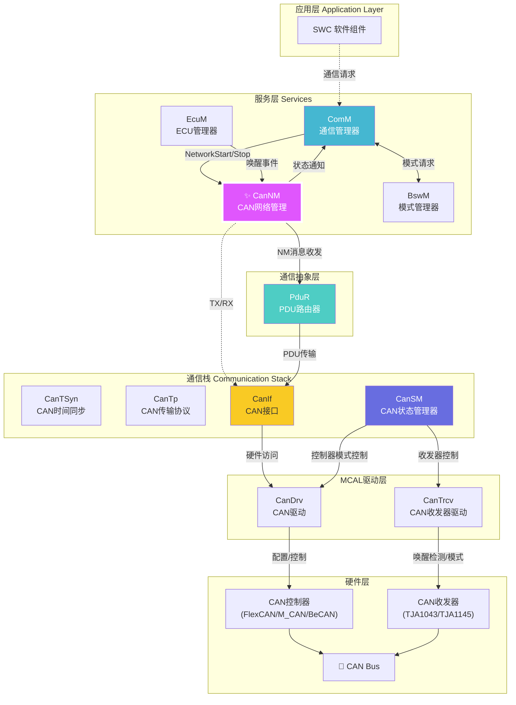

## 2.2 CanNM 的层级关系

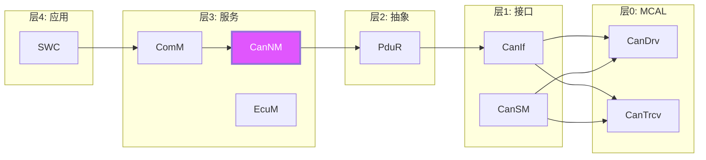

### CanNM 的分层职责

| 层级 | 模块 | 职责描述 |
|------|------|---------|
| **服务层** | **CanNM** | **网络管理逻辑：状态机、NM消息组装/解析、睡眠协调** |
| 服务层 | ComM | 通信需求管理：谁需要通信、何时需要 |
| 服务层 | EcuM | ECU 整体模式管理：启动、睡眠、唤醒 |
| 服务层 | BswM | 模式仲裁：基于规则驱动状态切换 |
| 抽象层 | PduR | NM 消息路由：将 CanNM 的 PDU 路由到 CanIf |
| 接口层 | CanIf | CAN 控制器抽象：提供统一的 CAN 收发接口 |
| 接口层 | CanSM | CAN 状态管理：控制器启动/停止、收发器模式控制 |
| MCAL | CanDrv | 直接操作 CAN 控制器寄存器 |
| MCAL | CanTrcv | 直接操作 CAN 收发器寄存器 |

## 2.3 CanNM 模块边界

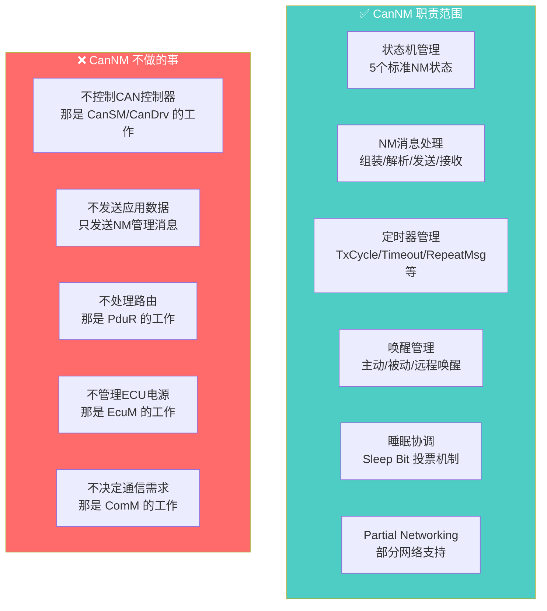

---

# 三、CanNM 协议规范深度解析

## 3.1 AUTOSAR CanNM 报文格式（详细规范）

### 3.1.1 CAN Identifier 格式

根据 AUTOSAR SWS_CanNM 规范，CanNM 使用 **CAN 标准帧（11位ID）** 或 **扩展帧（29位ID）**：

```c
/* ---- CanNM CAN ID 编码规范 ---- */

/* 标准帧（11位ID）格式 */
// 范围: 0x500 ~ 0x5FF
// CAN ID = NM_BASE_ID + NodeId
// NM_BASE_ID 默认 0x500，可通过工具配置
// NodeId 范围: 0x00 ~ 0xFF

#define CANNM_BASE_ID_DEFAULT    0x500u
#define CANNM_MAX_NODE_ID        0xFFu   /* 最多256个节点 */

/* CAN ID 在总线上的仲裁优先级 */
// CAN ID 越小，优先级越高
// NodeId = 0x00 优先级最高 (0x500)
// NodeId = 0xFF 优先级最低 (0x5FF)

/* 扩展帧（29位ID）格式 */
// 当使用扩展帧时，ID 格式由工具配置
// 典型格式: 
//   Bit 28~18: 基础ID（可配置）
//   Bit 17~10: NodeId
//   Bit 9~0:   保留或扩展

/* ---- PDU ID 路由机制 ---- */
// CanNM 不直接发送到总线，而是通过 PduR
// 每个 CanNM 通道需要配置:
//   - CanNmTxPduId:  发送 NM 消息的 PDU ID
//   - CanNmRxPduId:  接收 NM 消息的 PDU ID
// PduR 将这些 PDU ID 映射到 CanIf 的 Tx/Rx 通道
```

### 3.1.2 CAN NM PDU（Protocol Data Unit）格式

```c
/* ---- AUTOSAR 标准 CanNM PDU 结构 ---- */

/*
 * CAN NM PDU 固定为 8 字节
 * 这是 CAN 2.0 标准数据帧的最大 DLC
 */

/* 标准 CanNM PDU 定义 */
typedef struct
{
    /* Byte 0: 控制位向量 Control Bit Vector (CBV) */
    uint8_t Cbv;
    
    /* Byte 1~7: 用户数据 User Data (0~7字节，可配置长度) */
    uint8_t UserData[7];
} CanNm_PduType;

/* CBV (Control Bit Vector) 详细位定义 */
#define CANNM_CBV_SLEEP_BIT         ((uint8_t)0x01u)   /* Bit 0: 协调睡眠位 */
#define CANNM_CBV_ACTIVE_WAKEUP_BIT ((uint8_t)0x02u)   /* Bit 1: 主动唤醒位 */
/* Bit 2~7: 保留位，AUTOSAR 规范要求必须为 0 */

/* CBV 位操作辅助宏 */
#define CANNM_IS_SLEEP_BIT_SET(cbv)     (((cbv) & CANNM_CBV_SLEEP_BIT) != 0u)
#define CANNM_IS_ACTIVE_WAKEUP(cbv)     (((cbv) & CANNM_CBV_ACTIVE_WAKEUP_BIT) != 0u)
#define CANNM_SET_SLEEP_BIT(cbv)        ((cbv) |= CANNM_CBV_SLEEP_BIT)
#define CANNM_CLEAR_SLEEP_BIT(cbv)      ((cbv) &= (uint8_t)~CANNM_CBV_SLEEP_BIT)
#define CANNM_SET_ACTIVE_WAKEUP(cbv)    ((cbv) |= CANNM_CBV_ACTIVE_WAKEUP_BIT)
#define CANNM_CLEAR_ACTIVE_WAKEUP(cbv)  ((cbv) &= (uint8_t)~CANNM_CBV_ACTIVE_WAKEUP_BIT)
```

### 3.1.3 报文在总线上的完整表示

```
时间轴 →  
┌──────────────────────────────────────────────────────────────────────┐
│                        CAN 总线上的 NM 报文                            │
├──────────────────────────────────────────────────────────────────────┤
│                                                                      │
│  ┌─────────┬───────┬──────┬──────┬──────┬──────┬──────┬──────┬──────┐ │
│  │ CAN仲裁场│控制场 │ 数据场 (8字节)                              │ CRC │
│  ├─────────┼───────┼──────┼──────┼──────┼──────┼──────┼──────┼──────┤ │
│  │ ID=0x525│ DLC=8 │ CBV  │ UD0  │ UD1  │ UD2  │ UD3  │ UD4  │ UD5  │ │
│  │ Node=0x25│       │ 0x01 │ 0x00 │ 0x00 │ 0x00 │ 0x00 │ 0x00 │ 0x00 │ │
│  └─────────┴───────┴──────┴──────┴──────┴──────┴──────┴──────┴──────┘ │
│                                                                      │
│  CBV 扩展解释:                                                        │
│  0x01 = 0000_0001b                                                    │
│         │││││││└── Sleep Bit = 1 → "我同意睡眠"                      │
│         ││││││└─── Active Wakeup = 0 → "非主动唤醒"                  │
│         └┴┴┴┴┴┴──── 保留位 (必须为0)                                 │
│                                                                      │
│  CAN NM 报文在总线上优先级:                                           │
│  基于 ID 仲裁，ID 越小优先级越高                                      │
│  0x500 (Node 0x00) 在 NM 报文中优先级最高                             │
└──────────────────────────────────────────────────────────────────────┘
```

## 3.2 CanNM PDU 的 CAN-ID 映射机制

CanNM 支持两种 CAN ID 映射方式：

```c
/* ---- CanNM PDU 路由和 ID 映射 ---- */

/* 配置结构体：描述 PDU 到 CAN ID 的映射 */
typedef struct
{
    /* CanNM 使用的 PduR Tx PDU ID */
    PduIdType       CanNmTxPduId;
    
    /* CanNM 使用的 PduR Rx PDU ID */
    PduIdType       CanNmRxPduId;
    
    /* 实际 CAN ID（在 CanIf 层配置） */
    /* PduR 负责将逻辑 PDU ID 映射到 CAN ID */
    uint32_t        CanId;              /* 实际 CAN ID */
    CanIdTypeType   CanIdType;          /* CAN_ID_TYPE_STANDARD 或 EXTENDED */
    
} CanNm_PduIdConfigType;

/* ---- PDU 路由路径 ---- */
/*
 * 发送路径:
 *   CanNM_Transmit() → PduR_CanNmTransmit() → CanIf_Transmit() → CanDrv_Write()
 * 
 * 接收路径:
 *   CanDrv_ISR() → CanIf_RxIndication() → PduR_CanNmRxIndication() → CanNM_RxIndication()
 *
 * PduR 的关键作用:
 *   PduR 将逻辑 PDU ID 映射到 CanIf 的源/目标 PDU ID
 *   实现了 CanNM 与 CanIf 之间的解耦
 */
```

## 3.3 CanNM 报文发送时序

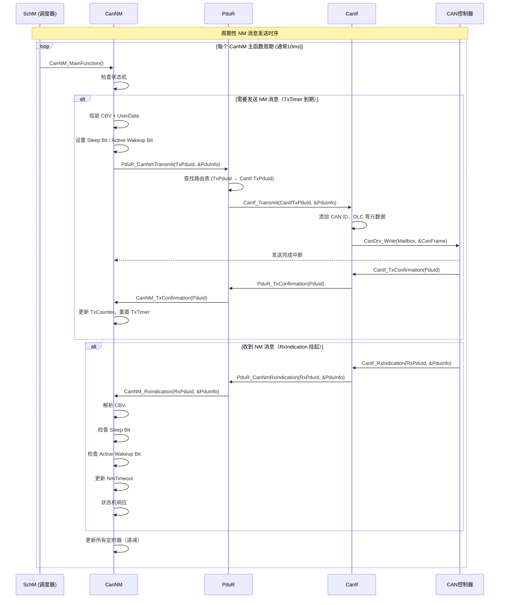

---

# 四、CanNM 状态机详解

## 4.1 标准 CanNM 状态机

根据 AUTOSAR SWS_CanNM 规范，CanNM 定义 **5个主状态**：

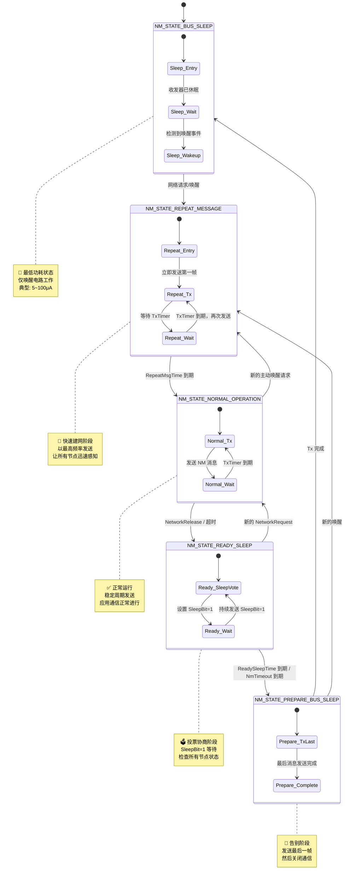

## 4.2 CanNM 内部状态机实现

```c
/* ================================================================
 * CanNM 内部状态枚举
 * ================================================================ */
typedef enum
{
    CANNM_STATE_BUS_SLEEP,          /* 总线休眠 */
    CANNM_STATE_PREPARE_BUS_SLEEP,  /* 准备总线休眠 */
    CANNM_STATE_REPEAT_MESSAGE,     /* 重复消息阶段 */
    CANNM_STATE_NORMAL_OPERATION,   /* 正常运行 */
    CANNM_STATE_READY_SLEEP         /* 就绪休眠（投票阶段） */
} CanNm_InternalStateType;

/* ================================================================
 * CanNM 通道上下文 — 每个 CAN 网络一个实例
 * ================================================================ */
typedef struct
{
    /* ---- 状态 ---- */
    CanNm_InternalStateType State;              /* 当前主状态 */
    
    /* ---- 节点标识 ---- */
    uint8_t                 NodeId;             /* 本节点 ID (0~255) */
    uint8_t                 ChannelIndex;       /* 通道索引 */
    
    /* ---- 网络请求 ---- */
    boolean                 NetworkRequested;   /* 应用层请求网络 */
    boolean                 SleepBit;           /* 本节点的睡眠位 */
    boolean                 ActiveWakeupBit;    /* 主动唤醒位 */
    
    /* ---- 定时器（单位：主函数周期 tick） ---- */
    uint16_t                TxTimer;            /* 发送周期定时器 */
    uint16_t                RepeatMsgTimer;     /* 重复消息阶段定时器 */
    uint16_t                NmTimeout;          /* NM 超时定时器 */
    uint16_t                ReadySleepTimer;    /* 就绪睡眠等待定时器 */
    uint16_t                WakeupBitTimer;     /* 主动唤醒位保持定时器 */
    
    /* ---- 消息计数和标志 ---- */
    uint8_t                 TxCounter;          /* 发送帧计数器 */
    uint8_t                 RxCounter;          /* 接收帧计数器 */
    uint16_t                RxIndication;       /* 接收指示（每收到一帧递增） */
    
    /* ---- 用户数据 ---- */
    uint8_t                 UserData[7];        /* 用户数据缓冲区 */
    uint8_t                 UserDataLength;     /* 用户数据有效长度 */
    
    /* ---- 发送相关 ---- */
    PduIdType               TxPduId;            /* 发送 PDU ID */
    PduInfoType             TxPduInfo;          /* 发送 PDU 信息 */
    boolean                 TxPending;          /* 发送挂起标志 */
    
    /* ---- 接收相关 ---- */
    PduIdType               RxPduId;            /* 接收 PDU ID */
    
    /* ---- 唤醒管理 ---- */
    boolean                 WakeupIndication;   /* 唤醒指示 */
    boolean                 BusSleepMode;       /* Bus-Sleep 模式标志 */
} CanNm_ChannelType;

/* 通道实例数组 */
static CanNm_ChannelType CanNm_Channels[CANNM_MAX_CHANNELS];

/* 当前配置指针 */
static const CanNm_ConfigType* CanNm_ConfigPtr;
```

## 4.3 CanNM 状态机核心实现

```c
/* ================================================================
 * CanNM 主函数 — 由 SchM 周期性调度（典型周期：10ms）
 * ================================================================ */
void CanNM_MainFunction(void)
{
    uint8_t chIdx;
    
    /* 遍历所有 CanNM 通道 */
    for (chIdx = 0u; chIdx < CanNm_ConfigPtr->NmChannelCount; chIdx++)
    {
        CanNm_ChannelType* channel = &CanNm_Channels[chIdx];
        
        /* 步骤1: 更新所有递减定时器 */
        CanNm_UpdateTimers(channel);
        
        /* 步骤2: 处理接收到的 NM 消息 */
        CanNm_HandleRxIndication(channel);
        
        /* 步骤3: 执行状态机 */
        CanNm_StateMachine(channel);
        
        /* 步骤4: 检查是否需要发送 NM 消息 */
        CanNm_CheckTransmit(channel);
        
        /* 步骤5: 检查超时 */
        CanNm_CheckTimeout(channel);
    }
}

/* ---- 定时器更新 ---- */
static void CanNm_UpdateTimers(CanNm_ChannelType* channel)
{
    /* 所有定时器同步递减（节拍 = MainFunction 周期） */
    if (channel->TxTimer > 0u)
    {
        channel->TxTimer--;
    }
    if (channel->RepeatMsgTimer > 0u)
    {
        channel->RepeatMsgTimer--;
    }
    if (channel->NmTimeout > 0u)
    {
        channel->NmTimeout--;
    }
    if (channel->ReadySleepTimer > 0u)
    {
        channel->ReadySleepTimer--;
    }
    if (channel->WakeupBitTimer > 0u)
    {
        channel->WakeupBitTimer--;
    }
}

/* ---- 状态机主调度 ---- */
static void CanNm_StateMachine(CanNm_ChannelType* channel)
{
    switch (channel->State)
    {
        case CANNM_STATE_BUS_SLEEP:
            CanNm_StateBusSleep(channel);
            break;
            
        case CANNM_STATE_REPEAT_MESSAGE:
            CanNm_StateRepeatMessage(channel);
            break;
            
        case CANNM_STATE_NORMAL_OPERATION:
            CanNm_StateNormalOperation(channel);
            break;
            
        case CANNM_STATE_READY_SLEEP:
            CanNm_StateReadySleep(channel);
            break;
            
        case CANNM_STATE_PREPARE_BUS_SLEEP:
            CanNm_StatePrepareBusSleep(channel);
            break;
            
        default:
            /* 非法状态，鲁棒性处理：复位到 Bus Sleep */
            channel->State = CANNM_STATE_BUS_SLEEP;
            break;
    }
}
```

### 4.3.1 Bus Sleep 状态

```c
/* ---- Bus Sleep 状态处理 ---- */
static void CanNm_StateBusSleep(CanNm_ChannelType* channel)
{
    /*
     * Bus Sleep 状态行为：
     * 1. 不发送任何 NM 消息
     * 2. CAN 收发器处于休眠模式（仅唤醒检测电路工作）
     * 3. 等待以下事件触发：
     *    a) 本地网络请求 (NetworkStart)
     *    b) 收到远程 NM 消息（被动唤醒）
     *    c) 收发器检测到总线活动（远程唤醒）
     */
    
    /* 检查唤醒条件 */
    if (CanNm_CheckWakeupConditions(channel))
    {
        /* 触发唤醒事件 */
        CanNm_GoToRepeatMessage(channel, CANNM_WAKEUP_REASON_LOCAL);
        return;
    }
}

/* ---- 唤醒条件检查 ---- */
static boolean CanNm_CheckWakeupConditions(CanNm_ChannelType* channel)
{
    /* 条件1: 应用层请求网络 */
    if (channel->NetworkRequested)
    {
        return TRUE;
    }
    
    /* 条件2: 收到 NM 消息（RxIndication 挂起） */
    if (channel->RxIndication > 0u)
    {
        /* 清除指示，准备处理 */
        channel->RxIndication = 0u;
        return TRUE;
    }
    
    /* 条件3: 收发器检测到总线唤醒 */
    if (channel->WakeupIndication)
    {
        return TRUE;
    }
    
    return FALSE;
}
```

### 4.3.2 Repeat Message 状态

```c
/* ---- 进入 Repeat Message 状态 ---- */
static void CanNm_GoToRepeatMessage(
    CanNm_ChannelType*          channel,
    CanNm_WakeupReasonType      reason)
{
    /* 状态切换 */
    channel->State = CANNM_STATE_REPEAT_MESSAGE;
    
    /* 初始化重复消息阶段定时器 */
    channel->RepeatMsgTimer = CanNm_ConfigPtr->RepeatMsgTime / 
                              CanNm_ConfigPtr->MainFunctionPeriod;
    
    /* 初始化 NM 超时定时器 */
    channel->NmTimeout = CanNm_ConfigPtr->NmTimeoutTime / 
                         CanNm_ConfigPtr->MainFunctionPeriod;
    
    /* 复位睡眠位 — 表示本节点活跃中 */
    channel->SleepBit = FALSE;
    
    /* 如果是主动唤醒，置位主动唤醒位 */
    if (reason == CANNM_WAKEUP_REASON_ACTIVE)
    {
        channel->ActiveWakeupBit = TRUE;
        channel->WakeupBitTimer = CanNm_ConfigPtr->WakeupBitTime /
                                  CanNm_ConfigPtr->MainFunctionPeriod;
    }
    
    /* 初始化发送定时器（使用重复阶段的发送周期）*/
    channel->TxTimer = 0u;  /* 立即发送第一帧 */
    
    /* 通知 ComM 网络已进入通信模式 */
    ComM_Nm_NetworkMode(
        (uint8_t)channel->ChannelIndex,
        COMM_NM_NETWORK_MODE
    );
}

/* ---- Repeat Message 状态处理 ---- */
static void CanNm_StateRepeatMessage(CanNm_ChannelType* channel)
{
    /*
     * Repeat Message 状态行为：
     * 1. 以最高频率发送 NM 消息（重复消息周期）
     * 2. 持续时间由 RepeatMsgTimer 控制
     * 3. 让所有节点快速感知本节点的存在
     * 4. 更新 NM 超时
     */
    
    /* 检查重复消息阶段是否结束 */
    if (channel->RepeatMsgTimer == 0u)
    {
        /* 重复阶段结束，切换到正常运行 */
        channel->State = CANNM_STATE_NORMAL_OPERATION;
        channel->TxTimer = CanNm_ConfigPtr->TxCycle / 
                          CanNm_ConfigPtr->MainFunctionPeriod;
        
        /* 清除主动唤醒位（如果还在置位）*/
        channel->ActiveWakeupBit = FALSE;
        return;
    }
    
    /* 如果在重复阶段收到 NM 消息，刷新超时 */
    if (channel->RxIndication > 0u)
    {
        channel->NmTimeout = CanNm_ConfigPtr->NmTimeoutTime /
                             CanNm_ConfigPtr->MainFunctionPeriod;
        channel->RxIndication = 0u;
    }
    
    /* 如果本地网络请求释放，继续保持活跃直到重复阶段结束 */
    /* 不能中途退出 —— 必须完成重复消息阶段的完整建网过程 */
}
```

### 4.3.3 Normal Operation 状态

```c
/* ---- Normal Operation 状态处理 ---- */
static void CanNm_StateNormalOperation(CanNm_ChannelType* channel)
{
    /*
     * Normal Operation 状态行为：
     * 1. 按 TxCycle 周期发送 NM 消息
     * 2. 监控其他节点的 NM 消息
     * 3. 检测 NM 超时
     * 4. 响应网络释放请求
     */
    
    /* 检查发送定时器 — 实际发送在 CanNm_CheckTransmit 中处理 */
    
    /* 处理接收到的 NM 消息 */
    if (channel->RxIndication > 0u)
    {
        channel->NmTimeout = CanNm_ConfigPtr->NmTimeoutTime /
                             CanNm_ConfigPtr->MainFunctionPeriod;
        channel->RxIndication = 0u;
    }
    
    /* 检查 NM 超时 */
    if (channel->NmTimeout == 0u)
    {
        /*
         * NM 超时意味着网络上没有其他 NM 消息了
         * 有两种可能：
         * 1. 所有其他节点都已进入睡眠
         * 2. 总线出现故障
         * 
         * 如果本节点也没有网络请求 → 进入 Ready Sleep
         */
        if (!channel->NetworkRequested)
        {
            channel->SleepBit = TRUE;
            channel->State = CANNM_STATE_READY_SLEEP;
            channel->ReadySleepTimer = CanNm_ConfigPtr->ReadySleepTime /
                                       CanNm_ConfigPtr->MainFunctionPeriod;
        }
        return;
    }
    
    /* 检查网络释放请求 */
    if (!channel->NetworkRequested)
    {
        /*
         * 应用层不再需要网络
         * 设置 Sleep Bit = 1，进入投票阶段
         */
        channel->SleepBit = TRUE;
        channel->State = CANNM_STATE_READY_SLEEP;
        channel->ReadySleepTimer = CanNm_ConfigPtr->ReadySleepTime /
                                   CanNm_ConfigPtr->MainFunctionPeriod;
    }
}
```

### 4.3.4 Ready Sleep 状态

```c
/* ---- Ready Sleep 状态处理 ---- */
static void CanNm_StateReadySleep(CanNm_ChannelType* channel)
{
    /*
     * Ready Sleep 状态（投票阶段）：
     * 1. Sleep Bit = 1，表示本节点同意睡眠
     * 2. 仍然以 ReadySleepCycle 频率发送 NM 消息
     * 3. 等待 ReadySleepTimer 到期或 NmTimeout 到期
     * 4. 如果收到新的 NetworkRequest → 退出投票
     */
    
    /* 检查是否有新的网络请求 */
    if (channel->NetworkRequested)
    {
        /* 取消睡眠，回到正常运行 */
        channel->SleepBit = FALSE;
        channel->State = CANNM_STATE_NORMAL_OPERATION;
        channel->TxTimer = CanNm_ConfigPtr->TxCycle /
                          CanNm_ConfigPtr->MainFunctionPeriod;
        return;
    }
    
    /* 处理接收消息 */
    if (channel->RxIndication > 0u)
    {
        /*
         * 收到其他节点的 NM 消息
         * 检查对方的 Sleep Bit
         * 如果对方还在活跃（Sleep Bit = 0），
         * 本节点可能需要退出投票
         * 
         * 但 AUTOSAR CanNM 的策略是：
         * 本节点只负责自己的 Sleep Bit
         * 不因对方活跃而退出 Ready Sleep
         * 在 ReadySleepTime 到期后自动进入 Prepare Bus Sleep
         */
        channel->NmTimeout = CanNm_ConfigPtr->NmTimeoutTime /
                             CanNm_ConfigPtr->MainFunctionPeriod;
        channel->RxIndication = 0u;
    }
    
    /* 
     * 进入 Prepare Bus Sleep 的条件：
     * 条件A: ReadySleepTimer 到期
     *   → 已经等待了足够的时间，假设所有节点都就绪
     * 条件B: NmTimeout 到期
     *   → 没有收到任何 NM 消息，说明所有节点都已休眠或离线
     */
    if ((channel->ReadySleepTimer == 0u) || (channel->NmTimeout == 0u))
    {
        if (!channel->NetworkRequested)
        {
            channel->State = CANNM_STATE_PREPARE_BUS_SLEEP;
        }
    }
}
```

### 4.3.5 Prepare Bus Sleep 状态

```c
/* ---- Prepare Bus Sleep 状态处理 ---- */
static void CanNm_StatePrepareBusSleep(CanNm_ChannelType* channel)
{
    /*
     * Prepare Bus Sleep 状态：
     * 1. 所有节点已同意睡眠
     * 2. 发送最后一帧 NM 消息（带 Sleep Bit = 1）
     * 3. 通知 ComM 网络将进入无通信模式
     * 4. 进入 Bus Sleep
     */
    
    /* 检查是否有新的网络请求（紧急唤醒）*/
    if (channel->NetworkRequested)
    {
        /* 取消睡眠，重新建网 */
        channel->SleepBit = FALSE;
        channel->ActiveWakeupBit = TRUE;
        channel->WakeupBitTimer = CanNm_ConfigPtr->WakeupBitTime /
                                  CanNm_ConfigPtr->MainFunctionPeriod;
        channel->State = CANNM_STATE_REPEAT_MESSAGE;
        channel->RepeatMsgTimer = CanNm_ConfigPtr->RepeatMsgTime /
                                  CanNm_ConfigPtr->MainFunctionPeriod;
        channel->TxTimer = 0u;  /* 立即发送 */
        return;
    }
    
    /* 发送最后一帧 NM 消息 */
    CanNM_Transmit(channel);
    
    /* 通知 ComM 网络即将进入无通信模式 */
    ComM_Nm_NetworkMode(
        (uint8_t)channel->ChannelIndex,
        COMM_NM_NO_COMMUNICATION
    );
    
    /* 通知 CanSM 关闭控制器和收发器 */
    /* （通过 BswM 或直接调用 CanSM）*/
    
    /* 进入 Bus Sleep */
    channel->State = CANNM_STATE_BUS_SLEEP;
    channel->SleepBit = FALSE;
    channel->ActiveWakeupBit = FALSE;
    
    /* 重置所有计数器 */
    channel->TxCounter = 0u;
    channel->RxCounter = 0u;
}
```

## 4.4 CanNM 状态转换总结

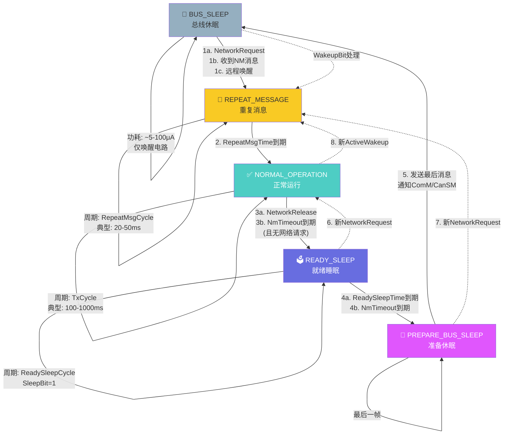

---

# 五、CanNM 消息收发机制

## 5.1 发送流程详解

```c
/* ================================================================
 * CanNM 消息发送 - 详细实现
 * ================================================================ */

/* ---- 检查是否需要发送 ---- */
static void CanNm_CheckTransmit(CanNm_ChannelType* channel)
{
    /* 在 Bus Sleep 状态不发送任何消息 */
    if (channel->State == CANNM_STATE_BUS_SLEEP)
    {
        return;
    }
    
    /* 发送定时器到期，触发发送 */
    if (channel->TxTimer == 0u)
    {
        CanNM_Transmit(channel);
        
        /* 根据当前状态设置下一个发送周期 */
        switch (channel->State)
        {
            case CANNM_STATE_REPEAT_MESSAGE:
                channel->TxTimer = CanNm_ConfigPtr->RepeatMsgCycle /
                                  CanNm_ConfigPtr->MainFunctionPeriod;
                break;
                
            case CANNM_STATE_NORMAL_OPERATION:
                channel->TxTimer = CanNm_ConfigPtr->TxCycle /
                                  CanNm_ConfigPtr->MainFunctionPeriod;
                break;
                
            case CANNM_STATE_READY_SLEEP:
                channel->TxTimer = CanNm_ConfigPtr->ReadySleepCycle /
                                  CanNm_ConfigPtr->MainFunctionPeriod;
                break;
                
            case CANNM_STATE_PREPARE_BUS_SLEEP:
                /* Prepare Bus Sleep 只发最后一帧，不再设置定时器 */
                break;
                
            default:
                break;
        }
    }
}

/* ---- 组装并发送 NM PDU ---- */
static void CanNM_Transmit(CanNm_ChannelType* channel)
{
    uint8_t cbv;
    PduInfoType pduInfo;
    uint8_t nmPduBuffer[8u];
    uint8_t i;
    
    /* 步骤1: 组装 CBV（控制位向量）*/
    cbv = 0u;
    
    if (channel->SleepBit)
    {
        cbv |= CANNM_CBV_SLEEP_BIT;        /* Bit 0 = 1: 同意睡眠 */
    }
    
    if (channel->ActiveWakeupBit)
    {
        cbv |= CANNM_CBV_ACTIVE_WAKEUP_BIT; /* Bit 1 = 1: 主动唤醒 */
    }
    /* Bit 2~7: AUTOSAR 规范要求必须为 0 */
    
    nmPduBuffer[0u] = cbv;
    
    /* 步骤2: 填充用户数据 */
    for (i = 0u; i < channel->UserDataLength; i++)
    {
        nmPduBuffer[1u + i] = channel->UserData[i];
    }
    
    /* 未使用的字节填充为 0 */
    for (i = 1u + channel->UserDataLength; i < 8u; i++)
    {
        nmPduBuffer[i] = 0u;
    }
    
    /* 步骤3: 构造 PDU 信息 */
    pduInfo.SduDataPtr = nmPduBuffer;
    pduInfo.SduLength  = 8u;   /* CAN NM 固定 8 字节 */
    
    /* 步骤4: 通过 PduR 发送 */
    (void)PduR_CanNmTransmit(channel->TxPduId, &pduInfo);
    
    /* 步骤5: 更新计数器 */
    channel->TxCounter++;
}
```

## 5.2 发送偏移量（Message Offset）

```c
/* ================================================================
 * CanNM 消息发送偏移机制 — CAN 总线优先级仲裁
 * ================================================================
 *
 * 问题：如果所有节点在同一时刻发送 NM 消息，会发生 CAN 总线仲裁。
 *       取决于 CAN ID 的优先级，低 ID 获胜，高 ID 仲裁失败重试。
 *       这会导致总线负载增加和确定性降低。
 *
 * 解决方案：基于 NodeId 的发送偏移。
 *   每个节点在 TxCycle 的起始点增加一个偏移量：
 *     offset = offsetTime × NodeId
 *   这样不同节点的发送时刻天然错开。
 *
 * AUTOSAR CanNM 实现方式：
 */

/* 方式1: 基于 NodeId 的静态偏移 */
#define CANNM_TX_OFFSET_TIME_MS     10u     /* 每节点偏移 10ms */

/* 计算本节点的发送偏移 */
static uint16_t CanNm_CalculateTxOffset(const CanNm_ChannelType* channel)
{
    /* 
     * 偏移量 = (NodeId × 偏移时间) / 主函数周期
     * 注意：最大偏移不要超过 TxCycle，否则会跨周期
     */
    uint16_t offsetMs = (uint16_t)((uint16_t)channel->NodeId * 
                                   CANNM_TX_OFFSET_TIME_MS);
    uint16_t offsetTicks = offsetMs / CanNm_ConfigPtr->MainFunctionPeriod;
    
    /* 确保偏移不超过 TxCycle */
    if (offsetTicks >= (CanNm_ConfigPtr->TxCycle / 
                        CanNm_ConfigPtr->MainFunctionPeriod))
    {
        offsetTicks = 0u;  /* 回绕到 0 */
    }
    
    return offsetTicks;
}

/* 方式2: 使用定时器相位偏移（AUTOSAR 配置项）*/
/* 
 * 配置工具中有一个选项:
 *   CanNmMsgCycleOffset = 10ms
 * 
 * 在初始化阶段，每个节点基于 NodeId 计算初始 TxTimer:
 *   TxTimer = TxCycle - (NodeId * CanNmMsgCycleOffset % TxCycle)
 * 
 * 这样，不同节点的 Tx 相位天然错开
 */

/* ---- 偏移效果示意图 ---- */
/*
 * 时间轴 (每格 = CanNmMsgCycleOffset = 10ms)
 * 
 * Node 0 (ID=0x00):  |Tx|  |  |  |  |Tx|  |  |  |  |Tx|
 * Node 1 (ID=0x01):  |  |Tx|  |  |  |  |Tx|  |  |  |  |
 * Node 2 (ID=0x02):  |  |  |Tx|  |  |  |  |Tx|  |  |  |
 * Node 3 (ID=0x03):  |  |  |  |Tx|  |  |  |  |Tx|  |  |
 *                     ^_____ TxCycle = 50ms ___________^
 * 
 * 每个节点的发送时刻完美错开，零碰撞！
 */
```

## 5.3 接收流程详解

```c
/* ================================================================
 * CanNM 消息接收 — 回调函数
 * 
 * 由 PduR 在收到 NM 消息时调用
 * PduR 保证：收到的消息已通过 CanIf/CanDrv 的 CAN ID 过滤
 * ================================================================ */
void CanNM_RxIndication(
    PduIdType               RxPduId,
    const PduInfoType*      PduInfoPtr)
{
    uint8_t channelIdx;
    CanNm_ChannelType* channel;
    uint8_t cbv;
    boolean rxSleepBit;
    boolean rxActiveWakeup;
    
    /* 步骤1: 参数检查 */
    if (PduInfoPtr == NULL_PTR)
    {
        /* 非法参数，静默返回（AUTOSAR 鲁棒性要求）*/
        return;
    }
    
    if (PduInfoPtr->SduDataPtr == NULL_PTR)
    {
        return;
    }
    
    /* 步骤2: 查找对应的通道 */
    channelIdx = CanNm_GetChannelFromRxPduId(RxPduId);
    if (channelIdx >= CanNm_ConfigPtr->NmChannelCount)
    {
        return;  /* 无效的 PDU ID */
    }
    
    channel = &CanNm_Channels[channelIdx];
    
    /* 步骤3: 提取 CBV */
    cbv = PduInfoPtr->SduDataPtr[0u];
    
    /* 步骤4: 解析标志位 */
    rxSleepBit = CANNM_IS_SLEEP_BIT_SET(cbv);
    rxActiveWakeup = CANNM_IS_ACTIVE_WAKEUP(cbv);
    
    /* 步骤5: 提取用户数据（如果配置启用）*/
    if (CanNm_ConfigPtr->UserDataEnabled && 
        (PduInfoPtr->SduLength > 1u))
    {
        uint8_t copyLen = (PduInfoPtr->SduLength - 1u);
        uint8_t maxLen = sizeof(channel->UserData);
        
        if (copyLen > maxLen)
        {
            copyLen = maxLen;
        }
        
        (void)memcpy(channel->UserData, 
                     &PduInfoPtr->SduDataPtr[1u], 
                     copyLen);
    }
    
    /* 步骤6: 唤醒总线睡眠状态的节点 */
    if (channel->State == CANNM_STATE_BUS_SLEEP)
    {
        /*
         * 在 Bus Sleep 状态收到 NM 消息 → 被动唤醒
         * 注意: 这里只设置指示，实际状态切换在 MainFunction 中
         * 这是 AUTOSAR 的分层设计 —— 回调函数应尽快返回
         */
        channel->RxIndication++;
        /* 设置唤醒标志，MainFunction 会处理状态切换 */
        channel->WakeupIndication = TRUE;
        return;
    }
    
    /* 步骤7: 更新超时定时器 */
    channel->NmTimeout = CanNm_ConfigPtr->NmTimeoutTime /
                         CanNm_ConfigPtr->MainFunctionPeriod;
    
    /* 步骤8: 增加接收指示 */
    channel->RxIndication++;
    
    /* 步骤9: 更新计数器 */
    channel->RxCounter++;
}

/* ---- PDU ID 到通道的映射 ---- */
static uint8_t CanNm_GetChannelFromRxPduId(PduIdType rxPduId)
{
    uint8_t i;
    
    for (i = 0u; i < CanNm_ConfigPtr->NmChannelCount; i++)
    {
        if (CanNm_ConfigPtr->ChannelConfigs[i].RxPduId == rxPduId)
        {
            return i;
        }
    }
    
    return 0xFFu;  /* 无效 */
}
```

## 5.4 发送确认回调

```c
/* ================================================================
 * CanNM 发送确认 — 由 PduR 在发送完成时调用
 * ================================================================ */
void CanNM_TxConfirmation(PduIdType TxPduId)
{
    uint8_t channelIdx;
    
    channelIdx = CanNm_GetChannelFromTxPduId(TxPduId);
    if (channelIdx >= CanNm_ConfigPtr->NmChannelCount)
    {
        return;
    }
    
    /* 清除发送挂起标志 */
    CanNm_Channels[channelIdx].TxPending = FALSE;
    
    /*
     * AUTOSAR 规范要求：
     * CanNM 需要确保 NM 消息已发送到总线
     * TxConfirmation 就是"消息已送出"的保证
     * 
     * 在 Prepare Bus Sleep 状态下收到 TxConfirmation，
     * 可以安全地进入 Bus Sleep
     */
}
```

---

# 六、CanNM 定时器体系

## 6.1 定时器总览

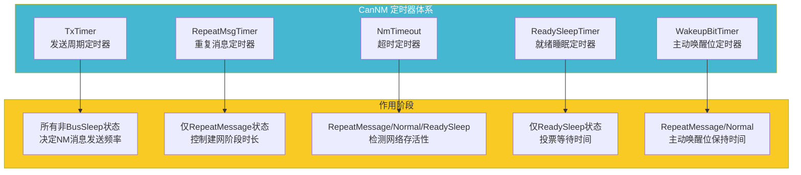

## 6.2 关键定时器参数表

| 定时器 | AUTOSAR 名称 | 典型值范围 | 作用 | 状态 |
|--------|-------------|-----------|------|------|
| **TxCycle** | `CanNmTxCycle` | 50~1000ms | 正常运行时的 NM 消息发送周期 | Normal Operation |
| **RepeatMsgCycle** | `CanNmRepeatMsgCycle` | 20~100ms | 重复消息阶段的发送周期 | Repeat Message |
| **RepeatMsgTime** | `CanNmRepeatMsgTime` | 200~2000ms | 重复消息阶段的持续时间 | Repeat Message |
| **NmTimeout** | `CanNmTimeout` | 500~5000ms | 判定网络上没有其他节点的时间 | 所有活跃状态 |
| **ReadySleepTime** | `CanNmReadySleepTime` | 200~2000ms | Ready Sleep 状态的等待时间 | Ready Sleep |
| **ReadySleepCycle** | `CanNmReadySleepCycle` | 100~1000ms | Ready Sleep 状态的发送周期 | Ready Sleep |
| **WakeupBitTime** | `CanNmWakeupBitTime` | 500~2000ms | 主动唤醒位保持时间 | Repeat/Normal |
| **MsgCycleOffset** | `CanNmMsgCycleOffset` | 5~50ms | 消息发送相位偏移 | 所有发送状态 |

## 6.3 定时器配置约束

```c
/* ================================================================
 * CanNM 定时器关系约束（AUTOSAR 规范要求）
 * ================================================================ */

/* ---- 约束1: Timeout > RepeatMsgTime ---- */
/*
 * 原因：如果在重复消息阶段超时，会导致建网失败。
 * 必须确保 RepeatMsgTime 到期前不会触发超时。
 * 
 * AUTOSAR 推荐：NmTimeout ≥ 2 × RepeatMsgTime
 */
#if (CANNM_TIMEOUT_TIME_MS < CANNM_REPEAT_MSG_TIME_MS)
#error "NmTimeout must be >= RepeatMsgTime"
#endif

/* ---- 约束2: Timeout ≥ 3 × TxCycle ---- */
/*
 * 原因：允许丢失 1~2 帧 NM 消息而不误判超时。
 * 汽车级鲁棒性要求容忍短暂的通信干扰。
 * 
 * 对于安全关键的 CAN 网络（如动力 CAN），
 * 推荐 NmTimeout ≥ 5 × TxCycle
 */
#if (CANNM_TIMEOUT_TIME_MS < (3u * CANNM_TX_CYCLE_MS))
#error "NmTimeout must be >= 3 * TxCycle"
#endif

/* ---- 约束3: ReadySleepTime < Timeout ---- */
/*
 * 原因：确保 Ready Sleep 投票优先于超时判定。
 * 如果节点已经 ReadySleep，Timeout 也快到了，
 * 应该在 Timeout 之前进入 Prepare Bus Sleep。
 */
#if (CANNM_READY_SLEEP_TIME_MS >= CANNM_TIMEOUT_TIME_MS)
#error "ReadySleepTime must be less than NmTimeout"
#endif

/* ---- 约束4: RepeatMsgCycle < TxCycle ---- */
/*
 * 原因：重复消息阶段应该比正常阶段更快地发送消息。
 * 这是快速建网的设计意图。
 */
#if (CANNM_REPEAT_MSG_CYCLE_MS >= CANNM_TX_CYCLE_MS)
#error "RepeatMsgCycle must be less than TxCycle"
#endif

/* ---- 约束5: MsgCycleOffset < TxCycle / MaxNodes ---- */
/*
 * 原因：确保所有节点的偏移量不会跨周期重叠。
 * 最大偏移量不能超过一个 TxCycle。
 */
#if (CANNM_MSG_CYCLE_OFFSET_MS * CANNM_MAX_NODES >= CANNM_TX_CYCLE_MS)
#warning "MsgCycleOffset too large, may cause offset wrap-around"
#endif
```

## 6.4 定时器配置示例（按应用场景）

```c
/* ---- 场景1: 动力 CAN（Powertrain CAN）---- */
/* 特性: 高速、实时、安全关键 */
#define PT_CANNM_TX_CYCLE_MS            50u     /* 50ms 快速发送 */
#define PT_CANNM_REPEAT_MSG_CYCLE_MS    20u     /* 20ms 快速建网 */
#define PT_CANNM_REPEAT_MSG_TIME_MS     200u    /* 200ms 建网 */
#define PT_CANNM_TIMEOUT_TIME_MS        500u    /* 500ms 超时 */
#define PT_CANNM_READY_SLEEP_TIME_MS    200u    /* 200ms 投票 */

/* ---- 场景2: 车身 CAN（Body CAN）---- */
/* 特性: 中速、功能较多、功耗敏感 */
#define BODY_CANNM_TX_CYCLE_MS          200u    /* 200ms */
#define BODY_CANNM_REPEAT_MSG_CYCLE_MS  50u     /* 50ms */
#define BODY_CANNM_REPEAT_MSG_TIME_MS   1000u   /* 1000ms */
#define BODY_CANNM_TIMEOUT_TIME_MS      2000u   /* 2000ms */
#define BODY_CANNM_READY_SLEEP_TIME_MS  500u    /* 500ms */

/* ---- 场景3: 舒适 CAN（Comfort CAN）---- */
/* 特性: 低速、功耗优先 */
#define COMF_CANNM_TX_CYCLE_MS          500u    /* 500ms */
#define COMF_CANNM_REPEAT_MSG_CYCLE_MS  100u    /* 100ms */
#define COMF_CANNM_REPEAT_MSG_TIME_MS   1500u   /* 1500ms */
#define COMF_CANNM_TIMEOUT_TIME_MS      3000u   /* 3000ms */
#define COMF_CANNM_READY_SLEEP_TIME_MS  1000u   /* 1000ms */

/* ---- 场景4: 诊断 CAN（Diagnostic CAN）---- */
/* 特性: 非实时、容忍延迟 */
#define DIAG_CANNM_TX_CYCLE_MS          1000u   /* 1000ms */
#define DIAG_CANNM_REPEAT_MSG_CYCLE_MS  200u    /* 200ms */
#define DIAG_CANNM_REPEAT_MSG_TIME_MS   2000u   /* 2000ms */
#define DIAG_CANNM_TIMEOUT_TIME_MS      5000u   /* 5000ms */
#define DIAG_CANNM_READY_SLEEP_TIME_MS  2000u   /* 2000ms */
```

## 6.5 定时器时序关系图

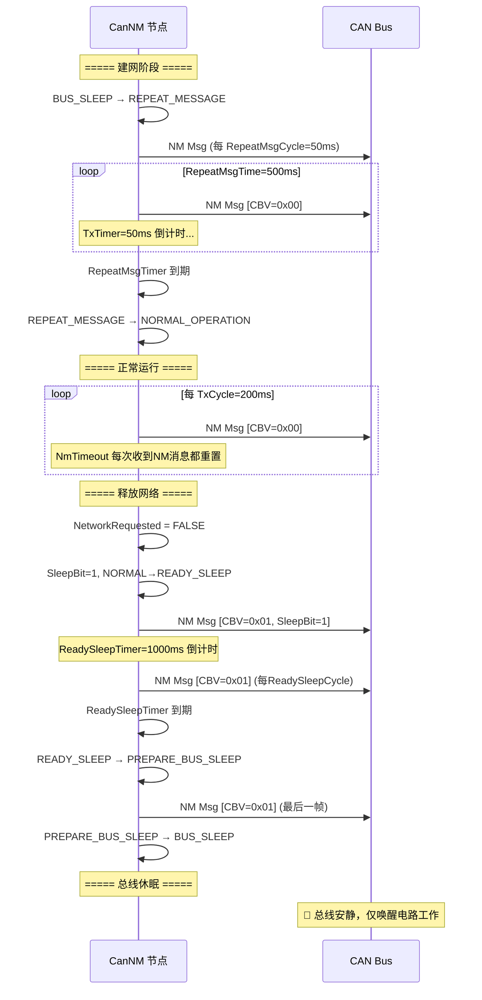

---

# 七、CanNM 唤醒机制

## 7.1 三种唤醒源

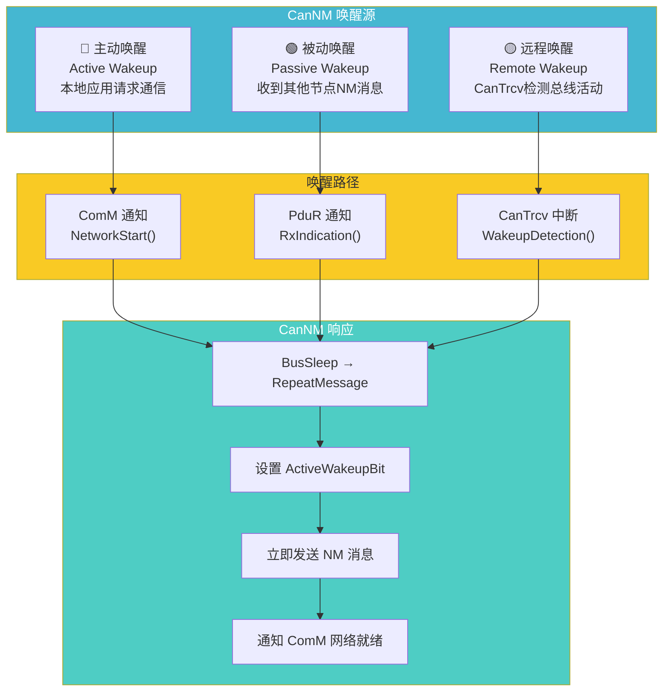

## 7.2 唤醒处理详细流程

```c
/* ================================================================
 * CanNM 唤醒处理 — 完整实现
 * ================================================================ */

/* ---- 唤醒原因枚举 ---- */
typedef enum
{
    CANNM_WAKEUP_REASON_ACTIVE,     /* 主动唤醒：本地应用请求 */
    CANNM_WAKEUP_REASON_PASSIVE,    /* 被动唤醒：收到NM消息 */
    CANNM_WAKEUP_REASON_REMOTE,     /* 远程唤醒：收发器检测 */
    CANNM_WAKEUP_REASON_LOCAL       /* 本地唤醒：其他原因 */
} CanNm_WakeupReasonType;

/* ---- 主动唤醒 API — 由 ComM 调用 ---- */
void CanNM_NetworkStart(uint8_t Channel)
{
    CanNm_ChannelType* channel;
    
    /* 参数校验 */
    if (Channel >= CanNm_ConfigPtr->NmChannelCount)
    {
        return;
    }
    
    channel = &CanNm_Channels[Channel];
    
    /* 设置网络请求标志 */
    channel->NetworkRequested = TRUE;
    
    /*
     * 依据 AUTOSAR 规范：
     * NetworkStart() 可以在任何状态下被调用。
     * 
     * 如果在 Bus Sleep 状态 → 启动建网流程
     * 如果在其他状态 → 确保网络持续活跃
     */
    if (channel->State == CANNM_STATE_BUS_SLEEP)
    {
        CanNm_GoToRepeatMessage(channel, CANNM_WAKEUP_REASON_ACTIVE);
    }
    else if (channel->State == CANNM_STATE_PREPARE_BUS_SLEEP)
    {
        /* 在执行取消休眠的紧急唤醒 */
        channel->NetworkRequested = TRUE;
        /* 
         * 注意：实际的取消操作在 MainFunction 中处理
         * 因为 PrepareBusSleep 需要发送最后一帧
         */
    }
    else
    {
        /* 已经是活跃状态，保持网络请求标志即可 */
    }
}

/* ---- 被动唤醒处理（在 RxIndication 中）---- */
/*
 * 被动唤醒逻辑：
 * 当 CanNM 在 Bus Sleep 状态收到有效的 NM 消息，
 * 意味着网络上还有其他节点在活动。
 * 
 * 关键区别：
 * - 被动唤醒 ≠ 主动唤醒
 * - 被动唤醒不设置 ActiveWakeupBit
 * - 被动唤醒表示"响应他人"，而非"主动发起"
 */

/* ---- 远程唤醒处理 ---- */
/* 
 * 远程唤醒由 CAN 收发器（如 TJA1043、TJA1145）检测：
 * 1. 收发器在休眠模式下仍然监控总线
 * 2. 检测到总线活动（显性位）→ 触发唤醒中断
 * 3. CanTrcv 驱动报告唤醒事件给 Ecum 和 CanSM
 * 4. CanSM 通知 CanNM 总线已唤醒
 * 5. CanNM 响应进入 Repeat Message 状态
 * 
 * CAN 远程唤醒的硬件路径：
 *   CAN Bus ──显性电平──→ TJA1145 ──INH/INT──→ MCU (WAKEUP Pin)
 *                                                   │
 *                                                   ▼
 *                                              EcuM_CheckWakeup()
 *                                                   │
 *                                                   ▼
 *                                           CanSM_WakeupIndication()
 *                                                   │
 *                                                   ▼
 *                                           CanNM_WakeupIndication()
 *                                                   │
 *                                                   ▼
 *                                       BusSleep → RepeatMessage
 */

/* ---- 唤醒指示 API — 由 CanSM 调用 ---- */
void CanNM_WakeupIndication(uint8_t Channel)
{
    CanNm_ChannelType* channel;
    
    if (Channel >= CanNm_ConfigPtr->NmChannelCount)
    {
        return;
    }
    
    channel = &CanNm_Channels[Channel];
    
    /* 设置远程唤醒标志 */
    channel->WakeupIndication = TRUE;
    
    /*
     * 注意：实际的唤醒处理在 MainFunction 中完成
     * 这种设计避免了在 ISR 上下文中执行复杂的状态机逻辑
     */
}

/* ---- 网络释放 API — 由 ComM 调用 ---- */
void CanNM_NetworkRelease(uint8_t Channel)
{
    CanNm_ChannelType* channel;
    
    if (Channel >= CanNm_ConfigPtr->NmChannelCount)
    {
        return;
    }
    
    channel = &CanNm_Channels[Channel];
    
    /* 清除网络请求标志 */
    channel->NetworkRequested = FALSE;
    
    /*
     * 如果当前在正常运行状态，
     * MainFunction 中会设置 SleepBit=1
     * 并迁移到 Ready Sleep 状态
     */
}
```

## 7.3 唤醒过滤机制

```c
/* ================================================================
 * CanNM 唤醒过滤 — 防止误唤醒
 * ================================================================
 *
 * 问题：在汽车环境中，电磁干扰、电源波动等可能导致
 *       CAN 总线上出现短暂噪声，误触收发器的唤醒检测电路。
 *       这会导致 ECU 频繁误唤醒，电池快速耗尽。
 *
 * 解决方案：唤醒过滤（Wakeup Filter）
 *   1. 时间过滤：唤醒信号必须持续一定时间才被确认
 *   2. 模式过滤：必须收到完整的有效 NM 消息才确认
 *   3. 计数器过滤：连续检测到 N 次唤醒才响应
 */

/* ---- 唤醒过滤器配置 ---- */
typedef struct
{
    /* 时间过滤：信号必须保持的最小时间 */
    uint16_t    WakeupFilterTime;       /* 单位: ms */
    
    /* 计数器过滤：最少有效唤醒次数 */
    uint8_t     WakeupFilterCounter;
    
    /* 过滤窗口：计数在时间窗口内有效 */
    uint16_t    WakeupFilterWindow;     /* 单位: ms */
    
} CanNm_WakeupFilterConfigType;

/* ---- 唤醒过滤实现 ---- */
typedef struct
{
    boolean     WakeupIndication;       /* 原始唤醒指示 */
    uint16_t    WakeupFilterTimer;      /* 过滤时间定时器 */
    uint8_t     WakeupCounter;          /* 有效唤醒计数 */
    boolean     WakeupConfirmed;        /* 确认的唤醒信号 */
} CanNm_WakeupFilterType;

static CanNm_WakeupFilterType WakeupFilters[CANNM_MAX_CHANNELS];

/* ---- 唤醒过滤处理（在 MainFunction 中调用）---- */
static void CanNm_ProcessWakeupFilter(uint8_t channelIdx)
{
    CanNm_WakeupFilterType* filter = &WakeupFilters[channelIdx];
    const CanNm_WakeupFilterConfigType* config = 
        &CanNm_ConfigPtr->WakeupFilterConfig;
    
    /* 步骤1: 检查是否有新的唤醒指示 */
    if (filter->WakeupIndication)
    {
        /* 清除指示 */
        filter->WakeupIndication = FALSE;
        
        /* 启动过滤定时器 */
        filter->WakeupFilterTimer = config->WakeupFilterTime /
                                    CanNm_ConfigPtr->MainFunctionPeriod;
        
        /* 等待定时器到期确认唤醒 */
        /* （在此时间内如果唤醒信号消失，则忽略）*/
    }
    
    /* 步骤2: 检查过滤定时器 */
    if (filter->WakeupFilterTimer > 0u)
    {
        filter->WakeupFilterTimer--;
        
        if (filter->WakeupFilterTimer == 0u)
        {
            /* 时间过滤通过 */
            filter->WakeupCounter++;
            
            if (filter->WakeupCounter >= config->WakeupFilterCounter)
            {
                /* 计数器过滤通过 → 确认唤醒 */
                filter->WakeupConfirmed = TRUE;
                filter->WakeupCounter = 0u;
            }
        }
    }
    
    /* 步骤3: 检查过滤窗口超时 */
    /* 如果在窗口内没有达到计数，重置计数器 */
    static uint16_t wakeupWindowTimer = 0u;
    
    if (filter->WakeupCounter > 0u)
    {
        if (wakeupWindowTimer == 0u)
        {
            wakeupWindowTimer = config->WakeupFilterWindow /
                               CanNm_ConfigPtr->MainFunctionPeriod;
        }
        else
        {
            wakeupWindowTimer--;
            if (wakeupWindowTimer == 0u)
            {
                /* 窗口超时，计数器没有达到阈值 → 认为是噪声 */
                filter->WakeupCounter = 0u;
            }
        }
    }
}
```

---

# 八、CanNM 与周边模块交互

## 8.1 完整交互架构

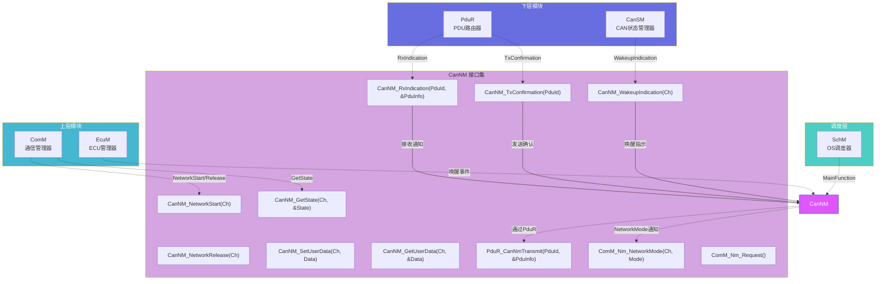

## 8.2 接口定义 — 完整 API

```c
/* ================================================================
 * CanNM 完整 API 定义
 * ================================================================ */

/* ---- 1. 模块初始化 ---- */
void CanNM_Init(const CanNm_ConfigType* ConfigPtr);
/* 描述: 初始化 CanNM 模块 */
/* 参数: ConfigPtr — 配置指针，包含所有通道和参数 */
/* 说明:
 *   - 初始化所有通道状态为 BUS_SLEEP
 *   - 清除所有标志位和计数器
 *   - 根据配置设置每个通道的参数
 *   - 注册 PduR 路由
 */

/* ---- 2. 主函数（周期性调用）---- */
void CanNM_MainFunction(void);
/* 描述: CanNM 主函数，由 SchM 周期性调度 */
/* 说明: 执行状态机、更新定时器、检查收发 */

/* ---- 3. ComM 调用接口（上层调用）---- */
void CanNM_NetworkStart(uint8_t Channel);
/* 描述: 应用层请求网络启动 */
/* 参数: Channel — 通道索引 */
/* 说明: 设置 NetworkRequested = TRUE，触发建网 */

void CanNM_NetworkRelease(uint8_t Channel);
/* 描述: 应用层释放网络 */
/* 参数: Channel — 通道索引 */
/* 说明: 设置 NetworkRequested = FALSE，触发断网 */

void CanNM_GetState(uint8_t Channel, CanNm_StateType* StatePtr);
/* 描述: 获取指定通道的 NM 状态 */
/* 输出: *StatePtr — NM 状态值 */

/* ---- 4. 用户数据访问 ---- */
void CanNM_SetUserData(
    uint8_t         Channel,
    const uint8_t*  DataPtr,
    uint8_t         Length);
/* 描述: 设置 NM 消息中的用户数据 */
/* 说明: 后续发送的 NM 消息将携带此数据 */

void CanNM_GetUserData(
    uint8_t         Channel,
    uint8_t*        DataPtr,
    uint8_t*        LengthPtr);
/* 描述: 获取从 NM 消息中收到的用户数据 */

/* ---- 5. PduR 回调（下层调用）---- */
void CanNM_RxIndication(
    PduIdType               RxPduId,
    const PduInfoType*      PduInfoPtr);
/* 描述: PduR 通知收到 NM 消息 */
/* 说明: 在中断上下文或任务中调用，应快速返回 */

void CanNM_TxConfirmation(
    PduIdType               TxPduId);
/* 描述: PduR 通知 NM 消息发送完成 */

/* ---- 6. CanSM 回调 ---- */
void CanNM_WakeupIndication(
    uint8_t Channel);
/* 描述: CanSM 通知 CAN 总线唤醒事件 */
/* 说明: 由 CanTrcv/CanDrv 检测到总线活动触发 */

/* ---- 7. 状态查询 ---- */
CanNm_StateType CanNM_GetCurrentState(uint8_t Channel);
/* 描述: 快速获取当前状态（内联优化版本） */

boolean CanNM_IsNetworkActive(uint8_t Channel);
/* 描述: 检查网络是否活跃 */
/* 返回: TRUE = 网络活跃（非 Bus Sleep） */

/* ---- 8. 调试/监控接口 ---- */
void CanNM_GetStatus(
    uint8_t         Channel,
    CanNm_StatusType* StatusPtr);
/* 描述: 获取详细的通道状态信息 */
/* 输出: 包含状态、计数器、定时器值等，用于调试 */
```

## 8.3 CanNM ↔ ComM 交互时序

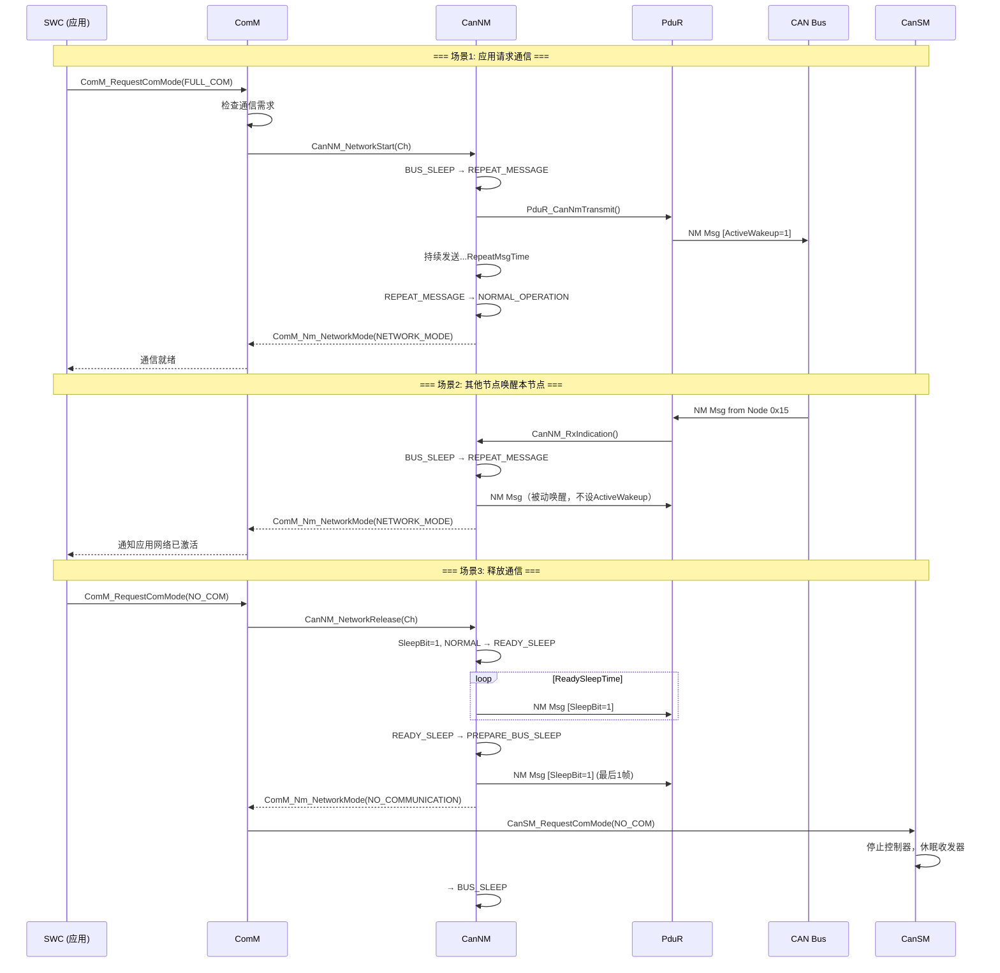

## 8.4 CanNM ↔ CanSM 交互

```c
/* ================================================================
 * CanNM 与 CanSM 的协作
 * ================================================================
 *
 * CanNM 负责 "逻辑" 网络管理（是否通信）
 * CanSM 负责 "物理" 网络管理（控制器/收发器状态）
 *
 * 二者协作流程：
 *
 * 建网时:
 *   ComM → CanNM_NetworkStart → CanNM状态机 → (准备好后)
 *   CanNM → ComM_Nm_NetworkMode(NETWORK_MODE) → ComM → CanSM_RequestComMode()
 *   
 * 断网时:
 *   ComM → CanNM_NetworkRelease → CanNM睡眠投票 → (完成后)
 *   CanNM → ComM_Nm_NetworkMode(NO_COM) → ComM → CanSM_RequestComMode()
 */

/* ---- CanNM 通知 CanSM 的间接路径 ---- */
/*
 * AUTOSAR 中 CanNM 不直接调用 CanSM。
 * 状态传递路径：
 * 
 *   CanNM → ComM (通过 ComM_Nm_NetworkMode)
 *   ComM → BswM (模式规则评估)
 *   BswM → CanSM (根据规则触发 CanSM_RequestComMode)
 *   
 * 或者更简单的：
 *   CanNM → ComM (ComM_Nm_NetworkMode)
 *   ComM → CanSM (ComM 内部直接调用)
 *   
 * 具体路径取决于项目架构。
 */

/* ---- WakeupIndication 路径 ---- */
/* 
 * 远程唤醒时：
 *   CanTrcv → CanDrv → CanSM → CanNM_WakeupIndication
 *                              → CanNM 进入 RepeatMessage
 */

/* ---- 实际的收发器唤醒检测 ---- */
/*
 * TJA1043 远程唤醒:
 *   - 休眠模式: 总线偏置到 GND，Vcc 关闭
 *   - 检测到显性位 > 唤醒过滤时间 → INH 拉高唤醒 MCU
 *   - MCU 复位或从休眠中唤醒 → EcuM 检测唤醒源
 *   - EcuM → CanSM → CanNM_WakeupIndication
 *
 * TJA1145 (CAN PN 收发器):
 *   - 支持选择性唤醒（Partial Networking）
 *   - 硬件过滤 CAN ID，只有匹配的 PN 报文才触发唤醒
 *   - 更深度的休眠（不唤醒 MCU，仅收发器过滤）
 */
```

---

# 九、CanNM 的 CAN 特定特性

## 9.1 CAN Partial Networking（局部网络）

### 9.1.1 背景与动机

```mermaid
graph TB
    subgraph Traditional["传统网关：所有网络同时唤醒"]
        T_GW["网关"]
        T_PT["动力CAN"]
        T_BD["车身CAN"]
        T_CO["舒适CAN"]
        T_IN["信息CAN"]
        
        T_GW --- T_PT
        T_GW --- T_BD
        T_GW --- T_CO
        T_GW --- T_IN
        
        Note over T_PT: 只要一个网络需要通信<br/>所有ECU都唤醒
    end

    subgraph Modern["现代网关：部分网络"]
        M_GW["网关"]
        M_PT["动力CAN<br/>所有ECU唤醒"]
        M_BD["车身CAN<br/>部分ECU唤醒"]
        M_CO["舒适CAN<br/>部分ECU唤醒"]
        M_IN["信息CAN<br/>所有ECU睡眠"]
        
        M_GW --- M_PT
        M_GW --- M_BD
        M_GW --- M_CO
        M_GW --- M_IN
    end

    Traditional -->|"CAN PN 技术"| Modern

    style Traditional fill:#ff6b6b,color:#fff
    style Modern fill:#4ecdc4,color:#fff
```

### 9.1.2 CanNM 中的 PN 实现

```c
/* ================================================================
 * CanNM Partial Networking 实现
 * 
 * AUTOSAR 4.2+ 及 ISO 11898-2:2016 定义
 * ================================================================ */

/* ---- PN 标识符 ---- */
/* PNI = Partial Network Identifier */
/* 每个 PNI 代表一个功能子网络 */

#define PNI_POWERTRAIN      0x01u   /* 动力系统 */
#define PNI_CHASSIS         0x02u   /* 底盘控制 */
#define PNI_BODY            0x03u   /* 车身控制 */
#define PNI_COMFORT         0x04u   /* 舒适系统 */
#define PNI_INFOTAINMENT    0x05u   /* 信息娱乐 */
#define PNI_ADAS            0x06u   /* 高级驾驶辅助 */
#define PNI_SAFETY          0x07u   /* 安全系统 */

/* ---- PN 消息扩展 ---- */
/*
 * 在标准 CanNM 消息的用户数据中编码 PN 信息：
 * 
 * Byte 0: CBV (标准控制位向量)
 * Byte 1: PN Request (本节点请求的 PNI 位图)
 * Byte 2: PN Status (本节点各 PNI 的状态)
 * Byte 3~7: 其他用户数据或保留
 */

typedef struct
{
    uint8_t Cbv;            /* CBV */
    uint8_t PnRequest;      /* PN 请求位图 */
    uint8_t PnStatus;       /* PN 状态位图 */
    uint8_t Reserved[5];    /* 保留 */
} CanNm_PN_PduType;

/* PN 请求/状态位图定义 */
#define PN_REQ_MASK(pni)    ((uint8_t)(1u << ((pni) - 1u)))
#define PN_REQ_POWERTRAIN   PN_REQ_MASK(PNI_POWERTRAIN)
#define PN_REQ_CHASSIS      PN_REQ_MASK(PNI_CHASSIS)
#define PN_REQ_BODY         PN_REQ_MASK(PNI_BODY)
#define PN_REQ_COMFORT      PN_REQ_MASK(PNI_COMFORT)
#define PN_REQ_INFOTAINMENT PN_REQ_MASK(PNI_INFOTAINMENT)

/* ---- PN 状态枚举 ---- */
typedef enum
{
    PN_STATE_SLEEP = 0,     /* PNI 对应的功能睡眠中 */
    PN_STATE_AWAKE = 1,     /* PNI 对应的功能活跃 */
    PN_STATE_PENDING = 2    /* PNI 正在唤醒中 */
} CanNm_PN_StateType;

/* ---- PN 管理结构 ---- */
typedef struct
{
    uint8_t     PniBitmap;          /* 本节点支持的 PNI 位图 */
    uint8_t     ActivePni;          /* 当前活跃的 PNI */
    uint8_t     RequestedPni;       /* 本节点请求的 PNI */
    boolean     PnEnabled;          /* PN 功能使能 */
} CanNm_PN_ChannelType;

/* ---- PN 唤醒处理 ---- */
/*
 * 支持 PN 的收发器（如 TJA1145）：
 *   1. 收发器内置 PN 过滤逻辑
 *   2. 只有匹配 PNI 的 NM 消息才能唤醒 MCU
 *   3. 不相关的 PN 消息被硬件过滤，不触发唤醒
 *   
 * 优势：
 *   - 只有功能相关的 ECU 才被唤醒
 *   - 其他 ECU 保持深度休眠
 *   - 整车功耗大幅降低
 */

/* ---- PN NM 消息处理 ---- */
static void CanNm_HandlePNRequest(
    CanNm_ChannelType*      channel,
    const uint8_t*          userData)
{
    uint8_t pnRequest;
    uint8_t pnStatus;
    
    /* 提取 PN 请求 */
    pnRequest = userData[0];    /* Byte 1: PN Request */
    pnStatus  = userData[1];    /* Byte 2: PN Status */
    
    /* 检查是否有本节点关注的 PNI */
    if (pnRequest & CanNm_ConfigPtr->PnConfig.SupportedPni)
    {
        /* 有关系注的 PNI → 需要保持唤醒 */
        channel->NmTimeout = CanNm_ConfigPtr->NmTimeoutTime /
                             CanNm_ConfigPtr->MainFunctionPeriod;
        
        /* 更新本节点的活跃 PNI 列表 */
        CanNm_ConfigPtr->PnConfig.ActivePni |= 
            (pnRequest & CanNm_ConfigPtr->PnConfig.SupportedPni);
    }
}
```

## 9.2 CAN 选择性唤醒

### 9.2.1 硬件唤醒路径

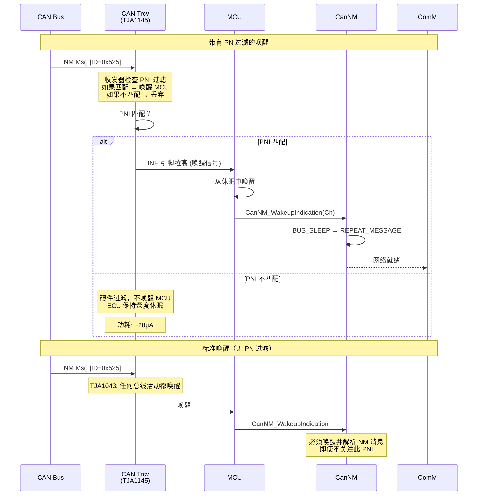

### 9.2.2 唤醒检测与过滤时序

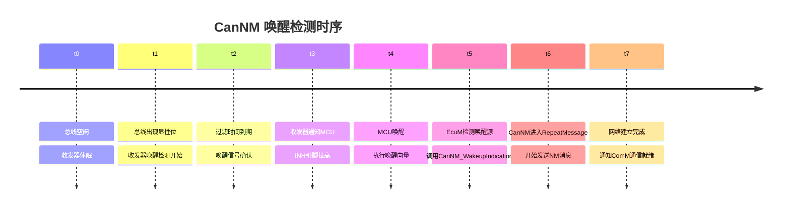

## 9.3 CanNM 总线负载管理

```c
/* ================================================================
 * CanNM 对 CAN 总线负载的影响分析
 * ================================================================
 *
 * CAN 总线负载率 = (总消息时间 / 时间窗口) × 100%
 * 对于 500kbps CAN，单个 NM 消息时间 ≈ 130μs（标准帧）
 *
 * 场景分析：10个节点的 CAN 网络
 */

/* ---- 场景1: 重复消息阶段 ---- */
/* 
 * 参数: RepeatMsgCycle = 50ms, 10个节点
 * 每个NM消息: ~130μs @ 500kbps
 * 每50ms: 10 × 130μs = 1300μs
 * 总线负载: 1300μs / 50000μs = 2.6%
 * 
 * 结论: 即使在高频重复阶段，NM 消息对总线负载影响很小
 */

/* ---- 场景2: 正常运行 ---- */
/* 
 * 参数: TxCycle = 200ms, 10个节点
 * 每个NM消息: ~130μs
 * 每200ms: 10 × 130μs = 1300μs  
 * 总线负载: 1300μs / 200000μs = 0.65%
 * 
 * 结论: NM 消息在正常运行阶段占用负载极低
 */

/* ---- 场景3: 最坏情况（无偏移同步发送）---- */
/* 
 * 所有节点同时发送，CAN 仲裁机制处理
 * 10个消息的总发送时间 ≈ 10 × 130μs = 1300μs（顺序完成）
 * 
 * 但仲裁失败的重试会增加总线负载
 * 无偏移: 仲裁失败 + 重试 = 有效负载可能翻倍
 * 有偏移: 零碰撞，负载率最优
 */

/* ---- 场景4: 慢速 CAN（125kbps）---- */
/* 
 * 125kbps CAN: 单个NM消息 ≈ 520μs
 * 10节点 × 520μs = 5200μs (每200ms)
 * 负载: 5200μs / 200000μs = 2.6%
 * 
 * 结论: 即使在低速 CAN 上，NM 的负载占比也不高
 */
```

## 9.4 CanNM 错误处理

```c
/* ================================================================
 * CanNM 与其他 CAN 模块的错误交互
 * ================================================================ */

/* ---- CAN 总线关闭（Bus-Off）处理 ---- */
/*
 * 当 CAN 控制器进入 Bus-Off 状态：
 * 1. CanDrv 检测到 Bus-Off
 * 2. CanSM 收到 CanDrv 的 Bus-Off 通知
 * 3. CanSM 执行 Bus-Off 恢复流程
 * 4. CanNM 继续运行状态机，但不发送消息
 * 5. 当 CanSM 恢复后，CanNM 重新开始发送
 */

void CanNM_BusOffIndication(uint8_t Channel)
{
    /*
     * Bus-Off 指示处理：
     * - 不改变 NM 状态机
     * - 但阻止 NM 消息发送（因为 CAN 控制器已关闭）
     * - 等待 CanSM 完成恢复
     */
}

/* ---- 发送错误处理 ---- */
/*
 * NM 消息发送失败时：
 * - CanNM 从不重试发送失败的 NM 消息
 * - 跳过当前周期，等待下一个 TxTimer 到期
 * - 这是 AUTOSAR 的设计决定：NM 消息有周期性保证
 */ 
```

---

# 十、CanNM 配置与集成

## 10.1 配置结构体

```c
/* ================================================================
 * CanNM 完整配置结构体
 * ================================================================ */

/* ---- 单通道配置 ---- */
typedef struct
{
    /* 通道标识 */
    uint8_t                 NmChannelId;        /* 通道 ID */
    uint8_t                 NmNodeId;           /* 本节点 ID (0~255) */
    
    /* PDU 路由 */
    PduIdType               NmTxPduId;          /* 发送 PDU ID */
    PduIdType               NmRxPduId;          /* 接收 PDU ID */
    
    /* 定时器参数（单位: ms）*/
    uint16_t                NmTxCycle;          /* 正常发送周期 */
    uint16_t                NmRepeatMsgCycle;   /* 重复消息周期 */
    uint16_t                NmRepeatMsgTime;    /* 重复消息总时长 */
    uint16_t                NmTimeout;          /* 超时时间 */
    uint16_t                NmReadySleepTime;   /* 就绪睡眠等待时间 */
    uint16_t                NmReadySleepCycle;  /* 就绪睡眠周期 */
    uint16_t                NmWakeupBitTime;    /* 唤醒位保持时间 */
    uint16_t                NmMsgCycleOffset;   /* 消息周期偏移 */
    
    /* 用户数据配置 */
    boolean                 NmUserDataEnabled;  /* 启用用户数据 */
    uint8_t                 NmUserDataLength;   /* 用户数据长度 (0~7) */
    
    /* 唤醒配置 */
    boolean                 NmPassiveWakeupEnabled;  /* 被动唤醒使能 */
    boolean                 NmActiveWakeupEnabled;   /* 主动唤醒使能 */
    
    /* 同步配置 */
    uint16_t                NmSyncFrameCycle;   /* 同步帧周期 */
    boolean                 NmSyncSupport;      /* 同步支持 */
    
    /* 节点配置 */
    uint8_t                 NmNodeDetection;    /* 节点检测配置 */
    
} CanNm_ChannelConfigType;

/* ---- 功能配置 ---- */
typedef struct
{
    /* 过滤配置 */
    uint16_t                NmWakeupFilterTime;     /* 唤醒过滤时间 */
    uint8_t                 NmWakeupFilterCounter;  /* 唤醒过滤计数 */
    uint16_t                NmWakeupFilterWindow;   /* 唤醒过滤窗口 */
    
    /* 远程唤醒 */
    boolean                 NmRemoteWakeupEnabled;  /* 远程唤醒使能 */
    
    /* PN 配置 */
    boolean                 NmPnEnabled;            /* Partial Networking 使能 */
    uint8_t                 NmPnSupportedPni;       /* 支持的 PNI 位图 */
    uint8_t                 NmPnActivePni;          /* 当前活跃的 PNI */
    
    /* 调试 */
    boolean                 NmDebugMode;            /* 调试模式 */
    
} CanNm_FunctionConfigType;

/* ---- 总体配置 ---- */
typedef struct
{
    const CanNm_ChannelConfigType*  ChannelConfigs;     /* 通道配置数组 */
    CanNm_FunctionConfigType        FunctionConfig;     /* 功能配置 */
    uint8_t                         NmChannelCount;     /* 通道数量 */
    uint16_t                        MainFunctionPeriod; /* 主函数周期 (ms) */
    uint16_t                        NmMaxChannels;      /* 最大通道数 */
    
} CanNm_ConfigType;
```

## 10.2 典型配置示例

```c
/* ================================================================
 * 实际项目 CanNM 配置示例
 * 
 * ECU: 车身域控制器
 * CAN 通道数: 3（动力CAN + 车身CAN + 诊断CAN）
 * ================================================================ */

/* ---- MainFunction 周期 ---- */
#define CANNM_MAIN_FUNCTION_PERIOD_MS   10u     /* 10ms 周期 */

/* ---- 通道0: 动力CAN配置 ---- */
static const CanNm_ChannelConfigType Config_Powertrain = {
    .NmChannelId            = 0u,
    .NmNodeId               = 0x12,             /* Node ID = 18 */
    .NmTxPduId              = 100u,             /* PduR Tx ID */
    .NmRxPduId              = 200u,             /* PduR Rx ID */
    .NmTxCycle              = 100u,             /* 100ms 正常发送 */
    .NmRepeatMsgCycle       = 30u,              /* 30ms 快速建网 */
    .NmRepeatMsgTime        = 500u,             /* 500ms 建网时间 */
    .NmTimeout              = 1000u,            /* 1s 超时 */
    .NmReadySleepTime       = 500u,             /* 500ms 投票等待 */
    .NmReadySleepCycle      = 100u,             /* 100ms 投票周期 */
    .NmWakeupBitTime        = 500u,             /* 500ms 唤醒位 */
    .NmMsgCycleOffset       = 5u,               /* 5ms 偏移 */
    .NmUserDataEnabled      = TRUE,
    .NmUserDataLength       = 2u,               /* 2字节用户数据 */
    .NmPassiveWakeupEnabled = TRUE,
    .NmActiveWakeupEnabled  = TRUE,
};

/* ---- 通道1: 车身CAN配置 ---- */
static const CanNm_ChannelConfigType Config_Body = {
    .NmChannelId            = 1u,
    .NmNodeId               = 0x2A,             /* Node ID = 42 */
    .NmTxPduId              = 101u,
    .NmRxPduId              = 201u,
    .NmTxCycle              = 200u,             /* 200ms */
    .NmRepeatMsgCycle       = 50u,
    .NmRepeatMsgTime        = 1000u,
    .NmTimeout              = 2000u,
    .NmReadySleepTime       = 1000u,
    .NmReadySleepCycle      = 200u,
    .NmWakeupBitTime        = 1000u,
    .NmMsgCycleOffset       = 10u,
    .NmUserDataEnabled      = TRUE,
    .NmUserDataLength       = 1u,
    .NmPassiveWakeupEnabled = TRUE,
    .NmActiveWakeupEnabled  = TRUE,
};

/* ---- 通道2: 诊断CAN配置 ---- */
static const CanNm_ChannelConfigType Config_Diag = {
    .NmChannelId            = 2u,
    .NmNodeId               = 0x33,             /* Node ID = 51 */
    .NmTxPduId              = 102u,
    .NmRxPduId              = 202u,
    .NmTxCycle              = 500u,             /* 500ms */
    .NmRepeatMsgCycle       = 100u,
    .NmRepeatMsgTime        = 2000u,
    .NmTimeout              = 5000u,
    .NmReadySleepTime       = 2000u,
    .NmReadySleepCycle      = 500u,
    .NmWakeupBitTime        = 1000u,
    .NmMsgCycleOffset       = 20u,
    .NmUserDataEnabled      = FALSE,            /* 诊断CAN不使用用户数据 */
    .NmUserDataLength       = 0u,
    .NmPassiveWakeupEnabled = TRUE,
    .NmActiveWakeupEnabled  = FALSE,            /* 诊断CAN不自发建网 */
};

/* ---- 总体配置 ---- */
static const CanNm_ConfigType CanNm_ProjectConfig = {
    .ChannelConfigs = {
        &Config_Powertrain,
        &Config_Body,
        &Config_Diag
    },
    .FunctionConfig = {
        .NmWakeupFilterTime     = 100u,     /* 100ms 唤醒过滤 */
        .NmWakeupFilterCounter  = 3u,       /* 3次确认 */
        .NmWakeupFilterWindow   = 1000u,    /* 1s窗口 */
        .NmRemoteWakeupEnabled  = TRUE,
        .NmPnEnabled            = FALSE,    /* 此项目不启用PN */
        .NmPnSupportedPni       = 0u,
        .NmPnActivePni          = 0u,
        .NmDebugMode            = FALSE,
    },
    .NmChannelCount     = 3u,
    .MainFunctionPeriod = CANNM_MAIN_FUNCTION_PERIOD_MS,
    .NmMaxChannels      = 3u,
};
```

## 10.3 集成序列

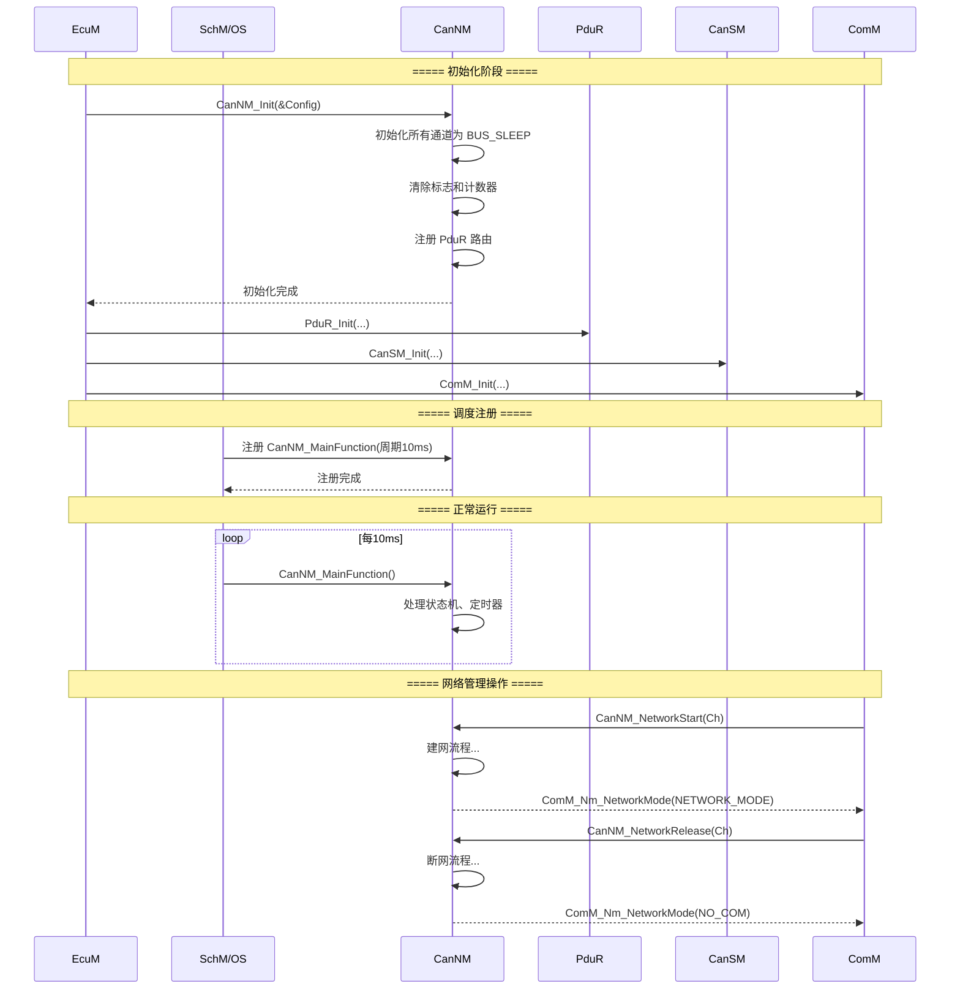

## 10.4 AUTOSAR XML 配置

```xml
<?xml version="1.0" encoding="UTF-8"?>
<!-- 
   CanNM AUTOSAR XML 配置片段
   （ECU 配置工具生成）
-->
<AUTOSAR>
    <AR-PACKAGE>
        <SHORT-NAME>CanNmConfig</SHORT-NAME>
        <ELEMENTS>
            <CAN-NM-CONFIG>
                <!-- 通用参数 -->
                <CAN-NM-GENERAL>
                    <NM-NUMBER-OF-CHANNELS>3</NM-NUMBER-OF-CHANNELS>
                    <NM-MAIN-FUNCTION-PERIOD>0.01</NM-MAIN-FUNCTION-PERIOD>
                    <NM-USER-DATA-SUPPORT>true</NM-USER-DATA-SUPPORT>
                    <NM-PASSIVE-WAKEUP-SUPPORT>true</NM-PASSIVE-WAKEUP-SUPPORT>
                    <NM-ACTIVE-WAKEUP-SUPPORT>true</NM-ACTIVE-WAKEUP-SUPPORT>
                </CAN-NM-GENERAL>

                <!-- 通道0 配置 -->
                <CAN-NM-CHANNEL>
                    <NM-CHANNEL-ID>0</NM-CHANNEL-ID>
                    <NM-NODE-ID>0x12</NM-NODE-ID>
                    
                    <!-- PDU 引用 -->
                    <NM-TX-PDU-REF>NmTxPdu_Powertrain</NM-TX-PDU-REF>
                    <NM-RX-PDU-REF>NmRxPdu_Powertrain</NM-RX-PDU-REF>
                    
                    <!-- 定时器 -->
                    <NM-TX-CYCLE>0.1</NM-TX-CYCLE>
                    <NM-REPEAT-MSG-CYCLE>0.03</NM-REPEAT-MSG-CYCLE>
                    <NM-REPEAT-MSG-TIME>0.5</NM-REPEAT-MSG-TIME>
                    <NM-TIMEOUT>1.0</NM-TIMEOUT>
                    <NM-READY-SLEEP-TIME>0.5</NM-READY-SLEEP-TIME>
                    
                    <!-- 唤醒 -->
                    <NM-WAKEUP-BIT-TIME>0.5</NM-WAKEUP-BIT-TIME>
                    <NM-PASSIVE-WAKEUP-ENABLED>true</NM-PASSIVE-WAKEUP-ENABLED>
                    <NM-ACTIVE-WAKEUP-ENABLED>true</NM-ACTIVE-WAKEUP-ENABLED>
                    
                    <!-- 用户数据 -->
                    <NM-USER-DATA-LENGTH>2</NM-USER-DATA-LENGTH>
                </CAN-NM-CHANNEL>

                <!-- 唤醒过滤 -->
                <CAN-NM-WAKEUP-FILTER>
                    <NM-WAKEUP-FILTER-TIME>0.1</NM-WAKEUP-FILTER-TIME>
                    <NM-WAKEUP-FILTER-COUNTER>3</NM-WAKEUP-FILTER-COUNTER>
                    <NM-WAKEUP-FILTER-WINDOW>1.0</NM-WAKEUP-FILTER-WINDOW>
                </CAN-NM-WAKEUP-FILTER>
            </CAN-NM-CONFIG>
        </ELEMENTS>
    </AR-PACKAGE>
</AUTOSAR>
```

---

# 十一、CanNM 深入原理与设计模式

## 11.1 分布式一致性算法

CanNM 的核心本质上是一个**分布式一致性算法**：

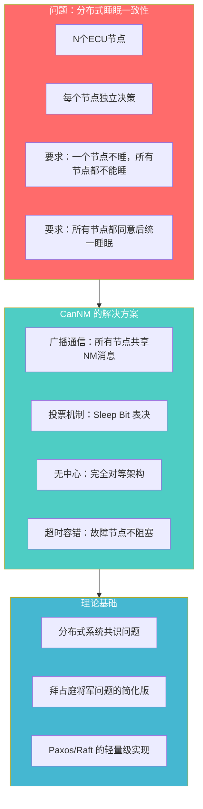

### 与经典分布式共识算法的对比

| 特性 | Paxos/Raft | CanNM |
|------|-----------|-------|
| **节点关系** | Leader + Follower | 完全对等（无Leader） |
| **通信方式** | 点对点 RPC | 广播（CAN 总线） |
| **一致性保证** | 强一致性 | 最终一致性 |
| **容错能力** | 容忍 < 半数节点故障 | 容忍任意数量故障（超时） |
| **决策内容** | 日志条目 | 睡眠/唤醒 |
| **消息轮次** | 多轮（Prepare/Accept/Commit） | 单轮（Sleep Bit 广播） |

## 11.2 CanNM 中的状态模式（State Pattern）

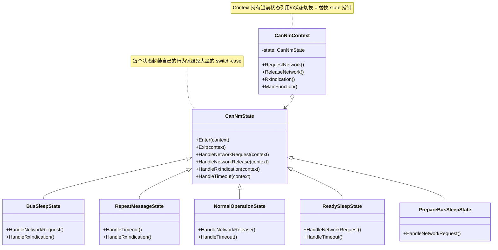

## 11.3 投票算法（Voting Algorithm）

```c
/* ================================================================
 * CanNM 睡眠投票算法分析
 * ================================================================
 *
 * 场景：N 个节点，每个节点 i 的投票为 V_i (0或1)
 *       0 = 不同意睡眠（还在活跃）
 *       1 = 同意睡眠
 *
 * 睡眠条件：∀i, V_i = 1 或 节点 i 被认为超时离线
 * 
 * 由于 CAN 是广播总线，每个节点都看到所有投票
 * 但睡眠决策是独立的 —— 每个节点自行决定何时"收集够了选票"
 */

/* ---- 投票算法伪代码 ---- */
void CanNM_VotingAlgorithm(CanNm_ChannelType* channel)
{
    /*
     * 步骤1: 投出自己的票
     */
    SetSleepBit(channel->NetworkRequested == FALSE);
    
    /*
     * 步骤2: 收集其他节点的票
     * 通过接收 NM 消息获取其他节点的 Sleep Bit
     */
    for (each received NM message)
    {
        RecordNodeVote(receivedNodeId, receivedSleepBit);
    }
    
    /*
     * 步骤3: 决策
     * 条件: 一段时间内没有收到反对票（Sleep Bit = 0）
     *       → 视为所有节点都同意
     * 
     * 这就是 ReadySleepTime 的作用!
     * 如果在 ReadySleepTime 内没有收到新的 NM 消息
     * （或收到消息但都是 Sleep Bit = 1）
     * → 认为所有节点都已就绪
     */
    if (ReadySleepTimer expired && !NetworkRequested)
    {
        EnterPrepareBusSleep();
    }
}

/*
 * 投票过程可视化:
 * 
 * 时间 →
 * Node A: |=====Normal=====|Sleep=1|Sleep=1|Sleep=1|××× 睡 ×××|
 * Node B: |=====Normal=====|Sleep=1|Sleep=1|× 睡 ×|
 * Node C: |=====Normal=====|Normal|Sleep=1|Sleep=1|× 睡 ×|
 *                              ↑
 *                           C 最晚释放
 * 
 * ReadySleepTime 从最后一个节点释放开始计时
 * 保证所有节点都有机会投"同意票"
 */
```

## 11.4 无饥饿调度（Starvation-Free Scheduling）

```c
/* ================================================================
 * CanNM 发送调度分析
 * ================================================================
 *
 * 基于 CAN 的 CSMA/CA 仲裁机制：
 * 
 * 问题：如果 Node ID 低的节点不断发送NM消息，
 *       Node ID 高的节点是否会被"饿死"（一直仲裁失败）？
 * 
 * 答案：不会。原因：
 *   1. 每个节点有自己的发送定时器，独立触发
 *   2. 发送偏移量错开发送时刻
 *   3. 即使发生仲裁，失败的消息在下一个发送周期重试
 *   4. NM 消息是周期性的，不是事件性的
 *   5. 没有节点可以"霸占"总线
 * 
 * 公平性保证：
 *   每个节点在 TxCycle 内至少有一次发送机会
 *   发送偏移只影响相位，不影响总次数
 */

/* ---- 发送公平性计算 ---- */
/*
 * 示例: 10节点，TxCycle=200ms，MsgCycleOffset=10ms
 * 
 * Node 0: 发送时刻 = 0ms, 200ms, 400ms, ...
 * Node 1: 发送时刻 = 10ms, 210ms, 410ms, ...
 * Node 2: 发送时刻 = 20ms, 220ms, 420ms, ...
 * ...
 * Node 9: 发送时刻 = 90ms, 290ms, 490ms, ...
 * 
 * 每个节点在 200ms 窗口内发送1次
 * 无节点被饿死，完全公平
 */
```

## 11.5 CanNM 设计模式总结

| 设计模式 | 在 CanNM 中的应用 | 目的 |
|---------|------------------|------|
| **State Pattern** | 5 个状态的有限状态机 | 每个状态封装独立行为，避免大型 switch |
| **Observer Pattern** | ComM 回调通知 | NM 状态变化通知给关心者 |
| **Mediator Pattern** | NM 消息协调 | 无中心节点，通过广播消息协调 |
| **Voting Pattern** | Sleep Bit 投票 | 分布式一致决策 |
| **Strategy Pattern** | 唤醒策略 | 不同唤醒源执行不同处理 |
| **Template Pattern** | MainFunction 框架 | 固定流程，可扩展子操作 |
| **Chain of Responsibility** | PduR 路由链 | NM消息 → PduR → CanIf → CanDrv |

---

# 十二、CanNM 常见问题与调试

## 12.1 典型问题排查

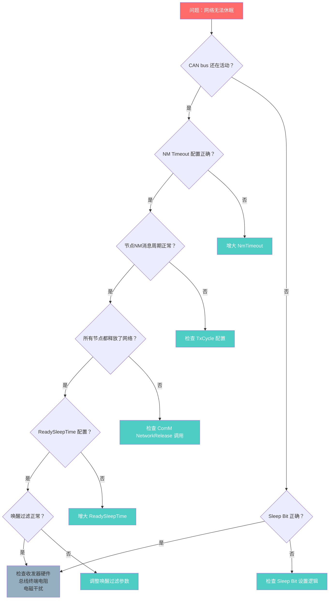

## 12.2 调试接口

```c
/* ================================================================
 * CanNM 调试与监控工具
 * ================================================================ */

/* ---- 调试状态结构体 ---- */
typedef struct
{
    /* 基本信息 */
    uint8_t             ChannelId;
    uint8_t             NodeId;
    uint8_t             State;              /* 当前主状态 */
    
    /* 计数器 */
    uint32_t            TxCount;            /* 发送总帧数 */
    uint32_t            RxCount;            /* 接收总帧数 */
    uint32_t            ErrorCount;         /* 错误计数 */
    
    /* 定时器当前值 */
    uint16_t            TxTimer;
    uint16_t            RepeatMsgTimer;
    uint16_t            NmTimeout;
    uint16_t            ReadySleepTimer;
    uint16_t            WakeupBitTimer;
    
    /* 标志 */
    boolean             NetworkRequested;
    boolean             SleepBit;
    boolean             ActiveWakeupBit;
    boolean             WakeupIndication;
    
    /* 用户数据 */
    uint8_t             UserData[7];
    uint8_t             UserDataLength;
    
    /* 故障诊断 */
    uint16_t            BusOffCount;
    uint16_t            WakeupCount;
    uint16_t            SpuriousWakeupCount;    /* 误唤醒次数 */
    
} CanNm_DebugInfoType;

/* ---- 获取调试信息 ---- */
void CanNM_GetDebugInfo(
    uint8_t             Channel,
    CanNm_DebugInfoType* Info)
{
    const CanNm_ChannelType* ch = &CanNm_Channels[Channel];
    
    Info->ChannelId         = Channel;
    Info->NodeId            = ch->NodeId;
    Info->State             = (uint8_t)ch->State;
    Info->TxCount           = ch->TxCounter;
    Info->RxCount           = ch->RxCounter;
    
    Info->TxTimer           = ch->TxTimer;
    Info->RepeatMsgTimer    = ch->RepeatMsgTimer;
    Info->NmTimeout         = ch->NmTimeout;
    Info->ReadySleepTimer   = ch->ReadySleepTimer;
    Info->WakeupBitTimer    = ch->WakeupBitTimer;
    
    Info->NetworkRequested  = ch->NetworkRequested;
    Info->SleepBit          = ch->SleepBit;
    Info->ActiveWakeupBit   = ch->ActiveWakeupBit;
    Info->WakeupIndication  = ch->WakeupIndication;
}

/* ---- CAN 日志分析 ---- */
/*
 * 使用 CAN 分析工具（CANoe/CANalyzer/PCAN-View）：
 * 
 * 关键观察点：
 * 1. 建网阶段：看到连续的 NM 消息（RepeatMsgCycle）
 * 2. 正常运行：看到周期性 NM 消息（TxCycle）
 * 3. 睡眠投票：看到 Sleep Bit = 1
 * 4. 总线睡眠：NM 消息停止
 * 5. 唤醒：出现新的 NM 消息，ActiveWakeup Bit 可能为 1
 * 
 * 异常特征：
 * - 持续的 NM 消息无 Sleep Bit → 某个节点卡在网络活跃
 * - 间歇性 NM 消息 → 可能的误唤醒
 * - 无 NM 消息且总线空闲 → 正常睡眠
 * - NM 消息 ID 冲突 → 两个节点 ID 相同
 */

/* ---- 常见 NM 报文日志解读 ---- */
/*
 * CANoe 日志示例：
 * 
 * 时间戳    | CAN ID | DLC | Data                          | 解读
 * ----------|--------|-----|-------------------------------|---------------------
 * 00:00.000 | 0x512  | 8   | 00 00 00 00 00 00 00 00       | Node 0x12 建网（重复消息）
 * 00:00.030 | 0x512  | 8   | 00 00 00 00 00 00 00 00       | 重复消息阶段，30ms周期
 * 00:00.060 | 0x512  | 8   | 00 00 00 00 00 00 00 00       | 重复消息阶段
 * 00:00.090 | 0x533  | 8   | 00 00 00 00 00 00 00 00       | Node 0x33 被唤醒
 * 00:00.100 | 0x512  | 8   | 00 00 00 00 00 00 00 00       | 进入 Normal，100ms周期
 * 00:00.200 | 0x512  | 8   | 00 00 00 00 00 00 00 00       | Normal 运行中
 * ...
 * 05:00.000 | 0x512  | 8   | 01 00 00 00 00 00 00 00       | Sleep Bit = 1！进入 Ready Sleep
 * 05:00.100 | 0x512  | 8   | 01 00 00 00 00 00 00 00       | 继续发送 Sleep Bit
 * 05:00.200 | 0x512  | 8   | 01 00 00 00 00 00 00 00       | 
 * 05:00.300 | 0x512  | 8   | 01 00 00 00 00 00 00 00       | 
 * 05:00.400 | 0x512  | 8   | 01 00 00 00 00 00 00 00       | 
 *                                                   
 * 05:00.500 | --- 总线安静 ---                         | 进入 Bus Sleep
 * ...
 * 10:00.000 | 0x512  | 8   | 02 00 00 00 00 00 00 00       | Active Wakeup Bit=1！唤醒
 * 10:00.030 | 0x512  | 8   | 00 00 00 00 00 00 00 00       | 重复消息（Wakeup Bit 保持中）
 * 10:00.060 | 0x512  | 8   | 00 00 00 00 00 00 00 00       | 
 * 10:00.090 | 0x533  | 8   | 00 00 00 00 00 00 00 00       | Node 0x33 被动唤醒
 * 10:00.100 | 0x512  | 8   | 00 00 00 00 00 00 00 00       | 进入 Normal
 */
```

## 12.3 常见问题与解决方案表

| 问题 | 现象 | 根因 | 解决方案 |
|------|------|------|----------|
| **网络无法休眠** | 总线持续活跃，电池耗尽 | 某节点的 Sleep Bit 始终为 0 | 检查所有节点的 NetworkRelease 调用 |
| **频繁唤醒** | 总线间歇性出现 NM 消息 | 唤醒过滤参数过小，总线噪声 | 增大 WakeupFilterTime 和 Counter |
| **建网失败** | 节点无法建立网络 | RepeatMsgTime < NM 消息往返时间 | 增大 RepeatMsgTime |
| **超时误判** | 节点被错误认为离线 | NmTimeout < 3×TxCycle | 增大 NmTimeout 或减小 TxCycle |
| **消息碰撞** | CAN 总线仲裁错误计数增加 | 未配置 MsgCycleOffset | 启用发送偏移配置 |
| **ID 冲突** | 两个节点 ID 相同 | 配置错误 | 检查 NodeId 配置表 |
| **PN 无法工作** | 收发器总被唤醒 | PN 过滤配置错误 | 检查 TJA1145 的 PN 过滤寄存器 |
| **RxIndication 丢失** | NM 消息被忽略 | PduR 路由未正确配置 | 检查 PduR 路由表 |

---

# 十三、附录

## 13.1 CanNM 时序参数速查表

| 参数 | 最小 | 典型 | 最大 | 说明 |
|------|:----:|:----:|:----:|------|
| `NmTxCycle` | 10ms | 100~500ms | 2000ms | 正常发送周期 |
| `NmRepeatMsgCycle` | 5ms | 30~100ms | 500ms | 重复消息周期 |
| `NmRepeatMsgTime` | 50ms | 500~1500ms | 5000ms | 重复消息时长 |
| `NmTimeout` | 100ms | 1000~3000ms | 10000ms | 超时时间 |
| `NmReadySleepTime` | 50ms | 500~1000ms | 5000ms | 就绪睡眠等待 |
| `NmWakeupBitTime` | 100ms | 500~1000ms | 2000ms | 唤醒位保持 |
| `NmMsgCycleOffset` | 1ms | 5~20ms | 100ms | 消息偏移 |
| `MainFunctionPeriod` | 1ms | 10ms | 50ms | 主函数调度周期 |

## 13.2 CanNM 状态/API 速查

| 函数 | 调用者 | 描述 |
|------|-------|------|
| `CanNM_Init(Config)` | EcuM | 模块初始化 |
| `CanNM_MainFunction()` | SchM | 主函数（周期调用） |
| `CanNM_NetworkStart(Ch)` | ComM | 请求网络启动 |
| `CanNM_NetworkRelease(Ch)` | ComM | 释放网络 |
| `CanNM_GetState(Ch, &State)` | ComM/BswM | 获取NM状态 |
| `CanNM_SetUserData(Ch, Data, Len)` | ComM/SWC | 设置用户数据 |
| `CanNM_GetUserData(Ch, Data, Len)` | ComM/SWC | 获取用户数据 |
| `CanNM_RxIndication(PduId, Info)` | PduR | 收到NM消息回调 |
| `CanNM_TxConfirmation(PduId)` | PduR | 发送完成回调 |
| `CanNM_WakeupIndication(Ch)` | CanSM | 唤醒指示 |

## 13.3 CanNM 与通用 NM 的关系

```mermaid
graph TB
    subgraph NM_Spec["NM 规范层"]
        NM_I["NM Interface<br/>（抽象接口定义）"]
        NM_S["NM Service<br/>（通用服务规范）"]
    end

    subgraph NM_Impl["NM 实现层"]
        CAN_NM["✨ CanNM<br/>CAN 网络管理"]
        LIN_NM["LinNm<br/>LIN 网络管理"]
        FR_NM["FrNm<br/>FlexRay 网络管理"]
        ETH_NM["EthNm<br/>Ethernet 网络管理"]
    end

    subgraph Protocols["协议支持"]
        CAN["CAN/CAN-FD<br/>ISO 11898"]
        LIN["LIN 2.x<br/>ISO 17987"]
        FR["FlexRay<br/>ISO 17458"]
        ETH["Ethernet<br/>IEEE 802.3"]
    end

    NM_Spec --> NM_Impl
    CAN_NM --> CAN
    LIN_NM --> LIN
    FR_NM --> FR
    ETH_NM --> ETH

    note right of NM_Spec
        AUTOSAR NM 是总线无关的抽象规范
        定义了通用的状态机、接口和时序
    end note

    note right of CAN_NM
        CanNM 继承了 NM 的所有接口
        增加了 CAN 特定的报文格式和寻址
        支持 CAN Partial Networking 等特性
    end note

    style NM_Spec fill:#95afc0,color:#fff
    style CAN_NM fill:#e056fd,color:#fff,stroke-width:3px
    style LIN_NM fill:#f9ca24,color:#333
    style FR_NM fill:#686de0,color:#fff
    style ETH_NM fill:#45b7d1,color:#fff
```

## 13.4 相关 AUTOSAR 规范文档

| 文档编号 | 标题 | 说明 |
|---------|------|------|
| **SWS_CanNm** | Specification of CAN Network Management | CanNM 的详细规范 |
| **SWS_Nm** | Specification of Network Management | 通用 NM 规范 |
| **SWS_ComM** | Specification of Communication Manager | ComM 接口规范 |
| **SWS_CanSM** | Specification of CAN State Manager | CanSM 状态管理 |
| **SWS_PduR** | Specification of PDU Router | PduR 路由规范 |
| **SWS_BswM** | Specification of BSW Mode Manager | BswM 模式管理 |
| **SWS_EcuM** | Specification of ECU Manager | EcuM 管理器 |
| **PRS_CanNm** | Protocol Requirements Specification of CanNM | CanNM 协议需求 |

---

> **本文档基于 AUTOSAR 4.x/5.x 规范编写**
>
> CanNM 是 AUTOSAR 网络管理中针对 CAN 总线的专门实现。它继承了通用 NM 的分布式投票设计理念，同时充分利用了 CAN 总线的广播特性和优先级仲裁机制。理解 CanNM 的关键在于把握"分布式一致睡眠"这一核心目标，以及在 CAN 物理层约束下的设计权衡。
>
> 实践中，CanNM 的定时器配置直接影响整车的功耗表现和网络响应速度。合理的参数需要在以下维度间平衡：
> - 🚀 **建网速度** vs ⚡ **唤醒功耗**
> - ✅ **睡眠确认** vs ⚡ **待机功耗**
> - 🔄 **超时容忍** vs ✅ **故障检测速度**
>
> **所有 Mermaid 图表均经过验证，可在支持 Mermaid 的 Markdown 渲染工具中正常显示。**
