# AUTOSAR CAN Network Management 原理总结

> 本文基于 **AUTOSAR Classic Platform R4.4.0 / Release R18-10** 的  
> `AUTOSAR_SWS_CANNetworkManagement.pdf` 进行通俗化总结。  
> 该模块通常简称为 **CanNm**，主要负责协调 CAN 网络中多个 ECU 的**唤醒、保持运行和统一休眠**。

---

## 1. CanNm 是做什么的？

在一辆汽车中，多个 ECU 通过 CAN 总线连接：

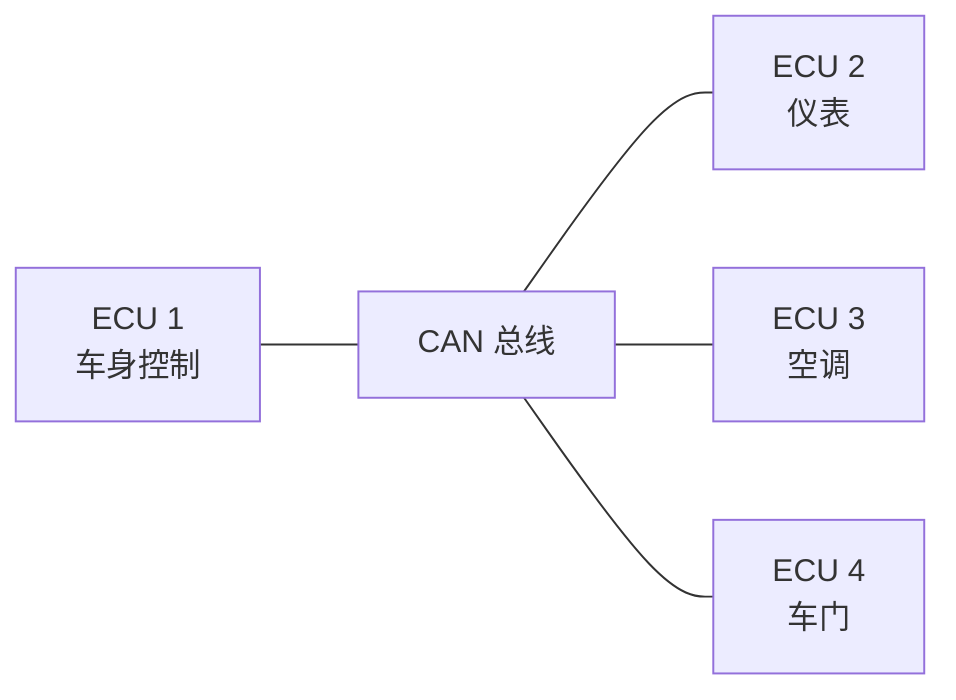

当没有 ECU 需要通信时，CAN 网络可以进入休眠，以降低功耗。

但是，不能让某个 ECU 单独关闭总线，因为：

- 其他 ECU 可能还需要通信；
- 某个 ECU 可能刚刚被唤醒；
- 所有 ECU 需要有一个协调一致的休眠过程；
- 需要避免某些 ECU 反复唤醒、休眠。

因此，CanNm 的核心任务就是：

> **只要网络中还有一个 ECU 需要通信，整个网络就保持唤醒；只有当所有 ECU 都不再需要通信，并且一段时间内没有 NM 报文，网络才进入休眠。**

AUTOSAR CanNm 采用的是一种**分布式、直接网络管理策略**：每个节点根据自己发送和接收的 NM 报文独立决定状态，不依赖某个中央控制器。

---

## 2. CanNm 在 AUTOSAR 通信栈中的位置

CanNm 位于网络管理接口 `NmIf` 和 CAN 接口 `CanIf` 之间。

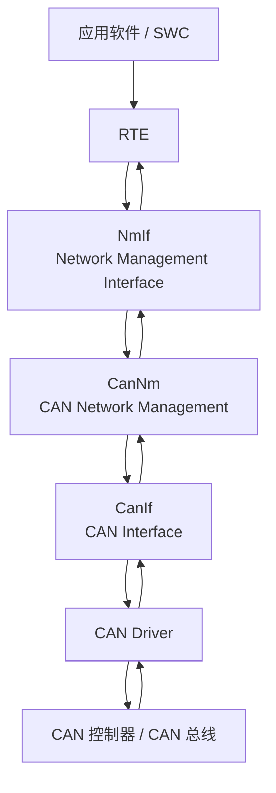

各模块可以简单理解为：

| 模块 | 作用 |
|---|---|
| `SWC / Application` | 表示 ECU 是否需要网络 |
| `NmIf` | 对上层提供统一的网络管理接口 |
| `CanNm` | 实现 CAN 网络管理状态机 |
| `CanIf` | 负责 CAN PDU 的收发抽象 |
| `CAN Driver` | 操作具体 CAN 控制器 |
| CAN 总线 | 传输 NM 报文和普通应用报文 |

---

## 3. 最核心的通信方式：周期性 NM 报文

CanNm 节点会周期性发送一种特殊的 CAN 报文，称为：

> **Network Management PDU，简称 NM PDU**

NM PDU 的作用不是传输业务数据，而是告诉网络中的其他 ECU：

> “我还活跃着，我还希望网络保持唤醒。”

示意如下：

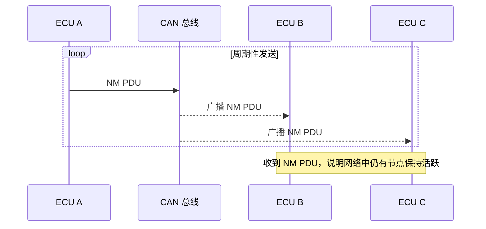

注意：

- NM PDU 一般通过 CAN 广播；
- CAN 网络中的其他节点可以监听到；
- 收到 NM PDU 会刷新网络超时定时器；
- 如果长时间没有收到 NM PDU，节点会认为网络可能已经可以休眠。

---

## 4. CanNm 的三层状态结构

CanNm 对外提供三个主要的**工作模式**：

1. `Network Mode`：网络运行模式
2. `Prepare Bus-Sleep Mode`：准备总线休眠模式
3. `Bus-Sleep Mode`：总线休眠模式

其中，`Network Mode` 内部又分为三个状态：

1. `Repeat Message State`
2. `Normal Operation State`
3. `Ready Sleep State`

整体结构如下：

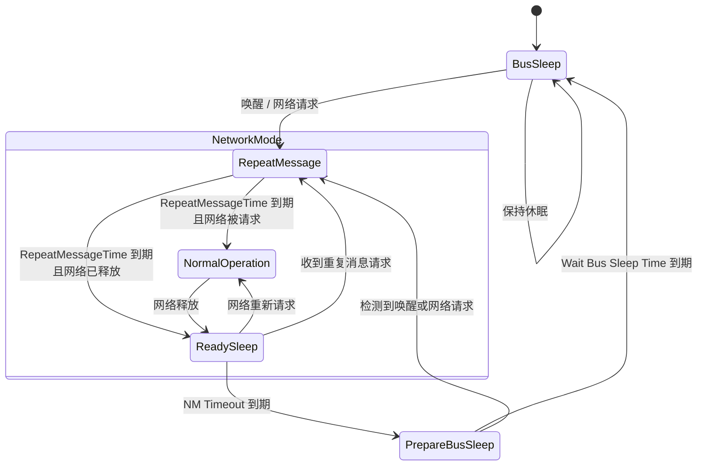

> 状态切换的具体条件和配置参数由 CanNm 规范定义。`Network Mode` 包含 Repeat Message、Normal Operation 和 Ready Sleep 三个内部状态。

---

# 5. 各个状态的通俗解释

## 5.1 Bus-Sleep Mode：总线休眠

这是最低功耗状态。

此时通常表现为：

- CAN 控制器处于休眠或低功耗状态；
- 不主动发送 NM PDU；
- ECU 等待唤醒事件；
- ECU 可以由本地事件、CAN 总线活动或其他硬件机制唤醒。

可以把它理解为：

> “大家都睡了，暂时没有网络通信需求。”


---

## 5.2 Repeat Message State：重复消息状态

这是 ECU 刚从休眠或准备休眠状态唤醒后进入的状态。

它的主要目的有三个：

1. **通知其他节点：我已经醒了**
2. **确保唤醒过程持续一段时间**
3. **帮助节点发现网络中有哪些 ECU**

在该状态中，CanNm 通常会快速、连续地发送 NM PDU。

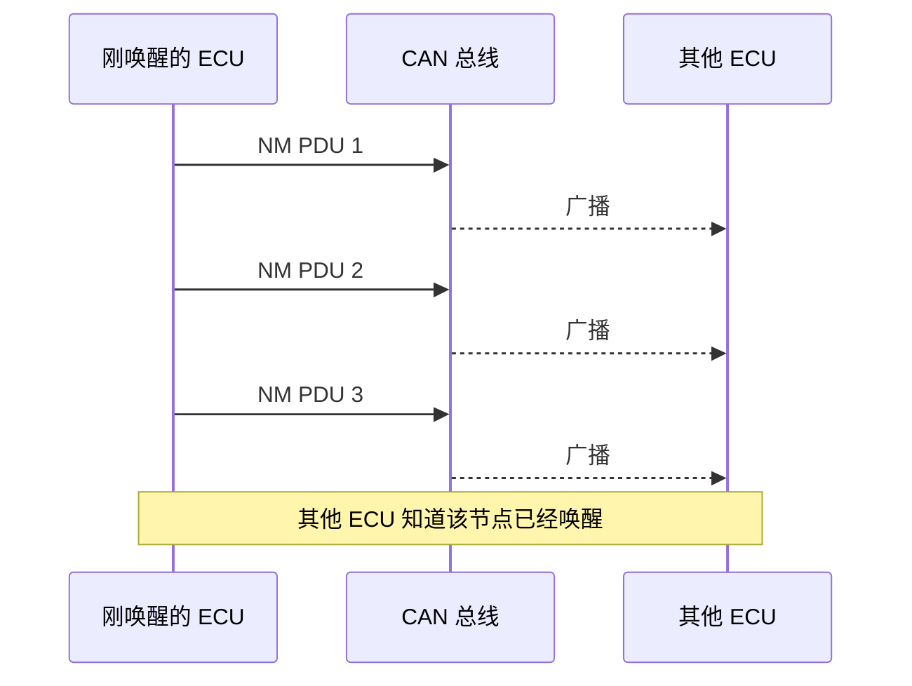

该状态会持续一个可配置的时间：

```text
CanNmRepeatMessageTime
```

时间结束后：

- 如果本 ECU 仍然需要网络，进入 `Normal Operation State`；
- 如果本 ECU 已经不需要网络，进入 `Ready Sleep State`。

---

## 5.3 Normal Operation State：正常运行状态

这是网络正常运行的状态。

在该状态中：

- ECU 需要网络通信；
- ECU 周期性发送 NM PDU；
- 其他节点收到 NM PDU 后刷新自己的 NM 超时定时器；
- 只要网络仍被请求，ECU 就继续维持网络唤醒。

可以理解为：

> “我现在还要用网络，请不要睡。”

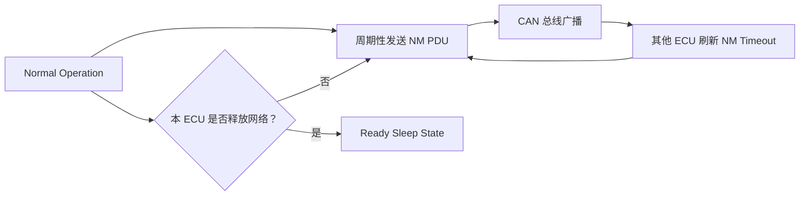

如果当前 ECU 调用：

```c
CanNm_NetworkRequest()
```

表示：

> 请求网络保持唤醒。

如果调用：

```c
CanNm_NetworkRelease()
```

表示：

> 本 ECU 不再需要网络。

但需要特别注意：

> 一个 ECU 调用 `CanNm_NetworkRelease()`，并不代表整个 CAN 网络立即休眠。只要其他 ECU 仍然发送 NM PDU，网络就会继续保持运行。

---

## 5.4 Ready Sleep State：准备睡眠状态

这是“本 ECU 想睡，但还不能立刻睡”的状态。

进入该状态后：

- 本 ECU 通常停止发送 NM PDU；
- 但仍然监听其他 ECU 的 NM PDU；
- 如果收到其他 ECU 的 NM PDU，说明网络仍有人需要；
- 如果在规定时间内一直没有收到 NM PDU，才进入准备休眠流程。

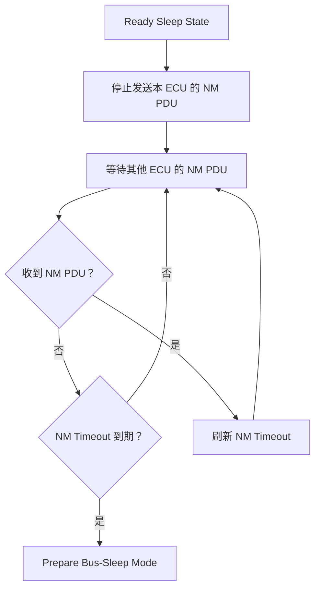

因此，`Ready Sleep State` 具有一个重要特点：

> **本 ECU 不主动维持网络，但会因为其他 ECU 仍然活跃而继续等待。**

---

## 5.5 Prepare Bus-Sleep Mode：准备总线休眠

这个状态可以看成一个“最后确认阶段”。

目的主要是：

- 给网络一个稳定过渡时间；
- 防止刚刚没有收到报文就立即关闭 CAN；
- 等待可能迟到的 NM 报文；
- 执行进入总线休眠前的必要处理。

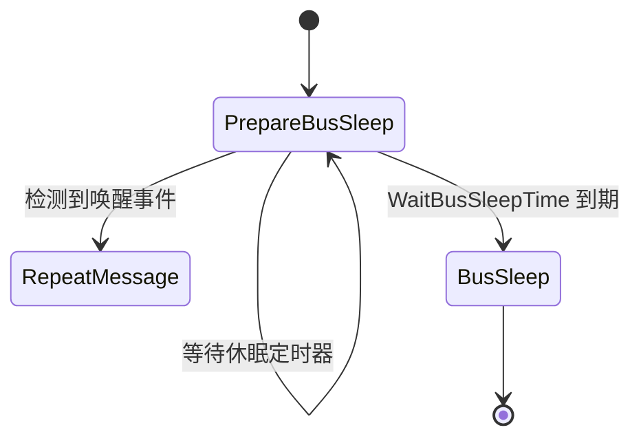

该状态的持续时间通常由参数控制，例如：

```text
CanNmWaitBusSleepTime
```

如果在该阶段检测到网络重新请求或唤醒事件，则不会进入真正的休眠，而是重新进入网络模式。

---

# 6. 一个完整的睡眠流程

下面用一个简单场景说明：

- ECU A、B、C 都在运行；
- ECU A 和 B 先释放网络；
- ECU C 最后释放网络；
- 网络最终进入休眠。

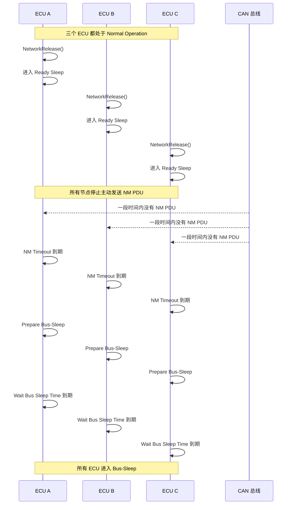

---

# 7. 一个 ECU 仍然活跃时会怎样？

假设 ECU A 和 B 已经准备睡眠，但 ECU C 仍然需要网络。

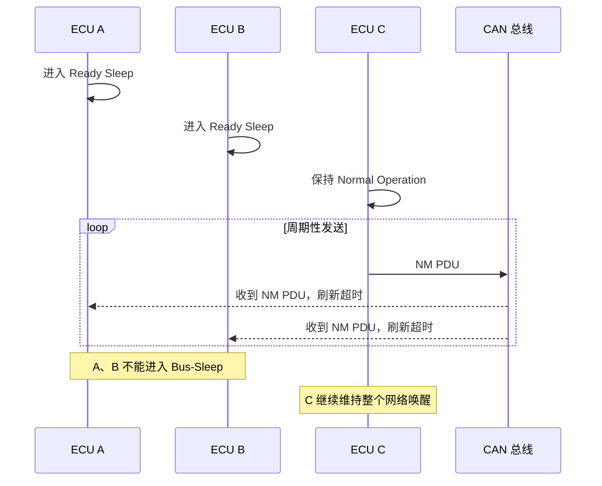

这就是 CanNm 的核心逻辑：

> **网络是否休眠，不是由单个 ECU 决定，而是由整个网络中是否还有 NM 活动共同决定。**

---

# 8. 网络唤醒流程

当 ECU 处于休眠状态时，如果应用重新需要通信，可以发起网络请求。

典型流程如下：

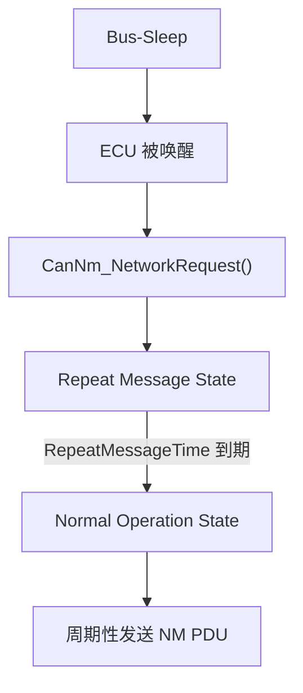

唤醒后先进入 `Repeat Message State`，而不是直接进入正常运行状态，主要是为了让网络中的其他节点知道：

> “有 ECU 醒来了，网络可能需要重新工作。”

---

# 9. NM PDU 中通常携带什么信息？

NM PDU 通常包含以下几类信息：

| 信息 | 用途 |
|---|---|
| 源节点标识 | 标识哪个 ECU 发送了报文 |
| 控制位向量 CBV | 携带网络管理控制信息 |
| Repeat Message 请求位 | 请求节点重新进入重复消息状态 |
| 协调睡眠相关信息 | 某些配置下用于协调网络休眠 |
| 用户数据区域 | 可选，用于特定配置或扩展 |

需要注意：

- NM PDU 的具体布局由配置和 CAN NM 协议定义；
- 不同 ECU 的节点标识可以帮助进行节点检测；
- 控制位用于实现特定的网络管理功能；
- 并不是所有可选功能都一定启用。

---

# 10. 重要定时器

CanNm 的行为高度依赖定时器。常见定时器如下：

## 10.1 NM 消息周期

```text
CanNmMsgCycleTime
```

表示正常情况下 NM PDU 的发送周期。

例如：

```text
每 100 ms 发送一次 NM PDU
```

---

## 10.2 Repeat Message 时间

```text
CanNmRepeatMessageTime
```

表示 ECU 进入 `Repeat Message State` 后，需要保持该状态多长时间。

作用：

- 保证唤醒信息被其他节点看到；
- 发送多次 NM PDU；
- 给网络节点检测留下时间。

---

## 10.3 NM 超时时间

```text
CanNmTimeoutTime
```

表示在 `Ready Sleep State` 中，ECU 等待其他节点 NM PDU 的最长时间。

如果超时仍没有收到 NM PDU：

```text
Ready Sleep State
        ↓
Prepare Bus-Sleep Mode
```

---

## 10.4 总线休眠等待时间

```text
CanNmWaitBusSleepTime
```

表示进入 `Prepare Bus-Sleep Mode` 后，距离真正进入 `Bus-Sleep Mode` 的等待时间。

---

## 10.5 立即发送周期

某些配置中，ECU 刚进入网络模式时会采用更快的发送周期，称为立即 NM 发送机制。

例如：


这样可以更快地通知网络中的其他节点。

---

# 11. 网络请求与网络释放

CanNm 对上层通常提供两个非常关键的服务：

## 11.1 请求网络

```c
CanNm_NetworkRequest()
```

含义：

> 当前 ECU 需要网络保持唤醒。

可能产生的状态变化：

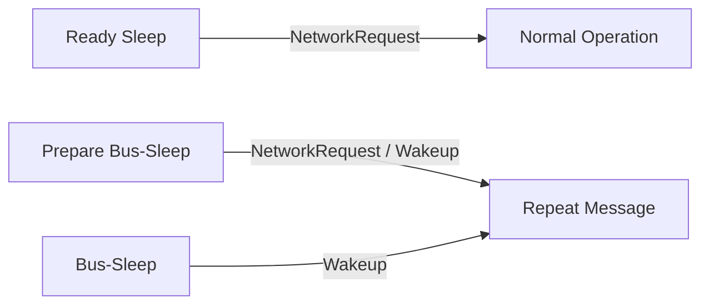

---

## 11.2 释放网络

```c
CanNm_NetworkRelease()
```

含义：

> 当前 ECU 暂时不再需要网络。

可能产生的状态变化：

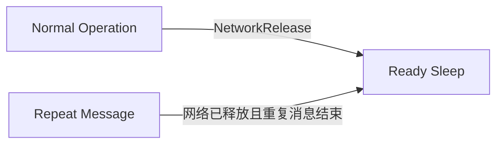

释放网络只是释放**本 ECU 的请求**，不会强制其他 ECU 休眠。

---

# 12. CanNm 的典型状态变化表

| 当前状态 | 触发条件 | 下一状态 |
|---|---|---|
| `Bus-Sleep` | 检测到唤醒 | `Repeat Message` |
| `Repeat Message` | 重复消息时间到期，且网络被请求 | `Normal Operation` |
| `Repeat Message` | 重复消息时间到期，且网络已释放 | `Ready Sleep` |
| `Normal Operation` | 网络释放 | `Ready Sleep` |
| `Ready Sleep` | 网络重新请求 | `Normal Operation` |
| `Ready Sleep` | 收到重复消息请求 | `Repeat Message` |
| `Ready Sleep` | NM 超时 | `Prepare Bus-Sleep` |
| `Prepare Bus-Sleep` | 重新检测到唤醒 | `Repeat Message` |
| `Prepare Bus-Sleep` | 休眠等待时间到期 | `Bus-Sleep` |

---

# 13. 主动模式与被动模式

CanNm 可以配置为主动模式或被动模式。

## 13.1 主动模式

主动模式下，CanNm 可以：

- 主动发送 NM PDU；
- 参与网络唤醒；
- 维持网络处于运行状态；
- 参与完整的睡眠协调。


---

## 13.2 被动模式

被动模式下，ECU 通常：

- 不主动发送 NM PDU；
- 只监听其他节点发送的 NM PDU；
- 根据接收到的 NM PDU 判断网络是否仍在运行；
- 适用于某些不希望主动影响网络管理的 ECU。


简单地说：

> 主动模式是“我可以喊话，也可以听”；被动模式是“我主要负责听”。

---

# 14. CanNm 与普通 CAN 应用报文的区别

| 对比项目 | 普通应用报文 | NM 报文 |
|---|---|---|
| 目的 | 传输业务数据 | 管理网络状态 |
| 例子 | 车速、转向角、温度 | 节点唤醒、保持网络运行 |
| 是否周期发送 | 取决于应用 | 通常周期发送 |
| 是否影响休眠 | 间接影响 | 直接参与网络休眠协调 |
| 接收后的典型动作 | 更新信号 | 刷新 NM 超时定时器、改变状态 |

可以这样理解：

- 应用报文回答：**“车辆功能数据是什么？”**
- NM 报文回答：**“网络现在是否还需要保持醒着？”**

---

# 15. 初始化时的默认状态

CanNm 初始化成功后，通常会：

- 将网络状态设置为 `released`；
- 进入 `Bus-Sleep Mode`；
- 等待唤醒或网络请求；
- 初始化各种 NM 定时器和内部状态。

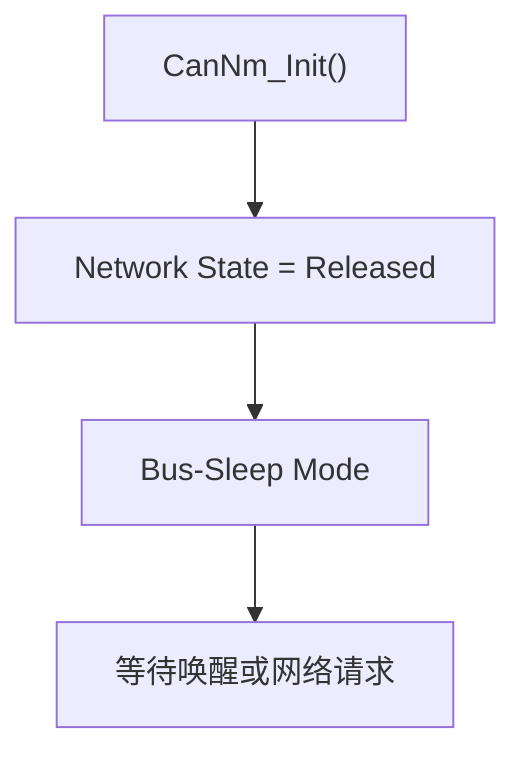

规范中明确规定，CanNm 初始化后默认进入 Bus-Sleep Mode，网络状态默认为 released。

---

# 16. 一个生活化类比

可以把 CAN 网络想象成一间会议室：

| CanNm 概念 | 生活类比 |
|---|---|
| CAN 网络 | 会议室 |
| ECU | 参会人员 |
| NM PDU | “我还在会议中”的定期回应 |
| Network Request | “我还要继续开会” |
| Network Release | “我暂时不需要开会了” |
| Ready Sleep | “我准备离开，但先看看别人是否还在” |
| Prepare Bus-Sleep | “大家确认一下是否真的要关灯” |
| Bus-Sleep | “会议室关灯、上锁” |
| Repeat Message | “有人重新进会议室，先通知大家” |

整个规则就是：

> 只要还有一个人说“我还要开会”，会议室就不能关灯；只有所有人都不再回应，经过等待时间后，会议室才可以关闭。

---

# 17. 工程上最需要关注的配置项

实际配置 CanNm 时，通常需要重点关注：

```text
CanNmMsgCycleTime
CanNmRepeatMessageTime
CanNmTimeoutTime
CanNmWaitBusSleepTime
CanNmNodeId
CanNmNodeDetectionEnabled
CanNmPassiveModeEnabled
CanNmImmediateNmTransmissions
CanNmImmediateNmCycleTime
CanNmRemoteSleepIndEnabled
CanNmRepeatMsgIndEnabled
```

其中最容易配置错误的是：

1. `CanNmRepeatMessageTime` 太短  
   - 可能导致刚唤醒就快速离开 Repeat Message State；
   - 其他节点可能无法稳定检测到该 ECU。

2. `CanNmTimeoutTime` 太短  
   - 可能误判网络已经空闲；
   - 造成 ECU 过早进入休眠。

3. `CanNmTimeoutTime` 太长  
   - 网络释放后等待时间过长；
   - 增加功耗和休眠延迟。

4. NM PDU 周期和超时时间不匹配  
   - 如果 NM 周期接近或超过超时时间，容易产生误超时。

一个简单的关系通常应满足：

```text
CanNmTimeoutTime > CanNmMsgCycleTime
```

工程中还需要结合 CAN 总线负载、报文丢失容忍度和系统休眠时间要求进行配置。

---

# 18. 最终总结

CanNm 的核心原理可以浓缩为下面几句话：

1. **每个 ECU 都可以独立请求网络保持唤醒。**
2. **需要网络的 ECU 周期性发送 NM PDU。**
3. **其他 ECU 收到 NM PDU 后，知道网络中仍有节点活跃。**
4. **不再需要网络的 ECU 停止发送 NM PDU，进入 Ready Sleep。**
5. **如果一段时间内所有节点都没有 NM PDU，网络进入准备休眠。**
6. **等待确认时间结束后，所有 ECU 进入 Bus-Sleep。**
7. **任何新的网络请求或唤醒事件，都可以重新启动网络。**

整体逻辑如下：

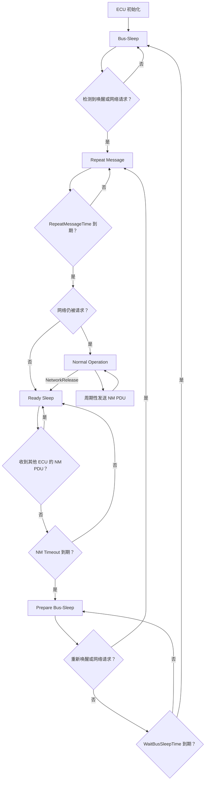

> 一句话概括：  
> **CanNm 是通过周期性 NM 报文和分布式状态机，让多个 CAN ECU 协调完成“谁保持网络唤醒、何时统一休眠以及如何重新唤醒”。**