# AUTOSAR CanSM (CAN State Manager) 模块详解

> **版本**: AUTOSAR R4.2/R4.4  
> **适用**: 所有基于CAN通信的AUTOSAR系统  
> **本文定位**: 从通俗理解→设计机制→深入原理，逐层递进

---

## 目录

1. [通俗理解：CanSM 是什么？](#1-通俗理解cansm-是什么)
2. [核心功能概述](#2-核心功能概述)
3. [模块架构与位置](#3-模块架构与位置)
4. [状态机详解](#4-状态机详解)
5. [关键API函数](#5-关键api函数)
6. [设计机制与模式](#6-设计机制与模式)
7. [深入原理：实现细节](#7-深入原理实现细节)
8. [完整代码示例](#8-完整代码示例)
9. [与ComM的交互流程](#9-与comm的交互流程)
10. [常见问题与调试](#10-常见问题与调试)

---

## 1. 通俗理解：CanSM 是什么？

### 一句话概括

**CanSM (CAN State Manager)** 是 AUTOSAR 中专门负责管理 CAN 通信控制器状态的模块。它就像一个"交通管制员"，决定 CAN 控制器何时**唤醒**、**启动通信**、**进入睡眠**或**处理总线离线**。

### 生活中的类比

想象你经营一家**24小时便利店**：

| 角色 | 类比对象 | 说明 |
|:---|:---|:---|
| **CanSM** | 店长 | 决定店铺何时开门/关门/补货 |
| **CAN控制器** | 店铺大门 | 执行开/关动作 |
| **CAN总线** | 门外的街道 | 车辆（报文）通行的道路 |
| **ComM** | 区域经理 | 管理多个店铺（网络）的运营策略 |
| **CanTrcv (收发器)** | 店门电机 | 实际执行开门/关门的设备 |

- **店铺打烊** → CanSM 控制 CAN 控制器进入 Sleep 模式
- **开店营业** → CanSM 控制 CAN 控制器进入 Normal 模式
- **门口堵车处理** → CanSM 检测到 Bus-Off，执行恢复流程
- **夜间值班模式** → CanSM 控制进入 Polling 或 Wait 模式

---

## 2. 核心功能概述

CanSM 在 AUTOSAR 架构中承担以下核心职责：

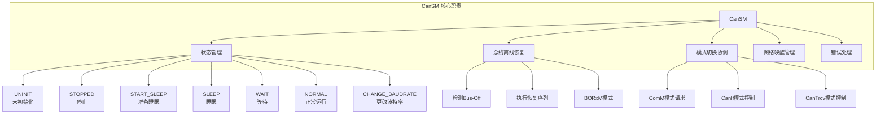

### 功能清单

| 功能 | 描述 | 关联模块 |
|:---|:---|:---|
| **通信模式管理** | 控制CAN控制器在 Normal/Stop/Sleep 间切换 | ComM, CanIf |
| **总线离线恢复** | 检测 Bus-Off 并执行多模式恢复策略 | Can, CanIf |
| **波特率切换** | 运行时切换 CAN 通信波特率 | Can |
| **唤醒验证** | 验证唤醒源的有效性（Local/Remote） | CanIf, CanTrcv, EcuM |
| **收发器控制** | 控制 CAN 收发器的模式 | CanTrcv |
| **被动错误处理** | 处理 CAN 节点的被动错误状态 | Can |

---

## 3. 模块架构与位置

### 3.1 在 AUTOSAR 分层架构中的位置

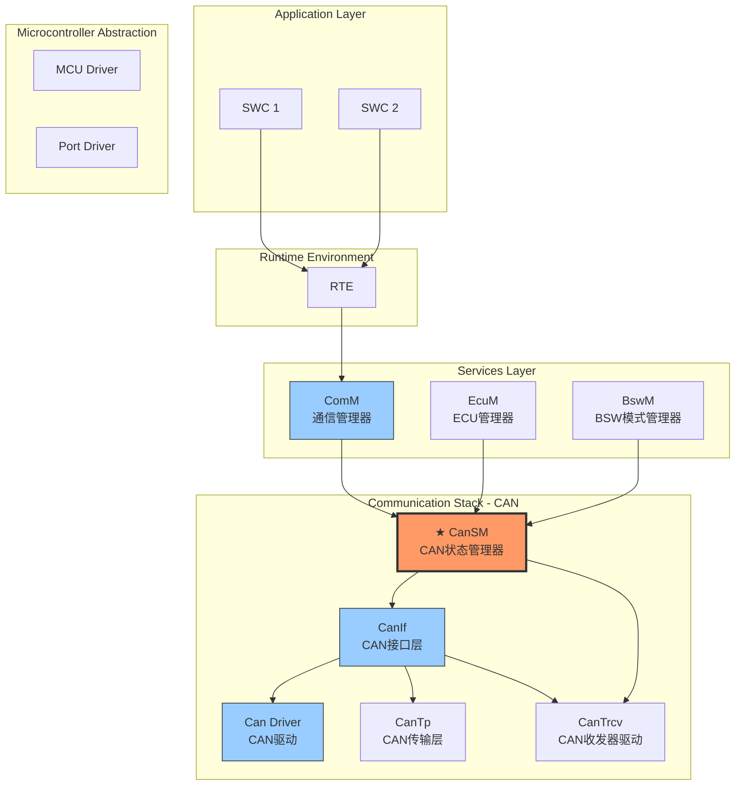

### 3.2 模块间依赖关系

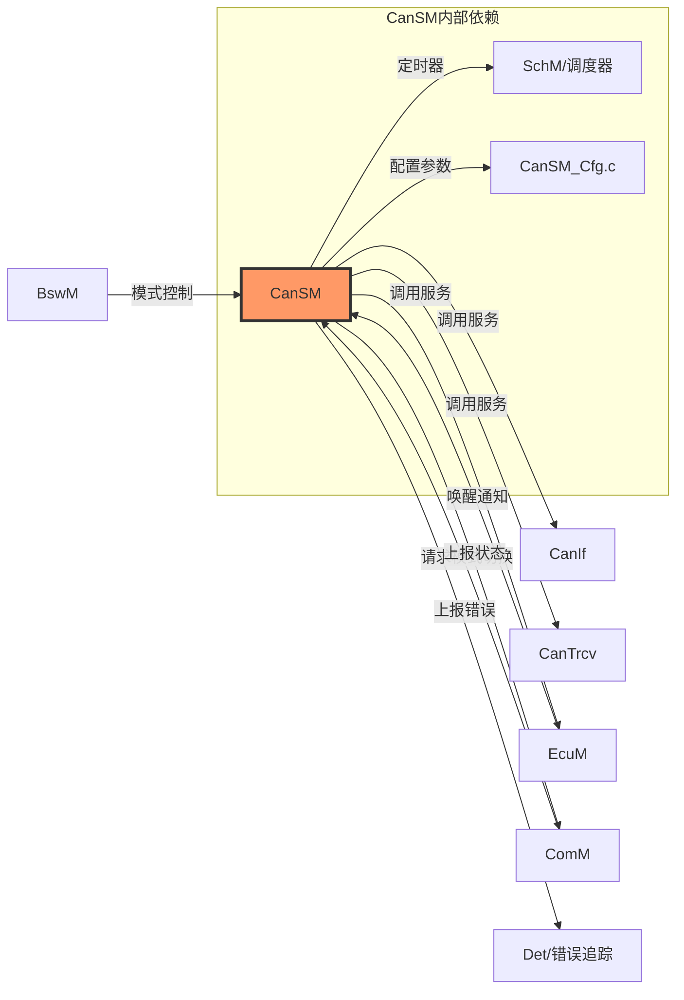

### 3.3 数据流与控制流

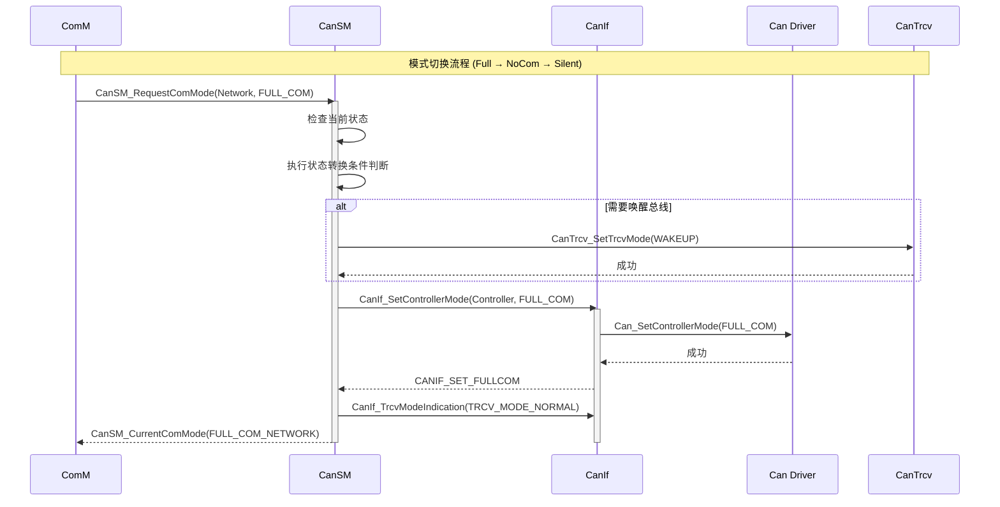

---

## 4. 状态机详解

### 4.1 CanSM 状态总览

CanSM 管理每个 CAN 控制器（CAN Controller）的通信状态。每个控制器拥有独立的状态机实例。

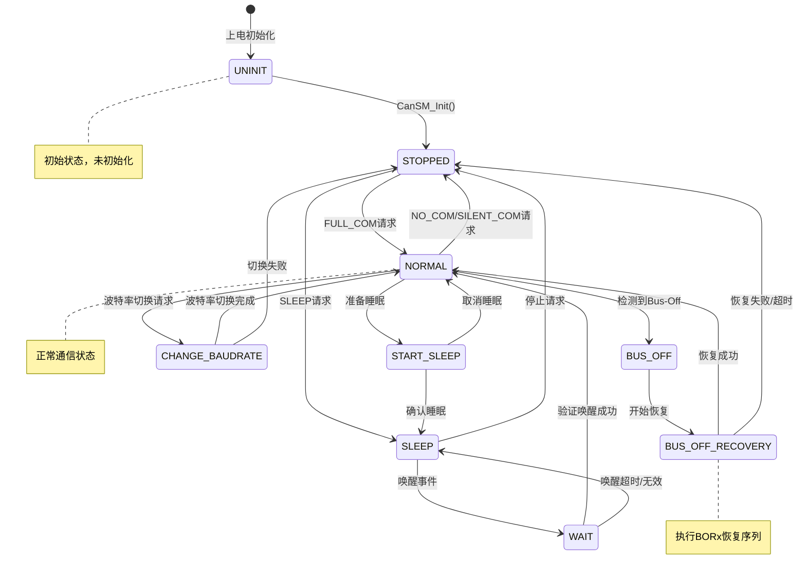

### 4.2 状态转换条件详解

| 当前状态 | 目标状态 | 触发条件 | 动作 |
|:---|:---|:---|:---|
| UNINIT | STOPPED | `CanSM_Init()` 调用 | 初始化内部变量、定时器 |
| STOPPED | NORMAL | ComM 请求 FULL_COM | 调用 `CanIf_SetControllerMode( FULL_COM)` |
| NORMAL | STOPPED | ComM 请求 NO_COM | 停止通信，调用 `CanIf_SetControllerMode(STOPPED)` |
| NORMAL | START_SLEEP | ComM 请求 SLEEP | 启动预睡眠定时器 |
| START_SLEEP | SLEEP | 定时器超时，无唤醒事件 | 通知 CanTrcv 进入 Sleep |
| SLEEP | WAIT | 检测到唤醒事件（本地/远程） | 验证唤醒源 |
| WAIT | NORMAL | 唤醒验证成功 | 恢复通信 |
| WAIT | SLEEP | 唤醒验证超时/失败 | 返回睡眠 |
| NORMAL | BUS_OFF | CanIf 报告 Bus-Off 状态 | 启动 Bus-Off 恢复 |
| BUS_OFF | BUS_OFF_RECOVERY | 恢复定时器触发 | 执行 BOR 序列 |
| NORMAL | CHANGE_BAUDRATE | 波特率切换请求 | 暂停通信，重新配置 |

### 4.3 总线离线恢复 (Bus-Off Recovery)

Bus-Off 恢复是 CanSM 最核心的机制之一，支持三种恢复模式：

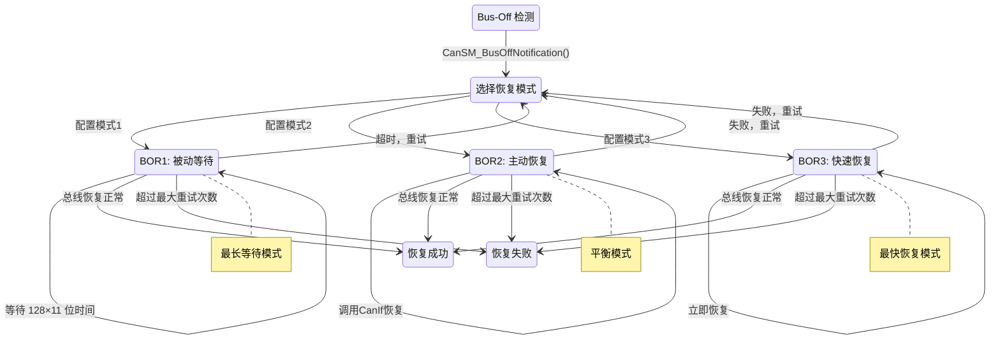

**三种恢复模式的对比：**

| 特性 | BOR1 (模式1) | BOR2 (模式2) | BOR3 (模式3) |
|:---|:---|:---|:---|
| **恢复速度** | 最慢 | 中等 | 最快 |
| **总线负载** | 最低 | 中等 | 最高 |
| **重试间隔** | 长 (128×11位时间) | 中等 | 短 (立即重试) |
| **适用场景** | 安全关键系统 | 一般系统 | 实时性要求高 |
| **配置参数** | `CanSMBOR1Time` | `CanSMBOR2Time` | `CanSMBOR3Time` |

---

## 5. 关键API函数

### 5.1 函数分类

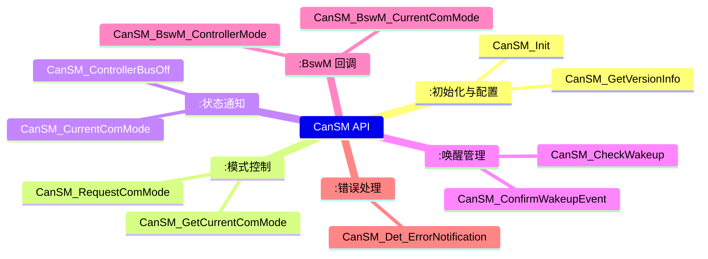

### 5.2 核心API详解

#### CanSM_Init

```c
/* 函数原型 */
void CanSM_Init(const CanSM_ConfigType *ConfigPtr);

/* 功能：初始化 CanSM 模块 */
/* 参数：ConfigPtr - 指向配置结构体的指针 */
/* 说明：初始化所有内部状态，设置定时器，注册回调 */
```

#### CanSM_RequestComMode

```c
/* 函数原型 */
Std_ReturnType CanSM_RequestComMode(
    NetworkHandleType Network,
    CanSM_ComModeType ComMode
);

/* 参数说明 */
/* Network - CAN网络句柄 (0, 1, 2, ...) */
/* ComMode - 请求的通信模式：
 *   CANSM_FULL_COM     - 全通信模式
 *   CANSM_SILENT_COM   - 静默模式（监听但不发送）
 *   CANSM_NO_COM       - 无通信模式
 *   CANSM_SLEEP_COM    - 睡眠模式
 */

/* 返回值：E_OK  - 请求已接受 */
/*         E_NOT_OK - 请求被拒绝 */
```

#### CanSM_GetCurrentComMode

```c
/* 函数原型 */
Std_ReturnType CanSM_GetCurrentComMode(
    NetworkHandleType Network,
    CanSM_ComModeType *ComModePtr
);

/* 功能：获取当前通信模式 */
/* 返回值：E_OK - 成功返回当前模式 */
```

#### CanSM_ControllerBusOff

```c
/* 函数原型 */
void CanSM_ControllerBusOff(
    uint8 ControllerId
);

/* 功能：处理 Bus-Off 中断回调 */
/* 说明：Can模块检测到Bus-Off后，通过CanIf通知CanSM */
/* 触发：CanSM内部启动Bus-Off恢复定时器 */
```

### 5.3 回调函数

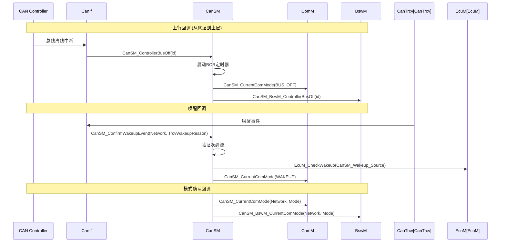

---

## 6. 设计机制与模式

### 6.1 设计模式分析

CanSM 模块的设计体现了多种经典的设计模式：

| 设计模式 | 应用方式 | 好处 |
|:---|:---|:---|
| **状态模式 (State Pattern)** | 每个控制器拥有独立状态机 | 状态转换清晰，新增状态容易 |
| **观察者模式 (Observer)** | 通过回调通知 ComM、BswM | 解耦模块间依赖 |
| **策略模式 (Strategy)** | Bus-Off 恢复支持 BOR1/2/3 | 运行时选择恢复策略 |
| **命令模式 (Command)** | 模式请求通过函数调用封装 | 请求队列化，异步处理 |
| **单例模式 (Singleton)** | 全局只有一个 CanSM 实例 | 统一管理所有 CAN 控制器 |

### 6.2 状态机设计思想

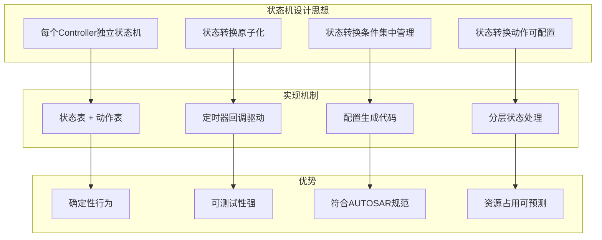

### 6.3 唤醒管理机制

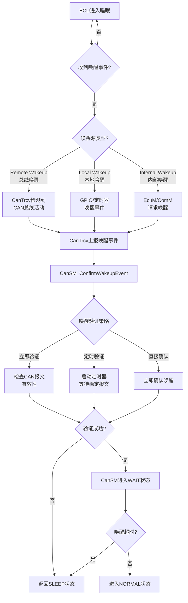

---

## 7. 深入原理：实现细节

### 7.1 内部数据结构

CanSM 内部维护的核心数据结构：

```c
/* CanSM 控制器状态结构体 */
typedef struct {
    /* 当前状态 */
    CanSM_ControllerStateType           CurrentState;
    
    /* 请求的目标模式 */
    CanSM_ComModeType                   RequestedMode;
    
    /* 当前通信模式 */
    CanSM_ComModeType                   CurrentComMode;
    
    /* 前一个状态（用于状态回滚） */
    CanSM_ControllerStateType           PreviousState;
    
    /* Bus-Off 恢复计数器 */
    uint8                               BORCounter;
    
    /* Bus-Off 恢复模式 */
    CanSM_BORModeType                   BORMode;
    
    /* 唤醒验证定时器 */
    uint32                              WakeupValidationTimer;
    
    /* 预睡眠定时器 */
    uint32                              PreSleepTimer;
    
    /* 控制器ID */
    uint8                               ControllerId;
    
    /* 网络句柄 */
    NetworkHandleType                   NetworkHandle;
    
    /* 状态转换标志 */
    boolean                             TransitionPending;
    
    /* 错误状态 */
    CanSM_ErrorStatusType               ErrorStatus;
    
} CanSM_ControllerStateType;

/* CanSM 全局数据结构 */
typedef struct {
    /* 控制器状态数组（每个控制器一个） */
    CanSM_ControllerStateType           Controllers[CANSM_MAX_CONTROLLERS];
    
    /* 初始化标志 */
    boolean                             InitDone;
    
    /* 版本信息 */
    CanSM_VersionInfoType               VersionInfo;
    
    /* 模块状态 */
    CanSM_ModuleStateType               ModuleState;
    
} CanSM_GlobalStateType;

/* 状态 - 动作映射表 */
typedef struct {
    CanSM_ControllerStateType           CurrentState;
    CanSM_ComModeType                   RequestedMode;
    CanSM_InternalActionType            Action;
    CanSM_ControllerStateType           NextState;
} CanSM_StateTransitionType;
```

### 7.2 状态转换表实现

```c
/* 状态转换表（简化示例） */
static const CanSM_StateTransitionType CanSM_TransitionTable[] = {
    /* 当前状态      请求模式          动作                    下一状态    */
    { CANSM_STOPPED,  CANSM_FULL_COM,  CANSM_ACTION_SET_FULLCOM,  CANSM_NORMAL  },
    { CANSM_STOPPED,  CANSM_SLEEP_COM, CANSM_ACTION_SET_SLEEP,    CANSM_SLEEP   },
    { CANSM_NORMAL,   CANSM_NO_COM,    CANSM_ACTION_SET_STOPPED,  CANSM_STOPPED },
    { CANSM_NORMAL,   CANSM_SILENT_COM,CANSM_ACTION_SET_SILENT,   CANSM_NORMAL  },
    { CANSM_NORMAL,   CANSM_SLEEP_COM, CANSM_ACTION_START_SLEEP,  CANSM_START_SLEEP },
    { CANSM_NORMAL,   CANSM_FULL_COM,  CANSM_ACTION_NO_CHANGE,    CANSM_NORMAL  },
    { CANSM_START_SLEEP, CANSM_FULL_COM, CANSM_ACTION_CANCEL_SLEEP, CANSM_NORMAL },
    { CANSM_START_SLEEP, CANSM_SLEEP_COM, CANSM_ACTION_CONFIRM_SLEEP, CANSM_SLEEP },
    { CANSM_SLEEP,    CANSM_FULL_COM,  CANSM_ACTION_WAKEUP,       CANSM_WAIT    },
    { CANSM_WAIT,     CANSM_FULL_COM,  CANSM_ACTION_VERIFY_WAKEUP, CANSM_NORMAL },
    { CANSM_BUS_OFF,  CANSM_NO_COM,    CANSM_ACTION_BOR,          CANSM_BUS_OFF_RECOVERY },
    /* ... 更多状态转换 */
};

/* 查找状态转换 */
static const CanSM_StateTransitionType* CanSM_FindTransition(
    CanSM_ControllerStateType currentState,
    CanSM_ComModeType requestedMode)
{
    uint8 i;
    for (i = 0; i < sizeof(CanSM_TransitionTable)/sizeof(CanSM_TransitionTable[0]); i++)
    {
        if (CanSM_TransitionTable[i].CurrentState == currentState &&
            CanSM_TransitionTable[i].RequestedMode == requestedMode)
        {
            return &CanSM_TransitionTable[i];
        }
    }
    return NULL_PTR; /* 无效转换 */
}
```

### 7.3 定时器管理

CanSM 使用多个定时器实现状态机的时间驱动转换：

```c
/* CanSM 定时器管理数据结构 */
typedef struct {
    /* 预睡眠定时器（从 START_SLEEP → SLEEP） */
    uint32 PreSleepTimeout;       /* 配置值，单位：ms */
    uint32 PreSleepCounter;       /* 当前计数值 */
    
    /* Bus-Off 恢复定时器 */
    uint32 BORTimeout;            /* 配置值，单位：ms */
    uint32 BORCounter;            /* 当前计数值 */
    uint8  BORMaxRetries;         /* 最大重试次数 */
    
    /* 唤醒验证定时器 */
    uint32 WakeupValidationTimeout;  /* 配置值，单位：ms */
    uint32 WakeupValidationCounter;  /* 当前计数值 */
    
    /* 重复报文定时器 */
    uint32 RepeatMessageTimeout;  /* 配置值，单位：ms */
    uint32 RepeatMessageCounter;  /* 当前计数值 */
} CanSM_TimerType;

/* 定时器回调函数（由 SchM 周期性调用） */
void CanSM_MainFunction(void)
{
    uint8 i;
    
    for (i = 0; i < CANSM_MAX_CONTROLLERS; i++)
    {
        CanSM_ControllerStateType *ctrl = &CanSM_GlobalState.Controllers[i];
        
        switch (ctrl->CurrentState)
        {
            case CANSM_START_SLEEP:
                /* 检查预睡眠超时 */
                if (CanSM_CheckPreSleepTimeout(i))
                {
                    CanSM_ExecuteTransition(i, CANSM_TRANS_SLEEP_TIMEOUT);
                }
                break;
                
            case CANSM_BUS_OFF_RECOVERY:
                /* 检查 Bus-Off 恢复定时器 */
                if (CanSM_CheckBORTimer(i))
                {
                    CanSM_ExecuteBORStep(i);
                }
                break;
                
            case CANSM_WAIT:
                /* 检查唤醒验证超时 */
                if (CanSM_CheckWakeupTimer(i))
                {
                    CanSM_ExecuteTransition(i, CANSM_TRANS_WAKEUP_TIMEOUT);
                }
                break;
                
            default:
                /* 其他状态不需要定时器处理 */
                break;
        }
    }
}
```

### 7.4 Bus-Off 恢复算法源码

```c
/* CanSM Bus-Off 恢复实现 */

/**
 * 功能：处理 Bus-Off 事件
 * 触发条件：CanIf 检测到 CAN 控制器进入 Bus-Off 状态
 */
void CanSM_ControllerBusOff(uint8 ControllerId)
{
    CanSM_ControllerStateType *ctrl;
    
    /* 参数校验 */
    if (ControllerId >= CANSM_MAX_CONTROLLERS)
    {
        CanSM_ReportError(CANSM_E_PARAM_CONTROLLERID, ControllerId);
        return;
    }
    
    ctrl = &CanSM_GlobalState.Controllers[ControllerId];
    
    /* 更新状态 */
    ctrl->PreviousState = ctrl->CurrentState;
    ctrl->CurrentState = CANSM_BUS_OFF;
    ctrl->BORCounter = 0;
    
    /* 选择 Bus-Off 恢复模式 */
    ctrl->BORMode = CanSM_Cfg_BORMode[ControllerId];
    
    /* 通知 CanIf 停止该控制器 */
    CanIf_SetControllerMode(ControllerId, CANIF_CS_STOPPED);
    
    /* 启动 Bus-Off 恢复定时器 */
    CanSM_StartBORTimer(ControllerId, CanSM_Cfg_BORTime[ctrl->BORMode]);
    
    /* 通知上层模块 */
    CanSM_CurrentComMode(ctrl->NetworkHandle, CANSM_BUS_OFF);
    CanSM_BswM_CurrentComMode(ctrl->NetworkHandle, CANSM_BUS_OFF);
}

/**
 * 功能：执行 Bus-Off 恢复步骤
 * 调用：由 CanSM_MainFunction 定时器触发
 */
static void CanSM_ExecuteBORStep(uint8 ControllerId)
{
    CanSM_ControllerStateType *ctrl = &CanSM_GlobalState.Controllers[ControllerId];
    Std_ReturnType result;
    
    /* 检查重试次数 */
    if (ctrl->BORCounter >= CanSM_Cfg_BORMaxRetries[ctrl->BORMode])
    {
        /* 超过最大重试次数，放弃恢复 */
        ctrl->CurrentState = CANSM_STOPPED;
        ctrl->ErrorStatus = CANSM_BUS_OFF_RECOVERY_FAILED;
        
        CanSM_CurrentComMode(ctrl->NetworkHandle, CANSM_NO_COM);
        CanSM_ReportError(CANSM_E_BUS_OFF_RECOVERY_FAILED, ControllerId);
        return;
    }
    
    /* 根据恢复模式执行不同策略 */
    switch (ctrl->BORMode)
    {
        case CANSM_BOR_MODE_1:
            /* BOR1: 被动等待（128×11位时间）后恢复 */
            result = CanIf_SetControllerMode(ControllerId, CANIF_CS_STARTED);
            break;
            
        case CANSM_BOR_MODE_2:
            /* BOR2: 主动恢复 - 停止后快速重新启动 */
            result = CanIf_SetControllerMode(ControllerId, CANIF_CS_STOPPED);
            if (result == E_OK)
            {
                result = CanIf_SetControllerMode(ControllerId, CANIF_CS_STARTED);
            }
            break;
            
        case CANSM_BOR_MODE_3:
            /* BOR3: 快速恢复 - 立即重新启动 */
            result = CanIf_SetControllerMode(ControllerId, CANIF_CS_STARTED);
            if (result != E_OK)
            {
                /* 如果失败，尝试先停止再启动 */
                CanIf_SetControllerMode(ControllerId, CANIF_CS_STOPPED);
                result = CanIf_SetControllerMode(ControllerId, CANIF_CS_STARTED);
            }
            break;
            
        default:
            result = E_NOT_OK;
            break;
    }
    
    ctrl->BORCounter++;
    
    if (result == E_OK)
    {
        /* 恢复成功 */
        ctrl->CurrentState = CANSM_NORMAL;
        ctrl->ErrorStatus = CANSM_NO_ERROR;
        
        CanSM_CurrentComMode(ctrl->NetworkHandle, CANSM_FULL_COM);
        CanSM_BswM_CurrentComMode(ctrl->NetworkHandle, CANSM_FULL_COM);
    }
    else
    {
        /* 恢复失败，继续重试 */
        CanSM_StartBORTimer(ControllerId, CanSM_Cfg_BORTime[ctrl->BORMode]);
    }
}
```

### 7.5 唤醒验证机制

```c
/* 唤醒验证实现 */

/**
 * 功能：确认唤醒事件
 * 调用：CanIf 检测到唤醒事件后调用
 */
void CanSM_ConfirmWakeupEvent(
    NetworkHandleType Network,
    CanSM_WakeupSourceType Source)
{
    CanSM_ControllerStateType *ctrl;
    uint8 controllerId = CanSM_GetControllerId(Network);
    
    if (controllerId >= CANSM_MAX_CONTROLLERS)
    {
        return;
    }
    
    ctrl = &CanSM_GlobalState.Controllers[controllerId];
    
    /* 只有在 SLEEP 状态才处理唤醒 */
    if (ctrl->CurrentState != CANSM_SLEEP)
    {
        return;
    }
    
    /* 保存唤醒源 */
    ctrl->WakeupSource = Source;
    
    /* 根据唤醒验证策略执行 */
    switch (CanSM_Cfg_WakeupVerificationType[Network])
    {
        case CANSM_WAKEUP_VERIFY_IMMEDIATE:
            /* 立即验证 - 检查是否有有效报文 */
            CanSM_VerifyWakeupImmediate(Network, Source);
            break;
            
        case CANSM_WAKEUP_VERIFY_TIMED:
            /* 定时验证 - 等待一段时间检查报文稳定性 */
            ctrl->CurrentState = CANSM_WAIT;
            CanSM_StartWakeupTimer(Network, 
                CanSM_Cfg_WakeupValidationTime[Network]);
            break;
            
        case CANSM_WAKEUP_VERIFY_NONE:
            /* 直接确认唤醒 */
            ctrl->CurrentState = CANSM_WAIT;
            CanSM_CompleteWakeup(Network);
            break;
    }
    
    /* 通知 EcuM 唤醒事件 */
    EcuM_CheckWakeup(CanSM_Cfg_EcuMWakeupSource[Network]);
}

/**
 * 功能：完成唤醒验证，进入 NORMAL 状态
 */
static void CanSM_CompleteWakeup(NetworkHandleType Network)
{
    uint8 controllerId = CanSM_GetControllerId(Network);
    CanSM_ControllerStateType *ctrl = &CanSM_GlobalState.Controllers[controllerId];
    
    /* 设置控制器模式为 FULL_COM */
    if (CanIf_SetControllerMode(controllerId, CANIF_CS_FULL_COM) == E_OK)
    {
        ctrl->CurrentState = CANSM_NORMAL;
        ctrl->CurrentComMode = CANSM_FULL_COM;
        
        /* 通知上层 */
        CanSM_CurrentComMode(Network, CANSM_FULL_COM);
        CanSM_BswM_CurrentComMode(Network, CANSM_FULL_COM);
    }
    else
    {
        /* 唤醒失败，返回睡眠 */
        ctrl->CurrentState = CANSM_SLEEP;
        CanSM_CurrentComMode(Network, CANSM_NO_COM);
    }
}
```

---

## 8. 完整代码示例

### 8.1 CanSM 配置数据结构

```c
/* CanSM_Cfg.h - 配置文件头 */

#ifndef CANSM_CFG_H
#define CANSM_CFG_H

/* ==================== 模块配置参数 ==================== */

/* 最大支持的 CAN 控制器数量 */
#define CANSM_MAX_CONTROLLERS           2u

/* 支持的通信模式 */
#define CANSM_FULL_COM                  0x01u
#define CANSM_SILENT_COM                0x02u
#define CANSM_NO_COM                    0x03u
#define CANSM_SLEEP_COM                 0x04u

/* 控制器状态枚举 */
typedef enum {
    CANSM_UNINIT            = 0x00,
    CANSM_STOPPED           = 0x01,
    CANSM_START_SLEEP       = 0x02,
    CANSM_SLEEP             = 0x03,
    CANSM_WAIT              = 0x04,
    CANSM_NORMAL            = 0x05,
    CANSM_BUS_OFF           = 0x06,
    CANSM_BUS_OFF_RECOVERY  = 0x07,
    CANSM_CHANGE_BAUDRATE   = 0x08
} CanSM_ControllerStateType;

/* 总线离线恢复模式 */
typedef enum {
    CANSM_BOR_MODE_1 = 0,
    CANSM_BOR_MODE_2 = 1,
    CANSM_BOR_MODE_3 = 2
} CanSM_BORModeType;

/* 唤醒验证类型 */
typedef enum {
    CANSM_WAKEUP_VERIFY_NONE = 0,
    CANSM_WAKEUP_VERIFY_IMMEDIATE = 1,
    CANSM_WAKEUP_VERIFY_TIMED = 2
} CanSM_WakeupVerificationType;

/* 唤醒源类型 */
typedef enum {
    CANSM_WAKEUP_SOURCE_LOCAL,
    CANSM_WAKEUP_SOURCE_REMOTE,
    CANSM_WAKEUP_SOURCE_INTERNAL
} CanSM_WakeupSourceType;

/* 单个控制器配置 */
typedef struct {
    /* 控制器ID */
    uint8                           ControllerId;
    
    /* 关联的网络句柄 */
    NetworkHandleType               NetworkHandle;
    
    /* Bus-Off 恢复模式 */
    CanSM_BORModeType               BORMode;
    
    /* Bus-Off 恢复时间 (ms) */
    uint32                          BORTime;
    
    /* Bus-Off 最大重试次数 */
    uint8                           BORMaxRetries;
    
    /* 预睡眠超时时间 (ms) */
    uint32                          PreSleepTimeout;
    
    /* 唤醒验证类型 */
    CanSM_WakeupVerificationType    WakeupVerificationType;
    
    /* 唤醒验证超时时间 (ms) */
    uint32                          WakeupValidationTime;
    
    /* EcuM 唤醒源索引 */
    uint32                          EcuMWakeupSource;
    
    /* 重复报文时间 (ms) */
    uint32                          RepeatMessageTime;
    
} CanSM_ControllerConfigType;

/* 全局配置结构 */
typedef struct {
    /* 控制器配置数组 */
    const CanSM_ControllerConfigType *ControllerConfigs;
    
    /* 控制器数量 */
    uint8                           NumControllers;
    
    /* 开发错误检测使能 */
    boolean                         DevErrorDetect;
    
    /* 版本信息 */
    uint32                          VersionInfoApi;
    
} CanSM_ConfigType;

/* 外部引用配置 */
extern const CanSM_ConfigType CanSM_Config;

#endif /* CANSM_CFG_H */
```

### 8.2 CanSM 配置实现

```c
/* CanSM_Cfg.c - 配置实现 */

#include "CanSM_Cfg.h"

/* ==================== 控制器 0 配置 ==================== */
static const CanSM_ControllerConfigType CanSM_ControllerConfig_0 = {
    .ControllerId           = 0,
    .NetworkHandle          = 0,
    .BORMode                = CANSM_BOR_MODE_2,
    .BORTime                = 100,          /* 100ms */
    .BORMaxRetries          = 3,
    .PreSleepTimeout        = 50,           /* 50ms */
    .WakeupVerificationType = CANSM_WAKEUP_VERIFY_TIMED,
    .WakeupValidationTime   = 100,          /* 100ms */
    .EcuMWakeupSource       = 0,
    .RepeatMessageTime      = 1000          /* 1s */
};

/* ==================== 控制器 1 配置 ==================== */
static const CanSM_ControllerConfigType CanSM_ControllerConfig_1 = {
    .ControllerId           = 1,
    .NetworkHandle          = 1,
    .BORMode                = CANSM_BOR_MODE_1,
    .BORTime                = 500,          /* 500ms */
    .BORMaxRetries          = 5,
    .PreSleepTimeout        = 100,          /* 100ms */
    .WakeupVerificationType = CANSM_WAKEUP_VERIFY_IMMEDIATE,
    .WakeupValidationTime   = 0,
    .EcuMWakeupSource       = 1,
    .RepeatMessageTime      = 2000          /* 2s */
};

/* ==================== 控制器配置数组 ==================== */
static const CanSM_ControllerConfigType *CanSM_ControllerConfigs[] = {
    &CanSM_ControllerConfig_0,
    &CanSM_ControllerConfig_1
};

/* ==================== 全局配置 ==================== */
const CanSM_ConfigType CanSM_Config = {
    .ControllerConfigs  = CanSM_ControllerConfigs[0], /* 指针数组 */
    .NumControllers     = 2,
    .DevErrorDetect     = TRUE,
    .VersionInfoApi     = 0x0404  /* AUTOSAR R4.4 */
};
```

### 8.3 CanSM 主模块实现

```c
/* CanSM.c - 主模块实现 */

#include "CanSM.h"
#include "CanSM_Cfg.h"
#include "CanIf.h"
#include "CanTrcv.h"
#include "EcuM.h"
#include "Det.h"
#include "SchM.h"

/* ==================== 全局变量 ==================== */

/* CanSM 全局状态 */
static CanSM_GlobalStateType CanSM_GlobalState;

/* 状态名称字符串（调试用） */
static const char* CanSM_StateNames[] = {
    "UNINIT",
    "STOPPED",
    "START_SLEEP",
    "SLEEP",
    "WAIT",
    "NORMAL",
    "BUS_OFF",
    "BUS_OFF_RECOVERY",
    "CHANGE_BAUDRATE"
};

/* ==================== 内部函数 ==================== */

/**
 * 功能：查找并执行状态转换
 */
static void CanSM_ExecuteTransition(
    uint8 ControllerId,
    CanSM_InternalTransitionType transition)
{
    CanSM_ControllerStateType *ctrl = &CanSM_GlobalState.Controllers[ControllerId];
    CanSM_ControllerStateType newState;
    
    /* 根据转换查找新状态 */
    newState = CanSM_GetTargetState(ctrl->CurrentState, transition);
    
    if (newState == ctrl->CurrentState)
    {
        return; /* 无效转换 */
    }
    
    /* 执行状态退出动作 */
    CanSM_ExecuteExitAction(ctrl->CurrentState, ControllerId);
    
    /* 更新状态 */
    ctrl->PreviousState = ctrl->CurrentState;
    ctrl->CurrentState = newState;
    ctrl->TransitionPending = TRUE;
    
    /* 执行状态进入动作 */
    CanSM_ExecuteEntryAction(newState, ControllerId);
    
    ctrl->TransitionPending = FALSE;
}

/**
 * 功能：执行状态进入动作
 */
static void CanSM_ExecuteEntryAction(
    CanSM_ControllerStateType state,
    uint8 ControllerId)
{
    CanSM_ControllerConfigType cfg = CanSM_Config.ControllerConfigs[ControllerId];
    
    switch (state)
    {
        case CANSM_STOPPED:
            /* 停止控制器 */
            CanIf_SetControllerMode(ControllerId, CANIF_CS_STOPPED);
            CanTrcv_SetTrcvMode(ControllerId, CANTRCV_TRCVMODE_NORMAL);
            CanSM_CurrentComMode(cfg.NetworkHandle, CANSM_NO_COM);
            break;
            
        case CANSM_NORMAL:
            /* 启动全通信 */
            CanIf_SetControllerMode(ControllerId, CANIF_CS_FULL_COM);
            CanTrcv_SetTrcvMode(ControllerId, CANTRCV_TRCVMODE_NORMAL);
            CanSM_CurrentComMode(cfg.NetworkHandle, CANSM_FULL_COM);
            break;
            
        case CANSM_SLEEP:
            /* 进入睡眠 */
            CanIf_SetControllerMode(ControllerId, CANIF_CS_STOPPED);
            CanTrcv_SetTrcvMode(ControllerId, CANTRCV_TRCVMODE_SLEEP);
            CanSM_CurrentComMode(cfg.NetworkHandle, CANSM_NO_COM);
            break;
            
        case CANSM_START_SLEEP:
            /* 启动预睡眠定时器 */
            CanSM_StartPreSleepTimer(ControllerId, cfg.PreSleepTimeout);
            break;
            
        case CANSM_WAIT:
            /* 唤醒等待状态 */
            CanTrcv_SetTrcvMode(ControllerId, CANTRCV_TRCVMODE_NORMAL);
            break;
            
        default:
            break;
    }
}

/* ==================== 标准API实现 ==================== */

/**
 * 功能：初始化 CanSM 模块
 */
void CanSM_Init(const CanSM_ConfigType *ConfigPtr)
{
    uint8 i;
    
    /* 参数校验 */
    if (ConfigPtr == NULL_PTR)
    {
        ConfigPtr = &CanSM_Config; /* 使用默认配置 */
    }
    
    /* 初始化全局状态 */
    CanSM_GlobalState.ModuleState = CANSM_MODULE_INIT;
    CanSM_GlobalState.InitDone = TRUE;
    
    /* 初始化每个控制器 */
    for (i = 0; i < ConfigPtr->NumControllers; i++)
    {
        CanSM_ControllerStateType *ctrl = &CanSM_GlobalState.Controllers[i];
        
        ctrl->CurrentState         = CANSM_STOPPED;
        ctrl->PreviousState        = CANSM_STOPPED;
        ctrl->RequestedMode        = CANSM_NO_COM;
        ctrl->CurrentComMode       = CANSM_NO_COM;
        ctrl->ControllerId         = ConfigPtr->ControllerConfigs[i].ControllerId;
        ctrl->NetworkHandle        = ConfigPtr->ControllerConfigs[i].NetworkHandle;
        ctrl->BORCounter           = 0;
        ctrl->BORMode              = ConfigPtr->ControllerConfigs[i].BORMode;
        ctrl->TransitionPending    = FALSE;
        ctrl->ErrorStatus          = CANSM_NO_ERROR;
        ctrl->WakeupValidationTimer = 0;
        ctrl->PreSleepTimer        = 0;
    }
}

/**
 * 功能：请求通信模式切换
 */
Std_ReturnType CanSM_RequestComMode(
    NetworkHandleType Network,
    CanSM_ComModeType ComMode)
{
    uint8 controllerId;
    CanSM_ControllerStateType *ctrl;
    Std_ReturnType ret = E_OK;
    
    /* 参数校验 */
    if (Network >= CanSM_Config.NumControllers)
    {
        CanSM_ReportError(CANSM_E_PARAM_NETWORK, Network);
        return E_NOT_OK;
    }
    
    controllerId = CanSM_GetControllerId(Network);
    ctrl = &CanSM_GlobalState.Controllers[controllerId];
    
    /* 保存请求模式 */
    ctrl->RequestedMode = ComMode;
    
    /* 查找状态转换 */
    const CanSM_StateTransitionType *trans = 
        CanSM_FindTransition(ctrl->CurrentState, ComMode);
    
    if (trans == NULL_PTR)
    {
        /* 无效转换 */
        return E_NOT_OK;
    }
    
    /* 执行转换 */
    switch (trans->Action)
    {
        case CANSM_ACTION_SET_FULLCOM:
            CanSM_ExecuteTransition(controllerId, CANSM_TRANS_SET_FULLCOM);
            break;
            
        case CANSM_ACTION_SET_STOPPED:
            CanSM_ExecuteTransition(controllerId, CANSM_TRANS_SET_STOPPED);
            break;
            
        case CANSM_ACTION_START_SLEEP:
            CanSM_ExecuteTransition(controllerId, CANSM_TRANS_START_SLEEP);
            break;
            
        case CANSM_ACTION_WAKEUP:
            CanSM_ExecuteTransition(controllerId, CANSM_TRANS_WAKEUP);
            break;
            
        default:
            ret = E_NOT_OK;
            break;
    }
    
    return ret;
}

/**
 * 功能：获取当前通信模式
 */
Std_ReturnType CanSM_GetCurrentComMode(
    NetworkHandleType Network,
    CanSM_ComModeType *ComModePtr)
{
    uint8 controllerId;
    
    if (ComModePtr == NULL_PTR)
    {
        return E_NOT_OK;
    }
    
    controllerId = CanSM_GetControllerId(Network);
    *ComModePtr = CanSM_GlobalState.Controllers[controllerId].CurrentComMode;
    
    return E_OK;
}

/**
 * 功能：CanSM 主函数（由调度器周期性调用）
 */
void CanSM_MainFunction(void)
{
    uint8 i;
    
    for (i = 0; i < CanSM_Config.NumControllers; i++)
    {
        CanSM_ControllerStateType *ctrl = &CanSM_GlobalState.Controllers[i];
        
        switch (ctrl->CurrentState)
        {
            case CANSM_START_SLEEP:
                if (CanSM_CheckPreSleepTimer(i))
                {
                    CanSM_ExecuteTransition(i, CANSM_TRANS_SLEEP_TIMEOUT);
                }
                break;
                
            case CANSM_BUS_OFF_RECOVERY:
                if (CanSM_CheckBORTimer(i))
                {
                    CanSM_ExecuteBORStep(i);
                }
                break;
                
            case CANSM_WAIT:
                if (CanSM_CheckWakeupTimer(i))
                {
                    CanSM_ExecuteTransition(i, CANSM_TRANS_WAKEUP_TIMEOUT);
                }
                break;
                
            default:
                break;
        }
    }
}

/**
 * 功能：获取版本信息
 */
void CanSM_GetVersionInfo(CanSM_VersionInfoType *VersionInfoPtr)
{
    if (VersionInfoPtr == NULL_PTR)
    {
        return;
    }
    
    VersionInfoPtr->vendorID = CANSM_VENDOR_ID;
    VersionInfoPtr->moduleID = CANSM_MODULE_ID;
    VersionInfoPtr->sw_major_version = CANSM_SW_MAJOR_VERSION;
    VersionInfoPtr->sw_minor_version = CANSM_SW_MINOR_VERSION;
    VersionInfoPtr->sw_patch_version = CANSM_SW_PATCH_VERSION;
}
```

---

## 9. 与ComM的交互流程

### 9.1 完整的交互时序

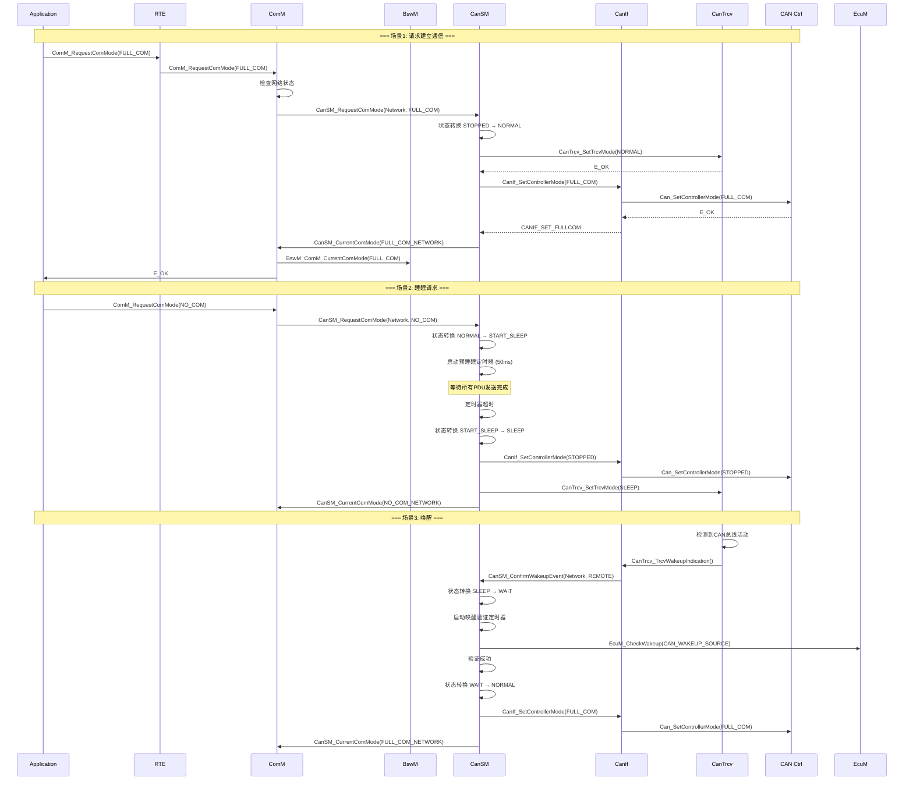

### 9.2 模式切换时间线

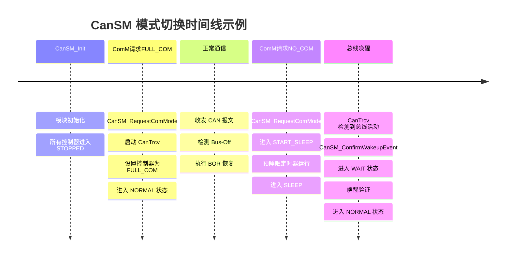

---

## 10. 常见问题与调试

### 10.1 常见问题分析

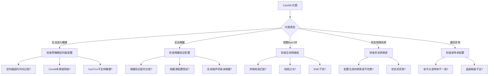

### 10.2 调试技巧

```c
/* 调试辅助函数 - 打印状态机状态 */

void CanSM_Debug_PrintState(uint8 ControllerId)
{
#ifdef CANSM_DEBUG_ENABLE
    CanSM_ControllerStateType *ctrl = &CanSM_GlobalState.Controllers[ControllerId];
    
    printf("[CanSM] Controller %d\n", ControllerId);
    printf("  Current State     : %s (0x%02X)\n", 
           CanSM_StateNames[ctrl->CurrentState], ctrl->CurrentState);
    printf("  Previous State    : %s (0x%02X)\n",
           CanSM_StateNames[ctrl->PreviousState], ctrl->PreviousState);
    printf("  Requested Mode    : 0x%02X\n", ctrl->RequestedMode);
    printf("  Current ComMode   : 0x%02X\n", ctrl->CurrentComMode);
    printf("  BOR Counter       : %d\n", ctrl->BORCounter);
    printf("  BOR Mode          : %d\n", ctrl->BORMode);
    printf("  Error Status      : 0x%02X\n", ctrl->ErrorStatus);
    printf("  TransitionPending : %s\n", 
           ctrl->TransitionPending ? "TRUE" : "FALSE");
#endif
}

/* 错误追踪宏 */
#define CANSM_DET_REPORT(errorId, instanceId) \
    do { \
        if (CanSM_Config.DevErrorDetect) \
        { \
            Det_ReportError(CANSM_MODULE_ID, 0, errorId, instanceId); \
        } \
    } while(0)

/* 断言宏 */
#define CANSM_ASSERT(condition, errorId, instanceId) \
    do { \
        if (!(condition)) \
        { \
            CANSM_DET_REPORT(errorId, instanceId); \
            return E_NOT_OK; \
        } \
    } while(0)
```

### 10.3 常见配置参数一览

| 参数名 | 类型 | 范围 | 说明 | 典型值 |
|:---|:---|:---|:---|:---|
| `CanSMMaxControllers` | uint8 | 1-32 | 最大控制器数量 | 2-4 |
| `CanSMBORMode` | enum | 0-2 | Bus-Off恢复模式 | 1 |
| `CanSMBORTime` | uint32 | 10-1000ms | BOR恢复时间间隔 | 100ms |
| `CanSBBORMaxRetries` | uint8 | 1-10 | 最大重试次数 | 3 |
| `CanSMPreSleepTimeout` | uint32 | 10-500ms | 预睡眠超时 | 50ms |
| `CanSMWakeupVerificationType` | enum | 0-2 | 唤醒验证策略 | 1(Timed) |
| `CanSMWakeupValidationTime` | uint32 | 10-500ms | 唤醒验证时间 | 100ms |
| `CanSMRepeatMessageTime` | uint32 | 0-5000ms | 重复报文持续时间 | 1000ms |
| `CanSMDevErrorDetect` | boolean | TRUE/FALSE | 开发错误检测 | TRUE |

---

## 总结

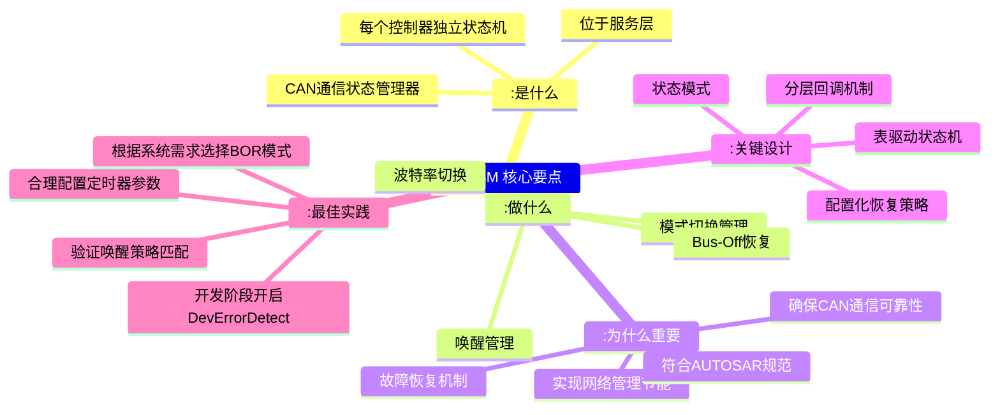

---

*本文基于 AUTOSAR R4.2/R4.4 规范编写，具体实现可能因供应商和配置不同而有所差异。*