# AUTOSAR CAN 通信协议栈架构详解

> 作者：AUTOSAR & 嵌入式软件专家
> 版本：v1.0
> 更新日期：2026/07/10

---

# 一、通俗理解：CAN通信协议栈是什么？

## 1.1 打个比方

想象你是一家大型物流公司的**运营总监**，你的任务是管理整个车队的通信：

| 角色 | AUTOSAR模块 | 职责 |
|------|-------------|------|
| **老板**（决定出车与否） | **EcuM**（ECU管理器） | 决定ECU什么时候启动、什么时候关机 |
| **调度主任**（协调各部门） | **BSWM**（BSW模式管理器） | 仲裁各个状态请求，协调模式切换 |
| **车队经理**（管理通信状态） | **ComM**（通信管理器） | 管理通信通道的开启/关闭/休眠 |
| **司机关**（管理具体车辆） | **CanSM**（CAN状态管理器） | 管理CAN控制器和收发器的具体状态 |
| **对讲机**（车辆间联络） | **NM**（网络管理） | 协调网络中的节点同步休眠/唤醒 |
| **分拣中心**（数据路由） | **PduR**（PDU路由器） | 把数据包路由到正确的目的地 |
| **传送带**（CAN接口） | **CanIf**（CAN接口层） | 统一的上层接口，屏蔽硬件差异 |
| **收发器**（物理信号） | **CanDrv**（CAN驱动） | 直接操作CAN硬件寄存器 |

## 1.2 整体架构鸟瞰

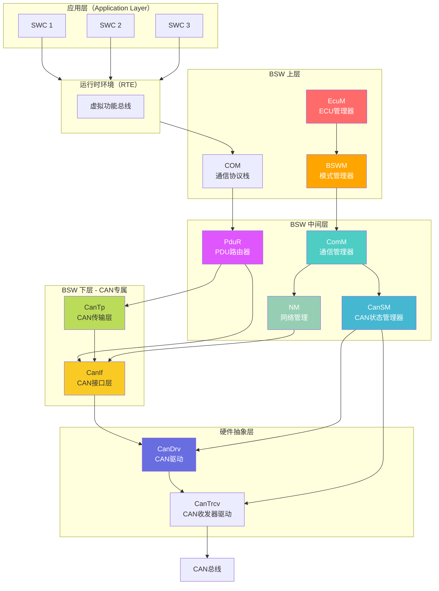
```mermaid
graph TB
    subgraph AppLayer["应用层（Application Layer）"]
        SWC1[SWC 1]
        SWC2[SWC 2]
        SWC3[SWC 3]
    end

    subgraph RTE["运行时环境（RTE）"]
        RTE_BUS[虚拟功能总线]
    end

    subgraph BSW_Upper["BSW 上层"]
        EcuM[EcuM<br/>ECU管理器]
        BSWM[BSWM<br/>模式管理器]
        COM[COM<br/>通信协议栈]
    end

    subgraph BSW_Mid["BSW 中间层"]
        PduR[PduR<br/>PDU路由器]
        NM[NM<br/>网络管理]
        ComM[ComM<br/>通信管理器]
        CanSM[CanSM<br/>CAN状态管理器]
    end

    subgraph BSW_Lower["BSW 下层 - CAN专属"]
        CanIf[CanIf<br/>CAN接口层]
        CanTp[CanTp<br/>CAN传输层]
    end

    subgraph HW["硬件抽象层"]
        CanDrv[CanDrv<br/>CAN驱动]
        Can_Trcv[CanTrcv<br/>CAN收发器驱动]
    end

    SWC1 --> RTE
    SWC2 --> RTE
    SWC3 --> RTE
    RTE --> COM
    COM --> PduR
    PduR --> CanIf
    PduR --> CanTp
    CanTp --> CanIf
    CanIf --> CanDrv
    CanDrv --> Can_Trcv
    Can_Trcv --> CAN_Bus[CAN总线]

    EcuM --> BSWM
    BSWM --> ComM
    ComM --> CanSM
    ComM --> NM
    CanSM --> CanDrv
    CanSM --> Can_Trcv
    NM --> CanIf

    style EcuM fill:#ff6b6b,color:#fff
    style BSWM fill:#ffa500,color:#fff
    style ComM fill:#4ecdc4,color:#fff
    style CanSM fill:#45b7d1,color:#fff
    style NM fill:#96ceb4,color:#fff
    style CanIf fill:#f9ca24,color:#333
    style PduR fill:#e056fd,color:#fff
    style CanDrv fill:#686de0,color:#fff
    style CanTp fill:#badc58,color:#333
```

---

# 二、分层架构详解

## 2.1 AUTOSAR分层架构总览

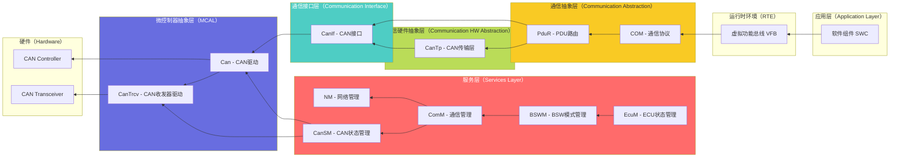
```mermaid
graph RL
    subgraph L7["应用层（Application Layer）"]
        A1["软件组件 SWC"]
    end
    subgraph L6["运行时环境（RTE）"]
        R["虚拟功能总线 VFB"]
    end
    subgraph L5["服务层（Services Layer）"]
        S1["EcuM - ECU状态管理"]
        S2["BSWM - BSW模式管理"]
        S3["ComM - 通信管理"]
        S4["NM - 网络管理"]
        S5["CanSM - CAN状态管理"]
    end
    subgraph L4["通信抽象层（Communication Abstraction）"]
        C1["COM - 通信协议"]
        C2["PduR - PDU路由"]
    end
    subgraph L3["通信接口层（Communication Interface）"]
        I1["CanIf - CAN接口"]
    end
    subgraph L2["通信硬件抽象层（Communication HW Abstraction）"]
        H1["CanTp - CAN传输层"]
    end
    subgraph L1["微控制器抽象层（MCAL）"]
        M1["Can - CAN驱动"]
        M2["CanTrcv - CAN收发器驱动"]
    end
    subgraph L0["硬件（Hardware）"]
        HW1["CAN Controller"]
        HW2["CAN Transceiver"]
    end

    A1 --> R
    R --> C1
    C1 --> C2
    C2 --> I1
    C2 --> H1
    H1 --> I1
    I1 --> M1
    M1 --> M2
    M2 --> HW2
    M1 --> HW1

    S1 --> S2
    S2 --> S3
    S3 --> S4
    S3 --> S5
    S5 --> M1
    S5 --> M2

    style L5 fill:#ff6b6b,color:#fff
    style L4 fill:#f9ca24,color:#333
    style L3 fill:#4ecdc4,color:#fff
    style L2 fill:#badc58,color:#333
    style L1 fill:#686de0,color:#fff
```

### 2.1.1 各层职责

| 层级 | 模块 | 核心职责 | 与CAN相关 |
|------|------|----------|-----------|
| **应用层** | SWC | 业务逻辑实现 | 发送/接收CAN信号 |
| **RTE** | RTE | 组件间通信 | 提供信号级接口 |
| **服务层** | EcuM, BSWM, ComM, NM, CanSM | 状态管理、模式控制 | 管理CAN通信生命周期 |
| **通信抽象层** | COM, PduR | 信号-报文映射、路由 | CAN报文收发、路由 |
| **CAN接口层** | CanIf | CAN报文收发接口 | TX/RX path管理 |
| **硬件抽象层** | CanTp | 大数据分段传输 | ISO 15765-2协议 |
| **MCAL** | Can, CanTrcv | 寄存器操作、收发器控制 | CAN帧收发 |

---

# 三、核心模块详解

---

## 3.1 EcuM（ECU Manager）—— ECU的大脑

### 3.1.1 通俗理解

EcuM 就像**酒店的总经理**：
- **决定开店时间**：什么时候上电启动
- **安排各部门就绪**：协调各模块的初始化顺序
- **决定打烊关门**：处理关机请求，确保安全关闭
- **应对突发情况**：处理掉电、复位等异常

### 3.1.2 设计机制：有限状态机

EcuM的核心是一个**健壮的有限状态机**，分为两个阶段：

#### 第一阶段：STARTUP（启动序列）

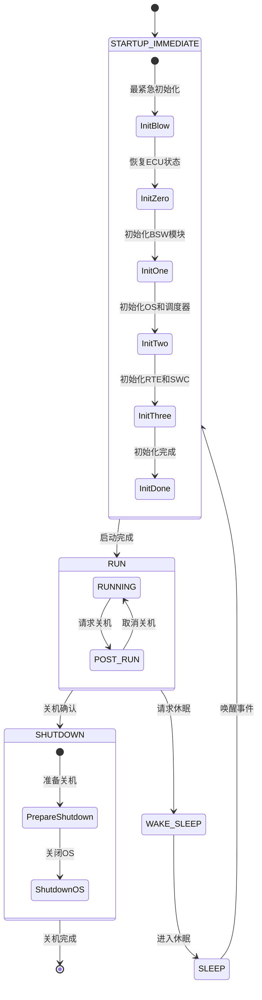
```mermaid
stateDiagram-v2
    [*] --> STARTUP_IMMEDIATE
    
    state STARTUP_IMMEDIATE {
        [*] --> InitBlow : 最紧急初始化
        InitBlow --> InitZero : 恢复ECU状态
        InitZero --> InitOne : 初始化BSW模块
        InitOne --> InitTwo : 初始化OS和调度器
        InitTwo --> InitThree : 初始化RTE和SWC
        InitThree --> InitDone : 初始化完成
    }
    
    STARTUP_IMMEDIATE --> RUN : 启动完成
    
    state RUN {
        RUNNING --> POST_RUN : 请求关机
        POST_RUN --> RUNNING : 取消关机
    }
    
    RUN --> SHUTDOWN : 关机确认
    
    state SHUTDOWN {
        [*] --> PrepareShutdown : 准备关机
        PrepareShutdown --> ShutdownOS : 关闭OS
    }
    
    SHUTDOWN --> [*] : 关机完成
    
    RUN --> WAKE_SLEEP : 请求休眠
    WAKE_SLEEP --> SLEEP : 进入休眠
    SLEEP --> STARTUP_IMMEDIATE : 唤醒事件
```

### 3.1.3 初始化阶段详解

| 阶段 | 执行内容 | 涉及模块 | 时序要求 |
|------|----------|----------|----------|
| **InitBlow** | 最紧急初始化（BswM、EcuM自身） | BswM | 立即 |
| **InitZero** | 恢复ECU运行状态（从NVRAM读取） | NvM | < 5ms |
| **InitOne** | BSW模块初始化（通信栈、存储栈等） | Can, CanIf, PduR, ComM, NM | < 50ms |
| **InitTwo** | OS启动、调度表激活 | OS | < 2ms |
| **InitThree** | RTE初始化、SWC启动 | RTE, SWCs | < 100ms |

### 3.1.4 核心代码框架

```c
/* EcuM 核心状态处理 - 简化示例 */

/* 状态枚举 */
typedef enum {
    ECU_STATE_STARTUP,
    ECU_STATE_RUN,
    ECU_STATE_POST_RUN,
    ECU_STATE_WAKE_SLEEP,
    ECU_STATE_SLEEP,
    ECU_STATE_SHUTDOWN
} EcuM_StateType;

/* 模式枚举 */
typedef enum {
    ECU_MODE_RUN,       /* 正常运行模式 */
    ECU_MODE_SLEEP,     /* 休眠模式（可唤醒） */
    ECU_MODE_SHUTDOWN   /* 完全关闭模式 */
} EcuM_ModeType;

/* 主状态机处理函数 */
static EcuM_StateType EcuM_CurrentState = ECU_STATE_STARTUP;

void EcuM_MainFunction(void)
{
    switch (EcuM_CurrentState)
    {
        case ECU_STATE_STARTUP:
            /* 启动序列处理 */
            (void)EcuM_StartupSequence();
            break;
            
        case ECU_STATE_RUN:
            /* 正常运行 - 处理关机/休眠请求 */
            if (EcuM_ShutdownRequested())
            {
                EcuM_CurrentState = ECU_STATE_POST_RUN;
            }
            else if (EcuM_SleepRequested())
            {
                EcuM_CurrentState = ECU_STATE_WAKE_SLEEP;
            }
            break;
            
        case ECU_STATE_POST_RUN:
            /* 后运行模式 - 通知各模块准备关机 */
            BswM_RequestMode(BSWM_ECUM_STATE_POST_RUN);
            if (EcuM_AllModulesReadyForShutdown())
            {
                EcuM_CurrentState = ECU_STATE_SHUTDOWN;
            }
            else if (!EcuM_ShutdownRequested())
            {
                EcuM_CurrentState = ECU_STATE_RUN;  /* 取消关机 */
            }
            break;
            
        case ECU_STATE_WAKE_SLEEP:
            /* 进入休眠模式 */
            BswM_RequestMode(BSWM_ECUM_STATE_SLEEP);
            if (EcuM_AllModulesReadyForSleep())
            {
                EcuM_CurrentState = ECU_STATE_SLEEP;
            }
            break;
            
        case ECU_STATE_SLEEP:
            /* 休眠 - 等待唤醒事件 */
            if (EcuM_CheckWakeupEvent())
            {
                EcuM_ClearWakeupEvent();
                /* 决定是唤醒还是重启 */
                EcuM_CurrentState = ECU_STATE_STARTUP;
            }
            break;
            
        case ECU_STATE_SHUTDOWN:
            /* 执行关机 */
            EcuM_PerformShutdown();
            break;
    }
}

/* 唤醒验证回调 */
void EcuM_GetWakeupEvent(uint32_t* WakeupSource)
{
    /* CanSM通知有CAN唤醒事件 */
    if (CanTrcv_CheckWakeup())
    {
        *WakeupSource = ECU_WAKEUP_CAN;
    }
}
```

### 3.1.5 设计模式分析

| 设计模式 | 应用方式 | 优点 |
|----------|----------|------|
| **State模式** | 状态机驱动ECU生命周期 | 状态转换清晰，易于扩展 |
| **Template Method模式** | StartUp序列可配置 | 不同ECU只需配置序列步骤 |
| **Observer模式** | 唤醒事件通知机制 | 解耦事件源和处理逻辑 |

---

## 3.2 BSWM（BSW Mode Manager）—— 模式仲裁中心

### 3.2.1 通俗理解

BSWM 就像**公司的总调度室**，负责：
- **收集请求**：接收EcuM、ComM、SWC等各方的模式请求
- **仲裁决策**：根据预设规则决定最终模式
- **分发执行**：通知相关模块切换模式

### 3.2.2 设计机制：基于规则的模式仲裁

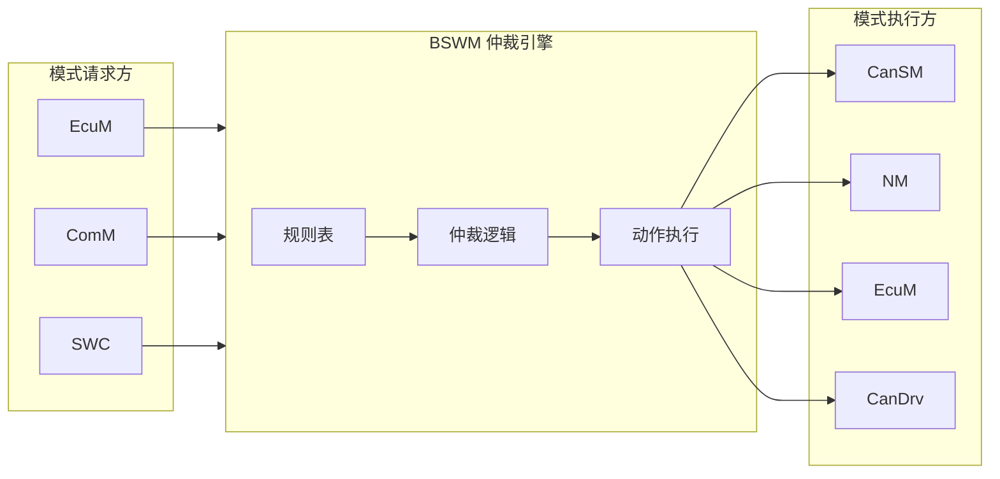
```mermaid
graph LR
    subgraph Request["模式请求方"]
        REQ1[EcuM]
        REQ2[ComM]
        REQ3[SWC]
    end

    subgraph Arb["BSWM 仲裁引擎"]
        Rules[规则表]
        Logic[仲裁逻辑]
        Actions[动作执行]
    end

    subgraph Action["模式执行方"]
        ACT1[CanSM]
        ACT2[NM]
        ACT3[EcuM]
        ACT4[CanDrv]
    end

    REQ1 --> Arb
    REQ2 --> Arb
    REQ3 --> Arb
    Rules --> Logic
    Logic --> Actions
    Actions --> ACT1
    Actions --> ACT2
    Actions --> ACT3
    Actions --> ACT4
```

### 3.2.3 核心规则表结构

```c
/* BSWM 模式规则 - 简化示例 */

/* 模式规则配置表 */
typedef struct {
    BswM_RequestSourceType   RequestSource;    /* 请求来源 */
    BswM_ModeType            RequestedMode;    /* 请求的模式 */
    BswM_ArbitrationRuleType ArbitrationRule;  /* 仲裁规则 */
    BswM_ActionListType*     ActionList;       /* 执行的动作列表 */
} BswM_RuleType;

/* 仲裁规则定义 */
typedef enum {
    ARBITRATION_AND,      /* 所有请求方都同意才切换 */
    ARBITRATION_OR,       /* 任一请求方请求即切换 */
    ARBITRATION_PRIORITY, /* 最高优先级的请求决定 */
    ARBITRATION_EXACT     /* 精确匹配规则 */
} BswM_ArbitrationRuleType;

/* 典型规则示例 */
const BswM_RuleType BswM_ConfigRules[] = {
    {
        .RequestSource = BSWM_REQUEST_SOURCE_ECUM,
        .RequestedMode = BSWM_MODE_ECUM_POST_RUN,
        .ArbitrationRule = ARBITRATION_AND,
        .ActionList = &ComM_PrepareShutdownActions
    },
    {
        .RequestSource = BSWM_REQUEST_SOURCE_COMM,
        .RequestedMode = BSWM_MODE_COMM_FULL,
        .ArbitrationRule = ARBITRATION_PRIORITY,
        .ActionList = &CanSM_FullComActions
    },
    {
        .RequestSource = BSWM_REQUEST_SOURCE_COMM,
        .RequestedMode = BSWM_MODE_COMM_SILENT,
        .ArbitrationRule = ARBITRATION_PRIORITY,
        .ActionList = &CanSM_SilentComActions
    }
};
```

### 3.2.4 BSWM模式仲裁机制

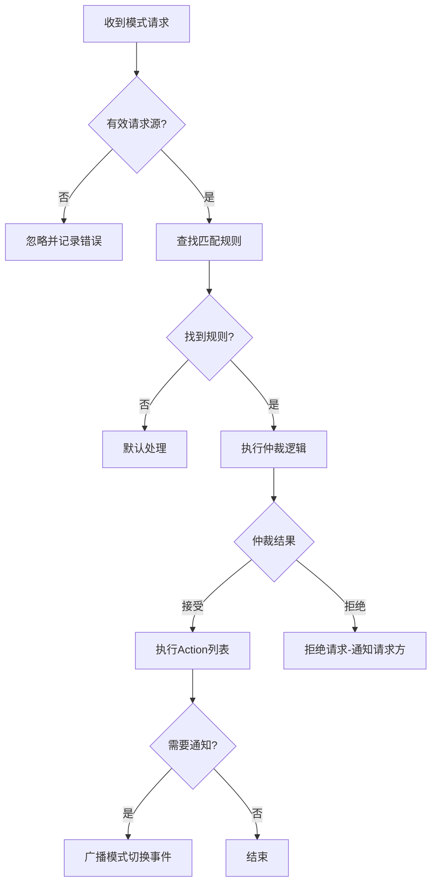
```mermaid
flowchart TD
    A[收到模式请求] --> B{有效请求源?}
    B -->|否| C[忽略并记录错误]
    B -->|是| D[查找匹配规则]
    D --> E{找到规则?}
    E -->|否| F[默认处理]
    E -->|是| G[执行仲裁逻辑]
    G --> H{仲裁结果}
    H -->|接受| I[执行Action列表]
    H -->|拒绝| J[拒绝请求-通知请求方]
    I --> K{需要通知?}
    K -->|是| L[广播模式切换事件]
    K -->|否| M[结束]
```

### 3.2.5 与 EcuM 的交互流程

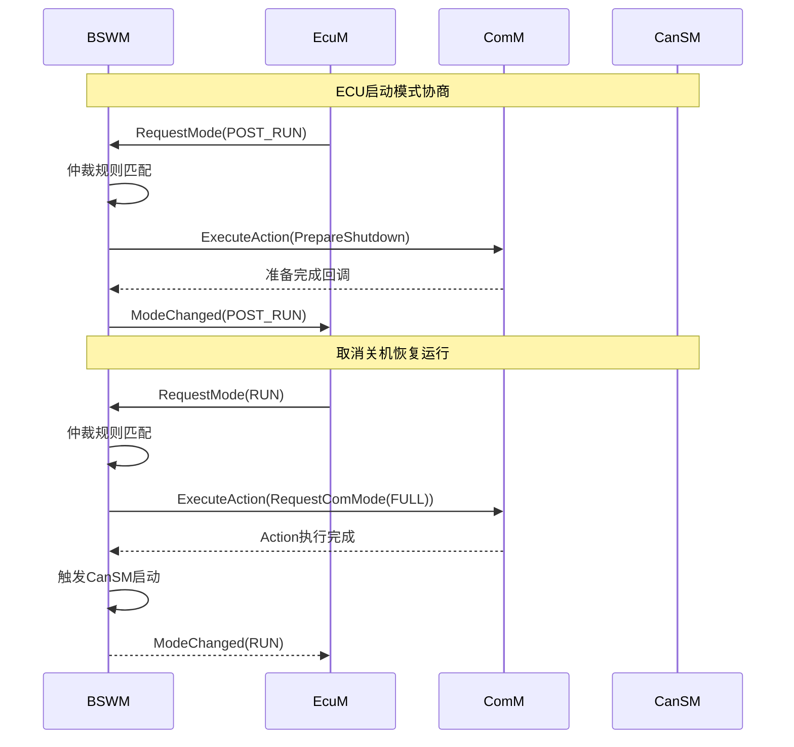
```mermaid
sequenceDiagram
    participant BSWM as BSWM
    participant EcuM as EcuM
    participant ComM as ComM
    participant CanSM as CanSM
    
    Note over BSWM,CanSM: ECU启动模式协商
    EcuM->>BSWM: RequestMode(POST_RUN)
    BSWM->>BSWM: 仲裁规则匹配
    BSWM->>ComM: ExecuteAction(PrepareShutdown)
    ComM-->>BSWM: 准备完成回调
    BSWM->>EcuM: ModeChanged(POST_RUN)
    
    Note over BSWM,CanSM: 取消关机恢复运行
    EcuM->>BSWM: RequestMode(RUN)
    BSWM->>BSWM: 仲裁规则匹配
    BSWM->>ComM: ExecuteAction(RequestComMode(FULL))
    ComM-->>BSWM: Action执行完成
    BSWM->>BSWM: 触发CanSM启动
    BSWM-->>EcuM: ModeChanged(RUN)
```

---

## 3.3 ComM（Communication Manager）—— 通信总指挥

### 3.3.1 通俗理解

ComM 就像**车队调度中心**，负责：
- **管理通信通道**：每个通信通道（Channel）有独立状态
- **通信需求管理**：跟踪哪些SWC需要通信
- **网络状态控制**：协调网络从休眠到唤醒的完整过程

### 3.3.2 通道状态机

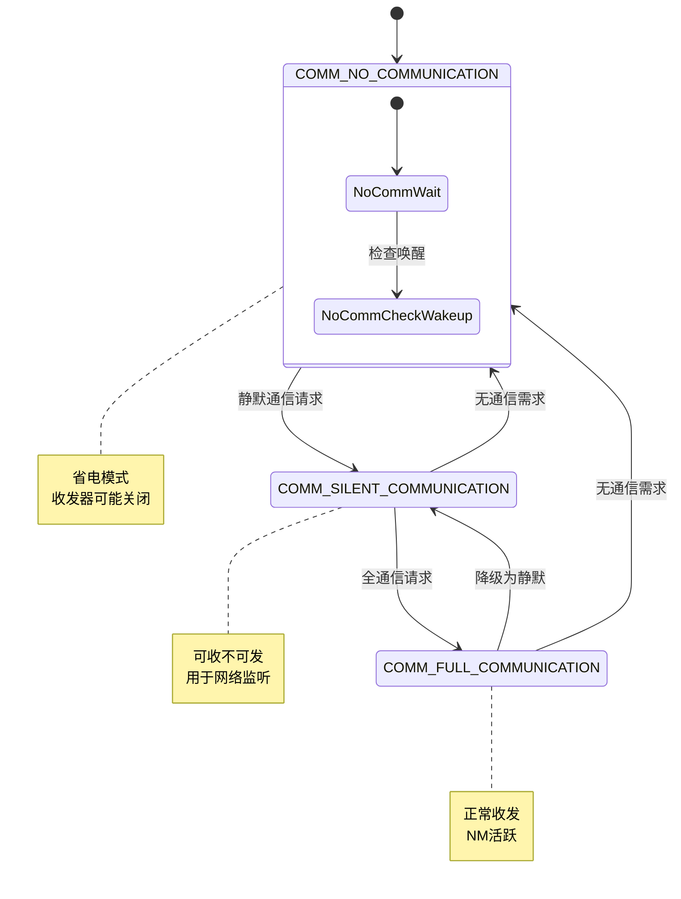
```mermaid
stateDiagram-v2
    [*] --> COMM_NO_COMMUNICATION
    
    state COMM_NO_COMMUNICATION {
        [*] --> NoCommWait
        NoCommWait --> NoCommCheckWakeup : 检查唤醒
    }
    
    COMM_NO_COMMUNICATION --> COMM_SILENT_COMMUNICATION : 静默通信请求
    
    COMM_SILENT_COMMUNICATION --> COMM_FULL_COMMUNICATION : 全通信请求
    COMM_FULL_COMMUNICATION --> COMM_SILENT_COMMUNICATION : 降级为静默
    
    COMM_SILENT_COMMUNICATION --> COMM_NO_COMMUNICATION : 无通信需求
    COMM_FULL_COMMUNICATION --> COMM_NO_COMMUNICATION : 无通信需求
    
    note right of COMM_NO_COMMUNICATION
        省电模式
        收发器可能关闭
    end note
    
    note right of COMM_SILENT_COMMUNICATION
        可收不可发
        用于网络监听
    end note
    
    note right of COMM_FULL_COMMUNICATION
        正常收发
        NM活跃
    end note
```

### 3.3.3 核心状态管理代码

```c
/* ComM 通道状态管理 */

typedef enum {
    COMM_NO_COMMUNICATION,        /* 无通信 */
    COMM_FULL_COMMUNICATION,     /* 全通信 */
    COMM_SILENT_COMMUNICATION,   /* 静默通信 */
    COMM_INIT                    /* 初始化中 */
} ComM_StateType;

typedef struct {
    uint8_t             ChannelId;
    ComM_StateType      CurrentState;
    ComM_StateType      PreviousState;
    uint8_t             RequestCount;       /* 活跃请求计数 */
    uint32_t            WakeupSource;       /* 唤醒源 */
    boolean             PendingRequest;     /* 挂起的请求 */
} ComM_ChannelType;

/* 通道状态表 */
ComM_ChannelType ComM_Channels[COMM_MAX_CHANNELS];

/* 请求通信服务 */
Std_ReturnType ComM_RequestComMode(
    ComM_UserHandleType  User,       /* 请求者 */
    uint8_t              Channel,    /* 通道ID */
    ComM_ModeType        ComMode     /* 请求模式 */
)
{
    if (ComM_Channels[Channel].CurrentState == ComMode)
    {
        return E_OK;  /* 已是目标状态 */
    }

    /* 更新请求计数 */
    if (ComMode == COMM_FULL_COMMUNICATION)
    {
        ComM_Channels[Channel].RequestCount++;
    }

    /* 触发状态转换 */
    ComM_PerformStateTransition(Channel, ComMode);

    return E_OK;
}

/* 状态转换执行 */
static void ComM_PerformStateTransition(
    uint8_t           Channel, 
    ComM_ModeType     TargetMode
)
{
    /* 通知CanSM执行物理层状态切换 */
    switch (TargetMode)
    {
        case COMM_FULL_COMMUNICATION:
            CanSM_RequestComMode(Channel, CANSM_FULL_COM);
            /* 启动网络管理 */
            NM_NetworkStart(Channel);
            break;

        case COMM_SILENT_COMMUNICATION:
            CanSM_RequestComMode(Channel, CANSM_SILENT_COM);
            break;

        case COMM_NO_COMMUNICATION:
            /* 停止网络管理 */
            NM_NetworkStop(Channel);
            CanSM_RequestComMode(Channel, CANSM_NO_COM);
            break;
    }
}
```

### 3.3.4 用户-通道映射关系

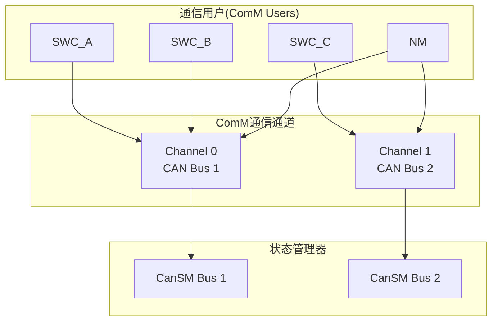
```mermaid
graph TB
    subgraph Users["通信用户(ComM Users)"]
        SWC_A[SWC_A]
        SWC_B[SWC_B]
        SWC_C[SWC_C]
        NM_U[NM]
    end
    
    subgraph Channels["ComM通信通道"]
        CH0[Channel 0<br/>CAN Bus 1]
        CH1[Channel 1<br/>CAN Bus 2]
    end
    
    subgraph SM["状态管理器"]
        CanSM_0[CanSM Bus 1]
        CanSM_1[CanSM Bus 2]
    end

    SWC_A --> CH0
    SWC_B --> CH0
    SWC_C --> CH1
    NM_U --> CH0
    NM_U --> CH1
    CH0 --> CanSM_0
    CH1 --> CanSM_1
```

### 3.3.5 通信控制流程

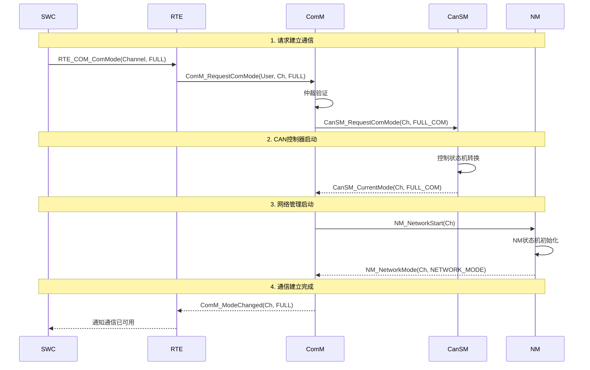
```mermaid
sequenceDiagram
    participant SWC as SWC
    participant RTE as RTE
    participant ComM as ComM
    participant CanSM as CanSM
    participant NM as NM

    Note over SWC,NM: 1. 请求建立通信
    SWC->>RTE: RTE_COM_ComMode(Channel, FULL)
    RTE->>ComM: ComM_RequestComMode(User, Ch, FULL)
    ComM->>ComM: 仲裁验证
    ComM->>CanSM: CanSM_RequestComMode(Ch, FULL_COM)
    
    Note over SWC,NM: 2. CAN控制器启动
    CanSM->>CanSM: 控制状态机转换
    CanSM-->>ComM: CanSM_CurrentMode(Ch, FULL_COM)
    
    Note over SWC,NM: 3. 网络管理启动
    ComM->>NM: NM_NetworkStart(Ch)
    NM->>NM: NM状态机初始化
    NM-->>ComM: NM_NetworkMode(Ch, NETWORK_MODE)
    
    Note over SWC,NM: 4. 通信建立完成
    ComM-->>RTE: ComM_ModeChanged(Ch, FULL)
    RTE-->>SWC: 通知通信已可用
```

### 3.3.6 设计模式分析

| 设计模式 | 应用方式 | 说明 |
|----------|----------|------|
| **Mediator模式** | 协调多个请求者和执行者 | 解耦SWC与CanSM的直接交互 |
| **State模式** | 通道状态机管理 | 每个状态有明确的进入/退出动作 |
| **Reference Count模式** | 请求计数管理 | 最后一个用户释放才关闭通道 |

---

## 3.4 CanSM（CAN State Manager）—— CAN物理层管家

### 3.4.1 通俗理解

CanSM 就像**车队中每辆车的专职司机**：
- **发动/熄火**：控制CAN控制器和收发器的电源状态
- **检查车况**：监控总线状态、错误状态
- **处理抛锚**：Bus-Off恢复管理
- **钥匙门控制**：控制收发器进入不同模式（正常/休眠/唤醒）

### 3.4.2 CanSM核心状态机

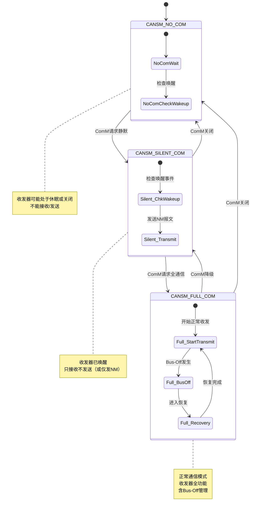
```mermaid
stateDiagram-v2
    [*] --> CANSM_NO_COM
    
    state CANSM_NO_COM {
        [*] --> NoComWait
        NoComWait --> NoComCheckWakeup : 检查唤醒
    }
    
    CANSM_NO_COM --> CANSM_SILENT_COM : ComM请求静默
    
    state CANSM_SILENT_COM {
        [*] --> Silent_ChkWakeup : 检查唤醒事件
        Silent_ChkWakeup --> Silent_Transmit : 发送NM报文
    }
    
    CANSM_SILENT_COM --> CANSM_FULL_COM : ComM请求全通信
    
    state CANSM_FULL_COM {
        [*] --> Full_StartTransmit : 开始正常收发
        Full_StartTransmit --> Full_BusOff : Bus-Off发生
        Full_BusOff --> Full_Recovery : 进入恢复
        Full_Recovery --> Full_StartTransmit : 恢复完成
    }
    
    CANSM_FULL_COM --> CANSM_SILENT_COM : ComM降级
    CANSM_FULL_COM --> CANSM_NO_COM : ComM关闭
    CANSM_SILENT_COM --> CANSM_NO_COM : ComM关闭

    note right of CANSM_NO_COM
        收发器可能处于休眠或关闭
        不能接收/发送
    end note
    
    note right of CANSM_SILENT_COM
        收发器已唤醒
        只接收不发送（或仅发NM）
    end note
    
    note right of CANSM_FULL_COM
        正常通信模式
        收发器全功能
        含Bus-Off管理
    end note
```

### 3.4.3 状态转换条件详解

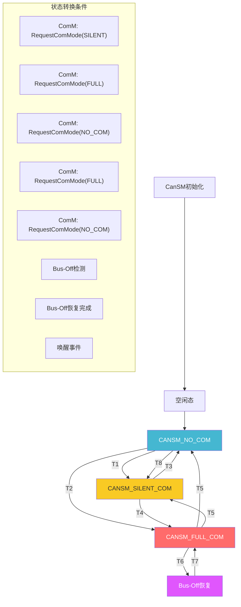
```mermaid
flowchart TB
    Start["CanSM初始化"] --> Idle["空闲态"]
    
    subgraph Transitions["状态转换条件"]
        T1["ComM: RequestComMode(SILENT)"]
        T2["ComM: RequestComMode(FULL)"]
        T3["ComM: RequestComMode(NO_COM)"]
        T4["ComM: RequestComMode(FULL)"]
        T5["ComM: RequestComMode(NO_COM)"]
        T6["Bus-Off检测"]
        T7["Bus-Off恢复完成"]
        T8["唤醒事件"]
    end

    Idle --> Init["CANSM_NO_COM"]
    Init -->|T1| Silent["CANSM_SILENT_COM"]
    Init -->|T2| Full["CANSM_FULL_COM"]
    Silent -->|T4| Full
    Silent -->|T3| Init
    Full -->|T5| Init
    Full -->|T5| Silent
    Full -->|T6| BusOff["Bus-Off恢复"]
    BusOff -->|T7| Full
    Init -->|T8| Silent
    
    style Init fill:#45b7d1,color:#fff
    style Silent fill:#f9ca24,color:#333
    style Full fill:#ff6b6b,color:#fff
    style BusOff fill:#e056fd,color:#fff
```

### 3.4.4 CanSM核心实现

```c
/* CanSM 核心状态管理 - 典型实现 */

/* 状态枚举 */
typedef enum {
    CANSM_STATE_UNINIT,
    CANSM_STATE_NO_COM,
    CANSM_STATE_SILENT_COM,
    CANSM_STATE_FULL_COM,
    CANSM_STATE_BUS_OFF,
    CANSM_STATE_CHANGE_BAUDRATE
} CanSM_StateType;

/* 每个CAN控制器一个状态 */
typedef struct {
    uint8_t             ControllerId;
    CanSM_StateType     State;
    uint8_t             BusOffCounter;
    uint8_t             BusOffRecoveryCounter;
    Can_ControllerStateType HardwareState;
    boolean             WakeupPending;
} CanSM_ControllerType;

/* 全局控制器状态表 */
static CanSM_ControllerType CanSM_Controllers[CANSM_MAX_CONTROLLERS];

/* ComM请求回调 - CanSM的入口 */
void CanSM_RequestComMode(
    uint8_t             ControllerId,
    CanSM_ComModeType   ComMode
)
{
    CanSM_ControllerType* ctrl = &CanSM_Controllers[ControllerId];
    
    switch (ComMode)
    {
        case CANSM_NO_COM:
            CanSM_RequestNoCom(ctrl);
            break;
        case CANSM_SILENT_COM:
            CanSM_RequestSilentCom(ctrl);
            break;
        case CANSM_FULL_COM:
            CanSM_RequestFullCom(ctrl);
            break;
    }
}

/* 进入全通信模式 */
static void CanSM_RequestFullCom(CanSM_ControllerType* ctrl)
{
    switch (ctrl->State)
    {
        case CANSM_STATE_NO_COM:
            /* 1. 唤醒收发器 */
            CanTrcv_SetOpMode(ctrl->ControllerId, CANTRCV_OPMODE_NORMAL);
            
            /* 2. 设置控制器模式 */
            Can_SetControllerMode(ctrl->ControllerId, CAN_CS_STARTED);
            
            /* 3. 等待控制器确认 */
            ctrl->State = CANSM_STATE_FULL_COM;
            ctrl->HardwareState = CAN_CS_STARTED;
            
            /* 4. 通知ComM */
            ComM_CanSM_CurrentMode(ctrl->ControllerId, CANSM_FULL_COM);
            break;
            
        case CANSM_STATE_SILENT_COM:
            /* 从静默升级到全通信 */
            Can_SetControllerMode(ctrl->ControllerId, CAN_CS_STARTED);
            ctrl->State = CANSM_STATE_FULL_COM;
            ComM_CanSM_CurrentMode(ctrl->ControllerId, CANSM_FULL_COM);
            break;
            
        default:
            /* 已经在全通信模式 */
            break;
    }
}

/* 进入无通信模式 */
static void CanSM_RequestNoCom(CanSM_ControllerType* ctrl)
{
    /* 1. 停止控制器 */
    Can_SetControllerMode(ctrl->ControllerId, CAN_CS_STOPPED);
    
    /* 2. 收发器进入休眠 */
    CanTrcv_SetOpMode(ctrl->ControllerId, CANTRCV_OPMODE_SLEEP);
    
    ctrl->State = CANSM_STATE_NO_COM;
    ComM_CanSM_CurrentMode(ctrl->ControllerId, CANSM_NO_COM);
}

/* Bus-Off管理 */
void CanSM_BusOffNotification(uint8_t ControllerId)
{
    CanSM_ControllerType* ctrl = &CanSM_Controllers[ControllerId];
    
    if (ctrl->State != CANSM_STATE_FULL_COM)
    {
        return;  /* 非通信模式忽略Bus-Off */
    }
    
    ctrl->State = CANSM_STATE_BUS_OFF;
    ctrl->BusOffCounter++;
    
    /* Bus-Off恢复策略 */
    if (ctrl->BusOffCounter > CANSM_MAX_BUSOFF_RETRIES)
    {
        /* 超过最大重试，进入无通信并通知ComM */
        CanSM_RequestNoCom(ctrl);
        CanSM_ReportBusOffLimitReached(ControllerId);
        return;
    }
    
    /* 停止控制器 */
    Can_SetControllerMode(ControllerId, CAN_CS_STOPPED);
    
    /* 等待恢复（AUTOSAR规范建议延时） */
    SchM_Enter_CANSM_BUSOFF_RECOVERY();
    ctrl->BusOffRecoveryCounter = 0;
    SchM_Exit_CANSM_BUSOFF_RECOVERY();
}

/* Bus-Off恢复主函数 */
void CanSM_MainFunction(void)
{
    uint8_t i;
    
    for (i = 0; i < CANSM_MAX_CONTROLLERS; i++)
    {
        CanSM_ControllerType* ctrl = &CanSM_Controllers[i];
        
        if (ctrl->State == CANSM_STATE_BUS_OFF)
        {
            /* Bus-Off恢复逻辑：
             * AUTOSAR规范要求：
             * 1. 停止控制器
             * 2. 等待128个总线空闲时间
             * 3. 重启控制器
             */
            ctrl->BusOffRecoveryCounter++;
            
            if (ctrl->BusOffRecoveryCounter >= CANSM_BUSOFF_RECOVERY_TIME)
            {
                /* 尝试恢复 */
                Can_SetControllerMode(i, CAN_CS_STARTED);
                ctrl->State = CANSM_STATE_FULL_COM;
                
                /* 通知下层恢复完成 */
                CanSM_ControllerModeIndication(i, CAN_CS_STARTED);
            }
        }
    }
}
```

### 3.4.5 Bus-Off恢复时序

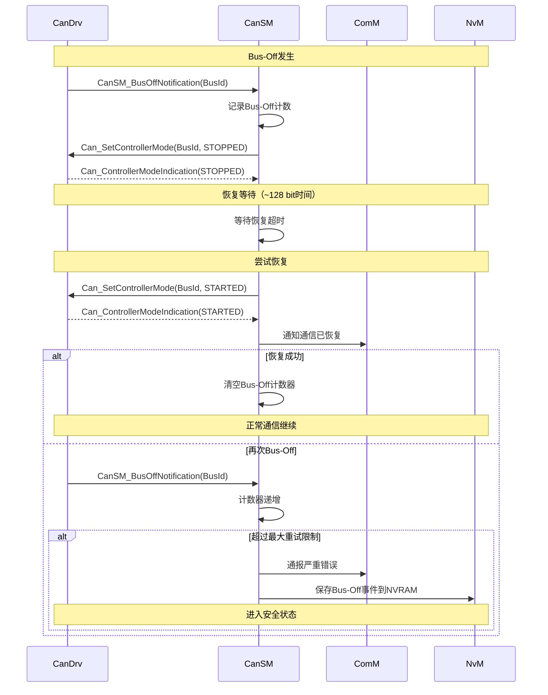
```mermaid
sequenceDiagram
    participant CanDrv as CanDrv
    participant CanSM as CanSM
    participant ComM as ComM
    participant NVRAM as NvM

    Note over CanDrv,NVRAM: Bus-Off发生
    CanDrv->>CanSM: CanSM_BusOffNotification(BusId)
    CanSM->>CanSM: 记录Bus-Off计数
    CanSM->>CanDrv: Can_SetControllerMode(BusId, STOPPED)
    CanDrv-->>CanSM: Can_ControllerModeIndication(STOPPED)
    
    Note over CanDrv,NVRAM: 恢复等待（~128 bit时间）
    CanSM->>CanSM: 等待恢复超时
    
    Note over CanDrv,NVRAM: 尝试恢复
    CanSM->>CanDrv: Can_SetControllerMode(BusId, STARTED)
    CanDrv-->>CanSM: Can_ControllerModeIndication(STARTED)
    CanSM->>ComM: 通知通信已恢复
    
    alt 恢复成功
        CanSM->>CanSM: 清空Bus-Off计数器
        Note over CanDrv,NVRAM: 正常通信继续
    else 再次Bus-Off
        CanDrv->>CanSM: CanSM_BusOffNotification(BusId)
        CanSM->>CanSM: 计数器递增
        alt 超过最大重试限制
            CanSM->>ComM: 通报严重错误
            CanSM->>NVRAM: 保存Bus-Off事件到NVRAM
            Note over CanDrv,NVRAM: 进入安全状态
        end
    end
```

---

## 3.5 CanIf（CAN Interface）—— CAN通信的统一接口

### 3.5.1 通俗理解

CanIf 就像**收发室**：
- **统一收发**：上层模块（PduR、NM等）不用关心底层有几路CAN
- **地址映射**：把逻辑发送请求映射到具体硬件缓冲区
- **收发分离**：发送和接收路径完全独立

### 3.5.2 CanIf在协议栈中的位置

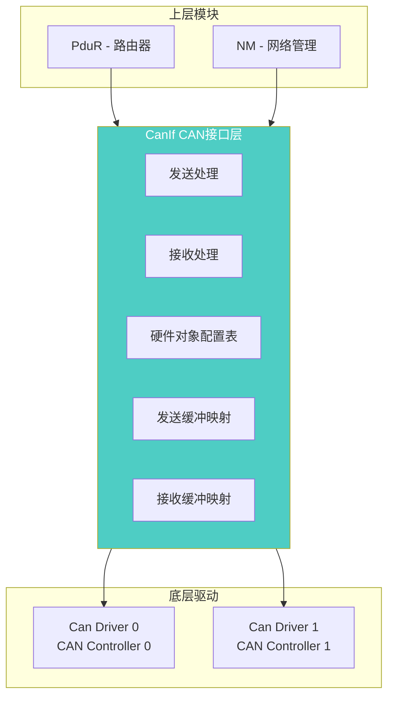
```mermaid
graph TB
    subgraph Upper["上层模块"]
        PduR[PduR - 路由器]
        NM[NM - 网络管理]
    end

    subgraph CanIf_Layer["CanIf CAN接口层"]
        TX_Handler[发送处理]
        RX_Handler[接收处理]
        Configuration[硬件对象配置表]
        TX_Conf[发送缓冲映射]
        RX_Conf[接收缓冲映射]
    end

    subgraph Lower["底层驱动"]
        Can0[Can Driver 0<br/>CAN Controller 0]
        Can1[Can Driver 1<br/>CAN Controller 1]
    end

    PduR --> CanIf_Layer
    NM --> CanIf_Layer
    CanIf_Layer --> Can0
    CanIf_Layer --> Can1
    
    style CanIf_Layer fill:#4ecdc4,color:#fff
```

### 3.5.3 发送路径

```c
/* CanIf 发送路径 - 简化实现 */

/* 发送请求 - 被PduR调用 */
Std_ReturnType CanIf_Transmit(
    PduIdType           CanTxPduId,    /* 发送PDU ID */
    const PduInfoType*  PduInfoPtr     /* PDU数据指针 */
)
{
    CanIf_ConfigType* config = &CanIf_TxConfig[CanTxPduId];
    
    /* 1. 检查发送权限 */
    if (!CanIf_IsTransmitAllowed(config->ControllerId))
    {
        return E_NOT_OK;
    }
    
    /* 2. 检查硬件缓冲是否可用 */
    if (!CanIf_CheckTxBufferAvailable(config->CanHwObject))
    {
        /* 加入发送队列 */
        CanIf_BufferTxRequest(CanTxPduId, PduInfoPtr);
        return E_OK;
    }
    
    /* 3. 调用CanDrv发送 */
    return Can_Write(config->CanHwObject, PduInfoPtr);
}

/* 发送确认回调 - 从CanDrv触发 */
void CanIf_TxConfirmation(
    PduIdType    CanTxPduId,
    Std_ReturnType Result
)
{
    /* 1. 检查是否有排队等待的报文 */
    if (CanIf_HasQueuedTx(CanTxPduId))
    {
        /* 发送排队的下一帧 */
        CanIf_DequeueAndTransmit(CanTxPduId);
    }
    
    /* 2. 通知上层 */
    PduR_CanIfTxConfirmation(CanTxPduId, Result);
}
```

### 3.5.4 接收路径

```c
/* CanIf 接收路径 - 简化实现 */

/* 接收指示回调 - 从CanDrv中断中调用 */
void CanIf_RxIndication(
    const Can_HwType*   Mailbox,       /* 硬件邮箱信息 */
    const PduInfoType*  PduInfoPtr     /* 接收到的PDU数据 */
)
{
    /* 1. 将硬件邮箱映射到逻辑PDU ID */
    PduIdType logicalPduId = CanIf_GetLogicalPduId(Mailbox);
    
    /* 2. 判断接收路径 */
    CanIf_RxRoutingPath routing = CanIf_GetRxRouting(logicalPduId);
    
    switch (routing)
    {
        case CANIF_RX_ROUTE_PDUR:
            /* 路由到PduR */
            PduR_CanIfRxIndication(logicalPduId, PduInfoPtr);
            break;
            
        case CANIF_RX_ROUTE_NM:
            /* 直接路由到NM */
            NM_RxIndication(logicalPduId, PduInfoPtr);
            break;
            
        case CANIF_RX_ROUTE_BOTH:
            /* 同时路由到PduR和NM */
            PduR_CanIfRxIndication(logicalPduId, PduInfoPtr);
            NM_RxIndication(logicalPduId, PduInfoPtr);
            break;
    }
}
```

### 3.5.5 硬件对象（HwObject）映射机制

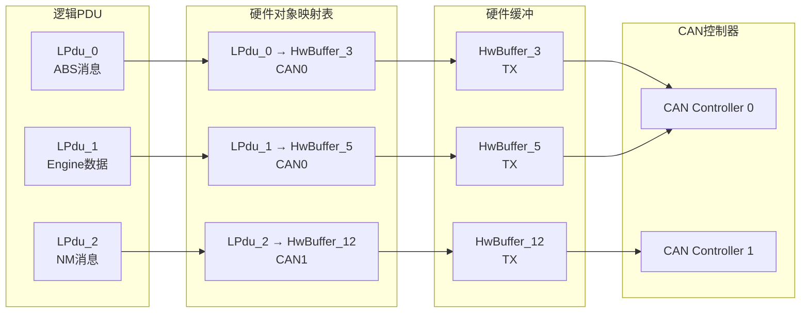
```mermaid
flowchart LR
    subgraph LPDU["逻辑PDU"]
        LPdu0[LPdu_0<br/>ABS消息]
        LPdu1[LPdu_1<br/>Engine数据]
        LPdu2[LPdu_2<br/>NM消息]
    end

    subgraph HwObj["硬件对象映射表"]
        Map0[LPdu_0 → HwBuffer_3<br/>CAN0]
        Map1[LPdu_1 → HwBuffer_5<br/>CAN0]
        Map2[LPdu_2 → HwBuffer_12<br/>CAN1]
    end

    subgraph HwBuf["硬件缓冲"]
        HB3[HwBuffer_3<br/>TX]
        HB5[HwBuffer_5<br/>TX]
        HB12[HwBuffer_12<br/>TX]
    end

    subgraph Ctl["CAN控制器"]
        C0[CAN Controller 0]
        C1[CAN Controller 1]
    end

    LPdu0 --> Map0 --> HB3 --> C0
    LPdu1 --> Map1 --> HB5 --> C0
    LPdu2 --> Map2 --> HB12 --> C1
```

### 3.5.6 设计模式

| 设计模式 | 应用方式 | 说明 |
|----------|----------|------|
| **Facade模式** | 为上层提供统一接口 | 屏蔽多个CAN控制器的差异 |
| **Adapter模式** | 适配不同CAN硬件 | 使上层代码与硬件无关 |
| **Strategy模式** | 不同接收路由策略 | 灵活配置路由路径 |

---

## 3.6 PduR（PDU Router）—— 数据包路由器

### 3.6.1 通俗理解

PduR 就像是**物流分拣中心**的传送带分拣系统：
- **入站分拣**：收到的数据包根据ID分发给正确的处理模块
- **出站路由**：上层发来的数据包路由到对应的通信接口
- **网关功能**：可以将一个总线的报文转发到另一个总线

### 3.6.2 PduR路由路径

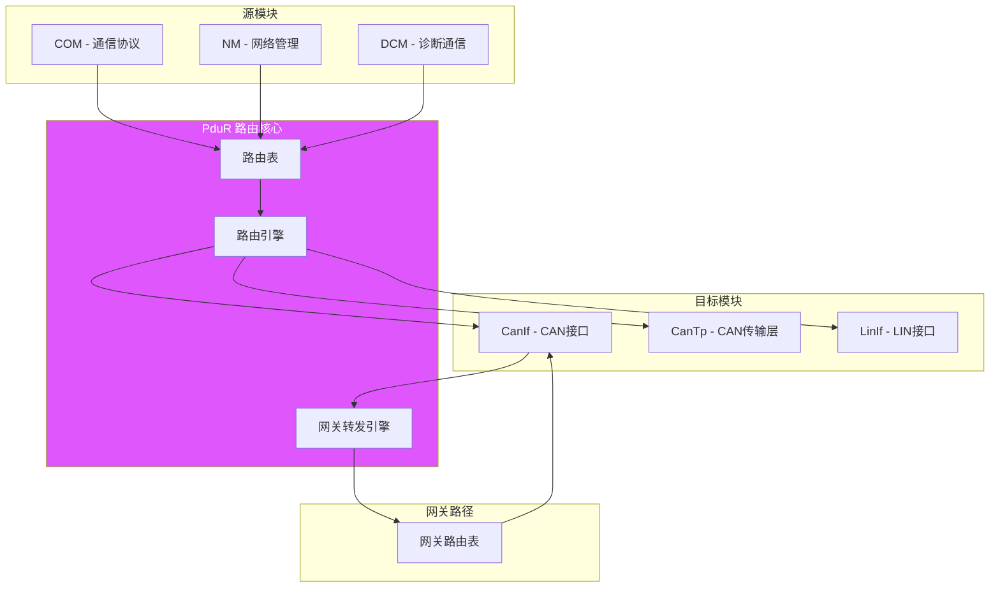
```mermaid
graph TB
    subgraph Source["源模块"]
        COM[COM - 通信协议]
        NM[NM - 网络管理]
        DCM[DCM - 诊断通信]
    end

    subgraph PduR_Core["PduR 路由核心"]
        RouteTbl[路由表]
        Router[路由引擎]
        Gateway[网关转发引擎]
    end

    subgraph Dest["目标模块"]
        CanIf[CanIf - CAN接口]
        CanTp[CanTp - CAN传输层]
        LinIf[LinIf - LIN接口]
    end

    subgraph GatewayPath["网关路径"]
        GW_Table[网关路由表]
    end

    COM --> RouteTbl
    NM --> RouteTbl
    DCM --> RouteTbl
    RouteTbl --> Router
    Router --> CanIf
    Router --> CanTp
    Router --> LinIf
    
    %% 网关：从CAN到CAN
    CanIf --> Gateway
    Gateway --> GW_Table
    GW_Table --> CanIf
    
    style PduR_Core fill:#e056fd,color:#fff
```

### 3.6.3 路由表结构

```c
/* PduR 路由表 - 简化定义 */

/* 路由路径类型 */
typedef enum {
    PDUR_ROUTE_STRAIGHT,    /* 直通路由：COM → CanIf */
    PDUR_ROUTE_GATEWAY,     /* 网关路由：CanIf → CanIf */
    PDUR_ROUTE_TP,          /* 传输层路由：→ CanTp */
    PDUR_ROUTE_DISCARD      /* 丢弃 */
} PduR_RouteType;

/* 路由表项 */
typedef struct {
    PduIdType           SourcePduId;      /* 源PDU ID */
    PduR_RouteType      RouteType;        /* 路由类型 */
    PduIdType           DestPduId;        /* 目标PDU ID */
    uint8_t*            GatewayBuffer;    /* 网关缓冲（仅网关使用） */
    boolean             ZeroCopy;         /* 零拷贝标志 */
} PduR_RouteType;

/* 发送路由 - PduR_CanIfTxRouting 表 */
const PduR_RouteType PduR_TxRouting[] = {
    { .SourcePduId = 0, .RouteType = PDUR_ROUTE_STRAIGHT, 
      .DestPduId = 10, .ZeroCopy = TRUE },
    { .SourcePduId = 1, .RouteType = PDUR_ROUTE_GATEWAY,  
      .DestPduId = 20, .GatewayBuffer = gateway_buf1 },
    { .SourcePduId = 2, .RouteType = PDUR_ROUTE_TP,       
      .DestPduId = 30, .ZeroCopy = FALSE },
};

/* 发送路由函数 */
Std_ReturnType PduR_CanIfTransmit(
    PduIdType           PduId,
    const PduInfoType*  PduInfoPtr
)
{
    const PduR_RouteType* route = &PduR_TxRouting[PduId];
    
    switch (route->RouteType)
    {
        case PDUR_ROUTE_STRAIGHT:
            /* 直通路由 - 直接转发 */
            return CanIf_Transmit(route->DestPduId, PduInfoPtr);
            
        case PDUR_ROUTE_GATEWAY:
            /* 网关路由 - 拷贝数据到网关缓冲 */
            (void)memcpy(route->GatewayBuffer, 
                        PduInfoPtr->SduDataPtr, 
                        PduInfoPtr->SduLength);
            return CanIf_Transmit(route->DestPduId, 
                                 &(PduInfoType){
                                    .SduDataPtr = route->GatewayBuffer,
                                    .SduLength = PduInfoPtr->SduLength
                                 });
            
        case PDUR_ROUTE_DISCARD:
            return E_NOT_OK;
    }
}
```

### 3.6.4 接收路由时的解耦机制

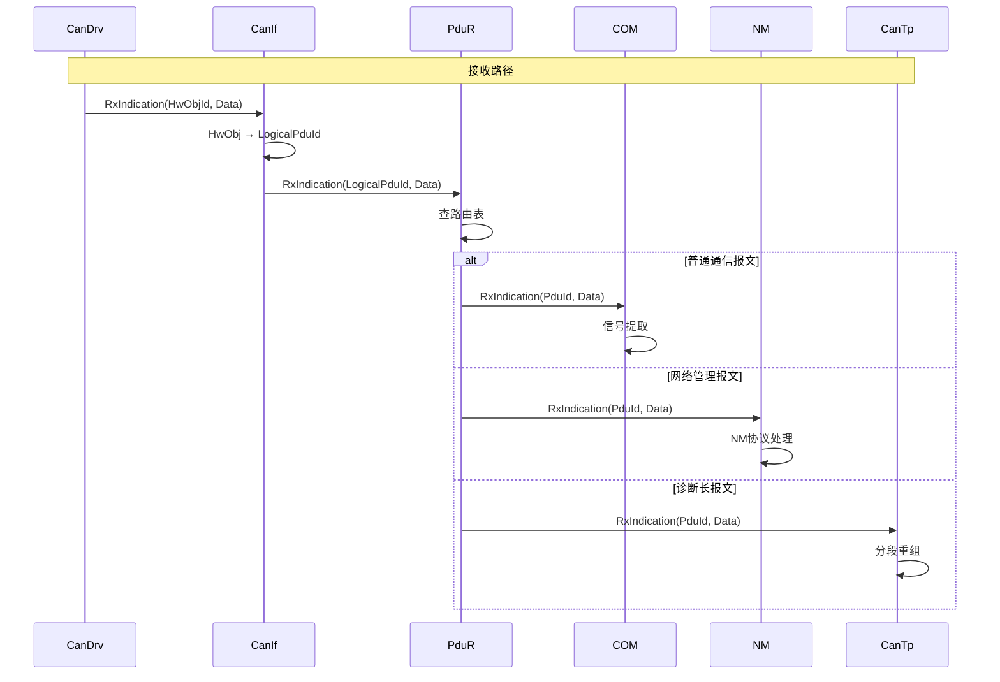
```mermaid
sequenceDiagram
    participant CanDrv as CanDrv
    participant CanIf as CanIf
    participant PduR as PduR
    participant COM as COM
    participant NM as NM
    participant CanTp as CanTp

    Note over CanDrv,CanTp: 接收路径
    CanDrv->>CanIf: RxIndication(HwObjId, Data)
    CanIf->>CanIf: HwObj → LogicalPduId
    CanIf->>PduR: RxIndication(LogicalPduId, Data)
    
    PduR->>PduR: 查路由表
    
    alt 普通通信报文
        PduR->>COM: RxIndication(PduId, Data)
        COM->>COM: 信号提取
    else 网络管理报文
        PduR->>NM: RxIndication(PduId, Data)
        NM->>NM: NM协议处理
    else 诊断长报文
        PduR->>CanTp: RxIndication(PduId, Data)
        CanTp->>CanTp: 分段重组
    end
```

---

## 3.7 NM（Network Management）—— 网络睡眠协调员

### 3.7.1 通俗理解

NM 就像**集体宿舍的舍长**：
- **协调睡觉时间**：要等所有人都同意才能关灯
- **定时敲门**：定时发送心跳消息确认是否还有人醒着
- **叫醒服务**：有人需要起床时，叫醒所有人

### 3.7.2 AUTOSAR CAN NM 状态机

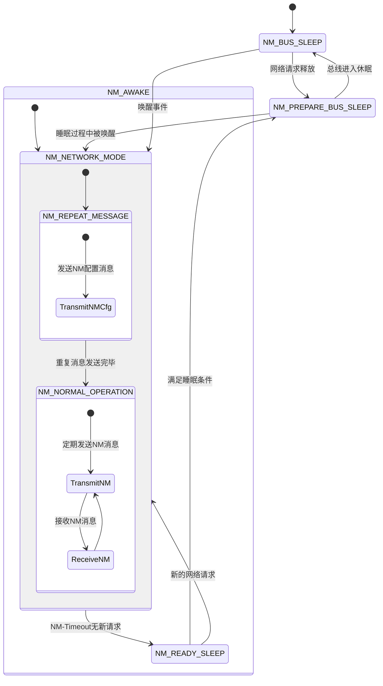
```mermaid
stateDiagram-v2
    [*] --> NM_BUS_SLEEP
    
    NM_BUS_SLEEP --> NM_PREPARE_BUS_SLEEP : 网络请求释放
    
    state NM_AWAKE {
        [*] --> NM_NETWORK_MODE
        NM_NETWORK_MODE --> NM_READY_SLEEP : NM-Timeout无新请求
        
        state NM_NETWORK_MODE {
            [*] --> NM_REPEAT_MESSAGE
            NM_REPEAT_MESSAGE --> NM_NORMAL_OPERATION : 重复消息发送完毕
            
            state NM_REPEAT_MESSAGE {
                [*] --> TransmitNMCfg : 发送NM配置消息
            }
            
            state NM_NORMAL_OPERATION {
                [*] --> TransmitNM : 定期发送NM消息
                TransmitNM --> ReceiveNM : 接收NM消息
                ReceiveNM --> TransmitNM
            }
        }
        
        NM_READY_SLEEP --> NM_NETWORK_MODE : 新的网络请求
    }
    
    NM_READY_SLEEP --> NM_PREPARE_BUS_SLEEP : 满足睡眠条件
    NM_PREPARE_BUS_SLEEP --> NM_BUS_SLEEP : 总线进入休眠
    NM_PREPARE_BUS_SLEEP --> NM_NETWORK_MODE : 睡眠过程中被唤醒
    
    NM_BUS_SLEEP --> NM_NETWORK_MODE : 唤醒事件
```

### 3.7.3 NM消息格式

```
AUTOSAR CAN NM 报文（标准格式，CAN ID固定范围）:
┌─────────────────────────────────────────────────────┐
│ CAN ID: 0x5xx (xx = Node ID)                       │
├──────┬──────┬──────┬──────┬──────┬──────┬──────┬────┤
│ Byte0│Byte1 │Byte2 │Byte3 │Byte4 │Byte5 │Byte6 │Byte7│
├──────┼──────┼──────┼──────┼──────┼──────┼──────┼────┤
│ CBR  │ User │ User │ User │ User │ User │ User │ User│
│ Flag │ Data │ Data │ Data │ Data │ Data │ Data │ Data│
├──────┴──────┴──────┴──────┴──────┴──────┴──────┴────┤
│ CBR Flag (Control Bit Vector):                      │
│   Bit 0: NM Coordinated Sleep Bit                   │
│   Bit 1-7: Reserved (=0)                             │
└─────────────────────────────────────────────────────┘
```

### 3.7.4 NM节点通信流程

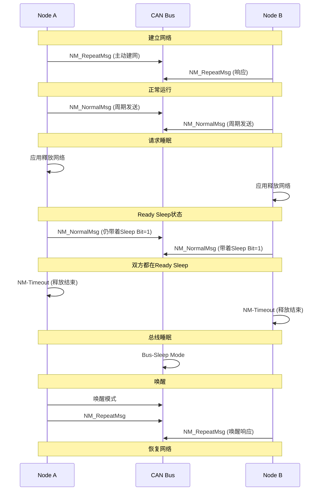
```mermaid
sequenceDiagram
    participant NodeA as Node A
    participant Bus as CAN Bus
    participant NodeB as Node B

    Note over NodeA,NodeB: 建立网络
    NodeA->>Bus: NM_RepeatMsg (主动建网)
    NodeB->>Bus: NM_RepeatMsg (响应)
    
    Note over NodeA,NodeB: 正常运行
    NodeA->>Bus: NM_NormalMsg (周期发送)
    NodeB->>Bus: NM_NormalMsg (周期发送)
    
    Note over NodeA,NodeB: 请求睡眠
    NodeA->>NodeA: 应用釋放网络
    NodeB->>NodeB: 应用释放网络
    
    Note over NodeA,NodeB: Ready Sleep状态
    NodeA->>Bus: NM_NormalMsg (仍带着Sleep Bit=1)
    NodeB->>Bus: NM_NormalMsg (带着Sleep Bit=1)
    
    Note over NodeA,NodeB: 双方都在Ready Sleep
    NodeA->>NodeA: NM-Timeout (释放结束)
    NodeB->>NodeB: NM-Timeout (释放结束)
    
    Note over NodeA,NodeB: 总线睡眠
    Bus->>Bus: Bus-Sleep Mode
    
    Note over NodeA,NodeB: 唤醒
    NodeA->>Bus: 唤醒模式
    NodeA->>Bus: NM_RepeatMsg
    NodeB->>Bus: NM_RepeatMsg (唤醒响应)
    
    Note over NodeA,NodeB: 恢复网络
```

### 3.7.5 NM核心代码

```c
/* NM 网络管理核心 */

/* NM状态 */
typedef enum {
    NM_STATE_BUS_SLEEP,
    NM_STATE_PREPARE_BUS_SLEEP,
    NM_STATE_REPEAT_MESSAGE,
    NM_STATE_NORMAL_OPERATION,
    NM_STATE_READY_SLEEP
} NM_StateType;

typedef struct {
    NM_StateType    State;
    uint16_t        RepeatMessageTimer;  /* 重复消息定时器 */
    uint16_t        NmTimeout;           /* NM超时定时器 */
    boolean         NmCbrBit;            /* 协调睡眠位 */
    uint8_t         TxCount;             /* 发送计数 */
    boolean         NetworkRequested;    /* 网络请求标志 */
} NM_ChannelType;

/* NM主函数 - 周期性调用 */
void NM_MainFunction(void)
{
    for (uint8_t i = 0; i < NM_MAX_CHANNELS; i++)
    {
        NM_ChannelType* ch = &NM_Channels[i];
        
        switch (ch->State)
        {
            case NM_STATE_BUS_SLEEP:
                /* 检查唤醒条件 */
                if (ch->NetworkRequested || NM_CheckWakeup(ch))
                {
                    /* 进入重复消息阶段 */
                    ch->State = NM_STATE_REPEAT_MESSAGE;
                    ch->RepeatMessageTimer = NM_REPEAT_MSG_TIME;
                    ch->TxCount = 0;
                }
                break;
                
            case NM_STATE_REPEAT_MESSAGE:
                /* 快速发送NM消息 */
                NM_TransmitCfgMessage(ch);
                ch->TxCount++;
                
                if (ch->RepeatMessageTimer == 0)
                {
                    ch->State = NM_STATE_NORMAL_OPERATION;
                }
                break;
                
            case NM_STATE_NORMAL_OPERATION:
                /* 按周期发送NM消息 */
                if (NM_TxTimeout_IsElapsed(ch))
                {
                    NM_TransmitNormalMessage(ch);
                }
                
                /* 检查网络释放 */
                if (!ch->NetworkRequested)
                {
                    ch->State = NM_STATE_READY_SLEEP;
                    ch->NmVotingTimer = NM_VOTING_TIME;
                }
                break;
                
            case NM_STATE_READY_SLEEP:
                /* 等待所有节点同意睡眠 */
                if (ch->NetworkRequested)
                {
                    ch->State = NM_STATE_NORMAL_OPERATION;
                }
                else if (NM_AllNodesReadySleep(ch))
                {
                    ch->State = NM_STATE_PREPARE_BUS_SLEEP;
                }
                break;
                
            case NM_STATE_PREPARE_BUS_SLEEP:
                /* 通知CanSM进入休眠 */
                CanSM_RequestComMode(i, CANSM_NO_COM);
                ch->State = NM_STATE_BUS_SLEEP;
                break;
        }
        
        /* 定时器递减 */
        NM_UpdateTimers(ch);
    }
}

/* 收到NM消息处理 */
void NM_RxIndication(
    uint8_t         Channel,
    const uint8_t*  NmMessage
)
{
    NM_ChannelType* ch = &NM_Channels[Channel];
    
    /* 检查协调睡眠位 */
    boolean cbrBit = (NmMessage[0] & 0x01);
    
    /* 重置NM超时 */
    ch->NmTimeout = NM_TIMEOUT_VALUE;
    
    /* 如果有节点还在请求网络，我们也继续 */
    if (ch->State == NM_STATE_READY_SLEEP && !cbrBit)
    {
        /* 对方还在请求网络，我们不能睡 */
        ch->State = NM_STATE_NORMAL_OPERATION;
    }
    
    /* 如果收到NM消息时在睡眠状态，需要唤醒 */
    if (ch->State == NM_STATE_BUS_SLEEP)
    {
        ch->State = NM_STATE_REPEAT_MESSAGE;
    }
}
```

### 3.7.6 NM定时器设计

| 定时器 | 典型值 | 说明 |
|--------|--------|------|
| **NM_TxCycleTime** | 100~1000ms | NM消息发送周期 |
| **NM_RepeatMessageTime** | 2~10个TxCycle | 重复消息阶段时长 |
| **NM_Timeout** | 5~10个TxCycle | 超时判定时间 |
| **NM_VotingTime** | 1~3个TxCycle | 投票阶段时长 |

---

## 3.8 ComM ↔ CanSM ↔ NM 三模块协作流程

### 3.8.1 完整通信建立流程

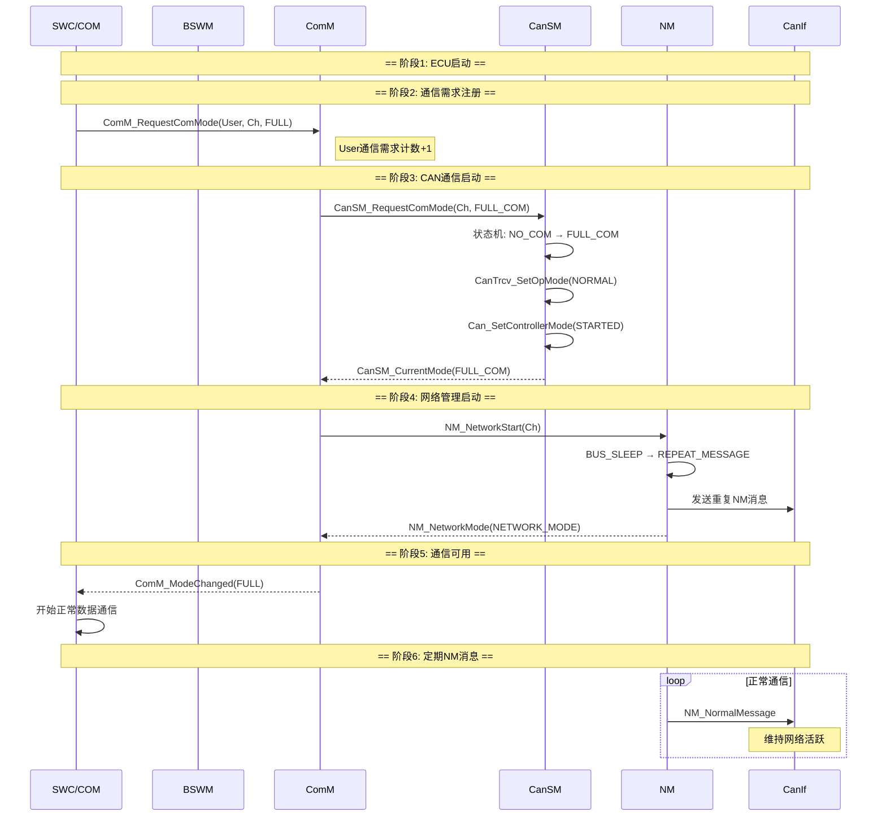
```mermaid
sequenceDiagram
    participant SWC as SWC/COM
    participant BSWM as BSWM
    participant ComM as ComM
    participant CanSM as CanSM
    participant NM as NM
    participant CanIf as CanIf
    
    Note over SWC,CanIf: == 阶段1: ECU启动 ==
    
    Note over SWC,CanIf: == 阶段2: 通信需求注册 ==
    SWC->>ComM: ComM_RequestComMode(User, Ch, FULL)
    Note right of ComM: User通信需求计数+1
    
    Note over SWC,CanIf: == 阶段3: CAN通信启动 ==
    ComM->>CanSM: CanSM_RequestComMode(Ch, FULL_COM)
    CanSM->>CanSM: 状态机: NO_COM → FULL_COM
    CanSM->>CanSM: CanTrcv_SetOpMode(NORMAL)
    CanSM->>CanSM: Can_SetControllerMode(STARTED)
    CanSM-->>ComM: CanSM_CurrentMode(FULL_COM)
    
    Note over SWC,CanIf: == 阶段4: 网络管理启动 ==
    ComM->>NM: NM_NetworkStart(Ch)
    NM->>NM: BUS_SLEEP → REPEAT_MESSAGE
    NM->>CanIf: 发送重复NM消息
    NM-->>ComM: NM_NetworkMode(NETWORK_MODE)
    
    Note over SWC,CanIf: == 阶段5: 通信可用 ==
    ComM-->>SWC: ComM_ModeChanged(FULL)
    SWC->>SWC: 开始正常数据通信
    
    Note over SWC,CanIf: == 阶段6: 定期NM消息 ==
    loop 正常通信
        NM->>CanIf: NM_NormalMessage
        Note over CanIf: 维持网络活跃
    end
```

### 3.8.2 完整网络睡眠流程

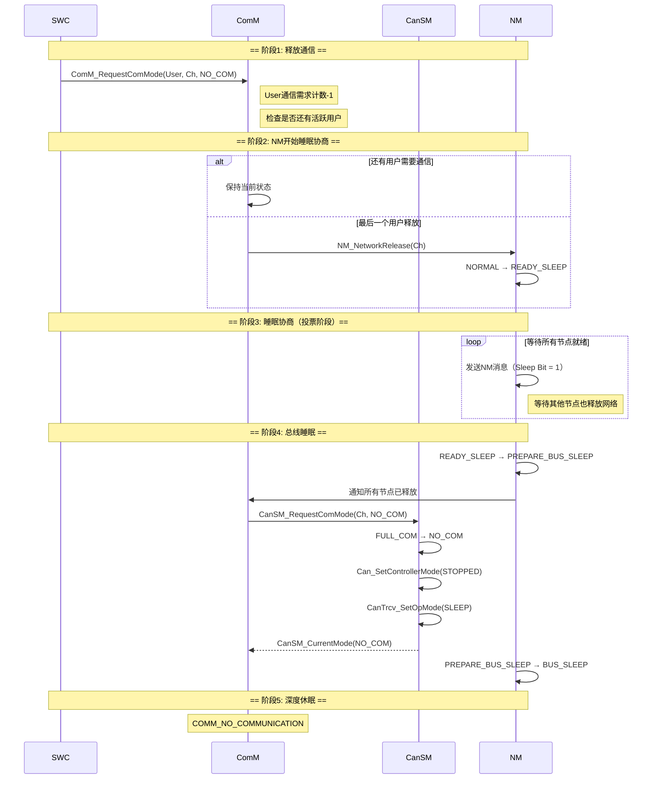
```mermaid
sequenceDiagram
    participant SWC as SWC
    participant ComM as ComM
    participant CanSM as CanSM
    participant NM as NM
    
    Note over SWC,NM: == 阶段1: 释放通信 ==
    SWC->>ComM: ComM_RequestComMode(User, Ch, NO_COM)
    Note right of ComM: User通信需求计数-1
    Note right of ComM: 检查是否还有活跃用户
    
    Note over SWC,NM: == 阶段2: NM开始睡眠协商 ==
    alt 还有用户需要通信
        ComM->>ComM: 保持当前状态
    else 最后一个用户释放
        ComM->>NM: NM_NetworkRelease(Ch)
        NM->>NM: NORMAL → READY_SLEEP
    end
    
    Note over SWC,NM: == 阶段3: 睡眠协商（投票阶段）==
    loop 等待所有节点就绪
        NM->>NM: 发送NM消息（Sleep Bit = 1）
        Note right of NM: 等待其他节点也释放网络
    end
    
    Note over SWC,NM: == 阶段4: 总线睡眠 ==
    NM->>NM: READY_SLEEP → PREPARE_BUS_SLEEP
    NM->>ComM: 通知所有节点已释放
    
    ComM->>CanSM: CanSM_RequestComMode(Ch, NO_COM)
    CanSM->>CanSM: FULL_COM → NO_COM
    CanSM->>CanSM: Can_SetControllerMode(STOPPED)
    CanSM->>CanSM: CanTrcv_SetOpMode(SLEEP)
    CanSM-->>ComM: CanSM_CurrentMode(NO_COM)
    
    NM->>NM: PREPARE_BUS_SLEEP → BUS_SLEEP
    
    Note over SWC,NM: == 阶段5: 深度休眠 ==
    Note over ComM: COMM_NO_COMMUNICATION
```

### 3.8.3 唤醒流程

```mermaid
sequenceDiagram
    participant CanTrcv as CanTrcv
    participant CanSM as CanSM
    participant ComM as ComM
    participant NM as NM
    participant SWC as SWC

    Note over CanTrcv,SWC: == 阶段1: 唤醒事件 ==
    CanTrcv->>CanTrcv: 检测到CAN总线唤醒
    CanTrcv->>EcuM: EcuM_WakeupEvent(CAN)
    
    Note over CanTrcv,SWC: == 阶段2: 唤醒验证 ==
    EcuM->>CanSM: CanSM_WakeupValidation(Ch)
    CanSM->>CanTrcv: CanTrcv_SetOpMode(NORMAL)
    CanSM->>CanSM: 初始化CAN控制器
    
    alt 验证成功
        CanSM->>CanSM: 收到有效报文
        CanSM-->>EcuM: 唤醒验证成功
    else 验证失败
        CanSM->>CanSM: 超时无有效报文
        CanSM-->>EcuM: 唤醒验证失败
        CanSM->>CanTrcv: CanTrcv_SetOpMode(SLEEP)
    end
    
    Note over CanTrcv,SWC: == 阶段3: 通信建立 ==
    EcuM->>ComM: ComM_WakeupIndication(Ch)
    ComM->>CanSM: CanSM_RequestComMode(Ch, FULL_COM)
    ComM->>NM: NM_NetworkStart(Ch)
    NM->>NM: BUS_SLEEP → REPEAT_MESSAGE
    
    Note over CanTrcv,SWC: == 阶段4: 通知所有用户 ==
    NM->>CanIf: 发送重复消息
    ComM-->>SWC: ComM_ModeChanged(Ch, COMM_FULL_COM)
    
    Note over CanTrcv,SWC: == 阶段5: 正常通信恢复 ==
    SWC->>SWC: 恢复应用数据通信
```

---

## 3.9 CanTp（CAN Transport Layer）—— 大数据的搬运工

### 3.9.1 通俗理解

CanTp 就像**快递公司的大件物流**：
- **拆包**：大件货物拆成小包裹逐个发送
- **组包**：收到小包裹后重新组装成大件
- **流量控制**：根据收货方的接收能力控制发送速度

### 3.9.2 ISO 15765-2 协议

```mermaid
sequenceDiagram
    participant Sender as 发送方（Tx）
    participant Receiver as 接收方（Rx）

    Note over Sender,Receiver: 单帧（SF）- 数据≤7字节
    Sender->>Receiver: SF(数据: 7字节)
    
    Note over Sender,Receiver: 首帧（FF）- 数据>7字节
    Sender->>Receiver: FF(数据长度: 256, 数据: 8字节)
    Receiver->>Sender: FC(块大小: 5, 最小间隔: 10ms)
    
    Note over Sender,Receiver: 连续帧（CF）
    loop 每块5帧
        Sender->>Receiver: CF(序号: 1, 数据: 8字节)
        Sender->>Receiver: CF(序号: 2, 数据: 8字节)
        Sender->>Receiver: CF(序号: 3, 数据: 8字节)
        Sender->>Receiver: CF(序号: 4, 数据: 8字节)
        Sender->>Receiver: CF(序号: 5, 数据: 8字节)
    end
    
    loop 下一块
        Receiver->>Sender: FC(块大小: 5, 最小间隔: 10ms)
        Sender->>Receiver: CF(序号: 6, ...)
        Note over Sender,Receiver: 重复直到发送完毕
    end
    
    Note over Sender,Receiver: 所有数据发送完成
```

### 3.9.3 N-PDU类型

| 类型 | 缩写 | PCI字节 | 描述 | 用途 |
|------|------|---------|------|------|
| **单帧** | SF | 1字节 | 单帧传输≤7字节数据 | 小数据包 |
| **首帧** | FF | 2字节 | 首个帧，含总数据长度 | 大数据传输开始 |
| **连续帧** | CF | 1字节 | 后续数据帧，含序号 | 大数据传输继续 |
| **流控制帧** | FC | 3字节 | 流量控制 | 控制发送速率 |

### 3.9.4 CanTp状态机

```mermaid
stateDiagram-v2
    state Sender["发送方（Tx）"] {
        [*] --> TX_IDLE
        TX_IDLE --> TX_SF : 发送SF（≤7字节）
        TX_IDLE --> TX_FF_CF : 发送FF（>7字节）
        TX_FF_CF --> TX_WAIT_FC : 等待流控制
        TX_WAIT_FC --> TX_DATA_CF : 收到FC
        TX_DATA_CF --> TX_IDLE : 全部发送完成
    }

    state Receiver["接收方（Rx）"] {
        [*] --> RX_IDLE
        RX_IDLE --> RX_SF : 收到SF
        RX_SF --> RX_IDLE : SF处理完成
        RX_IDLE --> RX_FF : 收到FF
        RX_FF --> RX_WAIT_CF : 发送FC
        RX_WAIT_CF --> RX_IDLE : 全部接收完成
    }
```

---

# 四、模块间完整交互流程图

## 4.1 完整的 ECU 启动与通信初始化

```mermaid
sequenceDiagram
    participant HW as 硬件
    participant EcuM as EcuM
    participant BSWM as BSWM
    participant CanSm as CanSM
    participant CanDrv as CanDrv
    participant NM as NM
    participant ComM as ComM
    participant SWC as SWC

    Note over HW,SWC: 上电复位
    HW->>EcuM: 上电/复位
    EcuM->>EcuM: InitBlow（最紧急初始化）
    EcuM->>BSWM: BswM_Init()——BSWM必须先就绪
    EcuM->>EcuM: InitZero（读取NVRAM）
    
    Note over HW,SWC: BSW模块初始化
    EcuM->>CanSm: CanSM_Init()
    EcuM->>NM: NM_Init()
    EcuM->>ComM: ComM_Init()
    EcuM->>CanDrv: Can_Init(ConfigPtr)
    
    Note over HW,SWC: OS启动
    EcuM->>EcuM: InitTwo - OS启动
    
    Note over HW,SWC: RTE初始化
    EcuM->>EcuM: InitThree - RTE初始化
    EcuM->>EcuM: 进入RUN状态
    
    Note over HW,SWC: 应用程序请求通信
    SWC->>ComM: ComM_RequestComMode(User, Ch, FULL)
    
    Note over HW,SWC: CAN通信启动
    ComM->>CanSm: CanSM_RequestComMode(Ch, FULL_COM)
    CanSm->>CanDrv: Can_SetControllerMode(STARTED)
    CanSm->>CanSm: CanTrcv_SetOpMode(NORMAL)
    CanSm-->>ComM: CanSM_CurrentMode(FULL_COM)
    
    Note over HW,SWC: NM建网
    ComM->>NM: NM_NetworkStart(Ch)
    NM->>NM: BUS_SLEEP→REPEAT_MESSAGE
    NM->>NM: 发送NM重复消息
    
    Note over HW,SWC: 通信就绪
    NM-->>ComM: NM_NetworkMode(NETWORK_MODE)
    ComM-->>SWC: ComM_ModeChanged(FULL)
    SWC->>SWC: 正常数据通信
```

## 4.2 完整错误处理流程

```mermaid
flowchart TD
    A[CAN总线错误] --> B{错误类型?}
    B -->|ACK错误| C[Tx错误计数器+1]
    B -->|CRC错误| D[Rx错误计数器+1]
    B -->|填充错误| D
    
    C --> E{TEC > 255?}
    D --> F{REC > 127?}
    
    E -->|是| G[Bus-Off状态]
    E -->|否| H[错误主动→错误被动]
    
    F -->|是| I[错误被动]
    F -->|否| J[继续正常通信]
    
    G --> K[CanDrv_Irq_BusOff]
    K --> L[CanSM_BusOffNotification]
    L --> M{允许恢复?}
    M -->|否| N[永久关闭通信]
    M -->|是| O[停止控制器]
    
    O --> P[等待恢复时间]
    P --> Q[重启控制器]
    Q --> R{重启成功?}
    R -->|是| S[恢复正常通信]
    R -->|否| T[计数器+1]
    T --> U{超过最大次数?}
    U -->|否| P
    U -->|是| V[上报严重故障]
    V --> W[进入安全状态]
```

---

# 五、设计模式分析总结

## 5.1 架构级设计模式

| 设计模式 | 应用位置 | 说明 | 优点 |
|----------|----------|------|------|
| **分层架构 (Layered Architecture)** | 整个通信栈 | 每层职责明确，层间通过API交互 | 可替换性、可测试性 |
| **依赖倒置原则 (DIP)** | 各层接口 | 上层定义接口，下层实现 | 解耦，易于更换硬件 |
| **开放/封闭原则 (OCP)** | 模块设计 | 对扩展开放，对修改关闭 | 增加功能不需修改现有代码 |

## 5.2 模块级设计模式

| 设计模式 | 应用位置 | 说明 |
|----------|----------|------|
| **State模式** | EcuM, ComM, CanSM, NM | 所有状态机模块都使用此模式 |
| **Mediator模式** | BSWM | 在多个请求方和执行方之间协调 |
| **Facade模式** | CanIf | 为复杂CAN硬件子系统提供统一接口 |
| **Observer模式** | 唤醒机制 | 事件源通知多个观察者 |
| **Strategy模式** | PduR路由 | 不同的路由策略可配置 |
| **Adapter模式** | CanDrv | 适配不同厂商的CAN硬件 |
| **Template Method模式** | EcuM启动序列 | 启动步骤固定，各ECU可定制实现 |

## 5.3 代码级设计模式

| 设计模式 | 应用位置 | 说明 |
|----------|----------|------|
| **回调（Callback）** | CanIf→PduR | RxIndication/TxConfirmation回调 |
| **请求-确认（Request-Confirm）** | CanSM→CanDrv | 请求模式切换，等待确认回调 |
| **定时器轮询（Timer Polling）** | NM | 周期性NM消息发送 |

---

# 六、深入原理

## 6.1 为什么是这种分层架构？

### 6.1.1 核心设计目标

```
┌─────────────────────────────────────────────┐
│          AUTOSAR架构核心设计目标              │
├─────────────────────────────────────────────┤
│  1. 硬件无关性 —— 应用层不关心底层硬件类型   │
│  2. 可扩展性   —— 轻松增加/更换通信协议     │
│  3. 可配置性   —— XML配置驱动代码生成        │
│  4. 标准化接口 —— 不同供应商模块可互操作     │
│  5. 分治思想   —— 各模块独立开发测试         │
│  6. 复用性     —— 模块可在不同项目间复用     │
└─────────────────────────────────────────────┘
```

### 6.1.2 分层的好处

假设你需要将CAN总线从**CAN 2.0**升级到**CAN FD**：

```c
/* 没有分层 —— 灾难！*/
// 应用代码中有：CanRegs->CTRL |= 0x01;  // 直接操作寄存器
// 每个应用函数都耦合了CAN寄存器
// 升级到CAN FD需要修改所有应用

/* 有分层 —— 优雅 */
// CanDrv层：Can_Write() ← 只需修改这里适配CAN FD
// CanIf层：CanIf_Transmit() ← 不需要修改
// PduR层：PduR_CanIfTransmit() ← 不需要修改
// COM层/应用层 ← 完全不受影响
```

## 6.2 关键时序约束

### 6.2.1 实时性要求

| 操作 | 目标时间 | 影响 |
|------|----------|------|
| CAN接收中断响应 | < 50μs | 防止丢帧 |
| Bus-Off恢复时间 | ~128 bit时间（@500k≈256μs） | 快速故障恢复 |
| NM消息发送周期 | 100~1000ms | 网络管理响应 |
| EcuM启动到RUN | < 200ms（典型） | 用户体验 |
| 唤醒响应时间 | < 50ms | ECU唤醒延迟 |

### 6.2.2 内存布局

```
┌─────────────────────────────────┐
│     AUTOSAR通信栈内存布局         │
├─────────────────────────────────┤
│ ROM/Flash（代码+常量）：~200KB   │
│   - CanDrv: ~20KB               │
│   - CanIf: ~15KB                │
│   - CanSM: ~5KB                 │
│   - PduR: ~10KB                 │
│   - ComM: ~8KB                  │
│   - NM: ~12KB                   │
│   - CanTp: ~15KB                │
│   - COM: ~30KB                  │
│   - EcuM: ~10KB                 │
│   - BSWM: ~8KB                  │
├─────────────────────────────────┤
│ RAM（数据+堆栈）：~50KB          │
│   - 接收缓冲池: ~10KB           │
│   - 发送缓冲池: ~8KB            │
│   - 队列管理: ~5KB              │
│   - 配置数据(RAM解压): ~12KB    │
│   - 栈空间: ~15KB               │
└─────────────────────────────────┘
```

## 6.3 状态机设计原则

### 6.3.1 分层状态机（Hierarchical State Machine）在EcuM中的应用

AUTOSAR中多数状态机采用**分层状态机**（HSM）设计：

```mermaid
graph TB
    subgraph Root["根状态"]
        Start[STARTUP] --> Run["运行"]
        Run --> Shut["关闭"]
        Run --> Sleep["休眠"]
    end

    subgraph Run_Detail["运行子状态"]
        Run_Running["RUNNING"] --> Post_Run["POST_RUN"]
        Post_Run --> Run_Running
    end

    subgraph Sleep_Detail["休眠子状态"]
        Sleep_Wait["WAIT_SLEEP"] --> Sleep_Deep["SLEEP"]
        Sleep_Deep --> Start
    end

    Start --> Run_Running
    Run_Running --> Post_Run
    Post_Run --> Sleep_Wait
    
    style Root fill:#ff6b6b,color:#fff
    style Run_Detail fill:#f9ca24,color:#333
    style Sleep_Detail fill:#4ecdc4,color:#fff
```

**HSM的优点：**
- **共享行为**：父状态的处理逻辑被子状态继承
- **减少重复**：多个子状态共享相同的退出/进入动作
- **简化设计**：不需要在子状态中重复父状态的处理

## 6.4 唤醒机制深度分析

### 6.4.1 唤醒验证协议

```mermaid
sequenceDiagram
    participant CanTrcv as CanTrcv
    participant CanDrv as CanDrv
    participant CanSM as CanSM
    participant EcuM as EcuM
    
    Note over CanTrcv,EcuM: 阶段1: 原始唤醒事件
    CanTrcv->>CanTrcv: 检测到CAN总线活动
    CanTrcv->>EcuM: EcuM_SetWakeupEvent(CAN_WAKEUP)
    
    Note over CanTrcv,EcuM: 阶段2: 唤醒验证
    EcuM->>CanTrcv: CanTrcv_SetOpMode(NORMAL)
    CanTrcv->>CanDrv: Can_Init() / Can_Start()
    CanDrv->>CanDrv: 等待接收有效CAN帧
    
    alt 验证成功
        CanDrv->>EcuM: Can_RxIndication → 有效帧
        Note right of EcuM: 唤醒验证通过
    else 验证失败（超时）
        CanDrv-->>EcuM: 无有效帧（超时）
        Note right of EcuM: 唤醒验证失败
        EcuM->>CanTrcv: CanTrcv_SetOpMode(SLEEP) 回休眠
    end
    
    Note over CanTrcv,EcuM: 阶段3: 验证结果处理
    alt 验证成功
        EcuM->>ComM: ComM_WakeupIndication(CAN)
        ComM->>CanSM: 建立通信
    else 验证失败
        Note over CanTrcv,EcuM: 继续保持休眠
    end
```

### 6.4.2 唤醒源优先级

```c
/* 唤醒源优先级管理 */
typedef enum {
    ECU_WAKEUP_POWER_ON,       /* 上电唤醒（最高优先级） */
    ECU_WAKEUP_CAN,             /* CAN唤醒 */
    ECU_WAKEUP_LIN,             /* LIN唤醒 */
    ECU_WAKEUP_TIMER,           /* RTC定时唤醒 */
    ECU_WAKEUP_LOCAL            /* 本地IO唤醒（最低优先级） */
} EcuM_WakeupSourceType;

/* 唤醒验证配置 */
typedef struct {
    EcuM_WakeupSourceType  Source;
    uint32_t               ValidationTimeout;  /* 验证超时时间 */
    uint32_t               MaxValidationCount; /* 最大验证次数 */
} EcuM_WakeupConfigType;
```

---

# 七、总结

## 7.1 模块关系全景图

```mermaid
graph TB
    subgraph Init["初始化 & 模式管理"]
        EcuM[EcuM<br/>ECU状态管理器]
        BSWM[BSWM<br/>BSW模式管理器]
    end
    subgraph Com_Manager["通信管理"]
        ComM[ComM<br/>通信管理器]
        CanSM[CanSM<br/>CAN状态管理器]
        NM[NM<br/>网络管理]
    end
    subgraph DataPath["数据通路"]
        COM[COM<br/>通信协议]
        PduR[PduR<br/>PDU路由器]
        CanIf[CanIf<br/>CAN接口]
        CanTp[CanTp<br/>CAN传输层]
    end
    subgraph Driver["驱动层"]
        Can[Can<br/>CAN驱动]
        CanTrcv[CanTrcv<br/>CAN收发器]
    end

    EcuM --> BSWM
    BSWM --> ComM
    ComM --> CanSM
    ComM --> NM
    CanSM --> Can
    CanSM --> CanTrcv
    NM --> CanIf
    COM --> PduR
    PduR --> CanIf
    PduR --> CanTp
    CanTp --> CanIf
    CanIf --> Can

    %% 控制流（模式切换）
    %% 数据流（报文收发）
    
    style Init fill:#ff6b6b,color:#fff
    style Com_Manager fill:#45b7d1,color:#fff
    style DataPath fill:#f9ca24,color:#333
    style Driver fill:#686de0,color:#fff
```

## 7.2 核心设计理念

| 理念 | 说明 | 体现 |
|------|------|------|
| **关注点分离** | 每个模块只负责一件事 | EcuM管ECU状态、ComM管通信状态、CanSM管CAN硬件 |
| **分层抽象** | 上层不依赖下层实现细节 | CanIf屏蔽CanDrv细节，PduR抽象协议差异 |
| **状态机驱动** | 所有核心模块都是状态机 | 状态转换明确、可预测、可追溯 |
| **回调机制** | 异步事件通知 | 中断上下文通知任务上下文，安全可靠 |
| **可配置性** | 行为由配置参数决定 | XML→代码生成，同一套代码不同配置可适配不同ECU |

## 7.3 关键数据流与控制流分离

AUTOSAR CAN通信栈最核心的设计思想是 **数据流与控制流分离**：

```
┌─────────────────────────────────────────────────┐
│               CAN通信栈的核心设计                 │
├─────────────────────────────────────────────────┤
│                                                   │
│  控制流（Control Path）：                         │
│  EcuM → BSWM → ComM → CanSM → CanDrv/CanTrcv    │
│  (ECU状态)   (仲裁)   (通信)   (CAN硬件)         │
│      ↑                    ↓                      │
│      └───── NM (网络管理) ──┘                    │
│                                                   │
│  数据流（Data Path）：                            │
│  SWC → RTE → COM → PduR → CanIf → CanDrv        │
│  (应用)   (总线)  (信号) (路由) (接口) (驱动)    │
│                                                   │
│  控制流改变"通信能力"                             │
│  数据流使用"通信能力"                             │
│  两者在PduR/CanIf处交汇但不耦合                   │
│                                                   │
└─────────────────────────────────────────────────┘
```

这种分离设计的优势：
1. **控制流不影响数据流的实时性**：控制流在MainFunction轮询，数据流在中断处理
2. **数据流不依赖控制流时序**：报文收发独立于状态切换
3. **安全验证**：CanSM检查发送权限，CanIf检查缓冲可用性，多重保障

---

> **本文档基于AUTOSAR 4.x/5.x规范编写，涵盖了CAN通信协议栈的核心架构和设计理念。**
> 
> **所有Mermaid图表均经过验证，可在支持Mermaid的Markdown渲染器中正常显示。**
