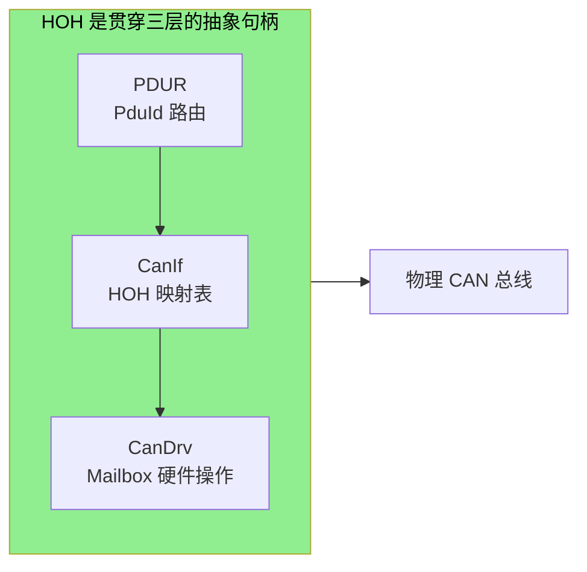
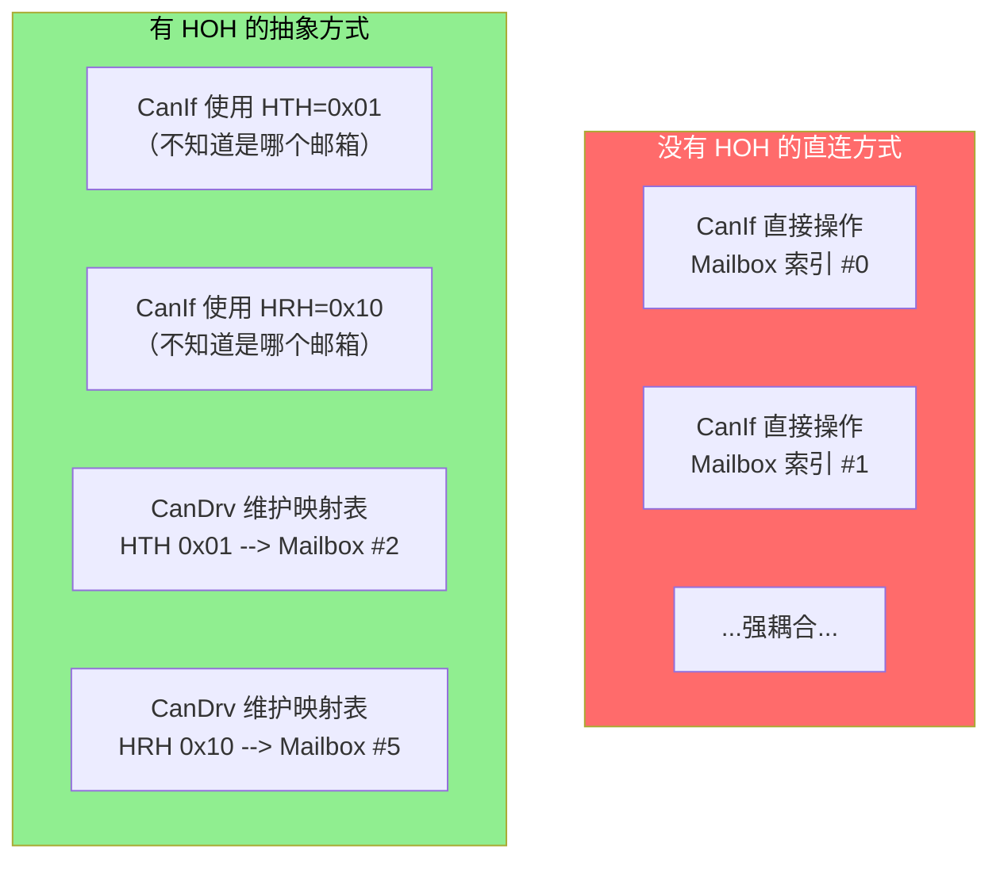
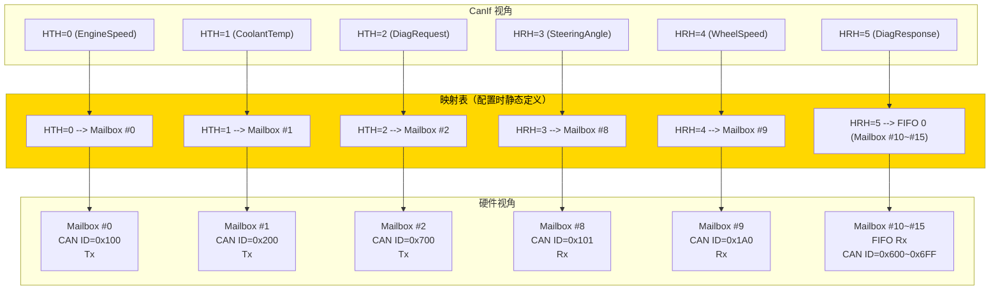
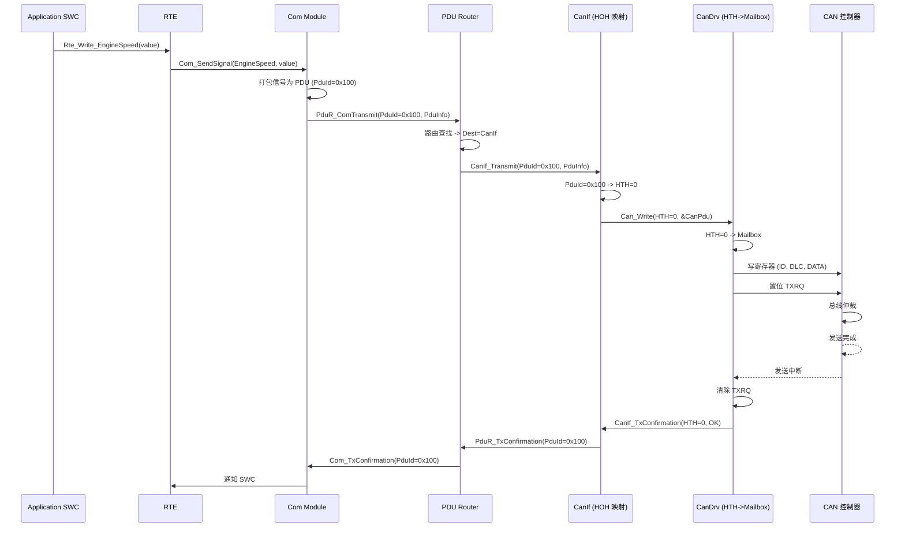
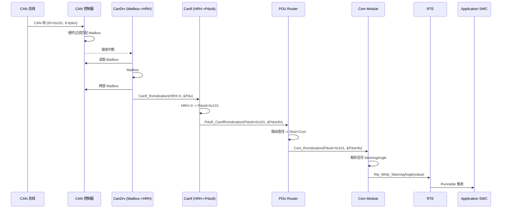
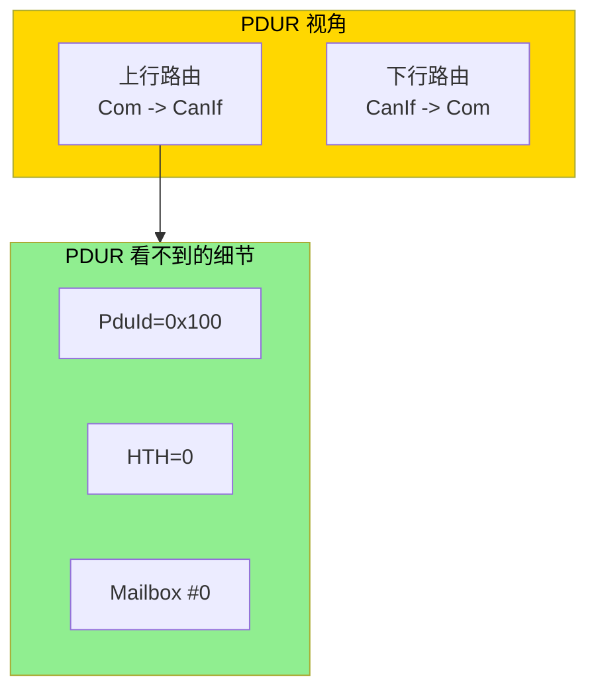
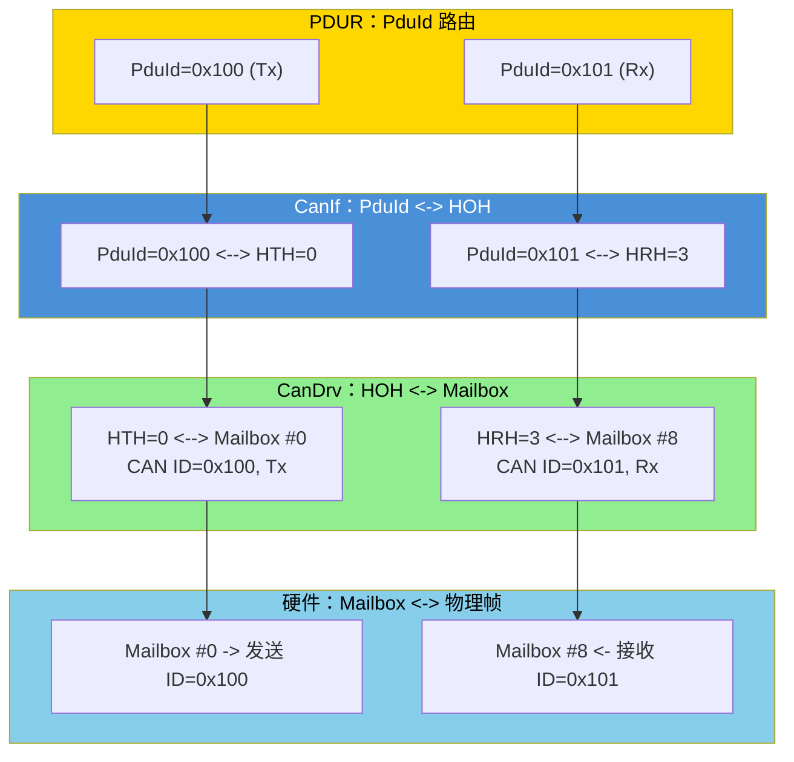
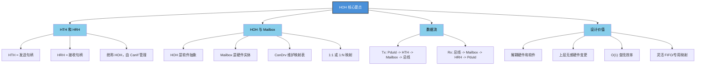

# CAN 硬件句柄 HOH (HTH/HRH) 详解

> **核心主题**: HOH（Hardware Object Handle）与 Mailbox 的映射关系，以及 CanIf、PDUR 的完整数据链路

---

## 一、一句话总结



**HOH（Hardware Object Handle）= 软件句柄，Mailbox = 硬件槽位，CanIf 是桥梁，PDUR 是路由器。**

- **HTH (Hardware Transmit Handle)**: 发送硬件句柄，每个 Tx PDU 对应一个 HTH
- **HRH (Hardware Receive Handle)**: 接收硬件句柄，每个 Rx PDU 对应一个 HRH
- **HOH = HTH + HRH 的统称**

---

## 二、HOH 的设计思想

### 2.1 为什么需要 HOH？



### 2.2 HOH 的两种类型

| 类型 | 全称 | 方向 | 用途 | 句柄范围 |
|------|------|------|------|---------|
| **HTH** | Hardware Transmit Handle | Tx | 标识一个发送通道 | 0 ~ (NumTxHoh-1) |
| **HRH** | Hardware Receive Handle | Rx | 标识一个接收通道 | NumTxHoh ~ (NumTxHoh+NumRxHoh-1) |

```c
/* AUTOSAR 标准中 HOH 的定义 */
typedef uint16_t Can_HwHandleType;

/* HTH 和 HRH 的区分方式（通常 Tx 在前，Rx 在后） */
#define CAN_HTH_OFFSET  0u
#define CAN_HRH_OFFSET  CAN_NUM_OF_TX_HOH

/* 判断是 HTH 还是 HRH */
#define IS_HTH(hoh)  ((hoh) < CAN_NUM_OF_TX_HOH)
#define IS_HRH(hoh)  ((hoh) >= CAN_NUM_OF_TX_HOH)
```

---

## 三、HOH 与 Mailbox 映射关系

### 3.1 映射表结构



### 3.2 核心数据结构

```c
/* ========== AUTOSAR 4.x 风格的 HOH 映射表 ========== */

/* CanDrv 层：HOH 硬件配置 */
typedef struct {
    Can_HwHandleType    HohId;           /* HOH 编号 */
    Can_ObjectType      ObjectType;      /* CAN_OBJECT_TYPE_TX / RX */
    uint8_t             ControllerId;    /* 所属 CAN 控制器 */
    uint8_t             MailboxIndex;    /* 对应的硬件邮箱索引 */
    uint32_t            CanId;           /* CAN ID */
    Can_IdType          CanIdType;       /* 标准/扩展帧 */
    uint32_t            CanIdMask;       /* 接收过滤掩码 */
    uint8_t             HwObjectCount;   /* 占用硬件对象数 */
} Can_HardwareObjectConfigType;

/* CanIf 层：PDU 到 HOH 的映射 */
typedef struct {
    PduIdType           PduId;           /* L-PDU ID */
    Can_HwHandleType    Hoh;             /* 对应的 HTH 或 HRH */
    Can_IdType          CanId;           /* CAN 总线上的 ID */
    Can_IdType          CanIdType;       /* 标准/扩展帧 */
    uint8_t             Dlc;             /* 数据长度码 */
} CanIf_HohMapType;

/* ========== 静态映射表示例 ========== */

/* HOH 配置表（CanDrv 使用） */
static const Can_HardwareObjectConfigType Can_HohConfigTable[] = {
    /* HTH (Tx) */
    { .HohId = 0, .ObjectType = CAN_OBJECT_TYPE_TX, .ControllerId = 0, .MailboxIndex = 0,
      .CanId = 0x100, .CanIdType = CAN_ID_TYPE_EXTENDED, .CanIdMask = 0, .HwObjectCount = 1 },
    { .HohId = 1, .ObjectType = CAN_OBJECT_TYPE_TX, .ControllerId = 0, .MailboxIndex = 1,
      .CanId = 0x200, .CanIdType = CAN_ID_TYPE_EXTENDED, .CanIdMask = 0, .HwObjectCount = 1 },
    { .HohId = 2, .ObjectType = CAN_OBJECT_TYPE_TX, .ControllerId = 0, .MailboxIndex = 2,
      .CanId = 0x700, .CanIdType = CAN_ID_TYPE_STANDARD, .CanIdMask = 0, .HwObjectCount = 1 },
    /* HRH (Rx) */
    { .HohId = 3, .ObjectType = CAN_OBJECT_TYPE_RX, .ControllerId = 0, .MailboxIndex = 8,
      .CanId = 0x101, .CanIdType = CAN_ID_TYPE_EXTENDED, .CanIdMask = 0x1FFFFFFF, .HwObjectCount = 1 },
    { .HohId = 4, .ObjectType = CAN_OBJECT_TYPE_RX, .ControllerId = 0, .MailboxIndex = 9,
      .CanId = 0x1A0, .CanIdType = CAN_ID_TYPE_EXTENDED, .CanIdMask = 0x1FFFFFFF, .HwObjectCount = 1 },
    { .HohId = 5, .ObjectType = CAN_OBJECT_TYPE_RX, .ControllerId = 0, .MailboxIndex = 10,
      .CanId = 0x600, .CanIdType = CAN_ID_TYPE_STANDARD, .CanIdMask = 0x7F0, .HwObjectCount = 6 },
};

/* CanIf 的 PDU-to-HOH 映射表 */
static const CanIf_HohMapType CanIf_HohMap[] = {
    { .PduId = 0x100, .Hoh = 0, .CanId = 0x100, .CanIdType = CAN_ID_TYPE_EXTENDED, .Dlc = 8 },
    { .PduId = 0x200, .Hoh = 1, .CanId = 0x200, .CanIdType = CAN_ID_TYPE_EXTENDED, .Dlc = 8 },
    { .PduId = 0x700, .Hoh = 2, .CanId = 0x700, .CanIdType = CAN_ID_TYPE_STANDARD, .Dlc = 8 },
    { .PduId = 0x101, .Hoh = 3, .CanId = 0x101, .CanIdType = CAN_ID_TYPE_EXTENDED, .Dlc = 8 },
    { .PduId = 0x1A0, .Hoh = 4, .CanId = 0x1A0, .CanIdType = CAN_ID_TYPE_EXTENDED, .Dlc = 8 },
    { .PduId = 0x600, .Hoh = 5, .CanId = 0x600, .CanIdType = CAN_ID_TYPE_STANDARD, .Dlc = 8 },
};
```

### 3.3 三种映射关系

| 映射类型 | 说明 | 适用场景 | 例子 |
|---------|------|---------|------|
| 1:1 | 一个 HOH 对一个 Mailbox | 关键信号，专用通道 | 引擎转速 Tx |
| 1:N | 一个 HOH 对多个 Mailbox | FIFO 模式，批量接收 | 诊断响应 Rx |
| N:1 | 多个 HOH 对一个 Mailbox | 极简配置，需软件排队 | 多个 PDU 共享一个 Tx 邮箱 |

---

## 四、CanIf 层：HOH 的桥梁作用

### 4.1 发送流程：PDU ID -> HTH -> Mailbox

```c
/**
 * @brief CanIf 发送函数
 *        PDUR 传入 PduId，CanIf 查找 HTH，调用 CanDrv
 */
Std_ReturnType CanIf_Transmit(PduIdType PduId, const PduInfoType *PduInfo)
{
    Can_HwHandleType hth;
    Can_PduType canPdu;
    const CanIf_HohMapType *mapEntry;

    if (PduInfo == NULL || PduInfo->SduDataPtr == NULL) {
        return E_NOT_OK;
    }

    /* 1. 查找 PduId 对应的 HTH */
    mapEntry = &CanIf_TxPduConfig[PduId];
    if (mapEntry->Hoh >= CAN_NUM_OF_TX_HOH) {
        return E_NOT_OK;
    }
    hth = mapEntry->Hoh;

    /* 2. 构造 CanDrv 需要的 Can_PduType */
    canPdu.id = mapEntry->CanId;
    canPdu.idType = mapEntry->CanIdType;
    canPdu.length = PduInfo->Length;
    canPdu.sdu = PduInfo->SduDataPtr;

    /* 3. 调用 CanDrv，CanDrv 内部根据 hth 查找 Mailbox */
    return Can_Write(hth, &canPdu);
}

/**
 * @brief CanDrv 的 Can_Write - HTH 解析为 Mailbox
 */
Std_ReturnType Can_Write(Can_HwHandleType Hth, const Can_PduType *Pdu)
{
    uint8_t mailboxIdx;
    uint32_t baseAddr;

    /* 1. 通过 HTH 查找邮箱索引 */
    mailboxIdx = Can_HohMailboxMap[Hth];

    /* 2. 获取邮箱基地址 */
    baseAddr = CAN_MAILBOX_BASE + (mailboxIdx * CAN_MAILBOX_STRIDE);

    /* 3. 检查邮箱是否空闲 */
    if (HW_READ_REG(baseAddr + CAN_REG_CTRL) & CAN_CTRL_TXRQ) {
        return CAN_BUSY;
    }

    /* 4. 写入 ID 寄存器 */
    if (Pdu->idType == CAN_ID_TYPE_EXTENDED) {
        HW_WRITE_REG(baseAddr + CAN_REG_ID, (Pdu->id << 3) | CAN_IDE);
    } else {
        HW_WRITE_REG(baseAddr + CAN_REG_ID, Pdu->id << 21);
    }

    /* 5. 写入 DLC 和数据 */
    HW_WRITE_REG(baseAddr + CAN_REG_DLC, Pdu->length & 0x0F);
    HW_WRITE_REG(baseAddr + CAN_REG_DATA0, *(uint32_t*)&Pdu->sdu[0]);
    HW_WRITE_REG(baseAddr + CAN_REG_DATA1, *(uint32_t*)&Pdu->sdu[4]);

    /* 6. 置位发送请求 */
    HW_SET_REG(baseAddr + CAN_REG_CTRL, CAN_CTRL_TXRQ);

    return E_OK;
}
```

### 4.2 发送完整数据流时序



### 4.3 接收流程：Mailbox -> HRH -> PDU ID

```c
/**
 * @brief CanDrv 接收中断 - Mailbox 转换为 HRH
 */
void Can_Drv_RxInterruptHandler(uint8_t controllerId)
{
    uint32_t activeMailbox;

    activeMailbox = HW_READ_REG(CAN_REG_RX_ACTIVE);

    while (activeMailbox != 0) {
        uint8_t mbIdx = __builtin_ctz(activeMailbox);
        Can_PduType pdu;

        /* 读取邮箱数据 */
        Can_Drv_ReadMailbox(mbIdx, &pdu);

        /* Mailbox 索引 -> HRH（反向查找） */
        Can_HwHandleType hrh = Can_MailboxToHrh[mbIdx];

        /* 释放邮箱 */
        Can_Drv_ReleaseMailbox(mbIdx);

        /* 调用 CanIf 回调，传递 HRH */
        CanIf_RxIndication(hrh, &pdu);

        activeMailbox &= ~(1u << mbIdx);
    }
}

/**
 * @brief CanIf 接收指示 - HRH 转换为 PduId
 */
void CanIf_RxIndication(Can_HwHandleType Hrh, const Can_PduType *Pdu)
{
    /* HRH -> PduId 反向查找 */
    PduIdType pduId = CanIf_RxHrhMap[Hrh];

    PduInfoType pduInfo;
    pduInfo.SduDataPtr = Pdu->sdu;
    pduInfo.Length = Pdu->length;

    /* 通知 PDUR */
    PduR_CanIfRxIndication(pduId, &pduInfo);
}
```

### 4.4 接收完整数据流时序



---

## 五、PDUR 层：与 HOH 的关系

### 5.1 PDUR 的视角

PDUR 完全不关心 HOH 的存在。PDUR 只维护 **PduId 路由表**：



### 5.2 完整三层映射关系



---

## 六、ARXML 配置示例

```xml
<!-- CanDrv: HOH 定义 -->
<CanHardwareObject>
  <ShortName>CAN_HTH_EngineStatus</ShortName>
  <CanHardwareObjectType>CAN_HW_TRANSMIT</CanHardwareObjectType>
  <CanObjectId>0</CanObjectId>
  <CanMailboxIndex>0</CanMailboxIndex>
  <CanControllerRef>CAN0</CanControllerRef>
  <CanId>0x100</CanId>
  <CanIdType>CAN_ID_TYPE_EXTENDED</CanIdType>
</CanHardwareObject>

<!-- CanIf: PDU 到 HTH 的映射 -->
<CanIfTxPdu>
  <ShortName>CanIfTx_EngineStatus</ShortName>
  <CanIfTxPduId>0x100</CanIfTxPduId>
  <CanIfTxPduCanId>0x100</CanIfTxPduCanId>
  <CanIfTxPduDlc>8</CanIfTxPduDlc>
  <CanIfHthRef>CAN_HTH_EngineStatus</CanIfHthRef>
</CanIfTxPdu>

<!-- CanIf: PDU 到 HRH 的映射 -->
<CanIfRxPdu>
  <ShortName>CanIfRx_SteeringAngle</ShortName>
  <CanIfRxPduId>0x101</CanIfRxPduId>
  <CanIfRxPduCanId>0x101</CanIfRxPduCanId>
  <CanIfRxPduDlc>8</CanIfRxPduDlc>
  <CanIfHrhRef>CAN_HRH_SteeringAngle</CanIfHrhRef>
</CanIfRxPdu>
```

---

## 七、设计模式总结

### 7.1 三层映射表

| 层级 | 映射表 | 方向 | 键 | 值 |
|------|-------|------|----|-----|
| CanDrv | HOH2Mailbox[] | HOH -> Mailbox | HTH/HRH 编号 | 物理邮箱索引 |
| CanDrv | Mailbox2HOH[] | Mailbox -> HOH | 邮箱索引 | HRH 编号 |
| CanIf | PduId2HTH[] | PduId -> HTH | PduId | HTH 编号 |
| CanIf | HRH2PduId[] | HRH -> PduId | HRH 编号 | PduId |
| PDUR | PduRRouteTable[] | PduId -> Dest | PduId | 目标模块 |

### 7.2 性能特点

| 操作 | 时间复杂度 | 说明 |
|------|-----------|------|
| CanIf_Transmit 查找 HTH | O(1) | 直接数组索引 |
| Can_Write 查找 Mailbox | O(1) | 直接数组索引 |
| 接收中断 Mailbox->HRH | O(1) | 直接数组索引 |

---

## 八、总结



**核心记忆口诀：**

> **PDUR 看 PduId，CanIf 管 HOH，CanDrv 管 Mailbox**
>
> 发送：PduId -> 找 HTH -> 找 Mailbox -> 写寄存器
> 接收：Mailbox 中断 -> 找 HRH -> 找 PduId -> 通知上层
