# CAN 硬件对象 HOH（HTH/HRH）与 Mailbox 原理及 PDU–HOH–Mailbox 映射详解

> **规范依据**：AUTOSAR Classic Platform R4.4.0（R18-10）
> - `AUTOSAR_SWS_CANDriver`（Doc ID 011）——CAN 驱动层：Hardware Object、HOH、Mailbox 映射
> - `AUTOSAR_SWS_CANInterface`（Doc ID 012）——CAN 接口层：PDU ↔ HOH 映射
>
> 本文所有 SWS/CANIF 条目号均为规范原文编号，可对照原文检索。

---

## 修订说明（本次重写要点）

本次回答基于 AUTOSAR 规范原文（而非旧版文档），并对旧版 `CanHOH.md` 中的错误进行了修正：

| # | 旧版错误 | 规范依据 | 修正 |
|---|---------|---------|------|
| 1 | 认为"Tx 句柄在前、Rx 句柄在后"，HTH 编号 `0~(NumTx-1)`、HRH 随后 | `ECUC_Can_00326`：HRH/HTH **共享一个编号域**、从 0 连续无空洞（示例 `HRH0-0, HRH1-1, HTH0-2, HTH1-3`）；`SWS_CANIF_00115`：编号由 CanDrv 决定；Figure 7-3："implementation specific" | HTH/HRH 编号顺序由 CanDrv 实现决定，**无强制前后顺序** |
| 2 | `Can_PduType` 自定义了 `idType/hoh` 等字段 | `SWS_Can_00415`：`Can_PduType` 仅含 `swPduHandle/length/id/sdu` 四字段 | 采用规范定义；帧类型（标准/扩展/CAN FD）由 `id` **最高两位**编码（`SWS_Can_00416`） |
| 3 | `CanIf_TxConfirmation(HTH, PduId, OK)`、`CanIf_RxIndication(HRH, &Pdu)` 旧式签名 | R4.4 规范：`CanIf_TxConfirmation(PduIdType CanTxPduId)`；`CanIf_RxIndication(const Can_HwType* Mailbox, const PduInfoType* PduInfoPtr)` | 采用 R4.4 官方签名 |
| 4 | 认为 CanIf 需自行完成 HTH→PduId 反查 | `SWS_Can_00276`：Can_Write **保存 swPduHandle**，确认时直接回传，**省去 CanIf 搜索** | 补充 swPduHandle 传递机制 |
| 5 | 发送映射为 `PDU → HTH` 直连 | `SWS_CANIF_00466` Rationale：**Tx L-PDU 不直接引用 HTH**，而是经 `CanIfBufferCfg` 中转 | 补全 `CanIfTxPdu → CanIfBufferCfg → CanIfBufferHthRef → HTH` 链路 |
| 6 | 缺少 Basic CAN / Full CAN 两种接收方式 | `SWS_CANIF` 7.7、7.20：FullCAN=单 CanId；BasicCAN=ID 组/ID 范围/全 ID | 新增完整对比，并说明其对映射关系的影响 |
| 7 | 出现厂商寄存器移位代码（bxCAN 的 `id<<3 / id<<21`） | 规则 11（AUTOSAR 文档纯净性）；`Can_ConfigType` 为 "Implementation specific"（`SWS_Can_00413`） | 改写为与硬件无关的抽象表达，寄存器细节归属 MCAL 内部 |
| 8 | 缺 multiplexed transmission（一个 HTH 对应多个发送对象） | `SWS_Can_00401/00402/00403`；`ECUC_Can_00467`（`CanHwObjectCount`） | 补充 HTH→发送对象池机制及优先级反转动机 |
| 9 | 缺 HRH 的多种接收形态 | `SWS_CANIF`：HRH 可配为单 ID / ID 组 / ID 范围 / 全部 ID | 补齐四种形态及 `CanIfHrhRangeCfg` |

---

## 一、总览：用一句话理解 HOH 与 Mailbox

### 1.1 通俗理解（整模块概述）

把 CAN 通信想成**收发信件**，三个角色是：

- **Mailbox（硬件对象）** = 小区收发室里的**物理信箱格**。每个格子有固定编号（邮箱索引）、一把锁、能装一封信（一帧 CAN 数据：CAN ID + 数据 + 长度码）。硬件会自动做两件事：把符合过滤条件的来信投进对应格子（接收），把格子里放好的信按优先级寄出去（发送）。
- **HOH（Hardware Object Handle，硬件对象句柄）** = 发给你的**门禁卡/凭证**（HTH 是寄信卡，HRH 是收信卡）。你只认卡不认格子——上层软件永远只报卡号，从不去数格子编号。
- **PDU（L-PDU）** = 你要寄/要收的**那封信本身**（逻辑报文），用 PduId 标识。

映射关系一句话：

> **PDUR 看 PduId，CanIf 管 HOH，CanDrv 管 Mailbox。**
> 发送：`PduId → 找 HTH → 找 Mailbox → 写邮箱 → 硬件发帧`
> 接收：`硬件收帧 → Mailbox → 找 HRH → 找 PduId → 通知上层`

### 1.2 设计思路（为什么这样分层）

- **硬件千差万别**：不同 MCU 的 CAN 控制器有不同架构——固定数量 mailbox、过滤器+单缓冲、FIFO、阴影缓冲……如果上层直接操弄 mailbox 索引，换一个 MCU 全部上层代码都要改。
- **所以中间插一层"句柄"**：CanIf 及以上只认 HTH/HRH，`CanDrv`（MCAL）是唯一了解 mailbox 细节的模块，负责把句柄翻译成物理邮箱。这就是经典的**间接层（Indirection）/句柄（Handle）设计模式**——和操作系统里"文件描述符 fd"一模一样：应用只拿 fd，内核负责 fd→文件→设备。
- **CanIf 规范原文明确**：*"CanIf acts only as user of the Hardware Object Handle, but does not interpret it on the basis of hardware specific information."*（CanIf 只是 HOH 的**使用者**，不解释其硬件含义，因此与硬件无关。）

### 1.3 三层职责总览图

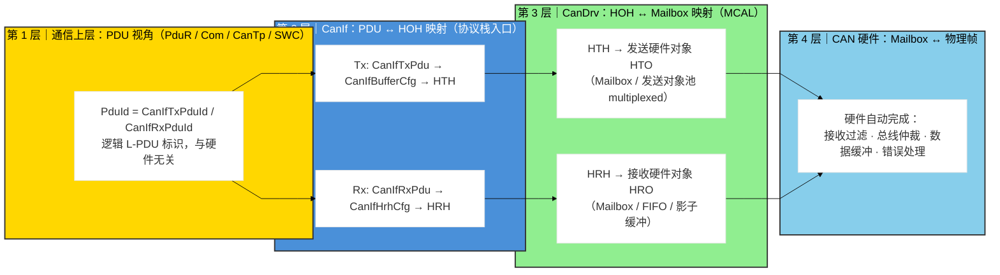

**图释**：第 1 层只见 `PduId`（信的名字）；第 2 层 CanIf 把 `PduId` 翻译成 `HTH/HRH`（门的凭证）；第 3 层 CanDrv 把句柄翻译成 `Mailbox`（物理格子）并操作硬件；第 4 层硬件真正收发帧。每一层只依赖相邻一层的接口，这就是 AUTOSAR 分层解耦的骨架。

### 1.4 三层映射总表（全文主线）

| 层 | 左侧标识 | 右侧标识 | 映射表（配置期生成） | 规范条目 |
|----|---------|---------|----------------------|---------|
| PduR | PduId | 目标模块（CanIf/CanTp/…） | PduR 路由表 | — |
| CanIf（Tx） | CanIfTxPduId | HTH | `CanIfTxPduCfg → CanIfBufferCfg → CanIfBufferHthRef` | `SWS_CANIF_00466` |
| CanIf（Rx） | HRH | CanIfRxPduId | `CanIfHrhCfg → CanIfRxPduHrhIdRef（反向）` | `SWS_CANIF_00664` |
| CanDrv | HTH/HRH（CanObjectId） | Mailbox 索引 | `CanHardwareObject`（`CanObjectId`/`CanHwObjectCount`） | `ECUC_Can_00326/00467` |

---

## 二、Mailbox（硬件对象）——物理信箱

### 2.1 ① 通俗理解

`Mailbox` 就是 CAN 控制器里的一块**内存格子**，一次能装下一整帧 CAN 报文。它就像小区收发室的信箱：有**编号**、能**锁**（防止来新信时把旧信冲掉）、里面放**一封信**（仲裁字段 = 收信人地址 ID、数据 = 信纸、DLC = 信纸长度）。硬件不需要 CPU 干预就能自动完成投递和寄送。

### 2.2 ② 设计机制与思路

- **为什么要有 mailbox，而不是让 CPU 每次手动收发？** CAN 是事件驱动的异步总线，帧随时可能来。如果没有硬件缓冲，CPU 必须每 50μs 就要去读总线，根本跑不了其他任务。mailbox 把"等待和过滤"交给硬件，CPU 只在"有信投进来"（中断）或"该收信了"（轮询）时被唤醒。
- **规范里 Hardware Object 的正规定义**（CAN 驱动词汇表）：

> **Hardware Object**：*"A CAN hardware object is defined as a PDU buffer inside the CAN RAM of the CAN hardware unit / CAN controller."*
> （硬件对象 = CAN 硬件单元/CAN 控制器 CAN RAM 内的一个 PDU 缓冲区）

- **所以术语上**：`Mailbox`、`Hardware Object`、`Message Object`、`Message Buffer` 在 AUTOSAR 语境下基本同义——都是"硬件里那块能放一帧数据的缓冲区/过滤实体"。规范图例甚至直接把 "Message Object / Mailbox" 画在一起（见规范 2.2 节 CAN Hardware Unit 图）。

### 2.3 ③ 深入原理

**（a）一个 Mailbox 的抽象内部结构**（概念性，非厂商寄存器）：

```c
/* ===== 一个 CAN 硬件对象（Mailbox）的抽象视图 =====
 * 以下仅是"逻辑结构"，各厂商寄存器的物理排布不同，
 * 具体寄存器位定义属于 MCAL 内部实现（SWS_Can_00413: ConfigType 为 Implementation specific）。
 */
typedef struct {
    uint32_t  ArbID;        /* 仲裁字段：CAN ID（标准 11bit / 扩展 29bit） */
    uint8_t   IdeBit;       /* 标识符扩展位：0=标准帧，1=扩展帧（RTR/IDE）  */
    uint8_t   Dlc;          /* Data Length Code：数据长度码（决定数据字节数） */
    uint8_t   Data[64];     /* 数据场：经典 CAN 最多 8B，CAN FD 最多 64B       */
    uint8_t   TxReq;        /* 发送请求位：置 1 请求硬件把本格数据发上总线     */
    uint8_t   Pending;      /* 接收待处理位：硬件收到匹配帧后置 1 通知软件     */
    uint8_t   Lock;         /* 锁定位：防止新帧覆盖正在被软件读取的内容        */
} Can_MailboxAbstractionType;
```

**（b）硬件自动完成的四个动作**：

1. **接收过滤**：每个接收 mailbox 配有一组 `CanHwFilterCode`（过滤器代码=ID）+ `CanHwFilterMask`（掩码，`0` 位表示"不关心"）。硬件逐位比对帧 ID 与过滤条件，命中才投递。规范原文（`ECUC_Can_00470`）：*"The CAN identifiers of incoming messages are masked with the appropriate filter mask. Bits holding a 0 mean don't care."*
2. **锁定/覆盖/溢出**：收到新帧时如果 mailbox 正在被软件读取，硬件要么"锁定保护"（新帧丢失→报 `overrun`），要么"直接覆盖"（旧帧丢失→报 `overwrite`）。无论哪种，CanDrv 都须上报运行错误 **`CAN_E_DATALOST`**（`SWS_Can_00395`）。
3. **发送仲裁**：CPU 把数据写入 mailbox 并置 `TxReq`，之后硬件自动按 CAN 协议参与总线仲裁（ID 越小优先级越高），赢得仲裁后逐位发送。
4. **中断/状态位**：发送完成或接收完成，硬件置状态位并（可选）触发中断，由 CanDrv 的 ISR 或 `Can_MainFunction_Read/Write` 响应（`SWS_Can_00396`）。

**（c）三种主流硬件架构对"一个 HOH"的影响**：

| 架构 | 硬件形态 | HOH 与硬件对象的关系 | 典型控制器 |
|------|---------|---------------------|-----------|
| 多 mailbox 型 | 每个 ID 一个独立 mailbox | 一个 HRH 常对应一个 mailbox（FullCAN） | FlexCAN、M_CAN、bxCAN |
| 过滤器+单缓冲型 | 一个接收缓冲 + 可配置过滤器 | 一个 HRH 对应"过滤器+缓冲"，多 ID 共享（BasicCAN） | SJA1000 BasicCAN |
| FIFO / 阴影缓冲型 | 多个同类 mailbox 组成队列 | 一个 HRH 对应**一组** mailbox（`CanHwObjectCount`） | M_CAN RX FIFO、bxCAN FIFO |

`ECUC_Can_00467`（`CanHwObjectCount`）正是用来描述"**实现一个 HOH 用了几个硬件对象**"的：HRH 对应 FIFO 元素数或阴影缓冲数；HTH 对应 multiplexed 发送对象池大小或 FullCAN HTH 的硬件 FIFO 大小。

---

## 三、HOH（HTH/HRH）——逻辑句柄

### 3.1 ① 通俗理解

HOH 是给上层软件发的**门禁卡**：

- **HTH（Hardware Transmit Handle）** = 寄信卡：你告诉 CanDrv "用 HTH 3 寄这封信"，CanDrv 就知道写哪个发送邮箱。
- **HRH（Hardware Receive Handle）** = 收信卡：收到信时 CanDrv 告诉你 "这封信来自 HRH 5"，CanIf 就知道该交给谁。
- **HOH = HTH + HRH 的统称**，类型就是 `Can_HwHandleType`（一个整数编号）。

上层拿到编号后**完全不需要知道**它背后是一个 mailbox、一组 FIFO、还是一块滤波缓冲——这正是抽象的威力。和操作系统"文件描述符"完全同构：`printf` 只传 `fd=1`，内核才知道那对应 stdout 设备。

### 3.2 ② 设计机制与思路

- **可移植性**：`CanIf` 代码只写一次，换 MCU 只换 CanDrv 配置，CanIf/PduR/Com 的代码、乃至通信矩阵的 PDU 配置全部不用动。
- **接口契约**：AUTOSAR 把 CanIf↔CanDrv 的 API 定义为**以 HOH 为参数**，硬件厂商负责内部把 HOH 映射到物理 buffer。规范原文（CanIf 7.2 节）：

> *"Hardware Object Handles (HOH) for transmission (HTH) as well as for reception (HRH) represent an **abstract reference to a CAN mailbox structure**, that contains CAN related parameters such as CanId, DLC and data."*
> （HTH/HRH 是对"包含 CanId、DLC、数据等参数的 CAN mailbox 结构"的**抽象引用**）

> *"CanIf shall avoid direct access to hardware specific communication buffers and shall access it exclusively via CanDrv interface services."*（`SWS_CANIF_00023`）

- **O(1) 配置驱动**：映射表由配置工具（ARXML→代码）**编译期静态生成**为数组，`PduId → HTH → Mailbox` 全部是数组下标索引，无搜索、无动态分配。

### 3.3 ③ 深入原理

**（a）规范标准类型定义**（`Can_GeneralTypes.h`，可直接引用）：

```c
/* ===== SWS_Can_00429: 硬件对象句柄类型 =====
 * 硬件对象数 <= 255 用 uint8（Standard），否则 uint16（Extended）。
 * 一个 CAN 硬件单元内，HTH/HRH 共享同一个编号域。 */
typedef uint8_t  Can_HwHandleType;   /* 或 uint16_t（Extended 范围 0x100~0xFFFF） */

/* ===== SWS_Can_00416: CAN ID 类型 =====
 * uint32。最高两位(MSB31/30)编码帧类型：
 *   00 = 标准 CAN 帧(11bit ID)    01 = 标准 CAN FD 帧
 *   10 = 扩展 CAN 帧(29bit ID)    11 = 扩展 CAN FD 帧   */
typedef uint32_t Can_IdType;

/* ===== SWS_Can_00415: CAN PDU 结构（CanIf↔CanDrv 交换载体）=====
 * 统一 PDU 句柄(swPduHandle)、长度(length)、ID(id)、数据指针(sdu)。 */
typedef struct {
    PduIdType  swPduHandle;   /* 上层 L-PDU 句柄（见第五节 swPduHandle 机制） */
    uint8      length;        /* 数据长度（字节数） */
    Can_IdType id;            /* CAN ID（含最高两位帧类型编码） */
    uint8*     sdu;           /* SDU 数据指针 */
} Can_PduType;

/* ===== SWS_CAN_00496: 硬件类型（接收指示用）=====
 * CanDrv 通知 CanIf 接收时，用该结构传递"哪条通道(HRH)、哪个 ID、哪个控制器"。 */
typedef struct {
    Can_IdType       CanId;          /* 收到帧的 CAN ID */
    Can_HwHandleType Hoh;            /* 对应的 HRH 编号 */
    uint8_t          ControllerId;   /* 所属 CAN 控制器（CanIf 提供） */
} Can_HwType;
```

**（b）HTH 与 HRH 的官方定义**（词汇表）：

> **HRH**：*"The Hardware Receive Handle (HRH) is defined and provided by the CAN Driver. Each HRH typically represents just **one hardware object**. The HRH can be used to optimize software filtering."*

> **HTH**：*"The Hardware Transmit Handle (HTH) is defined and provided by the CAN Driver. Each HTH typically represents just one or **multiple hardware objects that are configured as hardware transmit buffer pool**."*

注意差异：**HRH 典型对应一个硬件对象；HTH 典型对应一个或多个发送对象（发送缓冲池）**——即 HTH 可以"一对多"（multiplexed transmission，见 4.3）。

**（c）HOH 编号规则（重要修正）**：

`ECUC_Can_00326`（`CanObjectId`）原文：*"Holds the handle ID of HRH or HTH. The value of this parameter is **unique in a given CAN Driver**, and it should **start with 0 and continue without any gaps**. The HRH and HTH Ids share a **common ID range**. Example: HRH0-0, HRH1-1, HTH0-2, HTH1-3"*

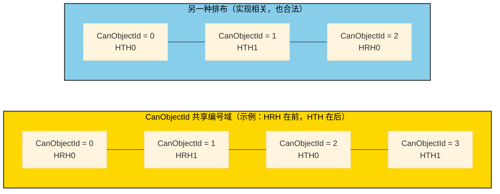

**图释**：左右两种排布都合法。规则只有三条：① 一个 CanDrv 内全局唯一；② 从 0 开始、连续无空洞；③ HTH/HRH **共享**同一个编号域。**不存在"Tx 必在前、Rx 必在后"的强制要求**——这就是对旧文档的修正。CanIf 侧同样要求 `SWS_CANIF_00115`："use all HRHs and HTHs of one CanDrv as common, single numbering area starting with zero"；而"HTH/HRH 在编号域内如何定义、对应哪些硬件对象，由 CanDrv 决定"。

**（d）句柄的"逻辑性"**：HTH/HRH 只是整数，其背后的语义完全由 CanDrv 配置解释。CanIf 规范原文：*"The HTH shall be a handle referencing a logical Hardware Transmit Object of the CAN Controller mailbox."*（`SWS_CANIF_00292`）、*"The HRH shall be a handle referencing a logical Hardware Receive Object of the CAN Controller mailbox."*（`SWS_CANIF_00291`）。注意"logical"一词——句柄指向的是**逻辑硬件对象**，不是"第几个寄存器"。

---

## 四、HOH ↔ Mailbox 映射（CanDrv 内部）

### 4.1 ① 通俗理解

CanDrv 手里有一张"**编号对照表**"：卡号（HTH/HRH） ↔ 物理格子（Mailbox）。寄信时用卡号查出格子号再写进去；收信时硬件报格子号，CanDrv 反查卡号再通知上层。这张表在配置期就定死，编译成数组，查表 O(1)。

### 4.2 ② 设计机制与思路

- **映射放在 CanDrv 而非 CanIf**：因为只有 CanDrv 知道"这个控制器有几个 mailbox、FIFO 多深、过滤器怎么配"。映射信息直接来自 `CanHardwareObject` 配置容器（工具生成代码），**驱动无逻辑，纯查表**。
- **正查 + 反查双向表**：发送时 `HTH→Mailbox` 正查；接收中断时拿到的是"哪个 mailbox 收到了帧"，需要 `Mailbox→HRH` 反查才能调用 `CanIf_RxIndication`。两张表都是编译期静态数组。

### 4.3 ③ 深入原理

**（a）映射的四种形态**：

```mermaid
%%{init: {"theme":"base","themeVariables":{"fontSize":"18px","fontFamily":"Microsoft YaHei"},"flowchart":{"nodeSpacing":50,"rankSpacing":60,"curve":"linear","padding":18}}}%%
flowchart TD
    subgraph T1["形态 1: 1 HOH → 1 Mailbox（FullCAN 专用通道）"]
        A1["HTH / HRH"] --> A2["Mailbox #k"]
    end
    subgraph T2["形态 2: 1 HRH → N Mailbox（接收 FIFO / 阴影缓冲）"]
        B1["HRH"] --> B2["Mailbox #a<br/>Mailbox #b<br/>Mailbox #c"]
    end
    subgraph T3["形态 3: 1 HTH → N 发送对象（multiplexed 发送池）"]
        C1["HTH"] --> C2["TX 对象 1<br/>TX 对象 2<br/>TX 对象 3"]
    end
    subgraph T4["形态 4: 1 HRH → 1 Mailbox + 多个 CanId（BasicCAN 软件过滤）"]
        D1["HRH"] --> D2["Mailbox（硬件过滤一个 ID/掩码范围）"]
        D2 --> D3["CanIf 软件过滤:<br/>ID1 / ID2 / ID 范围…"]
    end
    style T1 fill:#90EE90,color:#000,stroke:#333
    style T2 fill:#87CEEB,color:#000,stroke:#333
    style T3 fill:#FFD700,color:#000,stroke:#333
    style T4 fill:#FFB6C1,color:#000,stroke:#333
```

**图释**：① 最常用，一个句柄一个专用邮箱（FullCAN）；② HRH 背后是一个 FIFO 队列或多个阴影缓冲（防丢帧，`CanHwObjectCount` 描述）；③ HTH 背后是一个**发送对象池**，哪个空就写哪个（multiplexed transmission）；④ 一个 HRH 的邮箱同时接收多个 CanId，由 CanIf 软件分流（BasicCAN）。

**（b）为什么存在 multiplexed transmission（形态 3）——优先级反转动机**：

规范 2.1 节定义了两类**优先级反转**：

- **Inner Priority Inversion（内部优先级反转）**：如果只用一个发送缓冲，低优先级报文占着缓冲等待总线空闲，会**堵住**本节点后续高优先级报文。原文：*"Because of low priority a message stored in the buffer waits until the 'traffic on the bus calms down'. During the waiting time this message could prevent a message of higher priority generated by the same microcontroller from being transmitted."*
- **Outer Priority Inversion（外部优先级反转）**：相邻两帧发送间隔超过 CAN 最小帧间隔时，别节点的低优先级帧可能插队赢得仲裁。

**对策**：`SWS_Can_00401`——*"Several transmit hardware objects (defined by 'CanHwObjectCount') shall be assigned by one HTH to represent one **transmit entity** to the upper layer."* 即一个 HTH 挂多个发送对象（池），且 `SWS_Can_00403` 要求按 **L-PDU 优先级顺序**发送，硬件自动挑选空闲对象。上层视角仍只有一个 HTH（一个"发送实体"），优先级与缓冲管理全在驱动内部。注意规范还提示：**避免软件模拟优先级**（`SWS_Can_00403` Note：软件模拟的开销会抵消 multiplexed 优势）。

**（c）发送映射与 Can_Write 的规范行为**：

```c
/* ============================================================
 * Can_Write —— 发送请求（SWS_Can_00212 / 00213 / 00276 / 00039）
 * 输入：HTH（句柄）+ Can_PduType（数据）
 * 返回：E_OK 接受 / CAN_BUSY(0x02) 无可用发送对象 / E_NOT_OK 参数错误
 * ============================================================ */
Std_ReturnType Can_Write(Can_HwHandleType Hth, const Can_PduType* PduInfo)
{
    const Can_HwObjectCfgType* obj = &Can_HwObjectTable[Hth];  /* ① HTH → Mailbox 配置(工具生成) */

    /* ② 检查该 HTH 是否忙（互斥量 + 硬件 TXRQ 状态）*/
    if (Can_HthBusy[Hth] == TRUE) {
        return CAN_BUSY;               /* SWS_Can_00213: 忙则直接返回，不打断在途发送 */
    }

    /* ③ 复制 ID/DLC/数据到对应 Mailbox（寄存器细节由 MCAL 内部实现，与硬件相关）*/
    Can_HwLoadTxBuffer(obj->MailboxIndex, PduInfo->id, PduInfo->length, PduInfo->sdu);

    /* ④ 置位发送请求，触发硬件仲裁发送 */
    Can_HwRequestTx(obj->MailboxIndex);

    /* ⑤ 保存 swPduHandle —— SWS_Can_00276:
     *    规范要求 Can_Write 保存该句柄直至 CanIf_TxConfirmation 回调。
     *    这样确认回调时 CanDrv 可直接把句柄回传，CanIf 无需再 HTH→PduId 搜索。 */
    Can_PendingTxHandle[obj->MailboxIndex] = PduInfo->swPduHandle;

    return E_OK;                       /* SWS_Can_00275: 非阻塞，立即返回 */
}
```

> **发送映射链路**：`HTH（CanObjectId） → Can_HwObjectTable → MailboxIndex → 写 Mailbox → TXRQ → 硬件仲裁发送 → 发送中断 → CanIf_TxConfirmation`。
> 规范 `SWS_Can_00100`：*"Several TX hardware objects with unique HTHs may be configured. The CanIf module provides the HTH as parameter of the TX request."*

**（d）接收映射与轮询主函数**：

```c
/* ============================================================
 * Can_MainFunction_Read —— 轮询接收（SWS_Can_00108）
 * 调度器周期性调用；当 CanRxProcessing = POLLING 或 MIXED 时执行。
 * 也可由接收中断直接驱动（SWS_Can_00396）。
 * ============================================================ */
void Can_MainFunction_Read(void)
{
    /* 遍历配置为"轮询"的接收 Mailbox */
    for (mbIdx = 0; mbIdx < Can_RxPollListSize; mbIdx++) {
        uint8_t  mb    = Can_RxPollList[mbIdx];
        if (Can_HwRxPending(mb) == FALSE) {
            continue;
        }
        /* ① 从 Mailbox 读出 ID/长度/数据（寄存器细节在 MCAL 内部）*/
        Can_HwReadRxBuffer(mb, &rxId, &rxLen, rxBuf);

        /* ② 反查：Mailbox → HRH（编译期反查表）*/
        Can_HwType hw;
        hw.Hoh         = Can_MailboxToHrh[mb];          /* 反查表 */
        hw.CanId       = rxId;                          /* 交给 CanIf 做软件过滤用 */
        hw.ControllerId= Can_MailboxController[mb];

        /* ③ 组装 PduInfo 并上报 CanIf */
        PduInfoType pduInfo;
        pduInfo.SduDataPtr = rxBuf;
        pduInfo.SduLength  = rxLen;
        CanIf_RxIndication(&hw, &pduInfo);

        /* ④ 释放 Mailbox（锁定解除），CanIf_RxIndication 返回后立即执行，避免丢帧 */
        Can_HwReleaseRx(mb);
    }
}
```

> **接收映射链路**：`硬件收到匹配帧 → Mailbox（锁定/置 pending）→ CanDrv 定位 Mailbox → 反查 HRH → CanIf_RxIndication(&Mailbox, &PduInfo) → 释放 Mailbox`。
> 规范 `SWS_Can_00279`：接收时 Can 模块须把 **ID、Hoh、ControllerId、数据长度、SDU 指针**一并传给 `CanIf_RxIndication`——这正是 `Can_HwType`（Mailbox 参数）的作用。

**（e）FIFO 与阴影缓冲（防丢帧一致性设计）**：

- **硬件 FIFO**（`SWS_Can_00489`）：多个 mailbox 排成队列，连续多帧依次存入，软件一次读出。FIFO 深度 = `CanHwObjectCount`。
- **阴影缓冲**（`SWS_Can_00490`）：主 mailbox 忙时，同配置的"影子"mailbox 顶上，把缓冲数扩到 `CanHwObjectCount` 个。
- 若硬件既无 FIFO 也无法锁定，CanDrv 必须**在接收后立即拷贝到软件影子缓冲**（`SWS_Can_00299/00300`），并保证 `Can_MainFunction_Read`/ISR 自洽不可重入打断（`SWS_Can_00012`）。

---

## 五、PDU ↔ HOH 映射（CanIf 层）

### 5.1 ① 通俗理解

CanIf 是协议栈的"收发室前台"。上层交来一封信（PduId），前台查**通讯录**知道该用哪张寄信卡（HTH）；收到信时，前台看卡（HRH）知道该派给哪个部门（CanIfRxPduId → PduR/CanTp…）。CanIf 手里是"**信的名字 ↔ 卡的编号**"的映射表。

### 5.2 ② 设计机制与思路

- **为什么映射放在 CanIf**：CanIf 是 COM 栈的**统一出入口**，它天然掌握"哪个 PDU 属于哪个控制器、哪个句柄"。规范原文（CanIf 5.6）：*"Number of Hardware Object Handles. To supervise transmit requests the CAN Interface needs to know the number of HTHs and the assignments between each HTH and the corresponding CAN Controller."*
- **重要设计（R4.4）**：发送路径上，**Tx L-PDU 不直接引用 HTH**，而是引用一个 `CanIfBufferCfg`，再由 `CanIfBufferCfg` 引用 HTH。规范 `SWS_CANIF_00466` Rationale 原话：

> *"CanIf Tx L-PDUs do not refer HTHs, but CanIfBufferCfg, which in turn do refer HTHs."*

  这样做的妙处：`CanIfBufferCfg` 同时承载**发送缓冲**（`CanIfBufferSize`）——当 Can_Write 返回 `CAN_BUSY` 时 CanIf 可把报文暂存于此，稍后 `CanIf_MainFunctionWrite` 重发（`SWS_CANIF_00063` 等）。缓冲大小配为 0 时该容器就"纯引用 HTH"用。**一个设计同时解决"句柄引用"与"软缓冲"两个需求**。

- **概念对应关系**（规范 Figure 7.1 "Mapping between PDU Ids and HW object handles" 的重绘图）：

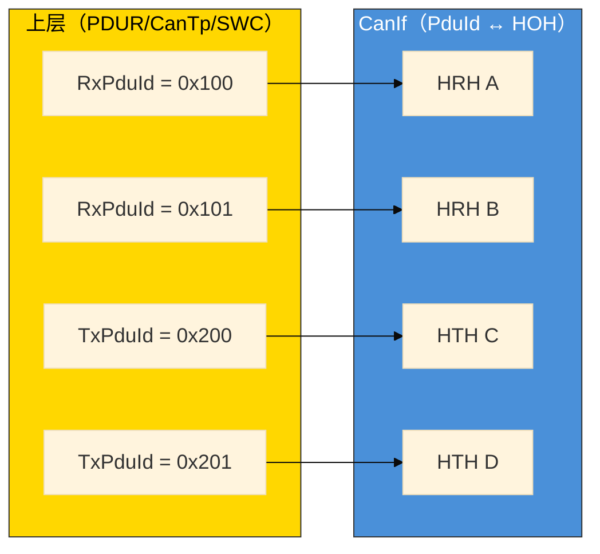

**图释**：这是规范 Figure 7.1 的 mermaid 重绘——上层只看到 PduId，CanIf 把它们分别挂到 HRH/HTH 上。**每个句柄属于"单一或固定的一组 L-PDU"**（`SWS_CANIF_00664/00667`），句柄与 PDU 的关系在配置期静态绑定。

### 5.3 ③ 深入原理

**（a）Tx 方向：CanIfTxPdu → CanIfBufferCfg → HTH**

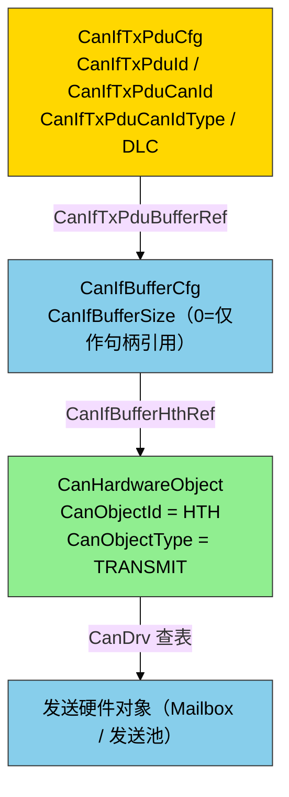

**图释**：Tx PDU 经 `CanIfTxPduBufferRef` 指向缓冲容器，缓冲容器经 `CanIfBufferHthRef` 指向发送硬件对象（HTH）。好处：发送缓冲与句柄引用解耦，同一 HTH 可由多个 Tx PDU 共享（组成"固定组"）。

**（b）Rx 方向：CanIfRxPdu → CanIfHrhCfg → HRH，及软件过滤**

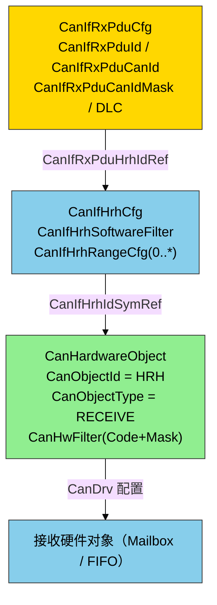

**图释**：Rx PDU 经 `CanIfRxPduHrhIdRef` 指向 `CanIfHrhCfg`，再经 `CanIfHrhIdSymRef`（符号名引用，取到 `CanHandleType` 与 `CanObjectId`，见 `ECUC_CanIf_00634`）指向 CanDrv 的接收硬件对象。`CanIfHrhSoftwareFilter` 开关 BasicCAN 软件过滤；`CanIfHrhRangeCfg` 为同一个 HRH 配置**多个 CAN ID 范围**（0..*）。

**（c）HRH 的四种接收形态（映射关系的根源）**——规范 CanIf 7.2 节原文：*"The HRH can be configured to receive: one single CanId (FullCAN), a group of single CanIds (BasicCAN), a range/area of CanIds (BasicCAN), or all CanIds."*

| HRH 形态 | 硬件过滤 | CanIf 软件过滤 | 一个 HRH ↔ 多少 RxPdu | 典型用途 |
|---------|---------|---------------|----------------------|---------|
| 单 CanId（FullCAN） | 精确匹配一个 ID | 不需要（直接映射） | 1 个 | 关键信号（转速、方向盘角） |
| ID 组（BasicCAN） | 掩码覆盖一组 ID | 需要（组内逐条比对） | 多个 | 一组诊断/同族报文 |
| ID 范围（BasicCAN） | 覆盖上/下限或 base+mask | 需要（范围内逐条比对） | 多个 | 一类功能报文 |
| 全部 CanId | 全通（mask=0） | 需要（最重） | 多个 | 总线监控/透传 |

**（d）CanIf_Transmit 的解析动作**（规范 7.9 + `SWS_CANIF_00318`）：

```c
/* ============================================================
 * CanIf_Transmit —— 发送请求（SWS_CANIF_00005 / 00318 / 00243）
 * 上层通过 PduR 调用；CanIf 内部完成 PduId → HTH 解析并调 Can_Write。
 * ============================================================ */
Std_ReturnType CanIf_Transmit(PduIdType TxPduId, const PduInfoType* PduInfoPtr)
{
    const CanIfTxPduCfgType* pduCfg;     /* 由 CanIfTxPduCfg 生成的静态表 */
    Can_PduType              canPdu;
    Can_HwHandleType         hth;

    if (PduInfoPtr == NULL_PTR) {
        return E_NOT_OK;                 /* SWS_CANIF_00320 参数错误 */
    }

    /* ① 由 TxPduId 解析控制器与 HTH（SWS_CANIF_00318 之前注：控制器和 HTH 须由 TxPduId 解析）*/
    pduCfg = &CanIf_TxPduCfg[TxPduId];                      /* CanIfTxPduId 即数组下标，O(1) */
    hth    = CanIf_BufferHth[pduCfg->BufferIndex];          /* PDU → CanIfBufferCfg → HTH */

    /* ② 组装 Can_PduType（SWS_CANIF_00318 四要素）*/
    canPdu.swPduHandle = TxPduId;                           /* = CanTxPduId，供确认回调直接回传 */
    canPdu.length      = PduInfoPtr->SduLength;
    canPdu.sdu         = (uint8*)PduInfoPtr->SduDataPtr;
    /* ③ 将 ID 的最高两位编上帧类型（SWS_CANIF_00243: IDE 标志 + CAN FD 标志）*/
    canPdu.id = CanIf_BuildCanId(pduCfg->CanId, pduCfg->CanIdType);

    /* ④ 交给 CanDrv；若 CAN_BUSY 且使能了缓冲，则存入 CanIfBufferCfg 待重发 */
    return Can_Write(hth, &canPdu);
}
```

**（e）swPduHandle 机制（R4.4 的关键优化）**：

- `Can_Write` 时 CanDrv 保存 `PduInfo->swPduHandle`（`SWS_Can_00276`：*"The function Can_Write shall store the swPduHandle that is given inside the parameter PduInfo until the Can module calls the CanIf_TxConfirmation… This feature is used to **reduce time for searching in the CanIf** module implementation."*）
- 于是 R4.4 的确认回调**不再传 HTH**，只传句柄：

```c
/* ============================================================
 * CanIf_TxConfirmation —— 发送确认（SWS_CANIF_00007）
 * CanDrv 在 TX 中断或 Can_MainFunction_Write（轮询）中调用。
 * 参数 CanTxPduId 就是 Can_Write 保存的 swPduHandle，CanIf 直接索引，
 * 无需再做 HTH → PduId 搜索。
 * ============================================================ */
void CanIf_TxConfirmation(PduIdType CanTxPduId)
{
    /* 直接转发给该 Tx PDU 配置的上层（CanIfTxPduUserTxConfirmationUL）：
     * PDUR / CanTp / CanNm / SW（也可 TRCV 用作发送确认） */
    <User_TxConfirmation>(CanTxPduId);
}
```

**（f）CanIf_RxIndication 与软件过滤**（规范 7.14 + 7.20 + `SWS_CANIF_00877`）：

```c
/* ============================================================
 * CanIf_RxIndication —— 接收指示（SWS_CANIF_00006）
 * CanDrv 在 RX 中断或 Can_MainFunction_Read 中调用。
 * Mailbox 参数（Can_HwType）携带 HRH、收到帧的 CanId 与控制器号。
 * ============================================================ */
void CanIf_RxIndication(const Can_HwType* Mailbox, const PduInfoType* PduInfoPtr)
{
    PduIdType rxPduId;

    /* ① FullCAN：HRH → 唯一 RxPdu，直接映射；
     *    BasicCAN：对该 HRH 执行软件过滤（SWS_CANIF_00389，见 7.20），
     *    用 Mailbox->CanId 与配置的 CanId/范围/掩码比对（SWS_CANIF_00877）。 */
    rxPduId = CanIf_RxFilter(Mailbox->Hoh, Mailbox->CanId);
    if (rxPduId == CANIF_INVALID_PDU) {
        return;                     /* 未命中 → 丢弃，不再处理 */
    }

    /* ② 可选：Data Length Check（SWS_CANIF_00390 / 7.21）*/
    if ((CanIf_DlcCheckEnabled) && (PduInfoPtr->SduLength < CanIfRxPduDlc[rxPduId])) {
        /* 长度不满足 → 丢弃 */
        return;
    }

    /* ③ 分发给该 RxPdu 配置的上层（CanIfRxPduUserRxIndicationUL / ULd）：
     * PDUR / CanTp / CanNm / SW */
    <User_RxIndication>(rxPduId, PduInfoPtr);
}
```

**（g）软件过滤的命中规则**（`SWS_CANIF_00852`，保证确定性）：*"A single CanId is always more relevant than a range. A smaller range is more relevant than a larger range."*（单个 CanId 优先于范围；小范围优先于大范围。）过滤算法可实现为线性/表/哈希搜索（规范 7.20.2）。

---

## 六、PDU – HOH – Mailbox 三层完整映射

### 6.1 ① 通俗理解

一条报文从"上层逻辑报文"到"物理总线上的帧"，要过三道岗：**① PduId 这个名字 → ② HTH/HRH 这张卡 → ③ Mailbox 这个格子**。每一道岗只认识前一岗给的东西，互不越权。

### 6.2 ② 设计机制与思路——三层职责分离

| 层 | 只认识 | 不认识 | 一句话职责 |
|----|--------|--------|-----------|
| PduR / Com | PduId | HOH、Mailbox、硬件 | 按 PduId 路由到目标模块 |
| CanIf | PduId ↔ HOH | Mailbox、寄存器 | 把逻辑 PDU 翻译成硬件句柄，做软件过滤/DLC 校验/缓冲 |
| CanDrv | HOH ↔ Mailbox | PduId（除了透传的 swPduHandle） | 把句柄翻译成物理邮箱并操作硬件 |

**为什么必须是三层映射而不是两层直连？**
- 若 PduR 直连 CanDrv：PduR 就得懂硬件，换 MCU 全栈重写；
- 若去掉 CanIf：软件过滤、发送缓冲、DLC 校验、多控制器调度这些"纯协议栈逻辑"就没地方放；
- CanIf 是"**硬件无关的协议栈**"与"**协议无关的驱动**"之间的契约面——这正是 AUTOSAR 分层 BSW 的核心价值。

### 6.3 ③ 深入原理

**（a）发送全链路时序**：

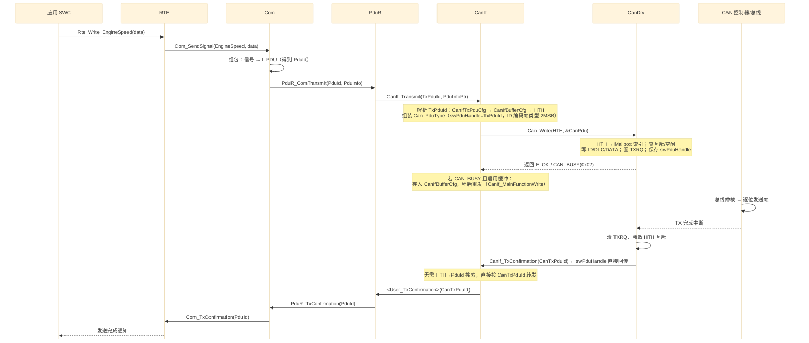

**时序图释**：上游（SWC→COM）负责组包，PduR 负责路由，CanIf 完成 `PduId→HTH` 映射与缓冲，CanDrv 完成 `HTH→Mailbox` 与硬件写，硬件负责仲裁与发送。注意确认路径上 `swPduHandle` 让 CanIf 无需搜索即可把句柄变回 PduId。

**（b）接收全链路时序**：

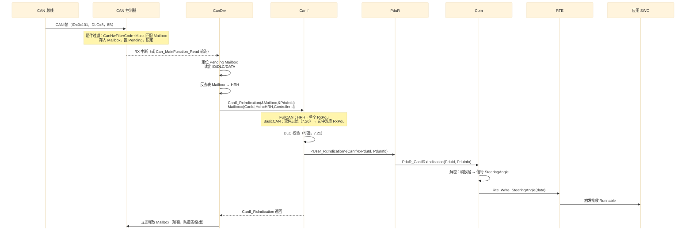

**时序图释**：硬件过滤投递 → CanDrv 反查 HRH → CanIf 按 HRH+CanId 定位 RxPdu（FullCAN 直连 / BasicCAN 软件过滤）→ 上层解包。关键点是 **CanIf_RxIndication 返回后 CanDrv 立即释放 Mailbox**，否则后续帧会触发 `CAN_E_DATALOST`。

**（c）Full CAN vs Basic CAN 对映射链的影响对比**：

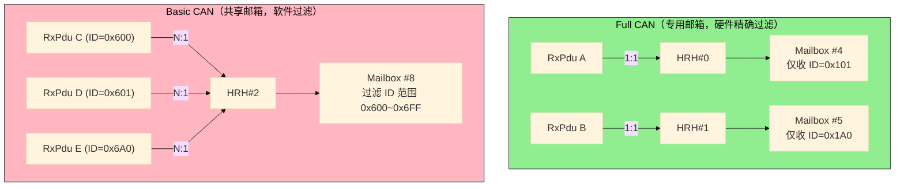

**图释**：Full CAN 一个 RxPdu 独占一个 HRH（硬件过滤，无需软件分流）；Basic CAN 多个 RxPdu 共享一个 HRH，由 CanIf 软件过滤（比对 `Mailbox->CanId`）决定交给谁。**两者可共存**（规范：*"BasicCAN and FullCAN objects may coexist in a single configuration setup."*）。发送侧类似：FullCAN HTH 一个句柄对一个发送对象；BasicCAN 发送则走 multiplexed 发送池（一个 HTH 对多个发送对象）。

| 维度 | Full CAN | Basic CAN |
|------|---------|-----------|
| 硬件过滤 | 每个 HRO 一个 ID（或掩码） | 一个 HRO 覆盖一组/范围 ID |
| 软件过滤 | 不需要 | 必须（`CanIfHrhSoftwareFilter`，`SWS_CANIF_00663`） |
| PDU↔HRH | 1:1 | N:1（组/范围/全 ID） |
| 硬件资源消耗 | 高（每 ID 一个 mailbox） | 低（少量 mailbox 覆盖大量 ID） |
| 软件开销 | 低 | 较高（过滤搜索 + 丢帧风险管理） |
| 典型场景 | 高频关键报文 | 低频、多 ID、诊断/监控 |

**（d）中断 vs 轮询（两种处理上下文）**：

- `CanRxProcessing`/`CanTxProcessing` = POLLING / INTERRUPT / MIXED（`SWS_Can_00108`）。
- 中断模式：ISR 里直接调 `CanIf_RxIndication` / `CanIf_TxConfirmation`（`SWS_Can_00396`）。
- 轮询模式：调度器周期调 `Can_MainFunction_Read`（轮询 RX）与 `Can_MainFunction_Write`（轮询 TX/重发缓冲）（`SWS_Can_00108`）。CanIf 侧对应 `CanIf_MainFunctionRead/Write` 驱动之。
- 无论哪种上下文，**回调实现都必须按"可重入、ISR 安全"来写**（规范 7.8：*"The implementation of all callback functions shall be done as if the call context was the ISR."*）。

**（e）多上层用户（一个 PDU 可派发给多个上层）**：

`CanIfTxPduUserTxConfirmationUL` 与 `CanIfRxPduUserRxIndicationUL(/ULd)` 指定该 PDU 的上层目标（**PDUR / CanTp / CanNm / SW / TRCV**）。因此"一个 RxPdu → 一个 HRH"的映射，在**上层出口**可以扇出到多个用户——硬件映射是 1:1，逻辑分发是 1:N。

---

## 七、ARXML 配置实例

以下为 R4.4 风格的 ARXML 片段，展示"一个 Tx PDU、一个 FullCAN Rx PDU、一个 BasicCAN Rx 范围 PDU"如何配置出完整的三层映射。

```xml
<!-- ================================================================
     第 1 步：CanDrv 定义 CAN 控制器与硬件对象（HOH 与 Mailbox 的绑定）
     ================================================================ -->
<CanController>
  <ShortName>CAN0</ShortName>
  <CanControllerBaudRate>500</CanControllerBaudRate>          <!-- 单位 kBit/s -->
</CanController>

<!-- Tx 发送硬件对象：HTH（CanObjectId=0，FullCAN 专用，1 个 mailbox） -->
<CanHardwareObject>
  <ShortName>CAN_HTH_EngineSpeed</ShortName>
  <CanObjectId>0</CanObjectId>            <!-- HTH 编号（与 HRH 共享编号域） -->
  <CanObjectType>TRANSMIT</CanObjectType>
  <CanHwObjectCount>1</CanHwObjectCount>  <!-- 1 个发送硬件对象 -->
  <CanControllerRef>/Config/Can/CAN0</CanControllerRef>
  <CanIdType>EXTENDED</CanIdType>
</CanHardwareObject>

<!-- Tx 发送硬件对象：HTH（CanObjectId=1，multiplexed 发送池，3 个对象共用一个 HTH） -->
<CanHardwareObject>
  <ShortName>CAN_HTH_DiagReq</ShortName>
  <CanObjectId>1</CanObjectId>
  <CanObjectType>TRANSMIT</CanObjectType>
  <CanHwObjectCount>3</CanHwObjectCount>  <!-- 发送对象池（SWS_Can_00401） -->
  <CanControllerRef>/Config/Can/CAN0</CanControllerRef>
  <CanIdType>EXTENDED</CanIdType>
</CanHardwareObject>

<!-- Rx 接收硬件对象：HRH（CanObjectId=2，FullCAN：只收单个 ID 0x101） -->
<CanHardwareObject>
  <ShortName>CAN_HRH_SteeringAngle</ShortName>
  <CanObjectId>2</CanObjectId>
  <CanObjectType>RECEIVE</CanObjectType>
  <CanHwObjectCount>1</CanHwObjectCount>
  <CanControllerRef>/Config/Can/CAN0</CanControllerRef>
  <CanId>0x101</CanId>                    <!-- 硬件过滤的目标 ID -->
  <CanIdType>EXTENDED</CanIdType>
</CanHardwareObject>

<!-- Rx 接收硬件对象：HRH（CanObjectId=3，BasicCAN：FIFO 深 2 + 掩码过滤 ID 范围 0x600~0x6FF） -->
<CanHardwareObject>
  <ShortName>CAN_HRH_DiagResp</ShortName>
  <CanObjectId>3</CanObjectId>
  <CanObjectType>RECEIVE</CanObjectType>
  <CanHwObjectCount>2</CanHwObjectCount>  <!-- FIFO 深度 2（SWS_Can_00489） -->
  <CanControllerRef>/Config/Can/CAN0</CanControllerRef>
  <CanIdType>EXTENDED</CanIdType>
  <CanHwFilter>                           <!-- 仅对 HRH 有效（ECUC_Can_00468） -->
    <CanHwFilterCode>0x600</CanHwFilterCode>   <!-- 过滤器代码（基 ID） -->
    <CanHwFilterMask>0x7FF</CanHwFilterMask>   <!-- 掩码：0 位不关心（ECUC_Can_00470） -->
  </CanHwFilter>
</CanHardwareObject>
```

```xml
<!-- ================================================================
     第 2 步：CanIf 定义 Tx/Rx PDU 与 HOH 的绑定
     ================================================================ -->
<!-- Tx PDU：经 CanIfBufferCfg 间接引用 HTH（SWS_CANIF_00466） -->
<CanIfTxPduCfg>
  <ShortName>CanIfTx_EngineSpeed</ShortName>
  <CanIfTxPduId>0</CanIfTxPduId>                       <!-- CanIfTxPduId = PduId（数组下标） -->
  <CanIfTxPduCanId>0x100</CanIfTxPduCanId>
  <CanIfTxPduCanIdType>EXTENDED_CAN</CanIfTxPduCanIdType>
  <CanIfTxPduDlc>8</CanIfTxPduDlc>
  <CanIfTxPduBufferRef>/Config/CanIf/CanIfBuffer_EngineSpeed</CanIfTxPduBufferRef>
  <CanIfTxPduUserTxConfirmationUL>PDUR</CanIfTxPduUserTxConfirmationUL>
</CanIfTxPduCfg>

<CanIfBufferCfg>
  <ShortName>CanIfBuffer_EngineSpeed</ShortName>
  <CanIfBufferSize>0</CanIfBufferSize>                 <!-- 0 = 仅作句柄引用，不做软缓冲 -->
  <CanIfBufferHthRef>/Config/Can/CAN_HTH_EngineSpeed</CanIfBufferHthRef>   <!-- → HTH(CanObjectId=0) -->
</CanIfBufferCfg>

<!-- Rx PDU：FullCAN，直接引用 HRH -->
<CanIfRxPduCfg>
  <ShortName>CanIfRx_SteeringAngle</ShortName>
  <CanIfRxPduId>0</CanIfRxPduId>                       <!-- CanIfRxPduId = PduId -->
  <CanIfRxPduCanId>0x101</CanIfRxPduCanId>
  <CanIfRxPduCanIdType>EXTENDED_CAN</CanIfRxPduCanIdType>
  <CanIfRxPduDataLength>8</CanIfRxPduDataLength>
  <CanIfRxPduHrhIdRef>/Config/CanIf/CanIfHrh_SteeringAngle</CanIfRxPduHrhIdRef>
  <CanIfRxPduUserRxIndicationUL>PDUR</CanIfRxPduUserRxIndicationUL>
</CanIfRxPduCfg>

<CanIfHrhCfg>
  <ShortName>CanIfHrh_SteeringAngle</ShortName>
  <CanIfHrhSoftwareFilter>false</CanIfHrhSoftwareFilter>   <!-- FullCAN：无需软件过滤 -->
  <CanIfHrhCanCtrlIdRef>/Config/CanIf/CanIfCtrl_0</CanIfHrhCanCtrlIdRef>
  <CanIfHrhIdSymRef>/Config/Can/CAN_HRH_SteeringAngle</CanIfHrhIdSymRef>  <!-- → HRH(CanObjectId=2) -->
</CanIfHrhCfg>

<!-- Rx PDU：BasicCAN，同一 HRH 收多个 ID（组/范围），需软件过滤 -->
<CanIfRxPduCfg>
  <ShortName>CanIfRx_DiagResp_A</ShortName>
  <CanIfRxPduId>1</CanIfRxPduId>
  <CanIfRxPduCanId>0x600</CanIfRxPduCanId>
  <CanIfRxPduCanIdType>EXTENDED_CAN</CanIfRxPduCanIdType>
  <CanIfRxPduDataLength>8</CanIfRxPduDataLength>
  <CanIfRxPduHrhIdRef>/Config/CanIf/CanIfHrh_DiagResp</CanIfRxPduHrhIdRef>
  <CanIfRxPduUserRxIndicationUL>PDUR</CanIfRxPduUserRxIndicationUL>
</CanIfRxPduCfg>

<CanIfHrhCfg>
  <ShortName>CanIfHrh_DiagResp</ShortName>
  <CanIfHrhSoftwareFilter>true</CanIfHrhSoftwareFilter>    <!-- BasicCAN：启用软件过滤 -->
  <CanIfHrhCanCtrlIdRef>/Config/CanIf/CanIfCtrl_0</CanIfHrhCanCtrlIdRef>
  <CanIfHrhIdSymRef>/Config/Can/CAN_HRH_DiagResp</CanIfHrhIdSymRef>       <!-- → HRH(CanObjectId=3) -->
  <CanIfHrhRangeCfg>                                     <!-- 0..* 个范围（SWS_CANIF_00645） -->
    <CanIfHrhRangeBaseId>0x600</CanIfHrhRangeBaseId>
    <CanIfHrhRangeMask>0x7FF</CanIfHrhRangeMask>
  </CanIfHrhRangeCfg>
</CanIfHrhCfg>
```

> 说明：ARXML 参数名均为 R4.4 规范/ECUC 标准名；不同配置工具（EB tresos、DaVinci 等）的展示层级或略有差异，但语义一致。

**配置 → 生成代码的对应关系**：

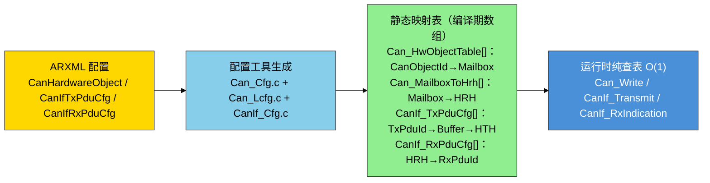

**图释**：所有映射关系在**编译期**由配置工具固化为只读数组，运行时零搜索、零动态分配。这就是"配置驱动 + O(1)"的工程落地。

---

## 八、映射关系总表与设计模式总结

### 8.1 三层映射表（含规范依据）

| 层级 | 映射 | 方向 | 键 | 值 | 规范依据 |
|------|------|------|----|----|---------|
| PduR | PduId 路由 | 双向 | PduId | 目标模块 | — |
| CanIf（Tx） | PduId → HTH | 正查 | CanIfTxPduId | HTH（经 CanIfBufferCfg） | `SWS_CANIF_00466/00318` |
| CanIf（Rx） | HRH → PduId | 正查 | HRH + CanId | CanIfRxPduId | `SWS_CANIF_00664/00877` |
| CanDrv（Tx） | HTH → Mailbox | 正查 | HTH（CanObjectId） | Mailbox 索引 | `ECUC_Can_00326`、`SWS_Can_00212` |
| CanDrv（Rx） | Mailbox → HRH | 反查 | Mailbox 索引 | HRH（CanObjectId） | `SWS_Can_00279` |

### 8.2 设计模式归纳

| 模式 | 具体体现 | 收益 |
|------|---------|------|
| **间接层 / 句柄**（Handle/Indirection） | PduId→HOH→Mailbox 两级句柄，同 OS 文件描述符 | 上层与硬件完全解耦，可移植 |
| **配置驱动**（Configuration-Driven） | ARXML→静态表，运行时纯查表 | O(1)、无动态内存、可静态验证 |
| **单一职责**（SRP） | PduR 管路由、CanIf 管协议栈映射、CanDrv 管硬件 | 每层独立测试/替换 |
| **双重过滤**（两级过滤） | 硬件过滤（掩码）+ 软件过滤（BasicCAN） | 用最少硬件资源覆盖最多 ID |
| **缓冲与池**（Buffer Pool） | CanIfBufferCfg 软缓冲 + multiplexed 发送池 | 抗 CAN_BUSY、防优先级反转 |
| **回调契约**（Callback Contract） | swPduHandle 携带、CanIf_TxConfirmation 直传 | 免搜索、ISR 安全 |

### 8.3 复杂度

| 操作 | 实现 | 复杂度 |
|------|------|--------|
| CanIf_Transmit：PduId → HTH | 数组下标（`CanIf_TxPduCfg[TxPduId]`） | O(1) |
| Can_Write：HTH → Mailbox | 数组下标（`Can_HwObjectTable[Hth]`） | O(1) |
| CanIf_RxIndication：HRH → RxPduId（FullCAN） | 数组下标 | O(1) |
| CanIf_RxIndication：软件过滤（BasicCAN） | 线性/表/哈希搜索（规范 7.20.2） | O(n)~O(1) |
| CanIf_TxConfirmation：句柄 → PduId | swPduHandle 直传，无需查表 | O(1) |

---

## 九、FAQ 与易错点

**Q1：为什么 CanIf 永远看不到 Mailbox 编号？**
因为 `SWS_CANIF_00023` 要求 CanIf 只能通过 CanDrv 接口访问缓冲，而接口参数一律是 HOH。硬件布局（第几个寄存器、FIFO 多深）对 CanIf 是完全封闭的——这就是"抽象"的边界。

**Q2：HTH/HRH 编号可以随便排吗？**
不能随便，但也不强制"Tx 在前"。规则（`ECUC_Can_00326` + `SWS_CANIF_00115`）：一个 CanDrv 内**共享编号域、从 0 开始、连续无空洞**；具体先后由 CanDrv 配置决定（如 `HRH0-0, HRH1-1, HTH0-2, HTH1-3`）。

**Q3：一个 HTH 能给多个 PDU 用吗？**
可以。规范 `SWS_CANIF_00667`："each HTH shall belong to a single or fixed group of Tx L-PDU"。多个 Tx PDU 共享一个 HTH 时，CanIf 负责排队/缓冲（`CanIfBufferCfg`），CanDrv 侧对应 multiplexed 发送池（`CanHwObjectCount>1`）或 BasicCAN 发送。

**Q4：Basic CAN 和 Full CAN 怎么选？**
看 ID 数量 vs 硬件资源：Full CAN 用"mailbox 换速度"（每 ID 一邮箱、零软件过滤），适合高频关键信号；Basic CAN 用"软件换资源"（少量邮箱覆盖大量 ID），适合低频、多 ID、诊断/监控。两者可在同一配置中共存（规范 7.7）。

**Q5：HRH 一定要对应一个 Mailbox 吗？**
规范说 HRH "typically represents just one hardware object"（典型一个），但通过 `CanHwObjectCount` 可对应 **FIFO（多个 mailbox）或阴影缓冲**。也就是说 HRH 是"逻辑接收对象"，物理上可能是 1 个或 N 个 mailbox。

**Q6：CanIf_TxConfirmation 为什么只带一个 PduId？**
这是 R4.4 的关键优化：`Can_Write` 时 CanDrv 已保存 `swPduHandle`（`SWS_Can_00276`），确认时直接原样回传，CanIf 用 `CanTxPduId` 作数组下标即可完成分发，**省掉了 HTH→PduId 的搜索**。代价是 CanDrv 要为每个在途 HTH 暂存一个句柄值。

**Q7：接收时 Mailbox 为什么要"立即释放"？**
若 CanIf_RxIndication 返回后不及时解锁/清 pending，新帧到来要么覆盖旧数据（overwrite）、要么无法入队（overrun），CanDrv 都会报 `CAN_E_DATALOST`。规范要求"CanIf_RxIndication 返回后立即释放硬件对象"。

---

## 十、总结

### 10.1 核心记忆口诀

> **Mailbox 是物理格子，HOH 是门禁卡，PDU 是那封信。**
>
> **PDUR 看 PduId，CanIf 管 HOH，CanDrv 管 Mailbox。**
>
> **发送**：`PduId → CanIfBufferCfg → HTH → Mailbox → 总线`
> **接收**：`总线 → Mailbox → HRH → CanIf 软件过滤 → RxPduId → 上层`

### 10.2 全文总图

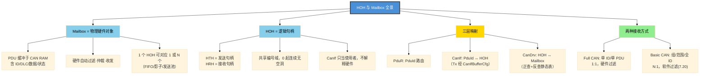

**图释**：全文四大主题——Mailbox（物理实体）、HOH（逻辑抽象）、三层映射链、以及决定映射形态的 FullCAN/BasicCAN 两分法。理解这一张图，即可通盘掌握 PDU–HOH–Mailbox 的关系。
