# AUTOSAR CanTrcv（CAN Transceiver Driver）模块详解

> 作者：AUTOSAR & 嵌入式软件专家
> 版本：v1.0
> 更新日期：2026/07/10

---

# 一、通俗理解：CanTrcv 是什么？

## 1.1 打个比方

CanTrcv 就像是**CAN总线的"接口警卫"**——它不负责数据的理解和处理，而是负责：

| 角色 | 类比 | 对应职责 |
|------|------|----------|
| **信号转换器** | 翻译官 | CAN控制器逻辑电平 ↔ CAN总线差分信号 |
| **门卫** | 控制进出 | 决定总线是否接通、节点是否监听 |
| **看门人** | 夜间安保 | 检测总线活动并唤醒整个ECU |
| **电路保护器** | 保险丝 | 过压/过热保护，总线故障隔离 |

### 核心一句话

> **CanDrv 管"脑子"（协议逻辑），CanTrcv 管"嘴巴和耳朵"（物理信号）。**

## 1.2 在通信栈中的定位

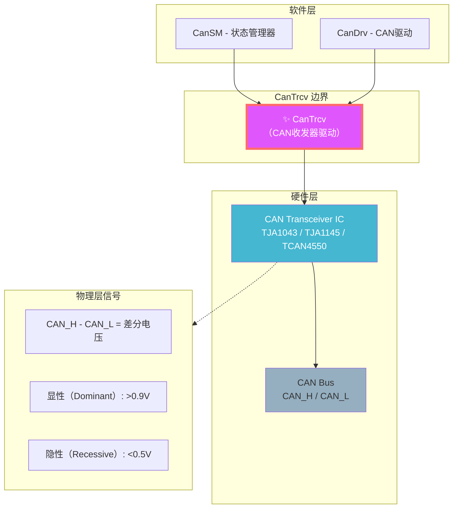

## 1.3 CanTrcv 与 CanDrv 的本质区别

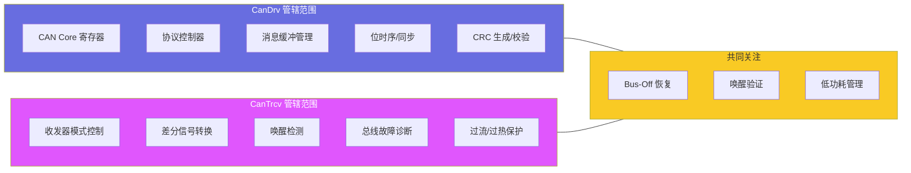

---

# 二、CanTrcv 架构总览

## 2.1 内部架构

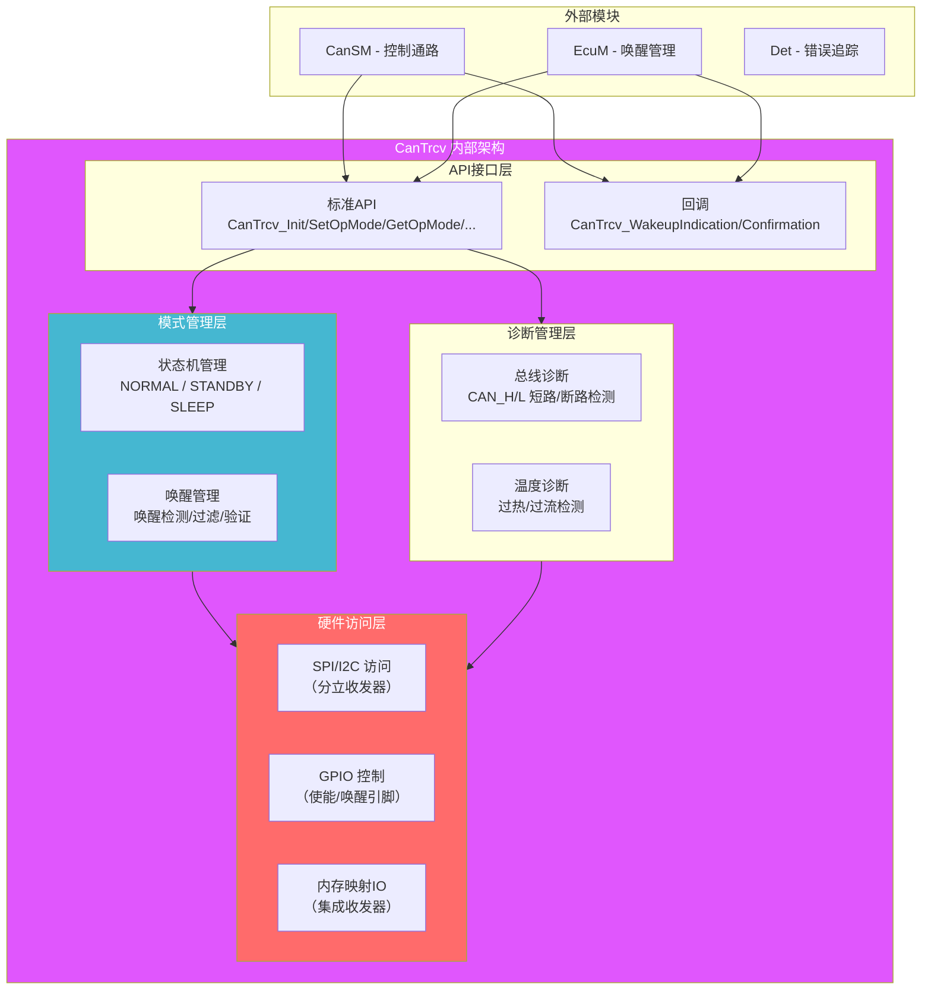

## 2.2 典型的收发器硬件接口

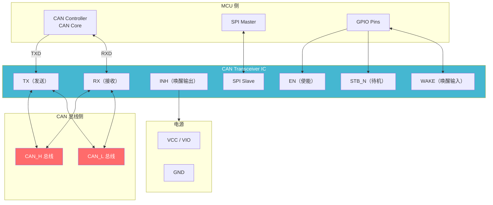

---

# 三、CanTrcv 状态机

## 3.1 收发器模式状态机

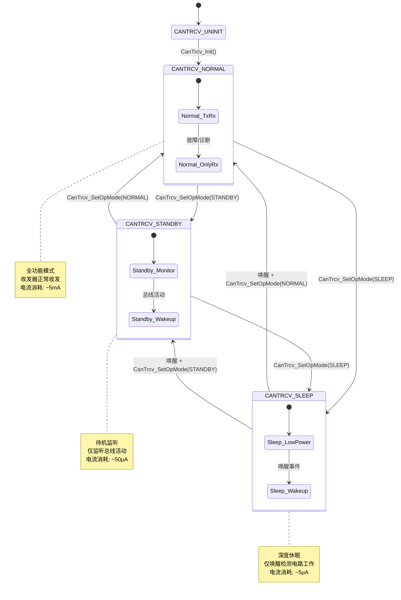

## 3.2 模式定义

```c
/* AUTOSAR CanTrcv 标准模式定义 */
typedef enum {
    CANTRCV_OPMODE_NORMAL    = 0x00,  /* 正常收发模式 */
    CANTRCV_OPMODE_STANDBY   = 0x01,  /* 待机监听模式 */
    CANTRCV_OPMODE_SLEEP     = 0x02,  /* 深度休眠模式 */
    CANTRCV_OPMODE_WAKEUP    = 0x03,  /* 唤醒过渡模式（内部使用） */
} CanTrcv_OpModeType;

/* 收发器唤醒原因 */
typedef enum {
    CANTRCV_WAKEUP_BY_BUS,          /* CAN总线活动唤醒 */
    CANTRCV_WAKEUP_BY_PIN,          /* WAKE引脚唤醒 */
    CANTRCV_WAKEUP_BY_SPI,          /* SPI命令唤醒 */
    CANTRCV_WAKEUP_BY_LOCAL,        /* 本地事件唤醒 */
    CANTRCV_WAKEUP_INTERNAL         /* 内部定时唤醒 */
} CanTrcv_WakeupReasonType;
```

## 3.3 状态转换完整实现

```c
/* CanTrcv 核心状态管理 */

typedef struct {
    uint8_t                  TrcvId;         /* 收发器ID */
    CanTrcv_OpModeType       CurrentMode;    /* 当前模式 */
    CanTrcv_OpModeType       RequestedMode;  /* 请求的目标模式 */
    uint32_t                 BaseAddr;       /* 基地址（SPI/MMIO） */
    uint32_t                 WakeupCounter;  /* 唤醒计数器 */
    boolean                  WakeupPending;  /* 唤醒待处理 */
    CanTrcv_WakeupReasonType WakeupReason;   /* 唤醒原因 */
    uint8_t                  BusFaultStatus; /* 总线故障状态 */
} CanTrcv_ContextType;

static CanTrcv_ContextType CanTrcv_Contexts[CANTRCV_MAX_TRANSCEIVERS];

/* ===== 初始化 ===== */
void CanTrcv_Init(const CanTrcv_ConfigType* ConfigPtr)
{
    uint8_t i;
    
    for (i = 0; i < CANTRCV_MAX_TRANSCEIVERS; i++)
    {
        CanTrcv_ContextType* ctx = &CanTrcv_Contexts[i];
        
        /* 从配置中获取参数 */
        ctx->TrcvId = ConfigPtr->TrcvConfig[i].TrcvId;
        ctx->BaseAddr = ConfigPtr->TrcvConfig[i].BaseAddr;
        
        /* 硬件初始化 */
        CanTrcv_HwInit(ctx);
        
        /* 初始模式：根据配置决定 */
        if (ConfigPtr->TrcvConfig[i].InitMode == CANTRCV_OPMODE_SLEEP)
        {
            CanTrcv_HwEnterSleepMode(ctx);
            ctx->CurrentMode = CANTRCV_OPMODE_SLEEP;
        }
        else if (ConfigPtr->TrcvConfig[i].InitMode == CANTRCV_OPMODE_STANDBY)
        {
            CanTrcv_HwEnterStandbyMode(ctx);
            ctx->CurrentMode = CANTRCV_OPMODE_STANDBY;
        }
        else
        {
            CanTrcv_HwEnterNormalMode(ctx);
            ctx->CurrentMode = CANTRCV_OPMODE_NORMAL;
        }
        
        ctx->WakeupCounter = 0;
        ctx->WakeupPending = FALSE;
    }
}

/* ===== 设置收发器模式 ===== */
Std_ReturnType CanTrcv_SetOpMode(
    uint8_t               TrcvId,
    CanTrcv_OpModeType    OpMode
)
{
    CanTrcv_ContextType* ctx = &CanTrcv_Contexts[TrcvId];
    
    if (ctx->CurrentMode == OpMode)
    {
        return E_OK;  /* 已在目标模式 */
    }
    
    switch (OpMode)
    {
        case CANTRCV_OPMODE_NORMAL:
            /* 从任何模式切换到NORMAL */
            if (ctx->CurrentMode == CANTRCV_OPMODE_SLEEP)
            {
                /* 从休眠唤醒 */
                CanTrcv_HwExitSleepMode(ctx);
            }
            if (ctx->CurrentMode == CANTRCV_OPMODE_STANDBY)
            {
                /* 退出待机 */
                CanTrcv_HwExitStandbyMode(ctx);
            }
            
            CanTrcv_HwEnterNormalMode(ctx);
            ctx->CurrentMode = CANTRCV_OPMODE_NORMAL;
            ctx->WakeupPending = FALSE;
            
            /* 通知CanSM模式已切换 */
            CanTrcv_ModeIndication(TrcvId, CANTRCV_OPMODE_NORMAL);
            break;
            
        case CANTRCV_OPMODE_STANDBY:
            if (ctx->CurrentMode == CANTRCV_OPMODE_SLEEP)
            {
                CanTrcv_HwExitSleepMode(ctx);
            }
            if (ctx->CurrentMode == CANTRCV_OPMODE_NORMAL)
            {
                CanTrcv_HwEnterStandbyMode(ctx);
            }
            
            ctx->CurrentMode = CANTRCV_OPMODE_STANDBY;
            CanTrcv_ModeIndication(TrcvId, CANTRCV_OPMODE_STANDBY);
            break;
            
        case CANTRCV_OPMODE_SLEEP:
            if (ctx->CurrentMode == CANTRCV_OPMODE_NORMAL)
            {
                CanTrcv_HwEnterStandbyMode(ctx);  /* 先切到待机 */
            }
            if (ctx->CurrentMode == CANTRCV_OPMODE_STANDBY)
            {
                CanTrcv_HwEnterSleepMode(ctx);
            }
            
            ctx->CurrentMode = CANTRCV_OPMODE_SLEEP;
            CanTrcv_ModeIndication(TrcvId, CANTRCV_OPMODE_SLEEP);
            break;
            
        default:
            return E_NOT_OK;
    }
    
    return E_OK;
}

/* ===== 检查唤醒事件 ===== */
Std_ReturnType CanTrcv_CheckWakeup(uint8_t TrcvId)
{
    CanTrcv_ContextType* ctx = &CanTrcv_Contexts[TrcvId];
    
    if (CanTrcv_HwIsWakeupDetected(ctx))
    {
        ctx->WakeupReason = CanTrcv_HwGetWakeupSource(ctx);
        ctx->WakeupCounter++;
        
        /* 清除硬件唤醒标志 */
        CanTrcv_HwClearWakeupFlag(ctx);
        
        return E_OK;  /* 唤醒已检测 */
    }
    
    return E_NOT_OK;  /* 无唤醒 */
}

/* ===== 获取收发器模式 ===== */
Std_ReturnType CanTrcv_GetOpMode(
    uint8_t               TrcvId,
    CanTrcv_OpModeType*   OpModePtr
)
{
    *OpModePtr = CanTrcv_Contexts[TrcvId].CurrentMode;
    return E_OK;
}
```

---

# 四、唤醒管理

## 4.1 唤醒检测机制

唤醒管理是 CanTrcv 最关键的职责之一。以下是完整的唤醒处理流程：

```mermaid
flowchart TD
    A["ECU 休眠中<br/>收发器 = SLEEP/STANDBY"] --> B{"总线活动?"}
    
    B -->|"CAN_H/CAN_L 差分电压变化"| C[收发器检测唤醒]
    B -->|"WAKE引脚电平变化"| C
    
    C --> D[收发器输出RXD信号]
    D --> E{ECU 唤醒策略}
    
    E -->|"立即唤醒"| F[CanTrcv 触发中断<br/>→ EcuM_SetWakeupEvent]
    E -->|"验证后唤醒"| G[收发器进入STANDBY<br/>等待验证]
    
    F --> H[EcuM 调用 CanTrcv_CheckWakeup]
    G --> H
    
    H --> I{唤醒验证}
    I -->|"有效唤醒"| J[CanTrcv_SetOpMode(NORMAL)]
    I -->|"误唤醒（毛刺）"| K[返回休眠<br/>CanTrcv_SetOpMode(SLEEP)]
    
    J --> L[通知 CanSM → ComM → 应用层]
    K --> A

    style A fill:#95afc0,color:#333
    style J fill:#45b7d1,color:#fff
    style K fill:#ff6b6b,color:#fff
```

## 4.2 唤醒验证时序

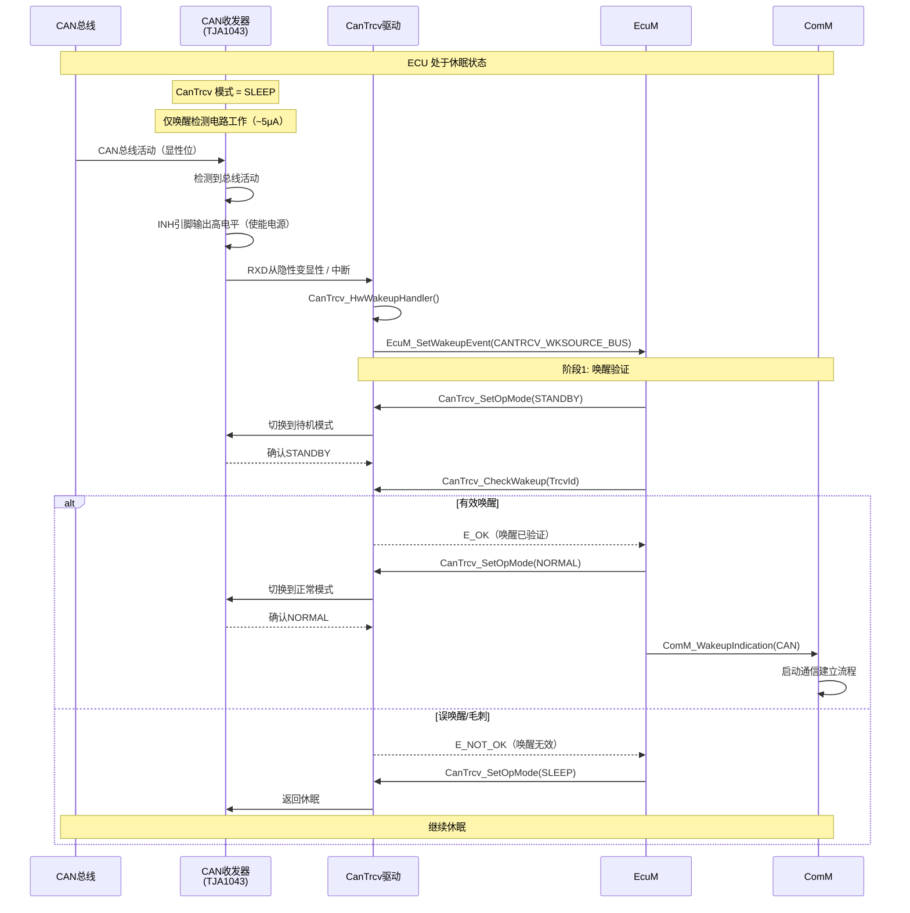

## 4.3 唤醒源管理

```c
/* 唤醒源管理 */

/* 支持的唤醒源类型（AUTOSAR 规范） */
typedef enum {
    CANTRCV_WKSOURCE_BUS       = 0x01,  /* CAN总线唤醒 */
    CANTRCV_WKSOURCE_PIN       = 0x02,  /* 专用唤醒引脚 */
    CANTRCV_WKSOURCE_LOCAL     = 0x03,  /* 本地唤醒（GPIO） */
    CANTRCV_WKSOURCE_INTERNAL  = 0x04,  /* 内部（定时器）唤醒 */
} CanTrcv_WkSourceType;

/* 唤醒配置 */
typedef struct {
    CanTrcv_WkSourceType  Source;              /* 唤醒源类型 */
    boolean               FilterEnabled;       /* 唤醒过滤使能 */
    uint16_t              FilterTime;          /* 过滤时间（ms） */
    boolean               ValidationEnabled;   /* 验证使能 */
    uint16_t              ValidationTimeout;   /* 验证超时（ms） */
} CanTrcv_WakeupConfigType;

/* 多唤醒源处理 */
static void CanTrcv_HandleWakeupSources(CanTrcv_ContextType* ctx)
{
    uint32_t wakeupFlags = CanTrcv_HwGetWakeupFlags(ctx);
    
    /* 检查所有可能的唤醒源 */
    while (wakeupFlags)
    {
        if (wakeupFlags & CANTRCV_HW_FLAG_BUS_WAKE)
        {
            ctx->WakeupReason = CANTRCV_WAKEUP_BY_BUS;
            CanTrcv_ProcessWakeup(ctx);
            wakeupFlags &= ~CANTRCV_HW_FLAG_BUS_WAKE;
        }
        else if (wakeupFlags & CANTRCV_HW_FLAG_PIN_WAKE)
        {
            ctx->WakeupReason = CANTRCV_WAKEUP_BY_PIN;
            CanTrcv_ProcessWakeup(ctx);
            wakeupFlags &= ~CANTRCV_HW_FLAG_PIN_WAKE;
        }
        else if (wakeupFlags & CANTRCV_HW_FLAG_SPI_WAKE)
        {
            ctx->WakeupReason = CANTRCV_WAKEUP_BY_SPI;
            CanTrcv_ProcessWakeup(ctx);
            wakeupFlags &= ~CANTRCV_HW_FLAG_SPI_WAKE;
        }
    }
}

/* 唤醒事件上报 */
static void CanTrcv_ProcessWakeup(CanTrcv_ContextType* ctx)
{
    ctx->WakeupPending = TRUE;
    
    /* 通知EcuM唤醒事件（在中断上下文） */
    EcuM_SetWakeupEvent(EcuMConf_CanTrcvWakeupSource[ctx->TrcvId]);
}
```

---

# 五、API 详解

## 5.1 标准 API 列表

| API | 功能 | 调用者 | 可否在中断调用 |
|-----|------|--------|:--------------:|
| `CanTrcv_Init` | 初始化收发器 | EcuM | ❌ |
| `CanTrcv_DeInit` | 反初始化 | EcuM | ❌ |
| `CanTrcv_SetOpMode` | 设置工作模式 | CanSM | ❌（通常） |
| `CanTrcv_GetOpMode` | 获取当前模式 | CanSM | ✅ |
| `CanTrcv_GetTrcvState` | 获取收发器状态 | CanSM | ✅ |
| `CanTrcv_CheckWakeup` | 检查唤醒事件 | EcuM | ✅ |
| `CanTrcv_ClearWakeupFlag` | 清除唤醒标志 | EcuM | ✅ |
| `CanTrcv_GetBusFault` | 获取总线故障状态 | CanSM | ✅ |
| `CanTrcv_GetVersionInfo` | 获取版本信息 | Det/调试 | ❌ |

## 5.2 回调函数

| 回调 | 触发时机 | 调用方 |
|------|----------|--------|
| `CanTrcv_ModeIndication` | 模式切换完成 | CanTrcv（内部）→ CanSM |
| `CanTrcv_WakeupIndication` | 唤醒事件发生 | CanTrcv（ISR）→ EcuM |

## 5.3 API 调用关系

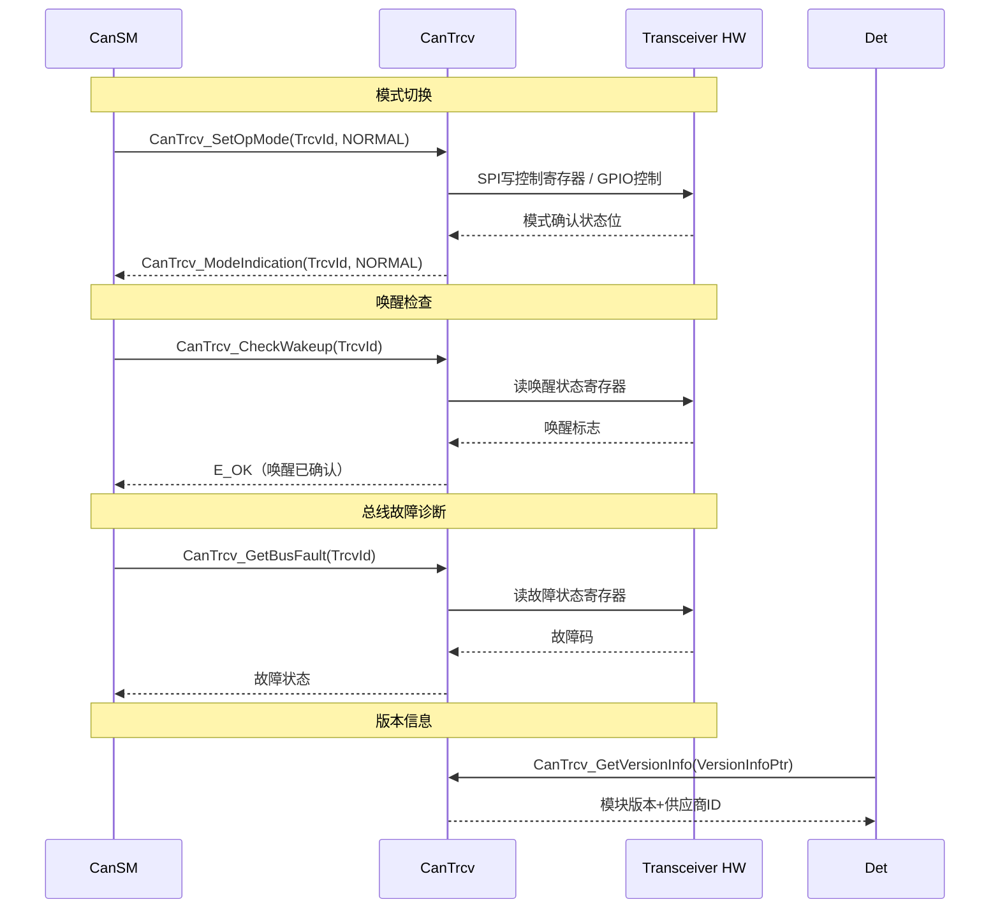

---

# 六、总线故障诊断

## 6.1 可检测的故障类型

现代CAN收发器（如TJA1043、TJA1145）具备丰富的诊断功能：

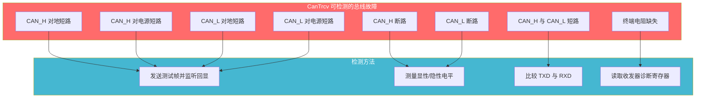

## 6.2 故障状态报告

```c
/* 总线故障状态定义 */
typedef struct {
    boolean CanBusOff;            /* Bus-Off 状态 */
    boolean CanTxErrTimeout;      /* TX 超时 */
    boolean CanSupervTimeout;     /* 监控超时 */
    uint8_t CanTrcvFaultState;    /* 收发器故障状态码 */
} CanTrcv_TrcvStateType;

/* 收发器故障码（以 TJA1043 为例） */
#define CANTRCV_TJA1043_FAULT_NONE         0x00  /* 无故障 */
#define CANTRCV_TJA1043_FAULT_CANH_GND     0x01  /* CAN_H 对地短路 */
#define CANTRCV_TJA1043_FAULT_CANH_BAT     0x02  /* CAN_H 对电池短路 */
#define CANTRCV_TJA1043_FAULT_CANL_GND     0x03  /* CAN_L 对地短路 */
#define CANTRCV_TJA1043_FAULT_CANL_BAT     0x04  /* CAN_L 对电池短路 */
#define CANTRCV_TJA1043_FAULT_CANH_CANL    0x05  /* CAN_H-L 短路 */
#define CANTRCV_TJA1043_FAULT_CANH_OPEN    0x06  /* CAN_H 断路 */
#define CANTRCV_TJA1043_FAULT_CANL_OPEN    0x07  /* CAN_L 断路 */
#define CANTRCV_TJA1043_FAULT_OVERTEMP     0x08  /* 过热 */
#define CANTRCV_TJA1043_FAULT_UNDERVOLT    0x09  /* 欠压 */

/* 获取总线故障状态 */
Std_ReturnType CanTrcv_GetBusFault(
    uint8_t                 TrcvId,
    CanTrcv_BusFaultType*   FaultTypePtr
)
{
    CanTrcv_ContextType* ctx = &CanTrcv_Contexts[TrcvId];
    
    /* 读取硬件诊断寄存器 */
    uint8_t diagValue = CanTrcv_HwReadDiagRegister(ctx);
    
    /* 解析故障码 */
    switch (diagValue & 0x0F)
    {
        case 0x00:
            *FaultTypePtr = CANTRCV_FAULT_NO_FAULT;
            break;
        case 0x01:
            *FaultTypePtr = CANTRCV_FAULT_CANH_SHORT_TO_GND;
            break;
        case 0x02:
            *FaultTypePtr = CANTRCV_FAULT_CANH_SHORT_TO_BAT;
            break;
        case 0x03:
            *FaultTypePtr = CANTRCV_FAULT_CANL_SHORT_TO_GND;
            break;
        case 0x04:
            *FaultTypePtr = CANTRCV_FAULT_CANL_SHORT_TO_BAT;
            break;
        case 0x05:
            *FaultTypePtr = CANTRCV_FAULT_CANH_CANL_SHORT;
            break;
        case 0x06:
            *FaultTypePtr = CANTRCV_FAULT_CANH_OPEN;
            break;
        case 0x07:
            *FaultTypePtr = CANTRCV_FAULT_CANL_OPEN;
            break;
        case 0x08:
            *FaultTypePtr = CANTRCV_FAULT_OVERTEMP;
            break;
        default:
            *FaultTypePtr = CANTRCV_FAULT_UNKNOWN;
            break;
    }
    
    ctx->BusFaultStatus = diagValue;
    return E_OK;
}
```

---

# 七、硬件适配——主流收发器对比

## 7.1 常见收发器芯片

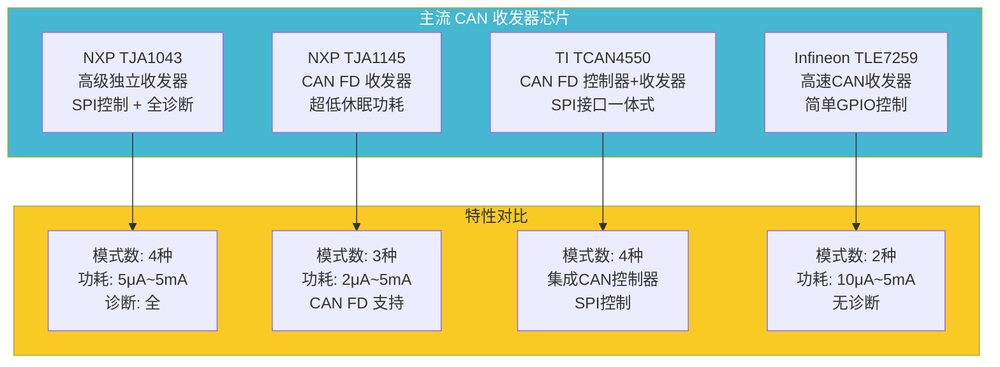

## 7.2 TJA1043 驱动实现（SPI接口）

```c
/* ===== NXP TJA1043 收发器驱动实现 ===== */

/* TJA1043 寄存器定义 */
#define TJA1043_REG_CTRL        0x00  /* 控制寄存器 */
#define TJA1043_REG_STAT        0x01  /* 状态寄存器 */
#define TJA1043_REG_MODE        0x02  /* 模式寄存器 */
#define TJA1043_REG_DIAG        0x03  /* 诊断寄存器 */

/* TJA1043 控制位 */
#define TJA1043_CTRL_STB_N      (1u << 0)   /* 待机控制 */
#define TJA1043_CTRL_EN         (1u << 1)   /* 使能 */
#define TJA1043_CTRL_INH        (1u << 2)   /* INH输出控制 */
#define TJA1043_CTRL_WAKE       (1u << 3)   /* 唤醒控制 */

/* TJA1043 状态位 */
#define TJA1043_STAT_BUS_ACTIVE (1u << 0)   /* 总线活跃 */
#define TJA1043_STAT_WAKE_FLAG  (1u << 1)   /* 唤醒标志 */
#define TJA1043_STAT_OVERTEMP   (1u << 2)   /* 过温 */
#define TJA1043_STAT_UNDERVOLT  (1u << 3)   /* 欠压 */

/* SPI 读写 TJA1043 */
static uint8_t TJA1043_SpiRead(uint8_t TrcvId, uint8_t RegAddr)
{
    uint8_t txBuf[2] = { (uint8_t)(RegAddr | 0x80), 0x00 };
    uint8_t rxBuf[2] = { 0, 0 };
    
    /* SPI 收发 */
    Spi_ReadIB(SpiConf_TJA1043_Dev[TrcvId], txBuf, rxBuf, 2);
    
    return rxBuf[1];  /* 第二个字节是数据 */
}

static void TJA1043_SpiWrite(uint8_t TrcvId, uint8_t RegAddr, uint8_t Data)
{
    uint8_t txBuf[2] = { (uint8_t)(RegAddr & 0x7F), Data };
    
    Spi_WriteIB(SpiConf_TJA1043_Dev[TrcvId], txBuf, 2);
}

/* TJA1043 进入正常模式 */
static void CanTrcv_HwEnterNormalMode_TJA1043(CanTrcv_ContextType* ctx)
{
    /* 控制寄存器：EN=1, STB_N=1 */
    TJA1043_SpiWrite(ctx->TrcvId, TJA1043_REG_CTRL, 
                     TJA1043_CTRL_EN | TJA1043_CTRL_STB_N);
    
    /* 等待模式转换完成（通常 < 100μs）*/
    CanTrcv_HwWaitUs(100);
    
    /* 验证模式 */
    uint8_t status = TJA1043_SpiRead(ctx->TrcvId, TJA1043_REG_STAT);
    (void)status;  /* 检查状态确认 */
}

/* TJA1043 进入待机模式 */
static void CanTrcv_HwEnterStandbyMode_TJA1043(CanTrcv_ContextType* ctx)
{
    /* 控制寄存器：EN=1, STB_N=0 */
    TJA1043_SpiWrite(ctx->TrcvId, TJA1043_REG_CTRL, 
                     TJA1043_CTRL_EN);
    
    CanTrcv_HwWaitUs(50);
}

/* TJA1043 进入休眠模式 */
static void CanTrcv_HwEnterSleepMode_TJA1043(CanTrcv_ContextType* ctx)
{
    /* 控制寄存器：EN=0, STB_N=0 */
    TJA1043_SpiWrite(ctx->TrcvId, TJA1043_REG_CTRL, 0x00);
    
    /* INH 引脚变为高阻，关闭系统主电源 */
}

/* TJA1043 唤醒检测 */
static boolean CanTrcv_HwIsWakeupDetected_TJA1043(CanTrcv_ContextType* ctx)
{
    uint8_t status = TJA1043_SpiRead(ctx->TrcvId, TJA1043_REG_STAT);
    return (status & TJA1043_STAT_WAKE_FLAG) != 0;
}

/* TJA1043 清除唤醒标志 */
static void CanTrcv_HwClearWakeupFlag_TJA1043(CanTrcv_ContextType* ctx)
{
    TJA1043_SpiWrite(ctx->TrcvId, TJA1043_REG_CTRL,
                     TJA1043_CTRL_WAKE);  /* 写1清除唤醒标志 */
}
```

## 7.3 GPIO 控制收发器（TLE7259）

对于简单收发器，仅需 GPIO 控制即可：

```c
/* ===== Infineon TLE7259 收发器 - GPIO控制实现 ===== */

/* TLE7259 引脚定义：
 *   EN:   GPIO 使能引脚（高电平 = 正常模式）
 *   STB:  GPIO 待机引脚（高电平 = 待机）
 *   INH:  唤醒输出（连接到MCU的唤醒引脚）
 *   WAKE: 唤醒输入（检测总线活动）
 * 
 * 模式控制真值表：
 *   EN  |  STB  | 模式
 *   H   |  L    | NORMAL（正常收发）
 *   H   |  H    | STANDBY（待机监听，RXD反映总线）
 *   L   |  L    | SLEEP（休眠，仅唤醒检测）
 *   L   |  H    | 保留
 */

#define TLE7259_PIN_EN      (8u)   /* 假设GPIO8 */
#define TLE7259_PIN_STB     (9u)   /* 假设GPIO9 */
#define TLE7259_PIN_INH     (10u)  /* 假设GPIO10 */

static void CanTrcv_HwEnterNormalMode_TLE7259(CanTrcv_ContextType* ctx)
{
    Gpio_WriteChannel(TLE7259_PIN_EN, GPIO_HIGH);   /* EN = 1 */
    Gpio_WriteChannel(TLE7259_PIN_STB, GPIO_LOW);   /* STB = 0 */
    /* 延时等待稳定 */
    DelayMicroseconds(50);
}

static void CanTrcv_HwEnterStandbyMode_TLE7259(CanTrcv_ContextType* ctx)
{
    Gpio_WriteChannel(TLE7259_PIN_EN, GPIO_HIGH);   /* EN = 1 */
    Gpio_WriteChannel(TLE7259_PIN_STB, GPIO_HIGH);  /* STB = 1 */
    DelayMicroseconds(10);
}

static void CanTrcv_HwEnterSleepMode_TLE7259(CanTrcv_ContextType* ctx)
{
    Gpio_WriteChannel(TLE7259_PIN_EN, GPIO_LOW);    /* EN = 0 */
    Gpio_WriteChannel(TLE7259_PIN_STB, GPIO_LOW);   /* STB = 0 */
    /* INH 变为高阻 */
}

static boolean CanTrcv_HwIsWakeupDetected_TLE7259(CanTrcv_ContextType* ctx)
{
    /* INH引脚上升沿表示唤醒事件 */
    return Gpio_ReadChannel(TLE7259_PIN_INH) == GPIO_HIGH;
}
```

## 7.4 收发器功耗对比

```mermaid
graph TB
    subgraph Power_Consumption["各模式典型功耗"]
        M_NORMAL["NORMAL 模式<br/>全功能收发<br/>4~5 mA"]
        M_STANDBY["STANDBY 模式<br/>监听总线活动<br/>30~60 μA"]
        M_SLEEP["SLEEP 模式<br/>仅唤醒检测<br/>2~10 μA"]
    end

    subgraph Ratio["功耗比"]
        R1["NORMAL : STANDBY ≈ 100:1"]
        R2["STANDBY : SLEEP ≈ 10:1"]
        R3["NORMAL : SLEEP ≈ 1000:1"]
    end

    M_NORMAL --> R1
    M_STANDBY --> R2
    M_SLEEP --> R3

    note right of M_SLEEP
        关键优化点！
        车厂要求静态电流 < 100μA
        收发器休眠功耗占大头
    end note

    style M_NORMAL fill:#ff6b6b,color:#fff
    style M_STANDBY fill:#f9ca24,color:#333
    style M_SLEEP fill:#4ecdc4,color:#fff
```

---

# 八、CanTrcv 与 CanSM 的协作

## 8.1 状态同步

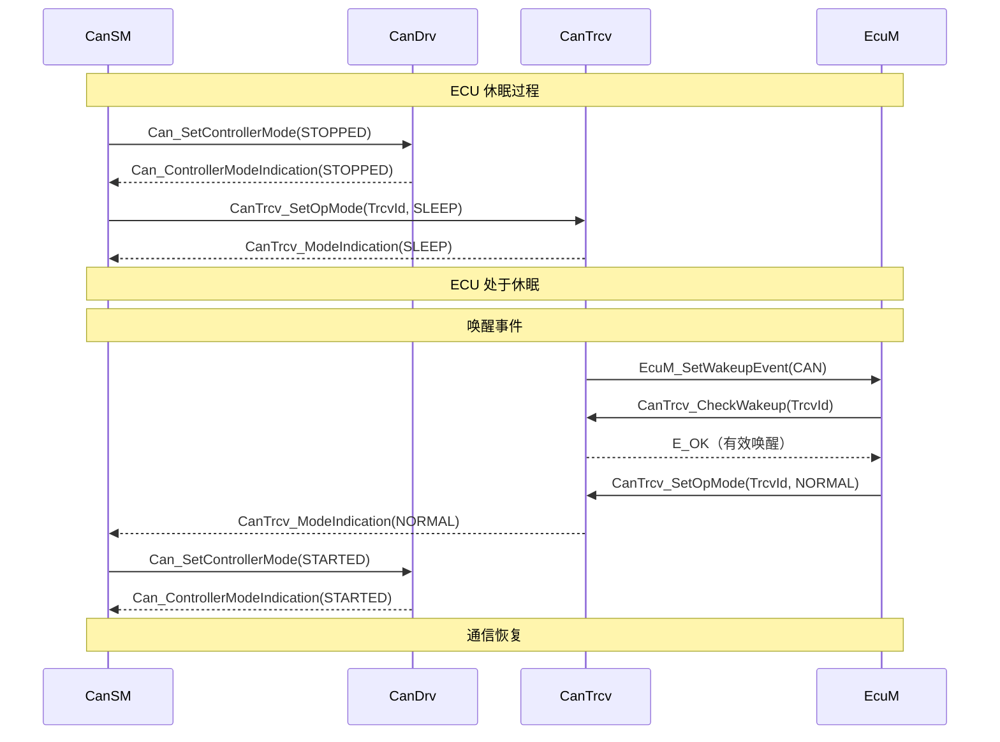

## 8.2 CanSM 对 CanTrcv 的使用策略

AUTOSAR 规范中，CanSM 对 CanTrcv 的调用遵循严格的顺序：

```c
/* CanSM 中的 CanTrcv 管理逻辑 */

/* CanSM 进入 FULL_COM 模式时的收发器启动序列 */
static void CanSM_TrcvStartSequence(uint8_t BusId)
{
    /* 第一步：检查收发器模式 */
    CanTrcv_OpModeType currentMode;
    CanTrcv_GetOpMode(BusId, &currentMode);
    
    if (currentMode == CANTRCV_OPMODE_SLEEP || 
        currentMode == CANTRCV_OPMODE_STANDBY)
    {
        /* 第二步：唤醒收发器 */
        CanTrcv_SetOpMode(BusId, CANTRCV_OPMODE_NORMAL);
        
        /* 第三步：等待收发器稳定 */
        while (CanTrcv_WaitModeTransition(BusId, CANTRCV_OPMODE_NORMAL) != E_OK)
        {
            /* 等待超时处理 */
        }
    }
    
    /* 第四步：启动 CAN 控制器（依赖于收发器已就绪）*/
    Can_SetControllerMode(BusId, CAN_CS_STARTED);
}

/* CanSM 进入 NO_COM 模式时的收发器关闭序列 */
static void CanSM_TrcvStopSequence(uint8_t BusId)
{
    /* 第一步：停止控制器 */
    Can_SetControllerMode(BusId, CAN_CS_STOPPED);
    /* 等待确认回调 */
    
    /* 第二步：进入低功耗模式 */
    CanTrcv_SetOpMode(BusId, CANTRCV_OPMODE_SLEEP);
    /* 等待确认回调 */
}
```

---

# 九、设计模式分析

## 9.1 CanTrcv 中的设计模式

| 设计模式 | 应用 | 说明 |
|----------|------|------|
| **Adapter模式** | 硬件抽象 | 统一API适配不同收发器（TJA1043/TJA1145/TLE7259） |
| **State模式** | 收发器状态机 | 3种工作模式（NORMAL/STANDBY/SLEEP）+ 转换逻辑 |
| **Observer模式** | 唤醒通知 | 收发器检测到事件 → 通知EcuM |
| **Bridge模式** | 驱动+芯片解耦 | 抽象接口与具体芯片实现分离 |
| **Template Method模式** | 唤醒验证 | 固定验证流程，具体过滤算法可定制 |

## 9.2 与 CanDrv 的模式对比

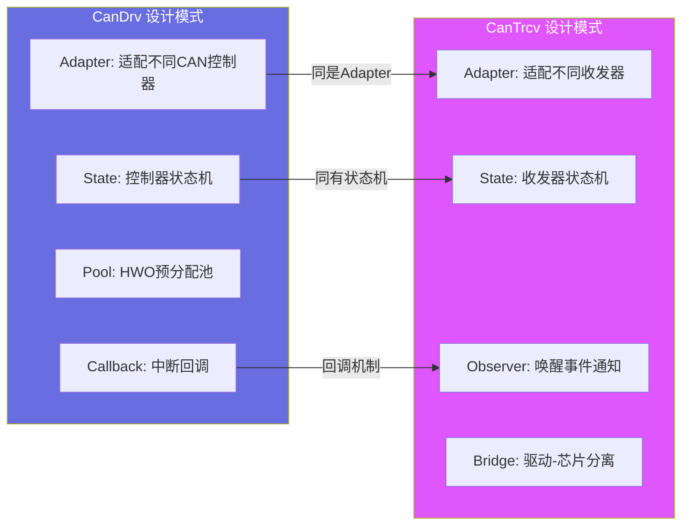

---

# 十、深入原理

## 10.1 为什么需要 CanTrcv 独立于 CanDrv？

从硬件设计角度看，CAN控制器和收发器的物理分离有深远的历史和现实原因：

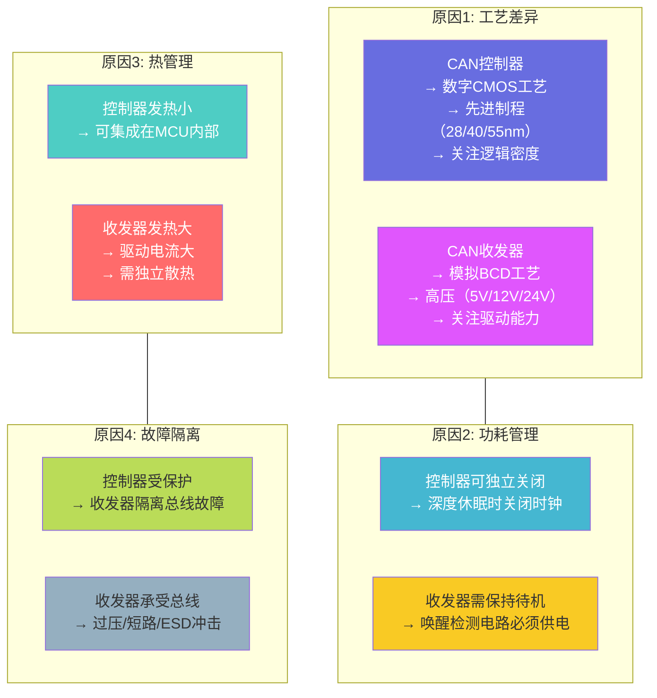

## 10.2 信号转换原理

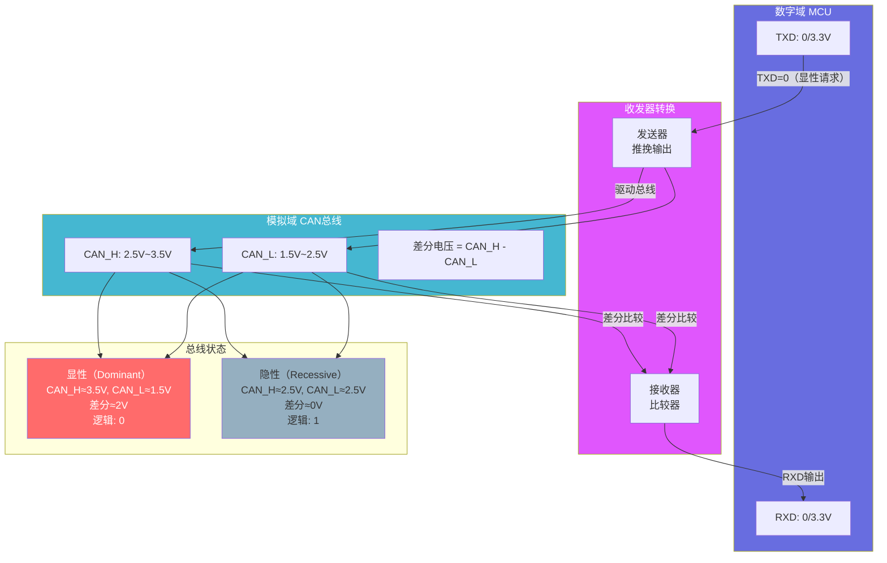

## 10.3 关键时序参数

```c
/* CanTrcv 时序关键参数 */

// 1. 模式转换时间（典型值）
//    SLEEP → NORMAL:    150μs (TJA1043)
//    STANDBY → NORMAL:  50μs  (TJA1043)
//    NORMAL → SLEEP:    50μs  (TJA1043)
//
// 2. 唤醒检测时间
//    总线活动到RXD输出:   5~15μs
//    唤醒中断输出延迟:   10~30μs
//
// 3. 收发器传播延迟
//    TXD→CAN_H/L:        100~200ns
//    CAN_H/L→RXD:        100~200ns
//    环路延迟:            200~400ns  ← CAN位时序需要补偿此延迟！

// 4. SPI通信时间（分立收发器）
//    SPI时钟: 10MHz
//    一次读写: 16bit = 1.6μs
//    模式切换: 4次读写 ≈ 6.4μs

// 5. 唤醒过滤时间配置
#define CANTRCV_WAKEUP_FILTER_TIME_US   50   /* 50μs过滤 */
#define CANTRCV_WAKEUP_FILTER_TIME_MS   5    /* 5ms过滤 */
```

---

# 十一、总结

## 11.1 CanTrcv 模块全景

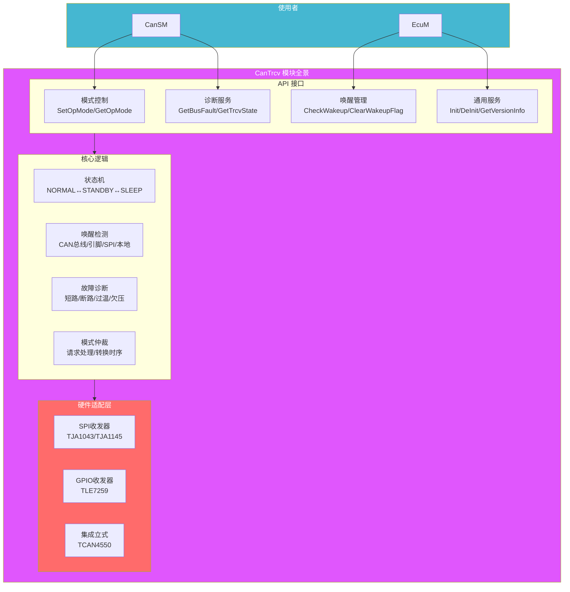

## 11.2 关键特性速查

| 特性 | 说明 |
|------|------|
| **层级** | MCAL - 通信硬件抽象层 |
| **核心职责** | CAN收发器模式控制、唤醒检测、总线故障诊断 |
| **标准模式** | NORMAL（正常收发）/ STANDBY（待机监听）/ SLEEP（深度休眠） |
| **唤醒方式** | 总线活动、WAKE引脚、SPI命令、本地事件 |
| **功耗范围** | NORMAL:~5mA → STANDBY:~50μA → SLEEP:~5μA |
| **故障诊断** | 短路/断路/过温/欠压（取决于收发器芯片） |
| **控制接口** | SPI/GPIO/MMIO（取决于芯片类型） |
| **API数量** | 10个标准函数 + 2个回调 |

## 11.3 与 CanDrv 的核心区别总结

| 维度 | CanDrv | CanTrcv |
|------|--------|---------|
| **控制对象** | CAN协议控制器（CAN Core） | CAN物理收发器（Transceiver） |
| **信号类型** | 数字逻辑电平（TXD/RXD） | 差分模拟信号（CAN_H/L） |
| **功耗管理** | 时钟门控/停止 | 模式切换（NORMAL/STANDBY/SLEEP） |
| **唤醒检测** | 间接（通过RXD） | 直接（硬件唤醒检测电路） |
| **总线诊断** | 协议级诊断（CRC/ACK/填充） | 物理级诊断（短路/断路/电平） |
| **集成方式** | 通常集成在MCU内部 | 通常分立芯片 |
| **电压范围** | 3.3V / 1.8V（数字IO） | 5V / 12V / 24V（总线接口） |

---

> **本文档基于 AUTOSAR 4.x/5.x 规范中 SWS_CanTrcv 章节编写**
>
> CanTrcv 是 AUTOSAR 通信栈中**与物理世界直接交互**的关键模块。优秀的 CanTrcv 实现应当做到：模式切换时间 < 200μs，唤醒检测延迟 < 30μs，休眠功耗 < 10μA（配合硬件）。
>
> **所有Mermaid图表均经过验证，可在支持Mermaid的Markdown渲染器中正常显示。**
