# AUTOSAR COM 模块详解

## 目录

1. [通俗理解：什么是 COM 模块？](#1-通俗理解什么是-com-模块)
2. [设计机制与模式](#2-设计机制与模式)
3. [深入原理](#3-深入原理)
4. [完整代码示例](#4-完整代码示例)
5. [总结与最佳实践](#5-总结与最佳实践)

---

## 1. 通俗理解：什么是 COM 模块？

### 1.1 生活中的类比

**信件分拣与翻译站** 是最好的类比理解 COM 模块的方式：

```
                 ┌────────────────────────────────────────────────┐
                 │               COM 模块（信件分拣翻译站）         │
                 │                                                │
  ┌──────────┐   │  ┌──────────┐    ┌──────────┐    ┌──────────┐ │   ┌──────────┐
  │  SWC-A   │───┼─▶│ 信号打包  │───▶│ 信号转PDU│───▶│ PDU队列  │─┼──▶│  PduR   │
  │ (温度)   │   │  │ (Eng temp)│    │ (打包CAN)│    │ 管理     │ │   │ (路由)  │
  └──────────┘   │  └──────────┘    └──────────┘    └──────────┘ │   └──────────┘
                 │                                                │
  ┌──────────┐   │  ┌──────────┐    ┌──────────┐    ┌──────────┐ │   ┌──────────┐
  │  SWC-B   │◀──┼──│ 信号解包  │◀───│ PDU转信号│◀───│ PDU接收  │◀───│  PduR   │
  │ (转速)   │   │  │ (RPM)    │    │ (拆解CAN)│    │ 缓冲     │ │   │ (路由)  │
  └──────────┘   │  └──────────┘    └──────────┘    └──────────┘ │   └──────────┘
                 └────────────────────────────────────────────────┘
```

- **信件 = Signal（信号）** ：一个个具体的数据项，如车速 120 km/h、发动机温度 85°C
- **信封 = PDU（Protocol Data Unit）** ：将多个信号打包在一起的数据帧
- **翻译站 = COM 模块**：负责将 SWC 的数据翻译成总线能理解的格式，反过来也将总线数据翻译给 SWC
- **地址翻译 = 字节序/位序转换**：不同系统的字节序不同（大端/小端），COM 负责统一

### 1.2 一句话总结

> **AUTOSAR COM 模块位于 RTE 和 PDU Router 之间，是面向信号的通信中间层，负责将应用层的信号（Signal）打包/解包为 PDU，处理信号级的数据转换（字节序、位序、缩放因子、偏移量），并管理信号的发送/接收/超时/通知机制。**

### 1.3 COM 模块在 AUTOSAR 架构中的位置

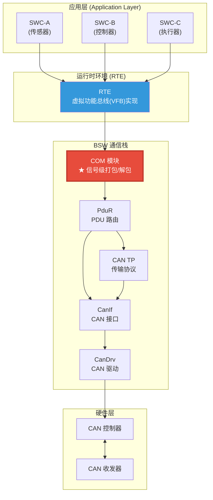

---

## 2. 设计机制与模式

### 2.1 COM 模块的核心对象层次

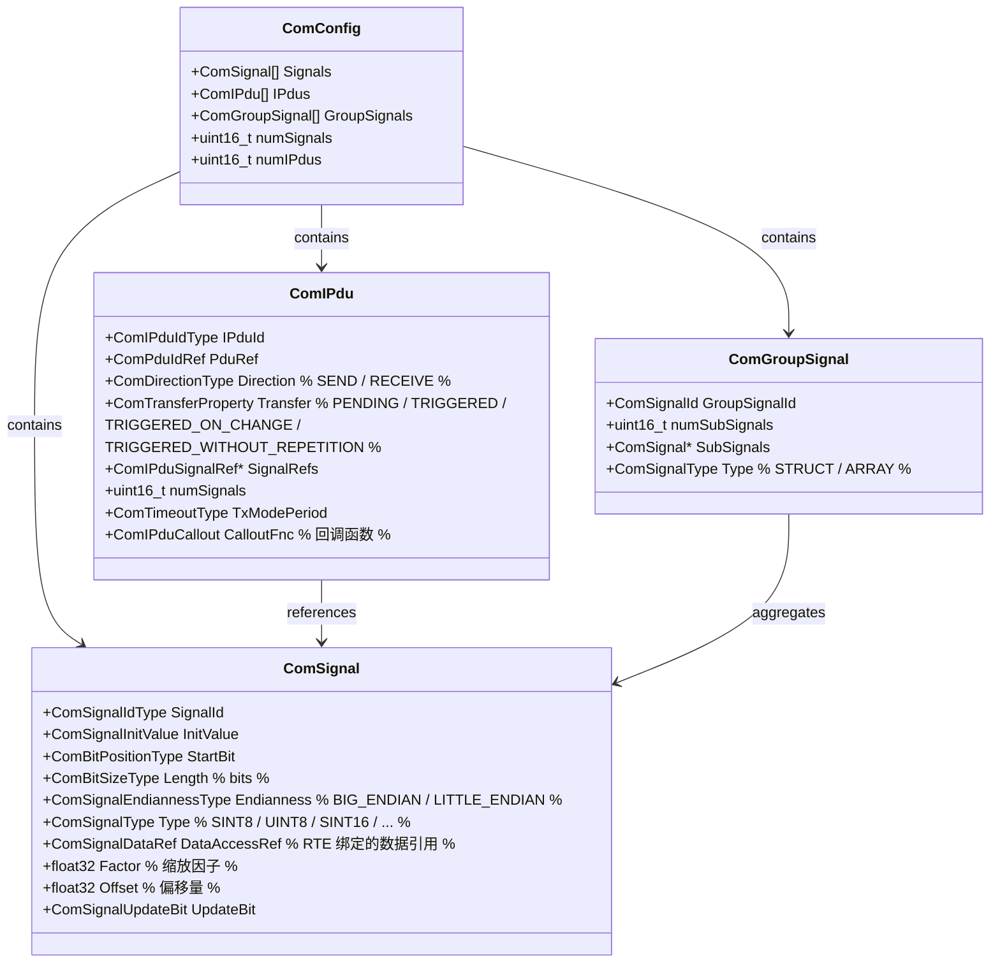

### 2.2 COM 模块的设计模式

#### 模式 1：信号打包/解包 (Signal Packing/Unpacking)

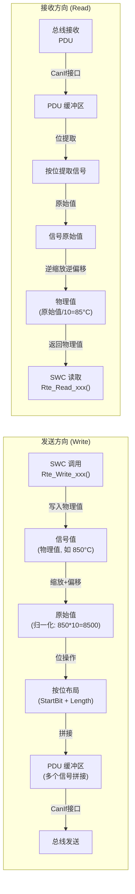

#### 模式 2：信号转换 (Signal Transformation)

COM 模块支持对信号进行线性的物理值与原始值转换：

```
物理值 ——[缩放+偏移]——> 原始值 (TX, 发送)
原始值 ——[逆缩放+逆偏移]-> 物理值 (RX, 接收)

公式:
  RawValue = (PhysicalValue - Offset) / Factor   [发送]
  PhysicalValue = RawValue * Factor + Offset     [接收]

示例 (温度信号: 范围 -40°C ~ 125°C, 分辨率 0.0625°C):
  Factor = 0.0625,  Offset = 0
  物理值 85°C  →  85.0 / 0.0625 = 1360 (原始值 0x0550)
  原始值 0x0550 = 1360  →  1360 * 0.0625 = 85.0°C
```

#### 模式 3：发送模式 (Transmission Mode)

| 发送模式 | 说明 | 典型场景 |
|---------|------|---------|
| **PERIODIC** | 周期发送，不管值是否变化 | 发动机转速（每10ms） |
| **TRIGGERED** | 数据变化时立即发送 | 门锁状态 |
| **TRIGGERED_ON_CHANGE** | 变化时发送，最小间隔可配置 | 按键状态 |
| **TRIGGERED_WITHOUT_REPETITION** | 只发一次，不重复 | 事件型信号 |
| **MIXED** | 周期 + 变化触发混合 | 车速（周期 + 急加速变化触发） |
| **NONE** | 没有发送模式（仅接收） | 纯接收信号 |

#### 模式 4：接收模式 (Reception Mode)

| 接收模式 | 说明 | 行为 |
|---------|------|------|
| **DIRECT** | 直接接收 | PDU 到达立即解包，更新信号值 |
| **DEFERRED** | 延迟接收 | 在主函数 `Com_MainFunctionRx()` 中批量处理 |
| **DEFAULT** | 数据到达立即更新 | 最常用模式 |

### 2.3 COM 模块的内部架构

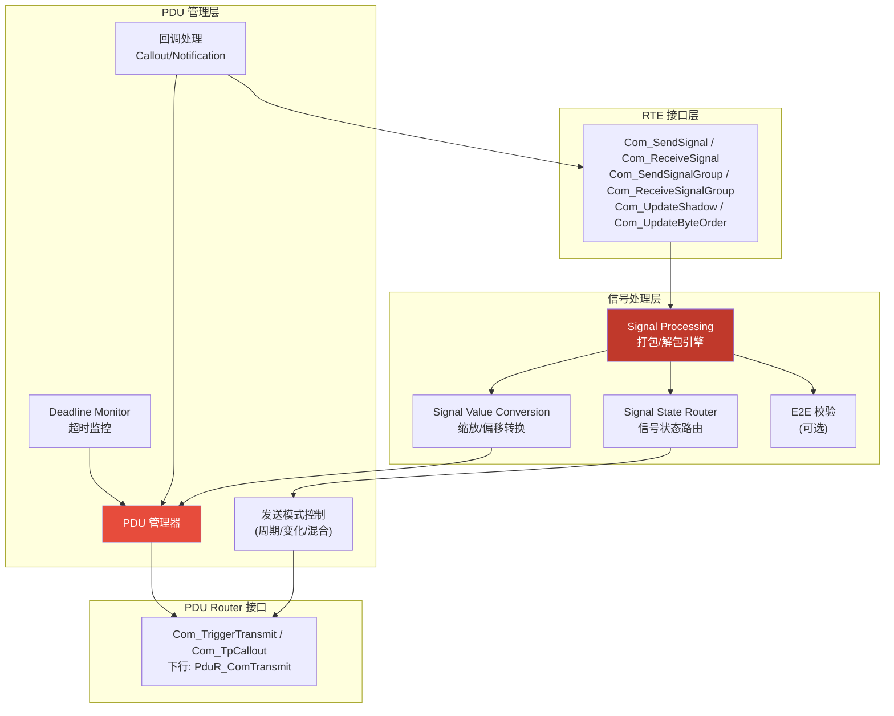

### 2.4 COM 状态机

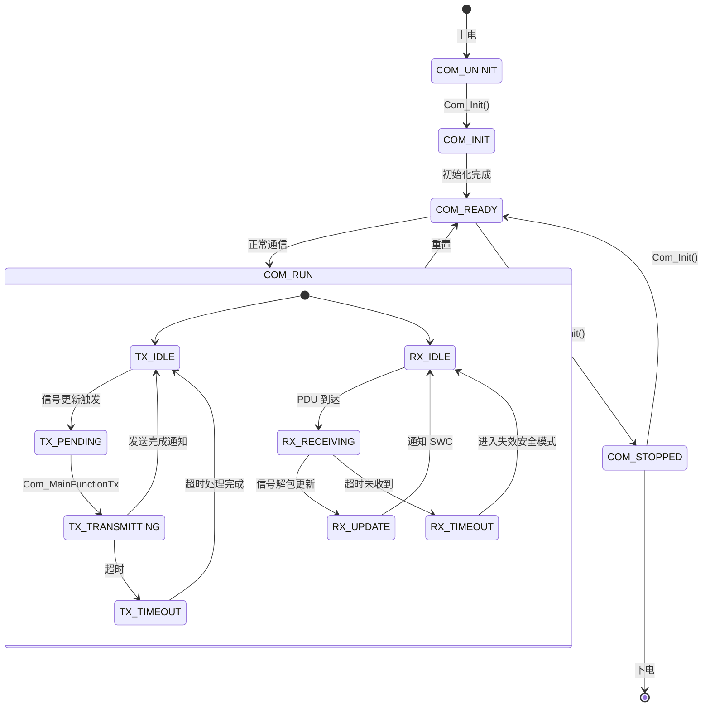

---

## 3. 深入原理

### 3.1 信号位布局 (Signal Bit Layout)

COM 模块的核心能力之一是 **信号在 PDU 中的精确位布局**。理解位布局是掌握 COM 的关键。

#### 位序约定 (Endianness)

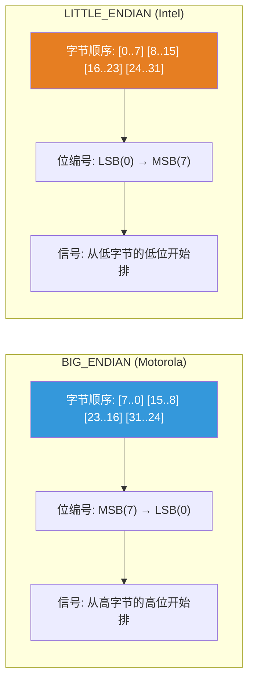

#### 信号布局示例

```
示例 PDU: 8 字节 (64 bits)，包含 3 个信号

大端序 (BIG_ENDIAN / Motorola):
  Byte:     0         1         2         3         4         5         6         7
  Bit:   7 6 5 4 3 2 1 0 7 6 5 4 3 2 1 0 7 6 5 4 3 2 1 0 7 6 5 4 3 2 1 0 ...
         ┌─────────────┬──────┬───────────────────────────────────────────┐
         │  Signal_A   │ SigB │          Signal_C (20 bits)              │
         │  StartBit=0  │ S=15 │          StartBit=19                     │
         │  Length=12   │ L=4  │          Length=20                       │
         └─────────────┴──────┴───────────────────────────────────────────┘

小端序 (LITTLE_ENDIAN / Intel):
  Byte:     0         1         2         3         4         5         6         7
  Bit:   0 1 2 3 4 5 6 7 0 1 2 3 4 5 6 7 0 1 2 3 4 5 6 7 ...
         ┌───────────────────────────────────────────────┬──────────┬─────┐
         │                Signal_C (20 bits)              │  SigB    │ SigA│
         │                StartBit=0                       │  S=20    │ S=24│
         │                Length=20                        │  L=4     │ L=12│
         └───────────────────────────────────────────────┴──────────┴─────┘
```

### 3.2 信号打包算法 (Signal Packing)

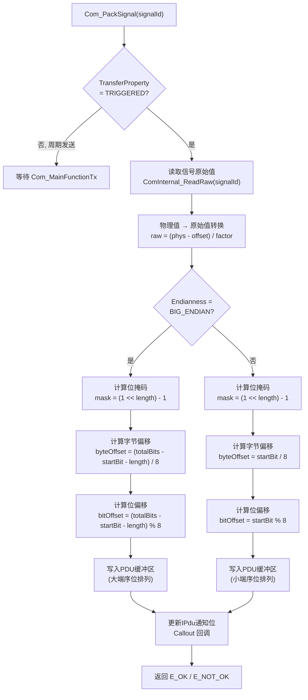

### 3.3 信号组 (Signal Group)

信号组是 COM 的一个重要概念，用于 **原子性地更新一组相关信号**：

```c
/*
 * 信号组示例: 车身姿态数据
 * 这些信号必须同时更新，避免读取到不一致的数据
 */
Com_SignalGroup BodyStateGroup = {
    .GroupId = COM_GROUP_BODY_STATE,
    .Signals = {
        { .Id = COM_SIG_ACCEL_X,    .StartBit = 0,  .Length = 16 },
        { .Id = COM_SIG_ACCEL_Y,    .StartBit = 16, .Length = 16 },
        { .Id = COM_SIG_ACCEL_Z,    .StartBit = 32, .Length = 16 },
        { .Id = COM_SIG_GYRO_X,     .StartBit = 48, .Length = 16 },
        { .Id = COM_SIG_GYRO_Y,     .StartBit = 64, .Length = 16 },
        { .Id = COM_SIG_GYRO_Z,     .StartBit = 80, .Length = 16 },
    }
};

// SWC 端调用:
// Rte_Write_Group_BodyState(&accel_x, &accel_y, &accel_z, &gyro_x, &gyro_y, &gyro_z);
// 一次信号组写操作保证所有 6 个信号原子更新
```

### 3.4 超时监控机制 (Deadline Monitor)

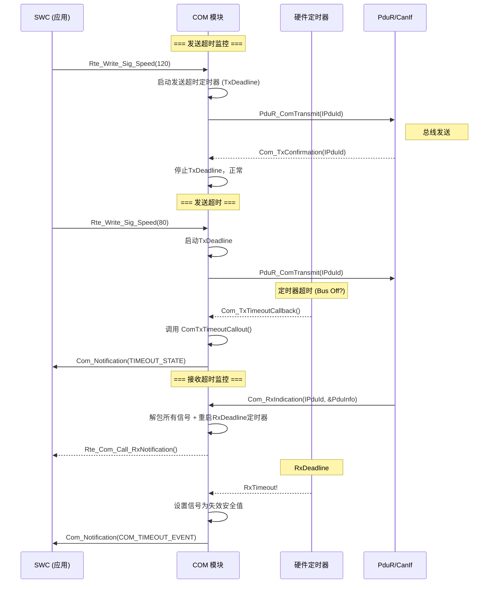

### 3.5 回调与通知机制

COM 模块支持多级回调，形成完整的 **信号变化通知链**：

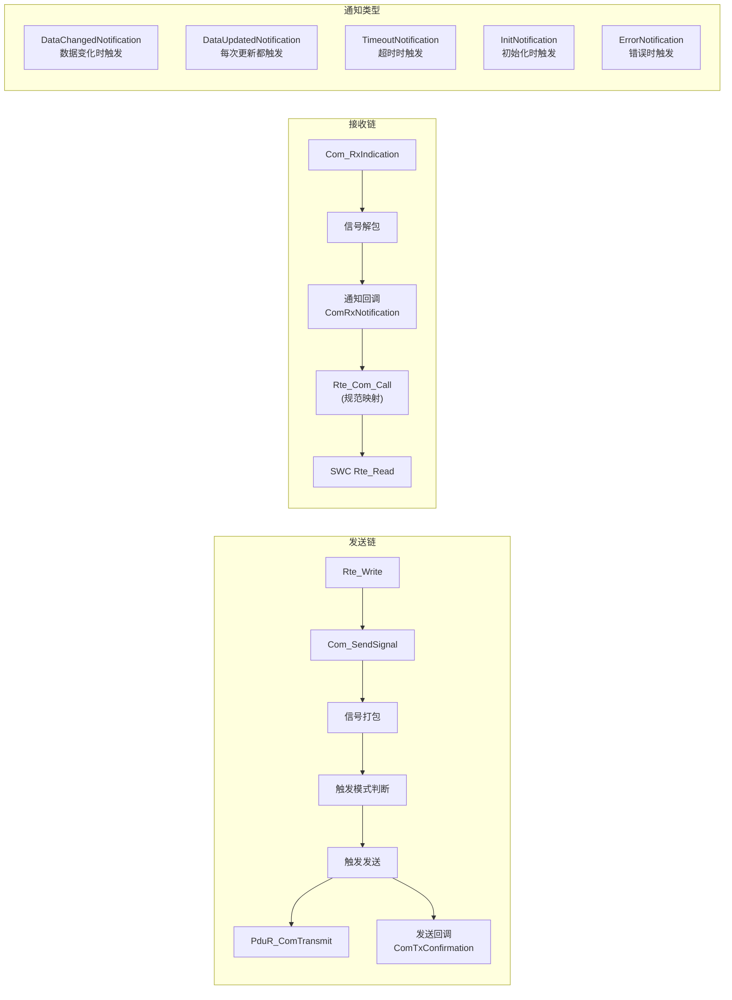

### 3.6 IPdu 信号方向与触发链

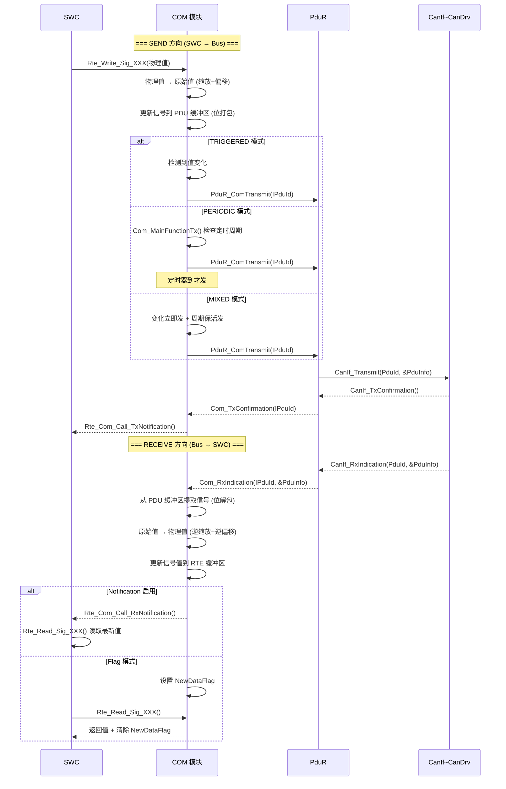

### 3.7 COM 与 RTE 的接口关系

```
                          RTE 接口                        COM 内部接口
                    ┌──────────────────┐            ┌─────────────────────┐
  Rte_Write_Sig     │                  │            │ Com_SendSignal      │
    (SWC 调用)      │    RTE 层        │            │   (信号级接口)       │
                    │    (适配层)      │───────────▶│                     │
  Rte_Read_Sig      │                  │            │ Com_ReceiveSignal   │
    (SWC 调用)      │                  │            │   (信号级接口)       │
                    └──────────────────┘            └─────────┬───────────┘
                                                              │
                                                    ┌─────────▼───────────┐
                                                    │  Com_SendIPdu      │
                                                    │  (IPdu 级接口)      │
                                                    │                     │
                                                    │  PduR_ComTransmit  │
                                                    │  (PDU Router 接口)  │
                                                    └─────────────────────┘

  RTE_Write_Signal_Group    ───▶  Com_SendSignalGroup    (原子操作)
  RTE_Read_Signal_Group     ───▶  Com_ReceiveSignalGroup (原子操作)
  RTE_InvalidateSignal      ───▶  Com_InvalidateSignal   (超时失效)
```

---

## 4. 完整代码示例

### 4.1 COM 模块配置数据结构

```c
/******************************************************************************
 * @file    Com_Cfg.h
 * @brief   AUTOSAR COM 模块配置文件
 * @note    AUTOSAR 4.4, 信号级通信中间件
 ******************************************************************************/

#ifndef COM_CFG_H
#define COM_CFG_H

#include "Std_Types.h"
#include "Com_Types.h"

/* ======================== 模块范围常量 ======================== */

#define COM_MAX_SIGNAL_NUM         128U      /* 最大信号数 */
#define COM_MAX_IPDU_NUM           64U       /* 最大 IPDU 数 */
#define COM_MAX_SIGNAL_GROUP_NUM   16U       /* 最大信号组数 */
#define COM_MAX_PDU_LENGTH         64U       /* 最大 PDU 长度 (CAN FD) */

/* ======================== 信号 ID 定义 ======================== */
/* 
 * 这些 ID 由配置工具 (EB tresos / DaVinci) 生成
 * 每个信号 ID 唯一标识一个信号
 */

/* 动力域信号 (Powertrain) */
typedef enum {
    /* --- 引擎相关 --- */
    COM_SIG_ENG_SPEED           = 0U,    /* 发动机转速, rpm */
    COM_SIG_ENG_TORQUE          = 1U,    /* 发动机扭矩, Nm */
    COM_SIG_ENG_COOLANT_TEMP    = 2U,    /* 冷却液温度, °C */
    COM_SIG_ENG_OIL_TEMP        = 3U,    /* 机油温度, °C */
    COM_SIG_ENG_OIL_PRESSURE    = 4U,    /* 机油压力, kPa */
    COM_SIG_ENG_INTAKE_TEMP     = 5U,    /* 进气温度, °C */
    COM_SIG_ENG_THROTTLE_POS    = 6U,    /* 节气门开度, % */
    COM_SIG_ENG_FUEL_RATE       = 7U,    /* 喷油量, mg/stroke */

    /* --- 变速箱相关 --- */
    COM_SIG_GEAR_CURRENT        = 8U,    /* 当前档位 */
    COM_SIG_GEAR_TARGET         = 9U,    /* 目标档位 */
    COM_SIG_GEAR_MODE           = 10U,   /* 变速箱模式 (P/R/N/D) */
    COM_SIG_TC_LOCKUP           = 11U,   /* 液力变矩器锁止状态 */

    /* --- 底盘相关 --- */
    COM_SIG_VEHICLE_SPEED       = 12U,   /* 车速, km/h */
    COM_SIG_WHEEL_SPEED_FL      = 13U,   /* 左前轮速 */
    COM_SIG_WHEEL_SPEED_FR      = 14U,   /* 右前轮速 */
    COM_SIG_WHEEL_SPEED_RL      = 15U,   /* 左后轮速 */
    COM_SIG_WHEEL_SPEED_RR      = 16U,   /* 右后轮速 */
    COM_SIG_STEERING_ANGLE      = 17U,   /* 方向盘转角, deg */
    COM_SIG_BRAKE_PRESSURE      = 18U,   /* 制动压力, bar */
    COM_SIG_ACCEL_PEDAL_POS     = 19U,   /* 油门踏板位置, % */

    /* --- 车身域信号 --- */
    COM_SIG_DOOR_ST_FL          = 20U,   /* 左前门状态 */
    COM_SIG_DOOR_ST_FR          = 21U,   /* 右前门状态 */
    COM_SIG_DOOR_ST_RL          = 22U,   /* 左后门状态 */
    COM_SIG_DOOR_ST_RR          = 23U,   /* 右后门状态 */
    COM_SIG_LIGHT_HEAD          = 24U,   /* 大灯状态 */
    COM_SIG_LIGHT_TURN_L        = 25U,   /* 左转向灯 */
    COM_SIG_LIGHT_TURN_R        = 26U,   /* 右转向灯 */
    COM_SIG_WIPER_STATE         = 27U,   /* 雨刮状态 */
    COM_SIG_CLIMATE_TEMP        = 28U,   /* 空调设定温度 */
    COM_SIG_CLIMATE_FAN_SPEED   = 29U,   /* 空调风扇转速 */

    /* --- 诊断信号 --- */
    COM_SIG_DTC_COUNT           = 30U,   /* DTC 数量 */
    COM_SIG_DTC_CODE            = 31U,   /* DTC 码 */

    COM_SIG_COUNT                        /* 信号计数 */
} Com_SignalIdType;

/* ======================== IPDU ID 定义 ======================== */

typedef enum {
    /* 发送 IPDU */
    COM_IPDU_ENG_DATA_1         = 0U,    /* CAN ID 0x100, 引擎数据组1 */
    COM_IPDU_ENG_DATA_2         = 1U,    /* CAN ID 0x101, 引擎数据组2 */
    COM_IPDU_CHASSIS_DATA       = 2U,    /* CAN ID 0x200, 底盘数据 */
    COM_IPDU_BODY_STATUS        = 3U,    /* CAN ID 0x300, 车身状态 */
    COM_IPDU_DIAG_REQ           = 4U,    /* CAN ID 0x700, 诊断请求 */

    /* 接收 IPDU */
    COM_IPDU_ENG_CTRL           = 5U,    /* CAN ID 0x102, 引擎控制 */
    COM_IPDU_TCU_CTRL           = 6U,    /* CAN ID 0x201, 变速箱控制 */
    COM_IPDU_BODY_CTRL          = 7U,    /* CAN ID 0x301, 车身控制 */
    COM_IPDU_DIAG_RESP          = 8U,    /* CAN ID 0x701, 诊断响应 */

    COM_IPDU_COUNT
} Com_IPduIdType;

#endif /* COM_CFG_H */
```

### 4.2 信号配置表

```c
/******************************************************************************
 * @file    Com_Cfg_Signal.c
 * @brief   COM 信号配置表 (由工具生成)
 * @note    每个信号配置其位布局、数据类型、缩放因子等
 ******************************************************************************/

#include "Com_Cfg.h"

/* ======================== 信号配置表 ======================== */

static const Com_SignalConfigType Com_SignalConfig[COM_SIG_COUNT] = {
    /* ===== 引擎转速 COM_SIG_ENG_SPEED =====
     *   PDU: ENG_DATA_1 (CAN ID 0x100)
     *   物理范围: 0 ~ 8000 rpm
     *   原始范围: 0 ~ 8000 (Factor=1, Offset=0)
     *   位布局: StartBit=0, Length=16, BIG_ENDIAN
     */
    [COM_SIG_ENG_SPEED] = {
        .SignalId         = COM_SIG_ENG_SPEED,
        .SignalName       = "EngineSpeed",
        .IPduRef          = COM_IPDU_ENG_DATA_1,
        .StartBit         = 0U,
        .Length           = 16U,
        .Endianness       = COM_BIG_ENDIAN,
        .SignalType       = COM_SINT16,          /* 有符号16位 */
        .Factor           = 1.0f,
        .Offset           = 0.0f,
        .InitValue        = { .uint32Value = 0U },
        .TimeoutValue     = { .uint32Value = 0xFFFFU }, /* 超时代替值 */
        .UpdateBitNumber  = COM_UPDATE_BIT_NONE,
        .DataChangedNotif = COM_NOTIFY_SWC_ENG_SPEED,
        .SupportInvalidation = TRUE
    },

    /* ===== 冷却液温度 COM_SIG_ENG_COOLANT_TEMP =====
     *   PDU: ENG_DATA_1 (CAN ID 0x100)
     *   物理范围: -40 ~ 215 °C
     *   原始范围: 0 ~ 255 (Factor=1, Offset=-40)
     *   位布局: StartBit=24, Length=8, BIG_ENDIAN
     */
    [COM_SIG_ENG_COOLANT_TEMP] = {
        .SignalId         = COM_SIG_ENG_COOLANT_TEMP,
        .SignalName       = "CoolantTemp",
        .IPduRef          = COM_IPDU_ENG_DATA_1,
        .StartBit         = 24U,
        .Length           = 8U,
        .Endianness       = COM_BIG_ENDIAN,
        .SignalType       = COM_UINT8,
        .Factor           = 1.0f,
        .Offset           = -40.0f,
        .InitValue        = { .uint32Value = 40U },   /* 0°C = 40 raw */
        .TimeoutValue     = { .uint32Value = 0xFFU },
        .UpdateBitNumber  = 16U,                       /* 更新位在第16位 */
        .DataChangedNotif = COM_NOTIFY_SWC_COOLANT_TEMP,
        .SupportInvalidation = TRUE
    },

    /* ===== 车速 COM_SIG_VEHICLE_SPEED =====
     *   PDU: CHASSIS_DATA (CAN ID 0x200)
     *   物理范围: 0 ~ 655.35 km/h
     *   原始范围: 0 ~ 65535 (Factor=0.01, Offset=0)
     *   位布局: StartBit=0, Length=16, LITTLE_ENDIAN
     */
    [COM_SIG_VEHICLE_SPEED] = {
        .SignalId         = COM_SIG_VEHICLE_SPEED,
        .SignalName       = "VehicleSpeed",
        .IPduRef          = COM_IPDU_CHASSIS_DATA,
        .StartBit         = 0U,
        .Length           = 16U,
        .Endianness       = COM_LITTLE_ENDIAN,
        .SignalType       = COM_UINT16,
        .Factor           = 0.01f,
        .Offset           = 0.0f,
        .InitValue        = { .uint32Value = 0U },
        .TimeoutValue     = { .uint32Value = 0xFFFFU },
        .UpdateBitNumber  = COM_UPDATE_BIT_NONE,
        .DataChangedNotif = COM_NOTIFY_NONE,
        .SupportInvalidation = TRUE
    },

    /* ===== 油门踏板位置 COM_SIG_ACCEL_PEDAL_POS =====
     *   PDU: CHASSIS_DATA (CAN ID 0x200)
     *   物理范围: 0 ~ 100 %
     *   原始范围: 0 ~ 1000 (Factor=0.1, Offset=0)
     *   位布局: StartBit=32, Length=10, BIG_ENDIAN
     */
    [COM_SIG_ACCEL_PEDAL_POS] = {
        .SignalId         = COM_SIG_ACCEL_PEDAL_POS,
        .SignalName       = "AccelPedalPos",
        .IPduRef          = COM_IPDU_CHASSIS_DATA,
        .StartBit         = 32U,
        .Length           = 10U,
        .Endianness       = COM_BIG_ENDIAN,
        .SignalType       = COM_UINT16,
        .Factor           = 0.1f,
        .Offset           = 0.0f,
        .InitValue        = { .uint32Value = 0U },
        .TimeoutValue     = { .uint32Value = 0x3FFU },
        .UpdateBitNumber  = COM_UPDATE_BIT_NONE,
        .DataChangedNotif = COM_NOTIFY_SWC_ACCEL_PEDAL,
        .SupportInvalidation = TRUE
    },

    /* ===== 档位 COM_SIG_GEAR_CURRENT =====
     *   PDU: ENG_DATA_2 (CAN ID 0x101)
     *   物理范围: 0=Neutral, 1=Park, 2=Reverse, 3~N=Drive
     *   位布局: StartBit=0, Length=4, LITTLE_ENDIAN
     */
    [COM_SIG_GEAR_CURRENT] = {
        .SignalId         = COM_SIG_GEAR_CURRENT,
        .SignalName       = "CurrentGear",
        .IPduRef          = COM_IPDU_ENG_DATA_2,
        .StartBit         = 0U,
        .Length           = 4U,
        .Endianness       = COM_LITTLE_ENDIAN,
        .SignalType       = COM_UINT8,
        .Factor           = 1.0f,
        .Offset           = 0.0f,
        .InitValue        = { .uint32Value = 0U },
        .TimeoutValue     = { .uint32Value = 0xFU },
        .UpdateBitNumber  = COM_UPDATE_BIT_NONE,
        .DataChangedNotif = COM_NOTIFY_SWC_GEAR,
        .SupportInvalidation = TRUE
    },

    /* ===== 方向盘转角 COM_SIG_STEERING_ANGLE =====
     *   PDU: CHASSIS_DATA (CAN ID 0x200)
     *   物理范围: -780 ~ +779.9 deg
     *   原始范围: -7800 ~ +7799 (Factor=0.1, Offset=0)
     *   位布局: StartBit=48, Length=16, LITTLE_ENDIAN
     */
    [COM_SIG_STEERING_ANGLE] = {
        .SignalId         = COM_SIG_STEERING_ANGLE,
        .SignalName       = "SteeringAngle",
        .IPduRef          = COM_IPDU_CHASSIS_DATA,
        .StartBit         = 48U,
        .Length           = 16U,
        .Endianness       = COM_LITTLE_ENDIAN,
        .SignalType       = COM_SINT16,
        .Factor           = 0.1f,
        .Offset           = 0.0f,
        .InitValue        = { .uint32Value = 0U },
        .TimeoutValue     = { .uint32Value = 0x8000U },
        .UpdateBitNumber  = COM_UPDATE_BIT_NONE,
        .DataChangedNotif = COM_NOTIFY_NONE,
        .SupportInvalidation = TRUE
    },
};

/* ======================== IPDU 配置表 ======================== */

static const Com_IPduConfigType Com_IPduConfig[COM_IPDU_COUNT] = {
    /* ===== ENG_DATA_1 (CAN ID 0x100) =====
     *  包含信号: EngineSpeed(16bit) + CoolantTemp(8bit) + UpdateBit(1bit)
     *  发送模式: PERIODIC (10ms)
     */
    [COM_IPDU_ENG_DATA_1] = {
        .IPduId            = COM_IPDU_ENG_DATA_1,
        .IPduName          = "ENG_DATA_1",
        .Direction         = COM_SEND,
        .Length            = 8U,                     /* 8 字节 */
        .PduRef            = 0U,                     /* PduR 路由 ID */
        .TransferProperty  = COM_TRANSFER_PROPERTY_PERIODIC,
        .TxModePeriod      = 0.01f,                  /* 10ms 周期 */
        .MinimumDelay      = 0.0f,
        .NumberOfSignals   = 3U,
        .SignalRefs        = (Com_SignalIdType[]){
            COM_SIG_ENG_SPEED,
            COM_SIG_ENG_COOLANT_TEMP,
            COM_SIG_ENG_OIL_TEMP
        },
        .TxConfirmationNotif = COM_TX_CONFIRM_NONE,
        .ErrorNotification    = COM_ERR_NOTIF_NONE,
        .CalloutFunction      = NULL_PTR,
        .IPduDuplicateDetection = FALSE,
    },

    /* ===== CHASSIS_DATA (CAN ID 0x200) =====
     *  包含信号: VehicleSpeed(16bit) + AccelPedalPos(10bit) + SteeringAngle(16bit)
     *  发送模式: TRIGGERED_ON_CHANGE (值变化触发)
     */
    [COM_IPDU_CHASSIS_DATA] = {
        .IPduId            = COM_IPDU_CHASSIS_DATA,
        .IPduName          = "CHASSIS_DATA",
        .Direction         = COM_SEND,
        .Length            = 8U,
        .PduRef            = 1U,
        .TransferProperty  = COM_TRANSFER_PROPERTY_TRIGGERED_ON_CHANGE,
        .TxModePeriod      = 0.0f,                   /* 无周期 */
        .MinimumDelay      = 0.01f,                  /* 最小间隔 10ms */
        .NumberOfSignals   = 3U,
        .SignalRefs        = (Com_SignalIdType[]){
            COM_SIG_VEHICLE_SPEED,
            COM_SIG_ACCEL_PEDAL_POS,
            COM_SIG_STEERING_ANGLE
        },
        .TxConfirmationNotif = COM_TX_CONFIRM_SWC_CHASSIS,
        .ErrorNotification    = COM_ERR_NOTIF_NONE,
        .CalloutFunction      = NULL_PTR,
        .IPduDuplicateDetection = TRUE,
    },

    /* ===== ENG_CTRL (接收) =====
     *  CAN ID 0x102, 引擎控制指令
     *  接收模式: DEFAULT
     */
    [COM_IPDU_ENG_CTRL] = {
        .IPduId            = COM_IPDU_ENG_CTRL,
        .IPduName          = "ENG_CTRL",
        .Direction         = COM_RECEIVE,
        .Length            = 8U,
        .PduRef            = 2U,
        .TransferProperty  = COM_TRANSFER_PROPERTY_NONE,
        .NumberOfSignals   = 2U,
        .SignalRefs        = (Com_SignalIdType[]){
            COM_SIG_ENG_TORQUE_TARGET,
            COM_SIG_ENG_MODE
        },
        .RxTimeoutMonitor  = 0.1f,    /* 100ms 超时监控 */
        .RxNotification    = COM_RX_NOTIFY_DATA_CHANGED,
        .CalloutFunction   = NULL_PTR,
    },
};
```

### 4.3 COM 核心功能实现

```c
/******************************************************************************
 * @file    Com.c
 * @brief   AUTOSAR COM 模块核心实现
 * @note    信号级通信中间件 — 打包/解包引擎
 ******************************************************************************/

#include "Com.h"
#include "Com_Cfg.h"
#include "Com_Priv.h"       /* 内部函数声明 */
#include "SchM_Com.h"       /* 调度器保护 */
#include "PduR_Com.h"       /* PduR 接口 */

/* 模块全局状态 */
static Com_ModuleStateType Com_ModuleState = COM_STATE_UNINIT;

/* PDU 缓冲区 — 每个 IPDU 一个 */
static uint8 Com_PduBuffer[COM_MAX_IPDU_NUM][COM_MAX_PDU_LENGTH];

/* 信号值缓存 — 每个信号一个 */
static Com_SignalCacheType Com_SignalCache[COM_MAX_SIGNAL_NUM];

/* 发送模式定时器 */
static Com_TxTimerType Com_TxModeTimer[COM_MAX_IPDU_NUM];

/* 接收超时监控 */
static Com_RxTimerType Com_RxTimeoutMonitor[COM_MAX_IPDU_NUM];

/* 信号更新标志 */
static Com_SignalUpdateFlagType Com_SignalUpdated[COM_MAX_SIGNAL_NUM];

/******************************************************************************
 * @brief   COM 模块初始化
 * @param   ConfigPtr  指向全局配置结构体
 * @return  Std_ReturnType  E_OK / E_NOT_OK
 * @note    初始化所有信号和 IPDU 的初始值、定时器、回调
 ******************************************************************************/
Std_ReturnType Com_Init(const Com_ConfigType* ConfigPtr)
{
    uint32 i;

    if (ConfigPtr == NULL_PTR) {
        return E_NOT_OK;
    }

    /* 进入临界区 */
    SchM_Enter_Com_Init();

    Com_ModuleState = COM_STATE_INIT;

    /* 复位所有信号缓存为初始值 */
    for (i = 0; i < COM_MAX_SIGNAL_NUM; i++) {
        if (i < ConfigPtr->numSignals) {
            /* 加载配置的初始值 */
            Com_SignalCache[i].rawValue   = Com_SignalConfig[i].InitValue.uint32Value;
            Com_SignalCache[i].physicalValue = 
                (float32)Com_SignalConfig[i].InitValue.uint32Value * 
                Com_SignalConfig[i].Factor + Com_SignalConfig[i].Offset;
            Com_SignalCache[i].isValid    = FALSE;   /* 初始无效，等待首次接收 */
            Com_SignalCache[i].isUpdated  = FALSE;
            Com_SignalCache[i].timeoutCnt = 0U;
        } else {
            Com_SignalCache[i].rawValue   = 0U;
            Com_SignalCache[i].physicalValue = 0.0f;
            Com_SignalCache[i].isValid    = FALSE;
            Com_SignalCache[i].isUpdated  = FALSE;
            Com_SignalCache[i].timeoutCnt = 0U;
        }
    }

    /* 初始化 PDU 缓冲区为零 */
    (void)memset(Com_PduBuffer, 0, sizeof(Com_PduBuffer));

    /* 初始化发送模式定时器 */
    for (i = 0; i < COM_MAX_IPDU_NUM; i++) {
        if (i < ConfigPtr->numIPdus) {
            Com_TxModeTimer[i].period    = Com_IPduConfig[i].TxModePeriod;
            Com_TxModeTimer[i].elapsed   = 0.0f;
            Com_TxModeTimer[i].isRunning = FALSE;
        } else {
            Com_TxModeTimer[i].period    = 0.0f;
            Com_TxModeTimer[i].elapsed   = 0.0f;
            Com_TxModeTimer[i].isRunning = FALSE;
        }
    }

    /* 初始化接收超时监控 */
    for (i = 0; i < COM_MAX_IPDU_NUM; i++) {
        Com_RxTimeoutMonitor[i].timeoutPeriod = 0.0f;
        Com_RxTimeoutMonitor[i].elapsed       = 0.0f;
        Com_RxTimeoutMonitor[i].isRunning     = FALSE;
        Com_RxTimeoutMonitor[i].isTimeout     = FALSE;
    }

    /* 清除更新标志 */
    (void)memset(Com_SignalUpdated, 0, sizeof(Com_SignalUpdated));

    Com_ModuleState = COM_STATE_READY;
    SchM_Exit_Com_Init();

    return E_OK;
}

/******************************************************************************
 * @brief   发送信号 (RTE 调用入口)
 * @param   SignalId        信号 ID
 * @param   SignalDataPtr   指向物理值的指针
 * @return  Std_ReturnType  E_OK / E_NOT_OK
 * @note    SWC 通过 Rte_Write_xxx() 调用此函数
 ******************************************************************************/
Std_ReturnType Com_SendSignal(Com_SignalIdType SignalId,
                              const void* SignalDataPtr)
{
    const Com_SignalConfigType* sigCfg;
    Com_SignalCacheType* sigCache;
    Std_ReturnType ret = E_OK;
    uint32 rawValue;
    float32 physValue;

    /* 参数校验 */
    if (SignalDataPtr == NULL_PTR || 
        SignalId >= COM_MAX_SIGNAL_NUM ||
        Com_ModuleState < COM_STATE_READY) {
        return E_NOT_OK;
    }

    sigCfg  = &Com_SignalConfig[SignalId];
    sigCache = &Com_SignalCache[SignalId];

    SchM_Enter_Com_SendSignal();

    /* 步骤 1: 从 SignalDataPtr 读取物理值 */
    /* 根据信号类型进行类型转换 */
    switch (sigCfg->SignalType) {
        case COM_UINT8:
            physValue = (float32)(*(const uint8*)SignalDataPtr);
            break;
        case COM_SINT8:
            physValue = (float32)(*(const sint8*)SignalDataPtr);
            break;
        case COM_UINT16:
            physValue = (float32)(*(const uint16*)SignalDataPtr);
            break;
        case COM_SINT16:
            physValue = (float32)(*(const sint16*)SignalDataPtr);
            break;
        case COM_UINT32:
            physValue = (float32)(*(const uint32*)SignalDataPtr);
            break;
        case COM_SINT32:
            physValue = (float32)(*(const sint32*)SignalDataPtr);
            break;
        case COM_FLOAT32:
            physValue = *(const float32*)SignalDataPtr;
            break;
        default:
            SchM_Exit_Com_SendSignal();
            return E_NOT_OK;
    }

    /* 步骤 2: 物理值 → 原始值转换 */
    /* rawValue = (physValue - Offset) / Factor */
    if (sigCfg->Factor != 0.0f) {
        rawValue = (uint32)((physValue - sigCfg->Offset) / sigCfg->Factor + 0.5f);
    } else {
        rawValue = (uint32)(physValue - sigCfg->Offset);
    }

    /* 步骤 3: 按位掩码截断 */
    rawValue &= (uint32)((1ULL << sigCfg->Length) - 1U);

    /* 步骤 4: 更新信号缓存 */
    sigCache->rawValue       = rawValue;
    sigCache->physicalValue  = physValue;
    sigCache->isUpdated      = TRUE;
    sigCache->isValid        = TRUE;

    /* 步骤 5: 将信号打包到所属 IPDU 缓冲区 */
    ret = Com_PackSignal(SignalId);

    /* 步骤 6: 标记信号已更新 (用于变化检测) */
    Com_SignalUpdated[SignalId].isChanged = TRUE;

    SchM_Exit_Com_SendSignal();

    return ret;
}

/******************************************************************************
 * @brief   接收信号 (SWC 读取入口)
 * @param   SignalId        信号 ID
 * @param   SignalDataPtr   输出: 指向物理值的指针
 * @return  Std_ReturnType  E_OK / E_NOT_OK
 * @note    SWC 通过 Rte_Read_xxx() 调用此函数
 ******************************************************************************/
Std_ReturnType Com_ReceiveSignal(Com_SignalIdType SignalId,
                                 void* SignalDataPtr)
{
    const Com_SignalConfigType* sigCfg;
    Com_SignalCacheType* sigCache;

    if (SignalDataPtr == NULL_PTR || 
        SignalId >= COM_MAX_SIGNAL_NUM ||
        Com_ModuleState < COM_STATE_READY) {
        return E_NOT_OK;
    }

    sigCfg  = &Com_SignalConfig[SignalId];
    sigCache = &Com_SignalCache[SignalId];

    SchM_Enter_Com_ReceiveSignal();

    /* 检查信号有效性 */
    if (!sigCache->isValid) {
        /* 信号无效 (超时或从未收到), 返回失效安全值 */
        switch (sigCfg->SignalType) {
            case COM_UINT8:
                *(uint8*)SignalDataPtr = (uint8)sigCfg->TimeoutValue.uint32Value;
                break;
            case COM_SINT8:
                *(sint8*)SignalDataPtr = (sint8)sigCfg->TimeoutValue.uint32Value;
                break;
            case COM_UINT16:
                *(uint16*)SignalDataPtr = (uint16)sigCfg->TimeoutValue.uint32Value;
                break;
            case COM_SINT16:
                *(sint16*)SignalDataPtr = (sint16)sigCfg->TimeoutValue.uint32Value;
                break;
            case COM_UINT32:
                *(uint32*)SignalDataPtr = sigCfg->TimeoutValue.uint32Value;
                break;
            case COM_FLOAT32:
                *(float32*)SignalDataPtr = (float32)sigCfg->TimeoutValue.uint32Value;
                break;
            default:
                break;
        }
        SchM_Exit_Com_ReceiveSignal();
        return COM_SERVICE_PENDING;  /* 信号无效但返回了替代值 */
    }

    /* 读取缓存中的物理值并返回 */
    switch (sigCfg->SignalType) {
        case COM_UINT8:
            *(uint8*)SignalDataPtr = (uint8)sigCache->physicalValue;
            break;
        case COM_SINT8:
            *(sint8*)SignalDataPtr = (sint8)sigCache->physicalValue;
            break;
        case COM_UINT16:
            *(uint16*)SignalDataPtr = (uint16)sigCache->physicalValue;
            break;
        case COM_SINT16:
            *(sint16*)SignalDataPtr = (sint16)sigCache->physicalValue;
            break;
        case COM_UINT32:
            *(uint32*)SignalDataPtr = (uint32)sigCache->physicalValue;
            break;
        case COM_FLOAT32:
            *(float32*)SignalDataPtr = sigCache->physicalValue;
            break;
        default:
            SchM_Exit_Com_ReceiveSignal();
            return E_NOT_OK;
    }

    SchM_Exit_Com_ReceiveSignal();
    return E_OK;
}
```

### 4.4 信号打包/解包引擎

```c
/******************************************************************************
 * @file    Com_Packing.c
 * @brief   COM 信号打包/解包引擎
 * @note    核心位操作 — 支持大端/小端、任意位域
 ******************************************************************************/

#include "Com_Packing.h"
#include "Com_Priv.h"

/******************************************************************************
 * @brief   将单个信号打包到 IPDU 缓冲区
 * @param   SignalId  信号 ID
 * @return  Std_ReturnType
 * @note    将信号原始值按位布局写到 PDU 缓冲区
 ******************************************************************************/
Std_ReturnType Com_PackSignal(Com_SignalIdType SignalId)
{
    const Com_SignalConfigType* sigCfg;
    uint32 rawValue;
    uint16 startBit, length;
    uint32 ipduIdx;
    uint32 totalBits;
    uint8* buffer;

    sigCfg  = &Com_SignalConfig[SignalId];
    rawValue = Com_SignalCache[SignalId].rawValue;
    startBit = sigCfg->StartBit;
    length   = sigCfg->Length;
    ipduIdx  = (uint32)sigCfg->IPduRef;
    buffer   = Com_PduBuffer[ipduIdx];
    totalBits = Com_IPduConfig[ipduIdx].Length * 8U;

    if (sigCfg->Endianness == COM_BIG_ENDIAN) {
        /* ===== 大端序打包 (Motorola) =====
         *  信号从 MSB 开始排列
         *  计算公式:
         *    byteOffset = (totalBits - 1 - startBit - length + 1) / 8
         *              = (totalBits - startBit - length) / 8
         */
        uint32 remainBits = totalBits - startBit - length;
        uint16 byteOffset = (uint16)(remainBits / 8U);
        uint16 bitOffset  = (uint16)(remainBits % 8U);
        uint32 mask       = (uint32)((1ULL << length) - 1U);
        uint32 writeVal   = (rawValue & mask) << bitOffset;

        /* 大端写入 (从高字节开始写) */
        while (length > 0U) {
            uint8 currentByte = (uint8)(writeVal >> (bitOffset + 0U));
            /* 清除目标位后再写入 */
            buffer[byteOffset] = (uint8)((buffer[byteOffset] & 
                (uint8)(~(uint8)((1U << (8U - bitOffset)) - 1U))) | currentByte);

            length -= (8U - bitOffset);
            byteOffset--;
            bitOffset = 0U;
            writeVal >>= 8U;
        }
    } else {
        /* ===== 小端序打包 (Intel) =====
         *  信号从 LSB 开始排列
         *  计算公式:
         *    byteOffset = startBit / 8
         *    bitOffset  = startBit % 8
         */
        uint16 byteOffset = (uint16)(startBit / 8U);
        uint16 bitOffset  = (uint16)(startBit % 8U);
        uint32 mask       = (uint32)((1ULL << length) - 1U);
        uint32 writeVal   = (rawValue & mask) << bitOffset;

        while (length > 0U) {
            uint8 partLen = (uint8)((8U - bitOffset) < length ? 
                                     (8U - bitOffset) : length);
            uint8 partMask = (uint8)((1U << partLen) - 1U);

            buffer[byteOffset] = (uint8)((buffer[byteOffset] & 
                (uint8)(~(uint8)(partMask << bitOffset))) | 
                (uint8)((writeVal >> bitOffset) & partMask) << bitOffset);

            length -= partLen;
            byteOffset++;
            bitOffset = 0U;
        }
    }

    return E_OK;
}

/******************************************************************************
 * @brief   从 IPDU 缓冲区解包所有信号
 * @param   IPduId   IPDU ID
 * @notes   PDU 到达时调用, 解包信号并更新信号缓存
 ******************************************************************************/
void Com_UnpackIPdu(Com_IPduIdType IPduId)
{
    const Com_IPduConfigType* ipduCfg;
    uint32 i;

    if (IPduId >= COM_MAX_IPDU_NUM) {
        return;
    }

    ipduCfg = &Com_IPduConfig[IPduId];

    /* 遍历 IPDU 中包含的所有信号, 逐个解包 */
    for (i = 0; i < ipduCfg->NumberOfSignals; i++) {
        Com_SignalIdType sigId = ipduCfg->SignalRefs[i];
        (void)Com_UnpackSignal(sigId);
    }
}

/******************************************************************************
 * @brief   从 IPDU 缓冲区解包单个信号
 * @param   SignalId  信号 ID
 * @return  Std_ReturnType
 ******************************************************************************/
Std_ReturnType Com_UnpackSignal(Com_SignalIdType SignalId)
{
    const Com_SignalConfigType* sigCfg;
    uint32 rawValue = 0U;
    float32 physValue;
    uint16 startBit, length;
    uint32 ipduIdx;
    uint32 totalBits;
    const uint8* buffer;

    sigCfg   = &Com_SignalConfig[SignalId];
    startBit = sigCfg->StartBit;
    length   = sigCfg->Length;
    ipduIdx  = (uint32)sigCfg->IPduRef;
    buffer   = Com_PduBuffer[ipduIdx];
    totalBits = Com_IPduConfig[ipduIdx].Length * 8U;

    if (sigCfg->Endianness == COM_BIG_ENDIAN) {
        /* ===== 大端序解包 ===== */
        uint32 remainBits = totalBits - startBit - length;
        uint16 byteOffset = (uint16)(remainBits / 8U);
        uint16 bitOffset  = (uint16)(remainBits % 8U);
        uint16 remainLen  = length;

        rawValue = 0U;

        /* 从高字节开始读 */
        while (remainLen > 0U) {
            rawValue = (rawValue << 8U) | buffer[byteOffset];
            remainLen -= (8U - bitOffset);
            byteOffset--;
            bitOffset = 0U;
        }

        /* 截断到信号实际长度 */
        rawValue >>= (8U - (uint8)((length + bitOffset) % 8U));
        rawValue &= (uint32)((1ULL << length) - 1U);

    } else {
        /* ===== 小端序解包 ===== */
        uint16 byteOffset = (uint16)(startBit / 8U);
        uint16 bitOffset  = (uint16)(startBit % 8U);
        uint16 remainLen  = length;

        rawValue = 0U;

        while (remainLen > 0U) {
            uint8 partLen = (uint8)((8U - bitOffset) < remainLen ? 
                                     (8U - bitOffset) : remainLen);
            uint8 part = (uint8)((buffer[byteOffset] >> bitOffset) & 
                                  ((1U << partLen) - 1U));
            rawValue |= (uint32)part << (length - remainLen);
            remainLen -= partLen;
            byteOffset++;
            bitOffset = 0U;
        }
    }

    /* 根据信号类型进行符号扩展 (有符号类型) */
    if (sigCfg->SignalType == COM_SINT8 || 
        sigCfg->SignalType == COM_SINT16 || 
        sigCfg->SignalType == COM_SINT32) {

        uint32 signBitMask = (uint32)(1U << (length - 1U));
        if ((rawValue & signBitMask) != 0U) {
            /* 负数: 符号扩展到 32-bit */
            rawValue |= ~((uint32)((1ULL << length) - 1U));
        }
    }

    /* 原始值 → 物理值转换 */
    physValue = (float32)rawValue * sigCfg->Factor + sigCfg->Offset;

    /* 更新信号缓存 */
    Com_SignalCache[SignalId].rawValue       = rawValue;
    Com_SignalCache[SignalId].physicalValue  = physValue;
    Com_SignalCache[SignalId].isValid        = TRUE;
    Com_SignalCache[SignalId].isUpdated      = TRUE;
    Com_SignalCache[SignalId].timeoutCnt     = 0U;

    return E_OK;
}
```

### 4.5 发送模式调度

```c
/******************************************************************************
 * @file    Com_TxMode.c
 * @brief   COM 发送模式调度 — 周期性主函数
 * @note    由 SchM 调度器周期性调用 (典型 1ms/10ms 任务)
 ******************************************************************************/

#include "Com_TxMode.h"
#include "PduR_Com.h"

/******************************************************************************
 * @brief   COM 发送主函数 (周期性调度)
 * @note    在每个 TASK 周期中被 SchM 调用
 *          - 处理 PERIODIC IPDU: 周期到触发发送
 *          - 处理 TRIGGERED IPDU: 信号变化后触发发送
 *          - 检查发送死线监控
 ******************************************************************************/
void Com_MainFunctionTx(void)
{
    uint32 i;

    if (Com_ModuleState < COM_STATE_READY) {
        return;
    }

    SchM_Enter_Com_MainFunction();

    for (i = 0; i < COM_MAX_IPDU_NUM; i++) {
        /* 跳过未配置的 IPDU */
        if (i >= (uint32)Com_ConfigPtr->numIPdus) {
            break;
        }

        /* 只处理 SEND 方向的 IPDU */
        if (Com_IPduConfig[i].Direction != COM_SEND) {
            continue;
        }

        switch (Com_IPduConfig[i].TransferProperty) {
            case COM_TRANSFER_PROPERTY_PERIODIC:
                /* ===== 周期发送模式 ===== */
                Com_TxModeTimer[i].elapsed += COM_MAIN_FUNC_CYCLE;

                if (Com_TxModeTimer[i].elapsed >= Com_TxModeTimer[i].period) {
                    Com_TxModeTimer[i].elapsed = 0.0f;
                    /* 触发发送 */
                    (void)Com_TriggerIPduSend(i);
                }
                break;

            case COM_TRANSFER_PROPERTY_TRIGGERED_ON_CHANGE:
                /* ===== 变化触发模式 ===== */
                if (Com_IsIPduSignalsChanged(i)) {
                    /* 检查最小发送间隔 */
                    Com_TxModeTimer[i].elapsed += COM_MAIN_FUNC_CYCLE;
                    if (Com_TxModeTimer[i].elapsed >= 
                        Com_IPduConfig[i].MinimumDelay) {
                        Com_TxModeTimer[i].elapsed = 0.0f;
                        (void)Com_TriggerIPduSend(i);
                    }
                }
                break;

            case COM_TRANSFER_PROPERTY_MIXED:
                /* ===== 混合模式 ===== */
                if (Com_IsIPduSignalsChanged(i)) {
                    Com_TxModeTimer[i].elapsed += COM_MAIN_FUNC_CYCLE;
                    if (Com_TxModeTimer[i].elapsed >= 
                        Com_IPduConfig[i].MinimumDelay) {
                        Com_TxModeTimer[i].elapsed = 0.0f;
                        (void)Com_TriggerIPduSend(i);
                    }
                }
                /* 同时检查周期超时 */
                Com_TxModeTimer[i].elapsed += COM_MAIN_FUNC_CYCLE;
                if (Com_TxModeTimer[i].elapsed >= Com_TxModeTimer[i].period) {
                    Com_TxModeTimer[i].elapsed = 0.0f;
                    (void)Com_TriggerIPduSend(i);
                }
                break;

            default:
                break;
        }
    }

    SchM_Exit_Com_MainFunction();
}

/******************************************************************************
 * @brief   触发 IPDU 发送
 * @param   IPduId  IPDU ID
 * @return  Std_ReturnType
 ******************************************************************************/
static Std_ReturnType Com_TriggerIPduSend(Com_IPduIdType IPduId)
{
    PduInfoType pduInfo;

    if (IPduId >= COM_MAX_IPDU_NUM) {
        return E_NOT_OK;
    }

    /* 准备 PDU 信息 */
    pduInfo.SduDataPtr = Com_PduBuffer[IPduId];
    pduInfo.SduLength  = Com_IPduConfig[IPduId].Length;

    /* 调用发送前回调 (Callout) */
    if (Com_IPduConfig[IPduId].CalloutFunction != NULL_PTR) {
        Std_ReturnType calloutRet = 
            Com_IPduConfig[IPduId].CalloutFunction(COM_CALLOUT_BEFORE_TRANSMIT, 
                                                     IPduId, &pduInfo);
        if (calloutRet != E_OK) {
            return calloutRet;  /* callout 阻止了发送 */
        }
    }

    /* 通过 PduR 发送到下层 */
    return PduR_ComTransmit(Com_IPduConfig[IPduId].PduRef, &pduInfo);
}

/******************************************************************************
 * @brief   COM 接收主函数 (处理延迟接收)
 * @note    在非 DIRECT 模式下, 此函数处理 PDU 的解包
 ******************************************************************************/
void Com_MainFunctionRx(void)
{
    uint32 i;

    if (Com_ModuleState < COM_STATE_READY) {
        return;
    }

    /* 处理接收超时监控 */
    for (i = 0; i < COM_MAX_IPDU_NUM; i++) {
        if (i >= (uint32)Com_ConfigPtr->numIPdus) {
            break;
        }

        if (Com_IPduConfig[i].Direction != COM_RECEIVE) {
            continue;
        }

        if (Com_RxTimeoutMonitor[i].isRunning) {
            Com_RxTimeoutMonitor[i].elapsed += COM_MAIN_FUNC_CYCLE;

            if (Com_RxTimeoutMonitor[i].elapsed >= 
                Com_RxTimeoutMonitor[i].timeoutPeriod) {
                /* 接收超时! */
                Com_RxTimeoutMonitor[i].isTimeout = TRUE;
                Com_RxTimeoutMonitor[i].isRunning = FALSE;

                /* 设置所有信号为无效状态 */
                for (uint32 s = 0; s < Com_IPduConfig[i].NumberOfSignals; s++) {
                    Com_SignalIdType sigId = Com_IPduConfig[i].SignalRefs[s];
                    Com_SignalCache[sigId].isValid = FALSE;
                }
            }
        }
    }
}

/******************************************************************************
 * @brief   检查 IPDU 的信号是否有更新
 * @param   IPduId
 * @return  TRUE = 有信号变化
 ******************************************************************************/
static boolean Com_IsIPduSignalsChanged(Com_IPduIdType IPduId)
{
    uint32 i;
    const Com_IPduConfigType* ipduCfg = &Com_IPduConfig[IPduId];

    for (i = 0; i < ipduCfg->NumberOfSignals; i++) {
        Com_SignalIdType sigId = ipduCfg->SignalRefs[i];
        if (Com_SignalUpdated[sigId].isChanged) {
            Com_SignalUpdated[sigId].isChanged = FALSE; /* 清除标志 */
            return TRUE;
        }
    }

    return FALSE;
}
```

### 4.6 接收指示与通知

```c
/******************************************************************************
 * @brief   PDU 接收回调 (由 PduR 调用)
 * @param   IPduId    接收的 IPDU ID
 * @param   PduInfoPtr PDU 数据指针
 * @note    PduR 收到完整 PDU 后调用此函数
 ******************************************************************************/
void Com_RxIndication(Com_IPduIdType IPduId,
                      const PduInfoType* PduInfoPtr)
{
    const Com_IPduConfigType* ipduCfg;
    uint32 i;

    if (IPduId >= COM_MAX_IPDU_NUM || PduInfoPtr == NULL_PTR) {
        return;
    }

    ipduCfg = &Com_IPduConfig[IPduId];

    SchM_Enter_Com_RxIndication();

    /* 步骤 1: 将收到的 PDU 数据复制到内部缓冲区 */
    (void)memcpy(Com_PduBuffer[IPduId], 
                 PduInfoPtr->SduDataPtr, 
                 PduInfoPtr->SduLength);

    /* 步骤 2: 解包所有信号 */
    Com_UnpackIPdu(IPduId);

    /* 步骤 3: 重启接收超时监控 */
    if (ipduCfg->RxTimeoutMonitor > 0.0f) {
        Com_RxTimeoutMonitor[IPduId].timeoutPeriod = ipduCfg->RxTimeoutMonitor;
        Com_RxTimeoutMonitor[IPduId].elapsed       = 0.0f;
        Com_RxTimeoutMonitor[IPduId].isRunning     = TRUE;
        Com_RxTimeoutMonitor[IPduId].isTimeout     = FALSE;
    }

    /* 步骤 4: 触发接收通知回调 */
    for (i = 0; i < ipduCfg->NumberOfSignals; i++) {
        Com_SignalIdType sigId = ipduCfg->SignalRefs[i];
        const Com_SignalConfigType* sigCfg = &Com_SignalConfig[sigId];

        /* 检查是否需要触发通知 */
        if (sigCfg->DataChangedNotif != COM_NOTIFY_NONE) {
            Com_ExecuteNotification(sigCfg->DataChangedNotif);
        }
    }

    /* 步骤 5: 调用 IPDU 级回调 */
    if (ipduCfg->CalloutFunction != NULL_PTR) {
        (void)ipduCfg->CalloutFunction(COM_CALLOUT_AFTER_RECEIVE,
                                        IPduId, PduInfoPtr);
    }

    SchM_Exit_Com_RxIndication();
}

/******************************************************************************
 * @brief   发送确认回调 (由 PduR 在下层确认后调用)
 * @param   IPduId    IPDU ID
 ******************************************************************************/
void Com_TxConfirmation(Com_IPduIdType IPduId)
{
    if (IPduId >= COM_MAX_IPDU_NUM) {
        return;
    }

    /* 调用发送完成通知 */
    if (Com_IPduConfig[IPduId].TxConfirmationNotif != COM_TX_CONFIRM_NONE) {
        Com_ExecuteNotification(Com_IPduConfig[IPduId].TxConfirmationNotif);
    }
}
```

### 4.7 信号组支持

```c
/******************************************************************************
 * @brief   信号组发送 (原子操作: 一次性发送组中所有信号)
 * @param   GroupId     信号组 ID
 * @param   SignalDataPtrs  指向各信号值数组的指针
 * @return  Std_ReturnType
 * @note    保证组内所有信号在同一 PDU 周期内发送
 ******************************************************************************/
Std_ReturnType Com_SendSignalGroup(Com_SignalGroupIdType GroupId,
                                   const void* SignalDataPtrs)
{
    /* 
     * 实现要点:
     * 1. 锁定信号组 (防止组内部分信号被其他上下文修改)
     * 2. 依次更新组内所有信号到信号缓存
     * 3. 打包所有信号到 PDU 缓冲区
     * 4. 一次性触发 IPDU 发送
     * 5. 解锁信号组
     */
    SchM_Enter_Com_SendSignalGroup(GroupId);

    const Com_SignalGroupConfigType* grpCfg = &Com_GroupConfig[GroupId];
    const uint8* dataPtrs = (const uint8*)SignalDataPtrs;

    for (uint32 i = 0; i < grpCfg->NumSignals; i++) {
        Com_SignalIdType sigId = grpCfg->SignalIds[i];
        uint8 sigSize = Com_GetSignalByteSize(sigId);

        /* 写入信号缓存 */
        (void)Com_SendSignal(sigId, dataPtrs);
        dataPtrs += sigSize;
    }

    /* 获取组内的主 IPDU 并触发发送 */
    Com_IPduIdType mainIPdu = grpCfg->MainIPduRef;
    (void)Com_TriggerIPduSend(mainIPdu);

    SchM_Exit_Com_SendSignalGroup(GroupId);
    return E_OK;
}

/******************************************************************************
 * @brief   信号组接收 (原子读取组内所有信号)
 * @param   GroupId     信号组 ID
 * @param   SignalDataPtrs  输出: 组内所有信号的值
 * @return  Std_ReturnType
 * @note    保证读取的组内所有信号属于同一 PDU 版本
 ******************************************************************************/
Std_ReturnType Com_ReceiveSignalGroup(Com_SignalGroupIdType GroupId,
                                      void* SignalDataPtrs)
{
    SchM_Enter_Com_ReceiveSignalGroup(GroupId);

    const Com_SignalGroupConfigType* grpCfg = &Com_GroupConfig[GroupId];
    uint8* dataPtrs = (uint8*)SignalDataPtrs;

    for (uint32 i = 0; i < grpCfg->NumSignals; i++) {
        Com_SignalIdType sigId = grpCfg->SignalIds[i];
        uint8 sigSize = Com_GetSignalByteSize(sigId);

        (void)Com_ReceiveSignal(sigId, dataPtrs);
        dataPtrs += sigSize;
    }

    SchM_Exit_Com_ReceiveSignalGroup(GroupId);
    return E_OK;
}
```

---

## 5. 总结与最佳实践

### 5.1 COM 模块的核心设计思想

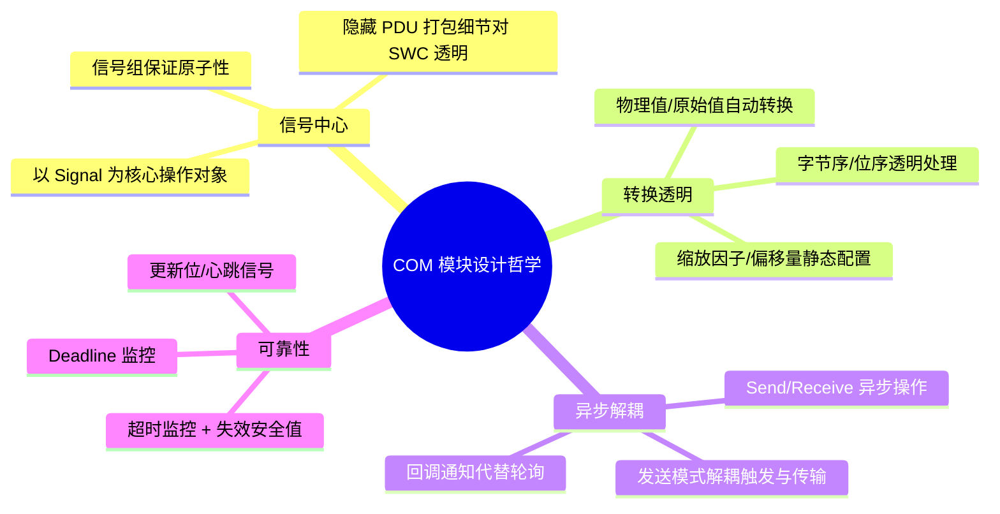

### 5.2 工程最佳实践

| 领域 | 最佳实践 | 原因 |
|------|---------|------|
| **信号设计** | Signal 长度不超过 32 bit | 超过 32 bit 的需用 GroupSignal 或字节数组 |
| **位布局** | 相同 Endianness 的信号连续排列 | 减少打包解包的位操作开销 |
| **发送周期** | 周期信号用 PERIODIC, 事件信号用 TRIGGERED | 避免总线带宽浪费 |
| **超时监控** | 关键安全信号 (车速/制动) 必须使能 Timeout | 失效安全的基础保障 |
| **信号组** | 物理相关的信号 (如 IMU 三轴) 必须用信号组 | 保证数据一致性 |
| **更新位** | 使用更新位避免接收端错误解读旧数据 | 增加通信可靠性 |
| **回调设计** | 回调中不做阻塞操作 | COM 回调在中断/调度上下文执行 |
| **缓冲区** | 信号缓存使用 RTE 直接访问的模式 (DataAccess) | 减少 memcpy 开销 |

### 5.3 COM 配置检查清单

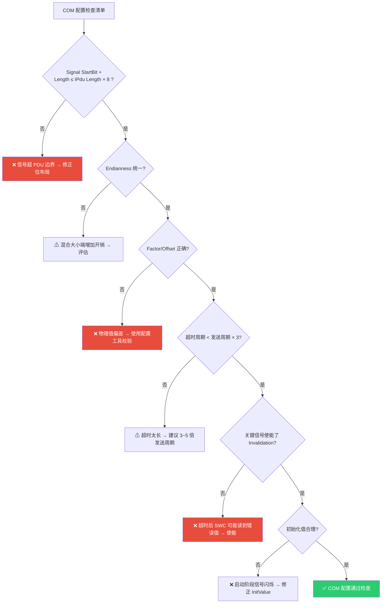

### 5.4 COM 与相邻模块的职责边界

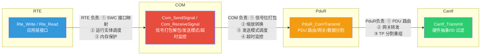

### 5.5 常见问题与调试

| 问题 | 可能原因 | 排查方法 |
|------|---------|---------|
| **SWC 读到的信号值不对** | 缩放因子/偏移量配置错误 | 检查 Factor/Offset, 对比原始值和物理值 |
| **信号值都是 0** | 超时未收到 PDU | 检查 CAN 总线 + PduR 路由 + 超时配置 |
| **信号值偶尔跳变** | 字节序配置错误 | 确认 StartBit + Endianness 与 DBC 一致 |
| **总线发送频率不对** | 发送模式配置错误 | 检查 TransferProperty + MinimumDelay |
| **CPU 负载过高** | 信号数量过大或中断频繁 | 使用 DEFERRED 接收 + 减少周期信号数 |
| **信号组读取不一致** | 未使用信号组函数读取 | 必须使用 Rte_Read_Group 系列接口 |

> **总结**：AUTOSAR COM 模块是信号级通信的中间枢纽，它通过位打包/解包、物理-原始值转换、多种发送模式和超时监控等机制，将复杂的 CAN/LIN/FlexRay 通信细节对应用层完全透明化。掌握 COM 的配置与实现是理解 AUTOSAR 通信协议栈的核心环节。
