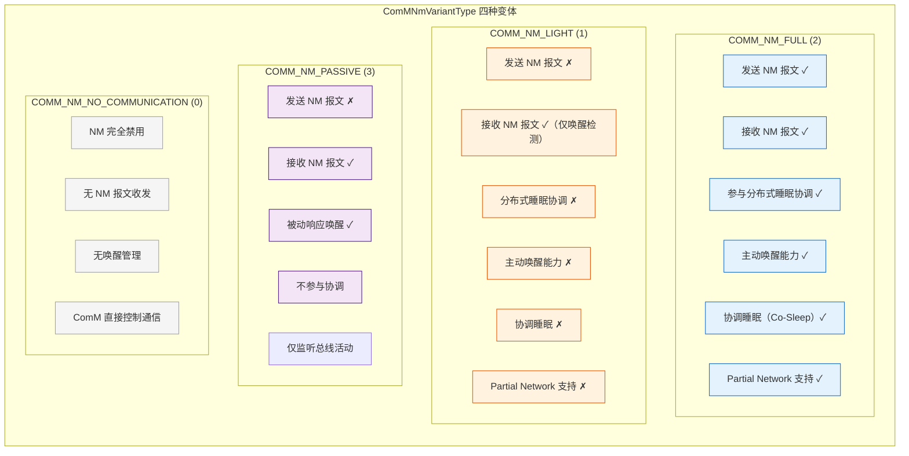
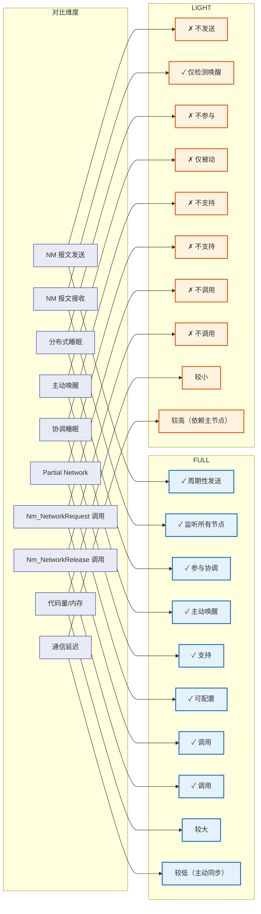
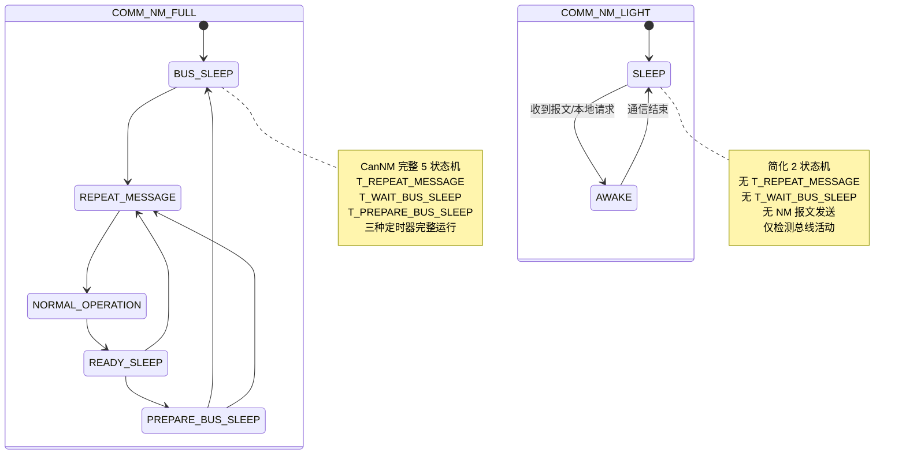
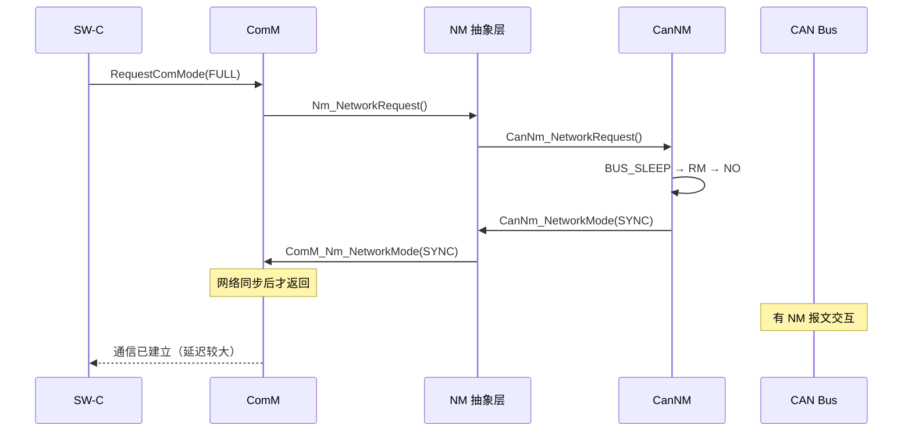
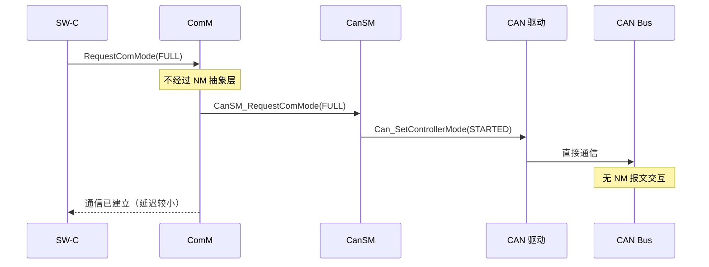
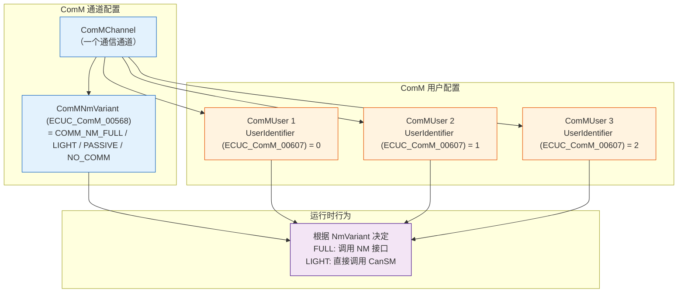
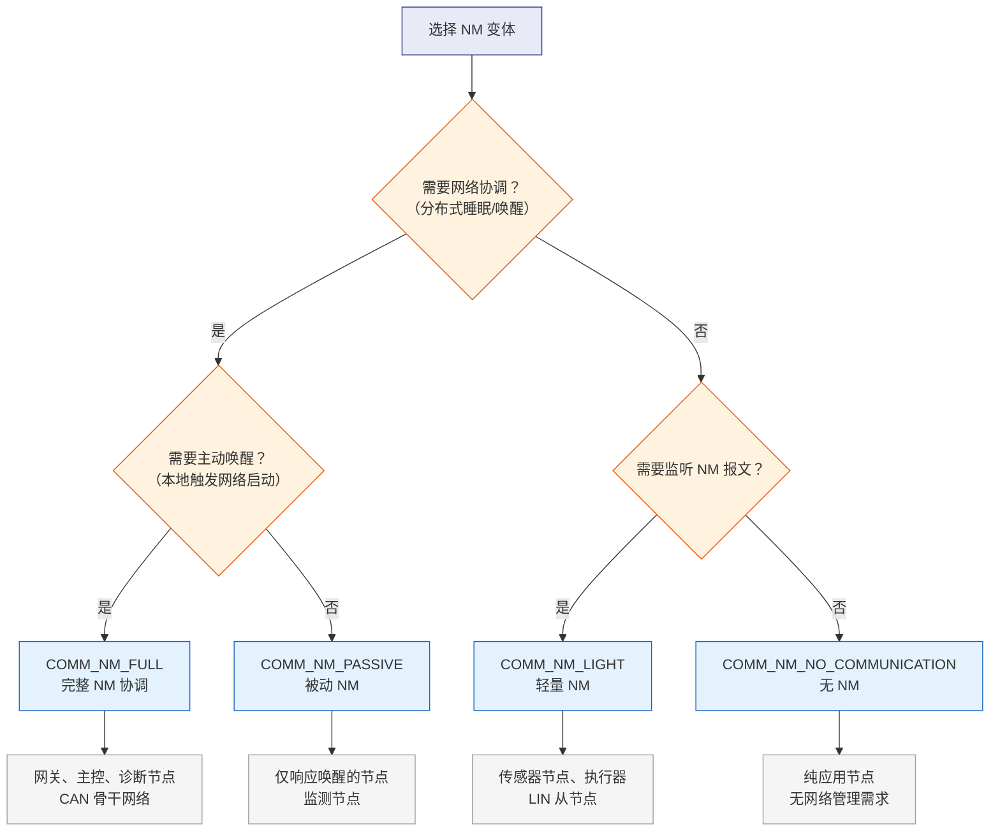
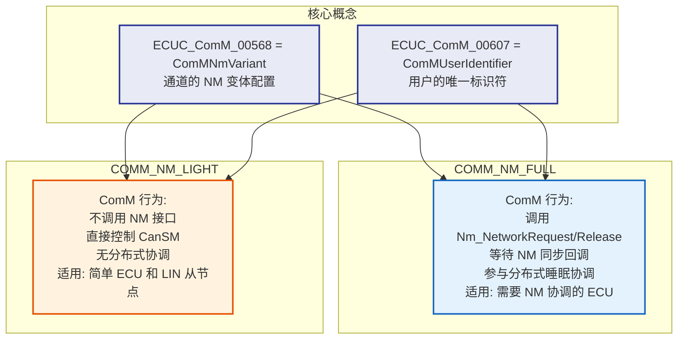

# COMM_NM_FULL 与 COMM_NM_LIGHT 详解

> 结合 AUTOSAR 规范 ECUC_ComM_00568 和 ECUC_ComM_00607 解释

---

## 1. 先说结论

| 配置值 | 本质 | 一句话概括 |
|--------|------|-----------|
| **COMM_NM_FULL** | 完整网络管理变体 | 节点参与完整的 NM 协调，发送/接收 NM 报文，参与分布式睡眠 |
| **COMM_NM_LIGHT** | 轻量网络管理变体 | 节点仅做基本的唤醒/睡眠管理，不参与 NM 协调，不发送 NM 报文 |

这两个值不是 ComM 的模式，而是 **`ComMNmVariant` 配置参数的可选值**，用于告诉 ComM：**这个通道底层的 NM 实现是"完整版"还是"轻量版"**，从而决定 ComM 对该通道的行为策略。

---

## 2. AUTOSAR 规范出处

### 2.1 ECUC_ComM_00568 — `ComMNmVariant`

```xml
<!-- AUTOSAR ECU Configuration 参数定义 -->
<ECUC_PARAMETER_DEF>
    <SHORT-NAME>ComMNmVariant</SHORT-NAME>
    <PARAMETER-NAME>ComMNmVariant</PARAMETER-NAME>
    <PARENT-REF>ComMChannel</PARENT-REF>
    <TYPE>ECUC_ENUMERATION</TYPE>
    <IMPLEMENTATION-TYPE>ComMNmVariantType</IMPLEMENTATION-TYPE>
    <ECUC-VALUE-REF>COMM_NM_FULL</ECUC-VALUE-REF>
    <ECUC-VALUE-REF>COMM_NM_LIGHT</ECUC-VALUE-REF>
    <ECUC-VALUE-REF>COMM_NM_PASSIVE</ECUC-VALUE-REF>
    <ECUC-VALUE-REF>COMM_NM_NO_COMMUNICATION</ECUC-VALUE-REF>
</ECUC_PARAMETER_DEF>
```

**官方定义**：该参数指定了通道所使用的网络管理变体。ComM 根据此参数决定通道的 NM 行为策略。

### 2.2 ECUC_ComM_00607 — `ComMUserIdentifier`

```xml
<ECUC_PARAMETER_DEF>
    <SHORT-NAME>ComMUserIdentifier</SHORT-NAME>
    <PARENT-REF>ComMUser</PARENT-REF>
    <TYPE>ECUC_INTEGER</TYPE>
    <IMPLEMENTATION-TYPE>ComM_UserHandleType</IMPLEMENTATION-TYPE>
    <LOWER-MULTIPLE>1</LOWER-MULTIPLE>
    <UPPER-MULTIPLE>1</UPPER-MULTIPLE>
</ECUC_PARAMETER_DEF>
```

**官方定义**：该参数定义了 ComM 用户（SW-C）的唯一标识符，用于 ComM 内部管理用户请求时区分不同的用户。

---

## 3. `ComMNmVariant` 的完整枚举值

```c
/* AUTOSAR 标准定义 */
typedef enum {
    COMM_NM_NO_COMMUNICATION = 0,  /* 无网络管理 */
    COMM_NM_LIGHT            = 1,  /* 轻量网络管理 */
    COMM_NM_FULL             = 2,  /* 完整网络管理 */
    COMM_NM_PASSIVE          = 3   /* 被动网络管理 */
} ComMNmVariantType;
```



**图解释：** 四种 NM 变体的能力对比。`COMM_NM_FULL` 具备全部能力；`COMM_NM_LIGHT` 仅保留基本的唤醒检测；`COMM_NM_PASSIVE` 只能被动响应；`COMM_NM_NO_COMMUNICATION` 完全禁用 NM。

---

## 4. COMM_NM_FULL（完整网络管理）

### 4.1 配置场景

```xml
<!-- 配置示例：COMM_NM_FULL -->
<ComMChannel>
    <SHORT-NAME>ComMChannel_CAN0</SHORT-NAME>
    <ComMNmVariant>COMM_NM_FULL</ComMNmVariant>  <!-- ECUC_ComM_00568 -->
    <ComMChannelNmIf>NM_IF_CAN</ComMChannelNmIf>
    <ComMChannelNmChannelIndex>0</ComMChannelNmChannelIndex>
    <ComMUserList>
        <ComMUser>
            <ComMUserIdentifier>0</ComMUserIdentifier>  <!-- ECUC_ComM_00607 -->
            <ComMUserDefaultMode>COMM_NO_COMMUNICATION</ComMUserDefaultMode>
        </ComMUser>
    </ComMUserList>
</ComMChannel>
```

### 4.2 行为特征

当 `ComMNmVariant = COMM_NM_FULL` 时，ComM 对该通道的完整行为如下：

```c
/* ComM 内部行为 - FULL 变体 */
void ComM_ChannelMainFunction(ComM_ChannelType* ch) {
    /* 只有 FULL 变体才会调用 NM 接口 */
    if (ch->NmVariant == COMM_NM_FULL) {
        /* 用户请求 → 启动 NM */
        if (ch->FullCommCount > 0 && !ch->NmActive) {
            Nm_NetworkRequest(ch->ChannelId);  /* 调用 NM 启动网络 */
            ch->NmActive = TRUE;
        }

        /* 用户释放 → 停止 NM */
        if (ch->FullCommCount == 0 && ch->NmActive) {
            Nm_NetworkRelease(ch->ChannelId);  /* 调用 NM 释放网络 */
            ch->NmActive = FALSE;
        }
    }
}

/* FULL 变体对回调的处理 */
void ComM_Nm_NetworkMode(uint8 Channel, Nm_ModeType Mode) {
    ComM_ChannelType* ch = &ComM_Channels[Channel];

    /* FULL 变体：处理 NM 回调 */
    if (ch->NmVariant == COMM_NM_FULL) {
        if (Mode == NM_MODE_SYNCHRONIZE) {
            /* 网络同步完成，可以开启通信 */
            ch->CurrentMode = COMM_FULL_COMMUNICATION;
            BswM_ComM_CurrentMode(Channel, COMM_FULL_COMMUNICATION);

            /* BswM 执行规则:
             * → 开启 Com 路由
             * → 开启 PduR 路由
             * → 通知 CanSM 保持 ONLINE
             */
        }
    }
}
```

### 4.3 适用场景

- **需要参与网络协调的 ECU**（多个 ECU 之间需要同步睡眠/唤醒）
- **网关节点**（必须参与多个网络的协调）
- **需要 Partial Network 支持的 ECU**
- **需要主动唤醒网络的 ECU**（如诊断工具、主控节点）

---

## 5. COMM_NM_LIGHT（轻量网络管理）

### 5.1 配置场景

```xml
<!-- 配置示例：COMM_NM_LIGHT -->
<ComMChannel>
    <SHORT-NAME>ComMChannel_LIN0</SHORT-NAME>
    <ComMNmVariant>COMM_NM_LIGHT</ComMNmVariant>  <!-- ECUC_ComM_00568 -->
    <ComMChannelNmIf>NM_IF_LIN</ComMChannelNmIf>
    <ComMChannelNmChannelIndex>0</ComMChannelNmChannelIndex>
    <ComMUserList>
        <ComMUser>
            <ComMUserIdentifier>0</ComMUserIdentifier>  <!-- ECUC_ComM_00607 -->
            <ComMUserDefaultMode>COMM_NO_COMMUNICATION</ComMUserDefaultMode>
        </ComMUser>
    </ComMUserList>
</ComMChannel>
```

### 5.2 行为特征

```c
/* ComM 内部行为 - LIGHT 变体 */
void ComM_LightNmChannelMainFunction(ComM_ChannelType* ch) {
    /* LIGHT 变体：不调用 Nm_NetworkRequest/Release */
    if (ch->NmVariant == COMM_NM_LIGHT) {
        /* 用户请求 → 直接唤醒总线（不经过 NM 协调） */
        if (ch->FullCommCount > 0 && ch->CurrentMode == COMM_NO_COMMUNICATION) {
            /* 直接请求 CanSM 唤醒总线，不经过 NM 抽象层 */
            CanSM_RequestComMode(ch->ChannelId, CANSM_FULL_COMMUNICATION);
            ch->CurrentMode = COMM_FULL_COMMUNICATION;
            BswM_ComM_CurrentMode(ch->ChannelId, COMM_FULL_COMMUNICATION);
        }

        /* 用户释放 → 直接关闭总线 */
        if (ch->FullCommCount == 0 && ch->CurrentMode != COMM_NO_COMMUNICATION) {
            CanSM_RequestComMode(ch->ChannelId, CANSM_NO_COMMUNICATION);
            ch->CurrentMode = COMM_NO_COMMUNICATION;
            BswM_ComM_CurrentMode(ch->ChannelId, COMM_NO_COMMUNICATION);
        }
    }
}

/* LIGHT 变体：不处理 NM 回调（因为没有 NM 协调） */
/* ComM_Nm_NetworkStart / ComM_Nm_NetworkMode / ComM_Nm_NetworkRelease
 * 这些回调函数对 LIGHT 变体通道不会被调用 */
```

### 5.3 适用场景

- **不需要网络协调的简单 ECU**（如传感器节点、执行器节点）
- **LIN 网络**（LIN 通常使用 LIGHT NM）
- **仅需本地唤醒的 ECU**
- **资源受限的 ECU**（减少代码量和内存占用）
- **网络中的叶子节点**（不参与协调，仅响应主节点）

---

## 6. FULL vs LIGHT 的完整对比

### 6.1 功能对比表



### 6.2 状态机差异



**图解释：** FULL 使用 CanNM 完整的 5 状态状态机，而 LIGHT 使用简化的 2 状态状态机（SLEEP ↔ AWAKE），没有网络协调的复杂状态。

### 6.3 时序对比

**FULL 变体的通信时序：**



**LIGHT 变体的通信时序：**



---

## 7. ECUC_ComM_00607（ComMUserIdentifier）的作用

### 7.1 配置定义

`ComMUserIdentifier` 是 `ComMUser` 配置容器的参数，用于唯一标识一个 ComM 用户。

### 7.2 核心作用

```c
/* 用户标识符在 ComM 内部的使用 */
typedef struct {
    ComM_UserHandleType  UserId;           /* = ComMUserIdentifier */
    ComM_ModeType        RequestedMode;    /* 当前请求的通信模式 */
    ComM_ModeType        DefaultMode;      /* 默认通信模式 */
    uint8                ChannelId;        /* 所属通道 */
    boolean              IsActive;         /* 用户是否活跃 */
} ComM_InternalUserType;

/* 用户管理 - 使用 UserId 区分请求者 */
Std_ReturnType ComM_RequestComMode(ComM_UserHandleType UserId,
                                    uint8 ChannelId,
                                    ComM_ModeType ComMode) {
    ComM_ChannelType* ch = &ComM_Channels[ChannelId];

    /* 查找用户 */
    for (int i = 0; i < ch->UserCount; i++) {
        if (ch->Users[i].UserId == UserId) {
            /* 更新该用户的请求模式 */
            ComM_ModeType oldMode = ch->Users[i].RequestedMode;
            ch->Users[i].RequestedMode = ComMode;

            /* 更新引用计数 */
            if (oldMode == COMM_FULL_COMMUNICATION &&
                ComMode != COMM_FULL_COMMUNICATION) {
                ch->FullCommCount--;
            }
            if (oldMode != COMM_FULL_COMMUNICATION &&
                ComMode == COMM_FULL_COMMUNICATION) {
                ch->FullCommCount++;
            }

            /* 重新计算目标模式 */
            ComM_ChannelRequestEvaluation(ch);
            return E_OK;
        }
    }
    return E_NOT_OK;
}
```

### 7.3 与 ECUC_ComM_00568 的关系



**图解释：** `ComMNmVariant`（ECUC_ComM_00568）定义通道的 NM 行为策略，`ComMUserIdentifier`（ECUC_ComM_00607）定义该通道上每个用户的 ID。两者共同决定 ComM 如何处理该通道上的用户请求。

---

## 8. 实际工程中的选择建议

### 8.1 选择决策树



### 8.2 典型应用场景

| 场景 | 推荐变体 | 理由 |
|------|---------|------|
| **CAN 骨干网络**（多个 ECU 需要同步睡眠） | `COMM_NM_FULL` | 需要完整的 NM 协调 |
| **CAN 网关** | `COMM_NM_FULL` | 必须在多个网络间协调睡眠 |
| **LIN 从节点**（传感器） | `COMM_NM_LIGHT` | 不需要发送 NM 报文，仅响应主节点 |
| **LIN 主节点** | `COMM_NM_FULL` 或 `COMM_NM_LIGHT` | 取决于是否需要在 LIN 上做 NM 协调 |
| **简单执行器**（如车窗电机） | `COMM_NM_NO_COMMUNICATION` | 不需要 NM，直接控制通信 |
| **诊断工具** | `COMM_NM_FULL` | 需要主动唤醒网络 |
| **低功耗传感器**（电池供电） | `COMM_NM_PASSIVE` | 仅被动响应，不主动发送 |
| **FlexRay 节点** | `COMM_NM_FULL` | FlexRay 通常需要完整的 NM 协调 |

---

## 9. 总结



**一句话总结：**
- **`COMM_NM_FULL`**（ECUC_ComM_00568 的值）= 完整 NM → ComM 调用 `Nm_NetworkRequest/Release`，参与完整的 NM 协调
- **`COMM_NM_LIGHT`**（ECUC_ComM_00568 的值）= 轻量 NM → ComM 跳过 NM 抽象层，直接控制 CanSM
- **`ComMUserIdentifier`**（ECUC_ComM_00607）= 用户的唯一 ID，ComM 内部用它来区分和管理多个用户的请求