# AUTOSAR ComM（Communication Manager）模块详解

> 文档创建日期：2026-07-09
> 说明：本文从通俗理解到深入原理，全面解析 AUTOSAR ComM 模块的设计与实现

---

## 目录

1. [通俗理解：ComM 是什么？](#1-通俗理解comm-是什么)
2. [核心概念与设计机制](#2-核心概念与设计机制)
3. [状态机详解](#3-状态机详解)
4. [通信场景与模式管理](#4-通信场景与模式管理)
5. [API 接口与调用关系](#5-api-接口与调用关系)
6. [ComM 与其他模块的交互](#6-comm-与其他模块的交互)
7. 【深入原理】ComM 的内部设计与实现机制
8. 【代码示例】ComM 模块骨架实现
9. 【总结】ComM 的设计模式与思想

---

## 1. 通俗理解：ComM 是什么？

### 1.1 一句话概括

> **ComM（Communication Manager，通信管理器）** 是 AUTOSAR 架构中负责协调和管理 ECU（电子控制单元）通信模式的模块。它像一个"通信总开关"，根据 ECU 当前的工作状态和外部请求，决定通信栈应该处于哪种模式。

### 1.2 生活中的类比

想象一个**办公楼的大门保安**：

| 场景 | 保安做的事 | ComM 做的事 |
|------|-----------|-------------|
| 上班时间（正常模式） | 大门敞开，人员自由进出 | 通信栈全速运行，所有网络通信正常 |
| 下班后（节电模式） | 只留侧门，部分照明关闭 | 通信栈降速运行，仅保持必要通信 |
| 深夜（休眠模式） | 大门关闭，巡逻 | 通信栈完全关闭，ECU 休眠 |
| 有人按门铃（唤醒） | 保安查看情况 | 收到网络唤醒信号，启动通信 |

### 1.3 ComM 要解决的核心问题

在现代汽车中，一个 ECU 可能连接到多个网络（CAN、LIN、FlexRay、Ethernet）。不同的网络在不同的场景下需要不同的通信能力，同时汽车对功耗有严格要求。ComM 需要解决：

```
┌─────────────────────────────────────────────────────────────────┐
│                  ComM 要解决的 3 个核心问题                       │
├─────────────────────────────────────────────────────────────────┤
│                                                                  │
│  (1) 功耗管理                                                    │
│      ┌──────────────────────────────────┐                        │
│      │ ECU 没必要一直全速运行             │                       │
│      │ 停车时 → 休眠模式（接近零功耗）      │                      │
│      │ 点火后 → 全速通信                  │                       │
│      └──────────────────────────────────┘                        │
│                                                                  │
│  (2) 多网络协调                                                   │
│      ┌──────────────────────────────────┐                        │
│      │ ECU 可能同时连接 CAN + LIN + Eth  │                       │
│      │ 不同网络有不同的休眠/唤醒策略       │                        │
│      │ ComM 统一管理这些网络的状态         │                       │
│      └──────────────────────────────────┘                        │
│                                                                  │
│  (3) 请求仲裁                                                     │
│      ┌──────────────────────────────────┐                        │
│      │ 多个 SWC 可能同时请求通信          │                        │
│      │ 一个要休眠，一个要通信 → 谁优先？   │                       │
│      │ ComM 负责仲裁这些冲突请求           │                       │
│      └──────────────────────────────────┘                        │
│                                                                  │
└─────────────────────────────────────────────────────────────────┘
```

---

## 2. 核心概念与设计机制

### 2.1 ComM 的四大核心概念

#### (1) Channel（通信信道）

一个 **Channel** 代表一个物理或逻辑通信网络（如一路 CAN 总线）。每个 Channel 有独立的状态机。

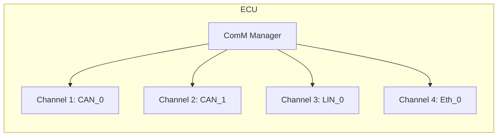

#### (2) User（通信用户）

**User** 是通信服务的消费者，通常是 SWC（软件组件）或 BSW 模块。User 向 ComM 发出通信请求，ComM 根据所有 User 的请求综合决策。

```
User 的例子：
  - SWC_ECU_State_Manager  → 管理 ECU 休眠/唤醒
  - SWC_Diagnostic          → 诊断通信请求
  - SWC_Network_Management  → 网络管理
  - BswM                    → BSW 模式管理
```

#### (3) Request（通信请求）

User 通过 `ComM_RequestComMode()` API 向 ComM 请求某个 Channel 进入特定模式。

#### (4) Mode（通信模式）

每个 Channel 可以处于以下几种模式之一。

### 2.2 ComM 的三种通信模式

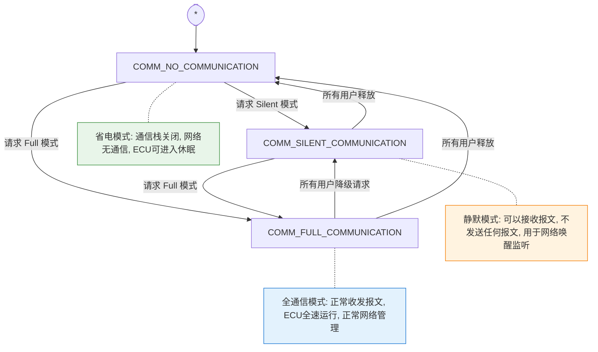

| 模式 | 名称 | 发送 | 接收 | 功耗 | 典型场景 |
|------|------|:----:|:----:|:----:|---------|
| `COMM_NO_COMMUNICATION` | 无通信 | ❌ | ❌ | ⭐⭐⭐ | ECU 休眠、停车 |
| `COMM_SILENT_COMMUNICATION` | 静默通信 | ❌ | ✅ | ⭐⭐ | 等待唤醒、网络监听 |
| `COMM_FULL_COMMUNICATION` | 全通信 | ✅ | ✅ | ⭐ | 正常行驶、诊断 |

---

## 3. 状态机详解

### 3.1 Channel 状态机

每个 Channel 都有一个完整的有限状态机（FSM），这是 ComM 最核心的机制。

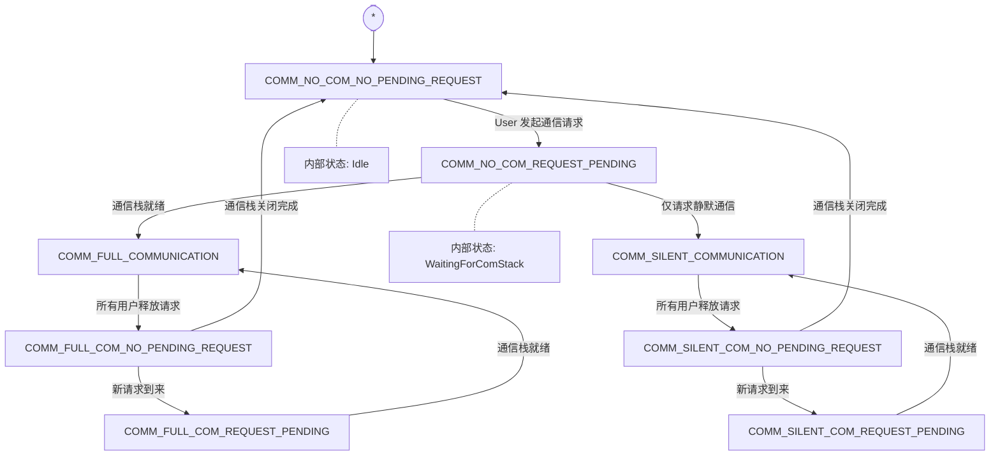

### 3.2 状态定义的补充说明

实际上 ComM 规范定义了 6 个关键状态（加上 Pending 变体共 12 个）：

| 状态 | 含义 |
|------|------|
| `COMM_NO_COM_NO_PENDING_REQUEST` | 无通信，无未决请求 |
| `COMM_NO_COM_REQUEST_PENDING` | 无通信，但有未决请求（正在启动通信） |
| `COMM_SILENT_COM_NO_PENDING_REQUEST` | 静默通信，无未决请求 |
| `COMM_SILENT_COM_REQUEST_PENDING` | 静默通信，有未决请求 |
| `COMM_FULL_COM_NO_PENDING_REQUEST` | 全通信，无未决请求 |
| `COMM_FULL_COM_REQUEST_PENDING` | 全通信，有未决请求 |

### 3.3 状态转换的触发条件

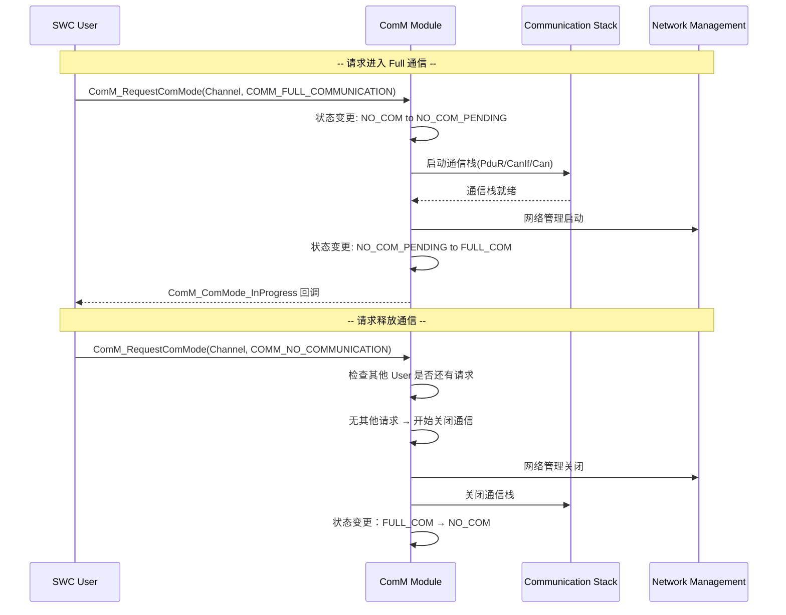

---

## 4. 通信场景与模式管理

### 4.1 多个 User 的请求仲裁（核心机制）

当多个 User 对同一个 Channel 发出不同请求时，ComM 按照**优先级规则**决策：

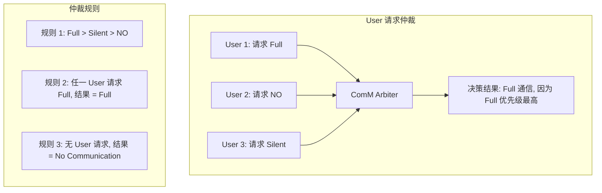

**仲裁优先级**（从高到低）：

```
┌────────────────────────────────────────────────┐
│  最高  │  COMM_FULL_COMMUNICATION              │
│        │  只要有一个 User 请求 Full，就是 Full  │
├────────────────────────────────────────────────┤
│        │  COMM_SILENT_COMMUNICATION            │
│  中间  │  没有 Full 请求，但有 Silent 请求      │
├────────────────────────────────────────────────┤
│  最低  │  COMM_NO_COMMUNICATION                │
│        │  所有 User 都释放了请求               │
└────────────────────────────────────────────────┘
```

### 4.2 典型场景：ECU 启动过程

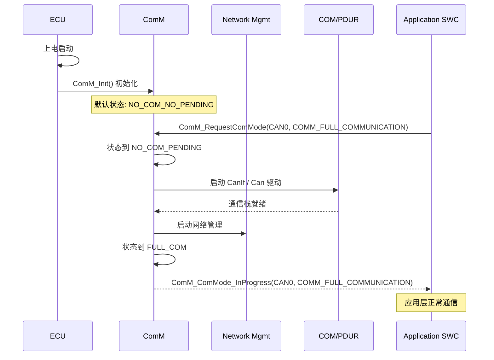

### 4.3 典型场景：ECU 休眠过程

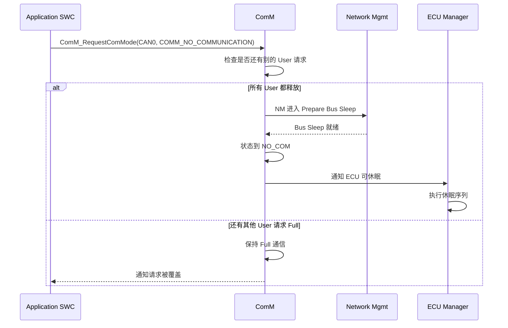

---

## 5. API 接口与调用关系

### 5.1 ComM 提供的核心 API

| API 函数 | 功能 | 调用者 |
|----------|------|--------|
| `ComM_Init()` | 初始化 ComM 模块 | ECU 启动时由 EcuM 调用 |
| `ComM_RequestComMode()` | 请求通信模式 | SWC / BSW 模块 |
| `ComM_GetCurrentComMode()` | 获取当前通信模式 | SWC / BSW 模块 |
| `ComM_PNCEnable()` | 启用部分网络通信 | BswM |
| `ComM_PrepareCommunicationMode()` | 准备模式切换 | CanSM / LinSM / EthSM |
| `ComM_GetMaxComMode()` | 获取当前最大通信模式 | BswM |
| `ComM_CommunicationModeControl()` | 通信模式控制接口 | BswM / 诊断 |

### 5.2 Callback 回调接口

ComM 也定义了回调接口，由其他模块实现，ComM 调用：

| 回调函数 | 功能 | 实现者 |
|----------|------|--------|
| `ComM_CancelChannelRequest()` | 取消 Channel 请求 | BswM |
| `ComM_ComModeInProgress_Indication()` | 通信模式变更通知 | BswM / SWC |
| `ComM_NmVoteRelease()` | NM 表决释放 | NM |
| `ComM_PrepareCommunicationMode_Callback()` | 模式切换准备回调 | BswM |

### 5.3 关键 API 详细说明

#### `ComM_RequestComMode()` — 最核心的 API

```c
/* 函数原型 */
Std_ReturnType ComM_RequestComMode(
    ComM_ChannelType Channel,     /* 目标通信信道 */
    ComM_ModeType RequestedMode   /* 请求的通信模式 */
);

/* 参数说明 */
/* 
 * Channel:   COMM_CHANNEL_CAN0, COMM_CHANNEL_CAN1, 等
 * RequestedMode: 
 *   - COMM_FULL_COMMUNICATION    (0x01)
 *   - COMM_SILENT_COMMUNICATION  (0x02) 
 *   - COMM_NO_COMMUNICATION      (0x03)  → 释放请求
 *
 * 返回值:
 *   E_OK    - 请求接受
 *   E_NOT_OK - 请求无效
 */
```

#### `ComM_GetCurrentComMode()` — 查询接口

```c
/* 函数原型 */
Std_ReturnType ComM_GetCurrentComMode(
    ComM_ChannelType Channel,
    ComM_ModeType*   ComMode_Ptr    /* 输出参数：当前模式 */
);
```

---

## 6. ComM 与其他模块的交互

### 6.1 架构位置

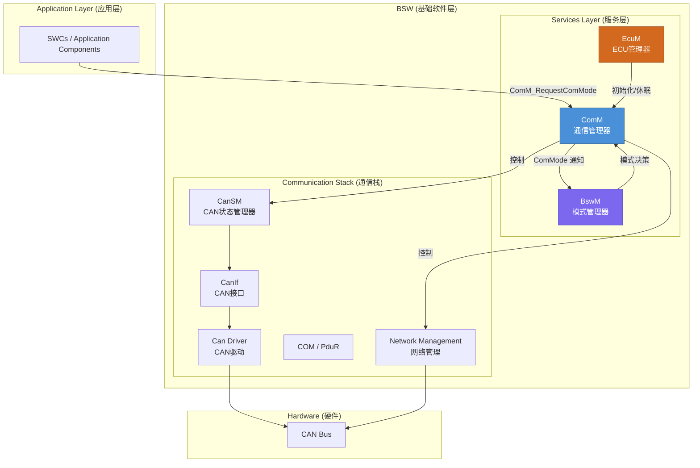

### 6.2 模块间的交互关系

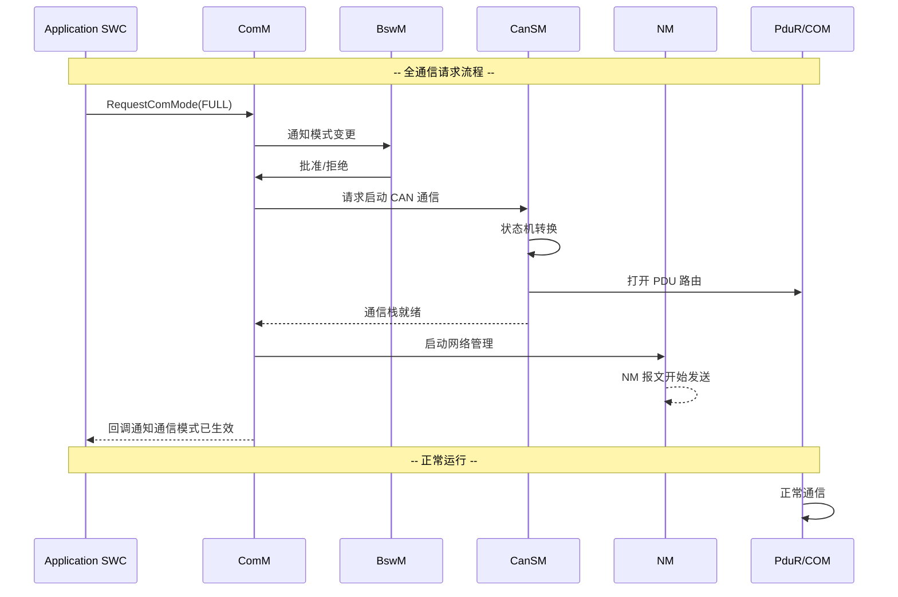

### 6.3 各模块职责

| 模块 | 全称 | 职责 |
|------|------|------|
| **ComM** | Communication Manager | 通信模式仲裁与管理，协调通信栈启停 |
| **BswM** | BSW Mode Manager | 模式规则引擎，根据条件做模式仲裁 |
| **EcuM** | ECU Manager | ECU 整体生命周期管理（初始化/休眠/唤醒） |
| **CanSM** | CAN State Manager | CAN 网络状态管理（启动/停止/休眠） |
| **NM** | Network Management | 网络管理，协调总线网络的休眠与唤醒 |
| **PduR** | PDU Router | PDU 路由，连接 COM 与通信接口层 |

---

## 7. 【深入原理】ComM 的内部设计与实现机制

### 7.1 ComM 的架构设计模式

#### (1) 策略模式（Strategy Pattern）

ComM 对不同通信网络的 Channel 使用相同的策略接口：

```
                    ┌──────────────────┐
                    │   ComM Module    │
                    │ (策略调用方)      │
                    └────────┬─────────┘
                             │
             ┌───────────────┼───────────────┐
             ▼               ▼               ▼
      ┌────────────┐ ┌────────────┐ ┌────────────┐
      │ CanSM      │ │ LinSM      │ │ EthSM      │
      │ (CAN策略)   │ │ (LIN策略)   │ │ (Ethernet)  │
      └────────────┘ └────────────┘ └────────────┘
             │               │               │
             ▼               ▼               ▼
      ┌────────────┐ ┌────────────┐ ┌────────────┐
      │ Can Driver │ │ Lin Driver │ │ Eth Driver │
      └────────────┘ └────────────┘ └────────────┘
```

#### (2) 观察者模式（Observer Pattern）

ComM 的状态变化会通知所有注册的观察者（BswM、SWC 等）。

#### (3) 状态模式（State Pattern）

每个 Channel 有自己的状态机，状态转换逻辑封装在各状态中。

### 7.2 Request 管理的内部实现

#### 每个 User 的请求记录

ComM 内部为每个 Channel 维护一个 **User 请求表**：

```c
/* 内部数据结构示意 */
typedef struct {
    ComM_ChannelType   Channel;          /* 信道 ID */
    ComM_UserHandleType UserId;          /* 用户 ID */
    ComM_ModeType      RequestedMode;    /* 请求的模式 */
    boolean            RequestActive;    /* 请求是否有效 */
} ComM_UserRequestType;

/* 每个 Channel 的请求状态聚合 */
typedef struct {
    ComM_ChannelType         ChannelId;
    ComM_StateType           CurrentState;     /* 当前状态 */
    ComM_ModeType            MaxMode;          /* 当前最大请求模式 */
    uint16                   RequestCount;     /* 活跃请求数 */
    ComM_UserRequestType     UserRequests[COMM_MAX_USERS];  /* 各 User 请求 */
    ComM_PNCHandleType       PNCId;            /* 部分网络 ID */
} ComM_ChannelStateType;
```

#### 请求仲裁算法

```
请求仲裁伪逻辑：

ComM_RequestComMode(Channel, Mode):
    1. 更新该 User 在 Channel 上的请求记录
    2. 遍历该 Channel 的所有 User 请求：
       - 统计请求 Full 的用户数
       - 统计请求 Silent 的用户数
       - 统计请求 NO 的用户数
    3. 计算最大模式 MaxMode：
       MaxMode = FULL  (如果有至少一个 User 请求 Full)
       MaxMode = SILENT (如果有至少一个 User 请求 Silent，且无 Full)
       MaxMode = NO     (所有 User 都释放)
    4. 比较 MaxMode 与 CurrentMode：
       - 如果相同 → 不做操作
       - 如果不同 → 启动状态转换
    5. 执行状态转换动作...
```

### 7.3 状态转换的内部流程

以 `NO_COM → FULL_COM` 为例，ComM 内部执行以下步骤：

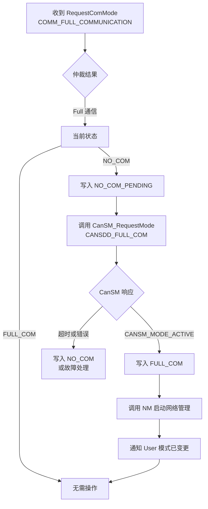

### 7.4 超时机制

ComM 内部使用多个定时器来保证可靠的状态转换：

| 定时器 | 作用 | 超时后果 |
|--------|------|---------|
| `ComMChannelPrepareCommunicationTimer` | 等待通信栈准备 | 通信栈准备失败 |
| `ComMChannelSilentMaxArTimeout` | 最长静默通信时间 | 强制进入 NO_COM |
| `ComMChannelFullMaxArTimeout` | 最长全通信时间 | 强制降级 |

### 7.5 部分网络（Partial Network）支持

在 AUTOSAR 4.0+ 中，ComM 支持部分网络功能。允许在同一个物理网络上只有部分 ECU 通信，其他 ECU 保持休眠。

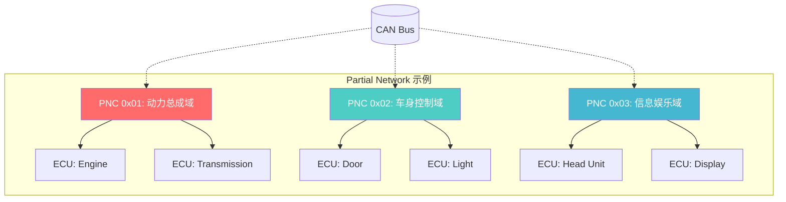

---

## 8. 【代码示例】ComM 模块骨架实现

以下是一个简化的 ComM 实现框架，演示核心机制。

### 8.1 头文件定义

```c
/* ==================== ComM_Types.h ==================== */

#ifndef COMM_TYPES_H
#define COMM_TYPES_H

#include "Std_Types.h"          /* AUTOSAR 标准类型 */
#include "ComM_Cfg.h"           /* 配置头文件 */

/* ── 通信模式定义 ── */
#define COMM_NO_COMMUNICATION           ((ComM_ModeType)0x00)
#define COMM_SILENT_COMMUNICATION       ((ComM_ModeType)0x01)
#define COMM_FULL_COMMUNICATION         ((ComM_ModeType)0x02)

/* ── Channel 状态定义 ── */
typedef enum {
    COMM_NO_COM_NO_PENDING_REQUEST,     /* 无通信，无未决请求 */
    COMM_NO_COM_REQUEST_PENDING,        /* 无通信，有未决请求 */
    COMM_SILENT_COM_NO_PENDING_REQUEST, /* 静默通信，无未决请求 */
    COMM_SILENT_COM_REQUEST_PENDING,    /* 静默通信，有未决请求 */
    COMM_FULL_COM_NO_PENDING_REQUEST,   /* 全通信，无未决请求 */
    COMM_FULL_COM_REQUEST_PENDING       /* 全通信，有未决请求 */
} ComM_StateType;

/* ── 类型定义 ── */
typedef uint8   ComM_ChannelType;
typedef uint8   ComM_ModeType;
typedef uint16  ComM_UserHandleType;

/* ── 最大通信模式计算 ── */
#define COMM_MAX_MODE(m1, m2)   ((m1) > (m2) ? (m1) : (m2))

#endif /* COMM_TYPES_H */
```

### 8.2 配置数据结构

```c
/* ==================== ComM_Cfg.h ==================== */

#ifndef COMM_CFG_H
#define COMM_CFG_H

/* ── 通道定义 ── */
#define COMM_CHANNEL_CAN0       ((ComM_ChannelType)0)
#define COMM_CHANNEL_CAN1       ((ComM_ChannelType)1)
#define COMM_CHANNEL_LIN0       ((ComM_ChannelType)2)

#define COMM_MAX_CHANNELS       3   /* 通道总数 */
#define COMM_MAX_USERS_PER_CH   8   /* 每个通道最大 User 数 */

/* ── 定时器配置 ── */
#define COMM_PREPARE_TIMEOUT_MS     1000    /* 通信栈准备超时 (ms) */
#define COMM_SILENT_MAX_AR_TIMEOUT  30000   /* 静默最长持续时间 (ms) */

/* ── 用户 ID 定义 ── */
#define COMM_USER_ECUM          ((ComM_UserHandleType)0)
#define COMM_USER_BSWM          ((ComM_UserHandleType)1)
#define COMM_USER_DIAG          ((ComM_UserHandleType)2)

/* ── 外部函数声明（由其他模块实现） ── */
extern void CanSM_RequestMode(ComM_ChannelType Channel, ComM_ModeType Mode);
extern void Nm_StartNetwork(ComM_ChannelType Channel);
extern void Nm_StopNetwork(ComM_ChannelType Channel);

#endif /* COMM_CFG_H */
```

### 8.3 核心实现

```c
/* ==================== ComM.c ==================== */

#include "ComM.h"
#include "ComM_Cfg.h"
#include "ComM_Types.h"
#include "SchM_ComM.h"          /* AUTOSAR 调度器接口 */
#include "Os.h"                 /* OS 接口 */

/* ── 模块私有数据 ── */
typedef struct {
    ComM_ChannelType   ChannelId;
    ComM_StateType     CurrentState;
    ComM_ModeType      MaxRequestedMode;
    uint16             ActiveRequestCount;
    ComM_ModeType      UserRequestTable[COMM_MAX_USERS_PER_CH];
} ComM_ChannelContextType;

/* 所有 Channel 的上下文 */
static ComM_ChannelContextType ComM_Channels[COMM_MAX_CHANNELS];

/* ── 函数原型（内部） ── */
static void ComM_ArbitrateChannel(ComM_ChannelType Channel);
static void ComM_ExecuteStateTransition(ComM_ChannelType Channel);
static void ComM_NotifyUser(ComM_ChannelType Channel, ComM_ModeType Mode);

/* ================================================================
 * 函数: ComM_Init
 * 描述: 初始化 ComM 模块，将所有 Channel 置于初始状态
 * ================================================================ */
void ComM_Init(void)
{
    uint8 ch;
    
    for (ch = 0; ch < COMM_MAX_CHANNELS; ch++)
    {
        ComM_ChannelContextType* ctx = &ComM_Channels[ch];
        
        ctx->ChannelId         = (ComM_ChannelType)ch;
        ctx->CurrentState      = COMM_NO_COM_NO_PENDING_REQUEST;
        ctx->MaxRequestedMode  = COMM_NO_COMMUNICATION;
        ctx->ActiveRequestCount = 0;
        
        /* 清零所有 User 请求 */
        for (uint8 u = 0; u < COMM_MAX_USERS_PER_CH; u++)
        {
            ctx->UserRequestTable[u] = COMM_NO_COMMUNICATION;
        }
    }
    
    /* 调度器启动 ComM 管理任务 */
    SchM_StartComMManagerTask();
}

/* ================================================================
 * 函数: ComM_RequestComMode
 * 描述: 核心 API — 某个 User 请求特定通道的通信模式
 * ================================================================ */
Std_ReturnType ComM_RequestComMode(
    ComM_ChannelType Channel,
    ComM_UserHandleType User,
    ComM_ModeType RequestedMode)
{
    Std_ReturnType ret = E_OK;
    
    /* ── 参数校验 ── */
    if (Channel >= COMM_MAX_CHANNELS || User >= COMM_MAX_USERS_PER_CH)
    {
        return E_NOT_OK;
    }
    
    if (RequestedMode != COMM_NO_COMMUNICATION   &&
        RequestedMode != COMM_SILENT_COMMUNICATION &&
        RequestedMode != COMM_FULL_COMMUNICATION)
    {
        return E_NOT_OK;
    }
    
    /* ── 关键区保护（OS 临界区） ── */
    SchM_Enter_ComM_Request();
    
    /* 更新该 User 的请求 */
    ComM_ChannelContextType* ctx = &ComM_Channels[Channel];
    ctx->UserRequestTable[User] = RequestedMode;
    
    /* 重新仲裁 ── 核心逻辑 */
    ComM_ArbitrateChannel(Channel);
    
    SchM_Exit_ComM_Request();
    
    return ret;
}

/* ================================================================
 * 函数: ComM_ArbitrateChannel       ← 核心仲裁逻辑
 * 描述: 遍历所有 User 请求，计算最大模式，触发状态转换
 * ================================================================ */
static void ComM_ArbitrateChannel(ComM_ChannelType Channel)
{
    ComM_ChannelContextType* ctx = &ComM_Channels[Channel];
    ComM_ModeType newMaxMode = COMM_NO_COMMUNICATION;
    uint16 activeCount = 0;
    
    /* ── 仲裁：取所有 User 请求的最大模式 ── */
    for (uint8 u = 0; u < COMM_MAX_USERS_PER_CH; u++)
    {
        if (ctx->UserRequestTable[u] > newMaxMode)
        {
            newMaxMode = ctx->UserRequestTable[u];
        }
        if (ctx->UserRequestTable[u] != COMM_NO_COMMUNICATION)
        {
            activeCount++;
        }
    }
    
    ctx->ActiveRequestCount = activeCount;
    ctx->MaxRequestedMode = newMaxMode;
    
    /* ── 判断是否需要状态转换 ── */
    ComM_ExecuteStateTransition(Channel);
}

/* ================================================================
 * 函数: ComM_ExecuteStateTransition   ← 状态转换执行
 * 描述: 根据当前状态和目标模式，执行状态转换逻辑
 * ================================================================ */
static void ComM_ExecuteStateTransition(ComM_ChannelType Channel)
{
    ComM_ChannelContextType* ctx = &ComM_Channels[Channel];
    ComM_ModeType targetMode = ctx->MaxRequestedMode;
    ComM_StateType currentState = ctx->CurrentState;
    
    /* ── 获取当前实际通信模式 ── */
    ComM_ModeType currentComMode;
    switch (currentState)
    {
        case COMM_FULL_COM_NO_PENDING_REQUEST:
        case COMM_FULL_COM_REQUEST_PENDING:
            currentComMode = COMM_FULL_COMMUNICATION;
            break;
            
        case COMM_SILENT_COM_NO_PENDING_REQUEST:
        case COMM_SILENT_COM_REQUEST_PENDING:
            currentComMode = COMM_SILENT_COMMUNICATION;
            break;
            
        default:
            currentComMode = COMM_NO_COMMUNICATION;
            break;
    }
    
    /* ── 模式相同 → 不操作 ── */
    if (targetMode == currentComMode)
    {
        return;
    }
    
    /* ── 模式不同 → 开始转换 ── */
    switch (targetMode)
    {
        case COMM_FULL_COMMUNICATION:
            /* 请求 Full 通信 */
            switch (currentState)
            {
                case COMM_NO_COM_NO_PENDING_REQUEST:
                    ctx->CurrentState = COMM_NO_COM_REQUEST_PENDING;
                    /* 通知通信栈准备进入 Full 模式 */
                    CanSM_RequestMode(Channel, COMM_FULL_COMMUNICATION);
                    /* 启动超时定时器 */
                    SchM_StartTimer(COMM_PREPARE_TIMEOUT_MS);
                    break;
                    
                case COMM_SILENT_COM_NO_PENDING_REQUEST:
                case COMM_SILENT_COM_REQUEST_PENDING:
                    ctx->CurrentState = COMM_FULL_COM_REQUEST_PENDING;
                    CanSM_RequestMode(Channel, COMM_FULL_COMMUNICATION);
                    break;
                    
                default:
                    break;
            }
            break;
            
        case COMM_SILENT_COMMUNICATION:
            /* 请求 Silent 通信 */
            switch (currentState)
            {
                case COMM_NO_COM_NO_PENDING_REQUEST:
                    ctx->CurrentState = COMM_NO_COM_REQUEST_PENDING;
                    CanSM_RequestMode(Channel, COMM_SILENT_COMMUNICATION);
                    break;
                    
                default:
                    break;
            }
            break;
            
        case COMM_NO_COMMUNICATION:
            /* 请求释放通信 */
            switch (currentState)
            {
                case COMM_FULL_COM_NO_PENDING_REQUEST:
                case COMM_FULL_COM_REQUEST_PENDING:
                    ctx->CurrentState = COMM_FULL_COM_NO_PENDING_REQUEST;
                    /* 开始关闭流程 → NM 先释放 */
                    /* 实际会先通知 NM 投票释放 */
                    break;
                    
                case COMM_SILENT_COM_NO_PENDING_REQUEST:
                case COMM_SILENT_COM_REQUEST_PENDING:
                    ctx->CurrentState = COMM_NO_COM_NO_PENDING_REQUEST;
                    CanSM_RequestMode(Channel, COMM_NO_COMMUNICATION);
                    break;
                    
                default:
                    break;
            }
            break;
    }
}

/* ================================================================
 * 函数: ComM_GetCurrentComMode
 * 描述: 查询当前通道的通信模式
 * ================================================================ */
Std_ReturnType ComM_GetCurrentComMode(
    ComM_ChannelType Channel,
    ComM_ModeType*   ModePtr)
{
    if (Channel >= COMM_MAX_CHANNELS || ModePtr == NULL)
    {
        return E_NOT_OK;
    }
    
    ComM_ChannelContextType* ctx = &ComM_Channels[Channel];
    
    switch (ctx->CurrentState)
    {
        case COMM_FULL_COM_NO_PENDING_REQUEST:
        case COMM_FULL_COM_REQUEST_PENDING:
            *ModePtr = COMM_FULL_COMMUNICATION;
            break;
            
        case COMM_SILENT_COM_NO_PENDING_REQUEST:
        case COMM_SILENT_COM_REQUEST_PENDING:
            *ModePtr = COMM_SILENT_COMMUNICATION;
            break;
            
        default:
            *ModePtr = COMM_NO_COMMUNICATION;
            break;
    }
    
    return E_OK;
}

/* ================================================================
 * 函数: ComM_ComModeInProgress （由通信栈回调）
 * 描述: 通信栈状态管理器（如 CanSM）在状态变更完成后回调
 * ================================================================ */
void ComM_ComModeInProgress_Indication(
    ComM_ChannelType Channel,
    ComM_ModeType    IndicatedMode)
{
    ComM_ChannelContextType* ctx = &ComM_Channels[Channel];
    
    SchM_Enter_ComM_Request();
    
    switch (IndicatedMode)
    {
        case COMM_FULL_COMMUNICATION:
            /* 通信栈确认 Full 模式生效 */
            if (ctx->CurrentState == COMM_NO_COM_REQUEST_PENDING ||
                ctx->CurrentState == COMM_FULL_COM_REQUEST_PENDING)
            {
                ctx->CurrentState = COMM_FULL_COM_NO_PENDING_REQUEST;
                
                /* 启动网络管理 */
                Nm_StartNetwork(Channel);
                
                /* 通知 User 模式已变更 */
                ComM_NotifyUser(Channel, COMM_FULL_COMMUNICATION);
            }
            break;
            
        case COMM_SILENT_COMMUNICATION:
            if (ctx->CurrentState == COMM_NO_COM_REQUEST_PENDING)
            {
                ctx->CurrentState = COMM_SILENT_COM_NO_PENDING_REQUEST;
                ComM_NotifyUser(Channel, COMM_SILENT_COMMUNICATION);
            }
            break;
            
        case COMM_NO_COMMUNICATION:
            if (ctx->CurrentState == COMM_FULL_COM_NO_PENDING_REQUEST ||
                ctx->CurrentState == COMM_SILENT_COM_NO_PENDING_REQUEST)
            {
                ctx->CurrentState = COMM_NO_COM_NO_PENDING_REQUEST;
                ComM_NotifyUser(Channel, COMM_NO_COMMUNICATION);
            }
            break;
    }
    
    SchM_Exit_ComM_Request();
}

/* ================================================================
 * 函数: ComM_PrepareCommunicationMode （由 BswM 等调用）
 * 描述: 准备通信模式切换（实际调用 CanSM/LinSM/EthSM）
 * ================================================================ */
Std_ReturnType ComM_PrepareCommunicationMode(
    ComM_ChannelType Channel,
    ComM_ModeType    RequestedMode)
{
    /* 直接转发到对应的通信栈状态管理器 */
    switch (RequestedMode)
    {
        case COMM_FULL_COMMUNICATION:
            CanSM_RequestMode(Channel, CANSM_FULL_COM);
            break;
            
        case COMM_SILENT_COMMUNICATION:
            CanSM_RequestMode(Channel, CANSM_SILENT_COM);
            break;
            
        case COMM_NO_COMMUNICATION:
            CanSM_RequestMode(Channel, CANSM_NO_COM);
            break;
            
        default:
            return E_NOT_OK;
    }
    
    return E_OK;
}

/* ================================================================
 * 函数: ComM_NotifyUser （内部）
 * 描述: 通知注册的 User 模式变更
 * ================================================================ */
static void ComM_NotifyUser(ComM_ChannelType Channel, ComM_ModeType Mode)
{
    /* 实际实现中会调用 BswM 或 SWC 的回调 */
    /* 例如: BswM_ComModeInProgress(Channel, Mode); */
    
    /* 这里简化为一个回调数组遍历 */
    for (uint8 u = 0; u < COMM_MAX_USERS_PER_CH; u++)
    {
        if (ComM_Channels[Channel].UserRequestTable[u] != COMM_NO_COMMUNICATION)
        {
            /* 通知 User：当前模式已变更 */
            /* UserCallbackTable[u](Channel, Mode); */
        }
    }
}

/* ================================================================
 * 函数: ComM_ChannelTimer_Elapsed （定时器回调）
 * 描述: 状态转换超时处理
 * ================================================================ */
void ComM_ChannelTimer_Elapsed(ComM_ChannelType Channel)
{
    ComM_ChannelContextType* ctx = &ComM_Channels[Channel];
    
    /* 超时 → 如果还在 PENDING 状态，执行故障处理 */
    if (ctx->CurrentState == COMM_NO_COM_REQUEST_PENDING ||
        ctx->CurrentState == COMM_FULL_COM_REQUEST_PENDING ||
        ctx->CurrentState == COMM_SILENT_COM_REQUEST_PENDING)
    {
        /* 回退到安全状态 */
        ctx->CurrentState = COMM_NO_COM_NO_PENDING_REQUEST;
        ComM_NotifyUser(Channel, COMM_NO_COMMUNICATION);
        
        /* 触发 DEM 错误上报 */
        /* Det_ReportError(COMM_MODULE_ID, ...); */
    }
}

/* ================================================================
 * 函数: ComM_GetMaxComMode
 * 描述: BswM 使用的接口，查询当前最大请求模式
 * ================================================================ */
ComM_ModeType ComM_GetMaxComMode(ComM_ChannelType Channel)
{
    if (Channel >= COMM_MAX_CHANNELS)
    {
        return COMM_NO_COMMUNICATION;
    }
    
    return ComM_Channels[Channel].MaxRequestedMode;
}
```

### 8.4 BswM 侧的规则配置示例（规则引擎）

```c
/* ==================== BswM_ComM_Rules.c （示例）==================== */

/* BswM 中的模式规则定义 */
/* BswM 根据 ComM 的当前模式和其他条件驱动模式切换 */

/*
 * 规则示例:
 * 
 * IF ComM_Channel_CAN0 == COMM_FULL_COMMUNICATION
 * AND EcuM_PowerState == POWER_ON
 * THEN → 设置 CanSM 为 CANSM_FULL_COM
 *
 * IF ComM_Channel_CAN0 == COMM_NO_COMMUNICATION
 * AND Nm_State == BUS_SLEEP
 * THEN → 设置 EcuM 进入 SLEEP 状态
 */
```

---

## 9. 【总结】ComM 的设计模式与思想

### 9.1 设计模式总结

| 设计模式 | 在 ComM 中的体现 |
|----------|----------------|
| **状态模式** | Channel 状态机，每个状态有明确的转换规则 |
| **策略模式** | 通过 CanSM/LinSM/EthSM 适配不同网络类型 |
| **观察者模式** | 模式变更通知所有注册的 User |
| **中介者模式** | ComM 充当通信请求的中介者，协调各方 |
| **模板方法** | 各种网络的状态管理器遵循统一的接口模板 |

### 9.2 ComM 的设计哲学

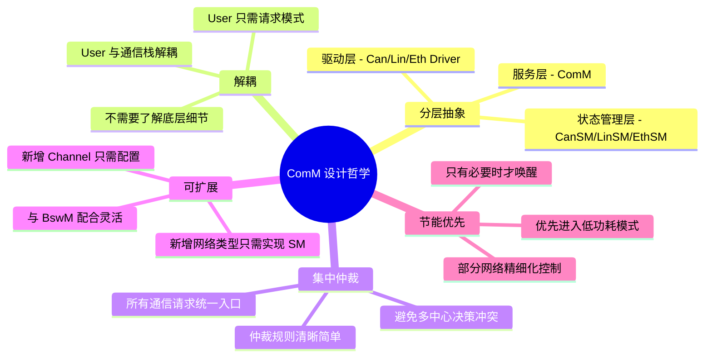

### 9.3 关键要点

1. **ComM 本身不直接操作硬件**，它通过协调 CanSM/LinSM/EthSM 间接控制通信栈。

2. **请求仲裁是 ComM 最核心的逻辑** — 多个 User 对同一个 Channel 的请求取最高优先级。

3. **与 BswM 配合是精髓** — ComM 负责"是什么模式"，BswM 负责"在这种模式下应该做什么"。

4. **状态机可靠** — 每个状态转换都有超时保护，防止通信栈卡死。

5. **Partial Network 是高级功能** — 在 AUTOSAR 4.0+ 中实现对同一物理网络的分组管理，进一步优化功耗。

---

> **附录**
> - 本文代码为教学简化版，实际 AUTOSAR 产品级实现由 Vector/ETAS 等工具生成
> - 建议配合 AUTOSAR 规范文档 `AUTOSAR_SWS_ComM.pdf` 一起阅读
> - 实际项目中 ComM 的配置由 DaVinci Developer 或 ISOLAR 等工具完成

---

*文档结束*