# ComM、NM、CanNM 交互逻辑详解

> 本文详细讲解 AUTOSAR 架构中 **ComM（Communication Manager）**、**NM（Network Management 抽象层）** 和 **CanNM（CAN 网络管理具体实现）** 三个模块之间的交互逻辑，以及完整的网络管理协调机制。

---

## 1. 通俗理解：三模块的角色分工

可以把这三层关系类比为 **"公司管理层 — 项目经理 — 一线工人"**：

| 角色 | 类比 | 职责 |
|------|------|------|
| **ComM** | 公司管理层 | 决定"要不要通信"，管理应用层的通信需求，协调网络状态 |
| **NM（抽象层）** | 项目经理 | 传达管理层的指令，但不关心具体的通信协议细节 |
| **CanNM** | 一线工人 | 真正干活——发送/接收 CAN 网络管理报文，维护 CAN 专属的状态机 |

**核心流程一句话：** SW-C（应用层软件组件）通过 ComM 发起通信请求 → ComM 协调后通知 NM → NM 转发给 CanNM → CanNM 在 CAN 总线上发送/接收 NM 报文来同步网络状态。

---

## 2. 模块架构概览

### 2.1 模块层级关系图

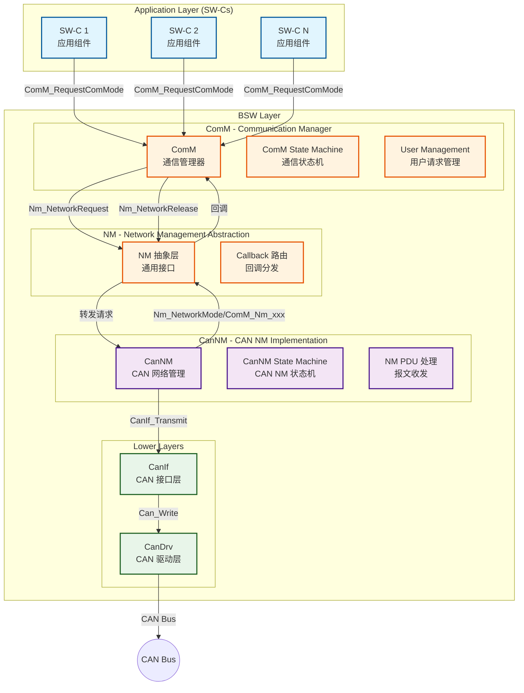

**图解释：** 上图展示了三个模块在 AUTOSAR 架构中的层级位置。
- **ComM** 位于 BSW 上层，直接与 SW-C 交互，管理通信请求
- **NM（抽象层）** 是 ComM 和具体协议实现之间的中间层，提供统一的接口
- **CanNM** 是协议相关的具体实现，通过 CanIf 和 CanDrv 操作 CAN 硬件
- 调用方向从上到下（请求），回调方向从下到上（通知）

### 2.2 交互接口总览

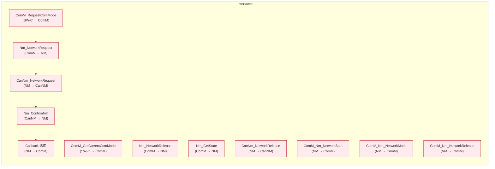

**图解释：** 关键接口路径。
- **SW-C → ComM**: `ComM_RequestComMode` 请求通信模式
- **ComM → NM → CanNM**: 请求链（NetworkRequest / NetworkRelease）
- **CanNM → NM → ComM**: 回调链（NetworkStart / NetworkMode / NetworkRelease）

---

## 3. ComM 详解

### 3.1 ComM 的作用

ComM 是 AUTOSAR 通信架构的 **"交通警察"**，负责：

1. **管理多个通信通道（Channel）** 的状态
2. **聚合多个 SW-C 的通信请求**，决定最终的通信模式
3. **协调网络状态机**，控制 NM 的启动与停止
4. **管理通信权限**（COMM_NO_COMMUNICATION / COMM_SILENT_COMMUNICATION / COMM_FULL_COMMUNICATION）

### 3.2 ComM 状态机

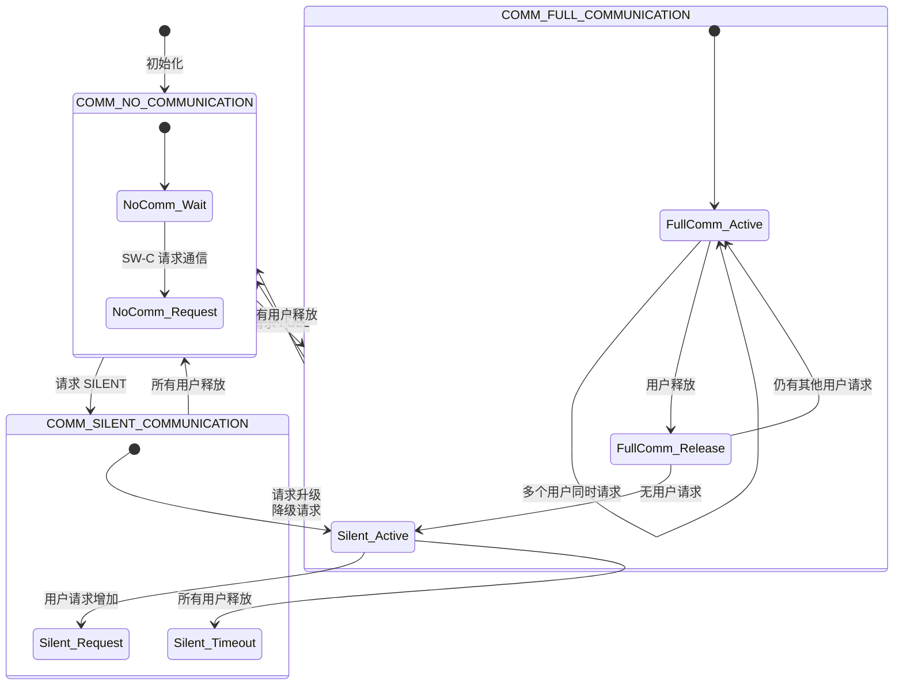

**图解释：** ComM 有三种通信模式：
- **COMM_NO_COMMUNICATION**: 无通信，总线关闭，NM 停止
- **COMM_SILENT_COMMUNICATION**: 静默通信，仅监听不发送（部分场景需要）
- **COMM_FULL_COMMUNICATION**: 全功能通信，正常收发

### 3.3 ComM 的"用户管理"机制

ComM 的核心理念是 **"多用户引用计数"**：

```c
/* ComM 内部伪代码 - 用户管理 */
typedef struct {
    uint8_t  UserId;              /* 用户 ID */
    ComM_ModeType RequestedMode;  /* 请求的通信模式 */
    boolean  IsActive;            /* 是否激活 */
} ComM_UserType;

typedef struct {
    ComM_ModeType    CurrentMode;    /* 当前通信模式 */
    ComM_ModeType    TargetMode;     /* 目标通信模式 */
    uint8_t          FullCommCount;  /* FULL 模式请求计数 */
    uint8_t          SilentCommCount;/* SILENT 模式请求计数 */
    ComM_UserType    Users[10];      /* 最多 10 个用户 */
} ComM_ChannelType;

/* 计算最终通信模式 */
ComM_ModeType ComM_CalculateTargetMode(ComM_ChannelType* Channel) {
    /* 优先级: FULL_COMMUNICATION > SILENT_COMMUNICATION > NO_COMMUNICATION */
    if (Channel->FullCommCount > 0) {
        return COMM_FULL_COMMUNICATION;
    }
    if (Channel->SilentCommCount > 0) {
        return COMM_SILENT_COMMUNICATION;
    }
    return COMM_NO_COMMUNICATION;
}
```

**代码解释：** 每个 SW-C 是一个"用户"。当一个 SW-C 调用 `ComM_RequestComMode(ChannelId, COMM_FULL_COMMUNICATION)` 时，ComM 增加 FULL 计数。当多个用户同时请求 FULL 时，计数累加；用户释放时计数递减。只有所有用户都释放后，才会进入 NO_COMMUNICATION。

---

## 4. NM 抽象层详解

### 4.1 NM 抽象层的作用

NM 抽象层位于 ComM 和协议特定实现之间，提供了一组 **标准化的 API**，使得 ComM 不需要关心底层是 CAN、LIN 还是 FlexRay。

### 4.2 NM 抽象层的接口映射

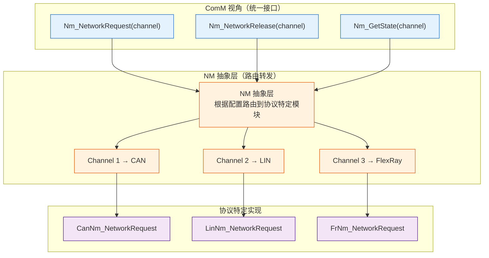

**图解释：** NM 抽象层是"万能适配器"。
- ComM 只调用 `Nm_xxx` 系列接口
- NM 抽象层根据配置（Channel ID 映射）把调用转发到对应的协议实现
- 对于 CAN 网络，转发到 `CanNm_xxx`；对于 LIN 网络，转发到 `LinNm_xxx`
- 这种设计体现了 **抽象工厂模式** 和 **策略模式** 的思想

---

## 5. CanNM 详解

### 5.1 CanNM 状态机

CanNM 拥有完整的网络管理状态机，这是整个交互中最核心的部分：

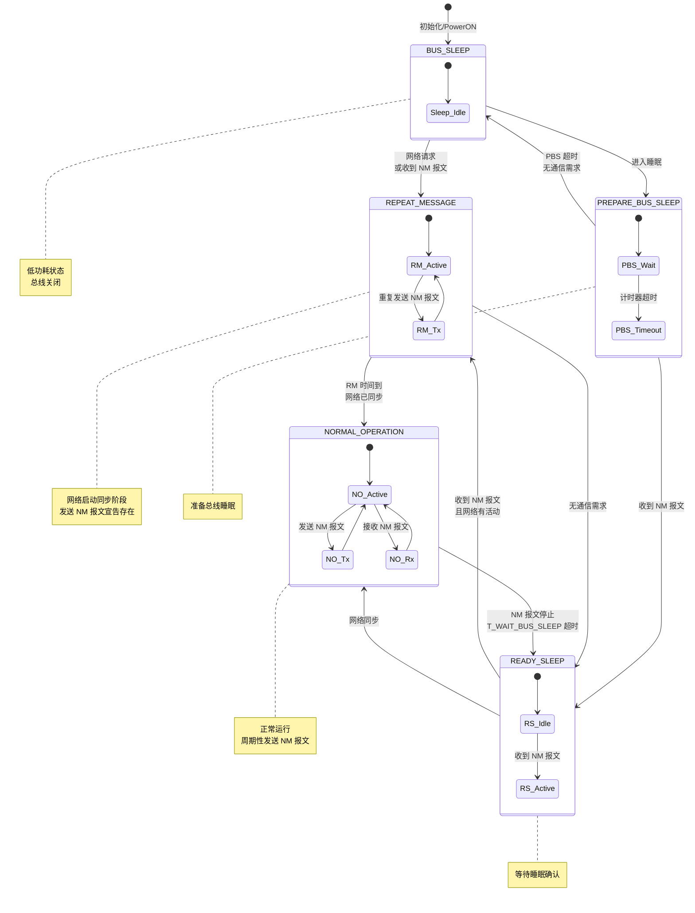

**图解释：** CanNM 有 5 个核心状态，构成了完整的网络管理生命周期：
- **BUS_SLEEP**: 睡眠状态，总线关闭，低功耗
- **REPEAT_MESSAGE**: 重复消息状态，网络启动时发送 NM 报文宣告自己的存在
- **NORMAL_OPERATION**: 正常运行状态，周期性发送 NM 报文维持网络
- **READY_SLEEP**: 准备睡眠状态，等待确认所有节点准备休眠
- **PREPARE_BUS_SLEEP**: 准备总线睡眠状态，等待超时后进入睡眠

### 5.2 CanNM 关键定时参数

| 参数 | 含义 | 典型值 | 说明 |
|------|------|--------|------|
| **T_REPEAT_MESSAGE** | 重复消息时间 | 500~1000ms | 网络启动时持续发送 NM 报文的时间 |
| **T_WAIT_BUS_SLEEP** | 等待总线睡眠时间 | 2000~5000ms | 从 NORMAL 到 READY_SLEEP 的等待时间 |
| **T_PREPARE_BUS_SLEEP** | 准备总线睡眠时间 | 500~1000ms | 从 READY_SLEEP 到 BUS_SLEEP 的等待时间 |
| **T_NM_Tx** | NM 报文发送周期 | 100~1000ms | 正常模式下发送 NM 报文的周期 |
| **T_NM_Timeout** | NM 报文超时时间 | 1500~5000ms | 接收 NM 报文的超时检测时间 |

---

## 6. 完整交互流程详解

### 6.1 网络启动流程

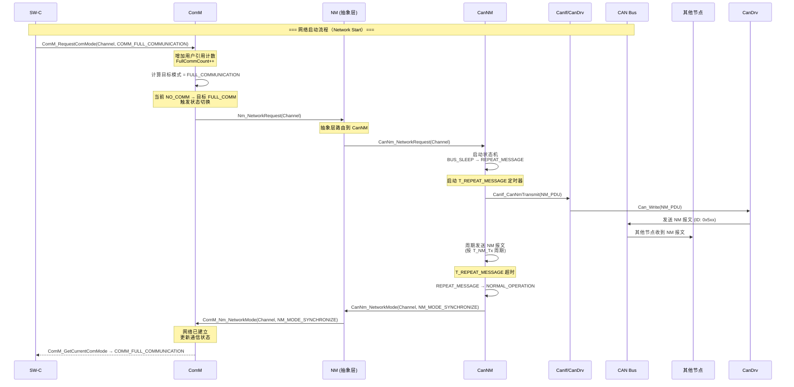

**图解释：** 网络启动流程的完整时序：
1. **SW-C 发起请求**: 应用层调用 `ComM_RequestComMode` 请求 FULL 通信
2. **ComM 决策**: 增加引用计数，计算目标模式，判断需要启动网络
3. **NM 路由**: 通过 `Nm_NetworkRequest` 将请求转发到 CanNM
4. **CanNM 启动**: 状态从 BUS_SLEEP → REPEAT_MESSAGE，开始发送 NM 报文
5. **网络同步**: 在 REPEAT_MESSAGE 期间持续发送 NM 报文，让其他节点感知到本节点
6. **进入正常运行**: REPEAT_MESSAGE 超时后进入 NORMAL_OPERATION，通知上层网络已就绪

### 6.2 正常网络运行状态

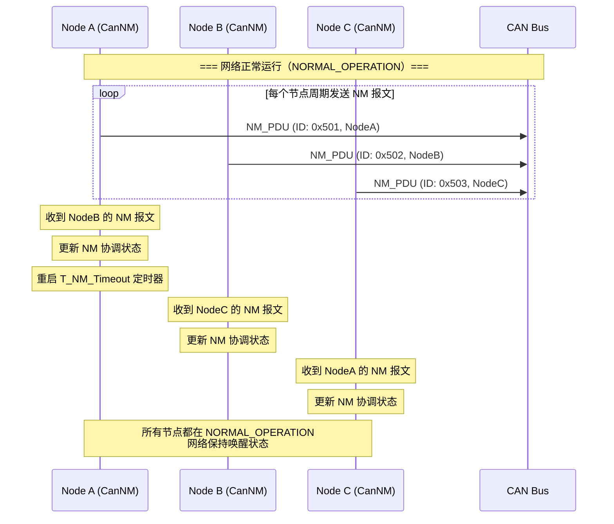

**图解释：** 正常运行状态中：
- 每个节点以 **T_NM_Tx** 周期发送自己的 NM 报文
- 每个节点收到其他节点的 NM 报文后，**重启超时定时器**
- 只要总线上有任意一个节点还在发送 NM 报文，网络就保持唤醒
- 这种机制实现了 **"最后一个节点决定睡眠"** 的分布式策略

### 6.3 网络释放流程

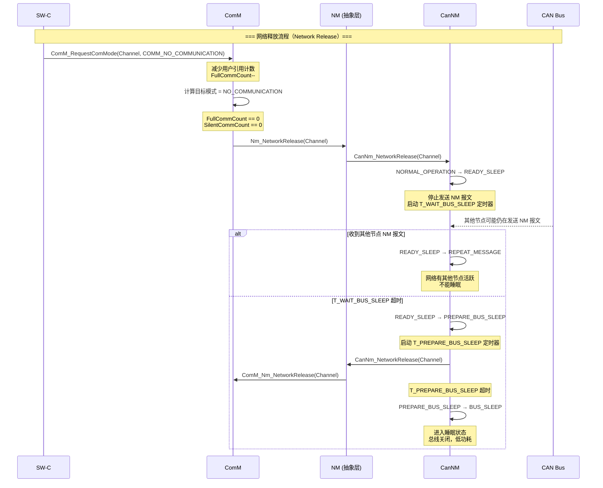

**图解释：** 网络释放流程展示了 AUTOSAR 网络管理最精妙的设计——**分布式睡眠协调**：
1. **ComM 释放**: 用户释放通信请求，引用计数归零
2. **CanNM 开始休眠流程**: 进入 READY_SLEEP，停止发送自己的 NM 报文
3. **等待其他节点**: 启动 T_WAIT_BUS_SLEEP 定时器
4. **关键决策点**:
   - 如果在等待期间收到其他节点的 NM 报文 → 说明网络还有活跃节点，回到 REPEAT_MESSAGE
   - 如果超时没有收到任何 NM 报文 → 说明自己是最后一个节点，可以安全进入睡眠
5. **进入睡眠**: 经过 PREPARE_BUS_SLEEP 后进入 BUS_SLEEP

### 6.4 网络唤醒流程

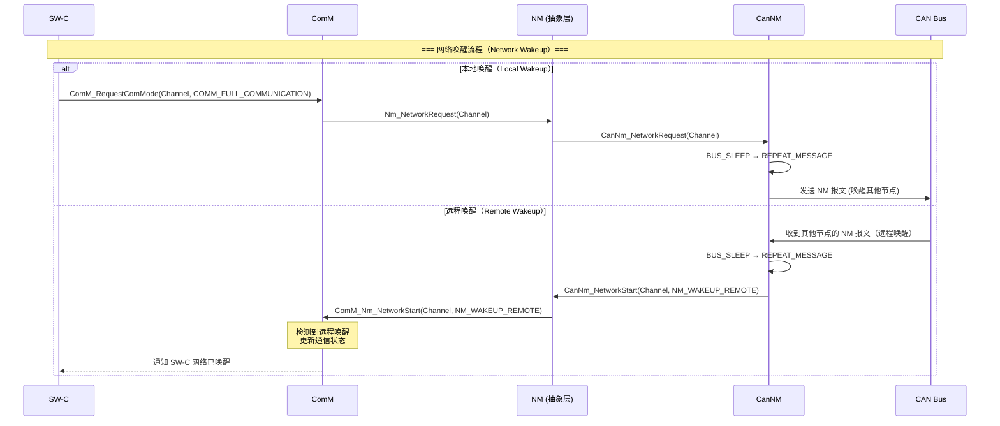

**图解释：** 网络唤醒有两种方式：
- **本地唤醒**: 本地节点的应用层主动请求通信，由 SW-C 发起
- **远程唤醒**: 收到总线上其他节点的 NM 报文，被动唤醒
- 两种方式最终都会进入 REPEAT_MESSAGE 状态，重新开始网络同步

---

## 7. CanNM 报文格式详解

### 7.1 NM 报文结构


| 字段 | 长度 | 说明 |
|------|------|------|
| **CAN ID** | 11/29 bit | 基本 ID + 节点 ID（如 0x500 + NodeID） |
| **Control Bit Vector (CBV)** | 1 byte | 控制位向量，标识 NM 状态 |
| **User Data** | 0-8 bytes | 用户自定义数据（可选） |

### 7.2 CBV（Control Bit Vector）详解

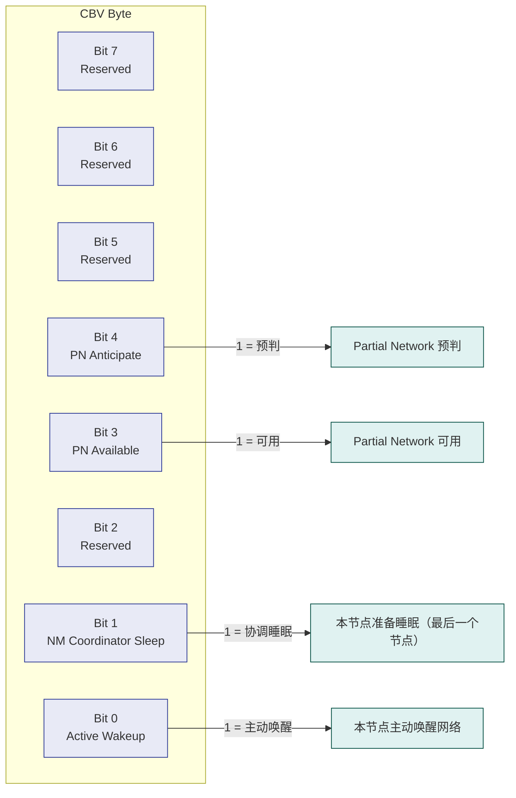

**图解释：** CBV 是 NM 报文中的控制字节，每个 bit 代表不同的网络管理状态：
- **Bit 0 (Active Wakeup)**: 本节点主动唤醒网络，1 表示本节点是唤醒源
- **Bit 1 (NM Coordinator Sleep)**: 协调睡眠标志，最后一个准备睡眠的节点置位此位
- **Bit 3, Bit 4**: 用于 Partial Network 功能，支持选择性唤醒

---

## 8. 状态转换与时间量化关系

### 8.1 状态转换时序图

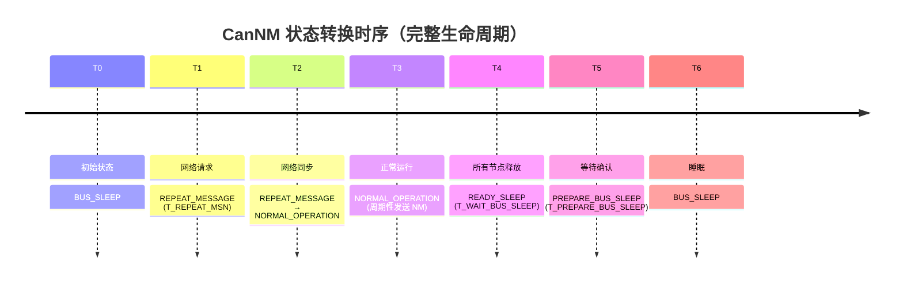

### 8.2 多节点交互时序（完整场景）

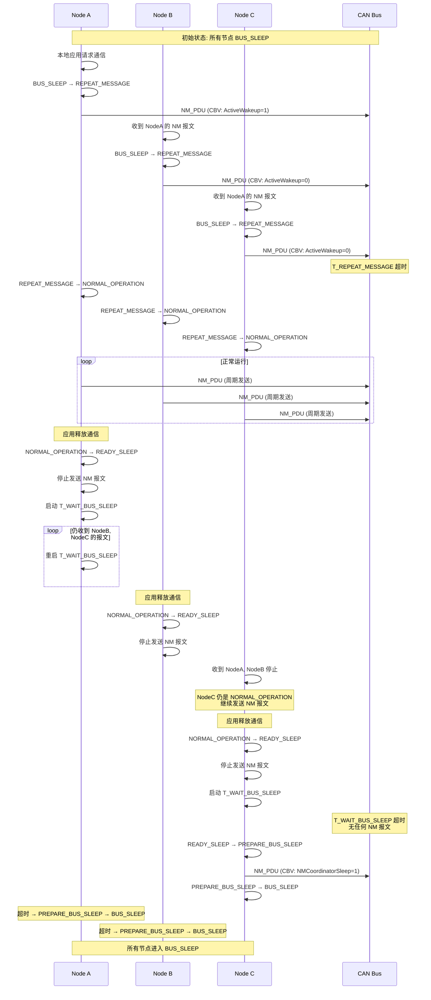

**图解释：** 这是一个完整的多节点交互场景，展示了 AUTOSAR 网络管理的核心设计思想：
1. **主动唤醒**: NodeA 主动唤醒，设置 CBV 的 ActiveWakeup 位
2. **被动唤醒**: NodeB、NodeC 被远程唤醒，不设置 ActiveWakeup 位
3. **同步启动**: 所有节点在 REPEAT_MESSAGE 状态同步后进入 NORMAL_OPERATION
4. **分布式睡眠**: 每个节点独立判断是否进入睡眠
5. **最后一个节点**: NodeC 是最后一个释放通信的节点，它发送 NMCoordinatorSleep 标志
6. **全睡眠**: 所有节点最终进入 BUS_SLEEP

---

## 9. 三模块之间的回调机制

### 9.1 回调链架构

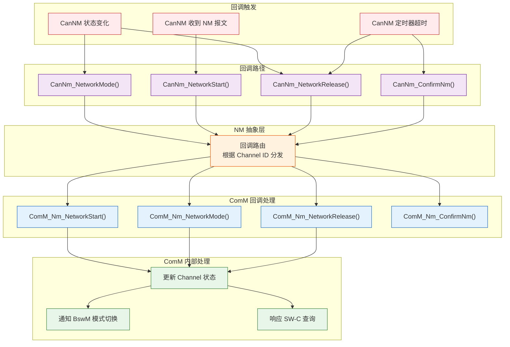

**图解释：** 回调机制是 CanNM → NM → ComM 的反向通知通路。
- CanNM 的状态变化、报文接收、定时器超时都会触发回调
- 回调经过 NM 抽象层路由，最终到达 ComM
- ComM 根据回调更新通道状态，并通知 BswM 进行模式切换

### 9.2 回调函数原型

```c
/* ===== NM 抽象层回调注册（ComM 实现） ===== */

/* 网络启动通知 */
void ComM_Nm_NetworkStart(
    uint8              Channel,     /* 通道 ID */
    Nm_WakeUpSourceType WakeUpSource /* 唤醒源类型 */
);

/* 网络模式通知 */
void ComM_Nm_NetworkMode(
    uint8    Channel,      /* 通道 ID */
    Nm_ModeType Mode       /* 网络模式 */
);

/* 网络释放通知 */
void ComM_Nm_NetworkRelease(
    uint8 Channel          /* 通道 ID */
);

/* NM 报文发送确认 */
void ComM_Nm_ConfirmNm(
    uint8 Channel,         /* 通道 ID */
    uint8* NmPduData,      /* NM 报文数据 */
    uint8 NmPduLength      /* 数据长度 */
);

/* ===== CanNM 的回调函数（NM 抽象层实现） ===== */

/* CanNM 网络模式回调 */
void CanNm_NetworkMode(
    uint8    Channel,          /* 通道 ID */
    CanNm_ModeType CanNm_Mode  /* CanNM 模式 */
);

/* CanNM 网络启动回调 */
void CanNm_NetworkStart(
    uint8              Channel,     /* 通道 ID */
    CanNm_WakeUpSourceType WakeUpSource /* 唤醒源 */
);

/* CanNM 网络释放回调 */
void CanNm_NetworkRelease(
    uint8 Channel          /* 通道 ID */
);
```

---

## 10. BswM 在交互中的角色

### 10.1 BswM 模式仲裁

BswM（Basic Software Mode Manager）在 ComM 和 CanNM 之间扮演 **"仲裁者"** 角色：

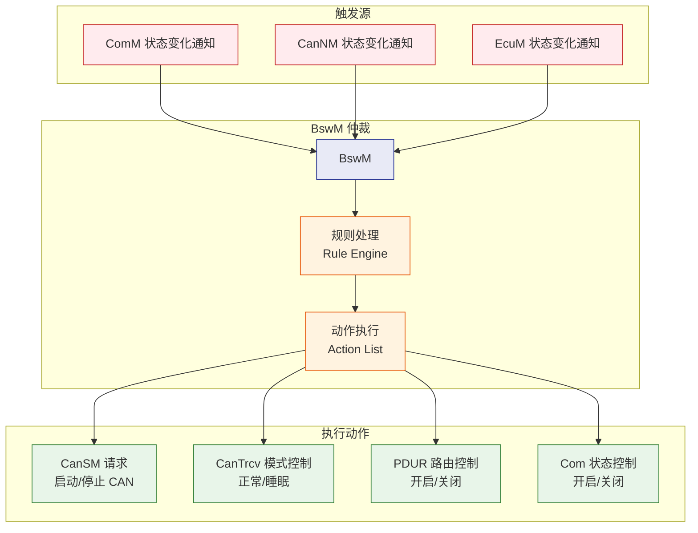

**图解释：** BswM 作为模式仲裁器，接收 ComM 和 CanNM 的状态变化，执行预定义的规则和动作，控制 CAN 协议栈各模块的状态。

### 10.2 完整交互的全景图

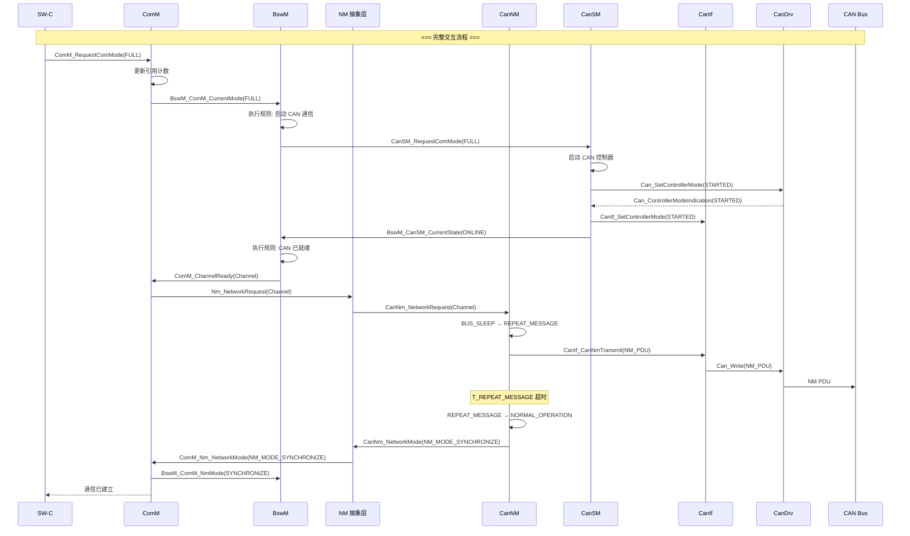

**图解释：** 这是最完整的交互全景图，展示了从 SW-C 请求到 CAN 总线报文发送的完整链路：
1. **SW-C → ComM → BswM → CanSM**: 先启动 CAN 硬件
2. **CanSM → CanDrv → CanIf**: 硬件初始化
3. **BswM → ComM**: 确认硬件就绪
4. **ComM → NM → CanNM**: 启动网络管理
5. **CanNM → CanIf → CanDrv → Bus**: 发送 NM 报文
6. **CanNM → NM → ComM**: 通知网络已就绪

---

## 11. 关键设计模式分析

### 11.1 分层抽象模式

```
┌─────────────────────────────────────┐
│            ComM                     │  ← 不关心底层协议类型
│     (通信管理器，应用层接口)        │
├─────────────────────────────────────┤
│            NM 抽象层                │  ← 适配器，接口标准化
│     (统一接口，协议无关)            │
├─────────────────────────────────────┤
│    CanNM / LinNM / FrNM            │  ← 协议具体实现
│     (CAN / LIN / FlexRay 实现)      │
└─────────────────────────────────────┘
```

**设计思路：** 这种分层结构体现了 **"依赖倒置原则"**——高层模块（ComM）不依赖于低层模块（CanNM），而是依赖于抽象（NM 接口）。低层模块也依赖于同一个抽象。这使得：
- 更换通信协议（CAN → LIN → FlexRay）时，ComM 完全不需要修改
- 新增协议支持时，只需要实现 NM 抽象层定义的接口

### 11.2 观察者模式（回调机制）

```c
/* 观察者模式实现 - 回调注册 */
typedef struct {
    /* ComM 注册的回调函数指针 */
    void (*NetworkStart)(uint8 Channel, Nm_WakeUpSourceType WakeUpSource);
    void (*NetworkMode)(uint8 Channel, Nm_ModeType Mode);
    void (*NetworkRelease)(uint8 Channel);
} Nm_ComMCallbacksType;

/* NM 抽象层维护回调表 */
static const Nm_ComMCallbacksType* Nm_ComMCallbacks = NULL;

/* ComM 注册回调 */
void Nm_InitComMCallbacks(const Nm_ComMCallbacksType* Callbacks) {
    Nm_ComMCallbacks = Callbacks;
}

/* CanNM 触发回调时，NM 抽象层调用 ComM 注册的函数 */
void CanNm_NetworkMode(uint8 Channel, CanNm_ModeType CanNm_Mode) {
    /* NM 抽象层内部处理 */
    /* ... */

    /* 调用 ComM 注册的回调 */
    if (Nm_ComMCallbacks != NULL && Nm_ComMCallbacks->NetworkMode != NULL) {
        Nm_ComMCallbacks->NetworkMode(Channel, (Nm_ModeType)CanNm_Mode);
    }
}
```

**代码解释：** 观察者模式在 AUTOSAR NM 中的应用：
- ComM 是 **观察者**，向 NM 注册回调函数
- CanNM 是 **被观察者**，状态变化时通知 NM
- NM 抽象层是 **事件分发器**，将 CanNM 的通知转发给 ComM
- 这种方式实现了模块间的 **松耦合**

### 11.3 引用计数模式（ComM 用户管理）

```c
/* 引用计数模式 - ComM 用户管理 */
typedef struct {
    uint8  ChannelId;
    uint16 ActiveUsers;       /* 位图: 每个 bit 代表一个用户 */
    uint8  FullCommCount;     /* FULL 通信请求计数 */
    uint8  SilentCommCount;   /* SILENT 通信请求计数 */
    ComM_ModeType CurrentMode;/* 当前通信模式 */
} ComM_ChannelControlType;

/* 请求通信 */
Std_ReturnType ComM_RequestComMode(uint8 ChannelId, ComM_ModeType ComMode) {
    ComM_ChannelControlType* ch = &ComM_Channels[ChannelId];

    /* 增加引用计数 */
    if (ComMode == COMM_FULL_COMMUNICATION) {
        if (ch->FullCommCount == 0) {
            /* 第一次请求 FULL，需要启动网络 */
            Nm_NetworkRequest(ChannelId);
        }
        ch->FullCommCount++;
    }

    /* 计算目标模式 */
    ComM_ModeType targetMode = ComM_CalculateTargetMode(ch);

    /* 如果需要切换状态 */
    if (targetMode != ch->CurrentMode) {
        ComM_SwitchMode(ChannelId, targetMode);
    }

    return E_OK;
}

/* 释放通信 */
Std_ReturnType ComM_RequestComMode(uint8 ChannelId, ComM_ModeType ComMode) {
    ComM_ChannelControlType* ch = &ComM_Channels[ChannelId];

    if (ComMode == COMM_FULL_COMMUNICATION) {
        if (ch->FullCommCount > 0) {
            ch->FullCommCount--;
        }
        if (ch->FullCommCount == 0) {
            /* 最后一个用户释放 FULL，释放网络 */
            Nm_NetworkRelease(ChannelId);
        }
    }

    /* 计算目标模式并切换 */
    ComM_ModeType targetMode = ComM_CalculateTargetMode(ch);
    if (targetMode != ch->CurrentMode) {
        ComM_SwitchMode(ChannelId, targetMode);
    }

    return E_OK;
}
```

**代码解释：** 引用计数模式确保：
- 多个 SW-C 可以同时请求通信，互不干扰
- 只有最后一个用户释放时，网络才会开始关闭流程
- 避免网络频繁启动/关闭（**防抖动**）

---

## 12. 典型应用场景与配置示例

### 12.1 场景：CAN 节点网络管理配置

```c
/* ===== CanNM 配置示例 ===== */
const CanNm_ConfigType CanNm_ConfigData = {
    /* 通道配置 */
    .CanNmChannelConfig = {
        .CanNmChannelIndex = 0,              /* 通道索引 */
        .CanNmNodeId = 0x01,                 /* 节点 ID (0x01) */
        .CanNmPduId = 0,                     /* NM PDU ID */
        .CanNmPduNMRxId = 0x501,             /* NM 接收 ID (Base 0x500 + Node) */
        .CanNmPduNMTxId = 0x501,             /* NM 发送 ID (Base 0x500 + Node) */

        /* 定时器配置 */
        .CanNmRepeatMessageTime = 500,       /* T_REPEAT_MESSAGE = 500ms */
        .CanNmWaitBusSleepTime = 2000,       /* T_WAIT_BUS_SLEEP = 2000ms */
        .CanNmPrepareBusSleepTime = 500,     /* T_PREPARE_BUS_SLEEP = 500ms */
        .CanNmMsgCycleTime = 100,            /* T_NM_Tx = 100ms */
        .CanNmMsgTimeoutTime = 500,          /* T_NM_Timeout = 500ms */

        /* 功能配置 */
        .CanNmActiveWakeupTxEnabled = TRUE,  /* 允许主动唤醒发送 */
        .CanNmPassiveWakeupEnabled = TRUE,   /* 允许被动唤醒 */
        .CanNmCoordinatorSleep = TRUE,       /* 支持协调睡眠 */
        .CanNmPartialNetworkEnabled = FALSE, /* 不启用 Partial Network */
    }
};

/* ===== ComM 配置示例 ===== */
const ComM_ConfigType ComM_ConfigData = {
    .ComMChannel = {
        .ComMChannelId = 0,                  /* 通道 ID */
        .ComMChannelNm = TRUE,               /* 支持 NM */
        .ComMChannelNmIf = NM_IF_CAN,        /* NM 接口类型: CAN */
        .ComMChannelNmChannelIndex = 0,       /* NM 通道索引 */
        .ComMUserList = {
            .ComMUser = {
                { .ComMUserId = 0, .ComMUserDefaultMode = COMM_NO_COMMUNICATION },
                { .ComMUserId = 1, .ComMUserDefaultMode = COMM_NO_COMMUNICATION },
                { .ComMUserId = 2, .ComMUserDefaultMode = COMM_NO_COMMUNICATION },
            }
        }
    }
};
```

### 12.2 场景：OSEK 直接网络管理 vs AUTOSAR NM

| 特性 | OSEK 直接 NM | AUTOSAR NM |
|------|-------------|------------|
| **架构** | 单体 NM | 分层：ComM / NM / CanNM |
| **报文格式** | 固定的"ID 环"令牌传递 | 基于 CBV 的分布式协调 |
| **唤醒机制** | 令牌传递唤醒 | 报文唤醒 + 选择性唤醒 |
| **睡眠机制** | 所有节点同步睡眠 | 分布式睡眠，独立决策 |
| **扩展性** | 固定节点数 | 动态节点，支持 Partial Network |
| **复杂度** | 低 | 中高 |

---

## 13. 常见问题 FAQ

### Q1: 为什么 ComM 需要 BswM 才能启动 CAN 通信？

**A:** ComM 只负责"通信需求管理"，不负责"硬件控制"。启动 CAN 控制器需要：
- CanSM 管理 CAN 控制器的状态机
- BswM 仲裁多个条件（EcuM 状态、ComM 状态、CanSM 状态）
- 这种分离使得模式管理更加灵活和可配置

### Q2: NM 抽象层是否必须？

**A:** 在 AUTOSAR 4.0+ 中，NM 抽象层是必需的。它提供了：
- 统一的 API 接口
- 多个 NM 通道的路由管理
- 唤醒源类型转换
- 即使只有一个 CAN 网络，NM 抽象层也提供了标准化接口

### Q3: T_WAIT_BUS_SLEEP 和 T_PREPARE_BUS_SLEEP 有什么区别？

**A:**
- **T_WAIT_BUS_SLEEP**: 等待总线上所有节点停止发送 NM 报文。这是"分布式协商"阶段，判断是否可以安全睡眠
- **T_PREPARE_BUS_SLEEP**: 准备进入睡眠的最后阶段。这是"最后确认"阶段，协调睡眠节点发送最终标志

### Q4: 多个节点同时请求网络启动会怎样？

**A:** 这是完全正常的情况：
1. 每个节点独立从 BUS_SLEEP → REPEAT_MESSAGE
2. 在 REPEAT_MESSAGE 状态下，它们通过 NM 报文互相感知
3. 所有节点在 T_REPEAT_MESSAGE 超时后进入 NORMAL_OPERATION
4. 网络同步完成，无需任何中心协调器

### Q5: 如果节点在 NORMAL_OPERATION 状态下突然掉电？

**A:** 这种场景被称为"突发离线"：
1. 其他节点在 T_NM_Timeout 超时后检测到该节点离线
2. 如果还有至少一个节点在 NORMAL_OPERATION，网络继续保持
3. 如果所有节点都离线，经过 T_WAIT_BUS_SLEEP → T_PREPARE_BUS_SLEEP 后进入 BUS_SLEEP
4. 断线节点重新上电后，通过 REPEAT_MESSAGE 重新加入网络

---

## 14. 总结

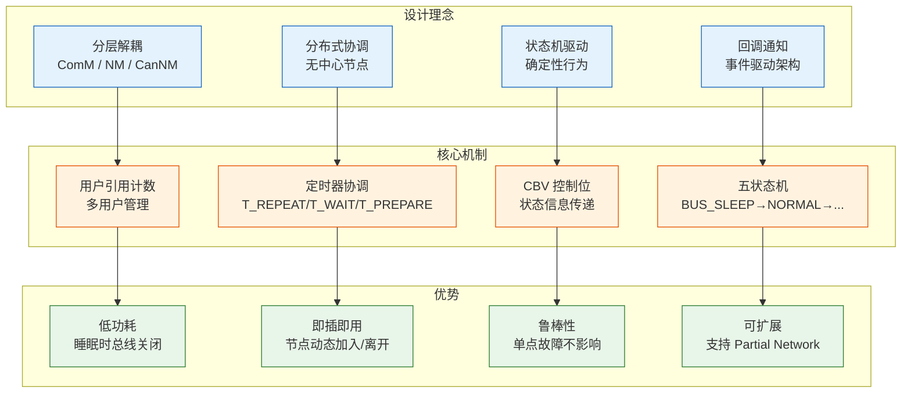

**关键总结：**
1. **ComM** 负责通信需求管理，以引用计数方式协调多个用户的请求
2. **NM 抽象层** 提供协议无关的统一接口，实现适配器模式
3. **CanNM** 实现具体的 CAN 网络管理协议，包含 5 状态状态机
4. **交互方式** 是双向的：上层通过 API 调用下发指令，下层通过回调通知上层
5. **核心设计理念** 是分布式协调，没有中心节点，每个节点独立决策
6. **睡眠机制** 通过 T_WAIT_BUS_SLEEP 和 T_PREPARE_BUS_SLEEP 两级定时器确保安全睡眠