# ComM、NM、CanNM 网络管理状态机交互详解

> 本文聚焦于**网络管理状态机**的每个状态及状态间跳转时，ComM、NM、CanNM 三个模块之间的**精确交互时序**，是对上一篇《ComM_NM_CanNM_交互详解》的深化和补充。

---

## 1. 三模块状态机总览

### 1.1 三模块状态机对比

```mermaid
graph TB
    subgraph ComM 状态机
        CM_NO["COMM_NO_COMMUNICATION<br/>无通信"]
        CM_SILENT["COMM_SILENT_COMMUNICATION<br/>静默通信"]
        CM_FULL["COMM_FULL_COMMUNICATION<br/>全功能通信"]
        CM_NO -->|"请求通信"| CM_SILENT
        CM_NO -->|"请求通信"| CM_FULL
        CM_SILENT -->|"升级请求"| CM_FULL
        CM_FULL -->|"降级/释放"| CM_SILENT
        CM_FULL -->|"释放"| CM_NO
        CM_SILENT -->|"释放"| CM_NO
    end

    subgraph NM 抽象层状态
        NM_IDLE["NM_STATE_IDLE<br/>空闲"]
        NM_SYNC["NM_STATE_SYNCHRONIZE<br/>同步"]
        NM_ACTIVE["NM_STATE_ACTIVE<br/>活跃"]
        NM_IDLE --> NM_SYNC
        NM_SYNC --> NM_ACTIVE
        NM_ACTIVE --> NM_IDLE
    end

    subgraph CanNM 状态机
        BS["BUS_SLEEP<br/>总线睡眠"]
        PBS["PREPARE_BUS_SLEEP<br/>准备总线睡眠"]
        RS["READY_SLEEP<br/>准备睡眠"]
        RM["REPEAT_MESSAGE<br/>重复消息"]
        NO["NORMAL_OPERATION<br/>正常运行"]
        BS --> RM
        BS --> PBS
        PBS --> BS
        PBS --> RS
        RS --> RM
        RS --> NO
        RM --> NO
        RM --> RS
        NO --> RS
    end

    classDef comm fill:#e3f2fd,stroke:#1565c0
    classDef nm fill:#fff3e0,stroke:#e65100
    classDef cannm fill:#f3e5f5,stroke:#4a148c

    class CM_NO,CM_SILENT,CM_FULL comm
    class NM_IDLE,NM_SYNC,NM_ACTIVE nm
    class BS,PBS,RS,RM,NO cannm
```

**图解释：** 三模块各有自己的状态机，但它们是**联动的**：
- **ComM 状态机**：3 个状态，关注通信模式（NO / SILENT / FULL）
- **NM 抽象层状态机**：3 个状态，关注网络状态（IDLE / SYNCHRONIZE / ACTIVE）
- **CanNM 状态机**：5 个状态，关注 NM 协议状态（SLEEP / PBS / RS / RM / NO）

### 1.2 状态对应关系

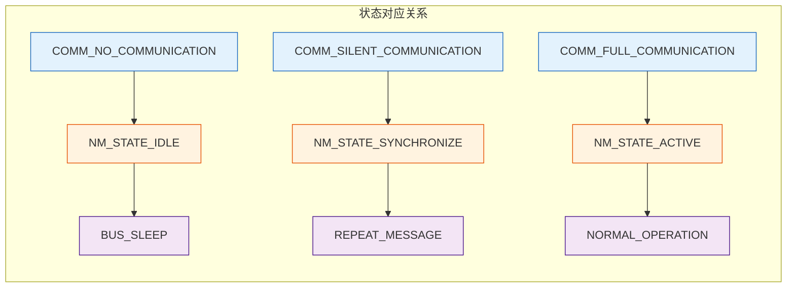

**图解释：** 一般情况下，三模块的状态存在典型的对应关系：
- **NO_COMMUNICATION ↔ NM_IDLE ↔ BUS_SLEEP**：完全无通信
- **SILENT_COMMUNICATION ↔ NM_SYNCHRONIZE ↔ REPEAT_MESSAGE**：同步阶段
- **FULL_COMMUNICATION ↔ NM_ACTIVE ↔ NORMAL_OPERATION**：正常运行

但也有非对应的情况（如 READY_SLEEP 时 ComM 可能还是 FULL_COMMUNICATION），这正是精妙之处。

---

## 2. 每个 CanNM 状态下的三模块交互细节

### 2.1 BUS_SLEEP 状态（总线睡眠）

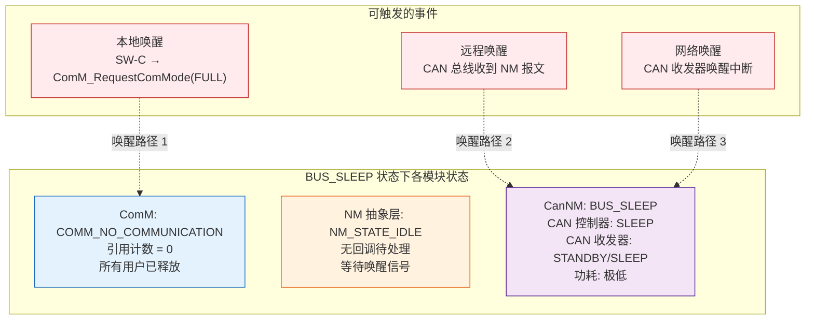

**图解释：** BUS_SLEEP 状态下，三模块的交互特点是"静默待命"：
- **ComM** 处于 NO_COMMUNICATION，所有用户已释放，不发送任何请求
- **NM 抽象层** 处于 IDLE，等待 CanNM 的唤醒回调
- **CanNM** 处于 BUS_SLEEP，CAN 控制器和收发器处于低功耗模式

**关键代码：BUS_SLEEP 状态的处理**

```c
/* CanNM BUS_SLEEP 状态的主循环处理 */
void CanNm_MainFunction(void) {
    switch (CanNm_State) {
        case CANNM_BUS_SLEEP:
            /* 检查远程唤醒（CAN 总线活动） */
            if (CanNm_CheckWakeupEvent()) {
                /* 远程唤醒事件 */
                CanNm_State = CANNM_REPEAT_MESSAGE;
                CanNm_WakeupSource = CANNM_WAKEUP_REMOTE;

                /* 通知 NM 抽象层 → 通知 ComM */
                CanNm_NetworkStart(CanNm_Channel, CanNm_WakeupSource);
                /* 路径: CanNm → Nm_CanNmNetworkStart → ComM_Nm_NetworkStart */

                /* 启动重复消息定时器 */
                CanNm_StartTimer(CANNM_TIMER_REPEAT_MESSAGE,
                                 CanNm_Config->CanNmRepeatMessageTime);
            }

            /* 检查本地唤醒（ComM 请求） */
            if (CanNm_LocalWakeupRequest) {
                CanNm_LocalWakeupRequest = FALSE;
                CanNm_State = CANNM_REPEAT_MESSAGE;
                CanNm_WakeupSource = CANNM_WAKEUP_LOCAL;

                /* 通知 NM 抽象层 → 通知 ComM */
                CanNm_NetworkStart(CanNm_Channel, CanNm_WakeupSource);

                /* 启动重复消息定时器 */
                CanNm_StartTimer(CANNM_TIMER_REPEAT_MESSAGE,
                                 CanNm_Config->CanNmRepeatMessageTime);
            }

            /* 检查 CanSM 是否请求总线睡眠 */
            if (CanNm_CanSMMode == CANSM_SLEEP) {
                CanNm_State = CANNM_PREPARE_BUS_SLEEP;
                CanNm_StartTimer(CANNM_TIMER_PREPARE_BUS_SLEEP,
                                 CanNm_Config->CanNmPrepareBusSleepTime);
            }
            break;

        /* 其他状态... */
    }
}
```

**代码解释：** BUS_SLEEP 状态的处理逻辑：
1. 不断检查是否有唤醒事件（远程唤醒来自 CAN 总线，本地唤醒来自 ComM 请求）
2. 一旦检测到唤醒，立即跳转到 REPEAT_MESSAGE 状态
3. 通过 `CanNm_NetworkStart()` 回调链通知上层（NM → ComM）
4. 如果是 CanSM 请求的睡眠，则进入 PREPARE_BUS_SLEEP

### 2.2 REPEAT_MESSAGE 状态（重复消息）

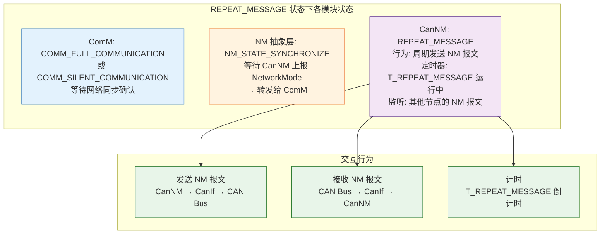

**图解释：** REPEAT_MESSAGE 是网络启动的"宣告阶段"：
- **CanNM** 周期性发送 NM 报文，向网络宣告自己的存在
- **NM 抽象层** 处于 SYNCHRONIZE 状态，等待 CanNM 上报网络模式
- **ComM** 已经处于 FULL/SILENT 通信模式，但还在等待网络同步完成的确认

**关键代码：REPEAT_MESSAGE 状态的处理**

```c
/* CanNM REPEAT_MESSAGE 状态的处理 */
void CanNm_MainFunction(void) {
    switch (CanNm_State) {
        case CANNM_REPEAT_MESSAGE:
            /* 1. 发送 NM 报文（周期性） */
            if (CanNm_IsTxTimerExpired()) {
                CanNm_TransmitNmPdu();  /* 发送 NM 报文到 CAN 总线 */
                CanNm_RestartTimer(CANNM_TIMER_TX,
                                   CanNm_Config->CanNmMsgCycleTime);
            }

            /* 2. 处理接收到的 NM 报文 */
            if (CanNm_IsRxPduAvailable()) {
                CanNm_ProcessRxNmPdu();
                /* 存储接收到的节点信息 */
                CanNm_UpdateNodeRegistry(CanNm_GetRxNodeId());
                /* 重启 NM 超时定时器 */
                CanNm_RestartTimer(CANNM_TIMER_NM_TIMEOUT,
                                   CanNm_Config->CanNmMsgTimeoutTime);
            }

            /* 3. T_REPEAT_MESSAGE 超时 → 进入 NORMAL_OPERATION */
            if (CanNm_IsTimerExpired(CANNM_TIMER_REPEAT_MESSAGE)) {
                CanNm_State = CANNM_NORMAL_OPERATION;

                /* 通知 NM 抽象层 → 通知 ComM：网络已同步 */
                CanNm_NetworkMode(CanNm_Channel, CANNM_NM_MODE_SYNCHRONIZE);
                /* 路径: CanNm → Nm_CanNmNetworkMode → ComM_Nm_NetworkMode */

                /* 启动 NORMAL_OPERATION 的发送定时器 */
                CanNm_StartTimer(CANNM_TIMER_TX,
                                 CanNm_Config->CanNmMsgCycleTime);
            }

            /* 4. 检查是否有网络释放请求 */
            if (CanNm_NetworkReleaseRequest) {
                CanNm_NetworkReleaseRequest = FALSE;
                CanNm_State = CANNM_READY_SLEEP;

                /* 停止发送 NM 报文 */
                CanNm_StopTimer(CANNM_TIMER_TX);

                /* 启动等待总线睡眠定时器 */
                CanNm_StartTimer(CANNM_TIMER_WAIT_BUS_SLEEP,
                                 CanNm_Config->CanNmWaitBusSleepTime);
            }
            break;

        /* 其他状态... */
    }
}
```

**代码解释：** REPEAT_MESSAGE 状态的处理逻辑：
1. **周期性发送 NM 报文**：按照 T_NM_Tx 周期发送，让其他节点感知到本节点
2. **接收处理**：处理其他节点发来的 NM 报文，记录节点信息，重启超时定时器
3. **T_REPEAT_MESSAGE 超时**：定时器超时后，进入 NORMAL_OPERATION，并通过 `CanNm_NetworkMode()` 回调通知上层
4. **网络释放**：如果收到 ComM 的释放请求，停止发送并进入 READY_SLEEP

### 2.3 NORMAL_OPERATION 状态（正常运行）

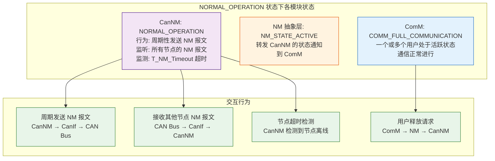

**关键代码：NORMAL_OPERATION 状态的处理**

```c
/* CanNM NORMAL_OPERATION 状态的处理 */
void CanNm_MainFunction(void) {
    switch (CanNm_State) {
        case CANNM_NORMAL_OPERATION:
            /* 1. 周期性发送 NM 报文 */
            if (CanNm_IsTxTimerExpired()) {
                /* 构建 CBV */
                uint8 cbv = CanNm_BuildControlBitVector();

                /* 发送 NM 报文 */
                CanNm_TransmitNmPduWithCBV(cbv);
                CanNm_RestartTimer(CANNM_TIMER_TX,
                                   CanNm_Config->CanNmMsgCycleTime);
            }

            /* 2. 处理接收到的 NM 报文 */
            if (CanNm_IsRxPduAvailable()) {
                CanNm_ProcessRxNmPdu();
                CanNm_RestartTimer(CANNM_TIMER_NM_TIMEOUT,
                                   CanNm_Config->CanNmMsgTimeoutTime);
            }

            /* 3. 检查 NM 超时（其他节点可能离线） */
            if (CanNm_IsTimerExpired(CANNM_TIMER_NM_TIMEOUT)) {
                /* 检测到其他节点超时，记录日志 */
                CanNm_NodeTimeoutIndication();
                /* 注意：NORMAL_OPERATION 状态下节点超时不会导致状态切换 */
                /* 只要还有至少一个节点在发送 NM 报文，网络就保持活跃 */
            }

            /* 4. 处理网络释放请求 */
            if (CanNm_NetworkReleaseRequest) {
                CanNm_NetworkReleaseRequest = FALSE;
                CanNm_State = CANNM_READY_SLEEP;

                /* 停止发送 NM 报文 */
                CanNm_StopTimer(CANNM_TIMER_TX);

                /* 启动等待总线睡眠定时器 */
                CanNm_StartTimer(CANNM_TIMER_WAIT_BUS_SLEEP,
                                 CanNm_Config->CanNmWaitBusSleepTime);

                /* 通知 NM 抽象层：网络开始释放 */
                /* 注意：此时不立即通知 ComM，而是等待 READY_SLEEP 超时后 */
            }
            break;

        /* 其他状态... */
    }
}

/* 构建 CBV 控制位向量 */
uint8 CanNm_BuildControlBitVector(void) {
    uint8 cbv = 0;

    /* 设置 Active Wakeup 位 */
    if (CanNm_WakeupSource == CANNM_WAKEUP_LOCAL) {
        cbv |= CANNM_CBV_ACTIVE_WAKEUP;  /* Bit 0 */
    }

    /* 设置协调睡眠位 */
    if (CanNm_IsCoordinatorSleepReady()) {
        cbv |= CANNM_CBV_COORDINATOR_SLEEP;  /* Bit 1 */
    }

    return cbv;
}
```

**代码解释：** NORMAL_OPERATION 状态下：
1. **周期发送**：持续发送 NM 报文，携带 CBV 控制位，告知其他节点自己的状态
2. **接收监测**：监听其他节点的 NM 报文，重启 T_NM_Timeout 定时器
3. **节点超时**：检测到其他节点超时只记录日志，不会导致状态切换（网络依然活跃）
4. **释放处理**：收到释放请求后停止发送，进入 READY_SLEEP

### 2.4 READY_SLEEP 状态（准备睡眠）

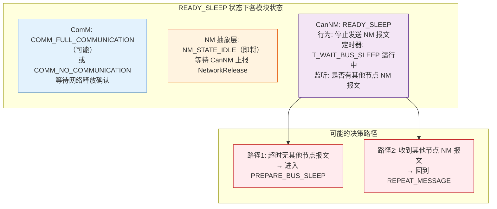

**图解释：** READY_SLEEP 是"观察期"状态：
- **CanNM 停止发送** NM 报文，但保持接收
- 如果 **T_WAIT_BUS_SLEEP** 超时且没有收到任何 NM 报文 → 说明自己是最后一个节点，可以安全进入 PREPARE_BUS_SLEEP
- 如果 **收到其他节点的 NM 报文** → 说明网络还有其他活跃节点，回到 REPEAT_MESSAGE
- **ComM 可能还处于 FULL_COMMUNICATION**（如果其他用户还在请求）

**关键代码：READY_SLEEP 状态的处理**

```c
/* CanNM READY_SLEEP 状态的处理 */
void CanNm_MainFunction(void) {
    switch (CanNm_State) {
        case CANNM_READY_SLEEP:
            /* 1. 检查是否收到其他节点的 NM 报文 */
            if (CanNm_IsRxPduAvailable()) {
                CanNm_ProcessRxNmPdu();

                /* 有网络活动！回到 REPEAT_MESSAGE */
                CanNm_State = CANNM_REPEAT_MESSAGE;

                /* 停止 T_WAIT_BUS_SLEEP 定时器 */
                CanNm_StopTimer(CANNM_TIMER_WAIT_BUS_SLEEP);

                /* 启动 T_REPEAT_MESSAGE 定时器 */
                CanNm_StartTimer(CANNM_TIMER_REPEAT_MESSAGE,
                                 CanNm_Config->CanNmRepeatMessageTime);

                /* 恢复发送 NM 报文 */
                CanNm_StartTimer(CANNM_TIMER_TX,
                                 CanNm_Config->CanNmMsgCycleTime);

                /* 通知 NM 抽象层 → 通知 ComM：网络重新激活 */
                CanNm_NetworkMode(CanNm_Channel, CANNM_NM_MODE_SYNCHRONIZE);
                /* 路径: CanNm → Nm_CanNmNetworkMode → ComM_Nm_NetworkMode */
            }

            /* 2. T_WAIT_BUS_SLEEP 超时 → 进入 PREPARE_BUS_SLEEP */
            if (CanNm_IsTimerExpired(CANNM_TIMER_WAIT_BUS_SLEEP)) {
                CanNm_State = CANNM_PREPARE_BUS_SLEEP;

                /* 启动 T_PREPARE_BUS_SLEEP 定时器 */
                CanNm_StartTimer(CANNM_TIMER_PREPARE_BUS_SLEEP,
                                 CanNm_Config->CanNmPrepareBusSleepTime);

                /* 通知 NM 抽象层 → 通知 ComM：网络释放开始 */
                CanNm_NetworkRelease(CanNm_Channel);
                /* 路径: CanNm → Nm_CanNmNetworkRelease → ComM_Nm_NetworkRelease */
            }
            break;

        /* 其他状态... */
    }
}
```

**代码解释：** READY_SLEEP 状态的核心逻辑是"观望并决策"：
1. **收到报文 → 回到 REPEAT_MESSAGE**：检测到其他节点还在发送，说明网络不能关闭
2. **超时 → PREPARE_BUS_SLEEP**：T_WAIT_BUS_SLEEP 超时，说明无其他节点活跃，可以安全地开始睡眠流程
3. 在进入 PREPARE_BUS_SLEEP 时，才通过 `CanNm_NetworkRelease()` 通知上层网络已释放

### 2.5 PREPARE_BUS_SLEEP 状态（准备总线睡眠）

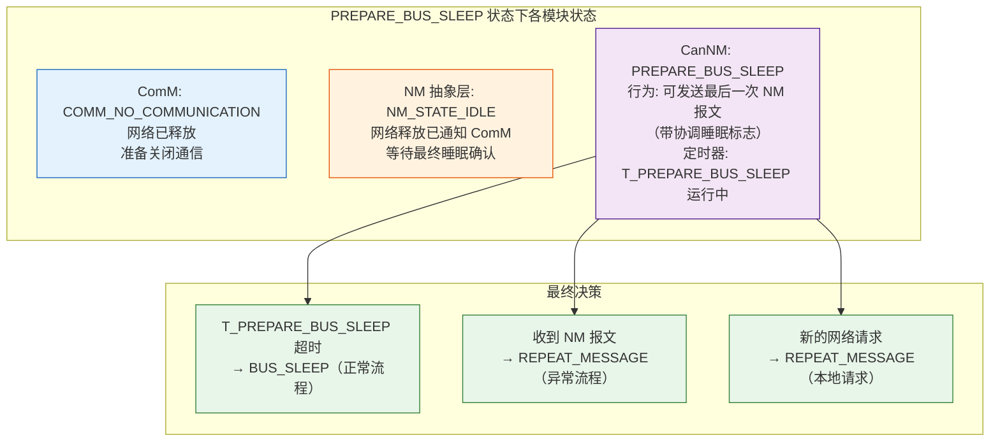

**图解释：** PREPARE_BUS_SLEEP 是进入睡眠前的"最后确认"阶段：
- **CanNM** 可以发送最后一次 NM 报文（带 NMCoordinatorSleep 标志），通知其他节点"我要睡了"
- 这是网络进入睡眠前的最后一道屏障
- 如果收到新的 NM 报文或新的网络请求，会立即回到 REPEAT_MESSAGE

**关键代码：PREPARE_BUS_SLEEP 状态的处理**

```c
/* CanNM PREPARE_BUS_SLEEP 状态的处理 */
void CanNm_MainFunction(void) {
    switch (CanNm_State) {
        case CANNM_PREPARE_BUS_SLEEP:
            /* 1. 发送最后一次 NM 报文（带协调睡眠标志） */
            if (CanNm_IsFirstEntry()) {
                CanNm_ClearFirstEntryFlag();

                /* 构建 CBV：设置协调睡眠位 */
                uint8 cbv = CANNM_CBV_COORDINATOR_SLEEP;  /* Bit 1 = 1 */

                /* 发送最后一次 NM 报文 */
                CanNm_TransmitNmPduWithCBV(cbv);
                /* 这是进入睡眠前的最后一次广播 */
            }

            /* 2. 检查是否收到其他节点的 NM 报文 */
            if (CanNm_IsRxPduAvailable()) {
                CanNm_ProcessRxNmPdu();

                /* 有新的网络活动，回到 REPEAT_MESSAGE */
                CanNm_State = CANNM_REPEAT_MESSAGE;
                CanNm_StopTimer(CANNM_TIMER_PREPARE_BUS_SLEEP);
                CanNm_StartTimer(CANNM_TIMER_REPEAT_MESSAGE,
                                 CanNm_Config->CanNmRepeatMessageTime);
                CanNm_StartTimer(CANNM_TIMER_TX,
                                 CanNm_Config->CanNmMsgCycleTime);

                /* 通知上层网络重新激活 */
                CanNm_NetworkMode(CanNm_Channel, CANNM_NM_MODE_SYNCHRONIZE);
            }

            /* 3. 检查新的本地网络请求 */
            if (CanNm_LocalWakeupRequest) {
                CanNm_LocalWakeupRequest = FALSE;
                CanNm_State = CANNM_REPEAT_MESSAGE;
                CanNm_StopTimer(CANNM_TIMER_PREPARE_BUS_SLEEP);
                CanNm_StartTimer(CANNM_TIMER_REPEAT_MESSAGE,
                                 CanNm_Config->CanNmRepeatMessageTime);
                CanNm_StartTimer(CANNM_TIMER_TX,
                                 CanNm_Config->CanNmMsgCycleTime);

                CanNm_NetworkMode(CanNm_Channel, CANNM_NM_MODE_SYNCHRONIZE);
            }

            /* 4. T_PREPARE_BUS_SLEEP 超时 → 进入 BUS_SLEEP */
            if (CanNm_IsTimerExpired(CANNM_TIMER_PREPARE_BUS_SLEEP)) {
                CanNm_State = CANNM_BUS_SLEEP;

                /* 请求 CanSM 进入睡眠模式 */
                CanNm_RequestCanSMMode(CANSM_SLEEP);

                /* 无需通知上层，ComM 已经知晓网络已释放 */
                /* 进入低功耗模式 */
                CanNm_EnterLowPowerMode();
            }
            break;

        /* 其他状态... */
    }
}
```

**代码解释：** PREPARE_BUS_SLEEP 是进入 BUS_SLEEP 前的最后一步：
1. **最后一次广播**：发送带 CoordinatorSleep 标志的 NM 报文，告知其他节点
2. **检查逆向事件**：收到 NM 报文或新的网络请求 → 回到 REPEAT_MESSAGE
3. **进入睡眠**：T_PREPARE_BUS_SLEEP 超时后进入 BUS_SLEEP，请求 CanSM 关闭控制器

---

## 3. 状态机跳转时的三模块交互时序

### 3.1 BUS_SLEEP → REPEAT_MESSAGE（网络唤醒）

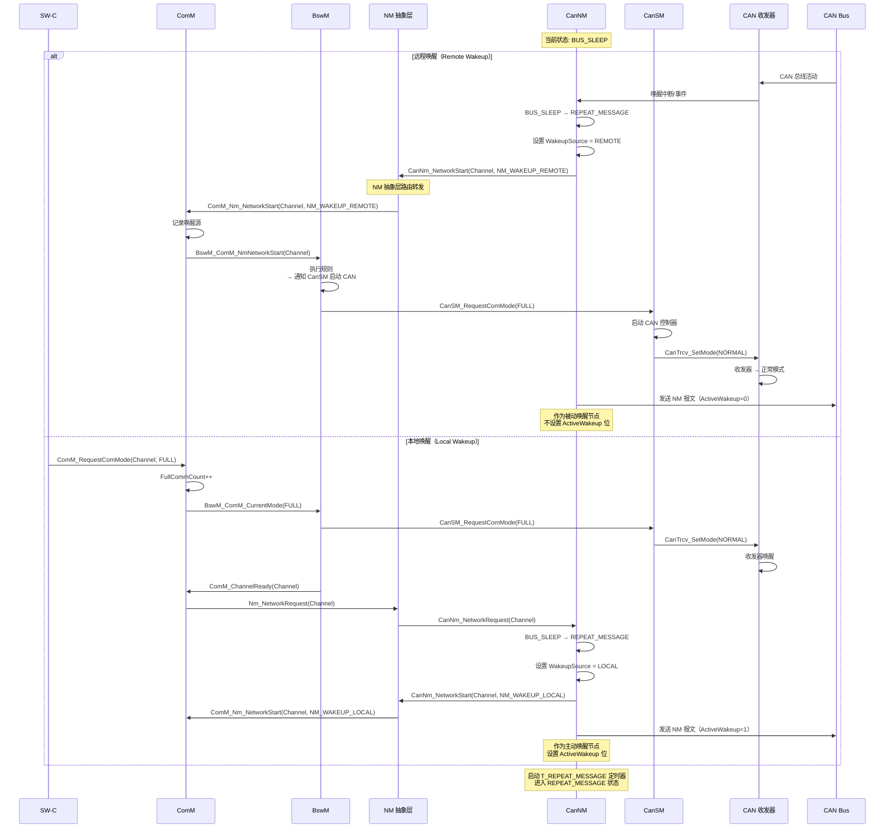

**图解释：** BUS_SLEEP → REPEAT_MESSAGE 的两种唤醒路径：
- **远程唤醒**：CAN 总线活动 → 收发器中断 → CanNM 检测 → 通过 NM → ComM 通知 → BswM 启动 CAN 控制器
- **本地唤醒**：SW-C 请求 → ComM → BswM → CanSM 启动控制器 → ComM → NM → CanNM 唤醒

**关键区别**：远程唤醒时 CanNM 的 CBV 中 ActiveWakeup=0，本地唤醒时 ActiveWakeup=1。

### 3.2 REPEAT_MESSAGE → NORMAL_OPERATION（网络同步完成）

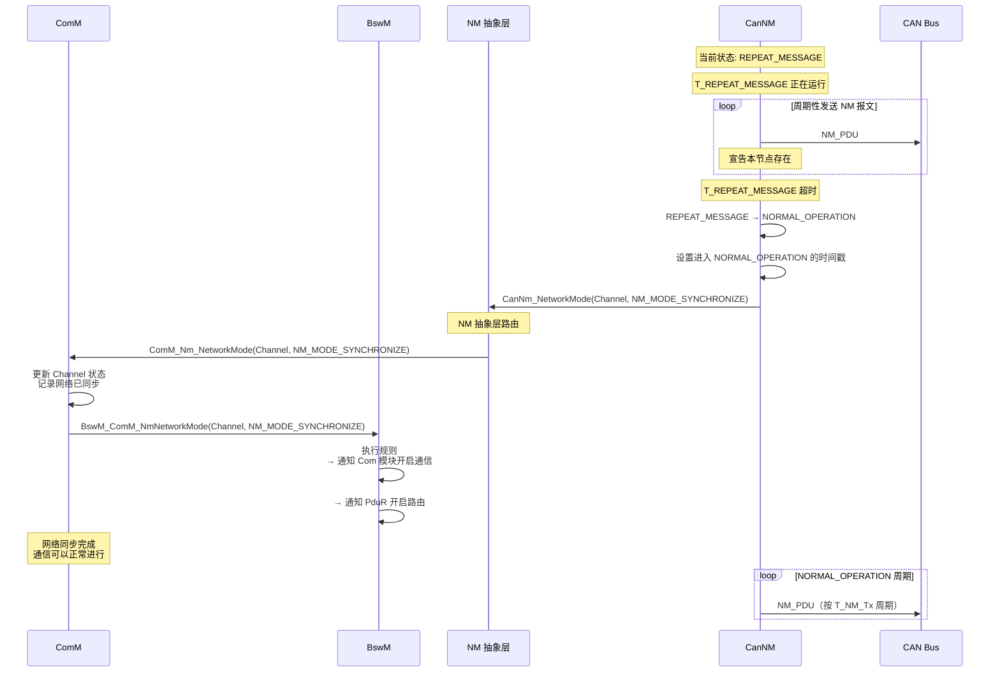

**图解释：** REPEAT_MESSAGE → NORMAL_OPERATION 的转换：
1. **T_REPEAT_MESSAGE 超时**：CanNM 判定网络同步阶段结束
2. **CanNM 切换状态**：进入 NORMAL_OPERATION
3. **回调通知**：`CanNm_NetworkMode(NM_MODE_SYNCHRONIZE)` → NM → ComM
4. **ComM 更新**：记录网络已同步，通知 BswM
5. **BswM 执行动作**：开启 Com 模块通信、PduR 路由等

### 3.3 NORMAL_OPERATION → READY_SLEEP（开始睡眠流程）

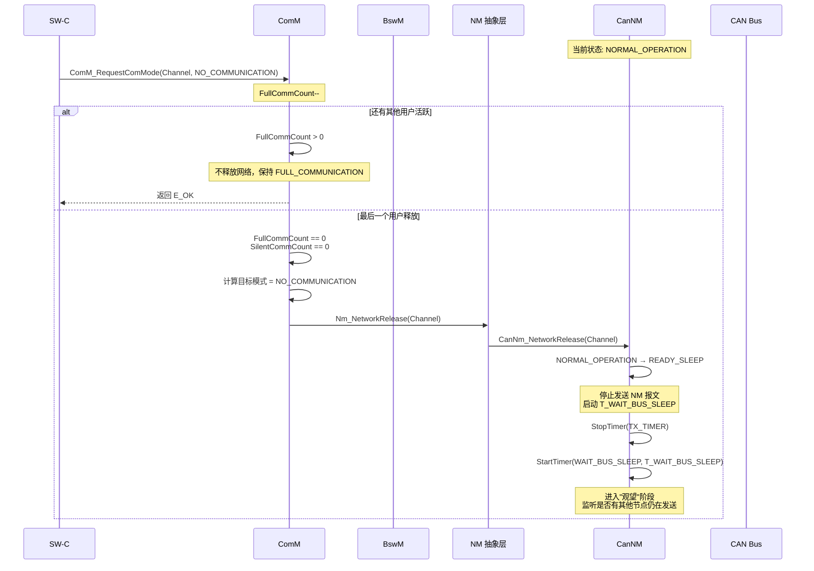

**图解释：** NORMAL_OPERATION → READY_SLEEP 的转换：
1. **SW-C 释放**：调用 `ComM_RequestComMode(NO_COMMUNICATION)`
2. **ComM 判断**：只有最后一个用户释放时才开始释放流程
3. **NM 转发**：`Nm_NetworkRelease` → `CanNm_NetworkRelease`
4. **CanNM 切换**：停止发送 NM 报文，进入 READY_SLEEP，启动 T_WAIT_BUS_SLEEP

### 3.4 READY_SLEEP → PREPARE_BUS_SLEEP（确认睡眠）

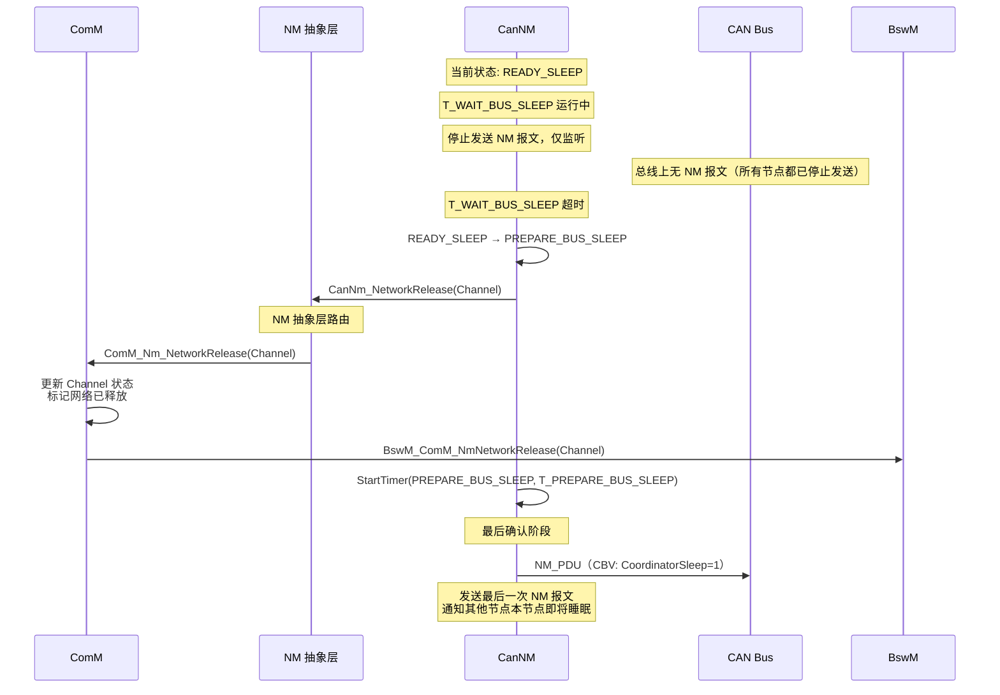

**图解释：** READY_SLEEP → PREPARE_BUS_SLEEP 的转换：
1. **T_WAIT_BUS_SLEEP 超时**：确认总线上无其他活跃节点
2. **通知上层**：`CanNm_NetworkRelease` → NM → ComM，告知网络已释放
3. **最后一次广播**：发送带 CoordinatorSleep 标志的 NM 报文
4. **启动最终定时器**：T_PREPARE_BUS_SLEEP

### 3.5 PREPARE_BUS_SLEEP → BUS_SLEEP（进入睡眠）

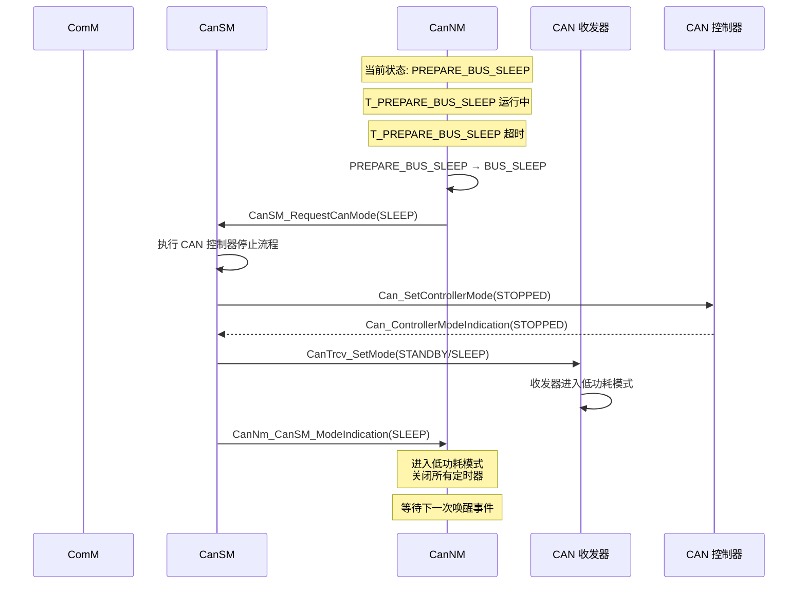

**图解释：** PREPARE_BUS_SLEEP → BUS_SLEEP 的转换：
1. **T_PREPARE_BUS_SLEEP 超时**：最终确认
2. **请求 CanSM**：关闭 CAN 控制器
3. **硬件操作**：控制器 STOPPED → 收发器 STANDBY/SLEEP
4. **进入 BUS_SLEEP**：低功耗模式，等待唤醒

### 3.6 READY_SLEEP → REPEAT_MESSAGE（网络重新激活）

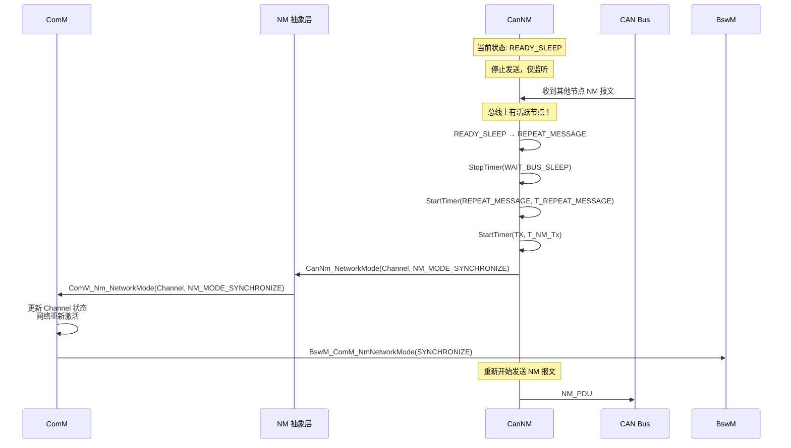

**图解释：** READY_SLEEP → REPEAT_MESSAGE 是"中断睡眠"的路径：
- 在 READY_SLEEP 等待期间，如果检测到有其他节点发送 NM 报文
- CanNM 立即回到 REPEAT_MESSAGE 重新参与网络活动
- 这防止了"误睡眠"——当网络还有活跃节点时不会进入睡眠

### 3.7 所有状态转换汇总

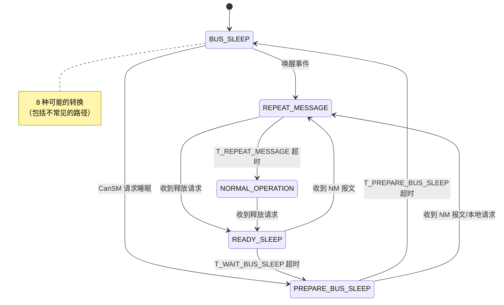

---

## 4. 定时器驱动的状态转换

### 4.1 三大定时器的作用与交互

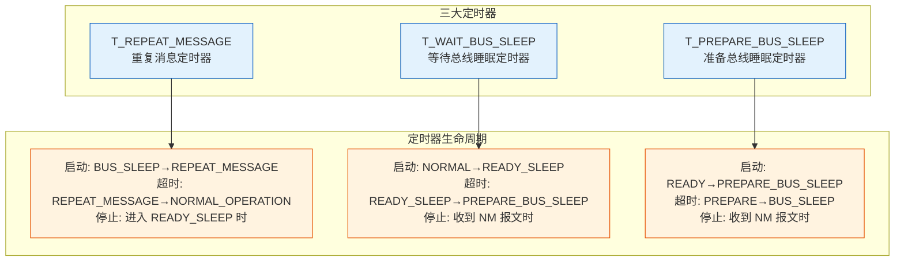

**图解释：** 三个定时器构成 **"链式超时"** 机制，一个接一个驱动状态转换：
- T_REPEAT_MESSAGE 超时 → 进入 NORMAL_OPERATION
- T_WAIT_BUS_SLEEP 超时 → 进入 PREPARE_BUS_SLEEP
- T_PREPARE_BUS_SLEEP 超时 → 进入 BUS_SLEEP

### 4.2 定时器链的完整时序

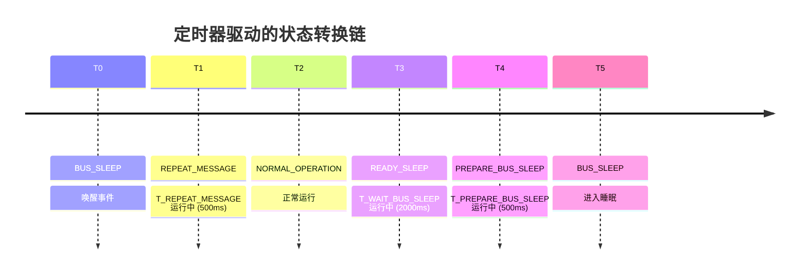

### 4.3 定时器配置与依赖关系

| 定时器 | 启动时刻 | 超时时刻 | 超时行为 | 典型值 | 依赖关系 |
|--------|---------|---------|---------|-------|---------|
| T_REPEAT_MESSAGE | BUS_SLEEP→RM | RM→NO | 通知 ComM 网络同步完成 | 500ms | 独立 |
| T_NM_Tx | 进入 RM/NO 时 | 周期到达 | 发送 NM 报文 | 100ms | 持续运行 |
| T_NM_Timeout | 收到 NM 报文时 | 超时到达 | 节点超时检测 | 500ms | 每次收到报文重启 |
| T_WAIT_BUS_SLEEP | NO→RS | RS→PBS | 通知 ComM 网络释放 | 2000ms | T_NM_Tx 停止后 |
| T_PREPARE_BUS_SLEEP | RS→PBS | PBS→BS | 进入睡眠 | 500ms | T_WAIT_BUS_SLEEP 后 |

---

## 5. 异常场景的状态转换交互

### 5.1 多个节点同时释放

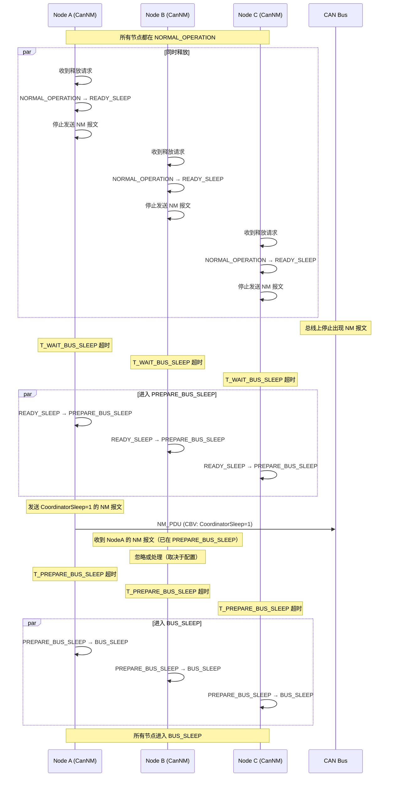

**图解释：** 多节点同时释放时，AUTOSAR NM 的分布式睡眠机制确保：
1. 每个节点独立进入 READY_SLEEP，停止发送 NM 报文
2. 当总线上不再有 NM 报文时，所有节点的 T_WAIT_BUS_SLEEP 几乎同时超时
3. 每个节点独立进入 PREPARE_BUS_SLEEP，发送最后的协调睡眠报文
4. 最终独立进入 BUS_SLEEP
5. **无需中心协调器**，完全分布式决策

### 5.2 节点在睡眠过程中被唤醒

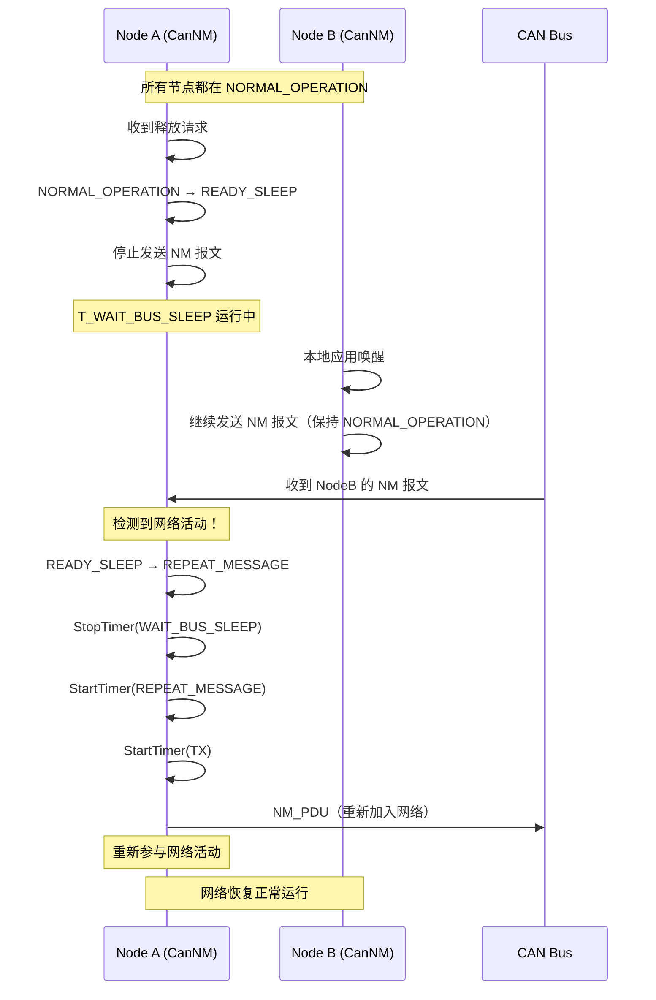

**图解释：** 睡眠中被唤醒的场景：
1. NodeA 开始睡眠流程，进入 READY_SLEEP
2. 在 T_WAIT_BUS_SLEEP 超时前，NodeB 发送了 NM 报文
3. NodeA 检测到网络活动，立即回到 REPEAT_MESSAGE
4. 重新参与网络活动，网络保持活跃

### 5.3 节点超时检测（T_NM_Timeout）

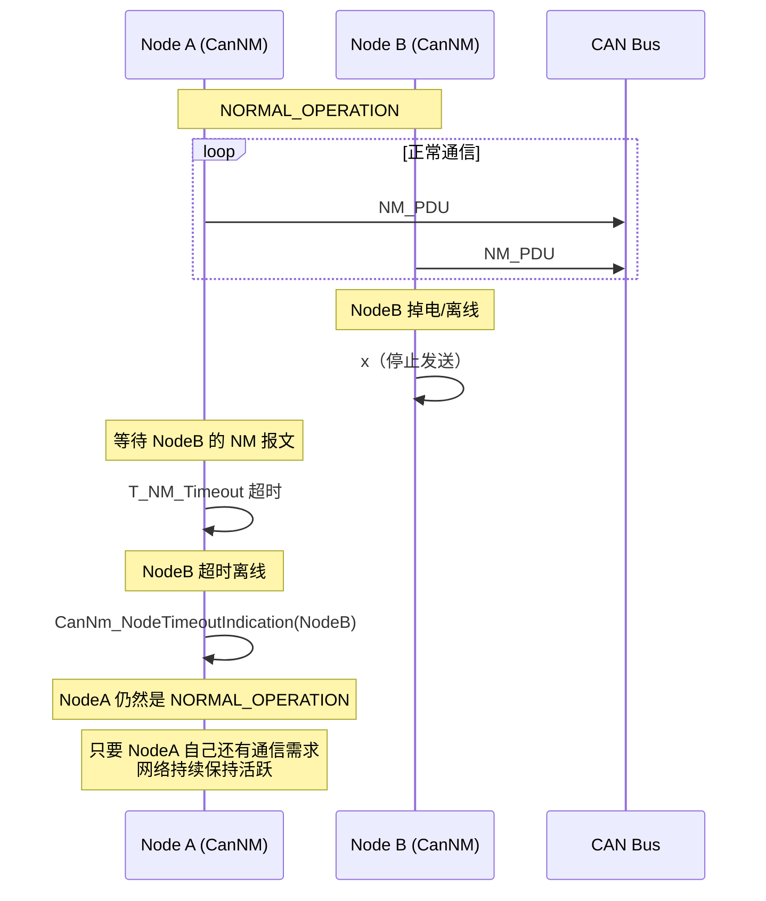

**图解释：** 节点超时场景：
1. NodeB 意外离线（掉电/故障）
2. NodeA 的 T_NM_Timeout 定时器超时（因为 NodeB 的 NM 报文停止）
3. NodeA 记录 NodeB 超时，但**不会**因此进入睡眠
4. NodeA 只要还有通信需求，就保持 NORMAL_OPERATION

---

## 6. 代码级实现：状态机驱动的三模块交互

### 6.1 CanNM 状态机完整实现框架

```c
/* ============================================
 * CanNM 主状态机 - 完整实现框架
 * ============================================ */

/* CanNM 状态枚举 */
typedef enum {
    CANNM_BUS_SLEEP,            /* 0: 总线睡眠 */
    CANNM_PREPARE_BUS_SLEEP,   /* 1: 准备总线睡眠 */
    CANNM_READY_SLEEP,          /* 2: 准备睡眠 */
    CANNM_REPEAT_MESSAGE,       /* 3: 重复消息 */
    CANNM_NORMAL_OPERATION      /* 4: 正常运行 */
} CanNm_StateType;

/* CanNM 通道控制块 */
typedef struct {
    CanNm_StateType    State;                    /* 当前状态 */
    CanNm_StateType    PreviousState;            /* 上一状态（用于状态转换跟踪） */
    uint8_t            Channel;                  /* 通道 ID */
    CanNm_WakeUpSourceType WakeupSource;         /* 唤醒源 */
    uint8_t            NodeId;                   /* 本节点 ID */
    uint8_t            ActiveNodeMap[8];         /* 活跃节点位图（最多 64 节点） */
    uint8_t            Cbv;                      /* 当前 CBV 值 */

    /* 定时器状态 */
    uint16_t           TimerRepeatMessage;       /* T_REPEAT_MESSAGE 倒计时 */
    uint16_t           TimerWaitBusSleep;        /* T_WAIT_BUS_SLEEP 倒计时 */
    uint16_t           TimerPrepareBusSleep;     /* T_PREPARE_BUS_SLEEP 倒计时 */
    uint16_t           TimerTx;                  /* T_NM_Tx 发送周期倒计时 */
    uint16_t           TimerNmTimeout;           /* T_NM_Timeout 超时倒计时 */

    /* 请求标志 */
    boolean            NetworkReleaseRequest;    /* 网络释放请求 */
    boolean            LocalWakeupRequest;       /* 本地唤醒请求 */
    boolean            NM_PduReceived;           /* 收到 NM 报文标志 */
    uint8_t            RxNodeId;                 /* 接收到的节点 ID */
} CanNm_ChannelType;

/* 状态机主函数 */
void CanNm_MainFunction(void) {
    CanNm_ChannelType* ch = &CanNm_Channel;

    /* 保存上一状态 */
    ch->PreviousState = ch->State;

    /* 递减所有定时器 */
    CanNm_DecrementTimers(ch);

    /* 状态机主分支 */
    switch (ch->State) {
        case CANNM_BUS_SLEEP:
            CanNm_StateBusSleep(ch);
            break;
        case CANNM_PREPARE_BUS_SLEEP:
            CanNm_StatePrepareBusSleep(ch);
            break;
        case CANNM_READY_SLEEP:
            CanNm_StateReadySleep(ch);
            break;
        case CANNM_REPEAT_MESSAGE:
            CanNm_StateRepeatMessage(ch);
            break;
        case CANNM_NORMAL_OPERATION:
            CanNm_StateNormalOperation(ch);
            break;
    }

    /* 状态转换后处理 */
    if (ch->State != ch->PreviousState) {
        CanNm_OnStateChanged(ch, ch->PreviousState, ch->State);
    }
}

/* 状态转换处理函数 - 记录转换并触发回调 */
void CanNm_OnStateChanged(CanNm_ChannelType* ch,
                          CanNm_StateType oldState,
                          CanNm_StateType newState) {
    /* 记录状态转换日志 */
    CanNm_LogStateTransition(ch->Channel, oldState, newState);

    /* 根据转换类型触发对应的回调链 */
    /* 转换类型决定了与 NM 抽象层和 ComM 的交互方式 */
    switch (oldState) {
        case CANNM_BUS_SLEEP:
            if (newState == CANNM_REPEAT_MESSAGE) {
                /* BUS_SLEEP → REPEAT_MESSAGE: 网络唤醒 */
                /* 回调已经在唤醒处理函数中触发 */
            }
            break;

        case CANNM_REPEAT_MESSAGE:
            if (newState == CANNM_NORMAL_OPERATION) {
                /* REPEAT_MESSAGE → NORMAL_OPERATION: 网络同步完成 */
                /* 回调: CanNm_NetworkMode → NM → ComM */
            }
            break;

        case CANNM_NORMAL_OPERATION:
            if (newState == CANNM_READY_SLEEP) {
                /* NORMAL_OPERATION → READY_SLEEP: 开始睡眠 */
                /* 此时不立即通知 ComM，等待 READY_SLEEP 超时 */
            }
            break;

        case CANNM_READY_SLEEP:
            if (newState == CANNM_PREPARE_BUS_SLEEP) {
                /* READY_SLEEP → PREPARE_BUS_SLEEP: 确认睡眠 */
                /* 回调: CanNm_NetworkRelease → NM → ComM */
            } else if (newState == CANNM_REPEAT_MESSAGE) {
                /* READY_SLEEP → REPEAT_MESSAGE: 网络重新激活 */
                /* 回调: CanNm_NetworkMode → NM → ComM */
            }
            break;

        case CANNM_PREPARE_BUS_SLEEP:
            if (newState == CANNM_BUS_SLEEP) {
                /* PREPARE_BUS_SLEEP → BUS_SLEEP: 进入睡眠 */
                /* 回调: 请求 CanSM 关闭控制器 */
            } else if (newState == CANNM_REPEAT_MESSAGE) {
                /* PREPARE_BUS_SLEEP → REPEAT_MESSAGE: 唤醒 */
                /* 回调: CanNm_NetworkMode → NM → ComM */
            }
            break;
    }
}
```

**代码解释：** 完整的状态机框架包括：
1. **状态枚举**：5 个状态值
2. **通道控制块**：包含状态、定时器、请求标志、接收信息
3. **主函数**：定时器递减 → 状态处理 → 状态转换后处理
4. **转换处理**：根据转换类型触发不同的回调链

### 6.2 各状态实现函数详解

```c
/* ============================================
 * BUS_SLEEP 状态处理
 * ============================================ */
void CanNm_StateBusSleep(CanNm_ChannelType* ch) {
    /* 1. 检查远程唤醒（CAN 总线活动） */
    if (CanNm_CheckWakeupEvent()) {
        ch->WakeupSource = CANNM_WAKEUP_REMOTE;
        ch->State = CANNM_REPEAT_MESSAGE;

        /* 启动定时器 */
        ch->TimerRepeatMessage = CanNm_Config->CanNmRepeatMessageTime;
        ch->TimerTx = CanNm_Config->CanNmMsgCycleTime;

        /* 回调链: CanNM → NM 抽象层 → ComM */
        /* 通知 ComM 网络被远程唤醒 */
        CanNm_NetworkStart(ch->Channel, CANNM_WAKEUP_REMOTE);
        /* → Nm_CanNmNetworkStart(ch->Channel, NM_WAKEUP_REMOTE) */
        /*   → ComM_Nm_NetworkStart(ch->Channel, NM_WAKEUP_REMOTE) */
        return;
    }

    /* 2. 检查本地唤醒（ComM 请求） */
    if (ch->LocalWakeupRequest) {
        ch->LocalWakeupRequest = FALSE;
        ch->WakeupSource = CANNM_WAKEUP_LOCAL;
        ch->State = CANNM_REPEAT_MESSAGE;

        /* 启动定时器 */
        ch->TimerRepeatMessage = CanNm_Config->CanNmRepeatMessageTime;
        ch->TimerTx = CanNm_Config->CanNmMsgCycleTime;

        /* 回调链: CanNM → NM 抽象层 → ComM */
        /* 通知 ComM 网络被本地唤醒 */
        CanNm_NetworkStart(ch->Channel, CANNM_WAKEUP_LOCAL);
        /* → Nm_CanNmNetworkStart(ch->Channel, NM_WAKEUP_LOCAL) */
        /*   → ComM_Nm_NetworkStart(ch->Channel, NM_WAKEUP_LOCAL) */
        return;
    }

    /* 3. 检查 CanSM 是否请求总线睡眠 */
    if (CanNm_CanSMMode == CANSM_SLEEP) {
        ch->State = CANNM_PREPARE_BUS_SLEEP;
        ch->TimerPrepareBusSleep = CanNm_Config->CanNmPrepareBusSleepTime;
        return;
    }
}

/* ============================================
 * REPEAT_MESSAGE 状态处理
 * ============================================ */
void CanNm_StateRepeatMessage(CanNm_ChannelType* ch) {
    /* 1. 发送 NM 报文（周期到） */
    if (ch->TimerTx == 0) {
        ch->TimerTx = CanNm_Config->CanNmMsgCycleTime;
        CanNm_TransmitNmPdu(ch);
    }

    /* 2. 处理接收到的 NM 报文 */
    if (ch->NM_PduReceived) {
        ch->NM_PduReceived = FALSE;
        CanNm_ProcessRxNmPdu(ch, ch->RxNodeId);
        /* 更新活跃节点位图 */
        CanNm_SetNodeBit(ch->ActiveNodeMap, ch->RxNodeId);
        /* 重启 NM 超时定时器 */
        ch->TimerNmTimeout = CanNm_Config->CanNmMsgTimeoutTime;
    }

    /* 3. T_REPEAT_MESSAGE 超时 → NORMAL_OPERATION */
    if (ch->TimerRepeatMessage == 0) {
        ch->State = CANNM_NORMAL_OPERATION;
        ch->TimerTx = CanNm_Config->CanNmMsgCycleTime;

        /* 回调链: 通知 ComM 网络同步完成 */
        CanNm_NetworkMode(ch->Channel, CANNM_NM_MODE_SYNCHRONIZE);
        /* → Nm_CanNmNetworkMode(ch->Channel, NM_MODE_SYNCHRONIZE) */
        /*   → ComM_Nm_NetworkMode(ch->Channel, NM_MODE_SYNCHRONIZE) */
        return;
    }

    /* 4. 检查网络释放请求 */
    if (ch->NetworkReleaseRequest) {
        ch->NetworkReleaseRequest = FALSE;
        ch->State = CANNM_READY_SLEEP;
        ch->TimerTx = 0;           /* 停止发送 */
        ch->TimerWaitBusSleep = CanNm_Config->CanNmWaitBusSleepTime;
        return;
    }
}

/* ============================================
 * NORMAL_OPERATION 状态处理
 * ============================================ */
void CanNm_StateNormalOperation(CanNm_ChannelType* ch) {
    /* 1. 周期性发送 NM 报文 */
    if (ch->TimerTx == 0) {
        ch->TimerTx = CanNm_Config->CanNmMsgCycleTime;
        /* 构建 CBV 并发送 */
        ch->Cbv = CanNm_BuildCBV(ch);
        CanNm_TransmitNmPduWithCBV(ch, ch->Cbv);
    }

    /* 2. 处理接收到的 NM 报文 */
    if (ch->NM_PduReceived) {
        ch->NM_PduReceived = FALSE;
        CanNm_ProcessRxNmPdu(ch, ch->RxNodeId);
        CanNm_SetNodeBit(ch->ActiveNodeMap, ch->RxNodeId);
        ch->TimerNmTimeout = CanNm_Config->CanNmMsgTimeoutTime;
    }

    /* 3. NM 超时检测（其他节点离线） */
    if (ch->TimerNmTimeout == 0) {
        /* 检测到超时的节点 */
        for (int i = 0; i < MAX_NODES; i++) {
            if (CanNm_GetNodeBit(ch->ActiveNodeMap, i)) {
                CanNm_NodeTimeoutIndication(ch->Channel, i);
                CanNm_ClearNodeBit(ch->ActiveNodeMap, i);
            }
        }
    }

    /* 4. 检查网络释放请求 */
    if (ch->NetworkReleaseRequest) {
        ch->NetworkReleaseRequest = FALSE;
        ch->State = CANNM_READY_SLEEP;
        ch->TimerTx = 0;           /* 停止发送 NM 报文 */
        ch->TimerWaitBusSleep = CanNm_Config->CanNmWaitBusSleepTime;
        /* 注意：此时不通知 ComM，等待 READY_SLEEP 超时后 */
        return;
    }
}

/* ============================================
 * READY_SLEEP 状态处理
 * ============================================ */
void CanNm_StateReadySleep(CanNm_ChannelType* ch) {
    /* 1. 检查是否收到其他节点的 NM 报文 */
    if (ch->NM_PduReceived) {
        ch->NM_PduReceived = FALSE;
        CanNm_ProcessRxNmPdu(ch, ch->RxNodeId);

        /* 有网络活动！回到 REPEAT_MESSAGE */
        ch->State = CANNM_REPEAT_MESSAGE;
        ch->TimerWaitBusSleep = 0;  /* 停止 */
        ch->TimerRepeatMessage = CanNm_Config->CanNmRepeatMessageTime;
        ch->TimerTx = CanNm_Config->CanNmMsgCycleTime;

        /* 回调链: 通知 ComM 网络重新激活 */
        CanNm_NetworkMode(ch->Channel, CANNM_NM_MODE_SYNCHRONIZE);
        /* → Nm_CanNmNetworkMode → ComM_Nm_NetworkMode */
        return;
    }

    /* 2. T_WAIT_BUS_SLEEP 超时 → PREPARE_BUS_SLEEP */
    if (ch->TimerWaitBusSleep == 0) {
        ch->State = CANNM_PREPARE_BUS_SLEEP;
        ch->TimerPrepareBusSleep = CanNm_Config->CanNmPrepareBusSleepTime;

        /* 回调链: 通知 ComM 网络释放 */
        CanNm_NetworkRelease(ch->Channel);
        /* → Nm_CanNmNetworkRelease(ch->Channel) */
        /*   → ComM_Nm_NetworkRelease(ch->Channel) */
        return;
    }
}

/* ============================================
 * PREPARE_BUS_SLEEP 状态处理
 * ============================================ */
void CanNm_StatePrepareBusSleep(CanNm_ChannelType* ch) {
    /* 1. 首次进入时发送最后一次 NM 报文 */
    if (ch->PreviousState != CANNM_PREPARE_BUS_SLEEP) {
        /* 发送带协调睡眠标志的 NM 报文 */
        ch->Cbv = CANNM_CBV_COORDINATOR_SLEEP;
        CanNm_TransmitNmPduWithCBV(ch, ch->Cbv);
    }

    /* 2. 检查是否收到其他节点的 NM 报文 */
    if (ch->NM_PduReceived) {
        ch->NM_PduReceived = FALSE;
        CanNm_ProcessRxNmPdu(ch, ch->RxNodeId);

        ch->State = CANNM_REPEAT_MESSAGE;
        ch->TimerPrepareBusSleep = 0;
        ch->TimerRepeatMessage = CanNm_Config->CanNmRepeatMessageTime;
        ch->TimerTx = CanNm_Config->CanNmMsgCycleTime;

        CanNm_NetworkMode(ch->Channel, CANNM_NM_MODE_SYNCHRONIZE);
        return;
    }

    /* 3. 检查新的本地网络请求 */
    if (ch->LocalWakeupRequest) {
        ch->LocalWakeupRequest = FALSE;
        ch->State = CANNM_REPEAT_MESSAGE;
        ch->TimerPrepareBusSleep = 0;
        ch->TimerRepeatMessage = CanNm_Config->CanNmRepeatMessageTime;
        ch->TimerTx = CanNm_Config->CanNmMsgCycleTime;

        CanNm_NetworkMode(ch->Channel, CANNM_NM_MODE_SYNCHRONIZE);
        return;
    }

    /* 4. T_PREPARE_BUS_SLEEP 超时 → BUS_SLEEP */
    if (ch->TimerPrepareBusSleep == 0) {
        ch->State = CANNM_BUS_SLEEP;

        /* 请求 CanSM 关闭 CAN 控制器 */
        CanNm_RequestCanSMMode(CANSM_SLEEP);

        /* 进入低功耗模式 */
        CanNm_EnterLowPowerMode();

        /* 清空活跃节点位图 */
        CanNm_ClearNodeMap(ch->ActiveNodeMap);
        return;
    }
}
```

**代码解释：** 这是 5 个状态处理函数的完整实现，展示了：
1. **每个状态的独立处理逻辑**：定时器管理、报文收发、标志检查
2. **状态转换触发条件**：定时器超时、请求标志、接收事件
3. **回调链的触发时机**：每个状态转换时触发对应的回调
4. **定时器的生命周期管理**：启动、停止、重启

### 6.3 ComM 侧的响应处理

```c
/* ============================================
 * ComM 对 CanNM 回调的响应处理
 * ============================================ */

/* ComM 通道状态 */
typedef struct {
    ComM_ModeType CurrentMode;       /* 当前通信模式 */
    uint8_t       FullCommCount;     /* FULL 请求计数 */
    uint8_t       SilentCommCount;   /* SILENT 请求计数 */
    boolean       NmNetworkActive;   /* NM 网络是否活跃 */
    Nm_ModeType   NmCurrentMode;     /* NM 当前模式 */
    Nm_WakeUpSourceType WakeupSource;/* 唤醒源 */
} ComM_ChannelType;

/* 1. ComM 处理 Nm_NetworkStart 回调 */
void ComM_Nm_NetworkStart(uint8 Channel, Nm_WakeUpSourceType WakeupSource) {
    ComM_ChannelType* ch = &ComM_Channels[Channel];

    /* 记录唤醒源 */
    ch->WakeupSource = WakeupSource;
    ch->NmNetworkActive = TRUE;

    /* 如果当前是 NO_COMMUNICATION，需要切换到 FULL */
    if (ch->CurrentMode == COMM_NO_COMMUNICATION) {
        /* 远程唤醒时，自动进入 FULL_COMMUNICATION */
        ch->CurrentMode = COMM_FULL_COMMUNICATION;

        /* 通知 BswM 模式变化 */
        BswM_ComM_CurrentMode(Channel, COMM_FULL_COMMUNICATION);
    }

    /* 更新 NM 模式 */
    ch->NmCurrentMode = NM_MODE_SYNCHRONIZE;
}

/* 2. ComM 处理 Nm_NetworkMode 回调 */
void ComM_Nm_NetworkMode(uint8 Channel, Nm_ModeType Mode) {
    ComM_ChannelType* ch = &ComM_Channels[Channel];

    /* 更新 NM 模式 */
    ch->NmCurrentMode = Mode;
    ch->NmNetworkActive = TRUE;

    if (Mode == NM_MODE_SYNCHRONIZE) {
        /* 网络同步完成，通知 BswM */
        BswM_ComM_NmNetworkMode(Channel, NM_MODE_SYNCHRONIZE);

        /* BswM 会执行规则:
         * - 开启 Com 模块的信号路由
         * - 开启 PduR 的报文路由
         * - 通知 CanSM 保持 ONLINE 状态
         */
    }
}

/* 3. ComM 处理 Nm_NetworkRelease 回调 */
void ComM_Nm_NetworkRelease(uint8 Channel) {
    ComM_ChannelType* ch = &ComM_Channels[Channel];

    /* 标记网络已释放 */
    ch->NmNetworkActive = FALSE;
    ch->NmCurrentMode = NM_MODE_IDLE;

    /* 通知 BswM 网络已释放 */
    BswM_ComM_NmNetworkRelease(Channel);

    /* BswM 会执行规则:
     * - 关闭 Com 模块的信号路由
     * - 关闭 PduR 的报文路由
     * - 通知 CanSM 准备关闭
     */

    /* 如果当前模式是 FULL，切换到 NO_COMMUNICATION */
    if (ch->CurrentMode == COMM_FULL_COMMUNICATION) {
        /* 但前提是所有用户已释放 */
        if (ch->FullCommCount == 0 && ch->SilentCommCount == 0) {
            ch->CurrentMode = COMM_NO_COMMUNICATION;
            BswM_ComM_CurrentMode(Channel, COMM_NO_COMMUNICATION);
        }
    }
}
```

**代码解释：** ComM 对 CanNM 回调的响应处理：
1. **NetworkStart**：远程唤醒时自动进入 FULL_COMMUNICATION
2. **NetworkMode(SYNCHRONIZE)**：网络同步完成，通知 BswM 开启通信
3. **NetworkRelease**：网络释放，通知 BswM 关闭通信

---

## 7. 状态转换与回调对应关系表

### 7.1 所有转换的全景映射

```mermaid
flowchart TB
    subgraph Legend["图例说明"]
        L1[[转换路径]] --> L2[[有回调触发]]
        L1 -.- L3[[无回调触发]]
    end

    subgraph 状态转换与回调映射
        BS2RM["BUS_SLEEP →<br/>REPEAT_MESSAGE"]
        BS2PBS["BUS_SLEEP →<br/>PREPARE_BUS_SLEEP"]
        RM2NO["REPEAT_MESSAGE →<br/>NORMAL_OPERATION"]
        RM2RS["REPEAT_MESSAGE →<br/>READY_SLEEP"]
        NO2RS["NORMAL_OPERATION →<br/>READY_SLEEP"]
        RS2PBS["READY_SLEEP →<br/>PREPARE_BUS_SLEEP"]
        RS2RM["READY_SLEEP →<br/>REPEAT_MESSAGE"]
        PBS2BS["PREPARE_BUS_SLEEP →<br/>BUS_SLEEP"]
        PBS2RM["PREPARE_BUS_SLEEP →<br/>REPEAT_MESSAGE"]
    end

    subgraph 触发的回调
        CB1["CanNm_NetworkStart()<br/>↓<br/>ComM_Nm_NetworkStart()"]
        CB2["CanNm_NetworkMode(SYNC)<br/>↓<br/>ComM_Nm_NetworkMode()"]
        CB3["CanNm_NetworkRelease()<br/>↓<br/>ComM_Nm_NetworkRelease()"]
        CB4["直接请求 CanSM 睡眠<br/>无 ComM 回调"]
    end

    subgraph 无回调内部动作
        N1["仅停止发送 NM 报文<br/>启动 T_WAIT_BUS_SLEEP"]
        N2["仅停止发送 NM 报文<br/>启动 T_WAIT_BUS_SLEEP"]
        N3["直接进入 PBS<br/>内部状态切换"]
    end

    BS2RM --> CB1
    RM2NO --> CB2
    RS2PBS --> CB3
    RS2RM --> CB2
    PBS2BS --> CB4
    PBS2RM --> CB2

    RM2RS -.-> N1
    NO2RS -.-> N2
    BS2PBS -.-> N3

    classDef trans fill:#e3f2fd,stroke:#1565c0,stroke-width:2px
    classDef cb fill:#fff3e0,stroke:#e65100,stroke-width:2px
    classDef none fill:#f5f5f5,stroke:#9e9e9e,stroke-dasharray: 5 5
    classDef legend fill:#fafafa,stroke:#333,stroke-width:1px

    class BS2RM,RM2NO,RS2PBS,RS2RM,PBS2BS,PBS2RM trans
    class BS2PBS,RM2RS,NO2RS trans
    class CB1,CB2,CB3,CB4 cb
    class N1,N2,N3 none
    class Legend legend
```

**图解释：** 9 种状态转换中，有 5 种会触发回调通知上层：
- **NetworkStart**：BUS_SLEEP → REPEAT_MESSAGE（唤醒通知）
- **NetworkMode(SYNCHRONIZE)**：RM → NO、RS → RM、PBS → RM（网络同步通知）
- **NetworkRelease**：RS → PBS（网络释放通知）
- **不触发回调**：RM → RS、NO → RS、BS → PBS（这些是内部状态切换，不需要通知上层）

### 7.2 状态转换对照表

| 序号 | 转换路径 | 触发条件 | 回调链 | 对 ComM 的影响 |
|------|---------|---------|--------|---------------|
| 1 | BUS_SLEEP → RM | 远程/本地唤醒 | `NetworkStart` | NO → FULL，通知 BswM |
| 2 | BUS_SLEEP → PBS | CanSM 请求 | 无 | 无变化 |
| 3 | RM → NO | T_REPEAT_MESSAGE 超时 | `NetworkMode(SYNCHRONIZE)` | 网络同步完成 |
| 4 | RM → RS | 收到释放请求 | 无 | 无变化 |
| 5 | NO → RS | 收到释放请求 | 无 | 无变化 |
| 6 | RS → PBS | T_WAIT_BUS_SLEEP 超时 | `NetworkRelease` | FULL → NO，通知 BswM |
| 7 | RS → RM | 收到 NM 报文 | `NetworkMode(SYNCHRONIZE)` | 网络重新激活 |
| 8 | PBS → BS | T_PREPARE_BUS_SLEEP 超时 | 请求 CanSM 睡眠 | 无变化（已通知过） |
| 9 | PBS → RM | 收到 NM 报文/本地请求 | `NetworkMode(SYNCHRONIZE)` | 网络重新激活 |

---

## 8. 状态机跳转的"瞬间"交互细节

### 8.1 一条状态转换语句背后的完整调用链

以 `REPEAT_MESSAGE → NORMAL_OPERATION` 为例，一条 `CanNm_State = CANNM_NORMAL_OPERATION` 语句背后实际上是：

```c
/* 第 1 层：CanNM 内部状态切换 */
CanNm_State = CANNM_NORMAL_OPERATION;

/* 第 2 层：CanNM 调用 NM 抽象层回调 */
CanNm_NetworkMode(Channel, CANNM_NM_MODE_SYNCHRONIZE);

/* 第 3 层：NM 抽象层进行路由和转换 */
void Nm_CanNmNetworkMode(uint8 Channel, CanNm_ModeType CanNm_Mode) {
    /* 转换 CanNM 模式到 NM 抽象层模式 */
    Nm_ModeType nmMode;
    switch (CanNm_Mode) {
        case CANNM_NM_MODE_SYNCHRONIZE:
            nmMode = NM_MODE_SYNCHRONIZE;
            break;
        case CANNM_NM_MODE_ACTIVE:
            nmMode = NM_MODE_ACTIVE;
            break;
        default:
            nmMode = NM_MODE_IDLE;
            break;
    }

    /* 更新 NM 抽象层自己的状态 */
    Nm_ChannelState[Channel] = nmMode;

    /* 调用 ComM 注册的回调 */
    if (Nm_ComMCallbacks[Channel].NetworkMode != NULL) {
        Nm_ComMCallbacks[Channel].NetworkMode(Channel, nmMode);
    }
}

/* 第 4 层：ComM 处理回调 */
void ComM_Nm_NetworkMode(uint8 Channel, Nm_ModeType Mode) {
    /* 更新通道状态 */
    ComM_Channels[Channel].NmCurrentMode = Mode;

    /* 通知 BswM */
    BswM_ComM_NmNetworkMode(Channel, Mode);

    /* BswM 内部执行规则链 */
    /* → 开启 Com 路由 */
    /* → 开启 PduR 路由 */
    /* → 通知 CanSM 保持 ONLINE */
}
```

**调用的完整路径：**
```
CanNm 内部状态赋值
  → CanNm_NetworkMode()
    → Nm_CanNmNetworkMode()     [NM 抽象层]
      → ComM_Nm_NetworkMode()   [ComM 回调]
        → BswM_ComM_NmNetworkMode()  [BswM 模式仲裁]
          → 执行 Action List
            → Com_EnableRouting()
            → PduR_EnableRouting()
```

**这条路径经过了 4 个模块、6 个函数调用。**

### 8.2 状态转换的原子性

```c
/* 状态转换的原子操作序列 */
void CanNm_PerformStateTransition(CanNm_ChannelType* ch,
                                  CanNm_StateType newState) {
    /* 步骤 1: 保存旧状态 */
    CanNm_StateType oldState = ch->State;

    /* 步骤 2: 停止旧状态相关的定时器 */
    CanNm_StopStateTimers(ch, oldState);

    /* 步骤 3: 设置新状态 */
    ch->State = newState;

    /* 步骤 4: 启动新状态相关的定时器 */
    CanNm_StartStateTimers(ch, newState);

    /* 步骤 5: 执行状态进入动作 */
    CanNm_ExecuteStateEntryAction(ch, newState);

    /* 步骤 6: 触发回调通知上层 */
    CanNm_TriggerStateChangeCallbacks(ch, oldState, newState);

    /* 注意: 步骤 5 和 6 的顺序很重要
     * 必须先执行进入动作，再触发回调
     * 确保回调执行时新状态已经完全建立 */
}
```

**代码解释：** 状态转换是一个原子操作序列，保证：
1. 先建立新状态（定时器、标志位）
2. 再触发回调通知上层
3. 确保回调处理时，CanNM 的新状态已经稳定

---

## 9. 交互时序的知识图谱

### 9.1 完整交互的知识图谱

```mermaid
mindmap
  root((NM 状态机交互))
    BUS_SLEEP
      本地唤醒
        ComM_RequestComMode
        Nm_NetworkRequest
        CanNm_NetworkRequest
        CanNm_NetworkStart → ComM
      远程唤醒
        CAN 总线活动
        CanNm 检测
        CanNm_NetworkStart → ComM
    REPEAT_MESSAGE
      发送 NM 报文
        周期性发送
        CBV 控制位
      接收 NM 报文
        节点注册
        T_NM_Timeout 重启
      T_REPEAT_MESSAGE 超时
        CanNm_NetworkMode → ComM
    NORMAL_OPERATION
      周期发送 NM 报文
      节点超时检测
      释放请求
        Nm_NetworkRelease
        CanNm_NetworkRelease
    READY_SLEEP
      停止发送
      观望监听
      T_WAIT_BUS_SLEEP 超时
        CanNm_NetworkRelease → ComM
      收到 NM 报文
        CanNm_NetworkMode → ComM
    PREPARE_BUS_SLEEP
      最后一次 NM 报文
        CoordinatorSleep 标志
      T_PREPARE_BUS_SLEEP 超时
        CanSM 请求睡眠
```

**图解释：** 从 CanNM 5 个状态出发，每个状态都关联特定的交互事件和回调链，形成了完整的交互知识图谱。

### 9.2 回调链的调用关系

```mermaid
graph LR
    subgraph 回调链 1: 唤醒通知
        CN1["CanNM<br/>检测到唤醒"] --> NM1["NM 抽象层<br/>路由转发"] --> CM1["ComM<br/>更新状态"]
    end

    subgraph 回调链 2: 同步通知
        CN2["CanNM<br/>T_REPEAT 超时"] --> NM2["NM 抽象层<br/>模式转换"] --> CM2["ComM<br/>通知 BswM"]
    end

    subgraph 回调链 3: 释放通知
        CN3["CanNM<br/>T_WAIT_BS 超时"] --> NM3["NM 抽象层<br/>路由转发"] --> CM3["ComM<br/>标记释放"]
    end

    classDef cn fill:#f3e5f5,stroke:#4a148c
    classDef nm fill:#fff3e0,stroke:#e65100
    classDef cm fill:#e3f2fd,stroke:#1565c0

    class CN1,CN2,CN3 cn
    class NM1,NM2,NM3 nm
    class CM1,CM2,CM3 cm
```

**图解释：** 三条回调链分别对应网络唤醒、同步完成、网络释放三种事件，每条链都遵循 CanNM → NM 抽象层 → ComM 的路径。

---

## 10. 总结：状态机交互的核心规律

```mermaid
graph TB
    subgraph 核心规律 1: 回调向上
        R1["CanNM 状态变化 → 回调通知上层<br/>但不是所有转换都触发回调"]
        R1A["触发回调的转换:<br/>BS→RM, RM→NO, RS→PBS, RS→RM, PBS→RM"]
        R1B["不触发回调的转换:<br/>RM→RS, NO→RS, BS→PBS"]
    end

    subgraph 核心规律 2: 定时器驱动
        R2["三大定时器驱动状态转换"]
        R2A["T_REPEAT_MESSAGE: 同步阶段计时"]
        R2B["T_WAIT_BUS_SLEEP: 睡眠确认等待"]
        R2C["T_PREPARE_BUS_SLEEP: 最终确认"]
    end

    subgraph 核心规律 3: 分布式决策
        R3["每个节点独立决策，无需协调器"]
        R3A["睡眠条件: 无 NM 报文超时"]
        R3B["唤醒条件: 收到 NM 报文或本地请求"]
        R3C["重新激活: 任何时刻收到 NM 报文都回到 RM"]
    end

    subgraph 核心规律 4: 分层解耦
        R4["ComM 不直接依赖 CanNM"]
        R4A["ComM ↔ NM 抽象层（接口）"]
        R4B["NM 抽象层 ↔ CanNM（回调）"]
        R4C["替换协议不影响 ComM"]
    end

    classDef rule fill:#e8eaf6,stroke:#283593
    classDef detail fill:#e3f2fd,stroke:#1565c0

    class R1,R2,R3,R4 rule
    class R1A,R1B,R2A,R2B,R2C,R3A,R3B,R3C,R4A,R4B,R4C detail
```

**四条核心规律：**
1. **回调向上**：CanNM 状态变化通过回调通知上层，但不是所有转换都触发回调
2. **定时器驱动**：三大定时器（T_REPEAT / T_WAIT / T_PREPARE）链式驱动状态转换
3. **分布式决策**：每个节点独立决策，无中心协调器，通过 NM 报文隐式同步
4. **分层解耦**：ComM 通过 NM 抽象层与 CanNM 解耦，替换协议不影响上层

### 状态转换速查表

| 当前状态 | 下一个状态 | 触发事件 | 回调链 | 层级影响 |
|---------|-----------|---------|--------|---------|
| BUS_SLEEP | REPEAT_MESSAGE | 本地/远程唤醒 | `NetworkStart` → NM → ComM | ComM: NO → FULL |
| BUS_SLEEP | PREPARE_BUS_SLEEP | CanSM 请求 | 无 | 无 |
| REPEAT_MESSAGE | NORMAL_OPERATION | T_REPEAT 超时 | `NetworkMode(SYNC)` → NM → ComM | ComM: 同步完成 |
| REPEAT_MESSAGE | READY_SLEEP | 释放请求 | 无 | CanNM 内部 |
| NORMAL_OPERATION | READY_SLEEP | 释放请求 | 无 | CanNM 内部 |
| READY_SLEEP | PREPARE_BUS_SLEEP | T_WAIT 超时 | `NetworkRelease` → NM → ComM | ComM: FULL → NO |
| READY_SLEEP | REPEAT_MESSAGE | 收到 NM 报文 | `NetworkMode(SYNC)` → NM → ComM | ComM: 重新激活 |
| PREPARE_BUS_SLEEP | BUS_SLEEP | T_PREPARE 超时 | 请求 CanSM 睡眠 | 硬件: 低功耗 |
| PREPARE_BUS_SLEEP | REPEAT_MESSAGE | 收到 NM 报文/本地请求 | `NetworkMode(SYNC)` → NM → ComM | ComM: 重新激活 |

> **本文重点**：聚焦于网络管理状态机的**每个状态内部**和**状态间跳转**时，ComM、NM、CanNM 三个模块的精确交互时序，是对《ComM_NM_CanNM_交互详解》的深化和补充。两文结合阅读效果最佳。