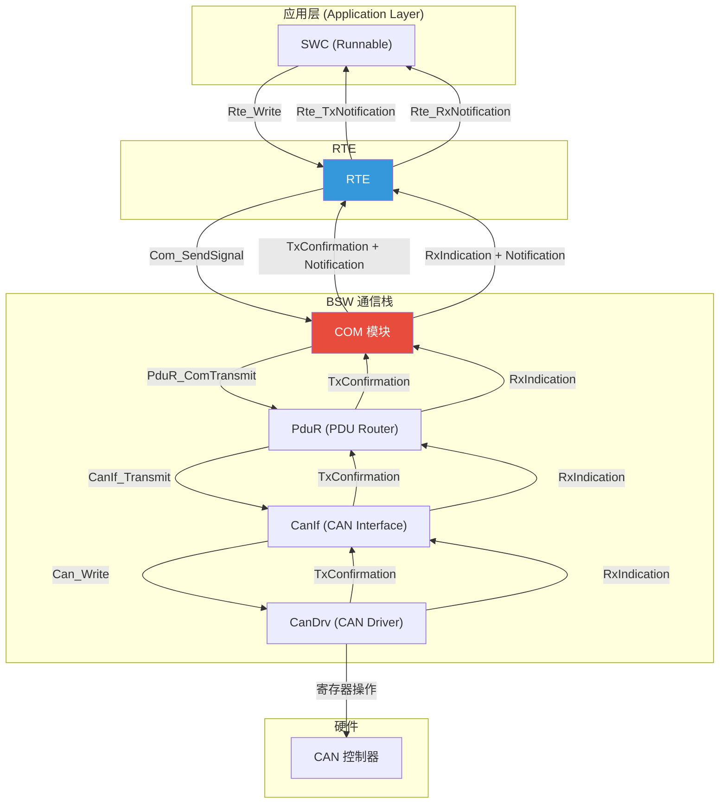
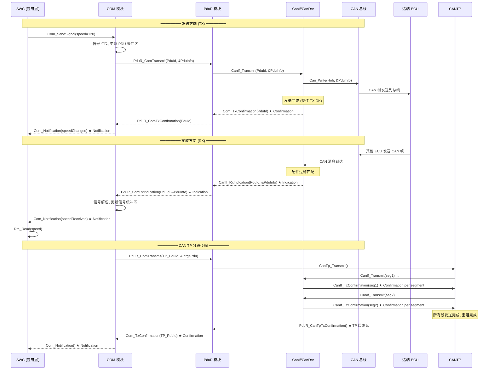
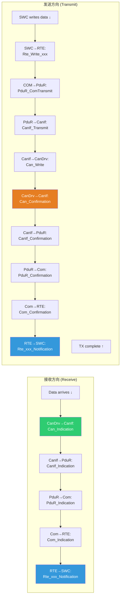
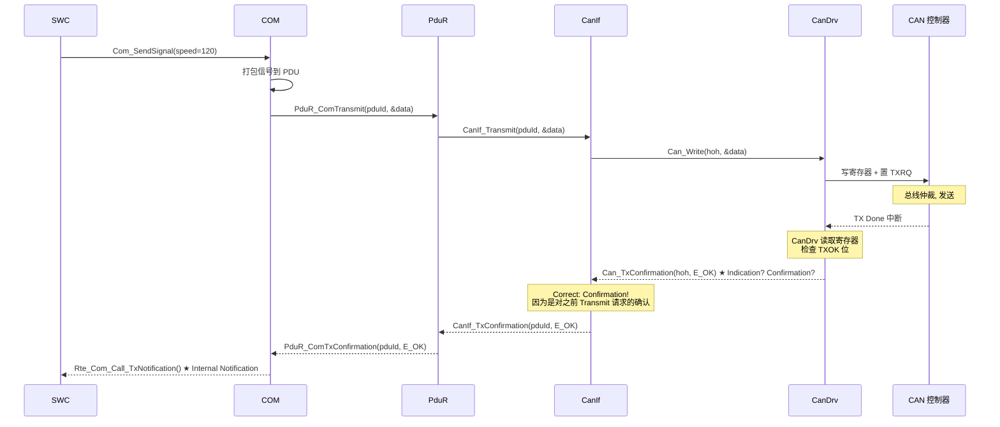
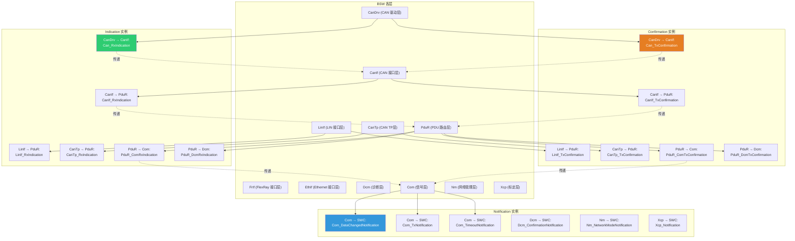
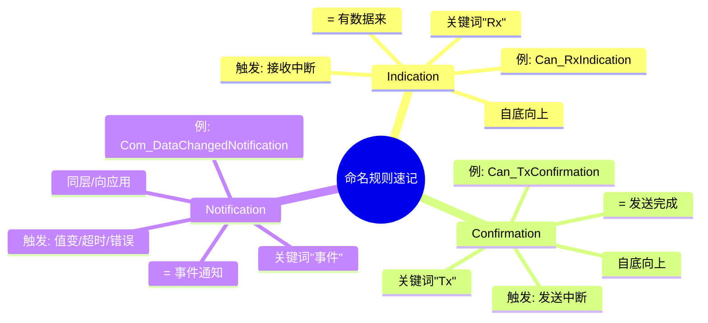

# AUTOSAR 回调命名规范详解：Indication / Notification / Confirmation

## 目录

1. [通俗理解](#1-通俗理解)
2. [设计机制与模式](#2-设计机制与模式)
3. [深入原理](#3-深入原理)
4. [完整代码示例](#4-完整代码示例)
5. [总结与最佳实践](#5-总结与最佳实践)

---

## 1. 通俗理解

### 1.1 一句话总结

| 后缀 | 英文原意 | 一句话含义 | 数据方向 |
|:----:|:--------:|:----------|:--------:|
| **Indication** | **指示** | "**有数据来了，给你**" — 下层向上层递送收到的数据 | ⬆ 下层 → 上层 |
| **Confirmation** | **确认** | "**数据已发出，告诉你一声**" — 下层向上层确认发送完成 | ⬆ 下层 → 上层 |
| **Notification** | **通知** | "**发生了某件事，通知你处理**" — 同层或模块内部的事件通告 | ↔ 同层内部 |

### 1.2 生活中的类比

**餐厅的点餐流程** 是最好的类比：

```
         ┌─────────────────────────────────────────────────────┐
         │                    AUTOSAR 通信栈                      │
         │                                                      │
         │                (收银员)                               │
         │    ┌────────────────────────────────────────┐        │
         │    │   SWC (应用层 = 顾客)                   │        │
         │    └────────┬───────────────────────┬───────┘        │
         │             │                       │                  │
         │             │ ① 点餐                 │ ⑥ 听到叫号取餐    │
         │             │ Rte_Write/SendSignal   │ Notification    │
         │             ▼                       │                  │
         │    ┌────────────────────────────────┐ │                  │
         │    │  COM (翻译打包 = 服务员)        │ │                  │
         │    └────────┬───────────────────────┘ │                  │
         │             │ ② 通知厨房               │                  │
         │             │ PduR_ComTransmit        │                  │
         │             ▼                        │                  │
         │    ┌────────────────────────────────┐ │                  │
         │    │  PduR (路由 = 传菜员)           │ │                  │
         │    └────────┬───────────────────────┘ │                  │
         │             │ ③ 送到对应窗口           │                  │
         │             │ CanIf_Transmit          │                  │
         │             ▼                        │                  │
         │    ┌────────────────────────────────┐ │                  │
         │    │  CanIf/CanDrv (通信硬件 = 厨房)  │                 │
         │    └────────┬───────────────────────┘ │                  │
         │             │                         │                  │
         │             ▼                         │                  │
         │     ┌──────────────┐                  │                  │
         │     │  CAN 总线     │                  │                  │
         │     │  (外卖配送)   │                  │                  │
         │     └──────┬───────┘                  │                  │
         │            │                          │                  │
         └────────────┼──────────────────────────┘                  │
                      │                                             │
             ═════════╪═══════════════════════════════════════════════
                      │
         ┌────────────▼──────────────────────────────────────────────┐
         │  接收方 (另一个 ECU 的顾客)                                 │
         │                                                          │
         │  ④ 外卖到了  →  Indication ("有外卖到了，请查收")           │
         │  ⑤ 餐已做完  →  Confirmation ("餐已出餐，确认送达")         │
         │  ⑥ 叫号取餐  →  Notification ("你的餐好了，来取一下")       │
         └──────────────────────────────────────────────────────────┘
```

| 日常概念 | AUTOSAR 对应 | 命名 |
|---------|-------------|:----:|
| "外卖到了，请查收" | 下层向上层传递收到的数据 | **Indication** |
| "餐已出餐，配送完成" | 下层向上层确认发送完成 | **Confirmation** |
| "你的餐好了，来取" | 模块内部或同层间的事件通告 | **Notification** |

### 1.3 核心记忆法则

```
    Indication   =  有数据来，请接收   (Incoming data)
  Confirmation   =  数据已发，请确认   (Transmit completed)
  Notification   =  事件发生，请处理   (Something happened)
```

---

## 2. 设计机制与模式

### 2.1 三层回调在 AUTOSAR 通信栈中的位置



### 2.2 三类回调的完整通信流



### 2.3 三类回调的名词来源与词源分析

| 后缀 | 英文词源 | 时态 | 语义重点 |
|:----:|:--------:|:----:|:---------|
| **Indication** | indicate (v. 表明/指示) → **indication** (n.) | 现在时 | **事实描述**：客观存在的事实—"数据已到达" |
| **Confirmation** | confirm (v. 确认/证实) → **confirmation** (n.) | 完成时 | **结果确认**：某个动作已完成—"发送已完成" |
| **Notification** | notify (v. 通知/告知) → **notification** (n.) | 将来时 | **告知行动**：通知接收方去处理—"请处理" |

### 2.4 命名规则模式

AUTOSAR 的命名遵循 **`<模块前缀>_<动作><方向/上下文>`** 模式：

```c
// ===== 基本模式 =====
<Module>_<Action><Suffix>

// 实例:
CanIf_<Rx>Indication        // CanIf 模块接收指示 (有 RX 数据来)
Can_<Tx>Confirmation        // Can 驱动发送确认 (TX 完成)
Com_<DataChanged>Notification // Com 数据变化通知

// ===== 模块前缀规则 =====
// 调用方模块前缀_被调用方模块前缀<Action><Suffix>

PduR_Com<Rx>Indication      // PduR 通知 Com: 收到数据 (RxIndication)
PduR_CanIf<Rx>Indication    // PduR 通知 CanIf: 收到数据
CanIf_Can<Rx>Indication     // CanIf 通知 Can 驱动: 收到数据

PduR_Com<Tx>Confirmation    // PduR 通知 Com: 发送完成 (TxConfirmation)
CanIf_Can<Tx>Confirmation   // CanIf 通知 Can 驱动: 发送完成
```

### 2.5 完整命名映射表



---

## 3. 深入原理

### 3.1 Indication 的完整语义

**Indication** 在 AUTOSAR 中表示 **下层模块向上层模块递送接收到的数据**。它是一个"被动通知" — 通知接收方"有数据包到达，请处理"。

```c
/*
 * Indication 的本质:
 *
 * ┌─────────┐                      ┌─────────┐
 * │ 下层模块 │  —— Indication ——▶  │ 上层模块 │
 * │ (数据源) │      (数据到达)      │ (数据消费者)│
 * └─────────┘                      └─────────┘
 *
 * 语义: "我收到了数据, 现在交给你处理"
 * 关键特征:
 *   - 方向: 自底向上 (Bottom-Up)
 *   - 触发: 硬件事件 (CAN 接收中断 / Lin 接收)
 *   - 数据: 包含完整 PDU 数据 (非空)
 *   - 约定: 接收方不应阻塞发送方
 */

// CanDrv 层: 中断中调用 (硬件 ISR 上下文)
void Can_Callout_RxIndication(uint8 Controller, Can_HwHandleType Hoh)
{
    // CanDrv 收到了 CAN 帧 → Indicate 给 CanIf
    CanIf_RxIndication(Hoh, &pduInfo);
}

// CanIf 层:
void CanIf_RxIndication(Can_HwHandleType Hoh, const PduInfoType* PduInfoPtr)
{
    // CanIf 处理硬件句柄映射 → Indicate 给 PduR
    PduR_CanIfRxIndication(CanIfPduId, PduInfoPtr);
}

// PduR 层:
void PduR_CanIfRxIndication(PduIdType PduId, const PduInfoType* PduInfoPtr)
{
    // PduR 做路由决策 → Indicate 给 Com (或其他上层)
    switch (routingPath) {
        case ROUTE_TO_COM:
            Com_RxIndication(comPduId, PduInfoPtr);
            break;
        case ROUTE_TO_DCM:
            Dcm_RxIndication(dcmPduId, PduInfoPtr);
            break;
        case ROUTE_TO_CANTP:
            CanTp_RxIndication(tpPduId, PduInfoPtr);
            break;
    }
}

// Com 层:
void Com_RxIndication(Com_IPduIdType IPduId, const PduInfoType* PduInfoPtr)
{
    // Com 解包信号 → 通知 SWC
    Com_UnpackSignal(IPduId);
    Com_DataChangedNotification(signalId);  // 这是 Notification!
}
```

**Indication 的层级传递规则：**

```
CanDrv  ──RxIndication──▶  CanIf  ──RxIndication──▶  PduR  ──RxIndication──▶  Com  ──Notification──▶  RTE
  HW ISR                   接口层                    路由层                   信号层                   应用层
```

### 3.2 Confirmation 的完整语义

**Confirmation** 在 AUTOSAR 中表示 **下层模块向上层模块确认一个先前的发送请求已完成**。它是一个"确认回执" — "你之前让我发的数据已经成功发送了"。

```c
/*
 * Confirmation 的本质:
 *
 * ┌─────────┐                      ┌─────────┐
 * │ 下层模块 │  —— Confirmation —▶  │ 上层模块 │
 * │ (执行者) │    (任务已完成)       │ (请求者) │
 * └─────────┘                      └─────────┘
 *
 * 语义: "你之前交给我的发送任务, 已经完成"
 * 关键特征:
 *   - 方向: 自底向上 (Bottom-Up)
 *   - 触发: 硬件发送完成 (TX Done Interrupt)
 *   - 数据: 通常无数据, 仅含状态 (E_OK / E_NOT_OK)
 *   - 约定: 对应一次 Transmit 请求
 */

// CanDrv 层: TX 完成中断
void Can_Callout_TxConfirmation(uint8 Controller, Can_HwHandleType Hoh)
{
    // CAN 帧已成功发送到总线 → Confirm 给 CanIf
    // 状态: CanDrv 读取硬件 TXOK 位
    Can_ReturnType status = Can_GetTxStatus(Hoh);

    CanIf_TxConfirmation(Hoh, status);
}

// CanIf 层:
void CanIf_TxConfirmation(Can_HwHandleType Hoh, Can_ReturnType CanDrvStatus)
{
    // 将 HOH 映射回 PduId, 确认给 PduR
    PduIdType pduId = CanIf_GetTxPduId(Hoh);
    PduR_CanIfTxConfirmation(pduId, (Std_ReturnType)CanDrvStatus);
}

// PduR 层:
void PduR_CanIfTxConfirmation(PduIdType PduId, Std_ReturnType Status)
{
    // 路由: 确认给原发送请求者
    if (PduR_IsSourceCom(PduId)) {
        Com_TxConfirmation(PduId, Status);
    } else if (PduR_IsSourceDcm(PduId)) {
        Dcm_TxConfirmation(PduId, Status);
    } else if (PduR_IsSourceCanTp(PduId)) {
        CanTp_TxConfirmation(PduId, Status);
    }
}

// Com 层:
void Com_TxConfirmation(Com_IPduIdType IPduId, Std_ReturnType Status)
{
    // TX 确认结果处理
    if (Status == E_OK) {
        // 发送成功: 释放 TX 缓冲区
        Com_ReleaseTxBuffer(IPduId);
        // 通知 SWC (通过 Notification)
        Com_TxNotification(IPduId);
    } else {
        // 发送失败: 错误处理
        Com_ErrorNotification(IPduId, COM_TX_FAILED);
    }
}
```

### 3.3 Confirmation 的发送成功链



### 3.4 Notification 的完整语义

**Notification** 在 AUTOSAR 中是 **同一层或模块内部的"事件通知"**。它不跨层传递数据，而是通知关联方"有事件发生了"。

```c
/*
 * Notification 的本质:
 *
 * ┌─────────────┐                  ┌─────────────┐
 * │ 模块内部引擎 │ — Notification →│ 同层回调函数  │
 * │ (事件检测)   │    (事件通知)    │ (事件处理)    │
 * └─────────────┘                  └─────────────┘
 *
 * 语义: "发生了某个事件, 请执行对应的处理函数"
 * 关键特征:
 *   - 方向: 同层内部或向应用层
 *   - 触发: 数据变化 / 超时 / 错误 / 初始化完成
 *   - 数据: 通常不携带数据 (仅事件类型)
 *   - 变体: Notification 可以有多种类型
 */

// Notification 的多种类型:

// 1. 数据变化通知 (Com 层 → SWC)
void Com_DataChangedNotification(Com_SignalIdType SignalId)
{
    /* 当信号值发生变化时, 通知 SWC 读取新值
     * → 触发 SWC 的 Rte_Com_Call_RxNotification()
     */
    switch (SignalId) {
        case COM_SIG_VEHICLE_SPEED:
            Rte_Call_SpeedChangedNotification();
            break;
        case COM_SIG_ENG_TEMP:
            Rte_Call_CoolantTempNotification();
            break;
    }
}

// 2. 超时通知 (Com 层内部)
void Com_TimeoutNotification(Com_SignalIdType SignalId)
{
    /* 当信号接收超时时, 通知上层进入失效安全模式 */
    Com_SetSignalInvalid(SignalId);
    Com_Rte_TimeoutNotification(SignalId);
}

// 3. 发送完成通知 (Com 层 → SWC)
void Com_TxNotification(Com_IPduIdType IPduId)
{
    /* 发送完成后, 通知 SWC 可以修改信号了 */
    Rte_Com_Call_TxNotification(IPduId);
}

// 4. 错误通知 (Com 层)
void Com_ErrorNotification(Com_IPduIdType IPduId, Com_ErrorType Error)
{
    /* 错误发生时触发 */
    DET_ReportError(COM_MODULE_ID, 0, Error);
    BswM_Com_ErrorHandler(IPduId, Error);
}
```

### 3.5 三者的关系矩阵

| 特性 | **Indication** | **Confirmation** | **Notification** |
|:----:|:-------------:|:----------------:|:----------------:|
| **英文动词** | indicate | confirm | notify |
| **中文翻译** | 指示 | 确认 | 通知 |
| **数据方向** | 下层 → 上层 | 下层 → 上层 | 同层内部 / 模块→应用 |
| **触发时机** | 数据到达 | 发送完成 | 事件发生 (值变/超时/错误) |
| **是否携带数据** | ✅ 是 (完整 PDU) | ❌ 否 (仅状态) | ❌ 否 (或仅事件类型) |
| **跨层传递** | ✅ 逐层传递 | ✅ 逐层传递 | ❌ 本层消化 |
| **执行上下文** | ISR / Task | ISR / Task | Task (通常) |
| **对应请求** | 无 (主动接收) | Transmit (被动确认) | 无 (事件驱动) |
| **典型前缀** | Rx | Tx | DataChanged / Timeout / Error |
| **AUTOSAR 文档章节** | 4.2.x | 4.3.x | 4.4.x |

### 3.6 各层模块的命名实例大全



### 3.7 在各 AUTOSAR 模块规范中的分布

| 模块 | Indication | Confirmation | Notification |
|:----:|:----------:|:------------:|:------------:|
| **Can** | `Can_RxIndication` | `Can_TxConfirmation` | — |
| **CanIf** | `CanIf_RxIndication` | `CanIf_TxConfirmation` | — |
| **LinIf** | `LinIf_RxIndication` | `LinIf_TxConfirmation` | — |
| **FrIf** | `FrIf_RxIndication` | `FrIf_TxConfirmation` | — |
| **CanTp** | `CanTp_RxIndication` | `CanTp_TxConfirmation` | — |
| **PduR** | `PduR_<Xxx>RxIndication` | `PduR_<Xxx>TxConfirmation` | — |
| **Com** | `Com_RxIndication` | `Com_TxConfirmation` | `Com_<Xxx>Notification` |
| **Dcm** | `Dcm_RxIndication` | `Dcm_TxConfirmation` | `Dcm_<Xxx>Notification` |
| **Nm** | — | — | `Nm_<Xxx>Notification` |
| **BswM** | — | — | `BswM_<Xxx>Notification` |
| **EcuM** | — | — | `EcuM_<Xxx>Notification` |
| **WdgM** | — | — | `WdgM_<Xxx>Notification` |

### 3.8 Indication 与 Confirmation 的本质对称性

AUTOSAR 的通信栈设计体现了 **请求-确认 (Request-Confirm)** 和 **指示-响应 (Indication-Response)** 两种对称模式：

```
发送方向 (TX) 的请求-确认模式:
  ┌──────┐   Transmit()   ┌──────┐   Transmit()   ┌──────┐
  │  Com  │ ──────────────▶│ PduR │ ──────────────▶│ CanIf│
  │      │ ◀──────────────│      │ ◀──────────────│      │
  └──────┘   Confirmation  └──────┘   Confirmation └──────┘

接收方向 (RX) 的指示-响应模式:
  ┌──────┐   Indication()  ┌──────┐   Indication()  ┌──────┐
  │  Com  │ ◀──────────────│ PduR │ ◀──────────────│ CanIf│
  │      │ ──────────────▶│      │ ──────────────▶│      │
  └──────┘   Response()    └──────┘   Response()   └──────┘
   (可选)                                 (可选)
```

---

## 4. 完整代码示例

### 4.1 AUTOSAR 完整通信链路命名映射

```c
/******************************************************************************
 * @file    CallbackNaming_Example.c
 * @brief   AUTOSAR Indication / Confirmation / Notification 完整示例
 * @note    展示从 CAN 驱动到应用层的回调命名规范
 ******************************************************************************/

/* ====================================================================
 *  场景: ECU_A 发送车速信号, ECU_B 接收并处理
 * ====================================================================
 *
 *  ECU_A (发送方)                              ECU_B (接收方)
 *  ┌──────────────┐                           ┌──────────────┐
 *  │  SWC: 车速传感器 │                         │  SWC: 仪表显示 │
 *  │  Rte_Write    │                           │  Rte_Read     │
 *  └──────┬───────┘                           └──────▲───────┘
 *         │                                          │
 *         ▼                                          │
 *  ┌──────────────┐   CAN Bus    ┌──────────────┐    │
 *  │  COM/CanDrv  │ ───────────▶ │  CanDrv/COM  │────┘
 *  └──────────────┘  0x100       └──────────────┘
 */

/* ==================== ECU_A (发送方) 的调用链 ==================== */

// 步骤 1: SWC 写入数据 — RTE 调用 Com_SendSignal
Std_ReturnType Rte_Write_Speed_VehicleSpeed(uint16 speed)
{
    /* 这是 Application → RTE 的调用
     * 不是 Indication / Confirmation / Notification
     * 而是普通的 Function Call (请求) */
    return Com_SendSignal(COM_SIG_VEHICLE_SPEED, &speed);
}

// 步骤 2: Com 打包信号, 发送给 PduR → CanIf → CanDrv
Std_ReturnType Com_SendSignal(Com_SignalIdType SignalId, const void* data)
{
    /* Com_SendSignal 也是普通的函数调用, 不是以上三类回调 */
    /* 内部调用 PduR_ComTransmit -> CanIf_Transmit -> Can_Write */
    /* ... */
}

// 步骤 3: CanDrv 发送完成 — ★ 触发 TxConfirmation
void Can_TxConfirmation(uint8 Controller, Can_HwHandleType Hoh)
{
    /*
     * 这是 ★ CONFIRMATION:
     * CanDrv (下层) 通知 CanIf (上层): 发送已完成
     * 触发: CAN 控制器 TX 完成中断
     * 命名: Can_TxConfirmation
     *       模块前缀: Can_
     *       方向: Tx
     *       后缀: Confirmation
     */
    PduIdType pduId = CanIf_GetTxPduId(Hoh);
    CanIf_TxConfirmation(pduId, E_OK);
}

// 步骤 4: CanIf 传递 Confirmation
void CanIf_TxConfirmation(PduIdType CanIfPduId, Std_ReturnType Status)
{
    /*
     * 继续传递 Confirmation:
     * CanIf (下层) → PduR (上层)
     */
    PduIdType pduId = CanIf_GetPduRouterTxPduId(CanIfPduId);
    PduR_CanIfTxConfirmation(pduId, Status);
}

// 步骤 5: PduR 路由 Confirmation
void PduR_CanIfTxConfirmation(PduIdType PduId, Std_ReturnType Status)
{
    /*
     * PduR 根据配置路由 Confirmation 给正确的上层模块
     * 命名: PduR_CanIfTxConfirmation
     *       模块前缀: PduR_
     *       来源: CanIf
     *       方向: Tx
     *       后缀: Confirmation
     */
    if (PduR_GetSource(PduId) == PDUR_SOURCE_COM) {
        Com_TxConfirmation(PduR_GetComPduId(PduId), Status);
    }
}

// 步骤 6: Com 收到 TX Confirmation — ★ 触发内 Notification
void Com_TxConfirmation(Com_IPduIdType IPduId, Std_ReturnType Status)
{
    /*
     * Com 收到 Confirmation, 内部触发 Notification
     */
    if (Status == E_OK) {
        Com_ReleaseTxBuffer(IPduId);
        /* ★ Notification: 通知 SWC 发送完成 */
        Com_TxNotification(IPduId);
    }
}

/* ==================== ECU_B (接收方) 的调用链 ==================== */

// 步骤 1: CanDrv 收到 CAN 帧 — ★ 触发 RxIndication
void Can_RxIndication(uint8 Controller, Can_HwHandleType Hoh)
{
    /*
     * 这是 ★ INDICATION:
     * CanDrv (下层) 通知 CanIf (上层): 有数据到达
     * 触发: CAN 控制器 RX 完成中断
     * 命名: Can_RxIndication
     *       模块前缀: Can_
     *       方向: Rx
     *       后缀: Indication
     */
    CanIf_RxIndication(Hoh, &PduInfo);
}

// 步骤 2: CanIf 传递 Indication
void CanIf_RxIndication(Can_HwHandleType Hoh, const PduInfoType* PduInfoPtr)
{
    /*
     * CanIf 将硬件句柄映射为 PduId, 继续传递 Indication
     * 命名: CanIf_RxIndication
     */
    PduIdType pduId = CanIf_GetRxPduId(Hoh);
    PduR_CanIfRxIndication(pduId, PduInfoPtr);
}

// 步骤 3: PduR 路由 Indication
void PduR_CanIfRxIndication(PduIdType CanIfPduId, const PduInfoType* PduInfoPtr)
{
    /*
     * PduR 查找路由表, 决定将数据 Indicate 给哪个上层模块
     * 命名: PduR_CanIfRxIndication
     */
    if (PduR_GetDestination(CanIfPduId) == PDUR_DEST_COM) {
        Com_RxIndication(PduR_GetComPduId(CanIfPduId), PduInfoPtr);
    }
}

// 步骤 4: Com 接收 Indication — 信号解包 + ★ Notification
void Com_RxIndication(Com_IPduIdType IPduId, const PduInfoType* PduInfoPtr)
{
    /*
     * 这是 ★ INDICATION (从 PduR 来):
     * 1. 将 PDU 数据复制到 Com 缓冲区
     * 2. 解包所有信号 (位操作)
     * 3. 进行物理值转换
     * 4. 触发 ★ Notification 通知 SWC
     */
    // 复制数据
    (void)memcpy(Com_PduBuffer[IPduId], PduInfoPtr->SduDataPtr, PduInfoPtr->SduLength);

    // 解包信号
    Com_UnpackSignal(IPduId, COM_SIG_VEHICLE_SPEED);

    // ★ Notification: 通知 SWC 数据已变化
    if (Com_DataChangedNotification != NULL_PTR) {
        Com_DataChangedNotification(COM_SIG_VEHICLE_SPEED);
    }
}

// 步骤 5: ★ Notification — SWC 处理函数
void Com_DataChangedNotification(Com_SignalIdType SignalId)
{
    /*
     * 这是 ★ NOTIFICATION:
     * Com 模块 (同层) 通知 SWC (应用层): 信号值已更新, 请读取
     * 命名: Com_DataChangedNotification
     *       模块前缀: Com_
     *       事件: DataChanged
     *       后缀: Notification
     */
    switch (SignalId) {
        case COM_SIG_VEHICLE_SPEED:
            /* 触发 SWC 的 Runnable */
            Rte_Com_Call_SpeedChangedNotification();
            break;

        case COM_SIG_ENG_COOLANT_TEMP:
            Rte_Com_Call_CoolantTempNotification();
            break;
    }
}

// 步骤 6: SWC 读取信号值
void Rte_Com_Call_SpeedChangedNotification(void)
{
    /*
     * RTE 调用 SWC 的 Runnable (在 RTE 事件触发时)
     * SWC 在此函数中调用 Rte_Read 读取最新车速
     */
    uint16 speed;
    Std_ReturnType ret = Rte_Read_Speed_VehicleSpeed(&speed);

    if (ret == E_OK) {
        /* 更新仪表显示 speed km/h */
        Display_Speed(speed);
    } else {
        /* 信号无效 (超时) — 使用失效安全值 */
        Display_Speed(INVALID_SPEED);
    }
}
```

### 4.2 三种回调在同一个模块中的完整呈现

以 **Com 模块** 为例，展示三类回调如何共存：

```c
/******************************************************************************
 * @file    Com_Callbacks_Overview.c
 * @brief   Com 模块中三类回调的完整呈现
 ******************************************************************************/

#include "Com.h"
#include "Com_Priv.h"

/* ====================================================================
 *  Com 模块回调节点一览:
 *
 *  ┌─────────────────────────────────────────────────────────────────────┐
 *  │ 入口方向    │ 回调名称                      │ 类型            │ 来源    │
 *  ├─────────────────────────────────────────────────────────────────────┤
 *  │ 接收 (RX)   │ Com_RxIndication()            │ ★ Indication    │ PduR   │
 *  │ 发送 (TX)   │ Com_TxConfirmation()           │ ★ Confirmation  │ PduR   │
 *  │ 内部事件    │ Com_DataChangedNotification()  │ ★ Notification  │ Com内  │
 *  │ 内部事件    │ Com_TxNotification()           │ ★ Notification  │ Com内  │
 *  │ 内部事件    │ Com_TimeoutNotification()      │ ★ Notification  │ Com内  │
 *  │ 内部事件    │ Com_ErrorNotification()        │ ★ Notification  │ Com内  │
 *  │ 触发传输    │ Com_TriggerTransmit()          │ 非回调(出口)    │ PduR→ │
 *  └─────────────────────────────────────────────────────────────────────┘
 * ==================================================================== */

/* ★★★ 1. INDICATION: 接收数据 (下层→上层) ★★★ */
void Com_RxIndication(Com_IPduIdType IPduId, const PduInfoType* PduInfoPtr)
{
    /* 来源: PduR 调用, 触发于 CAN Rx 中断
     * 类型: Indication — "有数据来了，交给你们上层处理" */
    SchM_Enter_Com_Rx();

    /* 保存接收的 PDU */
    Com_UpdatePduBuffer(IPduId, PduInfoPtr);

    /* 解包所有信号 */
    for (uint32 i = 0; i < Com_IPduConfig[IPduId].NumberOfSignals; i++) {
        Com_SignalIdType sigId = Com_IPduConfig[IPduId].SignalRefs[i];
        Com_ExtractSignal(IPduId, sigId);

        /* ★ 内部触发 NOTIFICATION — 通知 SWC 信号已更新 */
        if (Com_SignalConfig[sigId].DataChangedNotif != NULL_PTR) {
            Com_SignalConfig[sigId].DataChangedNotif();
            /* 这是 Notification (同层通知) */
        }
    }

    SchM_Exit_Com_Rx();
}

/* ★★★ 2. CONFIRMATION: 发送完成确认 (下层→上层) ★★★ */
void Com_TxConfirmation(Com_IPduIdType IPduId, Std_ReturnType Status)
{
    /* 来源: PduR 调用, 触发于 CAN TX 完成中断
     * 类型: Confirmation — "你之前让发的数据, 已经发送完成" */
    SchM_Enter_Com_Tx();

    if (Status == E_OK) {
        /* 发送成功, 释放 TX 缓冲区 */
        Com_IPduConfig[IPduId].TxBufferInUse = FALSE;

        /* ★ 内部触发 NOTIFICATION — 通知 SWC 发送完成 */
        if (Com_IPduConfig[IPduId].TxConfirmationNotif != NULL_PTR) {
            Com_IPduConfig[IPduId].TxConfirmationNotif();
            /* 这是 Notification (同层通知) */
        }
    } else {
        /* 发送失败 */
        Com_ErrorNotification(IPduId, COM_TX_FAILED);
    }

    SchM_Exit_Com_Tx();
}

/* ★★★ 3. NOTIFICATION: 数据变化通知 (同层→应用) ★★★ */
void Com_DataChangedNotification(Com_SignalIdType SignalId)
{
    /* 来源: Com_RxIndication 内部触发
     * 类型: Notification — "信号值变了, 通知 SWC 读取" */
    if (SignalId < COM_MAX_SIGNAL_NUM) {
        /* 调用 RTE 回调, 触发 SWC Runnable */
        Rte_Com_Call_RxNotification(SignalId);
    }
}

/* ★★★ 4. NOTIFICATION: 发送完成通知 (同层→应用) ★★★ */
void Com_TxNotification(Com_IPduIdType IPduId)
{
    /* 来源: Com_TxConfirmation 内部触发
     * 类型: Notification — "发送已完成, 通知 SWC" */
    for (uint32 i = 0; i < Com_IPduConfig[IPduId].NumberOfSignals; i++) {
        Com_SignalIdType sigId = Com_IPduConfig[IPduId].SignalRefs[i];
        if (Com_SignalConfig[sigId].TxNotification != NULL_PTR) {
            Com_SignalConfig[sigId].TxNotification();
        }
    }
}

/* ★★★ 5. NOTIFICATION: 超时通知 (同层→应用) ★★★ */
void Com_TimeoutNotification(Com_SignalIdType SignalId)
{
    /* 来源: Com_MainFunctionRx 检测到接收超时
     * 类型: Notification — "信号一段时间没收到了, 通知 SWC 处理" */
    Com_SetSignalInvalid(SignalId);

    /* 调用 RTE 超时通知 */
    Rte_Com_Call_TimeoutNotification(SignalId);
}

/* ★★★ 6. NOTIFICATION: 错误通知 (同层内部) ★★★ */
void Com_ErrorNotification(Com_IPduIdType IPduId, Com_ErrorType Error)
{
    /* 来源: 各函数中检测到错误时触发
     * 类型: Notification — "出错了, 通知错误处理器" */
    DET_ReportError(COM_MODULE_ID, COM_INSTANCE_ID, (uint8)Error);

    if (Com_IPduConfig[IPduId].ErrorNotification != NULL_PTR) {
        Com_IPduConfig[IPduId].ErrorNotification();
    }
}
```

### 4.3 另一类回调：TriggerTransmit — "出口"而非"入口"

AUTOSAR 中还有一个重要的回调概念是 **TriggerTransmit**，它和上述三种不同：

```c
/*
 * TriggerTransmit 是一个"出口回调" — 上层模块被下层模块"拉取"数据
 *
 * 方向: 上层 → 下层 (与 Indication/Confirmation 相反)
 * 命名: <Module>_TriggerTransmit
 * 语义: 下层需要数据发送时, "拉"上层的就绪数据
 *
 * ┌──────┐  TriggerTransmit()  ┌──────┐
 * │  Com  │ ◀───────────────── │ PduR │
 * │      │ ──────────────────▶│      │
 * └──────┘   返回 PDU 数据     └──────┘
 *
 * 这类似于"零拷贝"模式: 下层面询上层数据, 直接取走
 */

// PduR 需要发送数据时, 触发 Com 的数据准备
Std_ReturnType Com_TriggerTransmit(PduIdType TxPduId, PduInfoType* PduInfoPtr)
{
    /* 不是 Indication / Confirmation / Notification
     * 而是"被触发传输" — 下层主动来拿数据 */
    if (PduInfoPtr != NULL_PTR) {
        /* 将准备好的 PDU 数据填入 PduInfoPtr 指向的缓冲区 */
        PduInfoPtr->SduDataPtr = Com_GetTxBuffer(TxPduId);
        PduInfoPtr->SduLength  = Com_GetTxPduLength(TxPduId);
        return E_OK;
    }
    return E_NOT_OK;
}
```

### 4.4 各层回调速查表

```c
/******************************************************************************
 * @file    CallbackQuickRef.h
 * @brief   AUTOSAR 回调命名速查表
 * @note    每个 BSW 模块的 Standard Callback 接口
 ******************************************************************************/

/*
 * ===== CAN Driver (CanDrv) =====
 * 出口: Can_Write()           — 发送数据到硬件
 * 入口: Can_RxIndication()    ★ Indication: 接收数据通知
 *        Can_TxConfirmation() ★ Confirmation: 发送完成确认
 *
 * ===== CAN Interface (CanIf) =====
 * 出口: CanIf_Transmit()      — 发送数据到 CanDrv
 *        CanIf_TriggerTransmit() — 被 PduR 触发传输
 * 入口: CanIf_RxIndication()  ★ Indication (来自 CanDrv)
 *        CanIf_TxConfirmation() ★ Confirmation (来自 CanDrv)
 *
 * ===== PDU Router (PduR) =====
 * 出口: PduR_ComTransmit()    — 发送给 Com
 *        PduR_CanIfTransmit() — 发送给 CanIf
 *        PduR_TriggerTransmit() — 被触发传输
 * 入口: PduR_CanIfRxIndication()  ★ Indication (来自 CanIf)
 *        PduR_LinIfRxIndication() ★ Indication (来自 LinIf)
 *        PduR_CanIfTxConfirmation() ★ Confirmation (来自 CanIf)
 *
 * ===== COM Module =====
 * 出口: Com_SendSignal()      — 发送信号
 *        Com_TriggerTransmit() — 被 PduR 触发取数据
 * 入口: Com_RxIndication()    ★ Indication (来自 PduR)
 *        Com_TxConfirmation() ★ Confirmation (来自 PduR)
 * 内部: Com_DataChangedNotification() ★ Notification (同层)
 *        Com_TxNotification() ★ Notification (同层)
 *        Com_TimeoutNotification()  ★ Notification (同层)
 *
 * ===== DCM (Diagnostics) =====
 * 入口: Dcm_RxIndication()    ★ Indication (来自 PduR)
 *        Dcm_TxConfirmation() ★ Confirmation (来自 PduR)
 * 内部: Dcm_ConfirmationNotification() ★ Notification
 *
 * ===== Network Management (Nm) =====
 * 内部: Nm_NetworkModeNotification()  ★ Notification
 *        Nm_BusSleepNotification()    ★ Notification
 *        Nm_RemoteSleepNotification() ★ Notification
 *
 * ===== BSW Mode Manager (BswM) =====
 * 内部: BswM_InitNotification()       ★ Notification
 *        BswM_CurrentStateNotification() ★ Notification
 *
 * ===== ECU Manager (EcuM) =====
 * 内部: EcuM_StartupNotification()    ★ Notification
 *        EcuM_SleepNotification()     ★ Notification
 *        EcuM_WakeupNotification()    ★ Notification
 *
 * ===== Watchdog Manager (WdgM) =====
 * 内部: WdgM_TriggerNotification()    ★ Notification
 *        WdgM_TimeoutNotification()   ★ Notification
 *
 * ===== XCP (Calibration) =====
 * 入口: Xcp_Notification()            ★ Notification
 */
```

---

## 5. 总结与最佳实践

### 5.1 记忆方法



### 5.2 判断三原则

当看到一个 AUTOSAR 回调函数名时，按以下顺序判断：

```
原则 1: 函数参数是否包含完整数据 (PDU 内容)?
  ├── 是 → Indication (数据到达)
  └── 否 → 进入原则 2

原则 2: 函数参数是否包含发送结果状态 (E_OK/E_NOT_OK)?
  ├── 是 → Confirmation (发送确认)
  └── 否 → 进入原则 3

原则 3: 函数名是否包含 DataChanged / Timeout / Error 等事件词?
  ├── 是 → Notification (事件通知)
  └── 否 → 检查是否带有 Callout/Trigger 等特殊词
```

### 5.3 工程最佳实践

| 实践 | 说明 | 原因 |
|------|------|------|
| **Indication 中不做耗时操作** | 响应函数中只做数据拷贝和信号解包 | Indication 通常在 ISR 上下文 |
| **Confirmation 后释放资源** | 发送确认后立即释放 TX 缓冲区 | 避免 TX 缓冲区耗尽 |
| **Notification 不传大量数据** | 仅传事件 ID, 不传 PDU 数据 | 避免不必要的内存拷贝 |
| **回调命名不臆造** | 严格遵循 AUTOSAR 标准命名 | 保证代码可读性和工具链兼容 |
| **区分 Callout 和 Callback** | Callout 是配置可替换的, Callback 是固定的 | Callout 类似函数指针 Hook |
| **不混用 Indication 和 Notification** | 跨层用 Indication, 同层用 Notification | 语义清晰, 维护性好 |

### 5.4 常见陷阱

```mermaid
flowchart TD
    P1["陷阱 1: 混淆 Indication 和 Notification"]
    P1 --> P1A["错误: Com_DataChangedIndication\n(把同层通知当成了跨层指示)"]
    P1 --> P1B["正确: Com_DataChangedNotification\n(同层事件→用 Notification)"]

    P2["陷阱 2: 在 Indication 中阻塞等待"]
    P2 --> P2A["陷阱: Can_RxIndication 中调用\nsem_wait() 或长时间处理"]
    P2 --> P2B["风险: 阻塞 ISR → 丢失后续 RX 帧\n→ 消息溢出"]

    P3["陷阱 3: 混淆 Confirmation 和 TriggerTransmit"]
    P3 --> P3A["Confirmation = 回复确认\n(发送已完成的回执)"]
    P3 --> P3B["TriggerTransmit = 被动取数据\n(下层面询, 非回调)"]

    P4["陷阱 4: Confirmation 后未释放 TX 缓冲区"]
    P4 --> P4A["后果: TX 缓冲区耗尽\nCom_SendSignal 返回 CAN_BUSY"]

    P5["陷阱 5: Notification 与 Indication 顺序错乱"]
    P5 --> P5A["正确: RxIndication → UnpackSignal → Notification\n(先收到数据 → 再解包 → 再通知)"]
    P5 --> P5B["错误: Notification → RxIndication\n(通知了再收数据 → 信号值未更新)"]

    style P1 fill:#e74c3c,color:#fff
    style P2 fill:#e74c3c,color:#fff
    style P3 fill:#e74c3c,color:#fff
    style P4 fill:#e74c3c,color:#fff
    style P5 fill:#e74c3c,color:#fff
    style P1A fill:#f9e79f,color:#000
    style P1B fill:#2ecc71,color:#fff
    style P2A fill:#f9e79f,color:#000
    style P3A fill:#2ecc71,color:#fff
    style P3B fill:#2ecc71,color:#fff
```



### 5.5 AUTOSAR 中的其他相关后缀

除了以上三种核心回调后缀，AUTOSAR 中还有几个相关的后缀用于不同的场景：

| 后缀 | 含义 | 示例 | 说明 |
|:----:|:----|:-----|:-----|
| **Callout** | 可配置的回调函数指针 | `ComRxIndicationCallout`, `ComTxConfirmationCallout` | 类似函数指针，可在配置工具中替换 |
| **Trigger** | 被动触发 | `Com_TriggerTransmit`, `CanIf_TriggerTransmit` | 下层面询上层取走数据 |
| **StartOfReception** | 接收开始 | `CanIf_StartOfReception` | TP 接收开始时触发 (用于时间同步) |
| **CopyTxData** | 发送数据拷贝 | `CanIf_CopyTxData` | 下层通过拷贝的方式取走上层数据 |
| **MakePdu** | 构建 PDU | `CanIf_MakePdu` | 下层请求上层构建完整的 PDU |

> **总结**：AUTOSAR 的 `Indication`、`Confirmation` 和 `Notification` 构成了分层通信栈中的三种核心回调节奏：
>
> - **Indication** 是下层向上层传递**接收到的数据**（"有数据到了，给你"）
> - **Confirmation** 是下层向上层确认**发送已完成**（"已发送，确认完成"）
> - **Notification** 是同层或模块内部的**事件通告**（"有事件，请处理"）
>
> 掌握这三者的区别，是理解 AUTOSAR 通信栈分层设计的关键钥匙。
