# AUTOSAR EcuC 模块详解

## 目录

1. [通俗理解：什么是 EcuC 模块？](#1-通俗理解什么是-ecuc-模块)
2. [设计机制与模式](#2-设计机制与模式)
3. [深入原理](#3-深入原理)
4. [完整代码示例](#4-完整代码示例)
5. [总结与最佳实践](#5-总结与最佳实践)

---

## 1. 通俗理解：什么是 EcuC 模块？

### 1.1 生活中的类比

**楼宇的配电总图** 是最好的类比理解 EcuC 的方式：

```
                        ┌──────────────────────────┐
                        │    EcuC = 楼宇配电总图      │
                        │  (定义整个建筑的电气规范)    │
                        └──────────────────────────┘
                                │
        ┌───────────────────────┼───────────────────────┐
        │                       │                       │
        ▼                       ▼                       ▼
  ┌─────────────┐       ┌─────────────┐       ┌─────────────┐
  │  楼层 1 配电  │       │  楼层 2 配电  │       │  楼层 3 配电  │
  │ (EcuC_Pdu)  │       │ (EcuC_Pdu)  │       │ (EcuC_Pdu)  │
  ├─────────────┤       ├─────────────┤       ├─────────────┤
  │ 照明: 1回路  │       │ 照明: 2回路  │       │ 照明: 1回路  │
  │ 插座: 2回路  │       │ 插座: 3回路  │       │ 插座: 2回路  │
  │ 空调: 1回路  │       │ 空调: 1回路  │       │ 空调: 0回路  │
  │ 电压: 220V  │       │ 电压: 220V  │       │ 电压: 110V  │
  └─────────────┘       └─────────────┘       └─────────────┘
        │                       │                       │
        └───────────────────────┼───────────────────────┘
                                │
                    ┌───────────▼───────────┐
                    │  实际施工 (BSW 各模块)  │
                    │  根据总图各自施工        │
                    └───────────────────────┘
```

- **配电总图 = EcuC**：定义了整栋楼（整个 ECU）的配电标准 — 每个房间需要多少回路、什么电压等级
- **各楼层配电箱 = EcuC 中定义的每个 PDU**：具体到每条 CAN/LIN/FlexRay 消息的格式
- **各房间的电器 = 各个 SWC**：它们按照配电图的标准来使用电能（按照 EcuC 的定义来发送/接收信号）

另一种更好的类比是 **企业级 API 网关的注册中心**：

```
EcuC = 注册中心
  ├── 登记了每个微服务 (BSW模块) 的 API 地址和参数
  ├── 定义了每个 API 的请求/响应格式 (PDU 结构)
  └── 所有微服务启动时先向注册中心获取配置
```

### 1.2 EcuC 不是什么

> **⚠️ 重要澄清：EcuC 与 EcuM 是完全不同的两个模块！**

| 模块 | 全称 | 职责 | 有无运行时代码 |
|------|------|------|:------------:|
| **EcuC** | ECU Configuration | 定义整个 ECU 的配置参数和结构 | **无** (纯配置元数据) |
| **EcuM** | ECU Manager | 管理 ECU 状态机 (启动/休眠/唤醒) | **有** |

EcuC **不是**一个运行时执行代码的模块。它是 **ECU 所有 BSW 配置的元数据总纲**，在配置工具中定义，在代码生成时被所有 BSW 模块引用。

### 1.3 一句话总结

> **AUTOSAR EcuC (ECU Configuration) 模块是 ECU 级配置的"总纲"，它定义了所有 BSW 模块公用的配置参数、PDU 集合、Filter 链、多核分区映射和变体管理，是 AUTOSAR 配置工具生成 ECU 全局配置的元数据基础。**

### 1.4 EcuC 在 AUTOSAR 架构中的位置

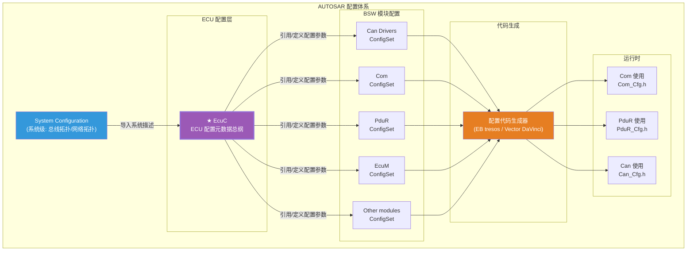

---

## 2. 设计机制与模式

### 2.1 EcuC 的核心对象层次

AUTOSAR 的 EcuC 规范定义了以下核心元数据对象层级：

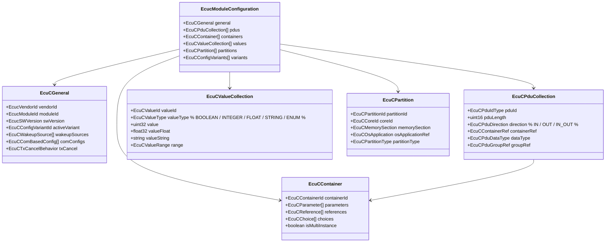

### 2.2 EcuC 的两大角色

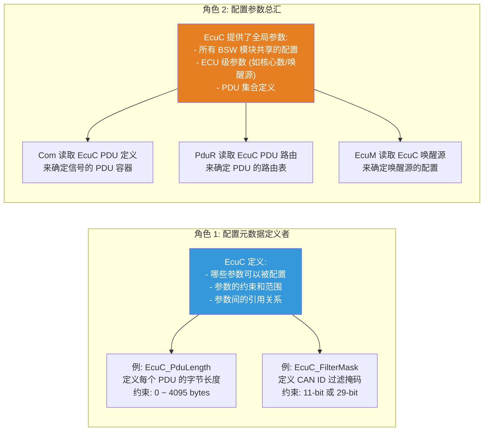

### 2.3 EcuC 设计模式解析

#### 模式 1：元数据驱动 (Metadata-Driven)

EcuC 是 AUTOSAR **元模型驱动的配置体系**的典型体现：

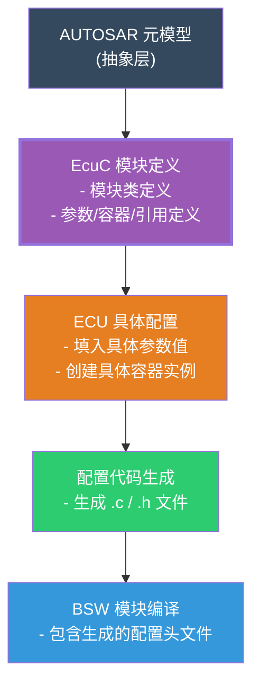

**工作流程详解：**

```
步骤 1: 元模型层 (AUTOSAR 标准定义)
  ┌──────────────────────────────────────────────────────────────┐
  │ AUTOSAR XML Schema (即 .arxml 格式定义)                       │
  │   - EcucModuleDef 定义了每个模块有哪些容器、参数、引用            │
  │   - 例如: "EcuC module 必须有 EcuCPduCollection 容器"          │
  │   - 定义了参数的类型约束 (如 uint16 / enum / string)            │
  └──────────────────────────────────────────────────────────────┘
                     ↓ 导入到配置工具
步骤 2: 配置实例层 (EcuC 配置)
  ┌──────────────────────────────────────────────────────────────┐
  │ EB tresos / Vector DaVinci 中的配置                           │
  │   - 创建 EcuCPduCollection 实例                               │
  │   - 填入具体 PDU 名称 "EngData_100"                           │
  │   - 填入 Length = 8                                          │
  │   - 选择 Direction = SEND                                    │
  └──────────────────────────────────────────────────────────────┘
                     ↓ 代码生成
步骤 3: 代码生成层
  ┌──────────────────────────────────────────────────────────────┐
  │ gen_EcuC_Cfg.h 中:                                            │
  │   #define EcuC_PDU_EngData_100_LENGTH  8U                     │
  │   #define EcuC_PDU_EngData_100_DIR     COM_SEND               │
  └──────────────────────────────────────────────────────────────┘
                     ↓ 编译
步骤 4: 运行时
  ┌──────────────────────────────────────────────────────────────┐
  │ Com 模块使用 EcuC_PDU_EngData_100_LENGTH 初始化 PDU 缓冲区      │
  └──────────────────────────────────────────────────────────────┘
```

#### 模式 2：单一真相源 (Single Source of Truth)

EcuC 作为 ECU 配置的 **单一真相源**，所有 BSW 模块的公共配置都从 EcuC 派生：

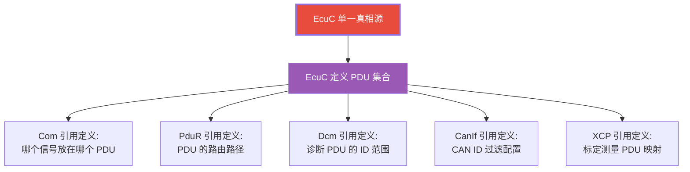

#### 模式 3：变体管理 (Variant Management)

EcuC 支持通过配置变体实现 **同一套代码兼容多个 ECU 产品变型**：

```
EcuC 变体树:
  ECU (基础配置)
  ├── EcucConfigVariant: BASE      ← 所有 ECU 公共参数
  │
  ├── EcucConfigVariant: HIGH      ← 高配版
  │   ├── EcuCPduCollection: ADAS_CAM_DATA   (额外 PDU)
  │   ├── EcuCPduCollection: LIDAR_DATA      (额外 PDU)
  │   └── EcuCPartition: CORES_3             (3 核)
  │
  ├── EcucConfigVariant: MID       ← 中配版
  │   ├── EcuCPduCollection: ADAS_CAM_DATA   (减少信号)
  │   └── EcuCPartition: CORES_2             (2 核)
  │
  └── EcucConfigVariant: LOW       ← 低配版
      └── EcuCPartition: CORES_1             (1 核, 无 ADAS)

  配置工具负责:
  1. 在代码生成时选择当前活动的变体
  2. 只生成活动变体包含的配置代码
  3. 未选变体的配置被 #ifdef / #if 排除
```

### 2.4 EcuC 配置的引用链

EcuC 的配置通过引用在各 BSW 模块之间建立联系：

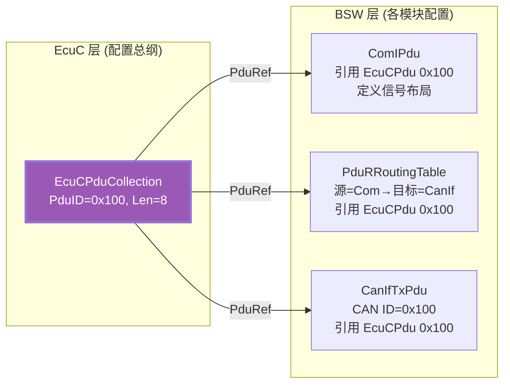

这种引用链的设计保证了：

1. **一致性** — 同一个 PDU ID 0x100 在所有模块中的字节长度一致 (8 bytes)
2. **可追溯** — 从 CAN 总线到应用层的信号链路可以完整追溯
3. **可自动化** — 配置工具可以自动校验引用完整性

---

## 3. 深入原理

### 3.1 EcuC 模块的 AUTOSAR 元模型结构

在 AUTOSAR 元模型层面，EcuC 的定义包含以下核心元素：

```
EcuC 模块定义 (EcuC EcucModuleDef):
│
├── EcucGeneral                   # 通用参数组
│   ├── EcucVendorId              # 供应商 ID (如 Vector=9, ETAS=43)
│   ├── EcucModuleId              # 模块 ID (AUTOSAR 分配的 ID)
│   ├── EcucSwVersion             # 软件版本字符串
│   ├── EcucConfigVariantId       # 当前配置变体
│   ├── EcucWakeupSource          # 唤醒源配置
│   │   ├── EcucWakeupSourceId    # 唤醒源 ID
│   │   ├── EcucWakeupPolarity    # 唤醒极性 (上升沿/下降沿/电平)
│   │   └── EcucWakeupDebounce    # 唤醒消抖时间 (ms)
│   ├── EcucComBasedConfig        # 基于通信的配置
│   │   ├── EcucComBasedStartOnEvent  # 事件启动
│   │   └── EcucComBasedTimeout      # 通信超时
│   └── EcucTxCancelBehavior      # 发送取消行为
│       ├── EcucTxCancelTimeout   # 取消超时
│       └── EcucTxCancelRetry     # 取消重试次数
│
├── EcucPduCollection             # PDU 集合 (ECU 级)
│   ├── EcucPduId                 # PDU ID (全局唯一)
│   ├── EcucPduLength             # PDU 长度 (bytes)
│   ├── EcucPduDirection          # 方向 (IN/OUT/IN_OUT)
│   ├── EcucPduDataType           # 数据类型 (CAN/LIN/FlexRay/Ethernet)
│   ├── EcucPduGroupRef           # PDU 组引用
│   ├── EcucPduMetaData           # PDU 元数据 (如 DLC、ID 类型)
│   └── EcucPduContainerRef       # 引用的容器
│
├── EcucContainer                 # 配置容器 (模块实例)
│   ├── EcucContainerId           # 容器 ID
│   ├── EcucContainerMultiplicity # 多重性 (0..1, 1..*, 0..*)
│   ├── EcucParameter[]           # 包含的参数列表
│   └── EcucReference[]           # 引用的列表
│
├── EcucValueCollection           # 值集合 (全局常量)
│   ├── EcucValueId               # 值 ID
│   ├── EcucValueType             # 类型 (BOOLEAN/INTEGER/FLOAT/STRING)
│   ├── EcucValue                 # 值
│   └── EcucValueRange            # 取值约束范围
│
├── EcucPartition                 # 分区/核心配置
│   ├── EcucPartitionId           # 分区 ID
│   ├── EcucCoreRef               # 引用的核心
│   ├── EcucOsApplicationRef      # 关联的 OS 应用
│   ├── EcucMemorySection         # 内存段定义
│   └── EcucBswModuleRef[]        # 分配到该分区 BSW 模块
│
└── EcucConfigVariant             # 配置变体
    ├── EcucConfigVariantId       # 变体 ID
    ├── EcucVariantCondition      # 变体条件表达式
    └── EcucConfigSelection[]     # 选中的配置项
```

### 3.2 EcuC 与其它 BSW 模块配置的引用关系

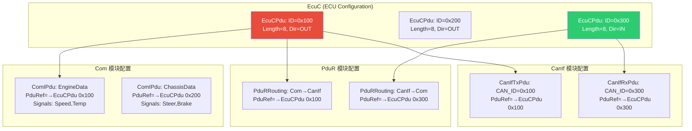

### 3.3 EcuC 在 AUTOSAR 配置工具中的角色

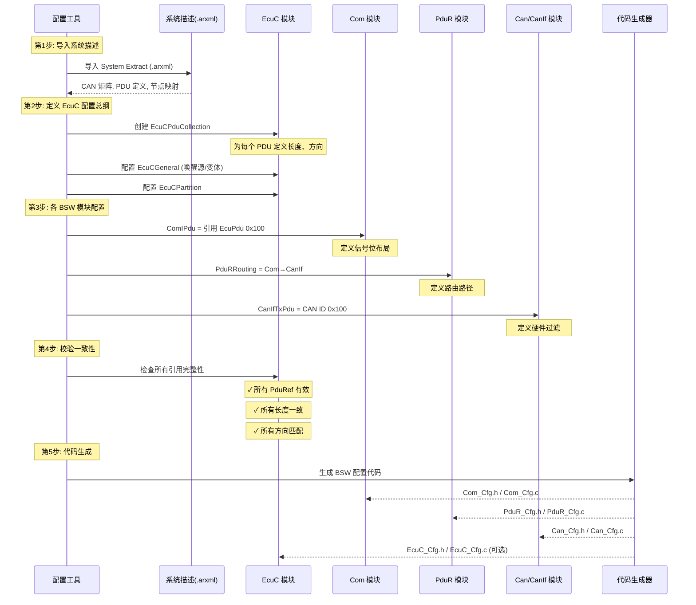

### 3.4 EcuC 的 PDU 方向与一致性检查

EcuC 定义了 PDU 的 **方向一致性规则**，这是配置验证的核心：

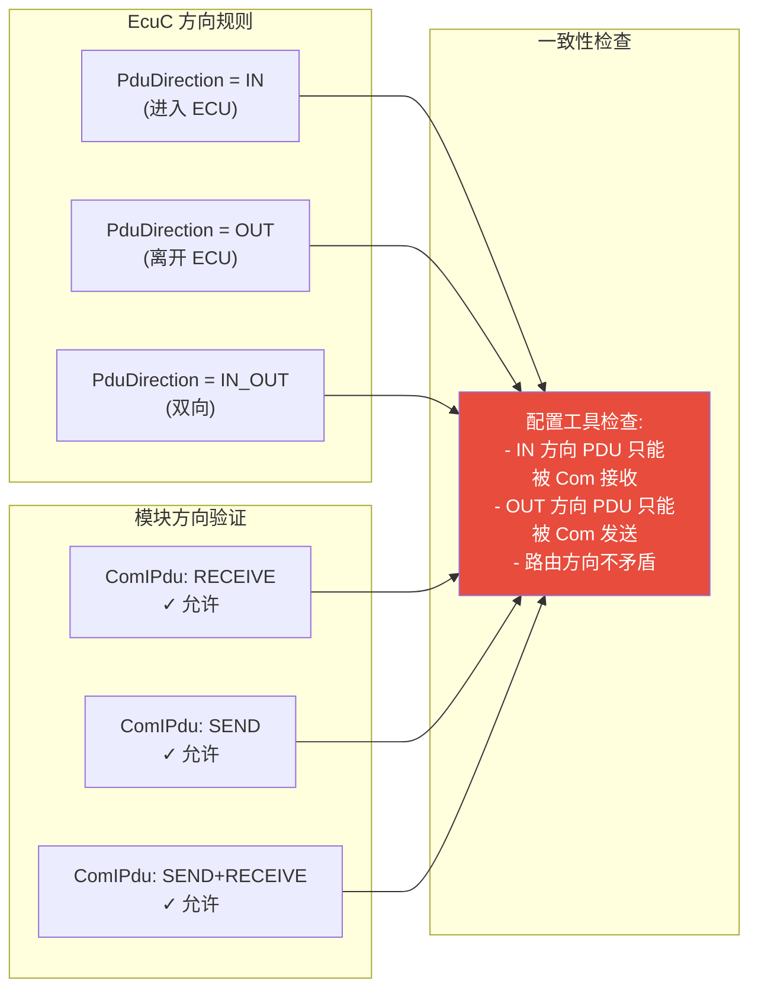

**一致性检查规则：**

| 检查项 | 规则 | 违反后果 |
|--------|------|---------|
| PduLength 一致性 | 所有引用同一 EcuCPdu 的模块必须使用相同 Length | 缓冲区溢出或截断 |
| Direction 匹配 | Com SEND → EcuC OUT, Com RECEIVE → EcuC IN | 接收死信或发送到错误方向 |
| PduRef 完整性 | 所有 BSW 模块的 PduRef 必须指向已定义的 EcuCPdu | 链接错误 |
| CanId 唯一性 | 同一 CAN 网络上不允许两个 TX PDU 有相同 CAN ID | 总线冲突 |
| Multiplicity 约束 | 容器的实例数量必须在定义的多重性范围内 | 配置工具报错 |
| 跨核引用 | 引用必须指向同一 Partition 内或显式跨核标记 | 运行时内存访问错误 |

### 3.5 EcuC 在 Multi-Core 架构中的角色

在多核 AUTOSAR 架构中，EcuC 定义了 **分区 (Partition) 和核心 (Core) 的映射**：

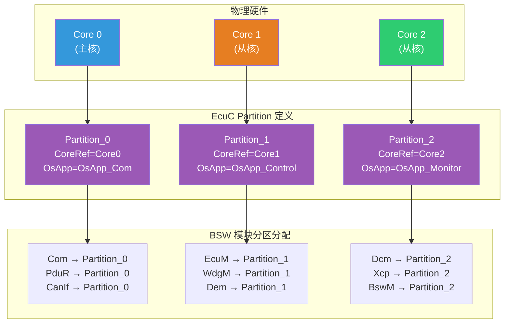

### 3.6 EcuC 与通用 ECU 参数

EcuCGeneral 部分定义的参数是所有 BSW 模块的 **公共全局参数**：

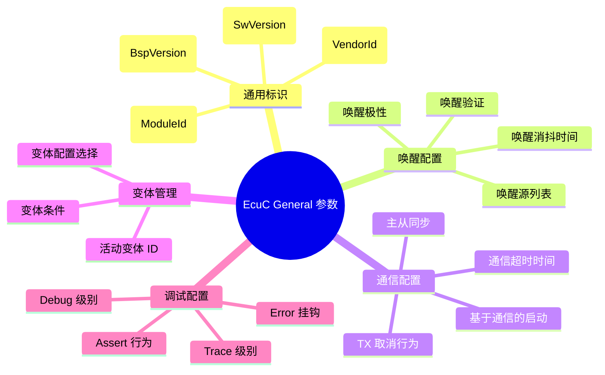

---

## 4. 完整代码示例

### 4.1 EcuC 配置头文件 (代码生成输出)

```c
/******************************************************************************
 * @file    EcuC_Cfg.h
 * @brief   AUTOSAR EcuC 模块 — 配置头文件
 * @note    由配置工具自动生成 (EB tresos / Vector DaVinci)
 * @details 本文件定义了 ECU 级全局配置参数和 PDU 集合
 *          所有 BSW 模块引用 EcuC 定义的 PDU 和参数
 ******************************************************************************/

#ifndef ECUC_CFG_H
#define ECUC_CFG_H

#include "Std_Types.h"

/* ======================== 通用信息 ======================== */

/* 供应商和模块信息 */
#define ECUC_VENDOR_ID                  9U          /* Vector */
#define ECUC_MODULE_ID                  42U         /* EcuC Module ID */
#define ECUC_SW_MAJOR_VERSION           4U
#define ECUC_SW_MINOR_VERSION           4U
#define ECUC_SW_PATCH_VERSION           0U
#define ECUC_SW_VERSION_STRING          "4.4.0"

/* 当前激活的配置变体 */
#define ECUC_ACTIVE_CONFIG_VARIANT      ECUC_VARIANT_PRODUCTION

/* 变体枚举 */
#define ECUC_VARIANT_PRODUCTION         0U          /* 量产版 */
#define ECUC_VARIANT_DEBUG              1U          /* 调试版 */
#define ECUC_VARIANT_EOL               2U          /* 产线终检版 */
#define ECUC_VARIANT_DEV               3U          /* 开发版 */

/* ======================== ECU 核心配置 ======================== */

/* 核心数量 */
#define ECUC_NUM_CORES                  3U

/* 核心 ID 定义 */
#define ECUC_CORE_ID_MAIN               0U          /* 主核: 通信栈 + COM */
#define ECUC_CORE_ID_CONTROL            1U          /* 控制核: 控制算法 */
#define ECUC_CORE_ID_MONITOR            2U          /* 监控核: 诊断 + 标定 */

/* ======================== 唤醒源配置 ======================== */

/* 唤醒源 ID */
#define ECUC_WAKEUP_SRC_CAN0            0U          /* CAN0 唤醒 */
#define ECUC_WAKEUP_SRC_CAN1            1U          /* CAN1 唤醒 */
#define ECUC_WAKEUP_SRC_LIN0            2U          /* LIN0 唤醒 */
#define ECUC_WAKEUP_SRC_IGNITION        3U          /* 点火信号唤醒 */
#define ECUC_WAKEUP_SRC_TIMER           4U          /* 定时唤醒 */

#define ECUC_NUM_WAKEUP_SOURCES         5U

/* 唤醒源极性 */
#define ECUC_WAKEUP_POLARITY_HIGH       0U          /* 高电平唤醒 */
#define ECUC_WAKEUP_POLARITY_LOW        1U          /* 低电平唤醒 */
#define ECUC_WAKEUP_POLARITY_RISING     2U          /* 上升沿唤醒 */
#define ECUC_WAKEUP_POLARITY_FALLING    3U          /* 下降沿唤醒 */

/* ======================== PDU 集合定义 ======================== */

/*
 * EcuC PDU 集合 — 本 ECU 所有 PDU 的全局唯一定义
 *
 * 命名规则: ECUC_PDU_<功能>_<方向>
 *   <方向>: IN  = 进入 ECU (接收)
 *           OUT = 离开 ECU (发送)
 */

/* PDU ID 枚举 */
#define ECUC_PDU_INVALID                0xFFFFU     /* 无效 PDU ID */

typedef enum {
    /* ===== 发送 PDU (OUT) ===== */
    ECUC_PDU_ENG_DATA_1_OUT     = 0U,     /* 引擎数据组1,   CAN 0x100, 8B */
    ECUC_PDU_ENG_DATA_2_OUT     = 1U,     /* 引擎数据组2,   CAN 0x101, 8B */
    ECUC_PDU_CHASSIS_DATA_OUT   = 2U,     /* 底盘数据,     CAN 0x200, 8B */
    ECUC_PDU_BODY_STATUS_OUT    = 3U,     /* 车身状态,     CAN 0x300, 8B */
    ECUC_PDU_DEBUG_DATA_OUT     = 4U,     /* 调试数据,     CAN 0x500, 8B */
    ECUC_PDU_NM_OUT             = 5U,     /* 网络管理 PDU, CAN 0x600, 8B */

    /* ===== 接收 PDU (IN) ===== */
    ECUC_PDU_ENG_CTRL_IN        = 6U,     /* 引擎控制,     CAN 0x102, 8B */
    ECUC_PDU_TCU_CTRL_IN        = 7U,     /* 变速箱控制,   CAN 0x202, 8B */
    ECUC_PDU_BODY_CTRL_IN       = 8U,     /* 车身控制,     CAN 0x302, 8B */
    ECUC_PDU_DIAG_REQ_IN        = 9U,     /* 诊断请求,     CAN 0x700, 8B */
    ECUC_PDU_DIAG_RESP_OUT      = 10U,    /* 诊断响应,     CAN 0x701, 8B */
    ECUC_PDU_NM_IN              = 11U,    /* 网络管理 IN,  CAN 0x600, 8B */

    /* ===== CAN FD PDU (64 字节) ===== */
    ECUC_PDU_ADAS_CAM_FD_OUT    = 12U,    /* ADAS 摄像头,  CAN FD, 64B */
    ECUC_PDU_LIDAR_FD_OUT       = 13U,    /* 激光雷达,     CAN FD, 64B */
    ECUC_PDU_RAW_SENSOR_FD_IN   = 14U,    /* 原始传感器,   CAN FD, 64B */

    ECUC_PDU_COUNT
} EcuC_PduIdType;

/* PDU 长度定义 (bytes) */
#define ECUC_PDU_ENG_DATA_1_OUT_LEN      8U
#define ECUC_PDU_ENG_DATA_2_OUT_LEN      8U
#define ECUC_PDU_CHASSIS_DATA_OUT_LEN    8U
#define ECUC_PDU_BODY_STATUS_OUT_LEN     8U
#define ECUC_PDU_DEBUG_DATA_OUT_LEN      8U
#define ECUC_PDU_NM_OUT_LEN              8U
#define ECUC_PDU_ENG_CTRL_IN_LEN         8U
#define ECUC_PDU_TCU_CTRL_IN_LEN         8U
#define ECUC_PDU_BODY_CTRL_IN_LEN        8U
#define ECUC_PDU_DIAG_REQ_IN_LEN         8U
#define ECUC_PDU_DIAG_RESP_OUT_LEN       8U
#define ECUC_PDU_NM_IN_LEN               8U
#define ECUC_PDU_ADAS_CAM_FD_OUT_LEN     64U
#define ECUC_PDU_LIDAR_FD_OUT_LEN        64U
#define ECUC_PDU_RAW_SENSOR_FD_IN_LEN    64U

/* PDU 方向枚举 */
typedef enum {
    ECUC_PDU_DIR_IN             = 0U,   /* ECU 接收 */
    ECUC_PDU_DIR_OUT            = 1U,   /* ECU 发送 */
    ECUC_PDU_DIR_IN_OUT         = 2U    /* 双向 */
} EcuC_PduDirectionType;

/* PDU 数据类型枚举 */
typedef enum {
    ECUC_PDU_TYPE_CAN           = 0U,   /* CAN 2.0 */
    ECUC_PDU_TYPE_CAN_FD        = 1U,   /* CAN FD */
    ECUC_PDU_TYPE_LIN           = 2U,   /* LIN */
    ECUC_PDU_TYPE_FLEXRAY       = 3U,   /* FlexRay */
    ECUC_PDU_TYPE_ETHERNET      = 4U    /* Ethernet */
} EcuC_PduDataTypeType;

/* ======================== PDU 元数据表 ======================== */

/*
 * PDU 元数据表 — 运行时可通过 EcuC 接口查询
 * 配置工具根据上面的宏定义自动生成此表
 */
typedef struct {
    EcuC_PduIdType          PduId;              /* PDU ID */
    const char*             PduName;            /* PDU 名称 (调试用) */
    uint16                  PduLength;          /* PDU 字节长度 */
    EcuC_PduDirectionType   Direction;          /* 方向 */
    EcuC_PduDataTypeType    DataType;           /* 数据类型 */
    uint16                  CanId;              /* CAN ID (仅 CAN 类型) */
    uint8                   ControllerId;       /* CAN 控制器索引 */
} EcuC_PduMetaDataType;

/* ======================== 分区/核心配置 ======================== */

/* 分区类型枚举 */
typedef enum {
    ECUC_PARTITION_COMM      = 0U,    /* 通信分区 */
    ECUC_PARTITION_CONTROL   = 1U,    /* 控制分区 */
    ECUC_PARTITION_MONITOR   = 2U     /* 监控分区 */
} EcuC_PartitionIdType;

/* 分区映射表 */
typedef struct {
    EcuC_PartitionIdType     PartitionId;
    uint8                    CoreId;
    const char*              OsApplicationName;
    uint32                   MemoryStartAddress;
    uint32                   MemorySize;
} EcuC_PartitionConfigType;

/* ======================== 值集合 ======================== */

/* 全局常量值 ID */
#define ECUC_VAL_PRODUCTION_SN          0U     /* 生产序列号 */
#define ECUC_VAL_HW_VERSION             1U     /* 硬件版本 */
#define ECUC_VAL_SYS_IDLE_TIMEOUT       2U     /* 系统空闲超时 (ms) */
#define ECUC_VAL_MAX_DTC_COUNT          3U     /* 最大 DTC 数量 */

/* ======================== 配置变体选择 ======================== */

/* 编译时选择配置变体 */
#if (ECUC_ACTIVE_CONFIG_VARIANT == ECUC_VARIANT_PRODUCTION)
    /* 量产版: 完全优化, 无调试 */
    #define ECUC_FEATURE_DEBUG              DISABLED
    #define ECUC_FEATURE_EOL_CALIBRATION    DISABLED
    #define ECUC_FEATURE_EXTENDED_DIAG      DISABLED
    #define ECUC_NUM_RX_PDU                8U
    #define ECUC_NUM_TX_PDU                7U

#elif (ECUC_ACTIVE_CONFIG_VARIANT == ECUC_VARIANT_DEBUG)
    /* 调试版: 启用所有调试功能 */
    #define ECUC_FEATURE_DEBUG              ENABLED
    #define ECUC_FEATURE_EOL_CALIBRATION    ENABLED
    #define ECUC_FEATURE_EXTENDED_DIAG      ENABLED
    #define ECUC_NUM_RX_PDU                12U   /* 额外调试 PDU */
    #define ECUC_NUM_TX_PDU                10U

#elif (ECUC_ACTIVE_CONFIG_VARIANT == ECUC_VARIANT_EOL)
    /* 产线终检版: 启用标定但禁用调试 */
    #define ECUC_FEATURE_DEBUG              DISABLED
    #define ECUC_FEATURE_EOL_CALIBRATION    ENABLED
    #define ECUC_FEATURE_EXTENDED_DIAG      ENABLED
    #define ECUC_NUM_RX_PDU                8U
    #define ECUC_NUM_TX_PDU                7U

#elif (ECUC_ACTIVE_CONFIG_VARIANT == ECUC_VARIANT_DEV)
    /* 开发版: 全部启用 */
    #define ECUC_FEATURE_DEBUG              ENABLED
    #define ECUC_FEATURE_EOL_CALIBRATION    ENABLED
    #define ECUC_FEATURE_EXTENDED_DIAG      ENABLED
    #define ECUC_NUM_RX_PDU                15U
    #define ECUC_NUM_TX_PDU                12U
#endif

#endif /* ECUC_CFG_H */
```

### 4.2 EcuC 配置源文件 (代码生成输出)

```c
/******************************************************************************
 * @file    EcuC_Cfg.c
 * @brief   AUTOSAR EcuC 模块 — 配置表实现
 * @note    由配置工具自动生成
 ******************************************************************************/

#include "EcuC_Cfg.h"

/* ======================== PDU 元数据表 ======================== */

const EcuC_PduMetaDataType EcuC_PduMetaDataTable[ECUC_PDU_COUNT] = {
    /* --- 发送 PDU (OUT) --- */
    [ECUC_PDU_ENG_DATA_1_OUT] = {
        .PduId       = ECUC_PDU_ENG_DATA_1_OUT,
        .PduName     = "ENG_DATA_1",
        .PduLength   = ECUC_PDU_ENG_DATA_1_OUT_LEN,
        .Direction   = ECUC_PDU_DIR_OUT,
        .DataType    = ECUC_PDU_TYPE_CAN,
        .CanId       = 0x100U,
        .ControllerId = 0U
    },
    [ECUC_PDU_ENG_DATA_2_OUT] = {
        .PduId       = ECUC_PDU_ENG_DATA_2_OUT,
        .PduName     = "ENG_DATA_2",
        .PduLength   = ECUC_PDU_ENG_DATA_2_OUT_LEN,
        .Direction   = ECUC_PDU_DIR_OUT,
        .DataType    = ECUC_PDU_TYPE_CAN,
        .CanId       = 0x101U,
        .ControllerId = 0U
    },
    [ECUC_PDU_CHASSIS_DATA_OUT] = {
        .PduId       = ECUC_PDU_CHASSIS_DATA_OUT,
        .PduName     = "CHASSIS_DATA",
        .PduLength   = ECUC_PDU_CHASSIS_DATA_OUT_LEN,
        .Direction   = ECUC_PDU_DIR_OUT,
        .DataType    = ECUC_PDU_TYPE_CAN,
        .CanId       = 0x200U,
        .ControllerId = 0U
    },
    [ECUC_PDU_BODY_STATUS_OUT] = {
        .PduId       = ECUC_PDU_BODY_STATUS_OUT,
        .PduName     = "BODY_STATUS",
        .PduLength   = ECUC_PDU_BODY_STATUS_OUT_LEN,
        .Direction   = ECUC_PDU_DIR_OUT,
        .DataType    = ECUC_PDU_TYPE_CAN,
        .CanId       = 0x300U,
        .ControllerId = 0U
    },
    [ECUC_PDU_DEBUG_DATA_OUT] = {
        .PduId       = ECUC_PDU_DEBUG_DATA_OUT,
        .PduName     = "DEBUG_DATA",
        .PduLength   = ECUC_PDU_DEBUG_DATA_OUT_LEN,
        .Direction   = ECUC_PDU_DIR_OUT,
        .DataType    = ECUC_PDU_TYPE_CAN,
        .CanId       = 0x500U,
        .ControllerId = 0U
    },
    [ECUC_PDU_NM_OUT] = {
        .PduId       = ECUC_PDU_NM_OUT,
        .PduName     = "NM",
        .PduLength   = ECUC_PDU_NM_OUT_LEN,
        .Direction   = ECUC_PDU_DIR_OUT,
        .DataType    = ECUC_PDU_TYPE_CAN,
        .CanId       = 0x600U,
        .ControllerId = 0U
    },

    /* --- 接收 PDU (IN) --- */
    [ECUC_PDU_ENG_CTRL_IN] = {
        .PduId       = ECUC_PDU_ENG_CTRL_IN,
        .PduName     = "ENG_CTRL",
        .PduLength   = ECUC_PDU_ENG_CTRL_IN_LEN,
        .Direction   = ECUC_PDU_DIR_IN,
        .DataType    = ECUC_PDU_TYPE_CAN,
        .CanId       = 0x102U,
        .ControllerId = 0U
    },
    [ECUC_PDU_TCU_CTRL_IN] = {
        .PduId       = ECUC_PDU_TCU_CTRL_IN,
        .PduName     = "TCU_CTRL",
        .PduLength   = ECUC_PDU_TCU_CTRL_IN_LEN,
        .Direction   = ECUC_PDU_DIR_IN,
        .DataType    = ECUC_PDU_TYPE_CAN,
        .CanId       = 0x202U,
        .ControllerId = 0U
    },
    [ECUC_PDU_BODY_CTRL_IN] = {
        .PduId       = ECUC_PDU_BODY_CTRL_IN,
        .PduName     = "BODY_CTRL",
        .PduLength   = ECUC_PDU_BODY_CTRL_IN_LEN,
        .Direction   = ECUC_PDU_DIR_IN,
        .DataType    = ECUC_PDU_TYPE_CAN,
        .CanId       = 0x302U,
        .ControllerId = 1U
    },
    [ECUC_PDU_DIAG_REQ_IN] = {
        .PduId       = ECUC_PDU_DIAG_REQ_IN,
        .PduName     = "DIAG_REQ",
        .PduLength   = ECUC_PDU_DIAG_REQ_IN_LEN,
        .Direction   = ECUC_PDU_DIR_IN,
        .DataType    = ECUC_PDU_TYPE_CAN,
        .CanId       = 0x700U,
        .ControllerId = 0U
    },
    [ECUC_PDU_DIAG_RESP_OUT] = {
        .PduId       = ECUC_PDU_DIAG_RESP_OUT,
        .PduName     = "DIAG_RESP",
        .PduLength   = ECUC_PDU_DIAG_RESP_OUT_LEN,
        .Direction   = ECUC_PDU_DIR_OUT,
        .DataType    = ECUC_PDU_TYPE_CAN,
        .CanId       = 0x701U,
        .ControllerId = 0U
    },
    [ECUC_PDU_NM_IN] = {
        .PduId       = ECUC_PDU_NM_IN,
        .PduName     = "NM_IN",
        .PduLength   = ECUC_PDU_NM_IN_LEN,
        .Direction   = ECUC_PDU_DIR_IN,
        .DataType    = ECUC_PDU_TYPE_CAN,
        .CanId       = 0x600U,
        .ControllerId = 0U
    },

    /* --- CAN FD PDU --- */
    [ECUC_PDU_ADAS_CAM_FD_OUT] = {
        .PduId       = ECUC_PDU_ADAS_CAM_FD_OUT,
        .PduName     = "ADAS_CAM_FD",
        .PduLength   = ECUC_PDU_ADAS_CAM_FD_OUT_LEN,
        .Direction   = ECUC_PDU_DIR_OUT,
        .DataType    = ECUC_PDU_TYPE_CAN_FD,
        .CanId       = 0x400U,
        .ControllerId = 2U
    },
    [ECUC_PDU_LIDAR_FD_OUT] = {
        .PduId       = ECUC_PDU_LIDAR_FD_OUT,
        .PduName     = "LIDAR_FD",
        .PduLength   = ECUC_PDU_LIDAR_FD_OUT_LEN,
        .Direction   = ECUC_PDU_DIR_OUT,
        .DataType    = ECUC_PDU_TYPE_CAN_FD,
        .CanId       = 0x401U,
        .ControllerId = 2U
    },
    [ECUC_PDU_RAW_SENSOR_FD_IN] = {
        .PduId       = ECUC_PDU_RAW_SENSOR_FD_IN,
        .PduName     = "RAW_SENSOR_FD",
        .PduLength   = ECUC_PDU_RAW_SENSOR_FD_IN_LEN,
        .Direction   = ECUC_PDU_DIR_IN,
        .DataType    = ECUC_PDU_TYPE_CAN_FD,
        .CanId       = 0x402U,
        .ControllerId = 2U
    }
};

/* ======================== 分区/核心映射表 ======================== */

const EcuC_PartitionConfigType EcuC_PartitionConfig[ECUC_NUM_CORES] = {
    [ECUC_PARTITION_COMM] = {
        .PartitionId       = ECUC_PARTITION_COMM,
        .CoreId            = ECUC_CORE_ID_MAIN,
        .OsApplicationName = "OsApp_Comm",
        .MemoryStartAddress = 0x20000000U,
        .MemorySize        = 0x00010000U  /* 64KB */
    },
    [ECUC_PARTITION_CONTROL] = {
        .PartitionId       = ECUC_PARTITION_CONTROL,
        .CoreId            = ECUC_CORE_ID_CONTROL,
        .OsApplicationName = "OsApp_Control",
        .MemoryStartAddress = 0x20010000U,
        .MemorySize        = 0x00010000U  /* 64KB */
    },
    [ECUC_PARTITION_MONITOR] = {
        .PartitionId       = ECUC_PARTITION_MONITOR,
        .CoreId            = ECUC_CORE_ID_MONITOR,
        .OsApplicationName = "OsApp_Monitor",
        .MemoryStartAddress = 0x20020000U,
        .MemorySize        = 0x00008000U  /* 32KB */
    }
};

/* ======================== 唤醒源配置表 ======================== */

typedef struct {
    uint8   WakeupSourceId;
    const char* WakeupSourceName;
    uint8   Polarity;
    uint16  DebounceTimeMs;
    boolean Enabled;
} EcuC_WakeupSourceConfigType;

const EcuC_WakeupSourceConfigType EcuC_WakeupSourceConfig[ECUC_NUM_WAKEUP_SOURCES] = {
    {
        .WakeupSourceId   = ECUC_WAKEUP_SRC_CAN0,
        .WakeupSourceName = "CAN0 Wakeup",
        .Polarity         = ECUC_WAKEUP_POLARITY_FALLING,
        .DebounceTimeMs   = 50U,
        .Enabled          = TRUE
    },
    {
        .WakeupSourceId   = ECUC_WAKEUP_SRC_CAN1,
        .WakeupSourceName = "CAN1 Wakeup",
        .Polarity         = ECUC_WAKEUP_POLARITY_FALLING,
        .DebounceTimeMs   = 50U,
        .Enabled          = TRUE
    },
    {
        .WakeupSourceId   = ECUC_WAKEUP_SRC_LIN0,
        .WakeupSourceName = "LIN0 Wakeup",
        .Polarity         = ECUC_WAKEUP_POLARITY_RISING,
        .DebounceTimeMs   = 100U,
        .Enabled          = TRUE
    },
    {
        .WakeupSourceId   = ECUC_WAKEUP_SRC_IGNITION,
        .WakeupSourceName = "Ignition",
        .Polarity         = ECUC_WAKEUP_POLARITY_HIGH,
        .DebounceTimeMs   = 30U,
        .Enabled          = TRUE
    },
    {
        .WakeupSourceId   = ECUC_WAKEUP_SRC_TIMER,
        .WakeupSourceName = "Timer Wakeup",
        .Polarity         = ECUC_WAKEUP_POLARITY_HIGH,
        .DebounceTimeMs   = 0U,
        .Enabled          = FALSE        /* 定时唤醒禁用 */
    }
};

/* ======================== 全局值集合 ======================== */

typedef struct {
    uint8   ValueId;
    const char* ValueName;
    uint32  Value;
} EcuC_ValueConfigType;

const EcuC_ValueConfigType EcuC_ValueCollection[] = {
    {
        .ValueId   = ECUC_VAL_PRODUCTION_SN,
        .ValueName = "ProductionSerialNumber",
        .Value     = 0x20240720U
    },
    {
        .ValueId   = ECUC_VAL_HW_VERSION,
        .ValueName = "HardwareVersion",
        .Value     = 0x0102U     /* v1.2 */
    },
    {
        .ValueId   = ECUC_VAL_SYS_IDLE_TIMEOUT,
        .ValueName = "SystemIdleTimeout",
        .Value     = 5000U       /* 5s 空闲超时 */
    },
    {
        .ValueId   = ECUC_VAL_MAX_DTC_COUNT,
        .ValueName = "MaxDtcCount",
        .Value     = 50U
    }
};
```

### 4.3 EcuC 运行时查询接口

```c
/******************************************************************************
 * @file    EcuC.c
 * @brief   AUTOSAR EcuC 模块运行时接口
 * @note    极小运行时上下文 — 主要提供元数据查询和验证
 ******************************************************************************/

#include "EcuC.h"

/* 模块状态 */
static EcuC_ModuleStateType EcuC_ModuleState = ECUC_STATE_UNINIT;

/******************************************************************************
 * @brief   EcuC 模块初始化
 * @param   ConfigPtr 配置结构体指针 (可为 NULL, 由生成代码定义)
 * @return  Std_ReturnType
 * @note    主要是验证配置与硬件的匹配性
 ******************************************************************************/
Std_ReturnType EcuC_Init(const void* ConfigPtr)
{
    Std_ReturnType ret = E_OK;

    /* 验证配置 */
    if (EcuC_PduMetaDataTable == NULL_PTR) {
        return E_NOT_OK;
    }

    EcuC_ModuleState = ECUC_STATE_INIT;

    /* 验证硬件核心数与配置一致 */
    uint8 hwCoreCount = EcuC_GetHardwareCoreCount();
    if (hwCoreCount < ECUC_NUM_CORES) {
        /* 硬件支持的核心数小于配置要求 */
        ret = E_NOT_OK;
    }

    /* 验证 CAN 控制器存在 */
    uint8 maxCtrlId = 0;
    for (uint32 i = 0; i < ECUC_PDU_COUNT; i++) {
        if (EcuC_PduMetaDataTable[i].ControllerId > maxCtrlId) {
            maxCtrlId = EcuC_PduMetaDataTable[i].ControllerId;
        }
    }
    if (maxCtrlId >= EcuC_GetNumCanControllers()) {
        ret = E_NOT_OK;
    }

    EcuC_ModuleState = ECUC_STATE_READY;
    return ret;
}

/******************************************************************************
 * @brief   获取 PDU 元数据
 * @param   PduId  PDU ID
 * @return  const EcuC_PduMetaDataType*  PDU 元数据指针, NULL 无效
 ******************************************************************************/
const EcuC_PduMetaDataType* EcuC_GetPduMetaData(EcuC_PduIdType PduId)
{
    if (PduId >= ECUC_PDU_COUNT ||
        EcuC_ModuleState < ECUC_STATE_INIT) {
        return NULL_PTR;
    }

    return &EcuC_PduMetaDataTable[PduId];
}

/******************************************************************************
 * @brief   获取 PDU 字节长度
 * @param   PduId  PDU ID
 * @return  uint16  长度 (bytes), 0 表示无效
 ******************************************************************************/
uint16 EcuC_GetPduLength(EcuC_PduIdType PduId)
{
    if (PduId >= ECUC_PDU_COUNT) {
        return 0U;
    }
    return EcuC_PduMetaDataTable[PduId].PduLength;
}

/******************************************************************************
 * @brief   检查 PDU 方向是否为发送
 * @param   PduId  PDU ID
 * @return  boolean TRUE = 发送 PDU
 ******************************************************************************/
boolean EcuC_IsPduDirectionOut(EcuC_PduIdType PduId)
{
    if (PduId >= ECUC_PDU_COUNT) {
        return FALSE;
    }
    return (EcuC_PduMetaDataTable[PduId].Direction == ECUC_PDU_DIR_OUT);
}

/******************************************************************************
 * @brief   检查 PDU 方向是否为接收
 * @param   PduId  PDU ID
 * @return  boolean TRUE = 接收 PDU
 ******************************************************************************/
boolean EcuC_IsPduDirectionIn(EcuC_PduIdType PduId)
{
    if (PduId >= ECUC_PDU_COUNT) {
        return FALSE;
    }
    return (EcuC_PduMetaDataTable[PduId].Direction == ECUC_PDU_DIR_IN);
}

/******************************************************************************
 * @brief   获取 PDU 的 CAN ID
 * @param   PduId  PDU ID
 * @return  uint16 CAN ID (仅对 CAN/CAN FD 类型有效)
 ******************************************************************************/
uint16 EcuC_GetPduCanId(EcuC_PduIdType PduId)
{
    if (PduId >= ECUC_PDU_COUNT) {
        return 0xFFFFU;
    }
    return EcuC_PduMetaDataTable[PduId].CanId;
}

/******************************************************************************
 * @brief   PDU 验证函数 (供配置工具或运行时自检使用)
 * @return  EcuC_ValidationResultType
 * @note    验证所有配置的一致性
 ******************************************************************************/
EcuC_ValidationResultType EcuC_ValidateConfiguration(void)
{
    EcuC_ValidationResultType result;
    result.totalChecks   = 0U;
    result.passedChecks  = 0U;
    result.failedChecks  = 0U;
    result.errorCode     = ECUC_ERR_NONE;

    /* 检查 1: PDU 长度非零 */
    for (uint32 i = 0U; i < ECUC_PDU_COUNT; i++) {
        result.totalChecks++;
        if (EcuC_PduMetaDataTable[i].PduLength == 0U) {
            result.failedChecks++;
            result.errorCode = ECUC_ERR_PDU_LENGTH_ZERO;
        } else {
            result.passedChecks++;
        }
    }

    /* 检查 2: 发送 PDU 的 CAN ID 唯一性 (同一控制器) */
    for (uint32 i = 0U; i < ECUC_PDU_COUNT; i++) {
        if (EcuC_PduMetaDataTable[i].Direction != ECUC_PDU_DIR_OUT) {
            continue;
        }
        for (uint32 j = i + 1U; j < ECUC_PDU_COUNT; j++) {
            result.totalChecks++;
            if (EcuC_PduMetaDataTable[j].Direction != ECUC_PDU_DIR_OUT) {
                continue;
            }
            if (EcuC_PduMetaDataTable[i].CanId == EcuC_PduMetaDataTable[j].CanId &&
                EcuC_PduMetaDataTable[i].ControllerId == EcuC_PduMetaDataTable[j].ControllerId) {
                result.failedChecks++;
                result.errorCode = ECUC_ERR_CANID_DUPLICATE;
            } else {
                result.passedChecks++;
            }
        }
    }

    /* 检查 3: 分区分配的核心不超过硬件核心数 */
    result.totalChecks++;
    if (ECUC_NUM_CORES > EcuC_GetHardwareCoreCount()) {
        result.failedChecks++;
        result.errorCode = ECUC_ERR_CORE_COUNT_EXCEEDED;
    } else {
        result.passedChecks++;
    }

    return result;
}
```

### 4.4 EcuC PDU 查询工具宏 (供 BSW 模块使用)

```c
/******************************************************************************
 * @file    EcuC_PduMacros.h
 * @brief   通过宏和内联函数提供 PDU 元数据查询 (编译期优化)
 * @note    这些宏在编译时展开, 零运行时开销
 ******************************************************************************/

#ifndef ECUC_PDU_MACROS_H
#define ECUC_PDU_MACROS_H

#include "EcuC_Cfg.h"

/* ======================== 编译时 PDU 信息查询 ======================== */

/* PDU 长度查询宏 — 直接展开为常量 */
#define ECUC_PDU_LENGTH(pduId) \
    ((pduId) == ECUC_PDU_ENG_DATA_1_OUT   ? ECUC_PDU_ENG_DATA_1_OUT_LEN   : \
     (pduId) == ECUC_PDU_ENG_DATA_2_OUT   ? ECUC_PDU_ENG_DATA_2_OUT_LEN   : \
     (pduId) == ECUC_PDU_CHASSIS_DATA_OUT ? ECUC_PDU_CHASSIS_DATA_OUT_LEN : \
     (pduId) == ECUC_PDU_BODY_STATUS_OUT  ? ECUC_PDU_BODY_STATUS_OUT_LEN  : \
     (pduId) == ECUC_PDU_DIAG_REQ_IN      ? ECUC_PDU_DIAG_REQ_IN_LEN      : \
     (pduId) == ECUC_PDU_DIAG_RESP_OUT    ? ECUC_PDU_DIAG_RESP_OUT_LEN    : \
     (pduId) == ECUC_PDU_NM_OUT           ? ECUC_PDU_NM_OUT_LEN           : \
     (pduId) == ECUC_PDU_NM_IN            ? ECUC_PDU_NM_IN_LEN            : \
     (pduId) == ECUC_PDU_ADAS_CAM_FD_OUT  ? ECUC_PDU_ADAS_CAM_FD_OUT_LEN  : \
     (pduId) == ECUC_PDU_LIDAR_FD_OUT     ? ECUC_PDU_LIDAR_FD_OUT_LEN     : \
     (pduId) == ECUC_PDU_RAW_SENSOR_FD_IN ? ECUC_PDU_RAW_SENSOR_FD_IN_LEN : \
     0U)

/* 是否为发送 PDU */
#define ECUC_IS_TX_PDU(pduId) \
    ((pduId) == ECUC_PDU_ENG_DATA_1_OUT   || \
     (pduId) == ECUC_PDU_ENG_DATA_2_OUT   || \
     (pduId) == ECUC_PDU_CHASSIS_DATA_OUT || \
     (pduId) == ECUC_PDU_BODY_STATUS_OUT  || \
     (pduId) == ECUC_PDU_DEBUG_DATA_OUT   || \
     (pduId) == ECUC_PDU_NM_OUT           || \
     (pduId) == ECUC_PDU_DIAG_RESP_OUT    || \
     (pduId) == ECUC_PDU_ADAS_CAM_FD_OUT  || \
     (pduId) == ECUC_PDU_LIDAR_FD_OUT)

/* 是否为接收 PDU */
#define ECUC_IS_RX_PDU(pduId) \
    ((pduId) == ECUC_PDU_ENG_CTRL_IN      || \
     (pduId) == ECUC_PDU_TCU_CTRL_IN      || \
     (pduId) == ECUC_PDU_BODY_CTRL_IN     || \
     (pduId) == ECUC_PDU_DIAG_REQ_IN      || \
     (pduId) == ECUC_PDU_NM_IN            || \
     (pduId) == ECUC_PDU_RAW_SENSOR_FD_IN)

/* 获取 PDU 的 CAN ID */
#define ECUC_PDU_CAN_ID(pduId) \
    ((pduId) == ECUC_PDU_ENG_DATA_1_OUT   ? 0x100U : \
     (pduId) == ECUC_PDU_ENG_DATA_2_OUT   ? 0x101U : \
     (pduId) == ECUC_PDU_CHASSIS_DATA_OUT ? 0x200U : \
     (pduId) == ECUC_PDU_BODY_STATUS_OUT  ? 0x300U : \
     (pduId) == ECUC_PDU_ENG_CTRL_IN      ? 0x102U : \
     (pduId) == ECUC_PDU_TCU_CTRL_IN      ? 0x202U : \
     (pduId) == ECUC_PDU_BODY_CTRL_IN     ? 0x302U : \
     (pduId) == ECUC_PDU_DIAG_REQ_IN      ? 0x700U : \
     (pduId) == ECUC_PDU_DIAG_RESP_OUT    ? 0x701U : \
     (pduId) == ECUC_PDU_NM_OUT           ? 0x600U : \
     (pduId) == ECUC_PDU_NM_IN            ? 0x600U : \
     (pduId) == ECUC_PDU_ADAS_CAM_FD_OUT  ? 0x400U : \
     (pduId) == ECUC_PDU_LIDAR_FD_OUT     ? 0x401U : \
     (pduId) == ECUC_PDU_RAW_SENSOR_FD_IN ? 0x402U : \
     0xFFFFU)

/* ======================== 其他模块使用示例 ======================== */

/* Com 模块使用 EcuC 的 PDU 长度定义 PDU 缓冲区 */
typedef struct {
    uint8  buffer[ECUC_PDU_LENGTH(ECUC_PDU_ENG_DATA_1_OUT)];
    /* 编译时展开为: uint8 buffer[8]; */
} Com_EngData1BufferType;

/* PduR 使用 EcuC 的 PDU 方向进行路由验证 */
#if (ECUC_IS_TX_PDU(ECUC_PDU_ENG_DATA_1_OUT))
    /* PduR 配置 TX 路由: Com → CanIf */
#endif

#if (ECUC_IS_RX_PDU(ECUC_PDU_ENG_CTRL_IN))
    /* PduR 配置 RX 路由: CanIf → Com */
#endif

#endif /* ECUC_PDU_MACROS_H */
```

### 4.5 EcuC 配置验证器 (配置工具逻辑示例)

```c
/******************************************************************************
 * @file    EcuC_ConfigValidator.c
 * @brief   EcuC 配置验证器 — 配置工具内部逻辑
 * @note    示例说明配置工具如何验证所有 BSW 配置的一致性
 ******************************************************************************/

#include "EcuC_ConfigValidator.h"

/******************************************************************************
 * @brief   验证 PDU 引用完整性
 * @note    遍历所有 BSW 模块的配置, 检查其对 EcuC PDU 的引用
 *
 * 检查清单:
 * ┌──────────────┬───────────────────────┬──────────────────────┐
 * │ 检查来源      │ 引用的 EcuC PDU       │ 检查内容               │
 * ├──────────────┼───────────────────────┼──────────────────────┤
 * │ ComIPdu      │ EcuCPduRef            │ Length 匹配、方向匹配  │
 * │ PduRRouting  │ EcuCPduRef            │ 源目标 PDU 存在        │
 * │ CanIfTxPdu   │ EcuCPduRef (CAN ID)   │ CAN ID 无冲突          │
 * │ CanIfRxPdu   │ EcuCPduRef (CAN ID)   │ CAN ID 过滤范围正确     │
 * │ DcmDslPdu    │ EcuCPduRef            │ 诊断 PDU 方向为 IN     │
 * └──────────────┴───────────────────────┴──────────────────────┘
 ******************************************************************************/
EcuC_ValidationResultType EcuC_ValidateAllReferences(void)
{
    EcuC_ValidationResultType result = {0};

    /* ===== 检查 1: PDU 长度一致性 =====
     *  检查所有引用同一个 EcuCPdu 的模块
     *  使用的长度是否一致
     */
    for (uint32 i = 0; i < ECUC_PDU_COUNT; i++) {
        /* 遍历 Com 模块的引用 */
        uint16 comLength = Com_GetConfiguredPduLength(i);
        result.totalChecks++;

        if (comLength != ECUC_PDU_LENGTH(i)) {
            /* Com 配置的 PDU 长度与 EcuC 定义不一致 */
            result.failedChecks++;
            result.errorCode = ECUC_ERR_PDU_LENGTH_MISMATCH;
        } else {
            result.passedChecks++;
        }

        /* 遍历 PduR 模块的引用 */
        uint16 pduRConfigLength = PduR_GetConfiguredPduLength(i);
        result.totalChecks++;
        if (pduRConfigLength != ECUC_PDU_LENGTH(i)) {
            result.failedChecks++;
            result.errorCode = ECUC_ERR_PDU_LENGTH_MISMATCH;
        } else {
            result.passedChecks++;
        }

        /* 遍历 CanIf 模块的引用 */
        uint16 canIfConfigLength = CanIf_GetConfiguredPduLength(i);
        result.totalChecks++;
        if (canIfConfigLength != ECUC_PDU_LENGTH(i)) {
            result.failedChecks++;
            result.errorCode = ECUC_ERR_PDU_LENGTH_MISMATCH;
        } else {
            result.passedChecks++;
        }
    }

    return result;
}

/******************************************************************************
 * @brief   验证 CAN ID 唯一性
 * @note    同一 CAN 网络上不允许有两个 TX PDU 使用相同的 CAN ID
 ******************************************************************************/
EcuC_ValidationResultType EcuC_ValidateCanIdUniqueness(void)
{
    EcuC_ValidationResultType result = {0};

    for (uint32 ctrl = 0; ctrl < ECUC_MAX_CAN_CONTROLLERS; ctrl++) {
        /* 收集该控制器上的所有 TX PDU */
        uint16 txCanIds[ECUC_PDU_COUNT];
        uint32 txCount = 0;

        for (uint32 pdu = 0; pdu < ECUC_PDU_COUNT; pdu++) {
            if (EcuC_PduMetaDataTable[pdu].Direction == ECUC_PDU_DIR_OUT &&
                EcuC_PduMetaDataTable[pdu].DataType == ECUC_PDU_TYPE_CAN &&
                EcuC_PduMetaDataTable[pdu].ControllerId == ctrl) {

                txCanIds[txCount++] = EcuC_PduMetaDataTable[pdu].CanId;
            }
        }

        /* 检查重复 */
        for (uint32 i = 0; i < txCount; i++) {
            for (uint32 j = i + 1; j < txCount; j++) {
                result.totalChecks++;
                if (txCanIds[i] == txCanIds[j]) {
                    result.failedChecks++;
                    result.errorCode = ECUC_ERR_CANID_DUPLICATE;
                } else {
                    result.passedChecks++;
                }
            }
        }
    }

    return result;
}
```

---

## 5. 总结与最佳实践

### 5.1 EcuC 的核心设计思想

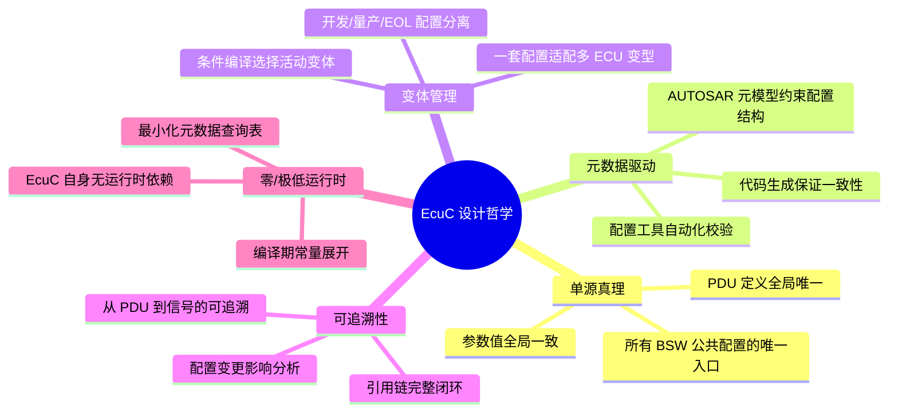

### 5.2 EcuC 与相关模块的协作关系

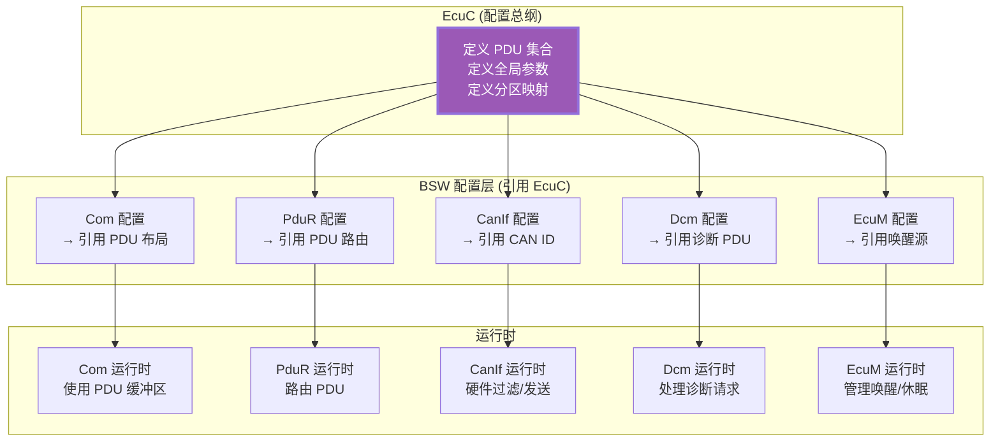

### 5.3 工程最佳实践

| 领域 | 最佳实践 | 原因 |
|------|---------|------|
| **PDU 命名** | 使用规范命名 `ECUC_PDU_<功能>_<方向>` | 提高可读性，便于工具自动生成 |
| **PDU 长度** | 所有模块使用 `ECUC_PDU_LENGTH(id)` 宏 | 保证长度一致，避免维护多个副本 |
| **配置变体** | 只使用 Production 变体，其余通过条件编译 | 量产代码不含调试路径 |
| **CAN ID 管理** | 在 EcuC 中定义 CAN ID，不在各模块硬编码 | 单一来源，变更只需改一处 |
| **方向一致性** | OUT PDU 对应 Com SEND, IN 对应 Com RECEIVE | 方向不匹配导致数据流反向 |
| **唤醒源** | 唤醒源引脚必须在 EcuC 中统一声明 | 供 EcuM 和 WdgM 统一管理 |
| **分区映射** | 明确每个 BSW 模块归属的 Partition | 多核系统必须显式分配，避免跨核访问错误 |
| **宏 vs 函数** | 编译期可确定的查询用宏，运行时才确定的用函数 | 零开销抽象 + 运行时灵活性 |

### 5.4 配置检查清单

```mermaid
flowchart TD
    CHECK["EcuC 配置审核清单"]
    CHECK --> C1["PDU 检查"]
    C1 --> C1A["✓ 所有 PDU 都有定义"]
    C1 --> C1B["✓ PDU 长度有效 (> 0)"]
    C1 --> C1C["✓ PDU 方向正确 (IN/OUT)"]
    C1 --> C1D["✓ CAN ID 在范围内 (11/29 bit)"]
    C1 --> C1E["✓ 无重复 CAN ID (同一控制器)"]

    CHECK --> C2["引用检查"]
    C2 --> C2A["✓ Com 所有 IPdu 都引用有效 PDU"]
    C2 --> C2B["✓ PduR 所有路由都引用有效 PDU"]
    C2 --> C2C["✓ CanIf Tx/Rx 都引用有效 PDU"]
    C2 --> C2D["✓ 所有引用的 PDU 长度一致"]

    CHECK --> C3["分区检查"]
    C3 --> C3A["✓ 分区数 ≤ 硬件核心数"]
    C3 --> C3B["✓ 每个 BSW 模块分配到分区"]
    C3 --> C3C["✓ 跨核引用有标记"]

    CHECK --> C4["变体检查"]
    C4 --> C4A["✓ 活动变体有效"]
    C4 --> C4B["✓ 变体条件无冲突"]
    C4 --> C4C["✓ 生产版不含调试代码"]

    CHECK -->|全部通过| PASS["✅ 配置就绪"]
    CHECK -->|有失败| FAIL["❌ 修正配置错误"]

    style PASS fill:#2ecc71,color:#fff
    style FAIL fill:#e74c3c,color:#fff
```

### 5.5 常见问题

| 问题 | 可能原因 | 排查方法 |
|------|---------|---------|
| **Com 和 CanIf 的 PDU 长度不一致** | EcuC PDU Length 被改了但 Com/CanIf 配置未同步 | 检查工具中的 PduRef, 重新生成配置代码 |
| **CAN ID 冲突导致总线错误** | 两个发送 PDU 配置了相同 CAN ID | 使用 `EcuC_ValidateCanIdUniqueness()` 检查 |
| **唤醒后系统异常** | EcuC WakeupSource 引脚极性配置错 | 检查硬件原理图的唤醒引脚电平 |
| **多核系统中跨核访问崩溃** | BSW 模块分配到了错误的核心分区 | 检查 EcuCPartition 映射和跨核引用标记 |
| **代码生成后编译错误** | EcuC 宏定义与 BSW 模块的引用不一致 | 检查 `#include` 路径和宏名称拼写 |

> **总结**：AUTOSAR EcuC (ECU Configuration) 模块是整个 ECU 配置体系的总纲和元数据基础。它定义了所有 BSW 模块共用的 PDU 集合、全局参数、唤醒源配置、多核分区映射和配置变体，是 AUTOSAR **元数据驱动** 和 **单源真理** 设计哲学的核心体现。EcuC 本身几乎没有运行时状态，但它是所有 BSW 模块配置的"宪法"，确保整个 ECU 软件系统的一致性和可追溯性。
