# AUTOSAR EcuM (ECU Manager) 模块详解

---

## 目录

1. [一、通俗理解：EcuM 是什么？](#一通俗理解ecum-是什么)
2. [二、核心设计机制与设计模式](#二核心设计机制与设计模式)
3. [三、EcuM 状态机详解](#三ecum-状态机详解)
4. [四、EcuM 唤醒与休眠机制](#四ecum-唤醒与休眠机制)
5. [五、EcuM 与其它 BSW 模块的交互](#五ecum-与其它-bsw-模块的交互)
6. [六、EcuM 配置与代码示例](#六ecum-配置与代码示例)
7. [七、深入原理：EcuM 内部实现机制](#七深入原理ecum-内部实现机制)
8. [八、EcuM 的 Flex 变体与经典变体](#八ecum-的-flex-变体与经典变体)
9. [九、总结与最佳实践](#九总结与最佳实践)

---

## 一、通俗理解：EcuM 是什么？

### 1.1 一句话概括

**EcuM（ECU Manager）是 AUTOSAR 架构中负责 ECU 整个生命周期的"管家"**——它管理着 ECU 从"上电启动 → 初始化 → 正常运行 → 休眠 → 唤醒"的完整过程。

### 1.2 生活类比

想象一辆智能汽车上的 ECU（电子控制单元）就像一栋房子：

| 房子 | ECU | EcuM 的角色 |
|------|-----|-------------|
| 大门打开，灯亮起 | ECU 上电 | **启动管理器** — 安排各模块依次初始化 |
| 检查水电燃气 | 各 BSW 模块初始化 | **调度员** — 按顺序启动各模块 |
| 正常居住 | 应用运行 | **状态监控者** — 维持正常运行模式 |
| 关灯锁门 | ECU 休眠 | **节能管理员** — 协调进入低功耗模式 |
| 有人按门铃 | 唤醒事件 | **唤醒响应者** — 判断是否需要唤醒并协调恢复 |

### 1.3 核心定位

在 AUTOSAR 分层架构中，EcuM 位于 **BSW（Basic Software）层**的 **Services Layer（服务层）**，是系统服务的一部分：

```
┌─────────────────────────────────────┐
│           Application Layer          │
├─────────────────────────────────────┤
│           RTE (Runtime Environment)   │
├─────────────────────────────────────┤
│   Services Layer    │  EcuM  │  OS   │
│─────────────────────│────────│───────│
│   ECU Abstraction   │  MCAL  │        │
├─────────────────────────────────────┤
│           Microcontroller            │
└─────────────────────────────────────┘
```

EcuM 是 BSW 中**最早启动、最晚关闭**的模块之一，它掌控着整个 ECU 状态的"生杀大权"。

---

## 二、核心设计机制与设计模式

### 2.1 设计模式分析

EcuM 的设计体现了多种经典软件设计模式：

#### 1️⃣ **状态模式（State Pattern）**
EcuM 的核心是一个**有限状态机（FSM）**，每个状态对应不同的行为，状态之间的转换由事件驱动。

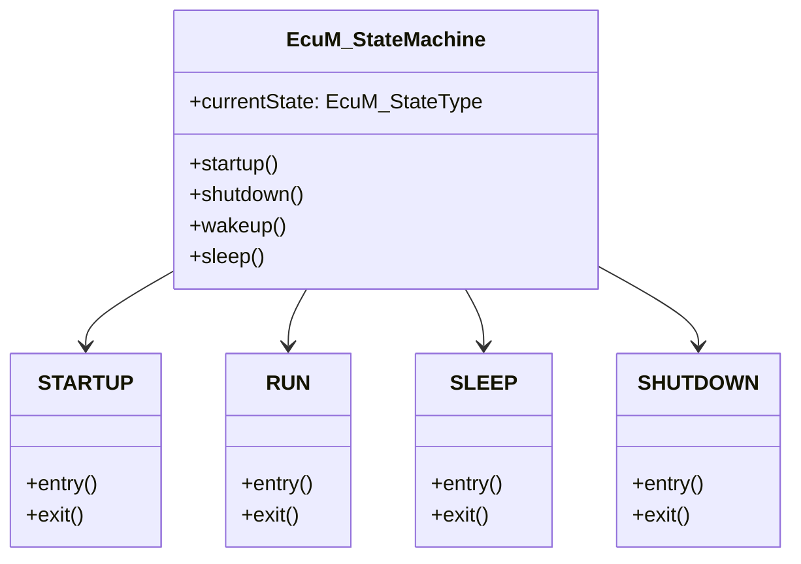

#### 2️⃣ **模板方法模式（Template Method Pattern）**
EcuM 定义了启动和关闭的"算法骨架"，具体步骤由各 BSW 模块通过回调函数实现。

```
EcuM 启动的"骨架"：
  1. InitBlock 第一阶段 (EcuM 自身初始化)
  2. InitBlock 第二阶段 (OS 启动)
  3. InitBlock 第三阶段 (SchM 启动)
  4. InitBlock 第四阶段 (各 BSW 模块初始化)
  ↑ 每一步都可以通过配置选择"做或不做"或"自定义"
```

#### 3️⃣ **观察者模式（Observer Pattern）**
EcuM 通过回调机制通知各模块状态变化。各模块注册自己的回调函数，当 ECU 状态发生变化时，EcuM 调用这些回调。

#### 4️⃣ **策略模式（Strategy Pattern）**
不同的唤醒源、休眠策略可以通过配置选择不同的执行路径，EcuM 根据配置动态选择策略。

### 2.2 核心设计理念

| 设计理念 | 说明 |
|---------|------|
| **分层抽象** | 将 ECU 生命周期管理抽象为有限状态机，与具体硬件解耦 |
| **可配置性** | 通过 ECU Configuration 参数化所有行为，不需要修改代码 |
| **可扩展性** | 通过回调机制允许各模块自定义启动/关闭/休眠行为 |
| **确定性** | 状态转换顺序和条件严格定义，保证行为可预测 |
| **低功耗支持** | 设计多种休眠模式，满足车载网络对功耗的严格要求 |

---

## 三、EcuM 状态机详解

### 3.1 总体状态机

```mermaid
stateDiagram-v2
    [*] --> STARTUP : 上电/复位

    state STARTUP {
        [*] --> STARTUP_I : 硬件初始化完成
        STARTUP_I --> STARTUP_II : OS启动完成
        STARTUP_II --> STARTUP_III : SchM启动完成
        STARTUP_III --> RUN : BSW初始化完成
    }

    state RUN {
        [*] --> RUN_APP : 应用运行
    }

    RUN --> SHUTDOWN : 请求关机
    RUN --> SLEEP : 请求休眠

    state SLEEP {
        [*] --> SLEEP_SLEEP : 进入睡眠
        SLEEP_SLEEP --> WAKEUP : 唤醒事件
        SLEEP --> SHUTDOWN : 深度休眠
    }

    state WAKEUP {
        [*] --> WAKEUP_WAKEUP : 唤醒处理中
        WAKEUP_WAKEUP --> RUN : 唤醒完成(全唤醒)
        WAKEUP_WAKEUP --> SLEEP : 假唤醒(继续休眠)
    }

    state SHUTDOWN {
        [*] --> SHUTDOWN_PREP : 准备关闭
        SHUTDOWN_PREP --> SHUTDOWN_OS : OS关闭
        SHUTDOWN_OS --> SHUTDOWN_FINAL : 最终关闭
    }

    SLEEP --> WAKEUP : 唤醒事件
    WAKEUP --> SLEEP : 假唤醒(False Wakeup)
    WAKEUP --> RUN : 真唤醒
    SHUTDOWN --> [*] : 断电
```

### 3.2 各状态详细说明

#### 3.2.1 STARTUP（启动阶段）

启动阶段分为四个子阶段，按顺序执行：

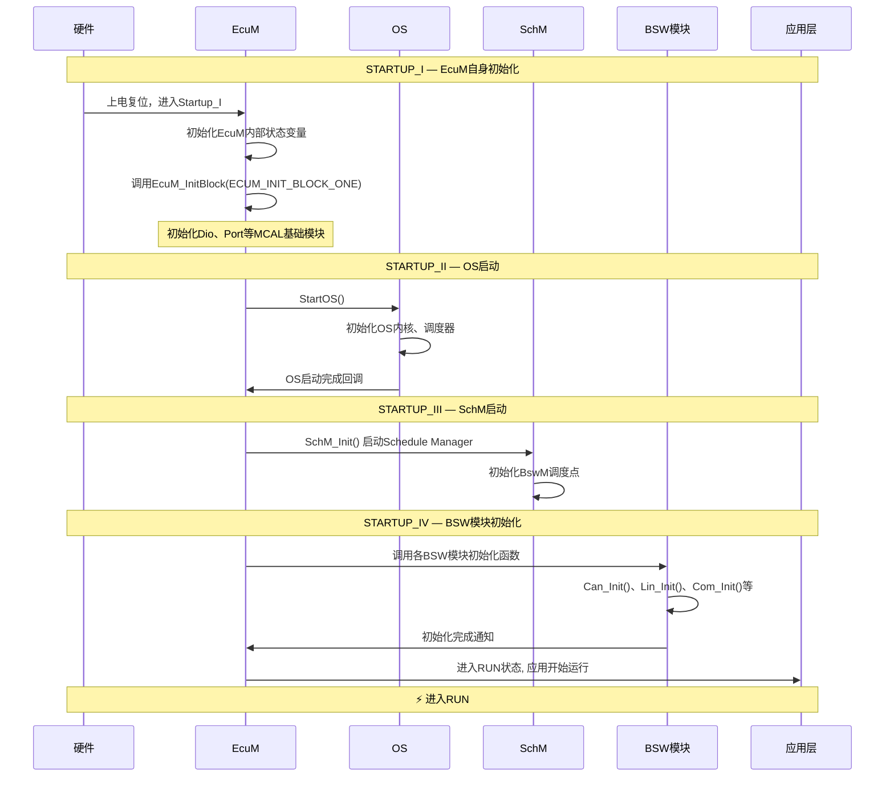

**关键代码示例 — 启动阶段伪代码：**

```c
/* EcuM 启动主函数 */
void EcuM_Startup(void)
{
    /* ===== STARTUP_I: EcuM 自身初始化 ===== */
    EcuM_InitBlockOne();  /* 初始化MCAL基础模块：Dio, Port, Wdg... */

    /* ===== STARTUP_II: OS 启动 ===== */
    /* 注意：StartOS 不会返回，OS启动完成后通过回调进入 STARTUP_III */
    EcuM_GoToStartupTwo();

    /* 下面的代码在 StartOS 之后不会立即执行 */
}

/* OS启动后回调 — 进入 STARTUP_II */
void EcuM_OnOsStarted(void)
{
    /* 此时 OS 调度器已运行，可以创建任务 */

    /* ===== STARTUP_III: Schedule Manager 启动 ===== */
    SchM_Init();  /* 初始化 BswM 调度 */

    /* ===== STARTUP_IV: BSW 模块初始化 ===== */
    /* 按配置顺序初始化各个 BSW 模块 */
    const EcuM_ModuleInitListType* initList = EcuM_GetConfig()->initSequence;

    for (uint8 i = 0; i < initList->count; i++)
    {
        initList->modules[i].InitFunction();  /* 调用各模块初始化函数 */
    }

    /* ===== 进入 RUN 状态 ===== */
    EcuM_CurrentState = ECUM_STATE_RUN;

    /* 通知 BswM 进入 RUN 状态 */
    BswM_EcuM_CurrentState(ECUM_STATE_RUN);
}
```

#### 3.2.2 RUN（运行阶段）

RUN 状态是 ECU 正常工作的状态。在 RUN 状态下：
- **OS 调度器正常运行**，所有任务按优先级和周期调度
- **通信栈正常工作**（CAN/LIN/Ethernet 等）
- **应用层功能正常运行**

```c
/* EcuM 运行状态管理 */
void EcuM_RunLoop(void)
{
    while (EcuM_CurrentState == ECUM_STATE_RUN)
    {
        /* 检查是否有关机请求 */
        if (EcuM_ShutdownRequested)
        {
            EcuM_GoToShutdown();
            break;
        }

        /* 检查是否有休眠请求 */
        if (EcuM_SleepRequested)
        {
            EcuM_GoToSleep();
            break;
        }

        /* 检查唤醒事件（仅在 RUN 状态下也需要关注的唤醒源） */
        EcuM_CheckWakeupEvents();

        /* 简单的轮询等待 — 实际由 OS 调度管理 */
        EcuM_Schedule();
    }
}
```

#### 3.2.3 SLEEP（休眠阶段）

SLEEP 状态是 ECU 的低功耗模式。AUTOSAR 定义了多种休眠模式：

| 休眠模式 | 功耗 | 唤醒延迟 | 保持状态 | 适用场景 |
|---------|------|---------|---------|---------|
| **SLEEP_SLEEP** | 极低 | 快 | 部分 RAM 保持 | 短期休眠，等待CAN/LIN唤醒 |
| **SLEEP_HALT** | 更低 | 中 | 仅关键寄存器 | 长时间休眠 |
| **SLEEP_POLL** | 低 | 快 | 全部保持 | 极短时间等待 |

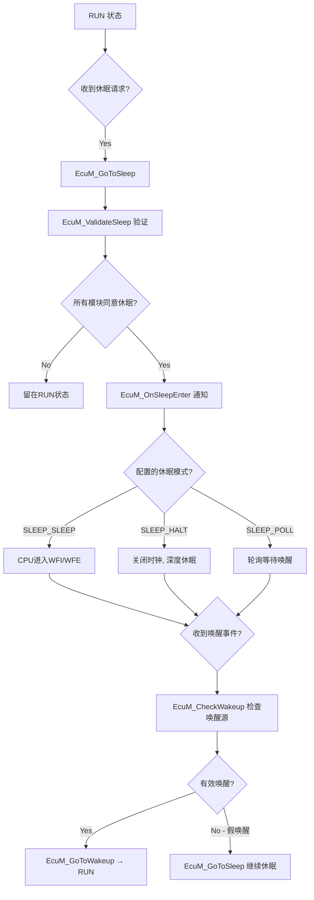

#### 3.2.4 WAKEUP（唤醒阶段）

唤醒阶段处理从休眠状态恢复到运行状态的过程：

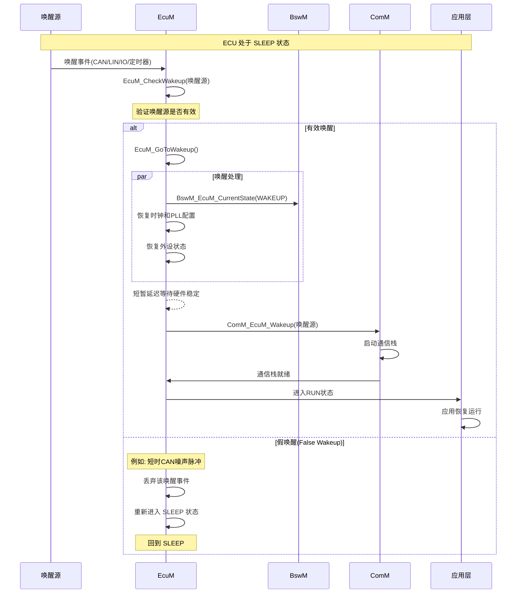

**关键代码示例 — 唤醒处理：**

```c
/* 唤醒检查函数 */
void EcuM_CheckWakeup(EcuM_WakeupSourceType wakeupSource)
{
    /* 获取唤醒源配置 */
    const EcuM_WakeupConfigType* config = EcuM_GetWakeupConfig(wakeupSource);

    /* 等待唤醒源稳定（抗抖动处理） */
    EcuM_WaitForStabilization(config->stabilizationTime);

    /* 再次检查唤醒源是否仍然有效 */
    if (EcuM_CheckWakeupSignal(wakeupSource) == TRUE)
    {
        /* 有效唤醒 */
        EcuM_ValidWakeup(wakeupSource);
    }
    else
    {
        /* 假唤醒 — 可能是噪声 */
        EcuM_InvalidWakeup(wakeupSource);
    }
}

/* 有效唤醒通知 */
void EcuM_ValidWakeup(EcuM_WakeupSourceType wakeupSource)
{
    /* 通知 BswM 状态变化 */
    BswM_EcuM_CurrentState(ECUM_STATE_WAKEUP);

    /* 调用唤醒回调 */
    EcuM_CallWakeupCallbacks(wakeupSource);

    /* 通知 ComM 唤醒事件 */
    ComM_EcuM_WakeupIndication(wakeupSource);

    /* 进入 RUN 状态 */
    EcuM_CurrentState = ECUM_STATE_RUN;
}
```

#### 3.2.5 SHUTDOWN（关闭阶段）

SHUTDOWN 阶段将 ECU 从运行状态安全地关闭：

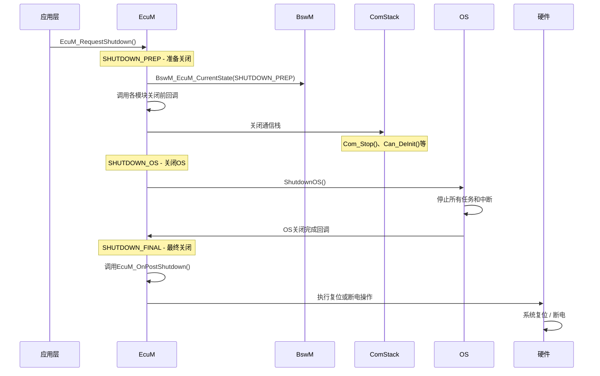

### 3.3 完整状态转换图

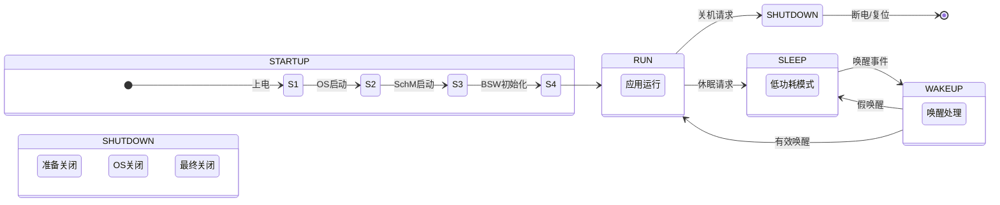

---

## 四、EcuM 唤醒与休眠机制

### 4.1 唤醒源类型

AUTOSAR 定义了多种唤醒源，EcuM 统一管理：

```c
/* 唤醒源类型枚举 */
typedef enum {
    ECUM_WAKEUP_SOURCE_POWER,       /* 电源唤醒：上电/按键 */
    ECUM_WAKEUP_SOURCE_CAN,         /* CAN 总线唤醒 */
    ECUM_WAKEUP_SOURCE_LIN,         /* LIN 总线唤醒 */
    ECUM_WAKEUP_SOURCE_ETHERNET,    /* Ethernet 唤醒 */
    ECUM_WAKEUP_SOURCE_FLEXRAY,     /* FlexRay 唤醒 */
    ECUM_WAKEUP_SOURCE_IO,          /* IO 唤醒：外部引脚电平变化 */
    ECUM_WAKEUP_SOURCE_TIMER,       /* 定时器唤醒：RTC/RTT */
    ECUM_WAKEUP_SOURCE_INTERNAL     /* 内部唤醒：软件触发的唤醒 */
} EcuM_WakeupSourceType;
```

### 4.2 唤醒源验证机制

EcuM 的唤醒验证机制是一个**防抖（Debounce）** 过程，防止噪声导致的假唤醒：

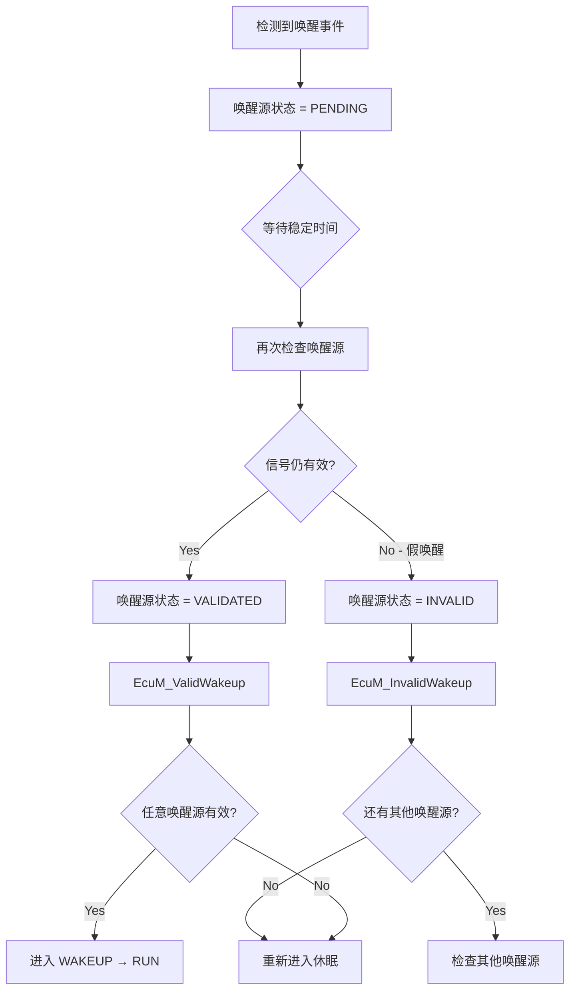

```c
/* 唤醒源状态管理 */
#define ECUM_WAKEUP_STABILIZATION_TIME_MS  50  /* 50ms 稳定时间 */

typedef struct {
    EcuM_WakeupSourceType  source;
    uint8                  debounceCounter;     /* 防抖计数器 */
    EcuM_WakeupStatusType  status;              /* PENDING/VALIDATED/INVALID */
    EcuM_WakeupModeType    mode;                /* ENABLED/DISABLED */
    uint32                 stabilizationTime;   /* 稳定时间(ms) */
} EcuM_WakeupControlType;

/* 唤醒源防抖处理 */
void EcuM_WakeupDebounceHandler(EcuM_WakeupControlType* wakeupCtrl)
{
    if (wakeupCtrl->mode == ECUM_WAKEUP_MODE_DISABLED)
    {
        return;  /* 该唤醒源被禁用 */
    }

    if (wakeupCtrl->status == ECUM_WAKEUP_STATUS_PENDING)
    {
        /* 等待稳定时间后再次验证 */
        if (wakeupCtrl->debounceCounter >= wakeupCtrl->stabilizationTime)
        {
            if (EcuM_ReadWakeupSignal(wakeupCtrl->source) == TRUE)
            {
                wakeupCtrl->status = ECUM_WAKEUP_STATUS_VALIDATED;
                EcuM_ValidWakeup(wakeupCtrl->source);
            }
            else
            {
                wakeupCtrl->status = ECUM_WAKEUP_STATUS_INVALID;
                EcuM_InvalidWakeup(wakeupCtrl->source);
            }
        }
        else
        {
            wakeupCtrl->debounceCounter++;
        }
    }
}
```

### 4.3 休眠协调机制

EcuM 的休眠需要所有相关模块的"一致同意"：

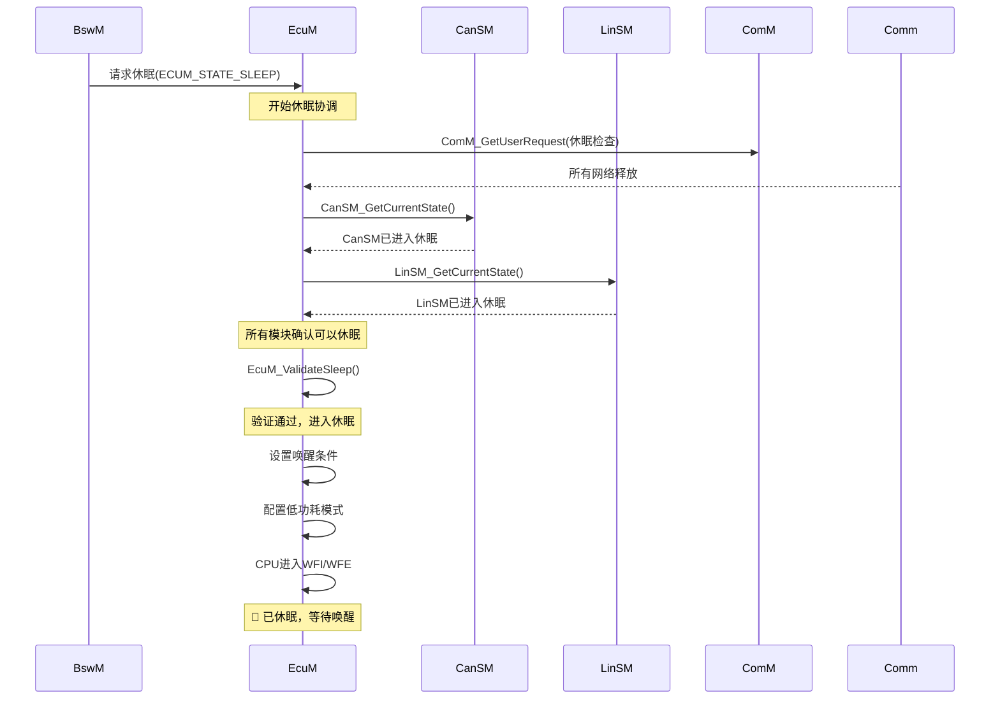

---

## 五、EcuM 与其它 BSW 模块的交互

### 5.1 模块交互图

```mermaid
flowchart TD
    subgraph "BSW Services Layer"
        EcuM[EcuM<br/>ECU Manager]
        BswM[BswM<br/>BSW Mode Manager]
        ComM[ComM<br/>Communication Manager]
        Dcm[Dcm<br/>Diagnostic Manager]
    end

    subgraph "OS"
        OS[OS<br/>Operating System]
    end

    subgraph "Communication Stack"
        CanSM[CanSM]
        LinSM[LinSM]
        EthSM[EthSM]
    end

    subgraph "MCAL"
        MCU[MCU Driver]
        Wdg[Wdg Driver]
        Rtc[Rtc Driver]
    end

    %% EcuM 与各模块的关系
    EcuM -->|1. 启动OS| OS
    EcuM -->|2. 状态通知| BswM
    EcuM -->|3. 唤醒通知| ComM
    EcuM -->|4. 休眠协调| CanSM
    EcuM -->|5. 休眠协调| LinSM
    EcuM -->|6. 休眠协调| EthSM
    EcuM -->|7. MCU模式控制| MCU
    EcuM -->|8. Watchdog控制| Wdg
    EcuM -->|9. 定时器配置| Rtc
    EcuM -->|10. 诊断事件| Dcm

    BswM -->|状态请求| EcuM
    ComM -->|唤醒通知| EcuM
    Dcm -->|关机请求| EcuM
```

### 5.2 主要接口函数

```c
/* ==================== EcuM 提供的接口 ==================== */

/* 启动相关 */
void EcuM_Init(void);                                    /* EcuM 初始化入口 */
void EcuM_InitBlock(uint8 BlockId);                      /* 初始化块(分阶段) */

/* 状态管理 */
void EcuM_GoToSleep(void);                               /* 请求进入休眠 */
void EcuM_GoToWakeup(void);                              /* 请求进入唤醒 */
void EcuM_RequestShutdown(void);                         /* 请求关机 */

/* 唤醒管理 */
void EcuM_CheckWakeup(EcuM_WakeupSourceType source);     /* 检查唤醒源 */
void EcuM_ValidWakeup(EcuM_WakeupSourceType source);     /* 有效唤醒通知 */
void EcuM_InvalidWakeup(EcuM_WakeupSourceType source);   /* 无效唤醒通知 */
void EcuM_SetWakeupEvent(EcuM_WakeupSourceType source);  /* 设置唤醒事件 */

/* 状态查询 */
EcuM_StateType EcuM_GetCurrentState(void);               /* 获取当前状态 */
EcuM_WakeupStatusType EcuM_GetWakeupStatus(void);        /* 获取唤醒状态 */

/* ==================== EcuM 需要的外部接口(回调) ==================== */

/* 各模块的关闭回调 */
void EcuM_OnShutdown(void);                              /* 关闭前回调 */
void EcuM_OnPostShutdown(void);                          /* 关闭后回调 */

/* 休眠回调 */
void EcuM_OnSleepEnter(void);                            /* 进入休眠回调 */
void EcuM_OnSleepExit(void);                             /* 退出休眠回调 */

/* 唤醒回调 */
void EcuM_OnWakeupValidation(EcuM_WakeupSourceType src); /* 唤醒验证回调 */
void EcuM_OnWakeupReaction(EcuM_WakeupSourceType src);   /* 唤醒响应回调 */

/* 运行状态回调 */
void EcuM_OnRunEnter(void);                              /* 进入运行回调 */
void EcuM_OnRunExit(void);                               /* 退出运行回调 */
```

### 5.3 EcuM 与 BswM 的关系

BswM（BSW Mode Manager）和 EcuM 是 AUTOSAR 中两个紧密协作的状态管理模块：

| 特性 | EcuM | BswM |
|------|------|------|
| **管理对象** | ECU 硬件生命周期 | BSW 模块的模式 |
| **核心状态** | STARTUP/RUN/SLEEP/WAKEUP/SHUTDOWN | 各通信栈的模式 |
| **关注点** | 功耗、启动/关闭顺序 | 通信栈状态、网络管理 |
| **协作方式** | EcuM 通知 BswM 状态变化 | BswM 根据状态决策各模块行为 |

**协作流程：**

```
EcuM 状态变化 → BswM 收到通知 → BswM 执行规则 → 控制各模块状态
```

### 5.4 EcuM 与 ComM 的关系

ComM（Communication Manager）是通信栈的状态管理者，EcuM 的唤醒/休眠通过 ComM 转发到各通信栈状态管理器：

```
EcuM_ValidWakeup(CAN)
    → ComM_EcuM_WakeupIndication(CAN)
        → CanSM_RequestComMode(CAN, COMM_FULL_COMMUNICATION)
            → CanIf_SetBaudrate()
            → Can_Enable()
            → ...

EcuM_GoToSleep()
    → ComM_GetUserRequest()  // 检查是否所有用户释放了通信
    → 确认所有通道可休眠
    → 进入 SLEEP
```

---

## 六、EcuM 配置与代码示例

### 6.1 EcuM 配置结构

AUTOSAR 的 EcuM 配置通过 XML（ARXML）文件定义，以下是关键配置项：

```xml
<!-- EcuM 配置示例 -->
<EcuM>
    <!-- 通用配置 -->
    <EcuMGeneral>
        <EcuMVersion>4.4.0</EcuMVersion>
        <EcuMDevErrorDetect>true</EcuMDevErrorDetect>
        <EcuMDmWakeupTimeout>1000</EcuMDmWakeupTimeout>
    </EcuMGeneral>

    <!-- 启动配置 -->
    <EcuMInitConfiguration>
        <EcuMInitSequence>
            <!-- 第一阶段: MCAL基础模块 -->
            <EcuMInitBlock>
                <EcuMInitBlockId>1</EcuMInitBlockId>
                <EcuMInitModule>Dio_Init</EcuMInitModule>
                <EcuMInitModule>Port_Init</EcuMInitModule>
                <EcuMInitModule>Wdg_Init</EcuMInitModule>
            </EcuMInitBlock>

            <!-- 第二阶段: OS启动 -->
            <EcuMInitBlock>
                <EcuMInitBlockId>2</EcuMInitBlockId>
                <EcuMInitModule>StartOS</EcuMInitModule>
            </EcuMInitBlock>

            <!-- 第三阶段: SchM启动 -->
            <EcuMInitBlock>
                <EcuMInitBlockId>3</EcuMInitBlockId>
                <EcuMInitModule>SchM_Init</EcuMInitModule>
            </EcuMInitBlock>

            <!-- 第四阶段: BSW模块 -->
            <EcuMInitBlock>
                <EcuMInitBlockId>4</EcuMInitBlockId>
                <EcuMInitModule>Can_Init</EcuMInitModule>
                <EcuMInitModule>Lin_Init</EcuMInitModule>
                <EcuMInitModule>Com_Init</EcuMInitModule>
                <EcuMInitModule>PduR_Init</EcuMInitModule>
            </EcuMInitBlock>
        </EcuMInitSequence>
    </EcuMInitConfiguration>

    <!-- 唤醒源配置 -->
    <EcuMWakeupConfiguration>
        <EcuMWakeupSource>
            <EcuMWakeupSourceId>CAN</EcuMWakeupSourceId>
            <EcuMStabilizationTime>50</EcuMStabilizationTime>
            <EcuMWakeupSourceEnabled>true</EcuMWakeupSourceEnabled>
        </EcuMWakeupSource>
        <EcuMWakeupSource>
            <EcuMWakeupSourceId>LIN</EcuMWakeupSourceId>
            <EcuMStabilizationTime>30</EcuMStabilizationTime>
            <EcuMWakeupSourceEnabled>true</EcuMWakeupSourceEnabled>
        </EcuMWakeupSource>
        <EcuMWakeupSource>
            <EcuMWakeupSourceId>IO</EcuMWakeupSourceId>
            <EcuMStabilizationTime>10</EcuMStabilizationTime>
            <EcuMWakeupSourceEnabled>false</EcuMWakeupSourceEnabled>
        </EcuMWakeupSource>
    </EcuMWakeupConfiguration>

    <!-- 休眠模式配置 -->
    <EcuMSleepConfiguration>
        <EcuMDefaultSleepMode>SLEEP_SLEEP</EcuMDefaultSleepMode>
        <EcuMAllowSleepModes>
            <EcuMSleepMode>SLEEP_SLEEP</EcuMSleepMode>
            <EcuMSleepMode>SLEEP_HALT</EcuMSleepMode>
        </EcuMAllowSleepModes>
    </EcuMSleepConfiguration>
</EcuM>
```

### 6.2 完整代码实现示例

以下是一个简化的但功能完整的 EcuM 实现：

```c
/******************************************************************************
 * @file    EcuM.c
 * @brief   AUTOSAR ECU Manager 模块实现
 * @version 4.4.0
 ******************************************************************************/

#include "EcuM.h"
#include "EcuM_Cfg.h"
#include "BswM.h"
#include "ComM.h"
#include "Os.h"
#include "SchM.h"

/* ==================== 类型定义 ==================== */

typedef enum {
    ECUM_INTERNAL_STATE_INIT,
    ECUM_INTERNAL_STATE_STARTUP_ONE,
    ECUM_INTERNAL_STATE_STARTUP_TWO,
    ECUM_INTERNAL_STATE_STARTUP_THREE,
    ECUM_INTERNAL_STATE_STARTUP_FOUR,
    ECUM_INTERNAL_STATE_RUN,
    ECUM_INTERNAL_STATE_SLEEP,
    ECUM_INTERNAL_STATE_WAKEUP,
    ECUM_INTERNAL_STATE_SHUTDOWN_PREP,
    ECUM_INTERNAL_STATE_SHUTDOWN_OS,
    ECUM_INTERNAL_STATE_SHUTDOWN_FINAL
} EcuM_InternalStateType;

typedef struct {
    EcuM_InternalStateType     internalState;
    EcuM_StateType             currentState;
    EcuM_WakeupStatusType      wakeupStatus;
    boolean                    shutdownRequested;
    boolean                    sleepRequested;
    uint32                     wakeupSources;       /* bitmask */
    EcuM_InitCallbackType      onShutdownCallback;
    EcuM_InitCallbackType      onSleepEnterCallback;
    EcuM_InitCallbackType      onSleepExitCallback;
    EcuM_InitCallbackType      onWakeupReactionCallback;
} EcuM_ModuleType;

/* ==================== 静态变量 ==================== */

static EcuM_ModuleType EcuM_Module;
static const EcuM_ConfigType* EcuM_ConfigPtr = NULL_PTR;

/* ==================== 静态函数声明 ==================== */

static void EcuM_ProcessStartup(void);
static void EcuM_ProcessShutdown(void);
static void EcuM_ProcessSleep(void);
static void EcuM_ProcessWakeup(EcuM_WakeupSourceType source);
static void EcuM_CallInitSequence(uint8 blockId);
static void EcuM_PrepareHardwareForSleep(void);
static void EcuM_RestoreHardwareFromSleep(void);

/* ==================== 函数实现 ==================== */

/**
 * @brief EcuM 初始化入口
 *        从 StartOS 前的启动代码调用
 */
void EcuM_Init(void)
{
    /* 初始化内部状态 */
    EcuM_Module.internalState = ECUM_INTERNAL_STATE_INIT;
    EcuM_Module.currentState = ECUM_STATE_STARTUP;
    EcuM_Module.wakeupStatus = ECUM_WAKEUP_STATUS_NONE;
    EcuM_Module.shutdownRequested = FALSE;
    EcuM_Module.sleepRequested = FALSE;
    EcuM_Module.wakeupSources = 0x00;

    /* 获取配置指针 */
    EcuM_ConfigPtr = EcuM_GetConfig();

    /* 进入启动流程 */
    EcuM_ProcessStartup();
}

/**
 * @brief 处理启动流程
 */
static void EcuM_ProcessStartup(void)
{
    /* ===== STARTUP_I: EcuM 自身初始化 ===== */
    EcuM_Module.internalState = ECUM_INTERNAL_STATE_STARTUP_ONE;

    /* 初始化 MCAL 基础模块 */
    EcuM_CallInitSequence(ECUM_INIT_BLOCK_ONE);

    /* ===== STARTUP_II: 启动 OS ===== */
    EcuM_Module.internalState = ECUM_INTERNAL_STATE_STARTUP_TWO;
    EcuM_GoToStartupTwo();
}

/**
 * @brief OS 启动后回调
 *        由 OS 在 StartOS 完成后调用
 */
void EcuM_OnOsStarted(void)
{
    /* ===== STARTUP_III: 启动 Schedule Manager ===== */
    EcuM_Module.internalState = ECUM_INTERNAL_STATE_STARTUP_THREE;
    SchM_Init();

    /* ===== STARTUP_IV: 初始化 BSW 模块 ===== */
    EcuM_Module.internalState = ECUM_INTERNAL_STATE_STARTUP_FOUR;
    EcuM_CallInitSequence(ECUM_INIT_BLOCK_FOUR);

    /* ===== 进入 RUN 状态 ===== */
    EcuM_Module.internalState = ECUM_INTERNAL_STATE_RUN;
    EcuM_Module.currentState = ECUM_STATE_RUN;

    /* 通知 BswM */
    BswM_EcuM_CurrentState(ECUM_STATE_RUN);

    /* 调用进入运行回调 */
    if (EcuM_ConfigPtr->onRunEnterCallback != NULL_PTR)
    {
        EcuM_ConfigPtr->onRunEnterCallback();
    }
}

/**
 * @brief 调用指定初始化序列
 * @param blockId 初始化块 ID
 */
static void EcuM_CallInitSequence(uint8 blockId)
{
    uint8 i;

    /* 查找对应的初始化块配置 */
    for (i = 0; i < EcuM_ConfigPtr->initBlockCount; i++)
    {
        if (EcuM_ConfigPtr->initBlocks[i].blockId == blockId)
        {
            /* 按顺序调用该块中的所有初始化函数 */
            uint8 j;
            for (j = 0; j < EcuM_ConfigPtr->initBlocks[i].moduleCount; j++)
            {
                if (EcuM_ConfigPtr->initBlocks[i].modules[j].InitFunction != NULL_PTR)
                {
                    EcuM_ConfigPtr->initBlocks[i].modules[j].InitFunction();
                }
            }
            break;
        }
    }
}

/**
 * @brief 检查唤醒源
 * @param source 唤醒源类型
 */
void EcuM_CheckWakeup(EcuM_WakeupSourceType source)
{
    uint8 index;

    /* 查找唤醒源配置 */
    for (index = 0; index < EcuM_ConfigPtr->wakeupSourceCount; index++)
    {
        if (EcuM_ConfigPtr->wakeupSources[index].source == source)
        {
            const EcuM_WakeupSourceConfigType* config =
                &EcuM_ConfigPtr->wakeupSources[index];

            if (!config->enabled)
            {
                return;  /* 唤醒源被禁用 */
            }

            /* 设置唤醒标志 */
            EcuM_Module.wakeupSources |= (1 << source);

            /* 如果当前在 SLEEP 状态，进行唤醒处理 */
            if (EcuM_Module.currentState == ECUM_STATE_SLEEP)
            {
                EcuM_ProcessWakeup(source);
            }
            break;
        }
    }
}

/**
 * @brief 通知有效唤醒
 * @param source 唤醒源类型
 */
void EcuM_ValidWakeup(EcuM_WakeupSourceType source)
{
    /* 更新唤醒状态 */
    EcuM_Module.wakeupStatus = ECUM_WAKEUP_STATUS_VALIDATED;

    /* 通知 BswM */
    BswM_EcuM_CurrentState(ECUM_STATE_WAKEUP);

    /* 调用唤醒响应回调 */
    if (EcuM_ConfigPtr->onWakeupReactionCallback != NULL_PTR)
    {
        EcuM_ConfigPtr->onWakeupReactionCallback(source);
    }

    /* 通知 ComM */
    ComM_EcuM_WakeupIndication(source);

    /* 进入 RUN 状态 */
    EcuM_Module.internalState = ECUM_INTERNAL_STATE_RUN;
    EcuM_Module.currentState = ECUM_STATE_RUN;

    /* 恢复硬件状态 */
    EcuM_RestoreHardwareFromSleep();

    /* 通知 BswM 进入 RUN */
    BswM_EcuM_CurrentState(ECUM_STATE_RUN);
}

/**
 * @brief 通知无效唤醒(假唤醒)
 * @param source 唤醒源类型
 */
void EcuM_InvalidWakeup(EcuM_WakeupSourceType source)
{
    /* 清除该唤醒源标志 */
    EcuM_Module.wakeupSources &= ~(1 << source);

    /* 检查是否有其他唤醒源 */
    if (EcuM_Module.wakeupSources == 0x00)
    {
        /* 没有其他唤醒源，继续休眠 */
        EcuM_Module.wakeupStatus = ECUM_WAKEUP_STATUS_NONE;
        EcuM_Module.currentState = ECUM_STATE_SLEEP;
    }
}

/**
 * @brief 请求进入休眠
 */
void EcuM_GoToSleep(void)
{
    /* 设置休眠请求标志 */
    EcuM_Module.sleepRequested = TRUE;

    /* 处理休眠流程 */
    EcuM_ProcessSleep();
}

/**
 * @brief 处理休眠流程
 */
static void EcuM_ProcessSleep(void)
{
    /* 检查所有模块是否同意休眠 */
    if (!EcuM_ValidateSleep())
    {
        EcuM_Module.sleepRequested = FALSE;
        return;  /* 有模块不同意休眠，留在 RUN */
    }

    /* 调用进入休眠回调 */
    if (EcuM_ConfigPtr->onSleepEnterCallback != NULL_PTR)
    {
        EcuM_ConfigPtr->onSleepEnterCallback();
    }

    /* 通知 BswM */
    BswM_EcuM_CurrentState(ECUM_STATE_SLEEP);

    /* 更新状态 */
    EcuM_Module.internalState = ECUM_INTERNAL_STATE_SLEEP;
    EcuM_Module.currentState = ECUM_STATE_SLEEP;

    /* 准备硬件进入低功耗模式 */
    EcuM_PrepareHardwareForSleep();

    /* === 进入休眠(CPU 停止执行) === */
    EcuM_EnterSleepMode();

    /* === 醒来后会从这里继续执行 === */
    EcuM_OnSleepExit();

    /* 恢复硬件状态 */
    EcuM_RestoreHardwareFromSleep();
}

/**
 * @brief 验证是否可以休眠
 * @return TRUE 可以休眠，FALSE 不可以
 */
boolean EcuM_ValidateSleep(void)
{
    uint8 i;

    /* 调用所有注册的休眠验证回调 */
    for (i = 0; i < EcuM_ConfigPtr->sleepValidateCallbackCount; i++)
    {
        if (!EcuM_ConfigPtr->sleepValidateCallbacks[i]())
        {
            return FALSE;  /* 有模块不同意休眠 */
        }
    }

    return TRUE;
}

/**
 * @brief 进入 CPU 休眠模式
 *        实际实现依赖于具体 MCU 架构
 */
static void EcuM_EnterSleepMode(void)
{
    switch (EcuM_ConfigPtr->defaultSleepMode)
    {
        case ECUM_SLEEP_MODE_SLEEP:
            /* 浅度睡眠: CPU 时钟停止，外设保持 */
            __WFI();  /* Wait For Interrupt */
            break;

        case ECUM_SLEEP_MODE_HALT:
            /* 深度睡眠: 关闭 PLL 和大部分时钟 */
            MCU_SetPowerMode(MCU_POWER_MODE_DEEP_SLEEP);
            __WFI();
            break;

        case ECUM_SLEEP_MODE_POLL:
            /* 轮询模式: 实际上不进入低功耗，循环检查唤醒 */
            while (EcuM_Module.wakeupSources == 0x00)
            {
                /* 轮询检查唤醒源 */
                EcuM_PollWakeupSources();
                /* 小延迟避免忙等 */
                Os_DelayMilliseconds(1);
            }
            break;

        default:
            __WFI();
            break;
    }
}

/**
 * @brief 准备硬件进入休眠
 */
static void EcuM_PrepareHardwareForSleep(void)
{
    /* 保存唤醒使能寄存器状态 */
    EcuM_ConfigPtr->hwOps.saveWakeupConfig();

    /* 配置唤醒源 */
    EcuM_ConfigPtr->hwOps.configureWakeupSources(EcuM_Module.wakeupSources);

    /* 设置 MCU 模式 */
    EcuM_ConfigPtr->hwOps.setMcuMode(EcuM_ConfigPtr->defaultSleepMode);

    /* 关闭不需要的外设时钟 */
    EcuM_ConfigPtr->hwOps.disablePeripheralClocks();
}

/**
 * @brief 从休眠恢复硬件状态
 */
static void EcuM_RestoreHardwareFromSleep(void)
{
    /* 恢复 PLL 和系统时钟 */
    EcuM_ConfigPtr->hwOps.restoreSystemClock();

    /* 恢复外设时钟 */
    EcuM_ConfigPtr->hwOps.enablePeripheralClocks();

    /* 恢复唤醒使能配置 */
    EcuM_ConfigPtr->hwOps.restoreWakeupConfig();
}

/**
 * @brief 请求关机
 */
void EcuM_RequestShutdown(void)
{
    EcuM_Module.shutdownRequested = TRUE;
    EcuM_ProcessShutdown();
}

/**
 * @brief 处理关机流程
 */
static void EcuM_ProcessShutdown(void)
{
    uint8 i;

    /* ===== SHUTDOWN_PREP: 准备关闭 ===== */
    EcuM_Module.internalState = ECUM_INTERNAL_STATE_SHUTDOWN_PREP;
    EcuM_Module.currentState = ECUM_STATE_SHUTDOWN;

    /* 通知 BswM */
    BswM_EcuM_CurrentState(ECUM_STATE_SHUTDOWN);

    /* 调用各模块关闭前回调 */
    for (i = 0; i < EcuM_ConfigPtr->shutdownCallbackCount; i++)
    {
        if (EcuM_ConfigPtr->shutdownCallbacks[i] != NULL_PTR)
        {
            EcuM_ConfigPtr->shutdownCallbacks[i]();
        }
    }

    /* ===== SHUTDOWN_OS: 关闭 OS ===== */
    EcuM_Module.internalState = ECUM_INTERNAL_STATE_SHUTDOWN_OS;
    ShutdownOS(E_OK);  /* 此函数不会返回 */

    /* ===== SHUTDOWN_FINAL: 最终关闭 ===== */
    /* 注意: ShutdownOS 后代码无法执行到这里 */
    /* 实际在 ShutdownOS 的钩子中处理 */
}

/**
 * @brief OS 关闭后的回调
 *        由 OS 在 ShutdownOS 过程中调用
 */
void EcuM_OnOsShutdown(void)
{
    /* ===== SHUTDOWN_FINAL ===== */
    EcuM_Module.internalState = ECUM_INTERNAL_STATE_SHUTDOWN_FINAL;

    /* 调用最终关闭回调 */
    if (EcuM_ConfigPtr->onPostShutdownCallback != NULL_PTR)
    {
        EcuM_ConfigPtr->onPostShutdownCallback();
    }

    /* 执行复位 */
    EcuM_ConfigPtr->hwOps.systemReset();
}

/**
 * @brief 获取当前 ECU 状态
 * @return 当前状态
 */
EcuM_StateType EcuM_GetCurrentState(void)
{
    return EcuM_Module.currentState;
}

/**
 * @brief 获取唤醒状态
 * @return 唤醒状态
 */
EcuM_WakeupStatusType EcuM_GetWakeupStatus(void)
{
    return EcuM_Module.wakeupStatus;
}
```

### 6.3 配置头文件示例

```c
/******************************************************************************
 * @file    EcuM_Cfg.h
 * @brief   EcuM 配置头文件
 ******************************************************************************/

#ifndef ECUM_CFG_H
#define ECUM_CFG_H

/* ==================== 包含头文件 ==================== */
#include "EcuM_Types.h"
#include "EcuM_HwOps.h"

/* ==================== 模块使能配置 ==================== */
#define ECUM_DEV_ERROR_DETECT          STD_ON
#define ECUM_VERSION_INFO_API          STD_ON
#define ECUM_SHUTDOWN_CALLBACK_COUNT   5
#define ECUM_SLEEP_VALIDATE_CALLBACKS  3
#define ECUM_WAKEUP_SOURCE_COUNT       4
#define ECUM_INIT_BLOCK_COUNT          4

/* ==================== 初始化块 ID ==================== */
#define ECUM_INIT_BLOCK_ONE            1
#define ECUM_INIT_BLOCK_TWO            2
#define ECUM_INIT_BLOCK_THREE          3
#define ECUM_INIT_BLOCK_FOUR           4

/* ==================== 唤醒源 ID ==================== */
#define ECUM_WAKEUP_SOURCE_CAN_ID      0
#define ECUM_WAKEUP_SOURCE_LIN_ID      1
#define ECUM_WAKEUP_SOURCE_IO_ID       2
#define ECUM_WAKEUP_SOURCE_TIMER_ID    3

/* ==================== 类型定义 ==================== */

typedef struct {
    void (*InitFunction)(void);
} EcuM_InitModuleType;

typedef struct {
    uint8                  blockId;
    uint8                  moduleCount;
    const EcuM_InitModuleType* modules;
} EcuM_InitBlockType;

typedef struct {
    EcuM_WakeupSourceType  source;
    uint32                 stabilizationTime;  /* ms */
    boolean                enabled;
} EcuM_WakeupSourceConfigType;

typedef struct {
    /* 初始化配置 */
    uint8                  initBlockCount;
    const EcuM_InitBlockType* initBlocks;

    /* 唤醒源配置 */
    uint8                  wakeupSourceCount;
    const EcuM_WakeupSourceConfigType* wakeupSources;

    /* 休眠配置 */
    EcuM_SleepModeType     defaultSleepMode;
    EcuM_SleepModeType     allowedSleepModes[4];

    /* 回调函数 */
    EcuM_InitCallbackType  onRunEnterCallback;
    EcuM_InitCallbackType  onRunExitCallback;
    EcuM_InitCallbackType  onSleepEnterCallback;
    EcuM_InitCallbackType  onSleepExitCallback;
    EcuM_InitCallbackType  onWakeupReactionCallback;
    EcuM_InitCallbackType  onPostShutdownCallback;

    /* 关闭回调 */
    uint8                  shutdownCallbackCount;
    EcuM_InitCallbackType* shutdownCallbacks;

    /* 休眠验证回调 */
    uint8                  sleepValidateCallbackCount;
    boolean                (*sleepValidateCallbacks[3])(void);

    /* 硬件操作函数 */
    EcuM_HwOpsType         hwOps;
} EcuM_ConfigType;

/* ==================== 外部声明 ==================== */
extern const EcuM_ConfigType* EcuM_GetConfig(void);

#endif /* ECUM_CFG_H */
```

---

## 七、深入原理：EcuM 内部实现机制

### 7.1 启动顺序的硬件级原理

从 MCU 上电复位到 EcuM 接管，中间经历了多个层次：

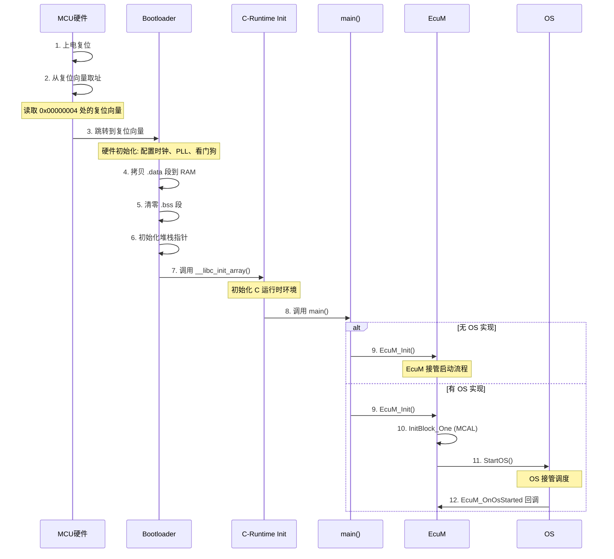

**关键硬件寄存器操作（以 ARM Cortex-M 为例）：**

```c
/* 启动代码中的关键操作 — 汇编级 */
__attribute__((naked)) void Reset_Handler(void)
{
    /* 1. 设置栈指针 */
    __asm volatile("ldr sp, =_estack");

    /* 2. 拷贝 .data 段 */
    extern uint32 _sdata, _edata, _sidata;
    for (uint32* src = &_sidata, *dst = &_sdata; dst < &_edata; src++, dst++)
        *dst = *src;

    /* 3. 清零 .bss 段 */
    extern uint32 _sbss, _ebss;
    for (uint32* dst = &_sbss; dst < &_ebss; dst++)
        *dst = 0;

    /* 4. 调用构造函数 */
    __libc_init_array();

    /* 5. 调用 main */
    main();

    /* 6. 死循环 */
    while (1);
}

int main(void)
{
    /* 关闭看门狗 */
    Wdg_Init(&Wdg_Config);

    /* 初始化 MCU 基础模块 */
    Mcu_Init(&Mcu_Config);
    Mcu_InitClock(Mcu_ClockSetting);

    /* 初始化端口和引脚 */
    Port_Init(&Port_Config);
    Dio_Init(&Dio_Config);

    /* 调用 EcuM 启动流程 */
    EcuM_Init();

    /* 正常情况下不会执行到这里 */
    while (1);
}
```

### 7.2 休眠唤醒的硬件级原理

EcuM 控制休眠和唤醒的核心在于操作 MCU 的**电源管理单元（PMU）**：

```c
/* ARM Cortex-M 的 WFI/WFE 指令 */
#define __WFI()    __asm volatile("wfi")   /* Wait For Interrupt */
#define __WFE()    __asm volatile("wfe")   /* Wait For Event */

/* 深度休眠的硬件配置 */
void EcuM_ConfigureDeepSleep(void)
{
    /* 以 STM32 为例的休眠配置 */

    /* 1. 设置 CPU 进入深度睡眠模式 */
    SCB->SCR |= SCB_SCR_SLEEPDEEP_Msk;  /* 设置 SLEEPDEEP 位 */

    /* 2. 配置电源控制寄存器 */
    PWR->CR |= PWR_CR_PDDS;  /* 进入深度休眠模式 */
    PWR->CR |= PWR_CR_LPDS;  /* 低功耗深度休眠 */

    /* 3. 配置唤醒源 — 保留唤醒引脚 */
    EXTI->IMR |= (1 << WAKEUP_PIN);   /* 中断屏蔽使能 */
    EXTI->RTSR |= (1 << WAKEUP_PIN);  /* 上升沿触发 */

    /* 4. 进入休眠 */
    __WFI();

    /* 5. 醒来后 — 清除 SLEEPDEEP 位 */
    SCB->SCR &= ~SCB_SCR_SLEEPDEEP_Msk;
}
```

### 7.3 唤醒源验证的防抖算法

EcuM 的唤醒源验证使用了一种**基于时间窗口的防抖算法**：

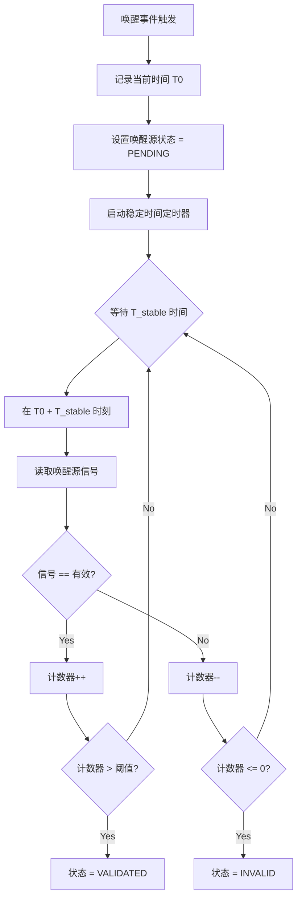

```c
/* 基于计数器的防抖实现 */
#define ECUM_DEBOUNCE_THRESHOLD   5   /* 连续5次有效确认唤醒 */
#define ECUM_DEBOUNCE_SAMPLE_MS   10  /* 每10ms采样一次 */

typedef struct {
    uint8    counter;             /* 当前计数值 */
    uint8    threshold;           /* 确认阈值 */
    uint8    sampleInterval;      /* 采样间隔(ms) */
    boolean  lastState;           /* 上次采样值 */
    uint32   lastSampleTime;      /* 上次采样时间 */
} EcuM_DebounceFilterType;

/* 防抖滤波处理 */
EcuM_WakeupStatusType EcuM_DebounceFilter(
    EcuM_DebounceFilterType* filter,
    boolean currentSignal)
{
    uint32 now = Os_GetTickCount();

    /* 检查是否到达采样间隔 */
    if ((now - filter->lastSampleTime) < filter->sampleInterval)
    {
        return ECUM_WAKEUP_STATUS_PENDING;  /* 还未到采样时间 */
    }

    filter->lastSampleTime = now;

    if (currentSignal == TRUE)
    {
        /* 有效信号，计数器递增 */
        if (filter->counter < filter->threshold * 2)
        {
            filter->counter++;
        }
    }
    else
    {
        /* 无效信号，计数器递减 */
        if (filter->counter > 0)
        {
            filter->counter--;
        }
    }

    /* 判断结果 */
    if (filter->counter >= filter->threshold)
    {
        return ECUM_WAKEUP_STATUS_VALIDATED;  /* 确认唤醒 */
    }
    else if (filter->counter == 0)
    {
        return ECUM_WAKEUP_STATUS_INVALID;    /* 确认无效 */
    }
    else
    {
        return ECUM_WAKEUP_STATUS_PENDING;    /* 仍在等待 */
    }
}
```

### 7.4 多唤醒源仲裁机制

当多个唤醒源同时触发时，EcuM 需要仲裁优先级：

```c
/* 唤醒源优先级配置 */
typedef struct {
    EcuM_WakeupSourceType  source;
    uint8                  priority;  /* 0 = 最高优先级 */
    uint32                 stabilizationTime;
} EcuM_WakeupPriorityType;

/* 多唤醒源仲裁 */
EcuM_WakeupSourceType EcuM_ArbitrateWakeupSources(uint32 activeSources)
{
    uint8 highestPriority = 0xFF;
    EcuM_WakeupSourceType winner = ECUM_WAKEUP_SOURCE_INTERNAL;
    uint8 i;

    for (i = 0; i < EcuM_ConfigPtr->wakeupSourceCount; i++)
    {
        if (activeSources & (1 << EcuM_ConfigPtr->wakeupSources[i].source))
        {
            /* 该唤醒源有效 */
            if (EcuM_ConfigPtr->wakeupSources[i].priority < highestPriority)
            {
                highestPriority = EcuM_ConfigPtr->wakeupSources[i].priority;
                winner = EcuM_ConfigPtr->wakeupSources[i].source;
            }
        }
    }

    return winner;
}

/* 多唤醒源同时到达的处理 */
void EcuM_HandleMultipleWakeups(uint32 wakeupSourceMask)
{
    EcuM_WakeupSourceType primarySource;
    uint8 i;

    /* 1. 仲裁出最高优先级的唤醒源 */
    primarySource = EcuM_ArbitrateWakeupSources(wakeupSourceMask);

    /* 2. 按优先级顺序验证各唤醒源 */
    for (i = 0; i < EcuM_ConfigPtr->wakeupSourceCount; i++)
    {
        if (wakeupSourceMask & (1 << EcuM_ConfigPtr->wakeupSources[i].source))
        {
            EcuM_WakeupSourceType src = EcuM_ConfigPtr->wakeupSources[i].source;

            /* 验证该唤醒源 */
            EcuM_CheckWakeup(src);

            /* 如果最高优先级唤醒源已验证有效，立即唤醒 */
            if ((src == primarySource) &&
                (EcuM_GetWakeupStatus() == ECUM_WAKEUP_STATUS_VALIDATED))
            {
                break;
            }
        }
    }
}
```

### 7.5 时间同步与超时管理

EcuM 内部维护了多个时间相关的管理机制：

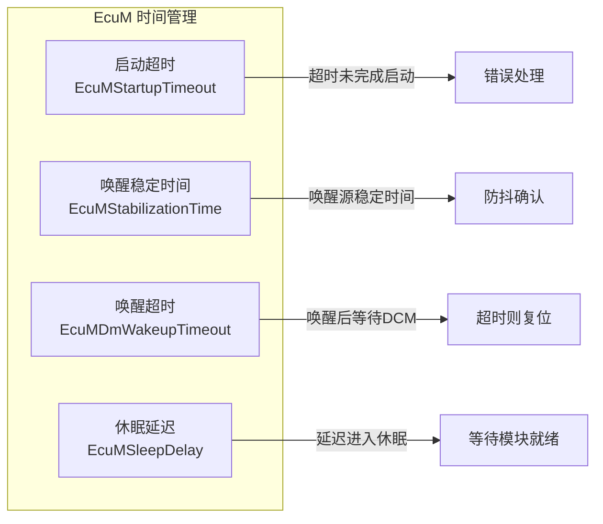

```c
/* 超时管理 */
typedef struct {
    uint32 startupTimeout;        /* 启动超时 (ms) */
    uint32 wakeupTimeout;         /* 唤醒超时 (ms) */
    uint32 sleepDelay;            /* 休眠延迟 (ms) */
    uint32 sleepEntryTimeout;     /* 进入休眠超时 (ms) */
} EcuM_TimeConfigType;

/* 超时监控任务 */
TASK(EcuM_TimeoutMonitorTask)
{
    uint32 elapsed;
    uint32 now = Os_GetTickCount();

    switch (EcuM_Module.internalState)
    {
        case ECUM_INTERNAL_STATE_STARTUP_ONE:
            /* 检查启动超时 */
            elapsed = now - EcuM_Module.stateEntryTime;
            if (elapsed > EcuM_ConfigPtr->timeConfig.startupTimeout)
            {
                /* 启动超时 — 执行错误恢复 */
                EcuM_ErrorRecovery(ECUM_ERROR_STARTUP_TIMEOUT);
            }
            break;

        case ECUM_INTERNAL_STATE_WAKEUP:
            /* 检查唤醒超时 */
            elapsed = now - EcuM_Module.stateEntryTime;
            if (elapsed > EcuM_ConfigPtr->timeConfig.wakeupTimeout)
            {
                /* 唤醒超时 — 执行复位 */
                EcuM_RequestShutdown();
            }
            break;

        default:
            break;
    }

    /* 重新调度本任务 */
    TerminateTask();
}
```

---

## 八、EcuM 的 Flex 变体与经典变体

AUTOSAR 4.0 之后引入了 EcuM 的两种变体：

### 8.1 经典变体（Classic Variant）

| 特性 | 说明 |
|------|------|
| **适用场景** | 传统 ECU，有固定启动/关闭流程 |
| **状态机** | 固定状态机，阶段固定 |
| **配置复杂度** | 较低 |
| **灵活性** | 较低，阶段固定不可调整 |

### 8.2 Flex 变体（Flex Variant）

| 特性 | 说明 |
|------|------|
| **适用场景** | 复杂 ECU，需要灵活的启动/关闭策略 |
| **状态机** | 可配置状态机，阶段可自定义 |
| **配置复杂度** | 较高 |
| **灵活性** | 高，可根据需求调整启动阶段 |

```c
/* Flex 变体的关键特性 — 可配置的启动阶段 */
typedef struct {
    uint8              phaseId;
    uint8              dependencyCount;     /* 依赖的前置阶段数 */
    uint8              dependencyList[10];  /* 前置阶段 ID 列表 */
    EcuM_PhaseAction   action;             /* 该阶段执行的动作 */
    uint32             timeout;            /* 该阶段超时时间 */
    boolean            isSynchronous;      /* 是否同步执行 */
} EcuM_FlexPhaseConfigType;

/* Flex 变体的启动配置示例 */
const EcuM_FlexPhaseConfigType EcuM_FlexPhases[] = {
    {
        .phaseId = 1,
        .dependencyCount = 0,        /* 无依赖 */
        .action = EcuM_InitBlockOne,
        .timeout = 100,
        .isSynchronous = TRUE
    },
    {
        .phaseId = 2,
        .dependencyCount = 1,        /* 依赖阶段1 */
        .dependencyList = {1},
        .action = EcuM_InitBlockTwo,
        .timeout = 200,
        .isSynchronous = TRUE
    },
    {
        .phaseId = 3,
        .dependencyCount = 1,        /* 依赖阶段1 */
        .dependencyList = {1},
        .action = EcuM_InitBlockThree,
        .timeout = 500,
        .isSynchronous = FALSE       /* 可异步执行 */
    },
    {
        .phaseId = 4,
        .dependencyCount = 2,        /* 依赖阶段2和3 */
        .dependencyList = {2, 3},
        .action = EcuM_InitBlockFour,
        .timeout = 300,
        .isSynchronous = TRUE
    }
};
```

### 8.3 变体对比

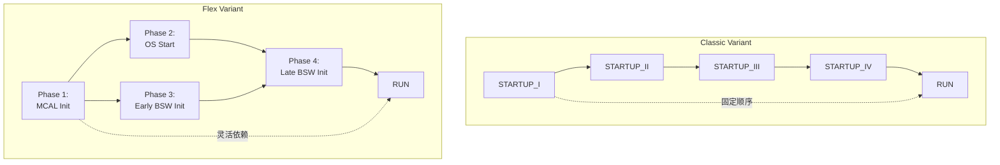

---

## 九、总结与最佳实践

### 9.1 核心要点回顾

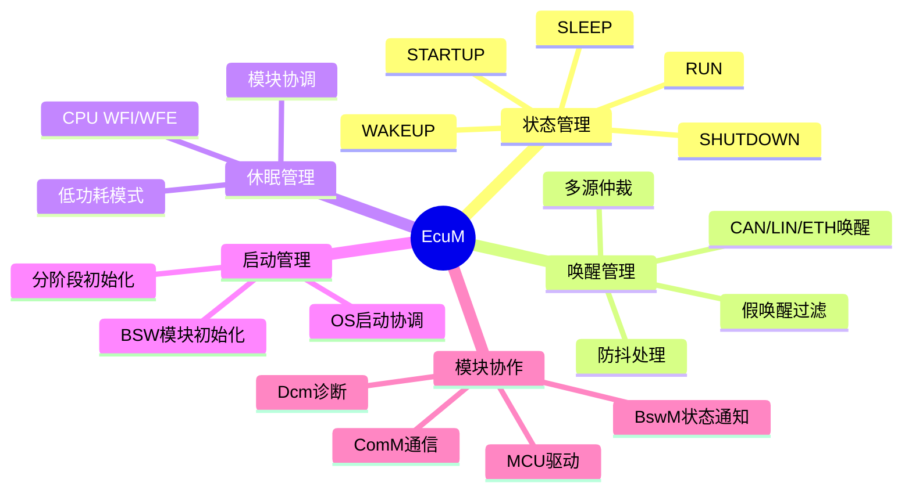

### 9.2 实际开发中的最佳实践

#### 1️⃣ **启动阶段优化**
```c
/* 好的实践：缩短启动时间 */
/* 1. 将非关键的初始化延迟到进入 RUN 状态后 */
void EcuM_OnRunEnter(void)
{
    /* 在 RUN 状态的后台任务中延迟初始化非关键模块 */
    SchM_ActivateTask(EcuM_LazyInitTask);
}

TASK(EcuM_LazyInitTask)
{
    /* 延迟初始化：非关键通信栈、诊断、NVM等 */
    NvM_Init();
    Dcm_Init();
    TerminateTask();
}
```

#### 2️⃣ **唤醒响应优化**
```c
/* 好的实践：根据唤醒源差异化响应 */
void EcuM_OnWakeupReaction(EcuM_WakeupSourceType source)
{
    switch (source)
    {
        case ECUM_WAKEUP_SOURCE_CAN:
            /* CAN 唤醒 — 快速恢复通信 */
            CanSM_RequestComMode(CANSM_COMM_FULL);
            break;

        case ECUM_WAKEUP_SOURCE_TIMER:
            /* 定时器唤醒 — 执行短暂任务后继续休眠 */
            EcuM_PerformPeriodicTask();
            EcuM_GoToSleep();
            break;

        case ECUM_WAKEUP_SOURCE_IO:
            /* IO 唤醒 — 可能是用户交互，全功能恢复 */
            EcuM_FullWakeup();
            break;

        default:
            EcuM_FullWakeup();
            break;
    }
}
```

#### 3️⃣ **休眠策略选择**
```c
/* 好的实践：根据系统状态动态选择休眠模式 */
EcuM_SleepModeType EcuM_SelectSleepMode(void)
{
    /* 检查是否有 pending 的唤醒事件 */
    if (EcuM_Module.wakeupSources != 0x00)
    {
        /* 有预定的唤醒事件，选择浅度休眠 */
        return ECUM_SLEEP_MODE_SLEEP;
    }

    /* 检查电池电压 */
    if (EcuM_GetBatteryVoltage() < LOW_BATTERY_THRESHOLD)
    {
        /* 低电量，选择深度休眠以节省更多功耗 */
        return ECUM_SLEEP_MODE_HALT;
    }

    /* 默认配置的休眠模式 */
    return EcuM_ConfigPtr->defaultSleepMode;
}
```

#### 4️⃣ **常见错误与避免**

| 常见错误 | 后果 | 解决方案 |
|---------|------|---------|
| 唤醒源防抖时间过短 | 假唤醒频繁 | 根据硬件特性设置足够的稳定时间(通常50-100ms) |
| 休眠前未释放通信 | 通信模块状态不一致 | 在 EcuM_ValidateSleep 中检查所有通信模块状态 |
| 启动顺序配置错误 | 模块初始化失败（访问未初始化的硬件） | 严格按照依赖关系配置初始化顺序 |
| 唤醒后未恢复外设时钟 | 外设工作异常 | 在 EcuM_RestoreHardwareFromSleep 中完整恢复 |
| 忽略假唤醒处理 | 不必要的功耗增加 | 实现完善的防抖和假唤醒过滤机制 |

### 9.3 与 AUTOSAR 4.x 版本的演进

| 版本 | 关键变化 |
|------|---------|
| AUTOSAR 3.x | 固定启动序列，有限的唤醒源管理 |
| AUTOSAR 4.0 | 引入 Flex 变体，支持可配置的启动阶段 |
| AUTOSAR 4.2 | 增强多核支持，完善唤醒源验证机制 |
| AUTOSAR 4.4 | 改进功耗管理，支持更细粒度的休眠模式 |

---

> **总结：** EcuM 是 AUTOSAR 架构中 ECU 生命周期的**总管家**，它通过精心设计的有限状态机、分阶段启动机制、灵活的唤醒/休眠管理，以及与其他 BSW 模块的紧密协作，确保了 ECU 从启动到关闭的每个阶段都安全、可靠、高效地运行。理解 EcuM 是掌握 AUTOSAR 系统级设计的关键一步。