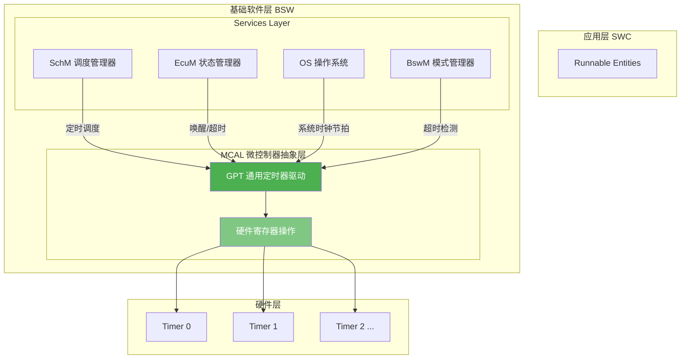
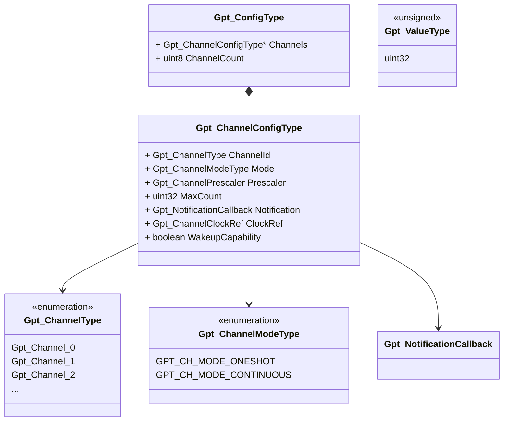
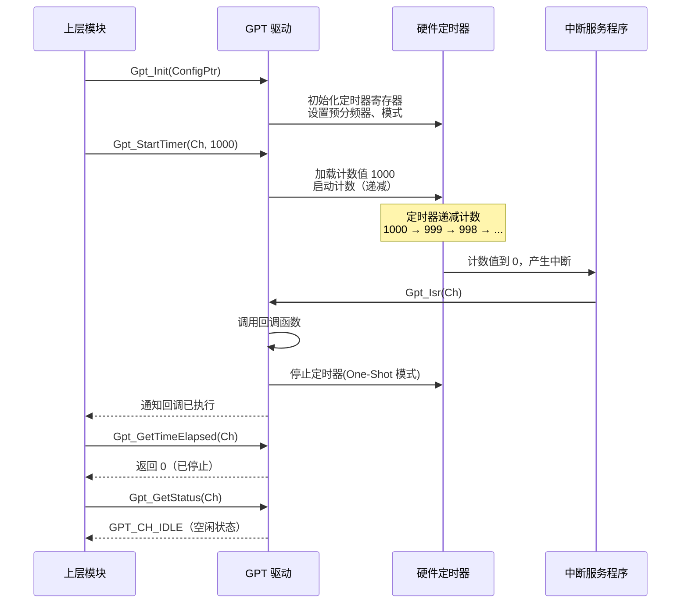
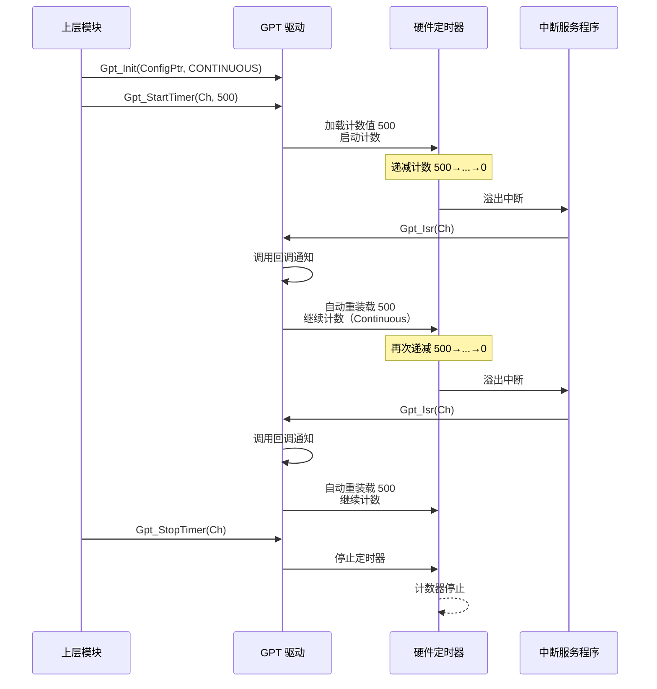
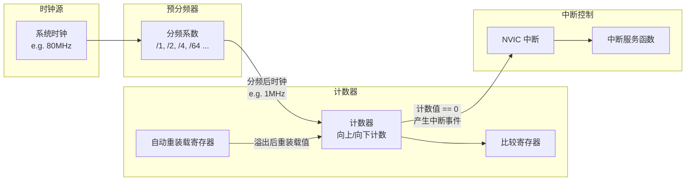
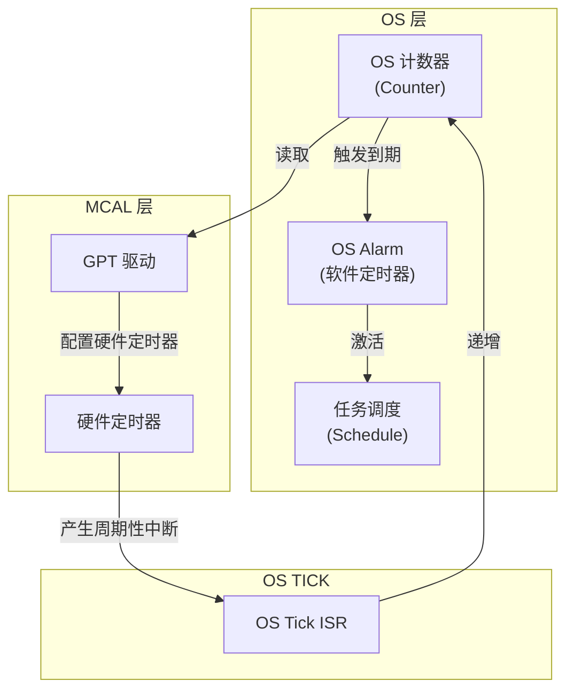
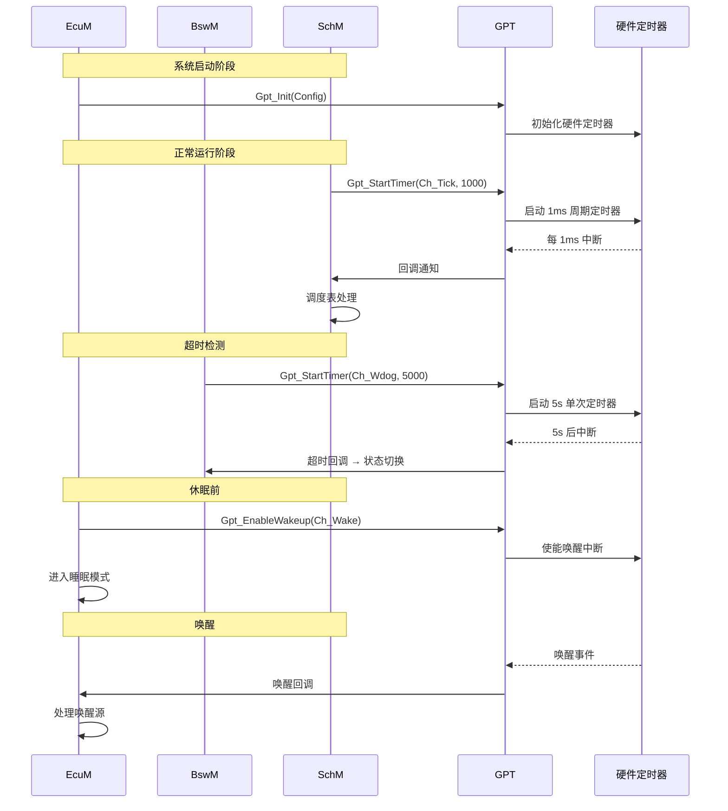
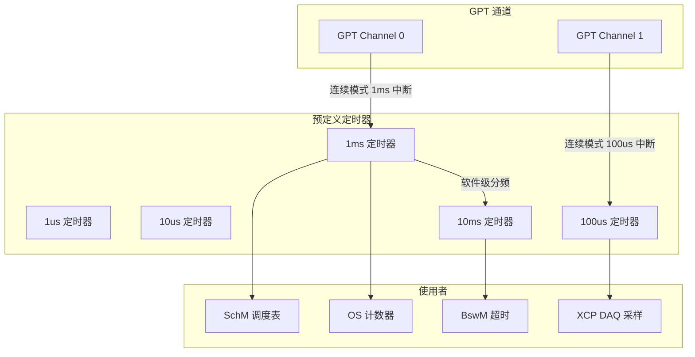
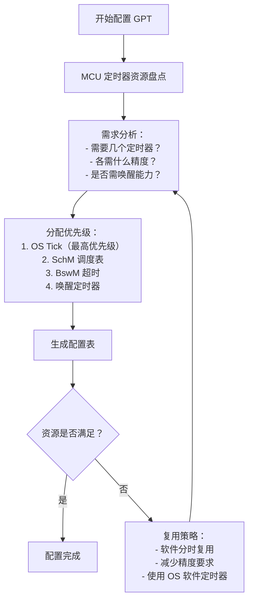
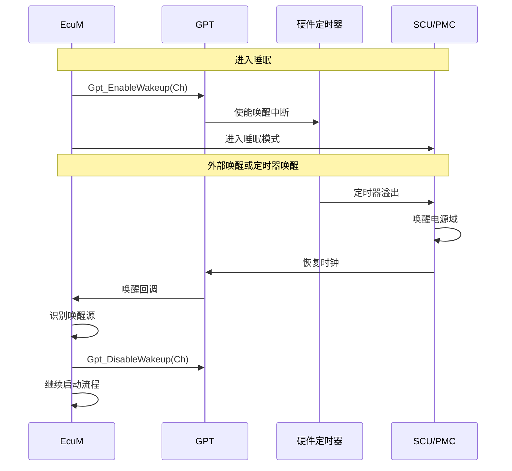

# AUTOSAR GPT 模块详解

> **GPT** = General Purpose Timer（通用定时器）
> AUTOSAR 标准中的 **GPT 驱动** 属于 **MCAL**（微控制器抽象层），负责对微控制器内部通用定时器硬件的初始化和运行时控制，为上层提供标准化的定时器服务接口。

---

## 目录

- [1. 通俗理解：GPT 是什么？](#1-通俗理解gpt-是什么)
- [2. 设计机制与设计模式](#2-设计机制与设计模式)
  - [2.1 模块分层定位](#21-模块分层定位)
  - [2.2 核心设计模式](#22-核心设计模式)
  - [2.3 关键数据结构](#23-关键数据结构)
- [3. 核心 API 详解](#3-核心-api-详解)
  - [3.1 初始化与反初始化](#31-初始化与反初始化)
  - [3.2 启动与停止定时器](#32-启动与停止定时器)
  - [3.3 获取时间与状态](#33-获取时间与状态)
  - [3.4 回调通知机制](#34-回调通知机制)
- [4. 工作流程](#4-工作流程)
  - [4.1 单次触发模式（One-Shot）](#41-单次触发模式one-shot)
  - [4.2 连续触发模式（Continuous）](#42-连续触发模式continuous)
- [5. 配置与代码示例](#5-配置与代码示例)
  - [5.1 配置结构伪代码](#51-配置结构伪代码)
  - [5.2 驱动代码示例](#52-驱动代码示例)
- [6. 深入原理](#6-深入原理)
  - [6.1 硬件定时器工作原理](#61-硬件定时器工作原理)
  - [6.2 GPT 与操作系统定时器的关系](#62-gpt-与操作系统定时器的关系)
  - [6.3 与 BSW 其他模块的交互](#63-与-bsw-其他模块的交互)
  - [6.4 时间同步与精度](#64-时间同步与精度)
- [7. 常见问题与设计考量](#7-常见问题与设计考量)
  - [7.1 定时器资源管理](#71-定时器资源管理)
  - [7.2 中断优先级与嵌套](#72-中断优先级与嵌套)
  - [7.3 唤醒与低功耗](#73-唤醒与低功耗)

---

## 1. 通俗理解：GPT 是什么？

### 生活类比

> GPT 就像厨房里的 **多功能计时器**：
> - 你可以设置它 **N 秒后响铃**（单次触发 — One-Shot）
> - 也可以让它 **每隔 N 秒响一次**（连续触发 — Continuous）
> - 随时可以查看 **还剩多少秒**（获取当前计数值）
> - 随时可以 **暂停/重置**（停止定时器）
> - 不同炉灶上的计时器各自独立工作（多个硬件定时器通道）

### 一句话总结

**GPT 模块是 AUTOSAR 对 MCU 硬件定时器驱动的标准化封装**，让上层软件（SchM、OS、BswM、EcuM 等）可以通过统一的 API 来使用硬件定时器，而不必关心底层是哪个 MCU、哪款定时器。

---

## 2. 设计机制与设计模式

### 2.1 模块分层定位



**图中解释：** GPT 位于 MCAL 层，向下直接操作硬件寄存器，向上为 SchM（调度器）、EcuM（ECU 管理器）、BswM（模式管理器）、OS（操作系统）等模块提供定时服务。它隔离了不同 MCU 的定时器硬件差异。

### 2.2 核心设计模式

| 设计模式 | 应用方式 | 说明 |
|---------|---------|------|
| **分层抽象** | GPT 硬件无关接口 → 硬件相关实现 | 上层通过标准 API 调用，无需关心具体 MCU 定时器类型 |
| **回调机制** | 通知函数指针 | 定时器溢出时调用注册的回调函数，实现异步通知 |
| **配置驱动** | 静态配置结构体 | 所有定时器参数通过配置结构体注入，代码与配置分离 |
| **资源封装** | 每个定时器通道独立封装 | 每个硬件定时器作为一个独立资源，提供完整的控制接口 |

### 2.3 关键数据结构



**图中解释：** 核心配置结构体 `Gpt_ConfigType` 包含所有定时器通道的配置数组。每个通道配置 `Gpt_ChannelConfigType` 定义了通道 ID、模式（单次/连续）、预分频器、最大计数值、回调函数和唤醒能力等参数。

---

## 3. 核心 API 详解

标准 GPT 接口定义在 `Gpt.h` 头文件中，以下是主要 API：

### 3.1 初始化与反初始化

```c
/* 初始化所有 GPT 通道 */
void Gpt_Init(const Gpt_ConfigType* ConfigPtr);

/* 反初始化，停止所有定时器并恢复默认状态 */
void Gpt_DeInit(void);
```

### 3.2 启动与停止定时器

```c
/* 启动指定通道定时器，开始计数 */
void Gpt_StartTimer(Gpt_ChannelType Channel, Gpt_ValueType Value);

/* 停止指定通道定时器 */
void Gpt_StopTimer(Gpt_ChannelType Channel);

/* 允许定时器通道产生中断（用于唤醒等场景） */
void Gpt_EnableWakeup(Gpt_ChannelType Channel);

/* 禁止定时器通道产生中断 */
void Gpt_DisableWakeup(Gpt_ChannelType Channel);
```

### 3.3 获取时间与状态

```c
/* 获取当前计数值（读取定时器当前值） */
Gpt_ValueType Gpt_GetTimeElapsed(Gpt_ChannelType Channel);

/* 获取距离溢出还有多少时间 */
Gpt_ValueType Gpt_GetTimeRemaining(Gpt_ChannelType Channel);

/* 获取定时器状态 */
Gpt_ChannelStatus Gpt_GetStatus(Gpt_ChannelType Channel);
```

### 3.4 回调通知机制

```c
/* 定时器溢出时调用的回调函数类型定义 */
typedef void (*Gpt_NotificationCallback)(void);

/* 上层通过配置结构体注册回调：
 * 当定时器计数值从 Value 递减到 0 时触发中断，
 * 在 ISR 中调用此回调函数 */
```

---

## 4. 工作流程

### 4.1 单次触发模式（One-Shot）



**图中解释：** 单次触发模式的完整流程。初始化后，启动定时器加载计数值并递减计数。当计数到 0 时产生中断，ISR 中调用回调函数通知上层，然后定时器自动停止。上层可通过 `GetTimeElapsed` 和 `GetStatus` 查询状态。

### 4.2 连续触发模式（Continuous）



**图中解释：** 连续触发模式下，定时器溢出后自动重装载计数值并继续计数，无需手动重新启动。适用于周期性任务调度、时间片轮转等场景。

---

## 5. 配置与代码示例

### 5.1 配置结构伪代码

```c
/* ============================================================
 * Gpt_Cfg.h — GPT 模块静态配置
 * ============================================================ */

/* 定时器通道模式 */
#define GPT_CH_MODE_ONESHOT     0x00u   /* 单次触发 */
#define GPT_CH_MODE_CONTINUOUS  0x01u   /* 连续触发 */

/* 定时器通道状态 */
typedef enum {
    GPT_CH_IDLE,        /* 空闲 */
    GPT_CH_BUSY,        /* 正在运行 */
    GPT_CH_OVERFLOW     /* 已溢出 */
} Gpt_ChannelStatus;

/* 通道配置结构体 */
typedef struct {
    Gpt_ChannelType          ChannelId;      /* 通道 ID */
    Gpt_ChannelModeType      Mode;           /* 单次/连续 */
    Gpt_ChannelPrescaler     Prescaler;      /* 预分频系数 */
    uint32                   MaxCount;       /* 最大计数值(重装载值) */
    Gpt_NotificationCallback Notification;   /* 溢出回调函数指针 */
    boolean                  WakeupCapability;/* 是否支持唤醒 */
    uint32                   GptChannelClockRef; /* 时钟源引用 */
} Gpt_ChannelConfigType;

/* 总配置结构体 */
typedef struct {
    const Gpt_ChannelConfigType* Channels;   /* 通道配置数组指针 */
    uint8                        ChannelCount;/* 通道数量 */
    uint32                       GptPredefTimerRef; /* 预定义定时器引用 */
} Gpt_ConfigType;

/* ============================================================
 * 具体配置实例
 * ============================================================ */

/* 回调函数声明 */
void Timer0_Callback(void);
void Timer1_Callback(void);

/* 定时器 0 配置 — 单次触发模式，用于 EcuM 唤醒超时检测 */
static const Gpt_ChannelConfigType Gpt_ChConfig_0 = {
    .ChannelId        = Gpt_Channel_0,
    .Mode             = GPT_CH_MODE_ONESHOT,
    .Prescaler        = 64,               /* 64 分频 */
    .MaxCount         = 0xFFFFFFFFu,      /* 32 位最大计数值 */
    .Notification     = Timer0_Callback,
    .WakeupCapability = TRUE,
    .GptChannelClockRef = 0               /* 时钟源 0 */
};

/* 定时器 1 配置 — 连续触发模式，用于 SchM 周期性调度 */
static const Gpt_ChannelConfigType Gpt_ChConfig_1 = {
    .ChannelId        = Gpt_Channel_1,
    .Mode             = GPT_CH_MODE_CONTINUOUS,
    .Prescaler        = 1,                /* 1 分频 */
    .MaxCount         = 10000u,           /* 10k 计数值 */
    .Notification     = Timer1_Callback,
    .WakeupCapability = FALSE,
    .GptChannelClockRef = 0
};

/* 总配置表 */
static const Gpt_ConfigType Gpt_Config = {
    .Channels     = (const Gpt_ChannelConfigType[]){
        Gpt_ChConfig_0,
        Gpt_ChConfig_1
    },
    .ChannelCount = 2,
    .GptPredefTimerRef = 0
};
```

### 5.2 驱动代码示例

以下是一个简化的 GPT 驱动实现示例，展示了核心逻辑：

```c
/* ============================================================
 * Gpt.c — GPT 驱动实现（简化示例）
 * ============================================================ */

#include "Gpt.h"
#include "Gpt_Regs.h"  /* 硬件寄存器定义 */

/* 模块内部状态 */
typedef struct {
    Gpt_ChannelStatus   Status;
    Gpt_ValueType       MaxCount;
    Gpt_NotificationCallback Notification;
    boolean             WakeupEnabled;
    boolean             IsRunning;
} Gpt_ChannelState;

/* 每个通道的状态数组 */
static Gpt_ChannelState Gpt_ChState[GPT_CHANNEL_COUNT];

/* 全局配置指针（初始化后保存） */
static const Gpt_ConfigType* Gpt_GlobalConfig = NULL_PTR;

/* ============================================================
 * 初始化
 * ============================================================ */
void Gpt_Init(const Gpt_ConfigType* ConfigPtr)
{
    uint8 i;

    /* 参数检查 */
    if (ConfigPtr == NULL_PTR) {
        Det_ReportError(GPT_MODULE_ID, GPT_INSTANCE_ID,
                        GPT_INIT_SID, GPT_E_PARAM_CONFIG);
        return;
    }

    /* 保存配置指针 */
    Gpt_GlobalConfig = ConfigPtr;

    /* 遍历所有通道进行初始化 */
    for (i = 0; i < ConfigPtr->ChannelCount; i++) {
        const Gpt_ChannelConfigType* chCfg = &ConfigPtr->Channels[i];
        uint8 chId = (uint8)chCfg->ChannelId;

        /* 保存状态 */
        Gpt_ChState[chId].Status       = GPT_CH_IDLE;
        Gpt_ChState[chId].MaxCount     = chCfg->MaxCount;
        Gpt_ChState[chId].Notification = chCfg->Notification;
        Gpt_ChState[chId].IsRunning    = FALSE;

        /* 硬件寄存器初始化 */
        Gpt_Hw_InitChannel(chId, chCfg);

        /* 如果支持唤醒，默认禁用 */
        Gpt_ChState[chId].WakeupEnabled = FALSE;
        if (chCfg->WakeupCapability) {
            Gpt_Hw_DisableWakeup(chId);
        }
    }
}

/* ============================================================
 * 启动定时器
 * ============================================================ */
void Gpt_StartTimer(Gpt_ChannelType Channel, Gpt_ValueType Value)
{
    uint8 chId = (uint8)Channel;

    /* 参数检查 */
    if (chId >= GPT_CHANNEL_COUNT) {
        Det_ReportError(GPT_MODULE_ID, GPT_INSTANCE_ID,
                        GPT_START_TIMER_SID, GPT_E_PARAM_CHANNEL);
        return;
    }

    if (Value == 0) {
        Det_ReportError(GPT_MODULE_ID, GPT_INSTANCE_ID,
                        GPT_START_TIMER_SID, GPT_E_PARAM_VALUE);
        return;
    }

    /* 更新状态 */
    Gpt_ChState[chId].Status    = GPT_CH_BUSY;
    Gpt_ChState[chId].IsRunning = TRUE;

    /* 写入硬件定时器计数值并启动 */
    Gpt_Hw_LoadCount(chId, Value);
    Gpt_Hw_Start(chId);
}

/* ============================================================
 * 停止定时器
 * ============================================================ */
void Gpt_StopTimer(Gpt_ChannelType Channel)
{
    uint8 chId = (uint8)Channel;

    if (chId >= GPT_CHANNEL_COUNT) {
        Det_ReportError(GPT_MODULE_ID, GPT_INSTANCE_ID,
                        GPT_STOP_TIMER_SID, GPT_E_PARAM_CHANNEL);
        return;
    }

    /* 停止硬件定时器 */
    Gpt_Hw_Stop(chId);

    /* 更新状态 */
    Gpt_ChState[chId].Status    = GPT_CH_IDLE;
    Gpt_ChState[chId].IsRunning = FALSE;
}

/* ============================================================
 * 获取经过时间
 * ============================================================ */
Gpt_ValueType Gpt_GetTimeElapsed(Gpt_ChannelType Channel)
{
    uint8 chId = (uint8)Channel;

    if (chId >= GPT_CHANNEL_COUNT) {
        Det_ReportError(GPT_MODULE_ID, GPT_INSTANCE_ID,
                        GPT_GET_TIME_ELAPSED_SID, GPT_E_PARAM_CHANNEL);
        return 0;
    }

    /* 读取硬件当前计数值，计算已用时间 */
    return Gpt_Hw_GetElapsed(chId);
}

/* ============================================================
 * 获取剩余时间
 * ============================================================ */
Gpt_ValueType Gpt_GetTimeRemaining(Gpt_ChannelType Channel)
{
    uint8 chId = (uint8)Channel;

    if (chId >= GPT_CHANNEL_COUNT) {
        Det_ReportError(GPT_MODULE_ID, GPT_INSTANCE_ID,
                        GPT_GET_TIME_REMAINING_SID, GPT_E_PARAM_CHANNEL);
        return 0;
    }

    return Gpt_Hw_GetRemaining(chId);
}

/* ============================================================
 * 获取状态
 * ============================================================ */
Gpt_ChannelStatus Gpt_GetStatus(Gpt_ChannelType Channel)
{
    uint8 chId = (uint8)Channel;

    if (chId >= GPT_CHANNEL_COUNT) {
        Det_ReportError(GPT_MODULE_ID, GPT_INSTANCE_ID,
                        GPT_GET_STATUS_SID, GPT_E_PARAM_CHANNEL);
        return GPT_CH_IDLE;
    }

    return Gpt_ChState[chId].Status;
}

/* ============================================================
 * 中断服务程序（由硬件中断向量表调用）
 * ============================================================ */
void Gpt_Isr(Gpt_ChannelType Channel)
{
    uint8 chId = (uint8)Channel;
    const Gpt_ChannelConfigType* chCfg;

    if (chId >= GPT_CHANNEL_COUNT || Gpt_GlobalConfig == NULL_PTR) {
        return;
    }

    chCfg = &Gpt_GlobalConfig->Channels[chId];

    /* 清除中断标志 */
    Gpt_Hw_ClearInterrupt(chId);

    /* 更新状态 */
    Gpt_ChState[chId].Status = GPT_CH_OVERFLOW;

    /* 如果是单次触发模式，停止定时器 */
    if (chCfg->Mode == GPT_CH_MODE_ONESHOT) {
        Gpt_ChState[chId].IsRunning = FALSE;
        Gpt_ChState[chId].Status = GPT_CH_IDLE;
    }
    /* 连续触发模式：硬件自动重装载，无需软件干预 */

    /* 调用回调通知 */
    if (Gpt_ChState[chId].Notification != NULL_PTR) {
        Gpt_ChState[chId].Notification();
    }
}

/* ============================================================
 * 唤醒使能/禁用
 * ============================================================ */
void Gpt_EnableWakeup(Gpt_ChannelType Channel)
{
    uint8 chId = (uint8)Channel;

    if (chId >= GPT_CHANNEL_COUNT) {
        Det_ReportError(GPT_MODULE_ID, GPT_INSTANCE_ID,
                        GPT_ENABLE_WAKEUP_SID, GPT_E_PARAM_CHANNEL);
        return;
    }

    Gpt_ChState[chId].WakeupEnabled = TRUE;
    Gpt_Hw_EnableWakeup(chId);
}

void Gpt_DisableWakeup(Gpt_ChannelType Channel)
{
    uint8 chId = (uint8)Channel;

    if (chId >= GPT_CHANNEL_COUNT) {
        Det_ReportError(GPT_MODULE_ID, GPT_INSTANCE_ID,
                        GPT_DISABLE_WAKEUP_SID, GPT_E_PARAM_CHANNEL);
        return;
    }

    Gpt_ChState[chId].WakeupEnabled = FALSE;
    Gpt_Hw_DisableWakeup(chId);
}
```

---

## 6. 深入原理

### 6.1 硬件定时器工作原理



**图中解释：** 硬件定时器的核心工作原理。系统时钟经过预分频器分频后驱动计数器进行递减（或递增）计数。当计数器值到达 0（递减模式）或与比较寄存器匹配时，产生中断事件。连续模式下，自动重装载寄存器（ARR）在溢出后自动将计数值重新加载到计数器。

#### 定时时间计算公式

```
定时时间 = (加载值 + 1) × 预分频值 / 时钟频率

例如：
  时钟频率 = 80 MHz
  预分频值 = 64
  加载值   = 10000

  定时时间 = (10000 + 1) × 64 / 80,000,000 = 8.0008 ms

  最大定时时间（32位定时器）：
  T_max = 0xFFFFFFFF × 64 / 80,000,000 ≈ 34.36 秒
```

### 6.2 GPT 与操作系统定时器的关系



**图中解释：** 在 AUTOSAR OS 中，GPT 通常作为 **OS 的系统时钟节拍源**。GPT 定时器产生周期性中断（如每 1ms），OS 的 Tick ISR 中递增 OS 计数器（Counter），计数器到期触发 Alarm，Alarm 激活 Task 或调度事件。GPT 还可以被 SchM 用于调度表（Schedule Table）的时基。

### 6.3 与 BSW 其他模块的交互



**图中解释：** GPT 与多个 BSW 模块交互：
- **SchM**：作为调度表的时基源
- **BswM**：提供超时检测，触发状态切换
- **EcuM**：提供唤醒定时器，从低功耗模式唤醒 ECU
- **OS**：作为系统 Tick 源

### 6.4 时间同步与精度

AUTOSAR GPT 支持 **预定义定时器（Predef Timer）** 概念，用于时间同步：



**图中解释：** 预定义定时器机制允许基于一个或多个硬件定时器通道，衍生出多个不同精度的软件定时器。例如，一个 1ms 的硬件定时器中断可以在软件中计数 10 次，提供一个 10ms 的定时服务。

---

## 7. 常见问题与设计考量

### 7.1 定时器资源管理



**图中解释：** GPT 资源管理流程。MCU 的硬件定时器数量有限，需要先盘点可用资源，再根据需求分配优先级，最后验证是否满足需求。不满足时需要通过软件复用或降低精度来优化。

### 7.2 中断优先级与嵌套

```c
/* GPT 中断优先级配置建议 */
#define GPT_ISR_PRIORITY_OSTICK    2   /* OS Tick — 最高优先级 */
#define GPT_ISR_PRIORITY_SCHM      3   /* 调度表 */
#define GPT_ISR_PRIORITY_BSWM      4   /* 模式管理超时 */
#define GPT_ISR_PRIORITY_WAKEUP    5   /* 唤醒定时器 */

/* 注意事项：
 * 1. OS Tick 中断优先级应高于所有任务
 * 2. 回调函数中不应调用可能阻塞的函数
 * 3. 中断处理应尽量短小，避免影响系统实时性
 * 4. 如果多个 GPT 通道共享同一个中断向量，需要区分通道
 */
```

### 7.3 唤醒与低功耗



**图中解释：** 唤醒功能是 GPT 在低功耗场景中的关键应用。在 ECU 进入睡眠前，使能 GPT 通道的唤醒能力。当定时器溢出时，GPT 通过硬件信号唤醒 SCU/PMC，SCU 恢复电源和时钟，然后 GPT 回调通知 EcuM 处理唤醒事件。

---

## 总结

| 特性 | 说明 |
|------|------|
| **模块定位** | MCAL 层，硬件定时器驱动标准化 |
| **核心功能** | 启动/停止定时器、获取时间、溢出回调 |
| **工作模式** | 单次触发（One-Shot）、连续触发（Continuous） |
| **设计模式** | 分层抽象、回调机制、配置驱动 |
| **主要使用者** | OS、SchM、EcuM、BswM |
| **关键接口** | 8 个标准 API（Init/DeInit/Start/Stop/GetTimeElapsed/GetTimeRemaining/GetStatus/Notification） |
| **硬件特性** | 预分频、自动重装载、中断、唤醒能力 |
| **精度范围** | 从微秒级到秒级（取决于时钟频率和预分频） |

---

> **参考标准：** AUTOSAR_SWS_GPTDriver（AUTOSAR 标准 GPT 驱动规范）