# AUTOSAR NM（Network Management / 网络管理）模块详解

> 作者：AUTOSAR & 嵌入式软件专家
> 版本：v1.0
> 更新日期：2026/07/11

---

# 一、通俗理解：NM 是什么？

## 1.1 打个比方

NM 就像**学生宿舍楼的作息管理员**：

| 角色 | 在宿舍中 | 在 AUTOSAR NM 中 |
|------|----------|------------------|
| **舍长** | 协调各宿舍统一熄灯 | **NM 主节点**（协调全网络的睡眠） |
| **宿舍成员** | 每个人决定自己是否睡觉 | **ECU 节点**（每个ECU决定自己是否需要通信） |
| **敲门确认** | 熄灯前敲每个门确认 | **NM 消息**（定期发送，确认大家都在线） |
| **所有人都同意** | 确认没人还需要学习/工作 | **协调睡眠位**（Sleep Bit = 1） |
| **熄灯** | 统一关灯 | **Bus-Sleep 模式**（总线进入低功耗） |
| **有人早起** | 有人需要开灯学习 | **唤醒事件**（一个节点需要通信，唤醒所有人） |

## 1.2 核心目标

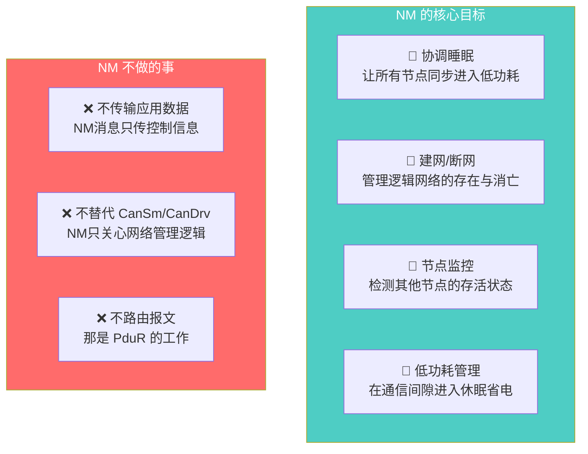

## 1.3 NM 在通信栈中的位置

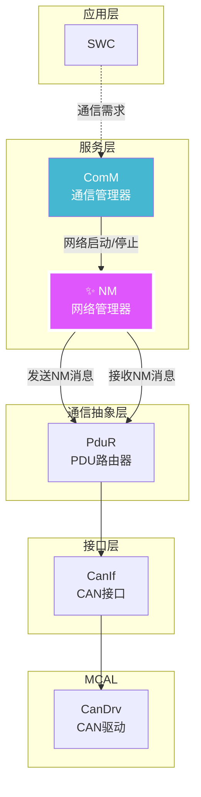

---

# 二、NM 协议深度解析

## 2.1 AUTOSAR CAN NM 报文结构

```c
/* AUTOSAR CAN NM 报文格式（标准CAN 2.0）*/

/* CAN ID 格式 */
// NM 报文使用标准 CAN ID（11位），范围：0x500 ~ 0x5FF
// CAN ID = 0x500 + NodeID
// NodeID 范围：0x00 ~ 0xFF（最多256个节点）
#define NM_CANID_BASE      0x500u
#define NM_CANID(nodeId)   (NM_CANID_BASE + (nodeId))

/* CAN NM 报文—8字节数据域结构 */
typedef struct {
    /* Byte 0: 控制位向量（Control Bit Vector） */
    uint8_t CBV;           
    
    /* Byte 1~7: 用户数据（User Data，可选）*/
    uint8_t UserData[7];   
} CanNm_PduType;

/* CBV（Control Bit Vector）位定义 */
#define NM_CBV_SLEEP_BIT       (1u << 0)   /* Bit 0: 协调睡眠位 */
#define NM_CBV_ACTIVE_WAKEUP   (1u << 1)   /* Bit 1: 主动唤醒标志 */
#define NM_CBV_RESERVED_BITS   0xFC        /* Bit 2~7: 保留 */
```

```
完整的 CAN NM 报文：

    ┌─────────────────────────────────────────────────────────────────┐
    │ CAN ID: 0x525 (表示 Node ID = 0x25)                           │
    │ DLC: 8 (固定8字节)                                             │
    │                                                               │
    │ 数据域:                                                       │
    │ ┌───────┬───────┬───────┬───────┬───────┬───────┬───────┬───────┐│
    │ │Byte 0 │ Byte1 │ Byte2 │ Byte3 │ Byte4 │ Byte5 │ Byte6 │ Byte7 ││
    │ ├───────┼───────┼───────┼───────┼───────┼───────┼───────┼───────┤│
    │ │  CBV  │  UD0  │  UD1  │  UD2  │  UD3  │  UD4  │  UD5  │  UD6  ││
    │ ├───────┴───────┴───────┴───────┴───────┴───────┴───────┴───────┤│
    │ │ CBV 详解:                                                     ││
    │ │   Bit 0 (Sleep Bit): 0 = 还在活跃 / 1 = 同意睡眠             ││
    │ │   Bit 1 (ActiveWakeup): 0 = 普通 / 1 = 主动唤醒网络          ││
    │ │   Bit 2~7: 保留（AUTOSAR规范固定为0）                         ││
    │ │                                                               ││
    │ │ 用户数据可自定义用途，例如:                                   ││
    │ │   - 节点类型信息                                             ││
    │ │   - 电源管理状态                                             ││
    │ │   - 诊断会话信息                                             ││
    │ └───────────────────────────────────────────────────────────────┘│
    └─────────────────────────────────────────────────────────────────┘
```

## 2.2 NM 状态机

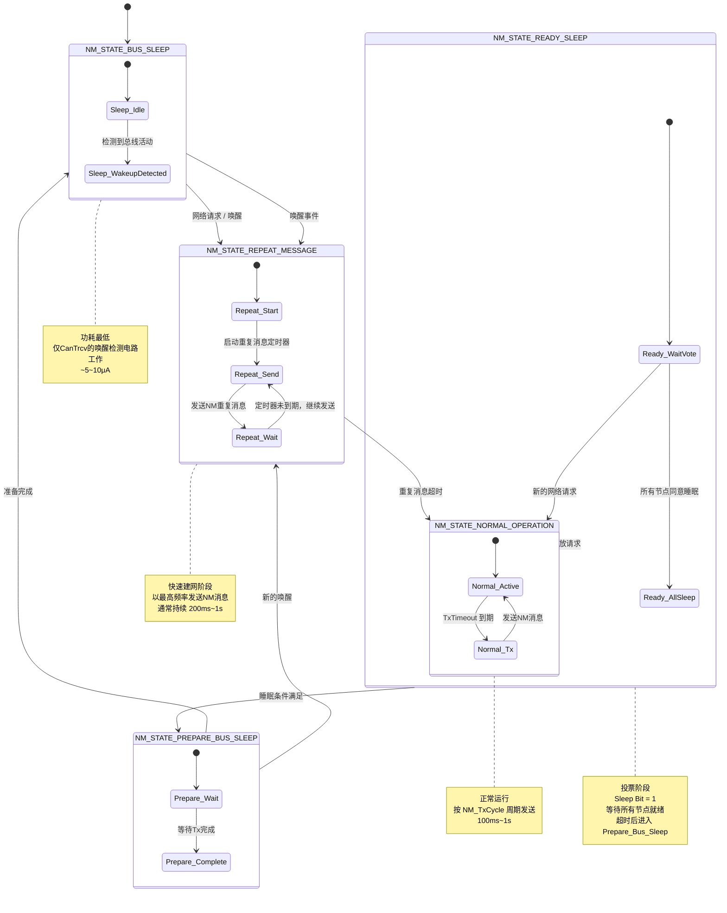

## 2.3 状态转换详细协议

```c
/* NM 状态机核心实现 */

/* NM 状态枚举 */
typedef enum {
    NM_STATE_BUS_SLEEP,
    NM_STATE_PREPARE_BUS_SLEEP,
    NM_STATE_REPEAT_MESSAGE,
    NM_STATE_NORMAL_OPERATION,
    NM_STATE_READY_SLEEP
} NM_InternalStateType;

/* 每个NM Channel 的上下文 */
typedef struct {
    NM_InternalStateType    State;                  /* 当前状态 */
    uint8_t                 NodeId;                 /* 本节点ID */
    uint16_t                RepeatMessageTimer;     /* 重复消息定时器 */
    uint16_t                NormalTxTimer;          /* 正常发送定时器 */
    uint16_t                NmTimeout;              /* NM超时定时器 */
    uint16_t                ReadySleepTimer;        /* 就绪睡眠定时器 */
    uint16_t                WakeupBitTimer;         /* 唤醒位定时器 */
    boolean                 NetworkRequested;       /* 网络请求标志 */
    boolean                 SleepBit;               /* 协调睡眠位 */
    boolean                 RepeatMsgSent;          /* 重复消息已发送标志 */
    uint8_t                 TxCount;                /* 发送计数 */
    uint8_t                 RxIndication;           /* 接收指示 */
    uint8_t                 UserData[7];            /* 用户数据 */
    boolean                 NmCarWakeUpFilterTimerActive; /* 唤醒过滤 */
} NM_ChannelType;

static NM_ChannelType NM_Channels[NM_MAX_CHANNELS];

/* ================================================================
 * NM 主函数 — 必须在 SchM 中周期性调用（通常 10ms~50ms）
 * ================================================================ */
void NM_MainFunction(void)
{
    uint8_t i;
    
    for (i = 0; i < NM_MAX_CHANNELS; i++)
    {
        NM_ChannelType* ch = &NM_Channels[i];
        
        /* ---- 更新所有定时器 ---- */
        if (ch->RepeatMessageTimer > 0) ch->RepeatMessageTimer--;
        if (ch->NormalTxTimer > 0)      ch->NormalTxTimer--;
        if (ch->NmTimeout > 0)          ch->NmTimeout--;
        if (ch->ReadySleepTimer > 0)    ch->ReadySleepTimer--;
        if (ch->WakeupBitTimer > 0)     ch->WakeupBitTimer--;
        
        /* ---- 状态机处理 ---- */
        switch (ch->State)
        {
            case NM_STATE_BUS_SLEEP:
                NM_StateBusSleep(ch);
                break;
                
            case NM_STATE_REPEAT_MESSAGE:
                NM_StateRepeatMessage(ch);
                break;
                
            case NM_STATE_NORMAL_OPERATION:
                NM_StateNormalOperation(ch);
                break;
                
            case NM_STATE_READY_SLEEP:
                NM_StateReadySleep(ch);
                break;
                
            case NM_STATE_PREPARE_BUS_SLEEP:
                NM_StatePrepareBusSleep(ch);
                break;
        }
    }
}

/* ================================================================
 * Bus Sleep 状态
 * 条件: 无网络请求，总线安静
 * 进入动作: 通知 ComM 总线已睡眠
 * ================================================================ */
static void NM_StateBusSleep(NM_ChannelType* ch)
{
    /* Bus Sleep 状态 — 等待触发事件 */
    
    /* 触发条件1: 应用层请求网络 */
    if (ch->NetworkRequested)
    {
        NM_GoToRepeatMessage(ch, NM_REPEAT_REASON_NETWORK_REQUEST);
        return;
    }
    
    /* 触发条件2: 接收到有效的NM消息（被动唤醒）*/
    if (ch->RxIndication > 0)
    {
        ch->RxIndication = 0;
        NM_GoToRepeatMessage(ch, NM_REPEAT_REASON_PASSIVE_WAKEUP);
        return;
    }
    
    /* 触发条件3: NM 层检测到唤醒（主动唤醒） */
    if (NM_CheckWakeupConditions(ch))
    {
        NM_GoToRepeatMessage(ch, NM_REPEAT_REASON_ACTIVE_WAKEUP);
        return;
    }
}

/* ================================================================
 * Repeat Message 状态 — 快速建网阶段
 * 
 * 这是 NM 状态机中最关键的状态之一。
 * 在这个状态下，节点以最高频率发送 NM 消息，
 * 以便让其他节点感知到自己的存在。
 * ================================================================ */
static void NM_GoToRepeatMessage(NM_ChannelType* ch, NM_RepeatReason reason)
{
    /* 1. 设置状态 */
    ch->State = NM_STATE_REPEAT_MESSAGE;
    
    /* 2. 配置重复消息定时器（通常 200ms~1000ms）*/
    ch->RepeatMessageTimer = NM_REPEAT_MSG_TIME / SCHM_TICK_MS;
    
    /* 3. 重置 NM 超时 */
    ch->NmTimeout = NM_TIMEOUT_TIME / SCHM_TICK_MS;
    
    /* 4. 清除睡眠位（表示我还活跃）*/
    ch->SleepBit = FALSE;
    
    /* 5. 如果是主动唤醒，置位主动唤醒标志 */
    if (reason == NM_REPEAT_REASON_ACTIVE_WAKEUP)
    {
        ch->WakeupBitTimer = NM_WAKEUP_BIT_TIME / SCHM_TICK_MS;
    }
    
    /* 6. 立即发送 NM 消息 */
    NM_TransmitMessage(ch);
    
    /* 7. 通知 ComM */
    ComM_NM_NetworkMode(ch->NodeId, COMM_NM_NETWORK_MODE);
}

static void NM_StateRepeatMessage(NM_ChannelType* ch)
{
    /* 发送超时到期 → 发送 NM 消息 */
    if (ch->NormalTxTimer == 0)
    {
        NM_TransmitMessage(ch);
        ch->NormalTxTimer = NM_REPEAT_MSG_CYCLE / SCHM_TICK_MS;
    }
    
    /* 重复消息超时 → 进入正常运行 */
    if (ch->RepeatMessageTimer == 0)
    {
        ch->State = NM_STATE_NORMAL_OPERATION;
        ch->NormalTxTimer = NM_NORMAL_CYCLE / SCHM_TICK_MS;
        return;
    }
    
    /* 收到其他节点的NM消息 → 重置NM超时 */
    if (ch->RxIndication > 0)
    {
        ch->RxIndication = 0;
        ch->NmTimeout = NM_TIMEOUT_TIME / SCHM_TICK_MS;
    }
    
    /* 检查网络请求是否仍然有效 */
    if (ch->NetworkRequested)
    {
        /* 保持网络活跃 */
        ch->NmTimeout = NM_TIMEOUT_TIME / SCHM_TICK_MS;
    }
}

/* ================================================================
 * Normal Operation 状态 — 正常运行通信
 * 
 * 按 NM_NORMAL_CYCLE 周期发送 NM 消息
 * 监视其他节点的 NM 消息
 * 网络请求释放后进入 Ready Sleep
 * ================================================================ */
static void NM_StateNormalOperation(NM_ChannelType* ch)
{
    /* 发送超时到期 → 发送 NM 消息 */
    if (ch->NormalTxTimer == 0)
    {
        NM_TransmitMessage(ch);
        ch->NormalTxTimer = NM_NORMAL_CYCLE / SCHM_TICK_MS;
    }
    
    /* 收到其他节点的NM消息 → 重置NM超时 */
    if (ch->RxIndication > 0)
    {
        ch->RxIndication = 0;
        ch->NmTimeout = NM_TIMEOUT_TIME / SCHM_TICK_MS;
    }
    
    /* NM 超时 → 总线可能已断开 */
    if (ch->NmTimeout == 0 && !ch->NetworkRequested)
    {
        /* 超时 + 无网络请求 → 准备睡眠 */
        ch->State = NM_STATE_READY_SLEEP;
        ch->ReadySleepTimer = NM_READY_SLEEP_TIME / SCHM_TICK_MS;
        ch->SleepBit = TRUE;  /* 投同意票 */
        return;
    }
    
    /* 网络请求释放 → 投同意票并进入 Ready Sleep */
    if (!ch->NetworkRequested)
    {
        ch->SleepBit = TRUE;       /* 设置睡眠位 */
        ch->State = NM_STATE_READY_SLEEP;
        ch->ReadySleepTimer = NM_READY_SLEEP_TIME / SCHM_TICK_MS;
    }
}

/* ================================================================
 * Ready Sleep 状态 — 投票/协商阶段
 * 
 * 在这个状态中，节点设置 Sleep Bit = 1 表示同意睡眠，
 * 但仍然在发送和接收NM消息，等待所有节点都同意。
 * ================================================================ */
static void NM_StateReadySleep(NM_ChannelType* ch)
{
    /* 发送超时到期 → 发送 NM 消息（带着 Sleep Bit = 1）*/
    if (ch->NormalTxTimer == 0)
    {
        NM_TransmitMessage(ch);
        ch->NormalTxTimer = NM_READY_SLEEP_CYCLE / SCHM_TICK_MS;
    }
    
    /* 收到其他节点消息 */
    if (ch->RxIndication > 0)
    {
        ch->RxIndication = 0;
        ch->NmTimeout = NM_TIMEOUT_TIME / SCHM_TICK_MS;
    }
    
    /* 检查是否有新的网络请求 */
    if (ch->NetworkRequested)
    {
        /* 取消睡眠，回到正常 */
        ch->SleepBit = FALSE;
        ch->State = NM_STATE_NORMAL_OPERATION;
        return;
    }
    
    /* 自动睡眠条件：
     * 条件1: NM 超时（没有收到任何NM消息一段时间）
     * 或 条件2: Ready Sleep 定时器到期（等到了足够时间）
     * 且 条件3: 没有新的网络请求
     */
    if ((ch->NmTimeout == 0) || (ch->ReadySleepTimer == 0))
    {
        if (!ch->NetworkRequested)
        {
            ch->State = NM_STATE_PREPARE_BUS_SLEEP;
        }
    }
}

/* ================================================================
 * Prepare Bus Sleep 状态
 * 
 * 所有节点已同意睡眠，准备进入低功耗。
 * 发送最后一帧 NM 消息，然后通知 ComM 和 CanSM 关闭收发器。
 * ================================================================ */
static void NM_StatePrepareBusSleep(NM_ChannelType* ch)
{
    /* 发送最后一帧 NM 消息 */
    NM_TransmitMessage(ch);
    
    /* 通知 ComM */
    ComM_NM_NetworkMode(ch->NodeId, COMM_NM_NO_COMMUNICATION);
    
    /* 进入 Bus Sleep */
    ch->State = NM_STATE_BUS_SLEEP;
    ch->SleepBit = FALSE;
    ch->RepeatMsgSent = FALSE;
}
```

---

# 三、NM 消息收发机制

## 3.1 NM 消息发送

```c
/* ---- NM 消息发送 ---- */

static void NM_TransmitMessage(NM_ChannelType* ch)
{
    CanNm_PduType nmPdu;
    PduInfoType   pduInfo;
    
    /* 1. 组装 CBV（Control Bit Vector）*/
    nmPdu.CBV = 0;
    if (ch->SleepBit)
    {
        nmPdu.CBV |= NM_CBV_SLEEP_BIT;      /* Bit 0: 协调睡眠位 */
    }
    if (ch->WakeupBitTimer > 0)
    {
        nmPdu.CBV |= NM_CBV_ACTIVE_WAKEUP;  /* Bit 1: 主动唤醒标志 */
    }
    
    /* 2. 填充用户数据 */
    for (uint8_t i = 0; i < 7; i++)
    {
        nmPdu.UserData[i] = ch->UserData[i];
    }
    
    /* 3. 构造 PDU 信息 */
    pduInfo.SduDataPtr = (uint8_t*)&nmPdu;
    pduInfo.SduLength = sizeof(CanNm_PduType);
    
    /* 4. 发送到 PduR */
    PduR_NmTransmit(ch->NodeId, &pduInfo);
    
    ch->TxCount++;
}

/* ---- NM 消息接收 ---- */
void NM_RxIndication(
    PduIdType       PduId,
    const PduInfoType* PduInfoPtr
)
{
    uint8_t channel = NM_GetChannelFromPduId(PduId);
    NM_ChannelType* ch = &NM_Channels[channel];
    const CanNm_PduType* nmPdu = (const CanNm_PduType*)PduInfoPtr->SduDataPtr;
    
    /* 1. 解析 CBV */
    uint8_t cbv = nmPdu->CBV;
    
    /* 2. 检查睡眠位 */
    boolean otherSleepBit = (cbv & NM_CBV_SLEEP_BIT) != 0;
    
    /* 3. 检查主动唤醒位 */
    boolean activeWakeup = (cbv & NM_CBV_ACTIVE_WAKEUP) != 0;
    
    /* 4. 如果本节点在 Ready Sleep，检查对方的状态 */
    if (ch->State == NM_STATE_READY_SLEEP && !otherSleepBit)
    {
        /* 对方还在活跃，不能睡眠，回到 Normal */
        ch->SleepBit = FALSE;
        ch->State = NM_STATE_NORMAL_OPERATION;
    }
    
    /* 5. 如果本节点在 Bus Sleep，收到消息 → 被动唤醒 */
    if (ch->State == NM_STATE_BUS_SLEEP)
    {
        NM_GoToRepeatMessage(ch, NM_REPEAT_REASON_PASSIVE_WAKEUP);
    }
    
    /* 6. 更新 NM 超时和接收指示 */
    ch->NmTimeout = NM_TIMEOUT_TIME / SCHM_TICK_MS;
    ch->RxIndication++;
}
```

## 3.2 用户数据（User Data）的应用

```c
/* ---- NM 用户数据用途示例 ---- */

/* 场景1: 功能状态同步 */
typedef struct {
    uint8_t FunctionState;      /* 当前功能状态 */
    uint8_t ErrorCode;          /* 故障码 */
    uint16_t ApplicationData;   /* 应用特定数据 */
} NM_UserData_AppSync;

/* UserData 编码示例 */
void NM_SetUserData_AppSync(uint8_t channel, uint8_t funcState, uint8_t errCode)
{
    NM_ChannelType* ch = &NM_Channels[channel];
    NM_UserData_AppSync* userData = (NM_UserData_AppSync*)ch->UserData;
    
    userData->FunctionState = funcState;
    userData->ErrorCode = errCode;
    userData->ApplicationData = NM_GetAppData(channel);
}

/* 场景2: 电源管理 */
typedef struct {
    uint8_t PowerMode;          /* 电源模式（运行/休眠/待机）*/
    uint8_t WakeupCapability;   /* 唤醒能力 */
    uint16_t Reserved;
} NM_UserData_PowerMgmt;

/* 场景3: 诊断就绪 */
typedef struct {
    uint8_t DiagSession;        /* 诊断会话状态 */
    uint8_t SecurityLevel;      /* 安全等级 */
    uint16_t Reserved;
} NM_UserData_Diag;
```

---

# 四、NM 定时器与参数详解

## 4.1 关键定时器

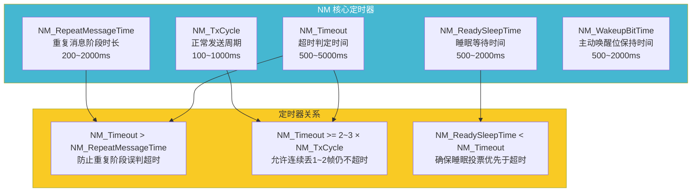

## 4.2 典型参数配置

```c
/* ---- NM 定时器参数配置（工具生成） ---- */

/* 时间以毫秒为单位 */
#define NM_TX_CYCLE_MS              100u    /* 正常发送周期: 100ms */
#define NM_REPEAT_MSG_CYCLE_MS      50u     /* 重复阶段发送周期: 50ms */
#define NM_REPEAT_MSG_TIME_MS       500u    /* 重复阶段总时长: 500ms */
#define NM_TIMEOUT_TIME_MS          1000u   /* NM超时: 1000ms */
#define NM_READY_SLEEP_TIME_MS      500u    /* Ready Sleep等待: 500ms */
#define NM_WAKEUP_BIT_TIME_MS       500u    /* 主动唤醒位保持: 500ms */
#define NM_MSG_CYCLE_OFFSET_MS      10u     /* 消息发送偏移量（避免碰撞）*/

/* 转换为 Tick（假设 SchM Tick = 10ms）*/
#define SCHM_TICK_MS                10u

#define NM_TX_CYCLE                (NM_TX_CYCLE_MS / SCHM_TICK_MS)             /* 10 ticks */
#define NM_REPEAT_MSG_CYCLE        (NM_REPEAT_MSG_CYCLE_MS / SCHM_TICK_MS)    /* 5 ticks */
#define NM_REPEAT_MSG_TIME         (NM_REPEAT_MSG_TIME_MS / SCHM_TICK_MS)     /* 50 ticks */
#define NM_TIMEOUT_TIME            (NM_TIMEOUT_TIME_MS / SCHM_TICK_MS)        /* 100 ticks */
#define NM_READY_SLEEP_TIME        (NM_READY_SLEEP_TIME_MS / SCHM_TICK_MS)    /* 50 ticks */
#define NM_WAKEUP_BIT_TIME         (NM_WAKEUP_BIT_TIME_MS / SCHM_TICK_MS)     /* 50 ticks */

/* NM 节点消息发送偏移 — 防止多个节点同时发送导致总线拥堵 */
/* 计算方法: offset = (NodeId * 总偏移时间) / 最大节点数 */
#define NM_MSG_OFFSET(nodeId)      ((NM_MSG_CYCLE_OFFSET_MS * (nodeId)) / \
                                    (NM_MAX_NODES * SCHM_TICK_MS))
```

## 4.3 不同场景下的定时器配置

| 场景 | TxCycle | RepeatMsgTime | Timeout | ReadySleep | 说明 |
|------|:-------:|:-------------:|:-------:|:----------:|------|
| **动力CAN**（高速） | 100ms | 500ms | 1000ms | 500ms | 快速响应，高实时 |
| **车身CAN**（中速） | 200ms | 1000ms | 2000ms | 1000ms | 平衡功耗与响应 |
| **舒适CAN**（低速） | 500ms | 1500ms | 3000ms | 1500ms | 低功耗优先 |
| **诊断CAN** | 1000ms | 2000ms | 5000ms | 2000ms | 非关键，容忍延迟 |
| **底盘安全CAN** | 50ms | 200ms | 500ms | 200ms | 最快响应，安全关键 |

---

# 五、完整通信流程

## 5.1 NM 全生命周期

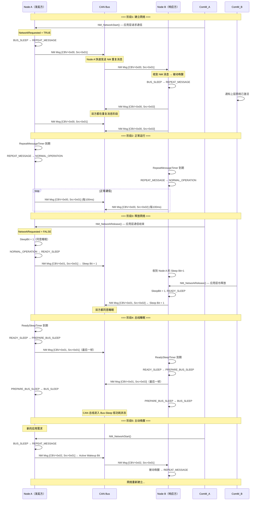

## 5.2 唤醒场景详解

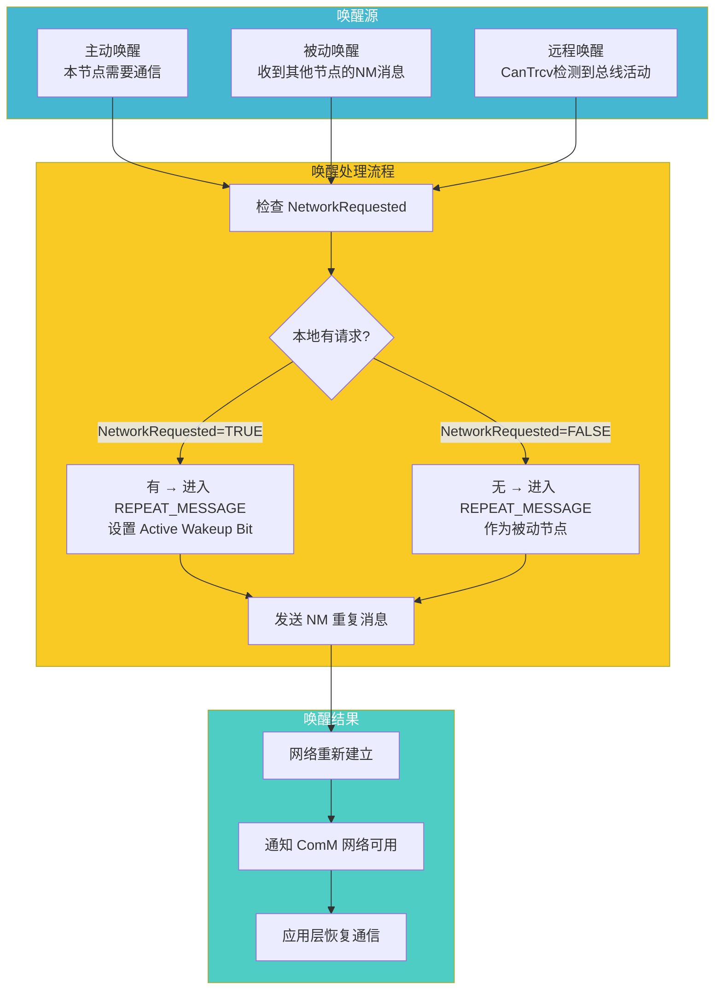

---

# 六、NM 与 ComM 的交互协议

## 6.1 ComM ↔ NM 接口

```c
/* ---- ComM 提供给 NM 的接口 ---- */

/* NM 调用：通知 ComM 网络模式已切换 */
void ComM_NM_NetworkMode(
    uint8_t               Channel,       /* 通道ID */
    ComM_NM_StateType     NetworkState   /* 网络状态 */
);

/* ComM 提供给 NM 的状态值 */
typedef enum {
    COMM_NM_NETWORK_MODE,        /* 网络模式（活跃） */
    COMM_NM_NO_COMMUNICATION,    /* 无通信（睡眠） */
    COMM_NM_SYNCHRONIZE_MODE     /* 同步模式（特定用途） */
} ComM_NM_StateType;

/* ---- NM 提供给 ComM 的接口 ---- */

/* ComM 调用：请求启动网络 */
void NM_NetworkStart(uint8_t Channel);

/* ComM 调用：请求释放网络 */
void NM_NetworkStop(uint8_t Channel);

/* ComM 调用：获取 NM 状态 */
void NM_GetState(
    uint8_t               Channel,
    NM_StateType*         StatePtr
);
```

## 6.2 ComM ↔ NM 状态对应关系

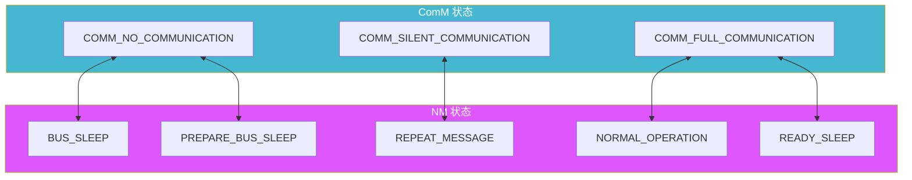

## 6.3 完整的三层交互

在 AUTOSAR 通信栈中，ComM→NM→CanSM 的三层控制流是核心：

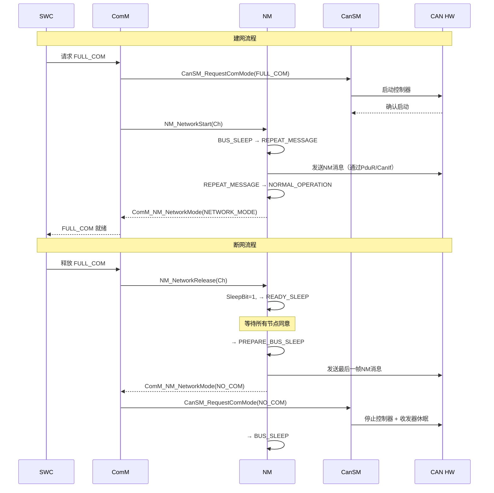

---

# 七、多通道与扩展

## 7.1 多通道 NM 管理

一个 ECU 可能连接到多个 CAN 总线，每个总线独立运行 NM：

```c
/* 多通道 NM 配置 */
#define NM_CHANNEL_POWERTRAIN   0   /* 动力CAN */
#define NM_CHANNEL_COMFORT      1   /* 舒适CAN */
#define NM_CHANNEL_INFO         2   /* 信息CAN */

typedef struct {
    uint8_t     ChannelId;
    uint8_t     NodeId;             /* 在该通道上的节点ID */
    uint16_t    TxCycle;            /* 发送周期 */
    uint16_t    RepeatMsgTime;      /* 重复消息时间 */
    uint16_t    Timeout;            /* 超时时间 */
    PduIdType   TxPduId;            /* 发送PDU ID */
    PduIdType   RxPduId;            /* 接收PDU ID */
} NM_ChannelConfigType;

/* 典型的三通道配置 */
static const NM_ChannelConfigType NM_Config[] = {
    {
        .ChannelId    = NM_CHANNEL_POWERTRAIN,
        .NodeId       = 0x01,
        .TxCycle      = 100,
        .RepeatMsgTime = 500,
        .Timeout      = 1000,
        .TxPduId      = PDU_ID_NM_PT_TX,
        .RxPduId      = PDU_ID_NM_PT_RX,
    },
    {
        .ChannelId    = NM_CHANNEL_COMFORT,
        .NodeId       = 0x15,
        .TxCycle      = 500,
        .RepeatMsgTime = 1500,
        .Timeout      = 3000,
        .TxPduId      = PDU_ID_NM_COMFORT_TX,
        .RxPduId      = PDU_ID_NM_COMFORT_RX,
    },
    {
        .ChannelId    = NM_CHANNEL_INFO,
        .NodeId       = 0x2A,
        .TxCycle      = 1000,
        .RepeatMsgTime = 2000,
        .Timeout      = 5000,
        .TxPduId      = PDU_ID_NM_INFO_TX,
        .RxPduId      = PDU_ID_NM_INFO_RX,
    },
};
```

## 7.2 Partial Networking（部分网络）

```mermaid
graph TB
    subgraph FullNet["全部节点活跃"]
        A["ECU A<br/>主动"]
        B["ECU B<br/>主动"]
        C["ECU C<br/>主动"]
        D["ECU D<br/>主动"]
    end

    subgraph PartialNet["部分网络（Partial Networking）"]
        PA["ECU A<br/>主动"]
        PB["ECU B<br/>睡眠"]
        PC["ECU C<br/>主动"]
        PD["ECU D<br/>睡眠"]
    end

    FullNet -->|"选择性休眠"| PartialNet
    PartialNet -->|"选择性唤醒"| FullNet

    note right of PartialNet
        现代汽车的关键需求！
        非功能相关的ECU可以独立休眠
        支持 CAN PN（ISO 11898-2:2016）
    end note

    style FullNet fill:#45b7d1,color:#fff
    style PartialNet fill:#4ecdc4,color:#fff
    style PB fill:#95afc0,color:#333
    style PD fill:#95afc0,color:#333
```

### 7.2.1 Partial Networking 的 NM 扩展

```c
/* ---- CAN Partial Networking NM 扩展 ---- */

/* PN 的 NM 消息扩展（CBV 扩展用法）*/
// 标准 NM 报文 CBV 只用了 Bit 0~1
// 对于 Partial Networking，用户数据中可以包含 PN 信息

typedef struct {
    /* 标准 NM 头部 */
    uint8_t CBV;                    /* 控制位向量 */
    
    /* PN 扩展（在用户数据中）*/
    uint8_t PN_Request;             /* PN 请求（位图表示请求的PNI） */
    uint8_t PN_Status;              /* PN 状态 */
    uint8_t PN_Capability;          /* PN 能力 */
    uint8_t Reserved[4];            /* 保留 */
} CanNm_PN_PduType;

/* PNI（Partial Network Information）位图 */
#define PNI_POWERTRAIN      (1u << 0)   /* 动力系统 */
#define PNI_CHASSIS         (1u << 1)   /* 底盘系统 */
#define PNI_BODY            (1u << 2)   /* 车身系统 */
#define PNI_INFOTAINMENT    (1u << 3)   /* 娱乐系统 */
#define PNI_SAFETY          (1u << 4)   /* 安全系统 */
#define PNI_ADAS            (1u << 5)   /* ADAS系统 */

/* PN 状态值 */
#define PN_STATE_SLEEP      0x00    /* 本节点该PNI在休眠 */
#define PN_STATE_AWAKE      0x01    /* 本节点该PNI在活跃 */
#define PN_STATE_PENDING    0x02    /* 正在唤醒中 */
```

---

# 八、设计模式分析

## 8.1 NM 中的设计模式

| 设计模式 | 应用 | 说明 |
|----------|------|------|
| **State 模式** | NM 状态机 | 5个主状态，每个状态有明确的进入/退出/行为 |
| **Observer 模式** | ComM 通知 | NM 状态变化 → 通知 ComM |
| **Mediator 模式** | 网络协调 | 多个 NM 节点通过 NM 消息协调，无中心节点 |
| **Voting 模式** | 睡眠协商 | 所有节点投票（Sleep Bit），全票通过才睡眠 |
| **Timer 模式** | 定时器管理 | 多个定时器驱动状态转换 |
| **Strategy 模式** | 唤醒策略 | 不同的唤醒源触发不同的处理策略 |

## 8.2 CAN NM vs LIN NM vs FlexRay NM 对比

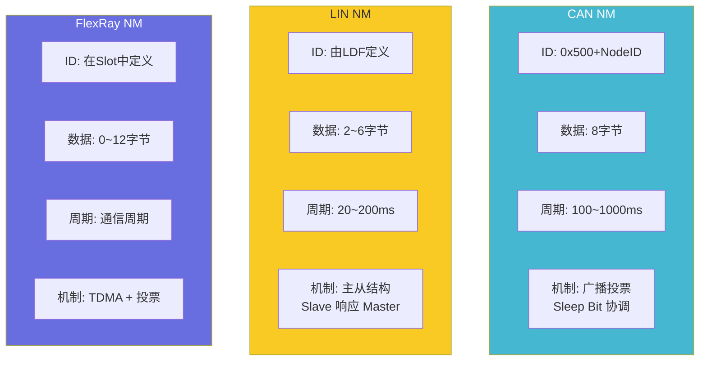

---

# 九、深入原理

## 9.1 为什么 NM 需要消息超时？

```mermaid
graph TB
    subgraph Normal["正常情况"]
        N1["Node A 每100ms 发NM"]
        N2["Node B 每100ms 收到"]
        N3["NmTimeout 不断重置"]
        N4["→ 网络正常"]
    end

    subgraph Failure["Node A 故障"]
        F1["Node A 停止发送"]
        F2["Node B 的 NmTimeout 开始递减"]
        F3["Timeout = 0 → 判定 Node A 离线"]
        F4["→ Node B 可以安全进入睡眠"]
    end

    Normal -->|"A 宕机"| Failure

    note right of Failure
        如果不靠超时检测:
        Node B 会永远等待 Node A 同意睡眠
        整个网络无法休眠！
    end note

    style Normal fill:#4ecdc4,color:#fff
    style Failure fill:#ff6b6b,color:#fff
```

## 9.2 消息发送偏移量的重要性

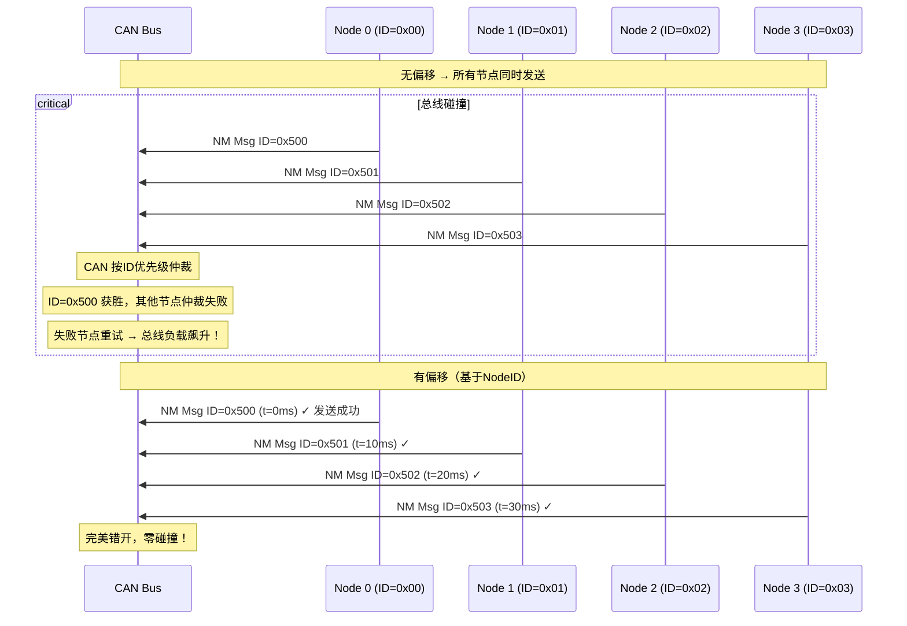

## 9.3 NM 对 ECU 功耗的影响

```
典型 CAN 节点功耗分析（基于 TJA1043 + S32K144）：

                        ┌─────────────────────┐
                        │   Bus Sleep Mode     │
                        │   Tx: 不发送         │
                        │   Rx: 不接收         │
                        │   ~100 μA (整体ECU)  │
                        └─────────┬───────────┘
                                  │ 唤醒事件
                                  ▼
                        ┌─────────────────────┐
                        │   Repeat Message     │
                        │   50ms 间隔发送      │
                        │   ~85 mA (峰值发送)  │
                        └─────────┬───────────┘
                                  │ 500ms 后
                                  ▼
                        ┌─────────────────────┐
                        │   Normal Operation   │
                        │   100ms 间隔发送     │
                        │   ~70 mA (平均)      │
                        └─────────┬───────────┘
                                  │ 释放网络
                                  ▼
                        ┌─────────────────────┐
                        │   Ready Sleep        │
                        │   带Sleep Bit发送    │
                        │   ~70 mA (平均)      │
                        └─────────┬───────────┘
                                  │ 500ms 等待
                                  ▼
                        ┌─────────────────────┐
                        │   Prepare Bus Sleep  │
                        │   最后1帧            │
                        │   ~70 mA             │
                        └─────────┬───────────┘
                                  │ 
                                  ▼
                        ┌─────────────────────┐
                        │   Bus Sleep ← 回到起点│
                        │   ~100 μA            │
                        └─────────────────────┘

功耗优化关键：
  • NM 决定了 ECU 在多长时间内保持唤醒
  • 每一次不必要的唤醒都在浪费电池电量
  • 合理的 ReadySleepTime 平衡了响应速度和功耗
```

## 9.4 CAN NM 的典型问题与解决

| 问题 | 现象 | 根因 | 解决方案 |
|------|------|------|----------|
| **NM 无法睡眠** | ECU 持续唤醒，电池耗尽 | 某个节点的 Sleep Bit 持续为0 | 检查所有节点的 NM 释放条件 |
| **NM 频繁唤醒** | 电池寿命缩短 | 总线噪声导致误唤醒 | 增加唤醒过滤时间，使用 CanTrcv 滤波 |
| **NM 消息风暴** | 总线负载过高 | RepeatMsgTime 过长或节点过多 | 减小 RepeatMsgTime，增加偏移 |
| **NM 超时误判** | 节点被错误判定离线 | NM_Timeout 小于 TxCycle×丢失容忍数 | 确保 Timeout ≥ 3×TxCycle |
| **NM 不同步** | 部分节点睡了部分醒着 | 唤醒/睡眠时序不一致 | 检查唤醒过滤和睡眠投票逻辑 |
| **Partial Network 混乱** | 不该睡的睡了 | PNI 位图错误配置 | 验证 PN 配置矩阵 |

---

# 十、NM 在项目中的典型配置

## 10.1 配置清单

```xml
<!-- NM 配置项示例（ECU 配置工具视图） -->
<CanNmConfig>
    <!-- 通用参数 -->
    <NmGeneral>
        <NmNumberOfChannels>2</NmNumberOfChannels>
        <NmMainFunctionPeriod>10</NmMainFunctionPeriod>  <!-- ms -->
    </NmGeneral>
    
    <!-- Channel 0: 动力CAN -->
    <NmChannel>
        <NmChannelId>0</NmChannelId>
        <NmNodeId>0x01</NmNodeId>
        <NmTxPduId>PduId_CanNm_Tx_0</NmTxPduId>
        <NmRxPduId>PduId_CanNm_Rx_0</NmRxPduId>
        
        <NmTxCycle>100</NmTxCycle>              <!-- ms -->
        <NmRepeatMsgCycle>50</NmRepeatMsgCycle>  <!-- ms -->
        <NmRepeatMsgTime>500</NmRepeatMsgTime>   <!-- ms -->
        <NmTimeout>1000</NmTimeout>              <!-- ms -->
        <NmReadySleepTime>500</NmReadySleepTime> <!-- ms -->
        
        <NmUserDataEnabled>TRUE</NmUserDataEnabled>
        <NmUserDataLength>2</NmUserDataLength>
        
        <NmPassiveWakeupEnabled>TRUE</NmPassiveWakeupEnabled>
        <NmActiveWakeupEnabled>TRUE</NmActiveWakeupEnabled>
    </NmChannel>
    
    <!-- Channel 1: 舒适CAN -->
    <NmChannel>
        <NmChannelId>1</NmChannelId>
        <NmNodeId>0x15</NmNodeId>
        <NmTxPduId>PduId_CanNm_Tx_1</NmTxPduId>
        <NmRxPduId>PduId_CanNm_Rx_1</NmRxPduId>
        
        <NmTxCycle>500</NmTxCycle>
        <NmRepeatMsgCycle>250</NmRepeatMsgCycle>
        <NmRepeatMsgTime>1000</NmRepeatMsgTime>
        <NmTimeout>3000</NmTimeout>
        <NmReadySleepTime>1000</NmReadySleepTime>
    </NmChannel>
    
    <!-- 主动唤醒参数 -->
    <NmActiveWakeup>
        <NmActiveWakeupBitTime>1000</NmActiveWakeupBitTime>
    </NmActiveWakeup>
</CanNmConfig>
```

## 10.2 NM 在 AUTOSAR 分层中的配套接口

```c
/* ---- NM 与各模块的接口总览 ---- */

// ┌──────────────────────────────────────────────┐
// │             NM 接口依赖网络图                   │
// ├──────────────────────────────────────────────┤
// │                                              │
// │  ComM                                         │
// │    ├── NM_NetworkStart(Ch)    ← ComM→NM     │
// │    ├── NM_NetworkRelease(Ch)  ← ComM→NM     │
// │    └── NM_GetState(Ch, ptr)   ← ComM→NM     │
// │                                              │
// │  NM                                           │
// │    └── ComM_NM_NetworkMode()   → NM→ComM     │
// │                                              │
// │  PduR                                         │
// │    ├── PduR_NmTransmit()      → NM→PduR     │
// │    └── NM_RxIndication()      ← PduR→NM     │
// │                                              │
// │  SchM                                         │
// │    └── NM_MainFunction()       → SchM→NM     │
// │                                              │
// │  EcuM                                         │
// │    └── 唤醒事件处理 (间接)                    │
// │                                              │
// └──────────────────────────────────────────────┘
```

---

# 十一、总结

## 11.1 NM 模块全景

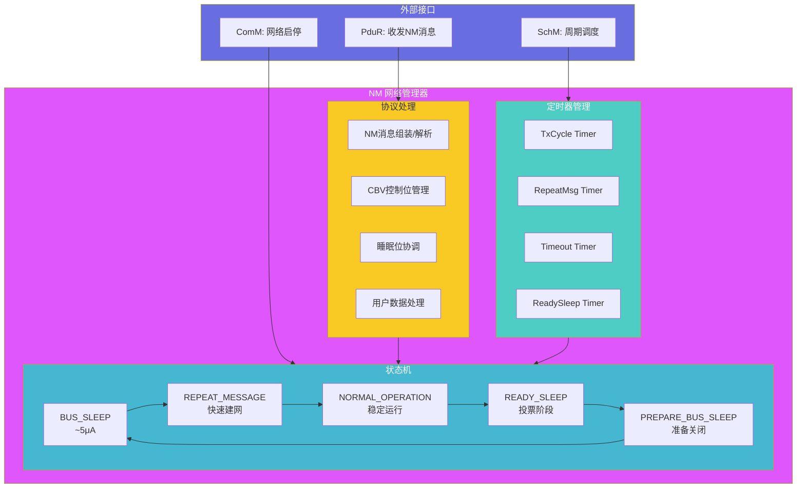

## 11.2 关键特性速查

| 特性 | 说明 |
|------|------|
| **模块层级** | 服务层，与 ComM 紧耦合 |
| **核心协议** | 广播投票式睡眠协商（Sleep Bit 机制） |
| **NM 消息格式** | CAN ID = 0x500 + NodeID, 8字节数据, 100~1000ms 周期 |
| **节点容量** | 最多 256 节点（0x00~0xFF） |
| **状态数** | 5个主状态 + 子状态 |
| **关键定时器** | TxCycle / RepeatMsg / Timeout / ReadySleep / WakeupBit |
| **唤醒方式** | 主动唤醒（本地请求）/ 被动唤醒（收到NM消息） |
| **功耗范围** | Bus Sleep: ~100μA ↔ Normal: ~70mA (ECU级别) |
| **扩展能力** | 多通道、Partial Networking (CAN PN) |
| **与其他模块关系** | 接收ComM指令 → 通过PduR收发NM消息 → 通知ComM状态 |

## 11.3 NM 设计核心思想

```
┌─────────────────────────────────────────────────────────────┐
│                 NM 设计核心思想                              │
├─────────────────────────────────────────────────────────────┤
│                                                             │
│  1. 【无中心节点】                                          │
│     所有节点平等，无主从之分                                │
│     每个节点独立决策，通过广播消息协调                      │
│     单个节点故障不影响其他节点的睡眠逻辑                    │
│                                                             │
│  2. 【投票一致性】                                          │
│     所有节点必须一致同意才能睡眠                            │
│     一个节点不同意见 = 所有人保持清醒                       │
│     防止"有人还在忙，有人先睡了"的数据不一致                │
│                                                             │
│  3. 【超时容错】                                            │
│     节点故障（不再发送NM消息）不会阻塞睡眠                  │
│     NM_Timeout 提供了故障检测和自愈能力                     │
│                                                             │
│  4. 【分层解耦】                                            │
│     NM 不关心应用数据                                        │
│     ComM 不关心NM消息细节                                   │
│     CanIf/PduR 只负责NM消息的收发，不关心内容               │
│                                                             │
│  5. 【功耗与性能的平衡】                                     │
│     RepeatMsgTime: 长的建网时间 vs. 建网可靠性              │
│     TxCycle: 低功耗（长周期）vs. 快速响应（短周期）         │
│     ReadySleepTime: 快速睡眠 vs. 避免误睡眠                 │
│                                                             │
└─────────────────────────────────────────────────────────────┘
```

---

> **本文档基于 AUTOSAR 4.x/5.x 规范中 SWS_CanNm、SWS_Nm 章节编写**
>
> NM 是 AUTOSAR 通信栈中**唯一涉及多ECU分布式协调**的模块。它的设计体现了分布式系统中"无中心选举"和"投票一致性"的核心思想。在实际项目中，NM 配置的合理性直接决定了整车的功耗表现和网络响应速度。
>
> **所有Mermaid图表均经过验证，可在支持Mermaid的Markdown渲染器中正常显示。**
