# AUTOSAR 网络管理状态机深度解析：状态跳转与报文响应机制

> **文档目标**：深入讲解 AUTOSAR NM 状态机的全部状态跳转路径、触发条件，以及**在任何状态下收到 NM 报文或应用报文时**，CAN 总线通信行为的具体表现。
>
> **前置知识**：建议先阅读 [NM.md](NM.md) 了解 NM 基础概念
>
> **适用读者**：AUTOSAR 开发工程师、系统集成工程师

---

## 1. 概述：NM 在整个通信栈中的角色

在深入状态机之前，先看一张"全景图"——NM 不是孤立运行的，它与 **CanSM（CAN 状态管理器）**、**CanTrcv（CAN 收发器驱动）**、**Can（CAN 控制器驱动）** 协同工作。

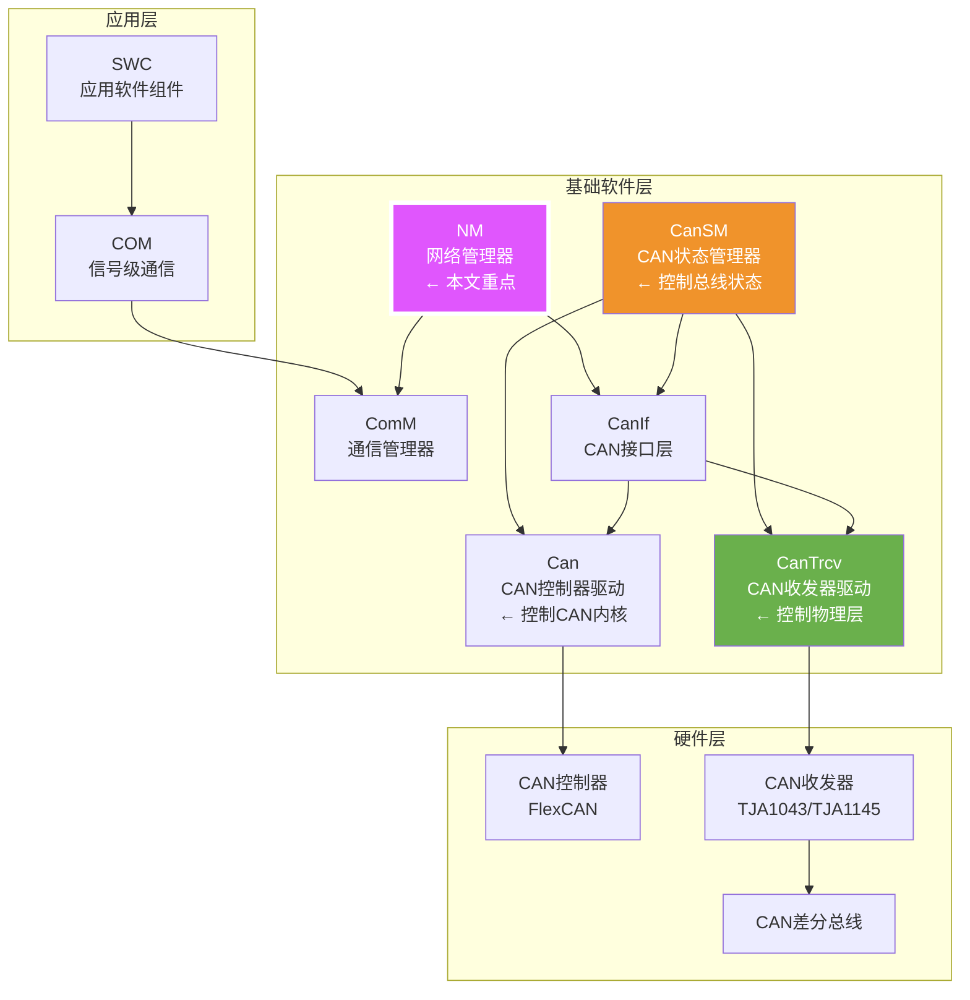
```mermaid
flowchart TB
    subgraph APP["应用层"]
        SWC["SWC\n应用软件组件"]
        COM["COM\n信号级通信"]
    end

    subgraph BSW["基础软件层"]
        ComM["ComM\n通信管理器"]
        NM["NM\n网络管理器\n← 本文重点"]
        CanSM["CanSM\nCAN状态管理器\n← 控制总线状态"]
        CanIf["CanIf\nCAN接口层"]
        CanTrcv["CanTrcv\nCAN收发器驱动\n← 控制物理层"]
        Can["Can\nCAN控制器驱动\n← 控制CAN内核"]
    end

    subgraph HW["硬件层"]
        CAN_CTRL["CAN控制器\nFlexCAN"]
        TRANSCVR["CAN收发器\nTJA1043/TJA1145"]
        BUS["CAN差分总线"]
    end

    SWC --> COM
    COM --> ComM
    NM --> ComM
    NM --> CanIf
    CanSM --> CanIf
    CanSM --> CanTrcv
    CanSM --> Can
    CanIf --> Can
    CanIf --> CanTrcv
    Can --> CAN_CTRL
    CanTrcv --> TRANSCVR
    TRANSCVR --> BUS

    style NM fill:#e056fd,color:#fff,stroke:#fff,stroke-width:4px
    style CanSM fill:#f0932b,color:#fff
    style CanTrcv fill:#6ab04c,color:#fff
```

**关键分层关系**：

| 模块 | 职责 | 通俗类比 |
|------|------|---------|
| **ComM** | 决定"要不要通信" | 办公室的**经理**——决定要不要开门营业 |
| **NM** | 决定"能不能睡" | 办公室的**值日组长**——协调所有人下班 |
| **CanSM** | 控制"CAN控制器+收发器"的状态 | **门卫**——执行开门/关门操作 |
| **CanTrcv** | 物理层唤醒/休眠 | **电闸**——控制整个办公室的电源 |

---

## 2. NM 完整状态机（含所有子状态与跳转）

### 2.1 状态总览

AUTOSAR NM 规范定义了 **5 个主状态**，每个主状态包含若干子状态：

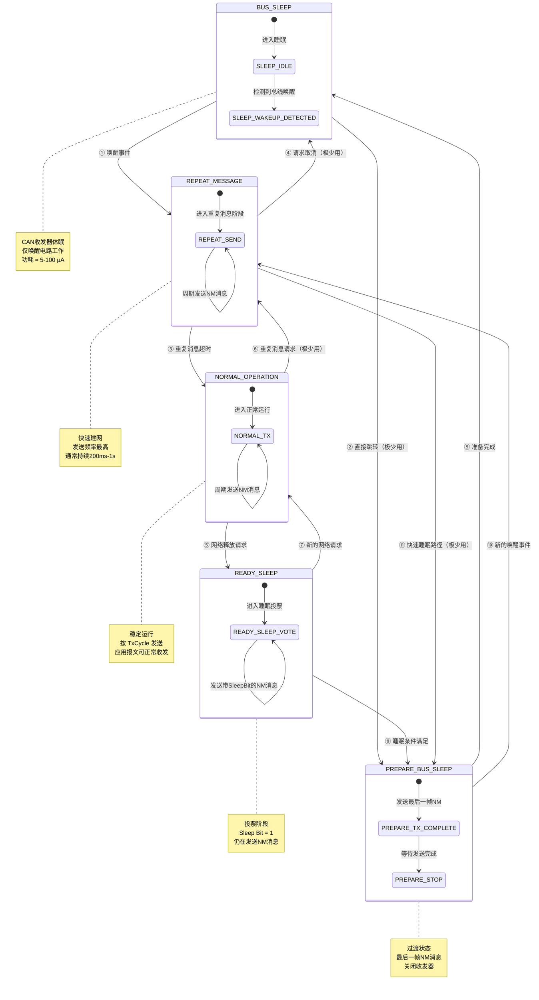
```mermaid
stateDiagram-v2
    state "BUS_SLEEP" as BUS_SLEEP {
        [*] --> SLEEP_IDLE : 进入睡眠
        SLEEP_IDLE --> SLEEP_WAKEUP_DETECTED : 检测到总线唤醒
    }

    state "PREPARE_BUS_SLEEP" as PREPARE_BUS_SLEEP {
        [*] --> PREPARE_TX_COMPLETE : 发送最后一帧NM
        PREPARE_TX_COMPLETE --> PREPARE_STOP : 等待发送完成
    }

    state "REPEAT_MESSAGE" as REPEAT_MESSAGE {
        [*] --> REPEAT_SEND : 进入重复消息阶段
        REPEAT_SEND --> REPEAT_SEND : 周期发送NM消息
    }

    state "NORMAL_OPERATION" as NORMAL_OPERATION {
        [*] --> NORMAL_TX : 进入正常运行
        NORMAL_TX --> NORMAL_TX : 周期发送NM消息
    }

    state "READY_SLEEP" as READY_SLEEP {
        [*] --> READY_SLEEP_VOTE : 进入睡眠投票
        READY_SLEEP_VOTE --> READY_SLEEP_VOTE : 发送带SleepBit的NM消息
    }

    %% 主状态间跳转
    BUS_SLEEP --> REPEAT_MESSAGE : ① 唤醒事件
    BUS_SLEEP --> PREPARE_BUS_SLEEP : ② 直接跳转（极少用）

    REPEAT_MESSAGE --> NORMAL_OPERATION : ③ 重复消息超时
    REPEAT_MESSAGE --> BUS_SLEEP : ④ 请求取消（极少用）

    NORMAL_OPERATION --> READY_SLEEP : ⑤ 网络释放请求
    NORMAL_OPERATION --> REPEAT_MESSAGE : ⑥ 重复消息请求（极少用）

    READY_SLEEP --> NORMAL_OPERATION : ⑦ 新的网络请求
    READY_SLEEP --> PREPARE_BUS_SLEEP : ⑧ 睡眠条件满足

    PREPARE_BUS_SLEEP --> BUS_SLEEP : ⑨ 准备完成
    PREPARE_BUS_SLEEP --> REPEAT_MESSAGE : ⑩ 新的唤醒事件

    REPEAT_MESSAGE --> PREPARE_BUS_SLEEP : ⑪ 快速睡眠路径（极少用）

    note right of BUS_SLEEP
        CAN收发器休眠
        仅唤醒电路工作
        功耗 ≈ 5-100 μA
    end note

    note right of REPEAT_MESSAGE
        快速建网
        发送频率最高
        通常持续200ms-1s
    end note

    note right of NORMAL_OPERATION
        稳定运行
        按 TxCycle 发送
        应用报文可正常收发
    end note

    note right of READY_SLEEP
        投票阶段
        Sleep Bit = 1
        仍在发送NM消息
    end note

    note right of PREPARE_BUS_SLEEP
        过渡状态
        最后一帧NM消息
        关闭收发器
    end note
```

### 2.2 状态跳转完整对照表

| 编号 | 源状态 | 目标状态 | 触发条件 | 触发动作 | 说明 |
|------|--------|---------|---------|---------|------|
| **①** | BUS_SLEEP | REPEAT_MESSAGE | 唤醒事件 | NM_NetworkStart() / 收到NM消息 / CanTrcv唤醒 | 最常用的唤醒路径 |
| **②** | BUS_SLEEP | PREPARE_BUS_SLEEP | 请求直接睡眠 | 极少用，通常不实现 | 特殊情况下的快速睡眠 |
| **③** | REPEAT_MESSAGE | NORMAL_OPERATION | RepeatMessageTimer 到期 | 切换到正常发送周期 | 标准建网完成 |
| **④** | REPEAT_MESSAGE | BUS_SLEEP | 网络请求立即取消 | 不发送NM消息直接睡眠 | 极少用，违反协议 |
| **⑤** | NORMAL_OPERATION | READY_SLEEP | NetworkRequested = FALSE | SleepBit = 1，启动 ReadySleepTimer | 标准释放路径 |
| **⑥** | NORMAL_OPERATION | REPEAT_MESSAGE | 要求重新建网 | 重启 RepeatMessageTimer | 极少用 |
| **⑦** | READY_SLEEP | NORMAL_OPERATION | NetworkRequested = TRUE | SleepBit = 0，恢复正常发送 | 网络重新请求 |
| **⑧** | READY_SLEEP | PREPARE_BUS_SLEEP | ReadySleepTimer 到期 OR NmTimeout 到期 | 停止发送NM消息 | 标准睡眠路径 |
| **⑨** | PREPARE_BUS_SLEEP | BUS_SLEEP | 发送完成 + CanSM 确认 | 通知 CanTrcv 进入休眠 | 睡眠最后一步 |
| **⑩** | PREPARE_BUS_SLEEP | REPEAT_MESSAGE | 新的唤醒事件 | 取消睡眠，重新建网 | 在最后一刻被唤醒 |
| **⑪** | REPEAT_MESSAGE | PREPARE_BUS_SLEEP | 快速睡眠请求 | 跳过 Normal 和 Ready 直接睡眠 | 极少用，不标准 |

---

## 3. 本地休眠唤醒条件（NetworkRequested）—— 状态机的核心驱动力

### 3.1 什么是 NetworkRequested？

`NetworkRequested` 是 NM 模块中**最核心的布尔标志**，它代表了"本节点是否需要网络通信"。这个标志由 **ComM 层**通过 `NM_NetworkStart()` 和 `NM_NetworkRelease()` 接口控制：

```c
/* ComM 调用 NM 的接口 */
void NM_NetworkStart(uint8_t Channel);    /* → NetworkRequested = TRUE  */
void NM_NetworkRelease(uint8_t Channel);  /* → NetworkRequested = FALSE */
```

**通俗理解**：

| NetworkRequested | 含义 | 通俗类比 |
|:---------------:|------|---------|
| **TRUE** | 本节点需要通信，**不允许睡眠** | "我还在加班，别关灯" |
| **FALSE** | 本节点已释放网络，**同意睡眠** | "我下班了，可以关灯了" |

### 3.2 NetworkRequested 对状态机的驱动作用

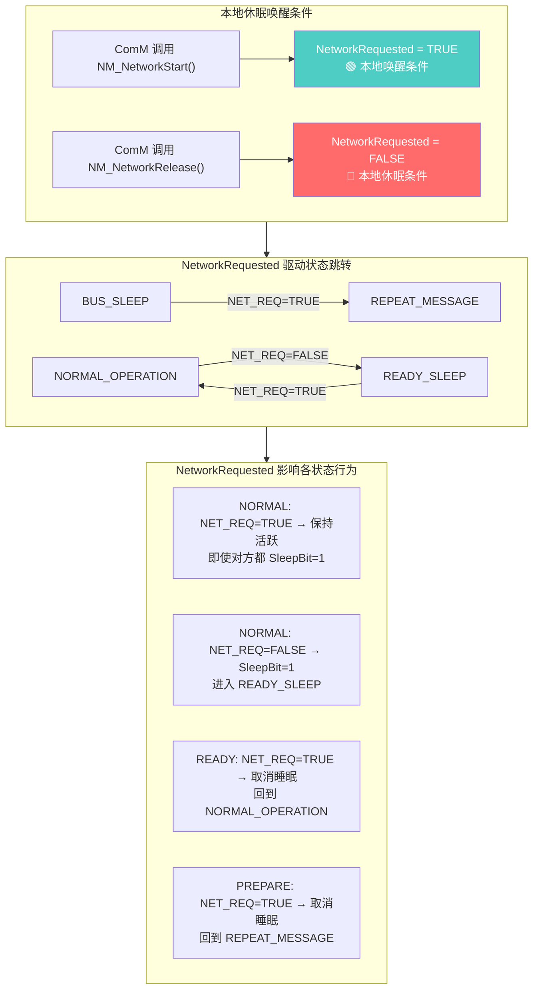
```mermaid
flowchart TB
    subgraph LOCAL_COND["本地休眠唤醒条件"]
        START["ComM 调用 NM_NetworkStart()"] --> REQ_TRUE["NetworkRequested = TRUE\n🟢 本地唤醒条件"]
        RELEASE["ComM 调用 NM_NetworkRelease()"] --> REQ_FALSE["NetworkRequested = FALSE\n🔴 本地休眠条件"]
    end

    subgraph STATE_DRIVEN["NetworkRequested 驱动状态跳转"]
        BS["BUS_SLEEP"] -->|"NET_REQ=TRUE"| REP["REPEAT_MESSAGE"]
        NORM["NORMAL_OPERATION"] -->|"NET_REQ=FALSE"| READY["READY_SLEEP"]
        READY -->|"NET_REQ=TRUE"| NORM
    end

    subgraph BEHAVIOR["NetworkRequested 影响各状态行为"]
        B1["NORMAL: NET_REQ=TRUE → 保持活跃\n即使对方都 SleepBit=1"]
        B2["NORMAL: NET_REQ=FALSE → SleepBit=1\n进入 READY_SLEEP"]
        B3["READY: NET_REQ=TRUE → 取消睡眠\n回到 NORMAL_OPERATION"]
        B4["PREPARE: NET_REQ=TRUE → 取消睡眠\n回到 REPEAT_MESSAGE"]
    end

    LOCAL_COND --> STATE_DRIVEN
    STATE_DRIVEN --> BEHAVIOR

    style REQ_TRUE fill:#4ecdc4,color:#fff
    style REQ_FALSE fill:#ff6b6b,color:#fff
```

### 3.3 NetworkRequested 与外部报文的交互矩阵

状态机的行为由**两个维度的输入**共同决定：

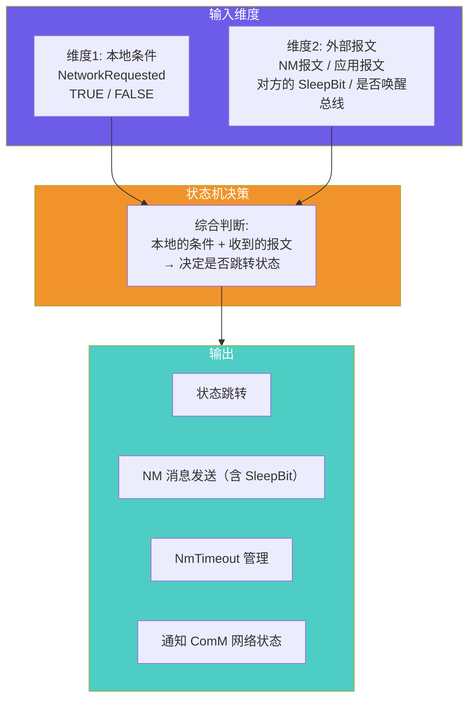
```mermaid
flowchart TD
    subgraph INPUTS["输入维度"]
        DIM1["维度1: 本地条件\nNetworkRequested\nTRUE / FALSE"]
        DIM2["维度2: 外部报文\nNM报文 / 应用报文\n对方的 SleepBit / 是否唤醒总线"]
    end

    subgraph DECISION["状态机决策"]
        DEC["综合判断:\n本地的条件 + 收到的报文\n→ 决定是否跳转状态"]
    end

    subgraph OUTPUT["输出"]
        O1["状态跳转"]
        O2["NM 消息发送（含 SleepBit）"]
        O3["NmTimeout 管理"]
        O4["通知 ComM 网络状态"]
    end

    DIM1 --> DEC
    DIM2 --> DEC
    DEC --> OUTPUT

    style INPUTS fill:#6c5ce7,color:#fff
    style DECISION fill:#f0932b,color:#fff
    style OUTPUT fill:#4ecdc4,color:#fff
```

### 3.4 各状态下 NetworkRequested 的默认行为

| 当前状态 | NetworkRequested 默认值 | 说明 |
|----------|:----------------------:|------|
| **BUS_SLEEP** | FALSE | 睡眠状态，无网络请求 |
| **REPEAT_MESSAGE** | 进入时设置（取决于唤醒原因） | 主动唤醒=TRUE，被动唤醒=FALSE |
| **NORMAL_OPERATION** | 通常为 TRUE | 正常通信中 |
| **READY_SLEEP** | FALSE | 已释放网络，准备睡眠 |
| **PREPARE_BUS_SLEEP** | FALSE | 即将进入睡眠 |

> **核心原则**：`NetworkRequested = TRUE` 是阻止睡眠的唯一本地条件。只要它为 TRUE，本节点就不会进入 READY_SLEEP 或更深的睡眠状态。**即使网络上所有其他节点都 SleepBit=1，本节点仍然保持 NORMAL_OPERATION。**

---

## 4. 核心问题：在各状态下收到报文时的行为

这是本节的重点。需要区分**两类报文**和**三个层面的影响**：

### 4.1 报文分类

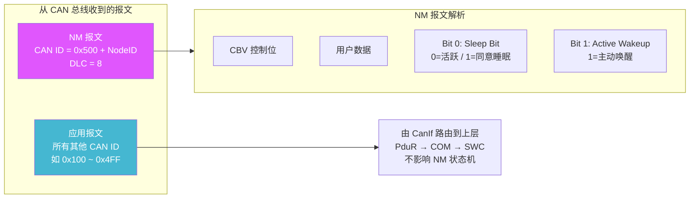
```mermaid
flowchart LR
    subgraph RX_MSG["从 CAN 总线收到的报文"]
        MSG_NM["NM 报文\nCAN ID = 0x500 + NodeID\nDLC = 8"]
        MSG_APP["应用报文\n所有其他 CAN ID\n如 0x100 ~ 0x4FF"]
    end

    subgraph NM_MSG_FMT["NM 报文解析"]
        CBV["CBV 控制位"]
        USER_DATA["用户数据"]
        SLEEP_BIT["Bit 0: Sleep Bit\n0=活跃 / 1=同意睡眠"]
        WAKEUP_BIT["Bit 1: Active Wakeup\n1=主动唤醒"]
    end

    MSG_NM --> NM_MSG_FMT
    MSG_APP --> APP_HANDLER["由 CanIf 路由到上层\nPduR → COM → SWC\n不影响 NM 状态机"]

    style MSG_NM fill:#e056fd,color:#fff
    style MSG_APP fill:#45b7d1,color:#fff
```

### 4.2 三个层面的影响

收到报文时，影响三个层面：

| 层面 | 影响 | 说明 |
|------|------|------|
| **NM 状态机** | 状态是否跳转 | NM 消息会影响，应用消息不影响 |
| **NM 定时器** | 超时定时器是否重置 | NM 消息重置 NmTimeout，应用消息不重置 |
| **CAN 总线状态** | CanTrcv/CanSM 状态是否变化 | 报文到来意味着总线活跃，影响 CanSM 状态 |

### 4.3 核心结论（一句话记住）

> **NM 报文 → 影响 NM 状态机 + 重置 NmTimeout + 可能唤醒总线**
>
> **应用报文 → 不影响 NM 状态机 + 不重置 NmTimeout + 但能唤醒总线**
>
> 应用报文通过 **CanTrcv 的唤醒检测**间接影响 NM，而不是通过 NM 协议本身。

---

### 4.4 各状态详细分析：收到 NM 报文时的行为

#### 4.4.1 BUS_SLEEP 状态

#### 状态特征（含本地条件）

| 项目 | 值 |
|------|-----|
| CanTrcv 状态 | STANDBY / SLEEP（仅唤醒电路工作） |
| Can 控制器状态 | 停止 / 初始化 |
| NM 消息发送 | **不发送** |
| 应用报文收发 | **不收发** |
| 功耗 | ~5-100 μA（ECU 级别） |
| **NetworkRequested** | **FALSE**（默认无网络请求） |
| **本地唤醒条件** | 满足（NET_REQ=TRUE 或 收到报文）→ 跳转到 REPEAT_MESSAGE |

#### 本地条件与报文交互的决策树

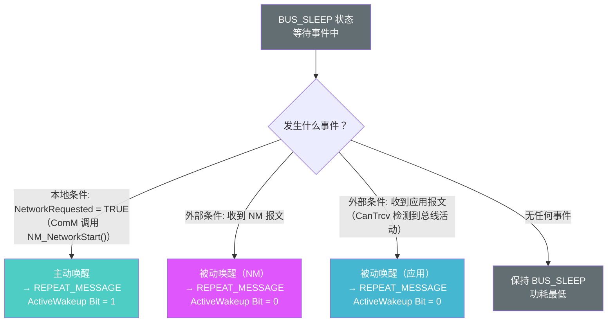
```mermaid
flowchart TD
    BUS_SLEEP["BUS_SLEEP 状态\n等待事件中"] --> CHECK_EVENT{"发生什么事件？"}

    CHECK_EVENT -->|"本地条件: NetworkRequested = TRUE\n（ComM 调用 NM_NetworkStart()）"| ACTIVE_WAKEUP["主动唤醒\n→ REPEAT_MESSAGE\nActiveWakeup Bit = 1"]

    CHECK_EVENT -->|"外部条件: 收到 NM 报文"| PASSIVE_NM["被动唤醒（NM）\n→ REPEAT_MESSAGE\nActiveWakeup Bit = 0"]

    CHECK_EVENT -->|"外部条件: 收到应用报文\n（CanTrcv 检测到总线活动）"| PASSIVE_APP["被动唤醒（应用）\n→ REPEAT_MESSAGE\nActiveWakeup Bit = 0"]

    CHECK_EVENT -->|"无任何事件"| STAY_SLEEP["保持 BUS_SLEEP\n功耗最低"]

    style BUS_SLEEP fill:#636e72,color:#fff
    style ACTIVE_WAKEUP fill:#4ecdc4,color:#fff
    style PASSIVE_NM fill:#e056fd,color:#fff
    style PASSIVE_APP fill:#45b7d1,color:#fff
    style STAY_SLEEP fill:#636e72,color:#fff
```

#### 收到 NM 报文时的完整时序

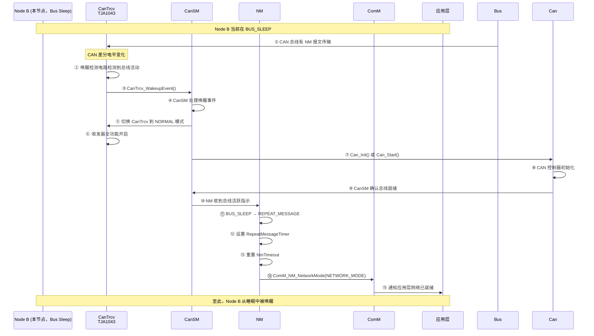
```mermaid
sequenceDiagram
    participant NodeB as Node B (本节点，Bus Sleep)
    participant Trcv as CanTrcv<br>TJA1043
    participant CanSM as CanSM
    participant NM as NM
    participant ComM as ComM
    participant APP as 应用层

    Note over NodeB,APP: Node B 当前在 BUS_SLEEP

    Bus->>Trcv: ① CAN 总线有 NM 报文传输
    Note over Trcv: CAN 差分电平变化
    Trcv->>Trcv: ② 唤醒检测电路检测到总线活动
    Trcv->>CanSM: ③ CanTrcv_WakeupEvent()
    CanSM->>CanSM: ④ CanSM 处理唤醒事件

    CanSM->>Trcv: ⑤ 切换 CanTrcv 到 NORMAL 模式
    Trcv->>Trcv: ⑥ 收发器全功能开启

    CanSM->>Can: ⑦ Can_Init() 或 Can_Start()
    Can->>Can: ⑧ CAN 控制器初始化

    Can->>CanSM: ⑨ CanSM 确认总线就绪
    CanSM->>NM: ⑩ NM 收到总线活跃指示

    NM->>NM: ⑪ BUS_SLEEP → REPEAT_MESSAGE
    NM->>NM: ⑫ 设置 RepeatMessageTimer
    NM->>NM: ⑬ 重置 NmTimeout

    NM->>ComM: ⑭ ComM_NM_NetworkMode(NETWORK_MODE)
    ComM->>APP: ⑮ 通知应用层网络已就绪

    Note over NodeB,APP: 至此，Node B 从睡眠中被唤醒
```

#### 收到 NM 报文时的行为总结

| 对象 | 行为 | 原因 |
|------|------|------|
| **CanTrcv** | STANDBY → NORMAL | 检测到总线唤醒 |
| **Can 控制器** | STOPPED → STARTED | CanSM 控制 |
| **NM 状态** | BUS_SLEEP → REPEAT_MESSAGE | **被动唤醒** |
| **NmTimeout** | 重置为最大值 | 开始监视网络 |
| **SleepBit** | 保持 0（本节点活跃） | 刚唤醒，不可能同意睡眠 |
| **NM 消息发送** | 开始以重复消息周期发送 | 通知其他节点本节点已上线 |
| **应用报文** | 恢复正常收发 | CanIf 已就绪 |
| **ComM 状态** | NO_COMM → FULL_COMM / SILENT_COMM | 通知上层 |

#### 收到应用报文时的行为

| 对象 | 行为 | 原因 |
|------|------|------|
| **CanTrcv** | STANDBY → NORMAL | 总线活动检测到 |
| **Can 控制器** | STOPPED → STARTED | CanSM 控制 |
| **NM 状态** | BUS_SLEEP → REPEAT_MESSAGE | **同样被唤醒** |
| **NmTimeout** | 重置 | 开始监视网络 |
| **应用报文** | 正常路由到上层 | 收到什么送什么 |

> **关键结论**：在 BUS_SLEEP 状态下，**任何总线活动**（无论是 NM 报文还是应用报文）都会通过 CanTrcv 的唤醒检测电路触发唤醒。NM 和应用报文在唤醒效果上**没有区别**——因为 NM 根本来不及解析报文内容，是 CanTrcv 的硬件先检测到总线活动。

---

#### 4.4.2 REPEAT_MESSAGE 状态

#### 状态特征（含本地条件）

| 项目 | 值 |
|------|-----|
| CanTrcv 状态 | NORMAL（全功能） |
| Can 控制器状态 | STARTED |
| NM 消息发送周期 | `NM_RepeatMsgCycle`（通常 50ms） |
| 本状态的持续时间 | `NM_RepeatMsgTime`（通常 200-500ms） |
| 应用报文收发 | **正常收发** |
| **NetworkRequested** | **取决于唤醒原因**：主动唤醒=TRUE，被动唤醒=FALSE |
| **本地条件的影响** | NET_REQ=TRUE → 保持活跃，等待 RepeatMsgTimer 到期<br>NET_REQ=FALSE → 仍然完成 Repeat 阶段，但到期后可能直接进入 ReadySleep |

#### 本地条件与报文交互的决策树

```mermaid
flowchart TD
    REPEAT["REPEAT_MESSAGE 状态\n快速建网中"] --> CHECK_TIMER{"RepeatMessageTimer 到期？"}

    CHECK_TIMER -->|"未到期"| CHECK_RX{"收到 NM 报文？"}

    CHECK_RX -->|"是"| RESET_TIMEOUT["重置 NmTimeout\n状态不变\n继续建网"]
    CHECK_RX -->|"否"| KEEP_SEND["继续按 50ms 周期\n发送 NM 消息"]

    CHECK_TIMER -->|"到期"| CHECK_NET_REQ{"本地条件:\nNetworkRequested？"}

    CHECK_NET_REQ -->|"TRUE"| TO_NORMAL["→ NORMAL_OPERATION\n正常通信"]
    CHECK_NET_REQ -->|"FALSE\n（极少用，除非立即释放）"| TO_READY["→ READY_SLEEP\nSleepBit=1\n（快速睡眠路径）"]

    RESET_TIMEOUT --> KEEP_SEND
    KEEP_SEND --> CHECK_TIMER

    style REPEAT fill:#f0932b,color:#fff
    style TO_NORMAL fill:#4ecdc4,color:#fff
    style TO_READY fill:#f9ca24,color:#333
``````

```mermaid
sequenceDiagram
    participant NodeA as Node A（其他节点）
    participant Bus as CAN Bus
    participant NodeB as Node B（本节点，Repeat Message）

    Note over NodeB: Node B 当前在 REPEAT_MESSAGE
    Note over NodeB: RepeatMessageTimer = 300ms（还剩 200ms）

    NodeA->>Bus: NM Msg [CBV=0x00, SleepBit=0]
    Bus->>NodeB: ① 收到 Node A 的 NM 消息

    NodeB->>NodeB: ② 解析 CBV：SleepBit=0
    NodeB->>NodeB: ③ 重置 NmTimeout = 1000ms
    NodeB->>NodeB: ④ 记录 RxIndication++

    Note over NodeB: NM 状态：REPEAT_MESSAGE 不变
    Note over NodeB: RepeatMessageTimer 继续递减（不受影响）

    NodeB->>Bus: ⑤ 继续按 50ms 周期发送 NM 消息

    Note over NodeB: RepeatMessageTimer 到期
    NodeB->>NodeB: ⑥ REPEAT_MESSAGE → NORMAL_OPERATION
    NodeB->>NodeB: ⑦ 发送周期切换为 100ms
```

#### 收到 NM 报文时各对象行为

| 对象 | 行为 | 原因 |
|------|------|------|
| **NM 状态** | **不变**（仍为 REPEAT_MESSAGE） | RepeatMessageTimer 未到期 |
| **NmTimeout** | **重置** | 确认网络中有其他节点活跃 |
| **RepeatMessageTimer** | **不受影响** | 这是独立定时器 |
| **SleepBit** | 如果对方 SleepBit=1，记录但不跳转 | 本节点还在建网，不处理睡眠投票 |
| **NM 发送周期** | 仍按 RepeatMsgCycle 发送 | 状态未变 |
| **应用报文** | 正常收发 | CanIf 已就绪 |

#### 收到应用报文时的行为

| 对象 | 行为 | 原因 |
|------|------|------|
| **NM 状态** | **不变** | 应用报文不进入 NM 处理 |
| **NmTimeout** | **不受影响** | 应用报文不重置 NM 超时 |
| **应用报文** | 正常路由到 COM → SWC | 常规通信路径 |

> **关键结论**：REPEAT_MESSAGE 状态下，NM 报文会重置 NmTimeout（保持网络活跃），但 **不会改变状态**。应用报文完全不经过 NM 处理。两个定时器独立运行：**RepeatMessageTimer** 决定何时退出 Repeat 状态，**NmTimeout** 决定是否判定网络超时。

---

#### 4.4.3 NORMAL_OPERATION 状态

#### 状态特征（含本地条件）

| 项目 | 值 |
|------|-----|
| CanTrcv 状态 | NORMAL |
| Can 控制器状态 | STARTED |
| NM 消息发送周期 | `NM_TxCycle`（通常 100-1000ms） |
| 应用报文收发 | **正常收发，这是主要通信阶段** |
| **NetworkRequested** | **通常为 TRUE**（应用层正在通信） |
| **本地条件的影响** | **NET_REQ=TRUE** → 保持 NORMAL，即使对方 SleepBit=1<br>**NET_REQ=FALSE** → SleepBit=1，进入 READY_SLEEP |

#### 本地条件与报文交互的完整决策树

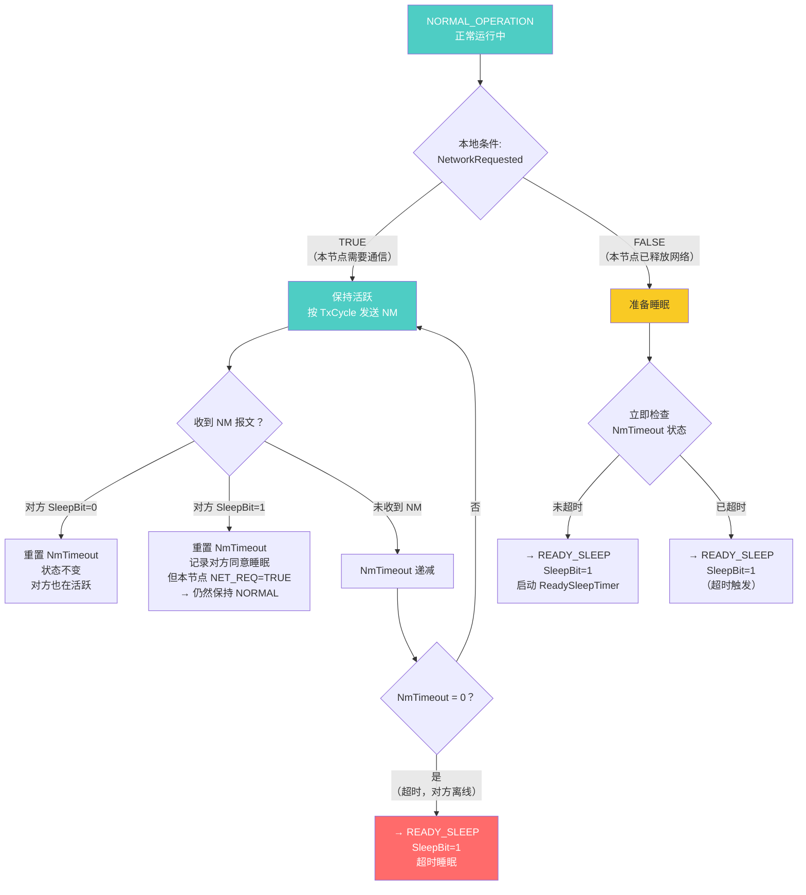
```mermaid
flowchart TD
    NORMAL["NORMAL_OPERATION\n正常运行中"] --> CHECK_NET_REQ{"本地条件:\nNetworkRequested"}

    CHECK_NET_REQ -->|"TRUE\n（本节点需要通信）"| BRANCH_TRUE["保持活跃\n按 TxCycle 发送 NM"]

    BRANCH_TRUE --> CHECK_NM_RX{"收到 NM 报文？"}

    CHECK_NM_RX -->|"对方 SleepBit=0"| RESET1["重置 NmTimeout\n状态不变\n对方也在活跃"]
    CHECK_NM_RX -->|"对方 SleepBit=1"| RESET2["重置 NmTimeout\n记录对方同意睡眠\n但本节点 NET_REQ=TRUE\n→ 仍然保持 NORMAL"]

    CHECK_NM_RX -->|"未收到 NM"| TIMEOUT_DEC["NmTimeout 递减"]

    TIMEOUT_DEC --> NmTimeout_ZERO{"NmTimeout = 0？"}
    NmTimeout_ZERO -->|"否"| BRANCH_TRUE
    NmTimeout_ZERO -->|"是\n（超时，对方离线）"| TIMEOUT_READY["→ READY_SLEEP\nSleepBit=1\n超时睡眠"]

    CHECK_NET_REQ -->|"FALSE\n（本节点已释放网络）"| BRANCH_FALSE["准备睡眠"]

    BRANCH_FALSE --> NmTimeout_OK{"立即检查\nNmTimeout 状态"}

    NmTimeout_OK -->|"未超时"| TO_READY1["→ READY_SLEEP\nSleepBit=1\n启动 ReadySleepTimer"]
    NmTimeout_OK -->|"已超时"| TO_READY2["→ READY_SLEEP\nSleepBit=1\n（超时触发）"]

    style NORMAL fill:#4ecdc4,color:#fff
    style BRANCH_TRUE fill:#4ecdc4,color:#fff
    style BRANCH_FALSE fill:#f9ca24,color:#333
    style TIMEOUT_READY fill:#ff6b6b,color:#fff
```

#### 收到 NM 报文时的行为

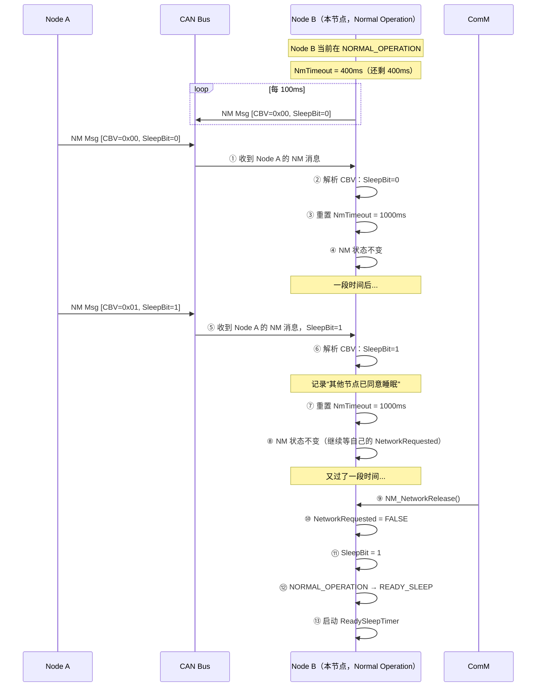
```mermaid
sequenceDiagram
    participant NodeA as Node A
    participant Bus as CAN Bus
    participant NodeB as Node B（本节点，Normal Operation）

    Note over NodeB: Node B 当前在 NORMAL_OPERATION
    Note over NodeB: NmTimeout = 400ms（还剩 400ms）

    loop 每 100ms
        NodeB->>Bus: NM Msg [CBV=0x00, SleepBit=0]
    end

    NodeA->>Bus: NM Msg [CBV=0x00, SleepBit=0]
    Bus->>NodeB: ① 收到 Node A 的 NM 消息

    NodeB->>NodeB: ② 解析 CBV：SleepBit=0
    NodeB->>NodeB: ③ 重置 NmTimeout = 1000ms
    NodeB->>NodeB: ④ NM 状态不变

    Note over NodeB: 一段时间后...

    NodeA->>Bus: NM Msg [CBV=0x01, SleepBit=1]
    Bus->>NodeB: ⑤ 收到 Node A 的 NM 消息，SleepBit=1

    NodeB->>NodeB: ⑥ 解析 CBV：SleepBit=1
    Note over NodeB: 记录"其他节点已同意睡眠"
    NodeB->>NodeB: ⑦ 重置 NmTimeout = 1000ms
    NodeB->>NodeB: ⑧ NM 状态不变（继续等自己的 NetworkRequested）

    Note over NodeB: 又过了一段时间...

    ComM->>NodeB: ⑨ NM_NetworkRelease()
    NodeB->>NodeB: ⑩ NetworkRequested = FALSE
    NodeB->>NodeB: ⑪ SleepBit = 1
    NodeB->>NodeB: ⑫ NORMAL_OPERATION → READY_SLEEP
    NodeB->>NodeB: ⑬ 启动 ReadySleepTimer
```

#### 收到 NM 报文时的完整决策树

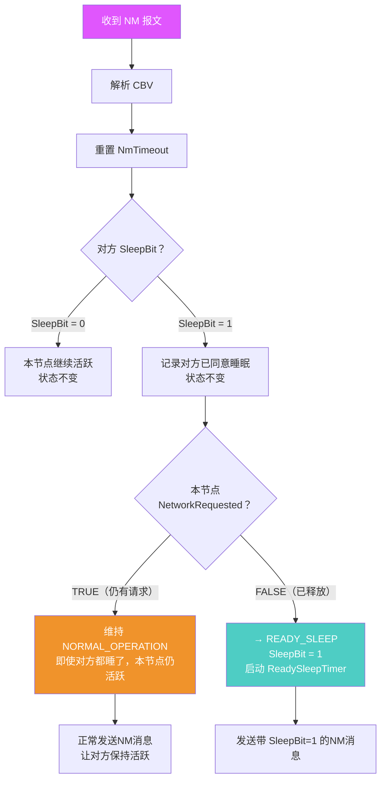
```mermaid
flowchart TD
    RX["收到 NM 报文"] --> PARSE["解析 CBV"]
    PARSE --> RESET_TIMEOUT["重置 NmTimeout"]

    RESET_TIMEOUT --> CHECK_SLEEP{"对方 SleepBit？"}

    CHECK_SLEEP -->|"SleepBit = 0"| KEEP_ACTIVE["本节点继续活跃\n状态不变"]
    CHECK_SLEEP -->|"SleepBit = 1"| RECORD_SLEEP["记录对方已同意睡眠\n状态不变"]

    RECORD_SLEEP --> CHECK_NET_REQ{"本节点\nNetworkRequested？"}

    CHECK_NET_REQ -->|"TRUE（仍有请求）"| STAY_NORMAL["维持 NORMAL_OPERATION\n即使对方都睡了，本节点仍活跃"]
    CHECK_NET_REQ -->|"FALSE（已释放）"| READY_SLEEP["→ READY_SLEEP\nSleepBit = 1\n启动 ReadySleepTimer"]

    STAY_NORMAL --> NORMAL_TX["正常发送NM消息\n让对方保持活跃"]
    READY_SLEEP --> VOTE_TX["发送带 SleepBit=1 的NM消息"]

    style RX fill:#e056fd,color:#fff
    style STAY_NORMAL fill:#f0932b,color:#fff
    style READY_SLEEP fill:#4ecdc4,color:#fff
```

#### 收到应用报文时的行为

| 对象 | 行为 | 原因 |
|------|------|------|
| **NM 状态** | **不变** | 应用报文不送入 NM 模块 |
| **NmTimeout** | **不受影响** | 只有 NM 报文才能重置超时 |
| **应用报文** | 正常路由到 COM | 常规通信路径 |

> **⚠️ 重要陷阱**：在 NORMAL_OPERATION 状态下，如果只收到应用报文而**没有收到 NM 报文**，NmTimeout 会持续递减直到超时。这意味着：
> - 即使总线上有大量应用报文在传输
> - 但如果某个节点不发 NM 报文了
> - 其他节点会判定该节点离线
> - **网络仍然可以进入睡眠**

---

#### 4.4.4 READY_SLEEP 状态

#### 状态特征（含本地条件）

| 项目 | 值 |
|------|-----|
| CanTrcv 状态 | NORMAL（仍然全功能） |
| Can 控制器状态 | STARTED |
| NM 消息发送 | 继续发送，带 SleepBit=1 |
| 本节点状态 | "同意睡眠，等其他人同意" |
| 应用报文收发 | 正常收发 |
| **NetworkRequested** | **FALSE**（已释放网络，否则不会进入此状态） |
| **本地条件的影响** | **NET_REQ=FALSE** → 继续投票，等待睡眠<br>**NET_REQ=TRUE** → **立即取消睡眠**，回到 NORMAL_OPERATION |

#### 本地条件与报文交互的完整决策树

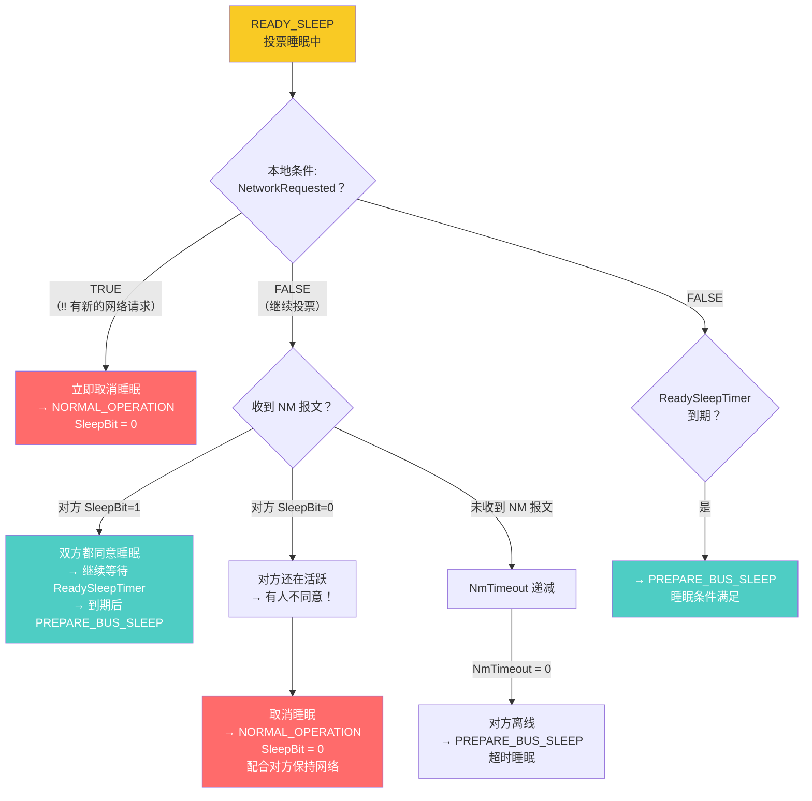
```mermaid
flowchart TD
    READY["READY_SLEEP\n投票睡眠中"] --> CHECK_NET_REQ{"本地条件:\nNetworkRequested？"}

    CHECK_NET_REQ -->|"TRUE\n（‼️ 有新的网络请求）"| CANCEL_SLEEP_LOCAL["立即取消睡眠\n→ NORMAL_OPERATION\nSleepBit = 0"]

    CHECK_NET_REQ -->|"FALSE\n（继续投票）"| CHECK_NM_RX{"收到 NM 报文？"}

    CHECK_NM_RX -->|"对方 SleepBit=1"| BOTH_SLEEP["双方都同意睡眠\n→ 继续等待 ReadySleepTimer\n→ 到期后 PREPARE_BUS_SLEEP"]

    CHECK_NM_RX -->|"对方 SleepBit=0"| OTHER_ACTIVE["对方还在活跃\n→ 有人不同意！"]

    OTHER_ACTIVE --> CANCEL_SLEEP_REMOTE["取消睡眠\n→ NORMAL_OPERATION\nSleepBit = 0\n配合对方保持网络"]

    CHECK_NM_RX -->|"未收到 NM 报文"| TIMEOUT_WAIT["NmTimeout 递减"]

    TIMEOUT_WAIT -->|"NmTimeout = 0"| TIMEOUT_SLEEP["对方离线\n→ PREPARE_BUS_SLEEP\n超时睡眠"]

    CHECK_NET_REQ -->|"FALSE"| CHECK_TIMER{"ReadySleepTimer\n到期？"}

    CHECK_TIMER -->|"是"| TO_PREPARE["→ PREPARE_BUS_SLEEP\n睡眠条件满足"]

    style READY fill:#f9ca24,color:#333
    style CANCEL_SLEEP_LOCAL fill:#ff6b6b,color:#fff
    style CANCEL_SLEEP_REMOTE fill:#ff6b6b,color:#fff
    style BOTH_SLEEP fill:#4ecdc4,color:#fff
    style TO_PREPARE fill:#4ecdc4,color:#fff
```

#### 收到 NM 报文时的行为——最复杂的场景

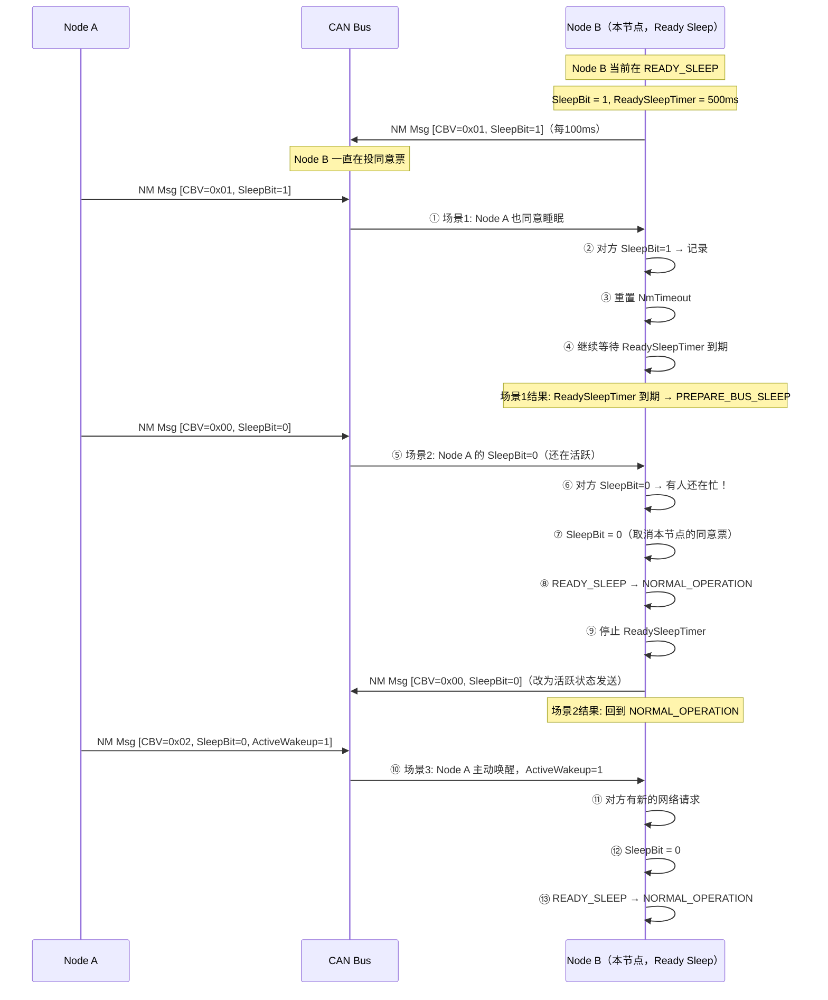
```mermaid
sequenceDiagram
    participant NodeA as Node A
    participant Bus as CAN Bus
    participant NodeB as Node B（本节点，Ready Sleep）

    Note over NodeB: Node B 当前在 READY_SLEEP
    Note over NodeB: SleepBit = 1, ReadySleepTimer = 500ms

    NodeB->>Bus: NM Msg [CBV=0x01, SleepBit=1]（每100ms）
    Note over Bus: Node B 一直在投同意票

    %% 场景1: 对方也同意睡眠
    NodeA->>Bus: NM Msg [CBV=0x01, SleepBit=1]
    Bus->>NodeB: ① 场景1: Node A 也同意睡眠

    NodeB->>NodeB: ② 对方 SleepBit=1 → 记录
    NodeB->>NodeB: ③ 重置 NmTimeout
    NodeB->>NodeB: ④ 继续等待 ReadySleepTimer 到期

    Note over NodeB: 场景1结果: ReadySleepTimer 到期 → PREPARE_BUS_SLEEP

    %% 场景2: 对方不同意睡眠（还在活跃）
    NodeA->>Bus: NM Msg [CBV=0x00, SleepBit=0]
    Bus->>NodeB: ⑤ 场景2: Node A 的 SleepBit=0（还在活跃）

    NodeB->>NodeB: ⑥ 对方 SleepBit=0 → 有人还在忙！
    NodeB->>NodeB: ⑦ SleepBit = 0（取消本节点的同意票）
    NodeB->>NodeB: ⑧ READY_SLEEP → NORMAL_OPERATION
    NodeB->>NodeB: ⑨ 停止 ReadySleepTimer

    NodeB->>Bus: NM Msg [CBV=0x00, SleepBit=0]（改为活跃状态发送）

    Note over NodeB: 场景2结果: 回到 NORMAL_OPERATION

    %% 场景3: 收到对方有网络请求
    NodeA->>Bus: NM Msg [CBV=0x02, SleepBit=0, ActiveWakeup=1]
    Bus->>NodeB: ⑩ 场景3: Node A 主动唤醒，ActiveWakeup=1

    NodeB->>NodeB: ⑪ 对方有新的网络请求
    NodeB->>NodeB: ⑫ SleepBit = 0
    NodeB->>NodeB: ⑬ READY_SLEEP → NORMAL_OPERATION
```

#### 收到 NM 报文时的完整决策树

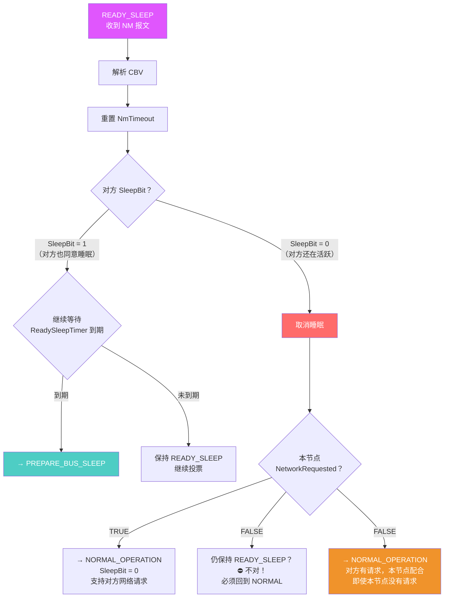
```mermaid
flowchart TD
    RX["READY_SLEEP\n收到 NM 报文"] --> PARSE["解析 CBV"]
    PARSE --> RESET_TIMEOUT["重置 NmTimeout"]

    RESET_TIMEOUT --> CHECK_SLEEP_BIT{"对方 SleepBit？"}

    CHECK_SLEEP_BIT -->|"SleepBit = 1\n（对方也同意睡眠）"| CHECK_TIMEOUT{"继续等待\nReadySleepTimer 到期"}

    CHECK_TIMEOUT -->|"到期"| PREPARE["→ PREPARE_BUS_SLEEP"]
    CHECK_TIMEOUT -->|"未到期"| STAY["保持 READY_SLEEP\n继续投票"]

    CHECK_SLEEP_BIT -->|"SleepBit = 0\n（对方还在活跃）"| CANCEL_SLEEP["取消睡眠"]

    CANCEL_SLEEP --> CHECK_NET_REQ{"本节点\nNetworkRequested？"}

    CHECK_NET_REQ -->|"TRUE"| TO_NORMAL["→ NORMAL_OPERATION\nSleepBit = 0\n支持对方网络请求"]
    CHECK_NET_REQ -->|"FALSE"| KEEP_READY["仍保持 READY_SLEEP？\n⛔ 不对！\n必须回到 NORMAL"]

    CHECK_NET_REQ -->|"FALSE"| BACK_NORMAL["→ NORMAL_OPERATION\n对方有请求，本节点配合\n即使本节点没有请求"]

    style RX fill:#e056fd,color:#fff
    style CANCEL_SLEEP fill:#ff6b6b,color:#fff
    style PREPARE fill:#4ecdc4,color:#fff
    style BACK_NORMAL fill:#f0932b,color:#fff
```

#### 收到应用报文时的行为

| 对象 | 行为 | 原因 |
|------|------|------|
| **NM 状态** | **不变** | 应用报文不进入 NM 模块 |
| **NmTimeout** | **不受影响** | 只有 NM 报文重置超时 |
| **ReadySleepTimer** | **不受影响** | 继续递减 |
| **应用报文** | 正常路由到 COM | 常规通信路径 |

> **⚠️ 重要陷阱**：在 READY_SLEEP 状态下，应用报文**不会改变 NM 状态**。这意味着如果一个节点已经在 READY_SLEEP 投票睡眠，即使总线上有大量应用报文，它仍然会继续睡眠流程。**应用报文不能阻止 NM 睡眠**——只有 NM 报文（SleepBit=0）才能阻止。

---

#### 4.4.5 PREPARE_BUS_SLEEP 状态

#### 状态特征（含本地条件）

| 项目 | 值 |
|------|-----|
| CanTrcv 状态 | 即将切换到 STANDBY |
| Can 控制器状态 | 即将停止 |
| NM 消息发送 | 发送**最后一帧** |
| 应用报文收发 | **即将停止** |
| 本状态持续时间 | 极短（1-2 个 SchM Tick） |
| **NetworkRequested** | **FALSE**（已经释放，否则不会进入） |
| **本地条件的影响** | NET_REQ=FALSE → 正常完成睡眠<br>NET_REQ=TRUE → 取消睡眠，回到 REPEAT_MESSAGE |

#### 本地条件与报文交互的决策树

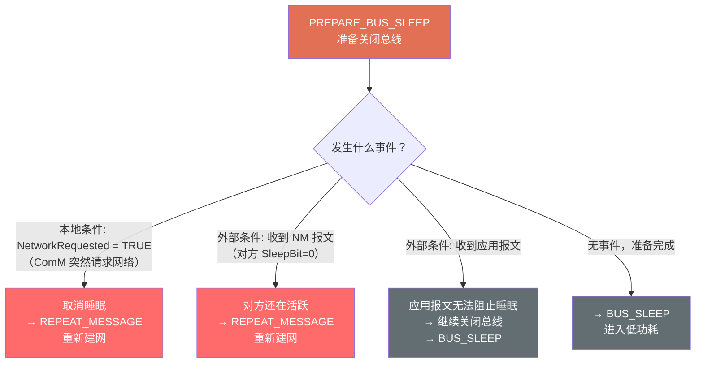
```mermaid
flowchart TD
    PREPARE["PREPARE_BUS_SLEEP\n准备关闭总线"] --> CHECK_EVENT{"发生什么事件？"}

    CHECK_EVENT -->|"本地条件: NetworkRequested = TRUE\n（ComM 突然请求网络）"| CANCEL_PREPARE["取消睡眠\n→ REPEAT_MESSAGE\n重新建网"]

    CHECK_EVENT -->|"外部条件: 收到 NM 报文\n（对方 SleepBit=0）"| CANCEL_BY_NM["对方还在活跃\n→ REPEAT_MESSAGE\n重新建网"]

    CHECK_EVENT -->|"外部条件: 收到应用报文"| IGNORE_APP["应用报文无法阻止睡眠\n→ 继续关闭总线\n→ BUS_SLEEP"]

    CHECK_EVENT -->|"无事件，准备完成"| TO_SLEEP["→ BUS_SLEEP\n进入低功耗"]

    style PREPARE fill:#e17055,color:#fff
    style CANCEL_PREPARE fill:#ff6b6b,color:#fff
    style CANCEL_BY_NM fill:#ff6b6b,color:#fff
    style IGNORE_APP fill:#636e72,color:#fff
    style TO_SLEEP fill:#636e72,color:#fff
```

#### 收到 NM 报文时的行为

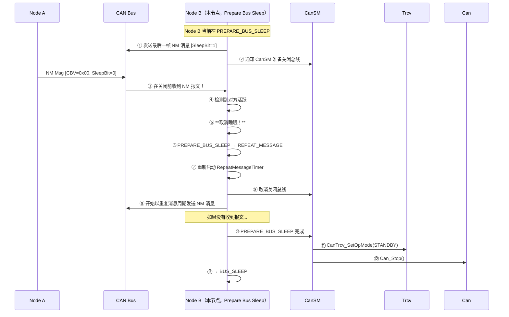
```mermaid
sequenceDiagram
    participant NodeA as Node A
    participant Bus as CAN Bus
    participant NodeB as Node B（本节点，Prepare Bus Sleep）

    Note over NodeB: Node B 当前在 PREPARE_BUS_SLEEP

    NodeB->>Bus: ① 发送最后一帧 NM 消息 [SleepBit=1]

    NodeB->>CanSM: ② 通知 CanSM 准备关闭总线

    %% 在关闭前一刻收到 NM 报文
    NodeA->>Bus: NM Msg [CBV=0x00, SleepBit=0]
    Bus->>NodeB: ③ 在关闭前收到 NM 报文！

    NodeB->>NodeB: ④ 检测到对方活跃
    NodeB->>NodeB: ⑤ **取消睡眠！**
    NodeB->>NodeB: ⑥ PREPARE_BUS_SLEEP → REPEAT_MESSAGE
    NodeB->>NodeB: ⑦ 重新启动 RepeatMessageTimer

    NodeB->>CanSM: ⑧ 取消关闭总线
    NodeB->>Bus: ⑨ 开始以重复消息周期发送 NM 消息

    Note over NodeB: 如果没有收到报文...
    NodeB->>CanSM: ⑩ PREPARE_BUS_SLEEP 完成
    CanSM->>Trcv: ⑪ CanTrcv_SetOpMode(STANDBY)
    CanSM->>Can: ⑫ Can_Stop()
    NodeB->>NodeB: ⑬ → BUS_SLEEP
```

#### 收到 NM 报文 vs 应用报文的对比

| 场景 | 收到 NM 报文 | 收到应用报文 |
|------|-------------|-------------|
| **NM 状态** | PREPARE_BUS_SLEEP → **REPEAT_MESSAGE** | **不变**（仍为 PREPARE_BUS_SLEEP） |
| **CanTrcv** | 维持 NORMAL，**不进入** STANDBY | 仍然进入 STANDBY |
| **Can 控制器** | 维持 STARTED | 仍然停止 |
| **总线最终状态** | **被唤醒，重新建网** | **仍然睡眠** |
| **原因** | NM 报文触发 NM 状态机回退 | 应用报文不触发 NM，CanTrcv 已经进入 STANDBY 无法接收 |

> **⚠️ 关键结论**：只有在 PREPARE_BUS_SLEEP 状态下，应用报文 **无法阻止睡眠**——因为 CanTrcv 已经快要进入 STANDBY 了，应用报文到达时可能已经无法被完整接收。而 NM 报文在 NM 模块内部处理，即使 CanTrcv 还未完全关闭，NM 状态机可以回退。

---

## 5. 综合状态行为对照：本地条件 + NM 报文 + 应用报文

> 这是全文的核心对照表，**将本地条件、NM 报文、应用报文三个维度综合在一起**，一目了然地展示每个状态下的完整行为。

### 5.1 完整五维对照表

| 当前状态 | 本地条件<br>NetworkRequested | 收到 NM 报文<br>（SleepBit=0） | 收到 NM 报文<br>（SleepBit=1） | 收到应用报文 |
|:---------|:---------------------------:|:----------------------------:|:----------------------------:|:-----------:|
| **BUS_SLEEP** | FALSE → 等待唤醒<br>TRUE → 跳转到 REPEAT | 🟢 唤醒 → REPEAT<br>（被动唤醒，ActiveWakeup=0） | 🟢 唤醒 → REPEAT<br>（被动唤醒，ActiveWakeup=0） | 🟢 唤醒 → REPEAT<br>（通过 CanTrcv 硬件） |
| **REPEAT_MESSAGE** | TRUE → 建网完成到 NORMAL<br>FALSE → 可快速进入 ReadySleep | 🟡 重置 NmTimeout<br>状态不变 | 🟡 重置 NmTimeout<br>记录但不跳转 | 🔵 正常路由<br>不影响 NM |
| **NORMAL_OPERATION** | TRUE → **保持活跃，绝不睡眠**<br>FALSE → SleepBit=1 → ReadySleep | 🟡 重置 NmTimeout<br>状态不变 | 🟡 重置 NmTimeout<br>**记录对方已同意**<br>但 NET_REQ=TRUE 时仍不跳转 | 🔵 正常路由<br>**不重置 NmTimeout** |
| **READY_SLEEP** | FALSE → 继续投票<br>TRUE → **取消睡眠→NORMAL** | 🟠 **对方活跃→回到 NORMAL**<br>取消睡眠投票 | 🟡 双方都同意→继续等待<br>ReadySleepTimer 到期后睡眠 | 🔵 正常路由<br>**不能阻止睡眠** |
| **PREPARE_BUS_SLEEP** | FALSE → 正常进入睡眠<br>TRUE → **取消睡眠→REPEAT** | 🔴 **取消睡眠→REPEAT**<br>最后一刻回退 | 🔴 **取消睡眠→REPEAT**<br>最后一刻回退 | 🔵 **无法阻止睡眠**<br>总线即将关闭 |

### 5.2 按状态的行为矩阵详解

#### 5.2.1 BUS_SLEEP

| 条件组合 | 行为 | 状态跳转 | 说明 |
|---------|------|:--------:|------|
| NET_REQ=FALSE + 无报文 | 保持睡眠 | 无 | 最低功耗 |
| NET_REQ=FALSE + NM 报文 | 被动唤醒 | → REPEAT | CanTrcv 先检测到总线活动 |
| NET_REQ=FALSE + 应用报文 | 被动唤醒 | → REPEAT | 同上，CanTrcv 硬件触发 |
| NET_REQ=TRUE + 无报文 | 主动唤醒 | → REPEAT | ComM 请求通信 |
| NET_REQ=TRUE + NM 报文 | 主动+被动唤醒 | → REPEAT | ActiveWakeup Bit=1 |

#### 5.2.2 REPEAT_MESSAGE

| 条件组合 | 行为 | 状态跳转 | 说明 |
|---------|------|:--------:|------|
| NET_REQ=TRUE + RepeatTimer未到期 | 快速发送 NM | 无 | 建网中 |
| NET_REQ=TRUE + RepeatTimer到期 | 建网完成 | → NORMAL | 标准路径 |
| NET_REQ=TRUE + 收到 NM (SleepBit=0) | 重置 NmTimeout | 无 | 确认对方活跃 |
| NET_REQ=TRUE + 收到 NM (SleepBit=1) | 重置 NmTimeout | 无 | 对方同意，但本节点仍需建网 |
| NET_REQ=FALSE + RepeatTimer到期 | 快速睡眠 | → READY 或 BUS_SLEEP | 极少用 |
| 收到应用报文 | 正常路由 | 无 | 不影响 NM |

#### 5.2.3 NORMAL_OPERATION

| 条件组合 | 行为 | 状态跳转 | 说明 |
|---------|------|:--------:|------|
| NET_REQ=TRUE + 对方 SleepBit=0 | 继续保持活跃 | 无 | 大家都有请求 |
| NET_REQ=TRUE + 对方 SleepBit=1 | 记录对方已同意，但本节点继续活跃 | 无 | **本节点有请求，绝不睡眠** |
| NET_REQ=TRUE + NmTimeout超时 | 判定对方离线 | → READY | 超时，即使有请求也准备睡 |
| NET_REQ=FALSE + 对方 SleepBit=0 | 投同意票，准备睡眠 | → READY | 标准释放路径 |
| NET_REQ=FALSE + 对方 SleepBit=1 | 投同意票，准备睡眠 | → READY | 双方都同意 |
| NET_REQ=FALSE + NmTimeout超时 | 超时睡眠 | → READY | 对方离线 |
| 收到应用报文 | 正常路由，不重置 NmTimeout | 无 | **应用报文不阻止睡眠** |

> **⚠️ 关键规则**：NORMAL_OPERATION 状态下，`NetworkRequested = TRUE` 是唯一能**无条件阻止**进入 READY_SLEEP 的条件。即使所有其他节点都 SleepBit=1，本节点仍然保持 NORMAL。

#### 5.2.4 READY_SLEEP

| 条件组合 | 行为 | 状态跳转 | 说明 |
|---------|------|:--------:|------|
| NET_REQ=FALSE + 对方 SleepBit=1 + ReadyTimer未到期 | 继续投票 | 无 | 等待 |
| NET_REQ=FALSE + 对方 SleepBit=1 + ReadyTimer到期 | 所有节点同意 | → PREPARE | 标准睡眠路径 |
| NET_REQ=FALSE + 对方 SleepBit=0 | 对方还在活跃，取消睡眠 | → NORMAL | 配合对方 |
| NET_REQ=FALSE + NmTimeout超时 | 对方离线 | → PREPARE | 超时睡眠 |
| **NET_REQ=TRUE** + 任何情况 | 本节点有新请求，取消睡眠 | → NORMAL | **本地条件优先** |
| 收到应用报文 | 正常路由 | 无 | **不能阻止睡眠** |

#### 5.2.5 PREPARE_BUS_SLEEP

| 条件组合 | 行为 | 状态跳转 | 说明 |
|---------|------|:--------:|------|
| NET_REQ=FALSE + 无事件 | 正常完成睡眠 | → BUS_SLEEP | 标准路径 |
| NET_REQ=FALSE + 收到 NM 报文 | 对方活跃，取消睡眠 | → REPEAT | NM 报文可阻止 |
| **NET_REQ=TRUE** + 任何情况 | 新请求，取消睡眠 | → REPEAT | 本地条件优先 |
| 收到应用报文 | 无法阻止睡眠 | → BUS_SLEEP | **应用报文无效** |

---

## 6. 综合对照表：所有状态下收到报文的行为

### 6.1 收到 NM 报文

| 当前状态 | NM 状态变化 | NmTimeout | SleepBit | NM 发送 | CanTrcv | 应用报文 |
|----------|------------|-----------|----------|---------|---------|---------|
| **BUS_SLEEP** | → REPEAT_MESSAGE | 重置 | 0（活跃） | 开始发送 | STANDBY→NORMAL | 恢复收发 |
| **REPEAT_MESSAGE** | 不变 | 重置 | 不变 | 按 RepeatMsgCycle 继续 | NORMAL | 正常 |
| **NORMAL_OPERATION** | 不变（对方 SleepBit=1 时，记录但不跳转） | 重置 | 不变 | 按 TxCycle 继续 | NORMAL | 正常 |
| **NORMAL_OPERATION**（对方 SleepBit=0 + 本节点 NetReq=FALSE） | → READY_SLEEP | 重置 | 1 | 带 SleepBit=1 发送 | NORMAL | 正常 |
| **READY_SLEEP**（对方 SleepBit=0） | → NORMAL_OPERATION | 重置 | 0 | 恢复正常发送 | NORMAL | 正常 |
| **READY_SLEEP**（对方 SleepBit=1） | 不变 | 重置 | 1 | 继续投票 | NORMAL | 正常 |
| **PREPARE_BUS_SLEEP** | → REPEAT_MESSAGE | 重置 | 0 | 重新开始重复发送 | 保持 NORMAL | 正常 |

### 6.2 收到应用报文

| 当前状态 | NM 状态变化 | NmTimeout | SleepBit | NM 发送 | CanTrcv | 应用报文 |
|----------|------------|-----------|----------|---------|---------|---------|
| **BUS_SLEEP** | → REPEAT_MESSAGE（通过 CanTrcv 唤醒，非 NM 直接触发） | 重置 | 0 | 开始发送 | STANDBY→NORMAL | 恢复收发 |
| **REPEAT_MESSAGE** | **不变** | **不变** | 不变 | 不变 | NORMAL | 正常路由 |
| **NORMAL_OPERATION** | **不变** | **不变**⚠️ | 不变 | 不变 | NORMAL | 正常路由 |
| **READY_SLEEP** | **不变**⚠️ | **不变**⚠️ | 不变 | 不变 | NORMAL | 正常路由 |
| **PREPARE_BUS_SLEEP** | **不变**⚠️⚠️ | **不变** | 不变 | 不变 | **→ STANDBY** | **无法接收** |

### 6.3 图解：NM 报文 vs 应用报文的影响路径

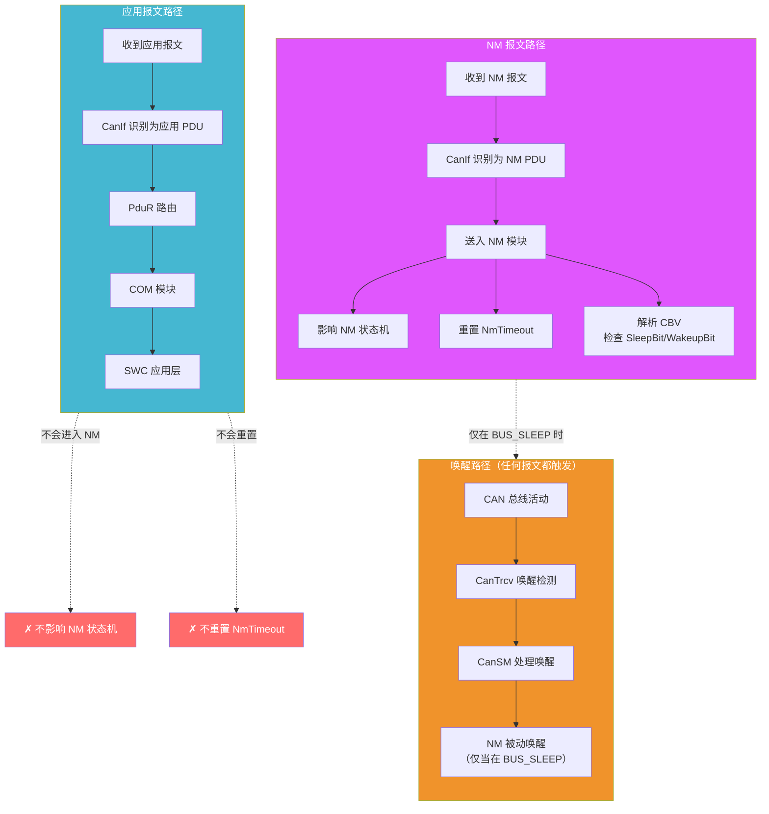
```mermaid
flowchart TB
    subgraph NM_PATH["NM 报文路径"]
        direction TB
        NM_RX["收到 NM 报文"] --> NM_PDU["CanIf 识别为 NM PDU"]
        NM_PDU --> NM_MODULE["送入 NM 模块"]
        NM_MODULE --> NM_STATE["影响 NM 状态机"]
        NM_MODULE --> NM_TIMER["重置 NmTimeout"]
        NM_MODULE --> NM_CBV["解析 CBV\n检查 SleepBit/WakeupBit"]
    end

    subgraph APP_PATH["应用报文路径"]
        direction TB
        APP_RX["收到应用报文"] --> APP_PDU["CanIf 识别为应用 PDU"]
        APP_PDU --> PduR["PduR 路由"]
        PduR --> COM["COM 模块"]
        COM --> SWC["SWC 应用层"]
    end

    subgraph WAKEUP_PATH["唤醒路径（任何报文都触发）"]
        direction TB
        BUS_ACTIVE["CAN 总线活动"] --> TRCV_DETECT["CanTrcv 唤醒检测"]
        TRCV_DETECT --> CANSM_WAKE["CanSM 处理唤醒"]
        CANSM_WAKE --> NM_WAKE["NM 被动唤醒\n（仅当在 BUS_SLEEP）"]
    end

    NM_PATH -.->|"仅在 BUS_SLEEP 时"| WAKEUP_PATH
    APP_PATH -.->|"不会进入 NM"| NO_NM_EFFECT["✗ 不影响 NM 状态机"]
    APP_PATH -.->|"不会重置"| NO_TIMER_RESET["✗ 不重置 NmTimeout"]

    style NM_PATH fill:#e056fd,color:#fff
    style APP_PATH fill:#45b7d1,color:#fff
    style WAKEUP_PATH fill:#f0932b,color:#fff
    style NO_NM_EFFECT fill:#ff6b6b,color:#fff
    style NO_TIMER_RESET fill:#ff6b6b,color:#fff
```

---

## 7. 深入原理：为什么这样设计？

### 7.1 设计原则

AUTOSAR NM 的报文处理机制遵循以下设计原则：

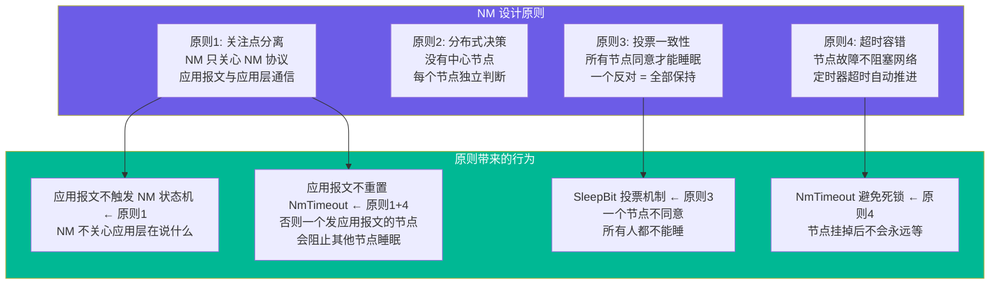
```mermaid
flowchart TB
    subgraph PRINCIPLES["NM 设计原则"]
        P1["原则1: 关注点分离\nNM 只关心 NM 协议\n应用报文与应用层通信"]
        P2["原则2: 分布式决策\n没有中心节点\n每个节点独立判断"]
        P3["原则3: 投票一致性\n所有节点同意才能睡眠\n一个反对 = 全部保持"]
        P4["原则4: 超时容错\n节点故障不阻塞网络\n定时器超时自动推进"]
    end

    subgraph DERIVATION["原则带来的行为"]
        D1["应用报文不触发 NM 状态机 ← 原则1\nNM 不关心应用层在说什么"]
        D2["应用报文不重置 NmTimeout ← 原则1+4\n否则一个发应用报文的节点\n会阻止其他节点睡眠"]
        D3["SleepBit 投票机制 ← 原则3\n一个节点不同意\n所有人都不能睡"]
        D4["NmTimeout 避免死锁 ← 原则4\n节点挂掉后不会永远等"]
    end

    P1 --> D1
    P1 --> D2
    P3 --> D3
    P4 --> D4

    style PRINCIPLES fill:#6c5ce7,color:#fff
    style DERIVATION fill:#00b894,color:#fff
```

### 7.2 为什么应用报文不重置 NmTimeout？

这是 NM 设计中最让初学者困惑的一点。假设相反——应用报文也重置 NmTimeout：

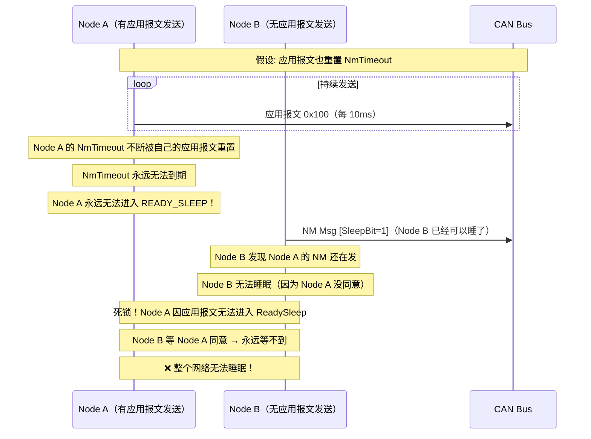
```mermaid
sequenceDiagram
    participant NodeA as Node A（有应用报文发送）
    participant NodeB as Node B（无应用报文发送）
    participant Bus as CAN Bus

    Note over NodeA,Bus: 假设: 应用报文也重置 NmTimeout

    loop 持续发送
        NodeA->>Bus: 应用报文 0x100（每 10ms）
    end

    Note over NodeA: Node A 的 NmTimeout 不断被自己的应用报文重置
    Note over NodeA: NmTimeout 永远无法到期
    Note over NodeA: Node A 永远无法进入 READY_SLEEP！

    NodeB->>Bus: NM Msg [SleepBit=1]（Node B 已经可以睡了）

    Note over NodeB: Node B 发现 Node A 的 NM 还在发
    Note over NodeB: Node B 无法睡眠（因为 Node A 没同意）

    Note over NodeA,NodeB: 死锁！Node A 因应用报文无法进入 ReadySleep
    Note over NodeA,NodeB: Node B 等 Node A 同意 → 永远等不到

    Note over NodeA,NodeB: ❌ 整个网络无法睡眠！
```

**结论**：如果应用报文也重置 NmTimeout，**一个持续发送应用报文的节点将永远无法进入睡眠**，导致整个网络无法休眠。

### 7.3 为什么 NM 报文可以重置 NmTimeout？

因为 NM 报文是**网络管理协议的一部分**，它的存在表示"这个节点还在网络中、还在参与睡眠协商"。如果节点不发 NM 报文了，说明它要么故障了，要么已经离线了，其他节点不应该等它。

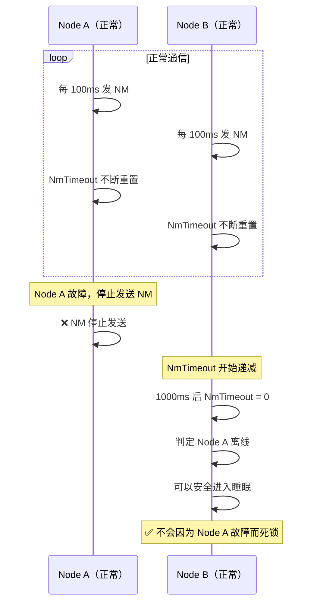
```mermaid
sequenceDiagram
    participant NodeA as Node A（正常）
    participant NodeB as Node B（正常）

    loop 正常通信
        NodeA->>NodeA: 每 100ms 发 NM
        NodeB->>NodeB: 每 100ms 发 NM
        NodeA->>NodeA: NmTimeout 不断重置
        NodeB->>NodeB: NmTimeout 不断重置
    end

    Note over NodeA: Node A 故障，停止发送 NM
    NodeA->>NodeA: ❌ NM 停止发送

    Note over NodeB: NmTimeout 开始递减
    NodeB->>NodeB: 1000ms 后 NmTimeout = 0
    NodeB->>NodeB: 判定 Node A 离线

    NodeB->>NodeB: 可以安全进入睡眠
    Note over NodeB: ✅ 不会因为 Node A 故障而死锁
```

### 7.4 边界情况：总线上只有应用报文，没有 NM 报文

这是一个实际项目中经常遇到的问题：

```mermaid
sequenceDiagram
    participant NodeA as Node A
    participant NodeB as Node B
    participant Bus as CAN Bus

    Note over NodeA,NodeB: 场景：Node A 和 Node B 都在 NORMAL_OPERATION

    loop 持续发送应用报文
        NodeA->>Bus: 应用报文 0x200（每 20ms）
        NodeB->>Bus: 应用报文 0x300（每 30ms）
    end

    loop NM 持续发送（每 100ms）
        NodeA->>Bus: NM Msg [ID=0x501, SleepBit=0]
        NodeB->>Bus: NM Msg [ID=0x502, SleepBit=0]
    end

    Note over NodeA: Node A 释放网络请求
    NodeA->>NodeA: NetworkRequested = FALSE
    NodeA->>NodeA: NmTimeout 开始递减

    Note over Bus: 应用报文仍在大量传输！
    NodeA->>NodeA: NmTimeout 继续递减...（应用报文不影响）

    NodeA->>NodeA: NmTimeout = 0
    NodeA->>NodeA: → READY_SLEEP（即使总线上有大量应用报文！）

    Note over NodeA: ✅ 正确行为：应用报文不影响 NM 睡眠决策
```

---

## 8. CAN 总线行为总结：各状态下 CAN 通信的表现

### 8.1 CAN 通信栈各层状态对照

```mermaid
flowchart TB
    subgraph BUS_SLEEP_LAYER["BUS_SLEEP 状态"]
        CAN_TRCV_SLEEP["CanTrcv: STANDBY/SLEEP\n收发器关闭\n仅唤醒电路工作"]
        CAN_CTRL_SLEEP["Can: STOPPED\nCAN控制器关闭\n不参与总线通信"]
        CAN_IF_SLEEP["CanIf: 无法收发\n所有PDU通道关闭"]
        NM_SLEEP["NM: 不发送\n不接收"]
    end

    subgraph REPEAT_LAYER["REPEAT_MESSAGE 状态"]
        CAN_TRCV_REPEAT["CanTrcv: NORMAL\n收发器全功能"]
        CAN_CTRL_REPEAT["Can: STARTED\nCAN控制器运行"]
        CAN_IF_REPEAT["CanIf: 正常收发\nNM PDU 优先"]
        NM_REPEAT["NM: 快速发送\n50ms 周期"]
    end

    subgraph NORMAL_LAYER["NORMAL_OPERATION 状态"]
        CAN_TRCV_NORMAL["CanTrcv: NORMAL"]
        CAN_CTRL_NORMAL["Can: STARTED"]
        CAN_IF_NORMAL["CanIf: 正常收发\n所有应用报文正常"]
        NM_NORMAL["NM: 周期发送\n100-1000ms"]
    end

    subgraph READY_LAYER["READY_SLEEP 状态"]
        CAN_TRCV_READY["CanTrcv: NORMAL\n仍在运行"]
        CAN_CTRL_READY["Can: STARTED"]
        CAN_IF_READY["CanIf: 正常收发\n应用报文仍在处理"]
        NM_READY["NM: 发送带 SleepBit=1\n按 TxCycle 发送"]
    end

    subgraph PREPARE_LAYER["PREPARE_BUS_SLEEP 状态"]
        CAN_TRCV_PREPARE["CanTrcv: NORMAL → STANDBY\n正在切换"]
        CAN_CTRL_PREPARE["Can: STARTED → STOPPED\n正在停止"]
        CAN_IF_PREPARE["CanIf: 正在关闭\n最后一帧发送"]
        NM_PREPARE["NM: 发送最后一帧\n然后停止"]
    end

    BUS_SLEEP_LAYER -->|"唤醒"| REPEAT_LAYER
    REPEAT_LAYER -->|"重复消息超时"| NORMAL_LAYER
    NORMAL_LAYER -->|"网络释放"| READY_LAYER
    READY_LAYER -->|"睡眠条件满足"| PREPARE_LAYER
    PREPARE_LAYER -->|"准备完成"| BUS_SLEEP_LAYER

    style BUS_SLEEP_LAYER fill:#636e72,color:#fff
    style REPEAT_LAYER fill:#f0932b,color:#fff
    style NORMAL_LAYER fill:#4ecdc4,color:#fff
    style READY_LAYER fill:#f9ca24,color:#333
    style PREPARE_LAYER fill:#e17055,color:#fff
```

### 8.2 各状态下 CAN 总线行为速查表

| 状态 | 是否发送 NM 消息 | 是否接收 NM 消息 | 是否收发应用报文 | CAN 控制器 | CAN 收发器 |
|------|:---:|:---:|:---:|:---:|:---:|
| **BUS_SLEEP** | ❌ | ❌ | ❌ | STOPPED | STANDBY |
| **REPEAT_MESSAGE** | ✅ 快速（50ms） | ✅ | ✅ | STARTED | NORMAL |
| **NORMAL_OPERATION** | ✅ 正常（100ms+） | ✅ | ✅ | STARTED | NORMAL |
| **READY_SLEEP** | ✅ 带 SleepBit=1 | ✅ | ✅ | STARTED | NORMAL |
| **PREPARE_BUS_SLEEP** | ✅ 最后一帧 | ❌（即将关闭） | ❌（即将关闭） | STOPPING | NORMAL→STANDBY |

### 8.3 收到报文后的 CAN 总线行为汇总

```mermaid
flowchart TD
    subgraph LEGEND["图例"]
        L1["🟢 NM 报文处理"]
        L2["🔵 应用报文处理"]
        L3["🟡 对 CAN 总线的影响"]
    end

    subgraph BUS_SLEEP["BUS_SLEEP"]
        BS1["🟢 收到 NM → 唤醒 → 建网"]
        BS2["🔵 收到应用 → 唤醒 → 建网"]
        BS3["🟡 CAN 从休眠到全功能"]
    end

    subgraph REPEAT["REPEAT_MESSAGE"]
        RP1["🟢 收到 NM → 重置超时\n状态不变"]
        RP2["🔵 收到应用 → 正常路由\n不影响 NM"]
        RP3["🟡 CAN 保持全功能"]
    end

    subgraph NORMAL["NORMAL_OPERATION"]
        NR1["🟢 收到 NM → 重置超时\n对方 SleepBit=1 时记录"]
        NR2["🔵 收到应用 → 正常路由\n不影响 NM"]
        NR3["🟡 CAN 保持全功能"]
    end

    subgraph READY["READY_SLEEP"]
        RD1["🟢 收到 NM → 对方 SleepBit=0\n→ 回到 NORMAL"]
        RD2["🔵 收到应用 → 正常路由\n不影响 NM"]
        RD3["🟡 CAN 保持全功能\n总线仍活跃"]
    end

    subgraph PREPARE["PREPARE_BUS_SLEEP"]
        PR1["🟢 收到 NM → 取消睡眠\n→ 回到 REPEAT"]
        PR2["🔵 收到应用 → 无法阻止睡眠\n→ 总线仍关闭"]
        PR3["🟡 CAN 正在关闭\n应用报文无法阻止"]
    end

    BUS_SLEEP --> REPEAT
    REPEAT --> NORMAL
    NORMAL --> READY
    READY --> PREPARE
    PREPARE --> BUS_SLEEP

    style BUS_SLEEP fill:#636e72,color:#fff
    style REPEAT fill:#f0932b,color:#fff
    style NORMAL fill:#4ecdc4,color:#fff
    style READY fill:#f9ca24,color:#333
    style PREPARE fill:#e17055,color:#fff
    style LEGEND fill:#dfe6e9,color:#333
```

---

## 9. 实际项目中的常见问题与排查

### 9.1 问题现象：网络无法睡眠

```
现象: ECU 一直保持唤醒，电池持续耗电
```

**排查流程**：

```mermaid
flowchart TB
    START["🔍 网络无法睡眠"] --> STEP1["步骤1: 抓取 CAN 总线日志"]
    STEP1 --> STEP2{"是否有节点持续发送\nNM 消息且 SleepBit=0？"}

    STEP2 -->|"是"| STEP3["步骤2: 找到 SleepBit=0 的节点"]
    STEP3 --> STEP4{"该节点 NetworkRequested\n是否一直为 TRUE？"}

    STEP4 -->|"是"| STEP5["问题: 应用层没有释放网络\n检查 ComM 的 NetworkRelease 调用"]
    STEP4 -->|"否"| STEP6["问题: NM 配置错误\n检查 NmTimeout 是否合理"]

    STEP2 -->|"否"| STEP7{"是否有节点\nNM 消息停止发送？"}
    STEP7 -->|"是"| STEP8["问题: 某节点故障\n不再发送 NM 消息"]
    STEP8 --> STEP9["其他节点 NmTimeout 到期\n判定该节点离线"]
    STEP9 --> STEP10{"超时后是否睡眠？"}

    STEP10 -->|"是"| STEP11["✅ 系统正常\n故障节点被隔离"]
    STEP10 -->|"否"| STEP12["问题: 节点超时后仍不睡眠\n检查 ReadySleep 逻辑"]

    STEP2 -->|"否"| STEP13{"总线上有大量\n应用报文？"}
    STEP13 -->|"是"| STEP14["✅ 正常行为\n应用报文不影响 NM"]
    STEP14 --> STEP15["但应用报文不会阻止睡眠"]
    STEP15 --> STEP16["检查是否因应用报文\n导致误判"]

    style START fill:#ff6b6b,color:#fff
    style STEP5 fill:#f0932b,color:#fff
    style STEP11 fill:#4ecdc4,color:#fff
```

### 9.2 问题现象：节点被意外唤醒

```
现象: ECU 明明在睡眠，突然被唤醒
```

**排查表**：

| 可能原因 | 现象 | 排查方法 | 解决方案 |
|---------|------|---------|---------|
| **总线噪声** | 频繁唤醒，周期不规律 | 示波器看 CAN 差分信号 | 增加 CanTrcv 唤醒滤波时间 |
| **其他节点 NM 消息** | 周期性唤醒，间隔固定 | 抓 CAN 日志看是否有 NM 消息 | 正常行为，不是故障 |
| **应用报文唤醒** | 特定 ID 报文到来时唤醒 | 筛选 CAN ID 找唤醒源 | 如果不需要，用 CanTrcv 的报文过滤功能 |
| **CanTrcv 配置问题** | 唤醒阈值太低 | 检查 CanTrcv 配置 | 提高唤醒阈值电压 |

### 9.3 问题现象：应用报文影响 NM 行为

```
现象: 总线上有大量应用报文时，NM 行为异常
```

**逐项排查**：

| 现象 | 原因 | 是否正常 |
|------|------|:--------:|
| 应用报文多时，NM 无法进入 ReadySleep | ✅ 正常，因为 Node 还在发 NM 消息（不是应用报文导致的） | ✅ |
| 应用报文多时，NmTimeout 不超时 | ❌ 不正常，只有在收到 NM 报文时才重置 | ❌ 检查 NM 是否错误地将应用报文当 NM 处理了 |
| 应用报文多时，CanTrcv 无法进入 STANDBY | ❌ 不正常，CanTrcv 的 STANDBY 由 CanSM 控制，跟应用报文无关 | ❌ 检查 CanSM 状态机 |
| 应用报文多时，NM 从 ReadySleep 回到 Normal | ❌ 不正常，只有收到 SleepBit=0 的 NM 报文才会触发 | ❌ 检查 NM 是否正确过滤了应用报文 |

---

## 10. 不同唤醒源对 CAN 总线的影响对比

### 10.1 三种唤醒源

```mermaid
flowchart TD
    subgraph WAKEUP_SOURCES["唤醒源"]
        LOCAL["本地唤醒\n应用层请求通信\nNM_NetworkStart()"]
        REMOTE_NM["远程 NM 唤醒\n收到其他节点\nNM 报文"]
        REMOTE_APP["远程应用唤醒\n收到其他节点\n应用报文"]
    end

    subgraph WAKEUP_PATH["唤醒路径"]
        LOCAL_PATH["ComM → NM → CanSM\n→ CanTrcv → NORMAL"]
        REMOTE_PATH["CanTrcv 检测到总线活动\n→ CanSM → NM → ComM"]
    end

    subgraph RESULT["唤醒后的行为"]
        R1["NM → REPEAT_MESSAGE"]
        R2["ActiveWakeup Bit = 1\n（仅本地唤醒）"]
        R3["ActiveWakeup Bit = 0\n（远程唤醒）"]
        R4["NM 开始发送\nCanTrcv = NORMAL"]
    end

    LOCAL --> LOCAL_PATH
    REMOTE_NM --> REMOTE_PATH
    REMOTE_APP --> REMOTE_PATH
    LOCAL_PATH --> RESULT
    REMOTE_PATH --> RESULT
    LOCAL_PATH -->|"主动唤醒"| R2
    REMOTE_PATH -->|"被动唤醒"| R3

    style LOCAL fill:#4ecdc4,color:#fff
    style REMOTE_NM fill:#e056fd,color:#fff
    style REMOTE_APP fill:#45b7d1,color:#fff
```

### 10.2 唤醒源对比表

| 唤醒源 | 触发方式 | ActiveWakeup Bit | 是否需要 Filter | 对 CAN 总线影响 |
|--------|---------|:----------------:|:---------------:|----------------|
| **本地唤醒** | 应用层请求 | **1** | 不需要 | 主动建网，通知其他节点 |
| **远程 NM 唤醒** | 收到 NM 报文 | **0** | 不需要 | 被动参与已存在的网络 |
| **远程应用唤醒** | 收到应用报文 | **0** | 需要 | 被动参与，但需确认是否真的需要建网 |

---

## 11. 总结

### 11.1 核心记忆点

```
┌─────────────────────────────────────────────────────────────────┐
│                    NM 报文处理核心规则                            │
├─────────────────────────────────────────────────────────────────┤
│                                                                 │
│  1. 【本地条件（NetworkRequested）是最高优先级】                  │
│     - NET_REQ=TRUE  → 任何情况下都不能进入睡眠                   │
│     - NET_REQ=FALSE → 允许进入睡眠，但还需看外部条件             │
│                                                                 │
│  2. 【NM 报文】→ 重置 NmTimeout + 可能触发状态跳转               │
│     - SleepBit=0 → 对方还在活跃，本节点根据自身状态决定是否跳转 │
│     - SleepBit=1 → 对方同意睡眠，本节点记录投票                  │
│                                                                 │
│  3. 【应用报文】→ 不影响 NM 状态机 + 不重置 NmTimeout            │
│     - 只在 BUS_SLEEP 时通过 CanTrcv 间接唤醒 NM                 │
│     - 在其他状态时完全不影响 NM                                  │
│                                                                 │
│  4. 【NmTimeout 超时】→ 判定其他节点离线                         │
│     - 只有收到 NM 报文才重置                                     │
│     - 应用报文不能阻止 NmTimeout 超时                            │
│     - 这是为了防止"应用报文持续发送 → 网络无法睡眠"的死锁        │
│                                                                 │
│  5. 【PREPARE_BUS_SLEEP 是最后关口】                             │
│     - NM 报文可以阻止睡眠（回到 REPEAT_MESSAGE）                 │
│     - 应用报文无法阻止睡眠（CanTrcv 即将关闭）                   │
│                                                                 │
└─────────────────────────────────────────────────────────────────┘
```

### 11.2 一句话记所有

> **NM 报文管状态，应用报文管数据。**
>
> **NM 报文决定"睡不睡"，应用报文决定"传什么"。**
>
> **在 BUS_SLEEP 时，两者都能唤醒；在其他状态，应用报文对 NM 透明。**
>
> **本地条件（NetworkRequested）是最高优先级——只要本节点需要通信，谁都别想睡。**

### 11.3 各状态报文响应 + 本地条件速查表

| 当前状态 | NetworkRequested | 收到 NM 报文 | 收到应用报文 |
|:---------|:----------------:|:------------:|:------------:|
| **BUS_SLEEP** | FALSE（默认） | 🟢 唤醒 → REPEAT | 🟢 唤醒 → REPEAT |
| **REPEAT_MESSAGE** | TRUE（通常） | 🟡 重置超时，状态不变 | 🔵 正常路由，NM 不变 |
| **NORMAL_OPERATION** | TRUE（通常） | 🟡 重置超时，**对方 SleepBit=1 时记录但不跳转** | 🔵 正常路由，NM 不变 |
| **NORMAL_OPERATION** | **FALSE** | 🟠 **→ READY_SLEEP**（开始睡眠投票） | 🔵 正常路由，NM 不变 |
| **READY_SLEEP** | FALSE（默认） | 🟠 SleepBit=0→回到 Normal | 🔵 正常路由，**不能阻止睡眠** |
| **READY_SLEEP** | **TRUE** | 🔴 **→ NORMAL_OPERATION**（取消睡眠） | 🔵 正常路由，NM 不变 |
| **PREPARE_BUS_SLEEP** | FALSE（默认） | 🔴 取消睡眠 → REPEAT | 🔵 **无法阻止睡眠** |
| **PREPARE_BUS_SLEEP** | **TRUE** | 🔴 取消睡眠 → REPEAT | 🔵 **无法阻止睡眠** |

### 11.4 状态跳转条件汇总（完整版）

| 编号 | 跳转 | 本地条件 | 外部条件 | 定时器条件 |
|:----:|:----|:--------:|:--------:|:----------:|
| ① | BUS_SLEEP → REPEAT_MESSAGE | NET_REQ=TRUE | 收到 NM/应用报文 | 唤醒事件 |
| ② | REPEAT_MESSAGE → NORMAL_OPERATION | NET_REQ=TRUE（通常） | 无 | **RepeatMessageTimer=0** |
| ③ | REPEAT_MESSAGE → BUS_SLEEP | NET_REQ=FALSE（极少） | 无 | 直接请求 |
| ④ | NORMAL_OPERATION → READY_SLEEP | **NET_REQ=FALSE** | 无 | 无 |
| ⑤ | NORMAL_OPERATION → READY_SLEEP | NET_REQ=FALSE | 对方 SleepBit=1 | 无 |
| ⑥ | NORMAL_OPERATION → READY_SLEEP | NET_REQ=FALSE | 无 | **NmTimeout=0**（超时） |
| ⑦ | READY_SLEEP → NORMAL_OPERATION | **NET_REQ=TRUE** | 无 | 无 |
| ⑧ | READY_SLEEP → NORMAL_OPERATION | 无 | 对方 SleepBit=0 | 无 |
| ⑨ | READY_SLEEP → PREPARE_BUS_SLEEP | NET_REQ=FALSE | 对方 SleepBit=1 | **ReadySleepTimer=0** |
| ⑩ | READY_SLEEP → PREPARE_BUS_SLEEP | NET_REQ=FALSE | 无 | **NmTimeout=0** |
| ⑪ | PREPARE_BUS_SLEEP → BUS_SLEEP | NET_REQ=FALSE | 无 | 发送完成 |
| ⑫ | PREPARE_BUS_SLEEP → REPEAT_MESSAGE | **NET_REQ=TRUE** | 无 | 无 |
| ⑬ | PREPARE_BUS_SLEEP → REPEAT_MESSAGE | 无 | 收到 NM 报文 | 无 |

---

> **参考文档**：
> - AUTOSAR 4.4.0 SWS_CanNm 规范（章节 7: 状态机、章节 8: 报文处理）
> - AUTOSAR 4.4.0 SWS_ComM 规范（章节 5: 与 NM 的交互）
> - AUTOSAR 4.4.0 SWS_CanSM 规范（章节 6: 总线状态管理）
> - NXP S32K148 Reference Manual — FlexCAN 模块
> - NXP S32K1xx AUTOSAR MCAL 集成指南

---

> **本文档与 [NM.md](NM.md) 的关系**：
> - [NM.md](NM.md) 侧重 NM 模块的整体概念、协议格式、定时器配置
> - **本文侧重**：状态机跳转的完整路径、各状态下收到报文时的行为、CAN 总线状态联动
> - 两篇文档互为补充，建议结合阅读