# OS-Application（OS 应用）详解

> 本文详细讲解 AUTOSAR OS 的 **OS-Application** 机制：是什么、为什么设计它、Trusted/Non-Trusted 权限模型、内存保护、生命周期、以及与 RTE 的关系。
> 讲解采用**逐点由浅入深**的结构：先整体通俗理解，再对每个概念按 **① 通俗理解 → ② 设计机制与思路 → ③ 深入原理** 三层展开。
> 涉 AUTOSAR 的内容，代码一律为 **AUTOSAR 相关**（Os API、arxml 配置、OS 生成代码、OS 数据结构），不出现任何 STM32/厂商代码。
>
> 📐 **关于图例**：本文件所有 Mermaid 图均以 `%%{init: ...}%%` 开头，用于**放大渲染**（字体 19px、节点间距 55~65、序列图角色/消息间距加大），确保图在 Obsidian 中"大而清晰"。

## 目录

- [一、通俗理解：OS-Application 是什么](#一通俗理解os-application-是什么)
- [二、设计动机与背景：为什么需要 OS-Application](#二设计动机与背景为什么需要-os-application)
- [三、核心概念：对象、归属与访问权限](#三核心概念对象归属与访问权限)
- [四、Trusted / Non-Trusted 与特权级别](#四trusted--non-trusted-与特权级别)
- [五、内存保护（Memory Protection）](#五内存保护memory-protection)
- [六、服务保护与访问控制](#六服务保护与访问控制)
- [七、生命周期：状态机与管理 API](#七生命周期状态机与管理-api)
- [八、保护违规处理与保护策略](#八保护违规处理与保护策略)
- [九、多核下的 OS-Application](#九多核下的-os-application)
- [十、OS-Application 与 RTE 的关系](#十os-application-与-rte-的关系)
- [十一、配置体系（.arxml / OsApplication）](#十一配置体系arxml--osapplication)
- [十二、AUTOSAR 层面的实现：配置驱动的保护机制](#十二autosar-层面的实现配置驱动的保护机制)
- [十三、总结与设计思想](#十三总结与设计思想)

---

## 一、通俗理解：OS-Application 是什么

**一句话**：OS-Application 是 AUTOSAR OS 里"把一颗芯片划分成多个互相隔离的小世界"的机制。

用写字楼类比：

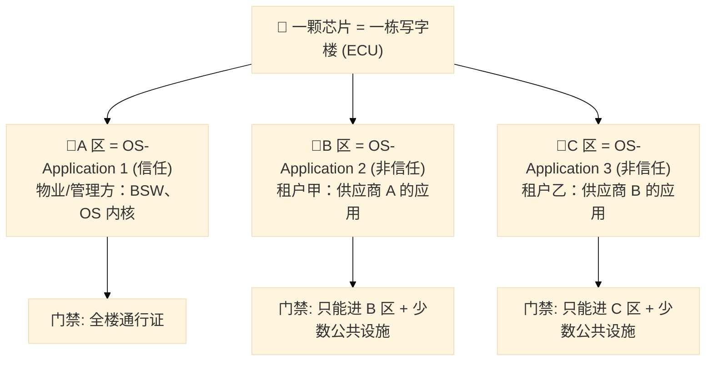

**图释**：整栋楼（ECU）里有多个"区域"（OS-Application）。物业（信任应用）能去任何地方；两家租户（非信任应用）各有门禁，只能在自己的区域活动，**路过对方区域就会触发报警（保护钩子）**。某一家失火（崩溃），物业可以"只封那一层"（终止该应用并重启），**不影响其他租户和整栋楼**。

这解决了汽车电子最现实的问题：**多个供应商的软件模块集成到同一颗芯片**，既要共享 CPU，又不能互相"踩脚"。

---

## 二、设计动机与背景：为什么需要 OS-Application

### ① 通俗理解

以前一个 ECU 只装一家软件，出问题只怪一家。现在为了降本，把好几家的软件塞进一颗芯片——**出了事怎么分清责任？怎么不让一家把整车搞瘫？** OS-Application 就是答案：**各管各家，隔离运行**。

### ② 设计机制与思路

| 驱动力 | 问题 | OS-Application 的解法 |
|--------|------|----------------------|
| **多供应商集成** | 车身、动力、座舱不同供应商代码混在一起 | 用"应用"为单位隔离，谁出错只影响谁 |
| **功能安全（ISO 26262）** | 故障必须可被隔离、可被论证 | 内存/时序/服务三级保护 + 分级响应策略 |
| **ECU 整合（硬件降本）** | 把多颗芯片合并成一颗 | 用"逻辑隔离"替代"物理隔离" |

核心思想一句话：**从"整机 fail-stop"进化到"局部 fail-isolate 后再恢复"**。

### ③ 深入原理：历史来源

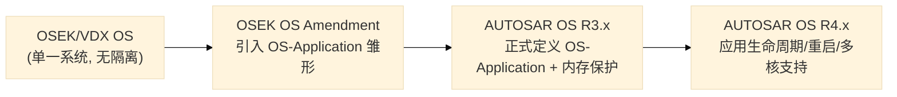

早期车用 RTOS（OSEK）把所有代码当作"一个大系统"，任何模块出错都可能带崩整机。汽车电子升级到"多 ECU 整合 + 多供应商"后，**隔离需求**出现——OSEK Amendment 首提"OS-Application"，AUTOSAR 把它正规化并扩展出**信任边界、内存保护、应用级重启、多核**。

---

## 三、核心概念：对象、归属与访问权限

### ① 通俗理解

OS-Application 是"**一套房间加一张权限表**"。房间里有家具（任务、报警、资源……），权限表写着"这套房的人能用哪些公共设施（OsAccess）"。

### ② 设计机制与思路

> **OS-Application**：一组 **OS 对象**（任务、ISR、资源、事件、计数器、报警、调度表、自旋锁）的集合，加上对这些对象的访问权限，形成一个**独立保护域（protection domain）**。

每个 OS-Application 在编译期静态定义，拥有：
1. **唯一 ID**（`OsApplicationIdType`）；
2. **归属的对象集合**（`OsApplicationRef` 把每个对象挂到某个应用下）；
3. **类型**：TRUSTED 或 NON-TRUSTED；
4. **重启策略**（能否 Restart、是否触发 OS 关闭）；
5. **可访问的其他对象列表**（`OsAccess`）。

**核心原则：默认隔离，按需授权（default deny, explicit allow）**。

### ③ 深入原理：对象归属关系

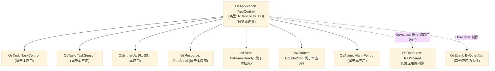

**图释**：实线 = 该应用**拥有**的对象；虚线 = 通过 `OsAccess` **被授权访问**的别的应用的对象。

**可归属对象一览：**

| 对象类型 | 归属含义 | 关键点 |
|----------|----------|--------|
| Task | 该应用的任务 | 任务的优先级、调度都在应用内有效 |
| ISR | 该应用的中断 | Cat2 ISR 的 OS 服务权限受应用约束 |
| Resource | 该应用的资源 | 资源天花板计算在应用内做 |
| Event | 该应用的事件 | 事件位属于该应用的 Extended Task |
| Counter / Alarm | 该应用的时间对象 | 报警动作只能触达本应用/授权对象 |
| Schedule Table | 该应用的调度表 | 到期动作同上 |
| Spinlock | 该应用的自旋锁 | 多核互斥对象也受保护 |

> **设计机制/思路**：这种"**对象 + 归属 + 访问矩阵**"的模型，把"谁能访问什么"从代码里**外置成配置数据**——OS 在运行时每次服务调用都可对照配置做 **O(1) 级查表校验**，无需信任业务代码。

---

## 四、Trusted / Non-Trusted 与特权级别

### ① 通俗理解

信任应用像"**内部员工**"，门禁卡全楼通用，进出不用登记；非信任应用像"**访客**"，每次进核心区都要在前台登记（系统调用 SVC）并查验身份。

### ② 设计机制与思路

**最小权限（Principle of Least Privilege）**：绝大多数代码运行在用户模式（非特权），只有少数"可信核心"运行在特权模式；特权入口（SVC / TrustedFunction）越少，攻击面和故障面越小。这是"性能与安全"的权衡：信任代码追求极低延迟，非信任代码付出一点系统调用开销换取隔离。

### ③ 深入原理：两类应用对比与系统调用路径

**两类应用对比：**

| 对比项 | 信任应用（Trusted） | 非信任应用（Non-Trusted） |
|--------|--------------------|---------------------------|
| 运行模式（Cortex-M） | 特权模式（PRIV） | 用户模式（nPRIV） |
| 调用 OS 服务 | 直接函数调用 | 必须通过 **SVC 系统调用** |
| OS 服务参数校验 | 不校验（信任） | 逐个校验（服务ID + 参数 + 归属） |
| 内存访问 | 全地址空间（受自身 MPU 配置约束） | 仅限配置给它的 MPU 区域 |
| 硬件寄存器访问 | 可直接访问 | 受 MPU 限制，越界即异常 |
| 典型承载 | BSW 模块、OS 自身、功能安全核心 | 第三方供应商应用 |
| 配置 | `OsApplicationType = TRUSTED` | `OsApplicationType = NON-TRUSTED` |

**系统调用路径：**

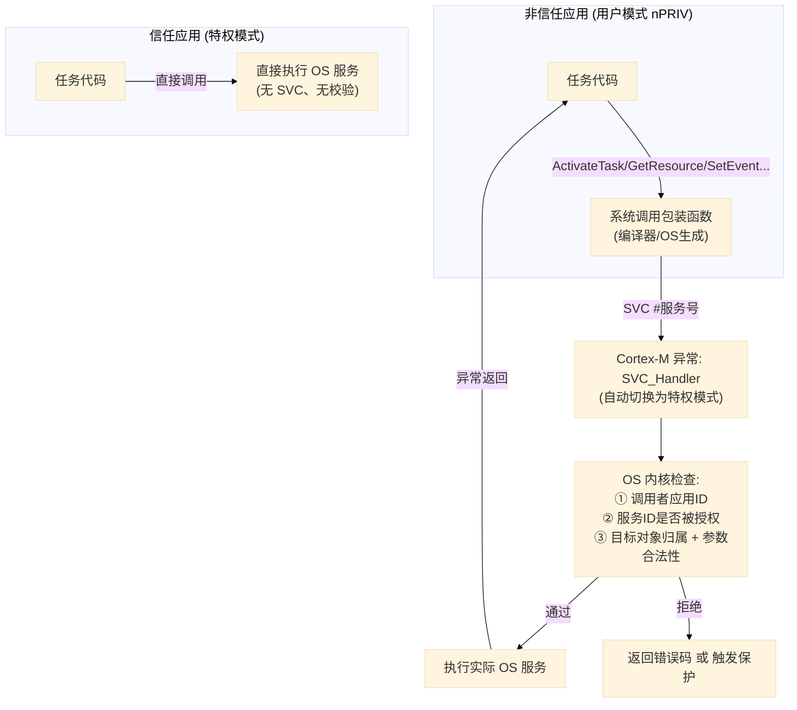

**图释**：非信任任务每次 OS 调用都要"走门卫"（SVC → 校验 → 执行 → 返回）；信任任务直接走内部门。

**OsTrustedFunction（信任函数）：** 非信任应用需要执行一小段特权代码时，把该函数配置为"信任函数"，OS 调用时**短暂切换到特权模式**，结束后切回——"按需提升特权"的最小化机制。

---

## 五、内存保护（Memory Protection）

### ① 通俗理解

内存保护是"**给每个租户画的隔离墙**"。硬件（MPU）保证：A 租户只能碰自己房间的东西，去碰 B 租户或物业的东西，CPU 当场报警（MemManage 异常），OS 接管处理。

### ② 设计机制与思路

Cortex-M 的 **MPU（Memory Protection Unit）** 支持若干**内存区域（Region）**，每个区域定义基地址、大小、访问权限（特权/用户读/写/执行）。非信任应用运行期间，MPU 只开放它自己的区域。任务切换时若切换到不同应用，**OS 要重配 MPU 分区**——这是 OS-Application 隔离的硬件保障核心。

**为什么用 MPU 而不用 MMU？** MPU 无地址转换、无命中开销，天然适合对实时性敏感、地址空间固定（无虚拟内存）的车控场景；代价是区域数量有限、粒度较大，但恰好够车控软件的静态分区需求。

### ③ 深入原理：分区布局与切换

**典型内存分区布局：**

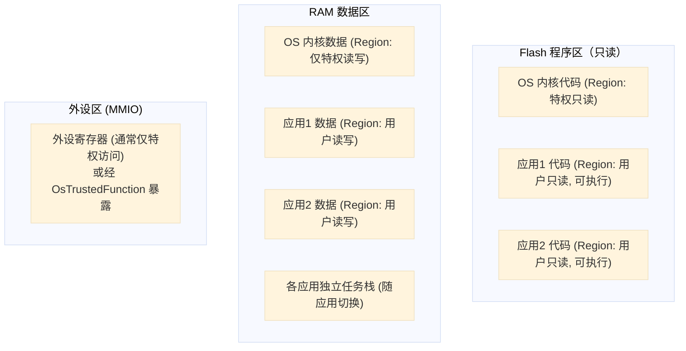

**图释**：编译期由链接脚本把各应用代码/数据**分区放置**（如 `App1_data` 段），配置期把段起止地址填给 MPU region。这样**应用 1 越界读应用 2 或内核数据，CPU 立即触发异常**。

**任务切换时的 MPU 重配：**

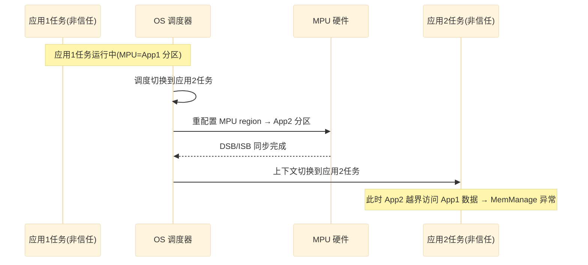

---

## 六、服务保护与访问控制

### ① 通俗理解

服务保护是"**进门查三道岗**"：访客进门要查 ① 有没有这家店的会员（服务 ID 授权）② 要去的地方是不是允许去的（对象归属）③ 手里拿的是不是合规物品（参数合法性）。三道都过才放行。

### ② 设计机制与思路

校验成本原则是"**调用方越不受信任，越要花成本自证**"：信任调用零校验，非信任调用每次校验。前两层在 SVC 异常入口立即完成（O(1)），第三层视具体服务而定。运行期还可通过 `AllowAccess` **临时授权**，配合调度表实现"时段性访问"。

### ③ 深入原理：三层校验流程

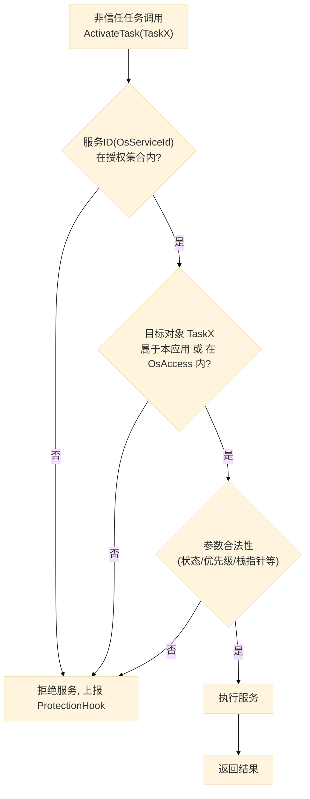

**图释**：**服务 ID → 对象归属 → 参数**三层递进校验。前两层在 SVC 入口立即完成，第三层视服务而定。

---

## 七、生命周期：状态机与管理 API

### ① 通俗理解

应用像"**一家门店**"：开业（Start）、营业中（Run）、出事关门整改（Invalid/Restarting）、永久停业（Terminated）。OS 全程盯着状态，按规则处置。

### ② 设计机制与思路

状态机 + Hook 构成"**故障处理状态机**"。把"如何响应故障"从 OS 内核抽离到 `ProtectionHook`/`TerminationHook`（集成者实现），OS 只提供"状态转移 + 资源清理"机制——**策略与机制分离**。生产车型可按安全策略配置成"终止→重启"或"终止→整机停机"。

### ③ 深入原理：状态机、状态表与管理 API

**OS-Application 状态机：**

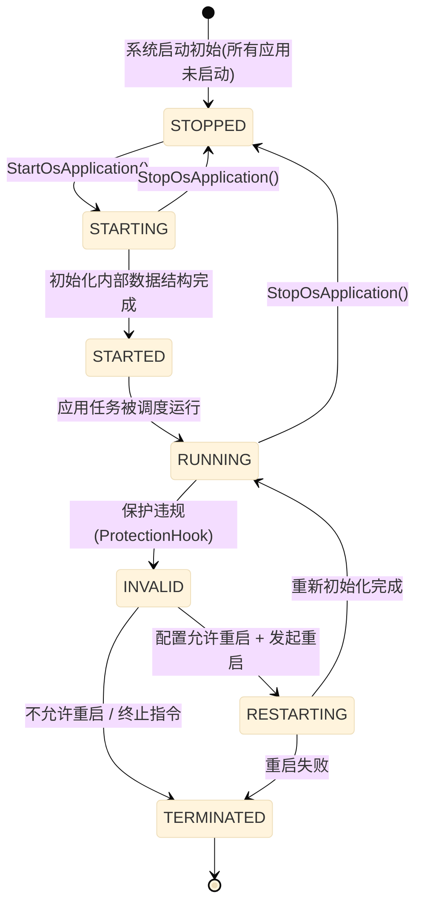

**状态含义：**

| 状态 | 含义 |
|------|------|
| `STOPPED` | 应用未启动，其任务不参与调度 |
| `STARTING` | 正在初始化（创建上下文、准备 MPU 分区） |
| `STARTED` | 初始化完成，等待进入可调度 |
| `RUNNING` | 正常运行，任务可被调度 |
| `RESTARTING` | 因保护违规正在重启 |
| `INVALID` | 发生保护违规，等待处理 |
| `TERMINATED` | 被终止（将调用 TerminationHook，随后按策略重启或关闭 OS） |

**管理 API：**

| API | 功能 |
|-----|------|
| `StartOsApplication(AppId)` | 启动一个应用（非信任） |
| `StartTrustedOsApplication(AppId)` | 以信任方式启动/重启一个应用 |
| `StopOsApplication(AppId)` | 停止一个应用 |
| `GetApplicationID(&Ref)` | 查询当前任务的归属应用 |
| `AllowAccess(AppId, ObjectId, AccessType)` | 运行期动态授权 |
| `GetApplicationMode(void)` | 查询当前应用模式（注意：与 OS-Application 是两个概念） |

**生命周期时序（启动 → 保护违规 → 重启）：**

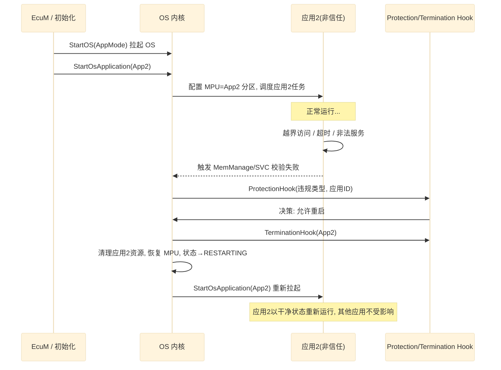

**图释**：这是 OS-Application 的价值高潮——**一个应用崩溃后能被隔离并重启，其他应用（尤其安全关键应用）继续运行**。

---

## 八、保护违规处理与保护策略

### ① 通俗理解

不同的"灾情"处理级别不同：走廊里有个小纸团（轻微违规）——记录一下即可；某个房间起火（严重违规）——封掉这层（终止应用）或整栋疏散（关闭 OS）。**策略由安全工程师配置决定**。

### ② 设计机制与思路

保护不是"一刀切杀死系统"，而是**可配置分级响应**——生产阶段按 ISO 26262 要求"错误应对策略"（fail-operational 或 fail-safe），是"错误响应策略"的实现载体。

### ③ 深入原理：保护类型与分级策略

**三类保护及违规类型：**

| 保护类型 | 触发条件 | 典型违规 |
|----------|----------|----------|
| **内存保护** | MPU MemManage 异常 | 越界读/写、访问无权限区域 |
| **时序保护** | 任务执行时间超预算、中断封锁超时 | 死循环、长时间关中断 |
| **服务保护** | SVC 校验失败 | 调用无权访问的对象、非法参数 |

**分级响应策略：**

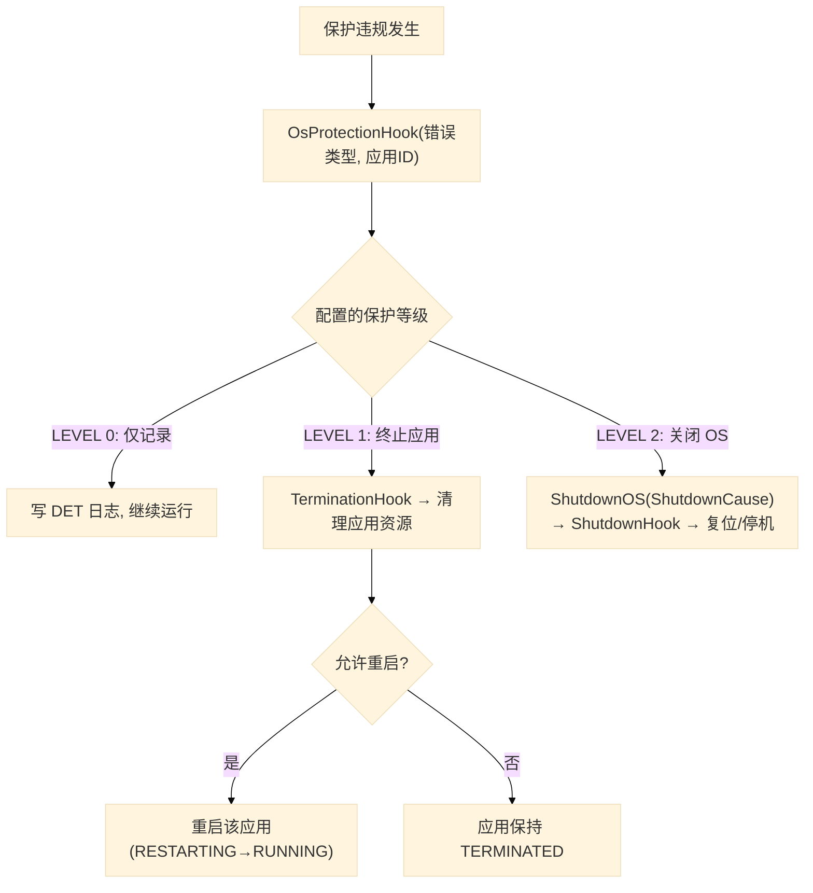

**图释**：同样一次越界，不同车型可配置成不同后果——**娱乐功能**可"仅记录"，**安全关键**的转向/制动必须"终止并降级/停机"。

---

## 九、多核下的 OS-Application

### ① 通俗理解

多核就是把"一栋楼变成两栋楼"：每栋有自己的物业（调度器），但住户（应用）可以跨楼串门（IOC 通信），公共设施（共享外设）加把公共锁（Spinlock）。

### ② 设计机制与思路

把"**隔离**"与"**核**"两个维度**正交化**：应用隔离（OS-Application）解决"信任/安全"，核分配解决"性能/并行"。二者通过 IOC/Spinlock 桥接，形成**多核多应用安全并行**的统一模型。

### ③ 深入原理：多核分布

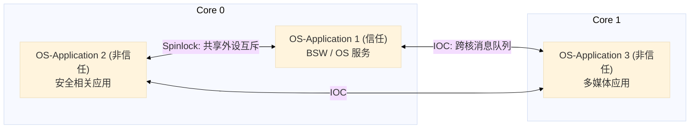

- 每个核有**独立调度器**；一个 OS-Application 的**对象可以分布在多个核**，但单个任务/ISR 只属于一个核；
- 跨应用、跨核通信由 **IOC（Inter-OS-Application Communication）** 完成（RTE 多核通信底层就是 IOC）；
- 跨核互斥用 **Spinlock**（忙等），且持锁期间禁止阻塞型调用。

---

## 十、OS-Application 与 RTE 的关系

### ① 通俗理解

RTE 是"**房产中介**"：把 SWC（软件组件）这套"家具"布置到 OS-Application 这套"房子"里。中介管布置，物业（OS）管隔离。

### ② 设计机制与思路

RTE 把"应用怎么通信"抽象化，OS-Application 把"怎么隔离"具体化——**RTE 管语义，OS 管执行与安全**。SWC 开发者只写业务逻辑，不知道 MPU/SVC 的存在。

### ③ 深入原理：RTE Partition ↔ OS-Application 映射

在 AUTOSAR 架构中，RTE 的 **Partition（分区）** 概念与 OS-Application **一一对应**：

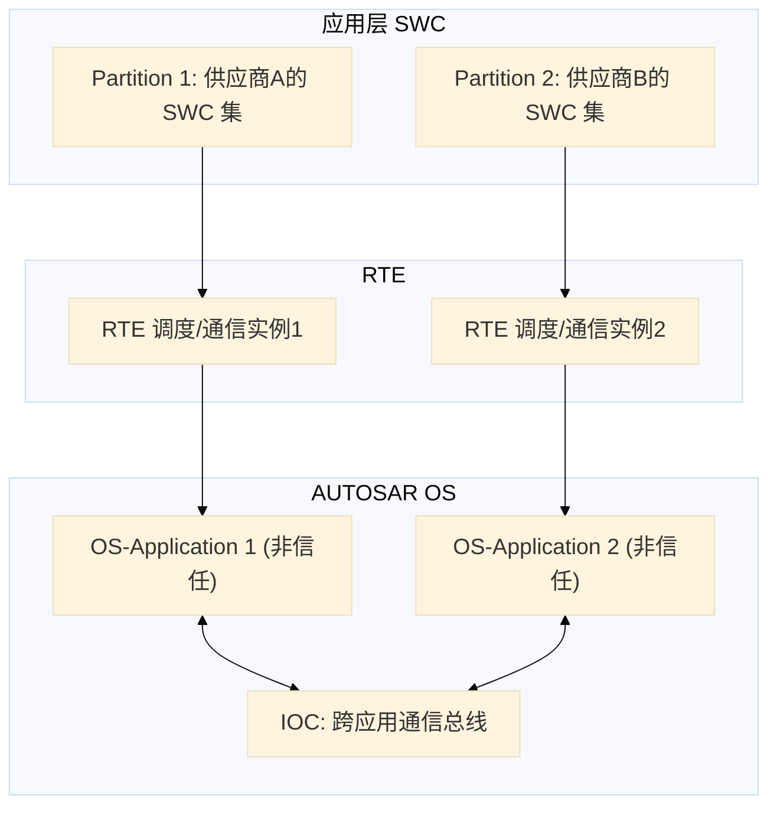

**要点**：
1. **RTE Partition = OS-Application**：每个 Partition 编译成一个 OS-Application，SWC 的 Runnable 被映射到该应用的任务上；
2. **跨 Partition 的 SWC 通信**：RTE 走 **IOC**（消息队列/缓冲），由 OS 提供，天然带保护；
3. **数据一致性**：RTE 生成的访问代码会在跨分区通信处自动加上 OS 资源/自旋锁，开发者无感。

---

## 十一、配置体系（.arxml / OsApplication）

### ① 通俗理解

不用写一行代码，在配置工具里"**填表**"：告诉工具"哪些任务属于哪个应用、这个应用是信任还是非信任、能访问哪些共享资源"，工具就生成整套隔离代码。

### ② 设计机制与思路

隔离边界**不是写在代码里**（那会散落各处、难以审计），而是**集中在 arxml 配置**里——安全工程师只需审查配置，就能论证"谁可以访问什么"，这就是"安全可论证性（safety argument）"。

### ③ 深入原理：配置示意与生成物

```
OsApplication "AppControl":
    OsApplicationType        = NON-TRUSTED
    OsApplicationRestart     = RESTART          # 允许保护后重启
    OsApplicationCoreRef     = Core0            # 归属核
    OsApplicationTermination = TERMINATE        # 终止后行为

    OsAccess:                                    # 授权访问的外部对象
        - OsResourceRef: "ResShared"
        - OsCounterRef:  "CounterSW"
        - OsEventRef:    "EvSignalFromApp3"

    OsTaskRef:   TaskControl, TaskSensor        # 归属的任务
    OsIsrRef:    IsrUartRx                       # 归属的中断
    OsAlarmRef:  AlarmPeriod                     # 归属的报警
    OsScheduleTableRef: SchedTable10ms
```

配置工具（Vector Tresos / ETAS ISOLAR / EB tresos）据此生成：
- 每个应用的 ID 枚举、对象到应用的映射表；
- SVC 服务号与校验跳转表；
- 内存保护分区初始化代码（见下一节）；
- Hook 函数签名与开关宏。

---

## 十二、AUTOSAR 层面的实现：配置驱动的保护机制

### ① 通俗理解

在 AUTOSAR 里，"内存保护"不是让你去写硬件寄存器，而是**在配置里把"格子"画好**，由 OS 生成的代码自动把格子"落实"到硬件保护单元上。你要做的只是配置，剩下的由 OS 与 MCAL 分工完成。

### ② 设计机制与思路

实现分三层：**配置层（arxml 定义分区）→ OS 层（生成代码 + 服务保护 + 保护钩子）→ MCAL 层（真正写硬件保护寄存器）**。OS 层不直接碰厂商寄存器，而是调用 MCAL 抽象接口——这就是 AUTOSAR"分层分责 + 配置驱动"的体现。

### ③ 深入原理：AUTOSAR 相关代码

以下代码为 **AUTOSAR OS 层面的实现**（概念性，参考商用实现风格），全部为 AUTOSAR 相关。

#### (a) 内存保护分区表（配置工具生成）

```c
/* ============ AUTOSAR OS: 内存保护分区表(配置工具从 arxml 生成) ============ */
#include "Os.h"

/* 每个内存分区的属性: 由 OsMemoryAccess 配置生成 */
typedef struct
{
    uint32 BaseAddress;      /* 分区基地址(链接脚本导出的段地址) */
    uint32 SizeLog2;         /* 分区大小 = 2^SizeLog2 字节 */
    uint8  AccessPerm;       /* 访问权限编码(映射到硬件保护单元) */
    uint8  CacheAttr;        /* TEX/Cacheable/Bufferable 组合 */
    uint8  XN;               /* Execute-Never: 1=禁止取指 */
} Os_MemoryRegionType;

/* 每个 OS-Application 的 MPU 分区表: 静态常量, 编译期确定 */
static const Os_MemoryRegionType Os_AppMemRegions[OS_APP_CNT][OS_REGION_CNT_MAX] =
{
    /* [OsApp_OS] 信任应用: 内核代码(只读可执行) + 内核数据(仅特权) */
    { { (uint32)&OsCodeStart,    16u, OS_AP_RO_PRIV, OS_CACHE_DEF, 0u },
      { (uint32)&OsKernelDataStart, 13u, OS_AP_RW_PRIV, OS_CACHE_DEF, 0u } },

    /* [OsApp_1] 非信任应用: 数据(用户可读写) + 代码(用户只读) */
    { { (uint32)&App1DataStart,  12u, OS_AP_RW_USER,  OS_CACHE_DEF, 0u },
      { (uint32)&App1CodeStart,  14u, OS_AP_RO_USER,  OS_CACHE_DEF, 0u } },

    /* [OsApp_2] 非信任应用: 数据 + 代码 */
    { { (uint32)&App2DataStart,  12u, OS_AP_RW_USER,  OS_CACHE_DEF, 0u },
      { (uint32)&App2CodeStart,  14u, OS_AP_RO_USER,  OS_CACHE_DEF, 0u } }
};
```

#### (b) 应用启动时的分区下发（OS 层，调用 MCAL 抽象接口）

```c
/* ============ AUTOSAR OS: 应用启动时下发内存保护分区(概念性) ============ */

/* MCAL 抽象接口: 由各芯片的 MCAL 驱动实现, OS 不关心具体寄存器 */
extern void Mcal_Mpu_ConfigureRegion(uint8 region,
                                     uint32 baseAddr, uint32 sizeLog2,
                                     uint8 accessPerm, uint8 cacheAttr, uint8 xn);
extern void Mcal_Mpu_Enable(uint8 privDefena);
extern void Mcal_Mpu_Disable(void);

/* 启动/切换到一个 OS-Application 时, 配置该应用的分区 */
void Os_AppInitMemoryProtection(OsApplicationIdType appId)
{
    uint8 i;

    Mcal_Mpu_Disable();                    /* 配置期间先关保护, 防止中间态误伤 */
    for (i = 0u; i < OS_REGION_CNT_MAX; i++)
    {
        const Os_MemoryRegionType *reg = &Os_AppMemRegions[appId][i];
        if (reg->SizeLog2 == 0u) { break; }      /* 空条目 = 表结束 */
        Mcal_Mpu_ConfigureRegion(i, reg->BaseAddress, reg->SizeLog2,
                                 reg->AccessPerm, reg->CacheAttr, reg->XN);
    }
    Mcal_Mpu_Enable(OS_PRIVDEFENA_ON);     /* 打开保护: 默认区域仅特权可访问 */
}

/* 任务切换时, 若新任务属于不同应用, 先切换保护分区再恢复上下文 */
void Os_SwitchToApplication(OsApplicationIdType nextApp)
{
    if (nextApp != Os_CurrentAppId())
    {
        Os_AppInitMemoryProtection(nextApp);   /* 重配 MPU → 新应用分区 */
    }
    /* 继续执行上下文切换(见《OS 架构与模块概述》第九节) */
}
```

#### (c) 服务保护：SVC 系统调用分发（OS 内核，概念性）

```c
/* ============ AUTOSAR OS: SVC 系统调用分发与校验(概念性) ============ */

/* SVC 服务号: 由配置工具生成, 每个 OS 服务一个编号 */
#define OS_SVC_ACTIVATETASK   1u
#define OS_SVC_SETEVENT       4u
#define OS_SVC_GETRESOURCE    7u

/* 服务校验结果 */
#define OS_SVC_ACCEPT         0u
#define OS_SVC_REJECT         1u

/* 校验调用者是否有权调用该服务 */
static uint8 Os_CheckServiceAccess(OsApplicationIdType caller, uint8 svcNum)
{
    /* 查询配置生成的"应用→服务授权"位图, O(1) 查表 */
    return (Os_AppServiceAccess[caller] & (1u << svcNum)) ? OS_SVC_ACCEPT
                                                          : OS_SVC_REJECT;
}

/* SVC 异常入口: 硬件已切换为特权模式 */
void Os_Svc_Dispatch(uint8 svcNum, const uint32 *args)
{
    OsApplicationIdType caller = Os_GetCallingApplication();  /* 调用者应用 */
    uint8 status = OS_SVC_ACCEPT;

    /* ① 服务 ID 授权检查 */
    status = Os_CheckServiceAccess(caller, svcNum);

    /* ② 目标对象归属检查(仅非信任调用需要) */
    if ((status == OS_SVC_ACCEPT) && (Os_IsTrustedApp(caller) == FALSE))
    {
        status = Os_CheckObjectAccess(caller, svcNum, args);
    }

    if (status == OS_SVC_ACCEPT)
    {
        Os_SvcDispatchTable[svcNum](args);   /* 跳转表: 执行实际服务 */
    }
    else
    {
        Os_ReportProtectionError(OS_PROTECTION_SERVICE, (uint32)caller);
    }
}
```

#### (d) 保护钩子处理（集成者实现）

```c
/* ============ AUTOSAR OS: 保护钩子(集成者实现) ============ */
#include "Os.h"

/* ProtectionHook: 保护违规统一入口(由集成者实现) */
ProtectionReturnType ProtectionHook(StatusType Error, uint32 Fatal_Error)
{
    /* Fatal_Error 的低字节含违规应用的 ID, 便于定位 */
    OsApplicationIdType errApp = (OsApplicationIdType)(Fatal_Error & 0xFFu);

    /* 记录故障到 DET / 故障诊断 */
    Det_ReportRuntimeError(0u, (uint8)Error, (uint8)errApp);

    /* 策略: 安全相关应用 → 终止并重启; 娱乐应用 → 仅记录 */
    if (errApp == OS_APP_ID_SAFETY)
    {
        return PRO_TERMINATEAPPLICATIONRESTART;  /* 终止 + 重启该应用 */
    }
    return PRO_IGNORE;                          /* 仅记录, 继续运行 */
}

/* TerminationHook: 应用被终止前回调(集成者实现) */
void TerminationHook(OsApplicationIdType AppId)
{
    /* 清理应用相关外部资源(看门狗喂狗策略、故障标志等) */
    (void)AppId;
}
```

> 说明：底层真正写 MPU 寄存器的工作在 **MCAL 层**（`Mcal_Mpu_*` 的实现）完成，与芯片相关，本处按 AUTOSAR 分层原则不展开厂商代码。

---

## 十三、总结与设计思想

**OS-Application 的本质是"把安全策略数据化、把隔离机制硬件化"**。它贯穿以下设计思想：

| 设计思想 | 在本机制中的体现 |
|----------|-----------------|
| **最小权限** | 非信任代码跑用户模式，特权只给信任核心，特权入口（SVC/TrustedFunction）最小化 |
| **默认拒绝，按需授权** | OsAccess 显式列出可访问对象，配置期决定一切 |
| **策略与机制分离** | OS 提供状态机/资源清理机制，ProtectionHook 决策如何响应 |
| **故障隔离与恢复** | 单应用崩溃 → 终止 → 重启，不影响安全关键应用 |
| **配置即架构** | 隔离边界收敛在 arxml，可审计、可论证（ISO 26262） |
| **多核正交扩展** | 应用隔离（信任维度）与核分配（性能维度）解耦，IOC/Spinlock 桥接 |

**一句话总结**：OS-Application = **对象分组（归属）+ 权限模型（Trusted/Non-Trusted + OsAccess）+ 硬件隔离（MPU）+ 生命周期管理（状态机/重启）+ 分级故障响应（Hook）** 的组合，是 AUTOSAR OS 面向"多供应商安全集成"设计的核心抽象。

---

## 参考与延伸

- AUTOSAR 规范：`SWS_OS`（OS-Application、OsAccess、Protection、生命周期章节）
- 历史：`OSEK/VDX OS Amendment`（OS-Application 概念起源）
- 相关专题：内存保护（MPU 细节）、时序保护、IOC 跨应用通信、RTE Partition 与调度
