# AUTOSAR OS 架构与模块整体概述

> 本文档是 AUTOSAR OS 的**全局导览**，回答"AUTOSAR OS 是什么、由哪些模块组成、各部分如何协作、底层怎么实现"。
> 讲解采用**逐点由浅入深**的结构：先整体通俗理解，再对每个原理/概念按 **① 通俗理解 → ② 设计机制与思路 → ③ 深入原理** 三层展开。
> 涉 AUTOSAR 的内容，代码一律为 **AUTOSAR 相关**（Os API、配置生成代码、OS 数据结构），不出现任何 STM32/厂商代码。
>
> 📐 **关于图例**：本文件所有 Mermaid 图均以 `%%{init: ...}%%` 开头，用于**放大渲染**（字体 19px、节点间距 55~65、序列图角色/消息间距加大），确保图在 Obsidian 中"大而清晰"。若需进一步缩放，可在 Obsidian 中按住 `Ctrl` 滚轮，或用 CSS `#app-container svg { transform: scale(...) }` 全局放大。

## 目录

- [一、通俗理解：AUTOSAR OS 是什么](#一通俗理解autosar-os-是什么)
- [二、AUTOSAR OS 在整车软件架构中的位置](#二autosar-os-在整车软件架构中的位置)
- [三、从 OSEK/VDX 到 AUTOSAR OS：演进与扩展](#三从-osekvdx-到-autosar-os演进与扩展)
- [四、AUTOSAR OS 整体架构与模块组成](#四autosar-os-整体架构与模块组成)
- [五、核心机制与模块详解](#五核心机制与模块详解)
  - [5.1 任务管理（Task Management）](#51-任务管理task-management)
  - [5.2 调度器（Scheduling）](#52-调度器scheduling)
  - [5.3 中断管理（Interrupt Management）](#53-中断管理interrupt-management)
  - [5.4 资源管理（Resource Management）](#54-资源管理resource-management)
  - [5.5 事件机制（Event）](#55-事件机制event)
  - [5.6 计数器与报警（Counter & Alarm）](#56-计数器与报警counter--alarm)
  - [5.7 调度表（Schedule Table）](#57-调度表schedule-table)
  - [5.8 多核支持：自旋锁与 IOC](#58-多核支持自旋锁与-ioc)
  - [5.9 OS-Application（OS 应用）](#59-os-applicationos-应用)
  - [5.10 保护机制：内存 / 时序 / 服务](#510-保护机制内存--时序--服务)
  - [5.11 错误处理与 Hook](#511-错误处理与-hook)
  - [5.12 启动与关闭](#512-启动与关闭)
- [六、OS 与 RTE 的关系](#六os-与-rte-的关系)
- [七、AUTOSAR OS 配置体系（.arxml / Os 模块）](#七autosar-os-配置体系arxml--os-模块)
- [八、AUTOSAR OS API 一览表](#八autosar-os-api-一览表)
- [九、底层实现原理剖析：任务切换](#九底层实现原理剖析任务切换)
- [十、设计模式与思想总结](#十设计模式与思想总结)
- [参考与延伸](#参考与延伸)

---

## 一、通俗理解：AUTOSAR OS 是什么

把汽车的电子控制单元（ECU）想象成一台"小车载电脑"，AUTOSAR OS 就是这台电脑的**操作系统内核**——它像"交通警察"一样负责：

1. **谁先运行**：多个任务同时就绪时，决定谁上 CPU（**调度**）；
2. **什么时候切换**：定时中断来了，把正在运行的任务暂停，换另一个任务跑（**上下文切换**）；
3. **保护现场**：任务临时停下来时，把它的寄存器、堆栈保存好，回头接着跑（**任务切换**）；
4. **管好临界资源**：多个任务都要用一个串口/共享变量时，防止互相踩踏（**资源/互斥**）；
5. **定时触发**：到点执行某段代码，类似闹钟（**Counter/Alarm**）；
6. **隔离安全**：把不同厂商的应用代码隔离，一个崩溃不能连累整车（**内存保护/时序保护**）。

一句话：**AUTOSAR OS = 专门为车规级实时控制量身定制的 RTOS 内核**。它的每一个设计都在追求"**确定性（Determinism）**"和"**安全性（Safety）**"——因为汽车上跑的是安全相关功能（刹车、转向、动力），不允许出现"偶尔卡一下"。

---

## 二、AUTOSAR OS 在整车软件架构中的位置

### ① 通俗理解

AUTOSAR 软件是"叠罗汉"结构：应用在最上面，下面是连接应用的"桥梁"（RTE），再下面是各种基础服务，最下面贴着硬件。**AUTOSAR OS 就住在"基础服务"这一层**——它不直接跟业务打交道，而是给上层提供"跑任务、管中断、定时"这些底层能力。

### ② 设计机制与思路

把 OS 放在**中间偏下**的位置是刻意的：它必须**离硬件近**（才能管中断、管核、做任务切换），又要通过**标准 API 向上服务**（才能让 RTE 之上的应用与 OS 无关）。这样分层后，应用层、中间件、内核三层可独立演进与复用。

### ③ 深入原理：分层架构与上下边界

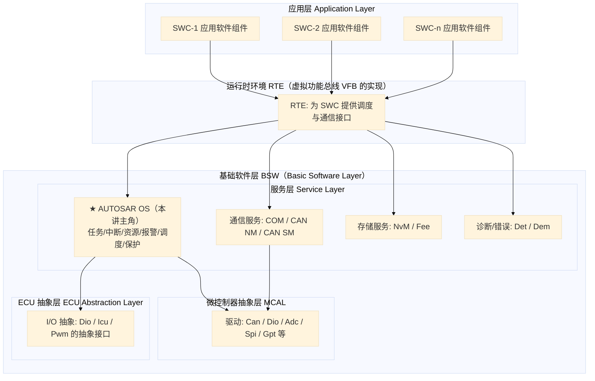

**图释**：AUTOSAR Classic Platform 是四层结构：**应用层（SWC）→ RTE → BSW → MCAL**。BSW 内部分服务层、ECU 抽象层、MCAL 三层，**AUTOSAR OS 位于服务层**，是 RTE 的"地基"。

**OS 的上下边界：**

| 方向 | 谁调用它 | 干什么 |
|------|----------|--------|
| **上方** | RTE 层 | RTE 通过 `Rte_Schedule_*`、`Rte_Call` 等触发 OS 的调度、任务激活、事件设置 |
| **下方** | MCAL / 微控制器 | OS 直接操作 MCU 资源（定时器、中断控制器、内存保护单元），产生 tick 中断、做任务切换 |
| **平行** | 其他 BSW 模块 | 如 Gpt 可给 OS 提供计数器源；EcuM 负责调用 `StartOS()` 拉起 OS |

---

## 三、从 OSEK/VDX 到 AUTOSAR OS：演进与扩展

### ① 通俗理解

AUTOSAR OS 不是从零发明的——它"继承"了汽车行业的老牌规范 OSEK/VDX，再按现代需求"加料"：老规范管单核、无隔离，新需求要**多核**和**应用隔离**，所以不断打补丁升级。

### ② 设计机制与思路

选择"**继承并扩展**"而非"重写"，是为了让已有 OSEK 工程平滑迁移，同时引入汽车电子在"**功能安全（ISO 26262）**"和"**多核并行**"两方面最需要的增量。底层调度模型（静态优先级抢占）数学上可做响应时间分析，是安全的确定性基础。

### ③ 深入原理：演进脉络与扩展点

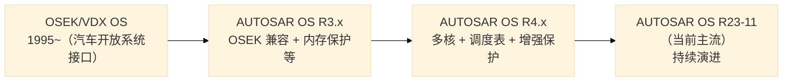

**关键扩展点对照表：**

| 能力 | OSEK/VDX OS | AUTOSAR OS 增加的能力 |
|------|-------------|----------------------|
| 调度 | 固定优先级抢占 | 增加调度表（Schedule Table）、混合调度配置 |
| 应用管理 | 单一大系统 | **OS-Application**（信任/非信任），以"应用"为单位做隔离 |
| 内存保护 | 无 | **MPU 内存保护**：非信任任务访问受限区域即触发保护 |
| 时序保护 | 无 | **Timing Protection**：限制任务执行时间、中断封锁时间等 |
| 多核 | 单核 | **多核支持**：Spinlock（自旋锁）、IOC（跨核通信） |
| 服务保护 | 无 | 非信任任务调用受保护 API 前的访问检查 |
| 错误处理 | 有 ErrorHook | 细分为 ProtectionHook / ErrorHook / StartupHook / ShutdownHook / PreTaskHook / PostTaskHook |

---

## 四、AUTOSAR OS 整体架构与模块组成

### ① 通俗理解

把 OS 想象成一个**工具箱**：调度器是"总指挥"，任务管理是"员工花名册"，中断管理是"电话接线员"，资源管理是"会议室预约"……每个工具只管一件事，互相配合。

### ② 设计机制与思路

AUTOSAR OS 用"**对象（Object）+ 服务（Service）+ 状态机**"统一建模：任务、资源、事件、报警都是**配置期生成的静态对象**，运行时通过**服务调用**操作它们。整个系统**在编译期就已完全确定**（无动态内存分配），这正是车规 RTOS 确定性（determinism）的来源。

### ③ 深入原理：模块组成与定位

```mermaid
%%{init: {'theme': 'base', 'themeVariables': {'fontSize': '19px'}, 'flowchart': {'nodeSpacing': 55, 'rankSpacing': 65, 'padding': 14}}}%%
graph TD
    OS["AUTOSAR OS 内核"]

    OS --> TM["任务管理 Task<br/>Basic / Extended Task"]
    OS --> SC["调度器 Scheduler<br/>优先级抢占 / 调度点"]
    OS --> IM["中断管理 ISR<br/>Category 1 / 2"]
    OS --> RM["资源管理 Resource<br/>PCP 优先级天花板协议"]
    OS --> EV["事件机制 Event<br/>仅 Extended Task 可用"]
    OS --> CT["计数器/报警 Counter / Alarm<br/>软件/硬件计数器"]
    OS --> ST["调度表 Schedule Table<br/>静态时分调度"]
    OS --> AP["OS-Application<br/>信任 / 非信任"]
    OS --> MC["多核支持<br/>Spinlock / IOC / 核间中断"]
    OS --> PR["保护机制<br/>内存 / 时序 / 服务"]
    OS --> HO["错误处理与 Hook<br/>Startup/Error/Protection..."]
    OS --> SU["启动与关闭<br/>StartOS / ShutdownOS"]
```

**各模块一句话定位：**

| 模块 | 核心职责 | 关键对象/API |
|------|----------|--------------|
| 任务管理 | 创建/激活/终止任务，维护状态机 | `OsTask`，`ActivateTask`、`TerminateTask`、`ChainTask` |
| 调度器 | 按静态优先级从就绪队列选任务 | `OsScheduler`、`Schedule`、`Preempt` |
| 中断管理 | 管理中断请求及延迟调用 | `OsIsr`，`EnableAllInterrupts`、`CallTerminateISR2` |
| 资源管理 | 临界区互斥 + 防优先级翻转 | `OsResource`，`GetResource`、`ReleaseResource` |
| 事件机制 | 任务间事件同步（置位/等待） | `OsEvent`，`SetEvent`、`WaitEvent`、`ClearEvent` |
| 计数器/报警 | 时间计数与定时触发 | `OsCounter`、`OsAlarm`，`SetRelAlarm`、`CancelAlarm` |
| 调度表 | 周期性的静态触发时刻表 | `OsScheduleTable`，`StartScheduleTableRel` |
| OS-Application | 把 OS 对象与资源归属到应用，做隔离边界 | `OsApplication`，`GetApplicationID` |
| 多核支持 | 跨核互斥与通信 | `OsSpinlock`、`IOC`、`GetCoreID` |
| 保护机制 | 内存/时序/服务访问控制 | `OsProtectionHook`、MPU 配置、`OsTaskTimeBudget` |
| 错误与 Hook | 各类异常的统一上报入口 | `ErrorHook`、`ProtectionHook`、`PreTaskHook` |
| 启动与关闭 | 系统生命周期管理 | `StartOS`、`ShutdownOS`、`OsStatus` |

---

## 五、核心机制与模块详解

> 本章对每个模块都按 **① 通俗理解 → ② 设计机制与思路 → ③ 深入原理** 三层展开。

### 5.1 任务管理（Task Management）

#### ① 通俗理解

任务是 OS 的"最小执行单位"，类似公司里的"员工"。有的员工**干完就下班**（Basic Task），有的员工**需要等通知再干活**（Extended Task）。OS 负责记录每个员工的状态：在岗（Running）、候命（Ready）、在等消息（Waiting）、下班（Suspended）。

#### ② 设计机制与思路

- 任务全部**编译期静态定义**（arxml 配置），不允许运行时创建/删除——保证系统行为可预测、可做响应时间分析；
- 区分 Basic / Extended：Extended 的"等待"能力以**更大栈开销**为代价，简单任务用 Basic 可**复用栈**，节省宝贵的 RAM；
- `ChainTask`（接力棒）先终止当前任务再激活下一个，避免两个任务同时运行。

#### ③ 深入原理：任务类型与状态机

| 类型 | 是否支持 WaitEvent | 典型用途 | 栈行为 |
|------|:---:|------|--------|
| **Basic Task**（基本任务） | ❌ | 纯计算、无阻塞逻辑 | 简单，可复用（使用共享栈时） |
| **Extended Task**（扩展任务） | ✅ | 需要等待事件/信号的任务 | 每个扩展任务通常独立栈 |

任务以 `OsTask` 形式静态定义：**静态优先级、调度类型（抢占/非抢占）、堆栈大小、入口函数、所属 OS-Application**。

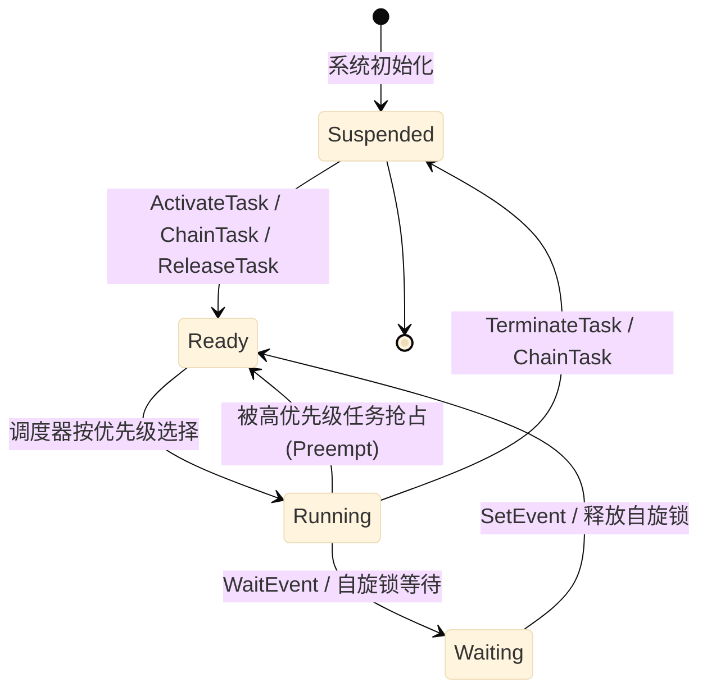

**图释**：四个状态 **Suspended（未激活）/ Ready（就绪）/ Running（运行）/ Waiting（等待）**。Basic Task 不进 Waiting；Extended Task 支持 Running→Waiting→Ready。

---

### 5.2 调度器（Scheduling）

#### ① 通俗理解

调度器是"总指挥"：多个任务都就绪时，它按**优先级**决定谁先跑。高优先级来了，正在跑的低优先级任务要"让路"（被抢占）。

#### ② 设计机制与思路

- 用**静态固定优先级调度**（FPS），因为它在数学上可做响应时间分析（RTA），符合 ISO 26262 的"确定性论证"；
- 采用**两级调度**：在中断里只做"标记"，真正的上下文切换推迟到中断退出后统一做。好处：中断响应最快、切换时无中断嵌套、栈状态简单。

#### ③ 深入原理：调度方式、决策流程与时序

**三种调度方式：**

| 调度方式 | 抢占 | 说明 |
|----------|:---:|------|
| **全抢占式（Full Preemptive）** | ✅ | 高优先级任务就绪 → 立即抢占，延迟最小 |
| **非抢占式（Non-Preemptive）** | ❌ | 任务运行到自愿终止，调度点只在任务结束 |
| **混合抢占式（Mixed Preemptive）** | 部分 | 每个任务单独配置；OSEK 限制资源持有期间的抢占 |

**调度决策流程：**

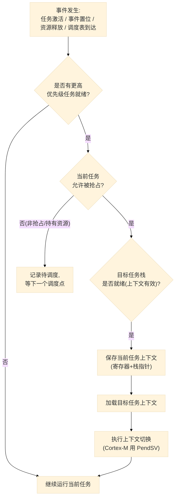

**图释**：调度本质是"**就绪集（Ready Set）中最优者**"的选择。OS 在任何**调度点**（任务激活、终止、事件置位、报警触发、资源释放等）评估是否切换。

**抢占调度时序：**

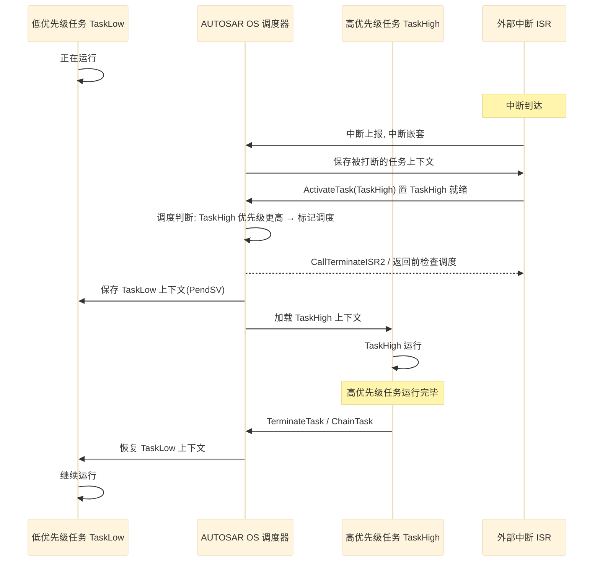

**图释**：这是"**中断 → 置位 → 抢占 → 恢复**"经典链路。关键是调度动作**延迟到中断退出时（PendSV）**执行，见第九节原理。

---

### 5.3 中断管理（Interrupt Management）

#### ① 通俗理解

中断就是"**电话铃**"：CPU 正在干活，外设打来电话说"数据到了"，CPU 接完电话再回去干活。OSEK/AUTOSAR 把电话分两类：**只接不用登记的**（Cat1）和**接完要通知 OS 的**（Cat2）。

#### ② 设计机制与思路

中断有**硬件优先级**，任务有**调度优先级**，是两套体系——所以**不能在中断里随便切任务**。Cat2 ISR 允许调用**有限且安全**的 OS 服务（如 `ActivateTask`、`SetEvent`），并在**退出时统一触发调度**，把任务切换安全地推迟到中断结束后。

#### ③ 深入原理：两类 ISR 与处理流程

| 类型 | 系统调用能力 | 说明 |
|------|--------------|------|
| **Category 1 ISR** | ❌ 不调用 OS 服务 | 极快、无 OS 介入，只做硬件应答+置标志 |
| **Category 2 ISR** | ✅ 可调用部分 OS 服务 | 进入/退出走 OS，可在退出时触发调度 |

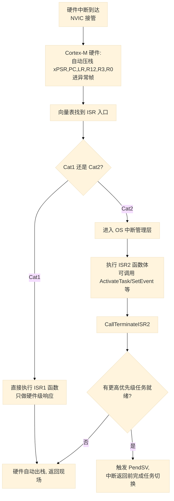

**图释**：Cat1 完全透明给 OS；Cat2 由 OS 包一层"壳"，**中断退出时就是天然的调度点**。

---

### 5.4 资源管理（Resource Management）

#### ① 通俗理解

资源就是"**共享的会议室**"。两个任务都要用同一个串口/共享变量时，必须"先预约、用完释放"。但有个坑：**低优先级任务占着会议室，中等优先级任务插队抢 CPU，结果最高优先级的任务反而被晾在外面**——这叫"优先级反转"。

#### ② 设计机制与思路

AUTOSAR 用 **PCP（优先级天花板协议）** 解决：每个资源绑定一个"天花板优先级"（所有使用者的最高优先级）。任务拿到资源时，OS **临时把它的优先级提到天花板**，中等优先级任务就插不进来，等待时间有了数学上界。关键约束：**禁止嵌套访问同一资源**、**持有资源期间任务自动变非抢占**。

#### ③ 深入原理：优先级反转与 PCP 流程

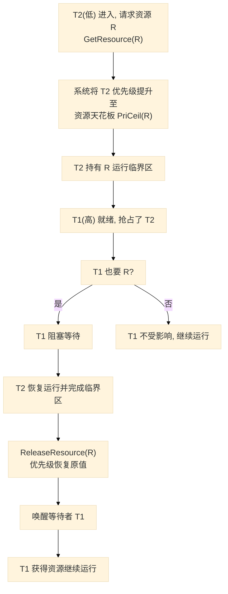

**图释**：T2 被提升到天花板（≥ T1 优先级）后，**中间优先级任务插不进来**，T1 的等待时间有上界，可做实时性分析。

> 与"关中断/关调度"临界区相比，PCP 粒度更细：**允许并发使用不冲突的资源**，只对冲突者串行化。

---

### 5.5 事件机制（Event）

#### ① 通俗理解

事件就是"**信号旗**"。一个任务等着别人"举旗"才继续干活。生产者举旗（SetEvent），消费者看到旗子（WaitEvent 返回）继续跑，看完把旗子放下（ClearEvent）。

#### ② 设计机制与思路

事件是"**任务间轻量级同步**"，比信号量更简单（无计数、无优先级继承），天然适配 OSEK 的静态模型。事件只能由**任务或 ISR** 操作，跨 OS-Application 置位受保护检查。

#### ③ 深入原理：事件时序

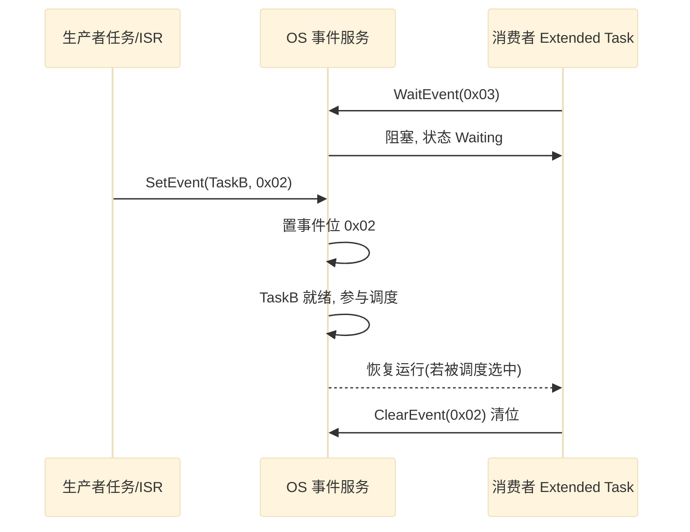

---

### 5.6 计数器与报警（Counter & Alarm）

#### ① 通俗理解

计数器是"**时钟**"，报警是"**闹钟**"。时钟每"滴答"一次，OS 检查有没有闹钟到点；到点了就触发闹钟动作：启动一个任务、置一个事件等。可以设"一次性闹钟"也可以设"循环闹钟"。

#### ② 设计机制与思路

报警机制把"时间触发"从任务代码中**解耦**出来：定时任务由配置驱动，不需要每个任务自己写轮询，符合 AUTOSAR"配置即代码"。与调度表配合可构建**纯时间触发**的控制调度。

#### ③ 深入原理：计数/报警流程

计数器分**硬件计数器**（基于 MCU Timer，精度高）与**软件计数器**（由低优先级源累加）。每个 counter 配置 TicksPerBase、MaxAllowedValue、MinCycle。

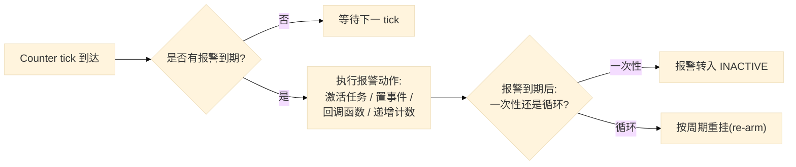

API：`SetRelAlarm(Alarm, increment, cycle)`（相对）、`SetAbsAlarm`（绝对）、`CancelAlarm`。

---

### 5.7 调度表（Schedule Table）

#### ① 通俗理解

调度表是一张"**列车时刻表**"：提前把"几点几分哪个任务启动"写死。OS 到点照表执行，像机械钟一样准。特别适合需要精确周期控制链（采样→控制→执行）的场景。

#### ② 设计机制与思路

调度表把"**调度蓝图**"以**数据**形式静态定义，运行时 OS 只做**查表触发**。优点：可离线验证时间轴、任务抖动极小、适合安全论证；与任务级抢占调度并存（混合范式）。

#### ③ 深入原理：调度表结构

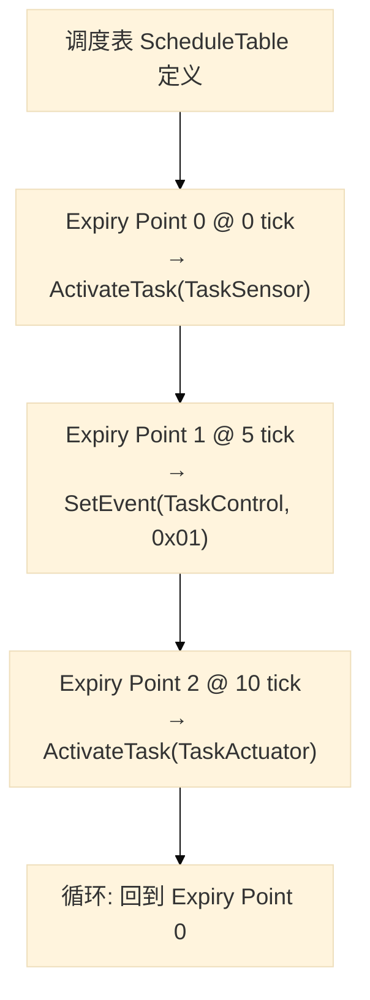

一张表 = 挂在某 Counter 上的时间轴，含一系列 **Expiry Point（到期点）**，每个点上绑定动作（`ActivateTask`、`SetEvent`、`IncrementCounter`、回调等）。

---

### 5.8 多核支持：自旋锁与 IOC

#### ① 通俗理解

多核就是"**一个车间多台机器**"。每台机器（核）有自己的"班长"（调度器）管自己那摊任务。跨机器协作需要两样东西：**对讲机**（IOC 通信）和**安全锁**（Spinlock 互斥）。

#### ② 设计机制与思路

每个核有**独立调度器与就绪队列**，各核任务互不影响，通过显式同步原语协作——这是**多核嵌入式系统解耦扩展性**的关键。Spinlock 是**跨核、可能忙等**的锁，因此**持锁期间禁止阻塞型 OS 服务**，且要有持锁时间上限（配合时序保护）。

#### ③ 深入原理：多核机制

| 机制 | 用途 | 说明 |
|------|------|------|
| **Spinlock（自旋锁）** | 跨核临界区互斥 | 阻塞等待锁释放，会忙等（busy-wait）；`GetSpinlock`/`ReleaseSpinlock` |
| **IOC（Inter-OS-Application Communication）** | 跨核/跨应用通信 | 拷贝式或引用式消息传递；RTE 多核通信底层就是 IOC |
| **Inter-core Interrupt** | 核间通知 | 一个核唤醒另一个核 |

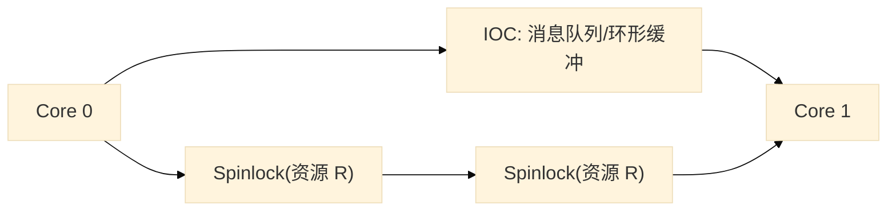

---

### 5.9 OS-Application（OS 应用）

#### ① 通俗理解

OS-Application 是"**把一个芯片分成多个互相隔离的小世界**"。不同供应商的代码各住一个小世界，谁也越不过界；一个世界崩溃，其他世界照常运行。

#### ② 设计机制与思路

它是 AUTOSAR OS 面向"**多供应商安全集成**"的核心抽象：对象分组（归属）+ 权限模型（Trusted/Non-Trusted + OsAccess）+ 硬件隔离（MPU）+ 生命周期管理（状态机/重启）+ 分级故障响应（Hook）。详见独立专题文档《OS-Application 详解》。

#### ③ 深入原理：信任边界

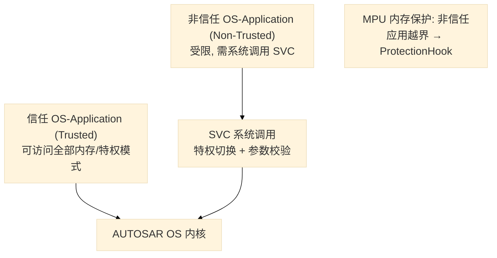

---

### 5.10 保护机制：内存 / 时序 / 服务

#### ① 通俗理解

保护就是"**安全阀**"。给系统装上三道保险：**内存**（不许越界）、**时序**（不许超时）、**服务**（不许乱调 API）。触发了，按配置分级处理：轻的只记日志，重的终止应用或整机停机。

#### ② 设计机制与思路

保护不是"一刀切杀死系统"，而是**可配置分级响应**——生产阶段按 ISO 26262 要求"错误应对策略"（fail-stop 或降级），这是车载功能安全（ASIL 等级）的落地手段。

#### ③ 深入原理：三级保护体系

| 保护 | 保护对象 | 手段 | 触发后 |
|------|----------|------|--------|
| **内存保护** | 非信任应用的内存访问 | MPU 分区 + 特权级别 | `ProtectionHook`，可终止应用 |
| **时序保护** | 任务执行时间、中断封锁时间 | 周期计数 + 时间预算 | `ProtectionHook` |
| **服务保护** | OS 服务调用参数/权限 | SVC 入口参数校验 | 拒绝服务 + 上报 |

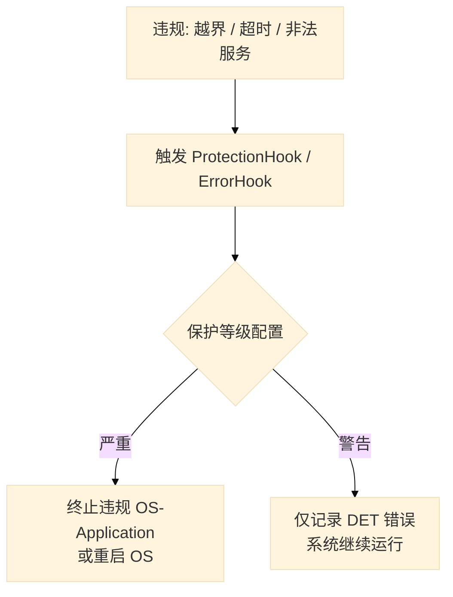

---

### 5.11 错误处理与 Hook

#### ① 通俗理解

Hook 是 OS 给开发者留的"**钩子**"：系统在特定时刻（开机、关机、出错、任务切换前后）会**自动叫你一声**，你可以在这些钩子里放自己的处理代码，比如喂狗、记录轨迹、故障录波。

#### ② 设计机制与思路

Hook 是**观察者模式**在 RTOS 中的应用——内核在特定"事件点"回调用户注册的函数，让**内核本体与业务解耦**。

#### ③ 深入原理：Hook 列表

| Hook | 触发时机 |
|------|----------|
| `StartupHook` | OS 启动时（`StartOS` 内部） |
| `ShutdownHook` | 系统关闭时 |
| `ErrorHook` | OS 服务调用出错（非保护类错误） |
| `PreTaskHook` | 任务被调度运行前 |
| `PostTaskHook` | 任务运行结束/被抢占后 |
| `ProtectionHook` | 保护机制触发 |

---

### 5.12 启动与关闭

#### ① 通俗理解

ECU 上电像"**公司开门**"：先打扫（初始化），再开门迎客（启动 OS 调度任务），打烊时按流程关门（关闭 OS）。

#### ② 设计机制与思路

把"开机流程"交给 **EcuM（ECU 管理）** 编排，OS 只管"从 `StartOS` 开始"——体现 **分层分责**：EcuM 负责时序（何时初始化哪些模块），OS 负责机制（怎么调度）。

#### ③ 深入原理：启动链路时序

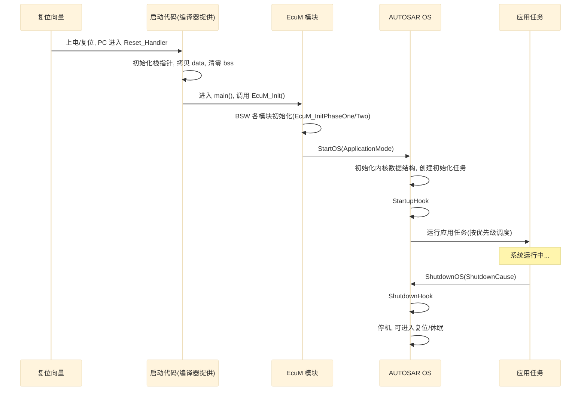

---

## 六、OS 与 RTE 的关系

### ① 通俗理解

RTE 是"**翻译官**"：应用软件组件（SWC）只说业务语言，RTE 把它翻译成 OS 能懂的"激活任务、置事件"等操作，应用开发者完全感觉不到 OS 的存在。

### ② 设计机制与思路

RTE 相当于"**虚拟功能总线（VFB）在单 ECU 内的实现**"，OS 则是最底层的"硬件抽象 + 并发执行引擎"。分层让"应用（SWC）—中间件（RTE）—内核（OS）"各自可独立演进与复用。

### ③ 深入原理：Runnable 到任务的映射

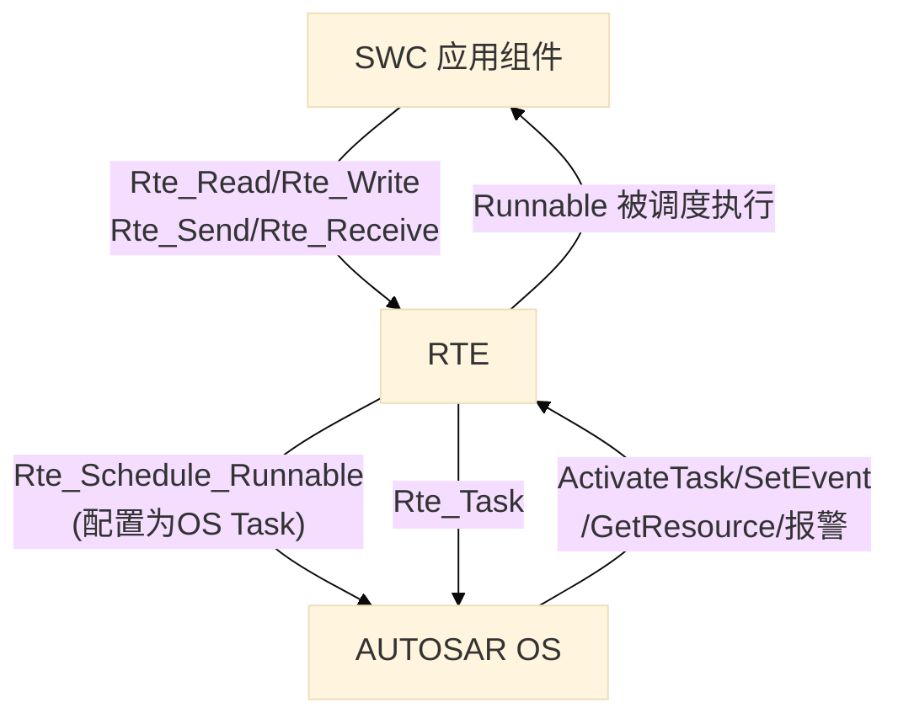

**要点**：
1. **SWC 的每个 Runnable（可运行实体）映射到 OS 任务**：多个 Runnable 可打包进一个任务（分摊栈、降低切换开销），或一个 Runnable 独占一个任务（精细控制周期）；
2. RTE 生成调度代码调用 OS 服务，**OS 对上层透明**；
3. RTE 的定时（`OsCounter`/`OsAlarm`/`ScheduleTable`）全部落到 OS 时间机制上。

---

## 七、AUTOSAR OS 配置体系（.arxml / Os 模块）

### ① 通俗理解

AUTOSAR 开发是"**填表格出代码**"：工程师在工具里把任务、报警、资源等画进配置（.arxml），工具自动生成 OS 的 C 代码。不写一行 OS 代码，系统就搭起来了。

### ② 设计机制与思路

把系统结构**外置到配置**而非散落在代码里，带来三大利好：① 正确性可验证（配置可做静态一致性检查）；② 多供应商协同（各团队只改自己的 arxml 片段）；③ 换硬件成本低（换 MCU 时重新配置，应用代码几乎不动）。

### ③ 深入原理：关键配置容器与示例

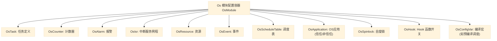

**一个 OsTask 配置示意（arxml 语义）：**

```
OsTask:
  name             = "TaskControl"
  priority         = 10            # 静态优先级
  taskType         = EXTENDED      # 扩展任务(支持 WaitEvent)
  schedule         = PREEMPT       # 可抢占
  stackSize        = 1024          # 字节
  entryFunction    = "TaskControl_main"
  osApplicationRef = "AppControl"  # 归属应用
  taskPriorityCeiling = 0x00
```

---

## 八、AUTOSAR OS API 一览表

> 完整 API 见 SWS_OS 规范，以下为最常用子集。

| 分类 | API | 功能 |
|------|-----|------|
| 任务 | `ActivateTask(TaskID)` | 激活任务 |
| 任务 | `TerminateTask(void)` | 终止当前任务 |
| 任务 | `ChainTask(TaskID)` | 终止当前并激活指定任务 |
| 任务 | `Schedule(void)` | 显式触发调度点 |
| 任务 | `GetTaskID(TaskRef)` | 获取当前任务 ID |
| 事件 | `SetEvent(TaskID, Mask)` | 置事件位 |
| 事件 | `WaitEvent(Mask)` | 等待事件 |
| 事件 | `ClearEvent(Mask)` | 清除事件 |
| 事件 | `GetEvent(TaskID, Ref)` | 读取事件状态 |
| 资源 | `GetResource(ResID)` | 获取资源(进入临界区) |
| 资源 | `ReleaseResource(ResID)` | 释放资源 |
| 中断 | `EnableAllInterrupts(void)` / `DisableAllInterrupts(void)` | 全局中断开关 |
| 中断 | `ResumeAllInterrupts` / `SuspendAllInterrupts` | 可嵌套的全局中断挂起 |
| 中断 | `CallTerminateISR2(void)` | ISR2 结束，触发调度检查 |
| 报警 | `SetRelAlarm(AlarmID, Increment, Cycle)` | 相对报警 |
| 报警 | `SetAbsAlarm(AlarmID, Start, Cycle)` | 绝对报警 |
| 报警 | `CancelAlarm(AlarmID)` | 取消报警 |
| 计数 | `GetCounterValue(CtrID, ValueRef)` | 读计数器 |
| 调度表 | `StartScheduleTableRel(SchedTbl, Offset)` | 相对启动调度表 |
| 调度表 | `StopScheduleTable(SchedTbl)` | 停止调度表 |
| 应用 | `GetApplicationID(Ref)` | 查询当前 OS-Application |
| 应用 | `GetApplicationMode(void)` | 查询应用模式 |
| 自旋锁 | `GetSpinlock(SpinlockID)` / `ReleaseSpinlock(SpinlockID)` | 跨核互斥 |
| 系统 | `StartOS(AppModeID)` | 启动 OS |
| 系统 | `ShutdownOS(Error)` | 关闭 OS |
| 系统 | `GetOSStatus(Ref)` | 查询 OS 状态 |
| 时间保护 | `SetTaskTimeBudget` / `GetTaskTimeBudget` | 任务时间预算控制 |

---

## 九、底层实现原理剖析：任务切换

### ① 通俗理解

任务切换就像"**换岗**"：旧任务下班前要把自己的东西（寄存器、栈）打包存好，新任务上岗时把东西解开接着干。AUTOSAR OS 提供 `ActivateTask` 等 API 给你用，但"打包/解开"这套体力活由内核底层完成。

### ② 设计机制与思路：为什么用 SVC + PendSV

Cortex-M 的异常模型天然适合做 RTOS：
- **SVC**：任务级调用 OS 服务的"门"（`ActivateTask` 底层就是 SVC），负责**特权切换 + 参数检查**；
- **PendSV**：可挂起异常，作为"**延迟上下文切换**"的载体——把切换成本挪到中断全部结束后，既保证中断响应最快，又保证切换时无中断嵌套、栈状态简单。

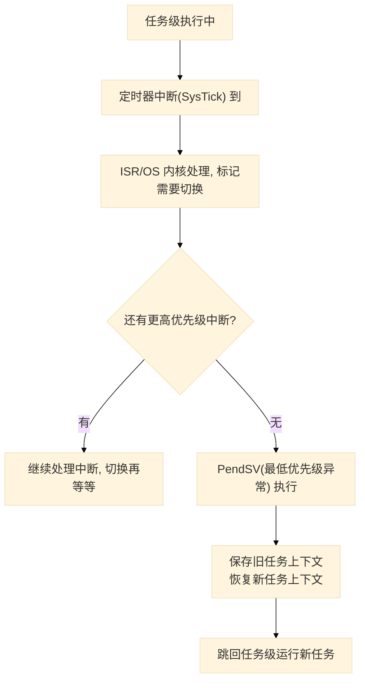

### ③ 深入原理：AUTOSAR OS 的数据结构与服务实现

以下代码为 **AUTOSAR OS 层面的实现**（概念性，参考商用实现风格），全部与 AUTOSAR 相关。

#### (a) 任务控制块 TCB（配置工具生成）

```c
/* ============ AUTOSAR OS: 任务控制块(TCB)数据结构 ============ */
#include "Os.h"                      /* AUTOSAR OS 标准头文件: 基本类型与宏 */

typedef uint16      OsTaskIdType;     /* 任务 ID 类型 */
typedef uint8       OsPriorityType;   /* 静态优先级类型 */
typedef uint16      OsTaskStateType;  /* 任务状态类型 */
typedef uint32      OsEventMaskType;  /* 事件掩码类型 */
typedef uint8       OsApplicationIdType; /* OS-Application ID 类型 */

/* 任务状态常量(OSEK 状态机) */
#define OS_TASK_SUSPENDED  0u
#define OS_TASK_READY      1u
#define OS_TASK_RUNNING    2u
#define OS_TASK_WAITING    3u

/* Os_Task: 每个任务的 TCB, 由配置工具从 arxml 的 OsTask 生成 */
typedef struct
{
    OsTaskIdType        TaskId;        /* 任务 ID(索引号)              */
    OsPriorityType      Priority;      /* 静态优先级(越小越高)         */
    uint32             *StackPointer;  /* 任务栈指针(切换时更新)       */
    uint32             *StackBase;     /* 任务栈底(栈溢出检测)         */
    uint32              StackSize;     /* 任务栈大小(字节)             */
    OsTaskStateType     State;         /* 当前状态(状态机)             */
    OsEventMaskType     EventMask;     /* Extended Task 的事件位       */
    OsApplicationIdType AppId;         /* 归属的 OS-Application        */
} Os_TaskControlBlock;

/* 全部任务的 TCB 表: 静态数组, 由配置工具生成 */
static Os_TaskControlBlock Os_TcbTable[OS_TASK_COUNT];
```

#### (b) ActivateTask 服务实现（OS 内核，概念性）

```c
/* ============ AUTOSAR OS: ActivateTask 服务实现(概念性) ============ */
#include "Os.h"
#include "Os_Internal.h"             /* 内部: 就绪队列/调度器辅助 */

/* 外部声明: 就绪队列插入 / 请求调度 / 错误上报 */
extern void Os_ReadyQueueInsert(Os_TaskControlBlock *tcb);
extern void Os_RequestSchedule(void);          /* 置位 PendSV, 延迟切换 */
extern void Os_ReportError(StatusType error, uint32 arg); /* ErrorHook 入口 */

/* OSEK/AUTOSAR 标准 API: 激活一个任务 */
StatusType ActivateTask(TaskType TaskID)
{
    Os_TaskControlBlock *tcb = &Os_TcbTable[TaskID];
    StatusType result = E_OK;

    Os_EnterSchedulerCritical();               /* 进入调度器临界区 */
    if (tcb->State == OS_TASK_SUSPENDED)
    {
        /* 合法激活: SUSPENDED → READY, 插入就绪队列 */
        tcb->State = OS_TASK_READY;
        Os_ReadyQueueInsert(tcb);              /* 按优先级插入 */
        Os_RequestSchedule();                  /* 标记调度, 退出临界区后切换 */
    }
    else
    {
        /* 重复激活: 按 OSEK 语义上报错误 */
        result = E_OS_ID;
        Os_ReportError(E_OS_ID, (uint32)TaskID);
    }
    Os_ExitSchedulerCritical();
    return result;
}

/* ============ AUTOSAR OS: 任务入口的"壳"(概念性) ============ */
/* 每个任务函数外包一层壳: 结束时自动 TerminateTask */
void Os_TaskWrapper(Os_TaskControlBlock *tcb)
{
    tcb->EntryFunction();              /* 执行用户任务函数 */
    (void)TerminateTask();             /* 任务函数返回后自动终止 */
    /* 正常情况下不会走到这里 */
}
```

#### (c) 通用 ARM Cortex-M 机制：PendSV 上下文切换

> 说明：以下为 **ARM Cortex-M 架构通用机制**（非任何厂商代码），AUTOSAR OS 商用实现在此架构上使用同样的做法——SVC 做系统调用入口，PendSV 做延迟上下文切换。

```assembly
; ============ PendSV_Handler: 上下文切换核心(通用 ARM Cortex-M) ============
; 触发: OS 决定切换任务后置位 PENDSVSET, 待所有更高优先级中断处理完毕进入。
PendSV_Handler:
    CPSID   I                 ; 关中断, 防止切换过程中被打断
    MRS     R0, PSP           ; R0 = 当前任务栈指针(进程栈指针 PSP)
    ; 硬件已自动压栈 xPSR, PC, LR, R12, R3-R0
    ; 软件手动压栈 Callee-saved 寄存器 R4-R11
    STMDB   R0!, {R4-R11}     ; 保存 R4~R11, R0 指向新栈顶

    LDR     R1, =Os_CurTcb    ; 当前任务控制块
    LDR     R2, [R1]
    STR     R0, [R2]          ; 新栈顶写回 TCB->StackPointer

    LDR     R1, =Os_NextTcb   ; 取下一个任务 TCB
    LDR     R2, [R1]
    STR     R2, [R1]          ; Os_CurTcb = Os_NextTcb
    LDR     R0, [R2]          ; R0 = 新任务栈顶

    LDMIA   R0!, {R4-R11}     ; 恢复新任务寄存器 R4~R11
    MSR     PSP, R0           ; 更新 PSP
    CPSIE   I                 ; 开中断
    BX      LR                ; 异常返回: 硬件自动恢复 xPSR/PC/LR/R12/R3-R0
```

**逐行解释**：
- `PSP`（进程栈指针）供任务使用，`MSP`（主栈指针）供中断/内核使用——"任务栈与内核栈分离"的基石；
- `R4-R11` 是被调用者保存寄存器，需手动保存；`R0-R3、R12、LR、PC、xPSR` 由 Cortex-M **硬件自动压栈**；
- `Os_CurTcb / Os_NextTcb`：OS 全局变量，指向 TCB，TCB 首字段即 `StackPointer`。

> **为什么 PendSV 而非直接切换**：① **中断嵌套安全**——PendSV 是最低优先级异常，切换时保证无其他异常活动；② **切换成本集中**——调度记账在任务级完成，PendSV 只做纯粹的"换栈指针"，极小极快极可预测；③ **中断延迟最低**——ISR 里只标记 `PENDSVSET`，中断退出耗时恒定。

---

## 十、设计模式与思想总结

AUTOSAR OS 值得借鉴的**设计模式**：

| 模式 | 对应实现 | 解决的问题 |
|------|----------|-----------|
| **静态配置 / 生成代码** | arxml → Os 模块代码 | 系统结构外置、可验证、可复用 |
| **两级延迟调度** | ISR 标记 + PendSV 执行 | 缩短中断延迟、保证切换安全 |
| **优先级天花板协议(PCP)** | Resource | 消除优先级反转，等待有上界 |
| **观察者模式** | Hook（Startup/Pre/Post/Error/Protection） | 生命周期/异常事件的解耦回调 |
| **分层分责** | EcuM 编排启动 → OS 负责调度 | 复杂时序与内核机制解耦 |
| **信任边界隔离** | OS-Application + MPU + SVC | 多供应商应用的安全共存 |
| **时间触发 + 事件触发混合** | ScheduleTable + 抢占任务 | 既保证周期确定性，又保留事件响应能力 |

**三条核心理念贯穿始终**：

1. **确定性（Determinism）优先于吞吐**：汽车安全功能要求"行为可预测"，一切设计（静态优先级、禁止动态内存、固定调度点）都为可验证性让路；
2. **配置即架构**：把系统结构写进配置数据，代码由工具生成，让"审查、变更、复用"都在数据层面完成；
3. **保护而非放任**：功能安全要求"故障可被隔离"，所以从"内存、时序、服务"三个维度给系统装上"安全阀"。

---

## 参考与延伸

- AUTOSAR 规范：`SWS_OS`（Specification of Operating System）、`SRS_OS`（System Requirements of OS）
- 基线规范：**OSEK/VDX OS 2.2.3**（AUTOSAR OS 的母体）
- 相关专题：任务/调度细节、OS-Application 详解、多核（OS Multi-Core / IOC）、保护（Memory/Timing/Service Protection）、OS 与 RTE
