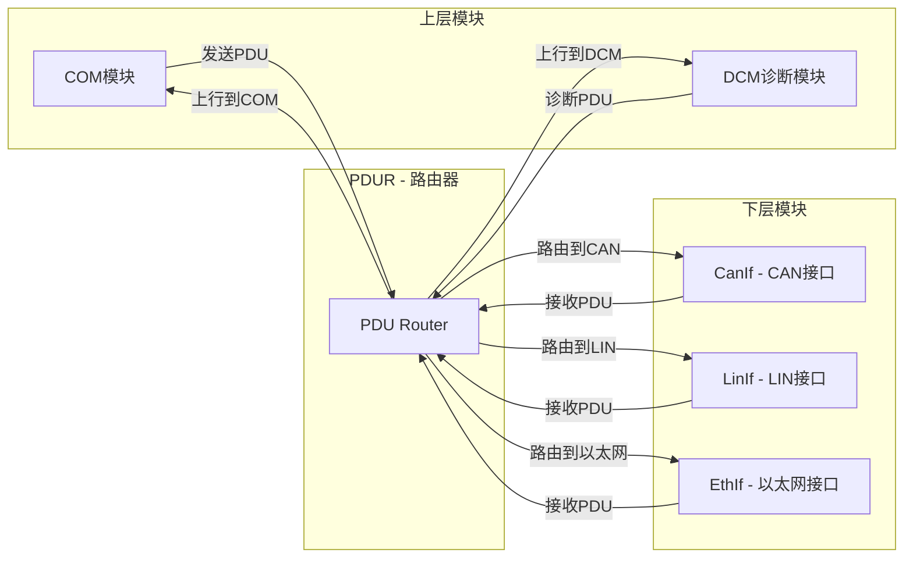
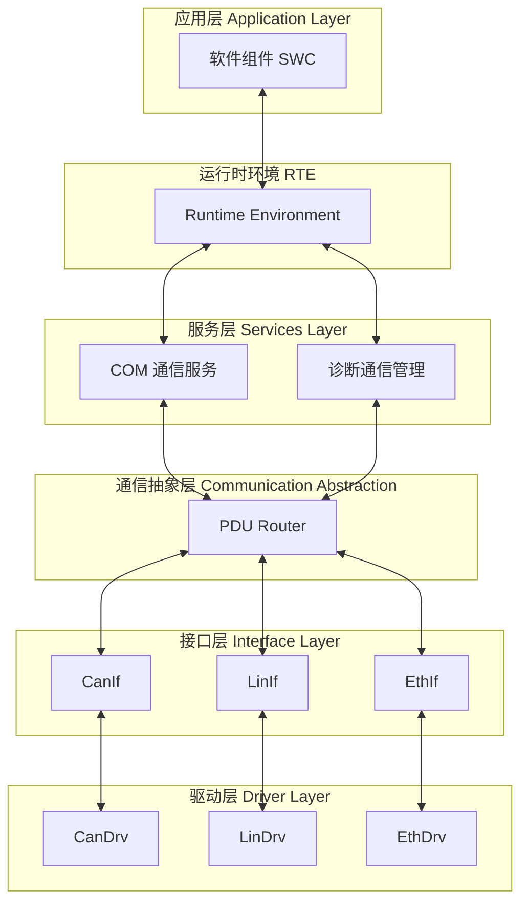
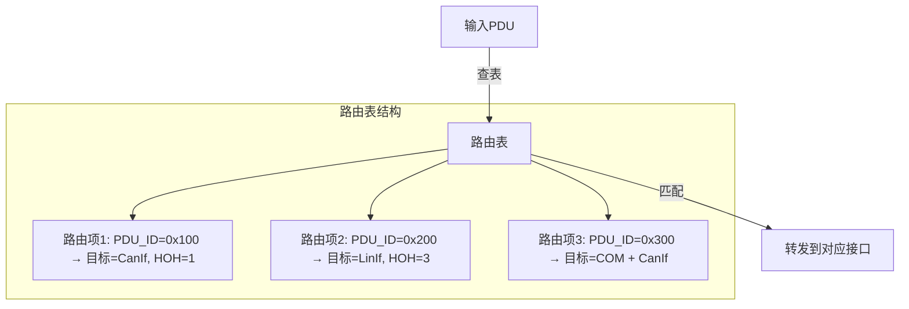
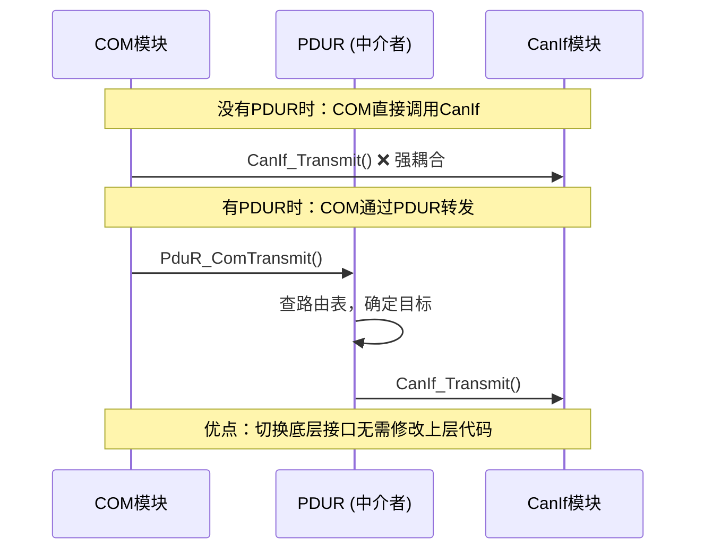
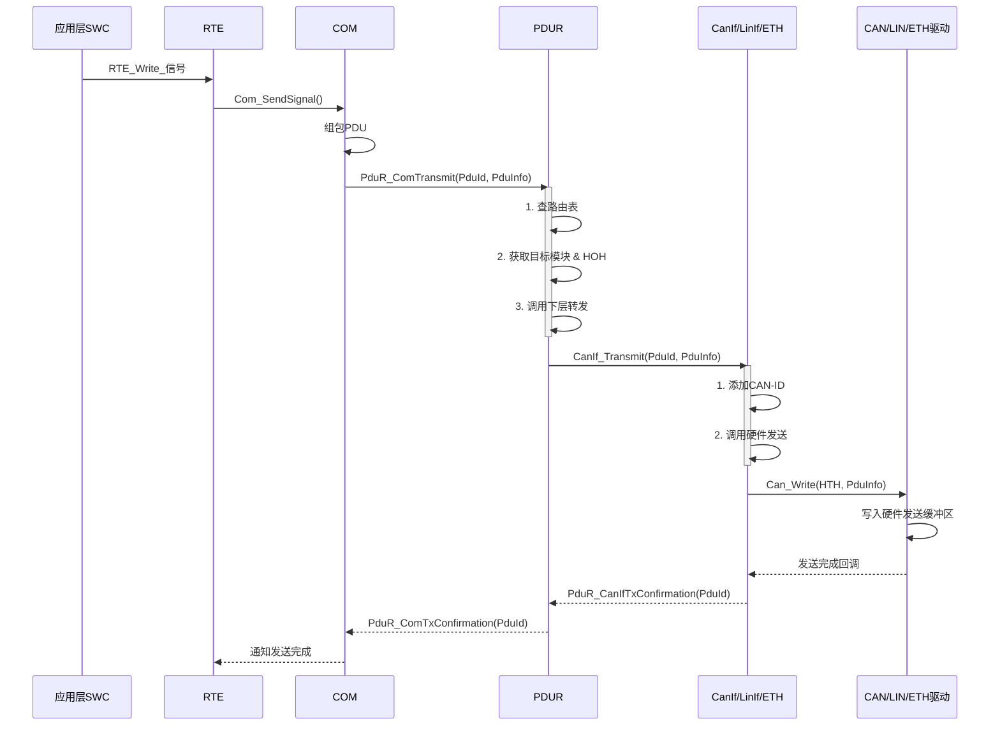
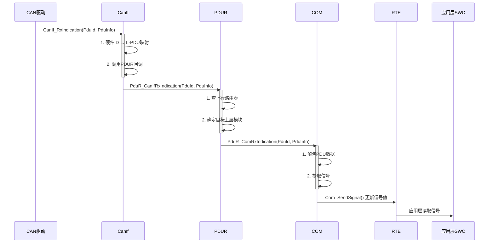
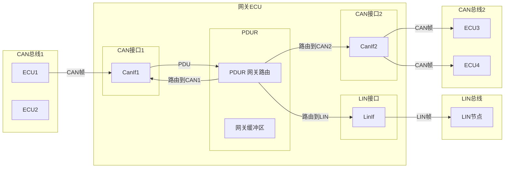
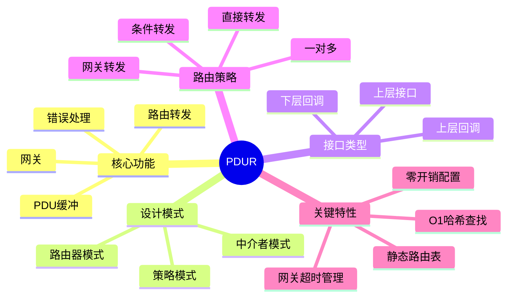

# PDUR (PDU Router) 模块详解

---

# 第一部分：通俗易懂的理解

## PDUR 是什么？

**PDUR（PDU Router）是 AUTOSAR 通信栈中的"路由器"或"交换机"。**

想象一下你家里有一个网络交换机——所有设备（电脑、手机、电视）都连接到它，数据包通过它被转发到正确的目的地。**PDUR 在 AUTOSAR 中扮演的就是这个角色**。



## 生活中的类比

| 概念 | 类比 |
|------|------|
| **PDUR** | 邮局的分拣中心 |
| **上层模块（COM/DCM）** | 寄件人和收件人 |
| **下层模块（CanIf/LinIf）** | 不同的运输车队（卡车、火车、飞机） |
| **PDU（协议数据单元）** | 包裹 |
| **路由路径** | 分拣规则 |

> **一句话总结：** PDUR 负责将上层（COM、DCM）的 PDU 转发到正确的下层接口（CAN、LIN、以太网），同时将下层接收到的 PDU 转发到正确的上层模块。它本身不处理数据内容，只做转发。

---

# 第二部分：设计机制与设计模式

## 2.1 PDUR 在 AUTOSAR 架构中的位置



## 2.2 核心设计模式

### 模式一：路由器模式（Router Pattern）

PDUR 是经典的路由器模式实现。它维护一个**路由表**，根据 PDU 的 ID 和方向决定转发目标。



### 模式二：中介者模式（Mediator Pattern）

PDUR 作为上层和下层之间的中介者，解除了通信模块之间的直接耦合。



### 模式三：策略模式（Strategy Pattern）

PDUR 支持多种路由策略，通过配置选择不同的转发行为。

| 路由策略 | 说明 | 适用场景 |
|----------|------|----------|
| **直接转发** | 1:1 映射，一个PDU对应一个目标 | 大多数常规通信 |
| **一对多转发** | 一个PDU转发到多个目标 | 网关、广播 |
| **条件转发** | 根据条件（如信号值）选择目标 | 动态路由 |
| **截断转发** | 只转发PDU的部分数据 | 数据过滤 |

## 2.3 核心数据流

### 发送路径（Tx - 上行→下行）



### 接收路径（Rx - 下行→上行）



---

# 第三部分：深入原理

## 3.1 PDUR 路由表结构

PDUR 的路由表是静态配置的，在编译时通过 `PduR_Cfg.h` 和 `PduR_PBcfg.c` 生成。

### 核心数据结构

```c
/******************************************************************************
 * PDUR 核心数据结构
 *****************************************************************************/

/**
 * @brief PDU 信息结构体
 * 描述一个PDU的数据缓冲区和长度
 */
typedef struct {
    uint8_t*          SduDataPtr;     /* PDU数据缓冲区指针 */
    uint8_t*          MetaDataPtr;    /* 元数据指针（可选） */
    PduLengthType     SduLength;      /* PDU数据长度（字节） */
} PduInfoType;

/**
 * @brief PDU ID 类型
 * 用于标识PDU的唯一ID
 */
typedef uint16_t PduIdType;

/**
 * @brief PDU 长度类型
 */
typedef uint32_t PduLengthType;

/**
 * @brief 路由路径类型枚举
 */
typedef enum {
    PDUR_DIRECTION_TX,      /* 发送路径：上行→下行 */
    PDUR_DIRECTION_RX,      /* 接收路径：下行→上行 */
    PDUR_DIRECTION_TXRX     /* 双向路径 */
} PduR_DirectionType;

/**
 * @brief 目标模块类型枚举
 */
typedef enum {
    PDUR_DEST_MODULE_COM,       /* 目标：COM模块 */
    PDUR_DEST_MODULE_DCM,       /* 目标：DCM诊断模块 */
    PDUR_DEST_MODULE_CANIF,     /* 目标：CanIf接口 */
    PDUR_DEST_MODULE_LINIF,     /* 目标：LinIf接口 */
    PDUR_DEST_MODULE_ETHIF,     /* 目标：EthIf接口 */
    PDUR_DEST_MODULE_NM,        /* 目标：网络管理 */
    PDUR_DEST_MODULE_IPDUM,     /* 目标：IPDU复用模块 */
} PduR_DestModuleType;
```

### 路由表配置

```c
/******************************************************************************
 * PDUR 路由表配置
 * 通过 AUTOSAR 配置工具生成
 *****************************************************************************/

/**
 * @brief 路由路径配置结构体
 * 定义一条完整的路由路径
 */
typedef struct {
    PduIdType               PduId;            /* PDU ID */
    PduR_DirectionType      Direction;        /* 路由方向 */
    PduR_DestModuleType     DestModuleType;   /* 目标模块类型 */
    PduIdType               DestPduId;        /* 目标模块侧的PDU ID */
    PduLengthType           PduLength;        /* PDU长度 */
    uint8                   DestHohId;        /* 目标硬件对象句柄ID */
    boolean                 IsGateway;        /* 是否为网关路由 */
    PduIdType               GatewayTargetId;  /* 网关目标ID（网关路由时使用） */
} PduR_RoutingPathConfigType;

/**
 * @brief PDUR 配置集结构体
 */
typedef struct {
    const PduR_RoutingPathConfigType* RoutingPaths;    /* 路由路径表指针 */
    uint16                             NumRoutingPaths; /* 路由路径数量 */
    /* 其他配置项... */
} PduR_ConfigType;
```

### 示例配置

```c
/******************************************************************************
 * 示例：PDUR 路由表配置 (PduR_PBcfg.c)
 *****************************************************************************/

/* 外部引用的上层模块回调函数 */
extern void Com_TxConfirmation(PduIdType PduId);
extern void Com_RxIndication(PduIdType PduId, const PduInfoType* PduInfo);

/* 外部引用的下层模块API */
extern Std_ReturnType CanIf_Transmit(PduIdType TxPduId, const PduInfoType* PduInfo);

/* PDU ID 定义 */
#define PDU_ID_ENGINE_SPEED    0x100   /* 发动机转速 */
#define PDU_ID_VEHICLE_SPEED   0x200   /* 车速 */
#define PDU_ID_DIAG_REQ        0x700   /* 诊断请求 */
#define PDU_ID_DIAG_RESP       0x701   /* 诊断响应 */

/* 路由路径表 */
const PduR_RoutingPathConfigType PduR_RoutingPaths[] = {
    /* ===== 发送路径 (上行→下行) ===== */
    {
        .PduId          = PDU_ID_ENGINE_SPEED,      /* 本地PDU ID */
        .Direction      = PDUR_DIRECTION_TX,        /* 发送方向 */
        .DestModuleType = PDUR_DEST_MODULE_CANIF,   /* 目标：CanIf */
        .DestPduId      = 0x01,                     /* CanIf侧的PDU ID */
        .PduLength      = 8,                        /* 8字节 */
        .DestHohId      = 0,                        /* 硬件句柄0 */
        .IsGateway      = FALSE,                    /* 非网关路由 */
    },
    {
        .PduId          = PDU_ID_VEHICLE_SPEED,
        .Direction      = PDUR_DIRECTION_TX,
        .DestModuleType = PDUR_DEST_MODULE_CANIF,
        .DestPduId      = 0x02,
        .PduLength      = 8,
        .DestHohId      = 1,
        .IsGateway      = FALSE,
    },
    /* ===== 接收路径 (下行→上行) ===== */
    {
        .PduId          = PDU_ID_ENGINE_SPEED,
        .Direction      = PDUR_DIRECTION_RX,
        .DestModuleType = PDUR_DEST_MODULE_COM,
        .DestPduId      = 0x10,                     /* COM侧的PDU ID */
        .PduLength      = 8,
        .IsGateway      = FALSE,
    },
    /* ===== 网关路由路径 ===== */
    {
        .PduId          = PDU_ID_DIAG_REQ,
        .Direction      = PDUR_DIRECTION_TX,
        .DestModuleType = PDUR_DEST_MODULE_CANIF,
        .DestPduId      = 0x03,
        .PduLength      = 64,
        .DestHohId      = 2,
        .IsGateway      = TRUE,                     /* 网关路由 */
        .GatewayTargetId = PDU_ID_DIAG_RESP,         /* 响应路由 */
    },
};

/* PDUR 配置 */
const PduR_ConfigType PduR_Config = {
    .RoutingPaths     = PduR_RoutingPaths,
    .NumRoutingPaths  = sizeof(PduR_RoutingPaths) / sizeof(PduR_RoutingPaths[0]),
};
```

## 3.2 PDUR 核心函数实现

### 初始化函数

```c
/******************************************************************************
 * 函数: PduR_Init
 * 描述: 初始化PDUR模块
 * 参数: ConfigPtr - 指向配置集的指针
 * 返回: 无
 *****************************************************************************/
void PduR_Init(const PduR_ConfigType* ConfigPtr)
{
    /* 安全检查 */
    if (ConfigPtr == NULL_PTR)
    {
        /* 使用默认配置或报错 */
        PduR_ConfigPtr = &PduR_DefaultConfig;
        return;
    }
    
    /* 保存配置指针 */
    PduR_ConfigPtr = ConfigPtr;
    
    /* 初始化路由表缓存（加速查找） */
    PduR_InitRoutingCache();
    
    /* 初始化状态 */
    PduR_Status = PDUR_INITIALIZED;
    
    /* 初始化网关缓冲区 */
    #if (PDUR_GATEWAY_SUPPORT == STD_ON)
    PduR_InitGatewayBuffers();
    #endif
    
    /* 初始化所有路由路径的状态 */
    for (uint16 i = 0; i < PduR_ConfigPtr->NumRoutingPaths; i++)
    {
        PduR_RouteState[i] = PDUR_ROUTE_ACTIVE;
    }
}
```

### 发送请求函数

```c
/******************************************************************************
 * 函数: PduR_ComTransmit
 * 描述: COM模块请求发送PDU
 * 参数: PduId    - PDU ID
 *        PduInfo  - PDU数据信息
 * 返回: E_OK  - 发送请求成功
 *        E_NOT_OK - 发送请求失败
 *****************************************************************************/
Std_ReturnType PduR_ComTransmit(PduIdType PduId, const PduInfoType* PduInfo)
{
    Std_ReturnType ret = E_NOT_OK;
    
    /* 参数校验 */
    if (PduInfo == NULL_PTR)
    {
        return E_NOT_OK;
    }
    
    if (PduInfo->SduDataPtr == NULL_PTR)
    {
        return E_NOT_OK;
    }
    
    /* 查找路由路径 */
    const PduR_RoutingPathConfigType* route = PduR_FindRoute(PduId, PDUR_DIRECTION_TX);
    
    if (route == NULL_PTR)
    {
        /* 路由未找到，上报错误 */
        PduR_ReportError(PduId, PDUR_NO_ROUTE);
        return E_NOT_OK;
    }
    
    /* 检查路由状态 */
    if (PduR_RouteState[PduR_GetRouteIndex(route)] != PDUR_ROUTE_ACTIVE)
    {
        return E_NOT_OK;
    }
    
    /* 检查网关路由 */
    #if (PDUR_GATEWAY_SUPPORT == STD_ON)
    if (route->IsGateway)
    {
        /* 网关路由：复制到网关缓冲区，由网关处理 */
        return PduR_GatewayTransmit(route, PduInfo);
    }
    #endif
    
    /* 根据目标模块类型调用对应的下层接口 */
    switch (route->DestModuleType)
    {
        case PDUR_DEST_MODULE_CANIF:
            /* 调用 CanIf 的发送接口 */
            ret = CanIf_Transmit(route->DestPduId, PduInfo);
            break;
            
        case PDUR_DEST_MODULE_LINIF:
            /* 调用 LinIf 的发送接口 */
            ret = LinIf_Transmit(route->DestPduId, PduInfo);
            break;
            
        case PDUR_DEST_MODULE_ETHIF:
            /* 调用 EthIf 的发送接口 */
            ret = EthIf_Transmit(route->DestPduId, PduInfo);
            break;
            
        case PDUR_DEST_MODULE_IPDUM:
            /* 调用 IpduM 的发送接口 */
            ret = IpduM_Transmit(route->DestPduId, PduInfo);
            break;
            
        default:
            ret = E_NOT_OK;
            break;
    }
    
    return ret;
}
```

### 接收指示函数

```c
/******************************************************************************
 * 函数: PduR_CanIfRxIndication
 * 描述: CanIf接收到PDU后的回调
 * 参数: PduId   - 接收PDU ID
 *        PduInfo - 接收到的PDU数据
 * 返回: 无
 *****************************************************************************/
void PduR_CanIfRxIndication(PduIdType PduId, const PduInfoType* PduInfo)
{
    /* 参数校验 */
    if (PduInfo == NULL_PTR || PduInfo->SduDataPtr == NULL_PTR)
    {
        return;
    }
    
    /* 查找上行路由路径 */
    const PduR_RoutingPathConfigType* route = PduR_FindRoute(PduId, PDUR_DIRECTION_RX);
    
    if (route == NULL_PTR)
    {
        return;
    }
    
    /* 检查路由状态 */
    if (PduR_RouteState[PduR_GetRouteIndex(route)] != PDUR_ROUTE_ACTIVE)
    {
        return;
    }
    
    /* 根据目标上层模块调用对应的回调 */
    switch (route->DestModuleType)
    {
        case PDUR_DEST_MODULE_COM:
            /* 调用 COM 的接收指示回调 */
            PduR_ComRxIndication(route->DestPduId, PduInfo);
            break;
            
        case PDUR_DEST_MODULE_DCM:
            /* 调用 DCM 的接收指示回调 */
            PduR_DcmRxIndication(route->DestPduId, PduInfo);
            break;
            
        case PDUR_DEST_MODULE_NM:
            /* 调用 NM 的接收指示回调 */
            PduR_NmRxIndication(route->DestPduId, PduInfo);
            break;
            
        default:
            break;
    }
    
    /* 网关路由：同时转发到另一个网络 */
    #if (PDUR_GATEWAY_SUPPORT == STD_ON)
    if (route->IsGateway)
    {
        PduR_GatewayForward(route, PduInfo);
    }
    #endif
}
```

### 发送确认函数

```c
/******************************************************************************
 * 函数: PduR_CanIfTxConfirmation
 * 描述: CanIf发送完成后的确认回调
 * 参数: PduId - 发送PDU ID
 *        result - 发送结果
 * 返回: 无
 *****************************************************************************/
void PduR_CanIfTxConfirmation(PduIdType PduId, Std_ReturnType result)
{
    /* 查找对应的发送路由路径 */
    const PduR_RoutingPathConfigType* route = PduR_FindRoute(PduId, PDUR_DIRECTION_TX);
    
    if (route == NULL_PTR)
    {
        return;
    }
    
    /* 网关路由的确认由网关管理 */
    #if (PDUR_GATEWAY_SUPPORT == STD_ON)
    if (route->IsGateway)
    {
        PduR_GatewayTxConfirmation(route, result);
        return;
    }
    #endif
    
    /* 向上层模块发送确认 */
    /* 注意：这里需要从DestPduId反向查找原始的上层PduId */
    PduIdType upperPduId = PduR_GetUpperPduId(route);
    
    PduR_ComTxConfirmation(upperPduId);
}
```

## 3.3 网关路由机制

网关路由是 PDUR 最重要的高级功能之一，支持跨网络的数据转发。



### 网关缓冲区管理

```c
/******************************************************************************
 * PDUR 网关缓冲区管理
 *****************************************************************************/

#define PDUR_GW_MAX_BUFFER_SIZE   256   /* 最大网关缓冲区大小 */
#define PDUR_GW_MAX_PENDING_MSG   16    /* 最大待处理消息数 */

/**
 * @brief 网关缓冲区结构体
 */
typedef struct {
    uint8_t     data[PDUR_GW_MAX_BUFFER_SIZE];  /* 数据缓冲区 */
    PduLengthType length;                        /* 数据长度 */
    PduIdType   srcPduId;                        /* 源PDU ID */
    PduIdType   destPduId;                       /* 目标PDU ID */
    boolean     inUse;                           /* 使用标志 */
    uint32      timestamp;                       /* 时间戳（用于超时管理） */
} PduR_GatewayBufferType;

static PduR_GatewayBufferType PduR_GwBuffer[PDUR_GW_MAX_PENDING_MSG];

/**
 * @brief 网关转发函数
 * 支持以下路由模式：
 * 1. 直通模式：立即转发，不做缓冲
 * 2. 缓冲模式：先缓冲后转发
 * 3. 触发模式：满足条件才转发
 */
static void PduR_GatewayForward(
    const PduR_RoutingPathConfigType* route,
    const PduInfoType* PduInfo)
{
    Std_ReturnType ret;
    
    /* 获取网关路由配置 */
    const PduR_GatewayConfigType* gwCfg = PduR_GetGatewayConfig(route->GatewayTargetId);
    
    switch (gwCfg->Mode)
    {
        case PDUR_GW_MODE_DIRECT:
            /* 直通模式：立即转发到目标 */
            ret = PduR_ForwardToTarget(gwCfg->TargetPduId, PduInfo);
            break;
            
        case PDUR_GW_MODE_BUFFERED:
            /* 缓冲模式：先存入缓冲区 */
            PduR_GwBuffer[gwCfg->BufferIndex].inUse = TRUE;
            (void)memcpy(PduR_GwBuffer[gwCfg->BufferIndex].data,
                        PduInfo->SduDataPtr, PduInfo->SduLength);
            PduR_GwBuffer[gwCfg->BufferIndex].length = PduInfo->SduLength;
            PduR_GwBuffer[gwCfg->BufferIndex].srcPduId = route->PduId;
            PduR_GwBuffer[gwCfg->BufferIndex].destPduId = gwCfg->TargetPduId;
            PduR_GwBuffer[gwCfg->BufferIndex].timestamp = PduR_GetTimer();
            /* 触发转发任务 */
            PduR_ScheduleGwTask();
            break;
            
        case PDUR_GW_MODE_TRIGGERED:
            /* 触发模式：检查触发条件 */
            if (PduR_CheckTriggerCondition(gwCfg, PduInfo))
            {
                ret = PduR_ForwardToTarget(gwCfg->TargetPduId, PduInfo);
            }
            break;
            
        default:
            break;
    }
}
```

## 3.4 PDUR 的模块间接口

### 上层接口（提供给上层模块调用的API）

```c
/******************************************************************************
 * PDUR 上层接口
 *****************************************************************************/

/* 发送接口 */
Std_ReturnType PduR_ComTransmit(PduIdType PduId, const PduInfoType* PduInfo);
Std_ReturnType PduR_DcmTransmit(PduIdType PduId, const PduInfoType* PduInfo);
Std_ReturnType PduR_NmTransmit(PduIdType PduId, const PduInfoType* PduInfo);

/* 取消发送 */
Std_ReturnType PduR_CancelTransmit(PduIdType PduId);

/* 提供PDU ID */
Std_ReturnType PduR_GetPduId(PduIdType* PduIdPtr, PduIdType srcPduId, 
                              PduR_DirectionType direction);
```

### 下层接口（下层模块调用PDUR的回调）

```c
/******************************************************************************
 * PDUR 下层回调接口
 *****************************************************************************/

/* 接收指示 */
void PduR_CanIfRxIndication(PduIdType RxPduId, const PduInfoType* PduInfo);
void PduR_LinIfRxIndication(PduIdType RxPduId, const PduInfoType* PduInfo);
void PduR_EthIfRxIndication(PduIdType RxPduId, const PduInfoType* PduInfo);

/* 发送确认 */
void PduR_CanIfTxConfirmation(PduIdType TxPduId, Std_ReturnType result);
void PduR_LinIfTxConfirmation(PduIdType TxPduId, Std_ReturnType result);
void PduR_EthIfTxConfirmation(PduIdType TxPduId, Std_ReturnType result);

/* 控制器模式改变 */
void PduR_CanIfControllerModeIndication(uint8 ControllerId, 
                                        CanIf_ControllerModeType ControllerMode);
void PduR_LinIfControllerModeIndication(uint8 ControllerId, 
                                        LinIf_ControllerModeType ControllerMode);
```

### 提供给上层模块的回调函数接口

```c
/******************************************************************************
 * 上层模块回调函数（由上层模块实现，PDUR调用）
 *****************************************************************************/

/* 发送确认（由COM/DCM实现） */
void PduR_ComTxConfirmation(PduIdType PduId);
void PduR_DcmTxConfirmation(PduIdType PduId);
void PduR_NmTxConfirmation(PduIdType PduId);

/* 接收指示（由COM/DCM实现） */
void PduR_ComRxIndication(PduIdType PduId, const PduInfoType* PduInfo);
void PduR_DcmRxIndication(PduIdType PduId, const PduInfoType* PduInfo);
void PduR_NmRxIndication(PduIdType PduId, const PduInfoType* PduInfo);
```

## 3.5 PDUR 状态管理与错误处理

```c
/******************************************************************************
 * PDUR 状态管理
 *****************************************************************************/

typedef enum {
    PDUR_UNINIT,        /* 未初始化 */
    PDUR_INIT,          /* 已初始化 */
    PDUR_RUNNING,       /* 运行中 */
    PDUR_OFFLINE,       /* 离线 */
    PDUR_ERROR          /* 错误状态 */
} PduR_StatusType;

static PduR_StatusType PduR_Status = PDUR_UNINIT;

/**
 * @brief PDUR 主函数（周期性调用）
 * 用于处理网关缓冲区的超时和重发
 */
void PduR_MainFunction(void)
{
    if (PduR_Status != PDUR_RUNNING)
    {
        return;
    }
    
    #if (PDUR_GATEWAY_SUPPORT == STD_ON)
    /* 检查网关缓冲区的超时 */
    for (uint8 i = 0; i < PDUR_GW_MAX_PENDING_MSG; i++)
    {
        if (PduR_GwBuffer[i].inUse)
        {
            if (PduR_IsTimeout(PduR_GwBuffer[i].timestamp, PDUR_GW_TIMEOUT_MS))
            {
                /* 超时处理：丢弃或重发 */
                if (PduR_GwBuffer[i].retryCount < PDUR_GW_MAX_RETRY)
                {
                    PduR_RetryTransmit(&PduR_GwBuffer[i]);
                }
                else
                {
                    PduR_GwBuffer[i].inUse = FALSE;
                    PduR_ReportError(PduR_GwBuffer[i].srcPduId, PDUR_GW_TIMEOUT);
                }
            }
        }
    }
    #endif
}

/**
 * @brief PDUR 错误上报
 */
void PduR_ReportError(PduIdType PduId, PduR_ErrorType Error)
{
    /* 调用DET错误检测服务 */
    #if (PDUR_DEV_ERROR_DETECT == STD_ON)
    Det_ReportError(PDUR_MODULE_ID, PDUR_INSTANCE_ID, 
                    PduR_GetCurrentApiId(), Error);
    #endif
    
    /* 调用DEM诊断事件管理 */
    #if (PDUR_DEM_SUPPORT == STD_ON)
    Dem_ReportErrorEvent(PDUR_EVENT_ROUTING_FAILURE, DEM_EVENT_STATUS_FAILED);
    #endif
}
```

## 3.6 PDUR 模块的配置与集成

### 配置参数总览

```c
/******************************************************************************
 * PDUR 配置参数（通过配置工具生成）
 * 文件: PduR_Cfg.h
 *****************************************************************************/

/* === 开关配置 === */
#define PDUR_ZERO_COST_OPERATION          STD_ON    /* 零开销操作 */
#define PDUR_GATEWAY_SUPPORT              STD_ON    /* 网关支持 */
#define PDUR_DEV_ERROR_DETECT             STD_ON    /* 开发错误检测 */
#define PDUR_VERSION_INFO_API             STD_ON    /* 版本信息API */
#define PDUR_DEM_SUPPORT                  STD_OFF   /* DEM错误上报 */

/* === 数量配置 === */
#define PDUR_MAX_ROUTING_PATH             64        /* 最大路由路径数 */
#define PDUR_MAX_HEADER_LENGTH            8         /* 最大头部长度 */
#define PDUR_MAX_GATEWAY_PATH             16        /* 最大网关路径数 */

/* === 超时配置 === */
#define PDUR_GW_TIMEOUT_MS                100       /* 网关超时时间(ms) */
#define PDUR_GW_MAX_RETRY                 3         /* 网关最大重试次数 */
```

---

# 第四部分：完整示例

## 4.1 CAN 网关应用示例

```c
/******************************************************************************
 * 示例：CAN-CAN 网关应用
 * 功能：将CAN1总线的发动机转速消息转发到CAN2总线
 *****************************************************************************/

#include "PduR.h"
#include "CanIf.h"
#include "Com.h"
#include "PduR_Cfg.h"

/* ===== 1. 初始化 ===== */
void Gateway_Init(void)
{
    /* 初始化PDUR */
    PduR_Init(&PduR_Config);
    
    /* 初始化CanIf */
    CanIf_Init(&CanIf_Config);
    
    /* 初始化COM */
    Com_Init(&Com_Config);
}

/* ===== 2. CAN接收中断处理 ===== */
void CAN_ISR_Handler(void)
{
    CanIf_RxIndication(CANIF_RX_PDU_ENGINE_SPEED, &rxPduInfo);
}

/* ===== 3. 发送请求 ===== */
Std_ReturnType SendEngineSpeed(const uint8* data, uint8 len)
{
    PduInfoType pduInfo;
    pduInfo.SduDataPtr = (uint8*)data;
    pduInfo.SduLength = len;
    pduInfo.MetaDataPtr = NULL_PTR;
    
    return PduR_ComTransmit(PDU_ID_ENGINE_SPEED, &pduInfo);
}

/* ===== 4. 接收处理 ===== */
void PduR_ComRxIndication(PduIdType PduId, const PduInfoType* PduInfo)
{
    /* 接收到数据，更新信号 */
    Com_ReceiveSignal(PduId, PduInfo);
}
```

## 4.2 路由查找优化算法

```c
/******************************************************************************
 * PDUR 路由查找优化
 * 采用哈希表加速路由查找（适用于大量路由项的场景）
 *****************************************************************************/

#define PDUR_ROUTE_HASH_SIZE   128

/**
 * @brief 哈希路由表项
 */
typedef struct PduR_HashEntry {
    PduIdType                       PduId;
    PduR_DirectionType              Direction;
    const PduR_RoutingPathConfigType* Route;
    struct PduR_HashEntry*          Next;    /* 链表解决冲突 */
} PduR_HashEntryType;

static PduR_HashEntryType* PduR_HashTable[PDUR_ROUTE_HASH_SIZE];

/**
 * @brief 哈希函数
 */
static uint16 PduR_Hash(PduIdType PduId, PduR_DirectionType Direction)
{
    return (uint16)((PduId ^ ((uint16)Direction << 8)) % PDUR_ROUTE_HASH_SIZE);
}

/**
 * @brief 初始化路由哈希表
 */
static void PduR_InitRoutingCache(void)
{
    /* 清空哈希表 */
    (void)memset(PduR_HashTable, 0, sizeof(PduR_HashTable));
    
    /* 遍历路由表，建立哈希索引 */
    for (uint16 i = 0; i < PduR_ConfigPtr->NumRoutingPaths; i++)
    {
        const PduR_RoutingPathConfigType* route = &PduR_ConfigPtr->RoutingPaths[i];
        uint16 hash = PduR_Hash(route->PduId, route->Direction);
        
        /* 创建哈希表项 */
        PduR_HashEntryType* entry = PduR_GetHashEntryFromPool();
        if (entry != NULL_PTR)
        {
            entry->PduId     = route->PduId;
            entry->Direction = route->Direction;
            entry->Route     = route;
            
            /* 头插法插入哈希表 */
            entry->Next = PduR_HashTable[hash];
            PduR_HashTable[hash] = entry;
        }
    }
}

/**
 * @brief O(1) 路由查找
 */
static const PduR_RoutingPathConfigType* PduR_FindRoute(
    PduIdType PduId, PduR_DirectionType Direction)
{
    uint16 hash = PduR_Hash(PduId, Direction);
    PduR_HashEntryType* entry = PduR_HashTable[hash];
    
    /* 遍历哈希链 */
    while (entry != NULL_PTR)
    {
        if ((entry->PduId == PduId) && (entry->Direction == Direction))
        {
            return entry->Route;
        }
        entry = entry->Next;
    }
    
    return NULL_PTR;  /* 未找到路由 */
}
```

---

# 第五部分：总结

## PDUR 核心要点



## PDUR 的关键设计理念

| 理念 | 说明 |
|------|------|
| **解耦** | 上下层模块通过PDUR间接通信，互不依赖 |
| **零开销** | 通过配置即可实现零开销直接调用（`ZERO_COST_OPERATION`） |
| **静态配置** | 路由表在编译时确定，运行时无动态分配 |
| **可扩展** | 支持多种总线类型（CAN、LIN、以太网） |
| **网关能力** | 支持跨网络、跨总线的数据转发 |

---

*文档生成时间: 2026-07-10*
*作者: AUTOSAR 嵌入式软件专家*