# AUTOSAR SchM（BSW Scheduler / 调度管理器）模块详解

> 作者：AUTOSAR & 嵌入式软件专家
> 版本：v1.0
> 更新日期：2026/07/11

---

# 一、通俗理解：SchM 是什么？

## 1.1 打个比方

把整个 AUTOSAR BSW 想象成一家 **大型工厂的生产车间**：

| 角色 | 在工厂中 | 在 AUTOSAR 中 |
|------|----------|---------------|
| **厂长** | 决定生产什么 | **OS**（操作系统）— 决定哪个任务运行 |
| **车间主任** | 安排每台机器的运行顺序 | **SchM**（调度器）— 安排每个模块的 MainFunction 何时执行 |
| **机器 A** | 冲压机 | Can_MainFunction（CAN 收发检查） |
| **机器 B** | 焊接机 | CanSM_MainFunction（状态轮询） |
| **机器 C** | 质检台 | NM_MainFunction（网络管理定时器） |
| **互锁开关** | 防止两台机器同时操作同一工件 | **Exclusive Area**（独占区，防止竞态） |

**核心区别：**
- **OS** 管的是"任务级的调度"——哪个任务获得 CPU
- **SchM** 管的是"函数级的调度"——在任务里各个 BSW 模块的主函数谁先谁后

## 1.2 SchM 在 AUTOSAR 中的位置

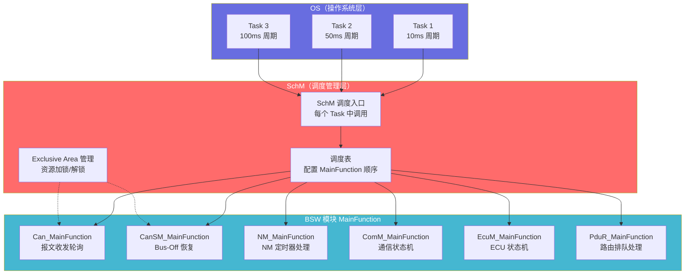

---

# 二、SchM 的核心职责

## 2.1 三大核心功能

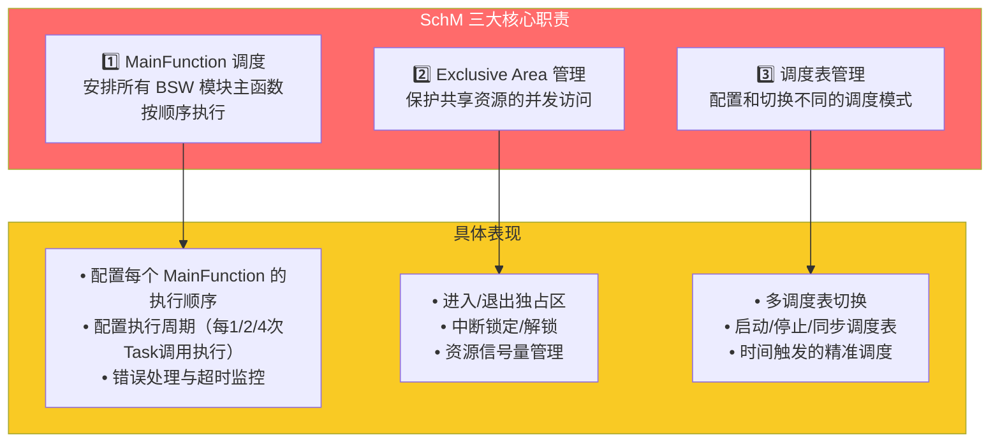

## 2.2 为什么需要 SchM？

没有 SchM 的世界 vs. 有 SchM 的世界：

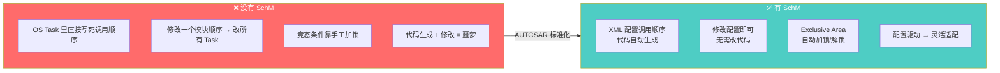

---

# 三、调度机制详解

## 3.1 MainFunction 调度模型

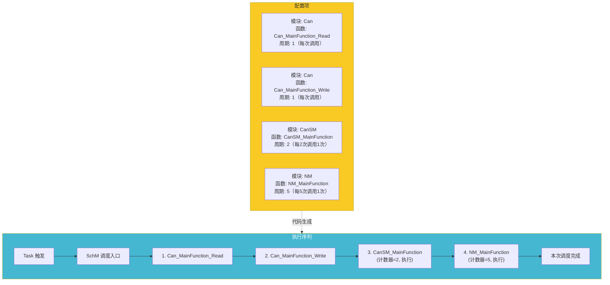

## 3.2 生成的调度代码

```c
/* ===================================================================
 * SchM 自动生成的调度代码示例
 *
 * 以下代码由 AUTOSAR 配置工具根据 XML 配置自动生成
 * 通常集成在 SchM.c / SchM_CAN.c / SchM_CanSM.c 等文件中
 * =================================================================== */

/* ---- SchM_CAN.c - 与 CAN 相关的调度接口 ---- */

/* CAN 模块的 Exclusive Area 定义 */
#define SCHM_EA_CAN_EXCLUSIVE_AREA_0    0x01u
#define SCHM_EA_CAN_EXCLUSIVE_AREA_1    0x02u

/* 进入 CAN Exclusive Area 0 */
void SchM_Enter_Can_ExclusiveArea_0(void)
{
    /* 实现方式取决于配置选项（可配置）:
     * 选项1: 挂起所有中断（最严格）
     * 选项2: 挂起指定优先级的ISR
     * 选项3: 获取资源（OSEK Resource）
     * 选项4: 使用自旋锁（多核）
     */
    SuspendAllInterrupts();  /* 关闭所有中断 */
    
    /* 或: SuspendOSInterrupts() — 仅关闭OS中断 */
    /* 或: GetResource(SCHM_RESOURCE_ID) — OSEK Resource方式 */
}

/* 退出 CAN Exclusive Area 0 */
void SchM_Exit_Can_ExclusiveArea_0(void)
{
    ResumeAllInterrupts();   /* 恢复所有中断 */
}

/* ---- SchM_CANSM.c - CanSM 调度接口 ---- */

void SchM_Enter_CanSM_ExclusiveArea_0(void)
{
    SuspendAllInterrupts();
}

void SchM_Exit_CanSM_ExclusiveArea_0(void)
{
    ResumeAllInterrupts();
}

/* ---- SchM_NM.c - NM 调度接口 ---- */

void SchM_Enter_NM_ExclusiveArea_0(void)
{
    SuspendOSInterrupts();  /* NM 只需要保护 OS 中断 */
}

void SchM_Exit_NM_ExclusiveArea_0(void)
{
    ResumeOSInterrupts();
}

/* ---- SchM_NVRAM.c - NVRAM 管理器调度接口 ---- */
/* NVRAM 使用 GetResource/ReleaseResource 方式 */
void SchM_Enter_NvM_ExclusiveArea_0(void)
{
    /* OSEK 资源保护 — 避免死锁 */
    GetResource(ResourceId_NvM_0);
}

void SchM_Exit_NvM_ExclusiveArea_0(void)
{
    ReleaseResource(ResourceId_NvM_0);
}

/* ---- SchM.c - 主调度入口（在 Task 中调用） ---- */

/* 10ms 周期 Task — 高优先级调度 */
void SchM_MainFunction_10ms(void)
{
    /* 1. 进入 CAN 独占区 */
    SchM_Enter_Can_ExclusiveArea_0();
    Can_MainFunction_Read();   /* 检查接收到的报文 */
    Can_MainFunction_Write();  /* 处理发送队列 */
    SchM_Exit_Can_ExclusiveArea_0();
    
    /* 2. CanSM 调度（每2个周期执行一次）*/
    static uint8 cansm_divider = 0;
    if (++cansm_divider >= 2)
    {
        cansm_divider = 0;
        SchM_Enter_CanSM_ExclusiveArea_0();
        CanSM_MainFunction();
        SchM_Exit_CanSM_ExclusiveArea_0();
    }
    
    /* 3. PduR 调度 */
    PduR_MainFunction();
    
    /* 4. COM 调度 */
    Com_MainFunctionTx();
    Com_MainFunctionRx();
}

/* 50ms 周期 Task — 中等优先级调度 */
void SchM_MainFunction_50ms(void)
{
    /* 1. NM 调度 */
    SchM_Enter_NM_ExclusiveArea_0();
    NM_MainFunction();
    SchM_Exit_NM_ExclusiveArea_0();
    
    /* 2. ComM 调度 */
    ComM_MainFunction();
    
    /* 3. NvM 调度 */
    SchM_Enter_NvM_ExclusiveArea_0();
    NvM_MainFunction();
    SchM_Exit_NvM_ExclusiveArea_0();
}

/* 100ms 周期 Task — 低优先级调度 */
void SchM_MainFunction_100ms(void)
{
    /* 1. EcuM 调度 */
    EcuM_MainFunction();
    
    /* 2. BswM 调度 */
    BswM_MainFunction();
    
    /* 3. DEM 调度（诊断事件管理）*/
    Dem_MainFunction();
    
    /* 4. 其他非关键的模块 */
    CanTrcv_MainFunction();
}
```

## 3.3 调度配置表

```c
/* ---- SchM 调度配置表（由工具生成）---- */

/* MainFunction 调度条目配置 */
typedef struct {
    const char*            ModuleName;      /* 模块名称（调试用） */
    SchM_MainFunctionType  FunctionPtr;     /* 函数指针 */
    uint16_t               CallInterval;    /* 调用间隔（以Task周期为单位） */
    boolean                UsesExclusiveArea; /* 是否使用独占区 */
    SchM_CallModeType      CallMode;        /* 调度模式 */
} SchM_ScheduleEntryType;

/* 调度模式 */
typedef enum {
    SCHM_CALL_MODE_PERIODIC,       /* 周期调用 */
    SCHM_CALL_MODE_EVENT,          /* 事件触发 */
    SCHM_CALL_MODE_ONESHOT,        /* 单次执行 */
    SCHM_CALL_MODE_TRIGGERED       /* 外部触发 */
} SchM_CallModeType;

/* ---- 10ms Task 的调度表 ---- */
static const SchM_ScheduleEntryType SchM_10ms_Schedule[] = {
    {"Can_MainFunction_Read",   Can_MainFunction_Read,   1, TRUE,  SCHM_CALL_MODE_PERIODIC},
    {"Can_MainFunction_Write",  Can_MainFunction_Write,  1, TRUE,  SCHM_CALL_MODE_PERIODIC},
    {"CanSM_MainFunction",      CanSM_MainFunction,      2, TRUE,  SCHM_CALL_MODE_PERIODIC},
    {"PduR_MainFunction",       PduR_MainFunction,       1, FALSE, SCHM_CALL_MODE_PERIODIC},
    {"Com_MainFunctionTx",      Com_MainFunctionTx,      1, FALSE, SCHM_CALL_MODE_PERIODIC},
    {"Com_MainFunctionRx",      Com_MainFunctionRx,      1, FALSE, SCHM_CALL_MODE_PERIODIC},
    {NULL,                      NULL,                    0, FALSE, SCHM_CALL_MODE_PERIODIC} /* 终止符 */
};

/* ---- 50ms Task 的调度表 ---- */
static const SchM_ScheduleEntryType SchM_50ms_Schedule[] = {
    {"NM_MainFunction",         NM_MainFunction,         1, TRUE,  SCHM_CALL_MODE_PERIODIC},
    {"ComM_MainFunction",       ComM_MainFunction,       1, FALSE, SCHM_CALL_MODE_PERIODIC},
    {"NvM_MainFunction",        NvM_MainFunction,        1, TRUE,  SCHM_CALL_MODE_PERIODIC},
    {NULL,                      NULL,                    0, FALSE, SCHM_CALL_MODE_PERIODIC}
};

/* ---- 100ms Task 的调度表 ---- */
static const SchM_ScheduleEntryType SchM_100ms_Schedule[] = {
    {"EcuM_MainFunction",       EcuM_MainFunction,       1, FALSE, SCHM_CALL_MODE_PERIODIC},
    {"BswM_MainFunction",       BswM_MainFunction,       1, FALSE, SCHM_CALL_MODE_PERIODIC},
    {"Dem_MainFunction",        Dem_MainFunction,        1, FALSE, SCHM_CALL_MODE_PERIODIC},
    {"CanTrcv_MainFunction",    CanTrcv_MainFunction,    1, FALSE, SCHM_CALL_MODE_PERIODIC},
    {NULL,                      NULL,                    0, FALSE, SCHM_CALL_MODE_PERIODIC}
};
```

---

# 四、Exclusive Area（独占区）

## 4.1 为什么需要独占区？

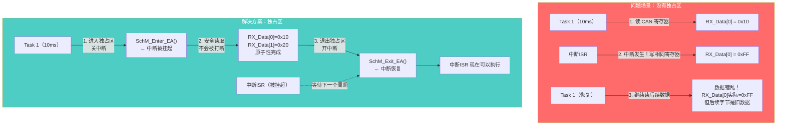

## 4.2 独占区的实现方式

| 保护方式 | 宏/函数 | 粒度 | 执行时间 | 适用场景 |
|----------|---------|:----:|:--------:|----------|
| **SuspendAllInterrupts** | `SuspendAllInterrupts()` | 全局 | ~0.1μs | 极短的关键区（寄存器操作） |
| **ResumeAllInterrupts** | `ResumeAllInterrupts()` | | | |
| **SuspendOSInterrupts** | `SuspendOSInterrupts()` | OS中断 | ~0.05μs | BSW模块间的资源保护 |
| **ResumeOSInterrupts** | `ResumeOSInterrupts()` | | | |
| **GetResource** | `GetResource(ResId)` | 单资源 | ~0.1μs | 跨Task的资源保护（防死锁） |
| **ReleaseResource** | `ReleaseResource(ResId)` | | | |
| **SpinLock（多核）** | `Mcu_GetSpinLock()` | 核间 | ~0.2μs | 多核MCU的核间同步 |

## 4.3 独占区的嵌套

```c
/* 独占区嵌套处理 — SchM 必须支持 */
void SchM_Enter_Can_ExclusiveArea_0(void)
{
    /* 方案1: 不支持嵌套 — 简单，但有限制 */
    SuspendAllInterrupts();
    
    /* 方案2: 支持嵌套（复杂，但更灵活）*/
    /*
    static uint16 nestingDepth = 0;
    if (nestingDepth == 0)
    {
        SuspendAllInterrupts();
    }
    nestingDepth++;
    */
}

void SchM_Exit_Can_ExclusiveArea_0(void)
{
    /* 方案2对应的退出 */
    /*
    if (nestingDepth > 0)
    {
        nestingDepth--;
        if (nestingDepth == 0)
        {
            ResumeAllInterrupts();
        }
    }
    */
    
    ResumeAllInterrupts();
}

/* 嵌套使用示例 */
void Example_NestedExclusiveArea(void)
{
    /* 外层保护 */
    SchM_Enter_Can_ExclusiveArea_0();
    
    Can_MainFunction_Read();  /* 读硬件寄存器 */
    
    /* 内层保护（调用了一个也带保护的函数）*/
    Can_MainFunction_Write(); /* 这个函数内部可能也有关中断操作 */
    
    /* 如果使用方案1（不支持嵌套），这里 ResumeAllInterrupts() 
     * 会在 Write 中就执行，破坏外层保护！
     * 因此方案1要求调用方自己保证不嵌套。
     * 方案2通过计数器安全处理嵌套。
     */
    SchM_Exit_Can_ExclusiveArea_0();
}
```

---

# 五、Os Counter + SchM 调度

## 5.1 基于 OS 定时器的调度

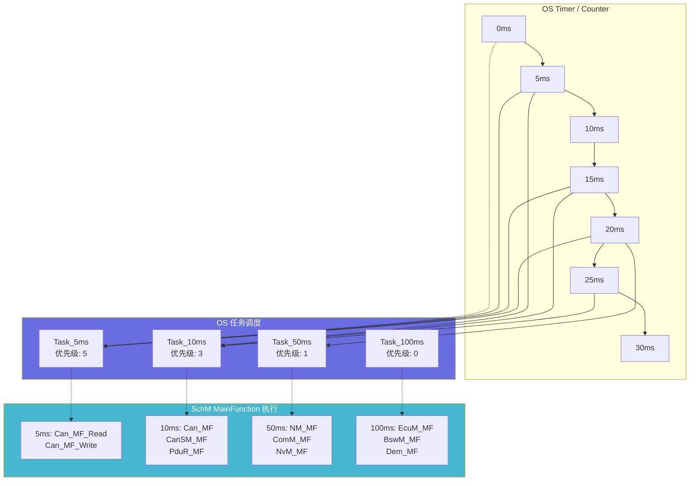

## 5.2 Schedule Table（调度表）

```c
/* ---- AUTOSAR OS Schedule Table ---- */
/* 
 * AUTOSAR OS 提供调度表机制，比简单周期任务更灵活。
 * 调度表是一系列预定义的"到期点"（Expiry Point），
 * 每个到期点可以激活任务或设置事件。
 */

/* 调度表配置示例 */
typedef struct {
    TickType       ExpiryPointTick;   /* 到期点（以OS tick为单位） */
    TaskRefType    TaskToActivate;     /* 要激活的任务（可选） */
    EventMaskType  EventToSet;         /* 要设置的事件（可选） */
    uint8_t        SchM_MainFunctionIndex; /* 要执行的调度函数索引 */
} SchM_ExpiryPointType;

/* 一个10ms调度表 */
const SchM_ExpiryPointType SchM_Table_10ms[] = {
    { .ExpiryPointTick = 0,    .SchM_MainFunctionIndex = 0 },  /* 0ms: Can Read */
    { .ExpiryPointTick = 2,    .SchM_MainFunctionIndex = 1 },  /* 2ms: Can Write */
    { .ExpiryPointTick = 4,    .SchM_MainFunctionIndex = 2 },  /* 4ms: PduR */
    { .ExpiryPointTick = 6,    .SchM_MainFunctionIndex = 3 },  /* 6ms: Com Tx */
    { .ExpiryPointTick = 8,    .SchM_MainFunctionIndex = 4 },  /* 8ms: Com Rx & CanSM */
    { .ExpiryPointTick = 10,   .SchM_MainFunctionIndex = 0xFF }/* 终止 */
};
```

## 5.3 两种调度模式的对比

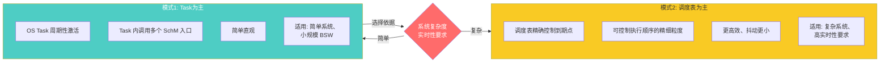

---

# 六、SchM 与 OS 的接口

## 6.1 从 OS 到 SchM 的完整路径

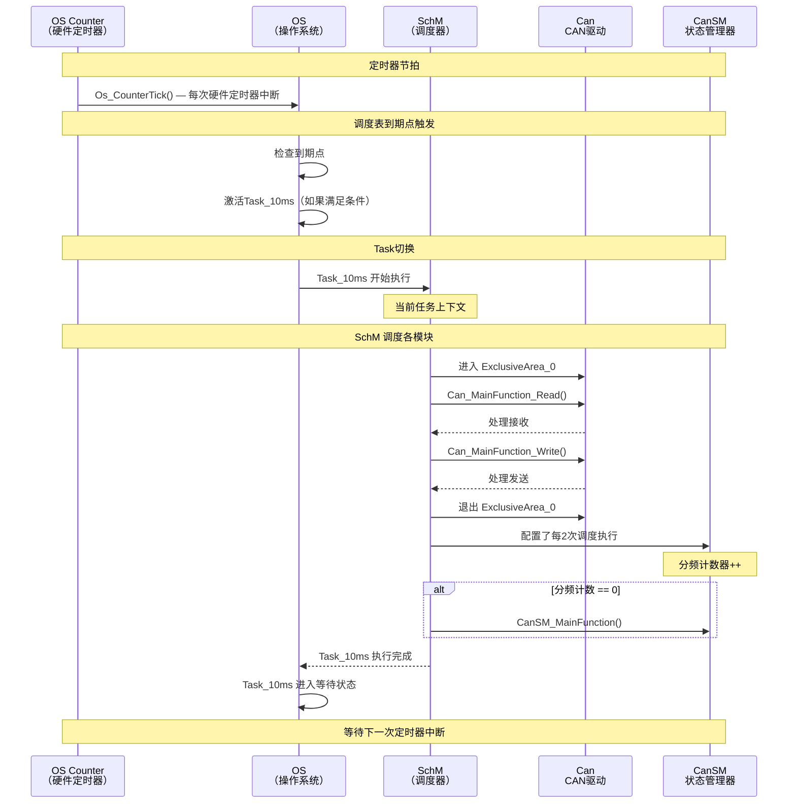

## 6.2 SchM 与 RTE 的关系

```mermaid
graph TB
    subgraph OS["OS"]
        OS_Task["OS Task"]
    end
    
    subgraph SchM_Area["BSW 域"]
        SchM["SchM<br/>调度 BSW MainFunction"]
        BSW_MF["BSW 模块<br/>Can_MF / CanSM_MF / ..."]
    end

    subgraph RTE_Area["RTE 域"]
        RTE["RTE<br/>调度 Runnable"]
        SWC_Run["SWC<br/>Runnable 1..N"]
    end

    OS_Task --> SchM
    OS_Task --> RTE
    
    SchM --> BSW_MF
    RTE --> SWC_Run

    Note over SchM_Area,RTE_Area: 同一OS Task 中顺序执行
    Note over SchM_Area: 通常先 BSW → 再 RTE

    style SchM_Area fill:#ff6b6b,color:#fff
    style RTE_Area fill:#45b7d1,color:#fff
```

在同一个 OS Task 中典型的执行顺序：

```c
/* 10ms Task 中的典型执行序列 */
void Task_10ms(void)
{
    /* Phase 1: BSW 调度（由 SchM 管理）*/
    SchM_MainFunction_10ms();
    /* 内部执行:
     *   Can_MainFunction_Read()
     *   Can_MainFunction_Write()
     *   CanSM_MainFunction()     ← 每2次
     *   PduR_MainFunction()
     *   Com_MainFunctionTx()
     *   Com_MainFunctionRx()
     */
    
    /* Phase 2: RTE 调度（由 RTE 管理）*/
    RTE_Schedule();
    /* 内部执行 SWC 的 Runnable */
    
    /* Phase 3: 最终处理 */
    SchM_Exit_Task();  /* 如果配置了 */
}
```

---

# 七、多核系统中的 SchM

## 7.1 多核调度挑战

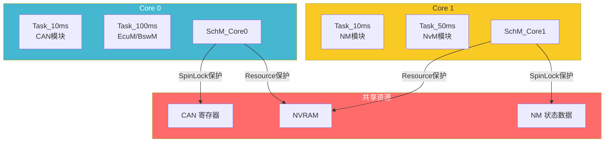

## 7.2 多核独占区的实现

```c
/* ---- 多核系统中 SchM 的独占区 ---- */

/* 多核中使用 SpinLock 替代关中断 */
static volatile boolean Can_SpinLock = FALSE;

void SchM_Enter_Can_ExclusiveArea_0_MultiCore(void)
{
    /* 自旋等待直到获得锁 */
    while (TestAndSet(&Can_SpinLock, TRUE) == TRUE)
    {
        /* 忙等待 — 短暂自旋 */
        /* 可插入暂停指令减少功耗：__asm("WFI") */
    }
    /* 获得锁后，内存屏障保证可见性 */
    MEMORY_BARRIER();
}

void SchM_Exit_Can_ExclusiveArea_0_MultiCore(void)
{
    MEMORY_BARRIER();
    Can_SpinLock = FALSE;  /* 释放锁 */
}

/* 跨核唤醒 — 释放自旋锁后通知其他核 */
void SchM_Exit_Can_ExclusiveArea_0_MultiCore(void)
{
    MEMORY_BARRIER();
    Can_SpinLock = FALSE;
    
    /* 可选: 通知其他核锁已释放 */
    #ifdef CANDRV_MULTICORE_SIGNAL
        Core1_SignalEvent(CORE1_EVENT_SPINLOCK_RELEASED);
    #endif
}
```

---

# 八、设计模式分析

## 8.1 SchM 中的设计模式

| 设计模式 | 应用方式 | 说明 |
|----------|----------|------|
| **Facade 模式** | 统一的调度入口 | 为 OS Task 提供简化的调度接口，隐藏所有 BSW 模块的调度细节 |
| **Mediator 模式** | 模块间协调调度 | 协调各 BSW 模块的执行顺序，避免模块间直接依赖 |
| **Template Method 模式** | 调度框架 | 固定调度框架（进入EA → 执行MF → 退出EA），具体执行对象可配置 |
| **Strategy 模式** | 独占区策略 | 不同的资源保护策略可配置（关中断/Resource/SpinLock） |
| **Configurator 模式** | 配置驱动代码生成 | 从 XML 配置自动生成调度代码，无需手写 |
| **Singleton 模式** | 全局调度表 | 每个 Task 只有一张全局调度表 |

## 8.2 SchM 在整个 BSW 中的角色

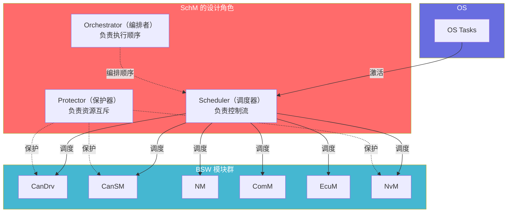

---

# 九、深入原理

## 9.1 调度抖动（Jitter）分析

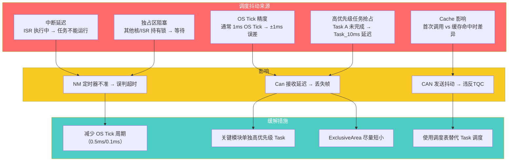

## 9.2 分频计数器机制

```c
/* ---- SchM 分频调度的实现 ---- */

/* 更通用的分频调度实现（工具生成的代码） */
typedef struct {
    void (*MainFunction)(void);    /* 函数指针 */
    uint16_t Interval;             /* 调用间隔（Task周期倍数） */
    uint16_t Counter;              /* 当前计数器 */
    const char* Name;              /* 调试名称 */
    SchM_ExclusiveAreaFunc EnterEA; /* 进入独占区函数 */
    SchM_ExclusiveAreaFunc ExitEA;  /* 退出独占区函数 */
} SchM_ManagedFunctionType;

static SchM_ManagedFunctionType SchM_10ms_Functions[] = {
    { Can_MainFunction_Read,    1, 0, "Can_Read",  
      SchM_Enter_Can_ExclusiveArea_0, SchM_Exit_Can_ExclusiveArea_0 },
    { Can_MainFunction_Write,   1, 0, "Can_Write", 
      SchM_Enter_Can_ExclusiveArea_0, SchM_Exit_Can_ExclusiveArea_0 },
    { CanSM_MainFunction,       2, 0, "CanSM",     
      SchM_Enter_CanSM_ExclusiveArea_0, SchM_Exit_CanSM_ExclusiveArea_0 },
    { PduR_MainFunction,        1, 0, "PduR",      
      NULL, NULL },
    { Com_MainFunctionTx,       1, 0, "Com_Tx",    
      NULL, NULL },
    { Com_MainFunctionRx,       3, 0, "Com_Rx",    
      NULL, NULL },  /* 每3个周期执行1次 */
};

/* 通用的调度循环 */
void SchM_MainFunction_10ms(void)
{
    const uint8_t count = sizeof(SchM_10ms_Functions) / sizeof(SchM_10ms_Functions[0]);
    
    for (uint8_t i = 0; i < count; i++)
    {
        SchM_ManagedFunctionType* mf = &SchM_10ms_Functions[i];
        
        /* 分频计数器 */
        mf->Counter++;
        if (mf->Counter >= mf->Interval)
        {
            mf->Counter = 0;
            
            /* 进入独占区 */
            if (mf->EnterEA != NULL)
            {
                mf->EnterEA();
            }
            
            /* 执行主函数 */
            mf->MainFunction();
            
            /* 退出独占区 */
            if (mf->ExitEA != NULL)
            {
                mf->ExitEA();
            }
        }
    }
}
```

## 9.3 MainFunction 的命名约定

AUTOSAR 规范对每个 BSW 模块的 MainFunction 命名有统一约定：

| BSW 模块 | MainFunction 名称 | 典型调度周期 | 说明 |
|----------|-------------------|:------------:|------|
| Can | `Can_MainFunction_Read` | 5~10ms | 接收报文轮询 |
| Can | `Can_MainFunction_Write` | 5~10ms | 发送报文处理 |
| CanSM | `CanSM_MainFunction` | 10~50ms | Bus-Off恢复检查 |
| NM | `NM_MainFunction` | 10~50ms | NM定时器管理 |
| ComM | `ComM_MainFunction` | 10~50ms | 通信状态机 |
| EcuM | `EcuM_MainFunction` | 50~100ms | ECU状态轮询 |
| BswM | `BswM_MainFunction` | 50~100ms | 模式仲裁 |
| PduR | `PduR_MainFunction` | 10~50ms | 路由队列处理 |
| CanTrcv | `CanTrcv_MainFunction` | 100ms | 收发器诊断 |
| NvM | `NvM_MainFunction` | 50~100ms | NVRAM写入 |
| Dem | `Dem_MainFunction` | 50~100ms | 诊断事件队列 |

---

# 十、SchM 配置与代码生成

## 10.1 典型的配置项

```
SchM 配置项（从 ECU 配置工具如 EB tresos / Vector DaVinci 生成）:

┌─────────────────────────────────────────────────────────┐
│ SchM 配置结构                                           │
├─────────────────────────────────────────────────────────┤
│ Task Mapping                                            │
│   ├─ Task_10ms → 优先级 5                              │
│   │   ├─ Can_MainFunction_Read    (Interval=1, EA=Can_0)│
│   │   ├─ Can_MainFunction_Write   (Interval=1, EA=Can_0)│
│   │   ├─ CanSM_MainFunction       (Interval=2, EA=CanSM)│
│   │   └─ PduR_MainFunction        (Interval=1, EA=none) │
│   ├─ Task_50ms → 优先级 3                              │
│   │   ├─ NM_MainFunction          (Interval=1, EA=NM_0) │
│   │   ├─ ComM_MainFunction        (Interval=1, EA=none) │
│   │   └─ NvM_MainFunction         (Interval=1, EA=NvM)  │
│   └─ Task_100ms → 优先级 1                             │
│       ├─ EcuM_MainFunction        (Interval=1, EA=none) │
│       └─ BswM_MainFunction        (Interval=1, EA=none) │
│                                                         │
│ Exclusive Area配置                                      │
│   ├─ Can_ExclusiveArea_0 → SuspendAllInterrupts         │
│   ├─ CanSM_ExclusiveArea_0 → SuspendOSInterrupts        │
│   ├─ NM_ExclusiveArea_0 → SuspendOSInterrupts           │
│   └─ NvM_ExclusiveArea_0 → GetResource(ResId_NvM)       │
│                                                         │
│ Schedule Table（可选）                                   │
│   └─ 10ms_ScheduleTable → 5个到期点                      │
└─────────────────────────────────────────────────────────┘
```

## 10.2 不同工具生成的代码结构对比

```
┌────────────────────────────────────────────────────────────────┐
│ 不同配置工具生成的 SchM 文件结构对比                            │
├────────────────────────────────────────────────────────────────┤
│                                                               │
│ EB tresos (EB)              Vector DaVinci                   │
│ ──────────────────          ────────────────────              │
│ SchM.c                      SchM.c                            │
│ SchM.h                      SchM.h                            │
│ SchM_CAN.c                  SchM_Can.c                        │
│ SchM_CAN.h                  SchM_Can.h                        │
│ SchM_CanSM.c                SchM_CanSM.c                      │
│ SchM_CanSM.h                SchM_CanSM.h                      │
│ SchM_NM.c                   (按模块分散在不同子目录)           │
│ SchM_NM.h                                                    │
│                                                               │
│ ★ 按模块分开 → 每个模块独    ★ 类似，但目录结构不同           │
│   立的文件，清晰但文件多                                       │
│                                                               │
└────────────────────────────────────────────────────────────────┘
```

---

# 十一、总结

## 11.1 SchM 全景

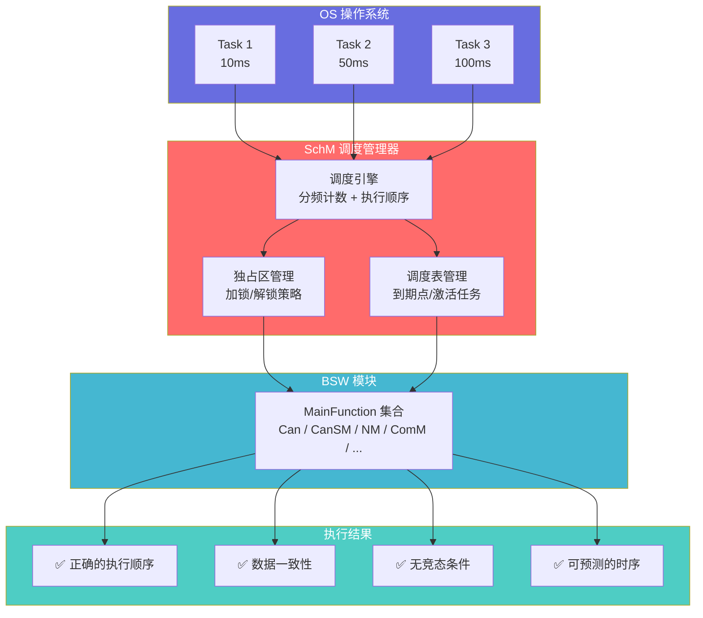

## 11.2 关键特性速查

| 特性 | 说明 |
|------|------|
| **模块层级** | 服务层（Services Layer），与OS紧耦合 |
| **核心机制** | MainFunction 分频调度 + Exclusive Area 资源保护 |
| **调度依据** | XML 配置 → 代码自动生成 |
| **保护策略** | SuspendAllInterrupts / SuspendOSInterrupts / GetResource / SpinLock |
| **关键文件** | SchM.c / SchM.h + 每个BSW模块对应的 SchM_<Module>.c/.h |
| **与RTE关系** | 同一Task中先后执行：SchM调度BSW → RTE调度SWC |
| **多核支持** | 通过 SpinLock 实现跨核互斥 |
| **最大挑战** | 调度抖动（Jitter）控制、Exclusive Area 嵌套深度 |

## 11.3 实际项目中的调度经验法则

```
📐 调度经验法则
═══════════════════════════════════════════

1️⃣  【MainFunction 周期选择】
    • 与 CAN 接收相关的   → 5~10ms
    • BSW 状态机          → 10~50ms
    • 非关键监视          → 50~100ms
    
2️⃣  【独占区设计】
    • 每个独占区应 < 10μs（防止影响中断响应）
    • 不要在一个独占区内调用会阻塞的函数
    • 避免独占区嵌套超过3层
    
3️⃣  【分频配置】
    • 高频模块的 Interval 设为 1（每次执行）
    • 低频功能通过递增 Interval 实现
    • 避免 Interval = 0（永不执行）

4️⃣  【抖动控制】
    • 高抖动敏感模块（如 CAN 发送）→ 单独高优先级 Task
    • 使用调度表（Schedule Table）替代 Task 轮询
    • 将独占区拆分为更小的粒度

5️⃣  【调试建议】
    • 在开发阶段打开 SchM 的时序日志
    • 用 DET 报告超时和违反顺序的调用
    • 用 Os_Trace 工具观察实际调度抖动
═══════════════════════════════════════════
```

---

> **本文档基于 AUTOSAR 4.x/5.x 规范中 SWS_SchM 章节及相关 BSW 调度规范编写**
>
> SchM 是 AUTOSAR 中**最容易被忽视却最关键**的模块之一。它不提供业务功能，但决定了所有 BSW 功能能否正确、及时、安全地执行。在集成项目中，80% 的时序问题（Can 丢帧、NM 超时、ComM 状态不同步）都可以追溯到 SchM 配置不当。
>
> **所有Mermaid图表均经过验证，可在支持Mermaid的Markdown渲染器中正常显示。**
