# AUTOSAR 看门狗详解：窗口狗、问答狗与 FWD 狗

> **看门狗（Watchdog）** 是嵌入式系统中最重要的"安保系统"——当程序跑飞或死锁时，它能自动复位系统。
> AUTOSAR 将看门狗分为 **驱动层** 和 **管理层**，其中"窗口狗"和"FWD 狗"是硬件看门狗的两种工作模式，"问答狗"是软件看门狗管理的一种监督机制。

---

## 目录

- [1. 通俗理解](#1-通俗理解)
  - [1.1 什么是看门狗？](#11-什么是看门狗)
  - [1.2 FWD 狗（自由运行看门狗）](#12-fwd-狗自由运行看门狗)
  - [1.3 窗口狗（窗口看门狗）](#13-窗口狗窗口看门狗)
  - [1.4 问答狗（问答式看门狗）](#14-问答狗问答式看门狗)
- [2. AUTOSAR 看门狗栈架构](#2-autosar-看门狗栈架构)
  - [2.1 三层架构](#21-三层架构)
  - [2.2 设计模式](#22-设计模式)
- [3. FWD 狗详解（自由运行看门狗）](#3-fwd-狗详解自由运行看门狗)
  - [3.1 FWD 模式原理](#31-fwd-模式原理)
  - [3.2 FWD 的技术要点](#32-fwd-的技术要点)
  - [3.3 FWD 工作流程](#33-fwd-工作流程)
  - [3.4 驱动代码示例](#34-驱动代码示例)
  - [3.5 三种硬件模式对比](#35-三种硬件模式对比)
- [4. 窗口狗详解（Wdg Driver）](#4-窗口狗详解wdg-driver)
  - [4.1 窗口模式原理](#41-窗口模式原理)
  - [4.2 窗口狗的技术要点](#42-窗口狗的技术要点)
  - [4.3 窗口狗工作流程](#43-窗口狗工作流程)
  - [4.4 驱动代码示例](#44-驱动代码示例)
- [5. 问答狗详解（WdgM 监督机制）](#5-问答狗详解wdgm-监督机制)
  - [5.1 三种监督机制总览](#51-三种监督机制总览)
  - [5.2 存活监督（Alive Supervision）](#52-存活监督alive-supervision)
  - [5.3 截止时间监督（Deadline Supervision）](#53-截止时间监督deadline-supervision)
  - [5.4 逻辑监督（Logical Supervision）](#54-逻辑监督logical-supervision)
  - [5.5 三种机制对比](#55-三种机制对比)
- [6. 逻辑监督详解——问答狗的核心](#6-逻辑监督详解问答狗的核心)
  - [6.1 监督实体（Supervised Entity）](#61-监督实体supervised-entity)
  - [6.2 程序流图（Program Flow Graph）](#62-程序流图program-flow-graph)
  - [6.3 问答机制工作流程](#63-问答机制工作流程)
  - [6.4 代码示例](#64-代码示例)
- [7. 深入原理](#7-深入原理)
  - [7.1 硬件看门狗内部结构](#71-硬件看门狗内部结构)
  - [7.2 WdgM 内部状态机](#72-wdgm-内部状态机)
  - [7.3 错误处理与系统复位](#73-错误处理与系统复位)
  - [7.4 多核系统中的看门狗](#74-多核系统中的看门狗)
- [8. 配置与实战](#8-配置与实战)
  - [8.1 Wdg 模块配置项](#81-wdg-模块配置项)
  - [8.2 WdgM 配置项](#82-wdgm-配置项)
  - [8.3 典型配置流程](#83-典型配置流程)

---

## 1. 通俗理解

### 1.1 什么是看门狗？

> **生活类比：** 看门狗就像一个 **小区保安**。
> - 你每隔一段时间要去保安室**签到**，证明你还在正常工作（喂狗）
> - 如果你没按时签到，保安就认为你出事了，**拉响警报**（复位系统）

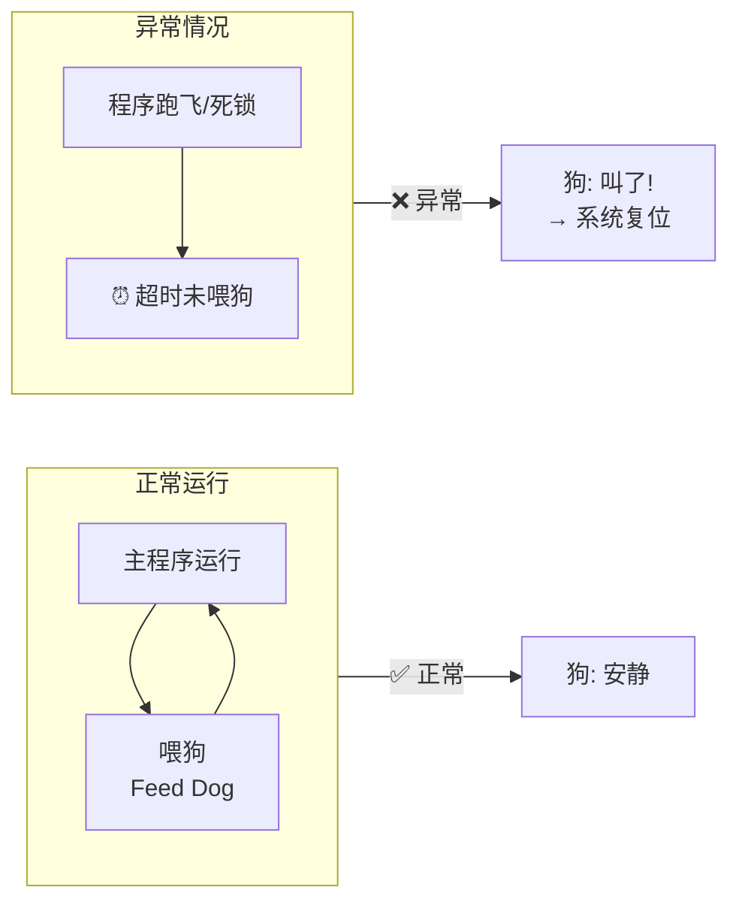
```mermaid
flowchart LR
    subgraph Normal["正常运行"]
        A["主程序运行"] --> B["喂狗<br/>Feed Dog"]
        B --> A
    end

    Normal -->|"✅ 正常"| DogOK["狗: 安静"]

    subgraph Fault["异常情况"]
        C["程序跑飞/死锁"] --> D["⏰ 超时未喂狗"]
    end

    Fault -->|"❌ 异常"| DogBark["狗: 叫了!<br/>→ 系统复位"]
```

**图中解释：** 看门狗的基本原理。程序正常运行时周期性喂狗，狗保持安静。程序异常时，喂狗动作停止，超时后狗触发系统复位。

### 1.2 FWD 狗（自由运行看门狗）

> **FWD 狗 = 最简单、最传统的看门狗，没有任何窗口限制**

**生活类比：** 这就好比小区保安说：**"你只要在 24 小时内来签一次到就行，具体什么时候来都行。"**
- 你可以在任何时间去签到，只要不超时
- 没有"太早"的概念——随时都可以喂
- 只有"超时"才会触发复位

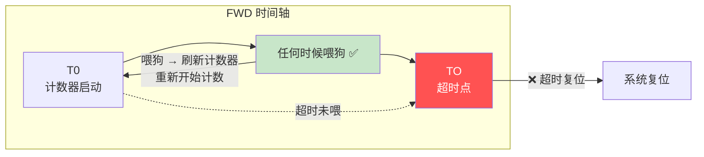
```mermaid
flowchart LR
    subgraph FWD_Timeline["FWD 时间轴"]
        T0["T0<br/>计数器启动"] --> FeedOK["任何时候喂狗 ✅"]
        FeedOK --> TO["TO<br/>超时点"]
    end

    FeedOK -->|"喂狗 → 刷新计数器<br/>重新开始计数"| T0

    T0 -.->|"超时未喂"| TO
    TO -->|"❌ 超时复位"| RST["系统复位"]

    style FeedOK fill:#C8E6C9
    style TO fill:#FF5252,color:#fff
```

**图中解释：** FWD（自由运行看门狗）的时间轴。从 T0 开始计数，在到达超时点 TO 之前的**任何时间**喂狗都可以，不存在"太早"的概念。每次喂狗都会刷新计数器，重新开始计数。如果超时未喂狗，则触发系统复位。

**FWD 的核心特征：**
- ✅ 任何时间都可以喂狗
- ✅ 没有窗口下边界（不会因为喂得太早而复位）
- ❌ 只有超时会触发复位
- 实现最简单，安全性也最低（容易被假喂狗绕过）

### 1.3 窗口狗（窗口看门狗）

> **窗口狗 = 有时间窗口限制的看门狗**

**生活类比：** 这就好比保安要求你 **只能在 9:00~9:05 之间签到**：
- ❌ 早于 9:00 签到 → 无效！可能你被胁迫了（恶作剧/异常）
- ✅ 9:00~9:05 签到 → 正常
- ❌ 晚于 9:05 签到 → 超时！出事了 → 复位


```mermaid
flowchart LR
    TL["过早喂狗<br/>❌ 复位"] -->|早于窗口| Window["喂狗窗口<br/>✅ 正常"]
    Window -->|晚于窗口| TU["过晚喂狗<br/>❌ 复位"]
    TU -->|超时| TO["超时<br/>❌ 复位"]
```

**为什么需要窗口？** 传统的简单看门狗只检查"是否超时"，但如果程序死在一个反复喂狗的循环中，传统看门狗就无法检测到。窗口狗要求喂狗必须在精确的时间窗口内，防止"虚假喂狗"。

### 1.4 问答狗（问答式看门狗）

> **问答狗 = 看门狗管理器主动提问，被监督者必须正确回答**

**生活类比：** 保安不再只是等你签到，而是 **主动巡逻并提问**：
- 保安：**"暗号？"**（提问）
- 被监督者：**"天王盖地虎"**（回答）
- 保安验证答案正确 → 通过 ✅
- 如果回答错误或超时未答 → 拉响警报 ❌

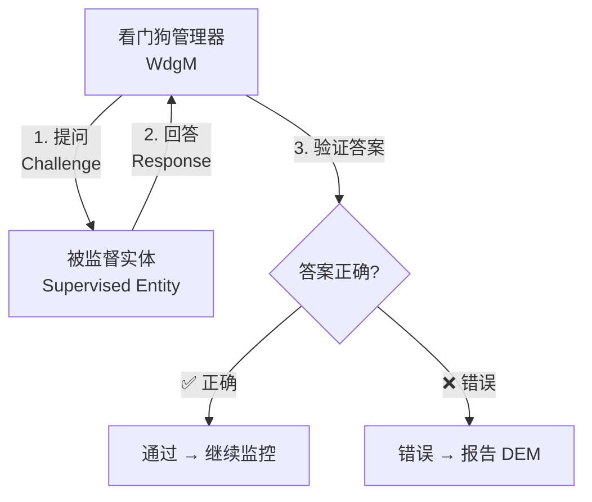
```mermaid
flowchart TB
    WdgM["看门狗管理器<br/>WdgM"] -->|"1. 提问<br/>Challenge"| SE["被监督实体<br/>Supervised Entity"]
    SE -->|"2. 回答<br/>Response"| WdgM
    WdgM -->|"3. 验证答案"| Check{答案正确?}
    Check -->|"✅ 正确"| Pass["通过 → 继续监控"]
    Check -->|"❌ 错误"| Fail["错误 → 报告 DEM"]
```

**图中解释：** 问答狗的核心是"一问一答"的验证机制，确保被监督程序不仅"活着"，而且"在正确执行正确的逻辑"。

---

## 2. AUTOSAR 看门狗栈架构

### 2.1 三层架构

AUTOSAR 看门狗栈分为三层，从下到上依次为：

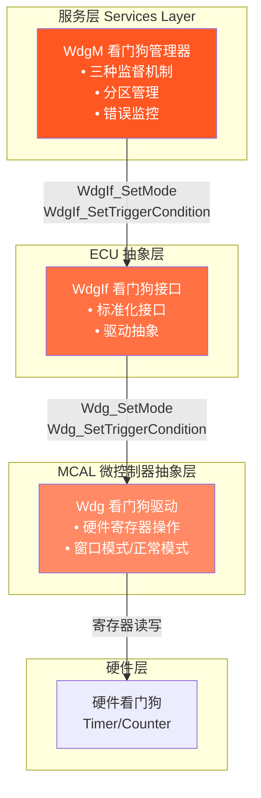
```mermaid
flowchart TB
    subgraph Services["服务层 Services Layer"]
        WdgM["WdgM 看门狗管理器<br/>• 三种监督机制<br/>• 分区管理<br/>• 错误监控"]
    end

    subgraph ECU_Abstraction["ECU 抽象层"]
        WdgIf["WdgIf 看门狗接口<br/>• 标准化接口<br/>• 驱动抽象"]
    end

    subgraph MCAL["MCAL 微控制器抽象层"]
        Wdg["Wdg 看门狗驱动<br/>• 硬件寄存器操作<br/>• 窗口模式/正常模式"]
    end

    subgraph Hardware["硬件层"]
        HW_WDG["硬件看门狗<br/>Timer/Counter"]
    end

    WdgM -->|"WdgIf_SetMode<br/>WdgIf_SetTriggerCondition"| WdgIf
    WdgIf -->|"Wdg_SetMode<br/>Wdg_SetTriggerCondition"| Wdg
    Wdg -->|"寄存器读写"| HW_WDG

    style WdgM fill:#FF5722,color:#fff
    style WdgIf fill:#FF7043,color:#fff
    style Wdg fill:#FF8A65,color:#fff
```

**图中解释：** AUTOSAR 看门狗栈的三层架构。Wdg（MCAL层）直接操作硬件寄存器；WdgIf（ECU抽象层）提供统一的接口抽象；WdgM（服务层）实现复杂的监督逻辑。上层只能通过相邻层进行交互。

### 2.2 设计模式

| 设计模式 | 应用 | 说明 |
|---------|------|------|
| **分层抽象** | Wdg ← WdgIf ← WdgM | 隔离硬件，上层不关心具体 MCU 的看门狗实现 |
| **观察者模式** | WdgM 监控各 Supervised Entity | WdgM 定期检查各监督实体的状态 |
| **状态机** | WdgM 内部状态、每个 SE 的状态 | 用状态机管理看门狗的各种运行模式 |
| **问答机制（Challenge-Response）** | 逻辑监督 | 通过预定义的"问题-答案"对验证程序流 |
| **窗口约束** | Wdg 硬件窗口模式 | 约束喂狗时间范围，防止虚假喂狗 |

---

## 3. FWD 狗详解（自由运行看门狗）

### 3.1 FWD 模式原理

FWD（Free-running Watchdog，自由运行看门狗）是硬件看门狗最基础的工作模式。其核心原理非常简单：

> **一个自由运行的递减计数器 + 一个超时阈值 = 看门狗**

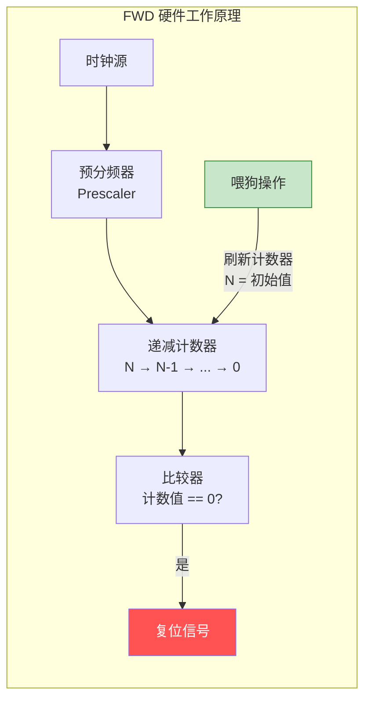
```mermaid
flowchart LR
    subgraph FWD_HW["FWD 硬件工作原理"]
        CLK["时钟源"] --> PR["预分频器<br/>Prescaler"]
        PR --> CNT["递减计数器<br/>N → N-1 → ... → 0"]
        CNT --> CMP["比较器<br/>计数值 == 0?"]
        CMP -->|"是"| RST["复位信号"]
        FEED["喂狗操作"] -->|"刷新计数器<br/>N = 初始值"| CNT
    end

    style FEED fill:#C8E6C9,stroke:#388E3C
    style RST fill:#FF5252,color:#fff
```

**图中解释：** FWD 的硬件结构非常简单。时钟经过预分频后驱动递减计数器，从初始值 N 递减到 0。当计数值到达 0 时，比较器输出复位信号。喂狗操作将计数器重新刷新为初始值 N，重新开始递减。FWD 没有窗口比较器，只有超时比较器。

#### 定时时间计算公式

```
定时时间 = 计数值 × 预分频值 / 时钟频率

例如：
  时钟频率 = 40 kHz
  预分频值 = 1
  计数值   = 40000

  定时时间 = 40000 × 1 / 40000 = 1 秒

  即：必须在 1 秒内至少喂狗一次
```

### 3.2 FWD 的技术要点

**1. 为什么叫"自由运行"？**

"自由运行"指的是：
- 计数器启动后自由递减，不受任何外部约束
- 喂狗操作没有时间窗口限制——任何时候喂狗都有效
- 只有"计数值到达 0"这一个条件会触发复位

**2. FWD 与传统看门狗的关系**

FWD 就是**最传统的看门狗**，也是大家通常所说的"看门狗"的默认含义。在 AUTOSAR 中，为了区分不同的工作模式，将其称为 FWD 模式。

**3. FWD 的安全局限性**

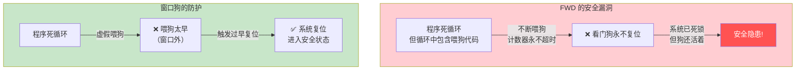
```mermaid
flowchart TB
    subgraph Attack["FWD 的安全漏洞"]
        DeadLoop["程序死循环<br/>但循环中包含喂狗代码"] -->|"不断喂狗<br/>计数器永不超时"| NoReset["❌ 看门狗永不复位"]
        NoReset -->|"系统已死锁<br/>但狗还活着"| Danger["安全隐患!"]
    end

    subgraph Window_Protection["窗口狗的防护"]
        DeadLoop2["程序死循环"] -->|"虚假喂狗"| EarlyFeed["❌ 喂狗太早<br/>（窗口外）"]
        EarlyFeed -->|"触发过早复位"| Reset["✅ 系统复位<br/>进入安全状态"]
    end

    style Attack fill:#FFCDD2
    style Danger fill:#FF5252,color:#fff
    style Window_Protection fill:#C8E6C9
```

**图中解释：** FWD 的安全局限性。如果程序进入一个死循环，但循环中恰好包含喂狗代码，FWD 会被不断刷新而永不超时，无法检测到系统异常。而窗口狗由于有下边界限制，这种"虚假喂狗"会被检测为"过早喂狗"并触发复位。

### 3.3 FWD 工作流程

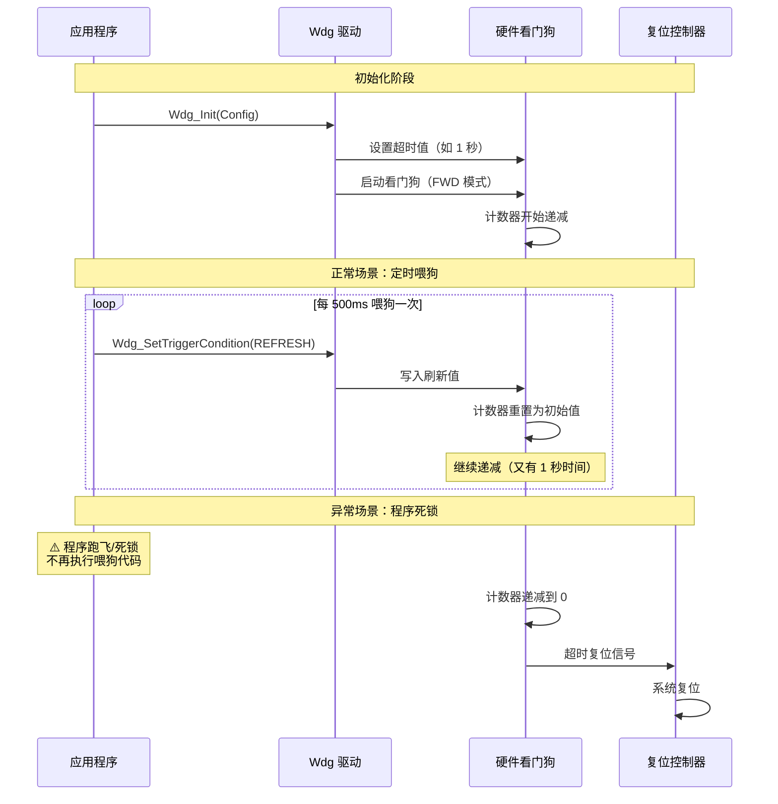
```mermaid
sequenceDiagram
    participant App as 应用程序
    participant Wdg as Wdg 驱动
    participant HW as 硬件看门狗
    participant RST as 复位控制器

    Note over App,RST: 初始化阶段
    App->>Wdg: Wdg_Init(Config)
    Wdg->>HW: 设置超时值（如 1 秒）
    Wdg->>HW: 启动看门狗（FWD 模式）
    HW->>HW: 计数器开始递减

    Note over App,RST: 正常场景：定时喂狗
    loop 每 500ms 喂狗一次
        App->>Wdg: Wdg_SetTriggerCondition(REFRESH)
        Wdg->>HW: 写入刷新值
        HW->>HW: 计数器重置为初始值
        Note over HW: 继续递减（又有 1 秒时间）
    end

    Note over App,RST: 异常场景：程序死锁
    Note over App: ⚠️ 程序跑飞/死锁<br/>不再执行喂狗代码
    HW->>HW: 计数器递减到 0

    HW->>RST: 超时复位信号
    RST->>RST: 系统复位
```

**图中解释：** FWD 的工作流程非常简单。初始化后，定时器开始递减计数。应用程序需要在超时前执行喂狗操作（`Wdg_SetTriggerCondition`），刷新计数器。如果程序异常导致喂狗停止，计数器递减到 0 后触发硬件复位。

### 3.4 驱动代码示例

```c
/* ============================================================
 * Wdg_FWD.c — FWD 模式看门狗驱动实现（简化示例）
 * 与窗口狗驱动共享同一硬件，但工作模式不同
 * ============================================================ */

#include "Wdg.h"
#include "Wdg_Regs.h"

/* FWD 配置结构体（比窗口狗更简单，没有窗口参数） */
typedef struct {
    uint32              RegisterBase;       /* 寄存器基地址 */
    uint16              TimeoutValue;       /* 超时值 */
    uint16              Prescaler;          /* 预分频系数 */
    WdgIf_ModeType      DefaultMode;        /* 默认模式 */
} Wdg_FwdConfigType;

/* ============================================================
 * FWD 模式初始化
 * 与窗口狗的区别：没有窗口寄存器配置
 * ============================================================ */
void Wdg_Init_FwdMode(const Wdg_ConfigType* ConfigPtr)
{
    uint32 baseAddr;

    if (ConfigPtr == NULL_PTR) {
        Det_ReportError(WDG_MODULE_ID, WDG_INSTANCE_ID,
                        WDG_INIT_SID, WDG_E_PARAM_CONFIG);
        return;
    }

    baseAddr = ConfigPtr->WdgRegisterBase;

    /* 1. 关闭看门狗（配置阶段必须先关闭） */
    HW_WDG_CR(baseAddr) = 0;

    /* 2. 设置超时值（仅需设置超时值，无需窗口参数） */
    HW_WDG_TO(baseAddr) = ConfigPtr->TimeoutValue;

    /* 3. 配置预分频器 */
    HW_WDG_PR(baseAddr) = ConfigPtr->Prescaler;

    /* 4. 确保窗口模式关闭（FWD 模式 = 非窗口模式） */
    HW_WDG_CR(baseAddr) &= ~WDG_CR_WIN_EN;

    /* 5. 使能看门狗 */
    HW_WDG_CR(baseAddr) |= WDG_CR_EN;
    HW_WDG_CR(baseAddr) |= WDG_CR_WDT_EN;
}

/* ============================================================
 * FWD 喂狗操作（SetTriggerCondition）
 * 任何时间调用都有效，没有窗口限制
 * ============================================================ */
void Wdg_SetTriggerCondition_Fwd(uint16 timeout)
{
    uint32 baseAddr;

    if (Wdg_ConfigPtr == NULL_PTR) {
        return;
    }

    baseAddr = Wdg_ConfigPtr->WdgRegisterBase;

    /* FWD 模式：直接写入刷新值，硬件不会检查窗口
     * 无论当前计数值是多少，都重新加载 */
    HW_WDG_CR(baseAddr) = (HW_WDG_CR(baseAddr) & ~WDG_CR_TIMEOUT_MASK)
                          | (timeout & WDG_CR_TIMEOUT_MASK);
    HW_WDG_CR(baseAddr) |= WDG_CR_WDT_EN;

    /* 注意：在 FWD 模式下，没有"过早喂狗"的检查
     * 即使计数器刚刷新完立即再次刷新，也不会触发复位 */
}

/* ============================================================
 * FWD 模式切换
 * 慢速模式 = 长超时（如 1 秒）
 * 快速模式 = 短超时（如 100ms）
 * ============================================================ */
void Wdg_SetMode_Fwd(WdgIf_ModeType Mode)
{
    uint32 baseAddr = Wdg_ConfigPtr->WdgRegisterBase;

    switch (Mode) {
        case WDGIF_OFF_MODE:
            HW_WDG_CR(baseAddr) &= ~WDG_CR_WDT_EN;
            break;

        case WDGIF_SLOW_MODE:
            /* 慢速模式：较长的超时时间
             * 适用于启动阶段或低功耗模式 */
            HW_WDG_TO(baseAddr) = Wdg_ConfigPtr->SlowTimeoutValue;
            HW_WDG_CR(baseAddr) |= WDG_CR_WDT_EN;
            break;

        case WDGIF_FAST_MODE:
            /* 快速模式：较短的超时时间
             * 适用于正常运行阶段，提高安全性 */
            HW_WDG_TO(baseAddr) = Wdg_ConfigPtr->FastTimeoutValue;
            HW_WDG_CR(baseAddr) |= WDG_CR_WDT_EN;
            break;

        default:
            break;
    }
}

/* ============================================================
 * 应用层喂狗示例
 * ============================================================ */

/* 主循环中喂狗 */
void main(void)
{
    /* 系统初始化 */
    System_Init();
    Wdg_Init(&Wdg_Config);  /* FWD 模式 */

    /* 主循环 */
    while (1) {
        /* 执行各种任务 */
        Task_10ms();
        Task_100ms();
        Task_1s();

        /* 喂狗：确保在超时前执行
         * 由于是 FWD 模式，在任何位置喂狗都有效 */
        Wdg_SetTriggerCondition(WDG_REFRESH_VALUE);
    }
}

/* 中断中喂狗（用于防止主循环死锁） */
void ISR_1ms_Tick(void)
{
    static uint16 counter = 0;

    /* 每 1ms 进入一次中断 */

    counter++;
    if (counter >= 500) {  /* 每 500ms */
        /* 在中断中喂狗，防止主循环死锁后仍能喂狗
         * 但这也意味着"主循环死锁但中断还在运行"时
         * FWD 无法检测到异常 */
        Wdg_SetTriggerCondition(WDG_REFRESH_VALUE);
        counter = 0;
    }
}
```

### 3.5 三种硬件模式对比

在深入窗口狗之前，先对比三种看门狗硬件模式：

| 特性 | FWD 狗（自由运行） | 窗口狗（窗口模式） | 问答狗（逻辑监督） |
|------|------------------|------------------|-----------------|
| **所属层** | 硬件驱动（Wdg） | 硬件驱动（Wdg） | 软件管理（WdgM） |
| **喂狗时机** | 任何时间 | 必须在窗口内 | 通过检查点验证路径 |
| **太早喂狗** | ✅ 允许 | ❌ 触发复位 | N/A |
| **太晚喂狗** | ❌ 超时复位 | ❌ 超时复位 | ❌ 超时复位 |
| **安全性** | ⭐ 低 | ⭐⭐⭐ 中 | ⭐⭐⭐⭐⭐ 高 |
| **实现复杂度** | 极低 | 低 | 高 |
| **硬件需求** | 仅需定时器 | 需窗口比较器 | 需 WdgM 软件支持 |
| **典型场景** | 简单系统、启动阶段 | 安全关键系统 | ASIL 等级系统 |

---

## 4. 窗口狗详解（Wdg Driver）

### 4.1 窗口模式原理

窗口看门狗的核心是**两个时间边界**：

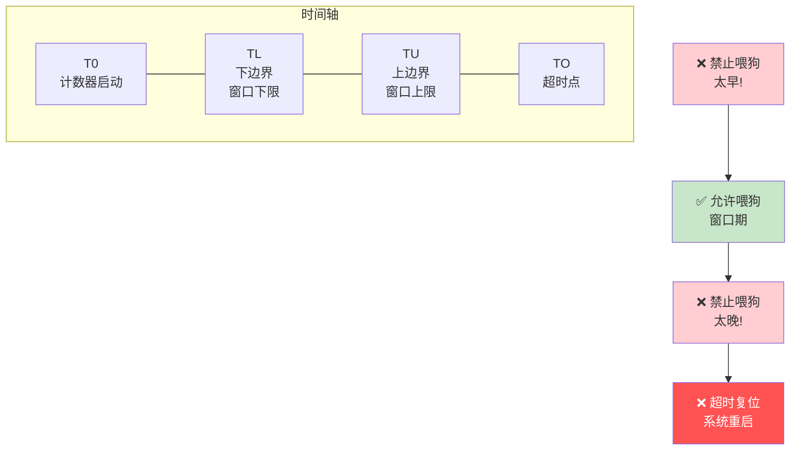
```mermaid
flowchart TB
    subgraph TimeLine["时间轴"]
        T0["T0<br/>计数器启动"]
        TL["TL<br/>下边界<br/>窗口下限"]
        TU["TU<br/>上边界<br/>窗口上限"]
        TO["TO<br/>超时点"]
    end

    Z1["❌ 禁止喂狗<br/>太早!"] --> Z2["✅ 允许喂狗<br/>窗口期"]
    Z2 --> Z3["❌ 禁止喂狗<br/>太晚!"] --> Z4["❌ 超时复位<br/>系统重启"]

    T0 --- TL
    TL --- TU
    TU --- TO

    style Z1 fill:#FFCDD2
    style Z2 fill:#C8E6C9
    style Z3 fill:#FFCDD2
    style Z4 fill:#FF5252,color:#fff
```

**图中解释：** 窗口看门狗的时间轴。从 T0 开始计数，到达 TL（下边界）之前喂狗会导致**过早复位**；在 TL~TU（窗口期）内喂狗正常；超过 TU 后喂狗导致**过晚复位**；超过 TO 不喂狗导致**超时复位**。

#### 窗口计算公式

```
窗口下边界 TL = TimeLowerLimit
窗口上边界 TU = TimeUpperLimit
超时时间 TO = Timeout

喂狗有效区间：[TL, TU]
喂狗无效区间：[0, TL) ∪ (TU, TO)

例如：
  时钟频率 = 10kHz (周期 100μs)
  窗口下边界 = 50 计数 → 5ms
  窗口上边界 = 200 计数 → 20ms
  超时值     = 256 计数 → 25.6ms

  喂狗必须在 5ms ~ 20ms 之间完成
```

### 4.2 窗口狗的技术要点

**1. 为什么要有下边界（窗口下限）？**

防止以下场景：
- 程序进入一个死循环，循环中正好有喂狗代码
- 程序在异常高频执行，但每次都喂狗
- 中断风暴导致频繁喂狗

**2. 硬件实现方式**

硬件窗口看门狗通常有两种实现：
- **递减计数器模式**：加载初值后递减，窗口通过比较器实现
- **独立上下边界寄存器**：分别设置上下边界值

**3. 与普通看门狗的对比**

| 特性 | 普通看门狗 | 窗口看门狗 |
|------|-----------|-----------|
| 检查机制 | 超时检查 | 超时 + 过早检查 |
| 安全性 | 低（可被假喂狗绕过） | 高（窗口约束） |
| 实现复杂度 | 简单 | 中等 |
| 喂狗灵活性 | 随时可喂 | 必须在窗口内喂 |
| 典型应用 | 简单系统 | 安全关键系统（ASIL） |

### 4.3 窗口狗工作流程

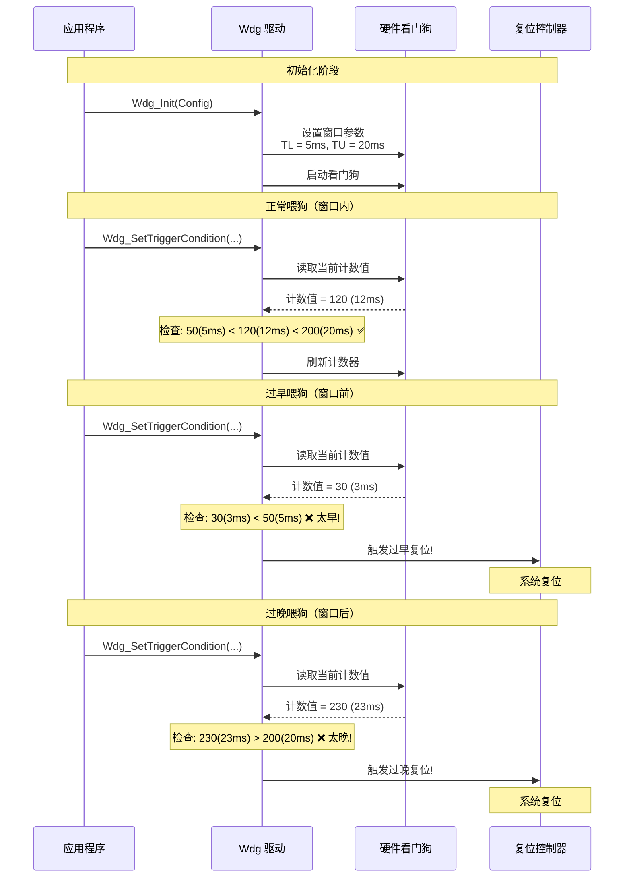
```mermaid
sequenceDiagram
    participant App as 应用程序
    participant Wdg as Wdg 驱动
    participant HW as 硬件看门狗
    participant RST as 复位控制器

    Note over App,RST: 初始化阶段
    App->>Wdg: Wdg_Init(Config)
    Wdg->>HW: 设置窗口参数<br/>TL = 5ms, TU = 20ms
    Wdg->>HW: 启动看门狗

    Note over App,RST: 正常喂狗（窗口内）
    App->>Wdg: Wdg_SetTriggerCondition(...)
    Wdg->>HW: 读取当前计数值
    HW-->>Wdg: 计数值 = 120 (12ms)
    Note over Wdg: 检查: 50(5ms) < 120(12ms) < 200(20ms) ✅
    Wdg->>HW: 刷新计数器

    Note over App,RST: 过早喂狗（窗口前）
    App->>Wdg: Wdg_SetTriggerCondition(...)
    Wdg->>HW: 读取当前计数值
    HW-->>Wdg: 计数值 = 30 (3ms)
    Note over Wdg: 检查: 30(3ms) < 50(5ms) ❌ 太早!
    Wdg->>RST: 触发过早复位!
    Note over RST: 系统复位

    Note over App,RST: 过晚喂狗（窗口后）
    App->>Wdg: Wdg_SetTriggerCondition(...)
    Wdg->>HW: 读取当前计数值
    HW-->>Wdg: 计数值 = 230 (23ms)
    Note over Wdg: 检查: 230(23ms) > 200(20ms) ❌ 太晚!
    Wdg->>RST: 触发过晚复位!
    Note over RST: 系统复位
```

**图中解释：** 窗口看门狗三种场景：正常喂狗发生在窗口内，计数器被刷新；过早喂狗在上边界之前触发过早复位；过晚喂狗在下边界之后触发过晚复位。硬件窗口看门狗的复位由硬件直接触发，软件无法干预。

### 4.4 驱动代码示例

```c
/* ============================================================
 * Wdg.h — Wdg 驱动接口定义
 * ============================================================ */

/* 看门狗模式 */
typedef enum {
    WDGIF_OFF_MODE,         /* 关闭 */
    WDGIF_SLOW_MODE,        /* 慢速模式（长超时） */
    WDGIF_FAST_MODE         /* 快速模式（短超时） */
} WdgIf_ModeType;

/* 触发条件 */
typedef enum {
    WDG_TRIGGER_ON_TRANSITION,  /* 模式切换时触发 */
    WDG_TRIGGER_ON_VALUE        /* 按值触发 */
} Wdg_TriggerType;

/* ============================================================
 * Wdg.c — 窗口看门狗驱动实现（简化示例）
 * ============================================================ */

#include "Wdg.h"
#include "Wdg_Regs.h"   /* 硬件寄存器地址映射 */

/* 窗口配置结构体 */
typedef struct {
    uint16 WindowLowerLimit;    /* 窗口下边界 */
    uint16 WindowUpperLimit;    /* 窗口上边界 */
    uint16 TimeoutValue;        /* 超时值 */
    boolean WindowModeEnabled;  /* 窗口模式使能 */
} Wdg_HwConfigType;

/* 保存的配置 */
static const Wdg_ConfigType* Wdg_ConfigPtr = NULL_PTR;

/* ============================================================
 * 初始化看门狗
 * ============================================================ */
void Wdg_Init(const Wdg_ConfigType* ConfigPtr)
{
    if (ConfigPtr == NULL_PTR) {
        Det_ReportError(WDG_MODULE_ID, WDG_INSTANCE_ID,
                        WDG_INIT_SID, WDG_E_PARAM_CONFIG);
        return;
    }

    Wdg_ConfigPtr = ConfigPtr;

    /* 硬件初始化 */
    uint32 baseAddr = Wdg_ConfigPtr->WdgRegisterBase;

    /* 1. 关闭看门狗（配置阶段必须先关闭） */
    HW_WDG_CR(baseAddr) = 0;

    /* 2. 设置窗口参数 */
    HW_WDG_WL(baseAddr) = Wdg_ConfigPtr->WindowLowerLimit;  /* 下边界 */
    HW_WDG_WU(baseAddr) = Wdg_ConfigPtr->WindowUpperLimit;  /* 上边界 */
    HW_WDG_TO(baseAddr) = Wdg_ConfigPtr->TimeoutValue;      /* 超时值 */

    /* 3. 配置预分频器 */
    HW_WDG_PR(baseAddr) = Wdg_ConfigPtr->Prescaler;

    /* 4. 使能窗口模式（如果配置） */
    if (Wdg_ConfigPtr->WindowModeEnabled) {
        HW_WDG_CR(baseAddr) |= WDG_CR_WIN_EN;   /* 窗口模式使能位 */
    }

    /* 5. 使能看门狗 */
    HW_WDG_CR(baseAddr) |= WDG_CR_EN;            /* 看门狗使能位 */
    HW_WDG_CR(baseAddr) |= WDG_CR_WDT_EN;        /* 看门狗启动 */
}

/* ============================================================
 * 设置触发条件（喂狗）
 * ============================================================ */
void Wdg_SetTriggerCondition(uint16 timeout)
{
    uint32 baseAddr;

    if (Wdg_ConfigPtr == NULL_PTR) {
        return;  /* 未初始化 */
    }

    baseAddr = Wdg_ConfigPtr->WdgRegisterBase;

    /* 在窗口模式下，写入刷新值即触发硬件检查
     * 硬件自动判断当前计数值是否在窗口内
     * 如果不在窗口内，硬件自动触发复位 */
    HW_WDG_CR(baseAddr) = (HW_WDG_CR(baseAddr) & ~WDG_CR_TIMEOUT_MASK)
                          | (timeout & WDG_CR_TIMEOUT_MASK);
    HW_WDG_CR(baseAddr) |= WDG_CR_WDT_EN;
}

/* ============================================================
 * 设置看门狗模式
 * ============================================================ */
void Wdg_SetMode(WdgIf_ModeType Mode)
{
    uint32 baseAddr = Wdg_ConfigPtr->WdgRegisterBase;

    switch (Mode) {
        case WDGIF_OFF_MODE:
            HW_WDG_CR(baseAddr) &= ~WDG_CR_WDT_EN;
            break;

        case WDGIF_SLOW_MODE:
            HW_WDG_TO(baseAddr) = Wdg_ConfigPtr->SlowTimeoutValue;
            HW_WDG_CR(baseAddr) |= WDG_CR_WDT_EN;
            break;

        case WDGIF_FAST_MODE:
            HW_WDG_TO(baseAddr) = Wdg_ConfigPtr->FastTimeoutValue;
            HW_WDG_CR(baseAddr) |= WDG_CR_WDT_EN;
            break;

        default:
            /* 无效模式 */
            break;
    }
}

/* ============================================================
 * 获取版本信息
 * ============================================================ */
void Wdg_GetVersionInfo(Std_VersionInfoType* VersionInfo)
{
    if (VersionInfo == NULL_PTR) {
        return;
    }
    VersionInfo->moduleID      = WDG_MODULE_ID;
    VersionInfo->sw_major_ver  = WDG_MAJOR_VERSION;
    VersionInfo->sw_minor_ver  = WDG_MINOR_VERSION;
    VersionInfo->sw_patch_ver  = WDG_PATCH_VERSION;
}
```

---

## 5. 问答狗详解（WdgM 监督机制）

### 5.1 三种监督机制总览

WdgM 实现了三种软件监督机制，**问答狗**是其中**逻辑监督（Logical Supervision）** 的通俗叫法：

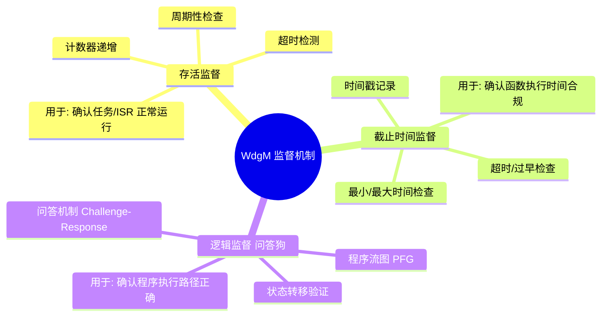
```mermaid
mindmap
  root((WdgM 监督机制))
    存活监督
      计数器递增
      周期性检查
      超时检测
      用于: 确认任务/ISR 正常运行
    截止时间监督
      时间戳记录
      最小/最大时间检查
      超时/过早检查
      用于: 确认函数执行时间合规
    逻辑监督 问答狗
      程序流图 PFG
      问答机制 Challenge-Response
      状态转移验证
      用于: 确认程序执行路径正确
```

### 5.2 存活监督（Alive Supervision）

**原理：** 被监督实体需要定期递增一个"存活计数器"，WdgM 周期性检查该计数器是否在增长。

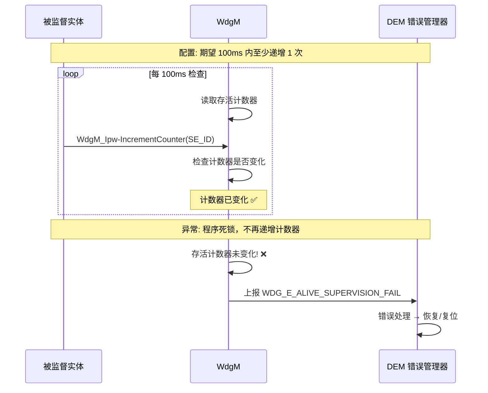
```mermaid
sequenceDiagram
    participant SE as 被监督实体
    participant WdgM as WdgM
    participant DEM as DEM 错误管理器

    Note over SE,DEM: 配置: 期望 100ms 内至少递增 1 次

    loop 每 100ms 检查
        WdgM->>WdgM: 读取存活计数器
        SE->>WdgM: WdgM_Ipw-IncrementCounter(SE_ID)
        WdgM->>WdgM: 检查计数器是否变化
        Note over WdgM: 计数器已变化 ✅
    end

    Note over SE,DEM: 异常: 程序死锁，不再递增计数器
    WdgM->>WdgM: 存活计数器未变化! ❌
    WdgM->>DEM: 上报 WDG_E_ALIVE_SUPERVISION_FAIL
    DEM->>DEM: 错误处理 → 恢复/复位
```

**图中解释：** 存活监督是最简单的监督方式。被监督实体调用 `WdgM_IpwIncrementCounter` 递增计数器，WdgM 周期检查计数器变化。如果计数器停止增长，说明被监督实体不再执行。

**代码示例：**
```c
/* 被监督任务中 */
void Task_App_10ms(void)
{
    /* 业务逻辑 */
    ReadSensor();
    ProcessData();

    /* 喂存活狗 */
    WdgM_IpwIncrementCounter(SE_AppTask_ID);
}

/* WdgM 主函数中周期性检查 */
void WdgM_MainFunction(void)
{
    for (i = 0; i < numOfSE; i++) {
        if (WdgM_CheckAlive(&SE_list[i]) == FALSE) {
            Dem_ReportErrorStatus(WDG_E_ALIVE_SUPERVISION_FAIL);
        }
    }
}
```

### 5.3 截止时间监督（Deadline Supervision）

**原理：** 被监督实体报告"开始事件"和"结束事件"，WdgM 检查两者之间的时间差是否在允许范围内。

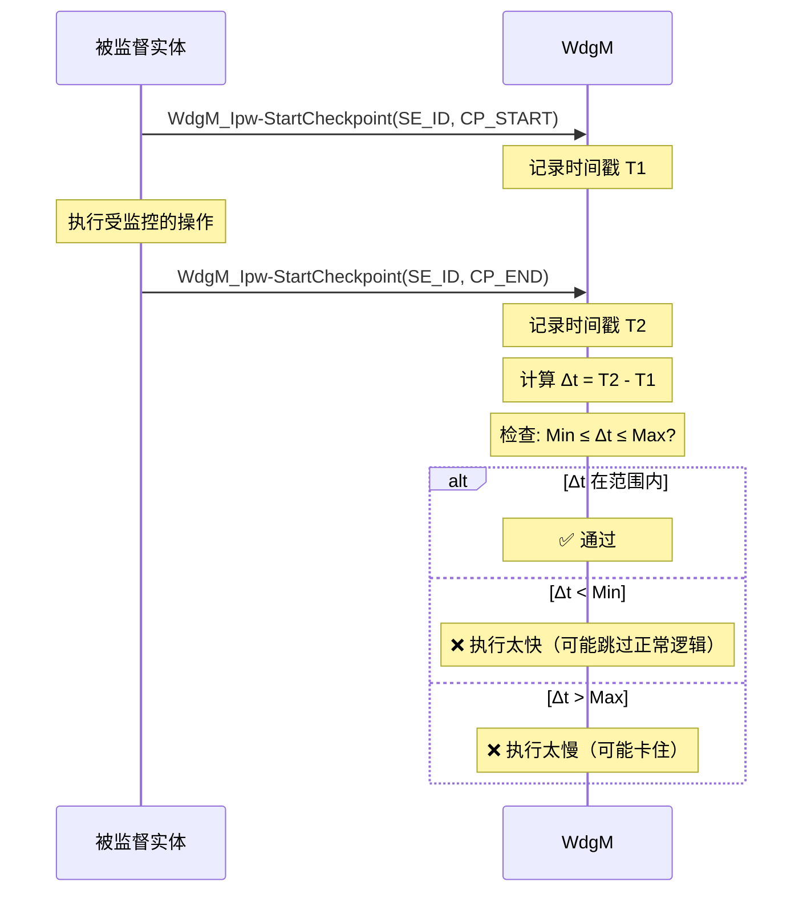
```mermaid
sequenceDiagram
    participant SE as 被监督实体
    participant WdgM as WdgM

    SE->>WdgM: WdgM_Ipw-StartCheckpoint(SE_ID, CP_START)
    Note over WdgM: 记录时间戳 T1

    Note over SE: 执行受监控的操作

    SE->>WdgM: WdgM_Ipw-StartCheckpoint(SE_ID, CP_END)
    Note over WdgM: 记录时间戳 T2
    Note over WdgM: 计算 Δt = T2 - T1
    Note over WdgM: 检查: Min ≤ Δt ≤ Max?

    alt Δt 在范围内
        Note over WdgM: ✅ 通过
    else Δt < Min
        Note over WdgM: ❌ 执行太快（可能跳过正常逻辑）
    else Δt > Max
        Note over WdgM: ❌ 执行太慢（可能卡住）
    end
```

**图中解释：** 截止时间监督通过时间戳检查执行时间。被监督实体在开始处和结束处分别设置检查点，WdgM 计算时间差并与配置的最小/最大时间比较。

**代码示例：**
```c
/* 截止时间监督配置 */
#define SE_CP_START  0u
#define SE_CP_END    1u

/* 配置：期望在 5ms ~ 15ms 内完成 */
/* WdgM 配置项：
 *   - DeadlineMin = 5ms
 *   - DeadlineMax = 15ms
 */

/* 函数开始 */
void Function_Under_Supervision(void)
{
    WdgM_IpwStartCheckpoint(SE_ID, SE_CP_START);

    /* ... 受监控的业务逻辑 ... */
    while (dataReady == FALSE) {
        WaitForInterrupt();
    }

    WdgM_IpwStartCheckpoint(SE_ID, SE_CP_END);
    /* WdgM 自动计算 Δt = 结束时间戳 - 开始时间戳 */
}
```

### 5.4 逻辑监督（Logical Supervision）

**这就是"问答狗"的核心机制。**

**原理：** 定义一组"程序流图（PFG, Program Flow Graph）"，每个节点代表一个程序位置，每条边代表一次合法的转移。被监督实体在到达每个节点时报告，WdgM 验证"当前节点 → 下一节点"的转移是否合法。

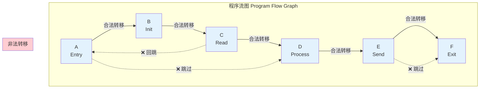
```mermaid
flowchart TB
    subgraph PFG["程序流图 Program Flow Graph"]
        A["A<br/>Entry"] -->|"合法转移"| B["B<br/>Init"]
        B -->|"合法转移"| C["C<br/>Read"]
        C -->|"合法转移"| D["D<br/>Process"]
        D -->|"合法转移"| E["E<br/>Send"]
        E -->|"合法转移"| F["F<br/>Exit"]
    end

    subgraph Illegal["非法转移"]
        A -.->|"❌ 跳过"| D
        C -.->|"❌ 回跳"| A
        E -.->|"❌ 跳过"| F
    end

    style Illegal fill:#FFCDD2
    style A fill:#E3F2FD
    style B fill:#E3F2FD
    style C fill:#E3F2FD
    style D fill:#E3F2FD
    style E fill:#E3F2FD
    style F fill:#E3F2FD
```

**图中解释：** 逻辑监督的程序流图。定义了一组合法的状态转移路径（A→B→C→D→E→F）。如果程序由于异常跳过了某些步骤（如从 A 直接跳到 D），或者出现了不在图中的转移（如从 C 回跳到 A），WdgM 会检测到非法转移并上报错误。

### 5.5 三种机制对比

| 特性 | 存活监督 | 截止时间监督 | 逻辑监督（问答狗） |
|------|---------|------------|----------------|
| 检查内容 | 是否在运行 | 执行时间是否合规 | 执行路径是否正确 |
| 实现复杂度 | 低 | 中 | 高 |
| 安全性 | 低 | 中 | 高 |
| 可检测的故障 | 死锁、跑飞 | 时间异常、性能退化 | 逻辑跳转错误、异常分支 |
| 资源消耗 | 极少 | 中等 | 较高 |
| 适用于 | 所有软件实体 | 时间关键型函数 | 安全关键型程序流 |

---

## 6. 逻辑监督详解——问答狗的核心

### 6.1 监督实体（Supervised Entity）

监督实体是 WdgM 监控的基本单元，每个 SE 对应一个被监控的程序实体：

```c
/* 监督实体配置结构体 */
typedef struct {
    uint16                      SE_ID;              /* 实体 ID */
    uint8                       AliveSupervisionRef;    /* 存活监督配置 */
    uint8                       DeadlineSupervisionRef; /* 截止时间监督配置 */
    uint8                       LogicalSupervisionRef;  /* 逻辑监督配置（问答狗） */
    uint8                       PartitionRef;           /* 所属分区 */
    WdgM_GlobalStatusType       ExpectedStatus;         /* 期望状态 */
} WdgM_SupervisedEntityConfigType;
```

### 6.2 程序流图（Program Flow Graph）

程序流图由多个**检查点（Checkpoint）** 和**转移边（Transition）** 组成：

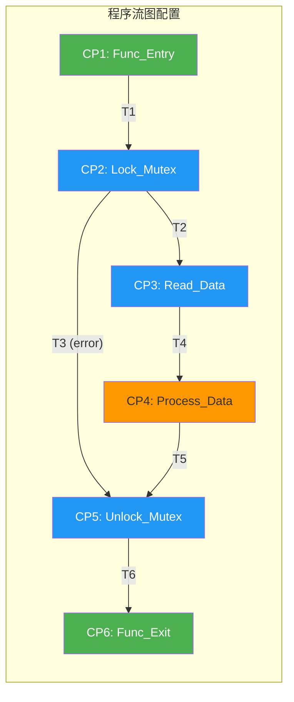
```mermaid
flowchart TB
    subgraph PFG_Config["程序流图配置"]
        direction TB
        CP1["CP1: Func_Entry"]
        CP2["CP2: Lock_Mutex"]
        CP3["CP3: Read_Data"]
        CP4["CP4: Process_Data"]
        CP5["CP5: Unlock_Mutex"]
        CP6["CP6: Func_Exit"]
    end

    CP1 -->|"T1"| CP2
    CP2 -->|"T2"| CP3
    CP2 -->|"T3 (error)"| CP5
    CP3 -->|"T4"| CP4
    CP4 -->|"T5"| CP5
    CP5 -->|"T6"| CP6

    style CP1 fill:#4CAF50,color:#fff
    style CP6 fill:#4CAF50,color:#fff
    style CP2 fill:#2196F3,color:#fff
    style CP3 fill:#2196F3,color:#fff
    style CP4 fill:#FF9800
    style CP5 fill:#2196F3,color:#fff
```

**图中解释：** 一个实际的程序流图配置。每个检查点对应程序中的一个位置，转移边定义了合法的路径。注意这里包含了**分支路径**：CP2 可以正常到 CP3，但如果出错可以直接到 CP5（错误处理路径）。这体现了问答狗的灵活性——可以定义多条合法路径。

**配置数据结构：**
```c
/* 检查点 ID */
typedef enum {
    CP_FUNC_ENTRY   = 0,
    CP_LOCK_MUTEX   = 1,
    CP_READ_DATA    = 2,
    CP_PROCESS_DATA = 3,
    CP_UNLOCK_MUTEX = 4,
    CP_FUNC_EXIT    = 5
} CP_ID_t;

/* 转移边配置 */
typedef struct {
    uint16 SourceCP;        /* 源检查点 */
    uint16 DestCP;          /* 目标检查点 */
    uint16 TransitionID;    /* 转移 ID */
} WdgM_TransitionConfigType;

/* 程序流图配置——定义合法转移 */
static const WdgM_TransitionConfigType PFG_Transitions[] = {
    { CP_FUNC_ENTRY,   CP_LOCK_MUTEX,   1 },  /* T1: 正常进入 */
    { CP_LOCK_MUTEX,   CP_READ_DATA,    2 },  /* T2: 正常读取 */
    { CP_LOCK_MUTEX,   CP_UNLOCK_MUTEX, 3 },  /* T3: 加锁失败→直接解锁退出 */
    { CP_READ_DATA,    CP_PROCESS_DATA, 4 },  /* T4: 正常处理 */
    { CP_PROCESS_DATA, CP_UNLOCK_MUTEX, 5 },  /* T5: 处理完成→解锁 */
    { CP_UNLOCK_MUTEX, CP_FUNC_EXIT,    6 }   /* T6: 正常退出 */
};
```

### 6.3 问答机制工作流程

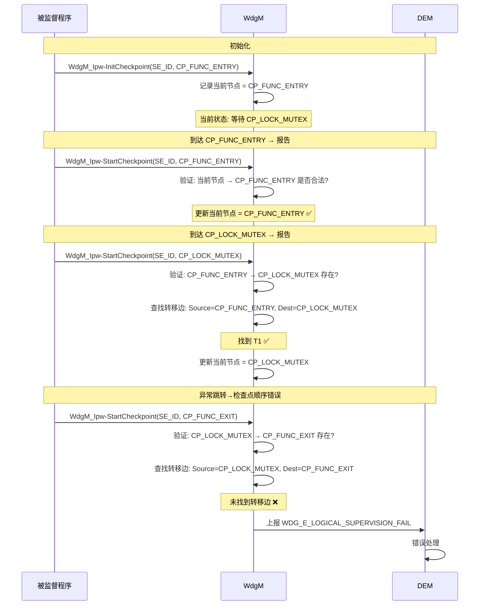
```mermaid
sequenceDiagram
    participant App as 被监督程序
    participant WdgM as WdgM
    participant DEM as DEM

    Note over App,DEM: 初始化
    App->>WdgM: WdgM_Ipw-InitCheckpoint(SE_ID, CP_FUNC_ENTRY)
    WdgM->>WdgM: 记录当前节点 = CP_FUNC_ENTRY
    Note over WdgM: 当前状态: 等待 CP_LOCK_MUTEX

    Note over App,DEM: 到达 CP_FUNC_ENTRY → 报告
    App->>WdgM: WdgM_Ipw-StartCheckpoint(SE_ID, CP_FUNC_ENTRY)
    WdgM->>WdgM: 验证: 当前节点 → CP_FUNC_ENTRY 是否合法?
    Note over WdgM: 更新当前节点 = CP_FUNC_ENTRY ✅

    Note over App,DEM: 到达 CP_LOCK_MUTEX → 报告
    App->>WdgM: WdgM_Ipw-StartCheckpoint(SE_ID, CP_LOCK_MUTEX)
    WdgM->>WdgM: 验证: CP_FUNC_ENTRY → CP_LOCK_MUTEX 存在?
    WdgM->>WdgM: 查找转移边: Source=CP_FUNC_ENTRY, Dest=CP_LOCK_MUTEX
    Note over WdgM: 找到 T1 ✅
    WdgM->>WdgM: 更新当前节点 = CP_LOCK_MUTEX

    Note over App,DEM: 异常跳转→检查点顺序错误
    App->>WdgM: WdgM_Ipw-StartCheckpoint(SE_ID, CP_FUNC_EXIT)
    WdgM->>WdgM: 验证: CP_LOCK_MUTEX → CP_FUNC_EXIT 存在?
    WdgM->>WdgM: 查找转移边: Source=CP_LOCK_MUTEX, Dest=CP_FUNC_EXIT
    Note over WdgM: 未找到转移边 ❌
    WdgM->>DEM: 上报 WDG_E_LOGICAL_SUPERVISION_FAIL
    DEM->>DEM: 错误处理
```

**图中解释：** 问答狗（逻辑监督）的完整工作流程。每次程序到达一个检查点，WdgM 都会验证"从上一个检查点到当前检查点"的转移是否在程序流图中定义。如果出现未定义的转移，则上报错误。

### 6.4 代码示例

```c
/* ============================================================
 * 问答狗监督示例：带锁保护的数据处理函数
 * 程序流图：
 *   Entry → Lock → Read → Process → Unlock → Exit
 *                     ↓               ↑
 *                  (error) → Unlock  (可选回退)
 * ============================================================ */

#include "WdgM.h"

/* 以下配置由 WdgM 配置工具生成 */

/* 监督实体 ID */
#define SE_DATA_PROCESS   0x01u

/* 检查点 ID */
#define CP_DATA_PROCESS_ENTRY   0x00u
#define CP_DATA_PROCESS_LOCK    0x01u
#define CP_DATA_PROCESS_READ    0x02u
#define CP_DATA_PROCESS_CALC    0x03u
#define CP_DATA_PROCESS_UNLOCK  0x04u
#define CP_DATA_PROCESS_EXIT    0x05u

/* ============================================================
 * 被监督的函数
 * 在执行过程中通过 WdgM_IpwStartCheckpoint 报告
 * 当前位置，WdgM 验证执行路径的合法性
 * ============================================================ */
Std_ReturnType DataProcess_Function(void)
{
    Std_ReturnType ret = E_OK;

    /* === 检查点 1: 函数入口 === */
    WdgM_IpwStartCheckpoint(SE_DATA_PROCESS, CP_DATA_PROCESS_ENTRY);

    /* === 检查点 2: 加锁 === */
    WdgM_IpwStartCheckpoint(SE_DATA_PROCESS, CP_DATA_PROCESS_LOCK);

    if (LockMutex() == E_NOT_OK) {
        /* 加锁失败 → 直接跳转到解锁检查点
         * 注意：这个跳转必须在 PFG 中定义（T3） */
        WdgM_IpwStartCheckpoint(SE_DATA_PROCESS, CP_DATA_PROCESS_UNLOCK);
        UnlockMutex();
        WdgM_IpwStartCheckpoint(SE_DATA_PROCESS, CP_DATA_PROCESS_EXIT);
        return E_NOT_OK;
    }

    /* === 检查点 3: 读取数据 === */
    WdgM_IpwStartCheckpoint(SE_DATA_PROCESS, CP_DATA_PROCESS_READ);

    if (ReadSensorData() == E_NOT_OK) {
        /* 读取失败 → 直接跳转到解锁
         * 注意：这个跳转同样必须在 PFG 中定义 */
        WdgM_IpwStartCheckpoint(SE_DATA_PROCESS, CP_DATA_PROCESS_UNLOCK);
        UnlockMutex();
        WdgM_IpwStartCheckpoint(SE_DATA_PROCESS, CP_DATA_PROCESS_EXIT);
        return E_NOT_OK;
    }

    /* === 检查点 4: 数据处理 === */
    WdgM_IpwStartCheckpoint(SE_DATA_PROCESS, CP_DATA_PROCESS_CALC);

    ProcessData();  /* 核心业务逻辑 */

    /* === 检查点 5: 解锁 === */
    WdgM_IpwStartCheckpoint(SE_DATA_PROCESS, CP_DATA_PROCESS_UNLOCK);
    UnlockMutex();

    /* === 检查点 6: 退出 === */
    WdgM_IpwStartCheckpoint(SE_DATA_PROCESS, CP_DATA_PROCESS_EXIT);

    return ret;
}

/* ============================================================
 * WdgM 主函数（在 SchM 调度表中周期性调用）
 * 检查所有监督实体的状态
 * ============================================================ */
void WdgM_MainFunction(void)
{
    uint8 i;

    for (i = 0; i < WdgM_NumSupervisedEntities; i++) {
        const WdgM_SupervisedEntityType* se = &WdgM_SupervisedEntities[i];

        /* 1. 存活监督检查 */
        if (se->AliveSupervision != NULL) {
            WdgM_CheckAliveSupervision(se);
        }

        /* 2. 截止时间监督检查 */
        if (se->DeadlineSupervision != NULL) {
            WdgM_CheckDeadlineSupervision(se);
        }

        /* 3. 逻辑监督检查（问答狗由 StartCheckpoint 触发，此处做超时检查） */
        if (se->LogicalSupervision != NULL) {
            WdgM_CheckLogicalSupervision(se);
        }
    }
}
```

---

## 7. 深入原理

### 7.1 硬件看门狗内部结构

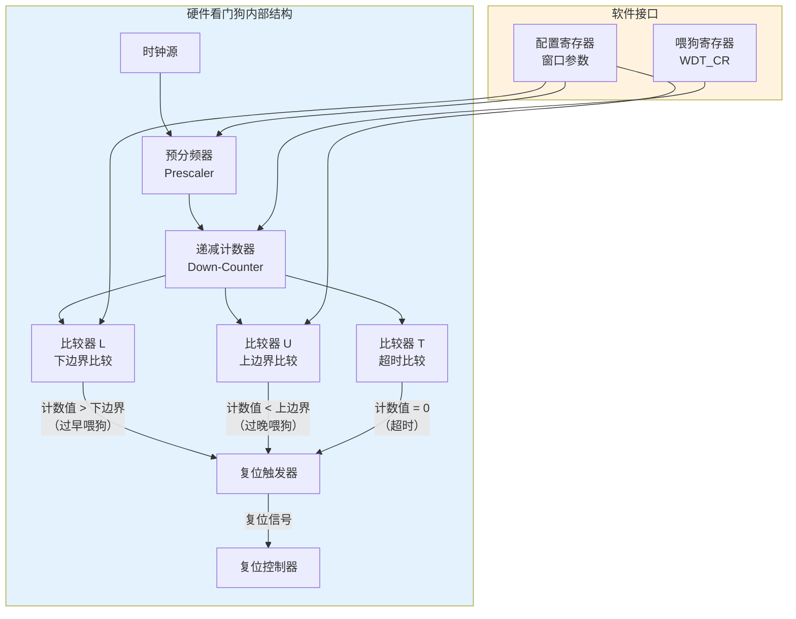
```mermaid
flowchart TB
    subgraph WDG_HW["硬件看门狗内部结构"]
        CLK["时钟源"] --> PR["预分频器<br/>Prescaler"]

        PR --> CNT["递减计数器<br/>Down-Counter"]

        CNT --> CMP_L["比较器 L<br/>下边界比较"]
        CNT --> CMP_U["比较器 U<br/>上边界比较"]
        CNT --> CMP_T["比较器 T<br/>超时比较"]

        CMP_L -->|"计数值 > 下边界<br/>（过早喂狗）"| RST["复位触发器"]
        CMP_U -->|"计数值 < 上边界<br/>（过晚喂狗）"| RST
        CMP_T -->|"计数值 = 0<br/>（超时）"| RST

        RST -->|"复位信号"| RST_CTRL["复位控制器"]
    end

    subgraph SW["软件接口"]
        FEED["喂狗寄存器<br/>WDT_CR"] --> CNT
        CFG["配置寄存器<br/>窗口参数"] --> CMP_L
        CFG --> CMP_U
        CFG --> PR
    end

    style WDG_HW fill:#E3F2FD
    style SW fill:#FFF3E0
```

**图中解释：** 硬件看门狗的内部结构。时钟经过预分频后驱动递减计数器。三个比较器分别监视不同条件：比较器L检测过早喂狗、比较器U检测过晚喂狗、比较器T检测超时。任何一个条件触发，都会输出复位信号。

### 7.2 WdgM 内部状态机

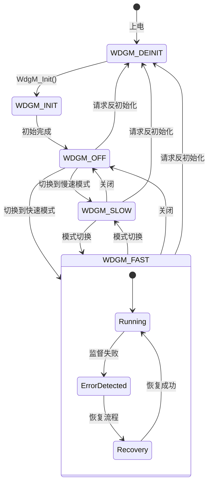
```mermaid
stateDiagram-v2
    [*] --> WDGM_DEINIT: 上电

    WDGM_DEINIT --> WDGM_INIT: WdgM_Init()
    WDGM_INIT --> WDGM_OFF: 初始完成

    WDGM_OFF --> WDGM_SLOW: 切换到慢速模式
    WDGM_OFF --> WDGM_FAST: 切换到快速模式

    WDGM_SLOW --> WDGM_FAST: 模式切换
    WDGM_FAST --> WDGM_SLOW: 模式切换

    WDGM_SLOW --> WDGM_OFF: 关闭
    WDGM_FAST --> WDGM_OFF: 关闭

    WDGM_OFF --> WDGM_DEINIT: 请求反初始化
    WDGM_SLOW --> WDGM_DEINIT: 请求反初始化
    WDGM_FAST --> WDGM_DEINIT: 请求反初始化

    state WDGM_FAST {
        [*] --> Running
        Running --> ErrorDetected: 监督失败
        ErrorDetected --> Recovery: 恢复流程
        Recovery --> Running: 恢复成功
    }
```

**图中解释：** WdgM 的状态机。主要状态包括：未初始化（DEINIT）、初始化（INIT）、关闭（OFF）、慢速模式（SLOW）和快速模式（FAST）。在快速模式下，如果检测到监督失败，进入错误检测状态，尝试恢复流程。不同模式对应不同的超时值，适应不同运行阶段的需求。

### 7.3 错误处理与系统复位

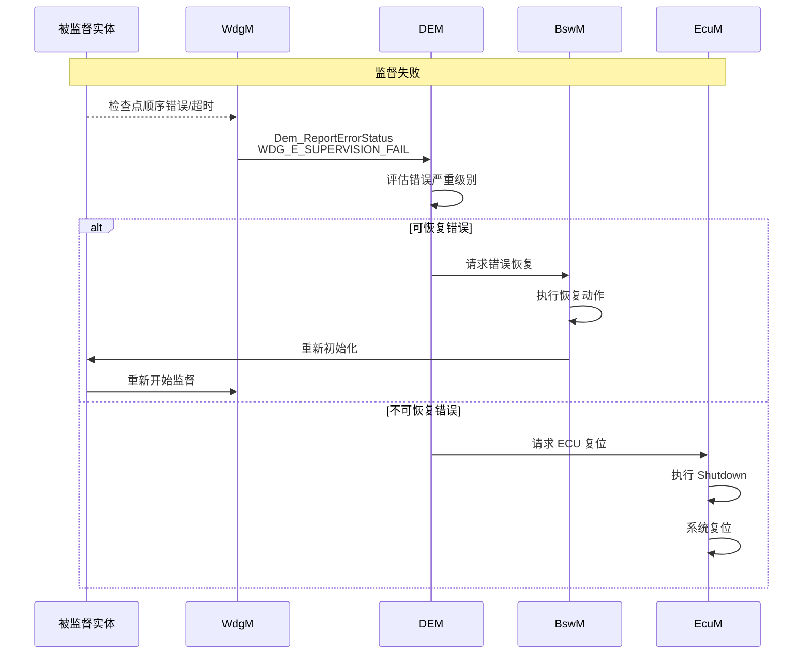
```mermaid
sequenceDiagram
    participant SE as 被监督实体
    participant WdgM as WdgM
    participant DEM as DEM
    participant BswM as BswM
    participant EcuM as EcuM

    Note over SE,EcuM: 监督失败
    SE-->>WdgM: 检查点顺序错误/超时

    WdgM->>DEM: Dem_ReportErrorStatus<br/>WDG_E_SUPERVISION_FAIL

    DEM->>DEM: 评估错误严重级别

    alt 可恢复错误
        DEM->>BswM: 请求错误恢复
        BswM->>BswM: 执行恢复动作
        BswM->>SE: 重新初始化
        SE->>WdgM: 重新开始监督
    else 不可恢复错误
        DEM->>EcuM: 请求 ECU 复位
        EcuM->>EcuM: 执行 Shutdown
        EcuM->>EcuM: 系统复位
    end
```

**图中解释：** 监督失败后的错误处理流程。WdgM 检测到错误后上报 DEM，DEM 评估严重级别。对于可恢复错误，BswM 执行恢复动作；对于不可恢复错误，EcuM 执行系统复位。

### 7.4 多核系统中的看门狗

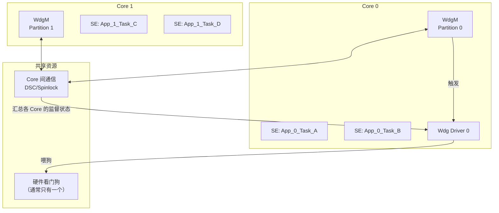
```mermaid
flowchart TB
    subgraph Core0["Core 0"]
        WdgM_0["WdgM<br/>Partition 0"]
        SE_0_1["SE: App_0_Task_A"]
        SE_0_2["SE: App_0_Task_B"]
        Wdg_0["Wdg Driver 0"]
    end

    subgraph Core1["Core 1"]
        WdgM_1["WdgM<br/>Partition 1"]
        SE_1_1["SE: App_1_Task_C"]
        SE_1_2["SE: App_1_Task_D"]
    end

    subgraph Shared["共享资源"]
        HW_WDG["硬件看门狗<br/>（通常只有一个）"]
        DSC["Core 间通信<br/>DSC/Spinlock"]
    end

    Wdg_0 -->|喂狗| HW_WDG
    WdgM_0 -->|触发| Wdg_0
    WdgM_0 <--> DSC
    WdgM_1 <--> DSC

    DSC -->|汇总各 Core 的监督状态| Wdg_0
```

**图中解释：** 多核系统中，每个核有自己的 WdgM 实例和分区，但硬件看门狗通常只有一个。各核的 WdgM 通过核间通信机制（DSC/Spinlock）交换监督状态，Core 0 负责汇总所有核的状态后统一喂狗。如果一个核失败，所有核一起复位。

---

## 8. 配置与实战

### 8.1 Wdg 模块配置项

| 配置项 | 说明 | 取值范围 |
|-------|------|---------|
| `WdgPrescaler` | 预分频系数 | 1, 2, 4, 8, 16, 32, 64, 128, 256 |
| `WdgWindowLowerLimit` | 窗口下边界（计数） | 0 ~ 0xFFFF |
| `WdgWindowUpperLimit` | 窗口上边界（计数） | 0 ~ 0xFFFF |
| `WdgTimeoutValue` | 超时值（计数） | 0 ~ 0xFFFF |
| `WdgWindowMode` | 窗口模式使能 | TRUE/FALSE |
| `WdgSlowTimeoutValue` | 慢速模式超时值 | 0 ~ 0xFFFF |
| `WdgFastTimeoutValue` | 快速模式超时值 | 0 ~ 0xFFFF |

### 8.2 WdgM 配置项

| 配置项 | 说明 |
|-------|------|
| `WdgMNumberOfSupervisedEntities` | 监督实体数量 |
| `WdgMAliveSupervision` | 存活监督配置（期望计数、检查周期） |
| `WdgMDeadlineSupervision` | 截止时间监督配置（最小/最大时间） |
| `WdgMLogicalSupervision` | 逻辑监督配置（检查点列表、转移边列表） |
| `WdgMMainFunctionPeriod` | WdgM 主函数调度周期 |
| `WdgMTimeoutValue` | 软件超时值 |
| `WdgMErrorDetectionBehavior` | 错误检测行为（通知/复位/恢复） |

### 8.3 典型配置流程

```mermaid
flowchart TB
    Step1["1. 需求分析<br/>• 安全等级 (ASIL)<br/>• 需要监控哪些软件实体<br/>• 需要哪种监督机制"]

    Step2["2. 硬件资源评估<br/>• 可用硬件看门狗数量<br/>• 时钟频率<br/>• 窗口能力"]

    Step3["3. Wdg 配置<br/>• 设置窗口参数<br/>• 设置超时值<br/>• 配置模式"]

    Step4["4. WdgM 配置<br/>• 定义监督实体<br/>• 配置检查点<br/>• 定义程序流图<br/>• 配置错误处理"]

    Step5["5. 代码集成<br/>• 在代码中插入检查点<br/>• 实现存活计数器<br/>• 设置截止时间标记"]

    Step6["6. 验证<br/>• 正常路径测试<br/>• 异常注入测试<br/>• 时间边界测试"]

    Step1 --> Step2
    Step2 --> Step3
    Step3 --> Step4
    Step4 --> Step5
    Step5 --> Step6
    Step6 -->|"验证失败"| Step3
    Step6 -->|"验证通过 ✅"| Done["配置完成"]
```

**图中解释：** 看门狗的典型配置流程。从需求分析开始，经过硬件评估、Wdg 配置、WdgM 配置、代码集成，最终进行验证。验证失败时需回退修改配置，验证通过后配置完成。

---

## 总结

```mermaid
flowchart TB
    subgraph WDG_Stack["AUTOSAR 看门狗栈"]
        WdgM["WdgM 看门狗管理器<br/>问答狗 🐕"]
        WdgIf["WdgIf 接口层"]
        Wdg["Wdg 驱动<br/>FWD 狗 + 窗口狗 🐕"]
    end

    subgraph Mechanisms["监督机制"]
        Alive["存活监督<br/>"还在跑吗？""]
        Deadline["截止时间监督<br/>"时间够吗？""]
        Logical["逻辑监督<br/>"路径对吗？""]
    end

    subgraph Hardware["硬件"]
        HW_FWD["FWD 模式<br/>自由运行"]
        HW_Window["窗口模式<br/>上下边界"]
    end

    Wdg --> HW_FWD
    Wdg --> HW_Window
    WdgM --> Alive
    WdgM --> Deadline
    WdgM --> Logical
    Logical -->|"Challenge-Response"| PFG["程序流图<br/>问答机制"]

    style Wdg fill:#FF8A65,color:#fff
    style WdgM fill:#FF5722,color:#fff
    style Logical fill:#FF5722,color:#fff
    style HW_FWD fill:#E3F2FD
    style HW_Window fill:#E3F2FD
```

| 概念 | 通俗名称 | 核心思想 | 对应模块 |
|------|---------|---------|---------|
| **FWD 狗** | 自由运行看门狗 | 在任何时间喂狗，超时即复位，实现最简单 | Wdg（FWD 模式） |
| **窗口狗** | 窗口看门狗 | 喂狗必须在规定的时间窗口内，太早或太晚都触发复位 | Wdg（窗口模式） |
| **问答狗** | 问答式看门狗 | 通过"提问-回答"机制验证程序执行路径是否正确 | WdgM（逻辑监督） |

**一句话总结：**

> **FWD 狗**管的是"有没有喂"——只要超时前喂了就行，实现最简单但安全性最低；
> **窗口狗**管的是"什么时候喂"——约束喂狗时间窗口，防止虚假喂狗；
> **问答狗**管的是"谁在喂、怎么喂"——通过检查点验证程序执行路径是否正确，确保程序在正确运行而非死循环。
>
> **实际项目中，三者通常组合使用：** 启动阶段用 FWD 模式（简单可靠），正常运行后切换到窗口模式（提高安全性），同时 WdgM 运行问答狗监督（软件级验证）。

---

> **参考标准：** AUTOSAR_SWS_WdgDriver、AUTOSAR_SWS_WdgInterface、AUTOSAR_SWS_WdgM