# CAN 协议详解：从物理层到数据链路层

> **CAN（Controller Area Network，控制器局域网）** 是德国 Bosch 公司 1983 年开发的串行通信协议，最初用于汽车内部 ECU 之间的通信。如今已成为汽车电子系统的"神经网络"，并在工业自动化、医疗设备、航空航天等领域广泛应用。
>
> 本文从 OSI 模型的角度，分层深入剖析 CAN 协议的完整设计。

---

## 目录

- [1. 通俗理解：CAN 是什么？](#1-通俗理解can-是什么)
  - [1.1 生活类比](#11-生活类比)
  - [1.2 CAN 的突出特点](#12-can-的突出特点)
  - [1.3 CAN 协议栈分层概览](#13-can-协议栈分层概览)
- [2. 物理层（Physical Layer）](#2-物理层physical-layer)
  - [2.1 电气特性与总线电平](#21-电气特性与总线电平)
  - [2.2 总线拓扑与终端匹配](#22-总线拓扑与终端匹配)
  - [2.3 位时序与同步](#23-位时序与同步)
  - [2.4 非破坏性逐位仲裁的物理基础](#24-非破坏性逐位仲裁的物理基础)
  - [2.5 CAN 收发器与节点结构](#25-can-收发器与节点结构)
  - [2.6 物理层对比：高速 CAN / 容错 CAN / 单线 CAN](#26-物理层对比高速-can--容错-can--单线-can)
- [3. 数据链路层（Data Link Layer）](#3-数据链路层data-link-layer)
  - [3.1 帧格式总览](#31-帧格式总览)
  - [3.2 数据帧（Data Frame）](#32-数据帧data-frame)
  - [3.3 远程帧（Remote Frame）](#33-远程帧remote-frame)
  - [3.4 错误帧（Error Frame）](#34-错误帧error-frame)
  - [3.5 过载帧（Overload Frame）](#35-过载帧overload-frame)
  - [3.6 帧间隔（Interframe Space）](#36-帧间隔interframe-space)
- [4. 总线仲裁机制（Arbitration）](#4-总线仲裁机制arbitration)
  - [4.1 CSMA/CR 原理](#41-csmacr-原理)
  - [4.2 仲裁过程详解](#42-仲裁过程详解)
  - [4.3 标识符优先级与 ID 分配策略](#43-标识符优先级与-id-分配策略)
- [5. 错误检测与处理（Error Handling）](#5-错误检测与处理error-handling)
  - [5.1 五种错误检测机制](#51-五种错误检测机制)
  - [5.2 错误状态与错误计数器](#52-错误状态与错误计数器)
  - [5.3 错误恢复与总线关闭](#53-错误恢复与总线关闭)
- [6. 位填充机制（Bit Stuffing）](#6-位填充机制bit-stuffing)
  - [6.1 填充规则](#61-填充规则)
  - [6.2 填充在同步中的作用](#62-填充在同步中的作用)
- [7. CAN 2.0A vs CAN 2.0B vs CAN FD vs CAN XL](#7-can-20a-vs-can-20b-vs-can-fd-vs-can-xl)
  - [7.1 标准帧与扩展帧](#71-标准帧与扩展帧)
  - [7.2 CAN FD（Flexible Data Rate）](#72-can-fdflexible-data-rate)
  - [7.3 CAN XL](#73-can-xl)
  - [7.4 各版本对比](#74-各版本对比)
- [8. 应用层协议概览](#8-应用层协议概览)
  - [8.1 CANopen](#81-canopen)
  - [8.2 J1939](#82-j1939)
  - [8.3 XCP over CAN](#83-xcp-over-can)
  - [8.4 UDS over CAN](#84-uds-over-can)
- [9. 深入原理与设计思想](#9-深入原理与设计思想)
  - [9.1 为什么 CAN 是"事件触发"而非"时间触发"？](#91-为什么-can-是事件触发而非时间触发)
  - [9.2 为什么 CAN 用"标识符"而非"地址"？](#92-为什么-can-用标识符而非地址)
  - [9.3 为什么 CAN 是最多 30 个节点？](#93-为什么-can-是最多-30-个节点)
  - [9.4 实时性与延迟分析](#94-实时性与延迟分析)
- [10. 总结](#10-总结)

---

## 1. 通俗理解：CAN 是什么？

### 1.1 生活类比

> **CAN 总线就像一条"多人共用"的对话通道**，大家都能听到彼此说话，但一次只有一个人能发言。

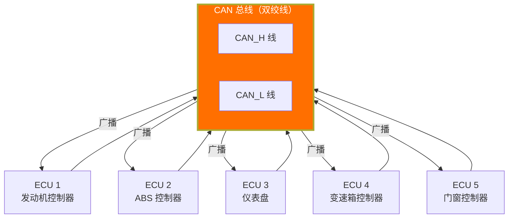

**图中解释：** CAN 总线上的所有节点通过一对双绞线（CAN_H 和 CAN_L）连接在一起。任何节点发送的消息都会被**广播**到所有其他节点。每个节点根据消息的标识符（ID）决定是否接收该消息。

### 1.2 CAN 的突出特点

| 特点 | 说明 | 类比 |
|------|------|------|
| **多主通信** | 任何节点都可以随时发起通信 | 会议室里任何人都可以发言 |
| **广播式** | 消息发送到所有节点，基于 ID 过滤接收 | 谁想听谁听 |
| **非破坏性仲裁** | 多个节点同时发送时，ID 小的获胜 | 优先级高的"抢到话筒" |
| **错误检测** | 5 种错误检测机制 | 每次发言都有人纠错 |
| **自动重发** | 发送失败自动重发 | 说得不好就再说一遍 |
| **高可靠性** | 错误严重的节点自动脱离总线 | 捣乱的人被请出会议室 |

### 1.3 CAN 协议栈分层概览

从 OSI 参考模型的角度看，CAN 协议主要覆盖**物理层**和**数据链路层**：

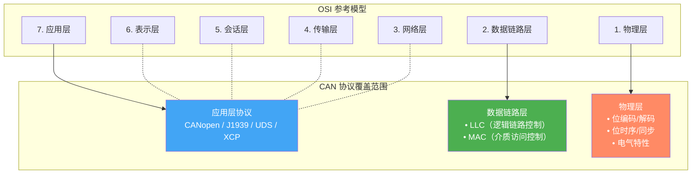

**图中解释：** CAN 协议在 OSI 模型中主要覆盖物理层和数据链路层。应用层协议（CANopen、J1939、UDS 等）在 CAN 核心协议之上构建。CAN 核心协议不涉及表示层、会话层、传输层和网络层——这些由应用层协议自行实现。

---

## 2. 物理层（Physical Layer）

### 2.1 电气特性与总线电平

CAN 总线使用**差分信号**传输，通过两条线（CAN_H 和 CAN_L）的电压差来表示逻辑电平：

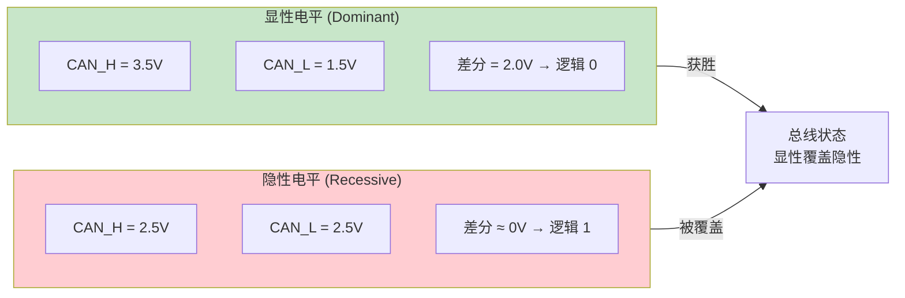

**图中解释：** CAN 总线的两种逻辑电平。**显性电平（Dominant，逻辑 0）**：CAN_H 约 3.5V，CAN_L 约 1.5V，差分电压约 2V。**隐性电平（Recessive，逻辑 1）**：CAN_H 和 CAN_L 均为 2.5V，差分电压约 0V。显性电平会覆盖隐性电平——这是仲裁机制的基础。

#### 关键电气参数

| 参数 | 高速 CAN（ISO 11898-2） | 容错 CAN（ISO 11898-3） |
|------|----------------------|----------------------|
| 总线电压范围 | 1.5V ~ 3.5V | -2V ~ 7V |
| 显性电平（CAN_H） | 3.5V | 3.5V ~ 4.0V |
| 显性电平（CAN_L） | 1.5V | 0.5V ~ 1.0V |
| 隐性电平 | 2.5V（两者相等） | 2.5V（两者相等） |
| 差分电压（显性） | 2.0V | 2.0V ~ 3.0V |
| 差分电压（隐性） | 0V | 0V |
| 最大速率 | 1 Mbps | 125 kbps |
| 最大节点数 | 30 | 32 |

### 2.2 总线拓扑与终端匹配

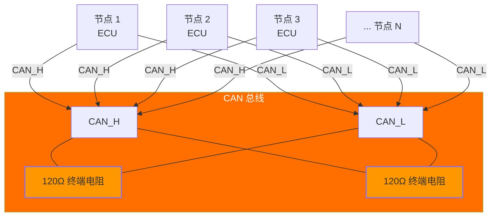

**图中解释：** CAN 总线采用**直线拓扑（总线型）**。所有节点通过 CAN_H 和 CAN_L 两条线并联在总线上。**总线两端必须各接一个 120Ω 终端电阻**，用于匹配阻抗、抑制信号反射。终端电阻的等效并联值为 60Ω，这也是测量 CAN 总线电阻时的标准值。

#### 终端电阻的作用

- **阻抗匹配**：防止信号在总线末端反射，保证信号完整性
- **差分负载**：为收发器提供正确的差分负载
- **总线空闲电平**：终端电阻将总线 pull 到隐性电平（2.5V）

> **诊断技巧：** 在总线上测量 CAN_H 与 CAN_L 之间的电阻，正常值为 **60Ω**（两个 120Ω 并联）。如果测量到 120Ω，说明缺少一个终端电阻；如果测量到 0Ω，说明总线短路。

### 2.3 位时序与同步

CAN 的位时序是保证总线同步的关键机制。每一位被划分为多个**时间份额（Time Quantum，Tq）**：

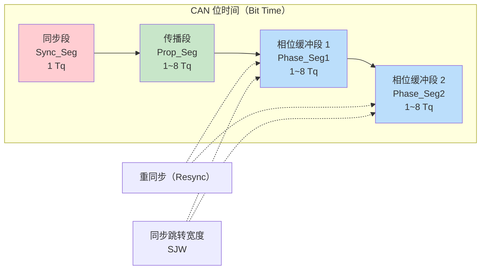

**图中解释：** CAN 位时间分为四个段：
- **同步段（Sync_Seg）**：用于同步总线上的各个节点，**信号的跳变沿应在此段内出现**
- **传播段（Prop_Seg）**：补偿总线上的物理延迟（驱动器延迟 + 总线传播延迟 + 接收器延迟）
- **相位缓冲段 1（Phase_Seg1）**：用于补偿相位误差，采样点在此段末尾
- **相位缓冲段 2（Phase_Seg2）**：采样点之后，用于补偿相位误差
- **SJW（同步跳转宽度）**：重同步时 Phase_Seg1 和 Phase_Seg2 可调整的最大宽度

#### 采样点位置

```
采样点 = (Sync_Seg + Prop_Seg + Phase_Seg1) / (Sync_Seg + Prop_Seg + Phase_Seg1 + Phase_Seg2)

典型配置（1 Mbps）：
  Tq = 125 ns（8 MHz 晶振，8 分频）
  位时间 = 8 Tq = 1 μs → 1 Mbps
  Sync_Seg = 1 Tq, Prop_Seg = 3 Tq, Phase_Seg1 = 2 Tq, Phase_Seg2 = 2 Tq
  采样点 = (1 + 3 + 2) / 8 = 75%
```

#### 硬同步与重同步

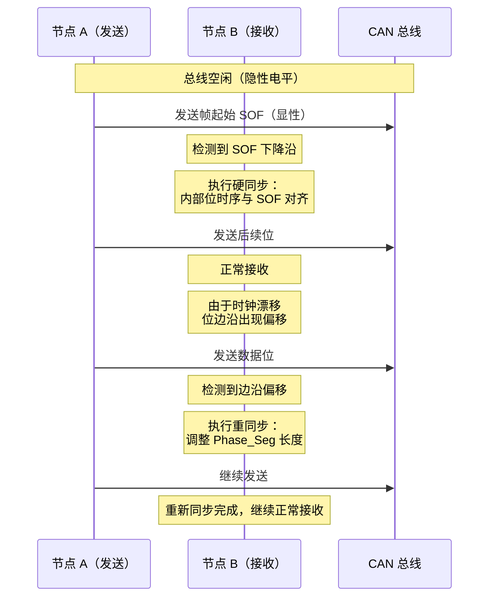

**图中解释：** 硬同步发生在总线从空闲到开始传输的瞬间（SOF 下降沿），所有节点将自己的位时序对齐到该边沿。重同步在后续传输中持续进行，每个节点根据检测到的边沿与预期位置的偏差，调整相位缓冲段的长度，补偿时钟漂移。

### 2.4 非破坏性逐位仲裁的物理基础

这是 CAN 协议最精巧的设计之一。其物理基础是**开漏（open-drain）** 式的总线驱动：

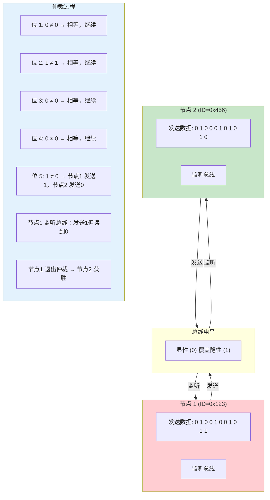

**图中解释：** 非破坏性逐位仲裁的物理原理。在 CAN 总线上，**显性位（0）会覆盖隐性位（1）**。当两个节点同时发送时，每位发送后都监听总线。如果发送的是隐性位（1）但监听到显性位（0），说明有其他节点在发送同一位但优先级更高，该节点立即退出仲裁。这个过程在每个位上进行，直到只剩下一个节点，整个过程**不破坏任何数据**。

### 2.5 CAN 收发器与节点结构

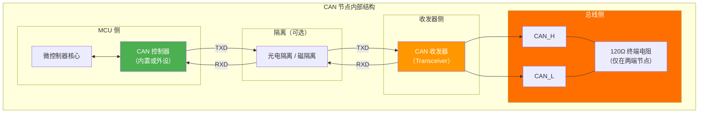

**图中解释：** CAN 节点内部结构。**CAN 控制器**（通常集成在 MCU 内部）实现数据链路层功能（帧打包、仲裁、错误检测等），将并行数据转换为串行位流。**CAN 收发器**实现物理层功能（电平转换、差分驱动、总线保护），将控制器的逻辑电平转换为 CAN 总线的差分信号。收发器与控制器之间通常通过 TXD（发送数据）和 RXD（接收数据）两根线连接。

### 2.6 物理层对比：高速 CAN / 容错 CAN / 单线 CAN

| 特性 | 高速 CAN（ISO 11898-2） | 容错 CAN（ISO 11898-3） | 单线 CAN（SAE J2411） |
|------|----------------------|----------------------|---------------------|
| 线数 | 2（CAN_H + CAN_L） | 2（CAN_H + CAN_L） | 1（CAN Bus + GND） |
| 最大速率 | 1 Mbps | 125 kbps | 33.3 kbps（正常）/ 83.3 kbps（高速） |
| 差分信号 | 是 | 是 | 否（单端） |
| 总线电压 | 1.5V ~ 3.5V | -2V ~ 7V | 0V ~ 5V |
| 容错能力 | 低 | 高（一线中断仍可工作） | 低 |
| 终端电阻 | 2 × 120Ω | 2 × 120Ω | 1 × 9.09kΩ |
| 典型应用 | 动力总成、底盘 | 车身控制 | 诊断接口（OBD-II） |

---

## 3. 数据链路层（Data Link Layer）

### 3.1 帧格式总览

CAN 2.0 协议定义了四种帧类型：

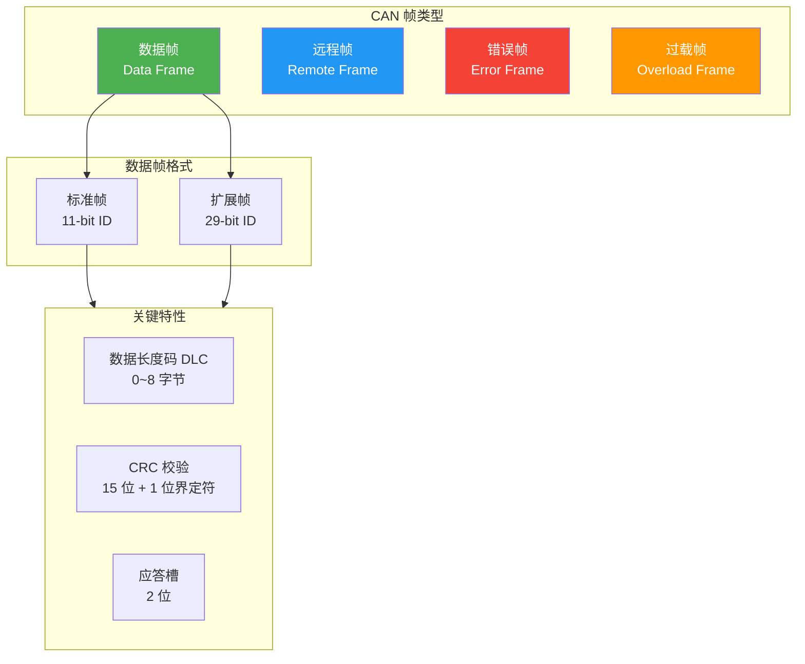

### 3.2 数据帧（Data Frame）

数据帧是 CAN 通信中最常用的帧类型，用于传输数据。

#### 标准帧（CAN 2.0A，11-bit ID）

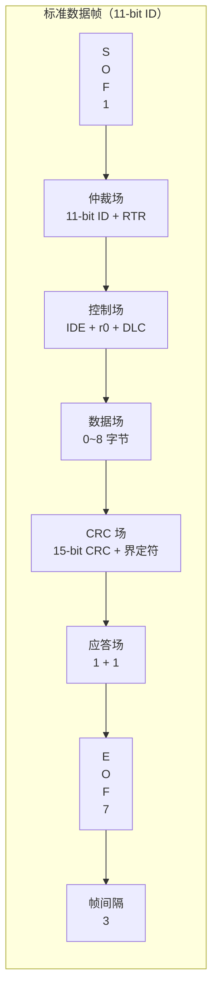

**图中解释：** 标准数据帧由 7 个场组成：
- **SOF（Start of Frame）**：1 位显性位，标志帧的开始，用于同步所有节点
- **仲裁场（Arbitration Field）**：11 位标识符 + 1 位 RTR（Remote Transmission Request），用于仲裁和帧类型识别
- **控制场（Control Field）**：1 位 IDE + 1 位 r0（保留位）+ 4 位 DLC（数据长度码）
- **数据场（Data Field）**：0~8 字节，实际传输的数据内容
- **CRC 场（CRC Field）**：15 位 CRC 校验码 + 1 位 CRC 界定符（隐性位）
- **应答场（ACK Field）**：1 位应答槽（ACK Slot）+ 1 位 ACK 界定符（隐性位）
- **EOF（End of Frame）**：7 位隐性位，标志帧结束
- **IFS（Interframe Space）**：3 位隐性位，帧间隔

#### 扩展帧（CAN 2.0B，29-bit ID）

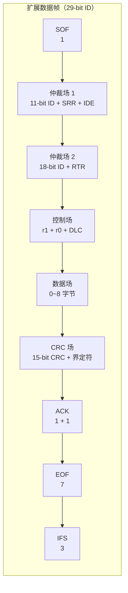

**图中解释：** 扩展帧与标准帧的主要区别在于仲裁场和控制场：
- **SRR（Substitute Remote Request）**：替代远程请求位，在扩展帧中替代标准帧的 RTR 位位置，总是隐性位
- **IDE（Identifier Extension）**：标识符扩展位，标准帧中为显性（0），扩展帧中为隐性（1）
- **仲裁场**：11 位基础 ID + 18 位扩展 ID = 29 位标识符
- **控制场**：扩展帧中 r1 和 r0 均为保留位

#### 标准帧 vs 扩展帧详细格式

```
标准帧（11-bit ID）：
┌─────┬──────────────────┬──────────┬──────────────────┬──────────────┬──────────┬──────────────┬───────────┐
│ SOF │  Arbitration     │ Control  │    Data          │    CRC       │   ACK    │     EOF      │   IFS     │
│  1  │  11-bit ID + RTR │ IDE + r0 + DLC │  0~8 bytes  │  15-bit + 1  │  1 + 1   │      7       │    3      │
│  0  │  ID[10:0] + 0    │ 0 + 0 + 4bit  │               │              │          │    1111111   │   111     │
└─────┴──────────────────┴──────────┴──────────────────┴──────────────┴──────────┴──────────────┴───────────┘

扩展帧（29-bit ID）：
┌─────┬──────────────────────┬──────────────────────┬──────────┬──────────────┬──────────┬──────────────┬───────────┐
│ SOF │  Arbitration 1       │  Arbitration 2       │ Control  │    Data      │   CRC    │     ACK      │    EOF    │
│  1  │  11-bit ID + SRR + IDE │  18-bit ID + RTR    │ r1 + r0 + DLC │ 0~8 bytes │ 15-bit + 1  │  1 + 1    │    7      │
│  0  │  ID[28:18] + 1 + 1    │  ID[17:0] + 0       │ 0 + 0 + 4bit │            │              │           │  1111111  │
└─────┴──────────────────────┴──────────────────────┴──────────┴──────────────┴──────────┴──────────────┴───────────┘
```

#### 数据帧各字段详解

| 字段 | 位数 | 说明 |
|------|------|------|
| **SOF** | 1 | 帧起始，显性位（0），标志总线从空闲状态进入传输状态 |
| **Identifier** | 11/29 | 标识符，决定消息优先级（值越小优先级越高） |
| **RTR** | 1 | 远程帧标志：0=数据帧，1=远程帧 |
| **SRR** | 1 | 仅扩展帧：替代标准帧的 RTR 位，固定在隐性位（1） |
| **IDE** | 1 | 扩展标志：0=标准帧，1=扩展帧 |
| **r0 / r1** | 1 | 保留位，固定为显性位（0） |
| **DLC** | 4 | 数据长度码：0~8（CAN 2.0），0~64（CAN FD） |
| **Data** | 0~64 | 数据字节 |
| **CRC** | 15+1 | CRC 校验和 + CRC 界定符 |
| **ACK** | 1+1 | ACK 应答槽 + ACK 界定符 |
| **EOF** | 7 | 帧结束标志，全部隐性位 |
| **IFS** | 3 | 帧间隔，全部隐性位 |

### 3.3 远程帧（Remote Frame）

远程帧用于请求其他节点发送数据。它的格式与数据帧基本相同，但**没有数据场**，且 RTR 位为显性（1）。

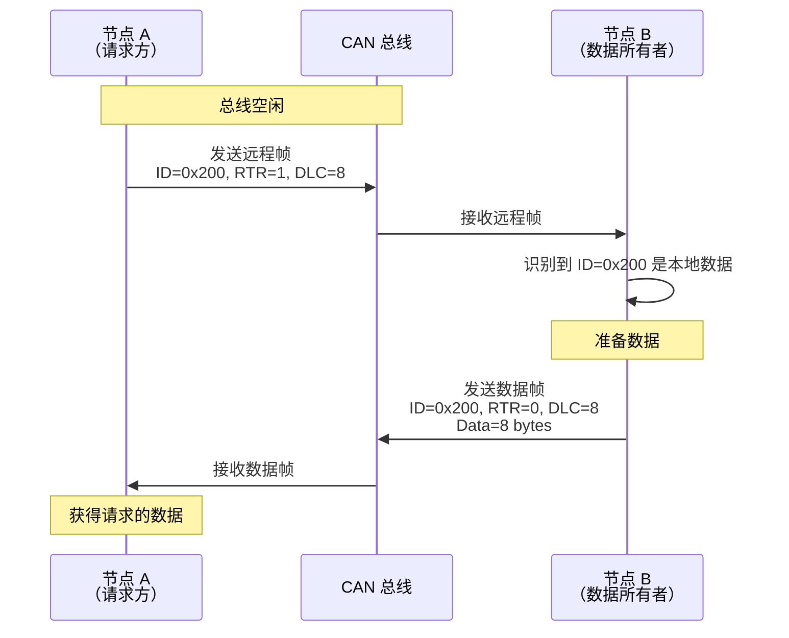

**图中解释：** 远程帧的工作流程。节点 A 发送远程帧（ID=0x200，RTR=1），请求其他节点发送该 ID 的数据。节点 B 识别到该 ID 是自己的数据，于是发送一个同 ID 的数据帧作为响应。注意：**远程帧没有数据场**，但 DLC 字段指示了请求的数据长度。

### 3.4 错误帧（Error Frame）

当节点检测到总线错误时，发送错误帧通知其他节点。

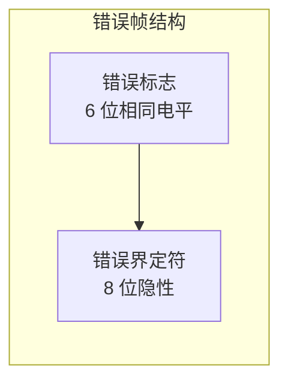

**图中解释：** 错误帧由两部分组成：
- **错误标志（Error Flag）**：6 位相同电平（显性或隐性，取决于错误状态）
- **错误界定符（Error Delimiter）**：8 位隐性位

#### 主动错误 vs 被动错误标志

| 错误状态 | 错误标志类型 | 标志内容 | 效果 |
|---------|------------|---------|------|
| **主动错误** | 主动错误标志 | 6 位显性位（000000） | 覆盖总线，所有节点都能检测到 |
| **被动错误** | 被动错误标志 | 6 位隐性位（111111） | 不覆盖总线，仅当总线空闲时发送 |

### 3.5 过载帧（Overload Frame）

过载帧用于在接收节点需要更多时间处理数据时延迟下一次传输。

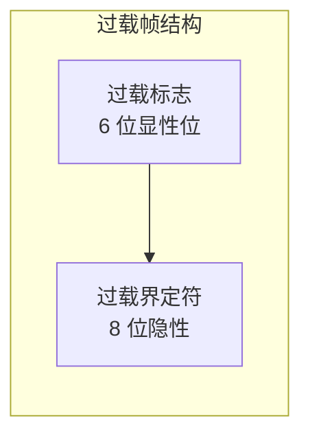

**图中解释：** 过载帧的结构与错误帧相似，但触发条件不同：
- **过载标志**：6 位显性位，类似主动错误标志
- **过载界定符**：8 位隐性位

过载帧用于以下情况：
1. 接收节点因内部条件需要更多时间处理上一个帧
2. 在帧间隔期间检测到显性位（表示其他节点需要更多时间）

### 3.6 帧间隔（Interframe Space）

每个帧（数据帧或远程帧）之后必须有一段帧间隔，用于将当前帧与后续帧分离。

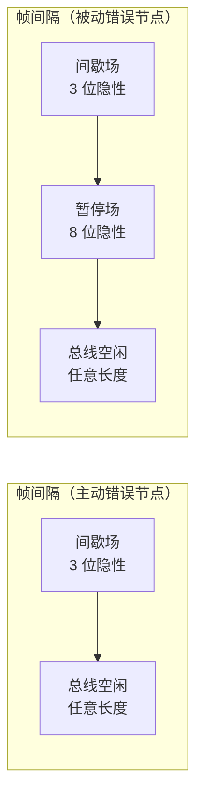

**图中解释：** 主动错误节点的帧间隔为 3 位间歇场 + 任意长度总线空闲。被动错误节点额外增加 8 位暂停场，确保被动错误节点有足够的时间检测总线空闲。

---

## 4. 总线仲裁机制（Arbitration）

### 4.1 CSMA/CR 原理

CAN 采用 **CSMA/CR（Carrier Sense Multiple Access with Collision Resolution）** 机制，即"载波监听多路访问/冲突解决"。

- **CSMA**：每个节点在发送前监听总线，总线空闲时才发送
- **/CR**：多个节点同时发送时，通过逐位仲裁解决冲突，**优先级高的节点继续发送，优先级低的节点自动退出**

这与传统的 CSMA/CD（如以太网）不同：
- **CSMA/CD**：冲突发生后检测到碰撞，双方停止发送，等待随机时间后重试（**破坏性**）
- **CSMA/CR**：冲突发生时通过逐位比较解决，**不破坏任何数据**（**非破坏性**）

### 4.2 仲裁过程详解

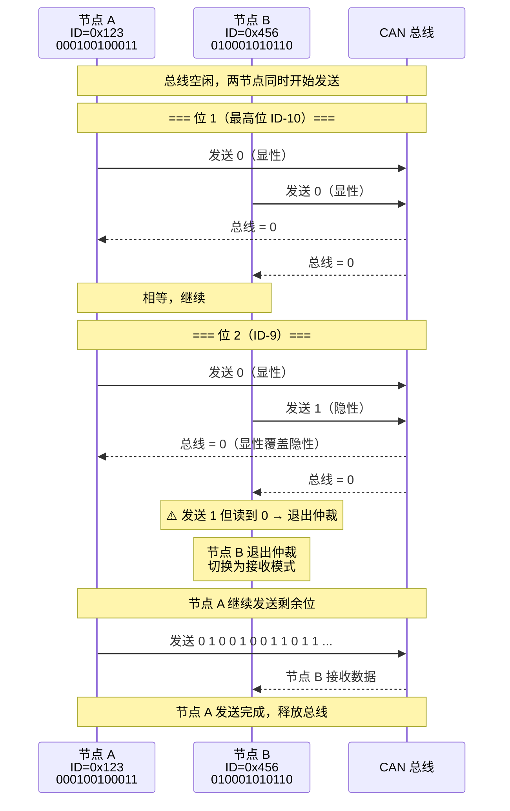

**图中解释：** 仲裁过程的具体步骤。节点 A（ID=0x123，二进制 000100100011）和节点 B（ID=0x456，二进制 010001010110）同时开始发送。在第一位（ID-10），两者都发送 0（显性），总线为 0，继续。在第二位（ID-9），节点 A 发送 0（显性），节点 B 发送 1（隐性），总线为 0。节点 B 检测到"发送 1 但读到 0"后立即退出仲裁，切换为接收模式。节点 A 继续发送剩余数据。

**关键点：** 仲裁完全基于**标识符的位值**，**标识符越小，优先级越高**。0x123 的二进制为 000100100011，0x456 的二进制为 010001010110，在第二位出现差异（0 vs 1），所以 0x123 获胜。

### 4.3 标识符优先级与 ID 分配策略

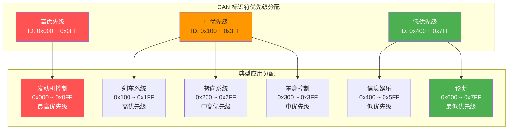

**图中解释：** CAN 标识符的优先级分配策略。ID 值越小，优先级越高。安全关键系统（发动机、刹车）分配最小的 ID。诊断信息优先级最低，使用最大的 ID。这种设计确保在总线冲突时，**最紧急的消息总是最先发送**。

---

## 5. 错误检测与处理（Error Handling）

### 5.1 五种错误检测机制

CAN 协议定义了五种错误检测机制，这是 CAN 高可靠性的核心保障：

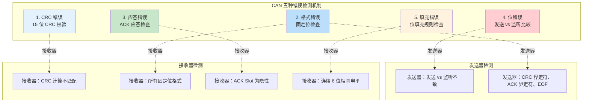

**图中解释：** CAN 的五种错误检测机制及其检测方：
- **位错误**：仅在发送器侧检测。发送器发送每一位后都监听总线，如果监听到的电平与发送的不一致（仲裁期间除外），则报告位错误
- **填充错误**：在接收器侧检测。如果连续检测到 6 个相同电平，则报告填充错误（违反位填充规则）
- **CRC 错误**：在接收器侧检测。接收器计算 CRC 并与发送器的 CRC 对比，不匹配则报告 CRC 错误
- **格式错误**：在接收器侧检测。如果固定位场（CRC 界定符、ACK 界定符、EOF）的预期电平为隐性但读到显性，则报告格式错误
- **应答错误**：在发送器侧检测。如果发送器在 ACK Slot 没有检测到显性位（说明没有节点成功接收），则报告应答错误

#### 错误检测覆盖范围

| 错误类型 | 检测概率 | 检测方 | 说明 |
|---------|---------|--------|------|
| 位错误 | 100% | 发送器 | 发送 vs 监听不匹配（仲裁期间除外） |
| 填充错误 | 100% | 接收器 | 违反位填充规则 |
| CRC 错误 | ≥ 99.997% | 接收器 | 15 位 CRC + 汉明距 6 |
| 格式错误 | 100% | 接收器 | 固定位格式不正确 |
| 应答错误 | 100% | 发送器 | 无节点应答 |

### 5.2 错误状态与错误计数器

每个 CAN 节点维护两个错误计数器：

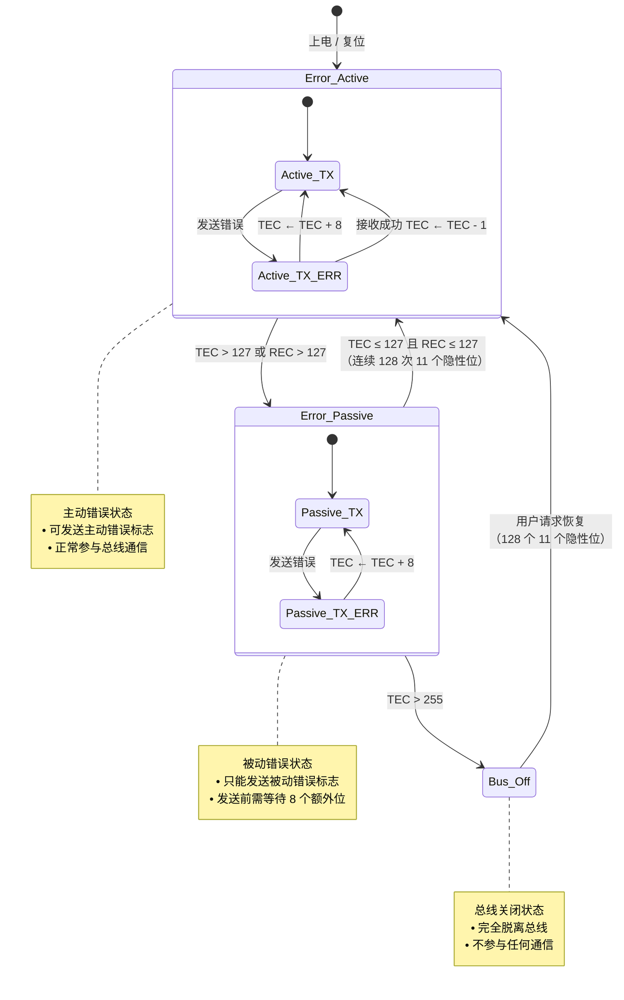

**图中解释：** CAN 节点的错误状态机。每个节点维护两个计数器：**TEC（发送错误计数器）** 和 **REC（接收错误计数器）**。节点根据错误计数器的值在三种状态间转换：
- **主动错误状态（Error Active）**：TEC≤127 且 REC≤127，正常工作
- **被动错误状态（Error Passive）**：TEC>127 或 REC>127，限制错误标志
- **总线关闭状态（Bus Off）**：TEC>255，完全脱离总线

#### 错误计数规则

| 事件 | 发送错误计数器 (TEC) | 接收错误计数器 (REC) |
|------|---------------------|---------------------|
| 发送器检测到位错误 | +8 | — |
| 接收器检测到错误 | — | +1 |
| 发送器检测到应答错误 | +8 | — |
| 接收器检测到 CRC 错误 | — | +1 |
| 发送器成功发送 | -1 | — |
| 接收器成功接收 | — | -1（如果之前 > 0） |
| 被动错误节点发送成功 | -1 | — |
| 接收器检测到填充错误 | — | +1 |
| 主动错误 → 被动错误 | TEC>127 | REC>127 |
| 被动错误 → 总线关闭 | TEC>255 | — |

### 5.3 错误恢复与总线关闭

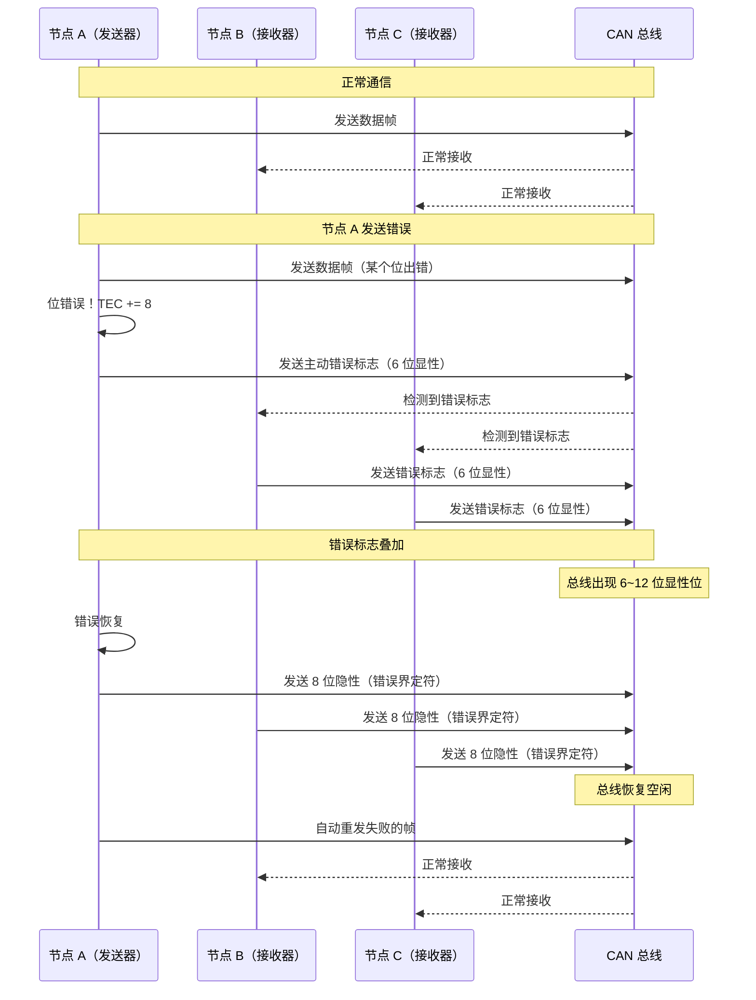

**图中解释：** 错误恢复流程。发送器检测到错误后，立即发送错误标志通知所有节点。所有节点收到错误标志后也发送错误标志（叠加效果）。错误标志结束后，发送 8 位隐性错误界定符，总线恢复空闲。发送器**自动重发**失败的帧。整个过程由硬件自动完成，无需软件干预。

---

## 6. 位填充机制（Bit Stuffing）

### 6.1 填充规则

位填充是 CAN 协议中保证同步的重要机制。

```mermaid
flowchart LR
    subgraph Without_Stuffing["无位填充"]
        D1["1 1 1 1 1"]
    end

    subgraph With_Stuffing["有位填充"]
        D2["1 1 1 1 1 ➡ 0"]
    end

    subgraph Example["示例"]
        Raw["原始数据: 0 1 1 1 1 1 0 1 0"]
        Stuffed["填充后: 0 1 1 1 1 1 0 0 1 0"]
    end

    Raw --> Stuffed

    style With_Stuffing fill:#C8E6C9
    style Without_Stuffing fill:#FFCDD2
```

**规则：** 发送器在连续发送 **5 个相同位** 后，自动插入一个**相反电平的填充位**。

**图中解释：** 当原始数据中出现连续 5 个相同位（如 5 个 1）时，发送器在第 5 位之后插入一个相反位（0），保证总线上不会出现超过 5 个连续相同位。这样接收器就可以通过每个边沿进行同步，防止时钟漂移累积。

#### 位填充的覆盖范围

| 场 | 位填充 | 说明 |
|----|--------|------|
| SOF | ✅ | 帧起始 |
| 仲裁场 | ✅ | 11/29 位 ID + RTR/SRR/IDE |
| 控制场 | ✅ | IDE、r0/r1、DLC |
| 数据场 | ✅ | 0~8 字节数据 |
| CRC 场 | ✅ | 15 位 CRC（不包括 CRC 界定符） |
| **CRC 界定符** | ❌ | 固定隐性位 |
| **ACK 场** | ❌ | ACK Slot + ACK 界定符 |
| **EOF** | ❌ | 7 位隐性位 |
| **IFS** | ❌ | 3 位隐性位 |
| **错误帧/过载帧** | ❌ | 不适用 |

### 6.2 填充在同步中的作用

```mermaid
sequenceDiagram
    participant TX as 发送器
    participant Bus as 总线
    participant RX as 接收器

    Note over TX,RX: 发送 0x1F（二进制 00011111）

    TX->>Bus: 位 1: 0（显性）
    TX->>Bus: 位 2: 0（显性）
    TX->>Bus: 位 3: 0（显性）
    TX->>Bus: 位 4: 1（隐性）
    TX->>Bus: 位 5: 1（隐性）
    TX->>Bus: 位 6: 1（隐性）
    TX->>Bus: 位 7: 1（隐性）
    TX->>Bus: 位 8: 1（隐性）

    Note over TX: 连续 5 个 1！插入填充位
    TX->>Bus: 填充位: 0（显性）

    RX->>RX: 检测到边沿 1→0
    RX->>RX: 执行重同步，调整相位缓冲段

    TX->>Bus: 位 9: 0（显性）
    RX->>RX: 检测到边沿 0→1
    RX->>RX: 执行重同步

    Note over RX: 数据接收完成<br/>接收器自动去除填充位<br/>恢复原始数据: 00011111
```

**图中解释：** 位填充在同步中的关键作用。当发送器连续发送 5 个隐性位后，插入一个显性填充位，产生一个下降沿。接收器利用这个边沿进行重同步，调整相位缓冲段，补偿时钟漂移。如果没有位填充，总线长时间没有信号边沿，各节点的时钟漂移会累积，最终导致采样错误。

---

## 7. CAN 2.0A vs CAN 2.0B vs CAN FD vs CAN XL

### 7.1 标准帧与扩展帧

```mermaid
flowchart TB
    subgraph CAN_2_0["CAN 2.0"]
        A["CAN 2.0A<br/>标准帧<br/>11-bit ID"]
        B["CAN 2.0B<br/>标准帧 11-bit ID<br/>+ 扩展帧 29-bit ID"]
    end

    subgraph CAN_FD["CAN FD (Flexible Data Rate)"]
        FD["CAN FD<br/>• 可变速率<br/>• 0~64 字节数据<br/>• 更高安全性"]
    end

    subgraph CAN_XL["CAN XL"]
        XL["CAN XL<br/>• 0~2048 字节数据<br/>• 更高速率<br/>• 兼容 CAN FD"]
    end

    CAN_2_0 -->|"演进"| CAN_FD
    CAN_FD -->|"演进"| CAN_XL
```

**图中解释：** CAN 协议的演进路线。CAN 2.0A 定义了 11 位 ID 的标准帧。CAN 2.0B 在此基础上增加了 29 位 ID 的扩展帧。CAN FD 引入可变速率和大数据场。CAN XL 进一步扩展数据场到 2048 字节。

### 7.2 CAN FD（Flexible Data Rate）

CAN FD 是 Bosch 2012 年发布的 CAN 协议升级版，主要改进：

```mermaid
sequenceDiagram
    participant TX as 发送器
    participant Bus as CAN 总线
    participant RX as 接收器

    Note over TX,RX: 仲裁阶段（标准速率）

    TX->>Bus: SOF + 仲裁场 + 控制场
    Note over TX,RX: 速率 = 标准 CAN 速率（如 500 kbps）

    Note over TX,RX: BRS = 1 → 切换到高速率

    TX->>Bus: 数据场 + CRC （高速率）
    Note over TX,RX: 速率 = 高速率（如 2 Mbps）

    Note over TX,RX: CRC 界定符 → 切回标准速率

    TX->>Bus: ACK + EOF + IFS
    Note over TX,RX: 速率 = 标准 CAN 速率（如 500 kbps）
```

**图中解释：** CAN FD 的关键特性——**双速率传输**。在仲裁阶段使用标准速率（保证兼容性），在数据场阶段切换到高速率（提高吞吐量）。BRS（Bit Rate Switch）位控制是否切换速率。

#### CAN FD 与 CAN 2.0 的主要区别

| 特性 | CAN 2.0 | CAN FD |
|------|---------|--------|
| **最大数据长度** | 8 字节 | 64 字节 |
| **数据速率** | 固定（最高 1 Mbps） | 仲裁段固定，数据段可变速（最高 8 Mbps） |
| **BRS 位** | 无 | 有，控制速率切换 |
| **ESI 位** | 无 | 有，指示发送器的错误状态 |
| **CRC 算法** | 15 位 CRC | 17 位（数据≤16 字节）或 21 位（数据>16 字节） |
| **填充规则** | 标准填充 | 数据段可选填充 |
| **兼容性** | — | 与 CAN 2.0 共存于同一总线 |
| **标准** | ISO 11898-1:2003 | ISO 11898-1:2015 |

### 7.3 CAN XL

CAN XL 是最新的 CAN 协议演进，由 CIA（CAN in Automation）推动：

| 特性 | CAN XL |
|------|--------|
| **最大数据长度** | 2048 字节 |
| **最高速率** | 10+ Mbps（数据段） |
| **SDT 位** | 服务数据单元类型，支持上层协议复用 |
| **VCID 和 AF** | 虚拟 CAN ID 域和确认功能 |
| **兼容性** | 向下兼容 CAN FD 和 CAN 2.0 |
| **标准** | CIA 610-1 / ISO 11898-1:2024 |

### 7.4 各版本对比

| 特性 | CAN 2.0A | CAN 2.0B | CAN FD | CAN XL |
|------|---------|---------|--------|--------|
| 发布年份 | 1986 | 1991 | 2012 | 2024 |
| 标识符长度 | 11 位 | 11/29 位 | 11/29 位 | 11/29 位 |
| 最大数据 | 8 字节 | 8 字节 | 64 字节 | 2048 字节 |
| 最大速率 | 1 Mbps | 1 Mbps | 8 Mbps（数据段） | 10+ Mbps（数据段） |
| 标准 | ISO 11898 | ISO 11898 | ISO 11898-1:2015 | ISO 11898-1:2024 |
| 应用 | 传统设计 | 当前主流 | 新设计 | 下一代 |

---

## 8. 应用层协议概览

### 8.1 CANopen

```mermaid
flowchart TB
    subgraph CANopen_Stack["CANopen 协议栈"]
        APP["应用程序"]
        OBJ["对象字典 OD<br/>索引 0x0000~0xFFFF"]

        subgraph Services["通信服务"]
            PDO["PDO<br/>过程数据对象<br/>• 实时数据<br/>• 1 帧传输"]
            SDO["SDO<br/>服务数据对象<br/>• 配置参数<br/>• 多帧传输"]
            NMT["NMT<br/>网络管理<br/>• 状态控制<br/>• 心跳监测"]
            SYNC["SYNC<br/>同步对象<br/>• 同步触发"]
            EMCY["EMCY<br/>紧急对象<br/>• 错误报告"]
        end

        CAN_Layer["CAN 2.0 数据链路层"]
    end

    APP --> OBJ
    OBJ --> PDO
    OBJ --> SDO
    PDO --> CAN_Layer
    SDO --> CAN_Layer
    NMT --> CAN_Layer
    SYNC --> CAN_Layer
    EMCY --> CAN_Layer

    style CANopen_Stack fill:#E3F2FD
    style OBJ fill:#FF9800
    style PDO fill:#4CAF50,color:#fff
    style SDO fill:#2196F3,color:#fff
```

**图中解释：** CANopen 协议基于 CAN 2.0，引入对象字典（Object Dictionary）架构。PDO 用于实时数据交换（1 帧最多 8 字节），SDO 用于配置参数访问（可多帧传输），NMT 管理网络节点状态。

### 8.2 J1939

J1939 是 SAE 定义的商用车 CAN 应用层协议，主要用于卡车、客车、工程机械等：

- **29 位扩展 ID**：使用 CAN 2.0B 扩展帧
- **PGN（参数组编号）**：标识消息类型
- **SPN（可疑参数编号）**：标识具体参数
- **SA（源地址）**：每个节点有唯一地址
- **地址声明**：自动地址配置

### 8.3 XCP over CAN

XCP（Universal Measurement and Calibration Protocol）是 ASAM 定义的标定和测量协议，运行在 CAN 之上：

- **高带宽数据采集**：通过 DAQ 列表实现
- **标定访问**：在线修改 ECU 参数
- **同步**：支持时间同步和事件同步
- **种子&密钥**：安全访问机制

### 8.4 UDS over CAN

UDS（Unified Diagnostic Services，ISO 14229）运行在 CAN 之上（ISO 15765-2）：

- **诊断会话控制**：0x10 服务
- **读取/写入数据**：0x22 / 0x2E 服务
- **例程控制**：0x31 服务
- **DTC 读取**：0x19 服务
- **ECU 复位**：0x11 服务

---

## 9. 深入原理与设计思想

### 9.1 为什么 CAN 是"事件触发"而非"时间触发"？

**CAN 是事件触发协议**，这意味着：
- 节点在需要发送数据时**立即发送**（无需等待预定时间点）
- 通过仲裁机制解决冲突
- 总线利用率高，但实时性**不可预测**（最坏等待时间需要分析）

**对比：** 时间触发协议（如 FlexRay、TTP）在预定时间点发送数据，实时性可预测，但总线利用率低。

**CAN 的事件触发设计哲学：** "在汽车中，紧急事件（如刹车）必须立即通知，不能等到下一个预定时间点。"

### 9.2 为什么 CAN 用"标识符"而非"地址"？

CAN 使用**基于内容的寻址**（Content-Based Addressing），而非传统的基于节点的寻址：

| 特性 | 基于地址（如 I²C、SPI） | 基于标识符（CAN） |
|------|----------------------|-----------------|
| 消息目标 | 指定节点 | 所有节点（广播） |
| 接收判断 | 地址匹配 | 标识符过滤 |
| 扩展性 | 添加节点需重新分配地址 | 添加节点不影响现有消息 |
| 优先级 | 无 | 标识符决定优先级 |
| 多播 | 需额外机制 | 天然支持 |

**CAN 的设计哲学：** "消息不是发给某个节点，而是发送到总线上的。谁需要谁接收。" 这使得系统高度解耦，添加新节点无需修改现有节点。

### 9.3 为什么 CAN 是最多 30 个节点？

实际上，CAN 标准没有限制节点数，限制来自**物理层**：

- **驱动能力**：收发器只能驱动有限的负载
- **总线长度**：节点数增加，总线等效电容增加，信号完整性下降
- **终端电阻**：节点输入阻抗（20kΩ）与终端电阻（120Ω）并联，节点越多等效电阻越小

**计算方法：**
```
总线负载 = 终端电阻并联 + 每个节点的差分输入阻抗并联
典型值：60Ω（终端） || 20kΩ（每个节点）
30 个节点时：60Ω || 20kΩ/30 = 60Ω || 667Ω ≈ 55Ω
超过 30 个节点时，总线负载过重，信号幅值下降
```

### 9.4 实时性与延迟分析

```mermaid
flowchart LR
    subgraph Latency["CAN 通信延迟分析"]
        Q["排队延迟<br/>等待总线空闲"]
        T["传输延迟<br/>帧传输时间"]
        P["传播延迟<br/>总线物理传播"]
    end

    subgraph Factors["影响因素"]
        Q1["• 总线负载率<br/>• 消息优先级"]
        T1["• 位速率<br/>• 帧长度<br/>• 数据长度"]
        P1["• 总线长度<br/>• 收发器延迟"]
    end

    Q --> Q1
    T --> T1
    P --> P1

    style Latency fill:#E3F2FD
```

**图中解释：** CAN 消息的端到端延迟由三部分组成：
- **排队延迟**：等待总线空闲的时间，取决于总线负载率和消息优先级
- **传输延迟**：实际传输帧的时间，取决于位速率和帧长度
- **传播延迟**：信号在总线上的物理传播时间，取决于总线长度

#### 最坏情况响应时间分析（WCRT）

```
对于优先级为 i 的消息，最坏情况响应时间：
Ri = Ji + Bi + Σ(Ri / Tj) × Cj + Ci

其中：
  Ji = 释放抖动
  Bi = 阻塞时间（低优先级消息正在传输）
  Σ(Ri / Tj) × Cj = 所有高优先级消息的干扰
  Ci = 当前消息的传输时间

示例（500 kbps，标准帧）：
  C（传输时间）= (47 + 8 × 8) × 2μs = 111 × 2μs = 222μs
  总线负载率 = 55% 时，最高优先级消息的 WCRT ≈ 222μs
  最低优先级消息的 WCRT ≈ 几个 ms
```

---

## 10. 总结

```mermaid
flowchart TB
    subgraph CAN_Summary["CAN 协议核心要点"]
        PHYS["物理层<br/>• 差分信号<br/>• 双绞线<br/>• 120Ω 终端"]
        DLL["数据链路层<br/>• 4 种帧类型<br/>• 逐位仲裁<br/>• 5 种错误检测"]
        ENHANCED["演进版本<br/>• CAN FD 64 字节<br/>• CAN XL 2048 字节"]
        APP["应用层<br/>• CANopen<br/>• J1939<br/>• UDS / XCP"]
    end

    PHYS --> DLL
    DLL --> ENHANCED
    DLL --> APP

    style PHYS fill:#FF8A65,color:#fff
    style DLL fill:#4CAF50,color:#fff
    style ENHANCED fill:#42A5F5,color:#fff
    style APP fill:#AB47BC,color:#fff
```

### CAN 协议的核心设计哲学

| 设计理念 | 实现方式 | 优势 |
|---------|---------|------|
| **非破坏性仲裁** | 逐位比较 + 显性覆盖隐性 | 无冲突损失，实时性好 |
| **基于内容寻址** | 标识符而非节点地址 | 解耦性强，天然支持多播 |
| **分布式控制** | 多主、无中心节点 | 无单点故障 |
| **高可靠性** | 5 种错误检测 + 自动重发 + 错误状态机 | 极低残余错误概率 |
| **差分信号** | CAN_H / CAN_L 差分传输 | 强抗共模干扰能力 |

### 关键参数速查

| 参数 | 值 |
|------|-----|
| 最大节点数 | 30（典型） |
| 最大速率 | 1 Mbps（CAN 2.0），8 Mbps（CAN FD），10+ Mbps（CAN XL） |
| 最大总线长度 | 40m @ 1 Mbps，500m @ 125 kbps |
| 数据长度 | 0~8 字节（CAN 2.0），0~64 字节（CAN FD），0~2048 字节（CAN XL） |
| 标识符 | 11 位（标准帧），29 位（扩展帧） |
| 终端电阻 | 2 × 120Ω（两端各一个） |
| 总线电平 | 显性 2.0V（差分），隐性 0V（差分） |
| 错误检测概率 | 99.997%（CRC 未检测到错误的概率） |
| 错误计数器阈值 | 127（被动错误），255（总线关闭） |

---

> **参考标准：** ISO 11898-1:2015（CAN 数据链路层）、ISO 11898-2:2016（高速 CAN 物理层）、ISO 11898-3:2006（容错 CAN 物理层）、CiA 301（CANopen）、SAE J1939