# LIN 协议详解

> LIN（Local Interconnect Network）—— 低成本汽车局部互联网络，CAN 的"廉价小弟"

---

## 1. 通俗理解

把汽车网络想象成一个**公司内部通信系统**：

| 网络 | 类比 | 特征 |
|------|------|------|
| **CAN** | 公司**电话会议** | 人人可发言，需要仲裁，速度快，成本高 |
| **LIN** | 经理**对讲机喊话** | 只有经理能主动说话，其他人只能回答，速度慢，成本极低 |
| **Ethernet** | 公司**视频会议** | 超大带宽，复杂协议，成本最高 |

**LIN 的核心特点：** 基于 UART/SCI 的串行通信，**单主多从**拓扑，**主节点**控制总线上所有通信的时序，**从节点**只能响应主节点的请求。

---

## 2. LIN 总线概述

### 2.1 历史与定位

| 项目 | 说明 |
|------|------|
| **推出时间** | 1999 年（LIN 联盟） |
| **最新版本** | LIN 2.2A（2010 年） |
| **标准组织** | LIN Consortium → ISO 17897 |
| **定位** | 低成本低速子网，通常作为 CAN 的**子总线** |
| **典型应用** | 车门模块、车窗、座椅、天窗、雨刷、车灯 |

### 2.2 关键特性

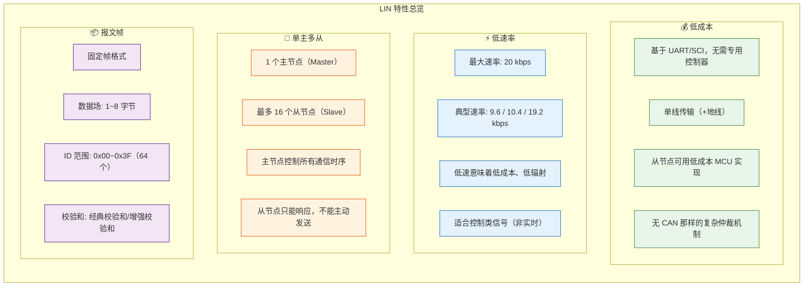

### 2.3 物理层

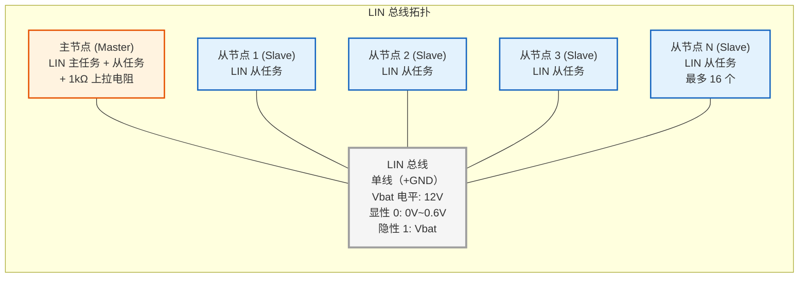

**LIN 物理层关键参数：**

| 参数 | 值 |
|------|-----|
| **传输介质** | 单线（+GND 参考地） |
| **总线电平** | 基于 Vbat（12V 系统） |
| **显性电平（逻辑 0）** | 0V ~ 0.6V（对地） |
| **隐性电平（逻辑 1）** | Vbat（约 12V） |
| **上拉电阻（主节点）** | 1kΩ |
| **上拉电阻（从节点）** | 30kΩ（典型） |
| **最大速率** | 20 kbps |
| **最大总线长度** | 40m（典型） |
| **节点数** | 2~16 个 |

**🔑 关键理解：** LIN 的电平与 CAN 相反：
- **CAN**：显性 = 0V（逻辑 0），隐性 = 2.5V（逻辑 1）
- **LIN**：显性 = 0V（逻辑 0），隐性 = Vbat（逻辑 1）

---

## 3. LIN 帧结构

### 3.1 帧组成

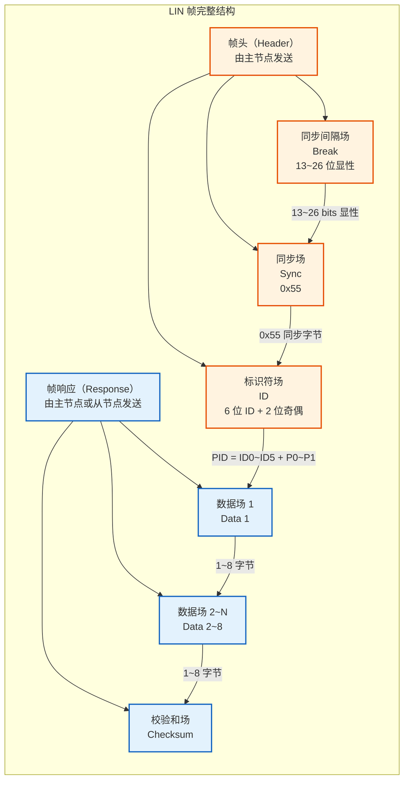

### 3.2 帧头字段详解

#### 同步间隔场（Break）

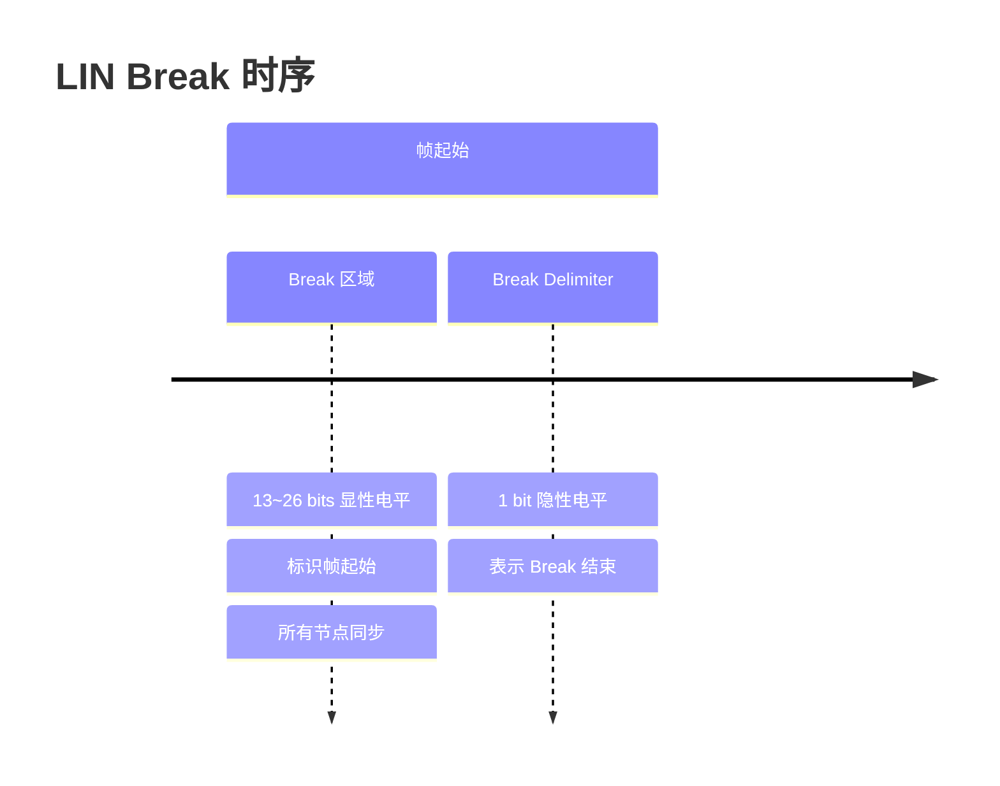

**关键点：**
- Break 是 LIN 帧的**唯一起始标志**
- 长度至少 13 位显性（标准要求 13~26 位）
- 从节点通过检测 Break 来判断帧开始
- Break Delimiter（1 位隐性）用于分隔 Break 和 Sync

#### 同步场（Sync）

```
Sync 字节 = 0x55 = 二进制 0101 0101
                    ↓  ↓  ↓  ↓
                   交替的 0 和 1，用于波特率校准
```

**关键点：**
- 固定为 0x55（交替的 0 和 1 位）
- 从节点用此字节**校准波特率**
- LIN 允许 ±15% 的时钟误差，但从节点通过同步场可校准到 ±2% 以内
- 所以 LIN 从节点可以使用**内部 RC 振荡器**，无需晶振

#### 标识符场（ID / PID）

```c
/* LIN 标识符结构 */
/* ID 字节 = 6 位 ID + 2 位奇偶校验 */

#define LIN_ID_MASK    0x3F  /* ID0~ID5: 0x00~0x3F */
#define LIN_PARITY_MASK 0xC0 /* P0~P1 */

/* 奇偶校验位计算 */
/* P0 = ID0 ⊕ ID1 ⊕ ID2 ⊕ ID4 */
/* P1 = !(ID1 ⊕ ID3 ⊕ ID4 ⊕ ID5) */
uint8_t Lin_CalculateParity(uint8_t id) {
    uint8_t p0 = ( (id >> 0) ^ (id >> 1) ^ (id >> 2) ^ (id >> 4) ) & 0x01;
    uint8_t p1 = ~( (id >> 1) ^ (id >> 3) ^ (id >> 4) ^ (id >> 5) ) & 0x01;
    return (p1 << 7) | (p0 << 6) | (id & 0x3F);
}
```

**ID 分类：**

| ID 范围 | 类型 | 说明 | 数据长度 |
|---------|------|------|---------|
| 0x00~0x1F | 无条件帧 | 最常用的帧类型，固定发布者 | 1~8 字节 |
| 0x20~0x2F | 事件触发帧 | 多个从节点响应，用于快速轮询 | 1~8 字节 |
| 0x30~0x3F | 零星帧 | 主节点不定时发布的帧 | 1~8 字节 |
| 0x3C~0x3D | 诊断帧 | 用于 LIN 诊断和配置 | 8 字节 |
| 0x3E~0x3F | 用户自定义/保留 | 保留 | 1~8 字节 |

### 3.3 帧响应字段详解

#### 数据场（Data）

```
数据场: 1~8 字节
字节序: 低地址先发送（LSB First）
位序: 低位先发送（LSB First）

发送顺序: Byte0 → Byte1 → ... → ByteN
每个字节内: Bit0 → Bit1 → ... → Bit7
```

#### 校验和场（Checksum）

```c
/* LIN 1.x: 经典校验和（Classic Checksum）*/
/* 仅对数据字节计算校验和 */
uint8_t Lin_ClassicChecksum(const uint8_t* data, uint8_t len) {
    uint16_t sum = 0;
    for (uint8_t i = 0; i < len; i++) {
        sum += data[i];
        if (sum >= 256) {
            sum -= 255;  /* 进位回卷 */
        }
    }
    return (uint8_t)(~sum & 0xFF);  /* 取反 */
}

/* LIN 2.x: 增强校验和（Enhanced Checksum）*/
/* 对数据字节 + 标识符字节计算校验和 */
uint8_t Lin_EnhancedChecksum(uint8_t pid, const uint8_t* data, uint8_t len) {
    uint16_t sum = pid;
    for (uint8_t i = 0; i < len; i++) {
        sum += data[i];
        if (sum >= 256) {
            sum -= 255;
        }
    }
    return (uint8_t)(~sum & 0xFF);
}
```

---

## 4. 主从发送逻辑（核心）

### 4.1 角色定义

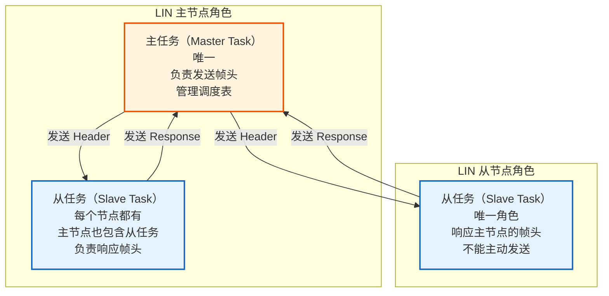

**核心原则：**
1. **主节点**包含两个任务：**主任务**（发送帧头）+ **从任务**（发送/接收响应）
2. **从节点**只包含**从任务**（接收帧头，决定是否发送响应）
3. **总线上所有通信由主任务发起**，从任务只能响应
4. **发布者（Publisher）** 和 **订阅者（Subscriber）**：每个 ID 对应一个发布者（主节点或从节点），其他节点为订阅者

### 4.2 发送逻辑分类

根据帧的发布者不同，分为两种情况：

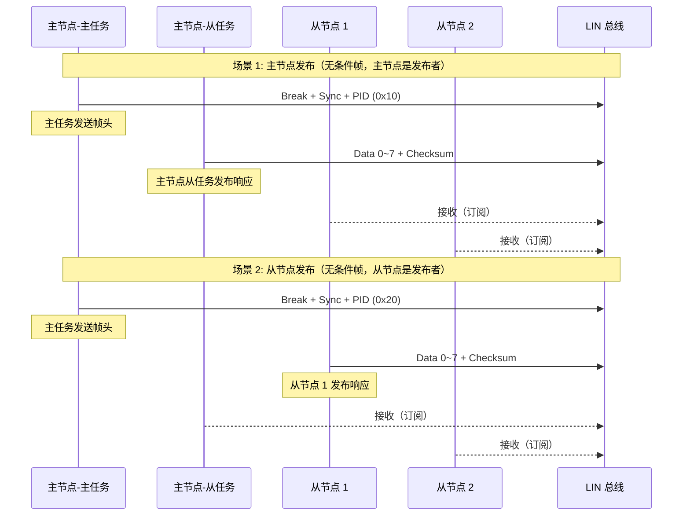

### 4.3 主节点发送逻辑（详细）

```c
/* ============================================
 * LIN 主节点发送逻辑（主任务）
 * ============================================ */

/* LIN 调度表项 */
typedef struct {
    uint8_t  Id;            /* 帧 ID */
    uint8_t  Dl;            /* 数据长度 (1~8) */
    uint8_t* Data;          /* 数据指针（主节点发布时有效）*/
    uint8_t  ChecksumType;  /* 0: 经典, 1: 增强 */
    uint8_t  Publisher;     /* 0: 主节点, 1: 从节点 */
} LinScheduleEntry;

typedef struct {
    LinScheduleEntry* Entry;  /* 当前调度表项 */
    uint8_t           Index;  /* 调度表索引 */
    uint16_t          Delay;  /* 帧间延迟 (ms) */
} LinScheduleTable;

/* 主任务主循环 - 按调度表发送帧头 */
void Lin_MasterTask_MainFunction(void) {
    LinScheduleEntry* entry = &CurrentSchedule.Entry[CurrentSchedule.Index];

    /* 步骤 1: 发送同步间隔场 (Break) */
    /* 13~26 位显性电平 */
    Lin_Hw_SendBreak(13);  /* 发送 13 位显性 */

    /* 步骤 2: 发送同步场 (Sync = 0x55) */
    Lin_Hw_SendByte(0x55);

    /* 步骤 3: 发送标识符场 (PID) */
    uint8_t pid = Lin_CalculateParity(entry->Id);
    Lin_Hw_SendByte(pid);

    /* 步骤 4: 检查是否需要主节点发布响应 */
    if (entry->Publisher == 0) {
        /* 主节点发布响应 */
        for (uint8_t i = 0; i < entry->Dl; i++) {
            Lin_Hw_SendByte(entry->Data[i]);
        }
        /* 发送校验和 */
        if (entry->ChecksumType == 0) {
            Lin_Hw_SendByte(Lin_ClassicChecksum(entry->Data, entry->Dl));
        } else {
            Lin_Hw_SendByte(Lin_EnhancedChecksum(pid, entry->Data, entry->Dl));
        }
    } else {
        /* 从节点发布响应 - 主节点切换到接收模式 */
        Lin_Hw_SetReceiveMode();
        /* 等待从节点响应（超时处理）*/
        if (Lin_Hw_WaitResponse(entry->Dl + 1, TIMEOUT_MS)) {
            /* 接收成功 */
            Lin_Hw_ReadData(entry->Data, entry->Dl + 1);
        } else {
            /* 响应超时 - 从节点无应答 */
            Lin_SetError(LIN_ERR_SLAVE_NO_RESPONSE);
        }
    }

    /* 步骤 5: 调度下一帧 */
    CurrentSchedule.Index++;
    if (CurrentSchedule.Index >= CurrentSchedule.EntryCount) {
        CurrentSchedule.Index = 0;  /* 循环调度 */
    }
}
```

### 4.4 从节点发送逻辑（详细）

```c
/* ============================================
 * LIN 从节点发送逻辑（从任务）
 * ============================================ */

/* 从节点帧配置 */
typedef struct {
    uint8_t  Id;        /* 帧 ID */
    uint8_t  Dl;        /* 数据长度 */
    uint8_t* TxData;    /* 发送数据指针（从节点发布时）*/
    uint8_t* RxData;    /* 接收数据指针（订阅时）*/
    uint8_t  Publisher; /* 1: 该从节点是发布者, 0: 仅订阅 */
} LinSlaveConfig;

/* 从节点 LIN 接收中断处理 */
void Lin_SlaveRxInterruptHandler(uint8_t byte) {
    static enum {
        WAIT_BREAK,   /* 等待同步间隔 */
        WAIT_SYNC,    /* 接收同步场 */
        WAIT_PID,     /* 接收标识符 */
        WAIT_DATA,    /* 接收数据 */
        WAIT_CS       /* 接收校验和 */
    } state = WAIT_BREAK;

    static uint8_t currentPid;
    static uint8_t dataIndex;
    static uint8_t rxBuffer[8];

    switch (state) {
        case WAIT_BREAK:
            if (Lin_Hw_DetectBreak()) {
                /* 检测到 Break，准备接收 */
                /* 使用同步场校准波特率 */
                state = WAIT_SYNC;
            }
            break;

        case WAIT_SYNC:
            if (byte == 0x55) {
                /* 收到同步场，校准波特率 */
                /* 从节点根据 0x55 的位宽调整 UART 波特率 */
                Lin_Hw_AdjustBaudrate(byte);
                state = WAIT_PID;
            }
            break;

        case WAIT_PID:
            currentPid = byte;
            /* 验证奇偶校验 */
            if (Lin_VerifyParity(currentPid)) {
                uint8_t id = currentPid & 0x3F;
                /* 检查该帧是否属于本节点 */
                LinSlaveConfig* cfg = Lin_FindConfig(id);
                if (cfg) {
                    if (cfg->Publisher) {
                        /* 本节点是发布者 - 发送响应 */
                        Lin_Hw_SetTransmitMode();
                        for (uint8_t i = 0; i < cfg->Dl; i++) {
                            Lin_Hw_SendByte(cfg->TxData[i]);
                        }
                        /* 发送校验和 */
                        uint8_t cs = (currentPid & 0x80) ?
                            Lin_EnhancedChecksum(currentPid, cfg->TxData, cfg->Dl) :
                            Lin_ClassicChecksum(cfg->TxData, cfg->Dl);
                        Lin_Hw_SendByte(cs);
                        Lin_Hw_SetReceiveMode();  /* 恢复接收 */
                        state = WAIT_BREAK;
                    } else {
                        /* 本节点是订阅者 - 接收数据 */
                        dataIndex = 0;
                        rxBuffer[0] = 0;
                        state = WAIT_DATA;
                    }
                } else {
                    /* 该帧与本节点无关 */
                    state = WAIT_BREAK;
                }
            } else {
                /* 奇偶校验错误 */
                state = WAIT_BREAK;
            }
            break;

        case WAIT_DATA:
            rxBuffer[dataIndex++] = byte;
            if (dataIndex >= Lin_GetDl(currentPid)) {
                state = WAIT_CS;
            }
            break;

        case WAIT_CS:
            if (Lin_VerifyChecksum(currentPid, rxBuffer, dataIndex, byte)) {
                Lin_UpdateRxData(currentPid, rxBuffer, dataIndex);
            }
            state = WAIT_BREAK;
            break;
    }
}
```

### 4.5 完整通信时序

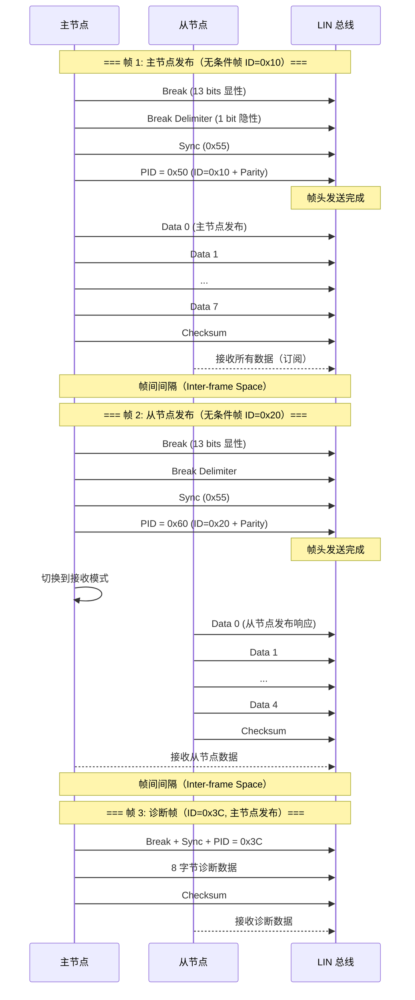

---

## 5. LIN 帧类型详解

### 5.1 无条件帧（Unconditional Frame）

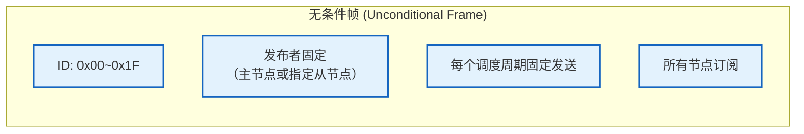

**最常用的帧类型。** 每次调度到此帧时，固定的发布者发送响应，所有其他节点接收。

#### 发布者与订阅者的确定

无条件帧的发布者由 **LDF（LIN Description File）** 静态定义，在运行时不可更改：

| 角色 | 说明 | 数量 |
|------|------|------|
| **发布者（Publisher）** | 唯一发送响应的节点 | 1 个（主节点或某个从节点） |
| **订阅者（Subscriber）** | 接收响应的节点 | 1~N 个（所有其他节点） |

**关键规则：**
- 每个无条件帧有且仅有一个发布者
- 发布者在 LDF 中由 `Frames {}` 定义时指定
- 主节点可以同时是多个帧的发布者
- 一个从节点也可以是多个帧的发布者

#### 主节点发布 vs 从节点发布

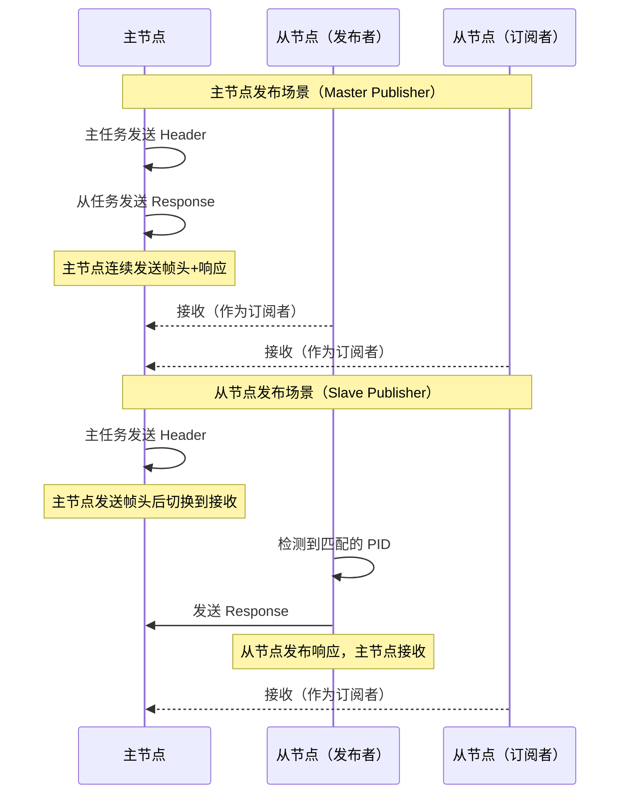

#### 主节点发布无条件帧的完整示例

```c
/* ============================================
 * 无条件帧示例：主节点发布车窗开关状态
 * 帧 ID: 0x10
 * 数据长度: 4 字节
 * 发布者: 主节点（BCM/网关）
 * 订阅者: 所有从节点
 * ============================================ */

/* 信号定义 */
typedef struct {
    uint8_t FrontLeftWindow  : 2;  /* Bit0~1: 左前车窗开关 */
    uint8_t FrontRightWindow : 2;  /* Bit2~3: 右前车窗开关 */
    uint8_t RearLeftWindow   : 2;  /* Bit4~5: 左后车窗开关 */
    uint8_t RearRightWindow  : 2;  /* Bit6~7: 右后车窗开关 */
} WindowSwitchSignal;

/* 开关状态枚举 */
typedef enum {
    WINDOW_IDLE   = 0,  /* 无操作 */
    WINDOW_UP     = 1,  /* 上升 */
    WINDOW_DOWN   = 2,  /* 下降 */
    WINDOW_AUTO   = 3   /* 一键升降 */
} WindowCtrlType;

/* 信号打包 */
typedef struct {
    uint8_t WindowSwitch;  /* 车窗开关信号 */
    uint8_t WindowSpeed;   /* 车窗速度 (0~100%) */
    uint8_t Reserved1;     /* 保留 */
    uint8_t Reserved2;     /* 保留 */
} MasterCmdFrame_0x10;     /* 无条件帧，ID=0x10 */

/* 主节点发布数据 */
const MasterCmdFrame_0x10 MasterCmdData = {
    .WindowSwitch = 0x05,  /* 二进制: 00 00 01 01 */
    /* Bit0~1: FrontLeft  = 01 (上升) */
    /* Bit2~3: FrontRight = 01 (上升) */
    /* Bit4~5: RearLeft   = 00 (空闲) */
    /* Bit6~7: RearRight  = 00 (空闲) */
    .WindowSpeed = 80,     /* 80% 速度 */
    .Reserved1   = 0x00,
    .Reserved2   = 0x00
};

/* 主任务发送函数 */
void Lin_Master_PublishUnconditionalFrame(void) {
    /* 步骤 1: 发送帧头 */
    Lin_Hw_SendBreak(13);              /* Break 场 */
    Lin_Hw_SendByte(0x55);             /* Sync 场 */
    uint8_t pid = Lin_CalculateParity(0x10);  /* PID */
    Lin_Hw_SendByte(pid);

    /* 步骤 2: 主节点从任务发布响应 */
    uint8_t* data = (uint8_t*)&MasterCmdData;
    for (uint8_t i = 0; i < 4; i++) {
        Lin_Hw_SendByte(data[i]);      /* 数据场 */
    }
    uint8_t cs = Lin_EnhancedChecksum(pid, data, 4);
    Lin_Hw_SendByte(cs);               /* 校验和 */
}
```

#### 从节点发布无条件帧的完整示例

```c
/* ============================================
 * 无条件帧示例：从节点发布车窗位置
 * 帧 ID: 0x11
 * 数据长度: 2 字节
 * 发布者: 从节点（车窗控制模块）
 * 订阅者: 主节点 + 其他从节点
 * ============================================ */

/* 从节点 - 车窗控制模块的配置 */
#define SLAVE_WINDOW_ID      0x01      /* 从节点 ID */
#define PUBLISH_FRAME_ID     0x11      /* 本节点发布的无条件帧 ID */
#define PUBLISH_FRAME_DL     2         /* 数据长度 2 字节 */

/* 从节点准备发布的响应数据 */
typedef struct {
    uint8_t CurrentPosition;    /* 当前位置 (0~100%) */
    uint8_t WindowStatus;       /* 状态标志 */
    /* Bit0: MovingUp */
    /* Bit1: MovingDown */
    /* Bit2: Blocked (防夹触发) */
    /* Bit3: EndStopTop */
    /* Bit4: EndStopBottom */
    /* Bit5~7: 保留 */
} WindowPositionFrame_0x11;

/* 从节点响应数据缓冲区 */
WindowPositionFrame_0x11 SlaveResponseData;

/* 从节点更新响应数据（由应用层调用）*/
void Slave_UpdateWindowPosition(uint8_t position, uint8_t status) {
    SlaveResponseData.CurrentPosition = position;
    SlaveResponseData.WindowStatus    = status;
}

/* 从节点 LIN 中断处理（简化版，仅从发布者角度）*/
void Lin_SlaveRxInterruptHandler(uint8_t byte) {
    /* ... 状态机处理 ... */

    case WAIT_PID: {
        uint8_t pid = byte;
        uint8_t id = pid & 0x3F;

        /* 检查是否是本节点发布的无条件帧 ID */
        if (id == PUBLISH_FRAME_ID) {
            /* 验证奇偶校验 */
            if (Lin_VerifyParity(pid)) {
                /* 确认发布者身份：本节点是发布者 */
                /* 切换到发送模式，发送响应 */
                Lin_Hw_SetTransmitMode();

                uint8_t* data = (uint8_t*)&SlaveResponseData;
                for (uint8_t i = 0; i < PUBLISH_FRAME_DL; i++) {
                    Lin_Hw_SendByte(data[i]);
                }

                uint8_t cs = Lin_EnhancedChecksum(pid, data, PUBLISH_FRAME_DL);
                Lin_Hw_SendByte(cs);

                Lin_Hw_SetReceiveMode();  /* 恢复接收 */
                state = WAIT_BREAK;
            }
        }
        break;
    }
}
```

#### 调度表中的无条件帧

```c
/* ============================================
 * 车门 LIN 调度表 - 无条件帧的调度
 * ============================================ */

/* 调度表定义：车门系统 */
/* 无条件帧 ID=0x10: 主节点发布（车窗开关指令）*/
/* 无条件帧 ID=0x11: 从节点 1 发布（车窗位置反馈）*/
/* 无条件帧 ID=0x12: 主节点发布（门锁指令）*/
/* 无条件帧 ID=0x13: 从节点 2 发布（门锁状态反馈）*/

const LinScheduleEntry DoorScheduleEntries[] = {
    /* 无条件帧: 主节点发布车窗开关指令 */
    {0x10, 4, masterWindowData, 1, 0},   /* Publisher=0: 主节点发布 */

    /* 帧间间隔 5ms */

    /* 无条件帧: 从节点 1 发布车窗位置反馈 */
    {0x11, 2, NULL,            1, 1},   /* Publisher=1: 从节点发布 */

    /* 帧间间隔 5ms */

    /* 无条件帧: 主节点发布门锁指令 */
    {0x12, 3, masterDoorLockData, 1, 0}, /* Publisher=0: 主节点发布 */

    /* 帧间间隔 5ms */

    /* 无条件帧: 从节点 2 发布门锁状态反馈 */
    {0x13, 1, NULL,            1, 1},   /* Publisher=1: 从节点发布 */
};

/* 调度表执行时序:
 *
 * 时间轴:
 * T=0ms:   主节点发 Header(0x10) → 主节点发 Response(车窗开关指令)
 * T=5ms:   主节点发 Header(0x11) → 从节点 1 发 Response(车窗位置反馈)
 * T=10ms:  主节点发 Header(0x12) → 主节点发 Response(门锁指令)
 * T=15ms:  主节点发 Header(0x13) → 从节点 2 发 Response(门锁状态反馈)
 * T=20ms:  回到 T=0ms，循环
 *
 * 总线利用率计算:
 * 每帧约: 1ms (20kbps, 34+40=74 bits → 3.7ms + 帧间间隔 5ms)
 * 4 帧 × 8.7ms = 34.8ms / 周期
 * 总线利用率 ≈ 34.8/40 = 87%
 */
```

#### 真实信号数据流示例

```
========================================================================
 无条件帧 ID=0x10（主节点发布） - 车窗开关指令
========================================================================

 主节点应用层:
   用户按下左前车窗上升按钮
   → 主节点 SW-C 设置 FrontLeftWindow = WINDOW_UP (01)
   → 主节点 SW-C 设置 WindowSpeed = 80

 消息打包:
   Byte 0: [Bit1~0: FrontLeft  = 01] [Bit3~2: FrontRight = 00]
           [Bit5~4: RearLeft   = 00] [Bit7~6: RearRight  = 00]
           = 0x05
   Byte 1: WindowSpeed = 80 = 0x50
   Byte 2: Reserved    = 0x00
   Byte 3: Reserved    = 0x00

 总线发送:
   Break | 0x55 | 0x50(=PID) | 0x05 | 0x50 | 0x00 | 0x00 | 0x??(=CS)
   └── Header ──┘ └────────── Response ────────────────────────┘

 从节点接收:
   车窗从节点收到 ID=0x10，确认是订阅者
   接收数据: 0x05, 0x50, 0x00, 0x00
   解析: FrontLeft=上升, WindowSpeed=80%
   执行: 启动左前车窗电机，以 80% 速度上升

========================================================================
 无条件帧 ID=0x11（从节点发布） - 车窗位置反馈
========================================================================

 从节点应用层:
   车窗电机正在运行，当前已上升 35%
   从节点更新 SlaveResponseData

 消息打包:
   Byte 0: CurrentPosition = 35 = 0x23
   Byte 1: [Bit0: MovingUp=1] [Bit1: MovingDown=0]
           [Bit2: Blocked=0] [Bit3: EndStopTop=0]
           [Bit4: EndStopBottom=0] [Bit5~7: 保留]
           = 0x01

 总线发送:
   主节点发 Header: Break | 0x55 | 0x51(=PID)
   从节点发 Response: 0x23 | 0x01 | 0x??(=CS)

 主节点接收:
   收到车窗位置 35%, 当前正在上升
   显示给驾驶员或由 BCM 进行逻辑判断
```

#### 无条件帧的关键特性总结

| 特性 | 说明 |
|------|------|
| **确定性** | 每个调度周期固定发送，延迟可预测 |
| **固定发布者** | 发布者由 LDF 静态定义，运行时不变 |
| **无冲突** | 因为发布者唯一，总线上不会发生冲突 |
| **周期性** | 以固定周期在调度表中出现 |
| **适用场景** | 周期性控制信号（开关状态）、周期性反馈信号（传感器数据） |
| **典型周期** | 5ms~100ms（取决于信号实时性要求） |

### 5.2 事件触发帧（Event-Triggered Frame）

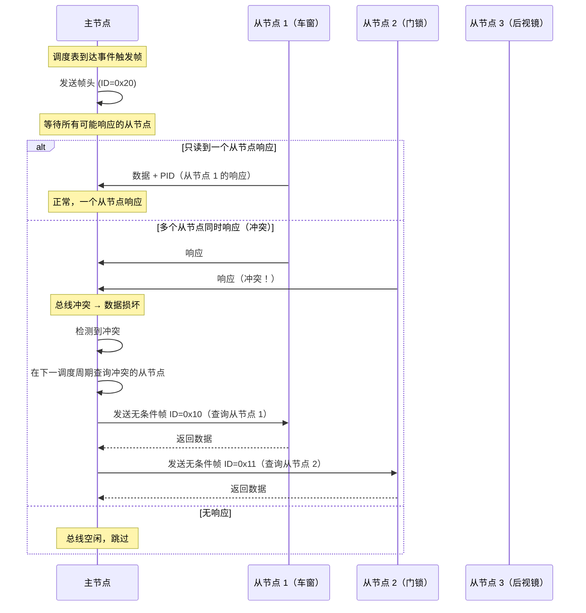

**用途：** 用于轮询多个从节点，但大多数情况下只有少数节点有数据更新。通过**冲突解决**机制处理多个节点同时响应的情况。

### 5.3 零星帧（Sporadic Frame）

```c
/* 零星帧 - 主节点不定时发布 */
/* 在调度表中有空闲时间时发送 */

/* 零星帧管理 */
typedef struct {
    uint8_t  Id;            /* 帧 ID */
    uint8_t  Dl;            /* 数据长度 */
    uint8_t  Data[8];       /* 数据 */
    boolean  DataUpdated;   /* 是否有新数据 */
} LinSporadicFrame;

/* 主节点在空闲时发送零星帧 */
void Lin_ProcessSporadicFrames(void) {
    for (uint8_t i = 0; i < SPORADIC_COUNT; i++) {
        if (SporadicFrames[i].DataUpdated) {
            /* 有更新数据，发送该帧 */
            Lin_SendHeader(SporadicFrames[i].Id);
            Lin_SendResponse(SporadicFrames[i].Data, SporadicFrames[i].Dl);
            SporadicFrames[i].DataUpdated = FALSE;
            break;  /* 每轮只发送一个零星帧 */
        }
    }
}
```

**用途：** 主节点在调度表空闲时才发送的帧，用于传递非关键更新数据。

### 5.4 诊断帧（Diagnostic Frame）

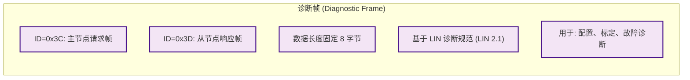

**诊断帧的通信流程：**

```
主节点:
1. 发送 ID=0x3C + 8 字节诊断请求
2. 等待从节点响应

从节点:
1. 收到 ID=0x3C，接收诊断请求
2. 处理请求
3. 等待主节点发送 ID=0x3D 的帧头
4. 发送 8 字节诊断响应
```

---

## 6. LIN 调度表（Schedule Table）

### 6.1 调度表概念

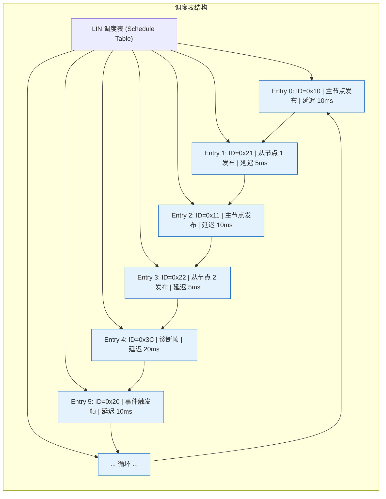

### 6.2 调度表执行时序

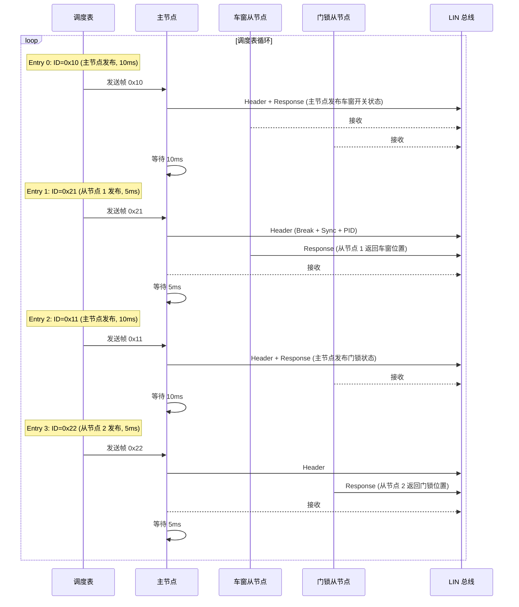

### 6.3 调度表切换

```c
/* ============================================
 * LIN 调度表管理
 * ============================================ */

/* 定义多个调度表 */
const LinScheduleTable Lin_ScheduleTable_Normal = {
    .Entry = {
        {0x10, 4, data_10, 1, 0},  /* 主节点发布, 10ms */
        {0x21, 2, NULL,    1, 1},  /* 从节点发布, 5ms */
        {0x11, 4, data_11, 1, 0},  /* 主节点发布, 10ms */
        {0x22, 2, NULL,    1, 1},  /* 从节点发布, 5ms */
        {0x30, 3, data_30, 1, 0},  /* 零星帧, 20ms */
    },
    .EntryCount = 5,
    .Delay = 10  /* 帧间间隔 */
};

const LinScheduleTable Lin_ScheduleTable_Diagnostic = {
    .Entry = {
        {0x3C, 8, diag_req, 1, 0},  /* 诊断请求 */
        {0x3D, 8, NULL,     1, 1},  /* 诊断响应 */
    },
    .EntryCount = 2,
    .Delay = 20
};

/* 调度表切换（由 LIN 状态机或上层请求触发）*/
void Lin_SwitchScheduleTable(const LinScheduleTable* newTable) {
    /* 等待当前帧完成 */
    while (Lin_IsBusy()) {
        /* 等待 */
    }
    /* 切换到新调度表 */
    CurrentSchedule = *newTable;
    CurrentSchedule.Index = 0;
}
```

---

## 7. LIN 状态机

### 7.1 睡眠与唤醒

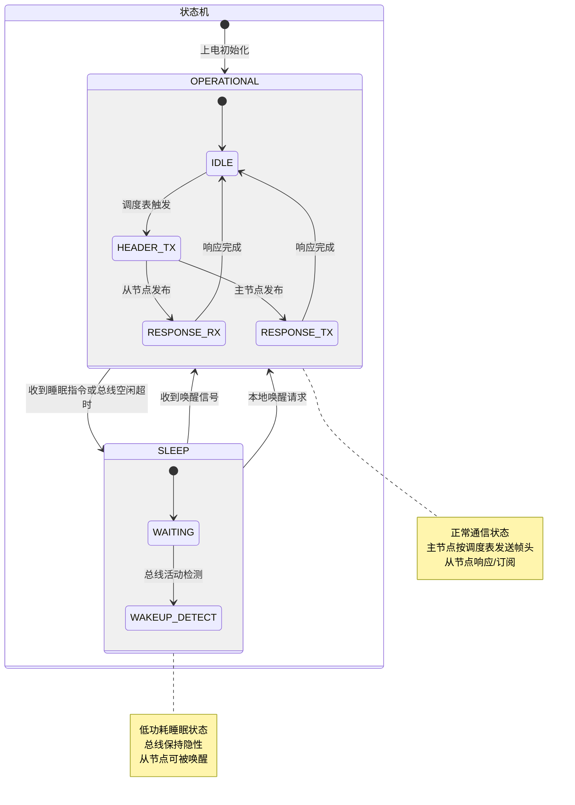

### 7.2 睡眠指令

```c
/* 睡眠指令 - 主节点发送 */
/* 通过 ID=0x3C 诊断帧发送睡眠请求 */

/* 方法 1: 发送诊断睡眠指令 */
void Lin_GoToSleepDiagnostic(void) {
    uint8_t sleepCmd[8] = {
        0x00,  /* 诊断服务: 0x00 = 睡眠 */
        0x00, 0x00, 0x00, 0x00, 0x00, 0x00, 0x00
    };
    Lin_SendFrame(0x3C, sleepCmd, 8);
}

/* 方法 2: 发送睡眠命令帧（ID=0x3C 的简化方式）*/
/* 在 LIN 2.x 中，主节点发送一个保留的帧头 */
/* 所有从节点检测到后进入睡眠 */

/* 方法 3: 总线空闲超时 */
/* 如果总线空闲超过 4 秒，所有节点自动进入睡眠 */
```

### 7.3 唤醒流程

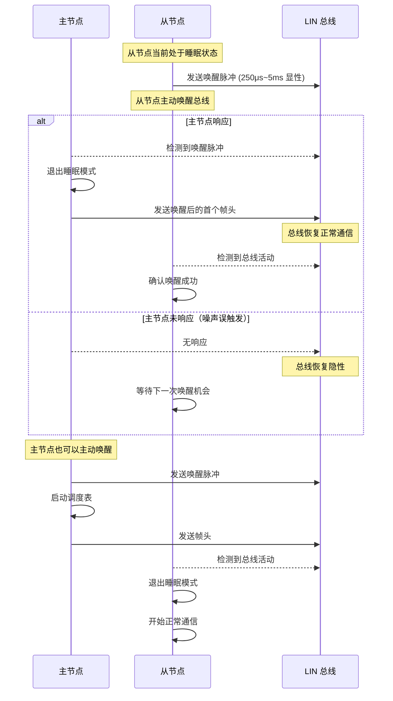

---

## 8. LIN 与 CAN 对比

### 8.1 完整对比表

| 维度 | LIN | CAN |
|------|-----|-----|
| **全称** | Local Interconnect Network | Controller Area Network |
| **标准** | ISO 17897 (LIN 2.2A) | ISO 11898 |
| **拓扑** | 单主多从 | 多主（无主从概念） |
| **传输介质** | 单线 + GND | 双绞线（CAN_H + CAN_L） |
| **总线电平** | 0V / 12V | 显性 1.5V/3.5V，隐性 2.5V |
| **最大速率** | 20 kbps | 1 Mbps (CAN) / 5 Mbps (CAN FD) |
| **最大节点数** | 16 个 | 32~128 个（取决于收发器） |
| **通信控制** | 主节点集中控制 | 分布式，CSMA/CA 仲裁 |
| **帧仲裁** | 无仲裁（主节点调度） | 按 ID 优先级逐位仲裁 |
| **错误检测** | 2D 奇偶 + 校验和 | CRC + 位填充 + 位监控 + ACK |
| **错误容错** | 低（无自动重发） | 高（错误帧 + 自动重发） |
| **数据长度** | 1~8 字节 | 8 字节 (CAN) / 64 字节 (CAN FD) |
| **从节点成本** | 极低（可用 UART） | 中（需要 CAN 控制器） |
| **典型应用** | 车窗、座椅、门锁 | 动力总成、安全、车身骨干 |

### 8.2 通信模型对比

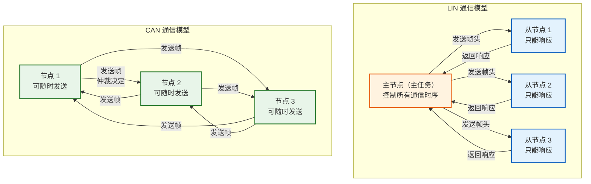

---

## 9. AUTOSAR LIN 协议栈

### 9.1 架构图

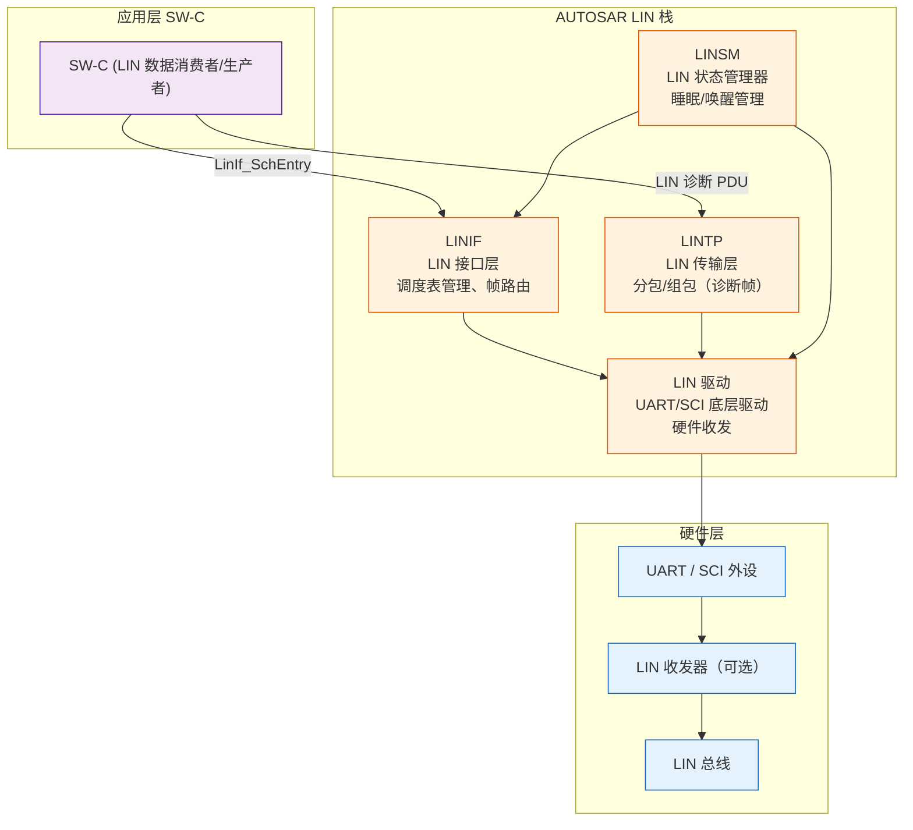

### 9.2 各模块职责

| 模块 | 全称 | 职责 |
|------|------|------|
| **LINSM** | LIN State Manager | 睡眠/唤醒状态管理，总线状态切换 |
| **LINIF** | LIN Interface | 调度表管理，帧路由，发布/订阅管理 |
| **LINTP** | LIN Transport | 诊断帧的分包/组包（基于 ISO 15765-2） |
| **LINDRV** | LIN Driver | UART/SCI 底层驱动，Break 发送/检测，位时序 |

### 9.3 LIN 调度表配置（AUTOSAR XML）

```xml
<!-- AUTOSAR LINIF 调度表配置 -->
<LinIfScheduleTable>
    <SHORT-NAME>NormalScheduleTable</SHORT-NAME>
    <LinIfScheduleTableEntry>
        <SHORT-NAME>Entry_0x10</SHORT-NAME>
        <LinIfEntryDlc>4</LinIfEntryDlc>
        <LinIfEntryId>0x10</LinIfEntryId>
        <LinIfEntryMode>LINIF_PUBLISH</LinIfEntryMode>  <!-- 发布/订阅 -->
        <LinIfEntryDelay>10</LinIfEntryDelay>             <!-- 10ms -->
    </LinIfScheduleTableEntry>
    <LinIfScheduleTableEntry>
        <SHORT-NAME>Entry_0x21</SHORT-NAME>
        <LinIfEntryDlc>2</LinIfEntryDlc>
        <LinIfEntryId>0x21</LinIfEntryId>
        <LinIfEntryMode>LINIF_RECEIVE</LinIfEntryMode>   <!-- 订阅 -->
        <LinIfEntryDelay>5</LinIfEntryDelay>
    </LinIfScheduleTableEntry>
</LinIfScheduleTable>
```

### 9.4 LIN 驱动 API

```c
/* ============================================
 * AUTOSAR LIN 驱动 API（简化版本）
 * ============================================ */

/* 初始化 LIN 控制器 */
void Lin_Init(const Lin_ConfigType* Config);

/* 发送帧（由 LINIF 调用）*/
/* 主节点: 发送帧头 + 响应（可选）*/
/* 从节点: 发送响应数据 */
Std_ReturnType Lin_SendFrame(
    uint8_t                Channel,   /* LIN 通道 */
    const Lin_PduType*     PduInfo    /* LIN PDU 信息 */
);

/* 接收帧回调（由 LIN 驱动调用）*/
/* 通知上层收到完整的帧 */
void Lin_RxIndication(
    uint8_t                Channel,
    const Lin_PduType*     PduInfo
);

/* 发送确认回调（由 LIN 驱动调用）*/
/* 通知上层帧发送完成 */
void Lin_TxConfirmation(
    uint8_t                Channel,
    Std_ReturnType         Result
);

/* 设置 LIN 控制器模式 */
/* LIN_SLEEP / LIN_NORMAL */
Std_ReturnType Lin_SetControllerMode(
    uint8_t                Channel,
    Lin_ControllerModeType  Mode
);

/* 获取 LIN 控制器状态 */
Lin_ControllerStatusType Lin_GetControllerStatus(
    uint8_t Channel
);
```

---

## 10. 实际工程示例

### 10.1 车门 LIN 网络

```mermaid
graph TB
    subgraph 车门 LIN 网络
        DOOR_MASTER["车门主节点<br/>（BCM 或网关）<br/>LIN 主任务"]
        DOOR_SLAVE1["车窗控制从节点<br/>ID: 0x01<br/>发布: 车窗位置"]
        DOOR_SLAVE2["门锁控制从节点<br/>ID: 0x02<br/>发布: 门锁状态"]
        DOOR_SLAVE3["后视镜控制从节点<br/>ID: 0x03<br/>发布: 后视镜位置"]
        DOOR_SLAVE4["车窗防夹模块<br/>ID: 0x04<br/>发布: 防夹状态"]
    end

    subgraph 调度表
        S0["10ms: ID=0x10<br/>主节点发布: 开关状态"]
        S1["5ms:  ID=0x21<br/>从节点 1 发布: 车窗位置"]
        S2["10ms: ID=0x11<br/>主节点发布: 门锁指令"]
        S3["5ms:  ID=0x22<br/>从节点 2 发布: 门锁状态"]
        S4["20ms: ID=0x30<br/>主节点发布: 后视镜指令"]
        S5["5ms:  ID=0x33<br/>从节点 3 发布: 后视镜位置"]
        S6["50ms: ID=0x20<br/>事件触发帧: 防夹状态"]
    end

    DOOR_MASTER --- DOOR_SLAVE1
    DOOR_MASTER --- DOOR_SLAVE2
    DOOR_MASTER --- DOOR_SLAVE3
    DOOR_MASTER --- DOOR_SLAVE4

    DOOR_MASTER --> S0
    DOOR_MASTER --> S1
    DOOR_MASTER --> S2
    DOOR_MASTER --> S3
    DOOR_MASTER --> S4
    DOOR_MASTER --> S5
    DOOR_MASTER --> S6

    classDef master fill:#fff3e0,stroke:#e65100,stroke-width:2px
    classDef slave fill:#e3f2fd,stroke:#1565c0,stroke-width:2px
    classDef sch fill:#f5f5f5,stroke:#9e9e9e,stroke-dasharray:5 5

    class DOOR_MASTER master
    class DOOR_SLAVE1,DOOR_SLAVE2,DOOR_SLAVE3,DOOR_SLAVE4 slave
    class S0,S1,S2,S3,S4,S5,S6 sch
```

### 10.2 LDF 文件示例

```ldf
/* LIN 描述文件 (LDF) - 车门 LIN 网络 */
LIN_description_file;
LIN_protocol_version = "2.2";
LIN_language_version = "2.2";
LIN_speed = 19.2 kbps;

/* 节点定义 */
Nodes {
    Master: DoorMaster, 1.0 ms, 0.5 ms;
    Slaves: WindowSlave, DoorLockSlave, MirrorSlave;
}

/* 信号定义 */
Signals {
    WindowSwitchStatus: 4, 0, DoorMaster, WindowSlave;
    WindowPosition: 8, 0, WindowSlave, DoorMaster;
    DoorLockCmd: 2, 0, DoorMaster, DoorLockSlave;
    DoorLockStatus: 2, 0, DoorLockSlave, DoorMaster;
    MirrorFoldCmd: 1, 0, DoorMaster, MirrorSlave;
    MirrorFoldStatus: 1, 0, MirrorSlave, DoorMaster;
}

/* 帧定义 */
Frames {
    Frame MasterCmd_0x10: 0x10, DoorMaster, 4 {
        WindowSwitchStatus, 0;
        DoorLockCmd, 4;
        MirrorFoldCmd, 6;
    }
    Frame WindowResp_0x21: 0x21, WindowSlave, 2 {
        WindowPosition, 0;
    }
    Frame DoorLockResp_0x22: 0x22, DoorLockSlave, 2 {
        DoorLockStatus, 0;
    }
    Frame MirrorResp_0x23: 0x23, MirrorSlave, 1 {
        MirrorFoldStatus, 0;
    }
}

/* 调度表定义 */
Schedule_tables {
    NormalSchedule {
        MasterCmd_0x10     delay 10 ms;
        WindowResp_0x21    delay 5 ms;
        MasterCmd_0x10     delay 10 ms;
        DoorLockResp_0x22  delay 5 ms;
        MasterCmd_0x10     delay 10 ms;
        MirrorResp_0x23    delay 5 ms;
    }
}
```

---

## 11. 总结

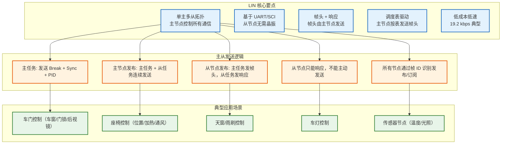

### 一句话总结

| 概念 | 一句话 |
|------|--------|
| **LIN 协议** | 基于 UART 的**单主多从**低速串行总线，主节点通过**调度表**控制所有通信 |
| **主节点发送逻辑** | 主节点**主任务**发送帧头（Break + Sync + PID），然后根据发布者角色决定是否由主节点**从任务**发送响应 |
| **从节点发送逻辑** | 从节点**只能响应**主节点的帧头，在收到匹配的 PID 后才发送响应数据 |
| **LIN vs CAN** | LIN 是 CAN 的**低成本子网**，速度慢、无仲裁、主从结构，适合控制类信号 |
| **帧头-响应** | 主节点总是发送帧头，响应由**发布者**（主节点或从节点）发送，**订阅者**接收 |