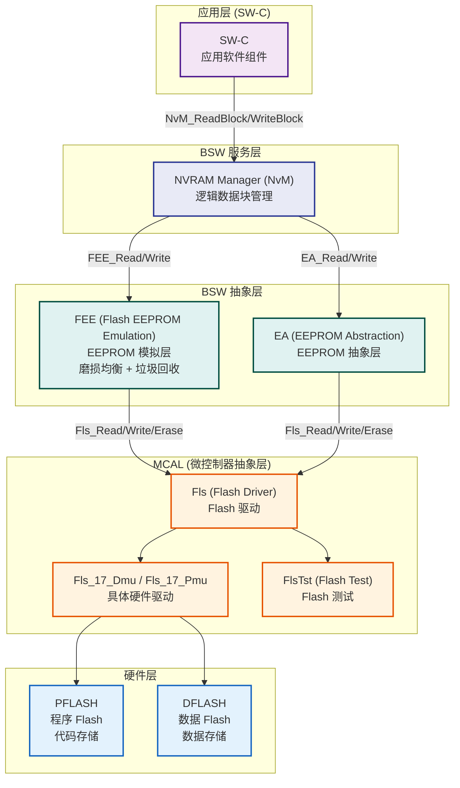
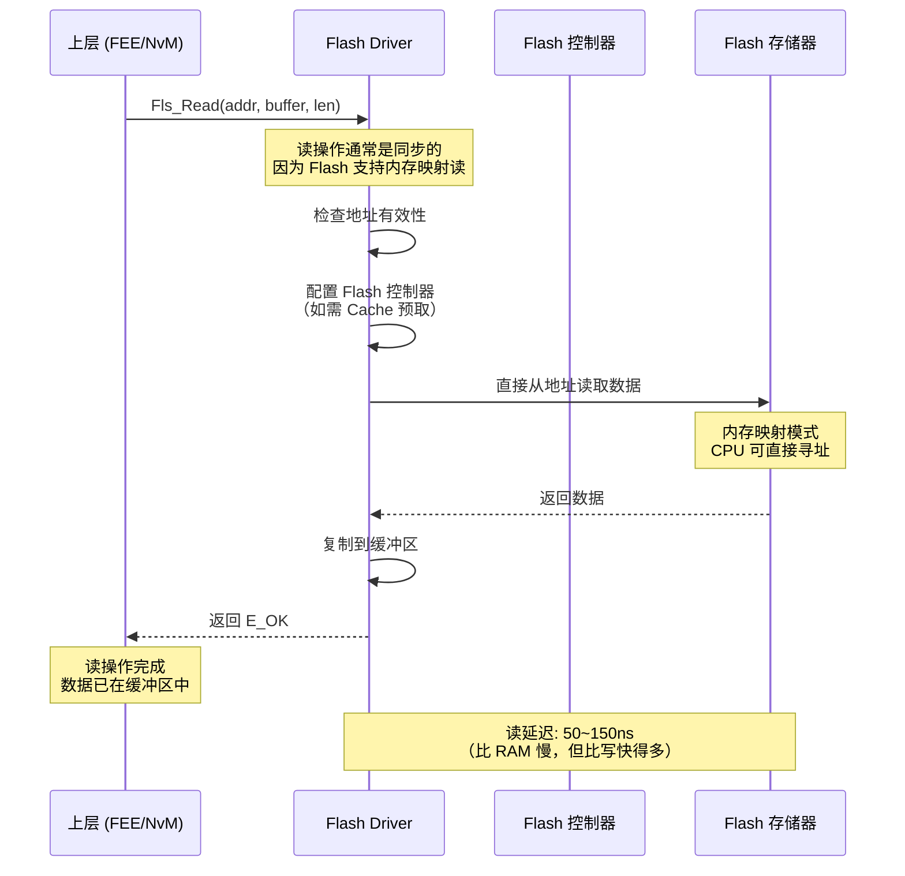
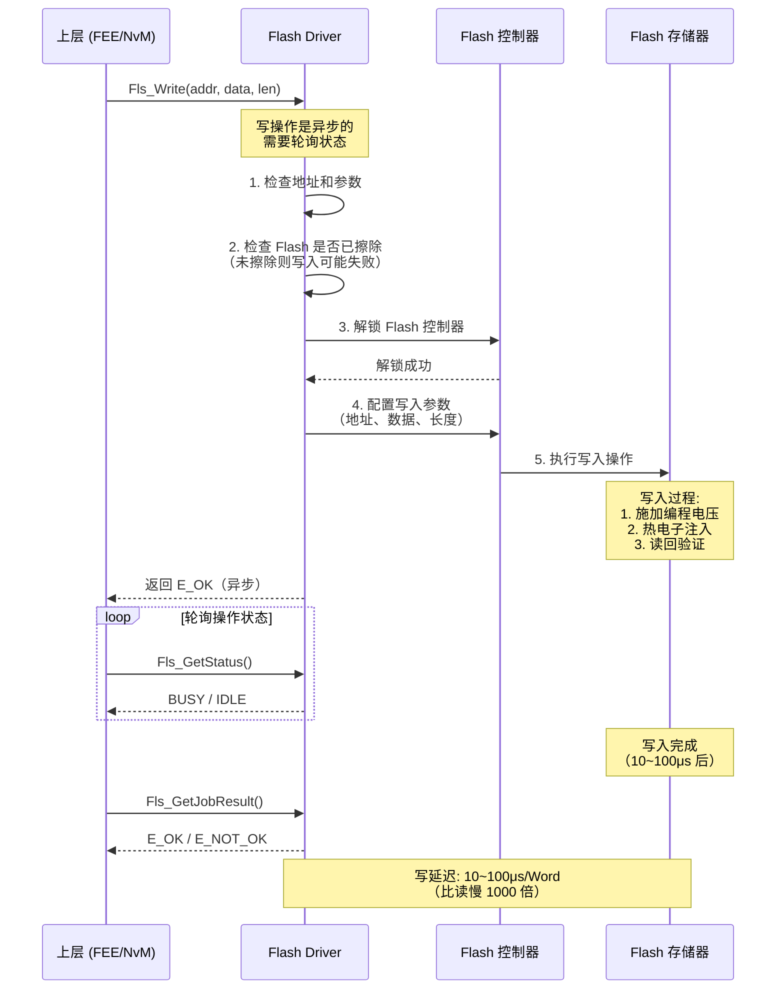
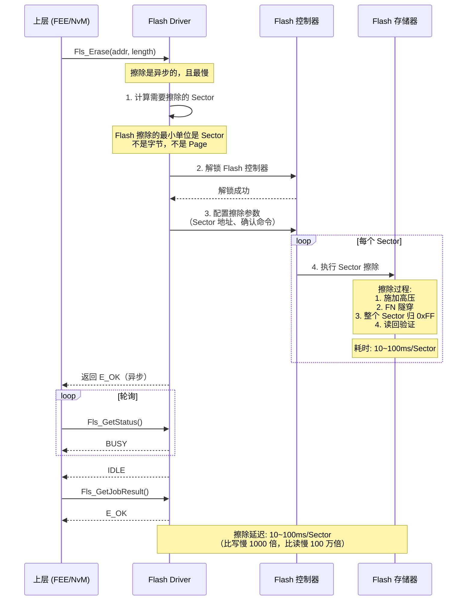
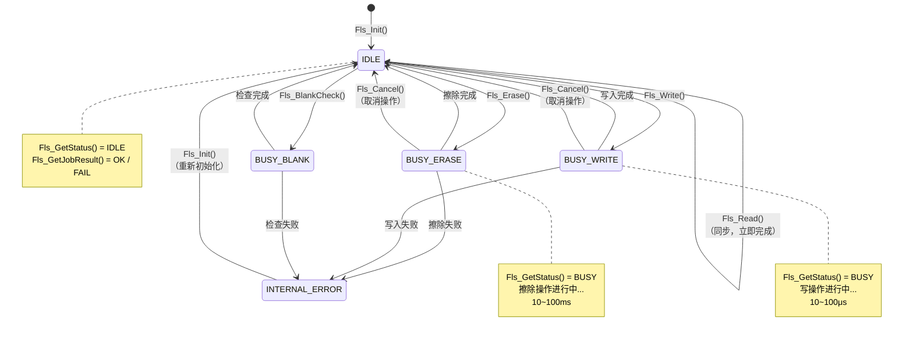
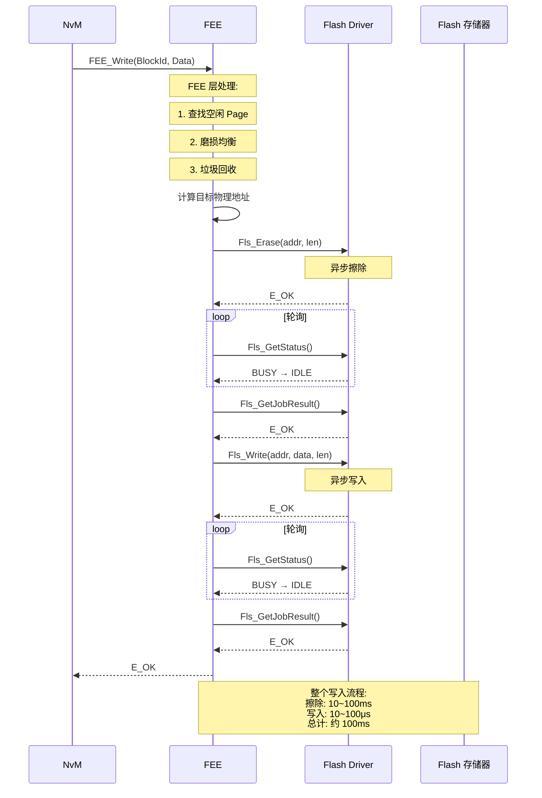
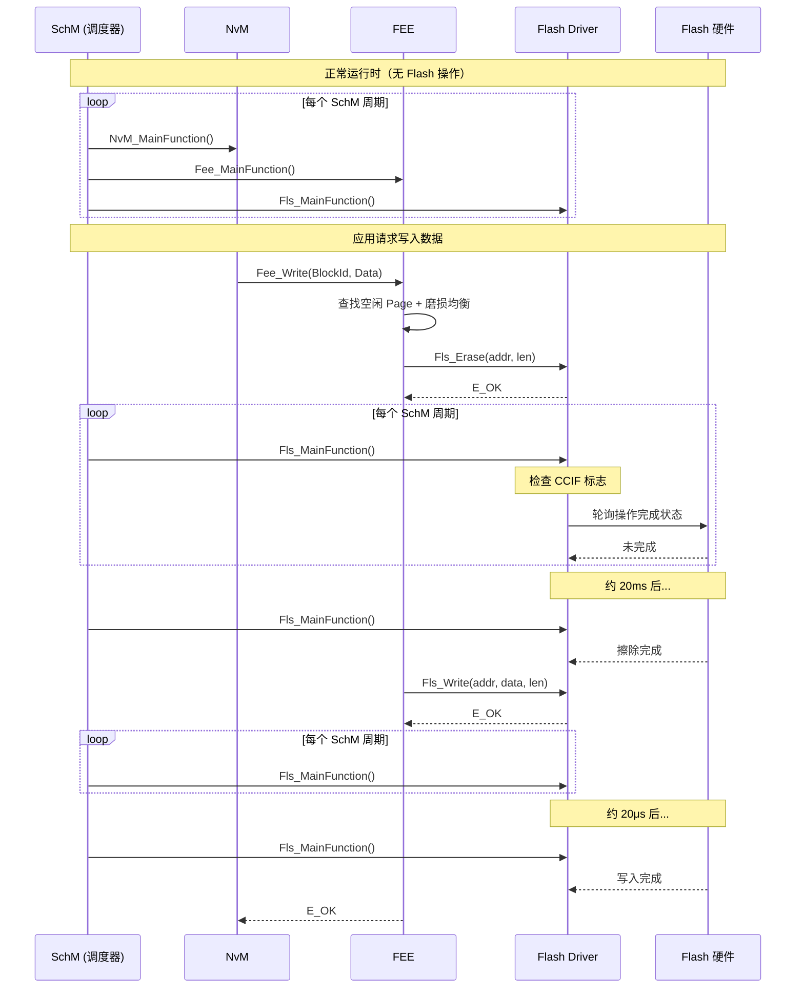
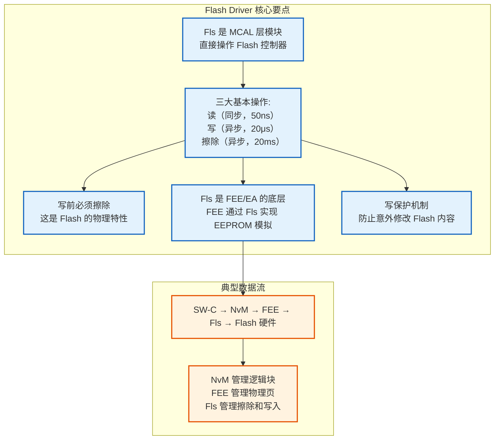

# AUTOSAR Flash Driver 详解

> Flash Driver（Fls）是 AUTOSAR MCAL 层中负责操作 Flash 存储器的底层驱动模块

---

## 1. 通俗理解

把 Flash Driver 想象成**图书馆的管理员**：

| 角色 | 类比 | 说明 |
|------|------|------|
| **Flash Driver** | 图书馆管理员 | 知道书的摆放规则、知道哪本书在哪个架子上，负责取书、放书、整理 |
| **PFLASH** | 教材区 | 存放教科书（程序代码），大部分时间只读，偶尔更新 |
| **DFLASH** | 笔记本区 | 存放笔记本（数据），需要经常修改 |
| **FEE/EA** | 图书管理员的上司 | 告诉管理员要存什么、取什么，不关心书放在哪个架子上 |
| **NvM** | 校长 | 决定要存什么数据，不关心书怎么放 |

**核心思想：** Flash Driver 负责最底层的硬件操作——如何擦除、如何写入、如何读取，把这些操作封装成简单的 API，让上层模块不用关心 Flash 的时序、电压、命令序列等复杂细节。

---

## 2. Flash Driver 在 AUTOSAR 架构中的位置



**图解释：** Flash Driver（Fls）位于 MCAL 层，处于硬件和上层软件之间：
- **上层**：FEE/EA 抽象层通过 `Fls_Read/Write/Erase` 接口调用 Fls
- **下层**：Fls 直接操作 Flash 控制器的寄存器
- **旁路**：FlsTst 提供 Flash 测试功能（BIST、ECC 检查）
- **应用层和 NvM** 完全不感知 Fls 的存在

---

## 3. Flash Driver 的核心功能

### 3.1 功能概览

```mermaid
graph TB
    subgraph Flash Driver 核心功能
        direction TB

        READ["读操作 Fls_Read<br/>从 Flash 读取数据<br/>→ 直接内存映射访问"]
        WRITE["写操作 Fls_Write<br/>向 Flash 写入数据<br/>→ 按 Page/Word 编程"]
        ERASE["擦除操作 Fls_Erase<br/>擦除 Flash 区域<br/>→ 按 Sector 擦除"]
        BLANK["空白检查 Fls_BlankCheck<br/>检查 Flash 是否已擦除<br/>→ 返回空白/非空白"]
        PROTECT["保护操作 Fls_SetMode<br/>设置 Flash 保护<br/>→ 读保护/写保护"]
        CANCEL["取消操作 Fls_Cancel<br/>取消正在执行的异步操作<br/>→ 回退到 IDLE"]
        GET_STATUS["获取状态 Fls_GetStatus<br/>查询当前操作状态<br/>→ IDLE/BUSY/ERROR"]
        JOB_RESULT["获取结果 Fls_GetJobResult<br/>获取上次操作结果<br/>→ E_OK/E_NOT_OK"]
    end

    classDef read fill:#e3f2fd,stroke:#1565c0
    classDef write fill:#fff3e0,stroke:#e65100
    classDef erase fill:#ffebee,stroke:#c62828
    classDef other fill:#f3e5f5,stroke:#4a148c

    class READ read
    class WRITE write
    class ERASE erase
    class BLANK,PROTECT,CANCEL,GET_STATUS,JOB_RESULT other
```



**图解释：** Flash Driver 包含 8 个核心功能，其中读/写/擦除是最基本的三个操作，其他是辅助功能。

### 3.2 标准 API

```c
/* ============================================
 * AUTOSAR Fls（Flash Driver）标准 API
 * ============================================ */

/* --- 初始化 --- */
void Fls_Init(const Fls_ConfigType* ConfigPtr);
/* 初始化 Flash 驱动，配置时序参数 */

/* --- 读操作 --- */
Std_ReturnType Fls_Read(
    Fls_AddressType SourceAddress,  /* Flash 源地址 */
    uint8_t*        TargetBuffer,   /* 目标缓冲区 */
    Fls_LengthType  Length          /* 读取长度 */
);
/* 从 Flash 读取数据到缓冲区 */
/* 注意: 读操作是同步的（立即完成） */

/* --- 写操作 --- */
Std_ReturnType Fls_Write(
    Fls_AddressType   TargetAddress, /* Flash 目标地址 */
    const uint8_t*    SourceBuffer,  /* 源数据缓冲区 */
    Fls_LengthType    Length         /* 写入长度 */
);
/* 向 Flash 写入数据 */
/* 注意: 写操作是异步的（需要轮询状态）*/

/* --- 擦除操作 --- */
Std_ReturnType Fls_Erase(
    Fls_AddressType TargetAddress,  /* 擦除起始地址 */
    Fls_LengthType  Length          /* 擦除长度 */
);
/* 擦除 Flash 区域 */
/* 注意: 擦除操作是异步的（需要轮询状态）*/

/* --- 空白检查 --- */
Std_ReturnType Fls_BlankCheck(
    Fls_AddressType TargetAddress,  /* 检查起始地址 */
    Fls_LengthType  Length          /* 检查长度 */
);
/* 检查 Flash 区域是否已擦除（空白 = 0xFF）*/

/* --- 状态查询 --- */
MemIf_StatusType Fls_GetStatus(void);
/* 返回当前操作状态：IDLE / BUSY / INTERNAL_ERROR */

/* --- 获取结果 --- */
MemIf_JobResultType Fls_GetJobResult(void);
/* 返回上次操作结果：OK / FAIL / PENDING / CANCELLED */

/* --- 取消操作 --- */
void Fls_Cancel(void);
/* 取消正在执行的异步操作 */

/* --- 设置模式 --- */
void Fls_SetMode(MemIf_ModeType Mode);
/* 设置 Flash 驱动模式：NORMAL / SLOW / POWER_DOWN */
```

---

## 4. Flash Driver 的三种基本操作

### 4.1 读操作（Fls_Read）



**图解释：** 读操作是最简单的。Flash 通常支持内存映射（Memory-Mapped），CPU 可以直接像访问内存一样读取 Flash 中的数据。Fls 读接口的主要工作是地址校验和边界检查。

### 4.2 写操作（Fls_Write）



**图解释：** 写操作是异步的，因为 Flash 写入需要较长时间（10~100μs）。上层需要轮询 `Fls_GetStatus()` 等待操作完成。

### 4.3 擦除操作（Fls_Erase）



**图解释：** 擦除是 Flash 操作中最慢的（10~100ms/Sector），因为需要将整个 Sector 的电子全部拉出。擦除前必须确保 Sector 中的数据已经备份或不再需要。

---

## 5. Fls 的异步操作状态机

### 5.1 状态机



**图解释：** Flash Driver 的状态机包含 4 个状态：
- **IDLE**：空闲状态，可以接受新操作
- **BUSY_WRITE**：写操作进行中（10~100μs）
- **BUSY_ERASE**：擦除操作进行中（10~100ms）
- **INTERNAL_ERROR**：操作失败，需要重新初始化

**特别说明：** `Fls_Read()` 是同步的，所以不需要进入 BUSY 状态，直接返回结果。

---

## 6. Flash Driver 的配置参数

### 6.1 关键配置项

```c
/* ============================================
 * Fls 配置结构体
 * ============================================ */
typedef struct {
    /* --- Flash 区域配置 --- */
    Fls_AddressType FlsBaseAddress;           /* Flash 基地址 */
    Fls_LengthType  FlsTotalSize;             /* 总大小 */
    Fls_LengthType  FlsSectorSize;            /* Sector 大小（擦除单位） */
    Fls_LengthType  FlsPageSize;              /* Page 大小（写入单位） */

    /* --- 时序配置 --- */
    uint32_t        FlsProgrammingTime;       /* 编程时间（μs） */
    uint32_t        FlsEraseTime;             /* 擦除时间（ms） */
    uint32_t        FlsDefaultMode;           /* 默认模式 */

    /* --- 操作配置 --- */
    boolean         FlsReadSync;              /* 读是否同步（通常 TRUE） */
    boolean         FlsWriteSync;             /* 写是否同步（通常 FALSE） */
    boolean         FlsEraseSync;             /* 擦除是否同步（通常 FALSE） */
    uint32_t        FlsMaxReadFastSize;       /* 最大快速读取大小 */
    uint32_t        FlsMaxWriteFastSize;      /* 最大快速写入大小 */

    /* --- ECC 配置 --- */
    boolean         FlsEccEnabled;            /* 是否启用 ECC */
    Fls_EccCorrectionType FlsEccCorrection;   /* ECC 纠错方式 */
    /* 0: 仅检测，不纠正 */
    /* 1: 单 bit 纠错 */
    /* 2: 多 bit 纠错 */

    /* --- 保护配置 --- */
    boolean         FlsProtectionEnabled;     /* 是否启用保护 */
    boolean         FlsAcErase;               /* 自动擦除前读回验证 */
    boolean         AcWrite;                  /* 自动写入后读回验证 */

    /* --- 回调配置 --- */
    Fls_CallbackType FlsCallback;             /* 操作完成回调函数 */
} Fls_ConfigType;
```

### 6.2 典型配置值

| 参数 | S32K148 | TC3xx (AURIX) | STM32F1 |
|------|---------|---------------|---------|
| **FlsBaseAddress** | 0x00000000 | 0x80000000 | 0x08000000 |
| **FlsTotalSize** | 1MB | 最大 16MB | 64KB |
| **FlsSectorSize** | 4KB | 32KB | 2KB |
| **FlsPageSize** | 8 Bytes | 16 Bytes | 4 Bytes |
| **FlsProgrammingTime** | 20μs | 25μs | 40μs |
| **FlsEraseTime** | 20ms | 25ms | 20ms |
| **FlsEccEnabled** | TRUE | TRUE | FALSE |
| **FlsEccCorrection** | 单 bit 纠错 | 单 bit 纠错 | 无 |

---

## 7. Flash Driver 与 FEE/EA 的交互

### 7.1 FEE 调用 Fls 的完整流程



**图解释：** FEE 调用 Fls 的完整流程：
1. FEE 先擦除目标 Sector（异步，需轮询等待）
2. FEE 再写入数据（异步，需轮询等待）
3. FEE 通过 `Fls_GetJobResult()` 验证操作结果
4. 整个过程约 100ms，其中 99% 的时间花在擦除上

### 7.2 FEE 的关键配置

```c
/* FEE 配置中与 Fls 相关的关键参数 */
const Fee_ConfigType Fee_Config = {
    .FeeDevice = 0,                          /* 使用的 Fls 设备索引 */
    .FeeFlsBaseAddress = 0x10000000,          /* Fls 中的基地址 */
    .FeeFlsSectorSize = 4096,                 /* 与 Fls 的 SectorSize 一致 */
    .FeeFlsPageSize = 64,                     /* 与 Fls 的 PageSize 一致 */
    .FeeNumberOfSectors = 16,                 /* 使用的 Sector 数量 */
    .FeeImmediateData = TRUE,                  /* 是否立即写入 */
    .FeePollingMode = TRUE,                   /* 轮询模式 vs 中断模式 */
};
```

---

## 8. Flash Driver 的硬件操作细节

### 8.1 Flash 写入命令序列

```c
/* ============================================
 * Flash 写入的硬件命令序列（以 S32K148 为例）
 * ============================================ */

/* 通常 Flash 驱动不直接操作寄存器，而是通过 Flash 控制器 */

/* S32K148 FTFC (Flash Memory Controller) 的写入命令序列 */
Std_ReturnType Fls_Write_Impl(uint32_t addr, const uint8_t* data, uint32_t len) {
    /* 步骤 1: 等待前一个命令完成 */
    while (FTFC->FSTAT & FTFC_FSTAT_CCIF_MASK == 0);

    /* 步骤 2: 检查 Flash 是否被保护 */
    if (FTFC->FSTAT & FTFC_FSTAT_FPVIOL_MASK) {
        FTFC->FSTAT = FTFC_FSTAT_FPVIOL_MASK;  /* 清除错误标志 */
        return E_NOT_OK;
    }

    /* 步骤 3: 配置写入地址和数据 */
    FTFC->FCCOB0 = 0x06;                    /* 命令: Program Phrase */
    FTFC->FCCOB1 = (uint8_t)(addr >> 16);   /* 地址高 16 位 */
    FTFC->FCCOB2 = (uint8_t)(addr >> 8);    /* 地址中 8 位 */
    FTFC->FCCOB3 = (uint8_t)(addr);          /* 地址低 8 位 */

    /* 加载 8 字节数据（一个 Phrase） */
    FTFC->FCCOB4 = data[0];
    FTFC->FCCOB5 = data[1];
    FTFC->FCCOB6 = data[2];
    FTFC->FCCOB7 = data[3];
    FTFC->FCCOB8 = data[4];
    FTFC->FCCOB9 = data[5];
    FTFC->FCCOBA = data[6];
    FTFC->FCCOBB = data[7];

    /* 步骤 4: 启动命令 */
    FTFC->FSTAT = FTFC_FSTAT_CCIF_MASK;     /* 清除 CCIF 标志，启动命令 */

    /* 步骤 5: 等待命令完成（异步模式下返回，由上层轮询）*/
    /* while (FTFC->FSTAT & FTFC_FSTAT_CCIF_MASK == 0); // 同步等待 */

    return E_OK;
}

/* ============================================
 * Flash 擦除的硬件命令序列
 * ============================================ */
Std_ReturnType Fls_EraseSector_Impl(uint32_t sectorAddr) {
    /* 步骤 1: 等待前一个命令完成 */
    while (FTFC->FSTAT & FTFC_FSTAT_CCIF_MASK == 0);

    /* 步骤 2: 检查保护 */
    if (FTFC->FSTAT & FTFC_FSTAT_FPVIOL_MASK) {
        FTFC->FSTAT = FTFC_FSTAT_FPVIOL_MASK;
        return E_NOT_OK;
    }

    /* 步骤 3: 配置擦除命令 */
    FTFC->FCCOB0 = 0x09;                    /* 命令: Erase Flash Sector */
    FTFC->FCCOB1 = (uint8_t)(sectorAddr >> 16);
    FTFC->FCCOB2 = (uint8_t)(sectorAddr >> 8);
    FTFC->FCCOB3 = (uint8_t)(sectorAddr);

    /* 步骤 4: 启动命令 */
    FTFC->FSTAT = FTFC_FSTAT_CCIF_MASK;

    /* 步骤 5: 等待完成 */
    /* 擦除需要 10~100ms */
    return E_OK;
}
```

**代码解释：** Flash 写入和擦除都需要通过 Flash 控制器发送特定的命令序列：
1. 等待前一个命令完成
2. 检查保护状态
3. 配置命令参数（命令码、地址、数据）
4. 启动命令（清除 CCIF 标志）
5. 等待完成（轮询或中断）

### 8.2 Flash 命令码

| 命令码 | 命令 | 说明 | 耗时 |
|-------|------|------|------|
| 0x06 | Program Phrase | 写入 8 字节 | 20~40μs |
| 0x07 | Program Section | 写入多个 Phrase | 由长度决定 |
| 0x08 | Program Check | 检查写入结果 | 10μs |
| 0x09 | Erase Sector | 擦除一个 Sector | 10~100ms |
| 0x0A | Erase All | 擦除全部 Flash | 几百 ms |
| 0x0B | Verify Backdoor | 验证访问密钥 | 10μs |
| 0x40 | Read Resource | 读 Flash 资源信息 | 10μs |
| 0x41 | Program Once | 一次性编程（特殊区域） | 20μs |

---

## 9. Flash Driver 的关键设计要点

### 9.1 同步 vs 异步

```c
/* ============================================
 * 同步模式 vs 异步模式
 * ============================================ */

/* ---- 同步模式 ---- */
/* 适用场景: 小数据量、Bootloader、单任务环境 */
void Fls_Write_Sync(uint32_t addr, const uint8_t* data, uint32_t len) {
    /* 1. 启动写入 */
    Fls_Write_Hw(addr, data, len);

    /* 2. 忙等待（阻塞） */
    while (Fls_GetStatus() == MEMIF_BUSY) {
        /* CPU 空转等待 */
        /* 缺点: 浪费 CPU 时间 */
        /* 优点: 代码简单，不需要状态管理 */
    }
}

/* ---- 异步模式 ---- */
/* 适用场景: 大容量数据、多任务、AUTOSAR 标准 */
Std_ReturnType Fls_Write_Async(uint32_t addr, const uint8_t* data, uint32_t len) {
    /* 1. 启动写入 */
    Fls_Write_Hw(addr, data, len);

    /* 2. 立即返回，由上层轮询 */
    return E_OK;
    /* 优点: 不阻塞 CPU，可以执行其他任务 */
    /* 缺点: 需要状态机管理，代码复杂 */
}

/* 轮询函数（在 SchM 主函数中周期性调用）*/
void Fls_MainFunction(void) {
    if (Fls_GetStatus() == MEMIF_BUSY) {
        /* 检查硬件是否完成 */
        if (FTFC->FSTAT & FTFC_FSTAT_CCIF_MASK) {
            /* 操作完成 */
            Fls_JobEndCallback();
        }
    }
}
```

### 9.2 中断模式 vs 轮询模式

```c
/* ---- 中断模式 ---- */
/* Flash 控制器完成操作后触发中断 */
void FLASH_IRQHandler(void) {
    /* 清除中断标志 */
    FTFC->FSTAT = FTFC_FSTAT_CCIF_MASK;

    /* 保存结果 */
    Fls_JobResult = (FTFC->FSTAT & FTFC_FSTAT_FPVIOL_MASK) ?
                    MEMIF_JOB_FAILED : MEMIF_JOB_OK;

    /* 调用回调 */
    if (Fls_ConfigPtr->FlsCallback != NULL) {
        Fls_ConfigPtr->FlsCallback();
    }
}

/* ---- 轮询模式 ---- */
/* 在 SchM 主函数中周期性检查 */
void SchM_MainFunction(void) {
    /* ... 其他任务 ... */

    /* 轮询 Flash 操作状态 */
    if (Fls_PendingOp != FLS_OP_NONE) {
        if (FTFC->FSTAT & FTFC_FSTAT_CCIF_MASK) {
            /* 操作完成，处理结果 */
            Fls_ProcessCompletedOp();
        }
    }
}
```

### 9.3 写保护与解锁

```c
/* ============================================
 * Flash 写保护机制
 * ============================================ */

/* Flash 保护寄存器（以 S32K148 为例）*/
#define FTFC_FPROT    (*((volatile uint16_t*)0x40020000))

/* 保护位含义:
 * 每个 bit 保护一个 Flash 区域
 * 0 = 保护（不可写/擦除）
 * 1 = 未保护（可写/擦除）
 */

/* 解锁 Flash 区域 */
void Fls_UnprotectSector(uint32_t sectorIndex) {
    /* 清除对应的保护位 */
    /* 注意: 某些 MCU 的保护位只能从 0→1 变化一次 */
    /* 需要通过复位或特殊命令才能重新解锁 */
    FTFC->FPROT &= ~(1 << sectorIndex);
}

/* 写操作前检查保护 */
Std_ReturnType Fls_CheckProtection(uint32_t addr) {
    uint32_t sectorIndex = (addr - Fls_ConfigPtr->FlsBaseAddress) /
                           Fls_ConfigPtr->FlsSectorSize;

    if (FTFC->FPROT & (1 << sectorIndex)) {
        return E_OK;  /* 未保护，可以操作 */
    } else {
        return E_NOT_OK;  /* 已保护，禁止操作 */
    }
}
```

---

## 10. Flash Driver 与上层模块的时序关系



**图解释：** Flash 操作的时间线：
- Fls 的 `MainFunction` 在每个 SchM 周期被调用
- 擦除操作耗时约 20ms，需要数百个 SchM 周期
- 写入操作耗时约 20μs，只需要几个 SchM 周期
- 整个写入过程不阻塞应用，但需要较长的"后台"时间

---

## 11. Flash Driver 的测试功能（FlsTst）

```c
/* ============================================
 * FlsTst - Flash Test
 * ============================================ */

/* FlsTst 提供 Flash 的测试功能 */
/* 在 ECU 生产测试或上电自检时使用 */

/* 1. ECC 检查 - 扫描 Flash 中的 ECC 错误 */
Std_ReturnType FlsTst_EccCheck(
    Fls_AddressType StartAddress,  /* 起始地址 */
    Fls_LengthType  Length,        /* 长度 */
    uint32_t*       ErrorCount     /* 输出: 错误计数 */
);

/* 2. 数据完整性检查 - CRC 校验 */
Std_ReturnType FlsTst_IntegrityCheck(
    Fls_AddressType StartAddress,
    Fls_LengthType  Length,
    uint32_t        ExpectedCRC
);

/* 3. 写入测试 - 验证 Flash 写入功能 */
Std_ReturnType FlsTst_WriteTest(
    Fls_AddressType TestAddress    /* 测试地址（必须是非关键区域）*/
);

/* 4. 保持时间测试 - 验证数据保持 */
Std_ReturnType FlsTst_RetentionTest(
    Fls_AddressType TestAddress,
    uint32_t        Temperature    /* 测试温度 */
);
```

---

## 12. 常见问题

### Q1: Fls_Write 前必须调用 Fls_Erase 吗？

**A:** 是的。Flash 的特性决定了写入前对应的区域必须处于**擦除状态（0xFF）**。如果写入前不擦除，写入操作可能失败或产生错误数据。

```c
/* 正确的写入流程 */
Fls_Erase(addr, SECTOR_SIZE);   /* 1. 先擦除 */
Fls_Write(addr, data, len);     /* 2. 再写入 */

/* 写入操作的本质: 将 1 变成 0（编程）*/
/* 擦除操作的本质: 将 0 变成 1（擦除）*/
/* 所以: 写入前必须先擦除，才能将 1 变成需要的 0 */
```

### Q2: Fls_Read 为什么是同步的？

**A:** 因为 Flash 支持**内存映射（Memory-Mapped）**。CPU 可以直接通过地址总线访问 Flash 中的数据，就像访问 RAM 一样。不需要像写操作那样发送命令序列。

### Q3: 擦除操作为什么这么慢？

**A:** 擦除慢的物理原因：
1. 需要施加**高压**（10~15V）到 Flash 单元
2. 电子通过 **FN 隧穿**效应从浮栅中拉出
3. 这个过程天然需要较长时间（几 ms 到几十 ms）
4. 而且每次擦除后需要**读回验证**确保所有单元都变为 1

### Q4: Flash Driver 在 Bootloader 和 Application 中有什么区别？

**A:** 
- **Bootloader**：通常直接操作 Flash 控制器寄存器（不经过 Fls 驱动），因为 Bootloader 要更新 Application 的 Flash 区域
- **Application**：通过 Fls 驱动操作，且通常只操作 DFLASH 区域（PFLASH 受保护）

### Q5: Fls 和 FEE 的关系是什么？

**A:**
- **Fls**：裸设备驱动，提供最基础的读/写/擦除操作
- **FEE**：在 Fls 之上实现"EEPROM 模拟"，提供磨损均衡、垃圾回收、逻辑地址到物理地址的映射

---

## 13. 总结



### 一句话总结

**Flash Driver（Fls）** 是 AUTOSAR MCAL 层中操作 Flash 存储器的底层驱动，提供**读（同步）**、**写（异步）**、**擦除（异步）** 三大基本操作，是上层 FEE/EA 和 NvM 模块访问 Flash 硬件的基础。

| 操作 | 速度 | 同步/异步 | 单位 |
|------|------|----------|------|
| Fls_Read | 50~150ns | 同步 | 任意长度 |
| Fls_Write | 10~100μs | 异步 | 按 Page/Word |
| Fls_Erase | 10~100ms | 异步 | 按 Sector |