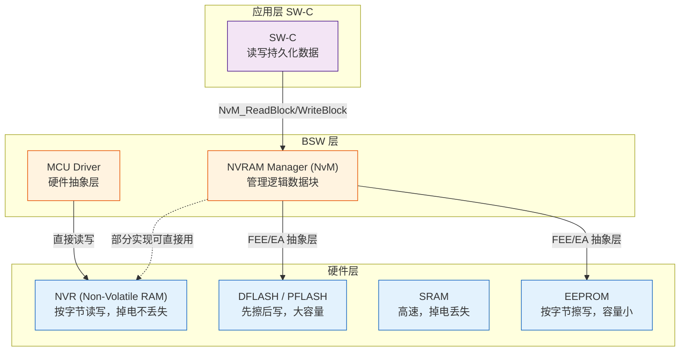
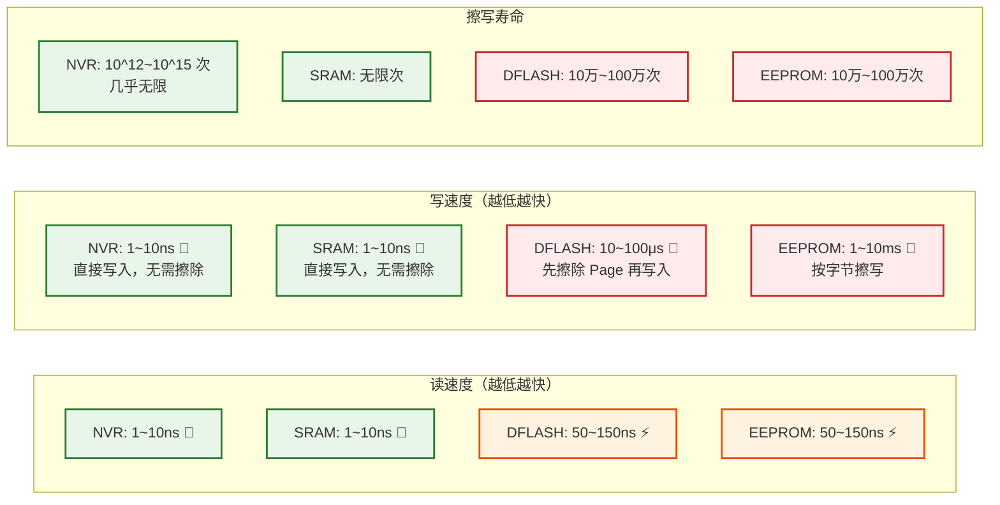
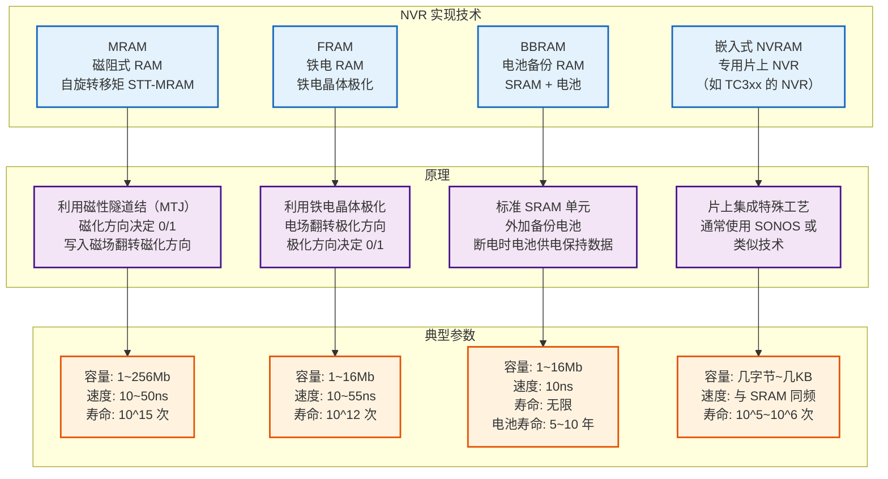
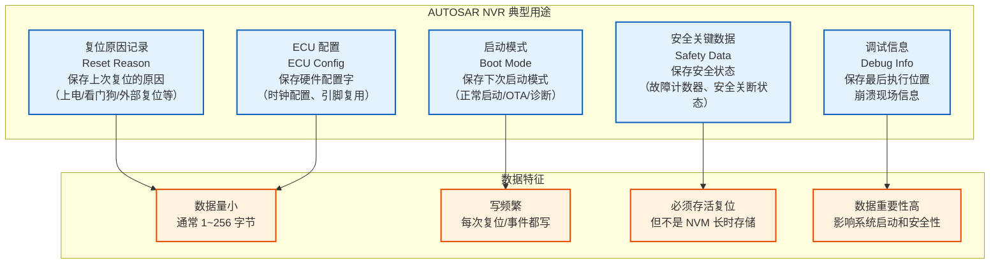
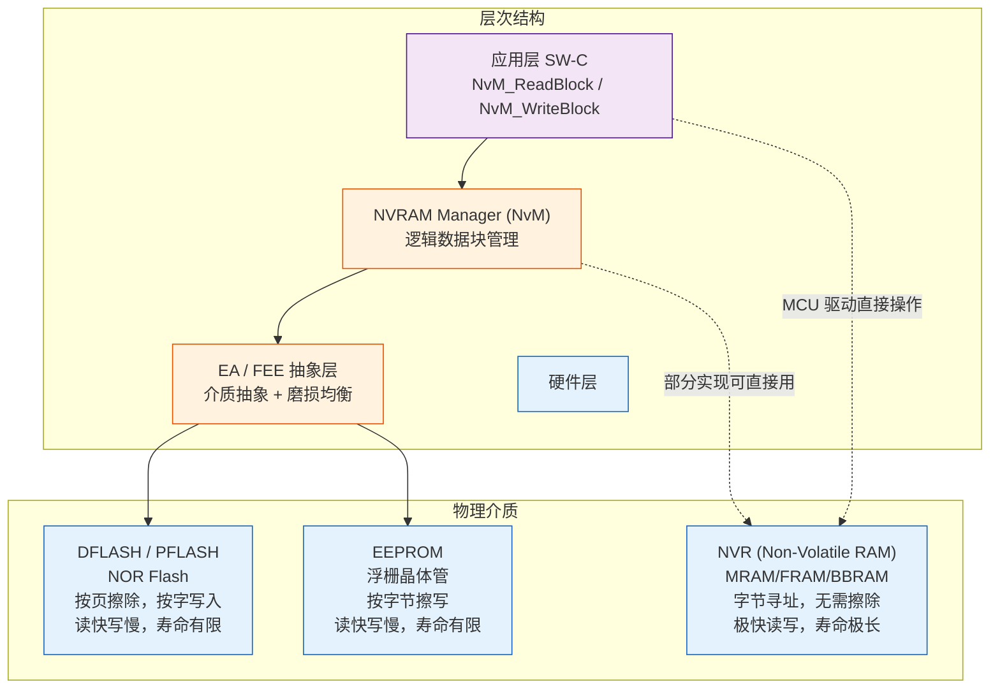
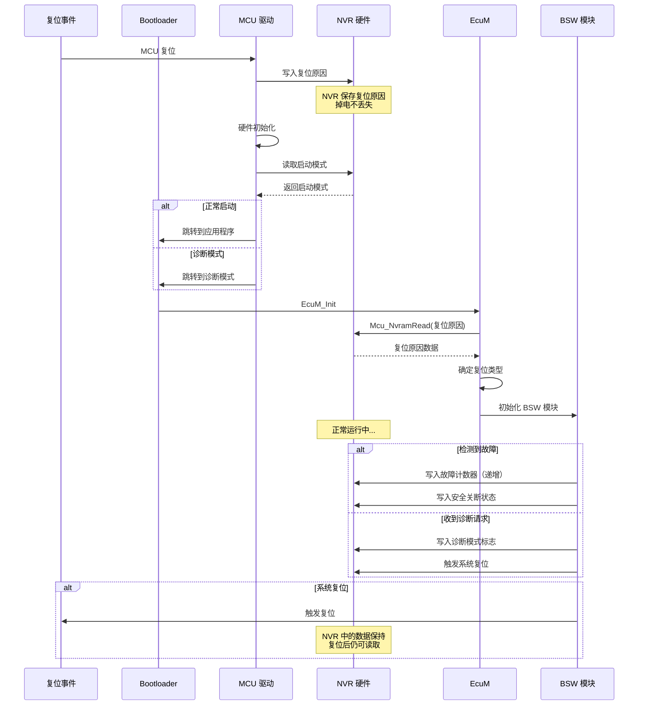
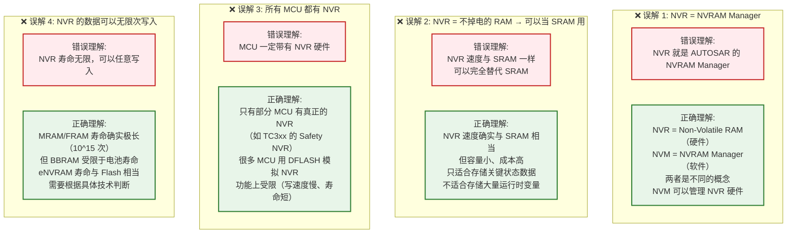
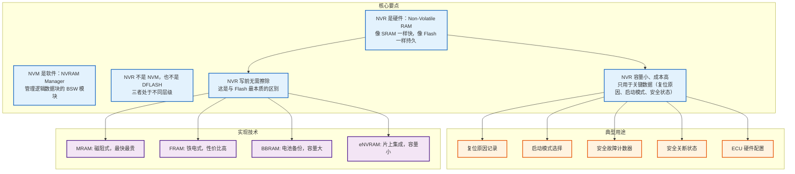

# AUTOSAR MCU 中的 NVR 详解

> NVR（Non-Volatile RAM）—— 一种介于 SRAM 和 Flash 之间的"特殊存储器"

---

## 1. 通俗理解

把嵌入式 MCU 的存储器想象成三种办公用品：

| 存储器 | 类比 | 特征 |
|--------|------|------|
| **SRAM** | 白板上的**白板笔字** | 写得快、擦得快，但一擦（断电）就没了 |
| **Flash** | 纸上**印刷的字** | 可以长期保存，但改一个字需要重印整页（先擦除整块再写） |
| **NVR** | **热敏纸上的字** | 可长期保存，改起来也方便（不用整页重印），但量不大 |

**NVR 的核心特点：** 像 SRAM 一样按字节随意读写（无需擦除），又像 Flash 一样掉电不丢失。

---

## 2. 什么是 NVR？

### 2.1 定义

**NVR（Non-Volatile RAM，非易失性 RAM）** 是一种兼具 SRAM 和 Flash 优点的存储器技术：

- **像 SRAM 一样**：按字节寻址、随机访问、无需先擦除再写入
- **像 Flash 一样**：掉电后数据不丢失
- **不像 SRAM**：断电后数据保持
- **不像 Flash**：写前不需要擦除，写入速度快（ns 级 vs μs 级）

### 2.2 在 AUTOSAR 中的位置



**图解释：** NVR 在 AUTOSAR 架构中位于硬件层，与 DFLASH、EEPROM 并列。但 NVR 通常由 **MCU 驱动直接管理**（通过 `Mcu_NvramRead/Mcu_NvramWrite` 接口），而 DFLASH/EEPROM 则通过 NvM → FEE/EA 的软件栈访问。

---

## 3. NVR 与其他存储器的对比

### 3.1 关键参数对比

| 参数 | NVR | SRAM | DFLASH | EEPROM |
|------|-----|------|--------|--------|
| **持久性** | ✅ 掉电不丢失 | ❌ 掉电丢失 | ✅ 掉电不丢失 | ✅ 掉电不丢失 |
| **读速度** | 🚀 1~10ns（与 SRAM 相当） | 🚀 1~10ns | ⚡ 50~150ns | ⚡ 50~150ns |
| **写速度** | 🚀 1~10ns（直接写） | 🚀 1~10ns | 🐢 10~100μs（先擦后写） | 🐢 1~10ms（按字节擦写） |
| **写前擦除** | ❌ 不需要 | ❌ 不需要 | ✅ 需要 | ✅ 需要 |
| **按字节写** | ✅ 支持 | ✅ 支持 | ❌ 按 Word | ✅ 支持 |
| **擦写寿命** | 10^12~10^15 次（几乎无限） | 无限 | 10万~100万次 | 10万~100万次 |
| **容量** | 小（几字节~几百KB） | 中等（几十KB~几MB） | 大（几百KB~几十MB） | 小（几KB~几百KB） |
| **成本/bit** | 高 | 中 | 低 | 中高 |
| **典型实现** | MRAM/FRAM/BBRAM | 6T SRAM | NOR Flash | 浮栅晶体管 |

### 3.2 速度对比图



**图解释：** NVR 在三个关键维度上都优于 Flash：
- **读速度**：与 SRAM 同级（1~10ns），远快于 Flash
- **写速度**：与 SRAM 同级（1~10ns），比 Flash 快 **1000~10000 倍**
- **擦写寿命**：10^12~10^15 次，比 Flash 的 10^5~10^6 次高 **100 万倍以上**

---

## 4. NVR 的物理实现技术

### 4.1 四种主流技术



**图解释：** NVR 有四种主流实现技术，区别在于：
- **MRAM**：利用磁阻效应，速度和寿命最优，但成本最高
- **FRAM**：利用铁电效应，速度和寿命优秀，容量适中
- **BBRAM**：SRAM + 电池，性能与 SRAM 相同，但受限于电池寿命
- **eNVRAM**：片上集成，容量极小（专用寄存器级），寿命与 Flash 相当

### 4.2 自动售货机类比

| 技术 | 类比 |
|------|------|
| **MRAM** | 磁卡（磁化方向记录信息，改写方便） |
| **FRAM** | 电灯开关（电场翻转状态，快速且稳定） |
| **BBRAM** | 有 UPS 备份的电脑（停电时 UPS 供电继续工作） |
| **eNVRAM** | 专为特定用途设计的小型记事本 |

---

## 5. AUTOSAR MCU 模块中的 NVR

### 5.1 MCU 模块的 NVRAM 配置

在 AUTOSAR 的 MCU 驱动规范中，定义了 `McuNvramSector` 配置容器：

```xml
<!-- AUTOSAR MCU 模块 NVRAM Sector 配置 -->
<McuNvramSector>
    <SHORT-NAME>McuNvramSector_0</SHORT-NAME>
    <McuNvramBaseAddress>0xFFF00000</McuNvramBaseAddress>  <!-- NVR 基地址 -->
    <McuNvramSectorSize>1024</McuNvramSectorSize>          <!-- 1KB -->
    <McuNvramSectorHwIndex>0</McuNvramSectorHwIndex>      <!-- 硬件索引 -->
    <McuNvramDefaultData>0xFF</McuNvramDefaultData>        <!-- 默认值 -->
</McuNvramSector>

<McuNvramSector>
    <SHORT-NAME>McuNvramSector_1</SHORT-NAME>
    <McuNvramBaseAddress>0xFFF00400</McuNvramBaseAddress>
    <McuNvramSectorSize>256</McuNvramSectorSize>
    <McuNvramSectorHwIndex>1</McuNvramSectorHwIndex>
    <McuNvramDefaultData>0x00</McuNvramDefaultData>
</McuNvramSector>
```

### 5.2 MCU 驱动提供的 API

```c
/* ============================================
 * AUTOSAR MCU 驱动 NVRAM 接口
 * ============================================ */

/* 读取 NVRAM Sector */
Std_ReturnType Mcu_NvramRead(
    uint8_t  NvramSector,       /* 硬件索引 (McuNvramSectorHwIndex) */
    uint8_t* DataBuffer,        /* 数据缓冲区 */
    uint32_t Offset,            /* 偏移量 */
    uint32_t Length             /* 读取长度 */
);

/* 写入 NVRAM Sector */
Std_ReturnType Mcu_NvramWrite(
    uint8_t  NvramSector,       /* 硬件索引 */
    const uint8_t* DataBuffer,  /* 数据缓冲区 */
    uint32_t Offset,            /* 偏移量 */
    uint32_t Length             /* 写入长度 */
);

/* 擦除 NVRAM Sector（部分实现需要） */
Std_ReturnType Mcu_NvramErase(
    uint8_t NvramSector         /* 硬件索引 */
);

/* ============================================
 * 使用示例
 * ============================================ */

/* 写复位原因到 NVR（掉电不丢失） */
void SaveResetReason(uint8_t resetReason) {
    /* NVR 写操作：直接写入，无需擦除，极快 */
    /* 对比 DFLASH: 需要先擦除 Page 再写，慢 10000 倍 */
    Mcu_NvramWrite(NVRAM_SECTOR_RESET, &resetReason, 0, 1);
}

/* 上电后读取复位原因 */
uint8_t GetResetReason(void) {
    uint8_t resetReason = 0;
    /* NVR 读操作：直接读取，与 SRAM 一样快 */
    Mcu_NvramRead(NVRAM_SECTOR_RESET, &resetReason, 0, 1);
    return resetReason;
}
```

### 5.3 NVR 在 AUTOSAR 中的典型用途



**图解释：** AUTOSAR 中 NVR 的典型用途有 5 类，共同特征是：
- 数据量小（字节级）
- 需要频繁写入（每次复位或事件）
- 必须存活系统复位（但不是长期存储）
- 对系统启动和安全性至关重要

---

## 6. NVR vs NVM vs DFLASH：三者的关系

### 6.1 层级关系



**图解释：** NVR、NVM、DFLASH 处于不同层级：
- **NVR** 是物理硬件，位于最底层
- **NVM (NVRAM Manager)** 是软件层，管理逻辑数据块
- **DFLASH** 也是物理硬件，但通常需要通过 NVM → FEE/EA 访问
- **NVR 的特殊地位**：既可以被 MCU 驱动直接操作（用于复位原因等），也可以被 NVM 管理（用于需要持久化的数据）

### 6.2 对比总结表

| 维度 | NVR | NVM (NVRAM Manager) | DFLASH |
|------|-----|---------------------|--------|
| **本质** | 物理硬件（存储器） | 软件模块（BSW 服务层） | 物理硬件（NOR Flash） |
| **全称** | Non-Volatile RAM | NVRAM Manager | Data Flash |
| **所属层级** | 硬件层 | 服务层 | 硬件层 |
| **AUTOSAR 规范** | 芯片手册 | SWS NVRAM Manager | 芯片手册 |
| **访问方式** | 按字节寻址（像 RAM） | 按逻辑块（Block） | 按 Page/Sector |
| **写前擦除** | ❌ 不需要 | 取决于底层介质 | ✅ 需要 |
| **写速度** | 极快（1~10ns） | 取决于底层介质 | 慢（10~100μs） |
| **寿命** | 10^12~10^15 次 | 取决于底层介质 | 10万~100万次 |
| **典型容量** | 几字节~几百KB | 不限 | 几十KB~几十MB |
| **主要用途** | 复位原因、启动模式、安全数据 | 标定数据、DTC、配置参数 | 代码存储、EEPROM 模拟 |
| **管理方式** | MCU 驱动直接操作 | NvM API 管理 | NvM → FEE/EA 管理 |

---

## 7. 实际 MCU 中的 NVR 示例

### 7.1 Infineon AURIX TC3xx

```c
/* TC3xx 的 NVR（Non-Volatile RAM） */
/* 地址范围: 0xAF00_0000 - 0xAF0F_FFFF（DFLASH 的一部分）*/
/* 但 TC3xx 有专门的 Safety NVR 用于安全数据 */

/* TC3xx 的 Safety NVR 寄存器 */
#define SAFETY_NVR_BASE  0xF0006000

/* 安全 NVR 中的复位原因寄存器 */
#define NVR_RESET_REASON  *(volatile uint8_t*)(SAFETY_NVR_BASE + 0x00)
/* 0x00: 上电复位 */
/* 0x01: 软件复位 */
/* 0x02: 看门狗复位 */
/* 0x03: 外部复位 */
/* 0x04: 安全复位 */

/* 安全 NVR 中的启动模式寄存器 */
#define NVR_BOOT_MODE     *(volatile uint8_t*)(SAFETY_NVR_BASE + 0x01)
/* 0x00: 正常启动 */
/* 0x01: 启动加载模式 */
/* 0x02: 诊断模式 */
/* 0x03: 安全模式 */

/* 使用示例：在复位处理中保存复位原因 */
void Reset_Handler(void) {
    /* 读取当前复位原因 */
    uint8_t reason = SCU_RSTSTAT;

    /* 写入 NVR（直接写入，像写 RAM 一样，但掉电不丢失） */
    NVR_RESET_REASON = reason;

    /* ... 执行启动代码 ... */
}

/* 在 EcuM 中读取复位原因 */
void EcuM_DetermineResetReason(void) {
    uint8_t nvrReason = NVR_RESET_REASON;

    switch (nvrReason) {
        case 0x00: EcuM_ResetReason = ECUM_RESET_POWER_ON;    break;
        case 0x01: EcuM_ResetReason = ECUM_RESET_SOFTWARE;    break;
        case 0x02: EcuM_ResetReason = ECUM_RESET_WATCHDOG;    break;
        case 0x03: EcuM_ResetReason = ECUM_RESET_EXTERNAL;    break;
        case 0x04: EcuM_ResetReason = ECUM_RESET_SAFETY;      break;
    }
}
```

### 7.2 NXP S32K148

```c
/* S32K148 的 NVR 实现 */
/* S32K148 没有独立的 MRAM/FRAM 硬件 */
/* 使用 DFLASH 模拟 NVR（通过 Mcu 模块的 NvramSector 配置） */

/* 在 S32K148 中，NVR 实际上是通过 DFLASH 的特定区域实现的 */
/* 但由于 DFLASH 写前需要擦除，所以这里的"写"速度比真正的 NVR 慢 */

/* 配置示例 */
#define NVR_SECTOR_ADDR    0x1000F000  /* DFLASH 最后 4KB */
#define NVR_SECTOR_SIZE    4096
#define NVR_PAGE_SIZE      64

/* 通过 MCU 驱动读写 NVR（底层可能是 DFLASH） */
void SaveBootMode(uint8_t bootMode) {
    /* 调用 MCU 驱动的 NVRAM 写入接口 */
    /* 底层可能是 DFLASH 写入（需要先擦除再写） */
    /* 如果硬件支持真正的 NVR，则直接写入 */
    Mcu_NvramWrite(NVRAM_SECTOR_BOOT, &bootMode, 0, 1);
}

uint8_t LoadBootMode(void) {
    uint8_t bootMode = 0;
    Mcu_NvramRead(NVRAM_SECTOR_BOOT, &bootMode, 0, 1);
    return bootMode;
}
```

### 7.3 Renesas RH850

```c
/* RH850 的 NVR 实现 */
/* RH850 通常有专门的 NVRAM 区域（使用专用技术，不是 Flash）*/

/* RH850 NVRAM 特性:
 * - 容量: 几 KB
 * - 字节寻址，随机访问
 * - 无需擦除直接写入
 * - 读/写速度与 SRAM 相当
 * - 数据保持: 85°C 下 10 年
 */

/* 典型用途 */
#define NVRAM_SAFETY_ZONE  0xFEFFE000  /* 安全相关 NVRAM */
#define NVRAM_CONFIG_ZONE  0xFEFFF000  /* 配置相关 NVRAM */

/* 安全故障计数器（每次故障递增，复位不清零） */
#define SAFETY_FAULT_COUNTER  *(volatile uint32_t*)(NVRAM_SAFETY_ZONE + 0x00)

/* 安全关断状态（保存最后一次安全关断的原因）*/
#define SAFETY_SHUTDOWN_REASON *(volatile uint8_t*)(NVRAM_SAFETY_ZONE + 0x10)
```

---

## 8. NVR 在 AUTOSAR 启动流程中的作用



**图解释：** NVR 在 AUTOSAR 启动流程中的作用：
1. **复位发生时**：MCU 驱动将复位原因写入 NVR
2. **启动时**：读取 NVR 中的启动模式，决定启动路径
3. **EcuM 初始化**：读取 NVR 中的复位原因，确定复位类型
4. **运行中**：写入故障计数器、安全状态等到 NVR
5. **复位后**：NVR 中数据保持，下次启动可读取上次的状态

---

## 9. 常见误解



---

## 10. 总结



### 一句话总结

| 概念 | 一句话 |
|------|--------|
| **NVR** | 非易失性 RAM，硬件存储器，**像 SRAM 一样按字节直接读写，像 Flash 一样掉电不丢失** |
| **NVM (NVRAM Manager)** | AUTOSAR BSW 模块，**软件层**，管理逻辑数据块 |
| **DFLASH** | 数据 Flash，**需要先擦除再写入**，容量大但写慢寿命短 |
| **NVR vs 其他** | NVR 写前无擦除（vs Flash），NVR 掉电不丢失（vs SRAM），NVR 是硬件（vs NVM） |