# FLASH 与 SRAM 的地址映射关系详解

> 理解嵌入式 MCU 的**内存映射**——CPU 如何看到 FLASH 和 SRAM，它们如何在同一个地址空间中共存

---

## 1. 通俗理解：CPU 的"地址簿"

把 CPU 的地址空间想象成一个**大型仓库**，每个地址是一个**货架位置**：

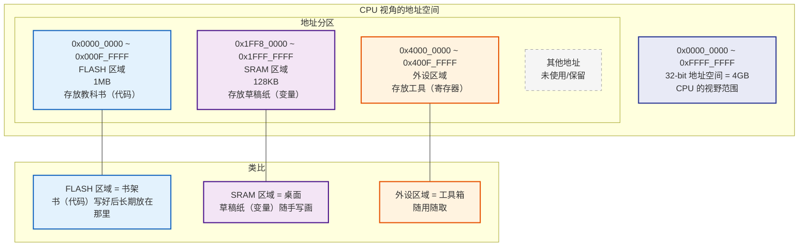

**图解释：** CPU 通过**统一地址空间**（Unified Address Space）来访问 FLASH 和 SRAM。FLASH 和 SRAM 被映射到不同的地址范围，CPU 通过地址总线的地址来区分访问的是哪个存储器。

**核心思想：** CPU 不关心地址背后的物理设备是什么，它只知道"地址 X 上存着数据"。芯片设计者把 FLASH、SRAM、外设寄存器映射到不同的地址范围，CPU 通过地址总线选择对应的设备。

---

## 2. 地址映射的物理基础

### 2.1 总线架构

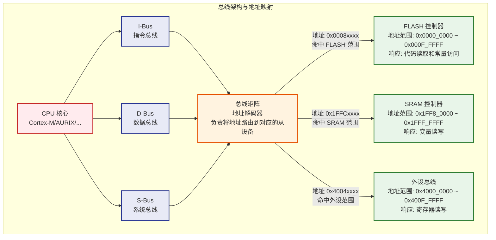

**图解释：** 总线矩阵是地址映射的核心：
1. CPU 发出地址（如 `0x0008xxxx`）
2. 总线矩阵中的**地址解码器**判断地址落在哪个范围内
3. 将访问路由到对应的从设备（FLASH 控制器 / SRAM 控制器 / 外设总线）
4. 从设备响应数据，返回给 CPU

### 2.2 地址解码原理

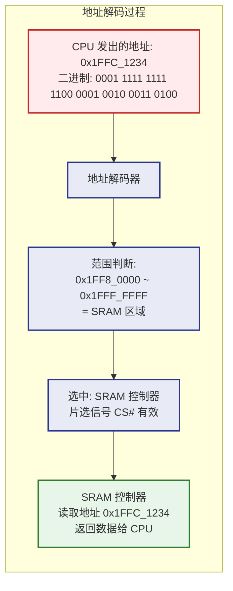

**图解释：** 地址解码器的核心是**范围比较器**：
- CPU 发出的 32 位地址中，高位地址（如 `0x1FFC`）决定了访问哪个设备
- 地址解码器将高位地址与预配置的地址范围比较
- 命中后，对应的设备片选信号（CS#）被激活，设备响应访问

---

## 3. 典型 MCU 的地址映射

### 3.1 S32K148 内存映射

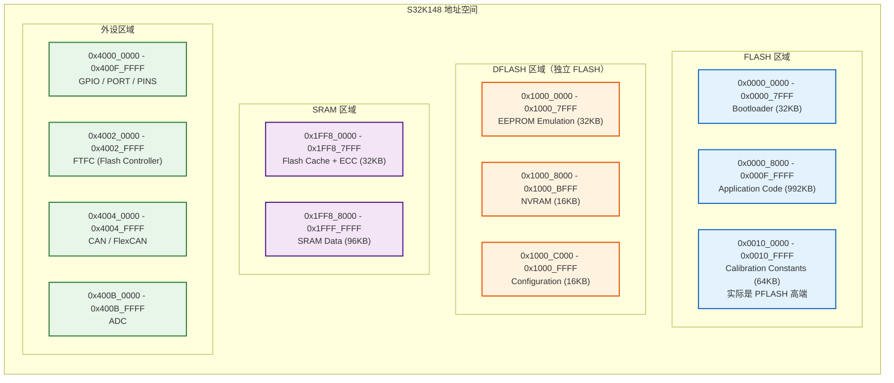

**图解释：** S32K148 的地址映射展示了典型的嵌入式 MCU 布局：
- **0x0000_0000 ~ 0x0010_FFFF**: PFLASH（代码 + 常量）
- **0x1000_0000 ~ 0x1000_FFFF**: DFLASH（数据）
- **0x1FF8_0000 ~ 0x1FFF_FFFF**: SRAM（变量 + 堆栈 + Cache）
- **0x4000_0000 ~ 0x400F_FFFF**: 外设寄存器

### 3.2 STM32F103C8T6 内存映射

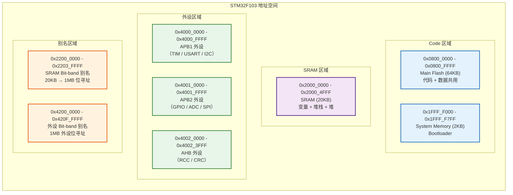

**图解释：** STM32F103 的地址映射展示了 Cortex-M3 的典型布局：
- **0x0800_0000**: Flash 映射地址（实际物理 Flash 在 0x0800_0000）
- **0x1FFF_F000**: System Memory（内置 Bootloader）
- **0x2000_0000**: SRAM
- **0x4000_0000**: 外设
- **0x2200_0000**: Bit-band 别名区域（SRAM 位寻址扩展）

### 3.3 三种 MCU 地址映射对比

| MCU | FLASH 地址 | SRAM 地址 | FLASH 大小 | SRAM 大小 | 特殊之处 |
|-----|-----------|-----------|-----------|----------|---------|
| **S32K148** | `0x0000_0000` | `0x1FF8_0000` | 1MB | 128KB | 独立 DFLASH 在 `0x1000_0000` |
| **TC3xx** | `0x8000_0000` | `0x5000_0000` | 16MB | 4MB | 多核独立局部 SRAM，DFLASH 在 `0xAF00_0000` |
| **STM32F103** | `0x0800_0000` | `0x2000_0000` | 64KB | 20KB | 无独立 DFLASH，代码和数据共用 Flash |
| **S32K116** | `0x0000_0000` | `0x1FFF_0000` | 128KB | 16KB | 小容量 MCU，映射结构类似 S32K148 |

---

## 4. 地址映射的硬件实现

### 4.1 物理地址 vs 总线地址

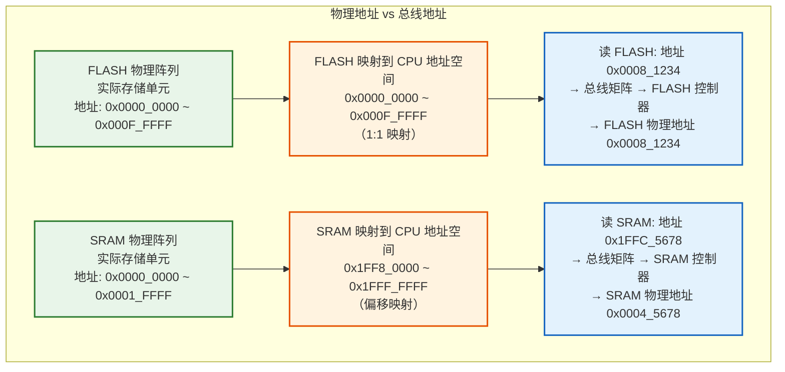

**图解释：** 物理地址和总线地址不一定相同：
- **FLASH** 通常 1:1 映射：FLASH 物理地址 0x0008_1234 = CPU 地址 0x0008_1234
- **SRAM** 通常偏移映射：SRAM 物理地址 0x0004_5678 → CPU 地址 0x1FFC_5678（偏移 +0x1FF8_0000）
- 地址映射由芯片设计时的**总线矩阵**决定，对软件透明

### 4.2 Cortex-M 的地址映射架构

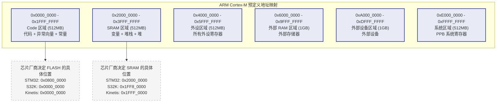

**图解释：** ARM Cortex-M 规定了**粗粒度的地址空间分区**：
- **0x0000_0000 ~ 0x1FFF_FFFF**: Code 区域（512MB），用于代码和异常向量
- **0x2000_0000 ~ 0x3FFF_FFFF**: SRAM 区域（512MB），用于变量
- **0x4000_0000 ~ 0x5FFF_FFFF**: 外设区域（512MB）
- **0xE000_0000 ~ 0xFFFF_FFFF**: 系统区域（系统寄存器、NVIC、MPU 等）

**芯片厂商**可以在这些大区域内自由选择 FLASH 和 SRAM 的具体映射地址。这就是为什么不同 MCU 的 FLASH 地址不同（STM32 在 0x0800_0000，S32K 在 0x0000_0000）。

---

## 5. 链接脚本中的地址映射

### 5.1 链接脚本如何定义映射

```ld
/* ============================================
 * 链接脚本中的地址映射定义
 * 链接器根据这些地址生成最终的可执行文件
 * ============================================ */

MEMORY
{
    /* FLASH 区域: 物理地址 0x0000_0000, 1MB */
    /* 所有代码和常量放在这里 */
    FLASH (rx)  : ORIGIN = 0x00000000, LENGTH = 0x00100000

    /* DFLASH 区域: 物理地址 0x1000_0000, 64KB */
    /* 数据存储（FEE 模拟 EEPROM）*/
    DFLASH (rw) : ORIGIN = 0x10000000, LENGTH = 0x00010000

    /* SRAM 区域: 物理地址 0x1FF80000, 128KB */
    /* 所有变量、堆栈、堆放在这里 */
    SRAM (rw)   : ORIGIN = 0x1FF80000, LENGTH = 0x00040000
}

SECTIONS
{
    /* ---- 放在 FLASH 中的段 ---- */

    /* 中断向量表: 必须从 FLASH 起始地址开始 */
    .vectors : {
        __vector_table = .;
        KEEP(*(.vectors))           /* 中断向量表 */
        . = ALIGN(4);
    } > FLASH

    /* 程序代码 */
    .text : {
        . = ALIGN(4);
        *(.text)                    /* 所有 .text 段 */
        *(.text*)                   /* 所有 .text.* 段 */
        *(.glue_7)
        *(.glue_7t)
        . = ALIGN(4);
    } > FLASH

    /* 只读常量（字符串、查表数据）*/
    .rodata : {
        . = ALIGN(4);
        *(.rodata)                  /* 所有 .rodata 段 */
        *(.rodata*)
        . = ALIGN(4);
    } > FLASH

    /* ---- 放在 SRAM 中的段 ---- */

    /* 初始化数据（.data 段）*/
    /* 初始值在 FLASH 中，启动时复制到 SRAM */
    .data : {
        . = ALIGN(4);
        __data_start = .;
        *(.data)                    /* 所有 .data 段 */
        *(.data*)
        . = ALIGN(4);
        __data_end = .;
    } > SRAM AT > FLASH             /* 加载地址在 FLASH，运行时在 SRAM */

    /* 未初始化数据（.bss 段）*/
    /* 启动时在 SRAM 中清零 */
    .bss : {
        . = ALIGN(4);
        __bss_start = .;
        *(.bss)                     /* 所有 .bss 段 */
        *(.bss*)
        *(COMMON)
        . = ALIGN(4);
        __bss_end = .;
    } > SRAM

    /* 堆栈 */
    .stack : {
        . = ALIGN(8);
        __stack_end = .;
        . = . + 0x4000;             /* 16KB 堆栈 */
        . = ALIGN(8);
        __stack_start = .;
    } > SRAM

    /* 堆 */
    .heap : {
        . = ALIGN(8);
        __heap_start = .;
        . = . + 0x2000;             /* 8KB 堆 */
        . = ALIGN(8);
        __heap_end = .;
    } > SRAM

    /* ---- 放在 DFLASH 中的段 ---- */

    /* NVRAM 数据（FEE 管理）*/
    .nvram (NOLOAD) : {
        *(.nvram)
    } > DFLASH
}
```

**代码解释：** 链接脚本中的 `MEMORY` 命令定义了 FLASH 和 SRAM 的地址范围，`SECTIONS` 命令决定了每个段放在哪个存储器中：
- `.vectors`、`.text`、`.rodata` → **FLASH**（0x0000_0000）
- `.data`、`.bss`、`.stack`、`.heap` → **SRAM**（0x1FF8_0000）
- `.nvram` → **DFLASH**（0x1000_0000）

### 5.2 变量地址与存储器的对应

```c
/* ============================================
 * 变量定义 → 链接器分配 → 存储位置
 * ============================================ */

/* ---- 以下变量在 SRAM 中 ---- */

/* 全局变量（初始化）→ .data 段 → SRAM */
uint32_t systemTick = 0;          /* 地址: 0x1FF8_8000（SRAM 中）*/
CanNm_ChannelType canNmChannel;   /* 地址: 0x1FF8_8010（SRAM 中）*/

/* 全局变量（未初始化）→ .bss 段 → SRAM */
static uint8_t rxBuffer[256];     /* 地址: 0x1FF9_0000（SRAM 中）*/
volatile uint32_t irqFlags;       /* 地址: 0x1FF9_0100（SRAM 中）*/

/* 局部变量 → 栈 → SRAM */
void SomeFunction(void) {
    uint32_t temp = 0;            /* 地址: 栈指针 - 4（SRAM 中）*/
    uint8_t  data[64];            /* 地址: 栈指针 - 64（SRAM 中）*/
}

/* ---- 以下变量在 FLASH 中 ---- */

/* 常量 → .rodata 段 → FLASH */
const uint8_t canNmCbvTable[256] = {
    /* 地址: 0x0001_0000（FLASH 中）*/
    /* 掉电不丢失 */
};

/* 字符串常量 → .rodata 段 → FLASH */
const char* versionStr = "V1.2.3";
/* 字符串 "V1.2.3" 在 FLASH 中（0x0001_1000）*/
/* 指针变量 versionStr 在 SRAM 中（0x1FF8_9000）*/

/* 函数代码 → .text 段 → FLASH */
void CanNm_MainFunction(void) {
    /* 函数代码在 FLASH 中（0x0000_8000）*/
    /* 函数内的局部变量在 SRAM 栈中 */
}
```

---

## 6. CPU 如何访问 FLASH 和 SRAM

### 6.1 取指令（Instruction Fetch）

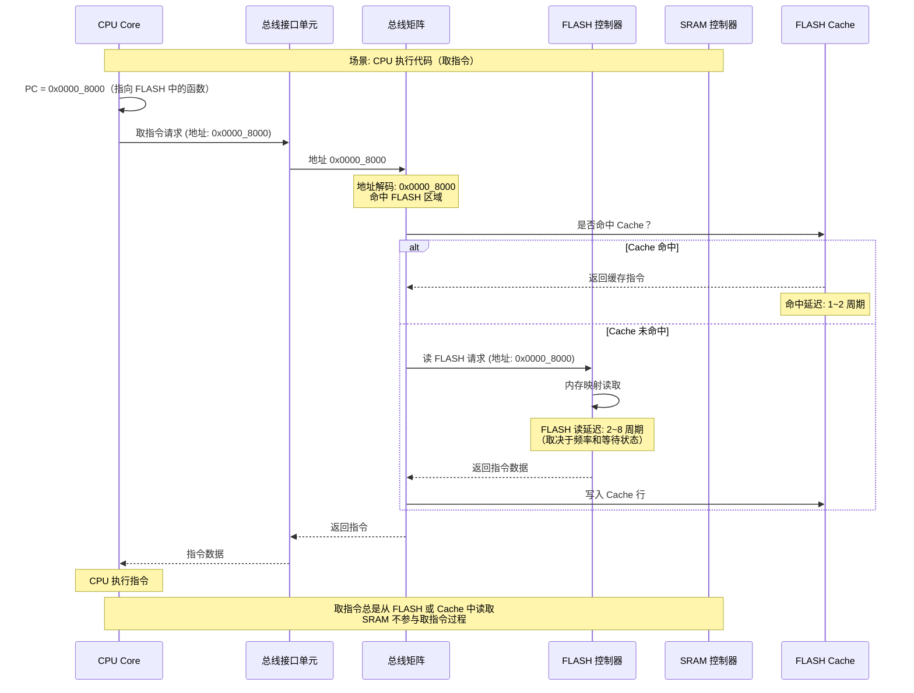

**图解释：** CPU 取指令的路径：
1. CPU 的 PC 指向 FLASH 地址（0x0000_8000）
2. 总线矩阵将地址路由到 FLASH 控制器
3. 如果有 Cache，优先从 Cache 读取
4. FLASH 的读取延迟通常为 2~8 个 CPU 周期（取决于频率和等待状态）
5. **SRAM 不参与取指令**（除非代码在 RAM 中执行）

### 6.2 数据访问（Data Access）

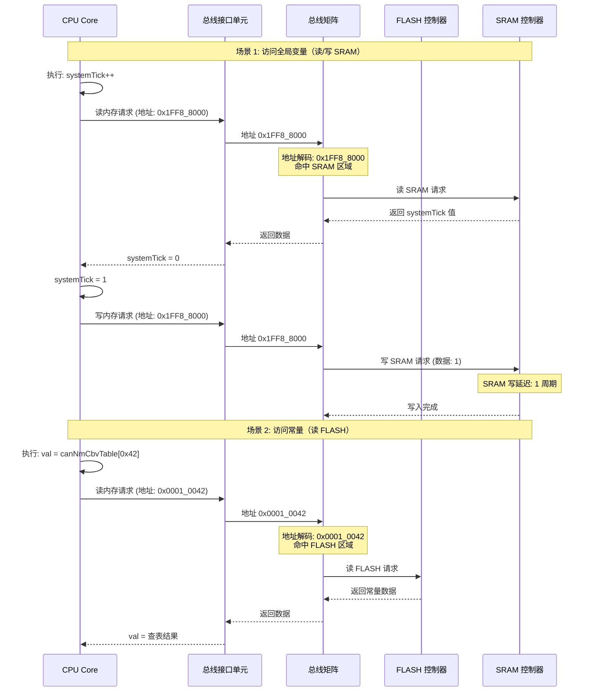

**图解释：** CPU 的数据访问路径取决于地址：
- **访问 SRAM 地址**（0x1FF8_xxxx）：经过总线矩阵 → SRAM 控制器，延迟 1 个周期
- **访问 FLASH 地址**（0x0000_xxxx）：经过总线矩阵 → FLASH 控制器，延迟 2~8 个周期
- CPU 通过**地址值**自动区分访问哪个存储器，无需软件干预

### 6.3 FLASH 和 SRAM 的访问延迟对比

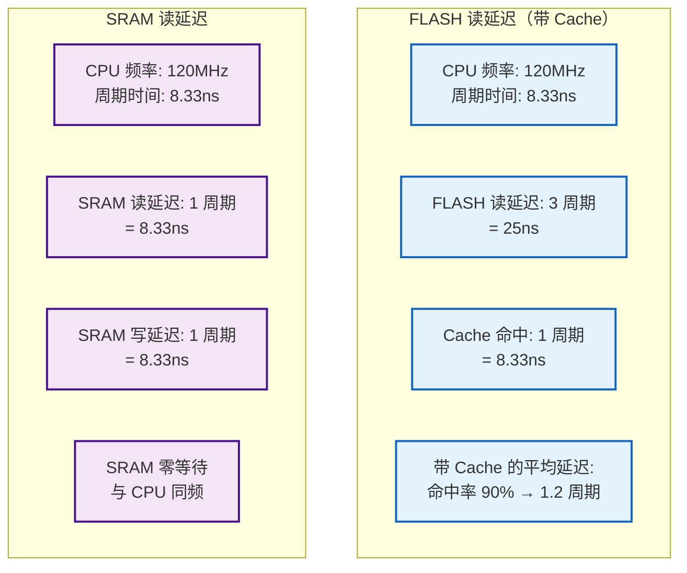

**图解释：** FLASH 和 SRAM 的访问延迟差异：
- **SRAM**：零等待（1 周期），与 CPU 同频
- **FLASH**：2~8 周期，需要 Flash Cache 来弥补速度差距
- 带 Cache 的 FLASH 平均延迟可以接近 SRAM（命中率 90%+）

---

## 7. FLASH 和 SRAM 地址映射的"对齐"要求

### 7.1 访问对齐

```c
/* ============================================
 * FLASH 和 SRAM 的访问对齐要求
 * ============================================ */

/* ---- SRAM 访问（对齐宽松）---- */
/* SRAM 支持任意对齐的字节/半字/字访问 */
uint8_t  byte;     /* 任意地址 */
uint16_t half;     /* 任意地址（但推荐 2 字节对齐）*/
uint32_t word;     /* 任意地址（但推荐 4 字节对齐）*/

/* SRAM 中的非对齐访问（支持但性能下降）*/
uint32_t* ptr = (uint32_t*)0x1FF8_8001;  /* 非对齐地址 */
uint32_t val = *ptr;  /* CPU 内部拆分为两次访问，效率低 */

/* ---- FLASH 访问（对齐严格）---- */
/* FLASH 通常要求固定对齐访问 */
/* 32-bit 总线宽度: 必须 4 字节对齐 */
/* 64-bit 总线宽度: 必须 8 字节对齐 */

/* FLASH 中的非对齐访问（可能导致 fault）*/
const uint32_t* flashPtr = (const uint32_t*)0x0000_8001;  /* 非对齐地址 */
uint32_t val = *flashPtr;
/* 可能触发: 
 * 1. 硬件 fault（取决于 MCU 配置）
 * 2. 或拆分为两次访问（效率低）
 * 3. 或返回错误数据
 */

/* 正确的做法：始终对齐访问 FLASH */
const uint32_t* flashPtr = (const uint32_t*)0x0000_8000;  /* 对齐地址 */
uint32_t val = *flashPtr;  /* 正常访问 */
```

### 7.2 地址空间的"空洞"和"别名"

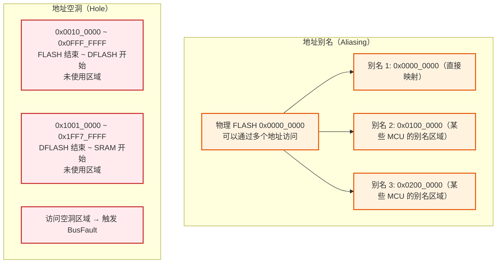

**图解释：** 地址映射中的两个特殊现象：
- **地址别名**：同一个物理 FLASH 可以通过多个地址范围访问（某些 MCU 的特性）
- **地址空洞**：FLASH 和 SRAM 之间的地址范围没有映射设备，访问会触发 BusFault

---

## 8. FLASH 和 SRAM 的地址映射在启动过程中的作用

### 8.1 启动时地址映射的切换

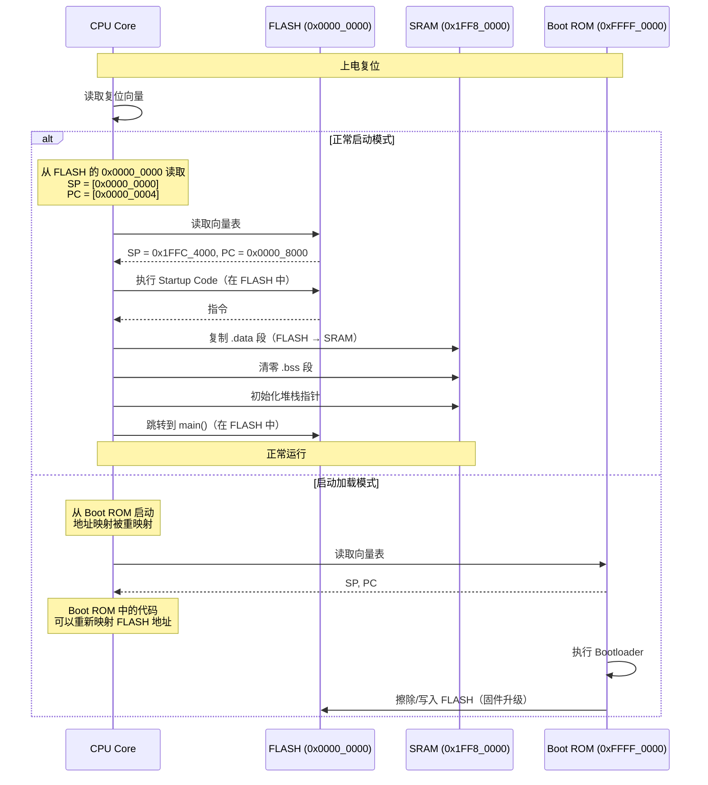

**图解释：** 启动过程中地址映射的作用：
- 复位后 CPU 从 **0x0000_0000** 读取向量表（SP 和 PC）
- Startup Code 在 FLASH 中执行，负责初始化 SRAM
- 某些 MCU 支持**地址重映射**（Remap），可以改变 FLASH 和 Boot ROM 的映射关系

### 8.2 地址重映射（Remap）

```c
/* ============================================
 * 地址重映射 - 改变 FLASH/SRAM 的映射关系
 * ============================================ */

/* 某些 MCU 支持地址重映射 */
/* 例如: STM32F1 的 BOOT0/BOOT1 引脚决定启动地址 */

/* BOOT0=0, BOOT1=0: 从 FLASH 启动 (0x0800_0000 → 0x0000_0000) */
/* BOOT0=1, BOOT1=0: 从 System Memory 启动 (0x1FFF_F000 → 0x0000_0000) */
/* BOOT0=1, BOOT1=1: 从 SRAM 启动 (0x2000_0000 → 0x0000_0000) */

/* 内存映射寄存器（以 STM32F1 为例）*/
#define SYSCFG_MEMRMP  (*((volatile uint32_t*)0x4001_0000))
/* MEMRMP[1:0]:
 * 00 = FLASH mapped at 0x0000_0000
 * 01 = System memory mapped at 0x0000_0000
 * 10 = SRAM mapped at 0x0000_0000
 * 11 = reserved
 */

/* 运行时重映射到 SRAM（将代码复制到 SRAM 后执行）*/
void RemapToSRAM(void) {
    /* 1. 将代码从 FLASH 复制到 SRAM */
    memcpy((void*)0x2000_0000, (void*)0x0800_0000, CODE_SIZE);

    /* 2. 设置向量表偏移为 SRAM 地址 */
    SCB->VTOR = 0x2000_0000;

    /* 3. 重映射: SRAM 映射到 0x0000_0000 */
    SYSCFG_MEMRMP = 0x02;  /* SRAM at 0x0000_0000 */

    /* 4. 跳转到 SRAM 中的代码执行 */
    /* 此后所有中断向量从 SRAM 读取 */
    /* 代码在 SRAM 中执行（速度更快，但掉电丢失）*/
}
```

**代码解释：** 地址重映射允许将 SRAM 映射到地址 0x0000_0000：
- 将代码从 FLASH 复制到 SRAM
- 通过重映射寄存器，让 CPU 认为 SRAM 就是起始地址
- 这样可以实现**代码在 RAM 中执行**（速度更快，但掉电丢失）
- 常用于 Bootloader 或需要高速执行的关键代码

---

## 9. 地址映射相关的性能优化

### 9.1 FLASH 等待状态（Wait State）

```c
/* ============================================
 * FLASH 等待状态配置
 * ============================================ */

/* FLASH 的读速度比 CPU 慢，需要插入等待状态 */
/* 等待状态数取决于 CPU 频率和 FLASH 速度 */

/* FLASH 等待状态配置寄存器（以 S32K148 为例）*/
#define FLASH_RDCFG  (*((volatile uint32_t*)0x40020004))

/* 等待状态配置:
 * CPU 频率  | 等待状态 | FLASH 读延迟
 * 0~40MHz   | 0 周期  | 12.5ns
 * 40~80MHz  | 1 周期  | 25ns
 * 80~120MHz | 2 周期  | 37.5ns
 */

void Fls_ConfigureWaitState(uint32_t cpuFreqHz) {
    uint32_t ws;

    if (cpuFreqHz <= 40000000) {
        ws = 0;  /* 零等待 */
    } else if (cpuFreqHz <= 80000000) {
        ws = 1;  /* 1 个等待周期 */
    } else {
        ws = 2;  /* 2 个等待周期 */
    }

    FLASH_RDCFG = (FLASH_RDCFG & ~0x03) | ws;
}

/* ============================================
 * FLASH Cache 配置
 * ============================================ */

/* FLASH Cache 可以显著减少平均访问延迟 */
/* Cache 命中时: 1 周期（与 SRAM 相同）*/
/* Cache 未命中: 等待状态 + 读取时间 */

/* 启用 FLASH Cache */
void Fls_EnableCache(void) {
    /* 以 S32K148 为例 */
    FLASH_CACHECR = 0x01;  /* 启用 Cache */
    FLASH_CACHECR |= 0x02; /* 启用预取（Prefetch）*/
}

/* Cache 命中率估算 */
/* 代码顺序执行: 命中率 > 90% */
/* 跳转/中断: 命中率降低 */
/* 大循环: 首次执行未命中，之后命中率 100% */
```

### 9.2 FLASH 和 SRAM 的地址映射对性能的影响

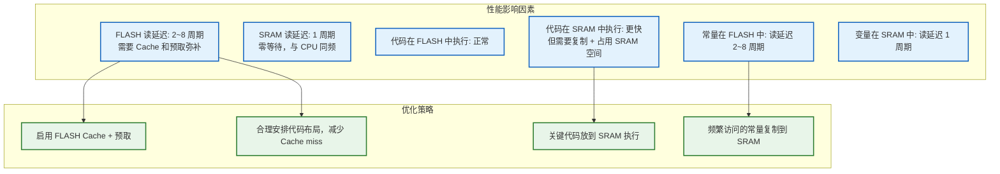

---

## 10. 常见问题

### Q1: 为什么 FLASH 的起始地址通常是 0x0000_0000？

**A:** 复位后 CPU 从 0x0000_0000 读取向量表（SP 和 PC）。将 FLASH 映射到 0x0000_0000 可以确保：
1. 上电后 CPU 能直接读取代码
2. 不需要额外的 Boot ROM 跳转
3. ARM Cortex-M 的架构设计如此

STM32 的 FLASH 在 0x0800_0000，但通过别名映射到 0x0000_0000，所以 CPU 仍然能从 0x0000_0000 读取向量表。

### Q2: 为什么 SRAM 和 FLASH 的地址不连续？

**A:** 这是芯片设计的有意安排：
1. ARM Cortex-M 把地址空间预分区（Code / SRAM / Peripheral / System）
2. FLASH 在 Code 区，SRAM 在 SRAM 区
3. 不连续的地址空间便于地址解码器快速判断访问目标
4. 预留的地址空间可以用于扩展存储器或别名映射

### Q3: 访问 FLASH 和 SRAM 的速度差多少？

**A:** 差别很大：

| 操作 | FLASH | SRAM | 比率 |
|------|-------|------|------|
| 读延迟 | 2~8 周期 | 1 周期 | 2~8x 慢 |
| 写延迟 | 10~100μs（需擦除） | 1 周期 | 10,000x 以上 |
| 带 Cache 读 | 1~2 周期 | 1 周期 | 接近 |

### Q4: 代码可以放在 SRAM 中执行吗？

**A:** 可以，但需要特殊处理：
1. 将代码从 FLASH 复制到 SRAM
2. 设置向量表偏移（VTOR）指向 SRAM
3. 进行地址重映射（如果需要）
4. 跳转到 SRAM 中的代码执行

**优点**：执行速度更快（零等待），不受 FLASH 等待状态影响
**缺点**：占用 SRAM 空间，掉电丢失，启动时需要复制

### Q5: 地址空洞（Hole）访问会发生什么？

**A:** 访问未映射的地址区域会触发：
1. **BusFault**（Cortex-M）：进入 HardFault 处理
2. **异常返回**：取决于 MCU 的错误处理机制
3. 系统中的地址空洞是设计预留的，**软件不应访问**

---

## 11. 总结

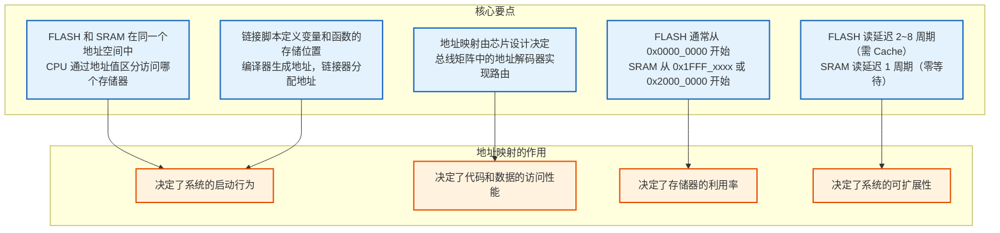

### 一句话总结

**FLASH 和 SRAM 的地址映射**是芯片设计者为 CPU 定义的一张"地址-设备对应表"：CPU 发出地址 → 总线矩阵解码 → 自动路由到 FLASH 或 SRAM → 读取/写入数据。**整个过程对软件透明**，但理解这个映射关系对于编写链接脚本、优化性能、调试问题至关重要。

| 存储器 | 地址范围（典型） | 访问延迟 | 内容 |
|--------|----------------|----------|------|
| **FLASH** | 0x0000_0000 ~ 0x000F_FFFF | 2~8 周期（带 Cache 1~2） | 代码、常量、向量表 |
| **SRAM** | 0x1FF8_0000 ~ 0x1FFF_FFFF | 1 周期 | 变量、堆栈、堆 |
| **DFLASH** | 0x1000_0000 ~ 0x1000_FFFF | 2~8 周期 | 持久化数据 |