# PFLASH、DFLASH、SRAM 详解

> 嵌入式 MCU 三大核心存储器的区别、原理与应用

---

## 1. 通俗理解：三者的类比

把嵌入式 MCU 想象成一个人的办公桌：

| 存储器 | 类比 | 特征 |
|--------|------|------|
| **PFLASH** | 书架上的**教科书** | 书（程序代码）写好后长期放在那里，不可以随时涂改，掉电不丢失 |
| **DFLASH** | 抽屉里的**笔记本** | 用来记录一些需要长期保存的数据（配置参数、校准值），比书更容易改写，但也不能像草稿纸一样随意涂改 |
| **SRAM** | 桌面的**草稿纸** | 正在思考计算时临时写写画画，速度极快，但一断电就全部消失 |

---

## 2. 三者的物理原理与核心特性

### 2.1 物理存储原理对比

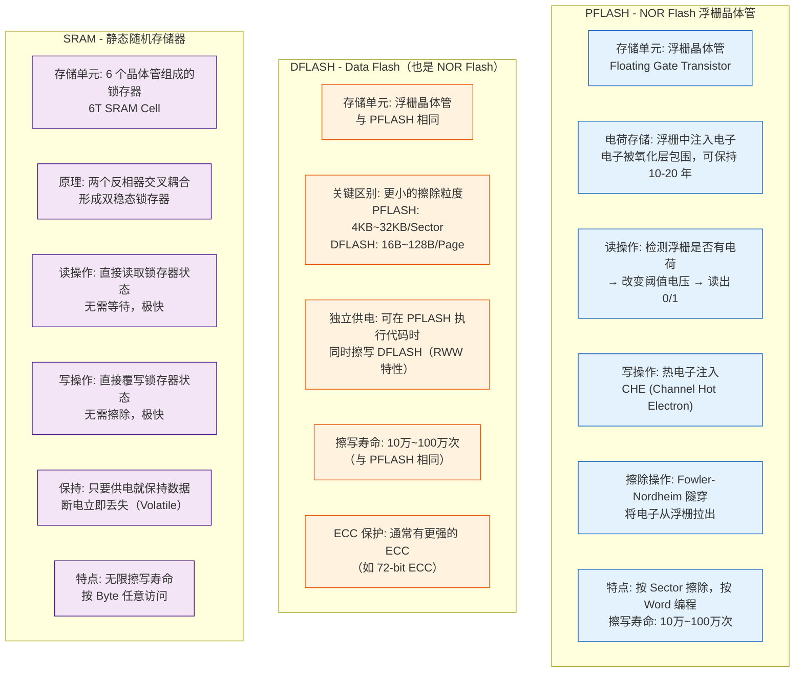

**图解释：** 三种存储器的物理存储单元完全不同：
- **PFLASH/DFLASH** 使用浮栅晶体管，通过浮栅中是否存储电荷来保存数据，掉电不丢失，但写入前必须先擦除
- **SRAM** 使用 6 个晶体管构成的双稳态锁存器，速度极快但掉电丢失

### 2.2 SRAM 存储单元原理

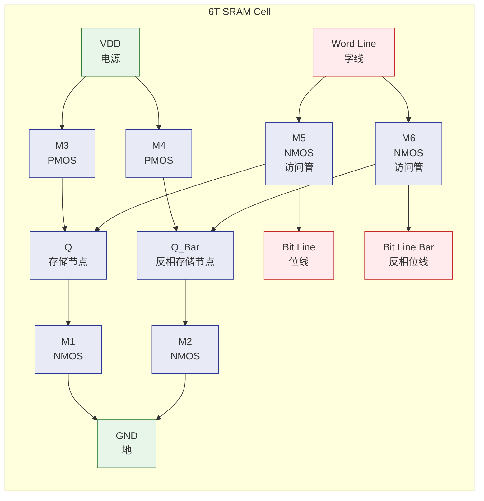

**图解释：** 6T SRAM 单元由两个交叉耦合的反相器（M1-M4）和两个访问晶体管（M5, M6）组成。M3-M1 和 M4-M2 分别构成两个反相器，形成正反馈锁存。读取时通过 WL 打开 M5/M6，Q 和 QB 的状态被 BL 和 BLB 读取。

### 2.3 NOR Flash 浮栅晶体管原理

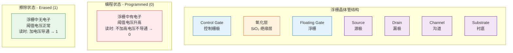

**图解释：** NOR Flash 的核心是浮栅晶体管。浮栅被氧化层（SiO₂）包裹，与外界电气隔离。
- **编程（写 0）**：在控制栅极和漏极加高电压，热电子穿过氧化层注入浮栅，使阈值电压升高
- **擦除（写 1）**：在源极加高电压，电子通过 FN 隧穿从浮栅拉出，使阈值电压恢复
- **读取**：在控制栅极加读电压，根据浮栅是否有电荷判断导通状态 → 读出 0 或 1

---

## 3. 三种存储器的性能对比

### 3.1 核心参数对比表

| 参数 | PFLASH | DFLASH | SRAM |
|------|--------|--------|------|
| **存储单元** | 1T（1 个晶体管/bit） | 1T（1 个晶体管/bit） | 6T（6 个晶体管/bit） |
| **密度** | 高（芯片面积小） | 高（芯片面积小） | 低（芯片面积大） |
| **读速度** | 50~150ns（中等） | 50~150ns（中等） | 1~10ns（极快） |
| **写速度** | 10~100μs/Word（慢） | 10~100μs/Word（慢） | 1~10ns/Byte（极快） |
| **擦除速度** | 10~100ms/Sector（极慢） | 10~100ms/Page（极慢） | 无需擦除 |
| **擦除粒度** | 4KB~32KB（Sector） | 16B~128B（Page） | 无需擦除（Byte） |
| **写粒度** | Word（32/64bit） | Word（32/64bit） | Byte |
| **擦写寿命** | 10万~100万次 | 10万~100万次 | 无限制 |
| **数据保持** | 10~20 年 | 10~20 年 | 掉电即丢失 |
| **功耗** | 读低、写高 | 读低、写高 | 静态功耗较高（漏电） |
| **成本/bit** | 低 | 低 | 高（6T 结构） |
| **典型容量** | 256KB~16MB | 4KB~256KB | 8KB~2MB |

### 3.2 速度对比图

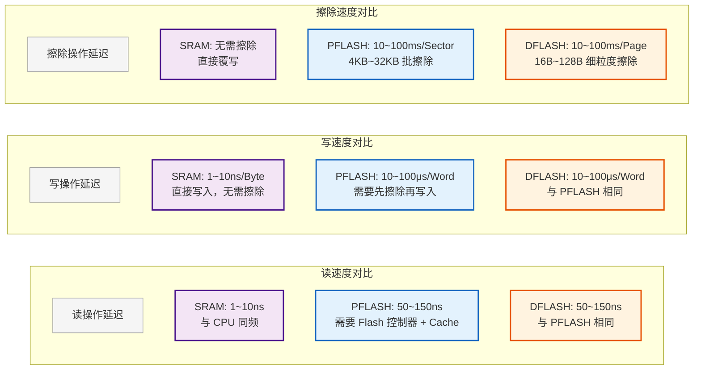

**图解释：** 三种存储器的速度差异巨大：
- **读速度**：SRAM 最快（与 CPU 同频），PFLASH/DFLASH 需要 Flash 控制器 + Cache 配合
- **写速度**：SRAM 快 10,000 倍以上，FLASH 因为需要先擦除再写入，慢得多
- **擦除速度**：只有 FLASH 需要擦除，SRAM 无需

---

## 4. AUTOSAR MCU 中的典型内存映射

### 4.1 典型 MCU 内存布局（以 S32K148 / TC3xx 为例）

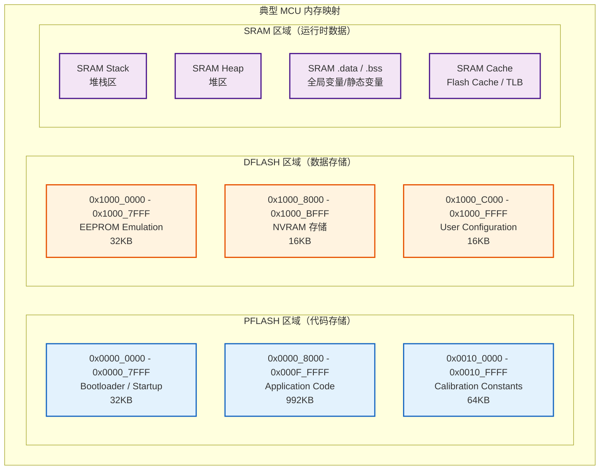

**图解释：** 典型 MCU 的内存映射分为三个区域：
- **PFLASH**：地址从 0x0000_0000 开始，存放代码和常量
- **DFLASH**：通常在独立地址空间，存放需要持久化保存的数据
- **SRAM**：通常在高端地址，存放运行时变量和堆栈

### 4.2 链接文件中的典型分区

```ld
/* 典型链接脚本 - 内存分区示例 */
MEMORY
{
    /* PFLASH: 程序代码 */
    pflash_pcode  : ORIGIN = 0x00000000, LENGTH = 0x00100000  /* 1MB PFLASH */

    /* DFLASH: 数据存储 */
    dflash_nvdata : ORIGIN = 0x10000000, LENGTH = 0x00010000  /* 64KB DFLASH */

    /* SRAM: 运行时数据 */
    sram_rwdata   : ORIGIN = 0x1FFE0000, LENGTH = 0x00040000  /* 256KB SRAM */
}

SECTIONS
{
    /* ========== PFLASH 段 ========== */
    .text : {
        _stext = .;
        *(.text)         /* 程序代码 */
        *(.text.*)
        _etext = .;
    } > pflash_pcode

    .rodata : {
        *(.rodata)       /* 只读数据（常量字符串、查表） */
        *(.rodata.*)
    } > pflash_pcode

    /* ========== DFLASH 段 ========== */
    .nvram : {
        *(.nvram)        /* 非易失性数据 */
        *(.nvram.*)
    } > dflash_nvdata

    /* ========== SRAM 段 ========== */
    .data : {
        _sdata = .;
        *(.data)         /* 初始化数据（从 PFLASH 复制到 SRAM） */
        *(.data.*)
        _edata = .;
    } > sram_rwdata AT > pflash_pcode  /* 加载地址在 PFLASH，运行时在 SRAM */

    .bss : {
        _sbss = .;
        *(.bss)          /* 未初始化数据（启动时清零） */
        *(.bss.*)
        *(COMMON)
        _ebss = .;
    } > sram_rwdata

    .stack : {
        _stack_end = .;
        . = . + 0x4000;  /* 16KB 堆栈 */
        _stack_start = .;
    } > sram_rwdata

    .heap : {
        _heap_start = .;
        . = . + 0x2000;  /* 8KB 堆 */
        _heap_end = .;
    } > sram_rwdata
}
```

**代码解释：** 链接脚本定义了三种存储器的使用方式：
- **PFLASH** 存放 `.text`（代码）和 `.rodata`（只读常量）
- **DFLASH** 存放 `.nvram`（非易失性数据）
- **SRAM** 存放 `.data`（初始化变量）、`.bss`（未初始化变量）、堆栈、堆

---

## 5. RWW（Read While Write）特性

### 5.1 DFLASH 的核心优势：RWW

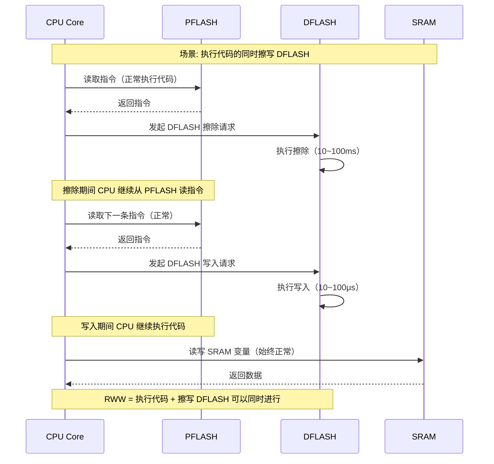

**图解释：** RWW（Read While Write）是 DFLASH 区别于 PFLASH 的关键特性：
- 当 CPU 正在从 PFLASH 读取指令执行时，可以同时对 DFLASH 进行擦除/写入操作
- 这对 EEPROM 模拟至关重要——应用程序可以在正常运行的同时保存数据到 DFLASH
- 如果使用 PFLASH 保存数据，在执行擦除操作时 CPU 会因为总线被占用而暂停

### 5.2 RWW 与 Non-RWW 的对比

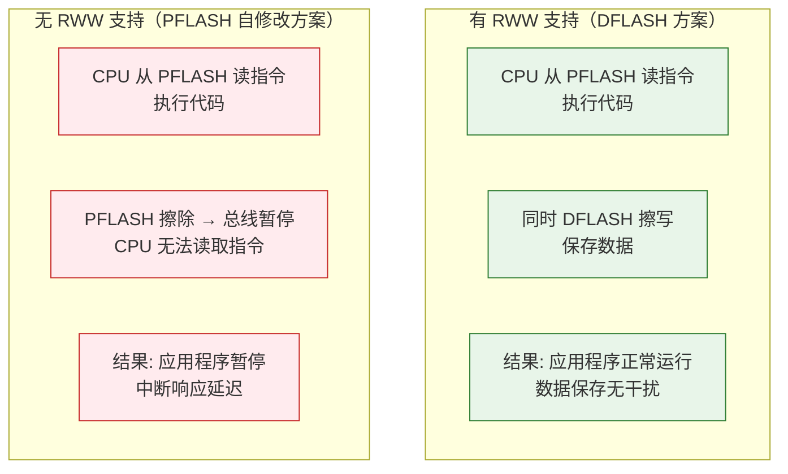

---

## 6. 三种存储器的典型应用

### 6.1 PFLASH 的典型应用

```c
/* ===== PFLASH 存储的内容 ===== */

/* 1. 程序代码（最常见的用途） */
void CanNm_MainFunction(void) {
    /* 这段代码存储在 PFLASH 中 */
    /* CPU 从 PFLASH 读取指令执行 */
}

/* 2. 只读常量（查找表、校准数据） */
const uint8 CanNm_CbvLookupTable[256] = {
    /* 存储在 PFLASH 的 .rodata 段 */
    [0x00] = 0x00, [0x01] = 0x01, /* ... */
};

/* 3. 启动代码和中断向量表 */
__attribute__((section(".vectors")))
const uint32_t InterruptVectorTable[] = {
    (uint32_t)_stack_start,     /* SP 初始值 */
    (uint32_t)Reset_Handler,    /* 复位向量 */
    (uint32_t)NMI_Handler,      /* NMI */
    /* ... */
};

/* 4. Bootloader 和应用程序分区 */
/* 地址 0x0000_0000 - Bootloader（32KB）*/
/* 地址 0x0000_8000 - Application（剩余空间）*/
/* Bootloader 和 APP 可以独立升级 */
```

### 6.2 DFLASH 的典型应用（EEPROM 模拟）

```c
/* ===== DFLASH 模拟 EEPROM ===== */

/* DFLASH 存储布局 */
#define DFLASH_START_ADDR    0x10000000
#define DFLASH_PAGE_SIZE     64    /* 64 字节/页 */
#define DFLASH_SECTOR_SIZE   4096  /* 4KB/扇区 */

/* EEPROM 模拟层 - 基于 DFLASH 实现 */
typedef struct {
    uint16_t Magic;           /* 标识符（0xAA55） */
    uint16_t DataLength;      /* 数据长度 */
    uint8_t  Data[60];        /* 数据内容 */
    uint16_t CRC;             /* CRC 校验 */
    uint8_t  Status;          /* 状态: 0x00=有效, 0xFF=已删除 */
} EepromPageType;

/* 写入数据到 DFLASH */
Std_ReturnType Eeprom_Write(uint16_t BlockId, const uint8_t* Data, uint16_t Length) {
    uint32_t targetAddr;
    EepromPageType page;

    /* 查找空闲页 */
    targetAddr = Eeprom_FindFreePage(BlockId);

    /* 构造页面数据 */
    page.Magic = 0xAA55;
    page.DataLength = Length;
    memcpy(page.Data, Data, Length);
    page.CRC = Eeprom_CalculateCRC(&page);
    page.Status = 0x00;  /* 标记为有效 */

    /* 写入 DFLASH（按页编程） */
    return DFlash_Write(targetAddr, (uint8_t*)&page, sizeof(EepromPageType));
    /* 注意: 写入 DFLASH 时，CPU 可以继续从 PFLASH 执行代码 */
}

/* 读取数据从 DFLASH */
Std_ReturnType Eeprom_Read(uint16_t BlockId, uint8_t* Data, uint16_t* Length) {
    uint32_t addr = DFLASH_START_ADDR;

    /* 遍历所有页，找到最新的有效数据 */
    while (addr < DFLASH_START_ADDR + DFLASH_SECTOR_SIZE) {
        EepromPageType* page = (EepromPageType*)addr;

        if (page->Magic == 0xAA55 && page->Status == 0x00) {
            if (Eeprom_VerifyCRC(page)) {
                memcpy(Data, page->Data, page->DataLength);
                *Length = page->DataLength;
                return E_OK;
            }
        }
        addr += sizeof(EepromPageType);
    }
    return E_NOT_OK;
}
```

**代码解释：** DFLASH 的核心用途是 EEPROM 模拟：
- 利用 DFLASH 的 RWW 特性，在代码执行的同时保存数据
- 通过页管理实现类似 EEPROM 的字节级写入能力
- 使用 CRC 校验保证数据完整性
- 支持磨损均衡（Wear Leveling）延长 Flash 寿命

### 6.3 SRAM 的典型应用

```c
/* ===== SRAM 存储的内容 ===== */

/* 1. 全局变量（.data 段 - 初始化变量）*/
CanNm_ChannelType CanNm_Channel;  /* 存储在 SRAM */
                                    /* 初始值在 PFLASH，启动时复制到 SRAM */

/* 2. 全局变量（.bss 段 - 未初始化变量）*/
static uint32_t CanNm_SystemTick;  /* 存储在 SRAM，启动时清零 */
static uint8_t  CanNm_RxBuffer[256];  /* 接收缓冲区 */

/* 3. 堆栈变量（Stack）*/
void CanNm_ProcessRxPdu(void) {
    /* 局部变量存储在堆栈中（SRAM） */
    uint8_t pduData[8];      /* 栈上分配 */
    uint32_t timestamp;      /* 栈上分配 */
    CanNm_NodeType* node;    /* 栈上分配 */
}

/* 4. 堆分配（Heap）*/
void CanNm_Init(void) {
    /* 动态分配内存（从 SRAM 堆中分配） */
    uint8_t* tempBuffer = (uint8_t*)malloc(1024);
    /* 注意: 在 AUTOSAR 中，通常禁止动态分配 */
    /* 这里仅为示例 */
}

/* 5. 中断栈（Interrupt Stack）*/
/* 在启动文件中配置 */
__attribute__((section(".stack")))
uint32_t SystemStack[4096];  /* 16KB 系统栈，存储在 SRAM */

/* 6. Flash Cache（SRAM 中的代码缓存）*/
/* 许多 MCU 会从 PFLASH 预取代码到 SRAM Cache */
/* 例如: S32K148 的 Flash Cache Controller (FCC) */
```

---

## 7. 启动时的内存初始化流程

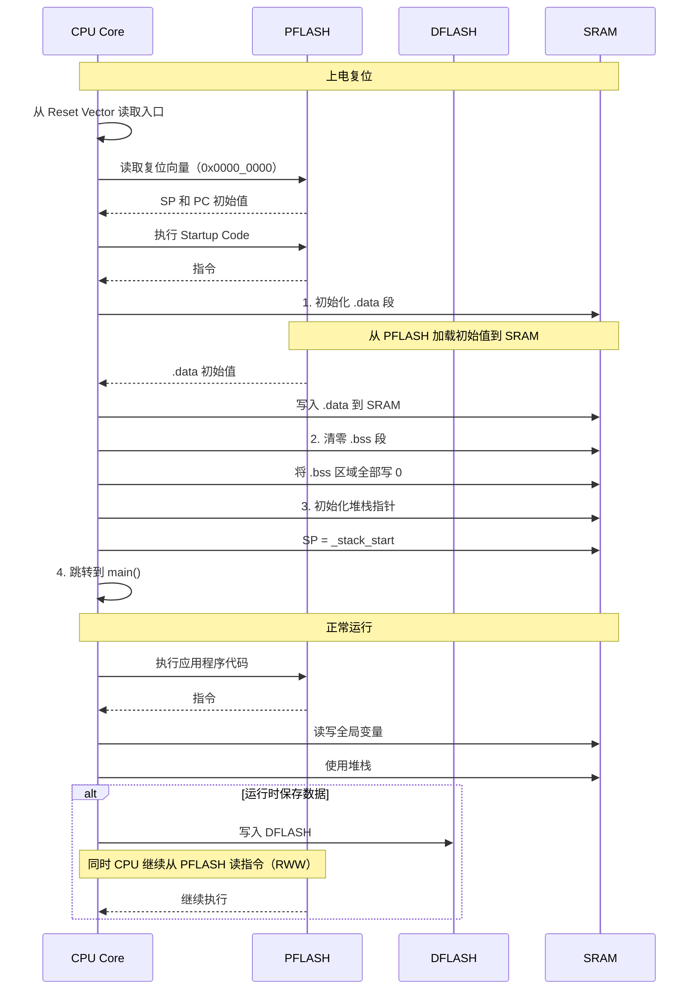

**图解释：** 启动过程的内存初始化顺序：
1. CPU 从 PFLASH 读取复位向量，获得 SP 和 PC 初始值
2. 启动代码将 `.data` 段从 PFLASH 复制到 SRAM（初始化全局变量）
3. 将 `.bss` 段在 SRAM 中清零
4. 初始化堆栈指针，跳转到 `main()`
5. 运行时，PFLASH 提供代码，SRAM 提供变量存储，DFLASH 提供数据持久化

---

## 8. 关键差异：为什么需要 DFLASH 而不是用 PFLASH 存数据？

### 8.1 擦除粒度的对比

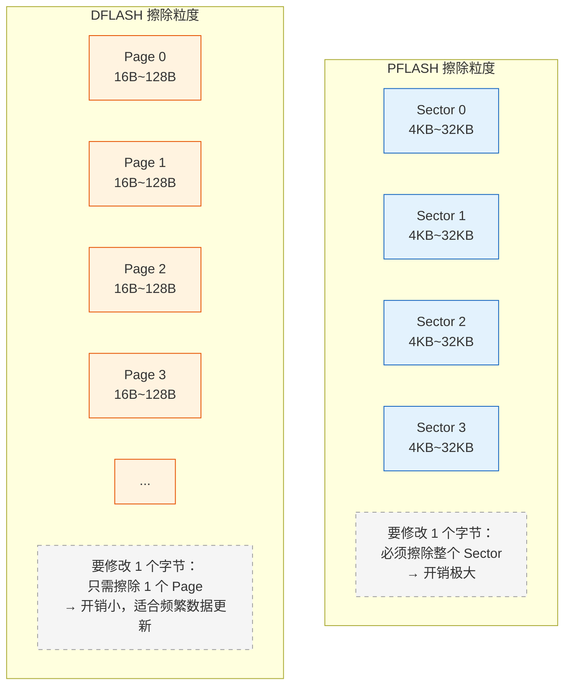

| 维度 | PFLASH 存数据 | DFLASH 存数据 |
|------|-------------|--------------|
| **擦除粒度** | 4KB~32KB（大） | 16B~128B（小） |
| **修改 1 字节开销** | 读出整个 Sector → 擦除 → 修改 → 写回 | 只需擦除 1 页 |
| **RWW 支持** | 通常不支持（擦除时 CPU 暂停） | 支持（执行代码同时擦写） |
| **磨损均衡** | 难实现（Sector 太大） | 易实现（Page 小，可精细管理） |
| **典型用途** | 代码存储 | EEPROM 模拟、NVRAM |

### 8.2 为什么不能直接用 SRAM 代替 FLASH？

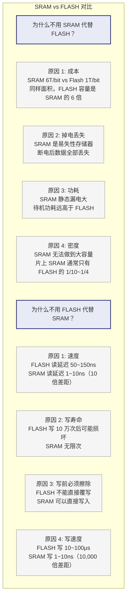

---

## 9. 实际 MCU 型号的存储器配置

### 9.1 S32K148 存储器配置

| 存储器 | 容量 | 地址范围 | 用途 |
|--------|------|---------|------|
| **PFLASH** | 1MB (0x100000) | 0x0000_0000 - 0x000F_FFFF | 程序代码、Bootloader、应用程序 |
| **DFLASH** | 64KB (0x10000) | 0x1000_0000 - 0x1000_FFFF | EEPROM 模拟、NVRAM 存储 |
| **SRAM** | 128KB (0x20000) | 0x1FF8_0000 - 0x1FFF_FFFF | 运行时数据、堆栈、Cache |

### 9.2 TC3xx（AURIX）存储器配置

| 存储器 | 容量 | 地址范围 | 特性 |
|--------|------|---------|------|
| **PFLASH** | 最大 16MB | 0x8000_0000 - 0x80FF_FFFF | 程序 Flash，24 周期读延迟 |
| **DFLASH** | 最大 1MB | 0xAF00_0000 - 0xAF0F_FFFF | Data Flash，RWW 支持，32 周期读延迟 |
| **SRAM** | 最大 4MB | 0x5000_0000 - 0x503F_FFFF | 本地 SRAM，零等待，ECC 保护 |

### 9.3 STM32F103C8T6 存储器配置

| 存储器 | 容量 | 地址范围 | 备注 |
|--------|------|---------|------|
| **Main Flash** | 64KB | 0x0800_0000 - 0x0800_FFFF | 代码 + 数据共用（无独立 DFLASH） |
| **SRAM** | 20KB | 0x2000_0000 - 0x2000_4FFF | 运行时数据 |

**注意：** STM32F1 系列没有独立的 DFLASH，数据存储也需要使用 Main Flash 的 Sector，且不支持 RWW。这在需要频繁保存数据的场景中是劣势。

---

## 10. DFLASH 与 NVM 的区别

> 这是一个**极易混淆**的概念。简单说：**DFLASH 是"纸"（物理介质），NVM 是"写字方法"（软件管理层）。**

### 10.1 核心概念区分

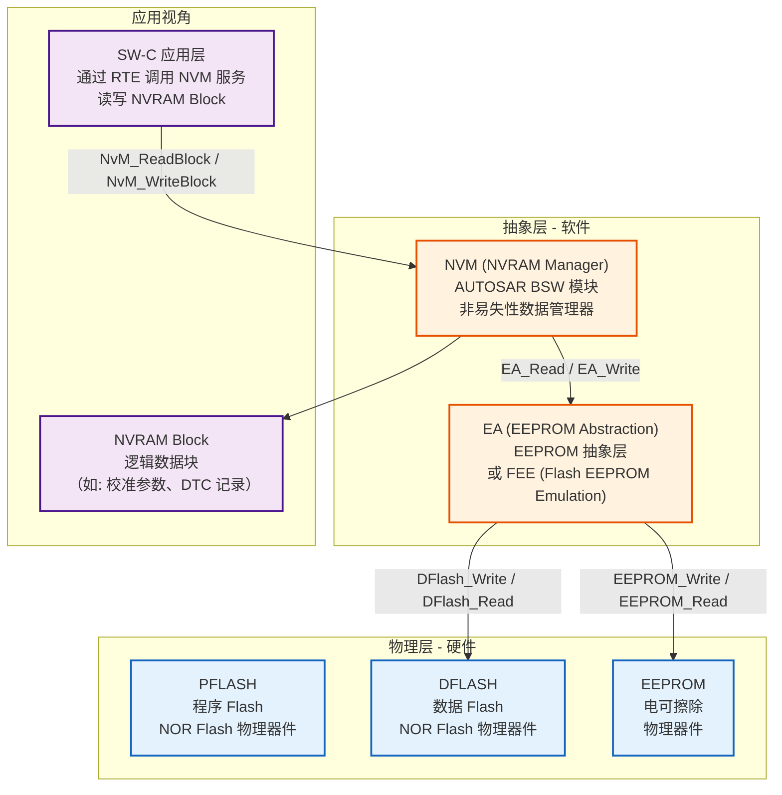

**图解释：** DFLASH 和 NVM 处于完全不同的抽象层级：
- **DFLASH** 是物理硬件（NOR Flash 的一种），位于最底层
- **NVM（NVRAM Manager）** 是 AUTOSAR BSW 软件模块，位于高层
- 中间还有 **EA/FEE** 抽象层，屏蔽底层存储介质的差异
- 应用层（SW-C）只与 NVM 交互，完全不知道底层是 DFLASH、EEPROM 还是其他介质

### 10.2 一句话总结

| 概念 | 本质 | 层级 | 是否可见 |
|------|------|------|---------|
| **DFLASH** | 物理存储器（硬件） | 芯片内部硬件 | 对应用**不可见** |
| **NVM (NVRAM Manager)** | 软件管理模块（AUTOSAR BSW） | BSW 服务层 | 对应用**可见**（API） |

**关系：** NVM 是"图书馆管理员"，DFLASH 是"书架"。

### 10.3 详细对比表

| 维度 | DFLASH | NVM（NVRAM Manager） |
|------|--------|---------------------|
| **本质** | 物理存储介质（NOR Flash） | AUTOSAR BSW 软件模块 |
| **全称** | Data Flash | NVRAM Manager（非易失性 RAM 管理器） |
| **所属层级** | 芯片硬件层 | BSW 服务层（Service Layer） |
| **标准规范** | 芯片厂商手册 | AUTOSAR SWS NVRAM Manager |
| **接口** | 直接读写寄存器（DFlash_Write/Read） | NvM_ReadBlock / NvM_WriteBlock / NvM_EraseBlock |
| **功能** | 存储电荷（保存 0/1） | 数据管理（完整性、一致性、可靠性） |
| **数据组织** | 以 Page/Sector 为单位 | 以 NVRAM Block 为单位（逻辑数据块） |
| **错误处理** | ECC（纠错码） | CRC 校验 + 冗余存储 + 状态机恢复 |
| **磨损均衡** | 无（需上层实现） | 支持（通过 FEE/EA 层） |
| **写优化** | 无（直接擦写） | 写缓存 + 写保护 + 先写后擦策略 |
| **多块管理** | 无（裸设备） | 支持多 Block 并行管理 |
| **依赖关系** | 被 NVM/FEE/EA 依赖 | 依赖 FEE/EA → 依赖 DFLASH/EEPROM |

### 10.4 AUTOSAR NVM 架构（NVM 与 DFLASH 的关系）

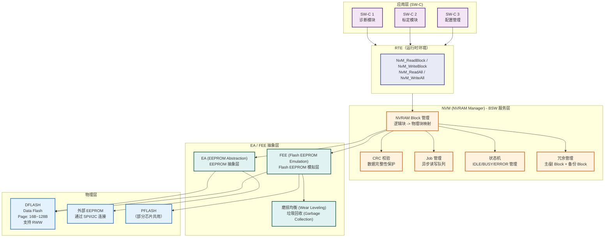

**图解释：** AUTOSAR NVM 架构共 4 层：
1. **应用层**：SW-C 通过 RTE 调用 NVM 服务
2. **NVM 层**：管理逻辑数据块，提供 CRC、冗余、Job 管理等高级功能
3. **EA/FEE 抽象层**：屏蔽底层介质差异，提供磨损均衡和垃圾回收
4. **物理层**：DFLASH / 外部 EEPROM / PFLASH

### 10.5 NVM 的核心功能（DFLASH 没有的）

```c
/* ============================================
 * NVM 提供的功能 vs DFLASH 裸设备
 * ============================================ */

/* ----- NVM 功能 1: 数据完整性保护 ----- */
/* NVM 自动计算和验证 CRC */
typedef struct {
    uint8_t  Data[64];        /* 实际数据 */
    uint32_t CRC;              /* NVM 自动计算的 CRC32 */
    uint8_t  Status;           /* NVM 内部状态 */
} NvM_BlockType;

/* DFLASH 裸设备: 不关心数据含义，只存储字节 */
/* DFlash_Write(addr, data, len) 只写入原始字节，不添加 CRC */


/* ----- NVM 功能 2: 冗余存储 ----- */
/* NVM 配置示例：每个逻辑块有主/副/备份三个物理副本 */
const NvM_BlockConfigType NvM_BlockConfig[] = {
    {
        .BlockId = 0,                    /* 逻辑块 ID */
        .BlockSize = 64,                 /* 64 字节 */
        .NumberOfCopies = 3,             /* 3 份冗余: 主 + 副 + 备份 */
        .CopyIndex = {0, 1, 2},          /* 对应的物理副本索引 */
        .WriteVerification = TRUE,        /* 写后读验证 */
        .CrcCheck = TRUE,                /* CRC 校验 */
    }
    /* DFLASH 裸设备: 没有冗余概念，一个地址只存一份数据 */
};


/* ----- NVM 功能 3: Job 管理与异步操作 ----- */
/* NVM 的异步读写 Job */
Std_ReturnType NvM_WriteBlock(NvM_BlockIdType BlockId, const uint8_t* Data) {
    /* NVM 内部处理步骤:
     * 1. 将请求加入 Job 队列（异步）
     * 2. 返回 E_OK（立即返回）
     * 3. 后台逐步执行:
     *    a. 计算 CRC
     *    b. 通过 FEE 写入 DFLASH
     *    c. 写后读验证
     *    d. 更新状态
     * 4. 完成后通过回调通知上层
     */
    NvM_JobQueue[NvM_JobCount++] = (NvM_JobType){
        .BlockId = BlockId,
        .DataPtr = Data,
        .Status = NVM_JOB_PENDING
    };
    return E_OK;
}

/* DFLASH 裸设备: 同步操作，CPU 等待擦写完成 */
/* DFlash_Write() 执行期间 CPU 等待（虽然 RWW 允许代码执行）*/


/* ----- NVM 功能 4: 写保护与优先级 ----- */
/* NVM 支持不同优先级 */
typedef enum {
    NVM_PRIORITY_LOW,      /* 低优先级: 延迟写入，合并写入 */
    NVM_PRIORITY_MEDIUM,   /* 中优先级: 正常写入 */
    NVM_PRIORITY_HIGH,     /* 高优先级: 立即写入 */
    NVM_PRIORITY_CRITICAL  /* 关键数据: 同步写入，等待完成 */
} NvM_WritePriorityType;

/* DFLASH 裸设备: 没有优先级概念，每次写入都是立即操作 */


/* ----- NVM 功能 5: 多块管理 ----- */
/* NVM 可以同时管理数十个逻辑块 */
#define NVM_BLOCK_CALIBRATION  0   /* 标定数据: 64KB */
#define NVM_BLOCK_DTC          1   /* 诊断故障码: 16KB */
#define NVM_BLOCK_ECU_CONFIG   2   /* ECU 配置: 8KB */
#define NVM_BLOCK_CRYPTO_KEY   3   /* 密钥: 128B */
#define NVM_BLOCK_LOG          4   /* 运行日志: 32KB */

/* 每个块有不同的配置: 大小、冗余、CRC、优先级 */
/* DFLASH 裸设备: 块管理完全由上层实现 */
```

**代码解释：** NVM 提供的 5 个核心功能是 DFLASH 裸设备不具备的：
1. **CRC 校验**：自动保护数据完整性
2. **冗余存储**：一份数据存多份，防止写入失败导致数据丢失
3. **异步 Job 管理**：写操作不阻塞应用
4. **写优先级**：关键数据优先写入
5. **多块管理**：同时管理不同大小、不同属性的数据块

### 10.6 NVM 状态机 vs DFLASH 状态机

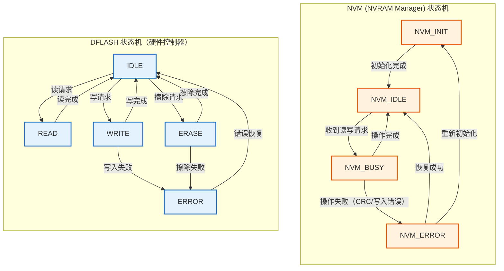

**图解释：** NVM 和 DFLASH 各有自己的状态机，且处于不同层级：
- **NVM 状态机**：软件层面，管理的是 Job 生命周期（IDLE → BUSY → IDLE/ERROR）
- **DFLASH 状态机**：硬件层面，管理的是物理擦写操作（IDLE → WRITE/ERASE → IDLE）

### 10.7 实际代码对比

```c
/* ============================================
 * 方案 A: 直接操作 DFLASH（不推荐，仅为对比）
 * ============================================ */
#define DFLASH_CALIBRATION_ADDR  0x1000E000
#define CALIBRATION_SIZE         1024

/* 直接读写 DFLASH - 需要手动管理所有细节 */
void SaveCalibration_DFLASH(uint8_t* data, uint16_t len) {
    uint32_t targetAddr = DFLASH_CALIBRATION_ADDR;

    /* 1. 手动擦除（需要计算地址对应的 Page） */
    uint32_t pageAddr = targetAddr & ~(DFLASH_PAGE_SIZE - 1);
    DFlash_ErasePage(pageAddr);

    /* 2. 等待擦除完成（轮询） */
    while (DFlash_GetStatus() != DFLASH_STATUS_IDLE);

    /* 3. 手动写入 */
    DFlash_Write(targetAddr, data, len);

    /* 4. 等待写入完成 */
    while (DFlash_GetStatus() != DFLASH_STATUS_IDLE);

    /* 5. 手动读回验证 */
    uint8_t verifyBuf[CALIBRATION_SIZE];
    DFlash_Read(targetAddr, verifyBuf, len);
    if (memcmp(data, verifyBuf, len) != 0) {
        /* 手动处理错误 */
        ErrorHook("Calibration write failed!");
    }

    /* 问题: 没有 CRC 保护、没有冗余、没有磨损均衡、同步阻塞 */
}

/* ============================================
 * 方案 B: 通过 NVM 管理（推荐，AUTOSAR 标准方式）
 * ============================================ */
#define NVM_BLOCK_CALIBRATION  0

/* NVM 回调函数 */
void NvM_WriteFinished(void) {
    /* NVM 写入完成回调（异步通知） */
    SetEvent(CalibrationTask, EVENT_WRITE_DONE);
}

/* 通过 NVM 写入 - 自动处理所有细节 */
void SaveCalibration_NVM(uint8_t* data, uint16_t len) {
    Std_ReturnType result;

    /* 1. 调用 NVM 写入 - 异步操作 */
    result = NvM_WriteBlock(NVM_BLOCK_CALIBRATION, data);

    if (result == E_OK) {
        /* NVM 内部自动完成:
         * - 计算 CRC 并附加
         * - 写入主 Block
         * - 写入副 Block（冗余）
         * - 写后读验证
         * - 磨损均衡
         * - 完成后通过回调通知
         */
        WaitForEvent(EVENT_WRITE_DONE);  /* 等待异步完成 */
    } else {
        ErrorHook("NVM write job failed!");
    }
}

/* 通过 NVM 读取 - 自动校验完整性 */
Std_ReturnType LoadCalibration_NVM(uint8_t* buffer, uint16_t* len) {
    Std_ReturnType result;

    /* 1. 读取主 Block */
    result = NvM_ReadBlock(NVM_BLOCK_CALIBRATION, buffer);

    if (result == E_OK) {
        /* NVM 内部自动完成:
         * - 读取主 Block
         * - 验证 CRC
         * - 如果主 Block 损坏 → 自动从副 Block 恢复
         * - 如果副 Block 也损坏 → 从备份 Block 恢复
         * - 返回正确的数据
         */
        *len = NVM_BLOCK_SIZE;
        return E_OK;
    }

    /* 2. 如果主 Block 损坏，NVM 已自动尝试恢复 */
    if (result == NVM_REQ_BLOCK_SWITCHED) {
        /* 数据已从副 Block 恢复，应用无需额外操作 */
        *len = NVM_BLOCK_SIZE;
        return E_OK;
    }

    return E_NOT_OK;
}
```

**代码解释：** 直接操作 DFLASH 与通过 NVM 管理数据的对比：
- **DFLASH 方案**：需要手动擦除、写入、验证、错误处理，代码量大且容易出错
- **NVM 方案**：一行 API 调用，NVM 自动处理 CRC、冗余、写验证、磨损均衡

### 10.8 AUTOSAR 中 NVM 的 Block 类型

| NVM Block 类型 | 描述 | 典型用途 | 底层存储介质 |
|---------------|------|---------|------------|
| **NVRAM Block** | 标准数据块，带冗余 | 标定数据、配置参数 | DFLASH |
| **RAM Block** | 仅 RAM 镜像，掉电不保存 | 运行时副本 | SRAM |
| **ROM Block** | 仅 ROM 数据，不可写 | 默认配置 | PFLASH |
| **Redundant Block** | 主 Block + 副 Block | 关键数据（DTC、密钥） | DFLASH（2 份） |
| **Dataset Block** | 数据集块，多个数据组 | 多组标定数据 | DFLASH |

### 10.9 常见的误解澄清

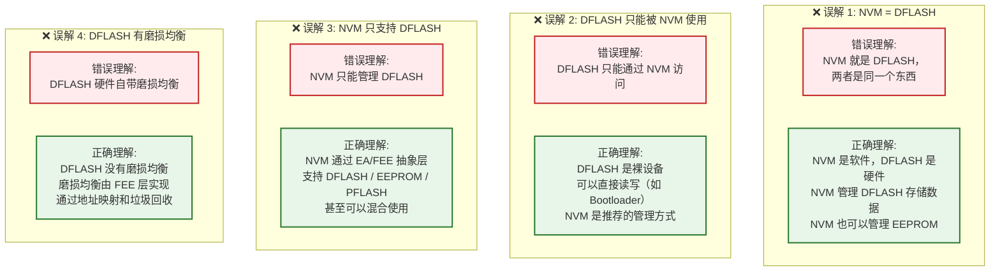

### 10.10 总结：何时用 DFLASH，何时用 NVM？

| 场景 | 推荐方式 | 理由 |
|------|---------|------|
| **Bootloader 升级** | 直接操作 DFLASH | NVM 尚未初始化，需要裸设备访问 |
| **应用层存储标定数据** | NVM | 需要 CRC、冗余、磨损均衡 |
| **诊断 DTC 记录** | NVM | 需要多块管理、异步写入 |
| **ECU 配置参数** | NVM | 需要数据完整性保护 |
| **芯片测试/生产** | 直接操作 DFLASH | 不经过 BSW，直接硬件操作 |
| **运行日志记录** | NVM | 需要磨损均衡（频繁写入） |
| **密钥存储** | NVM（Redundant Block） | 需要最高可靠性（三冗余） |
| **临时数据缓存** | SRAM（无需持久化） | 速度最快，无需写入 Flash |

---

## 11. 选择指南

### 11.1 什么样的数据存放在哪里？

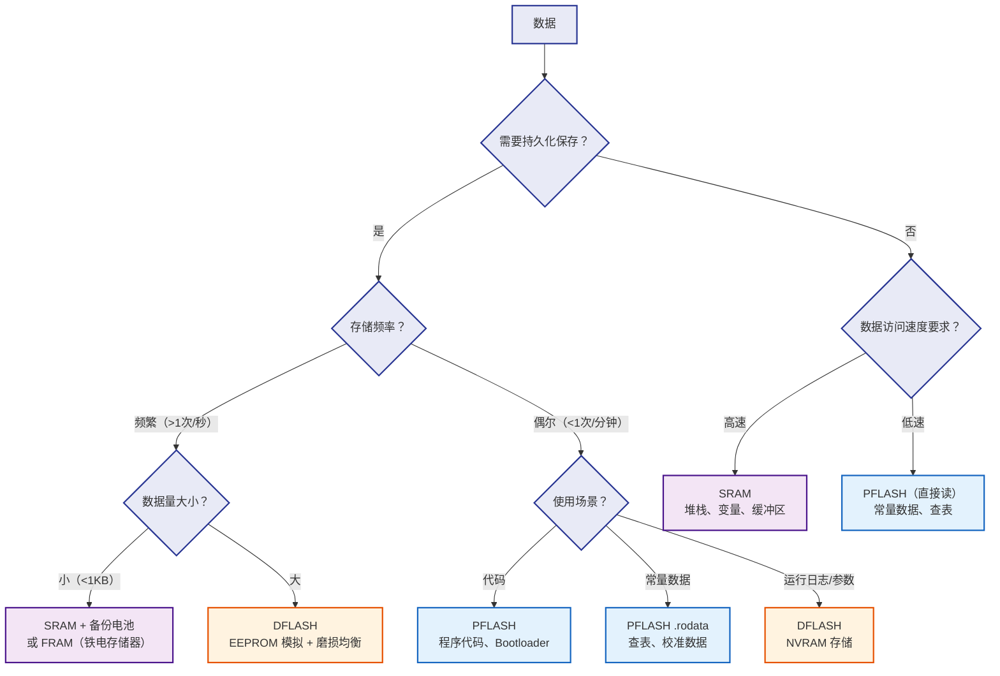

### 11.2 快速决策表

| 数据类型 | 存储位置 | 理由 |
|---------|---------|------|
| 程序代码（函数） | **PFLASH** | 容量大，不需要频繁修改 |
| 中断向量表 | **PFLASH** | 只读，启动时固定 |
| 常量字符串 | **PFLASH** (.rodata) | 只读，容量大 |
| 校准数据（查表） | **PFLASH** (.rodata) | 编译时确定，不需要运行时修改 |
| ECU 配置参数 | **DFLASH** | 需要持久化，偶尔修改 |
| 诊断数据（DTC、快照） | **DFLASH** | 需要持久化，运行时记录 |
| 全局变量 | **SRAM** (.data/.bss) | 频繁读写，需要高速访问 |
| 堆栈 | **SRAM** | 高速读写，实时性要求 |
| 消息缓冲区 | **SRAM** | 高速读写，频繁操作 |
| 堆（Heap） | **SRAM** | 动态分配需求 |
| 运行时日志 | **SRAM** → **DFLASH** | 先缓存到 SRAM，定时写入 DFLASH |

---

## 12. 总结

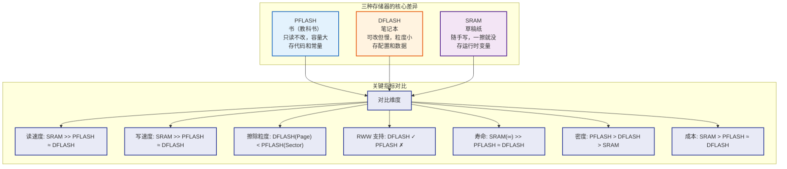

**一句话总结：**

| 特性 | PFLASH | DFLASH | SRAM |
|------|--------|--------|------|
| **持久性** | ✅ 掉电不丢失 | ✅ 掉电不丢失 | ❌ 掉电丢失 |
| **读速度** | ⚡ 中等（50~150ns） | ⚡ 中等（50~150ns） | 🚀 极快（1~10ns） |
| **写速度** | 🐢 慢（需擦除） | 🐢 慢（需擦除） | 🚀 极快（直接写） |
| **擦除粒度** | 🏗️ 大（4KB~32KB） | 🔬 小（16B~128B） | 🔬 无需擦除 |
| **RWW 支持** | ❌ 不支持 | ✅ 支持 | ✅ 天然支持 |
| **主要用途** | 程序代码存储 | EEPROM 模拟 / NVRAM | 运行时变量 / 堆栈 |
| **典型容量** | 256KB~16MB | 4KB~256KB | 8KB~2MB |