# Cortex-M 特权模式（Privileged Mode）与用户模式（User Mode）详解

> 适用芯片：STM32 全系列（Cortex-M0/M0+/M3/M4/M7/M23/M33）
> 本文不涉及任何 AUTOSAR 内容，聚焦 Cortex-M 内核本身的模式机制。

---

## 目录

- [1. 通俗易懂：一次搞懂"特权"是什么](#1-通俗易懂一次搞懂特权是什么)
- [2. 三个必须分清的维度：模式 / 访问等级 / 栈](#2-三个必须分清的维度模式--访问等级--栈)
- [3. 设计思路：为什么要设计两套模式](#3-设计思路为什么要设计两套模式)
- [4. 深入原理](#4-深入原理)
- [5. 代码实战：寄存器 / 标准库 / HAL 三版本](#5-代码实战寄存器--标准库--hal-三版本)
- [6. 三种版本对比与选型建议](#6-三种版本对比与选型建议)
- [7. 附录：常见问题与调试技巧](#7-附录常见问题与调试技巧)

---

## 1. 通俗易懂：一次搞懂"特权"是什么

**打个比方**：把 MCU 想象成一个小区的物业管理系统。

- **业主（用户模式 / 非特权 Unprivileged）**：在自家可以自由活动、开灯、做饭（运行普通代码），但是**改不了门禁设置、进不了物业机房、碰不了公共设施的配置表**（访问不了关键寄存器）。
- **物业管理员（特权模式 Privileged）**：能改门禁、重启设备、配置公共设施，**拥有最高权限**（什么寄存器都能动）。
- 业主有需求时怎么办？**按门铃（SVC 软件中断）**，物业管理员来处理，处理完业主继续过日子。

Cortex-M 的 CPU 在运行程序时也有这种"身份"之分：

| 身份 | 官方名称 | 权限 |
|---|---|---|
| 管理员 | 特权（Privileged） | 几乎所有操作都允许 |
| 普通业主 | 非特权 / 用户（Unprivileged / User） | 特殊寄存器不能碰、危险指令不能执行 |

**一个很多人忽略的事实**：STM32 **上电复位后默认是特权运行**，普通裸机程序从头到尾都是特权，所以很多开发者完全没意识到这个机制存在。只有当你的系统需要"**一个任务崩溃了不能带崩整个系统**"这类**可靠性 / 安全性**设计时，特权分离才真正有意义——这正是 RTOS 和汽车级软件核心关注的点。

> ⚠️ **最关键的一条澄清（务必记住）**：
> 没有 MPU 时，"非特权"只限制**内核特殊寄存器 + 少数指令**，**并不限制访问普通外设寄存器**（GPIO / USART / TIM 等都在普通内存地址上，非特权下照样能读写）。
> 想让"外设内存"也被保护，必须配合 **MPU（Memory Protection Unit，存储器保护单元）** 把对应地址区域标成"仅特权访问"。
>
> 所以真正的安全边界是两层叠加：
> **① 特权/用户模式**（限制特殊寄存器与指令，硬件内置，无需配置）
> **② MPU**（限制内存与外设访问，需要软件配置）

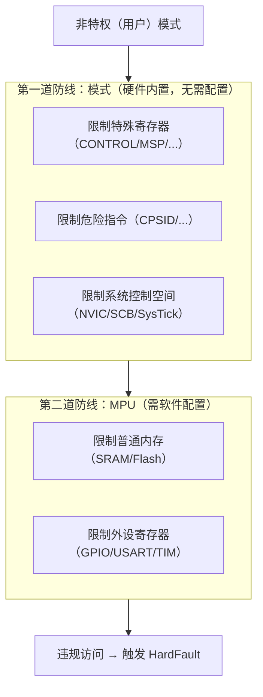

---

## 2. 三个必须分清的维度：模式 / 访问等级 / 栈

> **通俗理解**：新手最容易把三个概念混在一起。其实它们是三个**互相独立**的维度，可以自由组合：
> - **模式**＝你在"前台做事"还是在"后台处理紧急事务"；
> - **访问等级**＝你是"管理员"还是"普通业主"；
> - **栈**＝你用"自己的桌子（PSP）"还是"公用的桌子（MSP）"。

### 2.1 维度一：处理器模式（Processor Mode）

Cortex-M 只有两种模式：

| 模式 | 什么时候进入 | 权限 | 典型用途 |
|---|---|---|---|
| **Thread 模式**（线程模式） | 运行普通程序 | 特权 **或** 非特权（可配） | 主程序、RTOS 任务 |
| **Handler 模式**（处理模式） | 运行异常/中断处理函数 | **只能是特权** | 中断服务程序、内核代码 |

> **设计思路**：把"处理突发事件"的执行环境与"日常程序"分开，是一个朴素的**优先级与信任分层**思想——中断处理器是"临时插队"的高优先级事务，系统默认它可信，所以 Handler 模式强制特权，从硬件上杜绝"中断里跑不可信代码"。

### 2.2 维度二：访问等级（Access Level）

| 访问等级 | 说明 |
|---|---|
| **特权（Privileged）** | 可访问所有资源、执行所有允许的指令 |
| **非特权（Unprivileged / User）** | 特殊寄存器受限、部分指令无效、系统控制空间访问受限 |

**注意术语**：ARM 文档里所谓 "User mode"（用户模式）在 Cortex-M 上就是指 **"非特权访问等级 + Thread 模式"** 这个组合。它与老 ARM7/ARM9 的 User 模式思想一脉相承（老架构里用 **SWI 软中断** 提权，Cortex-M 用 **SVC 软中断** 提权）。

### 2.3 维度三：两个栈指针 MSP 与 PSP

Cortex-M 有**两个独立的栈指针寄存器**：

| 栈指针 | 全称 | 谁用它 | 地址 |
|---|---|---|---|
| **MSP** | Main Stack Pointer（主栈指针） | Handler 模式**强制使用**；Thread 模式默认使用 | 0xFFFFFFF9/0xFFFFFFF1 返回时用 |
| **PSP** | Process Stack Pointer（进程栈指针） | Thread 模式可选使用（RTOS 任务专用） | 0xFFFFFFFD 返回时用 |

> **通俗理解**：MSP 是"公共应急桌面"——系统一发生中断，硬件立刻切到这个桌子处理，谁都不能乱动；PSP 是"每个任务的私人书桌"——RTOS 每个任务一条 PSP，切换任务时换桌子即可，互不干扰。

**三者组合的自由度**：不是"非特权只能配 PSP"。比如：
- 裸机主程序：Thread 模式 + 特权 + MSP（最常用）；
- RTOS 任务：Thread 模式 + 非特权 + PSP（最安全）；
- RTOS 内核：Handler 模式 + 特权 + MSP。

### 2.4 状态总览图

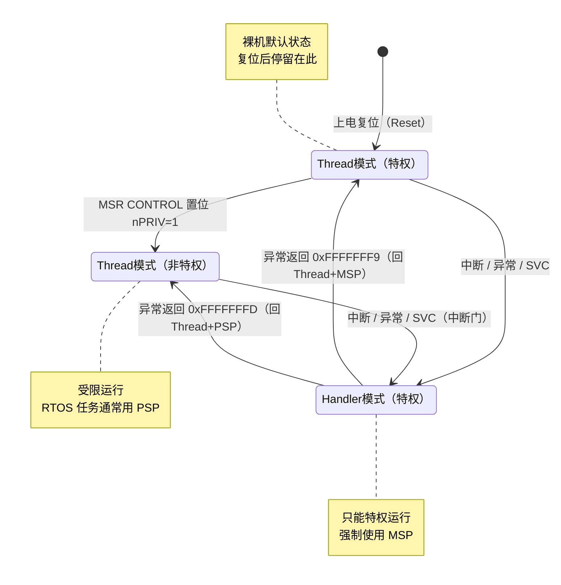

**图释**：
- **复位**后进入 Thread 模式 + 特权 + MSP（Reset_Handler 也在此状态下运行）；
- 特权代码可以通过 `MSR CONTROL` **主动降级**为非特权；
- 非特权代码**无法自行升级**，只能通过 **SVC**（软中断）让 Handler 模式（特权）代劳；
- 异常返回时用 **EXC_RETURN** 的编码决定回到哪种模式、用哪个栈。

---

## 3. 设计思路：为什么要设计两套模式

> **通俗理解**：一个人开车，如果乘客也能踩刹车、动方向盘、改仪表盘，那这车迟早出事。两套模式就是"司机"和"乘客"的分工——乘客负责喊（SVC），司机负责操作（特权内核），车才不会乱。

### 3.1 动机：可靠性、安全性与故障隔离

1. **故障隔离（crash containment）**：非特权任务即使访问了非法地址/寄存器，也只是**触发一个异常**（HardFault 等），CPU 可以捕获并重启该任务，而**不会让整个系统崩溃**。没有特权隔离时，一个野指针就能把整个系统"打飞"。
2. **安全认证需求**：汽车、医疗、工控等领域，软件需要满足功能安全（如 IEC 61508 / ISO 26262 的软件分层思想）。"非特权应用层"与"特权内核层"的分层，天然是安全架构的一部分。
3. **从裸机到 RTOS 的演进需求**：裸机只有一个主循环，不需要隔离；一旦引入**多任务**，就必须保护内核数据结构（就绪链表、内存池、调度器状态）不被任务误改。

### 3.2 经典设计模式：最小特权 + 系统调用门（Trap & Gate）

这是**所有操作系统（从 UNIX 到 RTOS）通用的架构思想**，不是 ARM 独有：

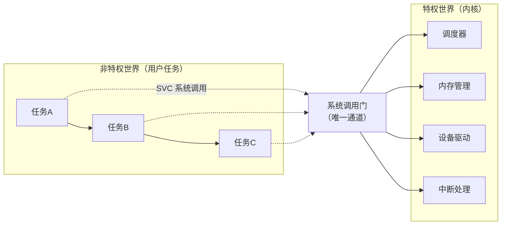

**设计要点（设计模式总结）**：

| 设计模式 | 做法 | 为什么 |
|---|---|---|
| **最小特权原则** | 任务只用"够用"的权限 | 权限越小，出错时破坏范围越小 |
| **系统调用门（Gate）** | 危险操作收编为 SVC 服务号，统一入口 | 权限提升只有一个受控通道，便于审计与拦截 |
| **双栈模型** | 内核用 MSP，任务用 PSP | 任务栈崩了不影响内核栈，栈空间互相隔离 |
| **故障域隔离** | 任务非法访问→异常→任务级处理 | 把"整个系统崩溃"降级为"单个任务重启" |
| **两级防护叠加** | 模式（指令级）+ MPU（内存级） | 只有指令受限，阻止不了外设被乱改；只有 MPU，阻止不了特权指令滥用——两者互补 |

### 3.3 硬件如何低成本实现这种隔离

Cortex-M 实现隔离**几乎不花额外成本**，靠两个手段：

1. **特殊寄存器特权化**：`CONTROL`、`MSP`、`FAULTMASK`、`BASEPRI`、`PRIMASK` 这类"控制核心行为"的寄存器，要么非特权不能写（MSP），要么写入被忽略（CONTROL.nPRIV 清除无效），要么部分指令失效（CPSID）。
2. **系统控制空间（System Control Space, SCS）特权化**：`NVIC`、`SCB`、`SysTick`、`MPU` 等寄存器位于 `0xE000_E000` 附近，硬件默认非特权访问会**触发故障**。

一句话：**权限隔离的"强制力"全部由硬件保证，软件只是"用或不用"**。这就是为什么它可靠——不需要软件自律，硬件直接拦住。

---

## 4. 深入原理

### 4.1 CONTROL 寄存器逐位详解

`CONTROL` 是一个**特殊寄存器**（不是内存映射），只能通过 `MRS` / `MSR` 指令访问，地址编号为 `R0` 之外的专用编码。复位后为 0。

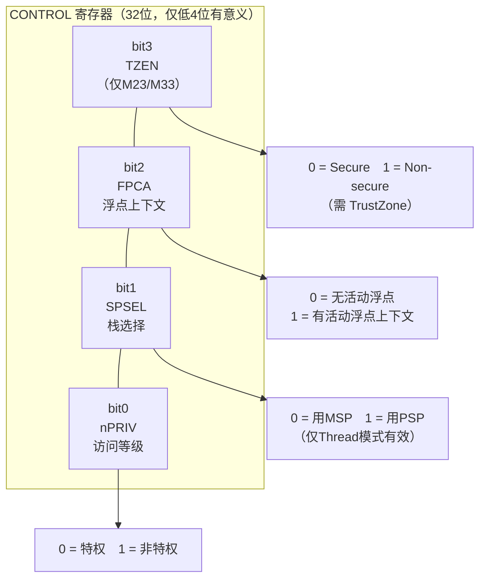

| 位 | 名称 | 含义 |
|---|---|---|
| bit0 | **nPRIV** | 0 = 线程模式为**特权**；1 = 线程模式为**非特权** |
| bit1 | **SPSEL** | 0 = 线程模式用 **MSP**；1 = 线程模式用 **PSP**（Handler 模式恒用 MSP，此位无效） |
| bit2 | **FPCA** | 0 = 无浮点上下文活动；1 = 有（中断压栈时决定是否压 FPU 寄存器，仅 M4/M7 有意义） |
| bit3 | **TZEN** | 仅带 TrustZone 的 M23/M33：0 = Secure；1 = Non-secure（其余芯片保留） |

### 4.2 模式切换的完整规则（谁可以切谁）

**核心规则（务必背下来）**：

1. **特权 → 非特权**：特权代码（Handler 模式或特权 Thread 模式）执行 `MSR CONTROL, r` 置 nPRIV=1，**立即可降级**。
2. **非特权 → 特权**：**不能**通过写 CONTROL 实现（硬件规定：非特权下写 CONTROL 时 **nPRIV 位被忽略**）。唯一途径是**触发异常**（最典型是 `SVC`）→ 进入 Handler 模式（特权）→ 在异常处理中修改 CONTROL → 返回。
3. **栈切换**：任何模式下都可以用 `MSR CONTROL` 修改 SPSEL，但 SPSEL **只在 Thread 模式生效**；返回 Thread 模式时硬件读 SPSEL 决定用哪个栈。

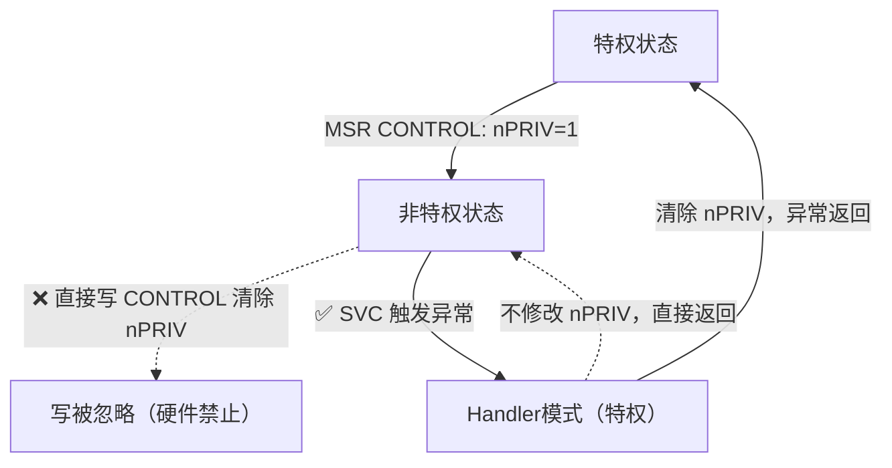

**为什么不能自己提权？** 如果非特权代码能自己把 nPRIV 清零，那"非特权"就形同虚设——病毒/故障代码一条 `MSR` 就拿到管理员权限了。**权限提升必须经过"硬件控制的异常路径"**，异常入口是唯一合法的"提权门"，这是所有现代 CPU 的共同安全设计。

### 4.3 异常/中断进出时模式的变化（压栈帧与 EXC_RETURN）

**异常进入**时，硬件自动完成：


**压栈帧结构（异常帧，共 8 个字 = 32 字节）**：

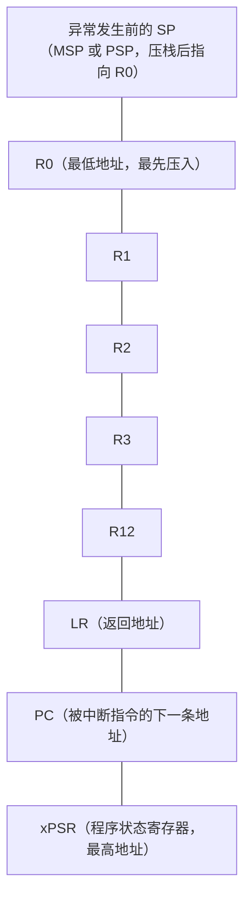

> 压栈方向是**地址向下增长**（高地址往低地址压）。偏移对应：`R0=+0, R1=+4, R2=+8, R3=+12, R12=+16, LR=+20, PC=+24, xPSR=+28`。这个布局在 SVC/上下文切换代码里经常用到（下文代码会用到 `+24` 取 PC）。

**异常返回 EXC_RETURN**：Handler 模式里 LR 被硬件写成一个特殊值，函数用 `BX LR` 返回时 CPU 根据它决定去向：

| EXC_RETURN | 含义 |
|---|---|
| `0xFFFFFFF9` | 返回 **Thread 模式**，用 **MSP** |
| `0xFFFFFFFD` | 返回 **Thread 模式**，用 **PSP** |
| `0xFFFFFFF1` | 返回 **Handler 模式**，用 MSP（嵌套中断返回用） |
| `0xFFFFFFE1` | （M23/M33）返回 Handler 模式，Secure 状态 |

> **设计思路**：一个 LR 值同时编码了"模式 + 栈 + 安全态"三个信息，硬件用一个值就完成了返回路线的完整描述，省去在异常处理里查询状态的麻烦。

**SVC 软中断完整时序**：

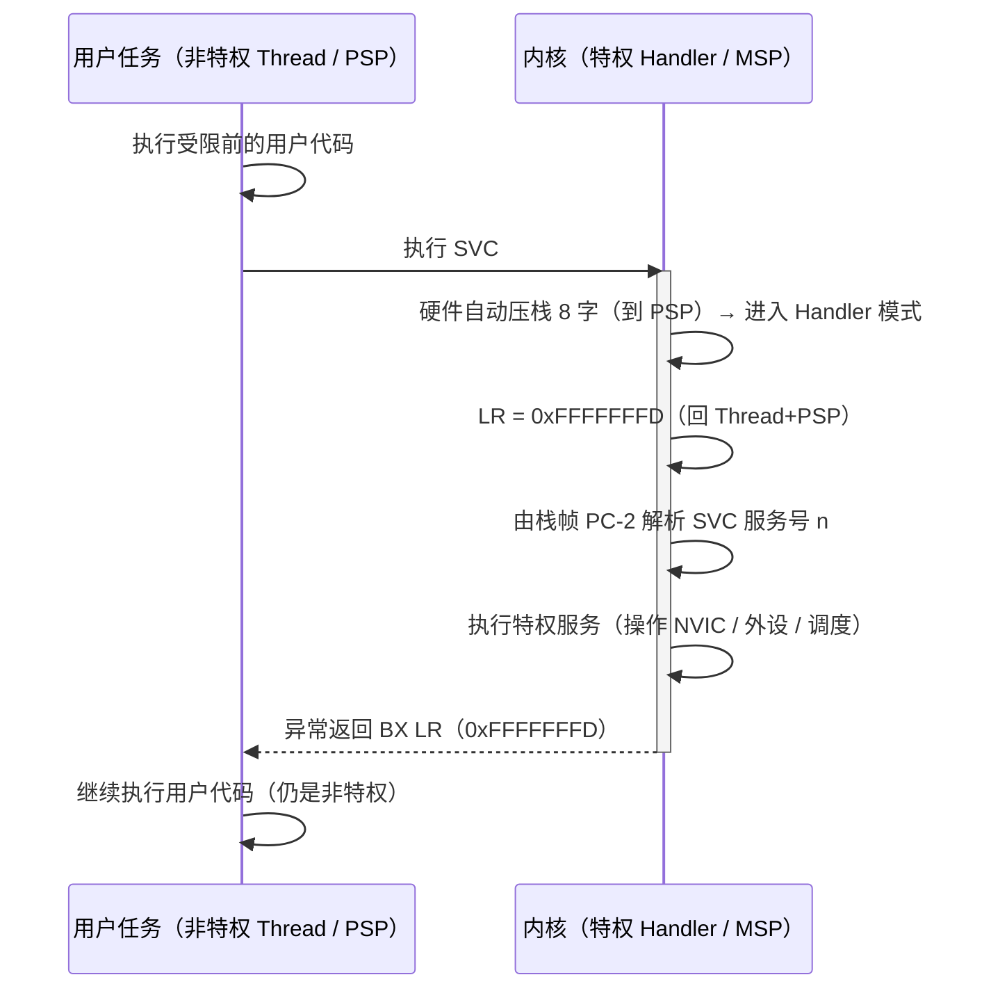

### 4.4 非特权模式下的受限清单

| 操作 | 特权 | 非特权 | 说明 |
|---|---|---|---|
| 读写普通内存 / 普通外设寄存器 | ✅ | ✅ | **无 MPU 时外设随便访问** |
| `MRS/MSR` 访问 CONTROL、PSP、PRIMASK、BASEPRI、FAULTMASK | ✅ | 部分 | 允许读；写 CONTROL 时 **nPRIV 清除无效**；可写 PRIMASK/BASEPRI 等（任务可屏蔽自己的中断） |
| `MSR MSP`（写主栈指针） | ✅ | ❌ 触发故障 | 非特权不能碰内核栈 |
| `MRS MSP`（线程模式读主栈） | 读到真值 | **返回 0** | 防止窃取内核栈地址 |
| 访问 NVIC 配置寄存器 | ✅ | ❌ 触发故障 | 如 ISER/ICER/优先级寄存器 |
| 访问 SysTick 寄存器 | ✅ | ❌ 触发故障 | 任务无法自己用 SysTick |
| 访问 SCB/MPU 配置 | ✅ | ❌ 触发故障 | 系统控制空间 |
| `CPSID/CPSIE I/F`（关/开中断） | ✅ | **被忽略** | 非特权无法用 CPS 改中断屏蔽 |
| `SVC`（申请进内核） | ✅ | ✅ | 唯一合法提权通道 |
| 执行 `BX LR` 做异常返回 | ✅ | ❌ | 返回只能在 Handler 模式执行 |
| 位带操作（Bit-Band） | ✅ | ✅ | 位带区是普通内存别名，非特权可用 |

> **通俗解释表中最后一格**：非特权**防的是"核心操作"，不是"普通内存"**。想让外设也被保护 → 上 MPU（见 4.6）。

### 4.5 栈指针选择与 OS 的典型布置

**典型 RTOS（如 FreeRTOS）布置**：

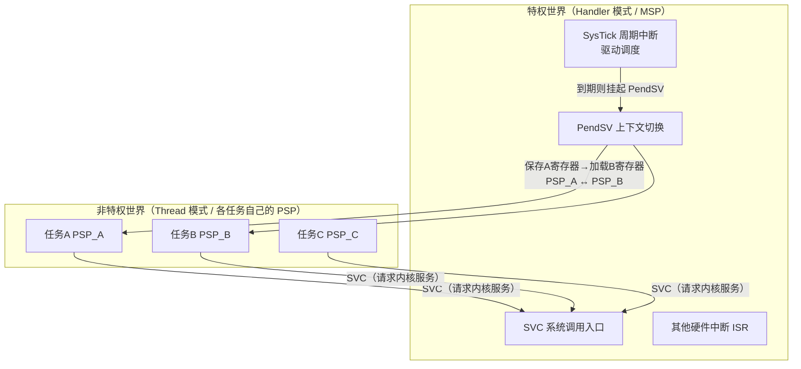

**为什么中断一定要用 MSP？** 因为中断**可以嵌套**——高级别中断可以打断低级别中断。如果中断用 PSP，嵌套时每个中断都要切换 PSP，开销大且容易出错。而 Handler 模式**统一用 MSP**，嵌套中断只是"在 MSP 上继续压栈"，由硬件保证栈安全。这就是"MSP 归内核、PSP 归任务"的原因。

**PendSV 为什么用"挂起"而不是直接切换？** PendSV 被设计为**可等待（pendable）**：当一个 ISR 正在运行时触发了调度需求，PendSV 先被"挂起登记"，等**所有更高优先级 ISR 都执行完**才真正做上下文切换。这保证了**上下文切换不会被运行中的中断打断**，是经典的"延迟切换"设计模式。

### 4.6 MPU：把"指令级隔离"升级为"内存级隔离"

MPU 把内存空间划分成最多 8 个区域（M3/M4/M7），每个区域配置：

- **基地址 + 大小**（对齐要求）
- **访问权限**（如：仅特权、特权读写/用户只读、完全访问、禁止访问……）
- **可执行属性**（XN：禁止执行）
- **共享/缓存属性**

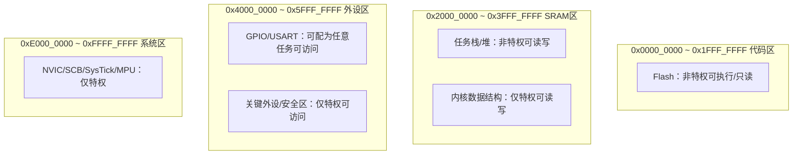

**模式与 MPU 的分工**：
- **模式**管"指令 + 特殊寄存器"——硬件自动，0 配置；
- **MPU** 管"内存/外设"——需要软件按场景配置；
- 两者叠加后：非特权代码即使通过**普通内存**去踩关键外设/内核数据，也会被 MPU 拦截并触发故障。

> **设计思路**：MPU 是"内存版的特权检查"。它是纯硬件行为，**不可被软件绕过**，因此被广泛用于安全关键系统里实现"任务隔离"和"栈保护"（防止栈溢出破坏相邻数据）。

### 4.7 Cortex-M 内核差异（M0/M0+ / M3/M4/M7 / M23/M33）

| 特性 | M0 / M0+ | M3 / M4 / M7 | M23 / M33 |
|---|---|---|---|
| 非特权模式（nPRIV） | ✅ | ✅ | ✅ |
| MSP / PSP 双栈 | ✅ | ✅ | ✅ |
| SVC 软中断 | ✅ | ✅ | ✅ |
| BASEPRI（部分屏蔽） | ❌ | ✅ | ✅（M33） |
| 可配置故障（BusFault/USG/MeM） | ❌（统一 HardFault） | ✅ | ✅ |
| MPU | M0+ 可选 | M3/M4 可选，M7 标准 | 标配 |
| TrustZone（安全态） | ❌ | ❌ | ✅（M23/M33） |
| FPU | ❌ | M4/M7 有 | M33 可选 |

**M23/M33 的 TrustZone 扩展**：在"特权/非特权"之上再叠加"Secure/Non-Secure"两个安全态，形成 **2×2 四种组合**：

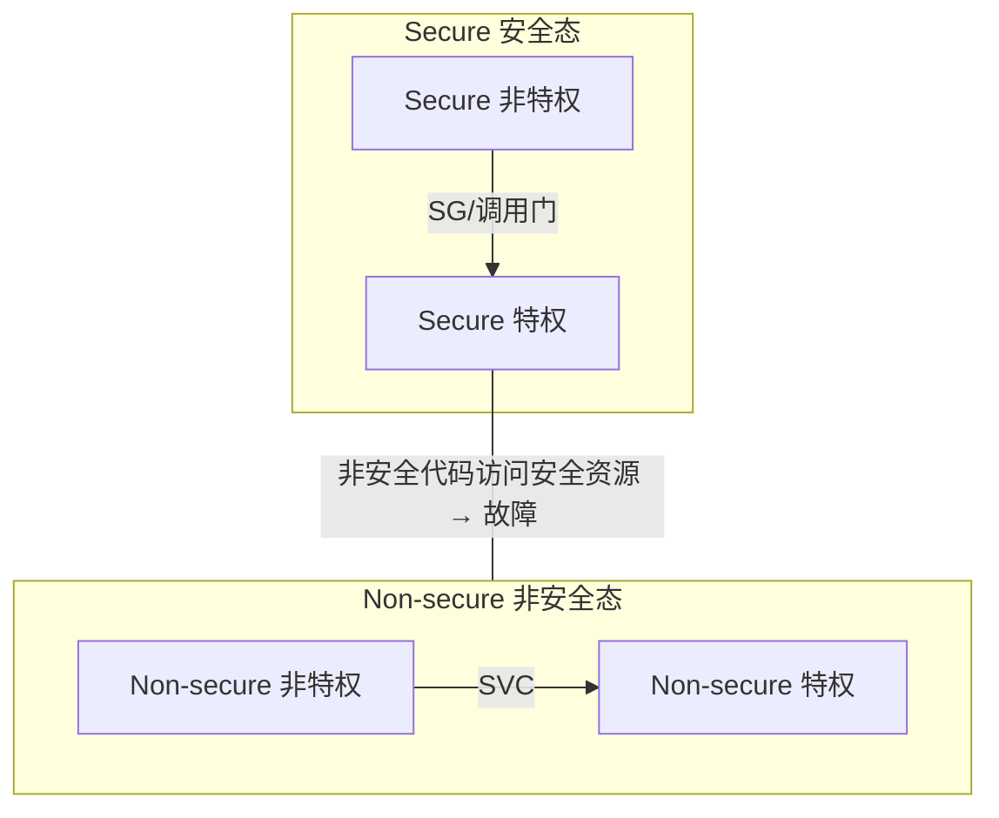

> 通俗理解：TrustZone 相当于在"管理员/业主"之上再加"独立机房/公共区域"的楼层分隔。普通 STM32（F0/F1/F2/F3/F4/F7 等）没有 TrustZone，只有特权/非特权两级。

---

## 5. 代码实战：寄存器 / 标准库 / HAL 三版本

> 本节演示统一目标流程：
> **① 特权初始化 → ② 设置 PSP → ③ 进入非特权 → ④ 用户代码触发 SVC 请求特权服务 → ⑤（可选）MPU 内存保护**
>
> 三个版本实现**完全相同的功能**，只是 API 风格不同。

### 5.1 版本一：直接寄存器操作（内联汇编 + 裸寄存器地址）

```c
/**
 * ============================================================================
 * Cortex-M 特权/用户模式演示 —— 版本一：直接寄存器操作
 * 目标芯片：STM32F103（Cortex-M3），逻辑同样适用于 STM32F407（Cortex-M4）
 * 说明：所有特殊寄存器用 MRS/MSR 内联汇编，系统控制寄存器直接写地址
 * ============================================================================
 */
#include <stdint.h>

/* ---------- ① 切换到用户（非特权）线程模式 ---------- */
void enter_user_mode(void)
{
    uint32_t control;

    /* CONTROL 是特殊寄存器，只能通过 MRS/MSR 指令访问（非内存映射） */
    __asm volatile("MRS %0, CONTROL" : "=r"(control));   /* 读出当前值 */
    control |= (1u << 0);                                /* 置 bit0 nPRIV=1 → 非特权 */
    __asm volatile("MSR CONTROL, %0" ::"r"(control));    /* 写回（必须特权下执行） */
    __asm volatile("ISB");                               /* 指令同步屏障，确保立即生效 */
}

/* ---------- ② 用户代码发起系统调用（SVC 软中断） ---------- */
void svc_call(uint8_t service_no)
{
    /* SVC 是 2 字节 Thumb 指令，立即数 8bit。
     * 这里仅触发异常；服务号通过压栈帧中的 PC-2 处指令解析（见 SVC_Handler） */
    (void)service_no;
    __asm volatile("SVC #0" ::: "memory");
}

/* ---------- ③ SVCall 异常处理：特权内核入口 ---------- */
void SVC_Handler(void)
{
    uint32_t frame_sp;      /* 异常帧指针（指向压栈的 R0） */
    uint32_t svc_no;

    /* 步骤A：判断异常前用的是 MSP 还是 PSP（看 LR/EXC_RETURN 的 bit2） */
    __asm volatile(
        "TST  LR, #4          \n"  /* 测试 EXC_RETURN bit2 */
        "ITE  EQ              \n"  /* 若 bit2=0 → 用 MSP；否则用 PSP */
        "MRSEQ %0, MSP        \n"
        "MRSNE %0, PSP        \n"
        : "=r"(frame_sp)
        :
        : "cc", "memory"
    );

    /* 步骤B：解析服务号。压栈帧 PC 在偏移 +24（第7个字），
     *        SVC 指令地址 = PC-2，其立即数在低 8 位 */
    svc_no = *(volatile uint8_t *)((*(volatile uint32_t *)(frame_sp + 24)) - 2);

    /* 步骤C：在内核中按服务号执行特权操作 */
    switch (svc_no) {
    case 0x01:                                   /* 服务1：使能 EXTI0 中断 */
        *(volatile uint32_t *)0xE000E100 = 1u;   /* NVIC->ISER0（特权区）直接写地址 */
        break;
    default:
        break;
    }
}

/* ---------- ④ 设置任务栈 PSP（OS：任务用 PSP，内核用 MSP） ---------- */
void set_psp(uint32_t stack_top)
{
    __asm volatile("MSR PSP, %0" ::"r"(stack_top));   /* 写进程栈指针 */
    uint32_t control;
    __asm volatile("MRS %0, CONTROL" : "=r"(control));
    control |= (1u << 1);                             /* bit1 SPSEL=1 → Thread用PSP */
    __asm volatile("MSR CONTROL, %0" ::"r"(control));
    __asm volatile("ISB");
}

/* ---------- ⑤ 主流程 ---------- */
int main(void)
{
    /* 复位后状态：Thread模式 + 特权 + MSP（Reset_Handler 也在此状态） */

    /* 特权初始化：把 SVC 异常优先级设为 0（最高），SHPR2 地址 0xE000ED1C */
    *(volatile uint32_t *)0xE000ED1C = 0u;            /* SVCall 优先级 = 0 */

    /* 准备任务栈，切换 Thread 模式用 PSP */
    static uint32_t task_stack[128];
    set_psp((uint32_t)&task_stack[127]);             /* 指向栈顶（满栈向下生长） */

    /* 进入非特权模式 ↓↓↓ 以下代码运行在受限环境 */
    enter_user_mode();

    /* 【演示受限】直接访问 NVIC 会被硬件拦截 → 触发 HardFault！
     * 取消下面注释即可观察：
     * *(volatile uint32_t *)0xE000E100 = 1u;         // ❌ 非特权写 NVIC 触发故障
     */

    /* 【正确做法】通过 SVC 请求特权服务：使能 EXTI0 中断 */
    svc_call(0x01);

    while (1) {
        /* 用户任务逻辑（非特权运行） */
    }
}
```

**关键点注释**：
- 压栈帧偏移 `+24` 取 PC 的用法，直接对应 [4.3 节压栈帧结构图](#43-异常中断进出时模式的变化压栈帧与-exc_return)；
- `TST LR, #4` + `ITE EQ` + 条件 `MRS` 是判断异常帧位置的**标准惯用法**；
- 真实 RTOS 的 `SVC_Handler` 通常用**纯汇编**编写（`__attribute__((naked))`），避免编译器干扰寄存器现场，这里为可读性用 C 实现。

### 5.2 版本二：STM32 标准外设库 + CMSIS

```c
/**
 * ============================================================================
 * Cortex-M 特权/用户模式演示 —— 版本二：标准外设库（SPL）+ CMSIS
 * 目标：STM32F103 标准外设库 v3.5
 * 说明：特殊寄存器操作使用 CMSIS 提供的封装函数（core_cm3.h）
 * ============================================================================
 */
#include "stm32f10x.h"          /* 同时引入 CMSIS 与标准外设库 */

/* ---------- ① 切换到用户模式（CMSIS 函数） ---------- */
void enter_user_mode(void)
{
    uint32_t control = __get_CONTROL();            /* CMSIS：读 CONTROL */
    __set_CONTROL(control | CONTROL_nPRIV_Msk);    /* 置 nPRIV=1（宏在 core_cm3.h） */
    __ISB();                                       /* 指令同步屏障 */
}

/* ---------- ② SVC 系统调用 ---------- */
void svc_call(void)
{
    __ASM volatile("SVC #0");                      /* 触发 SVCall 异常 */
}

/* ---------- ③ SVC_Handler：仍用内联汇编判断帧位置（CMSIS 无此API） ---------- */
void SVC_Handler(void)
{
    uint32_t frame_sp;
    uint32_t svc_no;

    __asm volatile(
        "TST  LR, #4          \n"
        "ITE  EQ              \n"
        "MRSEQ %0, MSP        \n"
        "MRSNE %0, PSP        \n"
        : "=r"(frame_sp) : : "cc", "memory"
    );

    svc_no = *(volatile uint8_t *)((*(volatile uint32_t *)(frame_sp + 24)) - 2);

    switch (svc_no) {
    case 0x01:
        NVIC->ISER[0] = (1UL << 0);                /* CMSIS 寄存器结构体写法 */
        break;
    default:
        break;
    }
}

/* ---------- ④ 设置 PSP ---------- */
void set_psp(uint32_t stack_top)
{
    __set_PSP(stack_top);                                        /* CMSIS：写 PSP */
    __set_CONTROL(__get_CONTROL() | CONTROL_SPSEL_Msk);         /* Thread 用 PSP */
    __ISB();
}

/* ---------- ⑤ 主流程（标准外设库风格） ---------- */
int main(void)
{
    /* 标准外设库：中断优先级分组 */
    NVIC_PriorityGroupConfig(NVIC_PriorityGroup_4);   /* 全部4位用于抢占优先级 */

    /* 设置 SVC 异常优先级（标准外设库没有此API，用 CMSIS 函数） */
    NVIC_SetPriority(SVCall_IRQn, 0);

    static uint32_t task_stack[128];
    set_psp((uint32_t)&task_stack[127]);

    enter_user_mode();            /* ↓↓↓ 非特权 ↓↓↓ */
    svc_call();

    while (1) { }
}
```

> **版本差异说明**：标准库版本与寄存器版本功能完全等价，区别在于用 CMSIS 封装函数 `__get_CONTROL` / `__set_CONTROL` / `__set_PSP` / `NVIC_SetPriority` 替代了裸汇编和裸地址——代码更安全、可移植性更好，但底层行为一模一样。SVC 帧定位这类"脏活"没有现成 API，仍需保留内联汇编。

### 5.3 版本三：STM32 HAL 库 + CMSIS（含 MPU 配置）

```c
/**
 * ============================================================================
 * Cortex-M 特权/用户模式演示 —— 版本三：HAL 库 + CMSIS（含 MPU 内存保护）
 * 目标：STM32F407（HAL 库）
 * 说明：HAL 侧重外设抽象；模式/栈切换仍用 CMSIS；MPU 用 HAL_MPU_* API
 * ============================================================================
 */
#include "stm32f4xx_hal.h"

/* ---------- ① 切换到用户模式（CMSIS 函数，与版本二相同） ---------- */
void enter_user_mode(void)
{
    uint32_t control = __get_CONTROL();
    __set_CONTROL(control | CONTROL_nPRIV_Msk);
    __ISB();
}

/* ---------- ② SVC 系统调用 ---------- */
void svc_call(void)
{
    __ASM volatile("SVC #0");
}

/* ---------- ③ SVC_Handler（帧定位逻辑同上） ---------- */
void SVC_Handler(void)
{
    uint32_t frame_sp;
    uint32_t svc_no;

    __asm volatile(
        "TST  LR, #4          \n"
        "ITE  EQ              \n"
        "MRSEQ %0, MSP        \n"
        "MRSNE %0, PSP        \n"
        : "=r"(frame_sp) : : "cc", "memory"
    );
    svc_no = *(volatile uint8_t *)((*(volatile uint32_t *)(frame_sp + 24)) - 2);

    switch (svc_no) {
    case 0x01:
        NVIC->ISER[0] = (1UL << 0);
        break;
    default:
        break;
    }
}

/* ---------- ④ 设置 PSP ---------- */
void set_psp(uint32_t stack_top)
{
    __set_PSP(stack_top);
    __set_CONTROL(__get_CONTROL() | CONTROL_SPSEL_Msk);
    __ISB();
}

/* ---------- ⑤ MPU：把保护从“指令级”升级到“内存级” ---------- */
void mpu_init(void)
{
    MPU_Region_InitTypeDef mpu;        /* HAL 定义的 MPU 区域结构体 */

    HAL_MPU_Disable();                 /* 配置前必须先关 MPU */

    /* 区域0：SRAM 前 32KB（0x20000000）→ 任务栈/堆，非特权可读写 */
    mpu.Enable           = MPU_REGION_ENABLE;
    mpu.Number           = MPU_REGION_NUMBER0;
    mpu.BaseAddress      = 0x20000000UL;
    mpu.Size             = MPU_REGION_SIZE_32KB;
    mpu.SubRegionDisable = 0x00;
    mpu.TypeExtField     = MPU_TEX_LEVEL0;
    mpu.AccessPermission = MPU_REGION_FULL_ACCESS;   /* 特权+非特权都可访问 */
    mpu.DisableExec      = MPU_INSTRUCTION_ACCESS_ENABLE;
    mpu.IsShareable      = MPU_ACCESS_NOT_SHAREABLE;
    mpu.IsCacheable      = MPU_ACCESS_NOT_CACHEABLE;
    mpu.IsBufferable     = MPU_ACCESS_NOT_BUFFERABLE;
    HAL_MPU_ConfigRegion(&mpu);

    /* 启用 MPU：未显式配置的区域，默认仅特权可访问。
     * 启用后，非特权代码访问未配置区域 → 触发 MemoryManagement Fault */
    HAL_MPU_Enable(MPU_PRIVILEGED_DEFAULT);
}

/* ---------- ⑥ 主流程（HAL 风格） ---------- */
int main(void)
{
    HAL_Init();                                   /* HAL 初始化（含 SysTick 配置） */
    HAL_NVIC_SetPriority(SVCall_IRQn, 0, 0);      /* HAL：设 SVC 优先级 */
    mpu_init();                                   /* 开启内存级保护（可选） */

    static uint32_t task_stack[128];
    set_psp((uint32_t)&task_stack[127]);

    enter_user_mode();            /* ↓↓↓ 非特权 ↓↓↓ */
    svc_call();

    while (1) { }
}
```

> **版本差异说明**：HAL 版本的主要增量是 **MPU 配置**——`HAL_MPU_Disable / HAL_MPU_ConfigRegion / HAL_MPU_Enable` 把 [4.6 节](#46-mpu把指令级隔离升级为内存级隔离) 的内存保护落实为代码。模式/栈切换部分 HAL 并没有更高级的抽象，仍走 CMSIS 函数（这是内核层面的事，不属于外设库范畴）。

---

## 6. 三种版本对比与选型建议

| 对比项 | 版本一（寄存器） | 版本二（标准库） | 版本三（HAL） |
|---|---|---|---|
| 可读性 | 较低（汇编多） | 中 | 高 |
| 可移植性 | 依赖编译器汇编 | CMSIS 封装，跨厂商好 | 最佳 |
| 对机制的理解 | 最透彻（看得到每个寄存器） | 好 | 一般（被封装） |
| MPU 支持 | 手写寄存器 | 部分（可用 CMSIS） | 最方便（专用 API） |
| 适合场景 | 学习内核、OS 移植、深度调试 | 老项目、资源受限 | 新项目、快速开发、安全项目 |

**选型建议**：
- 想**搞懂原理 / 移植 RTOS** → 选版本一，把 [4.2](#42-模式切换的完整规则谁可以切谁) 的规则亲手验证一遍；
- 老产品（F1/F4 标准库存量代码）→ 版本二；
- 新项目 / 需要 MPU 保护 / 功能安全 → 版本三（HAL 的 MPU 封装最省心）。

---

## 7. 附录：常见问题与调试技巧

### 7.1 为什么上电默认是特权模式？
因为复位向量、启动代码（`SystemInit`、`.data/.bss` 初始化）都需要全权限。操作系统通常在设计时就约定：**启动阶段保持特权，任务启动后逐个降级为非特权**。

### 7.2 用户模式能直接点灯（操作 GPIO）吗？
**能**。GPIO 是普通内存地址，无 MPU 时非特权可访问。只有用 MPU 把外设区标成"仅特权"后，非特权访问才会故障。所以"非特权"不等于"碰不了外设"。

### 7.3 用户模式能用 SysTick 吗？
**不能直接访问** SysTick 寄存器（会触发故障）。正确做法是：SysTick 中断由特权内核处理，需要延迟/计时的任务通过 **SVC** 请求内核服务，或由内核统一调度。

### 7.4 中断嵌套时用哪个栈？
**全部用 MSP**。Handler 模式强制 MSP，硬件压栈机制天然支持嵌套，不需要软件干预。

### 7.5 如何从用户模式安全地"升级"回特权？
**唯一途径**：`SVC`（或任何异常）→ Handler 模式（特权）→ 在异常处理中清除 nPRIV → 异常返回。绝不可以在用户代码里直接写 CONTROL 清零 nPRIV（写会被忽略）。

### 7.6 非特权代码崩溃了（HardFault）怎么定位？

在 `HardFault_Handler` 里读取异常帧并解析出错指令地址：

```c
void HardFault_Handler(void)
{
    volatile uint32_t *frame;
    uint32_t sp;

    /* 通过 EXC_RETURN 判断压栈帧在 MSP 还是 PSP */
    __asm volatile(
        "TST LR, #4          \n"
        "ITE EQ              \n"
        "MRSEQ %0, MSP       \n"
        "MRSNE %0, PSP       \n"
        : "=r"(sp) : : "cc", "memory"
    );
    frame = (volatile uint32_t *)sp;

    /* frame[0..3]=R0..R3, frame[4]=R12, frame[5]=LR, frame[6]=PC, frame[7]=xPSR */
    volatile uint32_t fault_pc = frame[6];   /* 出错的指令地址（放调试器/日志里看） */
    volatile uint32_t fault_psr = frame[7];

    for (;;) { }   /* 停下来，断点在这里观察 */
}
```

> 拿到 `fault_pc` 后，在调试器中找到该地址对应的源码行即可定位是哪个任务、哪条指令越权。

### 7.7 位带操作在用户模式下能用吗？
**能**。位带区（Bit-Band）本质是普通内存的地址别名，属于"普通内存访问"，非特权下不限制。若配合 MPU 将位带区标为特权，才会受限。

### 7.8 M0/M0+ 与 M3/M4 处理故障有什么不同？
M0/M0+ 只有 **HardFault**（没有独立的 BusFault / UsageFault / MemManage Fault），任何违规最终都汇入 HardFault，定位手段少一些。M3/M4/M7 有四个可配置故障且各带状态寄存器，定位更精细。

### 7.9 如何确认当前运行在特权还是非特权？
执行 `MRS CONTROL`，读 bit0（nPRIV）：0 = 特权，1 = 非特权。也可以看线程模式下的 `MRS PSP`——非特权读 MSP 返回 0 也能辅助判断。

---

## 附：本文核心速查表

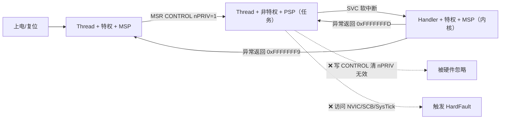

> **一句话总结**：Cortex-M 用「Thread/Handler 模式 × 特权/非特权等级 × MSP/PSP 双栈」三个维度搭建了完整的权限体系；非特权代码靠 SVC 软中断这唯一的"门"请求特权服务；想保护外设内存再叠加 MPU。这套机制是 RTOS 稳定性与安全关键软件的基础，也是嵌入式开发者从"跑通代码"走向"系统架构"的必经之路。
