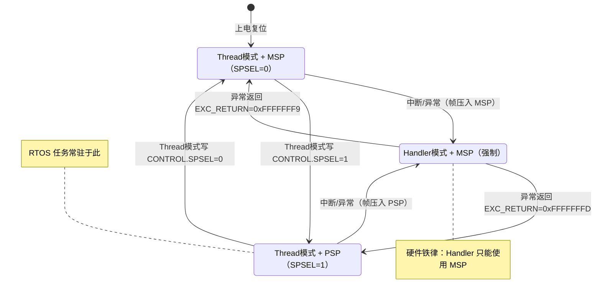
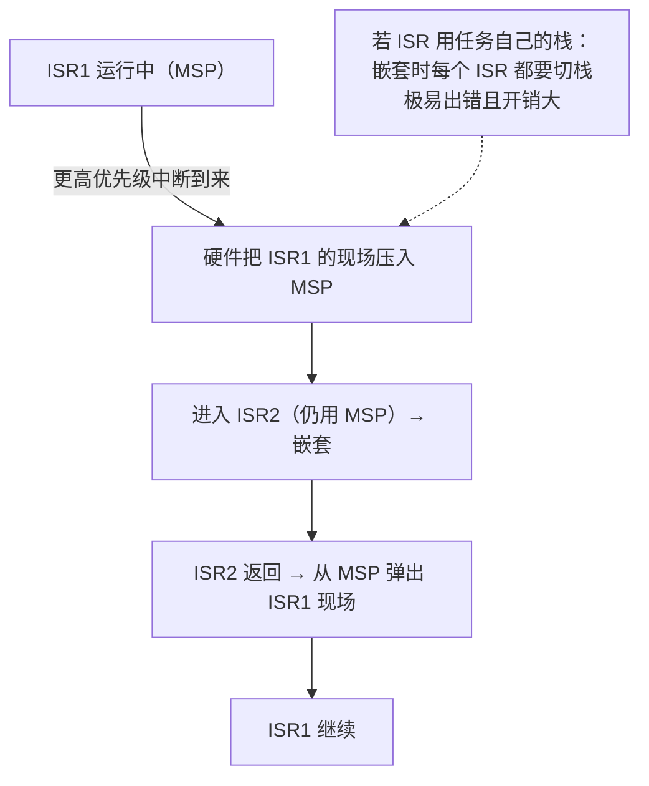
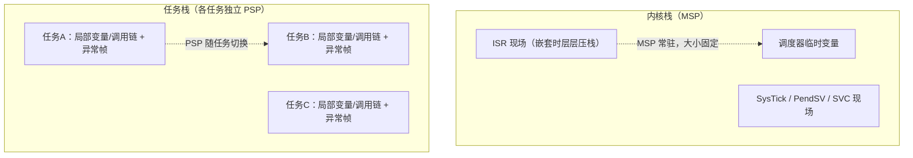
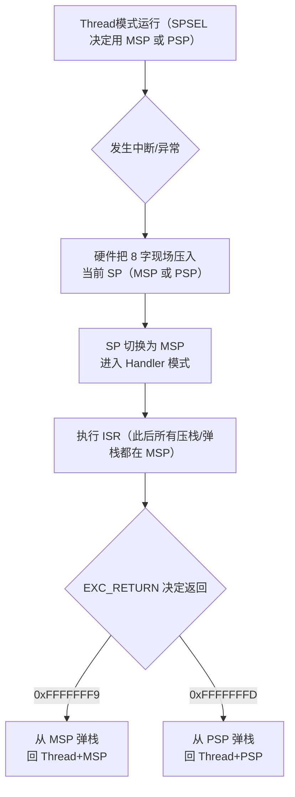
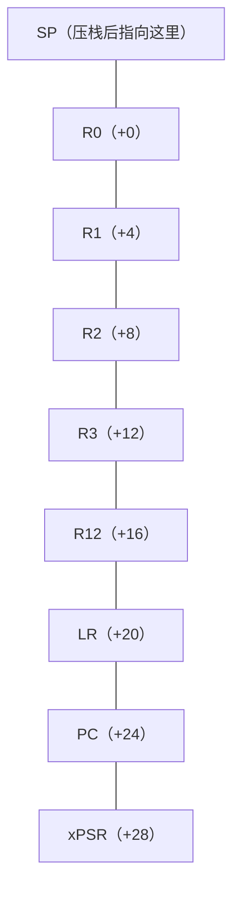
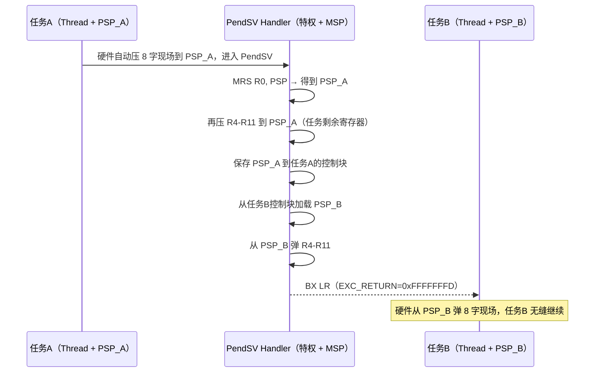
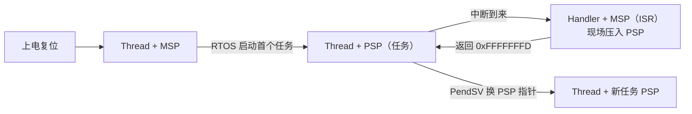

# STM32 双栈详解：MSP 与 PSP

> 适用芯片：STM32 全系列（Cortex-M0/M0+/M3/M4/M7/M23/M33）
> 本文不涉及任何 AUTOSAR 内容，聚焦 Cortex-M 内核的双栈机制。
> 关联阅读：[Cortex-M特权模式与用户模式详解](./Cortex-M特权模式与用户模式详解.md)

---

## 目录

- [1. 通俗易懂：什么是栈，为什么要两个](#1-通俗易懂什么是栈为什么要两个)
- [2. 基础概念：MSP / PSP / SPSEL 身份表](#2-基础概念msp--psp--spsel-身份表)
- [3. 设计思路：双栈解决了什么问题](#3-设计思路双栈解决了什么问题)
- [4. 深入原理](#4-深入原理)
- [5. 代码实战：寄存器 / 标准库 / HAL 三版本](#5-代码实战寄存器--标准库--hal-三版本)
- [6. 对比总结](#6-对比总结)
- [7. 附录：常见问题](#7-附录常见问题)

---

## 1. 通俗易懂：什么是栈，为什么要两个

**打个比方**：公司办公室里有两种桌子。

- **公共应急桌（MSP，主栈）**：放公司最核心的资料，平时归"应急小组"用。系统一发生**中断（突发事件）**，CPU 立刻换到这张桌子处理，任何人都不能乱动它。
- **员工个人桌（PSP，进程栈）**：每个**员工（任务/进程）**各有一张自己的桌子。任务干活时用自己那张，桌子和桌子之间互不干扰。

**为什么要有栈？** 因为 CPU 的函数调用需要"记位置"——函数 A 调用函数 B，得把返回地址、局部变量、现场保存下来，B 结束后再跳回去。这个"记位置的临时空间"就是栈，用后进先出（LIFO）的方式管理，地址从高往低长（**满递减栈**）。


**一个很多人没注意的事实**：普通裸机程序**全程只用 MSP**，PSP 从来没用过——因为裸机只有一个"员工"（主程序），不需要给每人配桌子。**只有引入 RTOS 多任务（每个任务独立栈）或安全关键设计时，PSP 才有意义。**

**核心答案一句话**：
- **MSP** = 中断/异常处理器专用栈（内核栈），Handler 模式**必须**用它；
- **PSP** = 任务/线程专用栈（进程栈），RTOS 里每个任务一个；
- 线程模式用哪个栈，由 **CONTROL.SPSEL** 位决定（0→MSP，1→PSP）。

---

## 2. 基础概念：MSP / PSP / SPSEL 身份表

### 2.1 两个栈指针寄存器

| 项目 | MSP（Main Stack Pointer） | PSP（Process Stack Pointer） |
|---|---|---|
| 中文名 | 主栈指针 | 进程栈指针 |
| Handler 模式 | **必须使用** | **不允许** |
| Thread 模式 | 默认使用（SPSEL=0） | 可选使用（SPSEL=1） |
| 复位后 | 使用（值来自向量表首项） | 不用（复位为 0） |
| 中断压栈压到哪 | 取决于中断前用的哪个 | 取决于中断前用的哪个 |
| 非特权代码能写吗 | ❌ 写触发故障 | ✅ 可以 |
| 非特权代码读 | 返回 0 | ✅ 可以 |
| 典型用途 | 中断嵌套、RTOS 内核栈 | RTOS 任务栈 |

> **通俗理解**：MSP 是"公共应急桌"，谁都不能碰；PSP 是"员工个人桌"，员工自己随便用。所以非特权任务能操作自己的 PSP，但碰不了系统的 MSP——这是双栈带来的**内核栈安全**。

### 2.2 到底什么时候用哪个栈（选择规则）



**图释**：
- **复位** → Thread 模式 + MSP，`CONTROL=0`；
- Thread 模式下软件可自由切 SPSEL（0↔1）；
- 一旦进入 Handler 模式（中断），**SP 强制切换为 MSP**，与之前用哪个栈无关；
- **中断压栈的栈**由"进入中断前"的 SP 决定（任务被中断 → 压到 PSP；ISR 被嵌套 → 压到 MSP）；
- **异常返回的栈**由 `EXC_RETURN` 决定（0xFFFFFFF9→MSP，0xFFFFFFFD→PSP）。

### 2.3 CONTROL.SPSEL 位

`CONTROL` 寄存器 bit1 = **SPSEL**：

| SPSEL | 线程模式用栈 |
|---|---|
| 0 | MSP（默认） |
| 1 | PSP |

> 注意：SPSEL **只在 Thread 模式有意义**；Handler 模式恒用 MSP，写 SPSEL 对当前 ISR 无影响。想让线程在异常返回后改用 PSP，靠的是 `EXC_RETURN[2]`（见 [4.3](#43-exc_return-与栈的对应)）。

---

## 3. 设计思路：双栈解决了什么问题

> **通俗理解**：单栈像"一张桌子所有员工共用"——一个人打翻水杯，别人的文件全湿了。双栈让"应急小组"和"普通员工"各用各的桌子，谁出事都不连累对方。

### 3.1 四个核心问题，双栈一一解决

| 问题 | 单栈（只用 MSP）的后果 | 双栈的解法 |
|---|---|---|
| **ISR 栈安全** | ISR 用任务的栈，任务栈快满时一个中断就栈溢出 | ISR 固定在独立的 MSP 上，大小可控、可预测 |
| **任务栈隔离** | 一个任务栈溢出会踩坏其他任务/ISR 的数据 | 每任务一个 PSP，栈空间物理隔离 |
| **切换效率** | 切换任务要保存大段内核现场 | 切 PSP 指针 + 保存寄存器即可，上下文最小化 |
| **内核数据保护** | 任务能碰内核栈（安全风险） | 非特权任务只能碰自己的 PSP，够不到 MSP |

### 3.2 为什么 Handler 模式必须用 MSP（嵌套中断是关键）

**这是双栈设计里最精妙的一点**。中断可以**嵌套**：ISR1 执行中，更高优先级的 ISR2 到来，ISR2 会打断 ISR1。



**设计推理**：嵌套中断本质上是"同一张公共桌上层层叠文件"。如果每个 ISR 都跑到不同任务的 PSP 上，那么嵌套返回时必须不断切换 PSP，现场管理极其复杂，一旦出错整个栈就乱了。**让所有 ISR 统一固定在 MSP 上，硬件压栈/弹栈机制自动保证嵌套正确，软件零负担**——这是"把复杂留给硬件，把简单留给软件"的典型设计。

### 3.3 双栈在 RTOS 中的经典布局



> **通俗理解**：MSP 是"公司公共楼层"，小而固定；PSP 是"每个员工的私人工位"，一人一个，切换任务＝换个工位。

### 3.4 裸机（无 OS）什么时候需要 PSP？

多数裸机项目永远用不到 PSP，但有几个例外场景值得知道：

1. **ISR 栈保护**：把主循环切到 PSP，MSP 只留给 ISR——这样主循环栈溢出时**不会连累中断**（中断是安全关键，必须能响应）；
2. **特权/用户隔离**：结合上一份文档，让任务跑在非特权 + PSP，内核跑在特权 + MSP；
3. **单元测试/引导程序**：想用独立栈跑某段临时逻辑时。

---

## 4. 深入原理

### 4.1 异常进出时 SP 的选择完整过程



**关键点**：
- **压栈用哪个栈** = 中断发生那一刻"SP 当前的值"（硬件动作，无需软件参与）；
- **ISR 运行时用哪个栈** = 永远是 MSP；
- **返回用哪个栈** = EXC_RETURN，跟"压到哪"天然配对（从 PSP 被中断 → 返回也弹 PSP）。

### 4.2 压栈/出栈细节：8 字帧与 8 字节对齐

**异常自动压栈的 8 个字**（顺序固定）：



**8 字节对齐（AAPCS 规则）**：C 语言要求函数入口 SP 按 8 字节对齐（浮点参数传递依赖）。若异常发生时 SP 未对齐，且 `SCB->CCR.STKALIGN=1`（默认），硬件会**多压 4 字节**使栈帧 8 字节对齐，并把 `xPSR[9]` 置 1 记录"有对齐修正"，返回时再恢复。**这就是为什么栈帧偶尔比 32 字节多 4 字节**。

> **设计思路**：栈对齐由硬件在异常入口统一保证——省去每个 ISR 手动对齐的重复劳动，也避免因对齐错误导致浮点参数传错位。

**M4/M7 的 FPU 扩展**：若中断前任务正在用 FPU（`CONTROL.FPCA=1` 或 FPCCR 配置），异常压栈会在 8 字帧之上**再压 FPU 寄存器（S16-S31 或 S0-S15 等，16~26 个字）**，栈帧变大。这也是为什么带浮点的 RTOS 任务栈要留够余量。

### 4.3 EXC_RETURN 与栈的对应

| EXC_RETURN | 返回去向 | 从哪个栈弹帧 |
|---|---|---|
| `0xFFFFFFF9` | Thread 模式 | **MSP** |
| `0xFFFFFFFD` | Thread 模式 | **PSP** |
| `0xFFFFFFF1` | Handler 模式（嵌套返回） | MSP |
| `0xFFFFFFE1` | Handler 模式（M23/M33 Secure） | MSP |

> **设计思路**：EXC_RETURN 用**一个值同时编码「模式 + 栈 + 安全态」**。CPU 看到它就知道"该弹哪张桌子的文件"，比让软件传两个参数更省、更不易错。这就是为什么 Handler 里的 `LR` 不是普通地址而是特殊编码——**它是返回路线的完整描述**。

### 4.4 如何用代码判断"中断前"用的是哪个栈

在 ISR 里用 **`TST LR, #4`**（测试 EXC_RETURN bit2）：

```c
void Any_ISR_Handler(void)
{
    uint32_t sp;
    __asm volatile(
        "TST  LR, #4          \n"  /* LR bit2=1 → 压栈帧在 PSP；=0 → 在 MSP */
        "ITE  EQ              \n"
        "MRSEQ %0, MSP        \n"  /* bit2=0：从 MSP 弹帧 */
        "MRSNE %0, PSP        \n"  /* bit2=1：从 PSP 弹帧 */
        : "=r"(sp) : : "cc", "memory"
    );
    /* 现在 sp 指向被中断任务/代码的异常帧（R0 保存位置） */
}
```

> 这段是 RTOS 上下文切换的"入场券"：**先知道帧压在哪，才能正确处理它**。

### 4.5 非特权 vs 特权下访问 MSP/PSP

| 访问方式 | 特权 | 非特权 |
|---|---|---|
| `MRS r, MSP`（线程模式） | 读到真实 MSP | **返回 0**（防窥探内核栈） |
| `MSR MSP, r` | 可以 | ❌ 触发故障 |
| `MRS r, PSP` / `MSR PSP, r` | 可以 | 可以 |
| `MOV r, SP`（读当前栈） | 读到当前活跃的 SP | 同左 |

> **设计思路**：非特权任务能操作自己的 PSP（自己的桌子），但既读不到也改不了 MSP（公司的公共应急桌）——**栈隔离 + 特权隔离在这里合二为一**。

### 4.6 上下文切换的完整机制（PendSV 双栈切换）

RTOS 切换任务时，本质就是**换 PSP 指针 + 搬运一组寄存器**：



**为什么用 PendSV 而不是直接在 SysTick 里切？** PendSV 是"可延迟的软中断"：SysTick 只负责**挂起** PendSV，真正的切换等**所有更高优先级 ISR 执行完**才做。这样上下文切换**绝不会打断正在运行的中断**，保证系统响应确定性。

> **设计思路**：把"触发调度"（SysTick）与"执行调度"（PendSV）解耦，是"**发布/订阅**"思想在调度器里的体现——事件通知与事件处理分离，避免在一个不可重入的上下文里干重活。

### 4.7 栈溢出与栈限制

| 内核 | 硬件栈保护 | 说明 |
|---|---|---|
| M3 / M4 / M7 | ❌ 无栈上限寄存器 | 靠 MPU 划栈区 + 软件检查（如魔数/Magic Number） |
| M0+ | 无（MPU 可选） | 同上 |
| M23 / M33（ARMv8-M） | ✅ **PSPLIM / MSPLIM** | 硬件级栈指针下限，越限触发 UsageFault |

**软件魔数检查法（M3/M4 常用）**：任务栈底预先写入特殊值（如 `0xA5A5A5A5`），定期检查是否被改写：

```c
#define STACK_MAGIC 0xA5A5A5A5u

void task_stack_init(uint32_t *stack_bottom, uint32_t size)
{
    uint32_t i;
    for (i = 0; i < size; i++) {
        stack_bottom[i] = STACK_MAGIC;   /* 栈底铺满魔数 */
    }
}

int task_stack_overflowed(uint32_t *stack_bottom, uint32_t size)
{
    uint32_t i;
    for (i = 0; i < size; i++) {
        if (stack_bottom[i] != STACK_MAGIC) return 1;   /* 被覆盖 → 溢出 */
    }
    return 0;
}
```

---

## 5. 代码实战：寄存器 / 标准库 / HAL 三版本

> 本节用一个**完整演示工程**贯穿三个版本：
> **主循环运行在 PSP 上，SysTick 中断运行在 MSP 上**，直观验证"双栈并存、各司其职"。
> 三个版本实现相同功能，API 风格不同。

### 5.1 版本一：直接寄存器操作（内联汇编）

```c
/**
 * ============================================================================
 * 双栈演示 —— 版本一：直接寄存器操作
 * 目标芯片：STM32F103（Cortex-M3），同样适用于 STM32F407（Cortex-M4）
 * 效果：主循环用 PSP，SysTick 中断用 MSP，两者互不干扰
 * ============================================================================
 */
#include <stdint.h>

/* ---- 捕获 SP 的全局变量（在调试器里观察，验证双栈） ---- */
volatile uint32_t g_msp_in_main;    /* main 里读到的 MSP */
volatile uint32_t g_psp_in_task;    /* 任务循环里读到的 PSP */
volatile uint32_t g_msp_in_isr;     /* SysTick ISR 里读到的 MSP */

/* ---- 任务栈（PSP 用，独立于 MSP） ---- */
static uint32_t task_stack[256];

/* ---- 特殊寄存器读写工具（内联汇编） ---- */
static inline uint32_t read_msp(void)
{
    uint32_t r;
    __asm volatile("MRS %0, MSP" : "=r"(r));
    return r;
}
static inline uint32_t read_psp(void)
{
    uint32_t r;
    __asm volatile("MRS %0, PSP" : "=r"(r));
    return r;
}
static inline uint32_t read_control(void)
{
    uint32_t r;
    __asm volatile("MRS %0, CONTROL" : "=r"(r));
    return r;
}
static inline void write_control(uint32_t v)
{
    __asm volatile("MSR CONTROL, %0" ::"r"(v));
    __asm volatile("ISB");
}

/* ---- SysTick 配置（寄存器版：直接写 0xE000E0xx 地址） ---- */
static void systick_init(uint32_t ticks)
{
    *(volatile uint32_t *)0xE000E014 = ticks - 1u;   /* LOAD：重装载值 */
    *(volatile uint32_t *)0xE000E018 = 0u;           /* VAL：清计数值 */
    *(volatile uint32_t *)0xE000E010 = 0x07u;        /* CTRL：使能+中断+内核时钟 */
}

/* ---- SVC Handler：仅用来建立“返回 Thread+PSP” ---- */
void SVC_Handler(void)
{
    /* 进入本函数时 LR 已经是 0xFFFFFFFD（因为 SVC 前线程已在 PSP 上），
     * 什么都不用做，直接返回即可——返回机制自动弹 PSP 的帧 */
}

/* ---- 任务主体：运行在 Thread + PSP ---- */
void task_entry(void)
{
    volatile uint32_t cnt = 0;
    while (1) {
        g_psp_in_task = read_psp();   /* 抓取 PSP，应落在 task_stack 区域内 */
        (void)cnt;
        cnt++;
    }
}

/* ---- 切换函数：naked（编译器不插入栈帧，避免栈切换时数据错乱） ---- */
__attribute__((naked)) void switch_to_psp_and_run(void)
{
    __asm volatile(
        "  LDR  R0, =task_stack \n"   /* R0 = task_stack 基地址（栈底） */
        "  ADD  R0, R0, #1020    \n"  /* 256*4-4=1020 → 指向栈顶 */
        "  MSR  PSP, R0          \n"  /* ① 设置 PSP = 任务栈顶 */
        "  MRS  R0, CONTROL      \n"  /* ② 置 SPSEL=1：线程模式改用 PSP */
        "  ORR  R0, R0, #2       \n"
        "  MSR  CONTROL, R0      \n"
        "  ISB                   \n"  /* 指令同步屏障 */
        "  SVC  0                \n"  /* ③ 触发一次异常，压栈帧落在 PSP */
        "  B    task_entry       \n"  /* ④ SVC 返回后，在 PSP 上跑任务 */
    );
}

/* ---- SysTick ISR：运行在 Handler 模式 = MSP ---- */
void SysTick_Handler(void)
{
    g_msp_in_isr = read_msp();        /* Handler 模式恒用 MSP，抓取验证 */
}

/* ---- 主流程 ---- */
int main(void)
{
    g_msp_in_main = read_msp();       /* 复位后：Thread + MSP */

    systick_init(72000);              /* 72MHz / 72000 = 1ms 中断 */

    switch_to_psp_and_run();          /* 切换双栈，此后线程在 PSP 上 */
    /* 不会执行到这里 */
    for (;;) { }
}
```

**运行结果（调试器观察）**：
- `g_msp_in_main` 与 `g_msp_in_isr` 都在 **MSP 栈区**（同一公共栈，深度不同）；
- `g_psp_in_task` 在 **task_stack 区域**（独立任务栈）；
- 主循环与中断**同时活着**，各自在自己的栈上运行，互不破坏。

**为什么 `switch_to_psp_and_run` 必须是 naked？** 因为正常 C 函数会在入口 `PUSH` 局部数据、出口 `POP` 恢复——我们中途把 SP 从 MSP 切到 PSP，编译器生成的"栈操作"就会对错栈。naked 函数让编译器不生成任何栈操作，切换由我们手工精确控制。

### 5.2 版本二：STM32 标准外设库 + CMSIS

```c
/**
 * ============================================================================
 * 双栈演示 —— 版本二：标准外设库 + CMSIS
 * 目标芯片：STM32F103 标准外设库 v3.5
 * 说明：特殊寄存器读写用 CMSIS 封装（__get_MSP/__get_PSP/__set_CONTROL 等）
 * ============================================================================
 */
#include "stm32f10x.h"

volatile uint32_t g_msp_in_isr;
volatile uint32_t g_psp_in_task;
static uint32_t task_stack[256];

/* ---- 任务主体：运行在 Thread + PSP ---- */
void task_entry(void)
{
    while (1) {
        g_psp_in_task = __get_PSP();        /* CMSIS：读 PSP */
    }
}

/* ---- 切换函数（逻辑同版本一，操作改 CMSIS 函数） ---- */
__attribute__((naked)) void switch_to_psp_and_run(void)
{
    __asm volatile(
        "  LDR  R0, =task_stack \n"
        "  ADD  R0, R0, #1020    \n"
        "  MSR  PSP, R0          \n"
        "  MRS  R0, CONTROL      \n"
        "  ORR  R0, R0, #2       \n"
        "  MSR  CONTROL, R0      \n"
        "  ISB                   \n"
        "  SVC  0                \n"
        "  B    task_entry       \n"
    );
}

void SVC_Handler(void) { /* 同上，直接返回即可 */ }

/* ---- SysTick ISR：标准库用 CMSIS 配置 1ms 中断 ---- */
void SysTick_Handler(void)
{
    g_msp_in_isr = __get_MSP();             /* Handler 模式读 MSP */
}

int main(void)
{
    /* 标准库：配置 1ms SysTick 中断（CMSIS 提供的函数，标准库内含） */
    SysTick_Config(SystemCoreClock / 1000u);

    switch_to_psp_and_run();
    for (;;) { }
}
```

> **版本差异说明**：标准库（SPL）本身**没有**双栈相关 API——因为栈是内核机制，不属于外设库范畴。本版本与版本一在核心切换逻辑上完全相同，仅把"读 MSP/PSP"改用 CMSIS 的 `__get_MSP()` / `__get_PSP()`，把 SysTick 配置改用 `SysTick_Config()`。可读性与可移植性更好。

### 5.3 版本三：STM32 HAL 库 + CMSIS

```c
/**
 * ============================================================================
 * 双栈演示 —— 版本三：HAL 库 + CMSIS
 * 目标芯片：STM32F407（HAL 库）
 * 说明：HAL 不封装内核栈，读/写 MSP/PSP 仍用 CMSIS；SysTick 由 HAL 管理
 * ============================================================================
 */
#include "stm32f4xx_hal.h"

volatile uint32_t g_msp_in_isr;
volatile uint32_t g_psp_in_task;
static uint32_t task_stack[256];

/* ---- 任务主体：Thread + PSP ---- */
void task_entry(void)
{
    while (1) {
        g_psp_in_task = __get_PSP();            /* CMSIS：读 PSP */
    }
}

/* ---- 切换函数（逻辑与版本一、二一致） ---- */
__attribute__((naked)) void switch_to_psp_and_run(void)
{
    __asm volatile(
        "  LDR  R0, =task_stack \n"
        "  ADD  R0, R0, #1020    \n"
        "  MSR  PSP, R0          \n"
        "  MRS  R0, CONTROL      \n"
        "  ORR  R0, R0, #2       \n"
        "  MSR  CONTROL, R0      \n"
        "  ISB                   \n"
        "  SVC  0                \n"
        "  B    task_entry       \n"
    );
}

void SVC_Handler(void) { /* 直接返回即可 */ }

/* ---- SysTick ISR：HAL 周期回调运行在 Handler 模式 = MSP ---- */
void SysTick_Handler(void)
{
    g_msp_in_isr = __get_MSP();                 /* Handler 模式读 MSP */
    HAL_IncTick();                              /* HAL 心跳（可选） */
}

int main(void)
{
    HAL_Init();                                 /* HAL 初始化（内部已配置 SysTick） */
    /* HAL_Init 会启动 SysTick 作为时基，HCLK/1000Hz；无需再手动配置 */

    switch_to_psp_and_run();
    /* 注意：切换后 main 不再返回，若还要用 HAL_Delay 等需要时基的函数，
     *       应在切换前完成必要的 HAL 初始化 */
}
```

> **版本差异说明**：HAL 版唯一的差别是 SysTick 交给 `HAL_Init()` 统一管理（时基），其余双栈操作与 CMSIS 完全一致。**这正好说明：双栈是"内核层面"的机制，任何外设库都不会替你封装——它属于需要开发者亲手掌握的底层知识。**

### 5.4 一个实用的 ISR 辅助函数（三版本通用）

在 ISR 里安全地拿到"被中断者的异常帧"，三版本都可用同一段内联汇编：

```c
/* 获取当前 ISR 的异常帧指针（压栈后 R0 的位置） */
static inline uint32_t *isr_frame(void)
{
    uint32_t sp;
    __asm volatile(
        "TST  LR, #4          \n"
        "ITE  EQ              \n"
        "MRSEQ %0, MSP        \n"
        "MRSNE %0, PSP        \n"
        : "=r"(sp) : : "cc", "memory"
    );
    return (uint32_t *)sp;
    /* frame[0]=R0, frame[5]=LR, frame[6]=PC, frame[7]=xPSR */
}
```

---

## 6. 对比总结

| 对比项 | MSP | PSP |
|---|---|---|
| 身份 | 公共应急栈（内核/中断） | 个人栈（任务/线程） |
| Handler 模式 | 强制使用 | 禁止 |
| Thread 模式 | SPSEL=0 | SPSEL=1 |
| 复位后 | 立即使用 | 复位为 0 |
| 大小建议 | 固定、宁大勿小（中断嵌套全压这） | 每任务独立、按调用深度预估 |
| 非特权访问 | 读返回0/写触发故障 | 可读写 |
| 谁负责分配 | 启动文件（向量表首项） | 软件/OS 在任务创建时分配 |
| 切换方式 | 常驻，不切换 | 换 PSP 指针即切换任务 |

**一句话记忆**：
- **中断/内核 → MSP**（铁律，硬件保证）；
- **任务 → PSP**（RTOS 每任务一个）；
- 线程用哪个由 **SPSEL** 决定，返回用哪个由 **EXC_RETURN** 决定；
- 裸机默认只用 MSP，PSP 是"为多任务/安全隔离而生"的第二栈。



---

## 7. 附录：常见问题

### 7.1 我的裸机程序从没写过 PSP，栈不是照样工作吗？
对。裸机全程用 MSP，向量表首项就是初始 MSP 值，一切正常。PSP 只有当你**主动把线程模式切到 PSP**（如 RTOS）才参与工作。

### 7.2 中断压栈到底压到 MSP 还是 PSP？怎么记？
**压到"中断发生前活跃的那个 SP"**。任务被中断 → 压 PSP；ISR 被更高优先级 ISR 嵌套 → 压 MSP。在 ISR 里用 `TST LR, #4` 判断即可。

### 7.3 ISR 里能读/写"另一个"栈指针吗？
能。Handler 模式下 `MRS/MSR PSP` 依然有效——**这就是上下文切换的秘密**：ISR 在 MSP 上运行，却可以用 MRS 读到任务的 PSP，从而保存/恢复任务现场。

### 7.4 MSP 和 PSP 都指向同一块内存会怎样？
不推荐。两者应各占独立 RAM 区，否则任务栈溢出会直接破坏内核栈/异常现场，失去双栈的隔离意义。

### 7.5 栈大小怎么估？
- **MSP**：按"最大嵌套深度 × 每个 ISR 最大栈用量 + 8字帧 × 嵌套层数"估，通常留 30%~50% 余量；
- **PSP（任务栈）**：按任务调用链最大深度 + 中断压栈需求（任务被中断时 8 字帧 + 可能 FPU 帧压到 PSP）估算，再留余量。

### 7.6 任务栈为什么还要为"中断压栈"留空间？
因为**压栈压的是"中断前活跃的栈"**。任务正在运行时被中断，8 字现场（甚至 FPU 帧）压到**任务的 PSP** 上。所以任务栈除了函数调用深度，还要预留最大 ISR 压栈余量——这是 RTOS 任务栈溢出的最常见原因。

### 7.7 如何快速验证我的程序现在用哪个栈？
读 `CONTROL` 的 SPSEL 位 + 观察 SP 落点：

```c
uint32_t sp_now;
__asm volatile("MOV %0, SP" : "=r"(sp_now));     /* 读当前 SP */
uint32_t is_psp = (__get_CONTROL() >> 1) & 1u;   /* 1=线程用PSP, 0=用MSP */
```

> **一句话总结**：MSP 是"应急公共栈"（中断/内核专用、硬件强制），PSP 是"每任务独立栈"（RTOS 灵魂所在）；线程模式用哪个靠 SPSEL 选择，异常返回用哪个靠 EXC_RETURN 决定；理解双栈，就理解了 RTOS 上下文切换与中断安全的核心。
