# STM32 通用寄存器详解 与 中断入栈/出栈

> 适用芯片：STM32 全系列（Cortex-M0/M0+/M3/M4/M7/M23/M33）
> 本文不涉及任何 AUTOSAR 内容，聚焦 Cortex-M 内核寄存器与异常现场保存机制。
> 关联阅读：[Cortex-M特权模式与用户模式详解](./Cortex-M特权模式与用户模式详解.md)、[STM32-MSP与PSP详解](./STM32-MSP与PSP详解.md)

---

## 目录

- [1. 通俗易懂：寄存器和"入栈出栈"是什么](#1-通俗易懂寄存器和入栈出栈是什么)
- [2. 通用寄存器详解](#2-通用寄存器详解)
- [3. 中断发生时的入栈（压栈）](#3-中断发生时的入栈压栈)
- [4. 中断结束时的出栈（弹栈）](#4-中断结束时的出栈弹栈)
- [5. 设计思路：硬件为什么这么设计](#5-设计思路硬件为什么这么设计)
- [6. 深入原理：xPSR 位级细节与中断生命周期](#6-深入原理xpsr-位级细节与中断生命周期)
  - [6.5 结合真实地址：寄存器编码、内存映射与入栈出栈走查](#65-结合真实地址寄存器编码内存映射与入栈出栈走查)
- [7. 代码实战：寄存器 / 标准库 / HAL 三版本](#7-代码实战寄存器--标准库--hal-三版本)
- [8. 总结与速查](#8-总结与速查)
- [9. 附录：常见问题](#9-附录常见问题)

---

## 1. 通俗易懂：寄存器和"入栈出栈"是什么

**打个比方**：CPU 是一张办公桌，寄存器就是桌面上的"临时便签"。

- **通用寄存器（R0-R15）**＝桌面上随手可用的便签纸。CPU 算数、搬数据都先写到便签上，用完就擦掉重写。它们极少，但**速度最快**（一个周期内完成读写）。
- **栈（Stack）**＝桌下的文件柜，用来"存放暂时没空处理的文件"。

**中断发生时发生了什么？** 你正在专心写代码（主程序运行中），突然电话响了（中断到来）——你必须**先把手头写到一半的草稿原封不动存好（入栈/压栈）**，然后去接电话（执行 ISR），接完电话**把草稿原样拿回来（出栈/弹栈）**，继续写。Cortex-M 最厉害的地方在于：**"存草稿"是硬件自动做的，而且只需约 12 个时钟周期**。

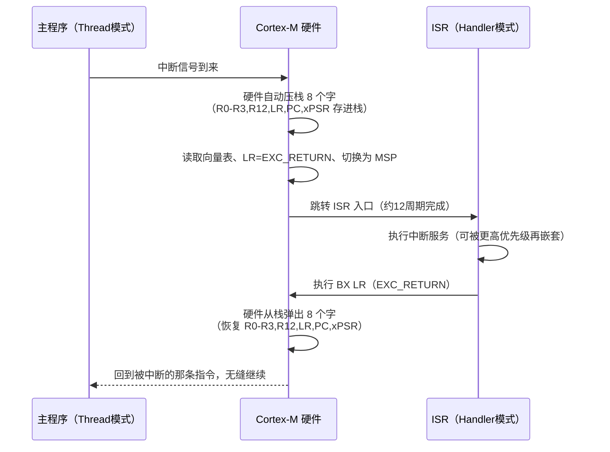

---

## 2. 通用寄存器详解

### 2.1 R0-R15 全景

Cortex-M 是 32 位处理器，共有 16 个通用寄存器（R0-R15），每个 32 位。

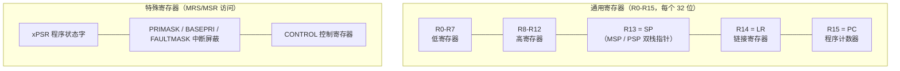

### 2.2 每个寄存器的分工（AAPCS 调用约定）

| 寄存器 | 别称 | 主要用途 | 谁负责保存 |
|---|---|---|---|
| **R0** | a1 | 函数第 1 参数、返回值 | 调用者（volatile） |
| **R1** | a2 | 函数第 2 参数 | 调用者 |
| **R2** | a3 | 函数第 3 参数 | 调用者 |
| **R3** | a4 | 函数第 4 参数 | 调用者 |
| **R4-R11** | v1-v8 | 函数内部变量、跨调用保留数据 | **被调用者**（callee-saved） |
| **R12** | IP | 调用间的临时暂存 | 调用者 |
| **R13** | SP | 栈指针（MSP/PSP，详见双栈文档） | 硬件/软件按规则 |
| **R14** | LR | 函数返回地址；**中断时=EXC_RETURN** | 见下方 |
| **R15** | PC | 程序计数器，指向正在执行的指令 | 硬件 |

> **通俗理解**：
> - R0-R3 是"传话用的便签"——函数 A 把参数写在 R0-R3 上交给 B，B 干完活把结果写回 R0 交还 A；谁都不保证这些便签在调用后还能用（**调用者保存**）。
> - R4-R11 是"长期留存的便签"——B 被 A 调用的这段时间，**B 必须保证还回来时 R4-R11 一个没变**（**被调用者保存**）。B 要用它们就先压栈，用完再弹回。
> - LR 是"回家路线"，PC 是"现在在哪"。

**R0-R7 与 R8-R12 的区别**：16 位 Thumb 指令只能操作 R0-R7（低寄存器）；R8-R12（高寄存器）只有 32 位 Thumb-2 指令才能直接操作。编译器会自动选择合适指令。

### 2.3 特殊寄存器速览

| 特殊寄存器 | 作用 | 备注 |
|---|---|---|
| **xPSR** | 程序状态字（组合寄存器） | = APSR\|EPSR\|IPSR |
| APSR | 条件标志位 N Z C V Q | 比较/加减运算结果 |
| IPSR | 当前异常编号 | 0 = 线程模式，非 0 = 正在处理的中断号 |
| EPSR | T 位（Thumb）+ IT 指令状态 | T 恒为 1（Cortex-M 只有 Thumb） |
| PRIMASK | 屏蔽除 NMI/HardFault 外所有中断 | 1 = 关中断 |
| BASEPRI | 屏蔽优先级 ≤ 该值的中断 | **M3/M4/M7 有，M0 无** |
| FAULTMASK | 屏蔽除 NMI 外所有异常 | M3/M4/M7 有，M0 无 |
| CONTROL | nPRIV / SPSEL / FPCA | 详见特权模式文档 |

### 2.4 为什么要分这么多寄存器（设计思路）

寄存器是 CPU 内部**最快的存储**（几个门电路，一个周期读写）。但数量有限，所以 ARM 把它们的职责**明确分工**，形成稳定的"契约"（AAPCS）：

1. **少而快的 R0-R3**：专用于函数间"传话"，避免每次传参都走内存；
2. **需要保留的 R4-R11**：让函数内部有稳定的"工作台"；
3. **LR/SP 独立**：让函数调用/返回有专门的家，不占用计算寄存器；
4. **调用约定统一**：不同编译器编译的代码可以互相调用（C 调汇编、汇编调 C 都不会乱）。

> 这套约定是**软件层面的规则**，硬件并不强制。它的价值在于：只要大家遵守同一套规则，整个生态（库、编译器、OS）就能无缝协作。

---

## 3. 中断发生时的入栈（压栈）

### 3.1 硬件自动压入的 8 个字

中断到来瞬间，Cortex-M **硬件自动**把下面 8 个字压入栈（不需要软件参与）：

| 压栈顺序 | 内容 | 作用 |
|---|---|---|
| 第 1 个 | **R0** | 被中断代码当前使用的 R0 |
| 第 2 个 | **R1** | R1 |
| 第 3 个 | **R2** | R2 |
| 第 4 个 | **R3** | R3 |
| 第 5 个 | **R12** | 临时寄存器 |
| 第 6 个 | **LR** | 被中断代码的返回地址 |
| 第 7 个 | **PC** | 被中断指令的下一条（ISR 返回后从这继续） |
| 第 8 个 | **xPSR** | 被中断代码的程序状态（恢复现场必需） |

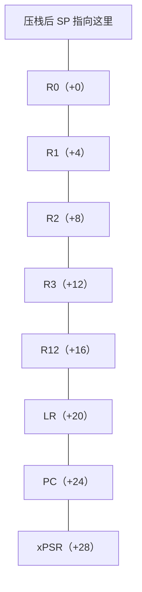

> **关键点**：压栈压到**中断前活跃的那个栈**（任务被中断→PSP，ISR 被嵌套→MSP），且栈帧偏移固定（R0=+0 … xPSR=+28）。这就是后续代码里 `frame[0]`/`frame[6]` 取数的依据。

### 3.2 压栈的同时，硬件还做了什么

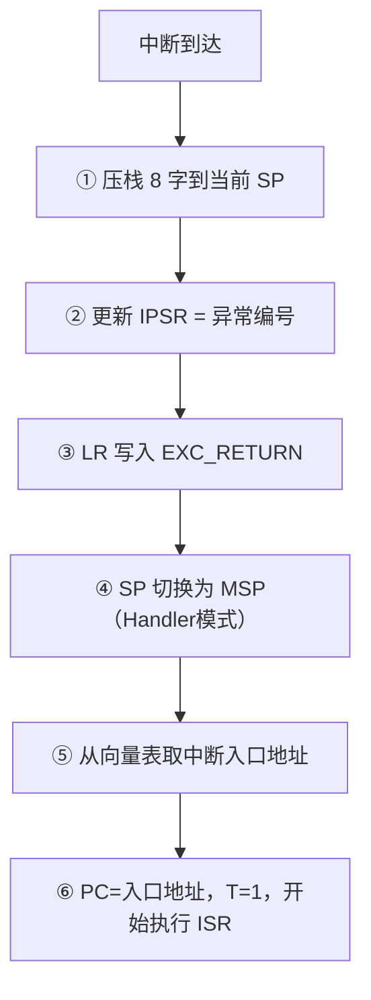

### 3.3 为什么只压 8 个字，不压 R4-R11？

**这是 Cortex-M 设计最精妙的地方**。答案分两层：

1. **C 语言约定已经保证了 R4-R11**：AAPCS 规定 R4-R11 是"被调用者保存"。ISR 本质是个"被硬件调用的 C 函数"，编译器会自动为它生成 prologue/epilogue——**只把 ISR 里真正用到的 R4-R11 压栈**。硬件没必要把 8 个字全压（慢）。
2. **硬件只压"不可预测、必须恢复"的**：R0-R3/R12/LR/PC/xPSR 是"任何代码都可能随时改变"的现场，必须无条件保存；R4-R11 则交给编译器"按需保存"，省时省空间。

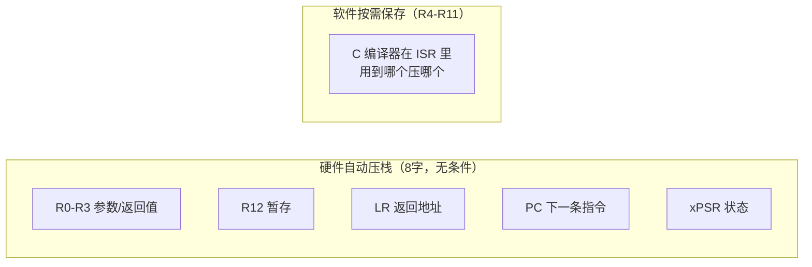

> **设计思路**：这是"**硬件做减法、软件做加法**"的经典权衡——硬件只保证"最小可靠现场"，其余按实际使用动态决定。相比老 ARM7（所有现场全靠软件压栈，中断延迟大、易错），这是革命性的简化。

### 3.4 中断延迟与优化（Tail-chaining / Late-arrival）

| 概念 | 含义 |
|---|---|
| **中断延迟** | 从中断到达到第一条 ISR 指令执行：M0≈16 周期，M3/M4≈12 周期（0 等待状态） |
| **Tail-chaining（尾链）** | ISR1 结束瞬间已有 ISR2 挂起 → **不再"弹栈再压栈"**，直接执行 ISR2，省约一半时间 |
| **Late-arrival（晚到）** | 正在为 ISR1 压栈时来了更高优先级 ISR2 → 放弃 ISR1 的压栈，**只压一次**帧，先处理 ISR2 |

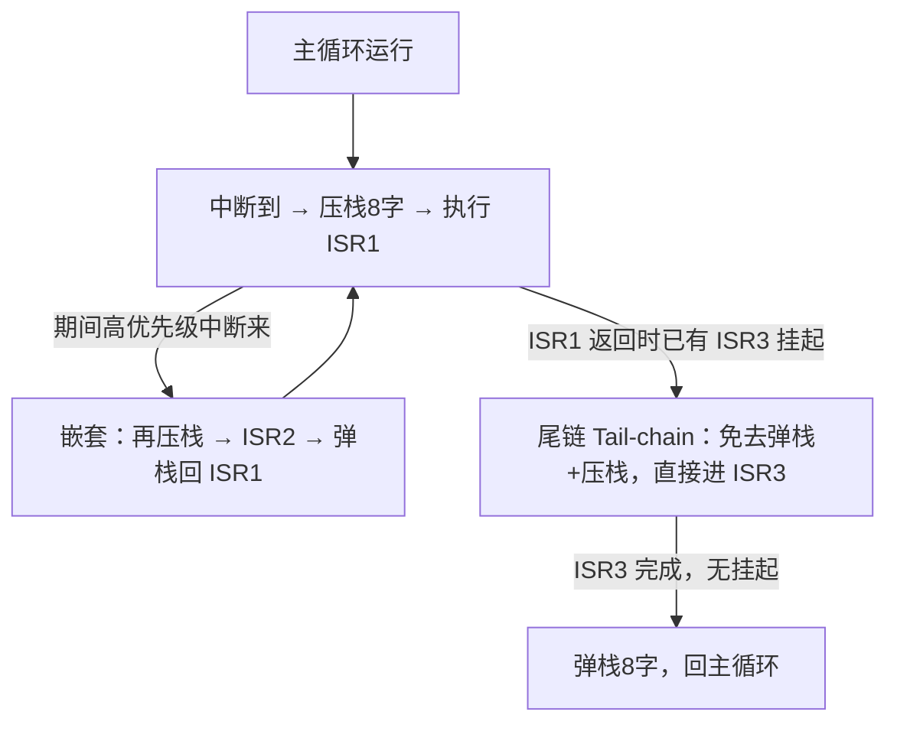

> **通俗理解**：Tail-chaining 像"电话刚挂断，第二个电话已经在排队"——不用先收拾文件再重新铺开，直接接第二个。Late-arrival 像"刚拿起第一个电话，发现是更高层的领导来电"——先放下，接领导。

---

## 4. 中断结束时的出栈（弹栈）

### 4.1 出栈是入栈的精确逆过程

ISR 结束执行 `BX LR`（LR 里是 EXC_RETURN）触发异常返回，硬件自动完成：

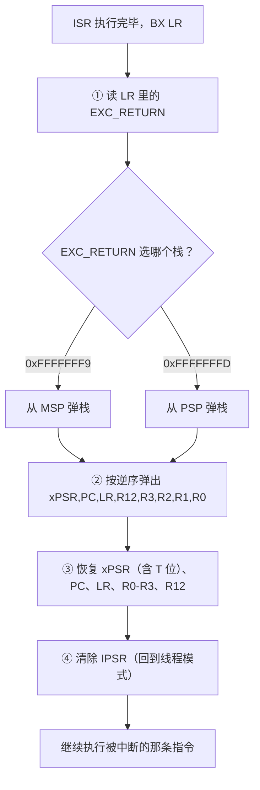

### 4.2 出栈时的两个特殊细节

1. **栈对齐恢复**：入栈时若做了 8 字节对齐修正（`xPSR[9]=1` 标记），出栈时硬件会**多弹 4 字节**补回 SP。
2. **T 位检查**：弹出的 xPSR 中 T 位必须为 1（Thumb）。若被改成 0，返回会触发 UsageFault——这是防止"伪造异常帧"越权的安全检查之一。

---

## 5. 设计思路：硬件为什么这么设计

### 5.1 从"软件压栈"到"硬件压栈"的进化

| 对比 | 老 ARM（ARM7/9） | Cortex-M |
|---|---|---|
| 中断现场保存 | **全部软件写**（保存 R0-R15 要十几条指令） | 硬件自动压 8 字 |
| 中断延迟 | 几十甚至上百周期 | ~12 周期 |
| 出错概率 | 程序员手写保存易漏、易错 | 硬件保证，无遗漏 |
| 嵌套支持 | 软件管理，复杂 | 硬件压栈天然支持 |

> **通俗理解**：老架构"接电话前要先自己把文件一份份存进柜子（耗时又容易漏）"；Cortex-M"一按铃，文件自动瞬间归档（快且不会错）"。这就是 **Cortex-M 在中断响应上碾压老 ARM 的根本原因**。

### 5.2 三个设计原则

1. **最小现场（Minimal Context）**：只保存"可能被任何代码破坏且必须还原"的 8 个字，其余按需——保证中断快；
2. **现场自包含（Self-contained）**：异常帧里含 PC 和 xPSR，返回时硬件只需"照着文件柜原样放回"，不依赖任何软件状态；
3. **约定优于配置（Convention over Configuration）**：R4-R11 的保存交给 AAPCS 约定 + 编译器，硬件无需关心 ISR 内部细节。

### 5.3 这套机制如何支撑 OS

RTOS 的**上下文切换**正是"把硬件压栈的 8 字帧 + 软件补存的 R4-R11"当作任务的完整"快照"：
- 硬件压栈 → 任务被中断时的最小现场自动入栈；
- PendSV 里软件再补存 R4-R11 → 任务全部寄存器收齐；
- 切换任务 = 换 PSP 指针 + 恢复另一份快照（详见双栈文档）。

---

## 6. 深入原理：xPSR 位级细节与中断生命周期

### 6.1 xPSR 位布局

xPSR 是一个 32 位寄存器，由三个子寄存器拼接而成：

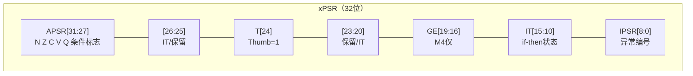

| 子寄存器 | 位 | 含义 |
|---|---|---|
| **APSR** | 31-27 | N（负数）、Z（零）、C（进位）、V（溢出）、Q（饱和溢出） |
| **EPSR** | 24 | **T**：Thumb 状态位，恒为 1 |
| **EPSR** | 15-10 | IT：条件执行（if-then）指令的连续状态，中断恢复必需 |
| **IPSR** | 8-0 | 当前异常编号（0=线程模式） |

**异常编号对照表**：

| 编号 | 异常 | 编号 | 异常 |
|---|---|---|---|
| 1 | Reset | 11 | SVCall |
| 2 | NMI | 14 | PendSV |
| 3 | HardFault | 15 | SysTick |
| 4/5/6 | MemManage/BusFault/UsageFault | 16+ | 外部中断 IRQ0… |

> **通俗理解**：xPSR 是"当时处理器的完整心情快照"——条件判断结果（N/Z/C/V）、执行到哪条 Thumb 指令的状态（T/IT）、正在处理哪个中断（IPSR），全都要在返回时原样恢复，否则被中断的代码就会算错。

### 6.2 中断生命周期的寄存器级时间线

| 阶段 | CPU 动作 | 涉及寄存器 |
|---|---|---|
| 入栈 | 压 8 字到当前 SP | R0-R3,R12,LR,PC,xPSR |
| 模式切换 | SP→MSP，IPSR=异常号 | SP, IPSR |
| 取入口 | LR=EXC_RETURN，PC=向量 | LR, PC |
| 执行 | 运行 ISR（可嵌套） | 自由使用 |
| 出栈 | 按 EXC_RETURN 弹 8 字 | 恢复全部 |
| 恢复 | IPSR 清零，回 Thread | IPSR, CONTROL.SPSEL |

### 6.3 M4/M7 的浮点扩展（可选知识点）

Cortex-M4/M7 若中断前任务正在用 FPU，入栈可能**额外压 FPU 寄存器**：

| 模式 | 压栈字数 |
|---|---|
| 仅 8 字基础帧 | 8 字（无 FPU / 未用 FPU） |
| 完整浮点帧 | 8 + 18 = **26 字**（S0-S15 + FPSCR + 保留） |
| 惰性压栈（Lazy Stacking，默认） | 先占 16 字空位，ISR 用到 FPU 时才真正压入 |

> **设计思路**：**惰性压栈**是"延迟到必要时才付代价"的典型——大多数 ISR 不用 FPU，就没必要把 FPU 现场完整保存，省下可观的中断延迟。

---

### 6.5 结合真实地址：寄存器编码、内存映射与入栈出栈走查

> **通俗理解**：前面几节讲寄存器和栈"是什么、为什么"，这一节把它们**落到地址上**——每个特殊寄存器在指令里有一个唯一的"编码编号"（SPEC_REG 字段），每个内核外设和栈在内存里有一块确定的地址。读懂了这些地址，你就能看着汇编、看着内存窗口，一步步"目击"入栈出栈的全过程。

#### 6.5.1 特殊寄存器的"指令内编码"（SPEC_REG 字段）

MRS / MSR 指令通过指令中的 **SPEC_REG 字段**指定要操作哪个特殊寄存器——这就是特殊寄存器在指令集里的"身份证号"。汇编器负责把这些编号编码进机器码，我们手写汇编时直接写寄存器名即可：

```c
/* 等效汇编（Keil / GCC 一致，SPEC_REG 编码由汇编器生成）：
 *   MRS  R0, PRIMASK    ; 读中断屏蔽   (SPEC_REG = 0b10000)
 *   MRS  R1, IPSR       ; 读异常编号   (SPEC_REG = 0b01010)
 *   MRS  R2, PSP        ; 读进程栈指针 (SPEC_REG = 0b11001)
 *   MSR  CONTROL, R2    ; 写控制寄存器 (SPEC_REG = 0b10100)
 */
```

| 特殊寄存器 | SPEC_REG（bits[7:0]） | 5 位选择器 | M0/M0+ | 作用 |
|---|---|---|---|---|
| APSR | 0x08 | 01000 | ✅ | 条件标志 N Z C V Q |
| IPSR | 0x0A | 01010 | ✅ | 当前异常编号（0 = 线程模式） |
| EPSR | 0x0C | 01100 | ✅ | T 位 + IT 状态 |
| PRIMASK | 0x10 | 10000 | ✅ | 屏蔽除 NMI/HardFault 外中断 |
| BASEPRI | 0x11 | 10001 | ❌ | 屏蔽优先级 ≤ 值的异常（M3+） |
| BASEPRI_MAX | 0x12 | 10010 | ❌ | 只升不降的优先级屏蔽 |
| FAULTMASK | 0x13 | 10011 | ❌ | 屏蔽除 NMI 外全部异常 |
| CONTROL | 0x14 | 10100 | ✅ | nPRIV / SPSEL / FPCA |
| MSP | 0x18 | 11000 | ✅ | 主栈指针 |
| PSP | 0x19 | 11001 | ✅ | 进程栈指针 |
| MSPLIM / PSPLIM | 0x1A / 0x1B | 11010 / 11011 | ❌ | 栈指针下限（M23/M33） |

> 组合读的 xPSR 同样支持（`MRS Rd, xPSR` 一次读出 APSR\|EPSR\|IPSR），具体编码由汇编器处理。

> **设计思路**：给特殊寄存器分配"固定编号"而非每条一个独立指令，是用**最少的指令空间覆盖最多的寄存器**——MRS/MSR 一对指令加一个字段，就能访问十几个特殊寄存器，指令集精简、译码统一。

#### 6.5.2 内核外设与栈的内存地址（STM32F103 实测）

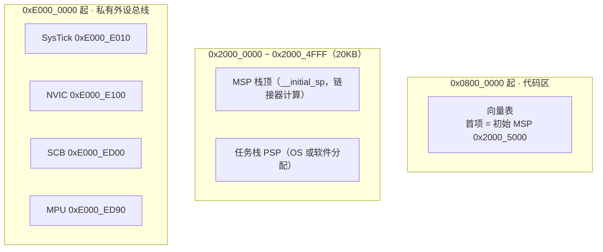

| 地址 | 寄存器 | 作用 |
|---|---|---|
| 0x0800_0000 | 向量表 | 首项 = 初始 MSP；其后每 4 字节一个异常/中断入口 |
| 0x2000_5000 | SRAM 顶端 | `__initial_sp`（复位后 SP = MSP = 该值） |
| 0xE000_E010 / +0x04 / +0x08 | SysTick CTRL / LOAD / VAL | 时基中断控制 |
| 0xE000_E100 | NVIC ISER0 | 外部中断使能（IRQ0-31） |
| 0xE000_ED04 | SCB ICSR | 中断控制与状态（可查哪个异常挂起） |
| 0xE000_ED1C | SCB SHPR2 | SVCall 优先级 |
| 0xE000_ED90 | MPU CTRL | MPU 控制 |

**向量表：第一个栈指针的"来源代码"**（启动文件真实片段）：

```assembly
; ===== startup_stm32f10x_hd.s（节选，已标注偏移） =====
                AREA    STACK, NOINIT, READWRITE, ALIGN=3
Stack_Mem       SPACE   Stack_Size                 ; 1KB 栈空间
__initial_sp                                        ; 栈顶符号（链接后 = 0x2000_5000）

__Vectors       DCD     __initial_sp               ; +0x00  初始 MSP（复位后 SP 用它）
                DCD     Reset_Handler              ; +0x04  复位入口
                DCD     NMI_Handler                ; +0x08
                DCD     HardFault_Handler          ; +0x0C
                ; ... 中间省略 ...
                DCD     SVC_Handler                ; +0x2C  SVCall（第 11 项）
                ; ... 中间省略 ...
                DCD     PendSV_Handler             ; +0x38  PendSV（第 14 项）
                DCD     SysTick_Handler            ; +0x3C  SysTick（第 15 项）
                DCD     WWDG_IRQHandler            ; +0x40  外部中断 0
```

> **通俗理解**：复位时 CPU 是"一张白纸"，它做的第一件事就是**从 0x0800_0000 读第一个字当 SP（MSP）**、读第二个字当第一条指令地址（Reset_Handler）。所以向量表第 0 项写错，程序一上电就飞。

#### 6.5.3 入栈的"地址级"走查（真实数字推算）

以 STM32F103 为例：MSP 初始 0x2000_5000，主循环运行到某时刻 SP = 0x2000_4FF0，此时 SysTick 中断到来：

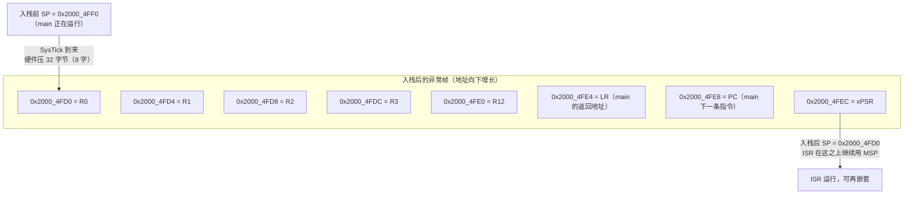

| 帧偏移 | 内存地址 | 存入内容 | 含义 |
|---|---|---|---|
| +0x00 | 0x2000_4FD0 | R0 | 被中断代码的 R0 |
| +0x04 | 0x2000_4FD4 | R1 | R1 |
| +0x08 | 0x2000_4FD8 | R2 | R2 |
| +0x0C | 0x2000_4FDC | R3 | R3 |
| +0x10 | 0x2000_4FE0 | R12 | 临时寄存器 |
| +0x14 | 0x2000_4FE4 | LR | main 的返回地址 |
| +0x18 | 0x2000_4FE8 | PC | main 被中断的下一条指令 |
| +0x1C | 0x2000_4FEC | xPSR | main 的程序状态 |

**出栈（逆过程）**：ISR 执行 `BX LR`（LR = 0xFFFFFFF9）→ 硬件从 0x2000_4FD0 起**逆序**弹出 xPSR、PC、LR、R12、R3、R2、R1、R0 → SP 回到 0x2000_4FF0 → main 从 `PC` 指向的指令无缝继续。

**任务（PSP）场景**：若 main 运行在 PSP（SPSEL=1），PSP = 0x2000_4000，入栈后 PSP = 0x2000_3FD0，EXC_RETURN = 0xFFFFFFFD，出栈从 PSP 弹——帧的**地址布局完全一样**，只是"在哪块内存"不同。

#### 6.5.4 结合地址的代码示例（三版本）

**版本一：直接寄存器操作——把异常帧的真实地址与内容快照下来**

```c
/* ===== 版本一：寄存器操作（STM32F103）——现场快照 ===== */
#define SYSTICK_CTRL  (*(volatile uint32_t *)0xE000E010)   /* SysTick 控制 */
#define SYSTICK_LOAD  (*(volatile uint32_t *)0xE000E014)   /* 重装载值 */
#define SYSTICK_VAL   (*(volatile uint32_t *)0xE000E018)   /* 当前值 */

typedef struct {
    uint32_t frame_addr;   /* 异常帧首地址（真实 RAM 地址） */
    uint32_t r0, r1, r2, r3, r12, lr, pc, xpsr;
    uint32_t msp_now;      /* ISR 当前 MSP */
    uint32_t ipsr;         /* 当前异常编号（应为 15 = SysTick） */
} snap_t;

volatile snap_t g_snap;

void SysTick_Handler(void)
{
    uint32_t *f;
    uint32_t sp;

    __asm volatile("MOV %0, SP" : "=r"(sp));          /* ① ISR 的 SP = MSP */
    __asm volatile(
        "TST  LR, #4          \n"
        "ITE  EQ              \n"
        "MRSEQ %0, MSP        \n"
        "MRSNE %0, PSP        \n"
        : "=r"(f) : : "cc", "memory");                /* ② 帧在 MSP 还是 PSP */

    g_snap.frame_addr = (uint32_t)f;                  /* ③ 记录帧的真实地址 */
    g_snap.r0  = f[0];  g_snap.r1  = f[1];            /* ④ 读帧内容 */
    g_snap.r2  = f[2];  g_snap.r3  = f[3];
    g_snap.r12 = f[4];  g_snap.lr  = f[5];
    g_snap.pc  = f[6];  g_snap.xpsr = f[7];
    g_snap.msp_now = sp;
    g_snap.ipsr = g_snap.xpsr & 0x1FFu;               /* IPSR = xPSR[8:0] */
}

int main(void)
{
    /* 直接用地址配置 SysTick：1ms 中断（72MHz / 72000） */
    SYSTICK_LOAD = 72000u - 1u;
    SYSTICK_VAL  = 0u;
    SYSTICK_CTRL = 0x07u;                             /* 使能 + 中断 + 内核时钟 */

    for (;;) { }                                      /* 被 SysTick 反复打断 */
}
```

**调试器观察结果**：
- `g_snap.frame_addr` ≈ 0x2000_4FD0 附近（RAM 区域），每次中断数值不同（栈深度不同）；
- `g_snap.pc` 指向主循环的某条指令（被中断处）；
- `g_snap.ipsr == 15` → 确认是 SysTick 打断；
- `g_snap.msp_now` 与 `frame_addr` 都在 MSP 栈区 → 验证"ISR 用 MSP"。

**版本二：标准外设库 + CMSIS——特殊寄存器用封装函数读**

```c
/* ===== 版本二：标准外设库 + CMSIS（STM32F103） ===== */
#include "stm32f10x.h"

void SysTick_Handler(void)
{
    uint32_t *f;
    __asm volatile(
        "TST  LR, #4          \n"
        "ITE  EQ              \n"
        "MRSEQ %0, MSP        \n"
        "MRSNE %0, PSP        \n"
        : "=r"(f) : : "cc", "memory");

    /* 特殊寄存器用 CMSIS 一行读出（内部就是 6.5.1 的 MRS 编码） */
    uint32_t xpsr    = __get_xPSR();     /* 组合状态字 */
    uint32_t ipsr    = __get_IPSR();     /* 异常编号（此处 = 15） */
    uint32_t msp     = __get_MSP();      /* 主栈指针 */
    uint32_t psp     = __get_PSP();      /* 进程栈指针 */
    uint32_t primask = __get_PRIMASK();  /* 中断屏蔽 */

    /* 帧地址与内容读取与版本一完全一致（硬件布局与库无关） */
    /* g_snap 定义见版本一 */
    g_snap.pc   = f[6];
    g_snap.xpsr = f[7];
}

int main(void)
{
    SysTick_Config(SystemCoreClock / 1000u);   /* 1ms 中断 */
    for (;;) { }
}
```

**版本三：HAL 库——时基交给 HAL，寄存器仍走 CMSIS**

```c
/* ===== 版本三：HAL + CMSIS（STM32F407） ===== */
#include "stm32f4xx_hal.h"

void SysTick_Handler(void)
{
    uint32_t *f;
    __asm volatile(
        "TST  LR, #4          \n"
        "ITE  EQ              \n"
        "MRSEQ %0, MSP        \n"
        "MRSNE %0, PSP        \n"
        : "=r"(f) : : "cc", "memory");

    uint32_t xpsr = __get_xPSR();       /* CMSIS：读组合状态字 */
    uint32_t pc   = f[6];               /* 帧读法与库无关 */
    /* HAL 只有时基功能，内核寄存器 / 异常帧没有更高层封装 */
    HAL_IncTick();
}

int main(void)
{
    HAL_Init();                         /* 内部配置 SysTick 时基 */
    for (;;) { }
}
```

> **三版本小结**：栈、异常帧、特殊寄存器都是 **CPU 层面**的机制——三版本中帧地址读取逻辑一字不差；差异只在于"特殊寄存器用 CMSIS 封装函数读"还是"手写 MRS"、SysTick 用库配置还是裸地址配置。**看懂 6.5.3 的地址推演，三版本代码就全懂了。**

---

## 7. 代码实战：寄存器 / 标准库 / HAL 三版本

> 演示目标：
> **① 读取特殊寄存器（xPSR/PRIMASK/BASEPRI） ② ISR 中读取"被中断代码"的寄存器（异常帧） ③ 通过帧传参/返回值（SVC 系统调用） ④ 修改帧实现特殊跳转**
> 三个版本 API 风格不同，核心机制一致。

### 7.1 版本一：直接寄存器操作（内联汇编）

```c
/**
 * ============================================================================
 * 寄存器与中断现场 —— 版本一：直接寄存器操作
 * 目标芯片：STM32F103（Cortex-M3）
 * ============================================================================
 */
#include <stdint.h>

/* ---- 供调试观察的全局变量 ---- */
volatile uint32_t g_stacked_pc, g_stacked_lr, g_stacked_r0, g_stacked_xpsr;
volatile uint32_t g_svc_result;

/* ========== ① 读取特殊寄存器 ========== */
static inline uint32_t read_xpsr(void)
{
    uint32_t r;
    __asm volatile("MRS %0, xPSR" : "=r"(r));      /* 组合状态字 */
    return r;
}
static inline uint32_t read_primask(void)
{
    uint32_t r;
    __asm volatile("MRS %0, PRIMASK" : "=r"(r));   /* 中断屏蔽状态 */
    return r;
}
static inline uint32_t read_basepri(void)
{
    uint32_t r;
    __asm volatile("MRS %0, BASEPRI" : "=r"(r));   /* 优先级屏蔽（M3+） */
    return r;
}

/* ========== ② SVC 系统调用：R0-R2 传参，R0 取返回值 ========== */
__attribute__((naked)) void sys_call(uint32_t svc_no, uint32_t arg0, uint32_t arg1)
{
    /* naked：编译器不插栈帧，保证 svc_no/arg0/arg1 仍在 R0/R1/R2 */
    __asm volatile("SVC #0");   /* 触发中断，硬件把 R0-R3 压栈 */
    __asm volatile("BX LR");    /* 返回后从 R0 取返回值 */
}

/* ========== ③ SVC Handler：通过异常帧收发参数 ========== */
void SVC_Handler(void)
{
    uint32_t *frame;

    /* 定位异常帧（TST LR,#4 判断 MSP/PSP） */
    __asm volatile(
        "TST  LR, #4          \n"
        "ITE  EQ              \n"
        "MRSEQ %0, MSP        \n"
        "MRSNE %0, PSP        \n"
        : "=r"(frame) : : "cc", "memory"
    );

    /* frame[0]=R0(svc_no), frame[1]=R1(arg0), frame[2]=R2(arg1) */
    uint32_t result = frame[0] + frame[1] + frame[2];
    frame[0] = result;                 /* 写回帧 R0 → 返回后调用者读到返回值 */
    g_svc_result = result;
}

/* ========== ④ SysTick ISR：读取被中断代码的现场 ========== */
void SysTick_Handler(void)
{
    uint32_t *frame;
    uint32_t msp;

    __asm volatile("MOV %0, SP" : "=r"(msp));   /* ISR 的 SP = MSP */
    __asm volatile(
        "TST  LR, #4          \n"
        "ITE  EQ              \n"
        "MRSEQ %0, MSP        \n"
        "MRSNE %0, PSP        \n"
        : "=r"(frame) : : "cc", "memory"
    );

    /* 被中断代码的现场（偏移固定） */
    g_stacked_r0    = frame[0];   /* 被中断处的 R0 */
    g_stacked_lr    = frame[5];   /* 被中断处的 LR */
    g_stacked_pc    = frame[6];   /* 被中断处的 PC（返回后继续的位置） */
    g_stacked_xpsr  = frame[7];   /* 被中断处的 xPSR */
}

/* ========== ⑤ 演示：ISR 里修改返回地址（跳过一条 Thumb 指令） ========== */
void Demo_Fault_Handler(void)
{
    uint32_t *frame;
    __asm volatile(
        "TST  LR, #4          \n"
        "ITE  EQ              \n"
        "MRSEQ %0, MSP        \n"
        "MRSNE %0, PSP        \n"
        : "=r"(frame) : : "cc", "memory"
    );
    /* frame[6] 是被中断处的 PC。+2 即跳过一条 16 位 Thumb 指令。
     * ⚠ 仅用于教学演示；生产代码不应随意改 PC */
    frame[6] += 2;
}

/* ========== ⑥ 主流程 ========== */
int main(void)
{
    uint32_t xpsr = read_xpsr();     /* 主循环：IPSR 应为 0（线程模式） */
    uint32_t mask = read_primask();  /* 通常为 0 */

    /* 在中断被触发前调用系统调用（结果会写回 R0） */
    uint32_t ret = sys_call(10, 20, 30);   /* ret = 10+20+30 = 60 */

    for (;;) {
        /* 主循环持续被 SysTick 打断，每次 ISR 都会记录当时的 PC/LR */
    }
}
```

**运行要点**：
- `sys_call(10,20,30)` 返回 60——**参数经由硬件压栈帧传递，返回值也经由帧写回**，全程没有软件搬数据；
- 每次 SysTick 打断主循环，`g_stacked_pc` 记录的是"主循环正在执行的地址"，`g_stacked_xpsr` 的 IPSR 字段会是 15（SysTick 编号）；
- 主循环里 `read_xpsr()` 的 IPSR 字段为 0（线程模式），ISR 里则非 0——用同一个函数即可区分"我在中断里还是中断外"。

### 7.2 版本二：标准外设库 + CMSIS

```c
/**
 * ============================================================================
 * 寄存器与中断现场 —— 版本二：标准外设库 + CMSIS
 * 目标芯片：STM32F103 标准外设库 v3.5
 * 说明：特殊寄存器读取全部用 CMSIS 封装函数
 * ============================================================================
 */
#include "stm32f10x.h"

volatile uint32_t g_stacked_pc, g_stacked_lr, g_stacked_xpsr;
volatile uint32_t g_svc_result;

/* ========== ① 读取特殊寄存器（CMSIS 一行搞定） ========== */
void read_special(void)
{
    uint32_t xpsr   = __get_xPSR();      /* 组合状态字 */
    uint32_t apsr   = __get_APSR();      /* 条件标志 N/Z/C/V/Q */
    uint32_t ipsr   = __get_IPSR();      /* 当前异常编号 */
    uint32_t primask= __get_PRIMASK();   /* 中断屏蔽 */
    uint32_t basepri= __get_BASEPRI();   /* 优先级屏蔽 */
    uint32_t faultm = __get_FAULTMASK(); /* 故障屏蔽 */
    uint32_t psp    = __get_PSP();       /* 进程栈指针 */
    uint32_t msp    = __get_MSP();       /* 主栈指针 */
    /* 直接在调试器里观察这些局部变量即可 */
}

/* ========== ② SVC 系统调用（逻辑同版本一） ========== */
__attribute__((naked)) void sys_call(uint32_t svc_no, uint32_t arg0, uint32_t arg1)
{
    __ASM volatile("SVC #0");
    __ASM volatile("BX LR");
}

void SVC_Handler(void)
{
    uint32_t *frame;
    __asm volatile(
        "TST  LR, #4          \n"
        "ITE  EQ              \n"
        "MRSEQ %0, MSP        \n"
        "MRSNE %0, PSP        \n"
        : "=r"(frame) : : "cc", "memory"
    );
    frame[0] = frame[0] + frame[1] + frame[2];   /* 帧读写与库无关 */
    g_svc_result = frame[0];
}

/* ========== ③ SysTick ISR：读被中断代码的 PC/LR ========== */
void SysTick_Handler(void)
{
    uint32_t *frame;
    __asm volatile(
        "TST  LR, #4          \n"
        "ITE  EQ              \n"
        "MRSEQ %0, MSP        \n"
        "MRSNE %0, PSP        \n"
        : "=r"(frame) : : "cc", "memory"
    );
    g_stacked_lr   = frame[5];
    g_stacked_pc   = frame[6];
    g_stacked_xpsr = frame[7];
}

int main(void)
{
    SysTick_Config(SystemCoreClock / 1000u);   /* 标准库：1ms 中断 */
    uint32_t ret = sys_call(10, 20, 30);       /* ret = 60 */
    for (;;) { }
}
```

> **版本差异说明**：读特殊寄存器从"手写 MRS"换成 CMSIS 的 `__get_xPSR()` / `__get_IPSR()` / `__get_PRIMASK()` 等一行函数；**异常帧的读写与库无关**（那是硬件内存布局，任何库都一样）。注意 `__get_BASEPRI()` / `__get_FAULTMASK()` 只在 M3/M4/M7 可用，M0/M0+ 没有。

### 7.3 版本三：STM32 HAL 库 + CMSIS

```c
/**
 * ============================================================================
 * 寄存器与中断现场 —— 版本三：HAL 库 + CMSIS
 * 目标芯片：STM32F407（HAL 库）
 * 说明：核心寄存器读取仍用 CMSIS（HAL 不封装内核寄存器）；SysTick 交给 HAL 管理
 * ============================================================================
 */
#include "stm32f4xx_hal.h"

volatile uint32_t g_stacked_pc, g_stacked_lr, g_stacked_xpsr;

/* ========== ① 读取特殊寄存器（CMSIS，HAL 无更高级封装） ========== */
void read_special(void)
{
    uint32_t xpsr = __get_xPSR();
    uint32_t ipsr = __get_IPSR();
    uint32_t psp  = __get_PSP();
    uint32_t msp  = __get_MSP();
    /* 调试器观察 */
}

/* ========== ② SVC 系统调用（同前两版本） ========== */
__attribute__((naked)) void sys_call(uint32_t svc_no, uint32_t arg0, uint32_t arg1)
{
    __ASM volatile("SVC #0");
    __ASM volatile("BX LR");
}

void SVC_Handler(void)
{
    uint32_t *frame;
    __asm volatile(
        "TST  LR, #4          \n"
        "ITE  EQ              \n"
        "MRSEQ %0, MSP        \n"
        "MRSNE %0, PSP        \n"
        : "=r"(frame) : : "cc", "memory"
    );
    frame[0] = frame[0] + frame[1] + frame[2];
}

/* ========== ③ HAL 时基中断（已由 HAL_Init 配置好 SysTick） ========== */
void SysTick_Handler(void)
{
    uint32_t *frame;
    __asm volatile(
        "TST  LR, #4          \n"
        "ITE  EQ              \n"
        "MRSEQ %0, MSP        \n"
        "MRSNE %0, PSP        \n"
        : "=r"(frame) : : "cc", "memory"
    );
    g_stacked_lr   = frame[5];
    g_stacked_pc   = frame[6];
    g_stacked_xpsr = frame[7];

    HAL_IncTick();                /* HAL 心跳计数 */
    /* 注意：必须在 main 里调用 HAL_Init() 后才会开始 */
}

int main(void)
{
    HAL_Init();                   /* 内部配置 SysTick 作为时基 */
    uint32_t ret = sys_call(10, 20, 30);   /* ret = 60 */
    for (;;) { }
}
```

> **版本差异说明**：HAL 唯一的作用是**替你管好 SysTick 时基**；内核寄存器和异常帧是"CPU 层面"的机制，HAL **没有任何封装**，只能和 CMSIS/汇编打交道。这也再次印证：**理解寄存器与异常帧是嵌入式开发者必须亲手掌握的地基，任何库都替代不了。**

---

## 8. 总结与速查

### 8.1 通用寄存器一句话记忆

- **R0-R3**：传话（参数/返回值），调用完可随便改；
- **R4-R11**：长期便签，被调用者必须原样归还；
- **R12**：临时；
- **R13 SP**：栈指针（MSP/PSP）；**R14 LR**：回家路线/EXC_RETURN；**R15 PC**：现在位置；
- **xPSR/PRIMASK/BASEPRI/FAULTMASK/CONTROL**：状态与权限，只能 MRS/MSR 访问。

### 8.2 中断入栈出栈一句话记忆

**入栈**：硬件自动压 **R0,R1,R2,R3,R12,LR,PC,xPSR**（8 字，压到中断前活跃的栈）→ 切 MSP → LR=EXC_RETURN → 进 ISR。
**出栈**：BX LR → 按 EXC_RETURN 选栈 → 逆序弹出 8 字 → 恢复 PC/xPSR → 无缝继续。
**只压 8 字的原因**：R4-R11 交给 C 编译器的 AAPCS 约定"按需保存"，硬件只保最小现场，换来 ~12 周期极低中断延迟。

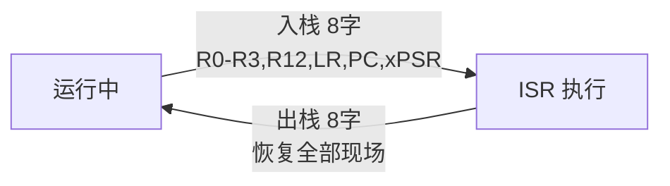

---

## 9. 附录：常见问题

### 9.1 中断里读到的 R0 是谁的？
是**被中断代码**的 R0（异常帧 `frame[0]`），不是 ISR 自己的。ISR 自己的 R0 由 C 编译器随意使用，没有保存义务（除非被中断的现场需要）。

### 9.2 如何在 ISR 里给被中断代码"返回值"？
把结果写回异常帧的对应位置即可：`frame[0] = 结果;`。返回时硬件把它弹回 R0，被中断的代码就能读到——这就是 SVC 系统调用传参/返回的底层机制。

### 9.3 为什么中断压栈有时是 36 字节而不是 32 字节？
8 字帧是 32 字节；若入栈时做了 8 字节对齐修正（STKALIGN），会多 4 字节。M4/M7 带浮点完整帧则是 26 字（104 字节）。

### 9.4 怎么快速判断"现在在不在中断里"？
读 IPSR：0 = 线程模式，非 0 = 中断中（值即异常编号）。CMSIS：`__get_IPSR()`。

### 9.5 ISR 里能安全调用 printf 吗？
不能随便。ISR 在 MSP 上，printf/库可能重入并占用大量栈，且会拉长中断关闭时间。正确做法：ISR 只做"收现场、置标志"，数据处理放到主循环（生产者-消费者模式）。

### 9.6 为什么我的中断返回后程序跑飞了？
大概率是**异常帧被破坏**（如 ISR 里越界写坏了 frame，或栈溢出覆盖了帧）。排查：看 HardFault 时弹栈的 PC 是否合理、栈是否被踩。

### 9.7 M0 和 M3 的入栈有区别吗？
入栈 8 字完全相同（ARMv6-M 也是 8 字）。区别在：M0 中断延迟更大（≈16 周期）、无 BASEPRI/FAULTMASK、可配置故障少（统一 HardFault）。

---

> **一句话总结**：Cortex-M 用 16 个通用寄存器 + 几个特殊寄存器组成 CPU 的"工作台"；中断时硬件以极低成本自动压入/弹出 8 字现场帧（R0-R3,R12,LR,PC,xPSR），让 ISR 像"无缝接了个电话"——入栈出栈的每一字节、每一个偏移，都是理解中断、RTOS 上下文切换与异常调试的基石。
