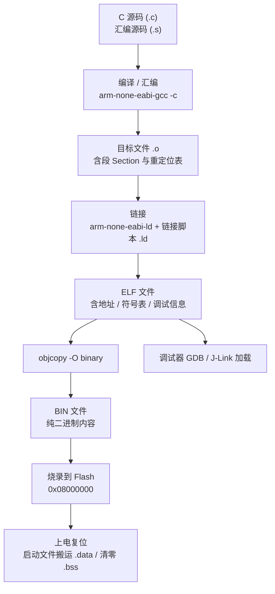
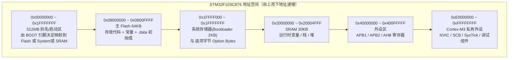
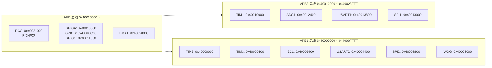
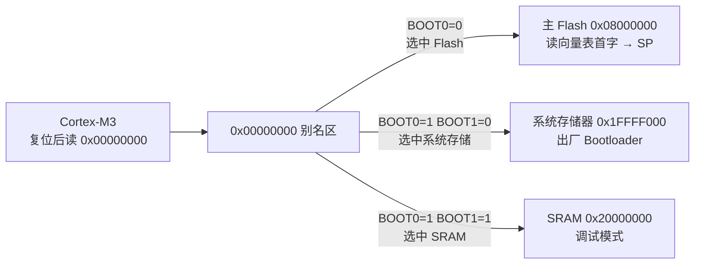
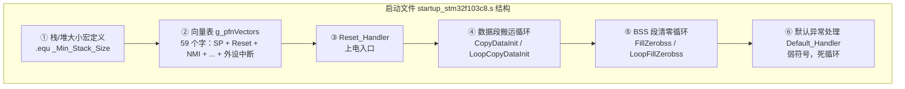
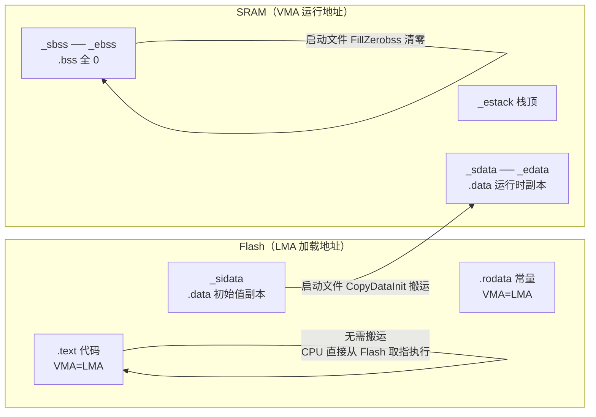
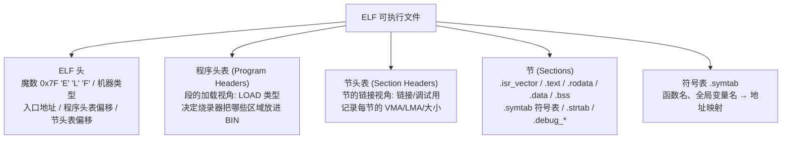
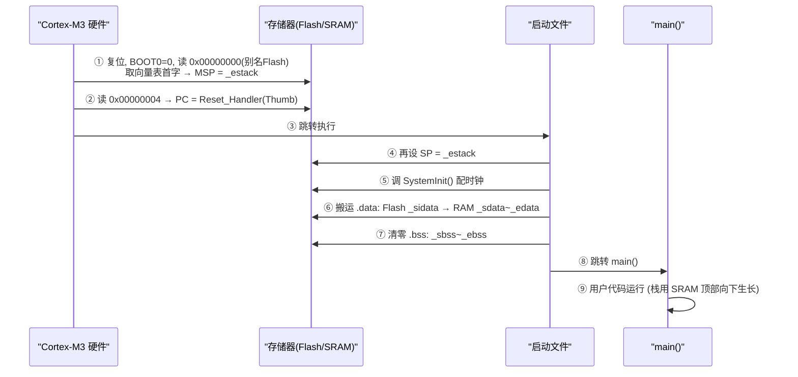
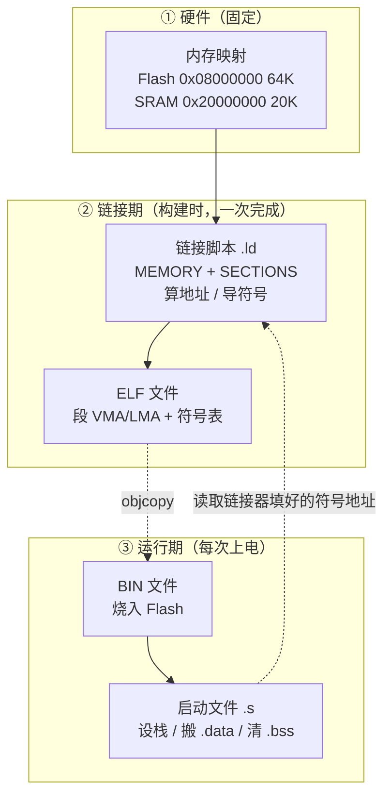

# STM32F103C8T6 内存映射 · 启动文件 · 链接文件 · ELF/BIN 全解

> 主题：内存映射分布、`.s` 启动文件、`.ld` 链接文件、`bin/elf` 输出文件、启动重定位，以及五者之间的关联。
> 适用芯片：**STM32F103C8T6**（Cortex-M3 内核，64KB Flash，20KB SRAM）。
> 全文采用"通俗 → 机制 → 原理"三层结构，含完整带注释代码与可渲染 Mermaid 图。

---

## 一、开篇总览（先把五者关系"讲人话"）

把一块 STM32 芯片想象成一栋房子：

| 角色 | 类比 | 对应文件/概念 |
|------|------|--------------|
| **内存映射** | 户型图：每间房在哪、多大 | 芯片厂商手册里的地址空间（Flash / SRAM / 外设寄存器） |
| **链接文件 `.ld`** | 施工图纸：把材料摆放到具体房间、具体坐标 | 定义段的 VMA/LMA、导出 `_estack`/`_sdata` 等符号 |
| **启动文件 `.s`** | 搬家师傅的流程表：哪些东西要搬、哪些要清零 | 复位后第一条执行的汇编代码 |
| **ELF 文件** | 带标注的完整清单：东西放哪、叫什么、大小多少 | 链接器产物，含地址、符号表、调试信息 |
| **BIN 文件** | 纯内容：只有数据本身，不含地址 | 由 ELF `objcopy` 得到，直接烧进 Flash 的二进制 |

**一句话总结四者关系**：
> **内存映射**是目标地址空间（天花板）；**链接文件**决定"谁被摆到哪个地址"（分配）；**启动文件**负责"复位后把初始数据从 Flash 搬进 SRAM、把 SRAM 清零"（搬运）；**ELF** 是链接结果（带地址的完整镜像），**BIN** 是 ELF 的"裸数据抽提"（烧录用）。



> 图示解释：一次构建流程是 `源码 → 编译 → 链接 → ELF → BIN → 烧录 → 启动`。`.ld` 在**链接**一步生效；`.s` 在**上电复位**一步生效；**内存映射**贯穿始终（它决定 Flash/SRAM 地址与容量）。

---

## 二、内存映射分布详解

### 2.1 通俗理解

内存映射就是芯片内部所有可寻址空间的"门牌号"。STM32F103C8T6 的 CPU 是 32 位 Cortex-M3，能寻址 **4GB** 空间（`0x0000_0000 ~ 0xFFFF_FFFF`），但芯片只实现了其中一小部分：程序放 Flash、运行变量放 SRAM、外设寄存器也映射成内存地址。

### 2.2 官方内存映射总图



> 图示解释：从上到下地址递增。重点是 **Flash(0x08000000, 64KB)**、**SRAM(0x20000000, 20KB)** 和 **外设区(0x40000000 起)**。C8T6 是"中容量(MD)"型号，Flash 只有 64KB、SRAM 20KB，比 HD(大容量 512KB/64KB) 小一半以上。

### 2.3 三个关键内存区域细节

#### (1) Flash —— 代码与"出厂数据"的家

| 地址 | 用途 | 备注 |
|------|------|------|
| `0x0800_0000` | 中断向量表起始 | 复位后 CPU 首先读取此处的 SP 和 PC |
| `0x0800_0000 ~ 0x0800_FFFF` | 主 Flash 64KB | 存 `.text` / `.rodata` / `.data` 初始值 |
| 页大小 | 1KB/页，共 64 页 | 擦除按页 |

- Flash 是**只读**存储器（写需解锁+擦除流程），掉电不丢失。
- 它既存代码，也存 `.data` 段的**初始值副本**（供启动时搬到 RAM）。

#### (2) SRAM —— 运行时的"工作台"

| 地址 | 用途 |
|------|------|
| `0x2000_0000` | 静态变量/全局变量 (.data/.bss) |
| `0x2000_0000 + 静态区` | 堆 (Heap，malloc 用，向上增长) |
| `0x2000_0000 + 堆` | 栈 (Stack，局部变量/函数调用，**向下增长**) |
| `0x2000_4FFF` | **栈顶 `_estack`**（SRAM 最高地址） |

- SRAM 是**读写**存储器，掉电丢失。
- 栈方向：Cortex-M 的满递减栈，SP 从高地址往低地址走，所以栈顶在 SRAM 末尾。

#### (3) 外设区 —— 寄存器即内存



> 图示解释：寄存器被统一编址到外设区，C 语言里 `*(volatile uint32_t*)0x4001080C` 就是操作 GPIOA 的 ODR 寄存器。这正是"寄存器版本代码"能直接写地址操作外设的硬件基础。APB1 最高 36MHz、APB2 最高 72MHz（Cortex-M3 时钟树约束）。

### 2.4 BOOT 引脚与 `0x00000000` 别名机制（原理）

Cortex-M3 复位后**硬件固定**从 `0x0000_0000` 取向量表。但 Flash 编程地址在 `0x0800_0000`，为何复位能跑到 Flash？答案：**启动别名**。

| BOOT0 | BOOT1 | 启动源 | 别名到 `0x00000000` 的物理区 |
|-------|-------|--------|------------------------------|
| 0 | x | 主 Flash | `0x08000000`（最常见，**用户程序**） |
| 1 | 0 | 系统存储器 | `0x1FFFF000`（出厂 Bootloader，用于串口/USB 烧录） |
| 1 | 1 | 内嵌 SRAM | `0x20000000`（调试用） |



> 图示解释：别名区是"通道"，BOOT 引脚决定它接到哪块物理存储。开发板默认 BOOT0=0，所以复位即从 Flash 启动。这是理解"为什么向量表首地址是 Flash 地址但复位却在 0 号地址读"的关键。

---

## 三、启动文件 `.s` 详解

### 3.1 通俗理解

启动文件是**复位后 CPU 执行的第一段代码**。它的职责就四件事：

1. 设置栈指针（其实硬件已从向量表拿了，但代码里再设一遍更稳）；
2. 初始化时钟（调用 `SystemInit`）；
3. 把 Flash 里的 `.data` 初始值**搬到** SRAM；
4. 把 SRAM 里的 `.bss` **清零**；
5. 调用 `main()`。

> 设计机制解读：**裸机程序不能靠操作系统拉起进程，必须自己准备 C 运行环境**（栈、全局变量初始化），这就是启动文件存在的意义。它本质是一个"运行时初始化器"。

### 3.2 文件结构总览



> 图示解释：启动文件不是一段平铺的代码，而是"**表 + 函数 + 循环**"的组合。向量表是给 CPU 硬件读的；Reset_Handler 是给 CPU 软件跳转的；两个循环是给 C 运行时准备的。

### 3.3 逐段详解（机制 + 原理）

#### ① 栈/堆大小定义

```asm
/* 单位: 字节。这些值会传给链接器, 决定保留多少 RAM 给栈/堆 */
.equ  _Min_Stack_Size, 0x400   /* 1KB 栈 */
.equ  _Min_Heap_Size,  0x200   /* 512B 堆 */
```

原理：这里的值会被链接脚本 `.ld` 里 `. = . + _Min_Stack_Size` 引用，**栈并不在启动文件里分配，而是靠链接脚本在 RAM 末尾预留**。启动文件只是"申报需求"。

#### ② 向量表（全 59 项，MD 密度）

向量表是**数据表不是代码**，`.word` 依次放置每个中断的入口地址。第 0 项是初始栈指针，第 1 项是复位入口。

```asm
.section .isr_vector, "a", %progbits
.type  g_pfnVectors, %object
.size  g_pfnVectors, .-g_pfnVectors

g_pfnVectors:
  .word _estack                    /* 0x00 初始栈指针 (链接脚本提供的栈顶) */
  .word Reset_Handler              /* 0x04 复位入口 */
  .word NMI_Handler                /* 0x08 不可屏蔽中断 */
  .word HardFault_Handler          /* 0x0C 硬错误 */
  .word MemManage_Handler          /* 0x10 内存管理错误 */
  .word BusFault_Handler           /* 0x14 总线错误 */
  .word UsageFault_Handler         /* 0x18 用法错误 */
  .word 0                          /* 0x1C 保留 */
  .word 0                          /* 0x20 保留 */
  .word 0                          /* 0x24 保留 */
  .word 0                          /* 0x28 保留 */
  .word SVCall_Handler             /* 0x2C SVC 系统调用 */
  .word DebugMon_Handler           /* 0x30 调试监控 */
  .word 0                          /* 0x34 保留 */
  .word PendSV_Handler             /* 0x38 可悬起系统调用 */
  .word SysTick_Handler            /* 0x3C 系统滴答定时器 */
  .word WWDG_IRQHandler            /* 0x40 窗口看门狗 */
  .word PVD_IRQHandler             /* 0x44 PVD 电源检测 */
  .word TAMPER_IRQHandler          /* 0x48 篡改检测 */
  .word RTC_IRQHandler             /* 0x4C RTC */
  .word FLASH_IRQHandler           /* 0x50 Flash */
  .word RCC_IRQHandler             /* 0x54 RCC 时钟 */
  .word EXTI0_IRQHandler           /* 0x58 外部中断 0 */
  .word EXTI1_IRQHandler           /* 0x5C */
  .word EXTI2_IRQHandler           /* 0x60 */
  .word EXTI3_IRQHandler           /* 0x64 */
  .word EXTI4_IRQHandler           /* 0x68 */
  .word DMA1_Channel1_IRQHandler   /* 0x6C DMA1 通道1 */
  .word DMA1_Channel2_IRQHandler   /* 0x70 */
  .word DMA1_Channel3_IRQHandler   /* 0x74 */
  .word DMA1_Channel4_IRQHandler   /* 0x78 */
  .word DMA1_Channel5_IRQHandler   /* 0x7C */
  .word DMA1_Channel6_IRQHandler   /* 0x80 */
  .word DMA1_Channel7_IRQHandler   /* 0x84 */
  .word ADC1_2_IRQHandler          /* 0x88 ADC1/2 */
  .word USB_HP_CAN1_TX_IRQHandler  /* 0x8C USB 高优先级 / CAN1 TX */
  .word USB_LP_CAN1_RX0_IRQHandler /* 0x90 USB 低优先级 / CAN1 RX0 */
  .word CAN1_RX1_IRQHandler        /* 0x94 */
  .word CAN1_SCE_IRQHandler        /* 0x98 */
  .word EXTI9_5_IRQHandler         /* 0x9C 外部中断 9-5 */
  .word TIM1_BRK_IRQHandler        /* 0xA0 TIM1 刹车 */
  .word TIM1_UP_IRQHandler         /* 0xA4 TIM1 更新 */
  .word TIM1_TRG_COM_IRQHandler    /* 0xA8 TIM1 触发/通信 */
  .word TIM1_CC_IRQHandler         /* 0xAC TIM1 捕获比较 */
  .word TIM2_IRQHandler            /* 0xB0 TIM2 */
  .word TIM3_IRQHandler            /* 0xB4 TIM3 */
  .word TIM4_IRQHandler            /* 0xB8 TIM4 */
  .word I2C1_EV_IRQHandler         /* 0xBC I2C1 事件 */
  .word I2C1_ER_IRQHandler         /* 0xC0 I2C1 错误 */
  .word I2C2_EV_IRQHandler         /* 0xC4 I2C2 事件 */
  .word I2C2_ER_IRQHandler         /* 0xC8 I2C2 错误 */
  .word SPI1_IRQHandler            /* 0xCC SPI1 */
  .word SPI2_IRQHandler            /* 0xD0 SPI2 */
  .word USART1_IRQHandler          /* 0xD4 USART1 */
  .word USART2_IRQHandler          /* 0xD8 USART2 */
  .word USART3_IRQHandler          /* 0xDC USART3 */
  .word EXTI15_10_IRQHandler       /* 0xE0 外部中断 15-10 */
  .word RTCAlarm_IRQHandler        /* 0xE4 RTC 闹钟 */
  .word USBWakeUp_IRQHandler       /* 0xE8 USB 唤醒 */
  .size g_pfnVectors, .-g_pfnVectors
```

> 原理讲解：Cortex-M3 的中断编号从 0 开始，向量表每一项 4 字节，`IRQn + 16` 对应表项下标。例如 USART1_IRQn=37，则表项在 `(37+16)*4 = 0xD4` 处，与上表 `USART1_IRQHandler` 位置吻合。**只要改硬件中断，向量表必须同步，这就是为什么每颗型号都有独立启动文件**。

#### ③ Reset_Handler（核心启动流程）

```asm
.thumb_func
.global Reset_Handler
Reset_Handler:
  ldr   sp, =_estack      /* ① 设置主栈指针为栈顶 (链接脚本导出) */

  bl    SystemInit        /* ② 调用时钟初始化 (CMSIS 提供, 常重定向到 HAL) */

  /* ③ 复制 .data 段: 从 Flash(_sidata) 搬到 SRAM(_sdata.._edata) */
  ldr   r0, =_sdata       /* 目标起始地址 */
  ldr   r1, =_edata       /* 目标结束地址 */
  ldr   r2, =_sidata      /* 源地址 (Flash 中的初始值) */
  movs  r3, #0
  b     LoopCopyDataInit

CopyDataInit:
  ldr   r4, [r2, r3]      /* 从 Flash 读 4 字节 */
  str   r4, [r0, r3]      /* 写入 SRAM */
  adds  r3, r3, #4        /* 指针前进 4 字节 */

LoopCopyDataInit:
  adds  r4, r0, r3        /* 判断是否搬完 */
  cmp   r4, r1
  bcc   CopyDataInit      /* 未到结束地址则继续 */

  /* ④ 清零 .bss 段: _sbss .. _ebss 全部写 0 */
  ldr   r2, =_sbss
  ldr   r4, =_ebss
  movs  r3, #0
  b     LoopFillZerobss

FillZerobss:
  str   r3, [r2]          /* 写 0 */
  adds  r2, r2, #4

LoopFillZerobss:
  cmp   r2, r4
  bcc   FillZerobss

  bl    __libc_init_array /* ⑤ 调用静态构造函数 (C++ / 启动钩子, C 工程可为空) */
  bl    main              /* ⑥ 进入用户主函数 */

LoopForever:
  b     LoopForever       /* 兜底死循环: main 若返回则停在这 */
```

> 设计模式解读：这就是裸机程序的"**启动三部曲**"——**设栈 → 搬数据 → 进 main**。搬 `.data`、清 `.bss` 是 C 语言标准隐含的前提：全局变量有初值、未初始化变量为 0，这个"契约"由启动代码兑现，编译器不会生成这段代码，必须由链接脚本与启动文件**配合**完成。

#### ④ 默认异常处理（弱符号机制）

```asm
/* 弱符号: 用户若在自己代码里定义同名强符号, 链接时自动覆盖 */
.weak  NMI_Handler
.weak  HardFault_Handler
.weak  SysTick_Handler
.weak  USART1_IRQHandler
/* ... (所有中断均声明 .weak) ... */

.thumb_func
.weak  Default_Handler
.type  Default_Handler, %function
Default_Handler:
  b .                          /* 死循环: 未实现的中断进来会卡住, 便于调试定位 */
```

> 设计模式解读：**弱符号 + 强符号覆盖**是嵌入式中断回调的经典手法。用户不需要改启动文件，只要在任意 `.c` 里写一个同名的 `void USART1_IRQHandler(void)`，链接器就自动把它替换进向量表。这就是"回调注册"在链接期的实现。

### 3.4 完整启动文件（可编译版）

> 上面分块展示了全部关键片段；完整文件 = 结构总览 + 上述全部段拼合，此处不再重复粘贴。要点回顾：① 大小宏 → ② 向量表 → ③ Reset_Handler + 两个循环 → ④ 弱符号默认处理 → ⑤ 各段 `.section` 属性与 `g_pfnVectors` 归入 `.isr_vector` 段。

---

## 四、链接文件 `.ld` 详解

### 4.1 通俗理解

链接文件是链接器（`arm-none-eabi-ld`）的**施工图纸**。它告诉链接器：

- 芯片上有哪几块内存（`MEMORY` 命令）；
- 每个段（`.isr_vector` / `.text` / `.data` / `.bss`）应该**放到哪块内存、从哪个地址开始**（`SECTIONS` 命令）；
- 暴露哪些**符号**给启动文件用（`_estack` / `_sdata` / `_sidata` / `_sbss` / `_ebss`）。

### 4.2 MEMORY 命令

```ld
MEMORY
{
  FLASH (rx)      : ORIGIN = 0x08000000, LENGTH = 64K
  RAM (xrw)       : ORIGIN = 0x20000000, LENGTH = 20K
}
```

| 参数 | 含义 |
|------|------|
| `FLASH (rx)` | 区域名 + 属性 `r`(读) `x`(执行) |
| `ORIGIN` | 起始地址 |
| `LENGTH` | 容量 |

> 设计机制解读：**这个 MEMORY 定义就是内存映射的"软件化"**。你改 LENGTH 或 ORIGIN，就等于改了链接器眼中的芯片配置。RAM 属性 `xrw`（可执行读写）——F1 允许从 RAM 跑代码。

### 4.3 SECTIONS 命令（段布局）

```ld
SECTIONS
{
  /* ===== ① 中断向量表: 必须占 Flash 起始 0x08000000 ===== */
  .isr_vector :
  {
    . = ALIGN(4);            /* 4 字节对齐 */
    KEEP(*(.isr_vector))     /* KEEP 防止链接器优化时被垃圾回收 */
    . = ALIGN(4);
  } >FLASH

  /* ===== ② 程序代码 ===== */
  .text :
  {
    . = ALIGN(4);
    *(.text)                 /* 匹配所有目标文件的 .text 段 */
    *(.text*)                /* 匹配 .text.foo 等子段 */
    . = ALIGN(4);
    _etext = .;              /* 记录代码段结束地址 */
  } >FLASH

  /* ===== ③ 只读数据 ===== */
  .rodata :
  {
    . = ALIGN(4);
    *(.rodata)
    *(.rodata*)
    . = ALIGN(4);
  } >FLASH

  /* ===== ④ 已初始化数据: 关键! 加载在 Flash, 运行在 RAM ===== */
  .data :
  {
    . = ALIGN(4);
    _sdata = .;              /* VMA 起始: 启动文件搬运目标 */
    *(.data)
    *(.data*)
    . = ALIGN(4);
    _edata = .;              /* VMA 结束 */
  } >RAM AT> FLASH           /* VMA=RAM, LMA=Flash */

  _sidata = LOADADDR(.data); /* LMA: 初始值在 Flash 里的实际地址 */

  /* ===== ⑤ 零初始化数据 ===== */
  .bss :
  {
    . = ALIGN(4);
    _sbss = .;
    *(.bss)
    *(.bss*)
    *(COMMON)                /* 未初始化全局变量 */
    . = ALIGN(4);
    _ebss = .;
  } >RAM

  /* ===== ⑥ 堆 + 栈 预留区 ===== */
  ._user_heap_stack :
  {
    . = ALIGN(4);
    PROVIDE ( end = . );     /* malloc 需要的 end 符号 */
    PROVIDE ( _end = . );
    . = . + _Min_Heap_Size;  /* 堆向上 */
    . = . + _Min_Stack_Size; /* 栈区(栈本身向下, 从 _estack 开始) */
    . = ALIGN(4);
  } >RAM
}

/* ===== 栈顶: 整个链接脚本最关键的符号之一 ===== */
_estack = ORIGIN(RAM) + LENGTH(RAM);
```

### 4.4 LMA vs VMA（本讲最重要的机制）

- **LMA（Load Memory Address）加载地址**：数据"初始存在于哪里"。Flash 是唯一掉电不丢的地方，所以所有初值在 LMA 都在 Flash。
- **VMA（Virtual Memory Address）运行地址**：数据"运行时必须在哪里"。代码必须按 VMA 里的地址执行；变量必须放在 VMA（SRAM）才能读写。



> 图示解释：`.text`/`.rodata` 的 LMA == VMA（在 Flash 直接运行，无需搬运）；`.data` 的 LMA 在 Flash、VMA 在 RAM（**必须搬运**）；`.bss` 无 LMA 内容（**只需清零**）。这就是"启动重定位"的段级本质。

### 4.5 启动文件与链接文件的"契约符号"表

| 符号 | 定义处 | 作用 |
|------|--------|------|
| `_estack` | `.ld` | 栈顶，向量表首项 + Reset_Handler 设 SP |
| `_sidata` | `.ld` (`LOADADDR(.data)`) | `.data` 初始值在 Flash 的地址（搬运源） |
| `_sdata` | `.ld` | `.data` 在 RAM 的起始地址（搬运目标） |
| `_edata` | `.ld` | `.data` 在 RAM 的结束地址 |
| `_sbss` | `.ld` | `.bss` 起始 |
| `_ebss` | `.ld` | `.bss` 结束 |
| `_Min_Stack_Size` | `.s` | 栈预留大小，`.ld` 引用 |
| `_Min_Heap_Size` | `.s` | 堆预留大小，`.ld` 引用 |
| `Reset_Handler` | `.s` | `ENTRY` 入口 |

> 设计机制解读：**启动文件和链接文件靠符号互相"握手"**。链接器在链接期计算出这些符号的最终地址并写进 ELF；启动文件在运行期 `ldr r0, =_sdata` 读取的正是链接器填进去的绝对地址。**分工：`.ld` 负责"算地址"，`.s` 负责"用地址"。**

### 4.6 `.map` 映射文件（关联旁证）

链接时加 `-Wl,-Map=xxx.map` 会生成 map 文件，记录**每个段最终落在哪个地址、每个符号在哪个地址**。它是验证"链接脚本 → ELF"结果的最直接证据：

```text
Memory Configuration

Name             Origin             Length             Attributes
FLASH            0x08000000         0x00010000         xr
RAM              0x20000000         0x00005000         xrw

Linker script and memory map

.isr_vector      0x08000000      0x1f0
 .isr_vector     0x08000000        0xec  startup_stm32f103c8.o
 .data           0x20000000       0x... 
 .bss            0x20000000       0x...
```

---

## 五、输出文件 ELF / BIN / HEX 详解

### 5.1 通俗理解

- **ELF** 是"带地址标注的完整清单"，调试器用它；还能还原符号名、看源码行号。
- **BIN** 是"纯内容"，烧录器按固定起始地址把它灌进 Flash；它不含地址信息，烧录器默认从 `0x08000000` 开始。
- **HEX** 是 BIN 的"文本化"版本，每行带地址，烧录器按行内地址放置。

### 5.2 ELF 内部结构



> 原理讲解：ELF 有两个视角——**链接视角（节 Section）**和**加载视角（段 Segment）**。`objcopy -O binary` 用的是**段**（Program Headers 里标记 `LOAD` 且属 Flash 区域的），把它们的 LMA 连续区间的字节抽出来就是 BIN。

### 5.3 三种格式对比

| 特性 | ELF | BIN | Intel HEX |
|------|-----|-----|-----------|
| 是否含地址 | 含（LMA/VMA） | 不含（纯字节流） | 含（每行 Record 带地址） |
| 是否含符号/调试 | 含（.symtab/.debug_*） | 无 | 无 |
| 可烧录 | 否（需转换） | 是 | 是 |
| 体积 | 最大（含调试） | 最小 | 中等（ASCII 膨胀） |
| 典型用途 | 调试 / 链接产物 | Flash 量产烧录 | 烧录/差分/协议传输 |
| 常用命令 | `readelf` / `objdump` | `objcopy -O binary` | `objcopy -O ihex` |

### 5.4 分析方法（工具链命令）

```bash
# 查看 ELF 头（入口地址、程序头/节头偏移）
arm-none-eabi-readelf -h app.elf

# 查看节表（每节的 VMA/LMA/大小 —— 直接对应链接脚本结果）
arm-none-eabi-readelf -S app.elf

# 查看程序头（LOAD 段 = 会被抽进 BIN 的区域）
arm-none-eabi-readelf -l app.elf

# 查看各节大小与地址（.data 的 LMA 在 Flash, VMA 在 RAM 一目了然）
arm-none-eabi-objdump -h app.elf

# 反汇编（看 Reset_Handler 实际机器码）
arm-none-eabi-objdump -d app.elf

# 符号表按地址排序（验证 _sdata/_estack 等符号位置）
arm-none-eabi-nm -n app.elf

# 段大小统计 text/data/bss
arm-none-eabi-size app.elf

# ELF → BIN（烧录用）与 ELF → HEX
arm-none-eabi-objcopy -O binary app.elf app.bin
arm-none-eabi-objcopy -O ihex   app.elf app.hex
```

**典型 `objdump -h` 输出示意**：

```text
Sections:
Idx Name          Size      VMA       LMA       File off  Algn
  0 .isr_vector   000000ec  08000000  08000000  00010000  2**2
  1 .text         000009c0  080000ec  080000ec  000100ec  2**2
  2 .rodata       00000020  08000aac  08000aac  00010aac  2**2
  3 .data         00000018  20000000  08000acc  00010acc  2**2   <- LMA(Flash) ≠ VMA(RAM)!
  4 .bss          00000140  20000018  20000018  00010ae4  2**2
```

> 图示解释：第 3 行 `.data` 的 VMA=`0x20000000`（RAM）而 LMA=`0x08000acc`（Flash），中间的差值正是启动文件要搬运的数据量（0x18=24 字节）。这张表把"内存映射 + 链接脚本 + 启动搬运"三个概念**钉在一起**了。

---

## 六、启动重定位详解

### 6.1 通俗理解

"重定位"就是**"把一个东西从暂存地搬到它该在的地方"**。裸机世界有两类重定位：

1. **编译链接期静态重定位**：链接器把符号的最终地址回填进指令（工具链做的）；
2. **上电运行期动态重定位**：启动文件把 `.data` 从 Flash 搬到 RAM、把 `.bss` 清零（启动代码做的）；
3. **向量表重定位**：通过 VTOR 寄存器把向量表"搬家"（用户代码做的）。

### 6.2 运行期两大搬运动作（代码对照）

```c
/* 用 C 语言"翻译"启动文件的搬运逻辑, 便于理解 */
extern char _sidata[];   /* 链接脚本导出 */
extern char _sdata[];
extern char _edata[];
extern char _sbss[];
extern char _ebss[];

void runtime_reloc(void) {
    /* ① .data: 从 Flash(_sidata) 复制到 RAM(_sdata~_edata) */
    char *src = _sidata;
    char *dst = _sdata;
    while (dst < _edata) *dst++ = *src++;

    /* ② .bss: 清零 */
    for (char *p = _sbss; p < _ebss; p++) *p = 0;
}
```

> 设计模式解读：链接脚本只"算地址"，搬运动作的**执行者**必须是可执行代码。启动文件把这些逻辑用汇编写死（因为 C 运行环境还没就绪、不能用函数调用栈上的复杂逻辑），这就是为什么它是汇编。

### 6.3 向量表重定位（VTOR 寄存器）——三版本代码

正常从 Flash 启动时向量表在 `0x08000000`，无需重定位。但**当向量表不在地址 0**（如 Bootloader 跳转 App、或把向量表复制进 RAM）时，必须通过 SCB 的 VTOR 寄存器（地址 `0xE000ED08`）告知 CPU。

```c
/* ============ ① 寄存器直接操作版 ============ */
void vtor_reloc_reg(void)
{
    /* SCB->VTOR 寄存器, 偏移 0xE000ED08, 写入向量表基址 */
    *(volatile uint32_t *)0xE000ED08 = 0x08000000UL;   /* Flash 起始 */
    /* 若搬进 RAM: *(volatile uint32_t *)0xE000ED08 = 0x20000000UL; */
}

/* ============ ② 标准外设库版 (StdPeriph) ============ */
void vtor_reloc_stdperiph(void)
{
    /* NVIC_VectTab_FLASH = 0x08000000, 偏移 0 */
    NVIC_SetVectorTable(NVIC_VectTab_FLASH, 0x00);
    /* NVIC_SetVectorTable(NVIC_VectTab_RAM, 0x00); 搬进 RAM */
}

/* ============ ③ HAL 库版 ============ */
void vtor_reloc_hal(void)
{
    /* 直接操作 CMSIS 结构体 SCB->VTOR */
    SCB->VTOR = FLASH_BASE;          /* 0x08000000 */
    /* 搬进 RAM: SCB->VTOR = SRAM_BASE; */
}
```

### 6.4 Bootloader 跳转 App 的重定位模式（工程经典）

Bootloader 在 RAM 中把 App 的向量表地址、栈指针取出来，跳转前必须完成"栈指针切换 + 向量表指向 App + PC 跳转"：

```c
/* 标准库版: Bootloader → App 跳转 */
void jump_to_app(void)
{
    uint32_t app_addr = 0x08008000;            /* App 起始地址(含偏移) */
    uint32_t app_sp   = *(volatile uint32_t *)app_addr;          /* 向量表首字 = 栈顶 */
    void    (*app_reset)(void) = (void (*)(void))*(volatile uint32_t *)(app_addr + 4); /* 次字 = Reset */

    if (((app_sp & 0xFFF00000) == 0x20000000) &&   /* 校验栈顶在 SRAM 内 */
        ((app_reset & 0xFFF00000) == 0x08000000))  /* 校验入口在 Flash 内 */
    {
        SCB->VTOR = app_addr;                      /* ① 向量表重定位到 App */
        __set_MSP(app_sp);                         /* ② 切换主栈指针为 App 的栈顶 */
        app_reset();                               /* ③ 跳转 App Reset_Handler */
    }
}
```

> 设计模式解读：跳转前必须**关中断**、**重定向 VTOR**、**切换 MSP**、**刷新指令缓存/流水线**，否则 App 的中断会跑到旧向量表、栈会用错。这是 IAP/Bootloader 工程的必修课。

### 6.5 上电完整启动时序



> 图示解释：硬件只做两步（读 SP、读 PC），之后全权交给软件。**⑥⑦ 两步就是"运行期重定位"**；⑨ 的栈从 `_estack` 往下长，与链接脚本的 RAM 布局严格对应。

---

## 七、五者关联总结

### 7.1 一张总图串起全部



> 图示解释：**内存映射约束链接脚本**（ORIGIN/LENGTH 从哪来）；**链接脚本产出 ELF**（含地址）；**ELF 抽成 BIN** 烧进 Flash；**上电后启动文件**按链接器填好的符号地址执行搬运。四条虚线箭头代表"关联"。

### 7.2 关键契约一览表

| 契约 | 乙方 | 甲方 | 交付物 |
|------|------|------|--------|
| 栈顶在哪 | `.ld` 提供 `_estack` | `.s` 向量表首项引用 | 复位即用正确栈 |
| `.data` 从哪搬到哪 | `.ld` 提供 `_sidata/_sdata/_edata` | `.s` 搬运循环执行 | 全局变量有初值 |
| `.bss` 清到哪 | `.ld` 提供 `_sbss/_ebss` | `.s` 清零循环执行 | 全局变量为 0 |
| 中断入口在哪 | `.s` 提供向量表 | 硬件 NVIC 查找 | 中断正确响应 |
| 程序入口 | `.ld` `ENTRY(Reset_Handler)` | 链接器填 ELF 头 | 调试器正确加载 |
| 内存多大 | 芯片手册 | `.ld` MEMORY | 段不越界 |

---

## 八、附：SystemInit 时钟初始化三版本代码

启动文件里 `bl SystemInit` 一般由 CMSIS 的 `system_stm32f1xx.c` 提供。下面是"从 8MHz HSE 配置到 72MHz 主频"的三种实现（对应规则要求的寄存器版 / 标准库版 / HAL 版）。

```c
/* ============ ① 寄存器直接操作版 ============ */
void SystemInit_Reg(void)
{
    /* RCC->CR    = 0x40021000 */
    /* RCC->CFGR  = 0x40021004 */
    /* 1. 打开 HSE (外部 8MHz) 并等待就绪 */
    RCC->CR |= (1U << 16);                                  /* HSEON = 1 */
    while (!(RCC->CR & (1U << 17)));                        /* 等待 HSERDY */

    /* 2. 配置 Flash 等待周期: 72MHz 需 2 个等待周期 */
    FLASH->ACR  = (FLASH->ACR & ~0x07U) | (2U << 0);        /* LATENCY = 2 */

    /* 3. 预分频: AHB=72M /1, APB1=72M /2(=36M), APB2=72M /1 */
    RCC->CFGR &= ~(0x0FUL << 4);                            /* 清 HPRE */
    RCC->CFGR |=  (0x00UL << 4);                            /* HPRE = AHB/1 */
    RCC->CFGR &= ~(0x07UL << 8);                            /* 清 PPRE1 */
    RCC->CFGR |=  (0x04UL << 8);                            /* PPRE1 = HCLK/2 */
    RCC->CFGR &= ~(0x07UL << 11);                           /* 清 PPRE2 */
    RCC->CFGR |=  (0x00UL << 11);                           /* PPRE2 = HCLK/1 */

    /* 4. PLL = HSE 8MHz * 9 = 72MHz */
    RCC->CFGR &= ~(0x0FUL << 18);                           /* 清 PLLMUL */
    RCC->CFGR |=  (0x07UL << 18);                           /* PLLMUL = ×9 */
    RCC->CFGR &= ~(0x01UL << 16);                           /* PLLSRC = HSE/1 */

    /* 5. 使能 PLL 并等待锁定 */
    RCC->CR |= (1U << 24);                                  /* PLLON = 1 */
    while (!(RCC->CR & (1U << 25)));                        /* 等待 PLLRDY */

    /* 6. 切换系统时钟为 PLL */
    RCC->CFGR &= ~(0x03UL);                                 /* 清 SW */
    RCC->CFGR |=  (0x02UL);                                 /* SW = PLL */
}

/* ============ ② 标准外设库版 (StdPeriph) ============ */
void SystemInit_StdPeriph(void)
{
    ErrorStatus HSEStartUpStatus;

    RCC_DeInit();                                           /* 复位 RCC 配置 */
    RCC_HSEConfig(RCC_HSE_ON);                              /* 开 HSE */
    HSEStartUpStatus = RCC_WaitForHSEStartUp();             /* 等待就绪 */
    if (HSEStartUpStatus == SUCCESS)
    {
        RCC_HCLKConfig(RCC_SYSCLK_Div1);                    /* AHB = 72M */
        RCC_PCLK1Config(RCC_HCLK_Div2);                     /* APB1 = 36M */
        RCC_PCLK2Config(RCC_HCLK_Div1);                     /* APB2 = 72M */
        RCC_PLLConfig(RCC_PLLSource_HSE_Div1, RCC_PLLMul_9);/* 8M*9=72M */
        RCC_SYSCLKConfig(RCC_SYSCLKSource_PLLCLK);          /* 切到 PLL */
        while (RCC_GetSYSCLKSource() != 0x08);              /* 确认切换 */
    }
    FLASH_SetLatency(FLASH_Latency_2);                      /* Flash 2 等待 */
}

/* ============ ③ HAL 库版 ============ */
void SystemClock_Config_HAL(void)
{
    RCC_OscInitTypeDef RCC_OscInitStruct = {0};
    RCC_ClkInitTypeDef RCC_ClkInitStruct = {0};

    /* HSE 作为时钟源, PLL 倍频 ×9 → 72MHz */
    RCC_OscInitStruct.OscillatorType = RCC_OSCILLATORTYPE_HSE;
    RCC_OscInitStruct.HSEState       = RCC_HSE_ON;
    RCC_OscInitStruct.HSEPredivValue = RCC_HSE_PREDIV_DIV1;
    RCC_OscInitStruct.PLL.PLLState   = RCC_PLL_ON;
    RCC_OscInitStruct.PLL.PLLSource  = RCC_PLLSOURCE_HSE;
    RCC_OscInitStruct.PLL.PLLMUL     = RCC_PLL_MUL9;
    if (HAL_RCC_OscConfig(&RCC_OscInitStruct) != HAL_OK) { /* 错误处理 */ }

    /* 总线分频 + 时钟源选择 */
    RCC_ClkInitStruct.ClockType = RCC_CLOCKTYPE_HCLK
                                | RCC_CLOCKTYPE_SYSCLK
                                | RCC_CLOCKTYPE_PCLK1
                                | RCC_CLOCKTYPE_PCLK2;
    RCC_ClkInitStruct.SYSCLKSource   = RCC_SYSCLKSOURCE_PLLCLK;
    RCC_ClkInitStruct.AHBCLKDivider  = RCC_SYSCLK_DIV1;     /* 72M */
    RCC_ClkInitStruct.APB1CLKDivider = RCC_HCLK_DIV2;       /* 36M */
    RCC_ClkInitStruct.APB2CLKDivider = RCC_HCLK_DIV1;       /* 72M */
    HAL_RCC_ClockConfig(&RCC_ClkInitStruct, FLASH_LATENCY_2);
}
```

> 三种版本对比：寄存器版**最底层**、最直观展示硬件行为（可读手册验证每一位）；标准库版把常用组合封装成 `RCC_*Config` 函数；HAL 版用**结构体 + 状态返回值**封装，可移植、可回滚（`HAL_RCC_DeInit`），是工程最常用的方式。三种代码殊途同归：**把 8MHz HSE 倍频到 72MHz 并分频给各总线**。

---

## 附：本文术语速查

| 缩写/术语 | 全称/含义 |
|-----------|----------|
| VMA | Virtual Memory Address，运行时地址 |
| LMA | Load Memory Address，加载时地址 |
| VTOR | Vector Table Offset Register，向量表偏移寄存器 |
| MSP | Main Stack Pointer，主栈指针 |
| MD | Medium Density，中容量（F103 的 64KB Flash 档） |
| BOOT | 启动选择引脚，决定别名区映射源 |
| IAP | In-Application Programming，应用内编程（Bootloader） |
| ELF | Executable and Linkable Format，可执行与可链接格式 |
| BSS | Block Started by Symbol，未初始化数据段 |
