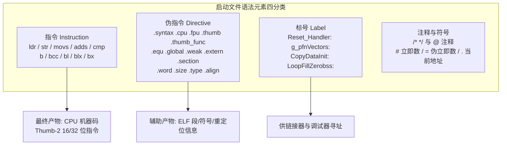
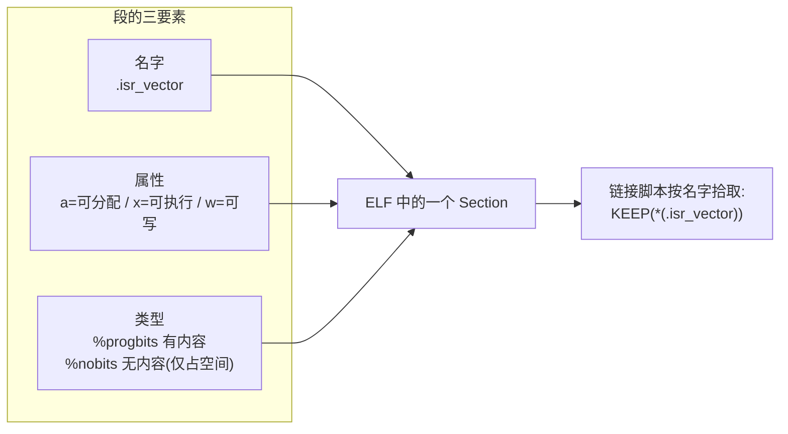
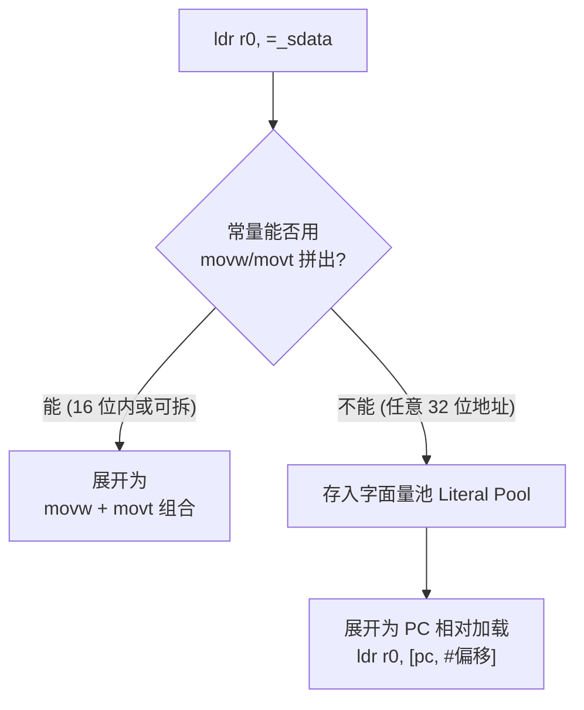
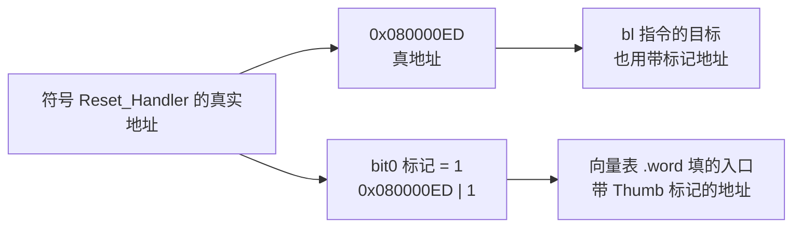
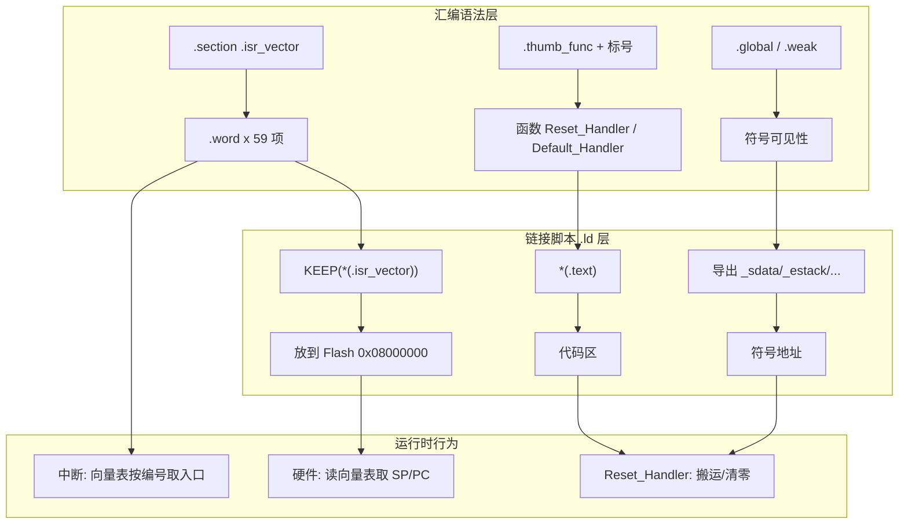

# STM32F103C8T6 启动文件汇编语法详解

> 主题：`startup_stm32f103c8.s` 中**每一条语法元素**（GNU 汇编伪指令 + ARM Thumb-2 指令）的含义、机制与原理。
> 适用芯片：STM32F103C8T6（Cortex-M3，仅支持 Thumb/Thumb-2 指令集）。
> 配套文档：《STM32F103C8T6_内存映射_启动文件_链接文件_ELF详解》（讲流程），本文（讲语法）。
> 全文为"通俗 → 机制 → 原理"三层结构，含可渲染 Mermaid 图与三种工具链（GCC/Keil/IAR）对比代码。

---

## 一、总览：启动文件到底用的是"什么语言"

### 1.1 通俗理解

启动文件不是 C，也不是普通"ARM 汇编"，而是 **GNU 汇编器（`arm-none-eabi-as`）支持的汇编语言**。它由两类东西组成：

| 类别 | 英文 | 作用 | 例子 |
|------|------|------|------|
| **指令** | Instruction | 让 CPU 真正干活的机器操作 | `ldr`、`str`、`bl`、`cmp` |
| **伪指令** | Directive / Pseudo-op | 给**汇编器**看的"命令"，不直接生成 CPU 操作 | `.equ`、`.word`、`.section` |
| **标号** | Label | 给某地址起个名字，供跳转/引用 | `Reset_Handler:`、`LoopFillZerobss:` |
| **注释** | Comment | 给人看的说明 | `/* ... */`、`@ ...` |

> 一句话：**指令对 CPU 说话，伪指令对汇编器说话，标号对链接器和调试器说话。**

### 1.2 启动文件语法元素全貌



> 图示解释：四类语法分工不同——指令产出"能跑的机器码"，伪指令产出"ELF 里的段、符号、大小等信息"，标号是这些信息之间的"地址索引"。

---

## 二、汇编器与三种工具链（先搞清"语法由谁解析"）

### 2.1 汇编处理流程


> 图示解释：`.s` 是文本，汇编器把它翻译成二进制 `.o`，链接器再把它和 C 代码的 `.o` 合并布局成最终 ELF。**同一个功能，不同工具链用不同的"方言"**。

### 2.2 三种主流工具链语法对比（对应"三版本"要求）

| 特性 | GCC（STM32CubeIDE/真机 GNU） | Keil MDK（armasm） | IAR EWARM |
|------|------------------------------|--------------------|-----------|
| 文件后缀 | `.s` | `.s` | `.s` |
| 段定义 | `.section NAME,"a",%progbits` | `AREA NAME, CODE, READONLY` | `SECTION NAME:CODE:NOROOT(2)` |
| 常量 | `.equ NAME, val` | `NAME EQU val` | `NAME EQU val` |
| 导出 | `.global NAME` | `EXPORT NAME` | `PUBLIC NAME` |
| 导入 | `.extern NAME` | `IMPORT NAME` | `EXTERN NAME` |
| 弱符号 | `.weak NAME` | `EXPORT NAME [WEAK]` | `PUBLIC NAME`（配合 weak 选项） |
| 数据字 | `.word val` | `DCD val` | `DCD val` |
| 预留空间 | `.space N` | `SPACE N` | `DS8 N` / `SPACE N` |
| 对齐 | `.align 4` | `ALIGN` | `ALIGN` |
| 函数属性 | `.thumb_func` / `.type X,%function` | `PROC ... ENDP` | `THUMB` 声明 |
| 栈顶 | 链接脚本给 `_estack` | 段内 `SPACE` + `__initial_sp` | `sfe(CSTACK)` 符号函数 |
| C 运行时入口 | `__libc_init_array` + `main` | `__main` | `__iar_program_start` |

> 设计机制解读：三种方言**概念一一对应**（段、符号、数据字、弱符号、入口），只是**关键字不同**。看懂 GNU 语法后，翻译到 Keil/IAR 只需"查表替换"。工程中选哪家工具链，启动文件就跟着换方言——**这是新手从 CubeIDE 切到 Keil 最容易踩的坑**。

---

## 三、GNU 汇编伪指令（Directive）逐条详解

> 按启动文件**从上到下出现顺序**讲解。每条给"含义 → 机制 → 原理"。

### 3.1 架构声明组（文件头部）

```asm
.syntax unified        /* ① 使用"统一汇编语言"UAL */
.cpu cortex-m3         /* ② 目标 CPU 型号 */
.fpu softvfp           /* ③ 浮点单元: 无硬件 FPU, 用软浮点 */
.thumb                 /* ④ 生成 Thumb 指令 */
```

| 伪指令 | 通俗理解 | 机制与原理 |
|--------|----------|-----------|
| `.syntax unified` | 告诉汇编器：用 ARM 官方的统一写法 | UAL（Unified Assembler Language）让同一句 `adds r0,r1,#1` 在 ARM 和 Thumb 模式下都成立。Cortex-M3 的 Thumb-2 混合 16/32 位指令必须用它才能正确编码 |
| `.cpu cortex-m3` | 指定编译器按 M3 的特性生成 | 让汇编器知道支持 Thumb-2 扩展指令（`movw`、`ldrd` 等），若写 M0 不支持的指令会报错 |
| `.fpu softvfp` | M3 没有硬件浮点单元 | 声明浮点用软件模拟，避免生成需要 FPU 的指令。F103C8T6 属于 M3，无 FPU |
| `.thumb` | 输出 Thumb 模式机器码 | Cortex-M3 **只支持 Thumb/Thumb-2**，不支持 ARM 32 位模式。这句让汇编器默认输出 Thumb 编码 |

### 3.2 常量定义

```asm
.equ  _Min_Stack_Size, 0x400   /* 栈最小 1KB */
.equ  _Min_Heap_Size,  0x200   /* 堆最小 512B */
```

| 伪指令 | 语法 | 机制 |
|--------|------|------|
| `.equ` | `.equ NAME, 值` | 定义**汇编期常量**，等价于 C 的 `#define`。此后 `NAME` 出现处都被替换为值 |

原理：这两个常量在启动文件里**只声明、不分配空间**。真正"占地方"是在链接脚本 `.ld` 里被引用（`. = . + _Min_Stack_Size`）。**启动文件申报需求，链接脚本落实空间**——这就是二者的契约。

### 3.3 符号可见性声明

```asm
.global  g_pfnVectors          /* ① 向量表符号对全局可见 */
.global  Reset_Handler         /* ② 复位入口全局可见 */
.weak    NMI_Handler           /* ③ 弱化中断处理函数 */
.weak    Default_Handler
.extern  _estack               /* ④ 声明外部符号(其实可省略) */
```

| 伪指令 | 作用 | 原理 |
|--------|------|------|
| `.global` | 把符号导出，让其他 `.o`（如 C 代码）能引用 | 写入 ELF `.symtab` 的 `GLOBAL` 绑定，链接器跨文件解析 |
| `.weak` | 把符号声明为"弱"定义 | **弱符号机制**：链接时若别处有同名**强**符号，强者胜出；无强者则用弱定义兜底。这就是"用户写一个 `USART1_IRQHandler()` 就自动替代启动文件里的默认实现"的底层原理 |
| `.extern` | 声明符号在别处定义 | GNU as 里引用未定义符号一般无需显式写 `.extern`，写了更明确 |

> 设计模式解读：`.weak` + 默认死循环 = "**回调预留**"模式。启动文件给每个中断留一个弱定义（死循环），用户定义同名强函数即可"自动接住"中断，无需修改启动文件——这是嵌入式中断扩展的黄金惯例。

### 3.4 段定义

```asm
.section .isr_vector, "a", %progbits
```

| 语法元素 | 含义 |
|----------|------|
| `.section` | 切换/创建段 |
| `.isr_vector` | 段名（中断向量表段） |
| `"a"` | flag：**a**llocatable，需要占用目标文件/内存空间 |
| `%progbits` | 类型：段内有**程序数据**（真实字节），区别于 `%nobits`（如 `.bss` 只占空间不占内容） |



> 图示解释：`.section` 在 `.o` 里创建一个命名段；链接脚本用 `*(.isr_vector)` 这个模式把**所有** `.o` 里的同名段收集到一起、摆到指定地址。**段名就是启动文件与链接脚本之间的"接口"**。对比：`.bss` 在 C 侧通常对应 `%nobits` 段（只清零占空间、ELF 里不存内容），所以烧录文件里没有 `.bss` 的字节。

### 3.5 数据声明

```asm
g_pfnVectors:
  .word _estack                    /* ① 4 字节, 值为 _estack(链接期解析) */
  .word Reset_Handler              /* ② 4 字节, 值为 Reset_Handler 地址 */
  .word NMI_Handler
  .word HardFault_Handler
  /* ... 共 59 个 .word ... */
```

| 伪指令 | 语法 | 原理 |
|--------|------|------|
| `.word 值` | `.word expr1, expr2, ...` | 分配 4 字节并按序填入值。表达式可以是**链接期才解析的符号**（如 `_estack`） |
| `.size 符号, .-符号` | 计算符号占用的字节数 | `.` 是**当前地址计数器**，`.-g_pfnVectors` = 当前地址减符号起始地址 = 段字节数，写入 ELF 符号大小 |
| `.align 4` | 把当前位置对齐到 `2^4` | 保证段边界对齐，ARM 要求关键数据/代码 4 字节对齐，否则可能 HardFault |

原理：`g_pfnVectors:` 这个标号指向向量表首地址。`_estack` 和 `Reset_Handler` 都是**链接期符号**——汇编时它们还没有值，汇编器在 `.o` 里记下"这里有个重定位，指向符号 X"；链接器把最终地址回填。这就是**静态重定位**在汇编层的体现。

### 3.6 符号属性与函数标记

```asm
.type  g_pfnVectors, %object   /* ① 标记为数据对象 */
.size  g_pfnVectors, .-g_pfnVectors

.thumb_func                    /* ② 声明下一个标号是 Thumb 函数入口 */
.global Reset_Handler
.type  Reset_Handler, %function /* ③ 标记为函数 */
```

| 伪指令 | 作用 | 原理 |
|--------|------|------|
| `.type X, %object` / `%function` | 标注符号是数据还是函数 | 写入 ELF 符号表类型字段，供调试器/反汇编正确解析 |
| `.size X, 长度` | 标注符号占用大小 | 同上，供链接器 GC 与调试器使用 |
| `.thumb_func` | **把符号地址的 bit[0] 置 1** | 见第六章深挖② |

---

## 四、ARM Thumb-2 指令（Instruction）逐条详解

### 4.1 数据加载 / 存储

```asm
ldr   sp, =_estack      /* ① 伪指令: 加载 32 位常量/符号地址 */
ldr   r0, =_sdata       /* ② 同上, 加载段起始地址 */
ldr   r4, [r2, r3]      /* ③ 真实指令: 从 内存[r2+r3] 读 4 字节到 r4 */
str   r4, [r0, r3]      /* ④ 真实指令: 把 r4 写入 内存[r0+r3] */
```

| 指令 | 格式 | 语义 | 备注 |
|------|------|------|------|
| `ldr Rd, =常量` | **伪指令**，不是真机器指令 | 把 32 位常量/符号地址装进寄存器 | 汇编器自动展开（见 6.1） |
| `ldr Rd, [Rn]` | 间接寻址 | Rd = 内存[Rn] 的值 | |
| `ldr Rd, [Rn, Rm]` | 基址+变址 | Rd = 内存[Rn+Rm] 的值 | 数据搬运循环用 |
| `str Rd, [Rn, Rm]` | 同上 | 内存[Rn+Rm] = Rd | |

### 4.2 算术 / 逻辑 / 比较

```asm
movs  r3, #0        /* r3 = 0, 且更新条件标志(s后缀) */
adds  r3, r3, #4    /* r3 = r3 + 4 */
adds  r4, r0, r3    /* r4 = r0 + r3 */
cmp   r4, r1        /* 比较: 计算 r4 - r1, 只改标志不写结果 */
```

| 指令 | 语义 | 机制要点 |
|------|------|---------|
| `movs Rd, #imm` | Rd = 立即数 | `s` 后缀=更新 **APSR 条件标志**（N/Z/C/V） |
| `adds Rd, Rn, imm` | Rd = Rn + imm | `s` 后缀让加法结果影响标志 |
| `cmp Rn, Rm` | 计算 Rn − Rm，**只更新标志** | 不写寄存器，专供后续条件跳转判断 |
| `subs` / `sub` | 减法 | 与 adds 对称 |

> 机制解读：`s` 后缀不是装饰——后续 `bcc` 判断的就是 `cmp`/`adds` 留下的进位标志。**"一条指令更新标志，另一条条件跳转读标志"** 是汇编循环/分支的基本模式。

### 4.3 跳转 / 调用

```asm
b     LoopCopyDataInit    /* 无条件跳转 */
bcc   CopyDataInit        /* 条件跳转: 无进位(C=0)时跳 */
bl    SystemInit          /* 调用函数: 保存返回地址到 LR */
bl    main
b     LoopForever         /* 死循环 */
```

| 指令 | 语义 | 原理 |
|------|------|------|
| `b label` | 无条件跳转 | 相对偏移编码，目标 ±32MB 内 |
| `bcc label` | **B**ranch if **C**arry **C**lear | 判断上一条算术指令的 C 标志（见 6.3） |
| `bl label` | 调用函数（**B**ranch with **L**ink） | 先把**返回地址**存入 **LR**（r14），再跳转；配合 `bx lr` 返回 |
| `blx label` | 调用并可能切换指令集 | M3 无 ARM 模式，一般不用 |
| `bx lr` | 返回调用者 | 把 LR 的值装进 PC |

> 机制解读：`bl` 是 C 函数调用的汇编基础——编译 C 的 `f();` 就是 `bl f`。**没有 `bl` 就没有 `main()` 的回调**。启动文件里 `bl SystemInit` 后，返回地址在 LR；`bl main` 后 main 的 `return` 最终会 `bx lr` 回到启动文件的 `LoopForever` 死循环——**所以 main 不能写"返回"，否则会掉进空转**。

### 4.4 寻址方式汇总（Thumb-2 常用）

| 寻址方式 | 语法 | 例 | 用途 |
|----------|------|-----|------|
| 立即数寻址 | `movs r3, #4` | 常数 | 初始化 |
| 寄存器寻址 | `adds r4, r0, r3` | 加法 | 地址累加 |
| 基址寻址 | `ldr r4, [r2]` | 间接取数 | 指针解引用 |
| 基址+偏移 | `ldr r4, [r0, r3]` | 数组下标 | 数据搬运 |
| 伪立即数 | `ldr r0, =_sdata` | 符号地址 | 取链接期地址 |
| PC 相对 | `ldr r0, [pc, #off]` | 字面量池 | `=常量`展开结果 |

### 4.5 寄存器别名速查

```text
r0 - r12 : 通用寄存器
r13 = SP : 栈指针(主栈 MSP, 异常用 PSP)
r14 = LR : 链接寄存器(函数返回地址)
r15 = PC : 程序计数器
APSR     : 应用程序状态寄存器(含 N/Z/C/V 标志)
```

> 注意：Cortex-M3 是"**MSP 为主**"的栈架构。启动文件第一句 `ldr sp, =_estack` 初始化的是 MSP；进入异常时硬件自动压栈/出栈，不需要软件管理——这正是 M3 比 M0+ 强的地方（硬件自动保存 8 个寄存器现场）。

### 4.6 条件码速查表

| 助记符 | 判断条件 | 语义 | 启动文件中使用 |
|--------|----------|------|----------------|
| EQ | Z=1 | 相等 | |
| NE | Z=0 | 不等 | |
| **CS/HS** | C=1 | 无符号 ≥ | |
| **CC/LO** | C=0 | 无符号 < | **`bcc` = `blo`，数据搬运循环条件** |
| MI / PL | N=1 / N=0 | 负 / 非负 | |
| VS / VC | V=1 / V=0 | 溢出 / 无溢出 | |
| HI / LS | C=1且Z=0 / C=0或Z=1 | 无符号 > / ≤ | |
| GE / LT | N=V / N≠V | 有符号 ≥ / < | |
| GT / LE | Z=0且N=V / Z=1或N≠V | 有符号 > / ≤ | |
| AL | 无条件 | 总是执行 | `b` 即 `bal` |

---

## 五、深挖：三条最容易"看不懂"的语法

### 5.1 深挖①：`ldr sp, =_estack` 的"字面量池"真相

`ldr Rd, =常量` 不是一条真实机器指令，而是**汇编器展开的伪指令**。展开逻辑：



> 图示解释：Cortex-M3 的立即数加载有位数限制（Thumb-2 的 `movw/movt` 可拼 32 位常量），但链接期地址（如 `_estack = 0x20005000`）汇编器尚不知道，只能**先把符号丢进"字面量池"（一段跟随代码的数据），再让指令 PC 相对地把它捞出来**。你在反汇编里看到 `ldr sp, [pc, #0x0c]` 就是它的真实形态——**PC 就是字面量池的"指针"**。

```text
/* 反汇编看到的真实形态 (示意) */
080000a0: ldr   sp, [pc, #0x0c]   ; 从 PC+0x0c 处取栈顶值
080000a4: bl    0x08001234        ; SystemInit
080000a8: ...（代码继续）
080000b4: .word 0x20005000        ; 字面量池: _estack 的值
```

### 5.2 深挖②：`.thumb_func` 与地址的 bit[0]

Thumb 代码的函数入口地址，**bit[0] 必须为 1**——这是 Cortex-M 约定的"Thumb 标记位"。



> 图示解释：向量表里 `Reset_Handler` 那一项，实际存的是 **真地址 + 1**（bit0=1）。`.thumb_func` 的作用就是让汇编器给符号地址的 bit0 打上这个标记。如果漏写 `.thumb_func`，硬件跳到 bit0=0 的地址会尝试进入 ARM 模式——M3 不支持，**直接 HardFault**。这是"为什么中断向量表每个函数都要 `.thumb_func`"的答案。

### 5.3 深挖③：`bcc` 循环条件的底层原理

数据搬运循环用 `cmp` + `bcc` 实现"无符号小于则继续"：

```asm
LoopCopyDataInit:
  adds  r4, r0, r3      /* r4 = 当前目标地址 */
  cmp   r4, r1          /* 计算 r4 - r1 */
  bcc   CopyDataInit    /* 若 C=0(无借位, 即 r4 < r1) 则继续搬运 */
```

| 步骤 | 标志变化 | 含义 |
|------|----------|------|
| `cmp r4, r1` | 硬件计算 r4 − r1 | 若 r4 ≥ r1 产生借位 C=1；若 r4 < r1 则 C=0 |
| `bcc` | 读 C 标志 | C=0 → 跳转，继续搬；C=1 → 顺序执行，搬运结束 |

> 机制解读：ARM 的进位标志 `C` 在减法中体现"**是否借位**"——C=0 表示不够减（被减数小于减数）。所以 `bcc`（Carry Clear）天然等价于**无符号小于**判断。这也是为什么循环计数器一般用**无符号比较**：既快（一条指令）又避免有符号溢出的坑。

---

## 六、三工具链：同一个 Reset_Handler 的三种写法

> 对应规则"三版本"要求。同一个"设栈→调用 SystemInit→进 C 运行时"逻辑，GNU / Keil / IAR 三种方言。

### 6.1 GNU（GCC 工具链）

```asm
/* ================= GNU as 语法 ================= */
.syntax unified
.cpu cortex-m3
.fpu softvfp
.thumb

.thumb_func
.global Reset_Handler
Reset_Handler:
  ldr   sp, =_estack          /* 栈顶(链接脚本提供) */
  bl    SystemInit            /* 配时钟 */
  ldr   r0, =_sdata           /* 搬运 .data: Flash -> RAM */
  ldr   r1, =_edata
  ldr   r2, =_sidata
  movs  r3, #0
  b     LoopCopyDataInit
CopyDataInit:
  ldr   r4, [r2, r3]
  str   r4, [r0, r3]
  adds  r3, r3, #4
LoopCopyDataInit:
  adds  r4, r0, r3
  cmp   r4, r1
  bcc   CopyDataInit
  bl    __libc_init_array     /* C++ 静态构造(可省) */
  bl    main
LoopForever:
  b     LoopForever
```

### 6.2 Keil MDK（armasm）

```asm
; ================= Keil armasm 语法 =================
                PRESERVE8
                THUMB

; 向量表
                AREA    RESET, DATA, READONLY
                EXPORT  __Vectors
__Vectors       DCD     __initial_sp                ; 栈顶
                DCD     Reset_Handler               ; 复位入口
                DCD     NMI_Handler
                DCD     HardFault_Handler
                ; ... 其余中断 ...

                AREA    |.text|, CODE, READONLY

; 复位处理
Reset_Handler   PROC
                EXPORT  Reset_Handler [WEAK]
                IMPORT  SystemInit
                IMPORT  __main
                LDR     R0, =SystemInit             ; 取函数地址
                BLX     R0                          ; 调用(armasm 无 bl 直接调外部函数)
                LDR     R0, =__main                 ; __main: C库入口
                BX      R0                          ; 内部完成 .data/.bss 初始化并调 main
                ENDP

; 默认中断处理
Default_Handler PROC
                EXPORT  Default_Handler [WEAK]
                B       .
                ENDP
                END
```

> Keil 要点：`__main` 是 **ARM C 运行时库入口**，它内部会替你完成 `.data` 搬运和 `.bss` 清零再调 `main`——所以 Keil 启动文件**不必手写搬运循环**。`DCD` = 数据字，`PROC/ENDP` = 函数包裹，`[WEAK]` = 弱导出。

### 6.3 IAR EWARM

```asm
; ================= IAR 汇编器语法 =================
                MODULE  ?cstartup

                SECTION CSTACK:DATA:NOROOT(3)      ; 栈段
                SECTION .intvec:CODE:NOROOT(2)     ; 向量表段

                EXTERN  SystemInit
                EXTERN  __iar_program_start
                PUBLIC  __vector_table

                DATA
__vector_table
                DCD     sfe(CSTACK)                ; 栈顶: 栈段结束地址
                DCD     Reset_Handler
                DCD     NMI_Handler
                DCD     HardFault_Handler
                ; ... 其余中断 ...

                THUMB
Reset_Handler:
                LDR     R0, =SystemInit
                BLX     R0
                LDR     R0, =__iar_program_start   ; IAR 运行时入口
                BX      R0

; 默认处理
                THUMB
Default_Handler:
                B       Default_Handler
                ; ...
                END
```

> IAR 要点：`sfe(CSTACK)` 是 IAR 的**符号函数**，取段结束地址当栈顶；`__iar_program_start` 是 IAR 的 C 运行时入口（等价于 Keil `__main`）。`NOROOT` 表示"没有显式引用也不删除"。

### 6.4 三种写法对照小结

| 语义 | GNU | Keil | IAR |
|------|-----|------|-----|
| 函数调用 | `bl` 直接调 | `LDR R0,=fn` + `BLX R0` | `LDR R0,=fn` + `BLX R0` |
| C 运行时入口 | `main`(裸) / `__libc_init_array` | `__main` | `__iar_program_start` |
| 数据搬运 | 启动文件手写循环 | 库 `__main` 代做 | 库 `__iar_program_start` 代做 |
| 栈顶来源 | 链接脚本 `_estack` | 段内 `__initial_sp` | `sfe(CSTACK)` |

---

## 七、语法 → 段 → 链接 → 运行时的完整关联



> 图示解释：**语法层产出的段/符号/函数，由链接层拾取布局并算地址，最终驱动运行层的三个行为**（硬件取向量、复位搬运、中断分发）。学语法不是为了写汇编本身，而是为了理解"这三层怎么咬合"。

---

## 八、启动文件语法速查表

| 语法 | 分类 | 一句话作用 | 备注 |
|------|------|-----------|------|
| `.syntax unified` | 伪指令 | 用统一汇编语言 UAL | Thumb-2 必需 |
| `.cpu cortex-m3` | 伪指令 | 按 M3 特性汇编 | |
| `.fpu softvfp` | 伪指令 | 声明软浮点 | M3 无 FPU |
| `.thumb` | 伪指令 | 生成 Thumb 机器码 | M3 唯一模式 |
| `.thumb_func` | 伪指令 | 给函数地址 bit0 置 1 | 漏写会 HardFault |
| `.equ NAME, v` | 伪指令 | 汇编期常量 | 类似 #define |
| `.global X` | 伪指令 | 导出符号 | 跨 .o 可见 |
| `.weak X` | 伪指令 | 弱化符号 | 强符号可覆盖 |
| `.extern X` | 伪指令 | 声明外部符号 | 多可省 |
| `.section N,"a",%progbits` | 伪指令 | 创建段 | "a"=可分配 |
| `.word v` | 伪指令 | 分配 4 字节 | 向量表逐项 |
| `.align 4` | 伪指令 | 对齐到 16 字节 | 防 HardFault |
| `.type X,%function` | 伪指令 | 标记函数/对象 | 供 ELF 符号表 |
| `.size X, 长度` | 伪指令 | 记录符号大小 | |
| `ldr Rd, =常量` | 伪指令 | 加载 32 位常量 | 字面量池展开 |
| `ldr Rd, [Rn]` | 指令 | 读内存 | |
| `str Rd, [Rn]` | 指令 | 写内存 | |
| `movs Rd, #imm` | 指令 | 立即数 | s=更新标志 |
| `adds Rd, Rn, imm` | 指令 | 加法 | |
| `cmp Rn, Rm` | 指令 | 只改标志 | 供条件跳转 |
| `b label` | 指令 | 无条件跳转 | |
| `bcc label` | 指令 | C=0 则跳 | 无符号小于 |
| `bl label` | 指令 | 调用函数 | 返回地址存 LR |
| `bx lr` | 指令 | 返回 | |
| `label:` | 标号 | 给地址命名 | |
| `/* */` `@` | 注释 | 说明 | |

---

## 附：常见陷阱清单

1. **漏写 `.thumb_func`**：向量表里的函数入口 bit0=0 → 复位进 ARM 模式 → 直接 HardFault。
2. **混用工具链语法**：把 Keil 的 `AREA`/`DCD` 写进 GNU `.s`，汇编器直接报错。
3. **`.align 4` 误解**：GNU 是 `2^4` 字节（16 字节）；Keil `ALIGN` 默认 4 字节。
4. **弱符号被抢**：自己写 `SysTick_Handler` 时忘记加 `void` 参数声明，链接期符号名带 `_` 前缀（ARM 上）导致覆盖失败。
5. **`bcc` vs `blt`**：循环用无符号比较用 `bcc`；有符号比较才用 `blt`，混用会出现"负值循环不退出"的隐蔽 bug。
6. **`ldr =` 字面量池放太远**：PC 相对偏移超范围（M3 为 ±4KB 左右）链接报错，需人工 `LTORG`/调整布局。
