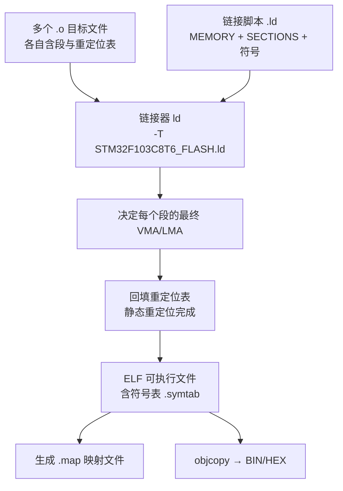
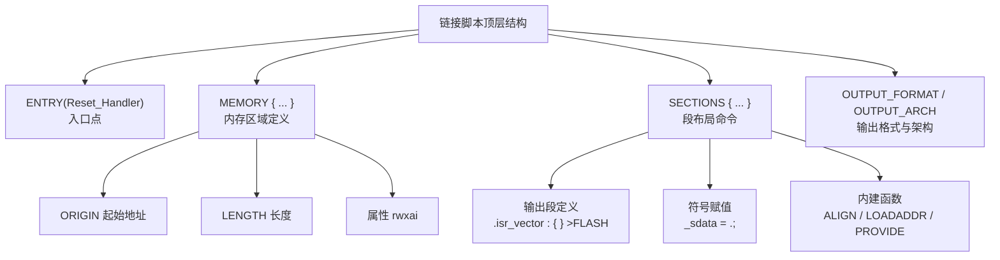
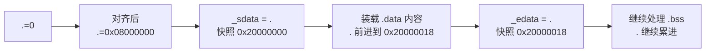
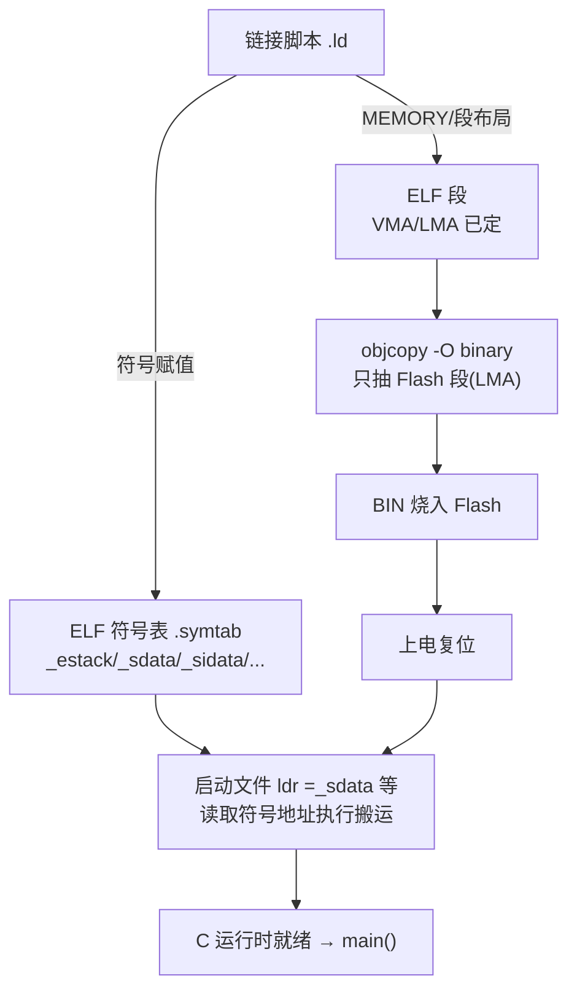
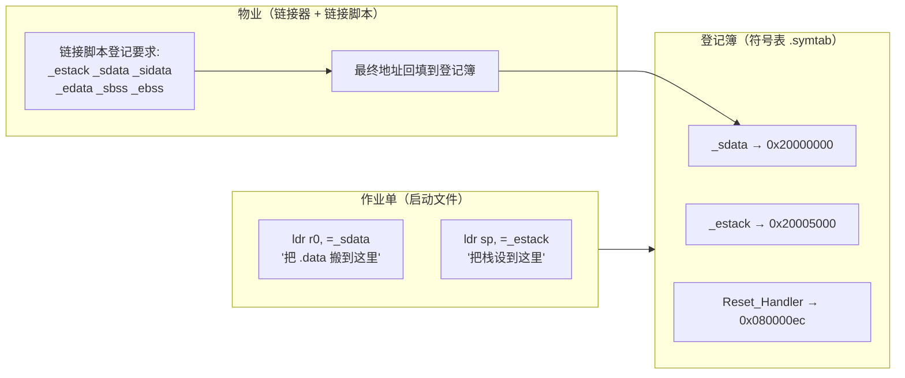
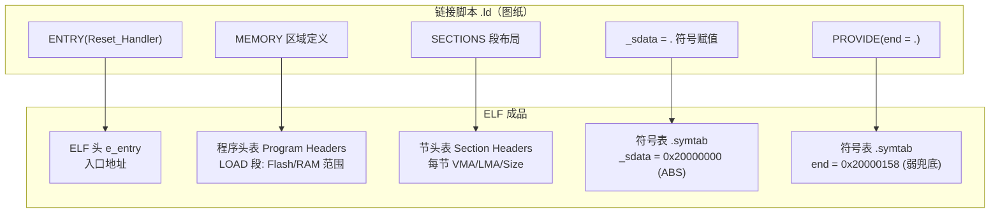
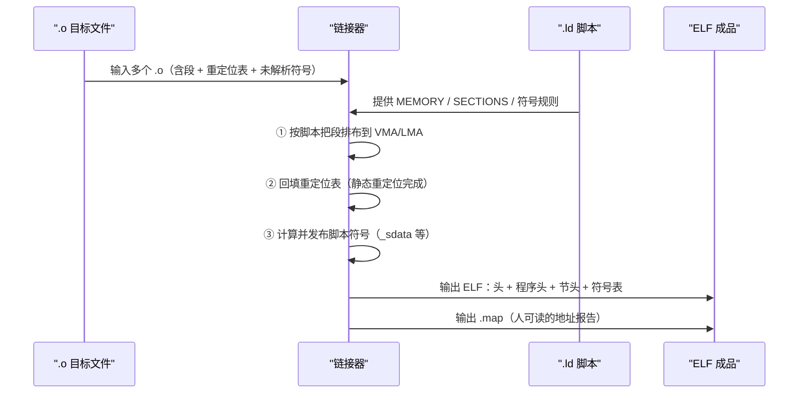

# STM32F103C8T6 链接文件（.ld）语法与符号表详解

> 主题：`STM32F103C8T6_FLASH.ld` 链接脚本的**每一条语法**（GNU ld 脚本命令/表达式），以及**符号集（契约符号）与符号表（ELF .symtab）**的机制。
> 适用芯片：STM32F103C8T6（64KB Flash @ 0x08000000，20KB SRAM @ 0x20000000）。
> 系列文档：
> - 《STM32F103C8T6_内存映射_启动文件_链接文件_ELF详解》——五者关联全景
> - 《STM32F103C8T6_启动文件汇编语法详解》——启动文件语法
> - **本文**——链接文件语法与符号表
> 全文为"通俗 → 机制 → 原理"三层结构，含可渲染 Mermaid 图与 **GCC/Keil/IAR 三种链接配置**对比代码。

---

## 一、总览：链接脚本是什么

### 1.1 通俗理解

链接脚本（Linker Script）是**链接器（`arm-none-eabi-ld`）的操作手册**。它回答三个问题：

1. **芯片有哪些内存？**（`MEMORY` 命令 → Flash/SRAM 的地址与大小）
2. **每个段放哪？**（`SECTIONS` 命令 → 各段落的 VMA/LMA）
3. **暴露哪些符号？**（`_estack`、`_sdata` 等 → 启动文件与运行时使用）

> 一句话：**没有 `.ld`，链接器不知道把代码放到哪个地址，也无法产出可烧录的镜像**。`-T 脚本` 指定它，`-Wl,-Map` 还能产出 `.map` 验证结果。

### 1.2 链接器工作全景



> 图示解释：链接器是"**地址分配器 + 补丁工**"。它把分散在 `.o` 里的段按脚本布局，然后把所有"跳转/取址"的占位符号回填成最终地址，最后产出 ELF 与符号表。

---

## 二、链接脚本顶层语法结构



> 图示解释：脚本由若干**顶层命令**组成，其中 `MEMORY` 和 `SECTIONS` 是核心。`ENTRY` 只是告诉链接器入口点（供 ELF 头与调试器用），真正的"启动"仍由硬件+启动文件完成。

---

## 三、命令语法逐条详解

### 3.1 `ENTRY()`

```ld
ENTRY(Reset_Handler)      /* 设置 ELF 入口点 */
```

| 语法 | 作用 | 备注 |
|------|------|------|
| `ENTRY(符号)` | 把符号地址写入 ELF 头 `e_entry` | 调试器"复位即停"、反汇编起始点用；**不写也不影响上电**（硬件走向量表） |

> 原理：若省略 `ENTRY`，链接器按"第一个可执行段首地址"推入口。写了它，`readelf -h` 的 Entry point 就是 `Reset_Handler`，方便工具链识别。

### 3.2 `MEMORY` 命令

```ld
MEMORY
{
  FLASH (rx)      : ORIGIN = 0x08000000, LENGTH = 64K
  RAM (xrw)       : ORIGIN = 0x20000000, LENGTH = 20K
}
```

| 语法元素 | 含义 |
|----------|------|
| `FLASH (rx)` | 区域名 + 属性括号 |
| `ORIGIN = 0x08000000` | 起始地址 |
| `LENGTH = 64K` | 长度（`K`=1024，`M`=1048576） |

**区域属性一览：**

| 属性 | 含义 | STM32 脚本用法 |
|------|------|---------------|
| `r` | 可读 | Flash: `rx`（读+执行） |
| `w` | 可写 | RAM: `xrw` |
| `x` | 可执行 | RAM 允许从内存跑代码（F1 支持） |
| `a` | 可分配 | 默认有 |
| `i` / `l` | 已初始化 | 默认有 |
| `!` | 取反 | 如 `(rwx!x)` |

> 机制解读：**`MEMORY` 就是"内存映射的软件化"**。芯片手册给 64KB Flash，脚本就写 `LENGTH = 64K`；若芯片是 C6（32KB Flash），此处改 `32K` 即可。区域的属性用于**越界/权限检查**——把段放到错误区域，链接器会报错。

### 3.3 `SECTIONS` 命令（核心）

```ld
SECTIONS
{
  .isr_vector :
  {
    . = ALIGN(4);
    KEEP(*(.isr_vector))
    . = ALIGN(4);
  } >FLASH

  /* ... 其他段 ... */
}
```

**输出段定义的完整语法：**

```text
段名 [地址] [(类型)] :
  [AT(加载地址)] [ALIGN(对齐)] [SUBALIGN(子段对齐)]
  {
    段内命令...
  } [>VMA区域] [AT>LMA区域] [:程序头...] [=填充值]
```

### 3.4 输入段匹配：`*(.text)` 通配符

```ld
.text :
{
  . = ALIGN(4);
  *(.text)          /* 收集所有 .o 的 .text 段 */
  *(.text*)         /* 收集 .text.foo 等子段 */
  . = ALIGN(4);
} >FLASH
```

| 匹配语法 | 含义 |
|----------|------|
| `*(.text)` | 所有目标文件的 `.text` 段 |
| `*(.text*)` | `.text` 及所有子段（`.text.Reset_Handler` 等） |
| `*(.rodata*)` | `.rodata` 及子段 |
| `*(.data .data.*)` | 多项并列 |
| `*(EXCLUDE_FILE(*a.o) .text)` | 排除某文件 |
| `libm.a:*(.text)` | 限定某个库 |

> 设计模式解读：`*` 通配 + 顺序 = "**分类收编**"。链接器按脚本里写出的顺序**从前到后摆放**，所以向量表必须写在最前、放在 Flash 起始。这也是为什么**加段（如 `.fastdata`）要显式写进脚本**，否则会被放进"默认收容区"（未匹配段落到内存尾部）。

### 3.5 `KEEP()` 与垃圾回收

```ld
KEEP(*(.isr_vector))    /* 防止被 --gc-sections 删除 */
```

> 机制：工程常用 `-Wl,--gc-sections` 删除未引用段以减小体积。但向量表**没有代码引用它**（硬件直接访问），会被误删。`KEEP()` 明确告诉链接器"这个段必须保留"。**缺失它 = 复位后取向量表全是 0 = 立即 HardFault**。

### 3.6 位置计数器 `.` 与对齐

```ld
. = ALIGN(4);     /* 把当前位置对齐到 16 字节(2^4) */
_sdata = .;       /* 记录当前位置到符号 */
```

- `.` 是 **location counter（位置计数器）**，指向当前输出段的组装位置。
- `ALIGN(4)` = 向上对齐到 `2^4 = 16` 字节（GNU 的 `ALIGN(n)` 是 **2 的 n 次幂**，注意和直觉不同）。
- 符号赋值 `_sdata = .;` 把"此刻的地址"记进符号。

> 通俗：`.` 就像写文件时的"光标"，`ALIGN` 是"跳到下一个边界"，符号赋值是"在光标处贴个标签"。

### 3.7 VMA/LMA 分配语法

```ld
/* VMA = RAM, LMA = Flash: 初值存在 Flash, 运行必须在 RAM */
.data :
{
  _sdata = .;
  *(.data)
  *(.data*)
  _edata = .;
} >RAM AT> FLASH

_sidata = LOADADDR(.data);   /* LMA: 初始值在 Flash 的实际地址 */
```

| 语法 | 含义 |
|------|------|
| `>RAM` | VMA 分配到 RAM 区域 |
| `AT> FLASH` | LMA 分配到 Flash 区域 |
| `AT(表达式)` | 显式给出 LMA |
| `LOADADDR(.data)` | 返回某段的 LMA 值 |

> 机制解读：`.data` 是"**初值在 Flash、运行在 RAM**"的双址段。`>RAM AT> FLASH` 一句话把 VMA/LMA 分开；`_sidata = LOADADDR(.data)` 记录下 LMA，启动文件用它当搬运**源地址**。`>FLASH` 的段（`.text`）则 VMA==LMA，无需搬运。

### 3.8 `PROVIDE` 与条件定义

```ld
._user_heap_stack :
{
  . = ALIGN(4);
  PROVIDE ( end = . );    /* 只有用户没定义 end 时才生效 */
  PROVIDE ( _end = . );
  . = . + _Min_Heap_Size; /* 堆向上留 */
  . = . + _Min_Stack_Size;/* 栈区留 */
  . = ALIGN(4);
} >RAM
```

| 语法 | 机制 |
|------|------|
| `PROVIDE(符号 = 表达式)` | **仅当该符号未被别处定义**时才定义它——"兜底符号" |
| `end` / `_end` | newlib `malloc` 等库需要的堆顶地址 |

> 设计模式解读：`PROVIDE` = "**默认实现**"，优先级低于用户强定义。与启动文件的 `.weak` 异曲同工：库/脚本给默认值，用户可覆盖。如果你自己定义了 `end`，脚本里的就不生效。

### 3.9 其他常用命令

```ld
OUTPUT_FORMAT("elf32-littlearm")  /* 输出 ELF 格式(小端 ARM) */
OUTPUT_ARCH(arm)                  /* 目标架构 arm */
STARTUP(startup.o)                /* 指定第一个输入文件(可选) */
```

---

## 四、表达式与内建函数

### 4.1 运算符

| 类别 | 运算符 |
|------|--------|
| 算术 | `+ - * / %` |
| 移位 | `<< >>` |
| 逻辑 | `& | ^ ! ~` |
| 关系/比较 | `== != < <= > >= && \|\|` |
| 赋值 | `= += -= *= /= <<= >>= &= \|=` |

### 4.2 内建函数表

| 函数 | 作用 | 例子 |
|------|------|------|
| `ALIGN(n)` | 对齐位置计数器 | `. = ALIGN(4)` |
| `ADDR(段)` | 段的 VMA | `ADDR(.data)` |
| `LOADADDR(段)` | 段的 LMA | `_sidata = LOADADDR(.data)` |
| `SIZEOF(段)` | 段的大小 | `SIZEOF(.isr_vector)` |
| `ORIGIN(区域)` | 区域起始 | `ORIGIN(RAM)` |
| `LENGTH(区域)` | 区域长度 | `LENGTH(RAM)` |
| `MAX(a,b)` / `MIN(a,b)` | 大小比较 | `MAX(0x100, SIZEOF(.data))` |
| `DEFINED(符号)` | 是否已定义 | `DEFINED(start)` |
| `ABSOLUTE(表达式)` | 转绝对地址 | 用于精确取址 |
| `SIZEOF_HEADERS` | 文件头大小 | 少见 |

### 4.3 位置计数器三大特性（原理）

1. **全局累进**：`SECTIONS` 开头 `.` 从 0 开始，处理每个段后累加，保证段与段之间不重叠。
2. **段内可赋值**：`. = ALIGN(4)`、`. = . + 0x10` 手动跳位（用于预留空洞/对齐）。
3. **符号快照**：`_sdata = .;` 是"快照"，把当前地址记下来，之后 `.` 继续前进不影响已记值。



> 图示解释：同一个 `.` 先当"对齐工具"再当"快照源"，两个符号 `_sdata`/`_edata` 恰好框住 `.data` 的数据区间——这就是启动文件搬运循环要的"起点和终点"。

---

## 五、符号集与符号表（重点）

### 5.1 链接器定义符号的机制

链接脚本里的赋值（`_estack = ORIGIN(RAM) + LENGTH(RAM);`）会创建**链接器定义符号**（linker-defined symbols）。它们的本质：

- **不占内存**：只是"地址的别名"，值就是某个地址。
- **绝对符号**：ELF 中 `shndx = ABS`，`ldr r0, =_sdata` 直接装载其值。
- **全局可见**：任何 `.c`/`.s` 用 `extern char _sdata[];` 即可访问。

> 机制解读：C 侧看到的是"一个变量"，实际**没有这个变量的存储**——它只是一个带地址值的常量。所以 `&_sdata` 就是那段数据的地址，而 `_sdata` 本身没有字节被分配。**这是"地址标签"模式**。

### 5.2 契约符号集（符号集）

启动文件与链接脚本通过以下符号"握手"，这是一套**硬契约**：

| 符号 | 脚本中的定义 | 启动文件用法 | 契约含义 |
|------|--------------|-------------|----------|
| `_estack` | `ORIGIN(RAM) + LENGTH(RAM)` | 向量表首项 + `ldr sp` | **栈顶地址** |
| `_sidata` | `LOADADDR(.data)` | 搬运源 | **初值在 Flash 的地址** |
| `_sdata` | `_sdata = .;`（.data 首） | 搬运目标起点 | **.data 在 RAM 的起点** |
| `_edata` | `_edata = .;`（.data 尾） | 搬运终点 | **.data 在 RAM 的终点** |
| `_sbss` | `_sbss = .;` | 清零起点 | **.bss 起点** |
| `_ebss` | `_ebss = .;` | 清零终点 | **.bss 终点** |
| `end` / `_end` | `PROVIDE(end = .)` | 堆边界 | malloc 堆顶 |
| `_Min_Stack_Size` | （来自启动文件 `.equ`） | 脚本引用 | 栈预留大小 |
| `_Min_Heap_Size` | （来自启动文件 `.equ`） | 脚本引用 | 堆预留大小 |
| `Reset_Handler` | （来自启动文件 `.global`） | `ENTRY()` 引用 | 程序入口 |

> 设计模式解读：**符号集就是"接口文档"**。`.ld` 负责"算地址并发布符号"，`.s` 负责"消费符号执行搬运"。两者独立演进，只要符号名不变就互相兼容——这就是嵌入式链接器脚本的**解耦设计**。

### 5.3 ELF 符号表 `.symtab` 结构

符号表是 ELF 里的一个节（`.symtab`），每条符号记录：

| 字段 | 含义 | 例子 |
|------|------|------|
| `st_name` | 符号名（指向字符串表） | `Reset_Handler` |
| `st_value` | 符号值（地址/常量） | `0x080000ec` |
| `st_size` | 大小 | 函数字节数 |
| `st_info` | **绑定(Bind)** + **类型(Type)** | GLOBAL + FUNC |
| `st_shndx` | 所在节索引 | `.text` / `ABS` / `UND` |
| `st_other` | 可见性 | 默认 |

**Bind 绑定类型：**

| 绑定 | 值 | 含义 |
|------|-----|------|
| LOCAL | 0 | 本文件私有（如局部标签、段符号） |
| GLOBAL | 1 | 全局可见 |
| WEAK | 2 | 弱全局（可被强覆盖） |

**Type 类型：**

| 类型 | 含义 |
|------|------|
| NOTYPE | 无类型 |
| OBJECT | 数据对象（变量/数组） |
| FUNC | 函数 |
| SECTION | 段符号（如 `.text` 本身） |
| FILE | 源文件符号 |

### 5.4 用 `nm` / `readelf` 查看符号表

```bash
# 符号表按地址排序 —— 观察契约符号(链接器定义)与函数符号
arm-none-eabi-nm -n app.elf

# 完整 ELF 符号表
arm-none-eabi-readelf -s app.elf

# 目标文件符号表(汇编期)
arm-none-eabi-nm -n startup_stm32f103c8.o
```

**`nm -n` 输出实例（F103C8T6 工程）：**

```text
08000000 T g_pfnVectors            ← 向量表(全局,text)
080000ec T Reset_Handler           ← 复位入口(函数)
08000110 t CopyDataInit            ← 局部函数(小写t)
0800011c t LoopCopyDataInit
08000138 T SystemInit              ← CMSIS 提供
080009c0 T main
20000000 A _sdata                  ← 链接器定义,绝对符号(大A)
20000018 A _edata                  ← .data 结束地址
20000018 A _sbss                   ← .bss 开始
20000158 A _ebss                   ← .bss 结束
08000acc A _sidata                 ← 初值在 Flash 的地址
20005000 A _estack                 ← 栈顶(最高地址)
20000158 A _end                    ← 堆边界
08000000 T __isr_vector            ← 由 g_pfnVectors 别名
```

| `nm` 字母 | 含义 |
|-----------|------|
| `T` / `t` | 代码段符号（大写=全局，小写=局部） |
| `D` / `d` | 数据段符号 |
| `B` / `b` | BSS 段符号 |
| `A` | **绝对符号（链接器定义符号都是 A）** |
| `U` | 未定义（等着别处提供） |
| `W` | 弱符号 |
| `N` | 调试符号 |
| `?` | 未知 |

> 原理：`_sdata`/`_estack` 全是 `A`（绝对）——它们没有 `shndx`（不在任何段里），值就是地址常量。`Reset_Handler` 是 `T`（在 `.text` 段里的全局函数）。**一眼区分"链接器给的地址标签"和"真实函数/变量"**。

### 5.5 `readelf -s` 实例片段

```text
Symbol table '.symtab' contains 120 entries:
   Num:    Value  Size Type    Bind   Vis      Ndx Name
    12: 08000000   236 FUNC    LOCAL  DEFAULT    3 Reset_Handler
    14: 08000000     0 SECTION LOCAL  DEFAULT    3 .text
    33: 080000ec   236 FUNC    GLOBAL DEFAULT    3 Reset_Handler   ← 真实入口
    45: 20000000     0 NOTYPE  GLOBAL DEFAULT  ABS _sdata         ← 绝对符号
    47: 20005000     0 NOTYPE  GLOBAL DEFAULT  ABS _estack        ← 绝对符号
```

> 注意：同一个 `Reset_Handler` 会出现 LOCAL（编译器内部的节符号/别名）与 GLOBAL 两条，属正常现象。

### 5.6 `PROVIDE` vs 直接赋值（对比）

```ld
/* 方式 A: 无条件定义 —— 用户同名定义会冲突 */
_estack = ORIGIN(RAM) + LENGTH(RAM);

/* 方式 B: 兜底定义 —— 用户定义了就用用户的 */
PROVIDE(_estack = ORIGIN(RAM) + LENGTH(RAM));
```

| 方式 | 冲突行为 | 适用 |
|------|----------|------|
| 直接赋值 | 用户再定义会**报错/警告** | 硬性地址（栈顶等） |
| `PROVIDE` | 用户定义优先，脚本兜底 | 库接口（`end`/`_end`/`__stack`） |
| `PROVIDE_HIDDEN` | 兜底但对外部不可见 | 内部符号 |

> 设计模式解读：把**用户不可改的硬件事实**（栈顶=RAM 顶）用直接赋值，把**库的默认接口**（堆边界）用 `PROVIDE`。这是"强契约 vs 弱契约"的设计权衡。

---

## 六、三工具链链接配置对比（GCC .ld / Keil .sct / IAR .icf）

> 对应"三版本"要求。同一个"64KB Flash / 20KB RAM"布局，三种链接配置语法。

### 6.1 GCC —— `.ld`（本文主语法）

```ld
/* ============ GCC: STM32F103C8T6_FLASH.ld ============ */
ENTRY(Reset_Handler)
_estack = ORIGIN(RAM) + LENGTH(RAM);
MEMORY
{
  FLASH (rx)  : ORIGIN = 0x08000000, LENGTH = 64K
  RAM (xrw)   : ORIGIN = 0x20000000, LENGTH = 20K
}
SECTIONS
{
  .isr_vector : { KEEP(*(.isr_vector)) } >FLASH
  .text       : { *(.text*) . = ALIGN(4); } >FLASH
  .data       : { _sdata = .; *(.data*) _edata = .; } >RAM AT> FLASH
  _sidata = LOADADDR(.data);
  .bss        : { _sbss = .; *(.bss*) _ebss = .; } >RAM
  PROVIDE(end = .);
}
```

### 6.2 Keil MDK —— 分散加载文件 `.sct`

```text
; ============ Keil: scatter file (.sct) ============
; 加载域 LR_IROM1: 烧进 Flash 的内容
LR_IROM1 0x08000000 0x00010000  {          ; 0x00010000 = 64K
  ; 执行域 ER_IROM1: Flash 中可直接执行的区域
  ER_IROM1 0x08000000 0x00010000  {
   *.o (RESET, +First)                    ; 向量表放最前(+First)
   * (InRoot$$Sections)                   ; __main 相关
   .ANY (+RO)                             ; 所有只读段 .text/.rodata
   .ANY (+XO)                             ; 可执行段
  }
  ; 执行域 RW_IRAM1: RAM 中的数据
  RW_IRAM1 0x20000000 0x00005000  {       ; 0x00005000 = 20K
   .ANY (+RW +ZI)                         ; .data(+RW) 与 .bss(+ZI)
  }
}
```

> Keil 要点：**加载域/执行域**概念对应 LMA/VMA；`+First` 对应"向量表最前"；`+RW`=`.data`、`+ZI`=`.bss`；`InRoot$$Sections` 是 `__main` 的初始化代码。**栈顶由启动文件 `__initial_sp` 提供，不在脚本里**。

### 6.3 IAR —— 链接配置文件 `.icf`

```text
/* ============ IAR: app.icf ============ */
define symbol __ICFEDIT_intvec_start__ = 0x08000000;
define symbol __ICFEDIT_region_ROM_start__ = 0x08000000;
define symbol __ICFEDIT_region_ROM_end__   = 0x0800FFFF;   /* 64K */
define symbol __ICFEDIT_region_RAM_start__ = 0x20000000;
define symbol __ICFEDIT_region_RAM_end__   = 0x20004FFF;   /* 20K */
define symbol _STACK_SIZE = 0x400;   /* 栈 1KB */
define symbol _HEAP_SIZE  = 0x200;   /* 堆 512B */

/* 内存区域 */
define memory regions {
  ROM : origin = __ICFEDIT_region_ROM_start__,
        length = __ICFEDIT_region_ROM_end__ - __ICFEDIT_region_ROM_start__ + 1;
  RAM : origin = __ICFEDIT_region_RAM_start__,
        length = __ICFEDIT_region_RAM_end__ - __ICFEDIT_region_RAM_start__ + 1;
};

/* 栈/堆块 */
define block CSTACK with alignment = 8, size = _STACK_SIZE {};
define block HEAP  with alignment = 8, size = _HEAP_SIZE {};

/* 放置规则 */
place at address mem:__ICFEDIT_intvec_start__ { readonly section .intvec; };
place in ROM region { readonly };            /* .text + .rodata */
place in RAM region { block HEAP, block CSTACK, readwrite, last };
```

> IAR 要点：`define memory regions` 对应 MEMORY；`place in ... {readonly/readwrite}` 对应 VMA/LMA；`block CSTACK` 显式声明栈块；`.intvec` 必须 `place at address` 在 Flash 起始。**栈顶由 `sfe(CSTACK)` 在启动文件里取，不在脚本里**。

### 6.4 三配置概念对照表

| 概念 | GCC `.ld` | Keil `.sct` | IAR `.icf` |
|------|-----------|-------------|------------|
| 内存区域 | `MEMORY { }` | 加载域+执行域 | `define memory regions` |
| 向量表置顶 | `KEEP(*(.isr_vector))` | `RESET, +First` | `place at address mem:...` |
| `.data` 双址 | `>RAM AT> FLASH` | `RW_IRAM1 {...}` | `place in RAM { readwrite }` |
| `.bss` | `.bss : { } >RAM` | `+ZI` | `readwrite` 隐含 ZI |
| 栈/堆预留 | `PROVIDE(_estack=...)` | `__initial_sp`(启动文件) | `block CSTACK / HEAP` |
| 检查报告 | `-Wl,-Map=x.map` | `.map`(默认) | `.map`(默认) |

---

## 七、完整链接脚本逐行注释（STM32F103C8T6）

```ld
/* =====================================================
 * 文件名: STM32F103C8T6_FLASH.ld
 * 芯片:   STM32F103C8T6  64KB Flash @ 0x08000000
 *                         20KB SRAM  @ 0x20000000
 * 入口:   Reset_Handler (来自启动文件)
 * ===================================================== */

/* 1. 程序入口: 写入 ELF 头, 供调试器/工具使用 */
ENTRY(Reset_Handler)

/* 2. 栈顶: RAM 最高地址(满递减栈), 直接赋值(强契约) */
_estack = ORIGIN(RAM) + LENGTH(RAM);

/* 3. 堆/栈最小大小: 由启动文件 .equ 提供, 这里只是"被引用"
 *    若此处未定义会报错, 因为 ._user_heap_stack 用到了它 */
/* _Min_Heap_Size = 0x200; */   /* 亦可在此定义, 二选一 */
/* _Min_Stack_Size = 0x400; */

/* 4. 内存区域: 对应芯片内存映射 */
MEMORY
{
  FLASH (rx)      : ORIGIN = 0x08000000, LENGTH = 64K   /* 代码/常量/初值 */
  RAM (xrw)       : ORIGIN = 0x20000000, LENGTH = 20K   /* 变量/栈/堆 */
}

/* 5. 段布局 */
SECTIONS
{
  /* 5.1 中断向量表: 必须放 Flash 起始 0x08000000 */
  .isr_vector :
  {
    . = ALIGN(4);            /* 对齐到 16 字节 */
    KEEP(*(.isr_vector))     /* 防 gc-sections 删除 */
    . = ALIGN(4);
  } >FLASH

  /* 5.2 程序代码: VMA == LMA, 直接 Flash 执行 */
  .text :
  {
    . = ALIGN(4);
    *(.text)
    *(.text*)
    . = ALIGN(4);
    _etext = .;              /* 代码段结束地址(可作 CRC 范围) */
  } >FLASH

  /* 5.3 只读数据: 常量 */
  .rodata :
  {
    . = ALIGN(4);
    *(.rodata)
    *(.rodata*)
    . = ALIGN(4);
  } >FLASH

  /* 5.4 已初始化数据: VMA=RAM, LMA=Flash —— 需要启动搬运 */
  .data :
  {
    . = ALIGN(4);
    _sdata = .;              /* 搬运目标起点 */
    *(.data)
    *(.data*)
    . = ALIGN(4);
    _edata = .;              /* 搬运目标终点 */
  } >RAM AT> FLASH

  /* 5.4.1 初值在 Flash 的实际地址(搬运源) */
  _sidata = LOADADDR(.data);

  /* 5.5 零初始化: 只需清零, 不占 Flash */
  .bss :
  {
    . = ALIGN(4);
    _sbss = .;
    *(.bss)
    *(.bss*)
    *(COMMON)                /* 未初始化全局变量 */
    . = ALIGN(4);
    _ebss = .;
  } >RAM

  /* 5.6 堆 + 栈 预留区(只占地址, 不烧录) */
  ._user_heap_stack :
  {
    . = ALIGN(4);
    PROVIDE ( end = . );     /* malloc 需要 */
    PROVIDE ( _end = . );
    . = . + _Min_Heap_Size;  /* 堆向上增长区 */
    . = . + _Min_Stack_Size; /* 栈区(栈本身从 _estack 向下) */
    . = ALIGN(4);
  } >RAM
}
```

> 逐行要点：`>FLASH` 段无需搬运；`>RAM AT> FLASH` 段需要搬运；`.bss` 只需清零；`._user_heap_stack` 只"占位"不产生内容（链接器为它分配地址范围，但 BIN 里没有任何字节）。

---

## 八、链接脚本 → ELF → 运行时的闭环



> 图示解释：**链接脚本是"总设计图"**——它既定了段的地址（影响 BIN 烧哪），又发布符号（驱动启动文件）。**符号表是"图纸上的标注"**，把"地址"翻译成"名字"，让汇编/C 代码能引用。三者一条线咬合：脚本定址 → 符号命名 → 启动消费。

---

## 附一：链接脚本语法速查表

| 语法 | 类别 | 作用 |
|------|------|------|
| `ENTRY(符号)` | 命令 | 设 ELF 入口 |
| `MEMORY { 名(属性) : ORIGIN=.., LENGTH=.. }` | 命令 | 定义内存区域 |
| `SECTIONS { }` | 命令 | 段布局 |
| `段名 : { } >VMA区 AT>LMA区` | 段定义 | 分配地址 |
| `*(.text*)` | 段匹配 | 收集输入段 |
| `KEEP(...)` | 段命令 | 防 GC 删除 |
| `. = ALIGN(4)` | 表达式 | 对齐位置计数器 |
| `符号 = 表达式;` | 赋值 | 定义链接器符号 |
| `PROVIDE(符号 = 表达式)` | 赋值 | 兜底定义 |
| `LOADADDR(段)` | 内建函数 | 段 LMA |
| `ADDR(段)` / `SIZEOF(段)` | 内建函数 | 段 VMA / 大小 |
| `ORIGIN(区)` / `LENGTH(区)` | 内建函数 | 区域属性 |
| `OUTPUT_FORMAT(...)` | 命令 | 输出 ELF 格式 |
| `OUTPUT_ARCH(arm)` | 命令 | 目标架构 |
| `/* */` | 注释 | 注释 |

## 附二：常见错误与排错

1. **`undefined symbol _Min_Stack_Size`**：启动文件里没 `.equ`，或链接顺序不对，脚本引用不到。
2. **`.isr_vector` 未放最前**：段序错误导致代码跑飞或 HardFault。
3. **`no memory region specified for section`**：某段没写 `>区域`，找不到归属区。
4. **`region RAM overflowed`**：RAM 超 20KB，检查 `.bss`/栈/堆。
5. **`ld: cannot find linker script`**：`-T` 路径写错或脚本在子目录未指定。
6. **`bcc` 循环用 `_sdata` 取到错误值**：若 `_sdata = .` 写在 `ALIGN` 之前，起点未对齐。**顺序敏感**。
7. **BIN 开头有大量 0xFF 填充**：Flash 起始与首个有内容段之间出现空洞（如向量表后对齐过大），可用 `objdump -h` 检查 LMA 连续性与 `-j` 提取指定段。
8. **`PROVIDE` 定义的 `end` 被库覆盖导致堆异常**：用户/库强定义了 `end` 但值不对，排查 `.symtab` 中 `end` 的来源。

---

## 附三：符号集与符号表——通俗易懂版

### 3.1 一个"搬家快递"故事讲透符号

把"从源码到能跑的固件"想象成一次**搬家**：

| 角色 | 故事里是谁 | 实际对应 |
|------|-----------|----------|
| 启动文件 `.s` | **搬运工**拿的"作业单" | 搬运循环：把 `.data` 从 Flash 搬到 RAM |
| `_sdata`/`_estack` 等 | 作业单上写的"**目的地名字**" | 符号（symbol） |
| 链接文件 `.ld` | **物业管理员**：负责填门牌号 | 链接器布局 + 符号赋值 |
| 符号表 `.symtab` | 物业的"**门牌登记簿**" | ELF 里的符号表 |
| ELF 文件 | 装订好的"**门牌号清单**" | 含地址的完整产物 |

> 故事：搬运工（启动文件）的作业单上不写死门牌号，只写"**把货搬到 `_sdata` 这个目的地**"。物业管理员（链接器）拿到施工图（链接脚本）后，翻开登记簿（符号表），把"`_sdata` → 门牌号 0x20000000"填好。搬运工**运行时**照着登记簿一查，就知道往哪搬了。



> 图示解释：**作业单写名字，物业填门牌号，登记簿存对照**。启动文件不关心地址是多少，只关心名字；链接器负责把"名字=地址"这对关系写进登记簿（符号表）。

### 3.2 那"符号"到底是个啥？（更直白）

**符号（symbol）= 给某个地址起的名字。**

- 你写 C 代码，`main` 是一个名字 → 编译器把它变成符号 `main`。
- 你写 `int g;` → 编译出符号 `g`。
- 链接脚本里写 `_sdata = .;` → 链接器造出符号 `_sdata`。

**符号表（symbol table）= 一张"名字 → 地址"的对照表。**

就像通讯录：`张三 → 138xxxx`。符号表里：`_sdata → 0x20000000`。

**符号集（symbol set）= 一组"约定好的固定名字"。**

不是所有符号都算符号集。**符号集特指"链接脚本发布给启动文件用的那一小批契约符号"**——它们的名字是`_`开头的固定约定，`.s` 和 `.ld` 靠名字互相识别，像"接口协议"。

> 一句话：**符号是"名字"，符号表是"通讯录"，符号集是"通讯录里必须有的那几个固定联系人"。**

### 3.3 三种视角看符号表

| 工具 | 看什么 | 通俗理解 |
|------|--------|----------|
| `nm -n app.elf` | 按地址排序的符号清单 | 通讯录按门牌号排好 |
| `readelf -s app.elf` | 完整的 ELF 符号表（含类型/绑定） | 通讯录带备注（谁、干什么的） |
| `objdump -t app.elf` | 目标文件符号表 | 各 `.o` 自己的局部通讯录 |

```bash
# 只看"链接器定义符号"（绝对符号 A）
arm-none-eabi-nm -n app.elf | grep " A "
# 输出示例: 一行一个"契约符号", 全部是 A(绝对)
# 20000000 A _sdata
# 20000018 A _edata
# 20005000 A _estack
# 08000acc A _sidata
```

### 3.4 为什么不能写死地址，非要搞符号？（原理）

试想：如果启动文件里直接写 `ldr r0, =0x20000000`（硬编码地址），一旦工程加了一个大数组、链接布局变了，`.data` 的起点变成 `0x20000100`，**你手写的地址就全错**。

用符号就不怕：

```text
代码写 "把货搬到 _sdata"        ← 名字固定，永远正确
链接器算 "_sdata = 0x20000000"  ← 地址随便变，链接器每次重新算
```

> 设计模式解读：**"用名字引用、由链接器解析地址"** 就是符号机制的核心理念。它把"稳定接口"（名字）和"易变实现"（地址）解耦——这正是嵌入式工程里"配置灵活"的根基。C 里的 `extern`、汇编里的 `ldr =符号`、启动文件里的搬运循环，全都是这套机制的消费者。

---

## 附四：链接文件与 ELF 的关系

### 4.1 通俗：图纸 vs 成品

- **链接文件（.ld）= 施工图纸**：规定"哪块料（段）放哪个位置（地址）、叫什么名字（符号）"。
- **ELF 文件 = 建成的大楼**：图纸上的每一条要求，最后都"写"进了大楼的某个位置。

> 一句话：**ELF 是链接器拿着 `.ld` 这张图纸，把一堆 `.o` 拼装出来的成品**。ELF 里几乎所有"地址信息"，源头都来自 `.ld`。

### 4.2 逐项对照：.ld 的每条命令 → ELF 的哪个字段

| 链接脚本元素 | 落进 ELF 的位置 | 通俗解释 |
|--------------|----------------|----------|
| `ENTRY(Reset_Handler)` | ELF 头 `e_entry` 字段 | 大楼的"正门"写在竣工证上 |
| `MEMORY { FLASH/RAM }` | 程序头表 `PT_LOAD` 段的范围 | 地基图：楼盖在哪块地上 |
| `SECTIONS` 段布局 | 节头表 `.shdr`（VMA/LMA/Size） | 每层楼的"位置 + 面积"登记 |
| `KEEP(*(.isr_vector))` | 该段被保留在 ELF 里 | 某层楼"不许拆"的标注 |
| `_sdata = .;` 等符号赋值 | 符号表 `.symtab`（绝对符号） | 登记簿里新增一条"名字→门牌" |
| `PROVIDE(end = .)` | 符号表 `.symtab`（兜底符号） | 登记簿里的"备用联系人" |
| 段区分配（`>FLASH`/`>RAM`） | 段 VMA + 程序头加载映射 | 料放几号楼、几层 |
| `AT> FLASH`（.data 的 LMA） | 段头表的 `sh_addr` vs 程序头 LMA | 料"出厂位置"与"安装位置"分离 |



> 图示解释：**图纸上画的每一条线，成品里都有一根对应结构**。`.ld` 的 5 类命令分别映射到 ELF 的头字段、程序头、节头、符号表。这正是为什么"改 `.ld` 重新链接 = 重新出图盖楼"，而 ELF 里的一切地址都可溯源到脚本。

### 4.3 过程视角：.ld 何时"介入"



> 图示解释：`.ld` 不是"参与"链接，而是**驱动**链接的每一步。同一堆 `.o`，换一张 `.ld`，产出的 ELF 地址布局就完全不同——**脚本决定成品形状**。

### 4.4 用 `readelf` 实证"脚本的影子"

```bash
# ① 看 ELF 头里的入口：等于脚本的 ENTRY(Reset_Handler)
arm-none-eabi-readelf -h app.elf
#   Entry point address: 0x080000ec      ← 就是 Reset_Handler

# ② 看节头表：每节的 VMA/LMA 正是脚本 SECTIONS 的结果
arm-none-eabi-readelf -S app.elf
#   [ 0] .isr_vector  PROGBITS 08000000 00010000 000000ec   ← 脚本 >FLASH
#   [ 3] .data        PROGBITS 20000000 00010acc 00000018   ← 脚本 >RAM AT> FLASH
#                                          (VMA)   (LMA)

# ③ 看符号表：脚本赋值的符号全在里面
arm-none-eabi-readelf -s app.elf | grep -E "_sdata|_estack|_sidata"
#   ... 20000000 NOTYPE GLOBAL DEFAULT ABS _sdata
#   ... 20005000 NOTYPE GLOBAL DEFAULT ABS _estack
```

> 实证结论：**ELF 里的"入口地址、段 VMA/LMA、符号表条目"三样东西，就是 `.ld` 的"影子"**。看到 ELF，就等于看到了脚本执行后的结果。

### 4.5 一个容易混的坑：ELF 段 vs ELF 符号

| 概念 | 是什么 | 例子 | 脚本里谁生成 |
|------|--------|------|--------------|
| **段（Section）** | 一块连续数据 | `.text` 代码区 | `SECTIONS` 命令 |
| **符号（Symbol）** | 一个地址的名字 | `_sdata` | `符号 = 表达式;` 赋值 |

> 段是"数据块"，符号是"块上的标签"。`_sdata = .;` 是在 `.data` 这块数据的**开头贴了张标签**，而 `.data` 段本身是 `SECTIONS` 里定义的块。**先有段，再有符号**——符号的地址都落在某个段里（除了 `_estack` 这种指向段末尾的绝对符号）。

---

> 补记：通俗版到这里结束。想继续深入，可再补"ELF 文件二进制逐字节解剖"（用 `xxd` 看 ELF 头魔数、节头表、符号表在文件里的真实字节），或".map 文件实战解读"。随时可以追加。
